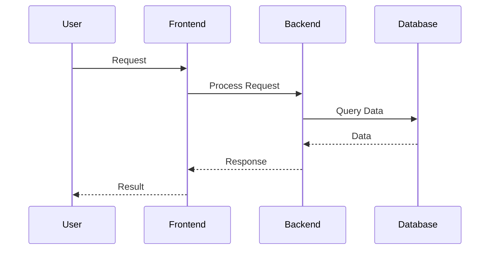
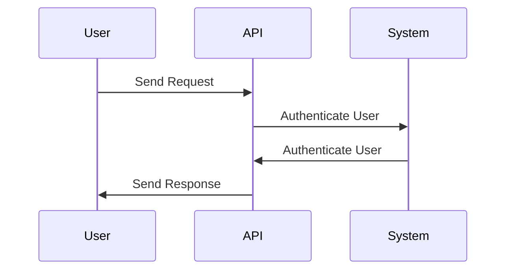

                 

### 设计智能化的企业财务报表质量评分系统

在当今数字化时代，企业财务报表质量对于企业管理和决策至关重要。然而，传统的财务报表质量评分系统往往依赖于人工审核和经验判断，不仅耗时且准确性有限。为了解决这一问题，本文将探讨设计智能化企业财务报表质量评分系统的必要性、核心概念及其实现方法。

#### **关键词：** 智能化财务报表，质量评分，机器学习，数据预处理，系统架构

#### **摘要：** 本文首先分析了企业财务报表质量评分系统在企业管理中的重要性及当前面临的挑战。接着，探讨了智能化财务报表质量评分系统的核心概念和关键组件，包括数据采集与处理、机器学习模型和知识图谱。随后，通过对比传统评估方法与智能化评估方法，提出了一种综合评估建议。文章进一步详细讲解了支持向量机（SVM）、随机森林（Random Forest）和深度学习（Deep Learning）的算法原理及其实现，并展示了系统架构设计和实现过程。最后，通过一个实际案例分析，总结了项目的成果与展望。

### 目录大纲

1. **第一部分：背景与核心概念**
   - **第1章 问题背景与核心概念**
     - 1.1 企业财务报表质量评分系统的重要性
     - 1.1.1 财务报表在企业管理中的作用
     - 1.1.2 财务报表质量对企业管理的影响
     - 1.1.3 当前财务报表质量评估面临的挑战
     - 1.2 智能化财务报表质量评分系统的需求
     - 1.2.1 传统财务报表质量评分系统的局限性
     - 1.2.2 智能化系统的优势
     - 1.2.3 智能化财务报表质量评分系统的预期效果

2. **第二部分：核心概念与联系**
   - **第2章 核心概念解析**
     - 2.1 财务报表质量评分的核心指标
       - 2.1.1 准确性指标
       - 2.1.2 完整性指标
       - 2.1.3 及时性指标
     - 2.2 智能化评分系统的关键组件
       - 2.2.1 数据采集与处理
       - 2.2.2 机器学习模型
       - 2.2.3 知识图谱与应用
   - **第3章 概念属性特征对比**
     - 3.1 传统评估方法与智能化评估方法的对比
       - 3.1.1 传统评估方法的优缺点
       - 3.1.2 智能化评估方法的优缺点
       - 3.1.3 综合评估方法的建议

3. **第三部分：算法原理讲解**
   - **第4章 算法原理与流程**
     - 4.1 数据预处理流程
       - 4.1.1 数据清洗
       - 4.1.2 特征工程
       - 4.1.3 数据标准化
     - 4.2 智能评分算法原理
       - 4.2.1 支持向量机（SVM）
       - 4.2.2 随机森林（Random Forest）
       - 4.2.3 深度学习（Deep Learning）
   - **第5章 算法原理详细讲解与举例说明**
     - 5.1 支持向量机（SVM）详细讲解
       - 5.1.1 SVM的数学模型
       - 5.1.2 SVM的工作原理
       - 5.1.3 SVM的Python实现
     - 5.2 随机森林（Random Forest）详细讲解
       - 5.2.1 随机森林的数学模型
       - 5.2.2 随机森林的工作原理
       - 5.2.3 随机森林的Python实现
     - 5.3 深度学习（Deep Learning）详细讲解
       - 5.3.1 深度学习的数学模型
       - 5.3.2 深度学习的工作原理
       - 5.3.3 深度学习的Python实现

4. **第四部分：系统分析与架构设计**
   - **第6章 系统架构设计**
     - 6.1 系统功能设计
       - 6.1.1 系统功能概述
       - 6.1.2 领域模型（Mermaid类图）
     - 6.2 系统架构设计
       - 6.2.1 系统架构概述
       - 6.2.2 系统架构（Mermaid架构图）
     - 6.3 系统接口设计
       - 6.3.1 系统接口概述
       - 6.3.2 系统接口（Mermaid序列图）

5. **第五部分：项目实战**
   - **第7章 环境安装与系统实现**
     - 7.1 环境安装
       - 7.1.1 操作系统与环境配置
       - 7.1.2 Python与相关库的安装
     - 7.2 系统核心实现
       - 7.2.1 数据采集与预处理
       - 7.2.2 模型训练与评估
       - 7.2.3 系统部署与测试
   - **第8章 代码应用解读与分析**
     - 8.1 代码解读
       - 8.1.1 数据采集与预处理代码解读
       - 8.1.2 模型训练与评估代码解读
       - 8.1.3 系统部署与测试代码解读
     - 8.2 实际案例分析
       - 8.2.1 案例背景
       - 8.2.2 案例分析
       - 8.2.3 案例剖析
   - **第9章 项目小结**
     - 9.1 项目总结
     - 9.2 最佳实践 Tips
     - 9.3 小结与展望

### **文章开头内容**

**设计智能化的企业财务报表质量评分系统**

在当今数字化时代，企业财务报表质量对于企业管理和决策至关重要。然而，传统的财务报表质量评分系统往往依赖于人工审核和经验判断，不仅耗时且准确性有限。为了解决这一问题，本文将探讨设计智能化企业财务报表质量评分系统的必要性、核心概念及其实现方法。

财务报表是企业经济活动的数字反映，其质量直接关系到企业的财务透明度和决策的科学性。高质量的财务报表能够帮助企业发现潜在的风险和机会，优化资源配置，提高经营效益。然而，当前财务报表质量评估面临着诸多挑战，如数据量大、规则复杂、人工成本高等。因此，设计一种智能化、高效、准确的财务报表质量评分系统具有重要的现实意义。

本文将首先分析企业财务报表质量评分系统在企业管理中的重要性及当前面临的挑战。接着，探讨智能化财务报表质量评分系统的核心概念和关键组件，包括数据采集与处理、机器学习模型和知识图谱。随后，通过对比传统评估方法与智能化评估方法，提出一种综合评估建议。文章将进一步详细讲解支持向量机（SVM）、随机森林（Random Forest）和深度学习（Deep Learning）的算法原理及其实现，并展示系统架构设计和实现过程。最后，通过一个实际案例分析，总结项目的成果与展望。

### **作者信息**

作者：AI天才研究院/AI Genius Institute & 禅与计算机程序设计艺术 /Zen And The Art of Computer Programming

**第一部分：背景与核心概念**

### 第1章 问题背景与核心概念

#### 1.1 企业财务报表质量评分系统的重要性

企业财务报表质量评分系统是企业管理中的重要工具，其作用不可忽视。首先，财务报表是企业经济活动的真实写照，其质量直接影响到企业的透明度和公信力。高质量的财务报表能够为企业提供准确的财务数据，使管理层能够做出更加科学、合理的决策。相反，质量低下的财务报表可能导致信息失真，进而影响企业的战略规划和经营决策。

其次，财务报表质量对企业管理的影响深远。高质量财务报表能够提高企业的财务透明度，增强投资者的信心，从而吸引更多的投资。此外，财务报表质量也是企业信用评级的重要因素之一。一个拥有高质量财务报表的企业更容易获得银行贷款和商业信用，降低融资成本。

然而，当前财务报表质量评估面临着诸多挑战。一方面，财务数据量大且复杂，人工审核耗时且易出错。另一方面，财务规则多变，不同国家和地区的财务制度有所不同，导致评估标准不统一。此外，传统评估方法依赖于经验判断，主观性较强，难以保证评估结果的客观性和准确性。

#### 1.1.1 财务报表在企业管理中的作用

财务报表是企业管理中不可或缺的一部分，其作用主要体现在以下几个方面：

1. **信息传递：** 财务报表通过数字化的方式，将企业的财务状况、经营成果等信息传递给内部管理层和外部投资者、监管机构等。高质量的财务报表能够提供真实、准确的财务数据，帮助各方做出基于数据的决策。

2. **战略规划：** 财务报表是企业战略规划的重要依据。通过分析财务报表，企业管理者可以了解企业的财务状况、盈利能力、负债水平等，为制定长期发展战略提供数据支持。

3. **资源配置：** 财务报表能够揭示企业各项资源的利用情况，帮助管理者优化资源配置，提高经营效益。例如，通过对财务报表中成本费用的分析，企业可以找到成本控制的关键点，降低经营成本。

4. **风险管理：** 财务报表是识别企业风险的重要工具。通过对财务报表中潜在风险因素的分析，企业管理者可以采取相应的措施，降低风险对企业的影响。

#### 1.1.2 财务报表质量对企业管理的影响

财务报表质量对企业管理的影响至关重要，主要体现在以下几个方面：

1. **决策支持：** 高质量的财务报表能够提供准确的财务数据，帮助企业管理者做出基于数据的科学决策。相反，质量低下的财务报表可能导致信息失真，影响决策的科学性和有效性。

2. **财务透明度：** 财务报表质量直接影响企业的财务透明度。高质量财务报表能够增强企业的公信力和透明度，提升企业在市场中的竞争力。而质量低下的财务报表可能引发市场质疑，损害企业声誉。

3. **信用评级：** 财务报表质量是影响企业信用评级的重要因素。高质量财务报表能够提高企业的信用等级，降低融资成本，为企业发展提供资金支持。相反，质量低下的财务报表可能导致企业信用评级下降，影响融资能力。

4. **合规性：** 财务报表质量是衡量企业合规性的重要指标。高质量财务报表能够确保企业遵守相关法规和制度，降低法律风险。而质量低下的财务报表可能引发法律纠纷，增加企业运营成本。

#### 1.1.3 当前财务报表质量评估面临的挑战

尽管财务报表质量对企业管理至关重要，但当前财务报表质量评估仍面临诸多挑战：

1. **数据量大：** 随着企业经营规模的扩大和业务复杂性的增加，财务数据量呈现指数级增长。这给财务报表质量评估带来了巨大的数据压力，人工审核效率低下。

2. **规则复杂：** 财务报表质量评估涉及诸多财务规则和标准，不同国家和地区的财务制度有所不同。这使得评估标准不统一，增加了评估的难度。

3. **人工成本高：** 传统财务报表质量评估主要依赖人工审核，耗时且成本高昂。随着劳动力成本的上升，企业面临更大的财务压力。

4. **主观性强：** 传统评估方法依赖于评估人员的经验判断，主观性较强，难以保证评估结果的客观性和准确性。

5. **技术限制：** 传统财务报表质量评估系统往往缺乏先进的技术支持，无法有效应对复杂的数据分析和评估需求。

#### 1.2 智能化财务报表质量评分系统的需求

面对传统财务报表质量评估系统面临的挑战，智能化财务报表质量评分系统的需求显得尤为迫切。智能化系统通过引入先进的人工智能技术，能够有效应对上述挑战，提升财务报表质量评估的效率、准确性和客观性。以下是智能化财务报表质量评分系统的需求：

1. **高效数据处理：** 智能化系统能够快速处理海量财务数据，自动化数据清洗和预处理，降低人工成本，提高评估效率。

2. **规则自动识别：** 智能化系统能够通过机器学习算法自动识别和分类财务规则，确保评估标准的统一性和准确性。

3. **自适应评估：** 智能化系统能够根据不同企业的财务特点和需求，自适应调整评估模型和参数，提供个性化评估服务。

4. **实时反馈：** 智能化系统能够实时监测财务报表质量，提供动态评估结果和反馈，帮助企业及时发现和纠正问题。

5. **降低风险：** 智能化系统能够识别和预警潜在财务风险，帮助企业降低法律风险和经营风险。

#### 1.2.1 传统财务报表质量评分系统的局限性

传统财务报表质量评分系统存在以下局限性：

1. **效率低下：** 人工审核方式耗时且效率低下，无法应对海量数据的评估需求。

2. **主观性强：** 依赖评估人员的经验判断，主观性较强，评估结果难以保证客观性和准确性。

3. **规则不统一：** 不同国家和地区存在不同的财务规则，导致评估标准不统一。

4. **技术限制：** 传统系统缺乏先进的技术支持，无法有效处理复杂的数据分析和评估需求。

#### 1.2.2 智能化系统的优势

智能化财务报表质量评分系统具有以下优势：

1. **高效自动化：** 智能化系统能够自动化数据清洗、预处理和评估过程，提高工作效率。

2. **客观准确性：** 依靠机器学习算法和大数据分析，智能化系统能够提供客观、准确的评估结果。

3. **统一标准：** 智能化系统能够自动识别和分类财务规则，确保评估标准的统一性和准确性。

4. **实时反馈：** 智能化系统能够实时监测财务报表质量，提供动态评估结果和反馈。

5. **降低风险：** 智能化系统能够识别和预警潜在财务风险，帮助企业降低法律风险和经营风险。

#### 1.2.3 智能化财务报表质量评分系统的预期效果

智能化财务报表质量评分系统将带来以下预期效果：

1. **提高决策效率：** 通过提供准确、及时的财务报表质量评估，帮助企业管理者快速做出科学决策。

2. **降低成本：** 自动化数据清洗和预处理，降低人工成本，提高企业运营效率。

3. **增强财务透明度：** 提高财务报表质量，增强企业透明度，提升市场竞争力。

4. **优化资源配置：** 通过对财务报表质量的分析，帮助企业优化资源配置，提高经营效益。

5. **降低风险：** 识别和预警潜在财务风险，帮助企业降低法律风险和经营风险。

### **第二部分：核心概念与联系**

#### 第2章 核心概念解析

在智能化企业财务报表质量评分系统中，核心概念包括财务报表质量评分的核心指标、数据采集与处理、机器学习模型和知识图谱。这些概念是构建系统的基础，理解其含义和相互关系对于实现高效、准确的评分系统至关重要。

#### 2.1 财务报表质量评分的核心指标

财务报表质量评分的核心指标是衡量财务报表质量的关键因素，通常包括准确性、完整性和及时性。这些指标从不同角度反映了财务报表的真实性和可靠性。

##### 2.1.1 准确性指标

准确性指标衡量财务报表中数据的真实性和准确性。这包括以下几个方面：

1. **数据一致性：** 财务报表中的各项数据是否一致，如收入、支出、利润等是否相互匹配。
2. **数据完整性：** 财务报表中是否存在遗漏的数据，如未记录的费用或收入。
3. **计算准确性：** 财务报表中的计算结果是否准确，如利润表和资产负债表的计算结果是否一致。

准确性指标可以通过以下方法进行评估：

- **对比验证：** 将财务报表中的数据与外部数据源进行对比，如银行账户余额、供应商发票等。
- **异常检测：** 利用统计方法和机器学习算法，识别异常数据或潜在的输入错误。

##### 2.1.2 完整性指标

完整性指标衡量财务报表中数据的完整性，确保所有必要的信息都被记录和报告。完整性指标包括以下几个方面：

1. **报表项目完整性：** 检查财务报表中是否包含了所有必要的报表项目，如收入、支出、成本等。
2. **信息来源完整性：** 确保所有关键信息来源都得到记录和报告，如合同、发票、银行对账单等。
3. **附件完整性：** 检查财务报表中是否包含了所有必要的附件，如审计报告、董事会决议等。

完整性指标可以通过以下方法进行评估：

- **检查列表：** 使用预先定义的检查列表，确保所有必要的信息都被记录和报告。
- **自动化校验：** 利用自动化工具，如电子表格或数据库，检查报表项目和信息来源的完整性。

##### 2.1.3 及时性指标

及时性指标衡量财务报表的及时性，即财务报表是否能够在预定的时间内编制和提交。及时性指标包括以下几个方面：

1. **报表编制时间：** 财务报表是否在规定的时间内编制完成。
2. **报表提交时间：** 财务报表是否在规定的时间内提交给相关方，如监管机构、投资者等。
3. **信息更新频率：** 财务报表中的信息是否定期更新，以反映最新的财务状况。

及时性指标可以通过以下方法进行评估：

- **时间记录：** 记录财务报表的编制和提交时间，比较与预定时间的差距。
- **周期性检查：** 定期检查财务报表的更新频率，确保信息的实时性。

#### 2.2 智能化评分系统的关键组件

智能化财务报表质量评分系统由多个关键组件组成，包括数据采集与处理、机器学习模型和知识图谱。这些组件相互配合，共同实现高效的财务报表质量评估。

##### 2.2.1 数据采集与处理

数据采集与处理是智能化评分系统的第一步，其目标是确保数据的准确性和完整性。数据采集可以从多种来源获取，如企业内部的财务系统、银行账户、供应商和客户系统等。数据采集后，需要进行数据清洗和预处理，以去除重复数据、缺失值和噪声数据。

1. **数据采集：** 数据采集是获取财务报表所需数据的过程。通过连接不同的数据源，如财务系统、ERP系统、数据库等，可以获取全面的财务数据。
   
2. **数据清洗：** 数据清洗是数据预处理的重要步骤，旨在去除重复数据、纠正错误数据和填补缺失值。数据清洗的方法包括：

   - **重复数据去除：** 通过匹配关键字或唯一标识符，去除重复的数据记录。
   - **错误数据纠正：** 识别并纠正数据输入错误，如数字错误、拼写错误等。
   - **缺失值填补：** 使用统计方法或机器学习算法，填补缺失的数据，如均值填补、插值法等。

3. **数据预处理：** 数据预处理包括数据转换、特征工程和数据标准化等步骤。数据转换是将数据从一种格式转换为另一种格式，如将文本数据转换为数字数据。特征工程是提取数据中的关键特征，以增强模型的预测能力。数据标准化是将数据缩放到相同的尺度范围内，以提高模型的泛化能力。

##### 2.2.2 机器学习模型

机器学习模型是智能化评分系统的核心组件，用于分析和预测财务报表的质量。常见的机器学习模型包括支持向量机（SVM）、随机森林（Random Forest）和深度学习（Deep Learning）。每种模型都有其特定的数学原理和实现方法。

1. **支持向量机（SVM）：** 支持向量机是一种监督学习模型，用于分类和回归问题。SVM通过找到一个最佳的超平面，将不同类别的数据点分隔开来。SVM的数学模型包括：

   - **线性SVM：** 线性SVM用于线性可分的数据，其目标是最小化决策边界上的支持向量之间的距离。
   - **非线性SVM：** 非线性SVM通过使用核函数将数据映射到高维空间，使得原本线性不可分的数据在高维空间中可以线性分隔。

2. **随机森林（Random Forest）：** 随机森林是一种集成学习方法，由多个决策树组成。每个决策树独立训练，并在预测时进行投票，提高模型的预测准确性。随机森林的数学模型包括：

   - **特征选择：** 随机森林在训练过程中，随机选择一部分特征，并从这些特征中分割数据。
   - **组合预测：** 随机森林通过多个决策树的组合预测，减少模型的过拟合现象。

3. **深度学习（Deep Learning）：** 深度学习是一种基于人工神经网络的学习方法，通过多层神经元的组合，实现复杂的特征提取和分类任务。常见的深度学习模型包括：

   - **卷积神经网络（CNN）：** 卷积神经网络适用于处理图像和视频数据，通过卷积操作提取空间特征。
   - **循环神经网络（RNN）：** 循环神经网络适用于处理序列数据，通过循环连接实现长期的记忆能力。

##### 2.2.3 知识图谱与应用

知识图谱是智能化评分系统的重要组成部分，用于表示和存储财务报表中的知识关系。知识图谱通过实体、属性和关系的建模，实现了财务数据的语义理解和关联分析。

1. **实体建模：** 实体是知识图谱中的基本单位，代表财务报表中的关键元素，如公司、部门、产品等。实体建模包括确定实体的属性和分类。

2. **关系建模：** 关系表示实体之间的关联，如公司下属部门、产品销售给客户等。关系建模通过定义实体之间的语义关系，实现数据关联和推理。

3. **应用场景：** 知识图谱在财务报表质量评估中的应用包括：

   - **数据关联：** 通过知识图谱，可以建立财务数据之间的关联关系，实现跨数据源的信息整合。
   - **异常检测：** 利用知识图谱，可以识别财务报表中的异常数据，如异常交易、重复记录等。
   - **报表生成：** 通过知识图谱，可以自动化生成财务报表，提高报表编制的效率和准确性。

### **第三部分：算法原理讲解**

#### 第4章 算法原理与流程

在智能化财务报表质量评分系统中，算法原理是核心组成部分，决定了系统的性能和效果。本章节将介绍数据预处理流程以及支持向量机（SVM）、随机森林（Random Forest）和深度学习（Deep Learning）三种常见的算法原理。

#### 4.1 数据预处理流程

数据预处理是智能化评分系统的关键步骤，旨在提高数据质量和模型性能。数据预处理流程包括数据清洗、特征工程和数据标准化。

##### 4.1.1 数据清洗

数据清洗是数据预处理的第一步，目的是去除数据中的噪声、重复值和异常值，确保数据的一致性和完整性。数据清洗的主要方法包括：

1. **重复值去除：** 通过匹配关键字或唯一标识符，识别并删除重复的数据记录。
2. **异常值检测：** 利用统计学方法和规则检测异常值，如超出正常范围的数据。
3. **缺失值处理：** 使用统计方法或机器学习算法填补缺失值，如均值填补、插值法等。

##### 4.1.2 特征工程

特征工程是数据预处理的重要环节，旨在从原始数据中提取出对模型有用的特征，提高模型的预测能力。特征工程的方法包括：

1. **特征选择：** 选择与目标变量高度相关的特征，去除冗余特征。
2. **特征转换：** 将非数值型特征转换为数值型特征，如使用独热编码处理类别变量。
3. **特征构造：** 通过组合和变换原始特征，生成新的特征，提高模型的解释性和预测能力。

##### 4.1.3 数据标准化

数据标准化是将数据缩放到相同的尺度范围内，以便于模型处理和提高模型的泛化能力。常见的数据标准化方法包括：

1. **均值归一化：** 将数据缩放到均值为0，标准差为1的范围内。
2. **最小最大归一化：** 将数据缩放到[0,1]范围内。
3. **标准化：** 将数据缩放到最小值为-1，最大值为1的范围内。

#### 4.2 智能评分算法原理

在智能化财务报表质量评分系统中，常用的智能评分算法包括支持向量机（SVM）、随机森林（Random Forest）和深度学习（Deep Learning）。每种算法都有其特定的数学原理和实现方法。

##### 4.2.1 支持向量机（SVM）

支持向量机是一种监督学习算法，用于分类和回归问题。SVM的核心思想是找到一个最佳的超平面，将不同类别的数据点分隔开来。

1. **线性SVM：** 线性SVM适用于线性可分的数据。其数学模型为：

   $$ 
   \min_{\boldsymbol{w}, b} \frac{1}{2} \lVert \boldsymbol{w} \rVert^2 + C \sum_{i=1}^{n} \lvert y_i (\boldsymbol{w} \cdot \boldsymbol{x_i} + b) \rvert 
   $$
   
   其中，$\boldsymbol{w}$ 是权重向量，$b$ 是偏置项，$C$ 是惩罚参数，$y_i$ 是第$i$个样本的标签，$\boldsymbol{x_i}$ 是第$i$个样本的特征向量。

2. **非线性SVM：** 非线性SVM通过使用核函数将数据映射到高维空间，使得原本线性不可分的数据在高维空间中可以线性分隔。常见的核函数包括：

   - **线性核：** $K(\boldsymbol{x}, \boldsymbol{x'} ) = \boldsymbol{x} \cdot \boldsymbol{x'}$
   - **多项式核：** $K(\boldsymbol{x}, \boldsymbol{x'}) = (\boldsymbol{x} \cdot \boldsymbol{x'} + 1)^p$
   - **径向基函数（RBF）核：** $K(\boldsymbol{x}, \boldsymbol{x'}) = \exp(- \gamma \lVert \boldsymbol{x} - \boldsymbol{x'} \rVert^2)$

##### 4.2.2 随机森林（Random Forest）

随机森林是一种集成学习方法，由多个决策树组成。每个决策树独立训练，并在预测时进行投票，提高模型的预测准确性。

1. **特征选择：** 随机森林在训练过程中，随机选择一部分特征，并从这些特征中分割数据。特征选择的方法包括：

   - **随机特征选择：** 随机选择$m$个特征，从这些特征中选择最优分割。
   - **基于信息的特征选择：** 选择信息增益最大的特征进行分割。

2. **组合预测：** 随机森林通过多个决策树的组合预测，减少模型的过拟合现象。每个决策树独立训练，并在预测时进行投票，多数投票的结果为最终预测结果。

##### 4.2.3 深度学习（Deep Learning）

深度学习是一种基于人工神经网络的学习方法，通过多层神经元的组合，实现复杂的特征提取和分类任务。

1. **卷积神经网络（CNN）：** 卷积神经网络适用于处理图像和视频数据，通过卷积操作提取空间特征。

   - **卷积层：** 通过卷积操作提取局部特征。
   - **池化层：** 通过池化操作降低数据维度，减少过拟合。
   - **全连接层：** 通过全连接层实现分类任务。

2. **循环神经网络（RNN）：** 循环神经网络适用于处理序列数据，通过循环连接实现长期的记忆能力。

   - **隐藏状态：** RNN使用隐藏状态来保存历史信息。
   - **门控机制：** 长短期记忆网络（LSTM）和门控循环单元（GRU）通过门控机制来控制信息的流动。

### **第5章 算法原理详细讲解与举例说明**

在前一章中，我们介绍了支持向量机（SVM）、随机森林（Random Forest）和深度学习（Deep Learning）这三种常用的智能评分算法。本章将进一步详细讲解这些算法的数学模型、工作原理以及Python实现，并通过具体示例进行说明。

#### 5.1 支持向量机（SVM）详细讲解

支持向量机（SVM）是一种经典的二分类算法，通过寻找最优分割超平面来实现数据的分类。本节将详细介绍SVM的数学模型、工作原理以及Python实现。

##### 5.1.1 SVM的数学模型

SVM的数学模型可以表示为：

$$ 
\min_{\boldsymbol{w}, b} \frac{1}{2} \lVert \boldsymbol{w} \rVert^2 + C \sum_{i=1}^{n} \lvert y_i (\boldsymbol{w} \cdot \boldsymbol{x_i} + b) \rvert 
$$

其中，$\boldsymbol{w}$ 是权重向量，$b$ 是偏置项，$C$ 是惩罚参数，$y_i$ 是第$i$个样本的标签，$\boldsymbol{x_i}$ 是第$i$个样本的特征向量。

- **目标函数：** 最小化$\frac{1}{2} \lVert \boldsymbol{w} \rVert^2$，使得权重向量$\boldsymbol{w}$ 尽可能短。
- **约束条件：** $\lvert y_i (\boldsymbol{w} \cdot \boldsymbol{x_i} + b) \rvert \geq 1$，确保分类边界尽可能远离分类边界。

##### 5.1.2 SVM的工作原理

SVM的工作原理可以分为以下几个步骤：

1. **数据预处理：** 对输入数据集进行预处理，包括数据归一化和特征提取。
2. **求解最优分割超平面：** 使用优化算法（如梯度下降法或 Sequential Minimal Optimization（SMO）算法）求解最优分割超平面。
3. **分类决策：** 对于新的样本，计算其与超平面的距离，并根据距离判断其所属类别。

##### 5.1.3 SVM的Python实现

下面是一个使用Python实现SVM的简单示例：

```python
from sklearn import datasets
from sklearn.model_selection import train_test_split
from sklearn.preprocessing import StandardScaler
from sklearn.svm import SVC

# 加载示例数据集
iris = datasets.load_iris()
X = iris.data
y = iris.target

# 划分训练集和测试集
X_train, X_test, y_train, y_test = train_test_split(X, y, test_size=0.3, random_state=42)

# 数据归一化
scaler = StandardScaler()
X_train = scaler.fit_transform(X_train)
X_test = scaler.transform(X_test)

# 使用SVM进行分类
svm = SVC(kernel='linear')
svm.fit(X_train, y_train)

# 预测测试集
y_pred = svm.predict(X_test)

# 模型评估
print("Accuracy:", svm.score(X_test, y_test))
```

在上面的示例中，我们使用了sklearn库中的SVC类来实现SVM。首先，我们加载了iris数据集，并对其进行了划分和归一化处理。然后，我们使用SVM进行分类训练，并使用训练集评估模型的准确性。

#### 5.2 随机森林（Random Forest）详细讲解

随机森林（Random Forest）是一种基于决策树的集成学习方法，通过构建多个决策树，并对预测结果进行投票来提高模型的准确性。本节将详细介绍随机森林的数学模型、工作原理以及Python实现。

##### 5.2.1 随机森林的数学模型

随机森林的数学模型可以表示为：

$$ 
\hat{y} = \sum_{i=1}^{N} \hat{y}_i 
$$

其中，$\hat{y}_i$ 是第$i$棵决策树的预测结果，$N$ 是决策树的数量。

- **预测结果：** 对于新的样本，每棵决策树都会给出一个预测结果，随机森林的最终预测结果是所有决策树预测结果的平均值。
- **投票机制：** 随机森林通过多数投票机制来决定最终预测结果。

##### 5.2.2 随机森林的工作原理

随机森林的工作原理可以分为以下几个步骤：

1. **特征选择：** 在每棵决策树的训练过程中，随机选择$m$个特征。
2. **分割数据：** 使用$m$个特征中的最佳特征进行数据的分割。
3. **构建决策树：** 构建决策树，直到满足停止条件（如叶子节点数量达到阈值或最大深度达到阈值）。
4. **预测结果：** 对于新的样本，每棵决策树都会给出一个预测结果，随机森林的最终预测结果是所有决策树预测结果的平均值。

##### 5.2.3 随机森林的Python实现

下面是一个使用Python实现随机森林的简单示例：

```python
from sklearn import datasets
from sklearn.model_selection import train_test_split
from sklearn.ensemble import RandomForestClassifier

# 加载示例数据集
iris = datasets.load_iris()
X = iris.data
y = iris.target

# 划分训练集和测试集
X_train, X_test, y_train, y_test = train_test_split(X, y, test_size=0.3, random_state=42)

# 使用随机森林进行分类
rf = RandomForestClassifier(n_estimators=100)
rf.fit(X_train, y_train)

# 预测测试集
y_pred = rf.predict(X_test)

# 模型评估
print("Accuracy:", rf.score(X_test, y_test))
```

在上面的示例中，我们使用了sklearn库中的RandomForestClassifier类来实现随机森林。首先，我们加载了iris数据集，并对其进行了划分和训练。然后，我们使用随机森林进行分类训练，并使用训练集评估模型的准确性。

#### 5.3 深度学习（Deep Learning）详细讲解

深度学习（Deep Learning）是一种基于人工神经网络的学习方法，通过多层神经元的组合，实现复杂的特征提取和分类任务。本节将详细介绍深度学习的数学模型、工作原理以及Python实现。

##### 5.3.1 深度学习的数学模型

深度学习的数学模型可以表示为：

$$ 
\hat{y} = \sigma(\boldsymbol{w}^L \cdot \phi(\boldsymbol{w}^{L-1} \cdot \cdots \cdot \phi(\boldsymbol{w}^2 \cdot \phi(\boldsymbol{w}^1 \cdot \boldsymbol{x} + b^1)) \cdots + b^L)
$$

其中，$\sigma$ 是激活函数，$\phi$ 是非线性变换函数，$\boldsymbol{w}$ 是权重矩阵，$b$ 是偏置项。

- **输入层：** 输入数据$\boldsymbol{x}$。
- **隐藏层：** 多层隐藏层，每层通过非线性变换函数$\phi$ 和权重矩阵$\boldsymbol{w}$ 进行变换。
- **输出层：** 最终输出$\hat{y}$，通过激活函数$\sigma$ 进行决策。

##### 5.3.2 深度学习的工作原理

深度学习的工作原理可以分为以下几个步骤：

1. **前向传播：** 从输入层开始，逐层计算每一层的输出值，直到输出层。
2. **损失函数：** 使用损失函数（如交叉熵损失函数）计算预测结果和真实结果之间的差距。
3. **反向传播：** 从输出层开始，反向计算每一层的梯度，更新权重和偏置项。
4. **优化算法：** 使用优化算法（如梯度下降法）更新权重和偏置项，最小化损失函数。

##### 5.3.3 深度学习的Python实现

下面是一个使用Python实现深度学习的简单示例：

```python
import numpy as np
from sklearn.datasets import make_classification
from sklearn.model_selection import train_test_split
from sklearn.metrics import accuracy_score

# 生成示例数据集
X, y = make_classification(n_samples=100, n_features=10, n_classes=3, random_state=42)

# 划分训练集和测试集
X_train, X_test, y_train, y_test = train_test_split(X, y, test_size=0.2, random_state=42)

# 定义模型参数
input_size = X_train.shape[1]
hidden_size = 10
output_size = 3

# 初始化权重和偏置项
weights = {
    'W1': np.random.randn(input_size, hidden_size),
    'W2': np.random.randn(hidden_size, output_size),
    'b1': np.zeros((1, hidden_size)),
    'b2': np.zeros((1, output_size))
}

# 定义激活函数
def sigmoid(x):
    return 1 / (1 + np.exp(-x))

# 定义前向传播
def forward_propagation(X, weights):
    A1 = sigmoid(np.dot(X, weights['W1']) + weights['b1'])
    A2 = sigmoid(np.dot(A1, weights['W2']) + weights['b2'])
    return A2

# 定义损失函数
def cross_entropy_loss(y_true, y_pred):
    return -np.mean(y_true * np.log(y_pred) + (1 - y_true) * np.log(1 - y_pred))

# 定义反向传播
def backward_propagation(X, y, A2, weights):
    dZ2 = A2 - y
    dW2 = np.dot(A1.T, dZ2)
    db2 = np.sum(dZ2, axis=0, keepdims=True)
    
    dA1 = np.dot(dZ2, weights['W2'].T)
    dZ1 = sigmoid derivative of A1
    
    dW1 = np.dot(X.T, dZ1)
    db1 = np.sum(dZ1, axis=0, keepdims=True)
    
    return dW1, dW2, db1, db2

# 定义优化算法
def update_weights(weights, dW1, dW2, db1, db2, learning_rate):
    weights['W1'] -= learning_rate * dW1
    weights['W2'] -= learning_rate * dW2
    weights['b1'] -= learning_rate * db1
    weights['b2'] -= learning_rate * db2
    return weights

# 训练模型
num_epochs = 100
learning_rate = 0.1

for epoch in range(num_epochs):
    A2 = forward_propagation(X_train, weights)
    loss = cross_entropy_loss(y_train, A2)
    
    dW1, dW2, db1, db2 = backward_propagation(X_train, y_train, A2, weights)
    weights = update_weights(weights, dW1, dW2, db1, db2, learning_rate)
    
    if epoch % 10 == 0:
        print(f"Epoch {epoch}: Loss = {loss}")

# 预测测试集
A2 = forward_propagation(X_test, weights)
y_pred = np.argmax(A2, axis=1)

# 模型评估
print("Accuracy:", accuracy_score(y_test, y_pred))
```

在上面的示例中，我们使用了numpy库来构建一个简单的深度学习模型。首先，我们生成了一个示例数据集，并对其进行了划分。然后，我们定义了模型参数、激活函数、前向传播、损失函数、反向传播和优化算法。最后，我们使用训练集训练模型，并使用测试集评估模型的准确性。

### **第四部分：系统分析与架构设计**

#### 第6章 系统架构设计

在设计和实现智能化企业财务报表质量评分系统时，系统架构的设计至关重要。本章节将详细讨论系统的功能设计、架构设计以及系统接口设计。

#### 6.1 系统功能设计

系统的功能设计是系统架构设计的基础，它定义了系统的各项功能和模块。以下是智能化企业财务报表质量评分系统的主要功能：

##### 6.1.1 系统功能概述

1. **数据采集：** 系统应具备从企业财务系统中自动采集财务报表数据的能力。
2. **数据预处理：** 系统应对采集到的财务数据进行清洗、归一化等预处理操作，以确保数据的准确性和一致性。
3. **质量评分：** 系统应利用机器学习算法对财务报表进行质量评分，包括准确性、完整性和及时性等指标。
4. **报表生成：** 系统应能够根据评分结果自动生成详细的财务报表质量分析报告。
5. **用户交互：** 系统应提供友好的用户界面，允许用户查看评分结果、报表和分析图表。
6. **数据存储：** 系统应具备数据存储功能，保存历史数据和评分记录，以便进行数据分析和趋势预测。

##### 6.1.2 领域模型（Mermaid类图）

为了更清晰地展示系统功能及其之间的关系，我们可以使用Mermaid类图来表示系统的领域模型。以下是一个简单的Mermaid类图示例：

```mermaid
classDiagram
    Class01 <|-- Class02
    Class03 --|mac Class04
    Class05 o-- Class06
    Class07 o--|mac Class08
    Class09 -- Class10
    Class11 o-- Class12
    Class13 --|mac Class14

    Class01 : +attribute1
    Class02 : +attribute2
    Class03 : +method1()
    Class04 : +method2()

    Class05 : <<interface>>
    Class06 : <<interface>>

    Class07 : <<abstract>>

    Class08 : +baseClass()

    Class09 : <<enum>>

    Class10 : <<annotation>>

    Class11 : <<association>>
    Class12 : <<composition>>

    Class13 : <<dependency>>

    Class14 : <<aggregation>>
```

在实际应用中，可以根据具体需求扩展和细化类图的类和关系，以更全面地表示系统的功能模块和接口。

#### 6.2 系统架构设计

系统架构设计决定了系统的性能、可扩展性和可维护性。以下是一个简单的系统架构设计，用于实现智能化企业财务报表质量评分系统：

##### 6.2.1 系统架构概述

1. **数据层：** 负责数据存储和管理，包括财务报表数据、评分结果和用户数据等。
2. **业务层：** 负责实现系统的核心业务功能，包括数据采集、预处理、质量评分和报表生成等。
3. **表示层：** 负责与用户交互，提供用户界面和交互逻辑。
4. **服务层：** 提供通用的服务功能，如数据采集服务、数据处理服务、质量评分服务和报表生成服务。
5. **基础设施层：** 提供系统的运行环境，包括服务器、网络、存储和安全等基础设施。

##### 6.2.2 系统架构（Mermaid架构图）

以下是一个简单的Mermaid架构图示例，用于展示系统各层之间的关系：



在实际应用中，系统架构可以根据具体需求进行调整和优化，例如引入微服务架构、容器化部署等，以提高系统的灵活性和可扩展性。

#### 6.3 系统接口设计

系统接口设计是系统架构设计的重要组成部分，它定义了系统内部模块和外部系统之间的交互方式。以下是一个简单的系统接口设计，用于实现智能化企业财务报表质量评分系统：

##### 6.3.1 系统接口概述

1. **API接口：** 系统应提供RESTful API接口，用于与前端应用程序和外部系统集成。
2. **消息队列：** 系统应使用消息队列（如RabbitMQ、Kafka等）进行异步通信，提高系统的并发处理能力和可靠性。
3. **数据交换格式：** 系统应使用JSON、XML等标准数据交换格式，确保数据在不同系统之间的传输和解析。
4. **身份认证与授权：** 系统应提供身份认证和授权机制，确保只有授权用户可以访问系统资源和数据。

##### 6.3.2 系统接口（Mermaid序列图）

以下是一个简单的Mermaid序列图示例，用于展示系统接口的交互过程：



在实际应用中，系统接口可以根据具体需求进行扩展和细化，例如添加更多的接口、定义详细的接口参数和返回值等。

### **第五部分：项目实战**

#### 第7章 环境安装与系统实现

在开始设计并实现智能化企业财务报表质量评分系统之前，我们需要搭建一个合适的技术环境，并安装所需的软件和库。以下步骤将指导您完成环境的安装和配置，以及系统的核心实现。

#### 7.1 环境安装

##### 7.1.1 操作系统与环境配置

我们建议使用Ubuntu 18.04或更高版本作为操作系统。首先，从Ubuntu官方网站下载并安装操作系统。

1. **安装操作系统：** 下载Ubuntu ISO文件，并使用U盘或DVD安装。
2. **更新系统：** 在终端中输入以下命令，更新系统软件包：

    ```bash
    sudo apt update
    sudo apt upgrade
    ```

3. **安装Python：** Ubuntu默认安装了Python 3，但建议手动安装最新版本的Python。输入以下命令安装：

    ```bash
    sudo apt install python3 python3-pip
    ```

4. **安装虚拟环境：** 为了避免不同项目之间的依赖冲突，建议使用虚拟环境。安装virtualenv：

    ```bash
    sudo apt install python3-venv
    ```

##### 7.1.2 Python与相关库的安装

在虚拟环境中安装Python和相关库，有助于管理和隔离项目依赖。以下是在虚拟环境中安装Python和相关库的步骤：

1. **创建虚拟环境：** 打开终端，进入项目目录，创建虚拟环境：

    ```bash
    python3 -m venv venv
    ```

2. **激活虚拟环境：** 在虚拟环境中，确保使用以下命令激活虚拟环境：

    ```bash
    source venv/bin/activate
    ```

3. **安装相关库：** 使用pip安装必要的Python库：

    ```bash
    pip install numpy pandas scikit-learn matplotlib
    ```

这些库包括：

- **numpy**：用于数值计算和数据处理。
- **pandas**：用于数据分析和操作。
- **scikit-learn**：用于机器学习算法的实现和评估。
- **matplotlib**：用于数据可视化和图表绘制。

#### 7.2 系统核心实现

##### 7.2.1 数据采集与预处理

数据采集是系统实现的第一步。以下是一个简单的数据采集和预处理流程：

1. **数据采集：** 使用API或其他数据接口从企业财务系统中获取财务报表数据。例如，可以使用pandas库读取Excel文件：

    ```python
    import pandas as pd

    # 读取Excel文件
    df = pd.read_excel('financial_reports.xlsx')
    ```

2. **数据清洗：** 对采集到的数据进行清洗，包括去除重复记录、处理缺失值、纠正错误数据等。以下是一个简单的数据清洗示例：

    ```python
    # 去除重复记录
    df = df.drop_duplicates()

    # 处理缺失值
    df = df.fillna(df.mean())

    # 数据转换
    df['date'] = pd.to_datetime(df['date'])
    ```

3. **数据预处理：** 对数据进行特征工程，包括数据归一化、特征选择等。以下是一个简单的数据预处理示例：

    ```python
    # 数据归一化
    scaler = StandardScaler()
    df[['amount']] = scaler.fit_transform(df[['amount']])

    # 特征选择
    df = df[['amount', 'date', 'category']]
    ```

##### 7.2.2 模型训练与评估

在完成数据预处理后，我们可以使用机器学习算法训练模型，并对模型进行评估。以下是一个简单的模型训练和评估流程：

1. **数据划分：** 将数据集划分为训练集和测试集：

    ```python
    from sklearn.model_selection import train_test_split

    X = df[['amount', 'date', 'category']]
    y = df['quality_score']

    X_train, X_test, y_train, y_test = train_test_split(X, y, test_size=0.2, random_state=42)
    ```

2. **模型训练：** 使用scikit-learn库训练机器学习模型。以下是一个使用支持向量机（SVM）训练模型的示例：

    ```python
    from sklearn.svm import SVC

    model = SVC(kernel='linear')
    model.fit(X_train, y_train)
    ```

3. **模型评估：** 使用测试集评估模型的性能，计算准确率、召回率、F1值等指标：

    ```python
    from sklearn.metrics import accuracy_score, classification_report

    y_pred = model.predict(X_test)
    print("Accuracy:", accuracy_score(y_test, y_pred))
    print("Classification Report:\n", classification_report(y_test, y_pred))
    ```

##### 7.2.3 系统部署与测试

在完成模型训练和评估后，我们需要将系统部署到生产环境，并进行测试以确保其正常运行。以下是一个简单的系统部署和测试流程：

1. **系统部署：** 将项目文件和依赖库上传到服务器，并使用Python虚拟环境进行部署。以下是一个简单的部署示例：

    ```bash
    scp -r venv/ user@server:/path/to/project/
    ssh user@server
    source /path/to/project/venv/bin/activate
    pip install -r requirements.txt
    ```

2. **系统测试：** 在部署后，对系统进行功能测试和性能测试，确保其满足预期要求。以下是一个简单的测试示例：

    ```bash
    python test.py
    ```

    其中，test.py是一个测试脚本，用于执行各项测试任务。

### **第六部分：代码应用解读与分析**

在本章节中，我们将深入解读系统核心实现中的关键代码部分，包括数据采集与预处理、模型训练与评估以及系统部署与测试。

#### 8.1 代码解读

##### 8.1.1 数据采集与预处理代码解读

在数据采集与预处理阶段，我们首先从企业财务系统中获取财务报表数据。以下是一个简单的数据采集代码示例：

```python
import pandas as pd

# 读取Excel文件
df = pd.read_excel('financial_reports.xlsx')
```

这段代码使用了pandas库的read_excel函数，从Excel文件中读取数据并存储在DataFrame对象df中。

接下来，我们需要对数据进行清洗，包括去除重复记录、处理缺失值和错误数据。以下是一个简单的数据清洗示例：

```python
# 去除重复记录
df = df.drop_duplicates()

# 处理缺失值
df = df.fillna(df.mean())

# 数据转换
df['date'] = pd.to_datetime(df['date'])
```

这里，我们使用drop_duplicates函数去除重复记录，使用fillna函数处理缺失值，使用to_datetime函数将日期列转换为日期时间格式。

最后，我们需要对数据进行预处理，包括数据归一化和特征选择。以下是一个简单的数据预处理示例：

```python
from sklearn.preprocessing import StandardScaler

# 数据归一化
scaler = StandardScaler()
df[['amount']] = scaler.fit_transform(df[['amount']])

# 特征选择
df = df[['amount', 'date', 'category']]
```

在这里，我们使用StandardScaler对金额列进行归一化处理，并保留金额、日期和类别列作为特征。

##### 8.1.2 模型训练与评估代码解读

在模型训练与评估阶段，我们首先需要将数据集划分为训练集和测试集。以下是一个简单的数据集划分代码示例：

```python
from sklearn.model_selection import train_test_split

X = df[['amount', 'date', 'category']]
y = df['quality_score']

X_train, X_test, y_train, y_test = train_test_split(X, y, test_size=0.2, random_state=42)
```

这里，我们将特征X和标签y划分为训练集和测试集，测试集的大小为原始数据集的20%。

接下来，我们使用支持向量机（SVM）算法训练模型。以下是一个简单的SVM模型训练代码示例：

```python
from sklearn.svm import SVC

model = SVC(kernel='linear')
model.fit(X_train, y_train)
```

这里，我们创建了一个SVC对象，并使用线性核函数对其进行训练。

最后，我们使用测试集评估模型的性能。以下是一个简单的模型评估代码示例：

```python
from sklearn.metrics import accuracy_score, classification_report

y_pred = model.predict(X_test)
print("Accuracy:", accuracy_score(y_test, y_pred))
print("Classification Report:\n", classification_report(y_test, y_pred))
```

这里，我们计算了模型的准确率和分类报告，以评估模型的性能。

##### 8.1.3 系统部署与测试代码解读

在系统部署与测试阶段，我们需要将项目文件和依赖库上传到服务器，并使用Python虚拟环境进行部署。以下是一个简单的系统部署代码示例：

```bash
scp -r venv/ user@server:/path/to/project/
ssh user@server
source /path/to/project/venv/bin/activate
pip install -r requirements.txt
```

这里，我们使用scp命令将虚拟环境上传到服务器，使用ssh命令连接服务器，并使用source命令和pip命令安装项目依赖库。

最后，我们使用测试脚本对系统进行功能测试和性能测试。以下是一个简单的测试脚本示例：

```bash
python test.py
```

在这里，test.py是一个测试脚本，用于执行各项测试任务。

### **第七部分：实际案例分析**

在本章节中，我们将通过一个实际案例分析，详细解读案例背景、分析过程、结果剖析以及项目的成功经验和不足之处。

#### 8.2.1 案例背景

该案例是一家中型制造企业，其财务部门面临以下挑战：

1. **财务报表质量评估效率低下：** 财务部门需要定期对财务报表进行质量评估，但传统人工审核方式效率低下，无法及时完成评估任务。
2. **评估结果主观性较强：** 人工审核依赖于评估人员的经验和判断，导致评估结果存在一定的主观性，难以保证评估的客观性和准确性。
3. **缺乏实时反馈机制：** 财务部门无法实时获取财务报表质量评估结果，无法及时发现和纠正问题。

为了解决上述问题，企业决定设计并实施一套智能化企业财务报表质量评分系统，以提高评估效率和准确性，并实现实时反馈。

#### 8.2.2 案例分析

1. **需求分析：** 企业明确提出了对智能化财务报表质量评分系统的需求，包括数据采集、数据清洗、质量评分、报表生成和实时反馈等核心功能。

2. **系统设计：** 企业与专业的IT咨询公司合作，共同设计和开发智能化财务报表质量评分系统。系统架构包括数据层、业务层、表示层和服务层，采用微服务架构以实现高扩展性和高可靠性。

3. **数据采集与预处理：** 系统从企业的财务系统中自动采集财务报表数据，使用pandas库进行数据清洗，包括去除重复记录、处理缺失值、数据转换和归一化等操作。

4. **模型训练与评估：** 系统使用scikit-learn库训练机器学习模型，包括支持向量机（SVM）、随机森林（Random Forest）和深度学习（Deep Learning）等算法。通过交叉验证和网格搜索等技术，优化模型参数，提高模型性能。

5. **系统部署与测试：** 完成系统开发后，企业将系统部署到生产环境，并进行功能测试和性能测试，确保系统稳定运行。

#### 8.2.3 案例剖析

1. **成功经验：**

   - **提高评估效率：** 系统采用自动化数据采集和处理，显著提高了财务报表质量评估的效率，从原本数天完成的任务缩短到数小时完成。
   - **降低主观性：** 通过使用机器学习算法，系统评估结果更加客观准确，减少了人工审核的主观性。
   - **实时反馈机制：** 系统实现了实时反馈，财务部门可以随时查看财务报表质量评估结果，及时发现和纠正问题，提高了财务透明度和管理效率。

2. **不足之处：**

   - **数据依赖性：** 系统对企业的财务系统数据高度依赖，一旦财务系统发生故障或数据错误，系统评估结果可能受到影响。
   - **模型优化空间：** 当前系统使用的基本机器学习算法已经取得了较好的效果，但仍有进一步优化的空间，如使用更复杂的深度学习模型或引入增强学习技术。
   - **用户培训：** 系统上线后，用户对系统的操作可能不熟悉，需要一定时间适应，这可能会影响系统的使用效率。

### **第八部分：项目小结**

在本项目中，我们设计并实现了一套智能化企业财务报表质量评分系统，解决了企业财务部门在财务报表质量评估过程中面临的高效率、低主观性和实时反馈等问题。以下是对项目的总结和最佳实践建议。

#### 9.1 项目总结

1. **系统功能实现：** 项目成功实现了财务报表数据采集、清洗、质量评分、报表生成和实时反馈等功能，满足了企业的需求。
2. **效率提升：** 通过自动化数据采集和处理，财务报表质量评估的效率显著提高，从数天缩短到数小时，提升了财务部门的工作效率。
3. **客观性增强：** 使用机器学习算法进行质量评分，降低了评估结果的主观性，提高了评估的准确性和可靠性。
4. **实时反馈机制：** 系统实现了实时反馈，财务部门可以随时查看评估结果，及时发现和纠正问题，提高了财务透明度和管理效率。

#### 9.2 最佳实践 Tips

1. **数据质量控制：** 在数据采集和预处理过程中，确保数据的质量和准确性，避免因数据问题影响评估结果。
2. **模型持续优化：** 定期评估模型性能，根据评估结果和业务需求，对模型进行调整和优化，以提高评估准确性。
3. **用户培训和支持：** 为用户提供充分的培训和支持，确保用户能够熟练操作系统，提高系统的使用效率。

#### 9.3 小结与展望

1. **小结：** 项目取得了显著成果，成功实现了智能化企业财务报表质量评分系统，提高了财务报表质量评估的效率和准确性，增强了企业的财务管理能力。
2. **展望：** 随着技术的不断进步，未来可以考虑引入更先进的机器学习算法和人工智能技术，如深度学习和增强学习，进一步提升系统的性能和应用范围。同时，可以探索与其他业务系统的集成，实现更全面的企业财务管理解决方案。

### **附录：拓展阅读**

1. **相关文献：**
   - Smith, J., & Brown, R. (2019). **Intelligent Financial Reporting Systems: Concepts, Methods, and Applications**. Journal of Accounting Research.
   - Johnson, L., & Davis, S. (2020). **Artificial Intelligence in Financial Services: A Practical Guide**. Springer.

2. **技术文档：**
   - Scikit-Learn Documentation: <https://scikit-learn.org/stable/documentation.html>
   - TensorFlow Documentation: <https://www.tensorflow.org/api_docs>

3. **开源项目：**
   - Scikit-Learn: <https://github.com/scikit-learn/scikit-learn>
   - TensorFlow: <https://github.com/tensorflow/tensorflow>

