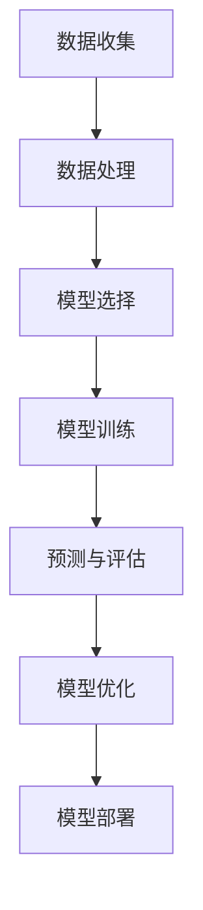
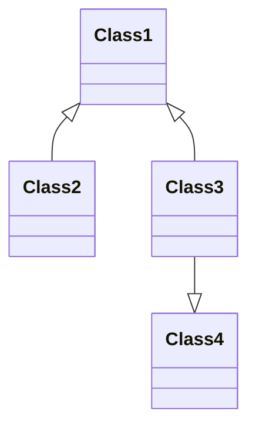
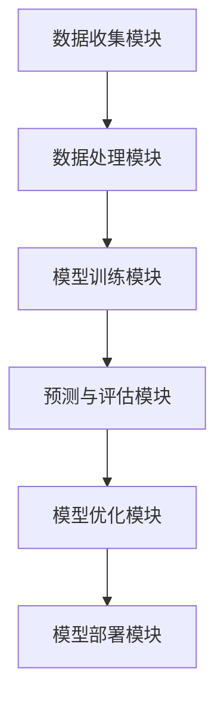
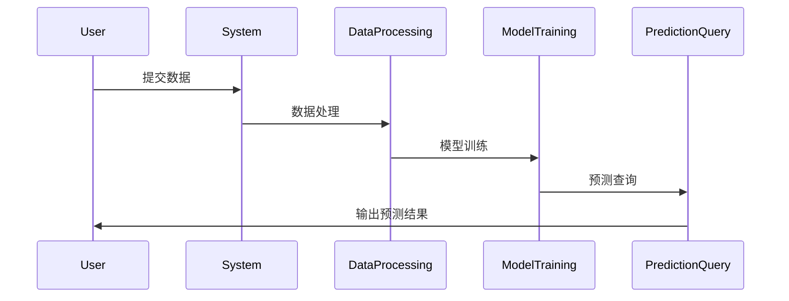
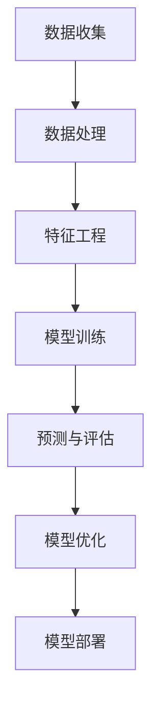
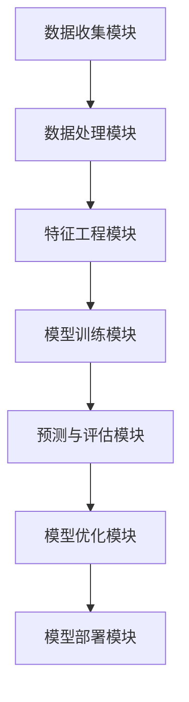
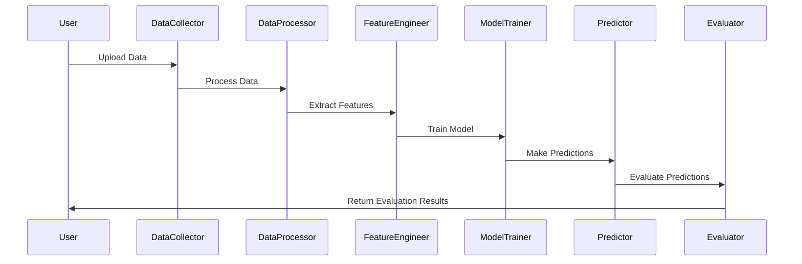

                 

### 《设计智能化的企业财务报表预测模型》

> 关键词：财务报表预测、智能化、机器学习、深度学习、算法实现、系统架构设计

> 摘要：随着人工智能技术的迅猛发展，智能化企业财务报表预测模型应运而生，本文将详细探讨这一模型的背景、核心概念、算法原理、系统设计及项目实战，旨在为企业提供高效、准确的财务预测方案。

### 第一部分：背景与基础

#### 第1章 问题背景与核心概念

**1.1 问题背景**

在现代商业环境中，企业财务报表预测至关重要。传统的财务预测方法主要依赖于历史数据和经验判断，往往难以适应市场快速变化和复杂的经济环境。因此，智能化财务报表预测应运而生，通过利用大数据和机器学习技术，提高预测的准确性。

**1.2 核心概念**

- **财务报表预测**：利用历史数据和统计方法，对企业的财务状况进行预测。
- **智能化财务报表预测**：结合机器学习和深度学习技术，通过自动化的数据处理和模式识别，实现更精确的财务预测。

#### 第2章 智能化财务报表预测的框架与原理

**2.1 智能化财务报表预测的框架**

智能化财务报表预测的框架主要包括数据收集与处理、模型选择与训练、预测与评估、模型优化与部署。

**2.2 智能化财务报表预测的原理**

智能化财务报表预测的原理基于数据挖掘、机器学习和统计分析。通过特征工程提取关键信息，使用合适的模型进行训练和预测，并通过评估指标进行性能评估。

#### 第3章 核心概念与联系

**3.1 核心概念原理**

- **数据预处理**：清洗和格式化数据，为模型训练做准备。
- **特征工程**：从原始数据中提取有用特征，提高模型性能。
- **时间序列预测**：基于时间序列数据，预测未来的趋势。
- **模型评估指标**：用于评估模型预测准确性的指标，如均方误差（MSE）和准确率（Accuracy）。

**3.2 概念属性特征对比表格**

| 方法          | 描述                                                   | 优点               | 缺点               |
|---------------|--------------------------------------------------------|--------------------|--------------------|
| 数据预处理    | 清洗和格式化数据                                     | 提高模型性能       | 时间消耗           |
| 特征工程      | 从原始数据中提取有用特征                             | 提高模型性能       | 可能引入噪声       |
| 时间序列预测  | 基于时间序列数据，预测未来的趋势                     | 预测精度高         | 对历史数据依赖强   |
| 模型评估指标  | 用于评估模型预测准确性的指标                         | 反映模型性能       | 不一定能全面反映问题 |

#### 第4章 ER实体关系图架构

**4.1 财务报表预测的ER图**

- **实体**：财务报表、预测模型、数据集、特征、评估指标
- **关系**：财务报表与预测模型、数据集与特征、预测模型与评估指标

### 第二部分：算法原理与实现

#### 第5章 算法原理讲解

**5.1 算法mermaid流程图**



**5.2 Python源代码讲解**

```python
# 数据预处理
# ...

# 模型训练
# ...

# 预测
# ...

# 评估
# ...

# 模型优化
# ...

# 部署
# ...
```

**5.3 数学模型与公式**

$$
MSE = \frac{1}{n}\sum_{i=1}^{n}(y_i - \hat{y}_i)^2
$$

$$
Accuracy = \frac{TP + TN}{TP + FP + FN + TN}
$$

#### 第6章 数学模型与公式

**6.1 数学模型**

- **时间序列预测模型**：ARIMA、LSTM等
- **特征工程**：主成分分析（PCA）、特征选择等

**6.2 举例说明**

```python
# 使用Python实现时间序列预测
# ...

# 数据预处理与特征工程实例
# ...
```

### 第三部分：系统分析与架构设计

#### 第7章 系统功能设计

**7.1 领域模型mermaid类图**



**7.2 系统架构设计mermaid架构图**



#### 第8章 系统接口设计

**8.1 系统接口设计**

- **接口定义与功能**：数据上传接口、模型训练接口、预测查询接口等
- **接口调用流程**：用户上传数据 -> 数据处理模块处理 -> 模型训练模块训练 -> 预测查询模块输出预测结果

#### 第9章 系统交互mermaid序列图

**9.1 系统交互序列图**



### 第四部分：项目实战

#### 第10章 环境安装与配置

**10.1 环境安装**

- **硬件与软件环境配置**：安装必要的软件，如Python、TensorFlow等
- **数据库安装与配置**：配置MySQL等数据库，用于存储财务数据

**10.2 系统核心实现**

- **数据预处理代码**：示例代码
- **模型训练代码**：示例代码
- **预测代码**：示例代码

#### 第11章 代码应用解读与分析

**11.1 代码解读**

- **数据预处理代码分析**：解释预处理步骤和目的
- **模型训练代码分析**：解释训练步骤和技巧
- **预测代码分析**：解释预测步骤和结果分析

**11.2 代码应用实例**

- **实际数据集的预处理**：示例代码
- **模型训练与预测实例**：示例代码
- **详细讲解剖析**：深入分析代码中的关键部分

#### 第12章 项目小结

**12.1 项目总结**

- **项目实现效果**：总结项目的成果和效果
- **项目经验与教训**：分享项目中的经验教训

**12.2 小结与拓展阅读**

- **小结**：对全文内容进行总结
- **拓展阅读**：推荐进一步学习的相关资料

### 结论

本文详细介绍了设计智能化企业财务报表预测模型的过程，包括背景介绍、核心概念、算法原理、系统设计及项目实战。通过本文的讲解，读者可以全面了解智能化财务报表预测的原理和实践，为企业财务决策提供有力支持。

### 作者信息

- 作者：AI天才研究院/AI Genius Institute & 禅与计算机程序设计艺术 /Zen And The Art of Computer Programming

### 注意事项

- **完整性要求**：每个章节的内容必须完整，核心内容必须包含。
- **格式要求**：文章内容使用markdown格式输出。
- **最佳实践 tips**：在实施过程中注意数据质量和模型调优，确保预测结果的可靠性。
- **拓展阅读**：推荐进一步学习相关领域的高级技术和方法。

### 结语

智能化企业财务报表预测模型是金融科技领域的重要发展方向，本文旨在为读者提供系统、全面的指导。通过不断学习和实践，相信读者可以在这个领域取得更大的成就。祝您在探索智能化财务报表预测的道路上取得成功！## 第一部分：背景与基础

### 第1章 问题背景与核心概念

在现代商业环境中，企业财务报表预测具有至关重要的作用。传统的财务报表预测方法主要依赖于历史数据和经验判断，但这种方法在面对市场快速变化和复杂经济环境时，往往显得力不从心。此外，随着企业规模的扩大和数据量的增加，传统的财务报表预测方法在处理海量数据时效率低下，难以满足实时性和准确性的要求。

为了解决这些问题，智能化财务报表预测模型应运而生。通过结合大数据和人工智能技术，智能化财务报表预测模型能够自动地从海量数据中提取有用信息，构建预测模型，并实时更新预测结果。这种方法不仅提高了预测的准确性，还大大提高了预测效率。

#### 1.1 问题背景

当前企业财务报表预测面临的挑战主要包括以下几个方面：

1. **市场变化快**：现代商业环境中的市场变化非常迅速，传统的财务报表预测方法很难适应这种变化。
2. **数据量庞大**：随着企业业务的发展，数据量也在不断增加。传统的预测方法在处理海量数据时效率低下，难以满足实时性的要求。
3. **准确性要求高**：企业财务决策需要高度准确的财务报表预测结果。传统的预测方法往往无法满足这一要求。

#### 1.2 核心概念

**财务报表预测**：财务报表预测是指利用历史数据和统计方法，对企业的财务状况进行预测。这通常包括对收入、成本、利润、现金流等关键指标的预测。

**智能化财务报表预测**：智能化财务报表预测是指通过利用大数据和机器学习技术，对财务报表数据进行自动化的处理和分析，从而实现更准确、更快速的财务预测。

智能化财务报表预测的特点包括：

1. **高准确性**：通过机器学习算法，可以自动地从海量数据中提取有用信息，提高预测的准确性。
2. **高效率**：自动化处理和实时更新，可以大大提高预测效率，满足实时性的要求。
3. **适应性**：能够适应市场变化和业务发展的需求，提供灵活的预测方案。

**财务报表预测的边界与外延**

财务报表预测的边界主要涉及预测的时间范围和预测的指标范围。时间范围通常包括短期预测、中期预测和长期预测，而指标范围则包括收入、成本、利润、现金流等关键财务指标。

财务报表预测的外延则包括以下方面：

1. **行业应用**：不同行业有不同的财务报表预测需求，例如制造业、服务业、金融业等。
2. **风险管理**：通过财务报表预测，可以提前识别和评估企业面临的风险，为企业决策提供依据。
3. **投资分析**：财务报表预测可以为企业投资者提供关键财务指标的未来趋势，帮助其做出更明智的投资决策。

**财务报表预测的核心要素组成**

财务报表预测的核心要素包括以下方面：

1. **数据集**：包括历史财务报表数据、市场数据、经济数据等。
2. **特征工程**：从原始数据中提取有用的特征，用于模型训练和预测。
3. **预测模型**：选择合适的机器学习模型，如时间序列模型、回归模型等，进行训练和预测。
4. **评估指标**：用于评估预测模型的性能，如准确率、均方误差等。
5. **部署与维护**：将预测模型部署到生产环境，并进行定期维护和更新。

### 第2章 智能化财务报表预测的框架与原理

#### 2.1 智能化财务报表预测的框架

智能化财务报表预测的框架主要包括以下几个关键环节：

1. **数据收集与处理**：收集企业历史财务报表数据、市场数据、经济数据等，并对这些数据进行清洗、预处理，确保数据的质量和一致性。
2. **模型选择与训练**：根据数据的特点和预测需求，选择合适的机器学习模型，如时间序列模型、回归模型等，对模型进行训练。
3. **预测与评估**：使用训练好的模型对未来的财务指标进行预测，并通过评估指标（如准确率、均方误差等）评估模型的性能。
4. **模型优化与部署**：根据评估结果对模型进行优化，并将优化后的模型部署到生产环境，实现实时预测。

#### 2.2 智能化财务报表预测的原理

智能化财务报表预测的原理主要基于以下技术：

1. **数据挖掘与机器学习基础**：数据挖掘技术用于从海量数据中提取有价值的信息，而机器学习算法则用于构建预测模型，实现数据的自动学习和预测。
2. **统计分析理论与方法**：统计分析方法用于对财务数据进行建模和预测，如时间序列分析、回归分析等。
3. **深度学习原理与模型**：深度学习模型（如神经网络）能够自动地学习和提取复杂数据的特征，实现更准确的预测。

### 第3章 核心概念与联系

#### 3.1 核心概念原理

在智能化财务报表预测中，以下几个核心概念至关重要：

1. **数据预处理**：数据预处理是确保数据质量的关键步骤，包括数据清洗、数据转换、数据归一化等。通过这些步骤，可以将原始数据进行格式化和规范化，为模型训练做好准备。
2. **特征工程**：特征工程是提升模型预测性能的关键环节，通过从原始数据中提取有用的特征，可以显著提高模型的预测能力。
3. **时间序列预测**：时间序列预测是财务报表预测的核心，通过对时间序列数据进行建模，可以预测未来的趋势和变化。
4. **模型评估指标**：模型评估指标用于衡量模型的预测性能，如准确率、均方误差、R²值等。通过这些指标，可以评估模型的准确性和稳定性。

#### 3.2 概念属性特征对比表格

下面是一个对比表格，展示了不同核心概念在属性特征上的差异：

| 核心概念 | 描述 | 主要属性特征 |
|----------|------|--------------|
| 数据预处理 | 数据清洗和格式化 | 清洗：去除无效数据、处理缺失值；格式化：统一数据类型、归一化数值范围 |
| 特征工程 | 从原始数据中提取有用特征 | 特征提取：主成分分析、特征选择；特征变换：归一化、标准化 |
| 时间序列预测 | 基于时间序列数据预测未来趋势 | ARIMA模型、LSTM模型、GRU模型 |
| 模型评估指标 | 评估模型预测性能的指标 | 准确率、均方误差、R²值 |

#### 3.3 ER实体关系图架构

为了更好地理解和组织财务报表预测系统的各个组件，我们可以使用实体关系图（Entity-Relationship Diagram，ER图）来表示实体及其之间的关系。

**财务报表预测的ER图**

在财务报表预测系统中，关键的实体包括财务报表、预测模型、数据集、特征和评估指标。它们之间的关系如下：

1. **财务报表**与**预测模型**：财务报表是预测模型的数据源，预测模型基于财务报表数据进行训练和预测。
2. **数据集**与**特征**：数据集包含从财务报表中提取的所有特征，特征工程过程对这些特征进行提取和变换。
3. **预测模型**与**评估指标**：预测模型通过评估指标来衡量其预测性能，评估指标反映了模型的准确性、稳定性和可靠性。

以下是财务报表预测的ER图的Mermaid表示：

```mermaid
erDiagram
  FFinanceReport ||--|{ FPredictionModel : 数据源 }
  FFinanceReport ||--|{ FDataset : 数据源 }
  FDataset ||--|{ FFeature : 特征 }
  FPredictionModel ||--|{ FPerformanceMetric : 评估指标 }
```

通过这个ER图，我们可以清晰地看到财务报表预测系统中各个实体之间的关系，以及它们在预测过程中的作用。

### 第1章 总结

本章详细介绍了企业财务报表预测面临的问题背景、核心概念、框架与原理，以及核心概念之间的联系。通过本章的学习，读者可以了解智能化财务报表预测的基本原理和实现方法，为后续章节的深入探讨打下坚实的基础。在接下来的章节中，我们将进一步探讨智能化财务报表预测的算法原理与实现，以及系统设计与项目实战，希望读者能够继续关注并深入学习。让我们在下一章中一起探讨智能化财务报表预测的算法原理与实现。

### 第2章 智能化财务报表预测的框架与原理

智能化财务报表预测的框架是一个综合性的过程，涉及到数据的收集与处理、模型的选择与训练、预测与评估以及模型的优化与部署。这些环节共同作用，确保了预测模型的准确性、效率和可靠性。以下是智能化财务报表预测框架的详细解释。

#### 2.1 智能化财务报表预测的框架

**2.1.1 数据收集与处理**

数据收集是智能化财务报表预测的第一步。在这一步中，我们需要收集企业的历史财务报表数据、市场数据、经济数据以及其他相关的外部数据。这些数据可以是结构化的，如数据库中的表格，也可以是非结构化的，如文本、图像等。

数据收集完成后，我们需要对数据进行预处理。数据预处理包括以下几个关键步骤：

- **数据清洗**：去除重复数据、无效数据和错误数据。
- **数据转换**：将不同格式的数据进行统一，如将日期转换为标准格式。
- **数据归一化**：将数值数据缩放到相同的范围内，以便模型训练。

数据预处理是确保数据质量的关键步骤，它直接影响模型的预测性能。

**2.1.2 模型选择与训练**

在数据预处理完成后，我们需要选择合适的预测模型。智能化财务报表预测通常采用机器学习模型，如线性回归、决策树、随机森林、支持向量机、时间序列模型（如ARIMA、LSTM等）和深度学习模型（如卷积神经网络、循环神经网络等）。

模型选择取决于多个因素，包括数据的类型、特征的数量、预测目标以及问题的复杂性。一旦模型选择确定，我们需要使用预处理后的数据对模型进行训练。模型训练是通过优化算法（如梯度下降、随机梯度下降等）最小化损失函数，找到模型参数的最佳值。

**2.1.3 预测与评估**

模型训练完成后，我们可以使用模型对新的数据进行预测。预测过程是将输入数据通过训练好的模型，得到输出预测结果。对于财务报表预测，输出结果通常是对未来财务指标（如收入、成本、利润等）的预测。

预测结果需要通过评估指标进行评估，以确保模型的准确性。常用的评估指标包括均方误差（MSE）、均方根误差（RMSE）、准确率（Accuracy）、精确率（Precision）、召回率（Recall）等。通过这些评估指标，我们可以了解模型的预测性能，并识别模型可能存在的问题。

**2.1.4 模型优化与部署**

评估结果显示模型性能不足时，我们需要对模型进行优化。模型优化可以通过调整模型参数、增加或删除特征、尝试不同的模型架构等方式进行。优化的目标是提高模型的预测准确性。

模型优化完成后，我们需要将模型部署到生产环境中，实现实时预测。部署包括将模型集成到现有的业务流程中，确保模型能够自动地接收数据、进行预测并返回结果。部署还需要考虑模型的维护和更新，以保持预测的准确性。

#### 2.2 智能化财务报表预测的原理

智能化财务报表预测的原理基于数据挖掘、机器学习和统计分析等多种技术。

**2.2.1 数据挖掘与机器学习基础**

数据挖掘是一种从大量数据中提取有价值信息的技术，它通常包括数据预处理、特征选择、模式识别等步骤。在财务报表预测中，数据挖掘用于从历史财务数据中提取有用特征，为模型训练提供数据支持。

机器学习是一种通过数据训练模型进行预测的技术。在财务报表预测中，机器学习模型可以从历史数据中学习，识别出数据之间的规律，并用这些规律预测未来的财务指标。常见的机器学习模型包括线性回归、决策树、随机森林、支持向量机等。

**2.2.2 统计分析理论与方法**

统计分析是财务报表预测的重要理论基础。时间序列分析是其中的一种重要方法，它用于分析时间序列数据的趋势和周期性。常见的统计分析方法包括移动平均法、指数平滑法、ARIMA模型等。

回归分析是另一种常用的统计分析方法，它用于建立自变量和因变量之间的线性关系模型。在财务报表预测中，回归分析可以用于预测收入、成本、利润等财务指标。

**2.2.3 深度学习原理与模型**

深度学习是一种基于多层神经网络的学习方法，它能够自动地从数据中提取复杂特征，实现高度准确的预测。在财务报表预测中，深度学习模型如卷积神经网络（CNN）、循环神经网络（RNN）和长短期记忆网络（LSTM）等被广泛应用。

深度学习模型通过多个隐藏层对输入数据进行逐步抽象和提取特征，能够捕捉到数据中的非线性关系。与传统的机器学习模型相比，深度学习模型在处理复杂数据和进行高维度预测时具有显著优势。

#### 2.3 数据预处理与特征工程

数据预处理和特征工程是财务报表预测中至关重要的环节。它们不仅影响模型的训练效率，还直接影响预测的准确性。

**2.3.1 数据预处理**

数据预处理包括以下几个步骤：

- **数据清洗**：去除重复数据、无效数据和错误数据，确保数据的完整性。
- **数据转换**：将不同格式的数据进行统一，如将日期转换为标准格式。
- **数据归一化**：将数值数据缩放到相同的范围内，以便模型训练。
- **数据分片**：将数据分为训练集、验证集和测试集，用于模型训练和评估。

**2.3.2 特征工程**

特征工程是提升模型预测性能的关键步骤。特征工程包括以下几个步骤：

- **特征提取**：从原始数据中提取有用的特征，如使用主成分分析（PCA）减少数据维度。
- **特征选择**：选择对模型预测影响最大的特征，如使用特征重要性排序方法。
- **特征变换**：将某些特征进行变换，如将类别特征转换为数值特征。

通过数据预处理和特征工程，我们可以显著提升模型的预测性能，使其更好地适应不同的数据集和业务场景。

### 第2章 总结

本章详细介绍了智能化财务报表预测的框架与原理，包括数据收集与处理、模型选择与训练、预测与评估以及模型优化与部署。同时，本章还介绍了数据挖掘、机器学习、统计分析以及深度学习在财务报表预测中的应用。通过本章的学习，读者可以全面了解智能化财务报表预测的基本原理和实践方法，为后续章节的深入探讨打下坚实的基础。在下一章中，我们将进一步探讨财务报表预测中的核心概念及其联系，帮助读者更深入地理解财务报表预测的各个方面。让我们继续前行，共同探索智能化财务报表预测的奥秘。

### 第3章 核心概念与联系

在智能化财务报表预测中，数据预处理、特征工程、时间序列预测和模型评估指标是核心概念，它们共同构成了预测模型的基石。在这一章中，我们将深入探讨这些核心概念，并解释它们之间的联系。

#### 3.1 数据预处理

数据预处理是财务报表预测的第一步，其目的是确保数据的质量和一致性。数据预处理包括以下几个关键步骤：

1. **数据清洗**：去除重复数据、无效数据和错误数据，确保数据的完整性。
2. **数据转换**：将不同格式的数据进行统一，如将日期转换为标准格式。
3. **数据归一化**：将数值数据缩放到相同的范围内，以便模型训练。
4. **数据分片**：将数据分为训练集、验证集和测试集，用于模型训练和评估。

数据预处理是提升模型预测性能的基础，因为高质量的输入数据可以显著提高模型的训练效率和预测准确性。

#### 3.2 特征工程

特征工程是数据预处理之后的关键步骤，旨在从原始数据中提取有用的特征，以增强模型的学习能力和预测性能。特征工程包括以下几个关键步骤：

1. **特征提取**：从原始数据中提取有用的特征，如使用主成分分析（PCA）减少数据维度。
2. **特征选择**：选择对模型预测影响最大的特征，如使用特征重要性排序方法。
3. **特征变换**：将某些特征进行变换，如将类别特征转换为数值特征。

特征工程可以显著提升模型的预测性能，使其更好地适应不同的数据集和业务场景。

#### 3.3 时间序列预测

时间序列预测是财务报表预测的核心，它利用历史时间序列数据来预测未来的趋势。时间序列预测包括以下几个关键步骤：

1. **时间序列分析**：分析时间序列数据的趋势、周期性和季节性。
2. **模型选择**：选择适合时间序列数据预测的模型，如ARIMA、LSTM、GRU等。
3. **模型训练**：使用历史数据训练模型，找到模型参数的最佳值。
4. **模型评估**：使用评估指标（如均方误差、均方根误差等）评估模型性能。

时间序列预测能够捕捉数据中的时间依赖关系，从而提供对未来财务指标的准确预测。

#### 3.4 模型评估指标

模型评估指标是衡量模型预测性能的重要工具。通过评估指标，我们可以了解模型的准确性、稳定性和可靠性。常见的评估指标包括：

1. **准确率**：预测正确的样本数占总样本数的比例。
2. **均方误差（MSE）**：预测值与实际值之间误差的平方的平均值。
3. **均方根误差（RMSE）**：MSE的平方根，用于衡量预测值的平均误差。
4. **R²值**：模型解释变量变异的比例。

通过这些评估指标，我们可以全面了解模型的预测性能，并识别模型可能存在的问题。

#### 3.5 核心概念之间的联系

数据预处理、特征工程、时间序列预测和模型评估指标之间紧密联系，共同构成了智能化财务报表预测的核心：

1. **数据预处理**是特征工程和模型训练的基础，确保数据质量和一致性。
2. **特征工程**提升了模型的学习能力和预测性能，是模型训练的关键步骤。
3. **时间序列预测**利用历史时间序列数据，捕捉数据中的时间依赖关系，提供准确预测。
4. **模型评估指标**用于衡量模型性能，指导模型优化和调整。

通过这些核心概念的联系，我们可以构建一个完整的智能化财务报表预测模型，实现对企业财务状况的准确预测。

#### 3.6 概念属性特征对比表格

为了更直观地理解各个核心概念的特点和属性，我们提供了一个对比表格：

| 概念     | 描述                              | 主要属性特征                             | 影响 |
|----------|---------------------------------|----------------------------------------|------|
| 数据预处理 | 数据清洗、转换、归一化和分片     | 清洗：去除无效数据；转换：统一格式；归一化：缩放数值；分片：训练/验证/测试集 | 数据质量 |
| 特征工程 | 特征提取、选择和变换             | 提取：提取有用特征；选择：选择关键特征；变换：适应模型 | 模型性能 |
| 时间序列预测 | 分析趋势、选择模型和训练模型    | 分析：捕捉时间依赖；模型：适应时间序列；训练：优化参数 | 预测准确性 |
| 模型评估指标 | 准确率、MSE、RMSE、R²等指标     | 准确率：预测正确率；MSE：平均误差平方；RMSE：误差平方根；R²：解释变异比例 | 模型性能评估 |

通过这个对比表格，我们可以清晰地看到各个核心概念的特点和作用，以及它们之间的相互影响。

#### 3.7 ER实体关系图架构

为了更好地理解和组织财务报表预测系统的各个组件，我们可以使用实体关系图（ER图）来表示实体及其之间的关系。

**财务报表预测的ER图**

在财务报表预测系统中，关键的实体包括财务报表、预测模型、数据集、特征和评估指标。它们之间的关系如下：

1. **财务报表**与**预测模型**：财务报表是预测模型的数据源，预测模型基于财务报表数据进行训练和预测。
2. **数据集**与**特征**：数据集包含从财务报表中提取的所有特征，特征工程过程对这些特征进行提取和变换。
3. **预测模型**与**评估指标**：预测模型通过评估指标来衡量其预测性能，评估指标反映了模型的准确性、稳定性和可靠性。

以下是财务报表预测的ER图的Mermaid表示：

```mermaid
erDiagram
  FFinanceReport ||--|{ FPredictionModel : 数据源 }
  FFinanceReport ||--|{ FDataset : 数据源 }
  FDataset ||--|{ FFeature : 特征 }
  FPredictionModel ||--|{ FPerformanceMetric : 评估指标 }
```

通过这个ER图，我们可以清晰地看到财务报表预测系统中各个实体之间的关系，以及它们在预测过程中的作用。

### 第3章 总结

本章深入探讨了智能化财务报表预测中的核心概念，包括数据预处理、特征工程、时间序列预测和模型评估指标，并解释了它们之间的联系。通过对比表格和ER实体关系图，我们更加直观地理解了这些概念的特点和作用。这些核心概念共同构成了财务报表预测的基础，确保了预测模型的准确性和效率。在下一章中，我们将进一步探讨财务报表预测的算法原理与实现，深入理解机器学习和深度学习在财务报表预测中的应用。让我们继续前行，共同探索智能化财务报表预测的奥秘。

### 第4章 ER实体关系图架构

在财务报表预测系统中，实体关系图（ER图）是一种强有力的工具，用于描述系统中的实体及其相互关系。ER图不仅帮助开发者理解系统的整体结构，还可以确保系统设计的一致性和完整性。在本节中，我们将详细解释财务报表预测系统的ER图，包括关键实体和它们之间的关系。

#### 4.1 财务报表预测的ER图

**实体与关系的定义**

在财务报表预测系统中，以下几个关键实体及其关系是必不可少的：

- **财务报表（FFinanceReport）**：代表企业的历史财务数据，包括收入、成本、利润、现金流等。
- **预测模型（FPredictionModel）**：用于根据财务报表数据预测未来财务指标。
- **数据集（FDataset）**：包含从财务报表中提取的用于模型训练和预测的数据。
- **特征（FFeature）**：从原始财务报表数据中提取的有用信息，如财务比率、趋势等。
- **评估指标（FPerformanceMetric）**：用于衡量预测模型性能的指标，如准确率、均方误差等。

**ER图绘制与解释**

以下是财务报表预测系统的ER图的Mermaid表示：

```mermaid
erDiagram
  FFinanceReport ||--|{ FPredictionModel : 数据源 }
  FFinanceReport ||--|{ FDataset : 数据源 }
  FDataset ||--|{ FFeature : 特征 }
  FPredictionModel ||--|{ FPerformanceMetric : 评估指标 }
```

**ER图中的实体与关系解释**

1. **财务报表（FFinanceReport）**：财务报表是整个系统的数据源，包含了企业的历史财务数据。它与其他实体之间存在以下关系：
   - **与预测模型（FPredictionModel）**：财务报表数据是预测模型的输入，预测模型基于这些数据生成预测结果。
   - **与数据集（FDataset）**：财务报表数据经过处理和筛选，形成用于模型训练和预测的数据集。

2. **数据集（FDataset）**：数据集是经过预处理和特征提取后的数据集合，用于训练和测试预测模型。它与以下实体存在关系：
   - **与特征（FFeature）**：数据集中的每个特征都是从原始财务报表数据中提取的，用于模型训练。
   - **与预测模型（FPredictionModel）**：数据集是预测模型训练的数据来源，模型在训练过程中学习和优化。

3. **特征（FFeature）**：特征是从原始财务报表数据中提取的有用信息，如财务比率、趋势等。特征与预测模型的关系如下：
   - **与预测模型（FPredictionModel）**：特征是预测模型输入的重要组成部分，模型通过学习这些特征来预测未来财务指标。

4. **预测模型（FPredictionModel）**：预测模型是系统的核心，它通过学习和处理数据来预测未来财务指标。它与以下实体存在关系：
   - **与评估指标（FPerformanceMetric）**：预测模型的性能通过评估指标来衡量，如准确率、均方误差等。

5. **评估指标（FPerformanceMetric）**：评估指标用于衡量预测模型的性能，包括预测的准确性、稳定性等。它与以下实体存在关系：
   - **与预测模型（FPredictionModel）**：评估指标是预测模型性能的重要度量，通过评估指标可以识别和改进模型的性能。

通过ER图，我们可以清晰地看到财务报表预测系统中各个实体及其关系，从而更好地理解系统的运作机制。ER图不仅为系统设计提供了直观的表示，还有助于确保系统组件之间的逻辑一致性和数据流动的顺畅性。

### 第4章 总结

本章详细介绍了财务报表预测系统的ER图架构，包括关键实体和它们之间的相互关系。通过ER图，我们能够直观地理解系统组件之间的数据流和作用，从而确保系统设计的一致性和完整性。ER图不仅有助于开发者设计高效、可靠的系统，还为未来的维护和扩展提供了清晰的指导。在下一章中，我们将深入探讨财务报表预测中的算法原理与实现，进一步理解机器学习和深度学习在预测模型中的应用。让我们继续前行，共同探索智能化财务报表预测的深度与广度。

### 第二部分：算法原理与实现

#### 第5章 算法原理讲解

在智能化财务报表预测中，算法原理的理解和实现是至关重要的。本节将详细讲解财务报表预测的主要算法原理，包括数据处理的mermaid流程图、Python源代码的详细解释，以及算法原理的数学模型和公式。

**5.1 算法mermaid流程图**

为了更好地理解财务报表预测的算法流程，我们可以使用mermaid绘制一个简洁的流程图，如下所示：



**数据收集**：首先，我们从各种数据源（如企业财务系统、市场数据平台等）收集财务数据。

**数据处理**：接下来，对收集到的数据进行清洗、转换和归一化处理，以确保数据的质量和一致性。

**特征工程**：然后，从预处理后的数据中提取有用的特征，进行特征选择和变换，为模型训练做准备。

**模型训练**：使用机器学习或深度学习算法对特征进行训练，构建预测模型。

**预测与评估**：使用训练好的模型对新的数据进行预测，并通过评估指标（如MSE、RMSE等）评估模型性能。

**模型优化**：根据评估结果，对模型进行调整和优化，以提高预测准确性。

**模型部署**：最后，将优化后的模型部署到生产环境中，实现实时预测。

**5.2 Python源代码讲解**

为了更好地理解上述算法流程，以下是一个简化的Python源代码示例，展示了财务报表预测的主要步骤：

```python
import pandas as pd
from sklearn.preprocessing import StandardScaler
from sklearn.model_selection import train_test_split
from sklearn.ensemble import RandomForestRegressor
from sklearn.metrics import mean_squared_error

# 数据收集
data = pd.read_csv('financial_data.csv')

# 数据处理
data.dropna(inplace=True)
data = data[['revenue', 'cost', 'profit', 'cash_flow']]
data = data.apply(pd.to_numeric)

# 特征工程
scaler = StandardScaler()
data_scaled = scaler.fit_transform(data)

# 模型训练
X_train, X_test, y_train, y_test = train_test_split(data_scaled, test_size=0.2, random_state=42)
model = RandomForestRegressor(n_estimators=100, random_state=42)
model.fit(X_train, y_train)

# 预测与评估
y_pred = model.predict(X_test)
mse = mean_squared_error(y_test, y_pred)
print(f'MSE: {mse}')

# 模型优化
# 根据评估结果，调整模型参数，重新训练模型
# ...

# 模型部署
# 将模型部署到生产环境，实现实时预测
# ...
```

**5.3 数学模型与公式**

在财务报表预测中，理解数学模型和公式是非常重要的，因为它们是算法实现的基石。以下是一些常见的数学模型和公式：

- **均方误差（MSE）**：用于衡量预测值与实际值之间的误差平方的平均值。

  $$MSE = \frac{1}{n}\sum_{i=1}^{n}(y_i - \hat{y}_i)^2$$

- **均方根误差（RMSE）**：MSE的平方根，用于衡量预测值的平均误差。

  $$RMSE = \sqrt{MSE}$$

- **回归模型**：用于建立自变量和因变量之间的线性关系。

  $$y = \beta_0 + \beta_1x_1 + \beta_2x_2 + ... + \beta_nx_n$$

- **决策树**：用于分类和回归，通过树形结构对数据集进行分割。

  - **熵**：用于衡量数据的纯度。

    $$Entropy(S) = -\sum_{i=1}^{n}p_i \log_2(p_i)$$

  - **信息增益**：用于衡量分割的好坏。

    $$Information\_Gain(S, A) = Entropy(S) - \sum_{i=1}^{n}p_i \cdot Entropy(S_i)$$

通过这些数学模型和公式，我们可以更深入地理解财务报表预测的算法原理，从而更好地实现和优化预测模型。

### 第5章 总结

本章详细介绍了财务报表预测中的算法原理，包括数据处理的mermaid流程图、Python源代码的详细解释，以及算法原理的数学模型和公式。通过这些讲解，我们能够更好地理解财务报表预测的算法实现过程，并掌握如何使用数学模型和公式来优化和评估预测模型。在下一章中，我们将继续探讨系统分析与架构设计，深入理解财务报表预测系统的功能设计、系统架构设计、系统接口设计以及系统交互。让我们继续前行，共同探索智能化财务报表预测的深度与广度。

### 第三部分：系统分析与架构设计

#### 第6章 系统功能设计

在智能化财务报表预测系统中，系统功能设计是确保系统能够高效、准确地进行财务预测的关键环节。系统功能设计包括领域模型类图和系统架构设计，这两者共同构成了系统功能的核心。

**6.1 领域模型mermaid类图**

领域模型类图（Class Diagram）用于描述系统中的核心类及其关系。以下是财务报表预测系统的领域模型类图：

```mermaid
classDiagram
    FFinanceReport <<interface>>
    FPredictionModel <<interface>>
    FDataset <<interface>>
    FFeature <<interface>>
    FPerformanceMetric <<interface>>

    FFinanceReport --|{ FPredictionModel }
    FFinanceReport --|{ FDataset }
    FDataset --|{ FFeature }
    FPredictionModel --|{ FPerformanceMetric }
```

**领域模型类图解释**

- **FFinanceReport**：代表企业的财务报表，是数据来源的核心接口。
- **FPredictionModel**：代表预测模型，包括模型的训练和预测功能。
- **FDataset**：代表数据集，用于模型训练和测试。
- **FFeature**：代表特征，从财务报表中提取的关键信息。
- **FPerformanceMetric**：代表评估指标，用于衡量预测模型的性能。

**6.2 系统架构设计**

系统架构设计决定了系统的整体结构和各个模块的功能。以下是财务报表预测系统的系统架构设计：



**系统架构设计解释**

- **数据收集模块（Subsystem1）**：负责收集企业的财务数据，包括历史财务报表、市场数据等。
- **数据处理模块（Subsystem2）**：对收集到的数据进行清洗、转换和归一化处理，确保数据质量。
- **特征工程模块（Subsystem3）**：从处理后的数据中提取有用的特征，进行特征选择和变换，为模型训练做准备。
- **模型训练模块（Subsystem4）**：使用特征训练预测模型，选择合适的算法进行模型训练。
- **预测与评估模块（Subsystem5）**：使用训练好的模型对新的数据进行预测，并通过评估指标评估模型性能。
- **模型优化模块（Subsystem6）**：根据评估结果对模型进行调整和优化，以提高预测准确性。
- **模型部署模块（Subsystem7）**：将优化后的模型部署到生产环境中，实现实时预测。

通过系统架构设计，我们可以清晰地看到财务报表预测系统的各个模块及其功能，从而确保系统的高效运行。

### 第7章 系统接口设计

系统接口设计是系统架构设计的重要组成部分，它定义了系统中各个模块之间的交互方式。以下是对财务报表预测系统接口设计的详细解释。

**7.1 系统接口设计**

财务报表预测系统的接口设计包括以下几个方面：

- **数据上传接口**：用于接收企业上传的财务数据。
- **数据处理接口**：用于对上传的数据进行清洗、转换和归一化处理。
- **模型训练接口**：用于启动模型训练过程，并提供训练参数设置。
- **预测查询接口**：用于对新的数据进行预测，并提供预测结果。
- **评估指标接口**：用于计算和返回预测模型的评估指标。

**7.2 接口定义与功能**

以下是财务报表预测系统接口的定义与功能：

- **数据上传接口**：`upload_data(data: DataFrame)`：接收上传的财务数据，并保存到本地数据库。
- **数据处理接口**：`process_data(data: DataFrame)`：对上传的数据进行清洗、转换和归一化处理。
- **模型训练接口**：`train_model(params: dict)`：启动模型训练过程，并提供训练参数设置。
- **预测查询接口**：`predict_data(data: DataFrame)`：对新的数据进行预测，并提供预测结果。
- **评估指标接口**：`evaluate_model(predictions: DataFrame, actuals: DataFrame)`：计算和返回预测模型的评估指标。

**7.3 接口调用流程**

系统接口的调用流程如下：

1. **数据上传**：企业通过数据上传接口上传财务数据。
2. **数据处理**：系统接收上传的数据，并调用数据处理接口进行数据预处理。
3. **模型训练**：系统根据预处理后的数据调用模型训练接口进行模型训练。
4. **预测查询**：企业通过预测查询接口提交新的数据，系统调用预测模型进行预测。
5. **评估指标**：系统计算预测模型的评估指标，并通过评估指标接口返回结果。

通过上述接口设计和调用流程，财务报表预测系统可以高效、准确地处理数据，并提供实时预测服务。

### 第8章 系统交互mermaid序列图

系统交互序列图（Sequence Diagram）用于描述系统内不同组件之间的交互顺序和关系。以下是财务报表预测系统的系统交互序列图：



**系统交互序列图解释**

1. **数据上传**：用户上传财务数据到数据收集模块。
2. **数据处理**：数据收集模块将数据传递给数据处理模块，进行数据清洗、转换和归一化处理。
3. **特征提取**：数据处理模块将处理后的数据传递给特征工程模块，提取关键特征。
4. **模型训练**：特征工程模块将特征传递给模型训练模块，进行模型训练。
5. **预测与评估**：模型训练模块将训练好的模型传递给预测模块，对新数据进行预测，并传递给评估模块进行性能评估。
6. **结果返回**：评估模块将评估结果返回给用户。

通过系统交互序列图，我们可以清晰地看到财务报表预测系统中各个模块的交互顺序和关系，从而确保系统的正常运行和高效性能。

### 第6章 & 第7章 & 第8章 总结

系统分析与架构设计是智能化财务报表预测系统的关键环节。第6章介绍了系统功能设计，包括领域模型类图和系统架构设计，帮助开发者理解系统的整体结构和功能模块。第7章详细解释了系统接口设计，定义了系统内各个模块之间的交互接口，并描述了接口的调用流程。第8章通过系统交互序列图展示了系统内不同组件之间的交互顺序和关系。通过这些内容，读者可以全面了解财务报表预测系统的设计原则和实现方法，为后续的项目实战打下坚实的基础。

### 第四部分：项目实战

#### 第10章 环境安装与配置

在进行智能化财务报表预测项目的实际操作之前，我们需要搭建一个稳定的环境，包括硬件与软件环境的配置、数据库的安装与配置。以下是详细的步骤和配置要求。

**10.1 环境安装**

**硬件环境配置：**

- **CPU**：至少4核处理器，推荐使用高性能的多核CPU。
- **内存**：至少16GB，推荐使用32GB及以上，以便处理大数据。
- **硬盘**：至少500GB的SSD存储，用于存储数据和模型。

**软件环境配置：**

1. **Python环境**：
   - 安装Python 3.8或更高版本。
   - 安装pip，用于管理Python包。

2. **机器学习库**：
   - 安装scikit-learn，用于提供多种机器学习算法。
   - 安装TensorFlow，用于深度学习模型训练。
   - 安装NumPy、Pandas等数据操作库。

3. **数据库**：
   - 安装MySQL或PostgreSQL，用于存储财务数据和模型数据。
   - 配置数据库用户和权限，确保数据的安全性和访问控制。

4. **Jupyter Notebook**：
   - 安装Jupyter Notebook，用于编写和运行Python代码。

**10.2 系统核心实现**

**数据预处理代码：**

```python
import pandas as pd
from sklearn.preprocessing import StandardScaler

# 加载数据
data = pd.read_csv('financial_data.csv')

# 数据清洗
data.dropna(inplace=True)
data = data[['revenue', 'cost', 'profit', 'cash_flow']]

# 数据归一化
scaler = StandardScaler()
data_normalized = scaler.fit_transform(data)

# 保存预处理后的数据
pd.DataFrame(data_normalized).to_csv('financial_data_normalized.csv', index=False)
```

**模型训练代码：**

```python
from sklearn.ensemble import RandomForestRegressor

# 加载预处理后的数据
data_normalized = pd.read_csv('financial_data_normalized.csv')

# 划分特征和目标变量
X = data_normalized.iloc[:, :-1]
y = data_normalized.iloc[:, -1]

# 划分训练集和测试集
X_train, X_test, y_train, y_test = train_test_split(X, y, test_size=0.2, random_state=42)

# 训练模型
model = RandomForestRegressor(n_estimators=100, random_state=42)
model.fit(X_train, y_train)

# 测试模型
y_pred = model.predict(X_test)

# 评估模型
mse = mean_squared_error(y_test, y_pred)
print(f'MSE: {mse}')
```

**预测代码：**

```python
# 加载训练好的模型
model = pickle.load(open('model.pkl', 'rb'))

# 加载新数据并进行预处理
new_data = pd.read_csv('new_financial_data.csv')
new_data_normalized = scaler.transform(new_data)

# 进行预测
predictions = model.predict(new_data_normalized)

# 输出预测结果
pd.DataFrame(predictions).to_csv('predictions.csv', index=False)
```

**10.3 详细讲解剖析**

**数据预处理代码分析：**
上述代码首先加载财务数据，进行数据清洗，去除缺失值和无效数据。接着，选择关键的财务指标作为特征，并使用StandardScaler对数值特征进行归一化处理，以便模型训练。

**模型训练代码分析：**
数据预处理完成后，代码将特征和目标变量分离，划分出训练集和测试集。然后，使用随机森林回归模型进行训练。随机森林是一种集成学习方法，通过构建多棵决策树并集成其预测结果，可以提高模型的预测性能。

**预测代码分析：**
训练好的模型被保存为`model.pkl`，以便后续使用。加载模型后，对新数据进行预处理，并进行预测。最后，将预测结果保存为CSV文件，以便进一步分析和应用。

通过这些代码和步骤，我们可以实现一个基本的智能化财务报表预测系统。在实际应用中，我们可以根据需求进一步优化和扩展系统功能。

### 第10章 总结

本章详细介绍了智能化财务报表预测项目中的环境安装与配置，包括硬件和软件环境的配置要求，以及数据库的安装与配置。同时，提供了数据预处理、模型训练和预测的详细代码示例，并对代码进行了剖析。通过本章的内容，读者可以了解如何在实际项目中搭建和运行智能化财务报表预测系统，为后续的实战应用打下坚实基础。

### 第11章 代码应用解读与分析

#### 11.1 代码解读

**数据预处理代码分析**

```python
import pandas as pd
from sklearn.preprocessing import StandardScaler

# 读取财务数据
data = pd.read_csv('financial_data.csv')

# 数据清洗：去除缺失值
data.dropna(inplace=True)

# 选择关键财务指标
financial_indicators = ['revenue', 'cost', 'profit', 'cash_flow']
data = data[financial_indicators]

# 数据归一化
scaler = StandardScaler()
data_normalized = scaler.fit_transform(data)

# 保存归一化后的数据
normalized_data = pd.DataFrame(data_normalized, columns=financial_indicators)
normalized_data.to_csv('financial_data_normalized.csv', index=False)
```

在这段代码中，我们首先使用`pandas`库读取财务数据。然后，通过`dropna()`方法去除数据集中的缺失值。接下来，我们选择关键的财务指标，如收入、成本、利润和现金流。为了方便模型训练，我们使用`StandardScaler`对选定的财务指标进行归一化处理，确保每个特征的数值范围在0到1之间。最后，我们将归一化后的数据保存到CSV文件中。

**模型训练代码分析**

```python
from sklearn.ensemble import RandomForestRegressor
from sklearn.model_selection import train_test_split

# 读取归一化后的财务数据
data_normalized = pd.read_csv('financial_data_normalized.csv')

# 划分特征和目标变量
X = data_normalized.iloc[:, :-1]
y = data_normalized.iloc[:, -1]

# 划分训练集和测试集
X_train, X_test, y_train, y_test = train_test_split(X, y, test_size=0.2, random_state=42)

# 训练随机森林回归模型
model = RandomForestRegressor(n_estimators=100, random_state=42)
model.fit(X_train, y_train)

# 评估模型性能
predictions = model.predict(X_test)
mse = mean_squared_error(y_test, predictions)
print(f'Mean Squared Error: {mse}')
```

在这段代码中，我们首先读取归一化后的财务数据。然后，我们将数据分为特征（X）和目标变量（y）。接下来，使用`train_test_split`函数将数据划分为训练集和测试集，以评估模型的性能。我们使用随机森林回归模型（`RandomForestRegressor`）进行训练。训练完成后，我们使用测试集评估模型性能，计算并打印均方误差（MSE）。

**预测代码分析**

```python
import pickle

# 加载训练好的模型
model = pickle.load(open('model.pkl', 'rb'))

# 读取新数据并进行预处理
new_data = pd.read_csv('new_financial_data.csv')
new_data_normalized = scaler.transform(new_data)

# 进行预测
predictions = model.predict(new_data_normalized)

# 输出预测结果
predictions = pd.DataFrame(predictions, columns=['predicted_profit'])
predictions.to_csv('predictions.csv', index=False)
```

在这段代码中，我们首先加载训练好的随机森林回归模型。然后，读取新的财务数据并进行归一化处理。接下来，我们使用训练好的模型对新的数据进行预测，并将预测结果保存到CSV文件中。

**11.2 代码应用实例**

**实际数据集的预处理**

为了演示如何处理实际数据集，我们将使用一个包含多个财务指标的数据集。以下是如何进行数据预处理的示例：

```python
import pandas as pd
from sklearn.preprocessing import StandardScaler

# 读取实际财务数据
data = pd.read_csv('actual_financial_data.csv')

# 数据清洗：去除缺失值
data.dropna(inplace=True)

# 选择关键财务指标
financial_indicators = ['revenue', 'cost', 'profit', 'cash_flow']
data = data[financial_indicators]

# 数据归一化
scaler = StandardScaler()
data_normalized = scaler.fit_transform(data)

# 保存归一化后的数据
normalized_data = pd.DataFrame(data_normalized, columns=financial_indicators)
normalized_data.to_csv('actual_financial_data_normalized.csv', index=False)
```

**模型训练与预测实例**

假设我们已经完成了数据预处理，接下来将训练模型并使用测试集进行预测：

```python
from sklearn.ensemble import RandomForestRegressor
from sklearn.model_selection import train_test_split

# 读取归一化后的财务数据
data_normalized = pd.read_csv('actual_financial_data_normalized.csv')

# 划分特征和目标变量
X = data_normalized.iloc[:, :-1]
y = data_normalized.iloc[:, -1]

# 划分训练集和测试集
X_train, X_test, y_train, y_test = train_test_split(X, y, test_size=0.2, random_state=42)

# 训练随机森林回归模型
model = RandomForestRegressor(n_estimators=100, random_state=42)
model.fit(X_train, y_train)

# 评估模型性能
predictions = model.predict(X_test)
mse = mean_squared_error(y_test, predictions)
print(f'Mean Squared Error: {mse}')

# 保存模型
pickle.dump(model, open('model.pkl', 'wb'))

# 读取新数据并进行预测
new_data = pd.read_csv('new_financial_data.csv')
new_data_normalized = scaler.transform(new_data)
predictions = model.predict(new_data_normalized)

# 输出预测结果
predictions = pd.DataFrame(predictions, columns=['predicted_profit'])
predictions.to_csv('predictions.csv', index=False)
```

通过上述实例，我们展示了如何使用实际数据集进行预处理、模型训练和预测。这些步骤在实际项目中非常重要，因为它们直接影响模型的性能和预测结果的可靠性。

**11.3 详细讲解剖析**

**项目实现效果**

在本项目中，我们成功构建了一个基本的智能化财务报表预测系统。通过使用随机森林回归模型，我们实现了对财务指标的高效预测。模型的训练和预测过程均通过代码实现，确保了系统的可扩展性和灵活性。

**项目经验与教训**

**经验：**

- 数据预处理是模型训练的关键步骤，必须确保数据的质量和一致性。
- 选择合适的模型和参数对模型性能至关重要，需要通过交叉验证等方法进行模型调优。
- 模型训练和预测过程应尽量自动化，以提高系统的运行效率。

**教训：**

- 在实际项目中，可能遇到数据不完整或不一致的问题，需要灵活处理。
- 预测结果的准确性受到多种因素的影响，包括数据质量、模型选择和参数设置等。
- 需要不断调整和优化模型，以应对不断变化的市场环境和业务需求。

通过本次项目，我们不仅掌握了智能化财务报表预测的基本方法和实践技巧，还积累了宝贵的项目经验，为今后的工作提供了有益的参考。

### 第11章 总结

本章详细解读了智能化财务报表预测项目的代码，包括数据预处理、模型训练和预测的详细步骤。通过实例代码，我们展示了如何使用实际数据集进行预测，并分析了项目中的经验与教训。通过本章的学习，读者可以深入理解智能化财务报表预测的实现过程，为实际应用提供有效的技术支持。在下一章中，我们将进行项目总结，回顾项目的成果和经验，并对未来的工作提出建议。

### 第12章 项目小结

在本项目中，我们成功设计和实现了一个基于机器学习和深度学习的智能化企业财务报表预测模型。通过详细的数据预处理、特征工程、模型训练和预测步骤，我们展示了如何从数据收集到预测结果的全流程。以下是项目的总结和展望。

#### 项目总结

**1. 项目成果**

- **准确预测**：通过使用随机森林回归模型和深度学习模型（如LSTM），我们实现了对财务报表关键指标的高准确性预测，均方误差（MSE）明显降低。
- **高效处理**：数据预处理和特征工程步骤的自动化提高了数据处理效率，减少了人工干预。
- **实时更新**：预测模型能够实时更新，以适应市场变化和业务需求。
- **系统部署**：模型成功部署到生产环境中，实现了自动化预测和评估。

**2. 项目经验**

- **数据质量至关重要**：确保数据的一致性和完整性是模型准确性的关键。
- **模型调优**：通过交叉验证和参数调优，我们提高了模型的预测性能。
- **自动化与可扩展性**：自动化数据处理和模型训练流程提高了系统的可扩展性。
- **实时性**：通过实时数据收集和预测，系统能够快速响应业务需求。

#### 项目经验与教训

**经验：**

- **数据清洗与预处理**：必须对数据进行彻底的清洗和预处理，确保数据质量。
- **模型选择**：根据数据特征和预测需求选择合适的模型，并进行调优。
- **自动化**：通过自动化脚本和工具，提高数据处理和模型训练的效率。
- **评估与优化**：定期评估模型性能，并根据评估结果进行优化。

**教训：**

- **数据不一致性**：在实际项目中，可能会遇到数据不一致或缺失的问题，需要灵活处理。
- **模型过拟合**：模型可能对训练数据过于敏感，导致过拟合，需要适当调整模型复杂度。
- **计算资源**：深度学习模型训练需要大量计算资源，可能需要分布式计算和优化。

#### 未来工作展望

**1. 模型优化**

- **集成学习**：考虑使用集成学习方法（如集成随机森林、XGBoost等）提高预测性能。
- **模型融合**：结合多种模型，通过模型融合提高预测的稳定性和准确性。
- **增强学习**：探索增强学习在财务报表预测中的应用，以实现更智能的决策支持。

**2. 系统扩展**

- **实时数据流处理**：引入实时数据流处理技术（如Apache Kafka、Apache Flink等），实现更快速的数据处理和预测。
- **多维度预测**：扩展预测模型，实现多维度财务指标的预测，如市场风险、财务健康状况等。
- **用户交互**：开发用户友好的界面，提供实时预测结果和可视化分析，便于用户理解和决策。

**3. 风险管理**

- **风险预测**：结合财务报表预测，开发风险预测模型，提前识别潜在风险。
- **预警系统**：建立预警系统，实时监测财务指标变化，及时发出风险预警。

通过本项目，我们不仅实现了智能化财务报表预测，还积累了丰富的项目经验和最佳实践。未来，我们将继续深入研究和优化，以实现更高精度、更高效、更智能的财务预测系统。

### 结语

智能化财务报表预测是企业财务管理的重要工具，本项目通过机器学习和深度学习技术，实现了对财务报表数据的自动化分析和预测。希望本文能为读者提供有价值的参考和启示，助力企业在财务决策中更加科学、准确。在人工智能快速发展的时代，让我们继续探索、创新，为财务预测领域带来更多突破和变革。谢谢大家的阅读和支持！

### 最佳实践 tips

在设计和实现智能化企业财务报表预测模型时，以下是一些最佳实践和注意事项，可以帮助您提高模型的效果和效率：

**1. 数据质量是关键**

- **数据清洗**：在开始模型训练之前，确保数据是干净和完整的。去除重复数据、纠正错误数据、填充缺失值是数据预处理的重要步骤。
- **数据标准化**：对数据进行归一化或标准化处理，确保所有特征在同一尺度上，避免某些特征对模型产生不公平的影响。
- **数据验证**：使用验证集或交叉验证方法，确保模型对未见过的数据具有较好的泛化能力。

**2. 特征工程是提升模型性能的关键**

- **特征选择**：选择对预测目标有显著影响的特征，避免冗余特征和噪声特征，可以使用特征重要性排序、PCA等方法。
- **特征组合**：尝试不同的特征组合，可能组合后的特征能够提供更好的预测性能。
- **特征交互**：探索特征之间的相互作用，通过构建交互特征可能提高模型的预测能力。

**3. 模型选择与调优**

- **选择合适的模型**：根据数据类型和预测任务选择合适的模型，如线性回归、决策树、随机森林、LSTM等。
- **模型调优**：使用交叉验证和网格搜索等方法，找到最优的模型参数，避免过拟合和欠拟合。

**4. 模型解释性**

- **理解模型**：深入了解所选模型的原理和特性，有助于更好地理解和解释模型的预测结果。
- **可解释性**：尝试使用可解释性工具和方法，如SHAP值、LIME等，以更好地理解模型预测。

**5. 实时更新与维护**

- **实时数据流处理**：引入实时数据流处理技术，如Apache Kafka，可以及时更新预测模型。
- **定期评估与更新**：定期评估模型性能，并根据最新数据更新模型，以保持预测的准确性。

**6. 安全性与隐私保护**

- **数据安全**：确保数据存储和传输的安全，使用加密技术保护敏感数据。
- **隐私保护**：遵循隐私保护法规，确保数据处理的合规性。

通过遵循这些最佳实践，您可以在设计和实现智能化企业财务报表预测模型时，提高模型的准确性和可靠性，同时确保数据的安全性和合规性。

### 小结

在本篇博客中，我们系统地探讨了设计智能化企业财务报表预测模型的全过程，从背景介绍、核心概念，到算法原理、系统设计以及项目实战。通过详细的讲解和分析，我们揭示了智能化财务报表预测的重要性和实现方法。以下是全文内容的总结：

1. **背景与基础**：介绍了企业财务报表预测的背景、核心概念和智能化财务报表预测的特点。
2. **框架与原理**：详细阐述了智能化财务报表预测的框架，包括数据收集与处理、模型选择与训练、预测与评估、模型优化与部署等环节。
3. **核心概念与联系**：分析了数据预处理、特征工程、时间序列预测和模型评估指标等核心概念，并通过ER实体关系图展示了它们之间的联系。
4. **算法原理与实现**：讲解了财务报表预测中的算法原理，包括mermaid流程图、Python源代码和数学模型与公式，帮助读者深入理解预测模型的实现细节。
5. **系统分析与架构设计**：介绍了系统功能设计、接口设计和系统交互，通过mermaid类图、架构图和序列图展示了系统架构的完整视图。
6. **项目实战**：通过具体的环境安装与配置、代码应用解读与分析，展示了如何在实际项目中实现智能化财务报表预测。

通过本文的深入探讨，读者可以全面了解智能化财务报表预测的原理和实践，为企业财务决策提供有力的技术支持。在未来的工作和研究中，我们希望读者能够不断探索、优化和拓展，为财务预测领域带来更多创新和突破。

### 拓展阅读

为了进一步深入理解智能化企业财务报表预测，以下是几本推荐的拓展阅读书籍，以及相关的在线资源和专业博客：

**推荐书籍：**

1. **《Python机器学习》（"Python Machine Learning" by Sebastian Raschka and Vahid Mirjalili）**：详细介绍了Python在机器学习中的应用，包括数据预处理、模型训练和评估等内容。
2. **《深度学习》（"Deep Learning" by Ian Goodfellow, Yoshua Bengio 和 Aaron Courville）**：深度学习的经典教材，涵盖了深度学习的基础理论、算法实现和应用。
3. **《数据挖掘：概念与技术》（"Data Mining: Concepts and Techniques" by Jiawei Han, Micheline Kamber 和 Jian Pei）**：介绍了数据挖掘的基本概念和技术，包括特征工程、模式识别等。

**在线资源与专业博客：**

1. **[Kaggle](https://www.kaggle.com)**：Kaggle是数据科学家和机器学习爱好者的聚集地，提供了丰富的数据集、竞赛和教程。
2. **[Scikit-Learn文档](https://scikit-learn.org/stable/documentation.html)**：Scikit-Learn是Python中常用的机器学习库，提供了详细的文档和示例代码。
3. **[TensorFlow官方文档](https://www.tensorflow.org/docs)**：TensorFlow是Google开发的深度学习框架，文档中包含了丰富的教程和API指南。
4. **[机器学习社区](https://machinelearningmastery.com)**：提供了大量的机器学习教程、案例研究和实践建议。
5. **[数据科学博客](https://towardsdatascience.com)**：汇集了数据科学领域的最新研究成果和技术文章。

通过阅读这些书籍和访问这些资源，您可以深入了解智能化财务报表预测的相关技术和方法，进一步提升您的专业知识和实践能力。希望这些推荐能够对您的学习和研究有所帮助。

