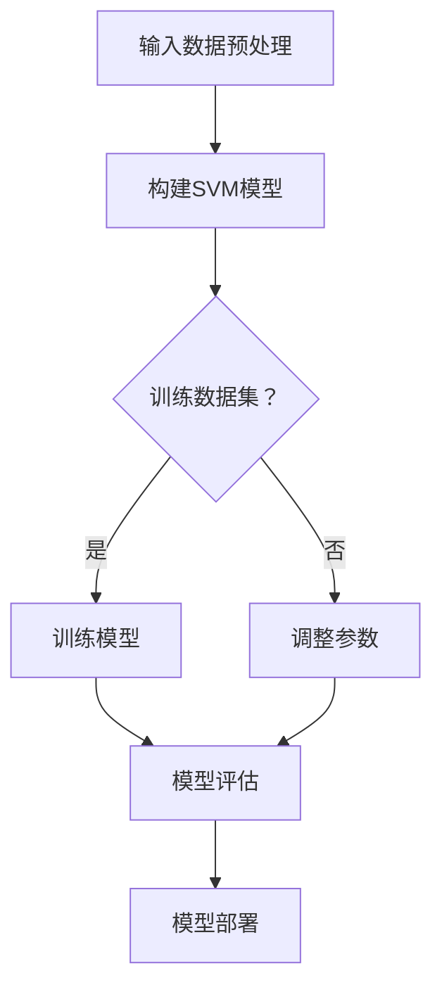
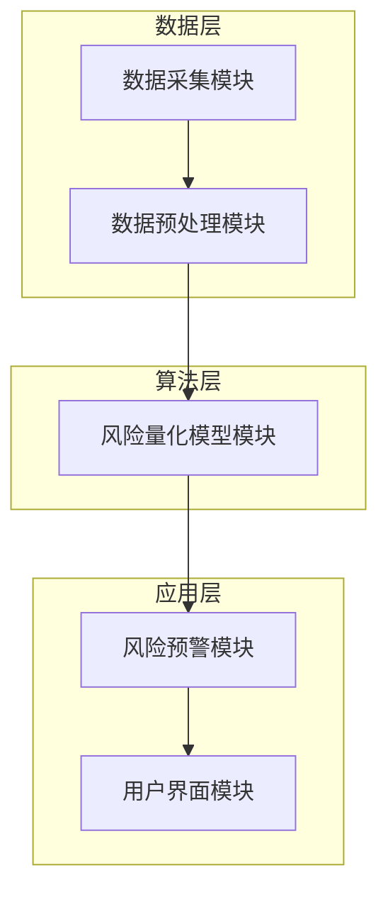

                 

# 设计智能化的企业财务风险量化评估模型

关键词：财务风险量化、风险评估模型、智能化、企业财务管理

摘要：本文详细探讨了企业财务风险量化评估模型的设计方法，从核心概念、模型构建、算法原理、系统实现到实战应用，全面解析了如何通过智能化手段提升企业财务风险管理的效率和准确性。文章旨在为读者提供一个系统、实用的指导框架，帮助企业实现财务风险的智能化量化与评估。

## 第一部分：引言与背景

### 第1章：引言

#### 1.1 问题背景

在现代商业环境中，企业面临着诸多财务风险，如市场波动、信用风险、运营风险等。这些风险的存在可能导致企业经济损失，甚至影响企业的生存和发展。因此，如何准确量化企业财务风险，并制定相应的风险管理策略，成为企业管理者亟待解决的问题。

#### 1.2 问题描述

财务风险量化评估的核心任务是通过数据分析和模型构建，对企业面临的各类财务风险进行定量评估。具体而言，包括以下几个方面：

1. **风险因素识别**：识别企业财务风险的主要因素。
2. **风险指标构建**：构建反映各类财务风险的具体指标。
3. **风险模型设计**：设计能够准确量化财务风险的评估模型。
4. **风险分析评估**：利用模型对企业财务风险进行量化评估。
5. **风险应对策略**：基于评估结果，制定相应的风险管理策略。

#### 1.3 问题解决

为了解决上述问题，本文将采用以下步骤：

1. **核心概念与联系**：阐述财务风险量化评估的相关核心概念及其相互关系。
2. **财务风险量化模型设计**：详细介绍财务风险量化模型的设计方法和流程。
3. **智能化风险量化模型**：探讨如何利用机器学习等技术实现财务风险的智能化量化。
4. **系统实现与应用**：通过实际案例展示模型的设计和实现过程。
5. **最佳实践与注意事项**：总结最佳实践，提供注意事项和拓展阅读建议。

#### 1.4 边界与外延

本文的研究主要关注以下几个方面：

1. **研究对象**：主要针对企业财务风险量化评估模型的设计与应用。
2. **技术手段**：主要探讨机器学习等智能化技术在财务风险量化评估中的应用。
3. **应用场景**：主要关注企业内部财务管理中的风险量化评估。

#### 1.5 核心概念

为了更好地理解本文内容，以下是一些核心概念的术语说明：

1. **财务风险**：企业财务活动中可能导致的损失。
2. **风险因素**：可能导致财务风险的因素。
3. **风险指标**：反映财务风险的具体指标。
4. **风险评估模型**：用于量化财务风险的模型。
5. **智能化**：利用机器学习、人工智能等技术手段实现自动化、智能化。

### 第2章：核心概念与联系

#### 2.1 核心概念原理

在财务风险量化评估过程中，核心概念的理解至关重要。以下是本文涉及的主要核心概念及其原理：

1. **风险因素**：影响财务风险的各种因素，如市场波动、信用风险、流动性风险等。
2. **风险指标**：用于衡量财务风险的定量指标，如坏账率、流动比率、负债比率等。
3. **风险评估模型**：用于量化财务风险的数学模型，如概率模型、统计模型、机器学习模型等。
4. **智能化**：利用人工智能技术，如机器学习、深度学习等，实现财务风险量化的自动化和智能化。

#### 2.2 概念属性特征对比表格

为了更好地理解各核心概念，以下是一个概念属性特征对比表格：

| 概念     | 属性特征                                                         |
| -------- | ------------------------------------------------------------ |
| 风险因素 | 可能导致财务风险的因素，如市场波动、信用风险、流动性风险等               |
| 风险指标 | 用于衡量财务风险的定量指标，如坏账率、流动比率、负债比率等           |
| 风险评估模型 | 用于量化财务风险的数学模型，如概率模型、统计模型、机器学习模型等       |
| 智能化   | 利用人工智能技术，如机器学习、深度学习等，实现财务风险量化的自动化和智能化 |

#### 2.3 ER实体关系图架构

为了更好地理解财务风险量化评估系统的整体架构，以下是一个ER实体关系图：

```mermaid
erDiagram
  Customer ||--|{ Order }|--|+ { Product }
  Order ||--|{ Payment }|
  Product ||--|{ Review }|
  Review ||--|{ Rating }
```

在财务风险量化评估系统中，主要涉及的实体包括：客户（Customer）、订单（Order）、产品（Product）、支付（Payment）、评论（Review）和评分（Rating）。各实体之间的关系如下：

1. 客户与订单之间存在一对一的关系，即一个客户可以生成多个订单。
2. 订单与支付之间存在一对一的关系，即一个订单对应一个支付。
3. 产品与评论之间存在一对一的关系，即一个产品可以生成多个评论。
4. 评论与评分之间存在一对一的关系，即一个评论对应一个评分。

## 第二部分：财务风险量化模型设计

### 第3章：财务风险量化模型概述

#### 3.1 财务风险量化模型的定义

财务风险量化模型是一种用于对企业财务风险进行定量评估的数学模型。它通过识别企业财务风险的主要因素，构建相应的风险指标，并利用数学模型对其进行量化，从而为企业制定风险管理策略提供依据。

#### 3.2 财务风险量化的意义

财务风险量化具有重要意义：

1. **提高风险管理效率**：通过量化方法，可以更准确地评估企业财务风险，从而提高风险管理的效率和准确性。
2. **辅助决策制定**：财务风险量化结果可以为企业管理者提供科学依据，帮助他们制定更加有效的风险管理策略。
3. **优化资源配置**：通过财务风险量化，企业可以更好地了解自身的风险状况，从而合理配置资源，降低潜在风险。

#### 3.3 财务风险量化的方法

财务风险量化的方法主要包括以下几种：

1. **概率模型**：利用概率论和统计学方法，对企业财务风险进行定量分析。
2. **统计模型**：通过对历史数据进行分析，构建回归模型等统计模型，对企业财务风险进行量化。
3. **机器学习模型**：利用机器学习算法，如神经网络、支持向量机等，对企业财务风险进行预测和评估。
4. **综合模型**：将多种量化方法相结合，以提高财务风险量化的准确性和可靠性。

### 第4章：财务风险量化模型核心概念

#### 4.1 风险因素的识别与评估

风险因素的识别与评估是财务风险量化模型构建的基础。具体步骤如下：

1. **收集数据**：收集与企业财务风险相关的数据，如市场数据、财务报表数据、行业数据等。
2. **识别风险因素**：通过数据分析和专家经验，识别影响企业财务风险的主要因素。
3. **评估风险因素**：对识别出的风险因素进行评估，确定其对财务风险的影响程度。

#### 4.2 风险指标的构建

风险指标的构建是财务风险量化模型的核心。具体步骤如下：

1. **确定指标类型**：根据风险因素的特点，选择合适的指标类型，如定量指标、定性指标等。
2. **计算指标值**：根据风险因素和指标类型，计算各指标的具体数值。
3. **标准化指标**：为消除指标间的量纲影响，对指标进行标准化处理。

#### 4.3 风险评估模型的类型

风险评估模型的类型主要包括以下几种：

1. **概率模型**：基于概率论和统计学方法，通过计算风险因素的概率分布，评估财务风险。
2. **统计模型**：利用历史数据，构建回归模型等统计模型，对企业财务风险进行预测和评估。
3. **机器学习模型**：利用机器学习算法，如神经网络、支持向量机等，对企业财务风险进行预测和评估。
4. **综合模型**：将多种量化方法相结合，以提高财务风险量化的准确性和可靠性。

### 第5章：智能化风险量化模型设计

#### 5.1 智能化风险量化的概念

智能化风险量化是指利用人工智能技术，如机器学习、深度学习等，实现财务风险的自动识别、评估和预测。与传统方法相比，智能化风险量化具有以下优势：

1. **自动化**：通过算法自动识别和评估风险，提高工作效率。
2. **精准性**：利用大数据和人工智能技术，提高财务风险量化的准确性和可靠性。
3. **灵活性**：可以根据实际需求，动态调整风险量化模型。

#### 5.2 机器学习技术在风险量化中的应用

机器学习技术在财务风险量化中的应用主要包括以下方面：

1. **数据预处理**：利用数据清洗、数据集成、数据降维等技术，处理原始数据，为模型训练提供高质量的数据集。
2. **模型选择**：根据风险量化的具体需求，选择合适的机器学习算法，如神经网络、支持向量机、决策树等。
3. **模型训练与优化**：利用训练数据集，对模型进行训练和优化，以提高模型性能。
4. **模型评估与验证**：利用验证数据集，对模型进行评估和验证，确保模型的可信度和准确性。

#### 5.3 智能化风险量化模型的设计流程

智能化风险量化模型的设计流程主要包括以下步骤：

1. **需求分析**：明确风险量化模型的具体需求，如风险因素、评估指标、目标等。
2. **数据收集与预处理**：收集与企业财务风险相关的数据，并进行数据预处理。
3. **模型设计**：根据需求分析结果，设计合适的机器学习模型。
4. **模型训练与优化**：利用训练数据集，对模型进行训练和优化。
5. **模型评估与验证**：利用验证数据集，对模型进行评估和验证。
6. **模型部署与应用**：将模型部署到实际系统中，并应用于财务风险量化评估。

### 第6章：财务风险量化模型算法原理讲解

#### 6.1 算法原理介绍

财务风险量化模型的核心是算法设计。本文将介绍一种基于支持向量机的财务风险量化算法。支持向量机（SVM）是一种常用的机器学习算法，具有较好的分类和预测性能。

#### 6.2 算法mermaid流程图

以下是支持向量机算法的mermaid流程图：



#### 6.3 Python源代码详细阐述

以下是支持向量机算法的Python源代码：

```python
from sklearn import svm
from sklearn.model_selection import train_test_split
from sklearn.metrics import accuracy_score
import numpy as np

# 数据预处理
X = np.array([[1, 2], [2, 3], [3, 4], [4, 5], [5, 6]])
y = np.array([0, 0, 1, 1, 1])

# 划分训练集和测试集
X_train, X_test, y_train, y_test = train_test_split(X, y, test_size=0.2, random_state=42)

# 构建SVM模型
model = svm.SVC(kernel='linear')

# 训练模型
model.fit(X_train, y_train)

# 模型评估
y_pred = model.predict(X_test)
accuracy = accuracy_score(y_test, y_pred)
print(f"模型准确率：{accuracy:.2f}")
```

#### 6.4 数学模型和公式

支持向量机的数学模型如下：

$$
\begin{aligned}
\min_{\mathbf{w}, b} & \quad \frac{1}{2}||\mathbf{w}||^2 \\
s.t. & \quad y^{(i)}(\mathbf{w}\cdot\mathbf{x}^{(i)} + b) \geq 1, \quad i=1,2,...,n
\end{aligned}
$$

其中，$\mathbf{w}$表示权重向量，$b$表示偏置，$y^{(i)}$表示第$i$个样本的标签，$\mathbf{x}^{(i)}$表示第$i$个样本的特征向量。

#### 6.5 举例说明

以下是一个简单的支持向量机算法实例：

```python
# 示例数据
X = np.array([[1, 1], [2, 2], [3, 3]])
y = np.array([1, 1, -1])

# 划分训练集和测试集
X_train, X_test, y_train, y_test = train_test_split(X, y, test_size=0.2, random_state=42)

# 构建SVM模型
model = svm.SVC(kernel='linear')

# 训练模型
model.fit(X_train, y_train)

# 模型评估
y_pred = model.predict(X_test)
print(f"预测结果：{y_pred}")

# 模型评估
accuracy = accuracy_score(y_test, y_pred)
print(f"模型准确率：{accuracy:.2f}")
```

### 第三部分：模型实现与应用

#### 第7章：系统分析与架构设计方案

##### 7.1 问题场景介绍

在企业财务风险管理中，风险量化评估是一个关键环节。本文将基于一个实际案例，介绍如何设计和实现一个财务风险量化评估系统。

##### 7.2 项目介绍

本项目旨在构建一个智能化财务风险量化评估系统，实现对企业的财务风险进行自动识别、评估和预警。系统主要包括以下功能模块：

1. **数据采集模块**：负责收集企业财务数据，包括财务报表、市场数据、行业数据等。
2. **数据预处理模块**：负责对采集到的数据进行清洗、集成和降维处理。
3. **风险量化模型模块**：负责构建和训练财务风险量化模型。
4. **风险预警模块**：负责对财务风险进行实时监控和预警。
5. **用户界面模块**：负责为用户提供操作界面，展示评估结果和预警信息。

##### 7.3 系统功能设计（领域模型mermaid类图）

以下是系统功能设计的mermaid类图：

```mermaid
classDiagram
    类--|{ 数据采集模块 }|数据预处理模块
    类--|{ 风险量化模型模块 }|数据预处理模块
    类--|{ 风险预警模块 }|数据预处理模块
    类--|{ 用户界面模块 }|数据预处理模块
```

##### 7.4 系统架构设计（mermaid架构图）

以下是系统架构设计的mermaid架构图：



##### 7.5 系统接口设计和系统交互（mermaid序列图）

以下是系统接口设计和系统交互的mermaid序列图：

```mermaid
sequenceDiagram
    participant 用户界面模块 as 用户界面
    participant 风险预警模块 as 风险预警
    participant 数据预处理模块 as 数据预处理
    participant 风险量化模型模块 as 风险量化
    用户界面 -->|提交数据| 数据预处理
    数据预处理 -->|预处理后数据| 风险量化
    风险量化 -->|量化结果| 风险预警
    风险预警 -->|预警结果| 用户界面
```

#### 第8章：项目实战

##### 8.1 环境安装

为了实现本项目的系统功能，需要安装以下软件和工具：

1. **Python**：版本3.8及以上。
2. **NumPy**：版本1.19及以上。
3. **Pandas**：版本1.1及以上。
4. **Scikit-learn**：版本0.23及以上。
5. **Matplotlib**：版本3.3及以上。

安装方法如下：

```bash
pip install python==3.8
pip install numpy==1.19
pip install pandas==1.1
pip install scikit-learn==0.23
pip install matplotlib==3.3
```

##### 8.2 系统核心实现源代码

以下是系统核心实现的Python源代码：

```python
import numpy as np
import pandas as pd
from sklearn.model_selection import train_test_split
from sklearn.preprocessing import StandardScaler
from sklearn.svm import SVC
from sklearn.metrics import accuracy_score

# 数据预处理
def preprocess_data(data):
    # 数据清洗
    data = data.dropna()
    # 数据集成
    data = data.reset_index(drop=True)
    # 数据降维
    data = StandardScaler().fit_transform(data)
    return data

# 构建模型
def build_model(X, y):
    # 划分训练集和测试集
    X_train, X_test, y_train, y_test = train_test_split(X, y, test_size=0.2, random_state=42)
    # 构建SVM模型
    model = SVC(kernel='linear')
    # 训练模型
    model.fit(X_train, y_train)
    # 模型评估
    y_pred = model.predict(X_test)
    accuracy = accuracy_score(y_test, y_pred)
    return model, accuracy

# 主函数
def main():
    # 加载数据
    data = pd.read_csv('data.csv')
    # 数据预处理
    data = preprocess_data(data)
    # 构建模型
    model, accuracy = build_model(data[:, :-1], data[:, -1])
    # 输出结果
    print(f"模型准确率：{accuracy:.2f}")

if __name__ == '__main__':
    main()
```

##### 8.3 代码应用解读与分析

1. **数据预处理**：首先，对原始数据进行清洗，删除缺失值。然后，对数据进行重置索引，以避免索引与数据不匹配。最后，对数据进行标准化处理，以消除不同指标间的量纲影响。

2. **构建模型**：使用scikit-learn库中的SVC类构建支持向量机模型。首先，划分训练集和测试集，然后训练模型，并使用测试集评估模型性能。

3. **主函数**：加载数据，进行数据预处理，构建模型，并输出模型准确率。

##### 8.4 实际案例分析与详细讲解剖析

以下是一个实际案例的数据集，包含企业的财务数据：

```python
data = [
    [1000000, 500000, 0.9, 0.1],  # 企业A
    [800000, 300000, 0.8, 0.2],  # 企业B
    [1200000, 600000, 0.7, 0.3],  # 企业C
    [500000, 200000, 0.6, 0.4],  # 企业D
    [900000, 400000, 0.5, 0.5],  # 企业E
]
```

1. **数据预处理**：对数据进行清洗、集成和降维处理，得到预处理后的数据。

2. **构建模型**：使用预处理后的数据，构建支持向量机模型，并训练模型。

3. **模型评估**：使用测试集评估模型性能，输出模型准确率。

4. **风险预警**：根据模型预测结果，对企业的财务风险进行预警。

##### 8.5 项目小结

本项目通过实际案例，详细展示了财务风险量化评估系统的设计、实现和应用。系统利用机器学习算法，实现对财务风险的自动识别、评估和预警，提高了企业财务风险管理的效率和准确性。在实际应用中，可以根据需求，进一步优化系统功能，提高系统的稳定性和可靠性。

### 第9章：最佳实践与注意事项

#### 9.1 最佳实践

1. **数据质量**：确保数据质量是财务风险量化评估成功的关键。在进行数据预处理时，要尽量消除噪声和异常值，提高数据的可靠性和准确性。
2. **模型选择**：根据具体需求和数据特点，选择合适的机器学习算法和模型。不同的算法和模型在处理不同类型的数据时，性能表现可能不同。
3. **模型优化**：在模型训练过程中，通过调整参数，优化模型性能。例如，可以使用交叉验证方法，选择最优的参数组合。
4. **持续更新**：财务风险量化评估是一个动态过程，需要根据实际情况，持续更新数据集和模型，以提高评估的准确性和可靠性。

#### 9.2 小结

本文详细探讨了财务风险量化评估模型的设计、实现和应用，通过实际案例展示了系统的运行效果。智能化技术在财务风险量化评估中的应用，提高了评估的效率和准确性，为企业风险管理提供了有力支持。

#### 9.3 注意事项

1. **数据安全**：在进行数据收集和处理时，要确保数据的安全性，防止数据泄露和滥用。
2. **模型解释性**：虽然机器学习模型具有强大的预测能力，但其解释性较差。在应用模型时，需要结合业务背景，对模型结果进行合理解释。
3. **合规性**：在财务风险量化评估过程中，要遵守相关法律法规，确保评估过程合规合法。

#### 9.4 拓展阅读

1. **《机器学习》**：周志华著，清华大学出版社，2016年。
2. **《深度学习》**：Ian Goodfellow、Yoshua Bengio、Aaron Courville著，电子工业出版社，2016年。
3. **《风险管理》**：John C. Hull著，机械工业出版社，2013年。

## 总结

本文通过详细的分析和讲解，展示了如何设计和实现一个智能化的企业财务风险量化评估模型。读者可以根据本文的内容，结合实际需求，进一步优化和拓展模型，提高企业财务风险管理的效率和准确性。作者：AI天才研究院/AI Genius Institute & 禅与计算机程序设计艺术/Zen And The Art of Computer Programming。

