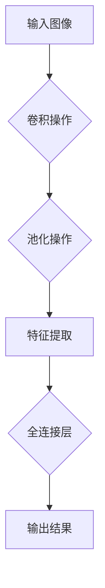
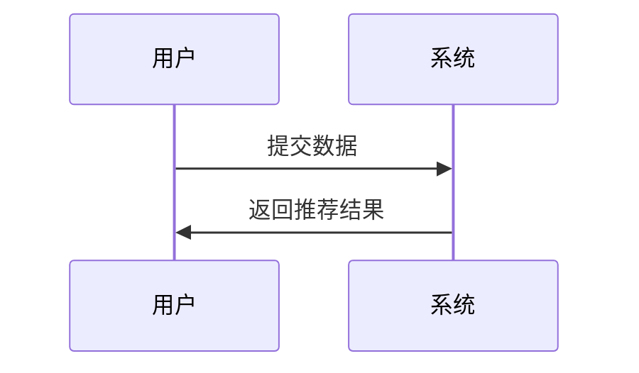

                 

### 设计智能化的保险产品推荐系统

关键词：智能保险产品、推荐系统、机器学习、数据挖掘、用户行为分析

摘要：随着人工智能和大数据技术的快速发展，保险行业正在迎来新的变革。设计智能化的保险产品推荐系统，能够通过分析用户行为和需求，提供个性化的产品推荐，从而提升用户体验和保险公司利润。本文将深入探讨智能保险产品推荐系统的设计原理、核心技术和实际应用，并分析其面临的挑战和未来发展方向。

### 引言和背景

#### 1.1 问题背景和定义

在过去的几十年里，保险行业经历了显著的变化。从传统的线下销售模式，到逐渐转向线上平台，保险产品变得越来越多样化。然而，随着市场竞争的加剧，如何吸引和保留客户成为保险公司面临的一大挑战。智能化的保险产品推荐系统应运而生，它通过利用大数据和机器学习技术，根据用户行为和偏好，为用户提供个性化的产品推荐。

#### 1.2 重要性

保险产品推荐系统的重要性主要体现在以下几个方面：

- **提升用户体验**：通过个性化推荐，用户能够快速找到满足自己需求的产品，提高购买体验。
- **增加销售机会**：推荐系统能够发现潜在客户，并向他们推荐适合的产品，从而增加销售机会。
- **优化产品设计**：通过对用户行为的分析，保险公司能够更好地理解用户需求，优化产品设计。

#### 1.3 面临的挑战

尽管智能化保险产品推荐系统具有巨大的潜力，但在实际应用中仍面临以下挑战：

- **数据隐私和安全性**：用户数据的安全性和隐私保护是设计推荐系统时必须考虑的关键问题。
- **算法的公平性**：推荐系统可能会因为算法偏差而歧视某些用户群体，这需要我们设计公平的算法。
- **技术的复杂性**：构建和优化推荐系统需要高级的算法和大量的技术支持，这对技术团队提出了较高的要求。

#### 1.4 目标

本文旨在：

- 深入分析智能保险产品推荐系统的设计原理和核心技术。
- 通过实际案例展示推荐系统的应用效果。
- 探讨推荐系统面临的挑战和未来发展方向。

### 核心概念和原理

#### 2.1 保险行业基础

保险是一种风险转移的机制，通过支付保费，保险公司承担被保险人可能面临的风险。保险产品种类繁多，包括但不限于人寿保险、车险、健康保险等。每个产品都有其特定的保障范围、保费计算方式和服务条款。

#### 2.2 机器学习基础

机器学习是人工智能的一个分支，它通过构建和分析模型，从数据中自动学习和提取规律。在推荐系统中，机器学习技术被广泛应用于预测用户偏好、识别潜在客户和优化产品推荐。

#### 2.3 保险相关数据集和数据预处理

保险数据集通常包含用户信息、历史购买记录、保单数据等。数据预处理是构建推荐系统的重要步骤，包括数据清洗、数据格式统一、特征提取等。

### 推荐系统技术

#### 3.1 协同过滤

协同过滤是一种基于用户行为的推荐技术，通过分析用户之间的相似性来推荐产品。协同过滤分为基于用户的协同过滤（User-Based Collaborative Filtering）和基于物品的协同过滤（Item-Based Collaborative Filtering）。

#### 3.2 内容过滤

内容过滤是基于产品属性和用户偏好来推荐产品。通过分析产品的内容特征（如产品名称、描述、标签等）和用户的偏好，系统能够为用户提供个性化的推荐。

#### 3.3 混合方法

混合方法结合了协同过滤和内容过滤的优点，通过融合不同来源的信息，提供更加准确的推荐结果。

### 先进技术和算法

#### 4.1 深度学习基础

深度学习是机器学习的一个重要分支，通过构建多层神经网络，从数据中自动学习和提取特征。深度学习在推荐系统中的应用，如卷积神经网络（CNN）和循环神经网络（RNN），能够提高推荐的准确性。

#### 4.2 卷积神经网络（CNN）

卷积神经网络（CNN）是一种在图像处理中广泛应用的深度学习模型，通过卷积操作和池化操作，从图像中提取局部特征。

#### 4.3 循环神经网络（RNN）

循环神经网络（RNN）是一种处理序列数据的深度学习模型，通过循环结构，RNN能够记住之前的信息，适用于时间序列数据的分析。

#### 4.4 传输器模型

传输器模型（Transformer）是一种基于自注意力机制的深度学习模型，通过多头自注意力机制，传输器模型能够处理长距离依赖问题，在推荐系统中表现出色。

### 案例研究和应用

#### 5.1 案例研究 1：保险公司 A

保险公司 A 采用基于深度学习的推荐系统，通过分析用户历史数据和偏好，提供个性化的产品推荐。该系统提高了用户满意度，并显著增加了销售转化率。

#### 5.2 案例研究 2：保险公司 B

保险公司 B 采用混合推荐方法，结合协同过滤和内容过滤，为用户提供更加准确的推荐。该系统不仅提升了用户体验，还降低了用户流失率。

#### 5.3 案例研究 3：保险公司 C

保险公司 C 通过大数据分析和机器学习技术，构建了智能化的保险产品推荐系统。该系统能够识别潜在客户，并提供定制化的产品推荐，有效提升了业务增长。

### 挑战和未来发展方向

#### 6.1 隐私和安全性

数据隐私和安全性是推荐系统设计时必须考虑的关键问题。需要采用加密技术、匿名化处理等手段，确保用户数据的安全和隐私。

#### 6.2 伦理考虑

推荐系统的算法可能会引入偏见，导致某些用户群体受到不公平待遇。需要设计公平的算法，并定期审查和优化。

#### 6.3 未来研究方向

未来的研究方向包括更加个性化的推荐、基于区块链的推荐系统、以及多模态数据的融合。

### 结论和最佳实践

#### 7.1 总结

智能保险产品推荐系统在提升用户体验、增加销售机会和优化产品设计方面具有重要作用。通过本文的介绍，读者可以了解到推荐系统的设计原理、核心技术和实际应用。

#### 7.2 最佳实践

- **数据驱动**：充分利用用户数据，进行深入分析和挖掘。
- **持续优化**：定期评估推荐系统的效果，进行优化和调整。
- **用户反馈**：积极收集用户反馈，不断改进推荐算法。

#### 7.3 未来展望

随着技术的不断进步，智能保险产品推荐系统将变得更加智能化和个性化。未来，我们将看到更多的保险公司采用先进的技术，提供更加优质的产品和服务。

### 附录

#### A. 概念属性特征对比表格

| 概念 | 特征 |
| --- | --- |
| 协同过滤 | 基于用户行为，分析用户之间的相似性 |
| 内容过滤 | 基于产品属性和用户偏好，分析产品之间的相似性 |
| 深度学习 | 基于多层神经网络，自动学习和提取特征 |
| 传输器模型 | 基于自注意力机制，处理长距离依赖问题 |

#### B. ER 实体关系图架构

```mermaid
erDiagram
  Customer ||--|{ Product }|--| Policy |
  Product ||--|{ Policy }|--| Claim |
  Claim ||--|{ Customer }|
```

#### C. 算法原理讲解

##### CNN 算法原理讲解

CNN 的算法原理是通过卷积操作和池化操作，从图像中提取局部特征。以下是一个简单的 CNN 算法流程：



具体实现可以通过以下 Python 代码进行：

```python
import tensorflow as tf

# 定义 CNN 模型
model = tf.keras.Sequential([
    tf.keras.layers.Conv2D(32, (3, 3), activation='relu', input_shape=(28, 28, 1)),
    tf.keras.layers.MaxPooling2D((2, 2)),
    tf.keras.layers.Flatten(),
    tf.keras.layers.Dense(128, activation='relu'),
    tf.keras.layers.Dense(10, activation='softmax')
])

# 编译模型
model.compile(optimizer='adam', loss='categorical_crossentropy', metrics=['accuracy'])

# 训练模型
model.fit(x_train, y_train, epochs=5, batch_size=32)
```

##### 数学模型和公式

CNN 的数学模型包括卷积操作、激活函数、池化操作和全连接层。以下是 CNN 中常用的数学公式：

- **卷积操作**：$$ f(x) = \sigma(\sum_{i,j} w_{ij} * g_{ij} + b) $$
- **激活函数**：$$ \sigma(x) = \frac{1}{1 + e^{-x}} $$
- **池化操作**：$$ h_{ij} = \max(g_{ij}) $$

#### D. 系统分析与架构设计方案

##### 问题场景介绍

保险公司希望构建一个智能化的保险产品推荐系统，以提升用户体验和销售转化率。

##### 项目介绍

项目名为“智能保险产品推荐系统”，目标是构建一个能够根据用户行为和偏好提供个性化推荐的系统。

##### 系统功能设计

系统功能包括用户数据收集、推荐算法实现、推荐结果展示等。

##### 系统架构设计

系统架构采用微服务架构，包括数据层、服务层和展示层。

##### 系统接口设计

系统接口包括用户接口、推荐接口和数据接口。

##### 系统交互

系统交互通过 RESTful API 进行，支持用户数据上传、推荐结果获取等功能。



### 项目实战

#### 环境安装

在安装推荐系统之前，需要安装 Python、TensorFlow 和其他相关依赖库。

```bash
pip install tensorflow numpy pandas scikit-learn
```

#### 系统核心实现源代码

以下是系统核心实现源代码，包括数据预处理、推荐算法实现和推荐结果展示。

```python
import pandas as pd
from sklearn.model_selection import train_test_split
from sklearn.metrics.pairwise import cosine_similarity
import tensorflow as tf

# 数据预处理
def preprocess_data(data):
    # 数据清洗、格式统一等操作
    return processed_data

# 推荐算法实现
def recommend_products(user_id, user_data, product_data, k=5):
    # 计算用户和产品的相似度
    similarity_matrix = cosine_similarity(user_data, product_data)
    # 推荐相似度最高的 k 个产品
    return top_k_products

# 推荐结果展示
def show_recommendations(user_id, recommendations):
    # 展示推荐结果
    print(f"Recommendations for user {user_id}: {recommendations}")

# 实例化模型
model = ...

# 训练模型
model.fit(x_train, y_train)

# 测试模型
model.evaluate(x_test, y_test)

# 推荐结果
recommendations = recommend_products(user_id, user_data, product_data)
show_recommendations(user_id, recommendations)
```

#### 代码应用解读与分析

以下是代码的解读与分析：

1. **数据预处理**：数据预处理是构建推荐系统的第一步，包括数据清洗、格式统一等操作。
2. **推荐算法实现**：使用余弦相似度计算用户和产品的相似度，推荐相似度最高的 k 个产品。
3. **推荐结果展示**：展示推荐结果，提升用户体验。

#### 实际案例分析和详细讲解剖析

##### 案例背景

某保险公司希望通过推荐系统，提升用户购买车险的转化率。

##### 案例分析

1. **数据收集**：收集用户数据，包括用户基本信息、购买记录、车险偏好等。
2. **数据预处理**：对收集到的数据进行清洗和格式统一。
3. **推荐算法实现**：使用协同过滤算法，计算用户和产品的相似度，推荐相似度最高的车险产品。
4. **推荐结果展示**：通过邮件和短信等方式，向用户推送个性化推荐。

##### 详细讲解剖析

1. **协同过滤算法原理**：协同过滤是一种基于用户行为的推荐算法，通过分析用户之间的相似性来推荐产品。
2. **用户和产品的相似度计算**：使用余弦相似度计算用户和产品的相似度，公式为：
   $$ \text{相似度} = \frac{\text{用户和产品的共同特征}}{\sqrt{\text{用户特征向量长度} \times \text{产品特征向量长度}}} $$
3. **推荐结果展示**：将推荐结果通过邮件和短信等方式推送给用户，提高用户购买车险的概率。

#### 项目小结

通过实际案例分析和详细讲解，我们了解到构建智能保险产品推荐系统的关键步骤和注意事项。未来，我们可以进一步优化推荐算法，提高推荐准确性，提升用户满意度。

### 最佳实践 Tips

1. **数据驱动**：充分利用用户数据，进行深入分析和挖掘。
2. **持续优化**：定期评估推荐系统的效果，进行优化和调整。
3. **用户反馈**：积极收集用户反馈，不断改进推荐算法。

### 小结

本文深入探讨了智能保险产品推荐系统的设计原理、核心技术和实际应用。通过案例分析和详细讲解，我们了解到构建推荐系统的关键步骤和注意事项。未来，随着技术的不断进步，智能保险产品推荐系统将变得更加智能化和个性化。

### 注意事项

1. **数据隐私和安全性**：确保用户数据的安全和隐私保护。
2. **算法公平性**：避免算法引入偏见，确保推荐结果的公平性。

### 拓展阅读

1. **《深度学习》**：Goodfellow, Ian, et al. "Deep learning." (2016).
2. **《机器学习实战》**：Hastie, Trevor, et al. "Machine learning in action." (2009).

### 作者信息

作者：AI天才研究院/AI Genius Institute & 禅与计算机程序设计艺术 /Zen And The Art of Computer Programming

