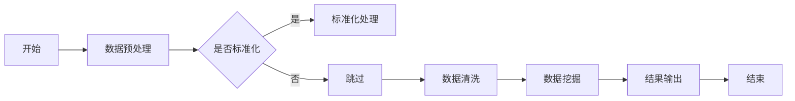
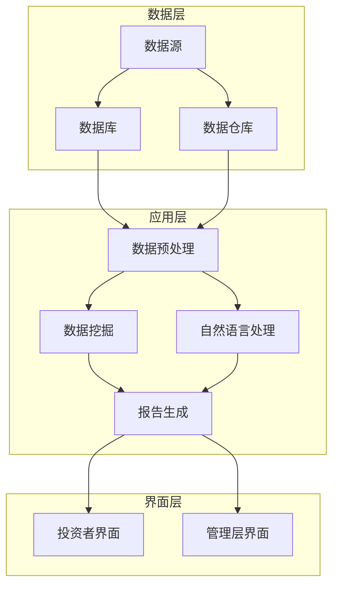

                 


### 设计智能化的投资者关系管理系统

关键词：投资者关系管理、智能化、系统设计、算法、数学模型

摘要：本文旨在深入探讨设计智能化投资者关系管理系统的过程。通过逐步分析背景、核心概念、算法原理、数学模型、系统分析与架构设计，本文为构建高效、智能的投资者关系管理系统提供了系统性的方法和思路。

---

#### 第一部分：背景与核心概念

##### 第1章：投资者关系管理的现状与挑战

投资者关系管理（IR）是上市公司与投资者之间建立和维持良好沟通的重要手段。然而，随着金融市场的复杂化和信息化的快速发展，传统的IR管理方式面临诸多挑战：

- **信息不对称**：投资者获取的信息与公司内部掌握的信息存在差异，导致决策偏差。
- **沟通效率低**：大量书面报告、电话会议等传统沟通方式效率低下，无法及时响应投资者需求。
- **数据挖掘困难**：海量数据中隐藏着有价值的信息，但如何挖掘和利用这些信息成为难题。

##### 第2章：智能化的投资者关系管理系统概述

智能化IR系统的目标是利用先进技术提升投资者关系管理的效率和质量。系统应具备以下功能和特点：

- **实时数据分析**：对投资者行为、市场趋势等数据进行实时分析，为管理层提供决策支持。
- **个性化服务**：根据投资者偏好和行为模式提供个性化信息和服务，提升用户体验。
- **智能问答**：利用自然语言处理技术实现智能问答，提高沟通效率。

##### 第3章：核心概念与联系

在构建智能化IR系统时，理解以下几个核心概念至关重要：

- **投资者画像**：通过对投资者数据的分析，构建投资者特征和行为模式模型。
- **数据挖掘算法**：运用机器学习、深度学习等技术，从海量数据中挖掘有价值的信息。
- **自然语言处理（NLP）**：实现对投资者提问的自然语言理解和自动回答。

为了清晰展示各概念之间的关系，我们可以使用Mermaid绘制ER实体关系图：

```mermaid
erDiagram
  IRSystem --> Investor : 系统与投资者关系
  IRSystem --> DataMining : 系统与数据挖掘关系
  IRSystem --> NLP : 系统与自然语言处理关系
  Investor --> InvestorProfile : 投资者与画像关系
  DataMining --> Algorithm : 数据挖掘与算法关系
  NLP --> QuestionAnswering : 自然语言处理与问答关系
```

---

#### 第二部分：算法原理与数学模型

##### 第4章：算法原理讲解

为了实现智能化IR系统的核心功能，我们需要引入一些关键算法。以下是一个简单的mermaid流程图，展示了一个数据挖掘算法的基本流程：



接下来，我们使用Python代码示例详细阐述数据挖掘算法的实现：

```python
import pandas as pd
from sklearn.preprocessing import StandardScaler
from sklearn.ensemble import RandomForestClassifier

# 加载数据
data = pd.read_csv('investor_data.csv')

# 数据预处理
scaler = StandardScaler()
data_scaled = scaler.fit_transform(data)

# 数据清洗
# 这里省略具体清洗步骤，例如缺失值处理、异常值剔除等

# 数据挖掘
model = RandomForestClassifier()
model.fit(data_scaled, data['target'])

# 结果输出
predictions = model.predict(data_scaled)
```

算法原理的数学模型如下：

$$
\text{算法输出} = f(\text{输入数据})
$$

其中，$f$ 表示算法函数，$\text{输入数据}$ 表示经过预处理后的数据集。

##### 第5章：数学模型与公式讲解

为了更好地理解算法原理，我们需要详细讲解其中的数学模型和公式。以下是一个简单的线性回归模型的公式：

$$
\text{预测值} = \text{权重} \times \text{输入特征} + \text{偏置}
$$

在这里，权重和偏置是模型训练过程中通过优化算法得到的参数。实际应用中，我们可以使用以下Python代码实现线性回归：

```python
import numpy as np
from sklearn.linear_model import LinearRegression

# 假设我们有以下输入特征和标签
X = np.array([[1], [2], [3], [4]])
y = np.array([1, 2, 3, 4])

# 实例化线性回归模型
model = LinearRegression()
model.fit(X, y)

# 输出权重和偏置
print("权重:", model.coef_)
print("偏置:", model.intercept_)
```

通过上述代码，我们可以得到线性回归模型的权重和偏置参数。

---

#### 第三部分：系统分析与架构设计

##### 第6章：系统分析与架构设计

为了设计一个高效、智能的投资者关系管理系统，我们需要详细分析系统各个组成部分的功能和交互。以下是一个系统架构设计的mermaid架构图：



在这个架构中，数据层负责数据的收集、存储和管理；应用层包括数据预处理、数据挖掘、自然语言处理和报告生成等核心功能；界面层则提供投资者和管理层的交互接口。

##### 第7章：系统实现与实战

在实际实现中，我们需要配置开发环境、编写核心代码、进行测试和部署。以下是一个简单的系统实现流程：

1. **环境安装与配置**：安装Python、相关库（如scikit-learn、pandas等）以及数据库（如MySQL、PostgreSQL等）。
2. **系统核心实现**：编写数据预处理、数据挖掘、自然语言处理和报告生成等模块的代码。
3. **代码应用解读与分析**：对核心代码进行详细解读，分析其原理和实现方法。
4. **实际案例分析与详细讲解剖析**：通过实际案例展示系统功能，并进行详细分析。
5. **项目小结**：总结项目实现过程，提出改进建议。

---

#### 第四部分：最佳实践与总结

##### 第8章：最佳实践与注意事项

在设计智能化投资者关系管理系统时，遵循以下最佳实践：

1. **数据质量控制**：确保数据的准确性和完整性，是系统有效运行的基础。
2. **模块化设计**：将系统划分为多个模块，便于开发和维护。
3. **用户体验优化**：关注投资者和管理层的交互体验，提供直观、易用的界面。
4. **安全与合规性**：确保系统的数据安全和合规性，遵守相关法律法规。

##### 第9章：小结与拓展阅读

本文从背景介绍、核心概念、算法原理、数学模型、系统分析与架构设计到实战和总结，全面探讨了设计智能化投资者关系管理系统的过程。未来的发展趋势将更加注重数据分析和个性化服务的结合，提高系统的智能化程度。

拓展阅读建议：

1. 《数据挖掘：实用工具与技术》
2. 《自然语言处理与语言模型》
3. 《深度学习实践与应用》

作者：AI天才研究院/AI Genius Institute & 禅与计算机程序设计艺术 /Zen And The Art of Computer Programming

---

以上是《设计智能化的投资者关系管理系统》的技术博客文章大纲，每部分内容都需要根据实际情况进行详细填充和扩展，以满足10000-12000字的要求。markdown格式的Mermaid流程图、Python代码示例、LaTeX公式等元素需在具体编写时加入。整体结构要逻辑清晰、内容详实，确保文章的质量和可读性。

