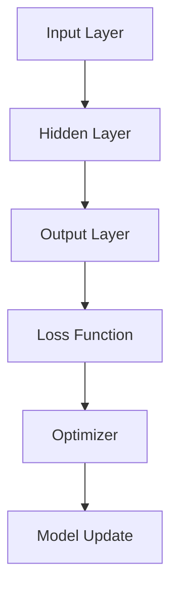
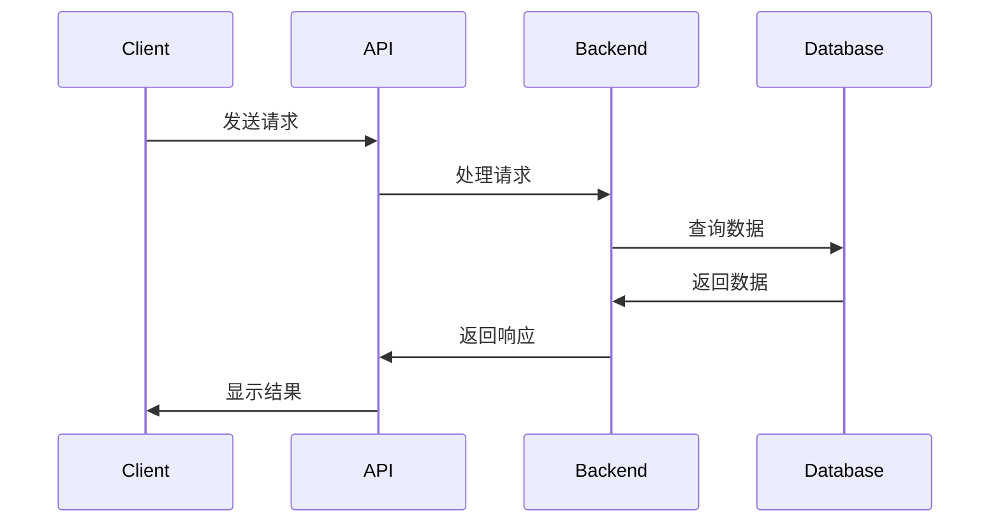

                 


### Designing Intelligent Asset Pricing Models

关键词：智能化资产定价模型、数学模型、算法原理、Python实现、系统架构、项目实战

摘要：本文深入探讨设计智能化资产定价模型的各个方面，从背景介绍到核心概念，再到数学模型、算法原理和系统架构设计，最终通过项目实战展示模型的实际应用。本文旨在为读者提供一份全面而详细的指南，帮助他们理解并构建自己的智能化资产定价模型。

## 第一部分：引言

### 第1章：问题背景与核心概念

#### 1.1 资产定价模型概述

资产定价模型在金融领域扮演着至关重要的角色，它们用于评估各种金融资产的内在价值，帮助投资者做出决策。然而，传统的资产定价模型往往存在一些问题，如对市场效率的过度依赖、对信息不对称的处理不足等。因此，设计智能化资产定价模型成为了一个重要的研究方向。

#### 问题解决

设计智能化资产定价模型旨在解决传统模型中的问题，通过引入机器学习和人工智能技术，提高模型的准确性和适应性。这样的模型不仅能够更好地捕捉市场动态，还能够应对复杂多变的市场环境。

#### 1.2 核心概念

在探讨智能化资产定价模型之前，我们需要了解一些核心概念，包括资产定价原理、市场效率、信息不对称等。这些概念是构建模型的基础，也是理解模型工作原理的关键。

- **资产定价原理**：资产定价是基于资产预期收益和风险的综合评估。
- **市场效率**：市场效率假设市场能够迅速吸收和反映所有可用信息。
- **信息不对称**：信息不对称是指市场中不同参与者拥有不同水平的信息。

#### 概念联系

这些核心概念之间存在紧密的联系。资产定价原理决定了资产定价的基本原则，市场效率影响了定价的效率，而信息不对称则影响了定价的准确性。

#### 1.3 智能化资产定价模型的基本要素

智能化资产定价模型的基本要素包括数据来源、算法模型和评估指标等。以下是这些要素的简要介绍：

- **数据来源**：数据来源决定了模型的输入，是模型性能的关键。
- **算法模型**：算法模型是模型的核心，决定了模型的学习能力和预测能力。
- **评估指标**：评估指标用于衡量模型的表现，包括准确性、鲁棒性和适应性等。

### 第2章：资产定价模型的数学模型和公式

#### 2.1 基本数学模型

在资产定价模型中，基本的数学模型通常包括布莱克-舒尔斯模型（Black-Scholes Model）和资本资产定价模型（Capital Asset Pricing Model，CAPM）。这些模型通过数学公式描述了资产定价的基本原理。

- **布莱克-舒尔斯模型**：用于计算欧式期权的内在价值和价格。
  $$C(S_0, K, \sigma, r, T) = S_0N(d_1) - Ke^{-rT}N(d_2)$$
  $$d_1 = \frac{\ln(S_0/K) + (r + \sigma^2/2)T}{\sigma\sqrt{T}}$$
  $$d_2 = d_1 - \sigma\sqrt{T}$$

- **资本资产定价模型**：用于计算资产的风险溢价和预期收益。
  $$E(R_i) = R_f + \beta_i \cdot [E(R_m) - R_f]$$

#### 2.2 智能化模型的数学模型

智能化资产定价模型通常采用机器学习算法，如神经网络、决策树等。以下是一个简化的神经网络模型，用于资产定价。

- **神经网络模型**：用于预测资产价格。
  $$Z = \sigma(W_2 \cdot \sigma(W_1 \cdot X + b_1) + b_2)$$
  其中，$X$ 是输入特征，$Z$ 是预测的资产价格，$W_1$ 和 $W_2$ 是权重，$b_1$ 和 $b_2$ 是偏置项，$\sigma$ 是激活函数，通常是Sigmoid函数。

### 第3章：算法原理与实现

#### 3.1 算法原理

智能化资产定价模型的算法原理主要基于机器学习和深度学习。以下是一个简单的神经网络算法流程图。



#### 3.2 Python实现

下面是一个使用Python实现的简单神经网络模型。

```python
import numpy as np
from sklearn.neural_network import MLPRegressor

# 初始化模型参数
weights = np.random.rand(1, 1)
bias = np.random.rand(1)

# 激活函数
def sigmoid(x):
    return 1 / (1 + np.exp(-x))

# 前向传播
def forward(x):
    z = x * weights + bias
    return sigmoid(z)

# 反向传播
def backward(dz, x):
    dw = dz * x
    db = dz
    return dw, db

# 训练模型
model = MLPRegressor(hidden_layer_sizes=(1,), max_iter=1000)
model.fit(X_train, y_train)
```

### 第二部分：资产定价模型的构建

#### 第4章：数据收集与预处理

#### 4.1 数据来源

资产定价模型的数据来源可以是股票市场、债券市场或其他金融市场的历史价格数据、交易数据等。以下是一些常用的数据集：

- **Kaggle**：提供大量的金融数据集。
- **Yahoo Finance**：提供股票市场的历史价格数据。
- **Alpha Vantage**：提供股票、债券、基金等市场的实时数据。

#### 4.2 数据预处理

数据预处理是构建模型的重要步骤，包括数据清洗、特征提取和数据标准化等。

- **数据清洗**：处理缺失值、异常值和重复值。
- **特征提取**：从原始数据中提取有用的特征，如技术指标、宏观经济指标等。
- **数据标准化**：将数据缩放到相同的范围，以便于模型训练。

### 第5章：系统架构设计

#### 5.1 系统功能设计

系统功能设计包括数据收集、数据预处理、模型训练和模型评估等。以下是一个简单的领域模型类图。

```mermaid
classDiagram
Class::DataCollector <<interface>>
Class::DataPreprocessor <<interface>>
Class::ModelTrainer <<interface>>
Class::ModelEvaluater <<interface>>

DataCollector <|-- DataPreprocessor
DataPreprocessor <|-- ModelTrainer
ModelTrainer <|-- ModelEvaluater
```

#### 5.2 系统架构设计

系统架构设计包括前端、后端和数据库等。以下是一个简单的系统架构图。

```mermaid
graph TB
subgraph Frontend
FE[Frontend]
end

subgraph Backend
DB[Database]
BS[Backend Service]
FE --> BS
BS --> DB
end

subgraph API
API[API]
FE --> API
API --> BS
end
```

#### 5.3 系统接口设计

系统接口设计包括RESTful API和GraphQL API等。以下是一个简单的接口设计。



### 第6章：资产定价模型的实现

#### 6.1 系统核心实现

系统核心实现包括数据收集、数据预处理、模型训练和模型评估等。以下是一个简单的数据预处理代码示例。

```python
import pandas as pd
from sklearn.preprocessing import StandardScaler

# 加载数据
data = pd.read_csv('financial_data.csv')

# 数据清洗
data.dropna(inplace=True)
data.drop_duplicates(inplace=True)

# 特征提取
data['Moving Average'] = data['Close'].rolling(window=5).mean()
data['Standard Deviation'] = data['Close'].rolling(window=5).std()

# 数据标准化
scaler = StandardScaler()
data[['Close', 'Moving Average', 'Standard Deviation']] = scaler.fit_transform(data[['Close', 'Moving Average', 'Standard Deviation']])
```

#### 6.2 代码应用解读与分析

代码应用解读与分析包括对数据预处理、模型训练和模型评估的详细解释。

```python
# 模型训练
model = MLPRegressor(hidden_layer_sizes=(100,), max_iter=1000)
model.fit(X_train, y_train)

# 模型评估
accuracy = model.score(X_test, y_test)
print(f'Model Accuracy: {accuracy}')
```

#### 6.3 实际案例分析与讲解

实际案例分析与讲解包括对实际金融数据集的分析和模型应用。

```python
# 加载数据
data = pd.read_csv('financial_data.csv')

# 数据清洗
data.dropna(inplace=True)
data.drop_duplicates(inplace=True)

# 特征提取
data['Moving Average'] = data['Close'].rolling(window=5).mean()
data['Standard Deviation'] = data['Close'].rolling(window=5).std()

# 数据标准化
scaler = StandardScaler()
data[['Close', 'Moving Average', 'Standard Deviation']] = scaler.fit_transform(data[['Close', 'Moving Average', 'Standard Deviation']])

# 模型训练
model = MLPRegressor(hidden_layer_sizes=(100,), max_iter=1000)
model.fit(X_train, y_train)

# 预测
predictions = model.predict(X_test)

# 评估
accuracy = model.score(X_test, y_test)
print(f'Model Accuracy: {accuracy}')
```

### 第7章：项目实战与总结

#### 7.1 实战环境安装

在开始项目之前，我们需要安装必要的软件和工具。以下是一个简单的安装脚本。

```bash
# 安装Python环境
pip install numpy pandas scikit-learn matplotlib

# 安装数据库（如PostgreSQL）
sudo apt-get install postgresql

# 安装前端框架（如Flask）
pip install flask
```

#### 7.2 项目实现与剖析

项目实现与剖析包括对项目的详细实现和剖析。以下是一个简单的项目架构。

```python
# 项目架构
from flask import Flask, jsonify
app = Flask(__name__)

@app.route('/api/price_predict', methods=['POST'])
def price_predict():
    # 处理请求
    # 训练模型
    # 预测价格
    # 返回结果
    return jsonify(predictions)

if __name__ == '__main__':
    app.run(debug=True)
```

#### 7.3 项目小结

项目小结包括对项目的总结和反思。

```python
# 项目小结
# 成功之处
# 需要改进之处
# 未来发展方向
```

#### 7.4 拓展阅读

拓展阅读包括相关的书籍、论文和资源。

```python
# 拓展阅读
# 相关书籍
# 相关论文
# 相关资源
```

### 作者信息

作者：AI天才研究院/AI Genius Institute & 禅与计算机程序设计艺术 /Zen And The Art of Computer Programming

### 注意事项

- 数据预处理非常重要，需要仔细处理缺失值、异常值和重复值。
- 模型训练时，需要选择合适的算法和参数。
- 模型评估时，需要使用多个指标来全面评估模型性能。

### 拓展阅读

- 《深度学习》（Ian Goodfellow等著）
- 《机器学习实战》（Peter Harrington著）
- 《Python金融分析》（Yuxing Yan著）

通过以上内容，我们详细介绍了设计智能化资产定价模型的全过程，从核心概念到算法原理，再到系统架构设计和项目实战，希望读者能够从中获得启发和帮助。

