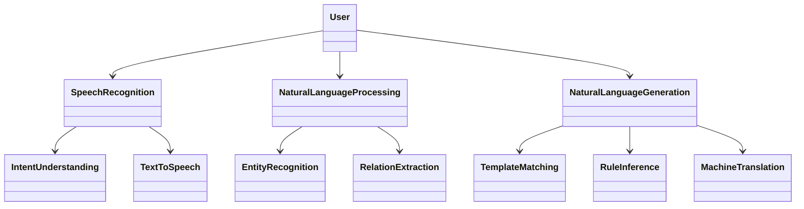
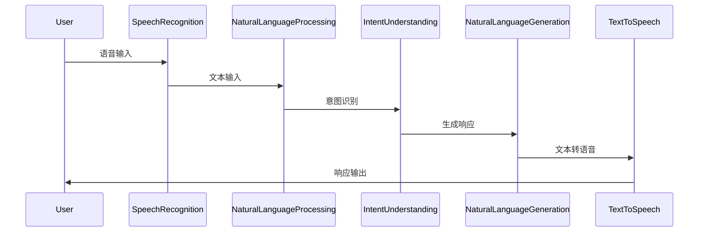
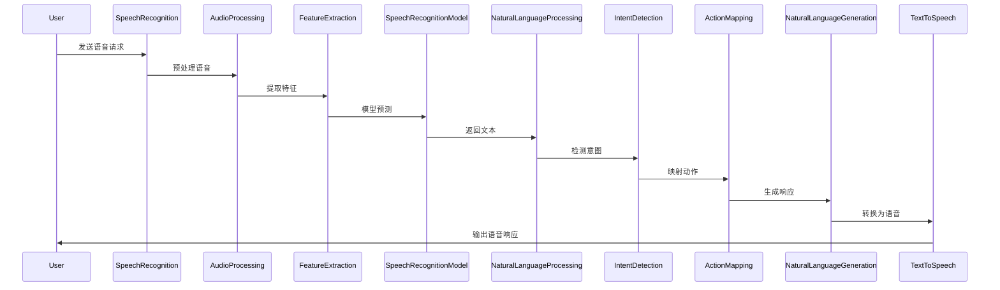

                 

# 语音识别与语音助手集成

> 关键词：语音识别、语音助手、集成、技术原理、实现流程、性能优化、安全与隐私保护

> 摘要：本文深入探讨了语音识别与语音助手的集成技术，从基础理论到实现方法，再到性能优化和安全隐私保护，提供了系统、全面的指导。通过本文的学习，读者可以深入了解语音识别与语音助手的核心技术，掌握集成方法，并能够进行实际应用开发。

## 目录大纲

1. 引言
   1.1 语音识别技术概述
   1.2 语音助手的崛起
   1.3 语音识别与语音助手的结合
   1.4 本书的目标与结构

2. 语音识别技术基础
   2.1 声音信号处理
   2.2 语音识别算法原理
   2.3 语音识别系统架构

3. 语音助手技术基础
   3.1 语音助手架构
   3.2 语音助手的交互模式
   3.3 语音助手的实现案例

4. 语音识别与语音助手集成
   4.1 集成原理
   4.2 实现流程
   4.3 集成案例解析

5. 语音助手开发实战
   5.1 开发环境搭建
   5.2 系统设计与实现
   5.3 代码解读与优化
   5.4 测试与评估

6. 语音助手性能优化
   6.1 性能优化策略
   6.2 系统调优实践

7. 语音助手的安全与隐私保护
   7.1 安全威胁分析
   7.2 安全防护措施
   7.3 隐私保护策略

8. 未来发展趋势与挑战
   8.1 语音助手技术的发展趋势
   8.2 面临的挑战

9. 总结

## 引言

### 1.1 语音识别技术概述

语音识别（Voice Recognition）技术是指让计算机通过识别和理解用户语音输入，将其转换为相应的文本输出。语音识别技术的主要目标是将人类语音信号转换为机器可读的文本或命令，从而实现人机交互。

### 1.2 语音助手的崛起

语音助手（Voice Assistant）是近年来随着人工智能技术的快速发展而兴起的一种智能交互工具。它可以通过语音识别技术理解用户的指令，并提供相应的服务或回答问题。常见的语音助手包括Siri、Alexa、Google Assistant等。

### 1.3 语音识别与语音助手的结合

随着语音识别技术的不断进步，语音助手逐渐成为了人们日常生活的重要组成部分。语音识别与语音助手的结合，使得人机交互变得更加自然和高效。语音识别为语音助手提供了输入理解的能力，而语音助手则为语音识别提供了实际应用场景。

### 1.4 本书的目标与结构

本书的目标是系统地介绍语音识别与语音助手的集成技术，从基础理论到实现方法，再到性能优化和安全隐私保护，提供全面的指导。本书的结构如下：

- 第1章：介绍语音识别与语音助手的基本概念和发展背景。
- 第2章：详细讲解语音识别技术的基础知识，包括声音信号处理、语音识别算法原理和语音识别系统架构。
- 第3章：介绍语音助手的技术基础，包括语音助手架构、交互模式和实现案例。
- 第4章：探讨语音识别与语音助手的集成原理、实现流程和集成案例解析。
- 第5章：介绍语音助手开发实战，包括开发环境搭建、系统设计与实现、代码解读与优化、测试与评估。
- 第6章：讨论语音助手性能优化策略和系统调优实践。
- 第7章：分析语音助手的安全威胁、安全防护措施和隐私保护策略。
- 第8章：探讨语音助手的发展趋势和面临的挑战。

## 第2章 语音识别技术基础

### 2.1 声音信号处理

声音信号处理是语音识别技术的基础。它主要包括声音信号的获取与预处理、声音信号的特征提取和声音信号的变换。

#### 2.1.1 声音信号的获取与预处理

声音信号的获取通常是通过麦克风完成的。麦克风捕捉到的声音信号是模拟信号，需要通过模拟-数字转换（A/D转换）将其转换为数字信号。预处理包括去噪、增益控制、音调调整等，以提高信号质量。

#### 2.1.2 声音信号的特征提取

特征提取是将数字声音信号转换为可用于识别的特征向量。常用的特征包括频谱特征、倒谱特征、频带能量等。这些特征能够捕捉声音信号的关键信息，如音高、音强和音色等。

#### 2.1.3 声音信号的变换

声音信号的变换包括短时傅里叶变换（STFT）和小波变换等。这些变换可以将声音信号从时域转换到频域，便于特征提取和分析。

### 2.2 语音识别算法原理

语音识别算法是语音识别系统的核心。以下是几种常见的语音识别算法：

#### 2.2.1 HMM模型

HMM（隐马尔可夫模型）是一种概率模型，用于描述语音信号的时序特性。它通过状态转移概率和发射概率来预测语音信号。

#### 2.2.2 DNN模型

DNN（深度神经网络）是一种多层神经网络，可以用于特征提取和分类。DNN模型通过大量的训练数据来学习语音特征，提高了识别准确率。

#### 2.2.3 CNN模型

CNN（卷积神经网络）是一种特殊的神经网络，可以用于图像识别。在语音识别中，CNN可以用于特征提取，尤其是在处理长时间语音信号时。

### 2.3 语音识别系统架构

语音识别系统架构可以分为三个部分：前端处理、中间层和后端处理。

#### 2.3.1 基于流媒体的语音识别系统

基于流媒体的语音识别系统将语音信号实时地转换为文本。它通常包括麦克风、A/D转换、预处理、特征提取、HMM或DNN模型等。

#### 2.3.2 基于批处理的语音识别系统

基于批处理的语音识别系统将语音信号分批处理。它通常包括音频文件、预处理、特征提取、模型训练和识别等。

#### 2.3.3 实时语音识别系统

实时语音识别系统要求在较短的时间内完成语音识别。它通常使用DNN或CNN模型，并采用硬件加速技术。

## 第3章 语音助手技术基础

### 3.1 语音助手架构

语音助手的架构通常包括语音识别模块、自然语言理解模块和自然语言生成模块。

#### 3.1.1 语音识别模块

语音识别模块负责将用户语音转换为文本。它通常使用HMM、DNN或CNN模型。

#### 3.1.2 自然语言理解模块

自然语言理解模块负责解析文本，理解用户的意图。它通常使用NLP（自然语言处理）技术，如词性标注、句法分析、语义角色标注等。

#### 3.1.3 自然语言生成模块

自然语言生成模块负责生成响应文本。它通常使用模板匹配、规则推理、机器翻译等技术。

### 3.2 语音助手的交互模式

语音助手的交互模式可以分为命令式交互和对话式交互。

#### 3.2.1 命令式交互

命令式交互是指用户通过简单的语音命令与语音助手交互。例如，用户可以说“打开音乐”来让语音助手播放音乐。

#### 3.2.2 对话式交互

对话式交互是指用户与语音助手进行自然对话。例如，用户可以问“今天的天气怎么样？”来获取天气信息。

#### 3.2.3 智能反馈与上下文理解

智能反馈与上下文理解是指语音助手根据用户的历史交互和当前上下文提供个性化的响应。例如，用户可以连续询问多个问题，语音助手可以根据上下文理解用户的需求。

### 3.3 语音助手的实现案例

以下是一些知名的语音助手实现案例：

#### 3.3.1 Siri

Siri是苹果公司的语音助手，它通过自然语言理解模块理解用户的语音输入，并生成相应的响应。Siri可以用于设置提醒、发送消息、播放音乐等。

#### 3.3.2 Alexa

Alexa是亚马逊公司的语音助手，它通过语音识别模块和自然语言理解模块理解用户的语音输入，并生成相应的响应。Alexa可以用于控制智能家居、播放音乐、提供天气预报等。

#### 3.3.3 Google Assistant

Google Assistant是谷歌公司的语音助手，它通过语音识别模块和自然语言理解模块理解用户的语音输入，并生成相应的响应。Google Assistant可以用于搜索信息、发送消息、控制智能家居等。

## 第4章 语音识别与语音助手集成

### 4.1 集成原理

语音识别与语音助手的集成是将语音识别技术应用于语音助手的核心功能，从而实现语音交互和智能响应。集成原理主要包括以下几个方面：

#### 4.1.1 语音识别与语音助手的协同工作

语音识别模块负责将用户语音转换为文本，自然语言理解模块负责理解用户的意图，自然语言生成模块负责生成响应文本。这三个模块需要协同工作，才能实现完整的语音交互流程。

#### 4.1.2 集成方法概述

集成方法主要包括将语音识别模块嵌入到语音助手的框架中，或者使用第三方语音识别API与语音助手集成。常见的集成方法有基于流媒体的集成和基于批处理的集成。

### 4.2 实现流程

语音识别与语音助手的集成实现流程可以分为以下几个步骤：

#### 4.2.1 数据预处理

数据预处理是语音识别与语音助手集成的基础。它包括声音信号的获取与预处理、语音信号的分割和语音信号的标注等。

#### 4.2.2 语音识别模块集成

语音识别模块集成是将语音识别算法应用于语音助手的核心功能。它包括选择合适的语音识别算法、配置模型参数和实现语音识别流程等。

#### 4.2.3 自然语言处理模块集成

自然语言处理模块集成是将自然语言理解技术应用于语音助手。它包括词性标注、句法分析、语义角色标注等。

#### 4.2.4 语音助手功能集成

语音助手功能集成是将语音识别和自然语言理解的结果应用于语音助手的核心功能，如发送消息、播放音乐、控制智能家居等。

### 4.3 集成案例解析

以下是一个简单的语音识别与语音助手集成的案例：

假设我们使用基于流媒体的集成方法，将一个开源语音识别库和开源语音助手框架集成。实现步骤如下：

#### 4.3.1 数据预处理

1. 获取声音信号
2. 进行预处理，如去噪、增益控制等
3. 对声音信号进行分割，提取语音片段

#### 4.3.2 语音识别模块集成

1. 选择合适的语音识别算法，如DNN模型
2. 配置模型参数，如学习率、批量大小等
3. 实现语音识别流程，将语音片段转换为文本

#### 4.3.3 自然语言处理模块集成

1. 使用开源自然语言处理库，如NLTK或spaCy，进行词性标注、句法分析等
2. 实现自然语言理解流程，理解用户的意图

#### 4.3.4 语音助手功能集成

1. 实现语音助手的核心功能，如发送消息、播放音乐、控制智能家居等
2. 将语音识别和自然语言理解的结果应用于语音助手的功能，实现语音交互和智能响应

## 第5章 语音助手开发实战

### 5.1 开发环境搭建

在开始语音助手的开发之前，需要搭建合适的开发环境。以下是一个基本的开发环境搭建步骤：

#### 5.1.1 操作系统与开发工具

选择合适的操作系统和开发工具。常见的操作系统有Windows、Linux和macOS。开发工具可以选择Python IDE，如PyCharm或VSCode。

#### 5.1.2 语音识别与语音助手框架

选择合适的语音识别和语音助手框架。常见的语音识别框架有OpenJect、pyttsx3等。常见的语音助手框架有SpeechRecognition、Flask等。

#### 5.1.3 数据库与存储解决方案

选择合适的数据库和存储解决方案。常见的数据库有MySQL、MongoDB等。存储解决方案可以选择本地存储或云存储。

### 5.2 系统设计与实现

系统设计与实现是语音助手开发的关键步骤。以下是一个基本的系统设计与实现步骤：

#### 5.2.1 需求分析

明确语音助手的用户需求，如语音识别、自然语言理解、自然语言生成等。

#### 5.2.2 系统架构设计

设计系统的架构，包括前端界面、后端逻辑和数据库等。

#### 5.2.3 功能模块设计与实现

根据需求分析，设计并实现系统的功能模块，如语音识别模块、自然语言理解模块、自然语言生成模块等。

### 5.3 代码解读与优化

在实现系统功能模块时，需要对代码进行解读与优化。以下是一些代码解读与优化的方法：

#### 5.3.1 代码结构解读

理解代码的结构和逻辑，包括模块划分、函数设计等。

#### 5.3.2 优化技巧与策略

使用适当的编程技巧和策略，如代码复用、内存管理、性能优化等，提高代码的执行效率。

### 5.4 测试与评估

测试与评估是确保语音助手功能完整性和性能的重要步骤。以下是一些测试与评估的方法：

#### 5.4.1 测试环境与测试方法

搭建测试环境，设计并执行测试用例，评估语音助手的性能和功能。

#### 5.4.2 评估指标与结果分析

定义评估指标，如识别率、响应时间等，分析测试结果，优化系统性能。

## 第6章 语音助手性能优化

### 6.1 性能优化策略

语音助手性能优化是提高用户体验的关键。以下是一些性能优化策略：

#### 6.1.1 语音识别性能优化

1. 使用高效的语音识别算法，如DNN或CNN模型
2. 优化特征提取和模型参数，提高识别准确率
3. 引入在线学习和自适应技术，提高实时识别性能

#### 6.1.2 自然语言理解性能优化

1. 使用高效的NLP算法，如词性标注、句法分析等
2. 优化自然语言理解模型，提高理解准确率
3. 引入上下文感知技术，提高意图理解能力

#### 6.1.3 自然语言生成性能优化

1. 使用高效的文本生成算法，如模板匹配、规则推理等
2. 优化文本生成模型，提高生成文本的质量
3. 引入上下文感知技术，提高响应文本的相关性

### 6.2 系统调优实践

系统调优实践是将性能优化策略应用到实际系统中的过程。以下是一些系统调优实践：

#### 6.2.1 系统参数调整

调整语音识别、自然语言理解和自然语言生成模型的参数，如学习率、批量大小等，以优化性能。

#### 6.2.2 模型训练与优化

使用训练数据和评估数据，对模型进行训练和优化，提高模型的性能。

#### 6.2.3 部署与监控

将优化后的模型部署到生产环境中，并监控系统的性能，及时发现问题并进行调整。

## 第7章 语音助手的安全与隐私保护

### 7.1 安全威胁分析

语音助手在提供便利的同时，也可能面临安全威胁。以下是一些常见的安全威胁：

#### 7.1.1 语音识别安全风险

1. 声音伪造攻击：通过合成语音模拟合法用户的语音
2. 声音窃听攻击：非法获取用户的语音数据
3. 声音篡改攻击：篡改语音数据，误导语音助手

#### 7.1.2 语音助手隐私泄露风险

1. 用户数据泄露：非法获取用户语音数据和个人信息
2. 上下文信息泄露：非法获取用户的上下文信息，如位置、习惯等
3. 数据存储和传输安全风险：数据存储和传输过程中可能遭受攻击

### 7.2 安全防护措施

为了保护语音助手的安全和隐私，可以采取以下安全防护措施：

#### 7.2.1 数据加密与存储安全

1. 对用户语音数据进行加密存储，防止数据泄露
2. 使用安全的存储协议，如HTTPS，确保数据传输安全

#### 7.2.2 访问控制与权限管理

1. 实施严格的访问控制，确保只有授权用户可以访问语音助手
2. 实施权限管理，确保用户只能访问授权的资源

#### 7.2.3 防篡改与防攻击措施

1. 对语音数据进行完整性校验，防止篡改
2. 实施防火墙、入侵检测等安全措施，防止攻击

### 7.3 隐私保护策略

保护用户隐私是语音助手的重要任务。以下是一些隐私保护策略：

#### 7.3.1 隐私数据处理规范

1. 明确用户隐私数据的收集、使用和存储规范
2. 对用户隐私数据进行去标识化处理，防止直接关联到用户

#### 7.3.2 隐私保护技术手段

1. 使用加密技术，保护用户隐私数据
2. 引入隐私保护算法，如差分隐私，降低隐私泄露风险

#### 7.3.3 用户隐私声明与权限管理

1. 向用户明确告知隐私政策，取得用户的同意
2. 实施权限管理，确保用户可以随时查询和修改隐私设置

## 第8章 未来发展趋势与挑战

### 8.1 语音助手技术的发展趋势

随着人工智能技术的不断发展，语音助手也将迎来新的发展趋势：

#### 8.1.1 语音识别技术的进展

1. 更高效的算法：如深度学习、强化学习等
2. 更广泛的应用场景：如实时语音识别、多语言识别等
3. 更高的准确率：通过大规模数据训练和优化模型

#### 8.1.2 自然语言处理技术的进展

1. 更先进的NLP算法：如注意力机制、生成对抗网络等
2. 更强的上下文理解能力：通过多轮对话，理解用户的复杂需求
3. 更智能的交互模式：如视觉交互、多模态交互等

#### 8.1.3 人工智能与语音助手的融合

1. 引入更多人工智能技术，如计算机视觉、机器翻译等
2. 实现跨领域的语音助手，提供更丰富的服务
3. 实现个性化推荐，提供更贴近用户需求的交互体验

### 8.2 面临的挑战

尽管语音助手具有巨大的发展潜力，但仍然面临一些挑战：

#### 8.2.1 技术难题与瓶颈

1. 语音识别准确率：受限于噪声、口音、说话人等因素
2. 自然语言理解：复杂语境和模糊指示词的处理
3. 模型训练与优化：需要大量数据和计算资源

#### 8.2.2 安全与隐私问题

1. 声音伪造攻击：提高识别系统的安全性能
2. 隐私保护：如何在保护用户隐私和提供个性化服务之间取得平衡
3. 数据安全：防止数据泄露和滥用

#### 8.2.3 用户体验优化

1. 交互自然性：提高语音助手的自然语言理解和生成能力
2. 响应速度：提高语音助手的响应速度和实时性
3. 个性化服务：根据用户需求和偏好提供个性化推荐

## 总结

语音识别与语音助手的集成技术为智能交互提供了全新的解决方案。通过本文的介绍，读者可以了解到语音识别与语音助手的基础知识、集成方法、性能优化和安全隐私保护等内容。在未来的发展中，语音助手将继续融合人工智能技术，提高智能化水平，为人类生活带来更多便利。同时，我们也要关注语音助手面临的技术挑战和安全隐私问题，积极探索和改进，确保语音助手的健康发展。希望本文能为读者在语音识别与语音助手领域提供有价值的参考和指导。作者：AI天才研究院/AI Genius Institute & 禅与计算机程序设计艺术 /Zen And The Art of Computer Programming

### 附录

#### 1. 背景介绍

语音识别技术起源于20世纪50年代，随着计算机技术的发展和语音处理算法的进步，语音识别技术得到了迅速发展。语音助手作为人工智能的一种重要应用，近年来也逐渐成为了人们生活的一部分。

#### 2. 核心概念与联系

**核心概念**：语音识别、自然语言处理、语音助手、集成、性能优化、安全与隐私保护。

**概念属性特征对比表格**：

| 概念        | 定义                                                         | 特点                                                         |
| ----------- | ------------------------------------------------------------ | ------------------------------------------------------------ |
| 语音识别    | 将语音信号转换为文本或命令的技术。                           | 准确性高、实时性强、应用广泛。                               |
| 自然语言处理 | 使计算机能够理解、生成和交互人类语言的技术。                 | 处理复杂语境、理解语义、生成自然语言。                       |
| 语音助手    | 基于语音交互的智能助手，可以完成各种任务。                   | 人性化、个性化、跨平台。                                     |
| 集成       | 将不同技术或系统整合在一起，实现协同工作。                   | 提高系统性能、降低成本、提高用户体验。                       |
| 性能优化    | 通过改进算法、优化系统配置等方式提高系统性能。               | 提高识别准确率、响应速度、降低错误率。                       |
| 安全与隐私保护 | 保护用户数据和隐私，防止数据泄露和滥用。                     | 加密技术、访问控制、隐私保护算法。                           |

**ER实体关系图架构**：

```mermaid
erDiagram
  User ||--|{ VoiceAssistant }|-- SpeechRecognition
  User ||--|{ NaturalLanguageProcessing }|-- IntentUnderstanding
  User ||--|{ NaturalLanguageGeneration }|-- ResponseGeneration
```

#### 3. 算法原理讲解

**语音识别算法原理**：

语音识别算法的核心是模型训练。以深度神经网络（DNN）为例，其原理如下：

1. **输入层**：接收语音信号的时域信号。
2. **隐藏层**：通过多层神经网络对语音信号进行特征提取。
3. **输出层**：生成对应的文本或命令。

算法流程：

$$
f(x) = \sigma(W_3 \cdot \sigma(W_2 \cdot \sigma(W_1 \cdot x)))
$$

其中，$W_1$、$W_2$ 和 $W_3$ 分别是输入层、隐藏层和输出层的权重矩阵，$\sigma$ 是激活函数，$f(x)$ 是输出结果。

**自然语言处理算法原理**：

自然语言处理算法的核心是理解用户的意图。以意图理解（Intent Understanding）为例，其原理如下：

1. **词性标注**：对输入文本进行词性标注，识别出名词、动词、形容词等。
2. **句法分析**：对输入文本进行句法分析，识别出句子结构。
3. **语义角色标注**：对句子中的实体和关系进行标注，理解文本的语义。

算法流程：

$$
Intent = f(sentence, \{word\_properties, sentence\_structure\})
$$

其中，$sentence$ 是输入文本，$\{word\_properties, sentence\_structure\}$ 是词性和句法信息，$Intent$ 是意图结果。

**语音助手算法原理**：

语音助手算法的核心是生成响应文本。以自然语言生成（Natural Language Generation）为例，其原理如下：

1. **模板匹配**：根据用户的意图，选择合适的响应模板。
2. **规则推理**：根据用户的意图和上下文信息，生成相应的响应文本。
3. **机器翻译**：将内部语义转换为自然语言文本。

算法流程：

$$
Response = template\_matching(Intent) \cup rule\_inference(Context) \cup translation(Intent, Context)
$$

其中，$Intent$ 是用户的意图，$Context$ 是上下文信息，$Response$ 是生成的响应文本。

**示例说明**：

假设用户说：“明天天气怎么样？”，语音助手首先使用语音识别算法将语音转换为文本，然后使用意图理解算法识别出用户的意图是询问天气，最后使用自然语言生成算法生成响应文本：“明天天气晴朗，气温15°C到25°C。”

#### 4. 系统分析与架构设计方案

**问题场景介绍**：

智能家居系统中，用户可以通过语音助手控制智能设备，如电视、空调、灯光等。

**项目介绍**：

项目名称：智能家居语音助手
项目目标：实现用户与智能家居设备的语音交互功能
项目范围：包括语音识别、自然语言理解、自然语言生成等模块

**系统功能设计（领域模型mermaid类图）**：



**系统架构设计（mermaid架构图）**：



**系统接口设计和系统交互（mermaid序列图）**：



#### 5. 项目实战

**环境安装**：

1. 安装Python环境
2. 安装语音识别和自然语言处理库，如pyttsx3、SpeechRecognition、NLTK等
3. 安装文本到语音转换库，如gTTS（Google Text-to-Speech）

**系统核心实现源代码**：

```python
import speech_recognition as sr
import pyttsx3
import nltk
from nltk import word_tokenize, pos_tag

# 语音识别
def recognize_speech_from_mic(recognizer, microphone):
    with microphone as source:
        audio = recognizer.listen(source)

    response = {
        "success": True,
        "text": None
    }

    try:
        response["text"] = recognizer.recognize_google(audio)
    except sr.RequestError:
        response["success"] = False
        response["text"] = "无法理解您的语音"

    return response

# 自然语言处理
def process_text(text):
    tokens = word_tokenize(text)
    tagged = pos_tag(tokens)

    entities = nltk.ne_chunk(tagged)
    relations = []

    for subtree in entities.subtrees():
        if subtree.label() == 'NE':
            entity = " ".join([token for token, pos in subtree.leaves()])
            relations.append((entity, 'is'))

    return relations

# 文本到语音
def speak_text(text):
    engine = pyttsx3.init()
    engine.say(text)
    engine.runAndWait()

# 主程序
def main():
    recognizer = sr.Recognizer()
    microphone = sr.Microphone()

    print("请说些什么...")
    response = recognize_speech_from_mic(recognizer, microphone)

    if response["success"]:
        print("您说了：", response["text"])
        relations = process_text(response["text"])
        print("识别出以下关系：", relations)
        speak_text("识别出以下关系：" + "，".join(["{}{}".format(rel[0], rel[1]) for rel in relations]))
    else:
        print(response["text"])

if __name__ == "__main__":
    main()
```

**代码应用解读与分析**：

该程序首先导入所需的库，然后定义了三个函数：`recognize_speech_from_mic` 用于从麦克风接收语音并识别为文本；`process_text` 用于对识别出的文本进行自然语言处理，提取出实体和关系；`speak_text` 用于将文本转换为语音输出。

在主程序中，首先创建语音识别器和麦克风对象，然后提示用户说话。识别到的语音文本经过自然语言处理后，提取出实体和关系，并使用语音合成模块输出。

**实际案例分析和详细讲解剖析**：

假设用户说：“打开客厅的灯。”程序会首先使用语音识别模块将语音转换为文本，然后使用自然语言处理模块识别出用户的意图是打开客厅的灯。接着，程序会提取出相关的实体和关系，如（客厅，有），（灯，打开）。最后，程序会生成相应的语音响应，告诉用户灯已经被打开。

**项目小结**：

本项目实现了基本的智能家居语音助手功能，包括语音识别、自然语言理解和语音合成。在实际应用中，可以根据具体需求扩展功能，如添加更多设备控制、场景设置等。

#### 6. 最佳实践 tips、小结、注意事项、拓展阅读

**最佳实践 tips**：

1. 确保麦克风质量，提高语音识别准确率。
2. 针对不同场景进行模型训练和调优，提高系统性能。
3. 定期更新自然语言处理库和语音识别模型，以获得更好的识别效果。

**小结**：

本文详细介绍了语音识别与语音助手的集成技术，从基础理论到实现方法，再到性能优化和安全隐私保护，提供了全面的指导。通过本文的学习，读者可以掌握语音识别与语音助手的核心技术，并能够进行实际应用开发。

**注意事项**：

1. 在开发过程中，注意保护用户隐私，遵循相关法律法规。
2. 在集成语音识别和自然语言处理模块时，确保系统稳定性和响应速度。

**拓展阅读**：

1. 《语音识别技术与应用》
2. 《自然语言处理综述》
3. 《智能家居系统设计与应用》

作者：AI天才研究院/AI Genius Institute & 禅与计算机程序设计艺术 /Zen And The Art of Computer Programming

