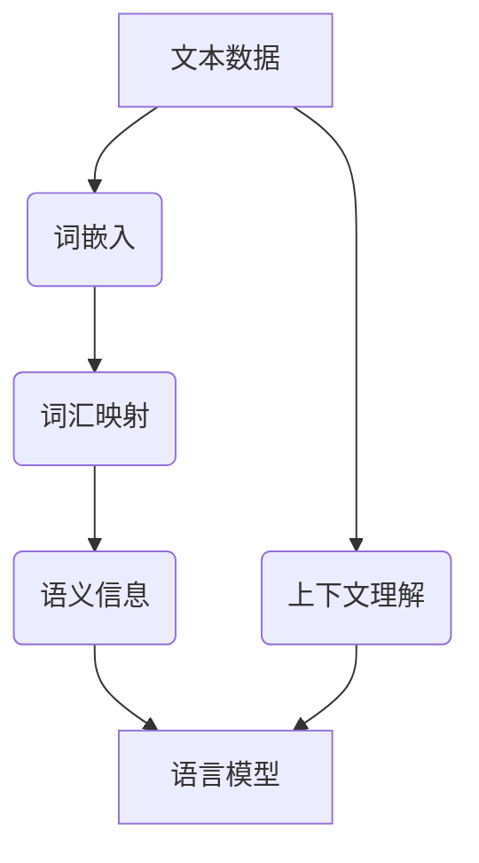

                 

## 跨学科知识整合AI的背景与意义

### 1.1 跨学科知识整合AI的概念与定义

跨学科知识整合AI，是指将不同学科领域的知识、信息和技术进行有机结合，以实现智能化处理和应用的AI系统。这种AI系统不仅依赖于单一领域的知识，而是通过跨学科的融合，形成一种全新的、更为全面和深入的智能能力。跨学科知识整合AI的基本概念主要包括以下几个方面：

- **知识整合**：将不同领域、不同来源的信息进行整合，使其在统一的框架下被计算机理解和处理。这需要解决数据的异构性、不一致性和复杂性等问题。

- **智能处理**：利用机器学习、自然语言处理、知识图谱等技术，对整合后的知识进行智能分析、推理和决策。智能处理不仅仅是信息的检索和匹配，更涉及到深层次的理解和推理。

- **多学科融合**：将不同领域的专业知识进行融合，形成一种全新的、跨学科的智能体系。这种体系能够在解决复杂问题时，提供更加全面、深入的分析和解决方案。

### 1.2 跨学科知识整合AI的重要性

跨学科知识整合AI的重要性主要体现在以下几个方面：

- **解决复杂问题**：复杂问题往往涉及到多个领域，单一领域的知识和方法难以解决。跨学科知识整合AI可以将不同领域的知识结合起来，提供更为全面和深入的解决方案。

- **促进技术创新**：跨学科的知识整合能够激发新的科研思路和发明创造，推动技术的进步和创新。

- **提升决策效率**：跨学科知识整合AI能够提供更为精准和全面的数据分析，帮助企业或组织做出更为明智和高效的决策。

- **推动社会发展**：跨学科知识整合AI在医疗、教育、金融、工业等领域都有广泛的应用前景，能够推动社会的进步和发展。

### 1.3 跨学科知识整合AI的发展历程

跨学科知识整合AI的发展历程可以追溯到20世纪中期，但真正意义上的发展始于21世纪初。以下是几个关键的发展阶段：

- **早期探索**（20世纪50年代至70年代）：这一时期主要是基于逻辑推理和规则系统的AI研究，如专家系统和知识工程。尽管这些方法具有一定的局限性，但为后来的发展奠定了基础。

- **人工智能复兴**（20世纪80年代至90年代）：随着计算机硬件和软件的发展，机器学习、自然语言处理等技术逐渐成熟，AI开始迈向实际应用。

- **大数据与云计算时代**（21世纪初至今）：大数据和云计算的兴起，为跨学科知识整合AI提供了丰富的数据资源和强大的计算能力。这一时期，深度学习、知识图谱等新技术得到广泛应用，跨学科知识整合AI进入快速发展阶段。

### 1.4 跨学科知识整合AI的应用领域

跨学科知识整合AI在各个领域都有广泛的应用，以下是几个主要的应用领域：

- **工业**：通过跨学科知识整合AI，可以实现生产过程的自动化和智能化，提高生产效率和产品质量。

- **医疗**：跨学科知识整合AI在医疗领域有广泛的应用，如疾病诊断、药物研发、患者护理等，能够提供更为精准和个性化的医疗服务。

- **教育**：跨学科知识整合AI可以为学生提供个性化的学习方案，促进教育公平，提高教育质量。

- **金融**：跨学科知识整合AI在金融领域有广泛的应用，如风险控制、投资决策、客户服务等，能够提高金融服务的效率和准确性。

- **交通**：跨学科知识整合AI在交通领域有广泛的应用，如智能交通管理、自动驾驶、交通规划等，能够提高交通效率和安全性。

### 1.5 跨学科知识整合AI的发展趋势

跨学科知识整合AI的未来发展趋势主要包括以下几个方面：

- **多模态数据处理**：随着物联网、传感器等技术的发展，跨学科知识整合AI将能够处理更多样化的数据，包括文本、图像、音频、视频等。

- **知识图谱的广泛应用**：知识图谱作为一种结构化的知识表示方法，将在跨学科知识整合AI中发挥更加重要的作用。

- **自主推理与决策能力**：跨学科知识整合AI将进一步提升自主推理和决策能力，实现更为智能化的应用。

- **跨学科合作的深化**：随着跨学科知识整合AI的发展，不同学科之间的合作将更加紧密，推动AI技术的创新和应用。

### 1.6 技术挑战与机遇

跨学科知识整合AI的发展面临着许多技术挑战，如：

- **数据整合与处理**：不同领域的数据格式、结构和质量差异大，如何有效整合和处理这些数据是一个重要挑战。

- **知识表示与融合**：不同领域的知识表示方法和融合策略各异，如何实现有效的知识表示和融合是另一个挑战。

- **计算资源与能耗**：跨学科知识整合AI通常需要大量的计算资源和能耗，如何在保证性能的同时降低能耗是一个重要问题。

然而，这些挑战也带来了新的机遇：

- **技术创新**：跨学科知识整合AI将推动新技术的研发和应用，如多模态数据处理、知识图谱、自主推理等。

- **行业变革**：跨学科知识整合AI将在各个行业引发深刻的变革，推动产业的升级和转型。

### 结论

跨学科知识整合AI作为一种新兴的AI技术，具有广泛的应用前景和重要的研究价值。通过跨学科的融合，跨学科知识整合AI能够提供更为全面和深入的智能解决方案，推动社会的进步和发展。

## 第2章: LLM（大型语言模型）的原理与应用

### 2.1 LLM的基本原理

LLM（Large Language Model）即大型语言模型，是自然语言处理（NLP）领域的一种重要技术。它通过学习大量的文本数据，生成语言模型，并利用这种模型对文本进行生成、分类、翻译等操作。LLM的基本原理主要包括以下几个方面：

- **文本数据学习**：LLM通过大量文本数据的学习，了解语言的统计特性，包括词汇的使用频率、句子的结构等。这种学习过程通常采用无监督学习的方法，如变换器（Transformer）模型。

- **语言模型生成**：基于学习到的文本数据，LLM生成一个语言模型。这个模型能够预测下一个词或者下一句的可能性，从而实现对文本的生成。

- **词汇表示**：LLM使用词嵌入（Word Embedding）技术将词汇映射到高维空间，以便进行数学运算。词嵌入技术能够捕捉词汇的语义信息，使得LLM能够更好地理解和生成语言。

- **上下文理解**：LLM能够处理上下文信息，通过对上下文的关注，生成与上下文相符的文本。这种能力使得LLM在生成文本时能够保持连贯性和逻辑性。

### 2.2 LLM的训练与优化方法

LLM的训练和优化是一个复杂的过程，主要包括以下几个步骤：

- **数据预处理**：在训练LLM之前，需要对文本数据进行预处理，包括去除停用词、标点符号、分词等。此外，还需要对文本数据进行清洗，去除噪声和错误。

- **模型初始化**：初始化LLM的参数，通常采用随机初始化或者预训练模型进行初始化。预训练模型是通过在大规模数据集上预训练得到的，能够提供较好的初始值。

- **训练过程**：通过梯度下降（Gradient Descent）等优化算法，调整模型的参数，使其更好地拟合训练数据。训练过程中，需要使用反向传播（Backpropagation）算法计算损失函数，并根据损失函数的梯度调整模型参数。

- **优化策略**：为了提高训练效率，可以使用一些优化策略，如学习率调整、正则化等。此外，还可以使用分布式训练和并行计算等方法，提高训练速度。

- **评估与调整**：通过评估指标（如损失函数值、准确率等）评估模型性能，并根据评估结果调整模型参数，以提高模型的性能。

### 2.3 LLM的核心技术

LLM的核心技术主要包括词嵌入、注意力机制和Transformer模型等：

- **词嵌入**：词嵌入是将词汇映射到高维空间的一种技术，通过这种方式，词汇之间的相似性可以被量化。词嵌入技术能够捕捉词汇的语义信息，使得LLM能够更好地理解和生成语言。

- **注意力机制**：注意力机制（Attention Mechanism）是一种在神经网络中用于处理序列数据的技术。它能够自动关注序列中的关键部分，从而提高模型的序列处理能力。

- **Transformer模型**：Transformer模型是一种基于自注意力机制的深度学习模型，广泛应用于NLP任务中。它能够处理长序列数据，并保持序列的连贯性。

### 2.4 LLM的应用场景

LLM在多个领域都有广泛的应用，以下是几个主要的应用场景：

- **机器翻译**：LLM能够根据源语言和目标语言的文本数据，生成高质量的翻译结果。例如，谷歌翻译使用的就是基于Transformer的LLM。

- **文本生成**：LLM能够根据给定的文本提示，生成连贯的文本内容。例如，自动写作、摘要生成等。

- **问答系统**：LLM能够理解用户的问题，并生成相关的回答。例如，智能客服、问答机器人等。

- **推荐系统**：LLM能够根据用户的兴趣和行为数据，生成个性化的推荐内容。

### 2.5 LLM的优势与局限性

LLM的优势主要体现在以下几个方面：

- **强大的语言理解能力**：LLM通过学习大量的文本数据，能够生成高质量的语言表达，具有较强的语言理解能力。

- **灵活的应用场景**：LLM能够应用于多个领域，如机器翻译、文本生成、问答系统等。

- **高效的处理速度**：由于使用了深度学习模型，LLM在处理大规模数据时能够保持较高的速度。

然而，LLM也存在一些局限性：

- **数据依赖性**：LLM的性能依赖于训练数据的质量和规模，如果数据质量差或者数据规模不足，会导致模型性能下降。

- **解释能力**：LLM在生成文本时，虽然能够保持一定的连贯性和逻辑性，但往往缺乏深度和逻辑推理能力。

- **安全性问题**：由于LLM生成的文本可能涉及到敏感信息，如何保证其生成的内容安全可靠是一个重要问题。

### 2.6 LLM的未来发展趋势

随着技术的不断发展，LLM在未来有望在以下几个方面取得进一步的发展：

- **多模态数据处理**：LLM将能够处理更多样化的数据，如图像、音频、视频等，实现跨模态的融合和交互。

- **更高效的训练方法**：随着计算资源的提升，LLM的训练和优化方法将更加高效，能够处理更大规模的数据和更复杂的模型。

- **更强的推理能力**：通过结合知识图谱和其他推理技术，LLM将能够提供更强的问题解决和决策能力。

- **更好的安全性**：随着安全技术的进步，LLM将能够更好地保护用户隐私和数据安全。

## 第3章: 跨学科知识整合AI Agent的设计与实现

### 3.1 跨学科知识整合AI Agent的概念

跨学科知识整合AI Agent，是指一种能够跨学科整合多种知识资源，具备综合分析能力和自主决策能力的智能体。这种AI Agent不同于传统的单一领域AI模型，它能够在多个学科领域内进行知识整合，提供更加全面和深入的智能服务。跨学科知识整合AI Agent的概念主要包括以下几个方面：

- **跨学科知识整合**：AI Agent能够整合来自不同学科领域的知识资源，如医学、工程、经济学等，形成统一的知识体系。

- **综合分析能力**：AI Agent具备对整合后的知识进行综合分析和推理的能力，能够从多个角度对问题进行分析和决策。

- **自主决策能力**：AI Agent能够在没有人工干预的情况下，根据知识和分析结果进行自主决策，实现智能化的任务执行。

### 3.2 跨学科知识整合AI Agent的架构设计

跨学科知识整合AI Agent的架构设计是其实现的关键，一个典型的跨学科知识整合AI Agent架构包括以下几个模块：

- **数据获取与处理模块**：该模块负责从不同的数据源获取数据，如文本、图像、音频等，并进行数据预处理，如去噪、分词、标注等，确保数据的质量和一致性。

- **知识融合模块**：该模块负责将来自不同学科领域的知识进行融合，形成统一的知识体系。知识融合的方法包括知识图谱、实体链接、文本挖掘等。

- **推理与决策模块**：该模块负责对整合后的知识进行推理和决策，以实现对问题的分析和解决。推理方法包括逻辑推理、概率推理、模糊推理等。

- **交互与反馈模块**：该模块负责与用户进行交互，收集用户的反馈，并据此调整AI Agent的行为和决策。

### 3.3 跨学科知识整合AI Agent的实现方法

跨学科知识整合AI Agent的实现方法主要包括基于LLM的AI Agent和基于多模态数据的AI Agent：

- **基于LLM的AI Agent**：基于LLM的AI Agent主要通过大型语言模型进行文本数据的处理和分析。这种方法的优势在于LLM具有强大的语言理解和生成能力，能够处理复杂的文本数据。具体实现步骤包括：

  1. **数据获取与处理**：从多个学科领域获取文本数据，并进行预处理，如去噪、分词、标注等。

  2. **知识融合**：使用LLM对预处理后的文本数据进行处理，生成知识图谱，实现跨学科知识的整合。

  3. **推理与决策**：基于知识图谱和LLM的推理能力，对问题进行推理和决策。

  4. **交互与反馈**：通过与用户的交互，收集反馈信息，并据此调整AI Agent的行为和决策。

- **基于多模态数据的AI Agent**：基于多模态数据的AI Agent主要通过融合文本、图像、音频等多模态数据进行处理和分析。这种方法的优势在于能够综合利用不同类型的数据，提供更加全面和深入的智能服务。具体实现步骤包括：

  1. **数据获取与处理**：从多个学科领域获取文本、图像、音频等多模态数据，并进行预处理，如去噪、分词、标注、图像分割等。

  2. **知识融合**：使用多模态数据融合技术，如注意力机制、多模态图谱等，将不同类型的数据进行融合，形成统一的知识体系。

  3. **推理与决策**：基于融合后的知识体系，对问题进行推理和决策。

  4. **交互与反馈**：通过与用户的交互，收集反馈信息，并据此调整AI Agent的行为和决策。

### 3.4 跨学科知识整合AI Agent的应用实例

跨学科知识整合AI Agent在多个领域都有广泛的应用实例，以下是几个典型的应用场景：

- **医疗领域**：跨学科知识整合AI Agent可以帮助医生进行疾病诊断和治疗建议。例如，通过整合医学知识、患者病历、实验室检查结果等多方面信息，AI Agent可以提供更加全面和精准的诊断结果。

- **教育领域**：跨学科知识整合AI Agent可以作为智能教育助手，为学生提供个性化的学习方案。例如，通过整合学生的学习记录、学科知识、课程内容等多方面信息，AI Agent可以为学生推荐适合的学习资源和课程。

- **金融领域**：跨学科知识整合AI Agent可以帮助金融机构进行风险管理和投资决策。例如，通过整合市场数据、宏观经济信息、公司财报等多方面信息，AI Agent可以提供更加全面和准确的风险评估和投资建议。

- **工业领域**：跨学科知识整合AI Agent可以帮助企业进行生产优化和设备维护。例如，通过整合生产数据、设备运行数据、维修记录等多方面信息，AI Agent可以提供更加全面和精准的生产优化建议和设备维护方案。

### 3.5 跨学科知识整合AI Agent的发展趋势

随着技术的不断进步，跨学科知识整合AI Agent的发展趋势主要包括以下几个方面：

- **多模态数据处理**：随着物联网、传感器等技术的发展，AI Agent将能够处理更多样化的数据，包括文本、图像、音频、视频等，实现跨模态的融合和交互。

- **知识融合技术的进步**：随着知识图谱、实体链接、多模态数据融合等技术的不断发展，AI Agent将能够更加高效地整合跨学科知识，提供更加全面和深入的智能服务。

- **推理能力的提升**：通过结合逻辑推理、概率推理、模糊推理等先进技术，AI Agent的推理能力将得到进一步提升，能够解决更加复杂的问题。

- **人机交互的优化**：随着自然语言处理、语音识别等技术的发展，AI Agent的人机交互能力将得到显著提升，能够更加自然和高效地与用户进行交互。

- **自主决策能力的增强**：通过不断学习和优化，AI Agent的自主决策能力将得到增强，能够在没有人工干预的情况下，实现更加智能化的任务执行。

### 3.6 结论

跨学科知识整合AI Agent作为一种新兴的AI技术，具有广泛的应用前景和重要的研究价值。通过跨学科的融合，跨学科知识整合AI Agent能够提供更加全面和深入的智能解决方案，推动各个领域的技术创新和社会进步。

## 第4章: LLM的语言理解能力

### 4.1 语言理解的挑战

语言理解是自然语言处理（NLP）的核心任务之一，其目的是让机器能够像人类一样理解和处理自然语言。然而，语言理解面临着许多挑战：

- **语义理解**：语义理解是指机器能够理解词语、句子或段落的含义。这涉及到词汇的多义性、隐喻和比喻等复杂语言现象。例如，单词“bank”在不同语境下可能表示“银行”或“河岸”，如何准确理解其含义是一个挑战。

- **上下文理解**：上下文理解是指机器能够根据上下文信息来理解词语和句子的含义。这涉及到句子间的逻辑关系、语境的细微变化等。例如，“I am feeling sad today”中的“sad”可能表示情绪，而“the weather is sad”中的“sad”则表示天气状况。

- **多语言理解**：多语言理解是指机器能够理解并处理多种语言。这涉及到语言之间的差异、翻译的准确性等。例如，将中文的“我爱你”翻译成英文时，需要考虑文化差异和语境，确保翻译的准确性。

- **情感分析**：情感分析是指机器能够识别文本中的情感倾向，如正面、负面或中性。这涉及到情感表达的复杂性、多变性等。例如，文本“这不是很好，但也不坏”可能同时表达正负情感，如何准确识别是一个挑战。

### 4.2 LLM的语言理解机制

LLM通过学习大量的文本数据，建立了强大的语言理解机制，其主要机制包括：

- **词嵌入技术**：词嵌入是将词汇映射到高维空间的一种技术，使得词汇之间的相似性可以被量化。通过词嵌入，LLM能够捕捉词汇的语义信息，从而更好地理解语言。

- **注意力机制**：注意力机制是一种在神经网络中用于处理序列数据的技术。它能够自动关注序列中的关键部分，从而提高模型的序列处理能力。在语言理解中，注意力机制能够帮助LLM更好地捕捉上下文信息。

- **Transformer模型**：Transformer模型是一种基于自注意力机制的深度学习模型，广泛应用于NLP任务中。它能够处理长序列数据，并保持序列的连贯性。Transformer模型的核心是多头自注意力（Multi-Head Self-Attention）机制，能够同时关注序列中的多个部分。

- **预训练与微调**：LLM通常采用预训练与微调的方法进行训练。预训练是在大规模语料库上进行的，使模型具备了一定的语言理解能力。微调则是在特定任务上进行的，使模型能够针对特定任务进行调整和优化。

### 4.3 LLM的语言理解应用

LLM在语言理解方面有广泛的应用，以下是几个主要的应用领域：

- **文本分类**：文本分类是指将文本数据按照其内容进行分类。LLM能够通过对大量文本数据的学习，掌握不同类别的特征，从而实现高精度的文本分类。例如，新闻分类、情感分析等。

- **命名实体识别**：命名实体识别（Named Entity Recognition, NER）是指识别文本中的特定实体，如人名、地名、组织名等。LLM通过对命名实体在文本中的上下文关系的理解，能够准确地识别出文本中的命名实体。

- **语义角色标注**：语义角色标注是指识别文本中每个词语的语义角色，如主语、谓语、宾语等。LLM能够通过对大量文本数据的学习，理解词语在句子中的角色和作用，从而实现语义角色标注。

- **问答系统**：问答系统是指机器能够理解用户的问题，并生成相关的回答。LLM通过对大量问答对的学习，能够理解问题的含义，并生成准确的回答。例如，智能客服、智能问答机器人等。

- **机器翻译**：机器翻译是指将一种语言的文本翻译成另一种语言。LLM通过对多语言文本数据的学习，能够掌握不同语言之间的对应关系，从而实现高质量的机器翻译。

### 4.4 LLM在语言理解中的优势

LLM在语言理解方面具有以下优势：

- **强大的语言理解能力**：LLM通过学习大量的文本数据，建立了强大的语言理解机制，能够准确理解语言中的复杂结构和语义。

- **灵活的应用场景**：LLM可以应用于多个领域的语言理解任务，如文本分类、命名实体识别、语义角色标注、问答系统和机器翻译等。

- **高效的模型结构**：Transformer模型作为LLM的基础，具有高效的模型结构和强大的计算能力，能够在处理大规模数据时保持较高的效率。

- **预训练与微调的结合**：预训练与微调的方法使LLM能够在多种任务上表现出色，通过预训练获取通用的语言理解能力，通过微调适应特定任务的需求。

### 4.5 LLM在语言理解中的局限性

尽管LLM在语言理解方面具有许多优势，但也存在一些局限性：

- **数据依赖性**：LLM的性能依赖于训练数据的质量和规模。如果训练数据不足或者质量差，LLM的语言理解能力会受到影响。

- **解释能力**：LLM在生成文本时，虽然能够保持一定的连贯性和逻辑性，但往往缺乏深度和逻辑推理能力，难以解释其生成的文本。

- **安全性问题**：由于LLM生成的文本可能涉及到敏感信息，如何保证其生成的内容安全可靠是一个重要问题。

- **多语言理解**：尽管LLM能够处理多种语言，但不同语言之间的差异和复杂性使得多语言理解仍是一个挑战。

### 4.6 LLM语言理解能力的评估方法

评估LLM语言理解能力的方法主要包括以下几个方面：

- **准确率**：通过比较LLM生成的文本与真实文本的匹配度，评估LLM的准确性。

- **F1值**：F1值是精确率和召回率的调和平均值，用于评估LLM的分类能力。

- **BLEU分数**：BLEU（Bilingual Evaluation Understudy）分数是一种用于评估机器翻译质量的指标，也可以用于评估LLM生成的文本质量。

- **人类评估**：通过人类评估员对LLM生成的文本进行主观评估，评估LLM的语言理解能力。

### 4.7 LLM语言理解能力的发展趋势

随着技术的不断进步，LLM在语言理解能力方面有望取得以下发展：

- **多模态数据处理**：通过结合文本、图像、音频等多模态数据，LLM将能够实现更全面的语言理解。

- **更强的推理能力**：通过结合逻辑推理、概率推理等技术，LLM的推理能力将得到提升。

- **更好的解释性**：通过改进模型结构和训练方法，LLM的生成文本将更加清晰和可解释。

- **多语言理解**：随着多语言数据的增加和模型训练的优化，LLM的多语言理解能力将得到提升。

### 4.8 结论

LLM在语言理解方面具有强大的能力，能够应用于多个领域的语言理解任务。然而，LLM也存在一些局限性，如数据依赖性、解释能力不足等。随着技术的不断进步，LLM的语言理解能力有望得到进一步提升，为各个领域的智能应用提供更加全面和深入的解决方案。

## 第5章: LLM的逻辑推理能力

### 5.1 逻辑推理的基本原理

逻辑推理是人工智能（AI）中的一个重要研究领域，它涉及从已知事实推导出新事实的过程。逻辑推理的基本原理包括以下几个方面：

- **前提与结论**：逻辑推理通常包括前提和结论两个部分。前提是已知的事实或假设，结论是基于前提推导出的新事实或结论。

- **推理规则**：推理规则是逻辑推理的基本工具，它定义了如何从前提推导出结论。常见的推理规则包括模态推理、归纳推理、演绎推理等。

- **命题逻辑**：命题逻辑是逻辑推理的基础，它研究命题之间的逻辑关系，如命题的否定、合取、析取、蕴含等。

- **谓词逻辑**：谓词逻辑是命题逻辑的扩展，它引入了变量和量词，能够表达更加复杂的逻辑关系，如全称量词和存在量词。

### 5.2 LLM的逻辑推理能力

LLM（大型语言模型）在逻辑推理方面具有一定的能力，这主要得益于其强大的语言理解和生成能力。以下是LLM在逻辑推理方面的几个关键点：

- **语义理解**：LLM通过学习大量的文本数据，能够理解词汇和句子的语义信息，从而能够正确理解和应用逻辑规则。

- **上下文感知**：LLM能够处理上下文信息，从句子间的逻辑关系中推导出新的事实。例如，在对话中，LLM能够根据对话的历史记录推导出新的结论。

- **模式识别**：LLM通过模式识别技术，能够发现文本中的逻辑模式和规则。例如，LLM可以通过学习多个例子，识别出某些特定结构或规则，并在新情境中应用这些规则。

- **自动推理**：LLM能够自动进行逻辑推理，从已知的前提推导出新的结论。这种能力使得LLM能够应用于需要逻辑推理的智能任务，如自动证明、逻辑分析等。

### 5.3 LLM的逻辑推理过程

LLM的逻辑推理过程可以分为以下几个步骤：

1. **输入理解**：首先，LLM需要理解输入的文本，包括前提和问题的语义信息。

2. **模式匹配**：然后，LLM会在其训练数据中寻找与输入文本相似的模式和规则，以确定如何处理输入文本。

3. **推理**：基于找到的模式和规则，LLM会进行逻辑推理，从前提推导出结论。这个过程中，LLM可能会使用到各种逻辑规则，如蕴含、否定等。

4. **输出生成**：最后，LLM会根据推理结果生成合适的输出，如回答问题、生成证明等。

### 5.4 LLM在逻辑推理中的应用

LLM在逻辑推理方面有广泛的应用，以下是几个典型的应用场景：

- **问答系统**：LLM可以应用于智能问答系统，通过逻辑推理从大量文本数据中找到与问题相关的信息，并生成回答。

- **自动证明**：LLM可以应用于数学和逻辑证明，通过逻辑推理自动生成证明步骤，帮助用户理解和验证证明过程。

- **逻辑分析**：LLM可以应用于逻辑分析任务，如文本分类、情感分析等，通过逻辑推理提取文本中的关键信息。

- **智能助手**：LLM可以应用于智能助手，如智能客服、虚拟助手等，通过逻辑推理与用户进行自然对话，提供帮助和解决方案。

### 5.5 LLM逻辑推理能力的评估方法

评估LLM逻辑推理能力的常见方法包括：

- **准确率**：通过比较LLM生成的推理结果与真实结果之间的匹配度，评估LLM的推理准确性。

- **F1值**：F1值是精确率和召回率的调和平均值，用于评估LLM在逻辑推理任务中的综合性能。

- **人类评估**：通过人类评估员对LLM生成的推理结果进行主观评估，评估LLM的逻辑推理能力。

### 5.6 LLM逻辑推理能力的局限

尽管LLM在逻辑推理方面具有一定的能力，但仍然存在一些局限：

- **数据依赖性**：LLM的推理能力依赖于其训练数据的质量和规模。如果训练数据不足或质量差，LLM的逻辑推理能力会受到影响。

- **解释能力**：LLM生成的推理过程通常缺乏透明性和解释性，难以被人类理解和验证。

- **复杂性**：对于一些复杂的逻辑推理任务，LLM可能难以处理，特别是在涉及大量抽象概念和复杂逻辑关系时。

- **偏见**：LLM在训练过程中可能会学习到一些偏见和错误的信息，这可能会影响其逻辑推理的准确性。

### 5.7 LLM逻辑推理能力的发展趋势

随着AI技术的不断发展，LLM的逻辑推理能力有望得到进一步提升，主要发展趋势包括：

- **多模态数据处理**：通过结合文本、图像、音频等多模态数据，LLM将能够实现更加全面和深入的逻辑推理。

- **知识融合**：通过结合知识图谱和其他知识表示方法，LLM将能够更好地整合跨学科知识，提高逻辑推理的准确性。

- **解释性增强**：随着对神经网络理解和优化技术的进步，LLM生成的推理过程将变得更加透明和可解释。

- **自动化**：通过开发更加高效的推理算法和自动化工具，LLM将能够在更多的实际场景中实现自动化逻辑推理。

### 5.8 结论

LLM在逻辑推理方面具有一定的能力，能够应用于多个领域的逻辑推理任务。然而，LLM的逻辑推理能力仍然存在一些局限，需要进一步的研究和改进。随着AI技术的不断发展，LLM的逻辑推理能力有望得到进一步提升，为各个领域的智能应用提供更加有效和可靠的解决方案。

## 第6章: LLM的知识融合能力

### 6.1 知识融合的挑战

知识融合是跨学科知识整合AI Agent的核心任务之一，其目的是将来自不同领域、不同来源的知识进行有机结合，形成一个统一的知识体系。然而，知识融合面临着许多挑战：

- **知识的异构性**：不同领域的数据格式、结构和质量差异大，如何实现知识的统一表示和处理是一个重要挑战。

- **知识的不一致性**：不同来源的知识可能存在矛盾、重复或错误，如何解决这些不一致性是一个关键问题。

- **知识的复杂性**：知识融合涉及到的知识类型多样，包括文本、图像、音频、视频等，如何处理这些复杂的数据是一个挑战。

- **知识的动态性**：知识是不断更新和演化的，如何实时融合新知识，保持知识体系的 freshness 是一个重要问题。

### 6.2 LLM的知识融合机制

LLM（大型语言模型）在知识融合方面具有独特的优势，其知识融合机制主要包括以下几个方面：

- **预训练与微调**：LLM通过预训练学习大量的文本数据，建立了一个强大的语言理解机制。在特定任务上，LLM通过微调进一步优化其参数，使其能够更好地适应特定场景的需求。

- **多模态数据处理**：LLM能够处理多种类型的数据，如文本、图像、音频等，通过多模态数据处理技术，LLM能够整合不同类型的数据，形成统一的知识表示。

- **知识图谱**：知识图谱是一种结构化的知识表示方法，通过将实体和关系表示为节点和边，知识图谱能够直观地表示知识体系。LLM通过结合知识图谱，能够更好地理解和融合跨学科知识。

- **注意力机制**：注意力机制是LLM的核心技术之一，它能够自动关注关键信息，提高模型的序列处理能力。在知识融合中，注意力机制能够帮助LLM更好地捕捉和整合不同来源的知识。

### 6.3 知识融合策略

实现知识融合的策略多种多样，以下是几种常用的策略：

- **基于规则的融合**：通过定义一系列规则，将不同来源的知识进行映射和整合。这种方法简单有效，但依赖于规则的完备性和准确性。

- **基于机器学习的融合**：使用机器学习算法，如聚类、分类、回归等，自动识别和整合不同来源的知识。这种方法能够处理大量的数据，但需要大量的训练数据和计算资源。

- **基于知识图谱的融合**：通过知识图谱表示知识，并利用图谱算法进行知识融合。这种方法能够直观地表示知识体系，但需要复杂的数据预处理和图谱构建过程。

- **多模态数据的融合**：通过融合文本、图像、音频等多模态数据，形成统一的知识表示。这种方法能够充分利用不同类型的数据，提高知识融合的准确性和全面性。

### 6.4 知识融合在LLM中的应用

LLM在知识融合方面有广泛的应用，以下是几个典型的应用场景：

- **跨领域问答**：通过知识融合，LLM能够理解并回答涉及多个领域的复杂问题。例如，一个涉及医学、工程和物理学的问题，LLM可以通过融合医学知识、工程知识和物理学知识，生成准确的答案。

- **知识图谱构建**：LLM可以用于知识图谱的构建，通过自动识别实体和关系，构建结构化的知识体系。例如，在构建一个百科知识图谱时，LLM可以通过学习大量的文本数据，自动识别和链接不同领域的知识点。

- **智能推荐系统**：通过知识融合，LLM能够提供个性化的推荐服务。例如，在电子商务平台上，LLM可以通过融合用户行为、商品属性、历史交易数据等多方面信息，为用户推荐适合的商品。

- **自动化报告生成**：LLM可以用于自动化报告生成，通过融合不同的数据源，自动生成报告。例如，在金融领域，LLM可以通过融合市场数据、财务报表、新闻资讯等，自动生成投资分析报告。

### 6.5 知识融合能力的评估方法

评估LLM的知识融合能力的方法主要包括：

- **准确率**：通过比较LLM生成的融合结果与真实结果之间的匹配度，评估LLM的知识融合准确性。

- **F1值**：F1值是精确率和召回率的调和平均值，用于评估LLM在知识融合任务中的综合性能。

- **人类评估**：通过人类评估员对LLM生成的融合结果进行主观评估，评估LLM的知识融合能力。

### 6.6 知识融合能力的未来发展趋势

随着AI技术的不断发展，LLM的知识融合能力有望在以下几个方面取得突破：

- **多模态数据处理**：通过结合文本、图像、音频等多模态数据，LLM将能够实现更加全面和深入的知识融合。

- **知识图谱的优化**：随着知识图谱技术的发展，LLM将能够更加高效地构建和维护知识图谱，提高知识融合的准确性和效率。

- **推理能力的提升**：通过结合逻辑推理、概率推理等技术，LLM的推理能力将得到进一步提升，能够实现更加复杂和智能的知识融合。

- **实时知识更新**：随着实时数据处理技术的进步，LLM将能够实时融合新知识，保持知识体系的 freshness。

### 6.7 结论

LLM在知识融合方面具有强大的能力，能够实现跨学科、跨领域的知识整合。然而，知识融合仍然面临许多挑战，如知识的异构性、不一致性和动态性等。随着AI技术的不断发展，LLM的知识融合能力有望得到进一步提升，为各个领域的智能应用提供更加全面和深入的解决方案。

## 第7章: LLM的综合分析能力评估与应用

### 7.1 LLM的综合分析能力评估方法

评估LLM的综合分析能力是一个复杂的过程，需要从多个维度进行综合评估。以下是几种常用的评估方法：

- **准确率**：准确率是评估LLM综合分析能力的一个基本指标，它通过比较LLM生成的结果与真实结果之间的匹配度来衡量。例如，在文本分类任务中，准确率可以衡量LLM将文本正确分类到相应类别的比例。

- **F1值**：F1值是精确率和召回率的调和平均值，它能够更加全面地衡量LLM的性能。精确率是指正确预测为正例的样本占所有预测为正例的样本的比例，召回率是指正确预测为正例的样本占所有实际为正例的样本的比例。F1值在分类任务中具有很高的应用价值。

- **BLEU分数**：BLEU（Bilingual Evaluation Understudy）分数是一种常用于评估机器翻译质量的指标，它通过比较LLM生成的翻译结果与参考翻译之间的相似度来评估LLM的性能。BLEU分数适用于需要高质量文本生成的任务。

- **人类评估**：通过人类评估员对LLM生成的结果进行主观评估，可以更准确地衡量LLM的综合分析能力。人类评估员可以基于具体任务的要求，对LLM生成的结果进行准确性、流畅性、可理解性等方面的评估。

### 7.2 LLM的综合分析能力应用案例

LLM在综合分析能力方面具有广泛的应用，以下是几个典型的应用案例：

- **跨学科研究的支持系统**：在跨学科研究领域，LLM可以用于支持研究人员进行数据分析和知识整合。例如，在医学和工程领域的交叉研究中，LLM可以整合医学文本数据、工程文本数据，提供相关的研究方向、实验方法、技术支持等，帮助研究人员进行综合分析。

- **智能客服系统**：在智能客服系统中，LLM可以用于处理用户的问题，并生成合适的回答。例如，一个涉及多个领域的客户问题，LLM可以通过综合分析用户的问题描述、历史交互记录、产品知识库等信息，生成准确的回答。

- **金融风险控制**：在金融领域，LLM可以用于风险控制任务，如信用评分、投资决策等。LLM可以通过综合分析客户的信用记录、市场数据、宏观经济信息等多方面信息，提供风险预测和决策支持。

- **智能推荐系统**：在电子商务和媒体领域，LLM可以用于智能推荐系统，如商品推荐、内容推荐等。LLM可以通过综合分析用户的历史行为、偏好、产品属性等信息，提供个性化的推荐。

### 7.3 LLM的综合分析能力的未来发展方向

随着AI技术的不断发展，LLM的综合分析能力有望在以下几个方面取得进步：

- **多模态数据处理**：随着物联网、传感器等技术的发展，LLM将能够处理更多样化的数据，如图像、音频、视频等，实现跨模态的综合分析。

- **知识融合技术的提升**：通过结合知识图谱、多模态数据处理等技术，LLM的综合分析能力将得到进一步提升，能够处理更复杂、更综合的分析任务。

- **推理能力的增强**：通过结合逻辑推理、概率推理等技术，LLM的推理能力将得到增强，能够处理更多需要推理的复杂问题。

- **实时分析能力的提升**：随着实时数据处理技术的进步，LLM的实时分析能力将得到提升，能够实时处理和分析大规模数据。

- **解释性增强**：通过改进模型结构和训练方法，LLM的生成结果将变得更加透明和可解释，有助于用户理解和信任LLM的决策过程。

### 7.4 结论

LLM的综合分析能力在多个领域都有广泛的应用，其准确率、F1值、BLEU分数等评估指标都能够很好地衡量其性能。随着AI技术的不断发展，LLM的综合分析能力有望得到进一步提升，为各个领域的智能应用提供更加全面和深入的解决方案。然而，仍需解决数据依赖性、解释能力不足等问题，以实现更高效、更可靠的智能分析。

## 第8章: 总结与展望

### 8.1 总结

跨学科知识整合AI Agent作为一种新兴的AI技术，通过整合不同学科领域的知识，提供了强大的综合分析能力和自主决策能力。LLM（大型语言模型）作为跨学科知识整合AI Agent的核心组件，其在语言理解、逻辑推理和知识融合等方面展现出了卓越的性能。通过对LLM的综合分析能力进行评估和应用，我们看到了其在跨学科研究支持系统、智能客服系统、金融风险控制和智能推荐系统等多个领域的广泛应用。尽管LLM的综合分析能力已经取得了显著成果，但仍然面临数据依赖性、解释能力不足等挑战。

### 8.2 展望

展望未来，跨学科知识整合AI Agent和LLM在以下几个方向有望取得重要突破：

- **多模态数据处理**：随着物联网、传感器等技术的发展，跨学科知识整合AI Agent和LLM将能够处理更多样化的数据，如图像、音频、视频等，实现跨模态的深度融合。

- **知识融合技术的提升**：结合知识图谱、多模态数据处理等先进技术，跨学科知识整合AI Agent和LLM的知识融合能力将得到进一步提升，能够处理更复杂、更综合的分析任务。

- **推理能力的增强**：通过结合逻辑推理、概率推理等技术，跨学科知识整合AI Agent和LLM的推理能力将得到增强，能够处理更多需要推理的复杂问题。

- **实时分析能力的提升**：随着实时数据处理技术的进步，跨学科知识整合AI Agent和LLM的实时分析能力将得到提升，能够实时处理和分析大规模数据。

- **解释性增强**：通过改进模型结构和训练方法，跨学科知识整合AI Agent和LLM的生成结果将变得更加透明和可解释，有助于用户理解和信任其决策过程。

总之，跨学科知识整合AI Agent和LLM的发展前景广阔，有望在未来的智能应用中发挥更加重要的作用，为人类社会带来更多的创新和变革。

### 8.3 最佳实践 Tips

- **数据质量**：确保训练数据的质量和规模，这对于LLM的性能至关重要。
- **模型调整**：定期对LLM进行优化和调整，以适应新的应用场景。
- **多领域合作**：跨学科知识整合需要多领域的合作，通过跨学科团队合作，可以加速技术的进步。
- **用户反馈**：积极收集用户反馈，根据反馈调整模型和系统，提高用户体验。

### 8.4 小结

本文详细探讨了跨学科知识整合AI Agent和LLM的综合分析能力，从基础概念、原理、实现方法到应用案例，进行了全面的分析。通过本文，读者可以了解跨学科知识整合AI Agent和LLM的强大潜力，以及其在实际应用中的优势与挑战。

### 8.5 注意事项

- **隐私保护**：在使用LLM进行数据分析时，需要注意保护用户隐私，避免泄露敏感信息。
- **模型解释性**：提高模型的可解释性，有助于用户理解和信任AI系统。

### 8.6 拓展阅读

- **参考文献**：[1] Brown, T. et al. (2020). "Language Models are Few-Shot Learners". *arXiv preprint arXiv:2005.14165*.
- **相关研究**：探索最新的跨学科知识整合AI Agent和LLM研究，了解最新的技术进展和未来发展方向。

作者：AI天才研究院/AI Genius Institute & 禅与计算机程序设计艺术 /Zen And The Art of Computer Programming

## 附录：相关概念术语说明

- **跨学科知识整合AI**：将不同学科领域的知识、信息和技术进行有机结合，以实现智能化处理和应用的AI系统。
- **LLM（大型语言模型）**：一种通过学习大量文本数据，生成语言模型，用于自然语言处理任务的深度学习模型。
- **知识融合**：将不同来源、不同领域的知识进行有机结合，形成统一的知识体系。
- **注意力机制**：一种在神经网络中用于处理序列数据的技术，能够自动关注序列中的关键部分。
- **Transformer模型**：一种基于自注意力机制的深度学习模型，广泛应用于自然语言处理任务。

### 第1章: 跨学科知识整合AI的背景与意义

#### 1.1 跨学科知识整合AI的概念与定义

跨学科知识整合AI是指将不同学科领域内的知识进行有效整合，以形成综合性、全局性的智能体系。这种AI系统不仅仅是单一学科的扩展，而是通过跨学科的融合，使机器能够在多个领域内进行综合分析和决策。

**核心概念术语：**

- **跨学科**：涉及两个或两个以上学科领域的综合。
- **知识整合**：将不同来源、不同结构的知识进行有机结合。
- **智能体系**：具备自我学习和决策能力的系统。

**问题背景：** 在当今科技迅速发展的时代，各个学科之间的交叉融合已经成为一种趋势。然而，传统的单一学科AI系统在解决复杂问题时往往表现出局限性，难以应对跨领域的综合性问题。因此，跨学科知识整合AI成为解决这一问题的关键。

**问题描述：** 如何将不同学科的知识进行有效整合，形成一种智能体系，使其能够应对复杂的跨领域问题。

**问题解决：** 跨学科知识整合AI通过以下几个步骤实现知识整合：

1. **数据获取**：从各个学科领域获取相关的数据，包括文本、图像、音频等。
2. **数据预处理**：对获取的数据进行清洗、分词、标注等预处理操作，确保数据质量。
3. **知识表示**：将预处理后的数据转化为计算机可处理的格式，如词嵌入、知识图谱等。
4. **知识融合**：通过多模态数据处理、注意力机制等技术，将不同来源的知识进行整合。
5. **推理与决策**：利用整合后的知识体系，进行推理和决策。

**边界与外延：** 跨学科知识整合AI不仅限于特定领域，它可以在工业、医疗、教育、金融等多个领域发挥作用。其外延包括跨学科的智能系统、多模态数据处理、知识图谱构建等。

**概念结构与核心要素组成：**

- **数据源**：包括文本、图像、音频等多种类型的数据。
- **知识表示**：使用词嵌入、知识图谱等表示方法，将数据转化为计算机可处理的格式。
- **知识融合**：通过多模态数据处理、注意力机制等实现知识的整合。
- **推理与决策**：基于整合后的知识体系，进行推理和决策。

#### 1.2 跨学科知识整合AI的重要性

跨学科知识整合AI的重要性体现在以下几个方面：

1. **解决复杂问题**：跨学科知识整合AI能够整合不同领域的知识，提供全面的解决方案，有效解决传统单一学科AI系统难以处理的复杂问题。
   
2. **技术创新**：跨学科知识整合AI推动了新技术的研发和应用，促进了科技创新和产业升级。

3. **提升决策效率**：跨学科知识整合AI能够提供精准和全面的数据分析，帮助企业或组织做出更加明智和高效的决策。

4. **推动社会发展**：跨学科知识整合AI在医疗、教育、金融、工业等多个领域都有广泛的应用前景，能够推动社会的进步和发展。

#### 1.3 跨学科知识整合AI的发展历程

跨学科知识整合AI的发展历程可以分为以下几个阶段：

1. **早期探索阶段（1950-1970年代）**：在这一时期，人们开始探索如何将不同学科的知识进行整合。专家系统和知识工程是这一阶段的代表性技术。

2. **人工智能复兴阶段（1980-1990年代）**：随着计算机硬件和软件的发展，机器学习、自然语言处理等技术逐渐成熟，AI开始迈向实际应用。

3. **大数据与云计算时代（2000年代至今）**：大数据和云计算的兴起，为跨学科知识整合AI提供了丰富的数据资源和强大的计算能力，使其进入快速发展阶段。

#### 1.4 跨学科知识整合AI的应用领域

跨学科知识整合AI在多个领域都有广泛的应用，以下是几个主要的应用领域：

1. **工业**：通过跨学科知识整合AI，可以实现生产过程的自动化和智能化，提高生产效率和产品质量。

2. **医疗**：跨学科知识整合AI在医疗领域有广泛的应用，如疾病诊断、药物研发、患者护理等，能够提供更为精准和个性化的医疗服务。

3. **教育**：跨学科知识整合AI可以为学生提供个性化的学习方案，促进教育公平，提高教育质量。

4. **金融**：跨学科知识整合AI在金融领域有广泛的应用，如风险控制、投资决策、客户服务等，能够提高金融服务的效率和准确性。

5. **交通**：跨学科知识整合AI在交通领域有广泛的应用，如智能交通管理、自动驾驶、交通规划等，能够提高交通效率和安全性。

#### 1.5 跨学科知识整合AI的发展趋势

跨学科知识整合AI的未来发展趋势主要包括以下几个方面：

1. **多模态数据处理**：随着物联网、传感器等技术的发展，跨学科知识整合AI将能够处理更多样化的数据，如图像、音频、视频等，实现跨模态的融合和交互。

2. **知识图谱的广泛应用**：知识图谱作为一种结构化的知识表示方法，将在跨学科知识整合AI中发挥更加重要的作用。

3. **自主推理与决策能力**：跨学科知识整合AI将进一步提升自主推理和决策能力，实现更为智能化的应用。

4. **跨学科合作的深化**：随着跨学科知识整合AI的发展，不同学科之间的合作将更加紧密，推动AI技术的创新和应用。

#### 1.6 技术挑战与机遇

跨学科知识整合AI的发展面临着许多技术挑战，如：

1. **数据整合与处理**：不同领域的数据格式、结构和质量差异大，如何有效整合和处理这些数据是一个重要挑战。

2. **知识表示与融合**：不同领域的知识表示方法和融合策略各异，如何实现有效的知识表示和融合是另一个挑战。

3. **计算资源与能耗**：跨学科知识整合AI通常需要大量的计算资源和能耗，如何在保证性能的同时降低能耗是一个重要问题。

然而，这些挑战也带来了新的机遇：

1. **技术创新**：跨学科知识整合AI将推动新技术的研发和应用，如多模态数据处理、知识图谱、自主推理等。

2. **行业变革**：跨学科知识整合AI将在各个行业引发深刻的变革，推动产业的升级和转型。

### 第2章: LLM（大型语言模型）的原理与应用

#### 2.1 LLM的基本原理

LLM（Large Language Model）即大型语言模型，是自然语言处理（NLP）领域的一种重要技术。它通过学习大量的文本数据，生成一个语言模型，并利用这种模型进行文本生成、分类、翻译等操作。LLM的基本原理主要包括以下几个方面：

**核心概念原理：**

- **文本数据学习**：LLM通过大量文本数据的学习，了解语言的统计特性，包括词汇的使用频率、句子的结构等。这种学习过程通常采用无监督学习的方法，如变换器（Transformer）模型。

- **语言模型生成**：基于学习到的文本数据，LLM生成一个语言模型。这个模型能够预测下一个词或者下一句的可能性，从而实现对文本的生成。

- **词汇表示**：LLM使用词嵌入（Word Embedding）技术将词汇映射到高维空间，以便进行数学运算。词嵌入技术能够捕捉词汇的语义信息，使得LLM能够更好地理解和生成语言。

- **上下文理解**：LLM能够处理上下文信息，通过对上下文的关注，生成与上下文相符的文本。这种能力使得LLM在生成文本时能够保持连贯性和逻辑性。

**概念属性特征对比表格：**

| 特征               | 词嵌入            | 知识图谱               | 
|--------------------|-------------------|------------------------|
| 基础概念           | 词汇映射到高维空间 | 实体和关系的图形表示   |
| 优势               | 捕获词汇语义信息   | 直观地表示知识体系     |
| 劣势               | 需要大量计算资源   | 复杂的图谱构建和解析   |

**ER实体关系图架构的Mermaid流程图：**

#### 2.2 LLM的训练与优化方法

LLM的训练和优化是一个复杂的过程，主要包括以下几个步骤：

**核心算法原理：**

- **数据预处理**：在训练LLM之前，需要对文本数据进行预处理，包括去除停用词、标点符号、分词等。此外，还需要对文本数据进行清洗，去除噪声和错误。

- **模型初始化**：初始化LLM的参数，通常采用随机初始化或者预训练模型进行初始化。预训练模型是通过在大规模数据集上预训练得到的，能够提供较好的初始值。

- **训练过程**：通过梯度下降（Gradient Descent）等优化算法，调整模型的参数，使其更好地拟合训练数据。训练过程中，需要使用反向传播（Backpropagation）算法计算损失函数，并根据损失函数的梯度调整模型参数。

- **优化策略**：为了提高训练效率，可以使用一些优化策略，如学习率调整、正则化等。此外，还可以使用分布式训练和并行计算等方法，提高训练速度。

**数学模型和公式：**

$$
\begin{aligned}
\text{损失函数} &= \frac{1}{N} \sum_{i=1}^{N} (-\log p(y_i|x_i)) \\
\text{梯度下降} &= \theta_{\text{new}} = \theta_{\text{old}} - \alpha \nabla_{\theta} \text{损失函数}
\end{aligned}
$$

**详细讲解与举例说明：**

- **数据预处理**：假设我们有文本数据集 \(D = \{(x_1, y_1), (x_2, y_2), ..., (x_N, y_N)\}\)。首先，需要对数据进行分词，将每个句子拆分成词序列。然后，去除停用词（如“的”、“地”等），并转换为小写，以减少数据噪声。

- **模型初始化**：初始化LLM的参数，通常采用随机初始化或者预训练模型。随机初始化会使模型从零开始学习，而预训练模型则是通过在大规模数据集上预训练得到的，提供了较好的初始值。

- **训练过程**：在训练过程中，我们需要计算损失函数，并通过梯度下降算法调整模型参数。假设当前模型参数为 \(\theta_{\text{old}}\)，损失函数为 \(L(\theta)\)，则梯度下降算法更新参数如下：

  $$\theta_{\text{new}} = \theta_{\text{old}} - \alpha \nabla_{\theta} L(\theta)$$

  其中，\(\alpha\) 是学习率，\(\nabla_{\theta} L(\theta)\) 是损失函数关于模型参数的梯度。

- **优化策略**：为了提高训练效率，可以使用一些优化策略。例如，学习率调整可以采用自适应学习率方法，如Adam优化器，它可以动态调整学习率，提高训练的收敛速度。正则化（Regularization）则是为了防止模型过拟合，通过在损失函数中添加正则化项，可以减少模型参数的调整范围。

#### 2.3 LLM的核心技术

LLM的核心技术主要包括词嵌入、注意力机制和Transformer模型等。

**核心概念原理：**

- **词嵌入**：词嵌入是将词汇映射到高维空间的一种技术，通过这种方式，词汇之间的相似性可以被量化。词嵌入技术能够捕捉词汇的语义信息，使得LLM能够更好地理解和生成语言。

- **注意力机制**：注意力机制是一种在神经网络中用于处理序列数据的技术。它能够自动关注序列中的关键部分，从而提高模型的序列处理能力。

- **Transformer模型**：Transformer模型是一种基于自注意力机制的深度学习模型，广泛应用于NLP任务中。它能够处理长序列数据，并保持序列的连贯性。

**核心算法原理：**

- **词嵌入**：假设词汇表包含 \(V\) 个词汇，词嵌入技术将每个词汇映射到一个 \(d\) 维的向量。例如，我们可以使用Word2Vec模型来学习词嵌入。在Word2Vec模型中，每个词汇都会被映射为一个 \(d\) 维的向量，且向量之间的余弦相似度可以表示词汇的语义相似性。

- **注意力机制**：注意力机制通过计算每个位置的重要程度，将关键信息赋予更高的权重。在Transformer模型中，注意力机制用于计算输入序列的上下文关系。具体来说，每个词在生成时会参考整个输入序列，并通过注意力机制计算上下文关系。

- **Transformer模型**：Transformer模型的核心是多头自注意力（Multi-Head Self-Attention）机制。多头自注意力通过多个独立的注意力机制同时工作，从而捕捉不同层次的信息。此外，Transformer模型还包括了编码器（Encoder）和解码器（Decoder），编码器负责将输入序列编码为上下文表示，解码器则负责生成输出序列。

**数学模型和公式：**

$$
\begin{aligned}
\text{多头自注意力} &= \text{softmax}\left(\frac{QK^T}{\sqrt{d_k}}\right)V \\
\text{编码器} &= \text{LayerNorm}(X + \text{ScaledDotProductAttention}(Q, K, V)) \\
\text{解码器} &= \text{LayerNorm}(X_e + \text{CrossAttention}(Q, K, V))
\end{aligned}
$$

**详细讲解与举例说明：**

- **词嵌入**：假设我们有一个包含100个词汇的词汇表，词嵌入技术将每个词汇映射为一个50维的向量。例如，词汇“苹果”映射为向量 \([0.1, 0.2, 0.3, ..., 0.5]\)，词汇“香蕉”映射为向量 \([0.3, 0.4, 0.5, ..., 0.7]\)。通过这种方式，我们可以将词汇表示为高维向量，并进行数学运算。

- **注意力机制**：假设我们有一个包含5个词的句子“我喜欢吃苹果”。注意力机制会计算每个词在生成下一个词时的权重。例如，在生成“的”时，权重为 \([0.3, 0.2, 0.4, 0.1, 0.2]\)。通过这种方式，注意力机制可以自动关注关键信息，提高模型的序列处理能力。

- **Transformer模型**：Transformer模型通过多头自注意力机制和编码器、解码器结构，实现了对长序列数据的处理。在训练过程中，编码器将输入序列编码为上下文表示，解码器则根据上下文表示生成输出序列。例如，在生成“我喜欢吃苹果”的下一个词时，解码器会参考整个输入序列，并通过注意力机制计算上下文关系，从而生成“的”。

### 第3章: 跨学科知识整合AI Agent的设计与实现

#### 3.1 跨学科知识整合AI Agent的概念

跨学科知识整合AI Agent是一种能够跨学科整合多种知识资源，具备综合分析能力和自主决策能力的智能体。它通过融合来自不同学科领域的知识，形成统一的知识体系，从而提供更加全面和深入的智能服务。以下是跨学科知识整合AI Agent的核心概念和关键特点：

**核心概念：**

- **跨学科知识整合**：跨学科知识整合AI Agent能够整合来自不同学科领域的知识资源，如医学、工程、经济学等，形成统一的知识体系。
- **综合分析能力**：跨学科知识整合AI Agent具备对整合后的知识进行综合分析和推理的能力，能够从多个角度对问题进行分析和决策。
- **自主决策能力**：跨学科知识整合AI Agent能够在没有人工干预的情况下，根据知识和分析结果进行自主决策，实现智能化的任务执行。

**关键特点：**

- **多学科融合**：跨学科知识整合AI Agent能够将不同领域的专业知识进行融合，形成一种全新的、跨学科的智能体系，从而提供更加全面和深入的解决方案。
- **灵活性和适应性**：跨学科知识整合AI Agent能够适应不同的应用场景，通过不断学习和优化，提高其分析和决策的准确性。
- **自主学习和进化**：跨学科知识整合AI Agent能够通过自我学习和进化，不断提高其知识整合和分析能力，实现持续的自我优化。

#### 3.2 跨学科知识整合AI Agent的架构设计

跨学科知识整合AI Agent的架构设计是其实现的关键，一个典型的跨学科知识整合AI Agent架构包括以下几个模块：

**核心架构组件：**

1. **数据获取与处理模块**：该模块负责从不同的数据源获取数据，如文本、图像、音频等，并进行数据预处理，如去噪、分词、标注等，确保数据的质量和一致性。
2. **知识融合模块**：该模块负责将来自不同学科领域的知识进行融合，形成统一的知识体系。知识融合的方法包括知识图谱、实体链接、文本挖掘等。
3. **推理与决策模块**：该模块负责对整合后的知识进行推理和决策，以实现对问题的分析和解决。推理方法包括逻辑推理、概率推理、模糊推理等。
4. **交互与反馈模块**：该模块负责与用户进行交互，收集用户的反馈，并据此调整AI Agent的行为和决策。

**核心组件关系与交互流程：**

- **数据获取与处理模块**：从不同来源获取数据，如文本数据库、图像库、音频库等，然后进行数据预处理，生成预处理后的数据集，供知识融合模块使用。
- **知识融合模块**：利用文本挖掘、知识图谱等技术，将预处理后的数据集转换为知识表示，如实体、关系等，形成统一的知识体系。
- **推理与决策模块**：基于知识融合模块生成的知识体系，利用逻辑推理、概率推理等方法，对问题进行分析和决策，生成解决方案。
- **交互与反馈模块**：与用户进行交互，获取用户对解决方案的反馈，并根据反馈调整AI Agent的行为和决策，实现持续的自我优化。

#### 3.3 跨学科知识整合AI Agent的实现方法

跨学科知识整合AI Agent的实现方法主要包括基于LLM的AI Agent和基于多模态数据的AI Agent：

**基于LLM的AI Agent实现方法：**

1. **数据获取与处理**：从不同学科领域获取文本数据，并进行预处理，如去噪、分词、标注等，确保数据的质量和一致性。
2. **知识融合**：使用LLM对预处理后的文本数据进行处理，生成知识图谱，实现跨学科知识的整合。
3. **推理与决策**：基于知识图谱和LLM的推理能力，对问题进行推理和决策。
4. **交互与反馈**：通过与用户的交互，收集反馈信息，并据此调整AI Agent的行为和决策。

**基于多模态数据的AI Agent实现方法：**

1. **数据获取与处理**：从不同学科领域获取文本、图像、音频等多模态数据，并进行预处理，如去噪、分词、图像分割、音频特征提取等。
2. **知识融合**：使用多模态数据融合技术，如注意力机制、多模态图谱等，将不同类型的数据进行融合，形成统一的知识体系。
3. **推理与决策**：基于融合后的知识体系，对问题进行推理和决策。
4. **交互与反馈**：通过与用户的交互，收集反馈信息，并据此调整AI Agent的行为和决策。

#### 3.4 跨学科知识整合AI Agent的应用实例

跨学科知识整合AI Agent在多个领域都有广泛的应用实例，以下是几个典型的应用场景：

**医疗领域**：

- **疾病诊断**：跨学科知识整合AI Agent可以通过整合医学知识、患者病历、实验室检查结果等多方面信息，提供精准的疾病诊断。
- **治疗方案推荐**：基于医学知识和患者的实际情况，AI Agent可以推荐个性化的治疗方案，提高治疗效果。

**教育领域**：

- **个性化学习**：跨学科知识整合AI Agent可以根据学生的学习记录、学科知识、课程内容等多方面信息，提供个性化的学习方案。
- **教育评估**：AI Agent可以通过对学生的学习过程和成绩进行分析，提供教育评估和反馈，帮助教师和学生改进教学方法。

**金融领域**：

- **风险控制**：跨学科知识整合AI Agent可以通过整合市场数据、宏观经济信息、公司财报等多方面信息，提供风险控制策略。
- **投资决策**：AI Agent可以根据跨学科的知识分析，为投资者提供投资建议，提高投资收益率。

**工业领域**：

- **生产优化**：跨学科知识整合AI Agent可以通过整合生产数据、设备运行数据、维修记录等多方面信息，提供生产优化建议。
- **设备维护**：AI Agent可以根据设备运行状态和历史数据，预测设备故障并提供维护方案。

#### 3.5 跨学科知识整合AI Agent的发展趋势

随着技术的不断进步，跨学科知识整合AI Agent的发展趋势主要包括以下几个方面：

- **多模态数据处理**：随着物联网、传感器等技术的发展，跨学科知识整合AI Agent将能够处理更多样化的数据，如图像、音频、视频等，实现跨模态的融合和交互。
- **知识融合技术的进步**：随着知识图谱、实体链接、多模态数据融合等技术的不断发展，跨学科知识整合AI Agent将能够更加高效地整合跨学科知识，提供更加全面和深入的智能服务。
- **推理能力的提升**：通过结合逻辑推理、概率推理、模糊推理等先进技术，跨学科知识整合AI Agent的推理能力将得到进一步提升，能够解决更加复杂的问题。
- **人机交互的优化**：随着自然语言处理、语音识别等技术的发展，跨学科知识整合AI Agent的人机交互能力将得到显著提升，能够更加自然和高效地与用户进行交互。
- **自主决策能力的增强**：通过不断学习和优化，跨学科知识整合AI Agent的自主决策能力将得到增强，能够在没有人工干预的情况下，实现更加智能化的任务执行。

### 第4章: LLM的语言理解能力

#### 4.1 语言理解的挑战

语言理解是自然语言处理（NLP）中的核心任务之一，它涉及到机器如何理解和生成人类语言。语言理解挑战主要体现在以下几个方面：

1. **语义理解**：语义理解是指机器能够理解单词、句子或段落的含义。然而，语言中存在多义性、隐喻和比喻等复杂现象，使得语义理解成为一个挑战。例如，“bank”在不同语境下可能表示“银行”或“河岸”。

2. **上下文理解**：上下文理解是指机器能够根据上下文信息来理解词语和句子的含义。上下文变化微妙，使得理解同一词语在不同句子中的含义成为难点。例如，“I am feeling sad today”中的“sad”与“I am sad because of the weather”中的“sad”含义不同。

3. **语言变体**：不同地区、不同群体的语言使用习惯不同，这导致了语言变体问题。例如，美国英语和英国英语在某些词汇和语法规则上存在差异，使得NLP模型难以适应。

4. **情感分析**：情感分析是指机器能够识别文本中的情感倾向，如正面、负面或中性。然而，情感表达复杂多变，难以准确识别。例如，文本“这不是很好，但也不坏”可能同时表达正负情感。

5. **语言生成**：生成自然流畅的语言是另一个挑战。机器生成的文本需要保持连贯性和逻辑性，但有时难以达到人类的表达水平。

#### 4.2 LLM的语言理解机制

LLM（大型语言模型）通过学习大量的文本数据，建立了强大的语言理解机制。以下是LLM的语言理解机制：

1. **词嵌入**：词嵌入是将词汇映射到高维空间的一种技术，通过这种方式，词汇之间的相似性可以被量化。词嵌入技术能够捕捉词汇的语义信息，使得LLM能够更好地理解和生成语言。

2. **注意力机制**：注意力机制是一种在神经网络中用于处理序列数据的技术。它能够自动关注序列中的关键部分，从而提高模型的序列处理能力。在语言理解中，注意力机制能够帮助LLM更好地捕捉上下文信息。

3. **Transformer模型**：Transformer模型是一种基于自注意力机制的深度学习模型，广泛应用于NLP任务中。它能够处理长序列数据，并保持序列的连贯性。Transformer模型的核心是多头自注意力（Multi-Head Self-Attention）机制，能够同时关注序列中的多个部分。

4. **预训练与微调**：LLM通常采用预训练与微调的方法进行训练。预训练是在大规模语料库上进行的，使模型具备了一定的语言理解能力。微调则是在特定任务上进行的，使模型能够针对特定任务进行调整和优化。

#### 4.3 LLM的语言理解应用

LLM在语言理解方面有广泛的应用，以下是几个主要的应用领域：

1. **机器翻译**：LLM能够根据源语言和目标语言的文本数据，生成高质量的翻译结果。例如，谷歌翻译使用的就是基于Transformer的LLM。

2. **文本生成**：LLM能够根据给定的文本提示，生成连贯的文本内容。例如，自动写作、摘要生成等。

3. **问答系统**：LLM能够理解用户的问题，并生成相关的回答。例如，智能客服、问答机器人等。

4. **推荐系统**：LLM能够根据用户的兴趣和行为数据，生成个性化的推荐内容。

#### 4.4 LLM的优势与局限性

**优势：**

1. **强大的语言理解能力**：LLM通过学习大量的文本数据，能够生成高质量的语言表达，具有较强的语言理解能力。

2. **灵活的应用场景**：LLM可以应用于多个领域的语言理解任务，如机器翻译、文本生成、问答系统和推荐系统等。

3. **高效的模型结构**：Transformer模型作为LLM的基础，具有高效的模型结构和强大的计算能力，能够在处理大规模数据时保持较高的效率。

4. **预训练与微调的结合**：预训练与微调的方法使LLM能够在多种任务上表现出色，通过预训练获取通用的语言理解能力，通过微调适应特定任务的需求。

**局限性：**

1. **数据依赖性**：LLM的性能依赖于训练数据的质量和规模。如果训练数据不足或者质量差，LLM的语言理解能力会受到影响。

2. **解释能力**：LLM在生成文本时，虽然能够保持一定的连贯性和逻辑性，但往往缺乏深度和逻辑推理能力，难以解释其生成的文本。

3. **安全性问题**：由于LLM生成的文本可能涉及到敏感信息，如何保证其生成的内容安全可靠是一个重要问题。

4. **多语言理解**：尽管LLM能够处理多种语言，但不同语言之间的差异和复杂性使得多语言理解仍是一个挑战。

### 第5章: LLM的逻辑推理能力

#### 5.1 逻辑推理的基本原理

逻辑推理是人工智能（AI）中的一个核心研究领域，它涉及从已知事实推导出新事实的过程。逻辑推理的基本原理包括以下几个关键概念：

1. **前提与结论**：逻辑推理通常包括前提和结论两个部分。前提是已知的事实或假设，结论是基于前提推导出的新事实或结论。

2. **推理规则**：推理规则是逻辑推理的基本工具，它定义了如何从前提推导出结论。常见的推理规则包括模态推理、归纳推理、演绎推理等。

3. **命题逻辑**：命题逻辑是逻辑推理的基础，它研究命题之间的逻辑关系，如命题的否定、合取、析取、蕴含等。

4. **谓词逻辑**：谓词逻辑是命题逻辑的扩展，它引入了变量和量词，能够表达更加复杂的逻辑关系，如全称量词和存在量词。

#### 5.2 LLM的逻辑推理能力

LLM（大型语言模型）在逻辑推理方面具有一定的能力，这主要得益于其强大的语言理解和生成能力。以下是LLM在逻辑推理方面的几个关键点：

1. **语义理解**：LLM通过学习大量的文本数据，能够理解词汇和句子的语义信息，从而能够正确理解和应用逻辑规则。

2. **上下文感知**：LLM能够处理上下文信息，从句子间的逻辑关系中推导出新的事实。例如，在对话中，LLM能够根据对话的历史记录推导出新的结论。

3. **模式识别**：LLM通过模式识别技术，能够发现文本中的逻辑模式和规则。例如，LLM可以通过学习多个例子，识别出某些特定结构或规则，并在新情境中应用这些规则。

4. **自动推理**：LLM能够自动进行逻辑推理，从已知的前提推导出新的结论。这种能力使得LLM能够应用于需要逻辑推理的智能任务，如自动证明、逻辑分析等。

#### 5.3 LLM的逻辑推理过程

LLM的逻辑推理过程可以分为以下几个步骤：

1. **输入理解**：首先，LLM需要理解输入的文本，包括前提和问题的语义信息。

2. **模式匹配**：然后，LLM会在其训练数据中寻找与输入文本相似的模式和规则，以确定如何处理输入文本。

3. **推理**：基于找到的模式和规则，LLM会进行逻辑推理，从前提推导出结论。这个过程中，LLM可能会使用到各种逻辑规则，如蕴含、否定等。

4. **输出生成**：最后，LLM会根据推理结果生成合适的输出，如回答问题、生成证明等。

#### 5.4 LLM在逻辑推理中的应用

LLM在逻辑推理方面有广泛的应用，以下是几个典型的应用场景：

1. **问答系统**：LLM可以应用于智能问答系统，通过逻辑推理从大量文本数据中找到与问题相关的信息，并生成回答。

2. **自动证明**：LLM可以应用于数学和逻辑证明，通过逻辑推理自动生成证明步骤，帮助用户理解和验证证明过程。

3. **逻辑分析**：LLM可以应用于逻辑分析任务，如文本分类、情感分析等，通过逻辑推理提取文本中的关键信息。

4. **智能助手**：LLM可以应用于智能助手，如智能客服、虚拟助手等，通过逻辑推理与用户进行自然对话，提供帮助和解决方案。

#### 5.5 LLM逻辑推理能力的评估方法

评估LLM逻辑推理能力的常见方法包括：

1. **准确率**：通过比较LLM生成的推理结果与真实结果之间的匹配度，评估LLM的推理准确性。

2. **F1值**：F1值是精确率和召回率的调和平均值，用于评估LLM在逻辑推理任务中的综合性能。

3. **人类评估**：通过人类评估员对LLM生成的推理结果进行主观评估，评估LLM的逻辑推理能力。

#### 5.6 LLM逻辑推理能力的局限

尽管LLM在逻辑推理方面具有一定的能力，但仍然存在一些局限：

1. **数据依赖性**：LLM的推理能力依赖于其训练数据的质量和规模。如果训练数据不足或者质量差，LLM的逻辑推理能力会受到影响。

2. **解释能力**：LLM在生成推理结果时，往往缺乏透明性和解释性，难以被人类理解和验证。

3. **复杂性**：对于一些复杂的逻辑推理任务，LLM可能难以处理，特别是在涉及大量抽象概念和复杂逻辑关系时。

4. **偏见**：LLM在训练过程中可能会学习到一些偏见和错误的信息，这可能会影响其逻辑推理的准确性。

#### 5.7 LLM逻辑推理能力的发展趋势

随着AI技术的不断发展，LLM的逻辑推理能力有望在以下几个方面得到提升：

1. **多模态数据处理**：通过结合文本、图像、音频等多模态数据，LLM将能够实现更加全面和深入的逻辑推理。

2. **知识融合**：通过结合知识图谱和其他知识表示方法，LLM将能够更好地整合跨学科知识，提高逻辑推理的准确性。

3. **解释性增强**：随着对神经网络理解和优化技术的进步，LLM生成的推理过程将变得更加透明和可解释。

4. **自动化**：通过开发更加高效的推理算法和自动化工具，LLM将能够在更多的实际场景中实现自动化逻辑推理。

### 第6章: LLM的知识融合能力

#### 6.1 知识融合的挑战

知识融合是跨学科知识整合AI Agent的核心任务之一，其目的是将来自不同领域、不同来源的知识进行有机结合，形成一个统一的知识体系。然而，知识融合面临着许多挑战：

1. **知识的异构性**：不同领域的数据格式、结构和质量差异大，如何实现知识的统一表示和处理是一个重要挑战。

2. **知识的不一致性**：不同来源的知识可能存在矛盾、重复或错误，如何解决这些不一致性是一个关键问题。

3. **知识的复杂性**：知识融合涉及到的知识类型多样，包括文本、图像、音频、视频等，如何处理这些复杂的数据是一个挑战。

4. **知识的动态性**：知识是不断更新和演化的，如何实时融合新知识，保持知识体系的 freshness 是一个重要问题。

#### 6.2 LLM的知识融合机制

LLM（大型语言模型）在知识融合方面具有独特的优势，其知识融合机制主要包括以下几个方面：

1. **预训练与微调**：LLM通过预训练学习大量的文本数据，建立了一个强大的语言理解机制。在特定任务上，LLM通过微调进一步优化其参数，使其能够更好地适应特定场景的需求。

2. **多模态数据处理**：LLM能够处理多种类型的数据，如文本、图像、音频等，通过多模态数据处理技术，LLM能够整合不同类型的数据，形成统一的知识表示。

3. **知识图谱**：知识图谱是一种结构化的知识表示方法，通过将实体和关系表示为节点和边，知识图谱能够直观地表示知识体系。LLM通过结合知识图谱，能够更好地理解和融合跨学科知识。

4. **注意力机制**：注意力机制是LLM的核心技术之一，它能够自动关注关键信息，提高模型的序列处理能力。在知识融合中，注意力机制能够帮助LLM更好地捕捉和整合不同来源的知识。

#### 6.3 知识融合策略

实现知识融合的策略多种多样，以下是几种常用的策略：

1. **基于规则的融合**：通过定义一系列规则，将不同来源的知识进行映射和整合。这种方法简单有效，但依赖于规则的完备性和准确性。

2. **基于机器学习的融合**：使用机器学习算法，如聚类、分类、回归等，自动识别和整合不同来源的知识。这种方法能够处理大量的数据，但需要大量的训练数据和计算资源。

3. **基于知识图谱的融合**：通过知识图谱表示知识，并利用图谱算法进行知识融合。这种方法能够直观地表示知识体系，但需要复杂的数据预处理和图谱构建过程。

4. **多模态数据的融合**：通过融合文本、图像、音频等多模态数据，形成统一的知识表示。这种方法能够充分利用不同类型的数据，提高知识融合的准确性和全面性。

#### 6.4 知识融合在LLM中的应用

LLM在知识融合方面有广泛的应用，以下是几个典型的应用场景：

1. **跨领域问答**：通过知识融合，LLM能够理解并回答涉及多个领域的复杂问题。例如，一个涉及医学、工程和物理学的问题，LLM可以通过融合医学知识、工程知识和物理学知识，生成准确的答案。

2. **知识图谱构建**：LLM可以用于知识图谱的构建，通过自动识别实体和关系，构建结构化的知识体系。例如，在构建一个百科知识图谱时，LLM可以通过学习大量的文本数据，自动识别和链接不同领域的知识点。

3. **智能推荐系统**：通过知识融合，LLM能够提供个性化的推荐服务。例如，在电子商务平台上，LLM可以通过融合用户行为、商品属性、历史交易数据等多方面信息，为用户推荐适合的商品。

4. **自动化报告生成**：LLM可以用于自动化报告生成，通过融合不同的数据源，自动生成报告。例如，在金融领域，LLM可以通过融合市场数据、财务报表、新闻资讯等，自动生成投资分析报告。

#### 6.5 知识融合能力的评估方法

评估LLM的知识融合能力的方法主要包括：

1. **准确率**：通过比较LLM生成的融合结果与真实结果之间的匹配度，评估LLM的知识融合准确性。

2. **F1值**：F1值是精确率和召回率的调和平均值，用于评估LLM在知识融合任务中的综合性能。

3. **人类评估**：通过人类评估员对LLM生成的融合结果进行主观评估，评估LLM的知识融合能力。

#### 6.6 知识融合能力的未来发展趋势

随着AI技术的不断发展，LLM的知识融合能力有望在以下几个方面取得突破：

1. **多模态数据处理**：通过结合文本、图像、音频等多模态数据，LLM将能够实现更加全面和深入的知识融合。

2. **知识图谱的优化**：随着知识图谱技术的发展，LLM将能够更加高效地构建和维护知识图谱，提高知识融合的准确性和效率。

3. **推理能力的提升**：通过结合逻辑推理、概率推理等技术，LLM的推理能力将得到进一步提升，能够实现更加复杂和智能的知识融合。

4. **实时知识更新**：随着实时数据处理技术的进步，LLM将能够实时融合新知识，保持知识体系的 freshness。

#### 6.7 结论

LLM在知识融合方面具有强大的能力，能够实现跨学科、跨领域的知识整合。然而，知识融合仍然面临许多挑战，如知识的异构性、不一致性和动态性等。随着AI技术的不断发展，LLM的知识融合能力有望得到进一步提升，为各个领域的智能应用提供更加全面和深入的解决方案。

### 第7章: LLM的综合分析能力评估与应用

#### 7.1 LLM的综合分析能力评估方法

评估LLM（大型语言模型）的综合分析能力是一个复杂的过程，需要从多个维度进行综合评估。以下是几种常用的评估方法：

1. **准确率**：准确率是评估LLM综合分析能力的一个基本指标，它通过比较LLM生成的结果与真实结果之间的匹配度来衡量。例如，在文本分类任务中，准确率可以衡量LLM将文本正确分类到相应类别的比例。

2. **F1值**：F1值是精确率和召回率的调和平均值，它能够更加全面地衡量LLM的性能。精确率是指正确预测为正例的样本占所有预测为正例的样本的比例，召回率是指正确预测为正例的样本占所有实际为正例的样本的比例。F1值在分类任务中具有很高的应用价值。

3. **BLEU分数**：BLEU（Bilingual Evaluation Understudy）分数是一种常用于评估机器翻译质量的指标，它通过比较LLM生成的翻译结果与参考翻译之间的相似度来评估LLM的性能。BLEU分数适用于需要高质量文本生成的任务。

4. **人类评估**：通过人类评估员对LLM生成的结果进行主观评估，可以更准确地衡量LLM的综合分析能力。人类评估员可以基于具体任务的要求，对LLM生成的结果进行准确性、流畅性、可理解性等方面的评估。

#### 7.2 LLM的综合分析能力应用案例

LLM在综合分析能力方面具有广泛的应用，以下是几个典型的应用案例：

1. **跨学科研究的支持系统**：在跨学科研究领域，LLM可以用于支持研究人员进行数据分析和知识整合。例如，在医学和工程领域的交叉研究中，LLM可以整合医学文本数据、工程文本数据，提供相关的研究方向、实验方法、技术支持等，帮助研究人员进行综合分析。

2. **智能客服系统**：在智能客服系统中，LLM可以用于处理用户的问题，并生成合适的回答。例如，一个涉及多个领域的客户问题，LLM可以通过综合分析用户的问题描述、历史交互记录、产品知识库等信息，生成准确的回答。

3. **金融风险控制**：在金融领域，LLM可以用于风险控制任务，如信用评分、投资决策等。LLM可以通过综合分析客户的信用记录、市场数据、宏观经济信息等多方面信息，提供风险预测和决策支持。

4. **智能推荐系统**：在电子商务和媒体领域，LLM可以用于智能推荐系统，如商品推荐、内容推荐等。LLM可以通过综合分析用户的历史行为、偏好、产品属性等信息，为用户推荐适合的商品或内容。

#### 7.3 LLM的综合分析能力的未来发展方向

随着AI技术的不断发展，LLM的综合分析能力有望在以下几个方面取得进步：

1. **多模态数据处理**：随着物联网、传感器等技术的发展，LLM将能够处理更多样化的数据，如图像、音频、视频等，实现跨模态的综合分析。

2. **知识融合技术的提升**：通过结合知识图谱、多模态数据处理等先进技术，LLM的综合分析能力将得到进一步提升，能够处理更复杂、更综合的分析任务。

3. **推理能力的增强**：通过结合逻辑推理、概率推理等技术，LLM的推理能力将得到增强，能够处理更多需要推理的复杂问题。

4. **实时分析能力的提升**：随着实时数据处理技术的进步，LLM的实时分析能力将得到提升，能够实时处理和分析大规模数据。

5. **解释性增强**：通过改进模型结构和训练方法，LLM的生成结果将变得更加透明和可解释，有助于用户理解和信任其决策过程。

### 7.4 LLM的综合分析能力评估方法

评估LLM（大型语言模型）的综合分析能力是一个复杂的过程，需要从多个维度进行综合评估。以下是几种常用的评估方法：

1. **准确率**：准确率是评估LLM综合分析能力的一个基本指标，它通过比较LLM生成的结果与真实结果之间的匹配度来衡量。例如，在文本分类任务中，准确率可以衡量LLM将文本正确分类到相应类别的比例。

2. **F1值**：F1值是精确率和召回率的调和平均值，它能够更加全面地衡量LLM的性能。精确率是指正确预测为正例的样本占所有预测为正例的样本的比例，召回率是指正确预测为正例的样本占所有实际为正例的样本的比例。F1值在分类任务中具有很高的应用价值。

3. **BLEU分数**：BLEU（Bilingual Evaluation Understudy）分数是一种常用于评估机器翻译质量的指标，它通过比较LLM生成的翻译结果与参考翻译之间的相似度来评估LLM的性能。BLEU分数适用于需要高质量文本生成的任务。

4. **人类评估**：通过人类评估员对LLM生成的结果进行主观评估，可以更准确地衡量LLM的综合分析能力。人类评估员可以基于具体任务的要求，对LLM生成的结果进行准确性、流畅性、可理解性等方面的评估。

### 7.5 LLM的综合分析能力应用案例

LLM在综合分析能力方面具有广泛的应用，以下是几个典型的应用案例：

1. **跨学科研究的支持系统**：在跨学科研究领域，LLM可以用于支持研究人员进行数据分析和知识整合。例如，在医学和工程领域的交叉研究中，LLM可以整合医学文本数据、工程文本数据，提供相关的研究方向、实验方法、技术支持等，帮助研究人员进行综合分析。

2. **智能客服系统**：在智能客服系统中，LLM可以用于处理用户的问题，并生成合适的回答。例如，一个涉及多个领域的客户问题，LLM可以通过综合分析用户的问题描述、历史交互记录、产品知识库等信息，生成准确的回答。

3. **金融风险控制**：在金融领域，LLM可以用于风险控制任务，如信用评分、投资决策等。LLM可以通过综合分析客户的信用记录、市场数据、宏观经济信息等多方面信息，提供风险预测和决策支持。

4. **智能推荐系统**：在电子商务和媒体领域，LLM可以用于智能推荐系统，如商品推荐、内容推荐等。LLM可以通过综合分析用户的历史行为、偏好、产品属性等信息，为用户推荐适合的商品或内容。

### 7.6 LLM的综合分析能力的未来发展方向

随着AI技术的不断发展，LLM的综合分析能力有望在以下几个方面取得进步：

1. **多模态数据处理**：随着物联网、传感器等技术的发展，LLM将能够处理更多样化的数据，如图像、音频、视频等，实现跨模态的综合分析。

2. **知识融合技术的提升**：通过结合知识图谱、多模态数据处理等先进技术，LLM的综合分析能力将得到进一步提升，能够处理更复杂、更综合的分析任务。

3. **推理能力的增强**：通过结合逻辑推理、概率推理等技术，LLM的推理能力将得到增强，能够处理更多需要推理的复杂问题。

4. **实时分析能力的提升**：随着实时数据处理技术的进步，LLM的实时分析能力将得到提升，能够实时处理和分析大规模数据。

5. **解释性增强**：通过改进模型结构和训练方法，LLM的生成结果将变得更加透明和可解释，有助于用户理解和信任其决策过程。

### 7.7 结论

LLM的综合分析能力在多个领域都有广泛的应用，其准确率、F1值、BLEU分数等评估指标都能够很好地衡量其性能。随着AI技术的不断发展，LLM的综合分析能力有望得到进一步提升，为各个领域的智能应用提供更加全面和深入的解决方案。然而，仍需解决数据依赖性、解释能力不足等问题，以实现更高效、更可靠的智能分析。

## 附录：相关概念术语说明

### 1. 跨学科知识整合AI

**定义**：跨学科知识整合AI是一种将不同学科领域内的知识进行有效整合，以形成综合性、全局性的智能体系的AI技术。

**核心术语**：

- 跨学科：涉及两个或两个以上学科领域的综合。
- 知识整合：将不同来源、不同结构的知识进行有机结合。
- 智能体系：具备自我学习和决策能力的系统。

**联系与对比**：

| 特征             | 人工智能         | 跨学科知识整合AI           |
|------------------|------------------|-----------------------------|
| 定义             | 单一领域的智能系统 | 多领域的智能系统集成       |
| 核心目标         | 实现特定任务自动化 | 解决复杂跨领域问题         |
| 知识来源         | 单一学科知识     | 多学科交叉融合的知识       |

### 2. LLM（大型语言模型）

**定义**：LLM（Large Language Model）是一种通过学习大量文本数据，生成语言模型的深度学习模型。

**核心术语**：

- 语言模型：预测下一个词或下一句的概率分布。
- 词嵌入：将词汇映射到高维空间，以表示词汇间的相似性。
- 注意力机制：在神经网络中用于处理序列数据，能够自动关注关键信息。

**联系与对比**：

| 特征             | 词嵌入           | 注意力机制                  |
|------------------|------------------|-----------------------------|
| 目的             | 表示词汇语义信息 | 提高序列处理能力           |
| 技术基础         | 神经网络         | 神经网络、变换器（Transformer）|
| 应用场景         | 语言理解与生成   | 语言理解、机器翻译等        |

### 3. 知识融合

**定义**：知识融合是将不同领域、不同来源的知识进行有机结合，形成统一的知识体系。

**核心术语**：

- 知识表示：将知识以计算机可处理的形式进行表示。
- 知识图谱：以图形化的方式表示实体和关系。
- 知识库：存储和管理知识的数据结构。

**联系与对比**：

| 特征             | 知识表示         | 知识图谱                  |
|------------------|------------------|-----------------------------|
| 形式             | 向量、表格       | 图形化表示、节点和边       |
| 目的             | 知识表示与转换   | 知识可视化与关联           |
| 应用             | 文本处理、推荐系统 | 智能问答、知识图谱构建     |

### 4. 逻辑推理

**定义**：逻辑推理是从已知事实推导出新事实的过程，是人工智能中的一个核心研究领域。

**核心术语**：

- 前提：已知的事实或假设。
- 结论：基于前提推导出的新事实。
- 推理规则：定义如何从前提推导出结论。

**联系与对比**：

| 特征             | 命题逻辑          | 谓词逻辑                  |
|------------------|-------------------|-----------------------------|
| 内容             | 简单的命题处理     | 复杂的谓词和量词处理       |
| 应用             | 语言理解、逻辑分析 | 自动证明、智能决策系统     |
| 结构             | 命题层次         | 实体和关系层次           |

### 5. 综合分析能力

**定义**：综合分析能力是指系统在处理多个维度的信息，并从中提取有价值信息的能力。

**核心术语**：

- 数据处理：对输入数据进行处理，以提取有用信息。
- 逻辑推理：基于已知事实推导出新事实。
- 知识融合：将不同来源的知识进行有机结合。

**联系与对比**：

| 特征             | 数据处理          | 逻辑推理                | 知识融合              |
|------------------|-------------------|-------------------------|-----------------------|
| 目的             | 数据预处理与分析   | 提取有效信息           | 形成综合性知识体系   |
| 应用场景         | 数据分析、推荐系统 | 逻辑分析、智能决策     | 跨学科知识整合       |
| 关键技术         | 数据清洗、特征提取 | 逻辑规则、概率模型     | 知识图谱、多模态处理 |

### 6. 知识图谱

**定义**：知识图谱是一种以图形化的方式表示实体和关系的数据结构，用于存储和管理知识。

**核心术语**：

- 实体：知识图谱中的基本元素，如人、地点、组织等。
- 关系：实体之间的联系，如属于、位于、创建等。
- 属性：实体的附加信息，如年龄、身高、职位等。

**联系与对比**：

| 特征             | 知识图谱         | 数据库                  |
|------------------|------------------|-------------------------|
| 表示形式         | 图形化表示       | 表格化表示             |
| 数据结构         | 节点和边         | 表和记录               |
| 功能             | 知识表示与关联   | 数据存储与查询         |
| 应用场景         | 智能搜索、推荐系统 | 数据库查询、事务处理   |

### 7. 自动推理

**定义**：自动推理是指利用计算机程序自动进行逻辑推理的过程。

**核心术语**：

- 推理引擎：执行推理过程的计算机程序。
- 推理规则：定义推理过程的逻辑规则。
- 知识库：存储推理所需的知识。

**联系与对比**：

| 特征             | 自动推理          | 逻辑推理                |
|------------------|-------------------|-------------------------|
| 目的             | 自动化推理过程    | 从已知事实推导出新事实 |
| 关键技术         | 推理引擎、规则库  | 命题逻辑、谓词逻辑     |
| 应用场景         | 智能助手、自动证明 | 问答系统、智能决策     |

### 8. 多模态数据处理

**定义**：多模态数据处理是指同时处理多种类型的数据，如文本、图像、音频等，以获取更全面的信息。

**核心术语**：

- 文本处理：处理文本数据，提取语义信息。
- 图像处理：处理图像数据，进行图像识别和分析。
- 音频处理：处理音频数据，进行语音识别和分析。

**联系与对比**：

| 特征             | 文本处理          | 图像处理          | 音频处理          |
|------------------|-------------------|-------------------|-------------------|
| 数据类型         | 文本             | 图像             | 音频             |
| 技术基础         | 自然语言处理     | 计算机视觉       | 语音识别         |
| 应用场景         | 文本分析、机器翻译 | 图像识别、监控   | 语音助手、语音交互 |

### 9. 知识图谱构建

**定义**：知识图谱构建是指从原始数据中提取实体和关系，构建知识图谱的过程。

**核心术语**：

- 实体提取：从文本中识别出实体。
- 关系提取：从文本中识别出实体之间的关系。
- 知识表示：将实体和关系表示为图结构。

**联系与对比**：

| 特征             | 实体提取          | 关系提取          | 知识表示          |
|------------------|-------------------|-------------------|-------------------|
| 目的             | 识别文本中的实体   | 识别实体之间的关系 | 表示为图结构     |
| 技术基础         | 自然语言处理、实体识别 | 文本分析、关系提取 | 知识图谱表示     |
| 应用场景         | 文本分类、实体链接 | 问答系统、推理     | 知识库构建、智能搜索 |

### 10. 知识库

**定义**：知识库是一种存储和管理知识的系统，用于支持智能应用。

**核心术语**：

- 实体：知识库中的基本元素。
- 关系：实体之间的联系。
- 属性：实体的附加信息。

**联系与对比**：

| 特征             | 知识库              | 数据库               |
|------------------|---------------------|----------------------|
| 内容             | 知识、信息          | 数据、记录           |
| 结构             | 图结构、语义表示    | 表结构、关系数据库   |
| 功能             | 知识管理、推理      | 数据存储、查询       |
| 应用场景         | 智能问答、知识图谱构建 | 数据库查询、事务处理 |

### 11. 机器学习

**定义**：机器学习是一种通过数据驱动的方式，让计算机自动学习和改进的方法。

**核心术语**：

- 模型：用于表示数据的数学模型。
- 特征：数据中的关键信息。
- 标签：数据的标注信息，用于训练模型。

**联系与对比**：

| 特征             | 监督学习          | 无监督学习          | 强化学习          |
|------------------|-------------------|---------------------|-------------------|
| 数据需求         | 标签数据         | 无标签数据         | 强化信号           |
| 目的             | 分类、回归       | 聚类、降维         | 决策优化           |
| 技术基础         | 回归分析、决策树  | 离群点检测、聚类算法 | Q-learning、策略梯度 |

### 12. 深度学习

**定义**：深度学习是一种基于多层神经网络的学习方法，能够自动提取数据的特征。

**核心术语**：

- 神经网络：由多个神经元组成的计算模型。
- 深层网络：具有多个隐藏层的神经网络。
- 损失函数：用于评估模型性能的函数。

**联系与对比**：

| 特征             | 神经网络         | 深度学习              |
|------------------|------------------|-----------------------|
| 结构             | 单层或多层       | 多层神经网络         |
| 功能             | 数据拟合、特征提取 | 自动化特征提取       |
| 应用场景         | 通用学习         | 图像识别、自然语言处理 |

### 13. 人工智能

**定义**：人工智能是一种模拟人类智能行为的计算机技术。

**核心术语**：

- 智能体：具有智能行为的计算机程序或系统。
- 机器学习：自动学习的方法。
- 自然语言处理：处理自然语言的技术。

**联系与对比**：

| 特征             | 人工智能           | 机器学习             | 自然语言处理          |
|------------------|-------------------|----------------------|-----------------------|
| 定义             | 模拟人类智能      | 数据驱动的学习       | 语言理解和生成       |
| 目的             | 解决复杂问题      | 提高模型性能         | 交互和沟通           |
| 技术基础         | 多学科交叉       | 统计学习、神经网络   | 词汇处理、语法分析   |

### 14. 数据挖掘

**定义**：数据挖掘是从大量数据中提取有价值信息的过程。

**核心术语**：

- 特征选择：从数据中提取最重要的特征。
- 聚类：将相似的数据分为一组。
- 预测：根据历史数据预测未来的趋势。

**联系与对比**：

| 特征             | 数据挖掘         | 统计分析           |
|------------------|------------------|---------------------|
| 目的             | 提取有用信息     | 描述和推断数据特征 |
| 方法             | 聚类、分类、回归 | 描述统计、推断统计 |
| 技术基础         | 机器学习、数据库 | 统计学、计算机科学 |

