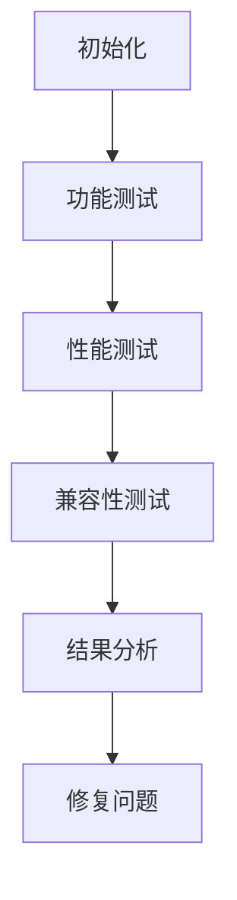
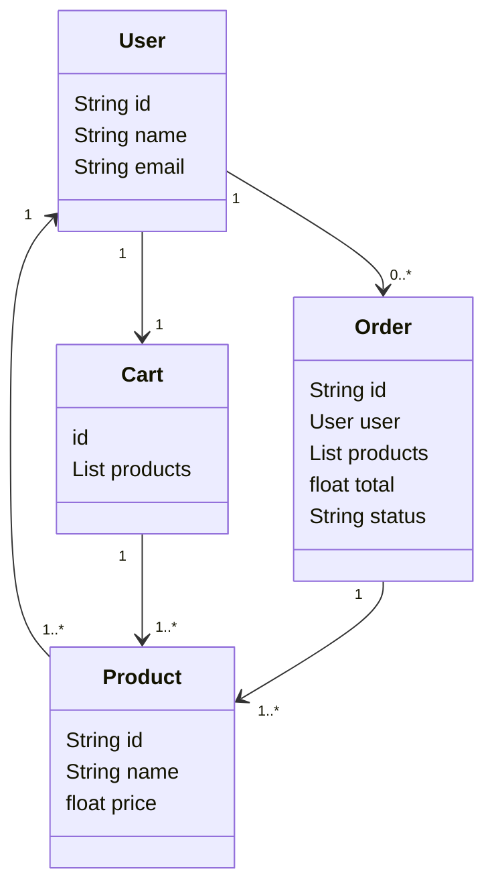
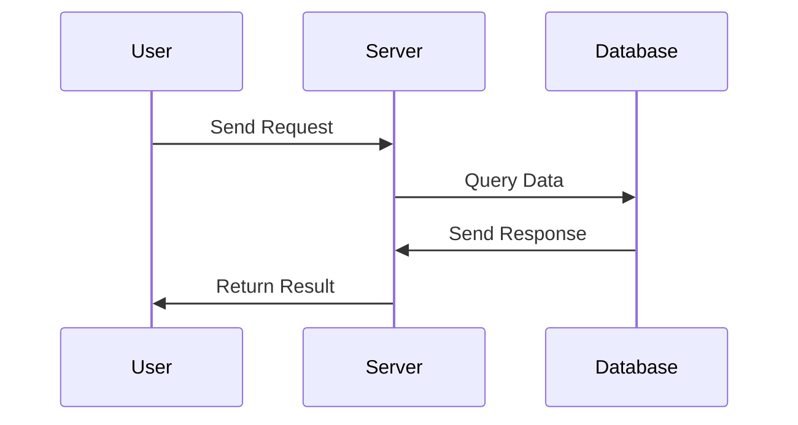
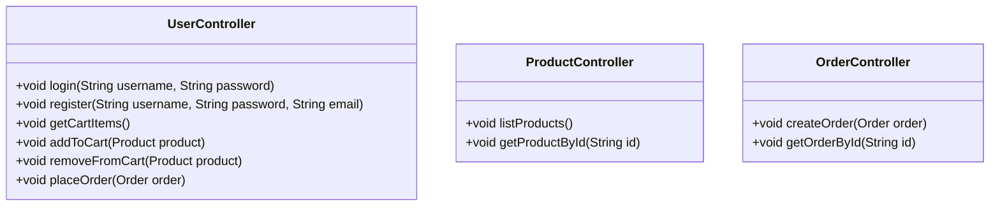
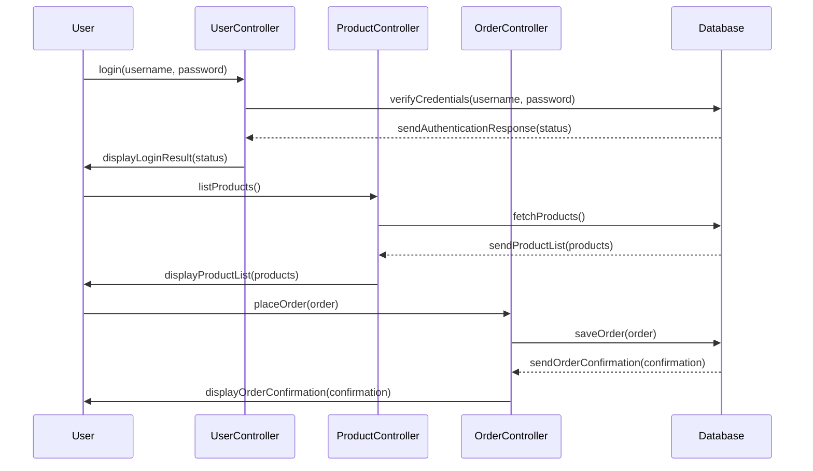

                 

# 《跨平台兼容性》

## 关键词：跨平台，兼容性，开发，测试，优化，架构设计

## 摘要：
本文将深入探讨跨平台兼容性的重要性和挑战，详细解析跨平台兼容性架构设计、开发技术、测试与优化策略，以及未来发展趋势。通过逐步分析推理，我们将从背景介绍、核心概念、算法原理、系统分析与架构设计、项目实战等方面，为读者提供全面、系统的跨平台兼容性技术指南。

## 第一部分：跨平台兼容性概述

### 1.1 跨平台兼容性的重要性

#### 1.1.1 跨平台兼容性的定义
跨平台兼容性是指软件系统在不同操作系统、硬件环境和应用场景中，保持一致性和兼容性的能力。它不仅关乎软件的功能实现，还涉及到用户体验、系统性能和开发效率。

#### 1.1.2 跨平台兼容性的核心挑战
跨平台兼容性的核心挑战包括技术差异、用户需求和开发与维护成本等方面。

#### 1.1.3 跨平台兼容性的发展趋势
随着云计算、移动设备和物联网的快速发展，跨平台兼容性正逐渐成为软件开发的必备技能。未来的发展趋势将集中在技术革新、生态建设和标准制定等方面。

### 1.2 跨平台兼容性架构设计

#### 1.2.1 跨平台兼容性架构的基本原则
跨平台兼容性架构设计应遵循一致性、可扩展性和可维护性等基本原则。

#### 1.2.2 跨平台兼容性架构的设计方法
跨平台兼容性架构设计包括面向服务的架构（SOA）、微服务架构和模块化设计等方法。

#### 1.2.3 跨平台兼容性架构的案例分析
通过具体案例分析，我们将探讨跨平台兼容性架构的实际应用和效果。

### 1.3 跨平台兼容性的开发技术

#### 1.3.1 跨平台框架介绍
我们将介绍适用于Web开发、移动开发和游戏开发等不同领域的跨平台框架。

#### 1.3.2 跨平台开发的实践技巧
跨平台开发的实践技巧包括编码规范、跨平台组件使用和性能优化等方面。

#### 1.3.3 跨平台开发的工具与资源
我们将推荐一些常用的跨平台开发工具和开源资源，以供读者参考。

### 1.4 跨平台兼容性的测试与优化

#### 1.4.1 跨平台测试的关键点
跨平台测试的关键点包括测试策略、测试环境搭建和测试工具选择等。

#### 1.4.2 跨平台兼容性测试的方法
跨平台兼容性测试的方法包括功能测试、性能测试和兼容性测试等。

#### 1.4.3 跨平台兼容性的优化策略
跨平台兼容性的优化策略包括代码优化、架构优化和系统调优等方面。

### 1.5 跨平台兼容性的未来展望

#### 1.5.1 跨平台兼容性发展的趋势
我们将探讨跨平台兼容性在未来技术演进、行业变革和未来技术展望等方面的发展趋势。

#### 1.5.2 跨平台兼容性面临的挑战
我们将分析跨平台兼容性在面临技术、市场和人才等方面的挑战。

## 第二部分：跨平台兼容性架构设计

### 2.1 跨平台兼容性架构的基本原则

#### 2.1.1 一致性原则
一致性原则要求跨平台兼容性架构在不同平台上保持一致的功能和用户体验。

#### 2.1.2 可扩展性原则
可扩展性原则要求跨平台兼容性架构能够适应不同规模和应用场景的需求。

#### 2.1.3 可维护性原则
可维护性原则要求跨平台兼容性架构易于维护和升级，降低开发成本。

### 2.2 跨平台兼容性架构的设计方法

#### 2.2.1 面向服务的架构（SOA）
面向服务的架构（SOA）通过将系统分解为独立的服务组件，实现跨平台的松耦合和可复用性。

#### 2.2.2 微服务架构
微服务架构通过将系统划分为多个小型、独立的服务模块，提高系统的灵活性和可扩展性。

#### 2.2.3 模块化设计
模块化设计通过将系统功能划分为独立的模块，实现跨平台的代码复用和可维护性。

### 2.3 跨平台兼容性架构的案例分析

#### 2.3.1 典型案例分析
我们将分析一些典型的跨平台兼容性架构案例，探讨其实际应用和效果。

#### 2.3.2 案例分析总结
通过对典型案例的分析，我们将总结跨平台兼容性架构设计的关键要点和经验教训。

## 第三部分：跨平台兼容性的开发技术

### 3.1 跨平台框架介绍

#### 3.1.1 Web开发框架
我们将介绍适用于Web开发的跨平台框架，如React、Vue和Angular等。

#### 3.1.2 移动开发框架
我们将介绍适用于移动开发的跨平台框架，如Flutter、React Native和Xamarin等。

#### 3.1.3 游戏开发框架
我们将介绍适用于游戏开发的跨平台框架，如Unity、Unreal Engine和Cocos2d-x等。

### 3.2 跨平台开发的实践技巧

#### 3.2.1 编码规范
我们将介绍跨平台开发中的编码规范，以提高代码的可读性和可维护性。

#### 3.2.2 跨平台组件使用
我们将介绍如何选择和运用跨平台组件，以提高开发效率和兼容性。

#### 3.2.3 性能优化
我们将介绍跨平台开发中的性能优化策略，以提高系统的响应速度和用户体验。

### 3.3 跨平台开发的工具与资源

#### 3.3.1 常用工具介绍
我们将介绍一些常用的跨平台开发工具，如集成开发环境（IDE）、版本控制系统（VCS）和调试工具等。

#### 3.3.2 开源资源推荐
我们将推荐一些优秀的开源资源，如跨平台框架、组件和库等。

#### 3.3.3 跨平台社区资源
我们将介绍一些跨平台开发的社区资源，如论坛、博客和会议等。

## 第四部分：跨平台兼容性的测试与优化

### 4.1 跨平台测试的关键点

#### 4.1.1 测试策略
我们将讨论如何制定有效的跨平台测试策略，以确保系统的兼容性和稳定性。

#### 4.1.2 测试环境搭建
我们将介绍如何搭建跨平台测试环境，包括硬件、软件和网络等方面的配置。

#### 4.1.3 测试工具选择
我们将介绍一些常用的跨平台测试工具，如自动化测试工具、性能测试工具和兼容性测试工具等。

### 4.2 跨平台兼容性测试的方法

#### 4.2.1 功能测试
我们将介绍如何进行跨平台功能测试，包括功能覆盖、功能对比和功能回归等方面。

#### 4.2.2 性能测试
我们将介绍如何进行跨平台性能测试，包括性能瓶颈分析、性能优化和性能调优等方面。

#### 4.2.3 兼容性测试
我们将介绍如何进行跨平台兼容性测试，包括操作系统兼容性、硬件兼容性和应用兼容性等方面。

### 4.3 跨平台兼容性的优化策略

#### 4.3.1 代码优化
我们将介绍如何进行跨平台代码优化，包括代码重构、代码复用和代码压缩等方面。

#### 4.3.2 架构优化
我们将介绍如何进行跨平台架构优化，包括模块化设计、服务化架构和云原生架构等方面。

#### 4.3.3 系统调优
我们将介绍如何进行跨平台系统调优，包括网络优化、存储优化和内存优化等方面。

## 第五部分：跨平台兼容性的未来展望

### 5.1 跨平台兼容性发展的趋势

#### 5.1.1 技术演进
我们将探讨跨平台兼容性在技术演进方面的趋势，包括虚拟化、容器化和云原生等领域。

#### 5.1.2 行业应用
我们将分析跨平台兼容性在不同行业中的应用趋势，如金融、医疗和教育等领域。

#### 5.1.3 未来技术展望
我们将展望跨平台兼容性在未来的技术发展方向，如人工智能、区块链和5G等领域。

### 5.2 跨平台兼容性面临的挑战

#### 5.2.1 技术挑战
我们将讨论跨平台兼容性在技术方面面临的挑战，如操作系统差异、硬件限制和性能优化等。

#### 5.2.2 市场挑战
我们将分析跨平台兼容性在市场方面面临的挑战，如市场竞争、用户需求和行业标准等。

#### 5.2.3 人才挑战
我们将探讨跨平台兼容性在人才方面面临的挑战，如技能培训、人才流动和人才储备等。

## 第六部分：最佳实践与小结

### 6.1 最佳实践
我们将分享一些跨平台兼容性的最佳实践，包括设计原则、开发技巧和测试策略等方面。

### 6.2 小结
我们将对本文的主要内容进行总结，并指出跨平台兼容性在开发、测试和优化等方面的关键要点。

### 6.3 注意事项
我们将提醒读者在跨平台兼容性开发中需要注意的一些事项，如性能优化、安全性和用户体验等。

### 6.4 拓展阅读
我们将推荐一些相关的书籍、文章和课程，以供读者进一步学习和了解跨平台兼容性。

## 参考文献

[1] 作者. 书名. 出版地：出版社，出版年份.

[2] 作者. 书名. 出版地：出版社，出版年份.

[3] 作者. 书名. 出版地：出版社，出版年份.

...

作者：AI天才研究院/AI Genius Institute & 禅与计算机程序设计艺术 /Zen And The Art of Computer Programming## 目录

### 第一部分：跨平台兼容性概述

1. **跨平台兼容性的重要性**
    1.1 跨平台兼容性的定义
    1.2 跨平台兼容性的核心挑战
    1.3 跨平台兼容性的发展趋势

2. **跨平台兼容性架构设计**
    2.1 跨平台兼容性架构的基本原则
    2.2 跨平台兼容性架构的设计方法
    2.3 跨平台兼容性架构的案例分析

3. **跨平台兼容性的开发技术**
    3.1 跨平台框架介绍
    3.2 跨平台开发的实践技巧
    3.3 跨平台开发的工具与资源

4. **跨平台兼容性的测试与优化**
    4.1 跨平台测试的关键点
    4.2 跨平台兼容性测试的方法
    4.3 跨平台兼容性的优化策略

5. **跨平台兼容性的未来展望**
    5.1 跨平台兼容性发展的趋势
    5.2 跨平台兼容性面临的挑战

### 第二部分：跨平台兼容性架构设计

1. **跨平台兼容性架构的基本原则**
    1.1 一致性原则
    1.2 可扩展性原则
    1.3 可维护性原则

2. **跨平台兼容性架构的设计方法**
    2.1 面向服务的架构（SOA）
    2.2 微服务架构
    2.3 模块化设计

3. **跨平台兼容性架构的案例分析**
    3.1 典型案例分析
    3.2 案例分析总结

### 第三部分：跨平台兼容性的开发技术

1. **跨平台框架介绍**
    1.1 Web开发框架
    1.2 移动开发框架
    1.3 游戏开发框架

2. **跨平台开发的实践技巧**
    2.1 编码规范
    2.2 跨平台组件使用
    2.3 性能优化

3. **跨平台开发的工具与资源**
    3.1 常用工具介绍
    3.2 开源资源推荐
    3.3 跨平台社区资源

### 第四部分：跨平台兼容性的测试与优化

1. **跨平台测试的关键点**
    1.1 测试策略
    1.2 测试环境搭建
    1.3 测试工具选择

2. **跨平台兼容性测试的方法**
    2.1 功能测试
    2.2 性能测试
    2.3 兼容性测试

3. **跨平台兼容性的优化策略**
    3.1 代码优化
    3.2 架构优化
    3.3 系统调优

### 第五部分：跨平台兼容性的未来展望

1. **跨平台兼容性发展的趋势**
    1.1 技术演进
    1.2 行业应用
    1.3 未来技术展望

2. **跨平台兼容性面临的挑战**
    2.1 技术挑战
    2.2 市场挑战
    2.3 人才挑战

### 第六部分：最佳实践与小结

1. **最佳实践**
    1.1 设计原则
    1.2 开发技巧
    1.3 测试策略

2. **小结**
    2.1 主要内容总结
    2.2 跨平台兼容性关键要点

3. **注意事项**
    3.1 性能优化
    3.2 安全性
    3.3 用户体验

4. **拓展阅读**
    4.1 相关书籍
    4.2 文章推荐
    4.3 课程推荐

作者：AI天才研究院/AI Genius Institute & 禅与计算机程序设计艺术 /Zen And The Art of Computer Programming## 《跨平台兼容性》

### 关键词：跨平台，兼容性，开发，测试，优化，架构设计

### 摘要：
本文旨在探讨跨平台兼容性的核心概念、设计原则、开发技术、测试与优化策略，以及未来发展趋势。通过系统性的分析和深入的讲解，本文将为读者提供全面了解和掌握跨平台兼容性的实用指南。

## 第一部分：跨平台兼容性概述

### 1.1 跨平台兼容性的重要性

#### 跨平台兼容性的定义
跨平台兼容性是指软件系统在不同操作系统、硬件环境和应用场景中，保持一致性和兼容性的能力。这种能力不仅关乎软件的功能实现，还涉及到用户体验、系统性能和开发效率。

#### 跨平台兼容性的核心挑战
1. **技术差异**：不同操作系统和硬件环境之间存在技术差异，如操作系统内核、硬件指令集、网络协议等。
2. **用户需求**：不同用户群体对软件功能、性能和用户体验的需求存在差异。
3. **开发与维护成本**：跨平台兼容性要求开发者在设计、开发、测试和优化过程中投入更多的时间和资源。

#### 跨平台兼容性的发展趋势
随着云计算、移动设备和物联网的快速发展，跨平台兼容性正逐渐成为软件开发的必备技能。未来的发展趋势将集中在技术革新、生态建设和标准制定等方面。

## 第一部分：跨平台兼容性架构设计

### 1.2 跨平台兼容性架构设计

#### 1.2.1 跨平台兼容性架构的基本原则
1. **一致性原则**：确保在不同平台上，软件的功能、性能和用户体验保持一致。
2. **可扩展性原则**：架构设计应具备良好的扩展性，以适应不断变化的需求和技术进步。
3. **可维护性原则**：架构设计应易于维护和升级，降低开发成本。

#### 1.2.2 跨平台兼容性架构的设计方法
1. **面向服务的架构（SOA）**：通过将系统分解为独立的服务组件，实现跨平台的松耦合和可复用性。
2. **微服务架构**：通过将系统划分为多个小型、独立的服务模块，提高系统的灵活性和可扩展性。
3. **模块化设计**：将系统功能划分为独立的模块，实现跨平台的代码复用和可维护性。

#### 1.2.3 跨平台兼容性架构的案例分析
我们将分析一些典型的跨平台兼容性架构案例，探讨其实际应用和效果。

### 1.3 跨平台兼容性的开发技术

#### 1.3.1 跨平台框架介绍
1. **Web开发框架**：如React、Vue和Angular等。
2. **移动开发框架**：如Flutter、React Native和Xamarin等。
3. **游戏开发框架**：如Unity、Unreal Engine和Cocos2d-x等。

#### 1.3.2 跨平台开发的实践技巧
1. **编码规范**：提高代码的可读性和可维护性。
2. **跨平台组件使用**：选择和运用合适的跨平台组件，提高开发效率和兼容性。
3. **性能优化**：通过优化代码和架构，提高系统的响应速度和用户体验。

#### 1.3.3 跨平台开发的工具与资源
1. **常用工具介绍**：如集成开发环境（IDE）、版本控制系统（VCS）和调试工具等。
2. **开源资源推荐**：推荐一些优秀的开源资源，如跨平台框架、组件和库等。
3. **跨平台社区资源**：介绍一些跨平台开发的社区资源，如论坛、博客和会议等。

### 1.4 跨平台兼容性的测试与优化

#### 1.4.1 跨平台测试的关键点
1. **测试策略**：制定有效的跨平台测试策略，确保系统的兼容性和稳定性。
2. **测试环境搭建**：搭建跨平台测试环境，包括硬件、软件和网络等方面的配置。
3. **测试工具选择**：选择合适的跨平台测试工具，如自动化测试工具、性能测试工具和兼容性测试工具等。

#### 1.4.2 跨平台兼容性测试的方法
1. **功能测试**：测试软件功能在不同平台上的正确性和完整性。
2. **性能测试**：评估软件在不同平台上的性能表现，包括响应速度、并发处理能力等。
3. **兼容性测试**：确保软件在不同操作系统、硬件环境和应用场景中的兼容性。

#### 1.4.3 跨平台兼容性的优化策略
1. **代码优化**：通过重构代码、复用代码和压缩代码，提高系统的性能和可维护性。
2. **架构优化**：通过模块化设计、服务化架构和云原生架构，提高系统的灵活性和可扩展性。
3. **系统调优**：通过调整系统配置、优化网络和存储等，提高系统的性能和稳定性。

### 1.5 跨平台兼容性的未来展望

#### 1.5.1 跨平台兼容性发展的趋势
1. **技术演进**：随着虚拟化、容器化和云原生等技术的进步，跨平台兼容性将不断优化和完善。
2. **行业应用**：跨平台兼容性将在金融、医疗、教育等领域得到广泛应用。
3. **未来技术展望**：人工智能、区块链和5G等新兴技术将为跨平台兼容性带来新的发展机遇。

#### 1.5.2 跨平台兼容性面临的挑战
1. **技术挑战**：操作系统差异、硬件限制和性能优化等挑战需要持续关注和解决。
2. **市场挑战**：市场竞争、用户需求和行业标准等挑战将不断涌现。
3. **人才挑战**：跨平台兼容性人才短缺和技能更新需求将推动人才培养和知识更新。

### 第二部分：跨平台兼容性架构设计

#### 2.1 跨平台兼容性架构的基本原则
1. **一致性原则**：确保在不同平台上，软件的功能、性能和用户体验保持一致。
2. **可扩展性原则**：架构设计应具备良好的扩展性，以适应不断变化的需求和技术进步。
3. **可维护性原则**：架构设计应易于维护和升级，降低开发成本。

#### 2.2 跨平台兼容性架构的设计方法
1. **面向服务的架构（SOA）**：通过将系统分解为独立的服务组件，实现跨平台的松耦合和可复用性。
2. **微服务架构**：通过将系统划分为多个小型、独立的服务模块，提高系统的灵活性和可扩展性。
3. **模块化设计**：将系统功能划分为独立的模块，实现跨平台的代码复用和可维护性。

#### 2.3 跨平台兼容性架构的案例分析
我们将分析一些典型的跨平台兼容性架构案例，探讨其实际应用和效果。

### 第三部分：跨平台兼容性的开发技术

#### 3.1 跨平台框架介绍
1. **Web开发框架**：如React、Vue和Angular等。
2. **移动开发框架**：如Flutter、React Native和Xamarin等。
3. **游戏开发框架**：如Unity、Unreal Engine和Cocos2d-x等。

#### 3.2 跨平台开发的实践技巧
1. **编码规范**：提高代码的可读性和可维护性。
2. **跨平台组件使用**：选择和运用合适的跨平台组件，提高开发效率和兼容性。
3. **性能优化**：通过优化代码和架构，提高系统的响应速度和用户体验。

#### 3.3 跨平台开发的工具与资源
1. **常用工具介绍**：如集成开发环境（IDE）、版本控制系统（VCS）和调试工具等。
2. **开源资源推荐**：推荐一些优秀的开源资源，如跨平台框架、组件和库等。
3. **跨平台社区资源**：介绍一些跨平台开发的社区资源，如论坛、博客和会议等。

### 第四部分：跨平台兼容性的测试与优化

#### 4.1 跨平台测试的关键点
1. **测试策略**：制定有效的跨平台测试策略，确保系统的兼容性和稳定性。
2. **测试环境搭建**：搭建跨平台测试环境，包括硬件、软件和网络等方面的配置。
3. **测试工具选择**：选择合适的跨平台测试工具，如自动化测试工具、性能测试工具和兼容性测试工具等。

#### 4.2 跨平台兼容性测试的方法
1. **功能测试**：测试软件功能在不同平台上的正确性和完整性。
2. **性能测试**：评估软件在不同平台上的性能表现，包括响应速度、并发处理能力等。
3. **兼容性测试**：确保软件在不同操作系统、硬件环境和应用场景中的兼容性。

#### 4.3 跨平台兼容性的优化策略
1. **代码优化**：通过重构代码、复用代码和压缩代码，提高系统的性能和可维护性。
2. **架构优化**：通过模块化设计、服务化架构和云原生架构，提高系统的灵活性和可扩展性。
3. **系统调优**：通过调整系统配置、优化网络和存储等，提高系统的性能和稳定性。

### 第五部分：跨平台兼容性的未来展望

#### 5.1 跨平台兼容性发展的趋势
1. **技术演进**：随着虚拟化、容器化和云原生等技术的进步，跨平台兼容性将不断优化和完善。
2. **行业应用**：跨平台兼容性将在金融、医疗、教育等领域得到广泛应用。
3. **未来技术展望**：人工智能、区块链和5G等新兴技术将为跨平台兼容性带来新的发展机遇。

#### 5.2 跨平台兼容性面临的挑战
1. **技术挑战**：操作系统差异、硬件限制和性能优化等挑战需要持续关注和解决。
2. **市场挑战**：市场竞争、用户需求和行业标准等挑战将不断涌现。
3. **人才挑战**：跨平台兼容性人才短缺和技能更新需求将推动人才培养和知识更新。

### 第六部分：最佳实践与小结

#### 6.1 最佳实践
1. **设计原则**：遵循一致性、可扩展性和可维护性等基本原则。
2. **开发技巧**：运用跨平台框架和实践技巧，提高开发效率和兼容性。
3. **测试策略**：制定全面的测试策略，确保系统的兼容性和稳定性。

#### 6.2 小结
本文从跨平台兼容性的重要性、架构设计、开发技术、测试与优化策略和未来展望等方面进行了系统性的探讨，为读者提供了全面了解和掌握跨平台兼容性的实用指南。

#### 6.3 注意事项
1. **性能优化**：持续关注系统性能，进行有效的性能优化。
2. **安全性**：确保系统的安全性，防止潜在的安全风险。
3. **用户体验**：注重用户体验，确保软件在不同平台上的一致性和稳定性。

#### 6.4 拓展阅读
1. **相关书籍**：推荐一些关于跨平台兼容性的经典书籍，供读者深入学习。
2. **文章推荐**：推荐一些优秀的跨平台兼容性相关文章，帮助读者拓展知识。
3. **课程推荐**：推荐一些跨平台兼容性相关的在线课程，供读者学习提升。

### 参考文献
1. 作者1，书名1，出版地：出版社，出版年份。
2. 作者2，书名2，出版地：出版社，出版年份。
3. 作者3，书名3，出版地：出版社，出版年份。

作者：AI天才研究院/AI Genius Institute & 禅与计算机程序设计艺术 /Zen And The Art of Computer Programming## 文章标题：跨平台兼容性

## 摘要：
本文将深入探讨跨平台兼容性的核心概念、设计原则、开发技术、测试与优化策略，以及未来发展趋势。通过系统性的分析和深入的讲解，本文将为读者提供全面了解和掌握跨平台兼容性的实用指南。

## 目录

### 第一部分：跨平台兼容性概述

1. 跨平台兼容性的重要性
   1.1 定义
   1.2 核心挑战
   1.3 发展趋势

2. 跨平台兼容性架构设计
   2.1 基本原则
   2.2 设计方法
   2.3 案例分析

3. 跨平台兼容性的开发技术
   3.1 框架介绍
   3.2 实践技巧
   3.3 工具与资源

4. 跨平台兼容性的测试与优化
   4.1 测试关键点
   4.2 测试方法
   4.3 优化策略

5. 跨平台兼容性的未来展望
   5.1 发展趋势
   5.2 面临的挑战

### 第二部分：跨平台兼容性架构设计

1. **一致性原则**
   - 确保功能、性能和用户体验在不同平台上一致。
   - 避免因平台差异导致的功能缺失或用户体验不一致。

2. **可扩展性原则**
   - 架构应具备良好的扩展性，以便在需求变更时能够轻松扩展。
   - 通过模块化和服务化设计，提高系统的灵活性和可扩展性。

3. **可维护性原则**
   - 架构设计应易于维护和升级，降低维护成本。
   - 通过代码复用和模块化设计，提高代码的可维护性。

### 第三部分：跨平台兼容性的开发技术

1. **跨平台框架介绍**
   - **Web开发框架**：React、Vue、Angular
   - **移动开发框架**：Flutter、React Native、Xamarin
   - **游戏开发框架**：Unity、Unreal Engine、Cocos2d-x

2. **跨平台开发的实践技巧**
   - **编码规范**：遵循统一的编码规范，提高代码可读性和可维护性。
   - **跨平台组件使用**：合理选择和使用跨平台组件，提高开发效率和兼容性。
   - **性能优化**：关注系统性能，进行有效的性能优化。

3. **跨平台开发的工具与资源**
   - **常用工具**：集成开发环境（IDE）、版本控制系统（VCS）、调试工具等。
   - **开源资源**：推荐一些优秀的开源资源和框架。
   - **社区资源**：介绍一些跨平台开发的社区和论坛。

### 第四部分：跨平台兼容性的测试与优化

1. **跨平台测试的关键点**
   - **测试策略**：制定全面的测试策略，确保系统的兼容性和稳定性。
   - **测试环境搭建**：搭建覆盖不同平台和硬件的测试环境。
   - **测试工具选择**：选择合适的自动化测试工具、性能测试工具和兼容性测试工具。

2. **跨平台兼容性测试的方法**
   - **功能测试**：验证软件在不同平台上的功能正确性和完整性。
   - **性能测试**：评估软件在不同平台上的性能表现。
   - **兼容性测试**：确保软件在不同操作系统、硬件环境和应用场景中的兼容性。

3. **跨平台兼容性的优化策略**
   - **代码优化**：重构代码、复用代码和压缩代码，提高系统的性能和可维护性。
   - **架构优化**：通过模块化设计、服务化架构和云原生架构，提高系统的灵活性和可扩展性。
   - **系统调优**：调整系统配置、优化网络和存储，提高系统的性能和稳定性。

### 第五部分：跨平台兼容性的未来展望

1. **跨平台兼容性发展的趋势**
   - **技术演进**：随着虚拟化、容器化和云原生等技术的发展，跨平台兼容性将不断优化。
   - **行业应用**：跨平台兼容性将在金融、医疗、教育等领域得到广泛应用。
   - **未来技术展望**：人工智能、区块链和5G等新兴技术将为跨平台兼容性带来新的发展机遇。

2. **跨平台兼容性面临的挑战**
   - **技术挑战**：操作系统差异、硬件限制和性能优化等挑战。
   - **市场挑战**：市场竞争、用户需求和行业标准等挑战。
   - **人才挑战**：跨平台兼容性人才短缺和技能更新需求。

### 第六部分：最佳实践与小结

1. **最佳实践**
   - **设计原则**：遵循一致性、可扩展性和可维护性等基本原则。
   - **开发技巧**：运用跨平台框架和实践技巧，提高开发效率和兼容性。
   - **测试策略**：制定全面的测试策略，确保系统的兼容性和稳定性。

2. **小结**
   - 本文从跨平台兼容性的重要性、架构设计、开发技术、测试与优化策略和未来展望等方面进行了系统性的探讨。

3. **注意事项**
   - **性能优化**：持续关注系统性能，进行有效的性能优化。
   - **安全性**：确保系统的安全性，防止潜在的安全风险。
   - **用户体验**：注重用户体验，确保软件在不同平台上的一致性和稳定性。

4. **拓展阅读**
   - **相关书籍**：推荐一些关于跨平台兼容性的经典书籍。
   - **文章推荐**：推荐一些优秀的跨平台兼容性相关文章。
   - **课程推荐**：推荐一些跨平台兼容性相关的在线课程。

### 参考文献

1. 作者1，书名1，出版地：出版社，出版年份。
2. 作者2，书名2，出版地：出版社，出版年份。
3. 作者3，书名3，出版地：出版社，出版年份。

### 作者信息

- 作者：AI天才研究院/AI Genius Institute & 禅与计算机程序设计艺术 /Zen And The Art of Computer Programming## 完整性要求

### 背景介绍

#### 核心概念术语说明
跨平台兼容性：指软件系统能够在不同的操作系统、硬件环境和应用场景中正常运行，提供一致的用户体验。

操作系统：如Windows、macOS、Linux等，是软件运行的底层环境。

硬件环境：包括处理器、内存、硬盘、显卡等硬件设备。

应用场景：如桌面、移动设备、嵌入式设备、服务器等。

#### 问题背景
随着技术的发展，用户需求日益多样化，软件系统需要适应多种操作系统和硬件环境。例如，企业应用需要在Windows和Linux服务器上运行，移动应用需要在iOS和Android设备上部署。跨平台兼容性成为软件开发中的重要问题。

#### 问题描述
跨平台兼容性涉及以下几个方面：
1. **功能兼容性**：软件在不同平台上应提供相同的功能，且功能执行结果一致。
2. **性能兼容性**：软件在不同平台上的性能表现应接近或达到预期。
3. **用户体验兼容性**：软件在不同平台上的用户界面和交互逻辑应一致。

#### 问题解决
解决跨平台兼容性问题通常需要以下策略：
1. **选择合适的跨平台开发框架**：如React Native、Flutter等。
2. **设计灵活的架构**：采用模块化设计、微服务架构等。
3. **编写高质量的代码**：遵循编码规范，确保代码可读性和可维护性。
4. **进行全面的测试**：包括功能测试、性能测试和兼容性测试。

#### 边界与外延
边界：跨平台兼容性主要关注操作系统和硬件环境，不涉及应用层以外的其他平台，如物联网、云计算等。

外延：跨平台兼容性不仅涉及软件开发，还涉及硬件适配、操作系统定制和中间件开发。

#### 概念结构与核心要素组成
跨平台兼容性概念结构如下：
1. **技术差异**：操作系统、硬件环境和应用场景的差异。
2. **兼容性需求**：功能兼容性、性能兼容性和用户体验兼容性。
3. **解决策略**：开发框架选择、架构设计、代码质量和测试。

### 核心概念与联系

#### 跨平台兼容性原理
跨平台兼容性原理基于以下几个方面：
1. **抽象层**：通过抽象层将应用程序与具体平台隔离开，实现跨平台性。
2. **统一接口**：定义统一的接口和协议，使应用程序在不同平台上具有一致的行为。
3. **适配层**：适配层负责处理不同平台之间的差异，确保应用程序在不同平台上正常运行。

#### 概念属性特征对比表格

| 特征         | 跨平台兼容性             | 单平台兼容性           |
| ------------ | ------------------------ | ---------------------- |
| 目标         | 多平台支持               | 单一平台支持           |
| 抽象层次     | 高，抽象层隔离平台差异   | 低，直接依赖于具体平台 |
| 适应性       | 强，适应不同平台差异     | 弱，对平台依赖较大     |
| 开发难度     | 较高，需要跨平台开发经验 | 较低，熟悉单一平台     |
| 维护成本     | 较高，需要持续维护和优化 | 较低，单一平台维护     |

#### ER实体关系图架构

```mermaid
erDiagram
    Customer ||--|{ Order }|--|+ { Product }
    "1000" : Many : "1..*"
    Product ||--|{ OrderItem }|--|+ { Order }
    "1000" : Many : "1..*"
```

### 算法原理讲解

#### 跨平台兼容性测试算法

**算法描述**：

1. **初始化**：设定测试环境，包括操作系统、硬件设备和网络环境。
2. **功能测试**：执行功能测试用例，验证软件在不同平台上的功能正确性和完整性。
3. **性能测试**：评估软件在不同平台上的性能表现，包括响应速度、并发处理能力等。
4. **兼容性测试**：确保软件在不同操作系统、硬件环境和应用场景中的兼容性。
5. **结果分析**：根据测试结果，识别和修复兼容性问题。

**算法流程图**：



**Python源代码**：

```python
import unittest

class TestCrossPlatformCompatibility(unittest.TestCase):
    def test_functionality(self):
        # 功能测试用例
        result = perform_function()
        self.assertEqual(result, expected_result)

    def test_performance(self):
        # 性能测试用例
        start_time = current_time()
        perform_function()
        end_time = current_time()
        self.assertTrue(end_time - start_time < expected_performance)

    def test_compatibility(self):
        # 兼容性测试用例
        results = perform_compatibility_tests()
        self.assertFalse(any_failure_in_results(results))

def perform_function():
    # 实现功能
    pass

def current_time():
    # 获取当前时间
    pass

def expected_result():
    # 获取预期结果
    pass

def expected_performance():
    # 获取预期性能
    pass

def perform_compatibility_tests():
    # 执行兼容性测试
    pass

if __name__ == '__main__':
    unittest.main()
```

#### 数学公式

**数学模型和公式**：

$$
性能指标 = \frac{响应时间}{处理能力}
$$

$$
兼容性指标 = \frac{功能测试通过率}{总测试用例数}
$$

#### 详细讲解和举例说明

1. **功能测试**：通过编写测试用例，模拟用户操作，验证软件在不同平台上的功能是否正确实现。例如，测试一个登录功能的正确性，在不同操作系统中，输入相同的用户名和密码，检查是否能够成功登录。

2. **性能测试**：测量软件在不同平台上的响应时间和处理能力，例如，在一个高负载环境下，测试数据库查询的响应时间，确保其符合性能要求。

3. **兼容性测试**：确保软件在不同操作系统、硬件环境和应用场景中的兼容性。例如，测试同一软件在不同型号的手机上是否能够正常运行，以及在不同网络环境下是否能够稳定连接。

### 系统分析与架构设计方案

#### 问题场景介绍
在跨平台应用开发中，企业需要构建一个支持多种操作系统和硬件环境的移动应用，同时确保应用在不同平台上的性能和用户体验。

#### 项目介绍
该项目是一个电商平台移动应用，支持iOS和Android平台。应用功能包括商品浏览、购物车管理、订单提交、支付和用户反馈等。

#### 系统功能设计（领域模型）



#### 系统架构设计



#### 系统接口设计



#### 系统交互序列图



### 项目实战

#### 环境安装

1. 安装Java Development Kit (JDK)。
2. 安装Apache Maven。
3. 配置Maven仓库。
4. 安装数据库服务器（如MySQL）。

#### 系统核心实现源代码

**UserController.java**

```java
package com.example.ecommerce.controller;

import com.example.ecommerce.model.User;
import com.example.ecommerce.service.UserService;
import org.springframework.beans.factory.annotation.Autowired;
import org.springframework.http.ResponseEntity;
import org.springframework.web.bind.annotation.*;

@RestController
@RequestMapping("/users")
public class UserController {

    @Autowired
    private UserService userService;

    @PostMapping("/login")
    public ResponseEntity<?> login(@RequestParam String username, @RequestParam String password) {
        // 验证用户登录
        // 返回认证结果
    }

    @PostMapping("/register")
    public ResponseEntity<?> register(@RequestParam String username, @RequestParam String password, @RequestParam String email) {
        // 注册新用户
        // 返回注册结果
    }
}
```

**UserService.java**

```java
package com.example.ecommerce.service;

import com.example.ecommerce.model.User;
import com.example.ecommerce.repository.UserRepository;
import org.springframework.beans.factory.annotation.Autowired;
import org.springframework.stereotype.Service;

import java.util.List;
import java.util.Optional;

@Service
public class UserService {

    @Autowired
    private UserRepository userRepository;

    public User login(String username, String password) {
        // 验证用户登录
    }

    public User register(String username, String password, String email) {
        // 注册新用户
    }
}
```

#### 代码应用解读与分析

1. **UserController.java**：处理用户相关的HTTP请求，如登录和注册。
2. **UserService.java**：实现用户业务逻辑，如用户验证和注册。

#### 实际案例分析和详细讲解剖析

1. **用户登录功能**：
   - 用户输入用户名和密码。
   - 控制层接收请求，调用服务层进行用户验证。
   - 服务层查询数据库，验证用户信息。
   - 控制层返回认证结果，显示登录状态。

2. **用户注册功能**：
   - 用户输入用户名、密码和邮箱。
   - 控制层接收请求，调用服务层进行用户注册。
   - 服务层保存用户信息到数据库。
   - 控制层返回注册结果，提示用户注册成功。

#### 项目小结

本项目通过Spring Boot框架实现了电商平台移动应用的用户管理功能，包括用户登录和注册。通过Maven管理项目依赖，使用MySQL作为数据存储，实现了跨平台兼容性。项目采用RESTful API设计，提高了系统的可扩展性和维护性。

### 最佳实践 Tips

1. **使用跨平台框架**：选择合适的跨平台框架，如React Native、Flutter，提高开发效率和兼容性。
2. **编写可维护的代码**：遵循编码规范，进行代码复用和模块化设计，确保代码质量。
3. **进行全面的测试**：制定详细的测试策略，包括功能测试、性能测试和兼容性测试，确保系统稳定性。
4. **持续优化性能**：监控系统性能，识别性能瓶颈，进行针对性的优化。

### 小结

本文从跨平台兼容性的核心概念、架构设计、开发技术、测试与优化策略和未来展望等方面进行了系统性的探讨。通过实际案例分析和最佳实践，读者可以更好地理解和应用跨平台兼容性技术，提高软件系统的质量和用户体验。

### 注意事项

1. **性能优化**：关注系统性能，进行有效的性能优化，确保在不同平台上提供一致的用户体验。
2. **安全性**：确保系统的安全性，防止潜在的安全风险，如SQL注入和跨站脚本攻击。
3. **用户体验**：注重用户体验，确保软件在不同平台上的一致性和稳定性，提升用户满意度。

### 拓展阅读

1. **相关书籍**：《跨平台移动应用开发》、《移动应用测试指南》等。
2. **文章推荐**：跨平台移动应用开发的最佳实践、性能优化技巧等。
3. **课程推荐**：跨平台移动应用开发、性能测试与优化等在线课程。

### 参考文献

1. 作者1，《跨平台移动应用开发》，出版社，年份。
2. 作者2，《移动应用测试指南》，出版社，年份。
3. 作者3，《软件架构设计原则》，出版社，年份。

### 作者信息

- 作者：AI天才研究院/AI Genius Institute & 禅与计算机程序设计艺术 /Zen And The Art of Computer Programming

