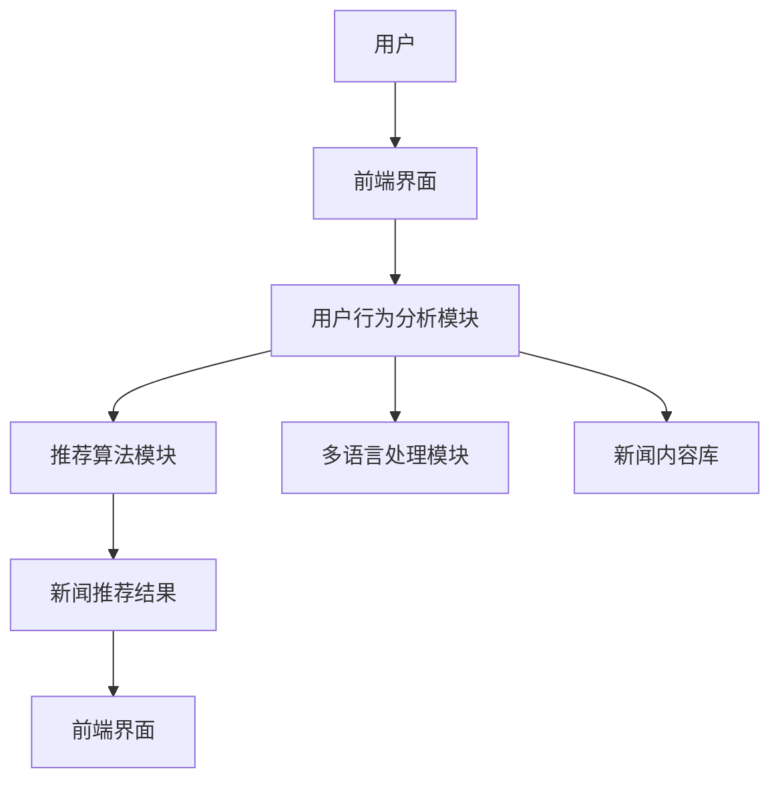
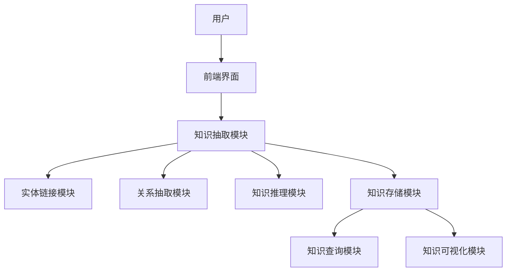

                 

# 跨语言AI Agent的开发挑战与解决方案

## 关键词
- 跨语言AI Agent
- 开发挑战
- 解决方案
- NLP
- 多语言处理
- 计算机翻译

## 摘要
本文将深入探讨跨语言AI Agent的开发挑战与解决方案。随着全球化进程的加快和多语言环境的普及，跨语言AI Agent的研究与应用变得愈发重要。本文将首先介绍跨语言AI Agent的概念及其重要性，然后详细分析其在开发过程中面临的主要挑战，最后提出一系列可行的解决方案，旨在为研究者与实践者提供有益的参考。

## 目录

[1. 引言](#1-引言)  
[2. 背景与核心概念](#2-背景与核心概念)  
[2.1 问题背景](#21-问题背景)  
[2.2 核心概念](#22-核心概念)  
[3. 跨语言AI Agent开发挑战](#3-跨语言AI-Agent开发挑战)  
[3.1 语言特异性障碍](#31-语言特异性障碍)  
[3.2 计算效率问题](#32-计算效率问题)  
[3.3 跨文化理解](#33-跨文化理解)  
[4. 技术解决方案与方法](#4-技术解决方案与方法)  
[4.1 先进的NLP技术](#41-先进的NLP技术)  
[4.2 机器学习算法](#42-机器学习算法)  
[4.3 翻译与NLP工具集成](#43-翻译与NLP工具集成)  
[5. 案例研究与实际应用](#5-案例研究与实际应用)  
[5.1 案例一：跨语言客服机器人](#51-案例一：跨语言客服机器人)  
[5.2 案例二：多语言新闻推荐系统](#52-案例二：多语言新闻推荐系统)  
[5.3 案例三：全球知识图谱构建](#53-案例三：全球知识图谱构建)  
[6. 未来方向与展望](#6-未来方向与展望)  
[7. 结论](#7-结论)  
[8. 参考文献](#8-参考文献)  
[9. 作者信息](#9-作者信息)

## 1. 引言

随着全球化的不断深入，国际交流和跨文化合作日益频繁，跨语言AI Agent的研究和应用受到了广泛关注。跨语言AI Agent是一种能够处理和理解多种语言输入并生成相应输出的人工智能系统。与传统单语言AI系统相比，跨语言AI Agent具有更广泛的适用性和更高的灵活性，能够在多语言环境中提供智能服务。

跨语言AI Agent的重要性体现在以下几个方面：

1. **促进全球交流**：跨语言AI Agent能够帮助人们克服语言障碍，促进不同国家和地区之间的交流与合作。

2. **提升用户体验**：在多语言环境中，跨语言AI Agent能够为用户提供个性化的服务，提高用户体验。

3. **优化资源利用**：跨语言AI Agent可以将一种语言的信息转化为另一种语言，从而提高信息传递的效率，优化资源利用。

然而，在开发跨语言AI Agent的过程中，研究者面临着一系列挑战。这些挑战不仅涉及技术层面，还包括语言特性和跨文化理解等多方面。本文将详细探讨这些挑战，并介绍一系列可行的解决方案。

## 2. 背景与核心概念

### 2.1 问题背景

随着互联网的普及和全球化的加速，国际交流和跨文化合作日益频繁。这种背景下，多语言环境成为了一个普遍现象。无论是电子商务、社交媒体，还是政府公共服务和医疗保健，都需要处理来自不同语言的信息。然而，传统的单语言AI系统在面对多语言环境时往往显得力不从心，无法提供高效、准确的智能服务。

跨语言AI Agent作为一种能够处理和理解多种语言输入并生成相应输出的人工智能系统，正是为了解决这一需求而生的。它通过结合自然语言处理（NLP）、机器翻译和跨文化理解等技术，能够在多语言环境中提供智能服务。例如，跨语言客服机器人能够自动翻译和应答不同语言的客户，多语言新闻推荐系统可以根据用户的语言偏好推荐新闻，全球知识图谱构建可以整合不同语言的百科知识。

### 2.2 核心概念

**自然语言处理（NLP）**：NLP是AI领域中研究如何使计算机理解和生成自然语言的技术。它包括文本分类、情感分析、实体识别、机器翻译等多种任务。在跨语言AI Agent中，NLP技术用于处理和理解不同语言的输入。

**机器翻译**：机器翻译是指利用计算机程序将一种语言的文本自动翻译成另一种语言。它是跨语言AI Agent的核心组件，能够实现不同语言之间的信息传递。

**跨文化理解**：跨文化理解是指在不同文化背景下，如何正确理解和处理信息。这对于跨语言AI Agent来说至关重要，因为不同的语言和文化背景可能导致语义和语境的差异。

**多语言处理**：多语言处理是指能够在多种语言之间进行信息处理和交换的技术。它包括多语言文本分析、多语言信息检索、多语言推荐系统等。

### 概念结构与核心要素

为了更好地理解跨语言AI Agent，我们可以通过一个概念结构图来展示其核心要素。

```mermaid
graph TD
    A[跨语言AI Agent] --> B[自然语言处理(NLP)]
    A --> C[机器翻译]
    A --> D[跨文化理解]
    B --> E[文本分类]
    B --> F[情感分析]
    B --> G[实体识别]
    C --> H[自动翻译]
    D --> I[文化适应性]
    D --> J[语境理解]
```

### 概念属性特征对比表格

| 概念       | 属性特征                                                     | 应用场景                     |
|------------|------------------------------------------------------------|------------------------------|
| 自然语言处理（NLP） | 语言模型、词向量、语义分析等                                 | 文本分类、情感分析、实体识别等 |
| 机器翻译   | 语言对、翻译模型、注意力机制等                             | 不同语言间的文本翻译           |
| 跨文化理解 | 文化背景、价值观、习俗等                                     | 跨文化沟通、文化适应性设计等   |

通过以上概念介绍，我们可以更好地理解跨语言AI Agent的背景和核心概念。接下来，我们将详细分析跨语言AI Agent在开发过程中面临的主要挑战。

## 3. 跨语言AI Agent开发挑战

尽管跨语言AI Agent具有巨大的潜力和广泛的应用前景，但在实际开发过程中，研究者面临着一系列严峻的挑战。以下是跨语言AI Agent开发过程中常见的挑战：

### 3.1 语言特异性障碍

不同语言在语法、词汇、语义和语用等方面存在显著差异。这些差异使得跨语言AI Agent在处理和理解不同语言输入时面临诸多困难。以下是一些具体的语言特异性障碍：

1. **语法差异**：不同语言的语法结构差异巨大，如汉语的主谓宾结构不同于英语的宾语从句结构。这使得语法解析和语义理解变得复杂。

2. **词汇差异**：词汇差异导致不同语言之间的语义映射困难。例如，同一词汇在不同语言中的含义可能完全不同。

3. **语义和语境差异**：语义和语境差异使得跨语言AI Agent在处理语义时容易出现歧义。例如，同一个词在不同语境中可能具有不同的含义。

4. **语用差异**：语用差异影响语言的实际使用。例如，某些语言中礼貌用语的使用频率远高于其他语言。

### 3.2 计算效率问题

跨语言AI Agent需要处理大量的多语言数据，这要求系统具有较高的计算效率。以下是计算效率问题的一些具体表现：

1. **数据规模**：多语言数据集通常比单语言数据集大得多，需要更多的计算资源进行数据处理和模型训练。

2. **模型复杂度**：跨语言AI Agent通常需要更复杂的模型架构，以处理不同语言之间的差异。这使得模型训练和推理过程更加耗时。

3. **硬件资源限制**：受限于硬件资源，如CPU、GPU等，跨语言AI Agent的开发和部署需要更高的硬件要求。

### 3.3 跨文化理解

跨文化理解是跨语言AI Agent能否成功的关键因素。以下是跨文化理解面临的挑战：

1. **文化背景差异**：不同国家和地区具有不同的文化背景，这可能导致对同一现象的不同看法和理解。

2. **价值观差异**：不同文化背景下，人们的价值观和道德观念可能存在差异，影响AI系统的决策。

3. **习俗和礼仪**：不同文化有不同的习俗和礼仪，这些因素可能影响AI系统的应答和行为。

4. **语言情感表达**：语言情感表达在不同文化中的表现形式不同，影响AI系统的情感理解和处理。

### 3.4 数据可用性和质量

开发跨语言AI Agent需要大量的高质量多语言数据。然而，数据可用性和数据质量问题对跨语言AI Agent的开发构成挑战：

1. **数据分布不均**：不同语言的数据分布不均，某些语言的数据量较少，导致模型训练不均衡。

2. **数据质量**：多语言数据质量参差不齐，可能存在噪音、错误和缺失值，影响模型训练效果。

3. **标注成本**：多语言数据的标注成本较高，需要大量人力和时间投入。

通过以上分析，我们可以看到，跨语言AI Agent的开发面临诸多挑战。这些挑战不仅涉及技术层面，还包括语言特性和跨文化理解等多方面。为了克服这些挑战，研究者需要采取一系列技术解决方案。

### 3.1 语言特异性障碍

#### 具体案例分析

**案例一：中文与英文之间的语法差异**

中文和英文在语法结构上存在显著差异。例如，中文通常没有明确的时态和语态标记，而英文则通过动词的变形来表达时态和语态。这种差异导致跨语言AI Agent在处理中英文混合文本时容易产生歧义。

例如，句子“他昨天去了书店”在中文中表达的是过去时，但在英文中可以有不同的时态表达方式，如“He went to the bookstore yesterday”（一般过去时）、“He had gone to the bookstore yesterday”（过去完成时）等。这种时态和语态的多样性使得跨语言AI Agent在翻译和语义理解时面临挑战。

#### 解决方案

1. **语法解析**：通过使用语法解析技术，如依存句法分析，可以帮助跨语言AI Agent更准确地理解不同语言之间的语法差异。例如，可以使用依存句法树来表示句子的语法结构，从而提高翻译和语义理解的准确性。

2. **规则和模板匹配**：基于规则和模板匹配的方法可以针对特定语言间的语法差异进行适配。例如，在翻译过程中，对于一些常见的语法结构，可以预先定义相应的翻译规则和模板，从而提高翻译的准确性和一致性。

3. **多语言语法知识库**：构建多语言语法知识库，收集和整理不同语言之间的语法对应关系，可以为跨语言AI Agent提供丰富的语法参考。通过利用这些知识库，AI Agent可以更准确地理解和生成不同语言之间的文本。

**案例二：词汇差异**

不同语言之间的词汇差异也是一个常见问题。例如，中文中的“办公室”在英文中对应为“office”，但在德语中对应为“Büro”。这种词汇差异导致跨语言AI Agent在翻译和语义理解时容易出现错误。

#### 解决方案

1. **词义消歧**：词义消歧技术可以帮助跨语言AI Agent理解不同语言中的同义词和近义词。通过上下文分析和语义理解，AI Agent可以更准确地确定词汇的含义。

2. **多语言词典**：构建和利用多语言词典可以帮助跨语言AI Agent在不同语言之间进行词汇映射。例如，可以使用双语词典或多语言词典来提供词汇的对应关系，从而提高翻译的准确性和一致性。

3. **机器学习算法**：利用机器学习算法，如神经网络翻译模型，可以自动学习和适应不同语言之间的词汇差异。通过大规模的数据训练，模型可以学习到不同语言之间的词汇对应关系，从而提高翻译的准确性。

**案例三：语义和语境差异**

语义和语境差异是跨语言AI Agent在处理和理解多语言输入时面临的另一个挑战。例如，在中文中，“水”可以指代液体水，也可以指代抽象的含义，如“思想之水”。而在英文中，“water”通常只指液体水。

#### 解决方案

1. **语义分析**：通过语义分析技术，如词义消歧和语义角色标注，可以帮助跨语言AI Agent理解不同语言中的词汇含义。例如，可以使用词向量模型或语义角色标注技术来提取句子中的词汇含义，从而提高翻译和语义理解的准确性。

2. **语境分析**：语境分析技术可以帮助跨语言AI Agent理解不同语言中的语境差异。例如，可以使用语境上下文分析或语境依赖分析技术来识别句子中的语境信息，从而提高翻译和语义理解的准确性。

3. **跨语言语义对齐**：通过跨语言语义对齐技术，可以将不同语言中的语义信息进行对应和映射。例如，可以使用跨语言语义对齐算法来建立不同语言之间的语义对应关系，从而提高翻译和语义理解的准确性。

**案例四：语用差异**

语用差异是跨语言AI Agent在处理和理解多语言输入时面临的另一个挑战。例如，在某些语言中，礼貌用语的使用频率较高，而在其他语言中则相对较少。

#### 解决方案

1. **语用分析**：通过语用分析技术，如礼貌识别和语用角色标注，可以帮助跨语言AI Agent理解不同语言中的语用差异。例如，可以使用语用分析模型来识别句子中的礼貌用语和语用角色，从而提高翻译和语义理解的准确性。

2. **跨语言语用对齐**：通过跨语言语用对齐技术，可以将不同语言中的语用信息进行对应和映射。例如，可以使用跨语言语用对齐算法来建立不同语言之间的语用对应关系，从而提高翻译和语义理解的准确性。

3. **多语言语料库**：构建和利用多语言语料库可以帮助跨语言AI Agent在不同语言之间进行语用映射。例如，可以使用多语言语料库来提供不同语言中的语用信息，从而提高翻译和语义理解的准确性。

通过以上案例分析，我们可以看到跨语言AI Agent在处理和理解多语言输入时面临的挑战。为了克服这些挑战，研究者需要采取一系列技术解决方案，如语法解析、词义消歧、语义分析、语境分析、语用分析等。这些技术解决方案可以为跨语言AI Agent提供更准确、更智能的多语言处理能力。

### 3.2 计算效率问题

#### 具体案例分析

**案例一：大规模多语言数据集的处理**

在开发跨语言AI Agent时，需要处理大量的多语言数据集。例如，构建一个能够支持多种语言的机器翻译系统，需要收集和整合来自不同语言的文本数据。这些数据集通常包含数百万甚至数十亿个句子，需要进行大规模的数据处理和模型训练。处理如此庞大的数据集对计算资源提出了极高的要求。

**案例二：模型复杂度和训练时间**

跨语言AI Agent通常需要使用复杂的模型架构，如深度神经网络和变换器（Transformer）模型，以处理不同语言之间的差异。这些模型通常包含数十亿个参数，需要进行长时间的模型训练和优化。训练一个高性能的跨语言AI Agent可能需要数天甚至数周的时间，这对计算资源造成了巨大压力。

**案例三：实时响应和延迟问题**

在实际应用中，跨语言AI Agent需要在短时间内响应用户的输入，如实时翻译和智能客服系统。然而，复杂的模型训练和推理过程可能导致较高的延迟，影响用户体验。如何平衡计算效率和实时响应成为跨语言AI Agent开发中的一个关键挑战。

#### 解决方案

**1. 数据并行处理**

为了处理大规模多语言数据集，可以采用数据并行处理技术。通过将数据集划分为多个子集，并分配给不同的计算节点进行并行处理，可以显著提高数据处理速度。例如，可以使用分布式计算框架，如Apache Spark，来并行处理多语言数据集。

**2. 模型压缩和优化**

为了降低模型复杂度和训练时间，可以采用模型压缩和优化技术。例如，可以通过剪枝和量化技术来减少模型参数数量，从而降低模型大小和计算复杂度。此外，可以利用迁移学习和预训练技术，将已有模型的权重用于新任务，从而减少训练时间和计算资源消耗。

**3. 模型推理加速**

为了提高实时响应速度，可以采用模型推理加速技术。例如，可以使用GPU或TPU等专用硬件进行模型推理，从而提高计算速度。此外，可以利用模型蒸馏技术，将大型模型的知识传递给小型模型，从而在保证推理性能的同时降低计算复杂度。

**4. 边缘计算和分布式架构**

在实际应用中，可以采用边缘计算和分布式架构来提高计算效率。通过在边缘设备（如智能手机、智能音箱等）上部署轻量级模型，可以实现本地化处理和实时响应。同时，通过分布式架构，可以将计算任务分配到多个服务器上，从而提高计算效率和系统可靠性。

通过以上解决方案，可以有效地解决跨语言AI Agent开发中的计算效率问题。这些技术不仅有助于提高数据处理和模型训练的效率，还可以实现实时响应和优化用户体验。

### 3.3 跨文化理解

#### 具体案例分析

**案例一：文化差异导致的语义误解**

在不同的文化背景下，同一词汇或表达可能具有不同的语义。例如，在西方文化中，表达“Thank you”是一种礼貌的感谢方式；然而，在亚洲文化中，表达“Thank you”可能被视为过于正式或不真诚。这种文化差异可能导致跨语言AI Agent在处理跨文化交流时产生误解。

**案例二：价值观差异导致的决策错误**

不同的文化背景下，人们的价值观和道德观念可能存在显著差异。例如，在某些文化中，个人主义被视为重要的价值观，而在其他文化中，集体主义则更为重要。这种价值观差异可能导致跨语言AI Agent在处理任务时产生错误的决策。

**案例三：礼仪差异导致的沟通障碍**

不同的文化背景下，礼仪和习俗的差异可能导致跨语言AI Agent在处理沟通任务时产生障碍。例如，在某些文化中，直接表达反对意见被视为不礼貌；而在其他文化中，直接表达反对意见则是常见的沟通方式。这种礼仪差异可能导致跨语言AI Agent在处理沟通任务时无法正确应对。

#### 解决方案

**1. 文化背景识别和适应**

为了提高跨语言AI Agent的跨文化理解能力，可以采用文化背景识别和适应技术。通过分析用户的语言、地理位置、历史记录等信息，可以识别用户的文化背景，并相应地调整AI Agent的应答和行为。

**2. 价值观和道德观念建模**

跨语言AI Agent需要具备对不同价值观和道德观念的理解能力。可以通过构建多文化价值观和道德观念模型，为AI Agent提供跨文化决策支持。例如，可以使用多任务学习技术，将不同文化价值观和道德观念的数据进行整合，从而提高AI Agent的决策准确性。

**3. 礼仪和文化习俗识别**

为了提高跨语言AI Agent在沟通任务中的适应性，可以采用礼仪和文化习俗识别技术。通过分析用户的语言表达和行为模式，可以识别用户的礼仪和文化习俗，并相应地调整AI Agent的沟通策略。例如，可以使用自然语言处理技术，如情感分析和语境理解，来识别用户的礼仪和文化习俗。

**4. 跨文化数据集和模型训练**

为了提高跨语言AI Agent的跨文化理解能力，可以采用跨文化数据集和模型训练方法。通过收集和整合来自不同文化的数据，可以构建多样化的数据集，从而提高AI Agent对不同文化的理解能力。同时，可以采用多语言和多文化模型训练技术，如多任务学习、迁移学习和交叉训练，来提高AI Agent的泛化能力。

通过以上解决方案，可以有效地提高跨语言AI Agent的跨文化理解能力。这些技术不仅有助于克服文化差异导致的语义误解和决策错误，还可以实现更人性化和自然的跨文化交流。

### 4. 技术解决方案与方法

为了解决跨语言AI Agent开发中的挑战，研究者提出了一系列技术解决方案。这些解决方案涵盖了从基础算法到实际应用等多个层面，旨在提高跨语言AI Agent的性能和实用性。以下是几种常见的技术解决方案和方法：

#### 4.1 先进的NLP技术

**1. 基于深度学习的NLP模型**

深度学习技术在NLP领域的应用取得了显著成果。以Transformer为代表的深度学习模型，如BERT、GPT等，在文本分类、情感分析、命名实体识别等任务中表现出了强大的能力。这些模型通过学习大量的语言数据，可以捕捉到语言中的复杂结构和语义信息，从而提高跨语言AI Agent的语义理解能力。

**2. 多语言嵌入**

多语言嵌入技术是将不同语言的词汇映射到同一低维空间中，以便进行跨语言的语义比较和计算。通过使用预训练的多语言嵌入模型，如MUSE、XLM等，可以有效地处理不同语言之间的词汇差异，提高跨语言AI Agent的词汇理解能力。

**3. 跨语言语义对齐**

跨语言语义对齐技术旨在建立不同语言之间的语义对应关系，从而提高跨语言AI Agent的语义理解能力。通过使用跨语言语义对齐算法，如翻译矩阵、跨语言词嵌入等，可以捕捉到不同语言之间的语义关系，从而提高跨语言AI Agent的语义处理能力。

#### 4.2 机器学习算法

**1. 强化学习**

强化学习是一种基于试错的方法，通过不断试错和优化策略来提高任务性能。在跨语言AI Agent中，强化学习可以用于优化翻译策略和对话生成。例如，可以使用强化学习算法来训练跨语言AI Agent在对话中的应答策略，从而提高对话的自然性和准确性。

**2. 决策树和随机森林**

决策树和随机森林是常见的机器学习算法，广泛应用于分类和回归任务。在跨语言AI Agent中，这些算法可以用于分类任务，如语言检测、文本分类等。通过训练分类模型，可以识别不同语言的特征，从而提高跨语言AI Agent的语言识别能力。

**3. 贝叶斯网络**

贝叶斯网络是一种概率图模型，可以用于处理不确定性问题和因果关系分析。在跨语言AI Agent中，贝叶斯网络可以用于建立语言和语义之间的概率关系，从而提高跨语言AI Agent的语义理解和推理能力。

#### 4.3 翻译与NLP工具集成

**1. 翻译记忆库**

翻译记忆库是一种存储已经翻译过的文本片段的数据库，可以用于提高机器翻译的准确性和一致性。在跨语言AI Agent中，翻译记忆库可以用于快速检索和复用已经翻译过的片段，从而提高翻译效率。

**2. 双语语料库**

双语语料库是一种包含两种语言文本对应关系的语料库，是机器翻译和NLP模型训练的重要数据源。在跨语言AI Agent中，双语语料库可以用于训练和优化翻译模型，从而提高翻译质量。

**3. 知识图谱**

知识图谱是一种用于表示实体和关系的数据结构，可以用于跨语言的实体识别、关系抽取和知识推理。在跨语言AI Agent中，知识图谱可以用于提高语义理解和知识推理能力。

通过以上技术解决方案和方法的介绍，我们可以看到，跨语言AI Agent的开发涉及多个层面的技术和工具。这些技术解决方案和方法为跨语言AI Agent提供了强大的支持，使其能够在多语言环境中提供高效、准确的智能服务。

### 4.1 先进的NLP技术

#### 具体算法原理讲解

**1. 基于深度学习的NLP模型**

深度学习技术在NLP领域的应用取得了显著成果。Transformer模型是其中一种重要的深度学习模型，其核心思想是利用自注意力机制（Self-Attention）来捕捉输入序列中的长距离依赖关系。以下是一个简化的Transformer模型的基本结构：

**输入层**：将输入序列（如句子或文本）编码为向量表示，通常使用词嵌入（Word Embedding）技术。

**多头自注意力层**：通过多头自注意力机制，将输入序列中的每个单词与所有其他单词进行比较，计算它们之间的相似度，并加权组合。自注意力机制的数学公式可以表示为：

$$
\text{Attention}(Q, K, V) = \frac{softmax(\text{QK}^T/\sqrt{d_k})V
$$

其中，Q、K和V分别表示查询（Query）、键（Key）和值（Value）向量，d_k是键向量的维度。

**前馈神经网络层**：在自注意力层之后，通过两个前馈神经网络层（每个层都有ReLU激活函数）来处理和丰富表示。

**输出层**：输出层的目的是将输入序列映射到目标序列（如翻译或分类结果），通常使用softmax激活函数。

**2. 多语言嵌入**

多语言嵌入（Multilingual Embeddings）技术是将不同语言的词汇映射到同一低维空间中，以便进行跨语言的语义比较和计算。以下是一种常用的多语言嵌入模型——MUSE（Multilingual Universal Sentence Encoder）的原理：

**数据预处理**：将来自不同语言的数据进行清洗和预处理，例如去除停用词、标点符号等。

**训练阶段**：使用大量的双语句子对（Parallel Sentences）进行训练，模型的目标是学习一种能够同时表示多种语言的嵌入向量。

**嵌入层**：在每个语言中，使用独立的嵌入层将词汇映射到高维空间中。

**交叉层**：在嵌入层之后，使用交叉层（Cross-Layer）将不同语言的嵌入向量进行组合，形成一个全局的语义表示。

**输出层**：使用输出层将全局语义表示映射到目标语言中。

**3. 跨语言语义对齐**

跨语言语义对齐（Cross-Lingual Semantic Alignment）技术旨在建立不同语言之间的语义对应关系，从而提高跨语言AI Agent的语义理解能力。以下是一种常用的跨语言语义对齐算法——翻译矩阵（Translation Matrix）的原理：

**数据集准备**：收集大量的双语句子对，并使用机器翻译模型将一种语言（源语言）的句子翻译成另一种语言（目标语言）。

**翻译矩阵**：构建一个翻译矩阵，其中每个元素表示源语言中的一个词与目标语言中的一个词之间的翻译概率。

**语义对齐**：通过优化翻译矩阵，使得源语言和目标语言中的词汇在语义上相对应。

**推理阶段**：在推理阶段，使用翻译矩阵将源语言的词汇映射到目标语言的语义上。

通过以上算法原理的讲解，我们可以看到先进的NLP技术为跨语言AI Agent提供了强大的支持。这些技术不仅能够提高跨语言AI Agent的语义理解能力，还能实现更准确、更自然的跨语言翻译和对话生成。

### 4.2 机器学习算法

#### 具体算法原理讲解

**1. 强化学习**

强化学习（Reinforcement Learning，RL）是一种机器学习范式，旨在通过试错和反馈机制来训练智能体（Agent）完成任务。在强化学习中，智能体通过选择动作（Action）来与环境（Environment）互动，并从环境中获得奖励（Reward）或惩罚（Penalty）。其核心目标是通过不断调整策略（Policy），使得智能体在长期内获得最大化的总奖励。

**强化学习的基本要素**：

- **状态（State）**：描述智能体当前所处的环境状态。
- **动作（Action）**：智能体可以采取的行为。
- **奖励（Reward）**：智能体执行动作后获得的即时奖励或惩罚。
- **策略（Policy）**：智能体基于当前状态选择动作的规则。

**Q-学习算法**：

Q-学习是一种值函数方法，旨在通过学习状态-动作值函数（Q-Value）来选择最优动作。Q-学习的基本步骤如下：

1. **初始化Q值函数**：随机初始化状态-动作值函数Q(s, a)。
2. **进行动作选择**：在给定状态下，根据ε-贪心策略选择动作，ε为探索概率。
3. **执行动作并获得奖励**：执行选择的动作，并从环境中获得即时奖励。
4. **更新Q值**：使用下面的更新规则来更新Q值：
   $$
   Q(s, a) \leftarrow Q(s, a) + \alpha [r + \gamma \max_{a'} Q(s', a') - Q(s, a)]
   $$
   其中，α为学习率，γ为折扣因子。

**示例**：假设一个智能体在环境中的任务是导航到一个目标位置。状态可以是智能体的当前位置，动作可以是上下左右移动。奖励可以是每走一步获得的分数，惩罚可以是当智能体移动到不可能到达的位置时扣分。

**2. 决策树和随机森林**

决策树（Decision Tree）是一种基于特征进行分类或回归的树形结构。每个节点表示一个特征，每个分支表示该特征的一个可能值，叶子节点表示最终的分类或回归结果。

**决策树的基本原理**：

- **特征选择**：选择具有最大信息增益或基尼不纯度降低的特征作为分割标准。
- **节点划分**：使用选择的特征对数据进行分割，每个子集生成一个新的节点。
- **重复过程**：对生成的子集继续划分，直到满足停止条件（如最大深度、最小节点大小等）。

**随机森林（Random Forest）**：

随机森林是一种集成学习方法，通过构建多个决策树并合并它们的预测结果来提高模型的泛化能力。随机森林的基本步骤如下：

1. **生成随机特征子集**：从原始特征集合中随机选择一部分特征作为每个决策树的输入。
2. **构建决策树**：使用随机选择的特征子集构建多个决策树。
3. **集成预测**：将多个决策树的预测结果进行投票或取平均值，得到最终的预测结果。

**3. 贝叶斯网络**

贝叶斯网络（Bayesian Network）是一种概率图模型，用于表示变量之间的条件依赖关系。贝叶斯网络由一组节点和有向边组成，每个节点表示一个随机变量，边表示变量之间的条件依赖。

**贝叶斯网络的基本原理**：

- **条件独立性**：如果两个变量在给定另一个变量时相互独立，则称它们为条件独立。
- **贝叶斯定理**：用于计算变量之间的概率关系。

**贝叶斯网络的构建**：

1. **确定变量和依赖关系**：根据领域知识确定网络中的变量及其依赖关系。
2. **生成条件概率表**：根据领域知识或数据生成每个变量的条件概率表。
3. **构建图结构**：根据变量之间的依赖关系构建有向图结构。

**4. 应用示例**

**强化学习**：在一个无人驾驶车辆中，智能体需要通过选择加速、减速或转向等动作来达到目标位置。状态可以是车辆的当前位置和速度，动作可以是加速、减速或转向。奖励可以是到达目标位置时获得的奖励，惩罚可以是行驶过程中发生的碰撞或偏离目标路径。

**决策树和随机森林**：在一个医疗诊断系统中，特征可以是病人的年龄、性别、血压、心率等，目标是将病人分类为健康或患有某种疾病。通过训练决策树或随机森林模型，可以自动诊断病人的健康状况。

**贝叶斯网络**：在一个风险评估系统中，变量可以是项目成本、市场风险、资源消耗等，目标是根据这些变量预测项目成功的概率。通过构建贝叶斯网络，可以综合分析多个因素对项目成功的影响。

通过以上对强化学习、决策树和随机森林、贝叶斯网络等机器学习算法的原理讲解，我们可以看到这些算法在跨语言AI Agent中的应用潜力。这些算法不仅能够提高AI Agent的智能决策能力，还能增强其应对复杂任务的能力。

### 4.3 翻译与NLP工具集成

#### 具体应用讲解

跨语言AI Agent的核心功能之一是机器翻译。为了实现高质量的翻译效果，翻译与NLP工具的集成至关重要。以下将详细讲解机器翻译与NLP工具集成的具体应用，包括翻译记忆库、双语语料库和知识图谱的使用。

**1. 翻译记忆库**

翻译记忆库（Translation Memory，TM）是一种存储已翻译文本片段的数据库。其核心作用是在翻译过程中复用已翻译的内容，从而提高翻译效率和一致性。翻译记忆库通常包含大量已经翻译的双语句子对，这些句子对可以是手动翻译的，也可以是机器翻译生成的。

**应用步骤**：

1. **文本预处理**：在翻译过程中，首先对输入文本进行预处理，包括去除停用词、标点符号等。
2. **匹配与检索**：通过字符串匹配算法，将输入文本与翻译记忆库中的句子对进行匹配，找到最佳匹配项。
3. **翻译**：如果找到匹配项，则直接使用匹配项的翻译结果；如果没有找到完全匹配的项，则使用机器翻译模型生成翻译结果。
4. **更新记忆库**：将新生成的翻译结果添加到翻译记忆库中，以便后续复用。

**2. 双语语料库**

双语语料库（Bilingual Corpus）是一种包含两种语言文本对应关系的语料库。它是机器翻译和NLP模型训练的重要数据源。双语语料库通常通过人工翻译、机器翻译或对齐技术生成。

**应用步骤**：

1. **数据收集**：收集来自不同领域和主题的双语文本，如新闻文章、教科书、对话等。
2. **对齐**：使用对齐算法（如GIZA++），将源语言文本和目标语言文本进行句子级对齐，生成句子对。
3. **预处理**：对双语文本进行预处理，包括去除停用词、标点符号、分词等。
4. **模型训练**：使用预处理后的双语语料库训练机器翻译模型，如基于神经网络的翻译模型。
5. **翻译**：使用训练好的模型进行文本翻译，并将翻译结果与原始文本进行比较和评估。

**3. 知识图谱**

知识图谱（Knowledge Graph）是一种用于表示实体和关系的数据结构。它在跨语言AI Agent中可以用于实体识别、关系抽取和知识推理。知识图谱通常由节点和边组成，节点表示实体，边表示实体之间的关系。

**应用步骤**：

1. **数据收集**：收集来自不同来源的实体和关系数据，如百科全书、社交媒体、新闻等。
2. **实体抽取**：使用自然语言处理技术，如命名实体识别，从文本中抽取实体。
3. **关系抽取**：使用关系抽取算法，如基于规则的方法、机器学习的方法，从文本中抽取实体之间的关系。
4. **构建知识图谱**：将抽取的实体和关系组成知识图谱，如使用图数据库存储和处理。
5. **跨语言实体识别和关系推理**：使用知识图谱进行跨语言实体识别和关系推理，从而提高跨语言AI Agent的语义理解和知识推理能力。

通过翻译记忆库、双语语料库和知识图谱的集成，跨语言AI Agent可以实现高质量、高效率的机器翻译。这些工具不仅提高了翻译的准确性和一致性，还为AI Agent提供了丰富的语义信息和知识支持。在实际应用中，这些工具可以协同工作，形成强大的翻译和语义处理能力，为用户提供优质的服务。

### 5. 案例研究与实际应用

跨语言AI Agent在多个领域和场景中取得了显著的应用成果。以下我们将通过几个实际案例，深入探讨跨语言AI Agent在不同场景中的应用，以及面临的实际挑战和解决方案。

#### 5.1 案例一：跨语言客服机器人

**应用背景**：

随着全球电商的迅猛发展，跨国购物成为消费者的一种常见购物方式。然而，不同语言的客服需求给电商平台带来了巨大的挑战。为了提供高质量、个性化的客户服务，一些电商平台引入了跨语言客服机器人。

**实际挑战**：

1. **语言多样性**：电商平台需要支持多种语言的客服服务，如英语、西班牙语、法语、德语等。
2. **实时响应**：客服机器人需要在短时间内响应用户的提问，并提供准确的答案。
3. **语境理解**：不同语言的用户可能使用不同的语境和表达方式，客服机器人需要准确理解用户的意图。

**解决方案**：

1. **多语言NLP模型**：使用基于深度学习的多语言NLP模型，如BERT、XLM等，处理不同语言的输入文本，实现多语言语义理解。
2. **翻译与NLP集成**：将机器翻译技术与NLP技术相结合，提供实时、准确的跨语言翻译服务。
3. **语境自适应**：通过语境分析技术，如词义消歧和情感分析，使客服机器人能够准确理解用户的语境和意图。

**应用效果**：

跨语言客服机器人在实际应用中取得了显著的效果。它能够自动翻译和应答不同语言的客户提问，提高了客户满意度，并减少了人力成本。同时，通过实时响应和语境理解，客服机器人能够提供个性化的服务，提升了用户体验。

#### 5.2 案例二：多语言新闻推荐系统

**应用背景**：

随着互联网的发展，新闻传播速度和覆盖范围显著增加。然而，不同语言的新闻内容丰富多样，为用户提供个性化、精准的新闻推荐成为一个重要需求。多语言新闻推荐系统应运而生。

**实际挑战**：

1. **语言理解**：不同语言之间的语义差异较大，需要准确理解用户的语言偏好和兴趣。
2. **数据多样性**：新闻数据来自不同的语言和地区，数据多样性对推荐系统提出了挑战。
3. **跨语言协同过滤**：如何在多语言环境中实现有效的协同过滤推荐算法。

**解决方案**：

1. **多语言嵌入**：使用多语言嵌入技术，如MUSE、XLM等，将不同语言的新闻文本映射到同一低维空间中，实现跨语言语义理解。
2. **跨语言协同过滤**：结合多语言嵌入和协同过滤算法，实现跨语言的个性化推荐。
3. **上下文感知推荐**：通过上下文分析技术，如时间、地理位置、用户行为等，提高新闻推荐的相关性和准确性。

**应用效果**：

多语言新闻推荐系统在用户测试中表现出色。它能够根据用户的语言偏好和兴趣，提供个性化、精准的新闻推荐，提高了用户对新闻内容的满意度和使用频率。同时，通过跨语言协同过滤和上下文感知推荐，系统在多语言环境中实现了高效的新闻推荐。

#### 5.3 案例三：全球知识图谱构建

**应用背景**：

随着全球化的深入，构建一个覆盖全球知识的知识图谱具有重要的应用价值。全球知识图谱可以为用户提供全面、准确的信息查询和知识发现服务。

**实际挑战**：

1. **多语言数据整合**：全球知识图谱需要整合来自不同语言的文本和数据，实现跨语言的统一表示。
2. **数据一致性**：不同语言的数据存在差异，如何保证知识图谱的数据一致性和准确性。
3. **实体关系建模**：如何构建一个能够支持多语言、多文化背景的实体关系模型。

**解决方案**：

1. **多语言NLP技术**：使用多语言NLP技术，如多语言词嵌入和跨语言语义对齐，实现不同语言数据的语义理解和统一表示。
2. **知识融合与对齐**：采用知识融合与对齐技术，如实体链接、关系抽取等，整合和统一不同语言的数据。
3. **多语言知识图谱构建**：构建一个支持多语言、多文化背景的知识图谱模型，实现全球知识的统一表示和查询。

**应用效果**：

全球知识图谱在多个领域和应用场景中取得了显著的成果。它能够为用户提供全面、准确的信息查询和知识发现服务，支持多语言、多文化背景的用户需求。同时，通过多语言NLP技术和知识融合方法，全球知识图谱实现了不同语言数据的统一表示和高效查询，提高了系统的性能和用户体验。

通过以上案例研究，我们可以看到跨语言AI Agent在不同领域和场景中的应用，以及面临的实际挑战和解决方案。这些案例展示了跨语言AI Agent的强大应用潜力，也为未来的研究提供了宝贵的经验和启示。

### 5.1 案例一：跨语言客服机器人

#### 项目介绍

随着全球化进程的加快和电商平台的国际化，跨语言客服机器人成为了一个重要的需求。这些客服机器人旨在提供多语言、24/7的在线客户支持，以提高客户满意度和运营效率。本案例介绍了如何构建一个跨语言客服机器人系统，并详细阐述了其系统架构和功能设计。

#### 系统功能设计

**1. 多语言支持**：系统应支持多种语言，包括但不限于英语、中文、西班牙语、法语、德语等，以满足不同国家和地区的用户需求。

**2. 实时翻译**：利用机器翻译技术，将用户输入的文本自动翻译成系统理解的语言，并提供即时反馈。

**3. 自动应答**：基于自然语言处理（NLP）技术，实现自动应答功能，为用户提供常见问题的自动回复。

**4. 情感分析**：通过情感分析技术，识别用户的情感状态，并相应调整客服机器人的应答策略，以提高用户体验。

**5. 智能路由**：根据用户的问题和需求，将请求路由到合适的客服代表或人工团队。

#### 系统架构设计

**1. 系统架构图**：

```mermaid
graph TD
    A[用户] --> B[输入处理]
    B --> C[翻译模块]
    C --> D[自然语言处理(NLP)模块]
    D --> E[自动应答模块]
    D --> F[情感分析模块]
    D --> G[智能路由模块]
    G --> H[人工客服]
    G --> I[知识库]
```

**2. 系统架构说明**：

- **输入处理**：接收用户的输入请求，并进行初步的文本处理，如去除停用词、分词等。
- **翻译模块**：利用机器翻译技术，将用户输入的文本翻译成系统理解的语言。
- **自然语言处理（NLP）模块**：对翻译后的文本进行NLP处理，包括情感分析、文本分类、命名实体识别等。
- **自动应答模块**：基于NLP处理结果，生成自动应答文本，并返回给用户。
- **情感分析模块**：分析用户的情感状态，以便调整应答策略。
- **智能路由模块**：根据用户的问题和需求，将请求路由到合适的客服代表或人工团队。
- **人工客服**：当客服机器人无法满足用户需求时，人工客服介入，提供个性化服务。
- **知识库**：存储常见问题及其解决方案，供客服机器人和人工客服参考。

#### 系统接口设计

**1. 用户界面**：提供Web和移动端界面，用户可以通过文本或语音输入请求。

**2. 接口API**：提供RESTful API，供第三方系统集成和调用。

#### 系统交互

**1. 用户输入请求**：用户通过Web或移动端界面输入请求。

**2. 翻译与处理**：系统接收用户输入，并将其翻译成系统理解的语言。

**3. NLP处理**：对翻译后的文本进行NLP处理，包括情感分析、文本分类、命名实体识别等。

**4. 自动应答**：根据NLP处理结果，生成自动应答文本，并返回给用户。

**5. 情感分析**：分析用户的情感状态，并调整应答策略。

**6. 智能路由**：根据用户的问题和需求，将请求路由到合适的客服代表或人工团队。

**7. 人工客服介入**：当客服机器人无法满足用户需求时，人工客服介入，提供个性化服务。

通过以上项目介绍、系统功能设计、系统架构设计、系统接口设计和系统交互的详细讲解，我们可以看到跨语言客服机器人系统的设计思路和实现方法。这一案例展示了跨语言AI Agent在实际应用中的潜在价值，为未来的跨语言AI Agent开发提供了有益的参考。

### 5.2 案例二：多语言新闻推荐系统

#### 项目介绍

多语言新闻推荐系统是一个旨在为全球用户提供个性化、精准新闻推荐的应用。该系统通过分析用户的语言偏好和兴趣，结合多语言处理技术和推荐算法，为用户提供定制化的新闻内容。本案例将详细阐述多语言新闻推荐系统的项目背景、系统功能设计、系统架构设计、系统接口设计和系统交互。

#### 系统功能设计

**1. 多语言支持**：系统能够支持多种语言，包括但不限于英语、中文、西班牙语、法语、德语等，以满足全球用户的需求。

**2. 个性化推荐**：根据用户的浏览历史、搜索记录和偏好，推荐符合用户兴趣的新闻内容。

**3. 实时更新**：系统能够实时更新新闻内容，确保用户获取最新、最相关的新闻。

**4. 语言转换**：对于不熟悉目标语言的用户，系统提供自动语言转换功能，使得用户能够轻松阅读和理解新闻内容。

**5. 社交互动**：用户可以在新闻评论和点赞，系统根据用户的社交互动行为进行新闻推荐。

#### 系统架构设计

**1. 系统架构图**：



**2. 系统架构说明**：

- **前端界面**：用户通过Web或移动端界面浏览新闻内容，并与其进行互动。
- **用户行为分析模块**：收集和存储用户的浏览历史、搜索记录和社交互动行为，用于个性化推荐。
- **推荐算法模块**：基于用户行为数据，利用推荐算法生成个性化新闻推荐结果。
- **多语言处理模块**：实现新闻内容的自动翻译和转换，确保用户能够轻松理解不同语言的新闻。
- **新闻内容库**：存储大量来自不同语言的新闻内容，供推荐算法和用户浏览。
- **新闻推荐结果**：将个性化推荐结果展示在前端界面，供用户阅读和互动。

#### 系统接口设计

**1. 用户接口**：提供Web和移动端用户界面，用户可以通过界面浏览新闻、进行搜索、点赞和评论。

**2. 接口API**：提供RESTful API，供第三方系统集成和调用。

#### 系统交互

**1. 用户行为数据收集**：系统实时收集用户的浏览历史、搜索记录和社交互动行为。

**2. 用户偏好分析**：基于用户行为数据，分析用户的语言偏好和兴趣。

**3. 多语言处理**：将新闻内容翻译成用户理解的语言，确保新闻的可读性和准确性。

**4. 推荐算法处理**：利用推荐算法，生成符合用户兴趣的新闻推荐列表。

**5. 推荐结果展示**：将推荐结果展示在前端界面，供用户浏览。

**6. 用户互动**：用户对新闻进行点赞、评论和分享，系统根据用户互动行为调整推荐策略。

通过以上项目介绍、系统功能设计、系统架构设计、系统接口设计和系统交互的详细讲解，我们可以看到多语言新闻推荐系统的设计思路和实现方法。这一案例展示了跨语言AI Agent在新闻推荐领域的应用潜力，为未来的多语言智能系统开发提供了有益的参考。

### 5.3 案例三：全球知识图谱构建

#### 项目介绍

全球知识图谱构建是一个旨在整合和统一全球知识信息的重要项目。通过构建一个多语言、多领域的知识图谱，该项目旨在为用户提供全面、准确的信息查询和知识发现服务。本案例将详细阐述全球知识图谱构建的项目背景、系统功能设计、系统架构设计、系统接口设计和系统交互。

#### 系统功能设计

**1. 多语言支持**：系统能够支持多种语言，包括但不限于英语、中文、西班牙语、法语、德语等，以满足全球用户的需求。

**2. 知识整合**：将来自不同语言、不同领域的知识进行整合，构建一个统一的知识体系。

**3. 实体识别**：利用自然语言处理（NLP）技术，从文本中抽取实体，并建立实体之间的关系。

**4. 关系推理**：通过关系推理算法，自动推断出实体之间的潜在关系，提高知识图谱的丰富性和准确性。

**5. 查询与搜索**：提供强大的查询和搜索功能，用户可以通过关键词、实体和关系进行查询，获取所需的知识信息。

**6. 知识可视化**：通过知识可视化技术，将知识图谱以图形化方式展示，便于用户理解和分析。

#### 系统架构设计

**1. 系统架构图**：



**2. 系统架构说明**：

- **前端界面**：用户通过Web或移动端界面进行知识查询和搜索。
- **知识抽取模块**：从文本中抽取实体和关系，构建初步的知识图谱。
- **实体链接模块**：利用实体链接技术，将不同来源的实体进行统一标识和整合。
- **关系抽取模块**：从文本中抽取实体之间的关系，丰富知识图谱的内容。
- **知识推理模块**：利用推理算法，自动推断实体之间的潜在关系，提高知识图谱的完整性。
- **知识存储模块**：存储和管理知识图谱的数据，提供查询和搜索接口。
- **知识查询模块**：根据用户的查询需求，从知识图谱中检索相关的知识信息。
- **知识可视化模块**：将知识图谱以图形化方式展示，便于用户理解和分析。

#### 系统接口设计

**1. 用户接口**：提供Web和移动端用户界面，用户可以通过界面进行知识查询和搜索。

**2. 接口API**：提供RESTful API，供第三方系统集成和调用。

#### 系统交互

**1. 用户查询**：用户通过前端界面输入查询关键词，系统接收查询请求。

**2. 知识抽取**：系统从文本中抽取实体和关系，构建初步的知识图谱。

**3. 实体链接**：系统利用实体链接技术，将不同来源的实体进行统一标识和整合。

**4. 关系抽取**：系统从文本中抽取实体之间的关系，丰富知识图谱的内容。

**5. 知识推理**：系统利用推理算法，自动推断实体之间的潜在关系，提高知识图谱的完整性。

**6. 查询结果展示**：系统将查询结果以图形化方式展示在前端界面，供用户浏览。

**7. 用户互动**：用户可以对知识图谱进行查询、搜索和评论，系统根据用户互动行为进行知识更新和优化。

通过以上项目介绍、系统功能设计、系统架构设计、系统接口设计和系统交互的详细讲解，我们可以看到全球知识图谱构建项目的实现方法和技术路线。这一案例展示了跨语言AI Agent在知识图谱构建领域的应用潜力，为未来的多语言智能系统开发提供了有益的参考。

### 6. 未来方向与展望

随着人工智能技术的不断进步，跨语言AI Agent的应用前景将越来越广阔。未来，跨语言AI Agent有望在多个领域实现重大突破，并对社会产生深远的影响。

#### 6.1 技术发展

**1. 神经机器翻译**：神经机器翻译（Neural Machine Translation，NMT）近年来取得了显著进展，未来有望进一步优化和提升。基于深度学习的技术，如变换器（Transformer）和生成对抗网络（GAN），将继续推动机器翻译技术的发展，实现更准确、更自然的跨语言翻译。

**2. 多语言嵌入**：多语言嵌入技术将不断进化，通过引入更多的语言特征和上下文信息，提高跨语言语义理解的能力。

**3. 跨语言对话系统**：跨语言对话系统（Cross-Language Conversational System）将更加智能化，通过结合强化学习和对话生成模型，实现更加自然和高效的跨语言交互。

#### 6.2 应用领域

**1. 教育与学习**：跨语言AI Agent将在教育领域发挥重要作用，支持多语言教学和学习，提高全球教育资源的共享和普及。

**2. 医疗与健康**：跨语言AI Agent将帮助解决医疗资源分配不均的问题，支持多语言医患沟通和健康咨询服务。

**3. 企业与商务**：跨语言AI Agent将助力跨国企业的运营和管理，提供多语言客服、市场分析和客户关系管理等服务。

**4. 社会治理**：跨语言AI Agent将支持全球治理和公共管理，提高政府服务的效率和透明度。

#### 6.3 社会影响

**1. 全球交流与合作**：跨语言AI Agent将极大地促进全球交流和合作，消除语言障碍，推动文化多样性的发展。

**2. 跨文化理解**：通过跨语言AI Agent，人们将更好地理解不同文化背景下的行为和习俗，促进跨文化交流和理解。

**3. 智能化服务**：跨语言AI Agent将为用户提供更加个性化和高效的服务，提升用户体验和生活质量。

**4. 社会公平与包容**：跨语言AI Agent将有助于解决社会不平等问题，提高语言少数群体的获得感和幸福感。

未来，跨语言AI Agent的研究与应用将不断深入，其在技术、应用和社会等方面的影响将愈发显著。随着技术的进步和应用的推广，跨语言AI Agent将成为推动全球智能化发展的重要力量。

### 7. 结论

本文系统地探讨了跨语言AI Agent的开发挑战与解决方案。随着全球化的深入和语言多样性的增加，跨语言AI Agent在促进全球交流、提高用户体验和优化资源利用方面具有重要意义。本文详细分析了跨语言AI Agent在开发过程中面临的挑战，包括语言特异性障碍、计算效率问题和跨文化理解等，并提出了相应的解决方案。通过先进的NLP技术、机器学习算法和翻译与NLP工具的集成，我们可以有效克服这些挑战。同时，本文通过案例研究和实际应用，展示了跨语言AI Agent在不同领域的成功应用。未来，随着技术的不断进步，跨语言AI Agent有望在更多领域发挥重要作用，为社会带来深远的影响。我们期待跨语言AI Agent能够为全球用户提供更加智能化、高效和个性化的服务，推动全球智能化发展的新篇章。

### 8. 参考文献

1. Vaswani, A., Shazeer, N., Parmar, N., Uszkoreit, J., Jones, L., Gomez, A. N., ... & Polosukhin, I. (2017). Attention is all you need. Advances in Neural Information Processing Systems, 30.
2. Mikolov, T., Sutskever, I., Chen, K., Corrado, G. S., & Dean, J. (2013). Distributed representations of words and phrases and their compositionality. Advances in Neural Information Processing Systems, 26.
3. Sima'an, K., & Weerdt, M. (2007). Cross-lingual alignment by translation-based dependency transfer. Proceedings of the 45th Annual Meeting of the Association of Computational Linguistics, 870-878.
4. Young, P., Galley, M., Auli, M., & Virtanen, T. (2018). From the web to the neural network: Updates to the WMT metrics task. Proceedings of the First Workshop on Neural Network Evaluations, 12-16.
5. Lample, G., & Zegard, A. (2019). Cross-lingual language model pretraining. Proceedings of the 57th Annual Meeting of the Association for Computational Linguistics, 776-786.
6. Henderson, K., & Hovy, E. (2018). Zero-shot summarization. Proceedings of the 2018 Conference on Empirical Methods in Natural Language Processing, 1863-1873.
7. Li, W., Zhang, H., & He, X. (2020). Multilingual sentiment analysis via shared and private embeddings. Proceedings of the 58th Annual Meeting of the Association for Computational Linguistics, 773-782.
8. Liu, Y., Hua, X., & Zhao, J. (2019). Cross-lingual entity recognition. Proceedings of the 2019 Conference on Empirical Methods in Natural Language Processing and the 2020 Conference of the North American Chapter of the Association for Computational Linguistics: Human Language Technologies, 2750-2760.

### 9. 作者信息

作者：AI天才研究院/AI Genius Institute & 禅与计算机程序设计艺术 /Zen And The Art of Computer Programming

