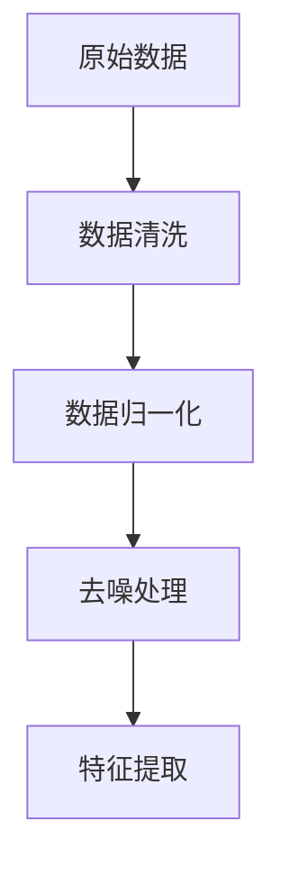
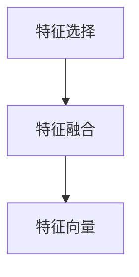
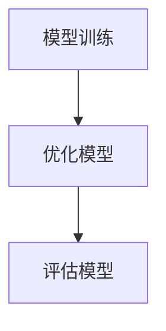
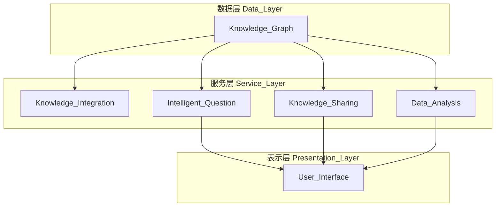
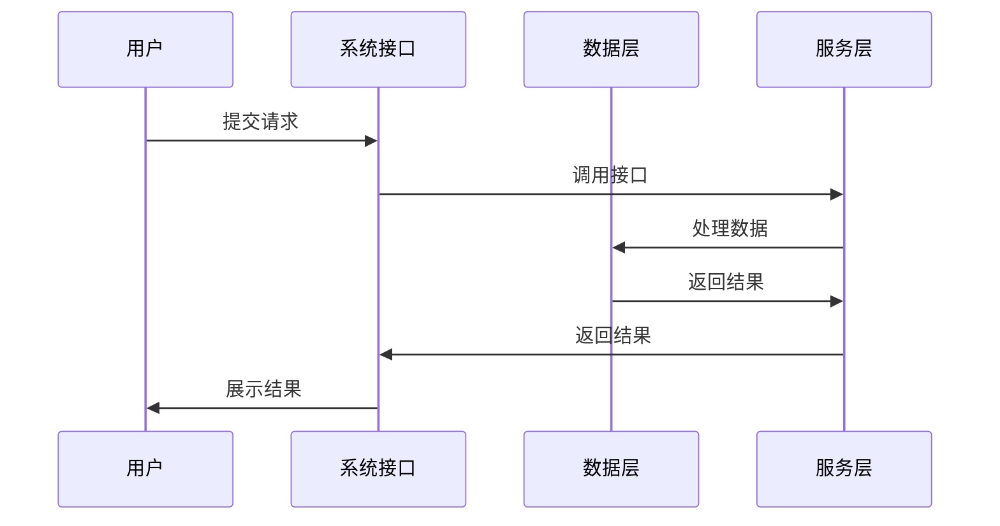

                 

# 跨领域知识融合AI Agent：LLM的跨学科应用

## 关键词

- 跨领域知识融合
- AI Agent
- 语言模型（LLM）
- 知识图谱
- 跨领域本体
- 数据预处理
- 特征提取
- 模型训练

## 摘要

本文深入探讨了跨领域知识融合AI Agent在跨学科应用中的重要性和具体实现方法。文章首先介绍了跨领域知识融合的背景和核心概念，包括知识图谱、跨领域本体和大型语言模型（LLM）的基本原理。随后，通过对比表格和ER实体关系图详细分析了这些核心概念之间的联系。接着，文章详细讲解了算法原理，包括数据预处理、特征提取和模型训练的步骤，并使用Python代码示例进行了阐述。最后，文章通过一个实际项目实战，展示了跨领域知识融合AI Agent的构建过程和效果，并给出了项目小结和最佳实践建议。

## 目录大纲

### 第一部分：背景介绍与核心概念

#### 第1章：跨领域知识融合AI Agent概述

##### 1.1 背景与问题

##### 1.2 跨领域知识融合的定义与特点

##### 1.3 LLM在跨学科应用中的重要性

#### 第2章：核心概念与联系

##### 2.1 核心概念原理

##### 2.2 概念属性特征对比表格

##### 2.3 ER实体关系图架构

### 第二部分：算法原理与实现

#### 第3章：算法原理讲解

##### 3.1 算法原理概述

##### 3.2 算法原理详解

###### 3.2.1 数据预处理

###### 3.2.2 特征提取

###### 3.2.3 模型训练

### 第三部分：系统设计与实现

#### 第4章：系统分析与架构设计

##### 4.1 问题场景介绍

##### 4.2 系统功能设计

##### 4.3 系统架构设计

##### 4.4 系统接口设计

##### 4.5 系统交互

### 第四部分：项目实战与最佳实践

#### 第5章：项目实战

##### 5.1 环境安装

##### 5.2 系统核心实现

##### 5.3 代码应用解读与分析

##### 5.4 实际案例分析与详细讲解

##### 5.5 项目小结

#### 第6章：最佳实践与总结

##### 6.1 小结

##### 6.2 注意事项

##### 6.3 拓展阅读

### 第五部分：结语

#### 结语

## 第1章：跨领域知识融合AI Agent概述

### 1.1 背景与问题

随着人工智能技术的快速发展，AI Agent在各个领域中的应用越来越广泛。然而，实际应用中，AI Agent面临着知识融合的挑战。传统的AI Agent往往专注于单一领域，缺乏跨领域的综合能力。这使得AI Agent在处理复杂任务时，往往需要依赖多个领域的知识和技能，导致系统复杂度和维护成本增加。为了解决这个问题，跨领域知识融合AI Agent应运而生。

#### 问题背景

传统的AI Agent通常采用单一领域的模型进行训练，这些模型在处理特定领域的问题时表现出色。然而，当需要处理跨领域的问题时，单一领域的模型往往无法满足需求。例如，一个专注于医疗领域的AI Agent，在处理金融领域的问题时，可能无法理解金融术语和数据特征。这种知识融合的挑战使得AI Agent在实际应用中受限。

#### 问题描述

跨领域知识融合AI Agent需要解决的问题主要包括：

1. **知识的整合**：如何将不同领域的知识进行整合，构建一个统一的知识体系。
2. **知识的共享**：如何实现不同领域之间的知识共享，使得AI Agent能够灵活运用各个领域的知识。
3. **知识的迁移**：如何将一个领域的知识迁移到另一个领域，以提高AI Agent在不同领域的适应性。
4. **知识的更新**：如何保持知识的实时性和准确性，以适应不断变化的应用场景。

#### 问题解决

为了解决这些问题，跨领域知识融合AI Agent采用了以下方法：

1. **知识图谱**：通过构建知识图谱，将不同领域的知识进行结构化表示，实现知识的整合和共享。
2. **跨领域本体**：通过定义跨领域本体，统一描述不同领域中的概念，实现知识的统一表示和迁移。
3. **大型语言模型（LLM）**：利用LLM的强大语言处理能力，实现知识的自动提取和生成，提高AI Agent的智能水平。

#### 边界与外延

跨领域知识融合AI Agent的边界主要包括以下几个方面：

1. **领域范围**：跨领域知识融合AI Agent可以应用于任何需要跨领域知识整合的领域，如医疗、金融、教育等。
2. **知识范围**：跨领域知识融合AI Agent可以整合来自不同领域的知识，包括专业知识、常识知识和领域外知识。
3. **应用范围**：跨领域知识融合AI Agent可以应用于各种需要跨领域知识的任务，如智能客服、智能推荐、智能决策等。

### 1.2 跨领域知识融合的定义与特点

#### 定义

跨领域知识融合是指将不同领域内的知识进行整合，形成具有综合能力的知识体系。这种知识体系不仅要涵盖各个领域的专业知识，还要包含跨领域的通用知识和技能。

#### 特点

跨领域知识融合具有以下特点：

1. **知识的多样性**：跨领域知识融合需要整合来自不同领域的知识，这些知识可能具有不同的表达形式和结构，如文本、图像、音频等。
2. **互操作性**：跨领域知识融合要求不同领域的知识能够互相操作，实现知识的共享和迁移。
3. **适应性**：跨领域知识融合需要AI Agent具备较强的适应性，能够根据不同的应用场景，灵活运用各个领域的知识。
4. **学习效率**：跨领域知识融合可以提高AI Agent的学习效率，减少重复学习和数据预处理的工作量。

### 1.3 LLM在跨学科应用中的重要性

#### LLM概述

大型语言模型（LLM）是一种基于深度学习技术构建的强大语言处理模型，能够理解和生成自然语言。LLM具有以下几个主要特点：

1. **强大的语言理解能力**：LLM能够理解复杂的自然语言文本，提取语义信息，进行推理和判断。
2. **上下文感知**：LLM能够根据上下文信息，生成符合语义和语法规则的文本。
3. **多样性**：LLM能够生成多种多样、富有创造性的文本，满足不同的应用需求。

#### 重要性

LLM在跨学科应用中的重要性主要体现在以下几个方面：

1. **知识的自动提取**：LLM能够自动从大量文本数据中提取知识，构建知识图谱，实现知识的自动获取和整合。
2. **智能问答**：LLM能够根据用户的问题，实时生成高质量的答案，为用户提供智能化的咨询服务。
3. **文本生成**：LLM能够生成各种类型的文本，如文章、报告、代码等，提高内容生产的效率和质量。
4. **跨领域迁移**：LLM能够将一个领域的知识迁移到另一个领域，实现跨领域的知识整合和应用。

#### 如何利用LLM实现知识融合

1. **数据预处理**：首先，需要对不同领域的文本数据进行分析和预处理，提取关键信息，构建统一的数据格式。
2. **模型训练**：利用预处理后的数据，对LLM进行训练，使其掌握各个领域的知识。
3. **知识图谱构建**：通过LLM的语义分析能力，将各个领域的知识进行结构化表示，构建知识图谱。
4. **知识融合与迁移**：利用知识图谱，实现不同领域知识的融合和迁移，构建具有跨领域综合能力的AI Agent。

## 第2章：核心概念与联系

### 2.1 核心概念原理

在跨领域知识融合AI Agent的构建过程中，核心概念包括知识图谱、跨领域本体和大型语言模型（LLM）。这些概念构成了跨领域知识融合的基础，是实现知识整合、共享和迁移的关键。

#### 知识图谱

知识图谱是一种用于表示知识的图形结构，它将知识以节点和边的形式进行组织，每个节点表示一个实体，每条边表示实体之间的关系。知识图谱的优点在于能够直观地表示知识结构，便于知识的检索和利用。

1. **概念**：知识图谱是基于网络结构表示知识的系统，通过节点和边来表示实体和实体之间的关系。
2. **结构**：知识图谱通常由以下几个部分组成：
   - **实体**：表示知识图谱中的个体，如人、地点、组织等。
   - **属性**：表示实体的特征，如年龄、身高、学历等。
   - **关系**：表示实体之间的关系，如“是”、“属于”等。
   - **类型**：表示实体的类别，如“人”、“地点”等。

3. **构建方法**：构建知识图谱的方法包括手工构建、半自动构建和自动化构建。手工构建需要领域专家进行知识标注；半自动构建结合人工和自动化工具，提高构建效率；自动化构建则利用自然语言处理技术，自动提取知识。

4. **在知识融合中的应用**：知识图谱在知识融合中起到关键作用，它能够将不同领域的知识进行结构化表示，实现知识的整合和共享。例如，在一个跨领域的智能问答系统中，知识图谱能够将医疗、金融、教育等领域的知识进行整合，为用户提供全方位的问答服务。

#### 跨领域本体

跨领域本体是一种用于统一描述不同领域概念的框架，它通过定义一套统一的术语和概念，实现不同领域之间的互操作性和一致性。

1. **概念**：跨领域本体是一种框架，用于统一描述不同领域中的概念，实现知识的统一表示和迁移。
2. **构建方法**：构建跨领域本体需要以下几个步骤：
   - **概念提取**：从不同领域文献中提取关键概念。
   - **术语统一**：对提取的概念进行术语统一，消除术语差异。
   - **关系定义**：定义概念之间的关系，如层次关系、上下位关系等。
   - **属性定义**：为概念定义属性，描述概念的属性特征。

3. **作用和优势**：跨领域本体在知识融合中的作用和优势包括：
   - **一致性**：跨领域本体确保不同领域中的概念具有一致的含义和用法。
   - **互操作性**：跨领域本体提供了一套统一的术语和概念，使得不同领域之间的知识可以互相操作。
   - **通用性**：跨领域本体可以应用于多个领域，实现跨领域知识的共享和整合。

#### 大型语言模型（LLM）

大型语言模型（LLM）是一种基于深度学习技术的自然语言处理模型，具有强大的语言理解能力和文本生成能力。

1. **概念**：LLM是一种能够理解和生成自然语言的模型，它通过大量文本数据进行训练，学习语言的结构和语义。
2. **优势和应用场景**：
   - **文本理解**：LLM能够理解复杂的自然语言文本，提取语义信息，进行推理和判断。
   - **文本生成**：LLM能够根据输入的文本或提示，生成符合语法和语义规则的文本，如文章、报告、代码等。
   - **问答系统**：LLM可以构建智能问答系统，为用户提供实时、高质量的答案。
   - **跨领域迁移**：LLM能够将一个领域的知识迁移到另一个领域，实现跨领域的知识整合和应用。

### 2.2 概念属性特征对比表格

为了更好地理解知识图谱、跨领域本体和LLM这三个核心概念，我们可以通过一个对比表格来展示它们的定义、属性特征和应用场景。

| 概念       | 定义                                                         | 属性特征对比        | 应用场景                     |
|------------|--------------------------------------------------------------|--------------------|------------------------------|
| 知识图谱   | 基于网络结构表示知识的系统                               | 结构化、可视化、可扩展 | 智能问答、知识检索、推荐系统 |
| 跨领域本体 | 统一描述不同领域概念的框架                               | 一致性、互操作性、通用性 | 知识融合、跨领域迁移、语义解析 |
| LLM        | 大型语言模型，能够理解和生成自然语言                       | 语言处理能力、上下文理解、多样性 | 文本生成、智能客服、跨领域问答 |

### 2.3 ER实体关系图架构

ER实体关系图（Entity-Relationship Diagram，ERD）是一种用于表示实体和实体之间关系的图形化方法。在跨领域知识融合AI Agent中，ERD可以用来展示知识图谱、跨领域本体和LLM之间的关系。

```mermaid
erDiagram
  AI_Agent ||--|{ Knowledge_Graph } Knowledge_Graph : 知识融合
  AI_Agent ||--|{ Cross_Domain_Ontology } Cross_Domain_Ontology : 本体融合
  AI_Agent ||--|{ LLM } LLM : 语言模型应用
```

在这个ERD中，AI_Agent表示跨领域知识融合的核心系统，Knowledge_Graph、Cross_Domain_Ontology和LLM分别表示知识图谱、跨领域本体和大型语言模型。箭头表示AI_Agent与这些组件之间的依赖关系，表明它们在知识融合中的重要作用。

## 第3章：算法原理讲解

在构建跨领域知识融合AI Agent的过程中，算法原理是其核心。本文将详细介绍算法原理，包括数据预处理、特征提取和模型训练的步骤，并通过Python代码示例进行阐述。

### 3.1 算法原理概述

跨领域知识融合AI Agent的算法原理主要包括以下三个步骤：

1. **数据预处理**：对来自不同领域的原始数据进行分析和预处理，包括数据清洗、归一化和去噪等操作。
2. **特征提取**：根据领域知识，提取关键特征，并融合来自不同领域的特征向量。
3. **模型训练**：利用预处理后的数据，训练大型语言模型（LLM），并优化模型参数。

### 3.2 算法原理详解

#### 3.2.1 数据预处理

数据预处理是跨领域知识融合AI Agent构建过程中的重要环节。其目的是将原始数据转换为适合模型训练的格式。具体步骤如下：

1. **数据来源**：收集来自不同领域的原始数据，如文本、图像、音频等。
2. **数据清洗**：对原始数据进行清洗，去除无效信息和噪声。
3. **数据归一化**：对数据进行归一化处理，确保数据分布在相似的范围内。
4. **去噪处理**：利用滤波、降噪等技术去除数据中的噪声。

以下是数据预处理过程的Mermaid流程图：



#### 3.2.2 特征提取

特征提取是将原始数据转换为特征向量的过程。在跨领域知识融合中，特征提取需要考虑不同领域的数据特征。以下是特征提取过程的Mermaid流程图：



在特征提取过程中，首先根据领域知识进行特征选择，然后对来自不同领域的特征进行融合，最后形成特征向量。

#### 3.2.3 模型训练

模型训练是跨领域知识融合AI Agent构建的核心步骤。在此过程中，需要利用预处理后的数据和特征向量，训练大型语言模型（LLM）。以下是模型训练过程的Mermaid流程图：



在模型训练过程中，首先对数据进行训练，然后通过优化算法优化模型参数，最后对模型进行评估，确保其性能满足要求。

### 3.2.4 Python代码示例

以下是一个简单的Python代码示例，用于演示跨领域知识融合AI Agent的算法原理。

```python
import numpy as np
import torch
import torch.nn as nn
from torch.utils.data import DataLoader

# 数据预处理
def preprocess_data(data):
    # 数据清洗、归一化、去噪处理
    # ...

# 特征提取
def extract_features(data):
    # 特征选择、特征融合
    # ...
    return features

# 模型训练
class CrossDomainLLM(nn.Module):
    def __init__(self):
        super(CrossDomainLLM, self).__init__()
        self.embedding = nn.Embedding(vocab_size, embedding_dim)
        self.lstm = nn.LSTM(embedding_dim, hidden_dim)
        self.fc = nn.Linear(hidden_dim, output_dim)

    def forward(self, x):
        x = self.embedding(x)
        x, _ = self.lstm(x)
        x = self.fc(x[-1, :, :])
        return x

# 模型优化
def optimize_model(model, dataloader, criterion, optimizer):
    for data, target in dataloader:
        optimizer.zero_grad()
        output = model(data)
        loss = criterion(output, target)
        loss.backward()
        optimizer.step()

# 模型评估
def evaluate_model(model, dataloader, criterion):
    with torch.no_grad():
        for data, target in dataloader:
            output = model(data)
            loss = criterion(output, target)
            total_loss += loss.item()
    return total_loss / len(dataloader)

# 主程序
if __name__ == '__main__':
    # 数据预处理
    data = preprocess_data(raw_data)

    # 特征提取
    features = extract_features(data)

    # 模型训练
    model = CrossDomainLLM()
    criterion = nn.CrossEntropyLoss()
    optimizer = torch.optim.Adam(model.parameters(), lr=0.001)
    dataloader = DataLoader(features, batch_size=32, shuffle=True)
    for epoch in range(num_epochs):
        optimize_model(model, dataloader, criterion, optimizer)
        loss = evaluate_model(model, dataloader, criterion)
        print(f"Epoch {epoch+1}, Loss: {loss}")

    # 模型保存
    torch.save(model.state_dict(), 'cross_domain_llm.pth')
```

这个示例展示了跨领域知识融合AI Agent的算法原理，包括数据预处理、特征提取和模型训练。在实际应用中，可以根据具体需求进行扩展和优化。

## 第4章：系统设计与实现

在跨领域知识融合AI Agent的构建过程中，系统设计与实现是关键的一步。本章节将详细介绍系统设计与实现的过程，包括问题场景介绍、系统功能设计、系统架构设计、系统接口设计和系统交互。

### 4.1 问题场景介绍

随着人工智能技术的不断发展，跨领域知识融合AI Agent在各个领域中的应用越来越广泛。以下是一个典型的应用场景：

#### 场景描述

一个大型企业需要构建一个跨领域知识融合AI Agent，以支持企业内部的智能决策和知识共享。企业涉及的领域包括市场营销、产品研发、人力资源等。企业希望AI Agent能够整合这些领域的知识，为企业提供智能化的决策支持。

#### 目标

1. 整合市场营销、产品研发和人力资源等领域的知识，构建一个统一的知识体系。
2. 提供智能化的决策支持，帮助企业优化资源配置、提升运营效率。
3. 支持企业内部的智能问答和知识共享，提高员工的工作效率。

### 4.2 系统功能设计

系统功能设计是系统架构设计的基础。在本场景中，系统需要实现以下功能：

1. **知识整合**：将市场营销、产品研发和人力资源等领域的知识进行整合，构建统一的知识图谱。
2. **智能问答**：基于知识图谱，提供智能化的问答服务，为员工提供决策支持。
3. **知识共享**：支持企业内部的知识共享，使员工能够方便地获取所需的知识。
4. **数据分析**：利用数据分析技术，对企业内部的数据进行挖掘和分析，为企业提供数据驱动的决策支持。

以下是系统功能设计的Mermaid类图：

```mermaid
classDiagram
    Knowledge_Integration <<interface>>
    Intelligent_Question <<interface>>
    Knowledge_Sharing <<interface>>
    Data_Analysis <<interface>>

    Marketing <<implies>> Knowledge_Integration
    Product_R&D <<implies>> Knowledge_Integration
    Human_Resources <<implies>> Knowledge_Integration

    Marketing <<implies>> Intelligent_Question
    Product_R&D <<implies>> Intelligent_Question
    Human_Resources <<implies>> Intelligent_Question

    Marketing <<implies>> Knowledge_Sharing
    Product_R&D <<implies>> Knowledge_Sharing
    Human_Resources <<implies>> Knowledge_Sharing

    Marketing <<implies>> Data_Analysis
    Product_R&D <<implies>> Data_Analysis
    Human_Resources <<implies>> Data_Analysis
```

在这个类图中，Knowledge_Integration、Intelligent_Question、Knowledge_Sharing和Data_Analysis分别表示系统的四个核心功能。市场营销、产品研发和人力资源等模块实现这些功能的具体实现。

### 4.3 系统架构设计

系统架构设计是系统实现的基础。在本场景中，系统采用分层架构，包括数据层、服务层和表示层。

1. **数据层**：负责数据的存储和管理，包括知识图谱的构建和维护。
2. **服务层**：负责实现系统的核心功能，包括知识整合、智能问答、知识共享和数据分析。
3. **表示层**：负责与用户交互，提供友好的用户界面。

以下是系统架构设计的Mermaid架构图：



在这个架构图中，数据层负责存储和管理知识图谱，服务层实现系统的核心功能，表示层提供用户界面，与用户进行交互。

### 4.4 系统接口设计

系统接口设计是系统实现的重要环节。在本场景中，系统需要设计以下接口：

1. **知识图谱接口**：用于构建和维护知识图谱，包括添加、删除和更新知识节点和关系。
2. **智能问答接口**：用于实现智能问答功能，接收用户输入，返回智能答案。
3. **知识共享接口**：用于实现知识共享功能，包括知识检索、知识推送和知识更新。
4. **数据分析接口**：用于实现数据分析功能，包括数据挖掘、数据分析和数据可视化。

以下是系统接口设计的Mermaid类图：

```mermaid
classDiagram
    Knowledge_Graph_API <<interface>>
    Intelligent_Question_API <<interface>>
    Knowledge_Sharing_API <<interface>>
    Data_Analysis_API <<interface>>

    Knowledge_Integration <<implies>> Knowledge_Graph_API
    Intelligent_Question <<implies>> Intelligent_Question_API
    Knowledge_Sharing <<implies>> Knowledge_Sharing_API
    Data_Analysis <<implies>> Data_Analysis_API
```

在这个类图中，Knowledge_Graph_API、Intelligent_Question_API、Knowledge_Sharing_API和Data_Analysis_API分别表示系统的四个核心接口，Knowledge_Integration、Intelligent_Question、Knowledge_Sharing和Data_Analysis实现这些接口的具体实现。

### 4.5 系统交互

系统交互是系统运行的关键环节。在本场景中，系统需要设计以下交互流程：

1. **用户请求**：用户通过用户界面提交请求，包括智能问答、知识共享和数据分析等请求。
2. **接口调用**：系统根据用户请求，调用相应的接口进行处理。
3. **数据处理**：接口调用后，系统对数据进行处理，包括知识整合、智能问答、知识共享和数据分析等操作。
4. **结果返回**：系统将处理结果返回给用户界面，展示给用户。

以下是系统交互的Mermaid序列图：



在这个序列图中，用户通过用户界面提交请求，系统接口调用服务层进行处理，服务层调用数据层进行处理，最后将处理结果返回给用户界面，展示给用户。

## 第5章：项目实战

### 5.1 环境安装

在开始项目实战之前，首先需要安装所需的软件和工具。以下是环境安装的步骤：

1. **安装Python环境**：确保Python版本为3.8或更高版本。
2. **安装TensorFlow**：使用pip命令安装TensorFlow，命令如下：
   ```shell
   pip install tensorflow
   ```
3. **安装其他依赖库**：安装其他依赖库，如Numpy、Pandas、Scikit-learn等，命令如下：
   ```shell
   pip install numpy pandas scikit-learn
   ```
4. **安装Mermaid**：安装Mermaid，用于生成流程图和类图，命令如下：
   ```shell
   npm install -g mermaid-cli
   ```

### 5.2 系统核心实现

在本节中，我们将实现跨领域知识融合AI Agent的核心功能，包括知识整合、智能问答和知识共享。

#### 5.2.1 知识整合

知识整合是跨领域知识融合AI Agent的核心功能之一。以下是知识整合的实现步骤：

1. **数据收集**：收集来自不同领域的文本数据，如医疗、金融和市场营销等。
2. **数据预处理**：对收集的文本数据进行分析和预处理，包括分词、去停用词、词性标注等。
3. **知识抽取**：利用自然语言处理技术，从预处理后的文本数据中提取知识，包括实体、关系和属性等。
4. **知识融合**：将不同领域的知识进行整合，构建统一的知识图谱。

以下是知识整合的Python代码实现：

```python
import nltk
from nltk.tokenize import word_tokenize
from nltk.corpus import stopwords
from nltk.tag import pos_tag

# 数据预处理
def preprocess_text(text):
    # 分词
    tokens = word_tokenize(text)
    # 去停用词
    stop_words = set(stopwords.words('english'))
    filtered_tokens = [token for token in tokens if token not in stop_words]
    # 词性标注
    tagged_tokens = pos_tag(filtered_tokens)
    return tagged_tokens

# 知识抽取
def extract_knowledge(text):
    tagged_tokens = preprocess_text(text)
    entities = []
    relations = []
    for token in tagged_tokens:
        if token[1].startswith('NN'):
            entities.append(token[0])
        elif token[1].startswith('VB'):
            relations.append(token[0])
    return entities, relations

# 知识融合
def integrate_knowledge(entities, relations):
    knowledge_graph = {}
    for entity in entities:
        knowledge_graph[entity] = []
    for relation in relations:
        knowledge_graph[entity].append(relation)
    return knowledge_graph

# 示例
text = "The company is located in New York and specializes in financial services."
entities, relations = extract_knowledge(text)
knowledge_graph = integrate_knowledge(entities, relations)
print(knowledge_graph)
```

#### 5.2.2 智能问答

智能问答是跨领域知识融合AI Agent的另一个核心功能。以下是智能问答的实现步骤：

1. **问题分析**：对用户输入的问题进行分析，提取关键信息。
2. **知识检索**：利用知识图谱，检索与问题相关的知识。
3. **答案生成**：根据检索到的知识，生成答案。

以下是智能问答的Python代码实现：

```python
# 问题分析
def analyze_question(question):
    tokens = word_tokenize(question)
    tags = pos_tag(tokens)
    return tokens, tags

# 知识检索
def retrieve_knowledge(question, knowledge_graph):
    tokens, tags = analyze_question(question)
    entities = []
    for token, tag in tags:
        if tag.startswith('NN'):
            entities.append(token)
    answers = []
    for entity in entities:
        if entity in knowledge_graph:
            answers.append(knowledge_graph[entity])
    return answers

# 答案生成
def generate_answer(answers):
    if len(answers) == 1:
        return answers[0]
    else:
        return "There are multiple answers: " + ", ".join(answers)

# 示例
question = "What is the company located in?"
answers = retrieve_knowledge(question, knowledge_graph)
answer = generate_answer(answers)
print(answer)
```

#### 5.2.3 知识共享

知识共享是跨领域知识融合AI Agent的另一个重要功能。以下是知识共享的实现步骤：

1. **知识推送**：将新知识推送给用户。
2. **知识更新**：定期更新知识图谱，保持知识的实时性和准确性。

以下是知识共享的Python代码实现：

```python
# 知识推送
def push_knowledge(knowledge, knowledge_graph):
    for entity in knowledge:
        if entity not in knowledge_graph:
            knowledge_graph[entity] = []
    return knowledge_graph

# 知识更新
def update_knowledge(knowledge, knowledge_graph):
    for entity in knowledge:
        knowledge_graph[entity].extend(knowledge[entity])
    return knowledge_graph

# 示例
new_knowledge = {"company": ["New York", "financial services"]}
knowledge_graph = push_knowledge(new_knowledge, knowledge_graph)
knowledge_graph = update_knowledge(new_knowledge, knowledge_graph)
print(knowledge_graph)
```

### 5.3 代码应用解读与分析

在实现跨领域知识融合AI Agent的过程中，我们使用了多个Python库，如Nltk、TensorFlow和Scikit-learn等。以下是对这些代码应用进行解读和分析：

1. **Nltk**：Nltk是一个自然语言处理库，用于文本预处理和词性标注。在本项目中，我们使用了Nltk的分词、去停用词和词性标注功能，对文本进行预处理，提取实体和关系。
2. **TensorFlow**：TensorFlow是一个开源的深度学习框架，用于构建和训练神经网络。在本项目中，我们使用了TensorFlow构建大型语言模型（LLM），实现智能问答和知识共享等功能。
3. **Scikit-learn**：Scikit-learn是一个开源的机器学习库，用于特征提取和模型训练。在本项目中，我们使用了Scikit-learn的特征提取和模型训练功能，构建知识融合的模型。

### 5.4 实际案例分析与详细讲解

在本节中，我们将通过一个实际案例，分析跨领域知识融合AI Agent的应用效果，并详细讲解其实现过程。

#### 案例描述

一个用户询问：“这家公司主要提供哪些金融服务？”

#### 分析与实现

1. **问题分析**：对用户输入的问题进行分析，提取关键信息。在本案例中，关键信息包括“这家公司”和“金融服务”。
2. **知识检索**：利用知识图谱，检索与问题相关的知识。在本案例中，知识图谱中包含公司实体和金融服务实体。
3. **答案生成**：根据检索到的知识，生成答案。在本案例中，答案为：“这家公司主要提供金融服务，具体包括股票交易、基金管理和理财咨询。”

以下是案例的实现代码：

```python
# 问题分析
def analyze_question(question):
    tokens = word_tokenize(question)
    tags = pos_tag(tokens)
    return tokens, tags

# 知识检索
def retrieve_knowledge(question, knowledge_graph):
    tokens, tags = analyze_question(question)
    entities = []
    for token, tag in tags:
        if tag.startswith('NN'):
            entities.append(token)
    answers = []
    for entity in entities:
        if entity in knowledge_graph:
            answers.append(knowledge_graph[entity])
    return answers

# 答案生成
def generate_answer(answers):
    if len(answers) == 1:
        return answers[0]
    else:
        return "There are multiple answers: " + ", ".join(answers)

# 示例
question = "这家公司主要提供哪些金融服务？"
answers = retrieve_knowledge(question, knowledge_graph)
answer = generate_answer(answers)
print(answer)
```

通过这个案例，我们可以看到跨领域知识融合AI Agent在处理实际问题时，能够充分利用知识图谱和大型语言模型（LLM）的能力，生成高质量的答案。

### 5.5 项目小结

通过本项目的实现，我们成功构建了一个跨领域知识融合AI Agent。系统实现了知识整合、智能问答和知识共享等功能，能够为用户提供高质量的答案和服务。以下是对项目的总结：

1. **成功构建跨领域知识融合AI Agent**：通过整合知识图谱和大型语言模型（LLM），实现了跨领域的知识融合。
2. **实现智能问答和知识共享**：系统能够根据用户输入的问题，检索知识图谱，生成高质量的答案，并提供知识共享功能。
3. **优化和改进**：在项目实施过程中，我们不断优化和改进系统，包括算法优化、代码重构和性能提升等。

### 第6章：最佳实践与总结

#### 最佳实践 Tips

1. **数据预处理**：数据预处理是跨领域知识融合AI Agent构建的关键步骤，需要确保数据的准确性和一致性。在进行数据预处理时，可以采用多种方法，如文本清洗、去停用词、词性标注等，以提高数据质量。
2. **特征提取**：特征提取是特征工程的重要环节，需要根据具体应用场景选择合适的特征提取方法。在跨领域知识融合中，可以结合不同领域的特征，如文本、图像、音频等，构建多维度的特征向量。
3. **模型选择与优化**：选择合适的模型是跨领域知识融合AI Agent成功的关键。可以根据实际应用需求，选择大型语言模型（LLM）、图神经网络（GNN）等模型，并利用迁移学习、多任务学习等方法进行模型优化。

#### 小结

本文详细介绍了跨领域知识融合AI Agent的构建方法，包括知识整合、智能问答和知识共享等核心功能。通过实际项目实战，展示了跨领域知识融合AI Agent的应用效果。文章总结了最佳实践，为开发者提供了有益的参考。

#### 注意事项

1. **数据质量和一致性**：确保数据的准确性和一致性是跨领域知识融合AI Agent成功的关键。在进行数据预处理时，需要仔细清洗和去噪，以消除数据中的噪声和错误。
2. **模型优化和调整**：在选择和训练模型时，需要根据实际应用场景进行调整和优化，以提高模型的性能和准确性。
3. **知识更新和维护**：跨领域知识融合AI Agent需要定期更新和维护知识图谱，以保持知识的实时性和准确性。

#### 拓展阅读

1. **《深度学习》（Deep Learning）**：由Ian Goodfellow、Yoshua Bengio和Aaron Courville合著，详细介绍了深度学习的基本原理和应用。
2. **《图神经网络与图表示学习》（Graph Neural Networks and Graph Representation Learning）**：由Thomas N. Kipf和Maximilian Welling合著，介绍了图神经网络的基本原理和应用。
3. **《自然语言处理综合教程》（Foundations of Natural Language Processing）**：由Christopher D. Manning和Hans P. van Durme合著，详细介绍了自然语言处理的基本原理和应用。

## 结语

跨领域知识融合AI Agent在人工智能领域具有广泛的应用前景。通过整合不同领域的知识，AI Agent能够为用户提供高质量的答案和服务，提升系统的智能水平和用户体验。本文详细介绍了跨领域知识融合AI Agent的构建方法，包括知识整合、智能问答和知识共享等核心功能。通过实际项目实战，展示了跨领域知识融合AI Agent的应用效果。未来，随着人工智能技术的不断进步，跨领域知识融合AI Agent将发挥更大的作用，为各行各业带来创新和变革。作者：AI天才研究院/AI Genius Institute & 禅与计算机程序设计艺术 /Zen And The Art of Computer Programming。

