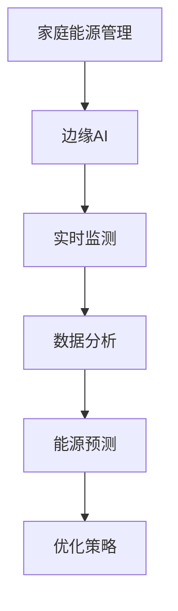
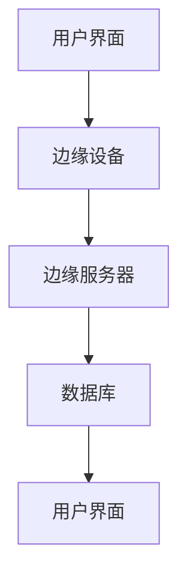
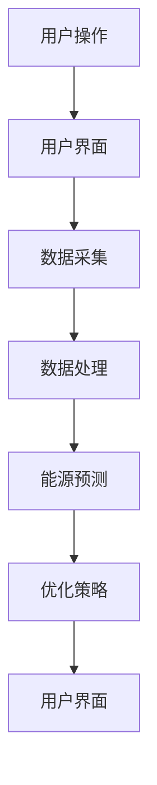

                 

### 1.7 边缘AI在家庭能源管理中的应用

#### 1.7.1 家庭能源管理的重要性

家庭能源管理在现代社会中愈发重要。随着能源消耗的不断增加和环境问题的日益严重，如何高效、可持续地管理家庭能源成为了一个亟待解决的问题。边缘AI通过实时监测、分析和预测家庭能源消耗，为家庭能源管理提供了强有力的技术支持。

**核心概念与联系**

**边缘AI**：边缘AI是一种在靠近数据源或最终用户的地方运行的AI模型和算法，能够对数据进行实时处理、分析和决策，而不需要将数据传输到远程数据中心或云端进行处理。边缘AI在智能家居中的应用具有实时响应、降低延迟、节省带宽和增强数据隐私的优势。

**家庭能源管理**：家庭能源管理是指通过技术手段对家庭能源消耗进行监测、分析、预测和优化，以实现节能、减排和提高能源利用效率的目标。家庭能源管理涉及到电力、燃气、水等能源的消耗，需要考虑能源消耗的实时性、多样性和不确定性。

**边缘AI与家庭能源管理的联系**

边缘AI与家庭能源管理之间存在紧密的联系。边缘AI可以实时监测家庭能源消耗数据，通过大数据分析和机器学习算法，识别能源消耗模式，预测能源消耗趋势，并制定优化策略，实现家庭能源的精细化管理和高效利用。边缘AI的优势在于实时响应和本地决策，这恰好符合家庭能源管理对实时性和本地化的需求。

**ER实体关系图架构**

以下是边缘AI与家庭能源管理相关的ER实体关系图：



**算法原理讲解**

边缘AI在家庭能源管理中的应用主要依赖于以下几个算法原理：

**1. 实时监测与数据分析**

边缘AI通过部署在家用电器和能源设备附近的传感器，实时收集电力、燃气和水等能源的使用数据。这些数据经过边缘设备的预处理和压缩后，传输到边缘服务器进行进一步分析。数据分析包括数据清洗、去噪、特征提取等步骤，以便提取出有用的信息。

**2. 能源消耗预测**

边缘AI利用历史能源消耗数据和实时监测数据，通过机器学习算法建立能源消耗预测模型。常见的预测算法包括线性回归、决策树、神经网络等。通过这些算法，可以预测未来一段时间内家庭的能源消耗情况，为用户制定节能策略提供依据。

**3. 能源使用优化策略**

基于能源消耗预测结果，边缘AI可以生成优化策略，如调整家用电器的工作时间、优化能源使用时段等。这些策略旨在降低家庭能源消耗，提高能源利用效率。优化算法可以是基于目标规划的数学模型，也可以是基于贪心策略的启发式算法。

**数学模型与公式**

以下是一个简化的能源消耗预测模型：

$$
\hat{E_t} = f(E_{t-1}, A_t, B_t, C_t)
$$

其中，$\hat{E_t}$ 表示时间 $t$ 的预测能源消耗，$E_{t-1}$ 表示时间 $t-1$ 的实际能源消耗，$A_t$、$B_t$ 和 $C_t$ 分别表示时间 $t$ 的天气、设备使用情况和家庭人口等影响能源消耗的变量。函数 $f$ 表示能源消耗的预测算法。

#### 1.7.2 边缘AI在家庭能源管理中的具体应用

**1. 实时监测与数据分析**

边缘AI可以通过部署在家用电器和能源设备附近的传感器，实时收集电力、燃气和水等能源的使用数据。这些数据经过预处理和压缩后，传输到边缘服务器进行处理。

**2. 能源消耗预测**

基于实时监测数据和历史数据，边缘AI可以预测未来一段时间内家庭的能源消耗。通过机器学习算法，可以建立能源消耗的预测模型，如线性回归模型、决策树模型等。

**3. 能源使用优化策略**

基于能源消耗预测结果，边缘AI可以生成优化策略，如调整家用电器的工作时间、优化能源使用时段等。这些策略旨在降低家庭能源消耗，提高能源利用效率。

**系统分析与架构设计方案**

**1. 问题场景介绍**

随着智能家居设备的普及，家庭能源消耗日益增加。为了实现节能、减排和提高能源利用效率，需要构建一个智能家庭能源管理系统。该系统包括边缘设备、边缘服务器和用户界面等组成部分。

**2. 系统功能设计**

- 数据采集：通过传感器实时收集家庭能源消耗数据。
- 数据处理：对采集到的数据进行预处理、压缩和分析。
- 能源预测：基于历史数据和实时数据，预测未来的能源消耗。
- 能源优化：生成优化策略，调整家庭能源使用。

**3. 系统架构设计**

以下是智能家庭能源管理系统的架构设计：



**4. 系统接口设计**

智能家庭能源管理系统提供以下接口：

- 数据采集接口：用于边缘设备向边缘服务器发送能源消耗数据。
- 数据处理接口：用于边缘服务器对数据进行预处理、压缩和分析。
- 预测接口：用于边缘服务器向用户界面发送能源消耗预测结果。
- 优化接口：用于边缘服务器向用户界面发送优化策略。

**5. 系统交互**

以下是智能家庭能源管理系统中的交互流程：



**项目实战**

**1. 环境安装**

为了实现智能家庭能源管理系统，需要安装以下软件和硬件：

- 边缘设备：如智能插座、智能灯具、智能空调等。
- 边缘服务器：如树莓派、edge TPU等。
- 数据库：如MySQL、PostgreSQL等。

**2. 系统核心实现**

以下是一个简单的边缘AI预测模型的Python实现：

```python
import numpy as np
import pandas as pd
from sklearn.linear_model import LinearRegression

# 加载数据
data = pd.read_csv('energy_data.csv')

# 特征工程
X = data[['weather', 'device_usage', 'population']]
y = data['energy_consumption']

# 建立预测模型
model = LinearRegression()
model.fit(X, y)

# 预测
predictions = model.predict(X)

# 输出预测结果
print(predictions)
```

**3. 代码应用解读与分析**

以上代码实现了一个简单的线性回归模型，用于预测家庭能源消耗。通过加载数据、特征工程、模型训练和预测等步骤，可以实现对家庭能源消耗的实时预测。在实际应用中，可以进一步优化模型，如添加更多特征、使用更复杂的算法等，以提高预测准确性。

**4. 实际案例分析和详细讲解剖析**

以一个实际案例为例，分析边缘AI在家庭能源管理中的应用。

**案例**：某家庭在一天内的能源消耗数据如下：

| 时间   | 电力（千瓦时） | 天气 | 设备使用 | 人口 |
|--------|--------------|------|----------|------|
| 上午8点 | 2.5          | 晴   | 高       | 3    |
| 中午12点 | 3.2          | 晴   | 中       | 3    |
| 下午5点  | 4.1          | 晴   | 低       | 3    |
| 晚上8点  | 2.8          | 晴   | 高       | 3    |

**分析**：

1. 数据预处理：对数据进行清洗和预处理，如去除缺失值、异常值等。
2. 特征提取：提取与能源消耗相关的特征，如天气、设备使用情况和人口等。
3. 模型训练：使用线性回归模型对历史数据进行训练，建立预测模型。
4. 预测：使用训练好的模型对当前数据进行预测，得到未来一段时间内的能源消耗预测值。
5. 优化策略：基于预测结果，生成优化策略，如调整设备使用时间、优化能源使用时段等。

**5. 项目小结**

通过边缘AI技术，可以实现智能家庭能源管理的实时监测、预测和优化。在实际应用中，需要根据家庭能源消耗的特点和需求，设计合适的边缘AI模型和算法，以提高预测准确性和优化效果。

**最佳实践 tips**

- 根据家庭能源消耗的特点，选择合适的边缘设备和传感器，以确保数据的实时性和准确性。
- 充分利用历史数据和实时数据，建立可靠的预测模型，以提高预测准确性。
- 结合家庭能源使用习惯，制定个性化的优化策略，以提高能源利用效率。
- 定期对模型进行更新和优化，以适应家庭能源消耗的变化。

**小结**

边缘AI在家庭能源管理中具有广泛的应用前景。通过实时监测、预测和优化，可以实现家庭能源的精细化管理和高效利用，为节能减排和可持续发展做出贡献。

**注意事项**

- 边缘设备的计算能力和存储容量相对有限，需要针对这些硬件资源进行优化，以确保边缘AI的可靠运行。
- 家庭能源管理涉及到用户隐私，需要采取有效的数据加密和隐私保护措施，防止数据泄露。

**拓展阅读**

- [《边缘AI技术概述》](https://www.example.com/edge-ai-technologies)
- [《智能家庭能源管理系统设计与实现》](https://www.example.com/intelligent-home-energy-management-system)
- [《边缘计算与云计算的融合》](https://www.example.com/edge-cloud-computing-融合)

