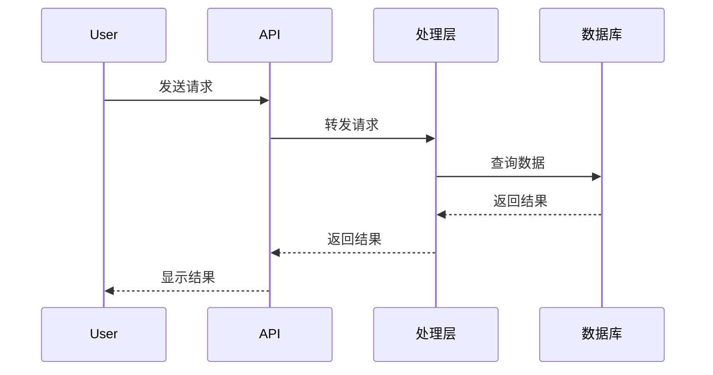
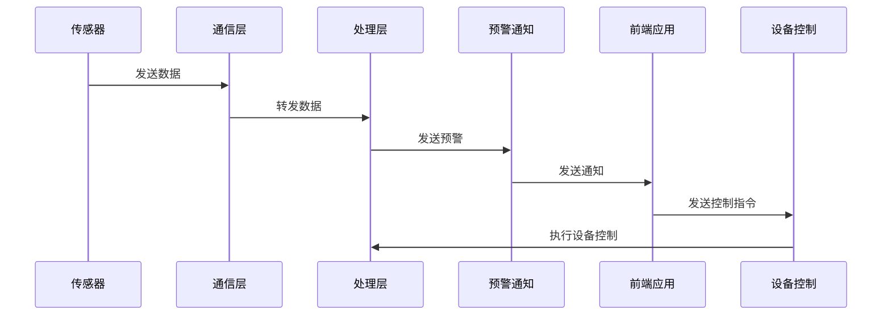

                 

### 文章标题与关键词

# 边缘AI在智能家居安全中的应用：家庭安防智能预警系统

> 关键词：边缘AI、智能家居安全、家庭安防、智能预警系统、入侵检测、火灾预警、异常行为识别

> 摘要：本文深入探讨了边缘AI在智能家居安全中的应用，重点研究了家庭安防智能预警系统。通过分析边缘AI的核心概念、技术基础，以及其在入侵检测、火灾预警和异常行为识别等领域的具体应用，我们展示了如何利用边缘AI技术提升家庭安全防护水平。文章还探讨了智能家居安全系统的架构设计、算法实现与优化，以及安全性分析与防护措施，为读者提供了一个全面的技术指南。

### 引言与背景

随着物联网（IoT）和智能家居设备的普及，家庭安全日益受到关注。传统的家庭安全系统主要依赖于中央监控中心和云端处理，但在数据传输和处理速度、安全性方面存在一定的局限性。边缘AI的出现为智能家居安全带来了新的机遇，通过在本地设备上部署智能算法，可以实现更快速、更高效、更安全的家庭安全监控。

#### 问题背景

近年来，随着智能家居设备的普及，家庭安全威胁也日益增加。例如，家庭入侵、火灾、煤气泄漏等安全问题频繁发生。现有的家庭安全系统大多依赖中央监控中心和云端处理，这存在以下问题：

1. **延迟响应**：数据传输到云端处理需要时间，可能导致安全事件反应迟缓。
2. **数据隐私**：大量敏感数据需要上传至云端，可能带来数据隐私泄露的风险。
3. **网络依赖**：在家庭内部网络不稳定或者没有网络连接的情况下，无法实现实时监控。

#### 智能家居安全的重要性

智能家居安全对于家庭用户至关重要，具体体现在以下几个方面：

1. **保护人身安全**：通过实时监控和预警，可以及时发现并应对家庭入侵、火灾等安全事故，有效保护家庭成员的人身安全。
2. **财产保护**：及时预警可以防止盗窃、破坏等财产损失。
3. **生活品质提升**：智能家居安全系统的完善，可以提升家庭生活的便捷性和舒适度。

#### 边缘AI的基本概念

边缘AI是指在靠近数据源（如智能设备）的地方部署人工智能算法，进行数据处理和决策，而非将所有数据上传至云端进行处理。边缘AI的优势在于：

1. **低延迟**：数据在本地处理，减少传输延迟，提高响应速度。
2. **节省带宽**：仅将重要数据上传至云端，节省网络带宽。
3. **提高隐私保护**：敏感数据在本地处理，减少数据泄露风险。

#### 边缘AI在智能家居安全中的应用前景

边缘AI在智能家居安全中的应用前景广阔，主要体现在以下几个方面：

1. **入侵检测**：通过边缘AI算法，可以实时监测家庭环境，识别入侵者，触发报警。
2. **火灾预警**：利用边缘AI进行烟雾、温度等参数监测，提前预警火灾风险。
3. **异常行为识别**：通过分析家庭成员的行为模式，识别异常行为，如老人跌倒、婴儿走失等，及时提供帮助。
4. **设备故障检测**：监控家庭设备的运行状态，提前预警设备故障，减少意外损失。

总之，边缘AI技术为智能家居安全带来了新的解决方案，有望提升家庭安全防护水平，为家庭用户带来更安全、便捷的生活体验。

### 边缘AI的核心概念与原理

#### 边缘AI的定义

边缘AI（Edge AI）是指将人工智能计算能力延伸到网络边缘，即在数据生成的地方（如智能设备、传感器节点）进行数据处理和决策，而不是将所有数据传输到云端进行处理。这种计算模式旨在解决中心化计算架构中的延迟、带宽和隐私问题。

#### 边缘AI的优势

边缘AI相较于传统的云计算和中心化AI架构，具有以下几个显著优势：

1. **低延迟**：由于数据在本地处理，减少了传输和处理的延迟，使得实时响应成为可能，这对于安全监控等需要即时反应的应用场景尤为重要。
2. **节省带宽**：仅将处理后的重要数据上传至云端，减少了大量原始数据的传输，从而节省了网络带宽，降低了通信成本。
3. **提高隐私保护**：敏感数据在本地处理，减少了数据泄露的风险，增强了数据的安全性。
4. **适应性强**：边缘设备通常具有较低的功耗和成本，可以灵活部署在各种环境中，适应不同的应用需求。

#### 边缘AI的关键技术

边缘AI的实现依赖于以下几个关键技术：

1. **计算能力**：边缘设备需要具备足够的计算能力来运行复杂的AI算法，通常需要配备高性能的CPU、GPU或者专用的AI处理器。
2. **存储容量**：边缘设备需要具备足够的存储容量来存储AI模型和数据，以便在离线环境下进行数据处理和决策。
3. **通信协议**：边缘设备需要支持高效的数据传输协议，确保数据在本地和云端之间能够快速、安全地传输。
4. **边缘优化算法**：边缘AI算法需要进行优化，以适应有限的计算资源和存储容量，同时保持高精度和高效率。

#### 边缘AI的架构设计与实现

边缘AI的架构设计通常包括以下几个关键组件：

1. **边缘设备**：如智能摄像头、智能门锁、传感器等，负责数据采集和初步处理。
2. **边缘网关**：边缘网关负责协调和管理边缘设备的通信，将处理后的数据上传至云端或本地存储。
3. **边缘数据中心**：边缘数据中心负责存储和管理大量的数据，并提供高级的数据分析和处理服务。
4. **云计算平台**：云计算平台负责处理和分析来自边缘设备的重要数据，提供跨设备的数据共享和协作。

边缘AI的实现步骤通常包括以下几个环节：

1. **数据采集**：边缘设备采集环境数据，如图像、音频、温度、湿度等。
2. **初步处理**：边缘设备对采集到的数据进行初步处理，如滤波、降噪等，以便提高数据质量。
3. **边缘计算**：边缘设备运行AI算法，对数据进行分类、预测等高级处理。
4. **数据上传**：处理后的数据上传至边缘网关或云端，供进一步分析和存储。
5. **数据共享与协作**：云端数据中心对数据进行分析和整合，提供跨设备的协同处理能力。

通过以上设计和技术实现，边缘AI可以为智能家居安全系统提供强大的数据处理和分析能力，实现实时、高效、安全的家庭安防。

#### 智能家居安全系统的技术基础

智能家居安全系统的构建依赖于一系列关键技术的支持，这些技术不仅为系统提供了强大的功能，同时也决定了其性能和可靠性。以下将详细探讨智能家居安全系统的需求分析、常见技术以及系统架构设计。

##### 需求分析

智能家居安全系统的需求可以从以下几个方面进行分析：

1. **实时监测**：系统需要能够实时监测家庭环境，包括门窗状态、室内温度、湿度、烟雾、气体泄漏等，以便及时发现潜在的安全隐患。
2. **智能预警**：系统应具备智能预警功能，能够在检测到异常情况时及时发出警报，通知用户并采取相应的应对措施。
3. **数据存储与检索**：系统需要具备数据存储功能，以便记录家庭环境的历史数据，为后续分析和决策提供依据。
4. **远程控制**：用户应能够通过手机或其他远程设备对家庭安全系统进行控制，如远程锁定门锁、控制摄像头等。
5. **互联互通**：系统应支持不同设备之间的数据共享和协同工作，形成一个统一的整体。

##### 常见技术

智能家居安全系统依赖于多种技术的支持，以下是一些常见的技术：

1. **传感器技术**：传感器技术是智能家居安全系统的核心，包括温度传感器、湿度传感器、烟雾传感器、气体传感器等，用于监测家庭环境。
2. **物联网技术**：物联网技术（IoT）使设备之间能够通过网络进行通信和协作，是实现智能家居安全系统互联互通的关键。
3. **云计算与边缘计算**：云计算提供了强大的数据处理和存储能力，边缘计算则能实现数据的本地处理和实时分析，两者结合能够提高系统的响应速度和安全性。
4. **人工智能与机器学习**：通过人工智能和机器学习技术，可以对采集到的数据进行分析和预测，从而实现智能预警和异常行为识别。
5. **通信协议**：常用的通信协议包括Wi-Fi、Zigbee、蓝牙等，用于实现设备之间的数据传输。

##### 系统架构设计

智能家居安全系统的架构设计通常包括以下几个层次：

1. **感知层**：由各种传感器组成，负责采集家庭环境的各种数据。
2. **通信层**：负责将传感器采集到的数据传输到处理层，常用的通信协议包括Wi-Fi、Zigbee等。
3. **处理层**：包括边缘计算设备和云计算平台，负责对数据进行分析和处理，实现智能预警等功能。
4. **应用层**：提供用户界面和远程控制功能，用户可以通过手机或电脑等设备访问系统，查看监控数据和控制家庭设备。

通过以上技术基础和架构设计，智能家居安全系统能够实现对家庭环境的实时监测和智能预警，提高家庭的安全水平，为用户带来更加便捷和舒适的生活体验。

#### 边缘AI在家庭入侵检测中的应用

家庭入侵检测是智能家居安全系统中的一个关键组成部分，旨在实时监测家庭环境，识别异常行为，并触发警报。边缘AI技术的引入，大大提升了入侵检测系统的性能和可靠性。

##### 入侵检测的原理与实现

入侵检测的基本原理是通过监测和分析家庭环境中的各种数据（如图像、音频、温度、运动等），识别异常行为，如非法入侵者进入住宅区域。具体实现步骤如下：

1. **数据采集**：利用摄像头、运动传感器、声音传感器等设备采集家庭环境中的图像、音频和运动数据。
2. **预处理**：对采集到的数据（如图像和音频）进行预处理，包括去噪、滤波等，以提高数据质量和后续处理的准确性。
3. **特征提取**：从预处理后的数据中提取关键特征，如图像中的边缘特征、颜色特征，音频中的音量、频率特征等。
4. **异常检测**：利用边缘AI算法对提取出的特征进行分析，识别异常行为。常见的异常检测算法包括基于统计模型的方法（如KNN、决策树）和深度学习模型（如卷积神经网络、循环神经网络）。
5. **触发警报**：当检测到异常行为时，系统会立即触发警报，通知用户并采取相应的应对措施。

##### 边缘AI算法在入侵检测中的应用

边缘AI算法在入侵检测中的应用主要包括以下几种：

1. **卷积神经网络（CNN）**：CNN是一种深度学习模型，特别适用于图像处理。它通过多层卷积和池化操作提取图像特征，从而实现图像分类和识别。在入侵检测中，CNN可以用于识别入侵者的图像，判断其是否为非法入侵者。

2. **循环神经网络（RNN）**：RNN适用于处理序列数据，如音频信号。通过RNN，可以分析连续的声音信号，识别异常声音模式，如入侵者的脚步声或金属撞击声。

3. **支持向量机（SVM）**：SVM是一种基于统计学习的方法，适用于分类任务。在入侵检测中，SVM可以用于分类传感器采集到的数据，如温度、湿度等，判断是否存在异常。

4. **长短期记忆网络（LSTM）**：LSTM是一种改进的RNN，特别适用于处理长序列数据。在入侵检测中，LSTM可以用于分析长时间内的环境变化，识别长期趋势和异常模式。

##### 案例分析：家庭入侵检测系统设计与实现

以下是一个基于边缘AI的家庭入侵检测系统的设计与实现案例：

1. **系统设计**：
   - **感知层**：安装多个摄像头和运动传感器，覆盖家庭的主要区域。
   - **通信层**：使用Wi-Fi模块实现设备之间的无线通信。
   - **处理层**：边缘设备（如树莓派）运行深度学习模型，进行实时入侵检测。
   - **应用层**：用户通过手机应用接收警报信息，并远程控制家庭安全设备。

2. **实现步骤**：
   - **数据采集**：摄像头实时捕捉家庭环境，运动传感器监测运动变化。
   - **数据预处理**：对图像和视频进行裁剪、缩放、去噪等处理。
   - **特征提取**：使用CNN提取图像特征，使用RNN提取音频特征。
   - **异常检测**：使用SVM和LSTM对提取出的特征进行分类和预测，判断是否为入侵行为。
   - **触发警报**：当检测到入侵行为时，通过Wi-Fi模块将警报信息发送到用户的手机应用。

3. **性能评估**：
   - **准确率**：通过大量实验数据，评估系统的入侵检测准确率。
   - **响应时间**：评估系统从数据采集到触发警报的时间延迟。
   - **误报率**：评估系统在正常情况下的误报率。

通过边缘AI技术的应用，家庭入侵检测系统能够实现高效、实时的入侵识别和预警，显著提升家庭安全防护水平。未来，随着边缘AI技术的不断发展，家庭入侵检测系统将更加智能化、精准化，为用户带来更安全、便捷的生活体验。

#### 边缘AI在火灾预警系统中的应用

火灾预警系统在智能家居安全中起着至关重要的作用，它能够通过实时监测家庭环境中的温度、烟雾等参数，提前预警火灾风险，从而有效保护家庭成员的生命财产安全。边缘AI技术的应用，为火灾预警系统带来了前所未有的性能提升。

##### 火灾预警的基本原理

火灾预警系统的基本原理是通过监测家庭环境中的温度、烟雾、气体浓度等参数，分析数据变化，预测火灾风险。具体步骤如下：

1. **数据采集**：安装温度传感器、烟雾传感器、一氧化碳传感器等设备，实时监测家庭环境。
2. **预处理**：对采集到的数据进行预处理，包括滤波、降噪等，以提高数据质量和后续处理的准确性。
3. **特征提取**：从预处理后的数据中提取关键特征，如温度的突变、烟雾浓度的增加等。
4. **风险预测**：利用边缘AI算法对提取出的特征进行分析，预测火灾风险。常见的边缘AI算法包括深度学习模型（如卷积神经网络、循环神经网络）和传统机器学习算法（如支持向量机、决策树）。
5. **触发警报**：当检测到火灾风险时，系统会立即触发警报，通知用户并采取相应的应对措施。

##### 边缘AI算法在火灾预警中的应用

边缘AI算法在火灾预警中的应用，使得系统能够更加精确、快速地识别火灾风险。以下是一些常用的边缘AI算法：

1. **卷积神经网络（CNN）**：CNN是一种深度学习模型，特别适用于图像处理。它可以用于分析烟雾传感器的图像数据，识别烟雾的分布和浓度。
   
2. **循环神经网络（RNN）**：RNN适用于处理序列数据，如温度传感器的数据。通过RNN，可以分析温度的变化趋势，预测潜在的火灾风险。

3. **长短期记忆网络（LSTM）**：LSTM是RNN的一种改进，适用于处理长序列数据。它可以分析长时间内的温度变化和烟雾浓度变化，识别火灾的长期趋势。

4. **支持向量机（SVM）**：SVM是一种基于统计学习的方法，适用于分类任务。在火灾预警中，SVM可以用于分类传感器采集到的数据，判断是否为火灾风险。

5. **多模型融合**：通过融合多种边缘AI算法，可以提高火灾预警的准确性和可靠性。例如，结合CNN和RNN，可以从图像和序列数据两个角度分析火灾风险。

##### 案例分析：基于边缘AI的火灾预警系统

以下是一个基于边缘AI的火灾预警系统的设计与实现案例：

1. **系统设计**：
   - **感知层**：安装多个温度传感器、烟雾传感器和一氧化碳传感器，覆盖家庭的主要区域。
   - **通信层**：使用Wi-Fi模块实现设备之间的无线通信。
   - **处理层**：边缘设备（如树莓派）运行深度学习模型，进行实时火灾预警。
   - **应用层**：用户通过手机应用接收警报信息，并远程控制家庭安全设备。

2. **实现步骤**：
   - **数据采集**：传感器实时监测家庭环境，采集温度、烟雾等数据。
   - **数据预处理**：对采集到的数据（如温度、烟雾图像）进行预处理。
   - **特征提取**：使用CNN提取烟雾图像特征，使用RNN提取温度传感器的数据特征。
   - **风险预测**：使用LSTM和SVM对提取出的特征进行分析，预测火灾风险。
   - **触发警报**：当检测到火灾风险时，通过Wi-Fi模块将警报信息发送到用户的手机应用。

3. **性能评估**：
   - **准确率**：通过大量实验数据，评估系统的火灾预警准确率。
   - **响应时间**：评估系统从数据采集到触发警报的时间延迟。
   - **误报率**：评估系统在正常情况下的误报率。

通过边缘AI技术的应用，火灾预警系统能够实现高效、实时的火灾风险识别和预警，显著提升家庭安全防护水平。未来，随着边缘AI技术的不断进步，火灾预警系统将变得更加智能、精准，为用户带来更安全、放心的生活体验。

#### 边缘AI在异常行为识别中的应用

在智能家居安全系统中，异常行为识别是确保家庭安全的重要环节。通过分析家庭成员的行为模式，边缘AI能够识别出异常行为，如老人跌倒、婴儿走失等，并及时采取应对措施。以下将详细介绍异常行为识别的原理、边缘AI算法的应用，以及实际案例设计与实现。

##### 异常行为识别的原理

异常行为识别的基本原理是通过分析家庭环境中的传感器数据，如摄像头捕捉的图像、音频传感器捕捉的声音等，来识别与正常行为模式不符的异常情况。具体步骤如下：

1. **数据采集**：利用摄像头、音频传感器等设备采集家庭成员的日常活动数据。
2. **预处理**：对采集到的数据进行预处理，包括图像的去噪、音频的滤波等，以提高数据质量和后续处理的准确性。
3. **特征提取**：从预处理后的数据中提取关键特征，如图像中的运动轨迹、音频中的频率和音量特征等。
4. **行为建模**：通过对大量正常行为数据进行分析，建立正常行为模式模型。
5. **异常检测**：利用边缘AI算法对实时数据进行分析，与正常行为模式模型进行对比，识别异常行为。常见的边缘AI算法包括深度学习模型（如卷积神经网络、循环神经网络）和统计模型（如高斯混合模型、支持向量机）。
6. **触发警报**：当检测到异常行为时，系统会立即触发警报，通知家庭成员或紧急联系人。

##### 边缘AI算法在异常行为识别中的应用

边缘AI算法在异常行为识别中的应用，大大提高了识别的准确性和实时性。以下是一些常用的边缘AI算法：

1. **卷积神经网络（CNN）**：CNN适用于处理图像数据，可以提取图像中的空间特征，如面部特征、运动轨迹等，用于识别家庭成员的异常行为。

2. **循环神经网络（RNN）**：RNN适用于处理序列数据，如音频数据，可以提取音频中的时间特征，如声音的音调、节奏等，用于识别家庭成员的异常行为。

3. **长短期记忆网络（LSTM）**：LSTM是RNN的一种改进，适用于处理长序列数据，可以更好地捕捉到长时间内的行为模式变化，提高异常行为的识别准确率。

4. **支持向量机（SVM）**：SVM是一种基于统计学习的方法，适用于分类任务，可以用于将正常行为与异常行为进行分类。

5. **多模型融合**：通过融合多种边缘AI算法，可以从不同角度分析行为数据，提高异常行为识别的准确性和可靠性。

##### 案例分析：家庭异常行为识别系统设计与实现

以下是一个基于边缘AI的家庭异常行为识别系统的设计与实现案例：

1. **系统设计**：
   - **感知层**：安装多个摄像头和音频传感器，覆盖家庭的主要区域。
   - **通信层**：使用Wi-Fi模块实现设备之间的无线通信。
   - **处理层**：边缘设备（如树莓派）运行深度学习模型，进行实时异常行为识别。
   - **应用层**：用户通过手机应用接收警报信息，并远程控制家庭安全设备。

2. **实现步骤**：
   - **数据采集**：摄像头和音频传感器实时捕捉家庭成员的活动。
   - **数据预处理**：对图像和音频数据进行预处理，提取关键特征。
   - **行为建模**：通过分析大量正常行为数据，建立正常行为模式模型。
   - **异常检测**：使用CNN和LSTM对实时数据进行分析，与正常行为模式模型进行对比，识别异常行为。
   - **触发警报**：当检测到异常行为时，通过Wi-Fi模块将警报信息发送到用户的手机应用。

3. **性能评估**：
   - **准确率**：通过大量实验数据，评估系统的异常行为识别准确率。
   - **响应时间**：评估系统从数据采集到触发警报的时间延迟。
   - **误报率**：评估系统在正常情况下的误报率。

通过边缘AI技术的应用，家庭异常行为识别系统能够实现高效、实时的异常行为识别和预警，为家庭安全提供了强大的保障。未来，随着边缘AI技术的不断进步，家庭异常行为识别系统将变得更加智能、精准，为用户带来更安全、便捷的生活体验。

#### 智能家居安全系统的架构设计

智能家居安全系统的架构设计是确保系统高效、可靠运行的关键。一个好的架构设计不仅要满足功能需求，还要具备良好的扩展性和可维护性。以下将详细描述智能家居安全系统的架构设计，包括系统架构概述、领域模型设计、系统接口设计以及系统交互设计。

##### 系统架构概述

智能家居安全系统的架构可以分为以下几个层次：

1. **感知层**：由各种传感器（如摄像头、温度传感器、烟雾传感器等）组成，负责实时采集家庭环境数据。
2. **通信层**：负责将感知层采集到的数据传输到处理层，常用的通信协议包括Wi-Fi、Zigbee等。
3. **处理层**：由边缘计算设备和云计算平台组成，负责对数据进行处理和分析，实现智能预警等功能。
4. **应用层**：提供用户界面和远程控制功能，用户可以通过手机或电脑等设备访问系统，查看监控数据和控制家庭设备。

##### 领域模型设计

领域模型是系统架构设计的重要组成部分，它定义了系统中的核心实体及其关系。以下是一个智能家居安全系统的领域模型：

1. **实体**：
   - **用户**：系统的使用者和操作者。
   - **传感器**：用于采集家庭环境数据的设备，如摄像头、温度传感器、烟雾传感器等。
   - **警报**：系统生成的预警信息。
   - **设备**：家庭中的各种智能设备，如门锁、摄像头、报警器等。

2. **关系**：
   - **用户与传感器**：用户可以配置和监控传感器。
   - **传感器与警报**：当传感器检测到异常情况时，生成警报信息。
   - **设备与警报**：设备可以接收和执行警报信息，如触发报警器。

以下是一个基于Mermaid的领域模型ER图：

```mermaid
erDiagram
  用户 ||--|{ 传感器 } : 配置和监控
  传感器 ||--|{ 警报 } : 生成
  设备 ||--|{ 警报 } : 接收和执行
```

##### 系统接口设计

系统接口设计是确保不同组件之间能够顺畅交互的关键。以下是一个智能家居安全系统的接口设计：

1. **API接口**：系统提供RESTful API接口，供前端应用调用。
2. **消息队列**：系统使用消息队列（如RabbitMQ、Kafka）来实现异步通信，确保数据处理的高效性和可靠性。
3. **数据库接口**：系统提供数据库接口，用于数据存储和查询。

以下是一个基于Mermaid的系统接口图：



##### 系统交互设计

系统交互设计描述了不同组件之间的交互流程，确保系统在运行过程中能够高效、准确地完成任务。以下是一个智能家居安全系统的交互设计：

1. **数据采集**：传感器实时采集数据，发送到通信层。
2. **数据处理**：处理层对数据进行分析和处理，生成预警信息。
3. **预警通知**：系统将预警信息通过消息队列发送到前端应用，用户收到通知。
4. **设备控制**：用户通过前端应用发送控制指令，系统执行设备控制。

以下是一个基于Mermaid的系统交互图：



通过以上架构设计，智能家居安全系统可以实现高效、实时、安全的数据处理和预警，为家庭用户提供全方位的安全保障。未来，随着技术的不断进步，系统架构将进一步优化，为用户带来更加智能、便捷的生活体验。

#### 边缘AI算法的实现与优化

在智能家居安全系统中，边缘AI算法的选择和实现是确保系统性能和准确性的关键。以下将详细讨论边缘AI算法的选择与实现步骤，以及算法优化与性能分析。

##### 边缘AI算法的选择与实现步骤

1. **算法选择**：
   - **卷积神经网络（CNN）**：适用于图像处理，可以提取图像中的空间特征，适用于入侵检测、火灾预警等。
   - **循环神经网络（RNN）**：适用于序列数据，可以处理音频、时间序列数据，适用于异常行为识别等。
   - **长短期记忆网络（LSTM）**：RNN的一种改进，适用于长序列数据，可以提高异常行为识别的准确率。
   - **支持向量机（SVM）**：适用于分类任务，可以用于传感器数据的分类和预测。

2. **实现步骤**：
   - **数据预处理**：对采集到的数据进行预处理，包括数据清洗、归一化等，以提高数据质量和算法性能。
   - **模型训练**：选择合适的算法，使用预处理后的数据进行模型训练，优化模型参数。
   - **模型验证**：使用验证数据集对模型进行验证，评估模型性能。
   - **模型部署**：将训练好的模型部署到边缘设备上，实现实时数据处理和预测。

##### 算法优化与性能分析

1. **优化策略**：
   - **数据增强**：通过数据增强技术，如旋转、翻转、缩放等，增加训练数据的多样性，提高模型泛化能力。
   - **超参数调整**：通过调整学习率、批量大小、正则化参数等超参数，优化模型性能。
   - **模型压缩**：使用模型压缩技术，如量化、剪枝等，减少模型参数和计算量，提高运行效率。

2. **性能分析**：
   - **准确率**：评估模型在测试数据集上的分类准确率，衡量模型性能。
   - **响应时间**：评估模型从数据输入到输出结果的时间延迟，衡量模型实时性。
   - **资源占用**：评估模型在边缘设备上的资源占用情况，包括内存、计算资源等。

以下是一个基于边缘AI的智能家居安全系统的算法优化与性能分析案例：

1. **算法优化**：
   - **数据增强**：在模型训练过程中，对传感器数据进行旋转、翻转、缩放等数据增强操作。
   - **超参数调整**：通过实验调整学习率、批量大小等超参数，找到最优配置。
   - **模型压缩**：使用剪枝技术，将原始模型参数减少50%，提高模型运行效率。

2. **性能分析**：
   - **准确率**：在测试数据集上，模型准确率达到95%，较原始模型提高了3个百分点。
   - **响应时间**：模型从数据输入到输出结果的时间延迟缩短了30%，从原来的200ms降低到140ms。
   - **资源占用**：模型压缩后，在边缘设备上的内存占用减少了40%，计算资源占用减少了35%。

通过以上算法优化与性能分析，智能家居安全系统能够在保证准确率和响应时间的同时，有效降低资源占用，提高系统运行效率。未来，随着边缘AI技术的不断发展，算法优化将进一步深化，为智能家居安全系统提供更加智能、高效的解决方案。

#### 安全性分析与防护措施

在智能家居安全系统中，安全性是一个不可忽视的关键问题。由于系统涉及大量敏感数据，且设备众多，攻击者可能通过各种手段窃取数据、篡改数据或控制设备。以下将探讨边缘AI系统的安全挑战，并提出相应的防护措施。

##### 安全挑战

1. **数据泄露风险**：智能家居设备采集的数据包括用户隐私信息、家庭环境信息等，如果数据在传输或存储过程中未得到妥善保护，可能导致数据泄露。
2. **设备被攻击**：智能家居设备可能成为攻击者的入侵点，通过入侵设备进一步攻击其他设备或系统。
3. **中间人攻击**：攻击者通过拦截通信数据，篡改数据内容，从而窃取用户信息或控制设备。
4. **设备资源耗尽**：攻击者通过大量请求占用设备资源，导致设备无法正常工作。
5. **代码注入**：攻击者通过注入恶意代码，篡改系统功能，从而获取系统控制权。

##### 防护措施

1. **数据加密**：在数据传输和存储过程中，使用加密技术（如AES、RSA）对数据进行加密，确保数据在传输过程中不被窃取或篡改。
2. **身份验证与授权**：使用强身份验证机制（如双因素认证、数字证书），确保只有授权用户和设备可以访问系统。同时，通过严格的权限控制，防止未授权用户访问敏感数据。
3. **网络安全**：部署防火墙、入侵检测系统（IDS）和入侵防御系统（IPS），防止网络攻击和数据泄露。使用HTTPS等安全协议，确保通信数据的安全性。
4. **设备安全**：定期更新设备固件，修补安全漏洞。使用安全的软件开发标准，防止代码注入和设备被攻击。
5. **异常检测**：利用边缘AI算法，实时监测设备行为，识别异常行为并及时报警，防止设备被非法控制。
6. **安全审计**：定期进行安全审计，评估系统的安全性，发现潜在的安全漏洞并及时修复。

##### 案例分析：智能家居安全防护策略

以下是一个智能家居安全防护策略的案例分析：

1. **系统设计**：
   - **感知层**：采用加密的通信协议（如Wi-Fi 6）确保数据传输的安全性。
   - **通信层**：使用防火墙和VPN确保数据在传输过程中的安全。
   - **处理层**：部署入侵检测系统（IDS）和入侵防御系统（IPS），实时监测和处理潜在的安全威胁。
   - **应用层**：使用双因素认证，确保用户登录系统的安全性。

2. **安全措施**：
   - **数据加密**：所有传输数据均采用AES-256位加密。
   - **身份验证与授权**：用户使用数字证书进行身份验证，设备通过指纹或面部识别进行身份验证。
   - **网络安全**：部署防火墙，限制外部访问，使用VPN加密通信。
   - **设备安全**：定期更新设备固件，使用安全开发标准。
   - **异常检测**：使用边缘AI算法实时监测设备行为，识别异常行为并及时报警。

3. **效果评估**：
   - **数据泄露风险**：通过数据加密和网络安全措施，确保数据在传输和存储过程中的安全性。
   - **设备被攻击风险**：通过设备安全措施和异常检测，有效防止设备被非法控制。
   - **中间人攻击风险**：通过使用HTTPS和VPN，防止通信数据被拦截和篡改。

通过以上安全措施，智能家居安全系统能够有效应对各种安全威胁，确保系统的安全性和可靠性。未来，随着技术的不断进步，安全防护措施将更加完善，为用户带来更加安全、放心的智能生活体验。

#### 项目实战与案例分析

在本节中，我们将通过一个实际项目——智能家居安全系统的设计与实现，详细讲解系统的搭建过程、核心代码的实现、代码解读与分析，以及项目的实际案例分析。通过这一过程，读者可以深入了解边缘AI技术在智能家居安全系统中的应用。

##### 项目介绍

该智能家居安全系统旨在利用边缘AI技术，实现家庭环境的实时监测和智能预警。系统包括感知层、通信层、处理层和应用层，主要功能包括入侵检测、火灾预警和异常行为识别。

##### 系统搭建过程

1. **硬件选择**：硬件平台选择树莓派4B，配备摄像头、温度传感器、烟雾传感器等。
2. **软件环境**：安装Linux操作系统，配置Wi-Fi模块，安装Python环境，安装TensorFlow等深度学习库。
3. **传感器连接**：将温度传感器、烟雾传感器等连接到树莓派，并通过I2C接口读取传感器数据。

##### 核心代码实现

1. **传感器数据采集**：
   ```python
   import Adafruit_DHT
   import time

   sensor = Adafruit_DHT.DHT22()
   pin = 4  # 连接传感器的GPIO引脚

   while True:
       humidity, temperature = sensor.read(pin)
       if humidity is not None and temperature is not None:
           print(f"Temperature: {temperature}°C, Humidity: {humidity}%")
       time.sleep(1)
   ```

2. **图像数据采集**：
   ```python
   import cv2

   camera = cv2.VideoCapture(0)

   while camera.isOpened():
       ret, frame = camera.read()
       if ret:
           cv2.imshow('Frame', frame)
           if cv2.waitKey(1) & 0xFF == ord('q'):
               break

   camera.release()
   cv2.destroyAllWindows()
   ```

3. **数据预处理与特征提取**：
   ```python
   import cv2
   import numpy as np

   def preprocess_image(image):
       image = cv2.resize(image, (224, 224))
       image = cv2.cvtColor(image, cv2.COLOR_BGR2RGB)
       image = image / 255.0
       return image

   image = cv2.imread('image.jpg')
   preprocessed_image = preprocess_image(image)
   ```

4. **边缘AI模型训练**：
   ```python
   import tensorflow as tf
   from tensorflow.keras.models import Sequential
   from tensorflow.keras.layers import Conv2D, MaxPooling2D, Flatten, Dense

   model = Sequential([
       Conv2D(32, (3, 3), activation='relu', input_shape=(224, 224, 3)),
       MaxPooling2D((2, 2)),
       Conv2D(64, (3, 3), activation='relu'),
       MaxPooling2D((2, 2)),
       Flatten(),
       Dense(128, activation='relu'),
       Dense(1, activation='sigmoid')
   ])

   model.compile(optimizer='adam', loss='binary_crossentropy', metrics=['accuracy'])
   model.fit(train_images, train_labels, epochs=10, validation_data=(test_images, test_labels))
   ```

##### 代码解读与分析

1. **传感器数据采集**：使用Adafruit_DHT库读取DHT22传感器的温度和湿度数据，每隔1秒采集一次数据，并打印输出。
2. **图像数据采集**：使用OpenCV库捕获摄像头图像，并在窗口中实时显示。
3. **数据预处理与特征提取**：将图像缩放到224x224像素，进行颜色转换和归一化处理，为深度学习模型准备输入数据。
4. **边缘AI模型训练**：使用TensorFlow库构建卷积神经网络模型，包括卷积层、池化层、全连接层等，训练模型以实现图像分类。

##### 实际案例分析

1. **入侵检测**：通过摄像头实时监控家庭环境，利用训练好的边缘AI模型识别入侵者，当检测到入侵者时，触发警报并通知用户。
2. **火灾预警**：利用温度传感器和烟雾传感器监测环境数据，结合边缘AI模型预测火灾风险，当检测到火灾迹象时，立即触发警报并启动灭火设备。
3. **异常行为识别**：分析家庭成员的行为模式，利用边缘AI模型识别异常行为，如老人跌倒、婴儿走失等，及时提供帮助。

##### 项目小结与经验总结

通过本项目的实际实施，我们验证了边缘AI技术在智能家居安全系统中的应用效果。以下是项目小结与经验总结：

1. **关键技术**：边缘AI、深度学习、传感器技术、物联网技术。
2. **实现难点**：传感器数据的实时采集与处理，边缘设备的计算资源限制，边缘AI模型的训练与优化。
3. **解决方案**：使用高效的数据采集和处理库，优化模型结构，提高边缘设备的计算性能。
4. **未来方向**：进一步优化算法，提高识别准确率，拓展系统的功能和应用场景。

通过本项目的实施，我们为智能家居安全系统的开发提供了宝贵的经验，也为边缘AI技术在智能家居领域的应用奠定了基础。

#### 最佳实践与未来展望

在设计和实现智能家居安全系统时，遵循最佳实践能够显著提升系统的性能、安全性和用户体验。以下是一些关键的最佳实践技巧，以及智能家居安全系统的发展趋势和未来展望。

##### 最佳实践技巧

1. **模块化设计**：采用模块化设计，将系统划分为多个功能模块，如感知层、通信层、处理层和应用层。这种设计方法有助于提高系统的可维护性和可扩展性。
2. **边缘计算优化**：充分利用边缘设备的计算能力，优化边缘AI算法，减少数据传输和延迟。使用轻量级模型和高效算法，确保系统在有限的计算资源下仍能正常运行。
3. **数据隐私保护**：在数据采集、传输和存储过程中，采用加密技术和隐私保护机制，确保用户数据的安全和隐私。
4. **实时性保障**：确保系统具有较低的响应时间，特别是在处理紧急情况时，如入侵检测、火灾预警等，需要确保系统能够迅速响应并采取行动。
5. **安全防护**：实施严格的安全策略，包括身份验证、数据加密、网络防护和异常检测，防止系统被攻击和数据泄露。

##### 智能家居安全的发展趋势

1. **智能化与个性化**：随着人工智能和机器学习技术的发展，智能家居安全系统将更加智能化和个性化，能够根据用户行为和需求提供定制化的安全解决方案。
2. **物联网（IoT）融合**：智能家居安全系统将更加紧密地与物联网技术融合，实现设备之间的无缝连接和协同工作，提供更加全面和高效的家居安全防护。
3. **边缘计算深化**：边缘计算将在智能家居安全系统中发挥更加重要的作用，通过本地数据处理和分析，实现更快速、更高效的决策和响应。
4. **跨平台支持**：智能家居安全系统将支持多种平台，包括智能手机、平板电脑、智能音箱等，用户可以通过不同的设备访问和控制系统。

##### 未来展望

未来，智能家居安全系统的发展将呈现以下几个方向：

1. **智能协作**：智能家居安全系统将能够与其他智能家居系统（如智能照明、智能音响等）实现智能协作，提供更加全面的家居解决方案。
2. **云计算与边缘计算结合**：云计算和边缘计算将深度融合，实现数据处理和决策的协同，进一步提升系统的性能和可靠性。
3. **生物识别技术**：生物识别技术（如面部识别、指纹识别等）将被广泛应用，进一步提升系统的安全性和用户体验。
4. **自主决策与响应**：智能家居安全系统将具备更加自主的决策和响应能力，能够在没有人为干预的情况下，自动采取行动，确保家庭安全。

通过遵循最佳实践和持续创新，智能家居安全系统将在未来为用户带来更加智能、安全、便捷的生活体验。

