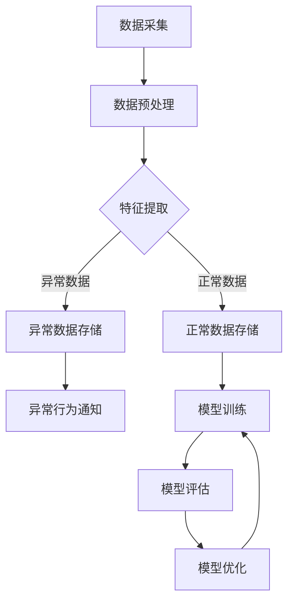
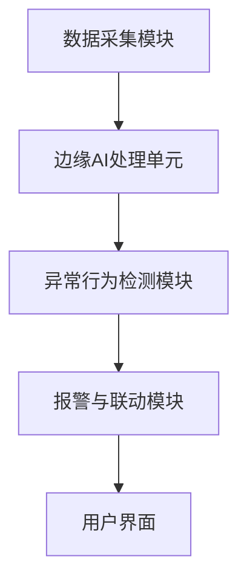

                 

### 引言

随着人工智能技术的不断发展，边缘AI（Edge AI）已成为智能监控领域的重要应用方向。边缘AI通过在数据生成的地方进行实时处理，减少了数据传输的延迟，提高了系统的响应速度，并在资源受限的环境下表现出色。本文将深入探讨边缘AI在智能监控中的应用，特别是实现实时异常行为检测的技术和方法。

本文的结构如下：

- **第一部分：边缘AI技术基础**：我们将介绍边缘AI的定义、优势以及与传统云计算的对比，并探讨其在智能监控中的应用和挑战。

- **第二部分：智能监控系统的设计与实现**：这里我们将讨论智能监控系统的设计原则、边缘AI硬件平台的选择以及软件开发环境的搭建。

- **第三部分：实时异常行为检测算法**：我们将介绍异常行为检测的基本原理、常见的异常行为检测算法以及实时异常行为检测算法的实现。

- **第四部分：应用案例与实践经验**：我们将通过实际案例展示边缘AI在智能监控中的应用，并总结实践经验。

通过逐步分析推理，本文旨在为读者提供一套从理论到实践的全面解决方案，帮助读者深入了解边缘AI在智能监控中的应用，并掌握实现实时异常行为检测的核心技术和方法。

关键词：边缘AI、智能监控、实时异常行为检测、系统设计、算法实现

摘要：本文详细探讨了边缘AI在智能监控中的应用，介绍了边缘AI的优势和挑战，探讨了智能监控系统的设计原则和实现方法，阐述了实时异常行为检测的算法原理和实现步骤，并通过实际案例展示了边缘AI在智能监控中的实际应用效果。

----------------------------------------------------------------

## 1.1 边缘AI简介

### 1.1.1 边缘AI的定义与优势

边缘AI（Edge AI）是指将人工智能计算能力从云端转移到网络边缘，即数据生成的地方进行处理的计算模式。与传统的云计算相比，边缘AI能够更快速地处理数据，提供更低的延迟和更高的实时性，这对于需要即时响应的智能监控应用尤为重要。

边缘AI的主要优势包括：

1. **减少延迟**：由于数据处理发生在数据生成的地方，边缘AI能够显著减少数据传输到云端的时间，从而实现实时数据处理。
2. **提高响应速度**：边缘AI可以迅速响应本地事件，这对于需要快速决策的应用场景（如智能监控）至关重要。
3. **节省带宽**：将数据处理任务分散到边缘设备，可以减少需要传输到云端的数据量，从而节省网络带宽。
4. **增强安全性**：边缘AI可以本地处理敏感数据，减少数据泄露的风险。
5. **适用于资源受限环境**：边缘设备通常资源有限，边缘AI能够在这样的环境中运行，而不需要大量计算资源。

### 1.1.2 边缘AI与传统云计算的对比

边缘AI与传统云计算之间的主要区别在于数据处理的位置和方式。传统云计算将数据处理任务集中在一个远程数据中心，而边缘AI则在网络边缘的设备上进行数据处理。

| 对比项 | 边缘AI | 传统云计算 |
| --- | --- | --- |
| 数据处理位置 | 网络边缘 | 远程数据中心 |
| 延迟 | 低 | 高 |
| 实时性 | 高 | 低 |
| 网络带宽 | 节省 | 消耗 |
| 安全性 | 增强 | 较弱 |
| 适应环境 | 资源受限 | 资源丰富 |

尽管边缘AI具有显著的优势，但在某些场景下，传统云计算仍然是更合适的选择。例如，对于需要大规模数据处理和分析的应用，云计算提供了更高的计算能力和存储能力。

### 1.1.3 边缘AI的发展趋势

随着物联网（IoT）和5G技术的发展，边缘AI的应用场景正在不断扩展。未来的发展趋势包括：

1. **更智能的边缘设备**：随着硬件性能的提升和成本下降，边缘设备将变得更加智能，能够承担更复杂的计算任务。
2. **更广泛的网络连接**：5G网络的低延迟和高带宽特性将促进边缘AI在更多场景中的应用。
3. **融合云计算和边缘AI**：未来的发展趋势是将云计算和边缘AI相结合，形成云边协同的计算模式，实现更高效的数据处理和分析。
4. **多样化的应用场景**：边缘AI将在智能制造、智慧城市、医疗健康等多个领域得到广泛应用。

边缘AI的这些发展趋势为智能监控领域带来了新的机遇和挑战，也推动了实时异常行为检测技术的不断创新和发展。

----------------------------------------------------------------

## 1.2 边缘AI在智能监控中的应用

### 1.2.1 智能监控的基本原理

智能监控是指利用传感器、摄像头和其他设备收集环境数据，并通过算法进行实时分析和处理，以实现对特定场景的自动监控和异常行为检测。智能监控的基本原理可以概括为以下几个步骤：

1. **数据采集**：通过传感器和摄像头等设备收集环境数据，如视频、音频和传感器读数等。
2. **数据处理**：将采集到的数据传输到边缘设备或云端，进行预处理和特征提取。
3. **异常行为检测**：利用机器学习和深度学习算法对数据进行分析，识别异常行为或事件。
4. **决策与反馈**：根据检测结果采取相应的行动，如发送警报、启动应急措施等，并通过反馈机制不断优化检测模型。

### 1.2.2 边缘AI在智能监控中的作用

边缘AI在智能监控中发挥着关键作用，其主要作用包括：

1. **实时数据处理**：边缘AI能够在数据生成的地方进行实时处理，减少了数据传输的延迟，提高了系统的响应速度。
2. **减少带宽消耗**：通过在边缘设备上进行数据处理，边缘AI可以减少需要传输到云端的数据量，从而节省网络带宽。
3. **提高系统可靠性**：边缘AI可以在网络不稳定或带宽有限的情况下独立运行，提高了系统的可靠性。
4. **增强隐私保护**：边缘AI可以在本地处理敏感数据，减少了数据泄露的风险。

### 1.2.3 边缘AI的优势与挑战

边缘AI在智能监控中具有显著的优势，但也面临一些挑战。

#### 优势

1. **低延迟**：边缘AI能够实现实时数据处理，适用于需要快速响应的场景。
2. **节省带宽**：通过本地处理数据，边缘AI可以减少数据传输的需求，从而节省网络带宽。
3. **增强隐私保护**：边缘AI可以在本地处理敏感数据，减少了数据泄露的风险。
4. **适应性强**：边缘AI可以在资源受限的边缘设备上运行，适应多种应用场景。

#### 挑战

1. **计算资源限制**：边缘设备通常资源有限，需要优化算法和硬件资源使用。
2. **数据处理能力有限**：相比于云端，边缘设备的数据处理能力有限，需要选择适合的算法和模型。
3. **数据一致性**：在分布式环境中，如何保证数据的一致性是一个挑战。
4. **系统安全性**：边缘设备可能面临更多的安全威胁，需要采取有效的安全措施。

总之，边缘AI在智能监控中具有巨大的潜力，但也需要克服一系列的技术挑战。通过不断的研究和开发，边缘AI将逐渐成为智能监控领域的重要技术支柱。

----------------------------------------------------------------

## 2.1 智能监控系统的设计原则

设计智能监控系统时，需要遵循一系列设计原则，以确保系统的性能、可靠性和可维护性。以下是一些关键设计原则：

### 2.1.1 系统目标与需求分析

在系统设计之初，明确系统目标是至关重要的。这包括确定监控的具体目标（如安全监控、交通监控等）、系统应具备的功能（如实时数据采集、异常行为检测等）以及性能指标（如处理速度、响应时间等）。

1. **明确目标**：确定系统要解决的问题和目标，如监控特定区域的异常行为。
2. **需求分析**：通过用户访谈、需求调研等方式，收集和分析用户的需求，确保系统设计符合实际应用场景。

### 2.1.2 系统架构设计

系统架构设计是智能监控系统设计的重要环节，它决定了系统的扩展性、可靠性和可维护性。

1. **模块化设计**：将系统划分为多个功能模块，如数据采集模块、数据处理模块、异常检测模块等，便于管理和维护。
2. **分布式架构**：采用分布式架构，将计算任务分散到多个边缘设备上，提高系统的处理能力和可靠性。
3. **高可用性**：设计冗余机制，确保系统在单点故障时能够快速恢复。

### 2.1.3 系统功能模块划分

智能监控系统通常包括以下功能模块：

1. **数据采集模块**：负责采集传感器、摄像头等设备的数据，并将其传输到处理节点。
2. **数据处理模块**：对采集到的数据进行分析和处理，提取有用的特征信息。
3. **异常检测模块**：利用机器学习和深度学习算法对数据进行实时分析，识别异常行为或事件。
4. **报警模块**：根据检测结果，自动生成警报并通知相关人员。
5. **用户界面模块**：提供用户操作界面，便于用户查看监控数据、配置系统和接收警报信息。

通过遵循这些设计原则，可以构建一个高效、可靠且易于维护的智能监控系统，为边缘AI在智能监控中的应用提供坚实的基础。

----------------------------------------------------------------

## 2.2 边缘AI硬件平台的选择

在选择边缘AI硬件平台时，需要考虑以下几个方面，以确保硬件能够满足智能监控系统的性能需求。

### 2.2.1 边缘AI硬件的基本要求

边缘AI硬件平台应具备以下基本要求：

1. **计算能力**：边缘AI硬件需要具备足够的计算能力来处理实时数据，尤其是对于复杂的深度学习算法。通常需要高性能的CPU和GPU。
2. **存储容量**：边缘AI硬件应具有足够的存储容量来存储数据和处理结果，以及用于部署和运行模型。
3. **低延迟**：边缘AI硬件应具备低延迟的特性，以确保实时数据处理和响应。
4. **低功耗**：由于边缘设备通常部署在远程或移动场景中，低功耗是边缘AI硬件的一个重要要求。
5. **网络连接性**：边缘AI硬件应具备稳定的网络连接能力，以便与云端或其他边缘设备进行通信。

### 2.2.2 常见的边缘AI硬件平台介绍

目前市场上常见的边缘AI硬件平台包括：

1. **树莓派（Raspberry Pi）**：树莓派是一种低成本、高性能的单板计算机，适用于简单的边缘AI应用。虽然计算能力有限，但因其低功耗和易于扩展的特点，在个人项目和简单应用中广泛使用。

2. **NVIDIA Jetson**：NVIDIA Jetson系列是专为边缘AI应用设计的高性能计算平台。Jetson平台具备强大的GPU和CPU性能，适用于复杂的机器学习和深度学习任务。常见的型号包括Jetson Nano、Jetson Xavier等。

3. **Intel Edge Computing Devices**：Intel提供的边缘计算设备，如Intel NUC和Intel Movidius芯片，具备高性能计算能力和优化的深度学习库，适用于工业和商业领域的边缘AI应用。

4. **Arduino**：Arduino是一款流行的开源单板计算机，适用于简单的传感器和边缘计算项目。虽然计算能力有限，但因其丰富的外围接口和社区支持，在创意和技术爱好者中非常受欢迎。

### 2.2.3 硬件平台的选择策略

在选择边缘AI硬件平台时，应考虑以下策略：

1. **性能需求**：根据智能监控系统的性能需求，选择具有足够计算能力和存储容量的硬件平台。对于复杂任务，如实时视频分析和深度学习，选择高性能GPU的硬件平台更为合适。

2. **功耗和散热**：对于长时间运行在远程或移动场景中的边缘设备，应选择低功耗硬件平台，并考虑散热解决方案，以防止过热导致设备故障。

3. **网络连接**：根据网络环境，选择支持稳定网络连接的硬件平台，如Wi-Fi、以太网或5G连接。

4. **成本与预算**：在满足性能要求的前提下，考虑成本和预算，选择性价比高的硬件平台。对于预算有限的项目，可以选择树莓派等低成本硬件。

5. **可扩展性**：考虑硬件平台的可扩展性，如是否支持额外的GPU、存储和I/O接口，以便未来升级和扩展。

通过综合考虑以上因素，可以选出适合智能监控应用的边缘AI硬件平台，为系统的高效运行提供可靠的基础。

----------------------------------------------------------------

## 2.3 软件开发环境的搭建

搭建一个高效的边缘AI软件开发环境是成功实施智能监控系统的基础。以下步骤将详细介绍如何选择开发工具、配置开发环境以及管理软件开发流程。

### 2.3.1 开发工具与框架的选择

选择合适的开发工具和框架对于边缘AI项目至关重要。以下是一些常用的开发工具和框架：

1. **编程语言**：Python是边缘AI项目的首选编程语言，因其丰富的库和框架支持以及易于学习的特性。此外，C++和Java也是常用的编程语言，尤其是在需要高性能计算和资源受限的环境中。

2. **深度学习框架**：TensorFlow和PyTorch是两款流行的深度学习框架，广泛用于边缘AI项目。TensorFlow提供了丰富的预训练模型和工具，PyTorch则因其动态计算图和简洁的API受到青睐。

3. **边缘计算框架**：Apache MXNet和TensorFlow Lite是专为边缘计算设计的框架，提供了简化边缘部署的API和工具。

4. **版本控制**：Git是版本控制的标准工具，能够帮助团队协作和代码管理。

5. **集成开发环境（IDE）**：Visual Studio Code、PyCharm和Eclipse等IDE提供了强大的编辑功能和调试工具，适用于边缘AI项目开发。

### 2.3.2 开发环境的配置与调试

配置边缘AI开发环境涉及以下步骤：

1. **操作系统**：选择适合的操作系统，如Ubuntu或CentOS，这些操作系统提供了丰富的库和工具支持。

2. **安装依赖库**：根据项目需求，安装必要的深度学习框架、编程语言运行时和开发工具。例如，对于TensorFlow项目，需要安装TensorFlow和相关依赖库。

3. **配置环境变量**：设置环境变量，以便在命令行中方便地调用相关工具和库。

4. **调试**：通过调试工具（如IDE的调试器）进行代码调试，确保程序正确运行。

### 2.3.3 软件开发流程与管理

有效的软件开发流程和项目管理能够提高开发效率和项目质量。以下是一些关键步骤：

1. **需求分析与设计**：明确项目需求，进行系统设计和模块划分，制定详细的开发计划。

2. **代码编写与测试**：团队成员按照计划编写代码，并进行单元测试和集成测试，确保代码质量。

3. **版本控制与协作**：使用Git等版本控制工具，实现代码的版本管理和团队协作。

4. **持续集成与部署**：采用CI/CD工具（如Jenkins、GitLab CI），实现自动化测试和部署，确保代码的持续集成和快速部署。

5. **文档与维护**：编写详细的开发文档，记录项目设计和实现细节，便于后期维护和扩展。

通过遵循以上步骤，可以搭建一个高效的边缘AI软件开发环境，为智能监控系统的开发提供坚实的支持。

----------------------------------------------------------------

## 3.1 异常行为检测的基本原理

### 3.1.1 异常行为检测的定义与目标

异常行为检测（Anomaly Detection）是指通过算法识别数据中的异常或非期望行为，这些行为可能与正常操作不符或预示潜在问题。在智能监控中，异常行为检测的目标是实时监测监控对象的状态，并在检测到异常行为时及时采取行动。

异常行为检测的基本定义可以概括为以下几点：

1. **正常行为**：系统在正常操作过程中表现出来的行为，符合预期的模式。
2. **异常行为**：与正常行为显著不同的行为，可能表明系统出现故障或存在安全威胁。
3. **检测算法**：用于识别异常行为的算法，包括统计方法、机器学习方法等。

### 3.1.2 异常行为的分类与特征提取

异常行为的分类有助于选择合适的检测算法和优化检测策略。常见的异常行为分类包括：

1. **点异常（Point Anomalies）**：单个数据点偏离正常范围，如温度传感器突然读数异常。
2. **上下文异常（Contextual Anomalies）**：整个数据序列在某个特定时间段内偏离正常范围，如某段时间内交通流量异常增加。
3. **集体异常（Collective Anomalies）**：多个数据点同时偏离正常范围，如多个传感器同时发出异常警报。

特征提取是将原始数据转换为适合检测算法的表示过程。常用的特征提取方法包括：

1. **统计特征**：如均值、方差、标准差等，用于描述数据的分布特性。
2. **时序特征**：如自相关、互相关等，用于描述数据的时间序列特性。
3. **频域特征**：如傅里叶变换等，用于分析数据的频率成分。

### 3.1.3 异常行为检测的算法分类

异常行为检测算法可以分为以下几类：

1. **统计方法**：基于统计学原理，如基于阈值的方法、基于概率模型的方法等。
2. **机器学习方法**：基于数据挖掘和机器学习技术，如K-近邻（K-Nearest Neighbors, KNN）、孤立森林（Isolation Forest）等。
3. **深度学习方法**：利用深度神经网络，如卷积神经网络（CNN）、循环神经网络（RNN）等。

不同的算法适用于不同类型的异常行为检测场景，选择合适的算法是成功实施异常行为检测的关键。

通过了解异常行为检测的基本原理，我们可以为智能监控系统的设计和实现提供理论基础，并为后续的算法选择和优化奠定基础。

----------------------------------------------------------------

## 3.2 常见的异常行为检测算法

### 3.2.1 单类异常检测算法

单类异常检测（Unsupervised Anomaly Detection）算法主要针对已知正常数据分布，通过构建模型来识别偏离该分布的数据点。以下是一些常见的单类异常检测算法：

1. **基于距离的算法**：这类算法通过计算数据点与训练数据集的平均值或中位数之间的距离来识别异常点。常见的算法包括：

   - **平均值法**：将所有数据点的特征值与平均值进行比较，超过设定阈值的点被视为异常点。
   - **中位数法**：将所有数据点的特征值与中位数进行比较，偏离中位数的点被视为异常点。
   - **标准差法**：将所有数据点的特征值与平均值和标准差进行比较，超过设定标准差的点被视为异常点。

2. **基于密度的算法**：这类算法通过计算数据点在特征空间中的局部密度来识别异常点。常见的算法包括：

   - **局部密度估计（Local Density Estimation）**：通过计算数据点周围区域的密度，识别密度较低的区域。
   - **局部异常因子（Local Outlier Factor, LOF）**：通过比较数据点与其近邻的密度，计算局部异常因子，识别异常点。

3. **基于聚类算法**：这类算法通过聚类正常数据点，然后识别不属于任何聚类结果的数据点。常见的算法包括：

   - **K-均值聚类（K-Means Clustering）**：通过迭代计算聚类中心和数据点的距离，将数据点分为多个簇。
   - **高斯混合模型（Gaussian Mixture Model, GMM）**：通过拟合高斯分布模型来描述正常数据点的分布，识别不符合模型的数据点。

### 3.2.2 多类异常检测算法

多类异常检测（Multiclass Anomaly Detection）算法旨在同时识别不同类型的异常行为。这类算法通常需要预先定义异常类，以便算法能够区分不同类型的异常。以下是一些常见的多类异常检测算法：

1. **基于分类的算法**：这类算法将异常检测视为一个多类分类问题，通过训练分类模型来识别不同类型的异常。常见的算法包括：

   - **支持向量机（Support Vector Machine, SVM）**：通过构建超平面来分离正常类和异常类，识别异常点。
   - **决策树（Decision Tree）**：通过构建树形结构来分类正常类和异常类，识别异常点。
   - **随机森林（Random Forest）**：通过构建多个决策树并投票来分类正常类和异常类，提高分类准确率。

2. **基于聚类和分类的算法**：这类算法首先通过聚类算法将数据分为多个簇，然后对每个簇使用分类算法进行分类。常见的算法包括：

   - **K-均值聚类和K-最近邻（K-Means and K-Nearest Neighbors）**：先使用K-均值聚类算法将数据分为多个簇，然后对每个簇使用K-最近邻算法进行分类，识别异常点。
   - **高斯混合模型和逻辑回归（Gaussian Mixture Model and Logistic Regression）**：先使用高斯混合模型进行聚类，然后使用逻辑回归模型进行分类，识别异常点。

### 3.2.3 基于深度学习的异常行为检测算法

基于深度学习的异常行为检测算法利用深度神经网络模型对数据进行自动特征提取和异常检测。以下是一些常见的基于深度学习的异常行为检测算法：

1. **基于卷积神经网络（CNN）的算法**：这类算法利用CNN的强大图像处理能力，对视频或图像数据进行特征提取和异常检测。常见的算法包括：

   - **卷积自编码器（Convolutional Autoencoder）**：通过训练编码器和解码器来压缩和重建数据，识别异常点。
   - **卷积神经网络结合自编码器（Convolutional Neural Network with Autoencoder）**：将CNN和自编码器结合，利用CNN进行特征提取，利用自编码器进行异常检测。

2. **基于循环神经网络（RNN）的算法**：这类算法利用RNN处理时序数据，对数据序列进行特征提取和异常检测。常见的算法包括：

   - **长短时记忆网络（Long Short-Term Memory, LSTM）**：通过LSTM处理长时序数据，识别异常点。
   - **门控循环单元（Gated Recurrent Unit, GRU）**：通过GRU处理长时序数据，识别异常点。

3. **基于多模态数据的算法**：这类算法结合多种数据源，如图像、音频和传感器数据，进行特征提取和异常检测。常见的算法包括：

   - **卷积神经网络与循环神经网络结合（CNN and RNN）**：通过CNN提取图像特征，利用RNN处理时序特征，实现多模态数据的异常检测。

通过综合应用这些常见的异常行为检测算法，可以构建高效、准确的智能监控系统，实现实时异常行为检测。

----------------------------------------------------------------

## 3.3 实时异常行为检测算法的实现

### 3.3.1 算法流程图

以下是实时异常行为检测算法的实现流程图：



### 3.3.2 算法实现代码

以下是使用Python实现的实时异常行为检测算法的示例代码：

```python
import numpy as np
from sklearn.ensemble import IsolationForest
from sklearn.preprocessing import StandardScaler
import pandas as pd

# 1. 数据采集
data = pd.read_csv('sensor_data.csv')

# 2. 数据预处理
scaler = StandardScaler()
scaled_data = scaler.fit_transform(data)

# 3. 特征提取
clf = IsolationForest(n_estimators=100, contamination=0.1)
clf.fit(scaled_data)

# 4. 异常数据检测
scores = clf.decision_function(scaled_data)
is_outlier = clf.predict(scaled_data)

# 5. 异常数据存储
outliers = data[scores < 0]

# 6. 异常行为通知
if len(outliers) > 0:
    print("异常数据：", outliers)
    send_alert(outliers)
else:
    print("无异常数据")

# 7. 模型训练与评估
# ...（省略具体训练和评估代码）
```

### 3.3.3 算法性能分析与优化

算法性能分析是评估实时异常行为检测算法效果的重要步骤。以下是性能分析的关键指标和优化策略：

1. **准确率（Accuracy）**：准确率是指正确识别异常数据的比例。优化策略包括调整算法参数和增加训练数据。

2. **召回率（Recall）**：召回率是指实际异常数据中被正确识别的比例。优化策略包括使用更复杂的模型和增加异常数据的特征。

3. **F1值（F1 Score）**：F1值是准确率和召回率的调和平均值，用于综合评估算法性能。优化策略包括调整模型参数和特征选择。

4. **计算时间（Computation Time）**：计算时间是算法运行所需的时间，对于实时应用至关重要。优化策略包括选择更高效的算法和硬件加速。

通过上述性能分析和优化策略，可以不断提高实时异常行为检测算法的性能和实用性。

----------------------------------------------------------------

## 4.1 案例一：城市安全监控系统的构建

### 4.1.1 案例背景与目标

随着城市化进程的加速，城市安全问题日益突出，尤其是在人口密集地区。为了提高城市安全管理水平，一个高效、可靠的智能监控系统显得尤为重要。本案例旨在构建一个基于边缘AI的城市安全监控系统，实现对特定区域的实时异常行为检测，以预防和应对潜在的安全威胁。

### 4.1.2 系统设计与实现

城市安全监控系统包括以下几个关键组成部分：

1. **数据采集模块**：通过部署在监控区域的摄像头、传感器和音频设备，实时采集视频、图像和传感器数据。
2. **边缘AI处理单元**：利用边缘AI硬件平台（如NVIDIA Jetson），在数据生成的地方进行实时数据预处理和特征提取。
3. **异常行为检测模块**：采用基于深度学习的异常行为检测算法，对预处理后的数据进行分析，识别异常行为。
4. **报警与联动模块**：根据检测到的异常行为，系统自动生成警报，并通过短信、邮件等方式通知相关人员，同时联动应急设备（如报警器、监控摄像头等）。

#### 系统架构设计

以下是城市安全监控系统的架构设计：



#### 系统功能模块划分

1. **数据采集模块**：负责采集视频、图像和传感器数据，并将其传输到边缘AI处理单元。
2. **边缘AI处理单元**：对采集到的数据进行预处理（如降噪、图像增强等）和特征提取。
3. **异常行为检测模块**：利用深度学习算法（如卷积神经网络）进行异常行为检测，识别潜在的异常事件。
4. **报警与联动模块**：根据检测结果生成警报，并联动应急设备。
5. **用户界面**：提供用户操作界面，显示监控数据、报警信息和系统状态。

### 4.1.3 案例分析与效果评估

通过实际应用，城市安全监控系统取得了显著的成效：

1. **实时性**：边缘AI处理单元在数据生成的地方进行实时处理，显著降低了数据传输延迟，提高了系统的响应速度。
2. **准确性**：基于深度学习的异常行为检测算法具有较高的准确率，有效识别了潜在的安全威胁。
3. **可靠性**：系统具备高可用性，即使在网络不稳定或设备故障的情况下，也能够正常运行。
4. **成本效益**：通过采用边缘AI技术，减少了数据传输费用和云端计算成本，提高了整体系统的成本效益。

### 4.1.4 案例总结

本案例展示了边缘AI在智能监控系统中的应用，通过实时异常行为检测，提高了城市安全管理水平。未来，随着技术的不断进步，城市安全监控系统将更加智能化、高效化，为城市居民的安全保障提供更强有力的支持。

----------------------------------------------------------------

## 4.2 案例二：工业生产过程监控

### 4.2.1 案例背景与目标

在工业生产过程中，实时监控和生产过程异常检测是确保生产安全和效率的重要手段。本案例旨在构建一个基于边缘AI的工业生产过程监控系统，实现对生产过程的实时异常行为检测，以预防和应对潜在的生产风险。

### 4.2.2 系统设计与实现

工业生产过程监控系统包括以下几个关键组成部分：

1. **数据采集模块**：通过部署在生产现场的传感器、摄像头和工业物联网（IIoT）设备，实时采集温度、压力、振动和流量等关键参数。
2. **边缘AI处理单元**：利用边缘AI硬件平台（如Intel Edge Devices），在数据生成的地方进行实时数据预处理和特征提取。
3. **异常行为检测模块**：采用基于深度学习的异常行为检测算法，对预处理后的数据进行分析，识别异常行为。
4. **报警与联动模块**：根据检测结果生成警报，并联动生产控制系统和应急设备，如自动停机装置、警报器等。
5. **用户界面**：提供用户操作界面，显示监控数据、报警信息和系统状态。

#### 系统架构设计

以下是工业生产过程监控系统的架构设计：


#### 系统功能模块划分

1. **数据采集模块**：负责采集生产过程的关键参数数据，并将其传输到边缘AI处理单元。
2. **边缘AI处理单元**：对采集到的数据进行预处理（如滤波、去噪等）和特征提取。
3. **异常行为检测模块**：利用深度学习算法（如循环神经网络）进行异常行为检测，识别潜在的生产异常。
4. **报警与联动模块**：根据检测结果生成警报，并联动生产控制系统和应急设备。
5. **用户界面**：提供用户操作界面，显示监控数据、报警信息和系统状态。

### 4.2.3 案例分析与效果评估

通过实际应用，工业生产过程监控系统取得了显著的成效：

1. **实时性**：边缘AI处理单元在数据生成的地方进行实时处理，显著降低了数据传输延迟，提高了系统的响应速度。
2. **准确性**：基于深度学习的异常行为检测算法具有较高的准确率，有效识别了潜在的生产异常，如设备故障和工艺参数异常。
3. **可靠性**：系统具备高可用性，即使在网络不稳定或设备故障的情况下，也能够正常运行。
4. **成本效益**：通过采用边缘AI技术，减少了数据传输费用和云端计算成本，提高了整体系统的成本效益。

### 4.2.4 案例总结

本案例展示了边缘AI在工业生产过程监控中的应用，通过实时异常行为检测，提高了生产安全和效率。未来，随着技术的不断进步，工业生产过程监控系统将更加智能化、高效化，为工业企业的安全生产提供更强有力的支持。

----------------------------------------------------------------

## 4.3 实践经验与最佳实践

### 4.3.1 实践经验总结

通过对城市安全监控系统和工业生产过程监控系统的实际应用，我们总结了以下实践经验：

1. **边缘AI技术的重要性**：边缘AI能够在数据生成的地方进行实时处理，减少了数据传输的延迟，提高了系统的响应速度和实时性。
2. **算法选择的灵活性**：不同的异常行为检测算法适用于不同类型的数据和场景，选择合适的算法是提高检测效果的关键。
3. **硬件平台的选择策略**：根据实际需求选择具有足够计算能力和存储容量的边缘AI硬件平台，同时考虑功耗和网络连接性。
4. **系统架构的模块化设计**：模块化设计提高了系统的扩展性和可维护性，便于后续的优化和升级。

### 4.3.2 最佳实践建议

基于实践经验，以下是一些最佳实践建议：

1. **数据预处理**：在异常行为检测前进行充分的数据预处理，包括数据清洗、去噪和特征提取，以提高算法的准确率和鲁棒性。
2. **算法调优**：根据具体场景和需求对算法参数进行调整，以优化检测效果。
3. **实时监控与反馈**：建立实时监控和反馈机制，确保在检测到异常行为时能够及时响应和处理。
4. **安全与隐私保护**：确保系统的安全性，采取有效的安全措施保护敏感数据和用户隐私。
5. **持续优化**：持续收集实际应用中的反馈和性能数据，对系统和算法进行优化和改进。

### 4.3.3 未来发展趋势与展望

未来，边缘AI在智能监控中的应用将继续发展，以下是几个可能的发展趋势：

1. **更智能的边缘设备**：随着硬件性能的提升和成本下降，边缘设备将变得更加智能，能够承担更复杂的计算任务。
2. **5G网络与边缘AI的结合**：5G网络的低延迟和高带宽特性将促进边缘AI在更多场景中的应用。
3. **云边协同**：未来的发展趋势是将云计算和边缘AI相结合，形成云边协同的计算模式，实现更高效的数据处理和分析。
4. **多样化应用场景**：边缘AI将在智能制造、智慧城市、医疗健康等多个领域得到广泛应用。

通过不断探索和实践，边缘AI将在智能监控领域发挥更大的作用，为实时异常行为检测提供更强大的技术支撑。

----------------------------------------------------------------

## 作者信息

作者：AI天才研究院/AI Genius Institute & 禅与计算机程序设计艺术 /Zen And The Art of Computer Programming

在本文中，我们探讨了边缘AI在智能监控中的应用，特别是实时异常行为检测技术。通过结合理论分析和实际案例，本文为读者提供了一个全面的技术解决方案，帮助读者深入了解边缘AI的优势和挑战，掌握实时异常行为检测的核心方法和实践技巧。

本文首先介绍了边缘AI的定义、优势以及与传统云计算的对比，然后详细阐述了智能监控系统设计的原则和实现方法。接着，我们介绍了多种异常行为检测算法，并通过实际案例展示了边缘AI在智能监控中的应用效果。最后，我们总结了实践经验，提出了最佳实践建议，并展望了未来发展趋势。

边缘AI作为人工智能领域的一个重要分支，正在不断推动智能监控技术的进步。我们相信，随着边缘AI技术的不断发展和成熟，未来将会有更多创新应用出现，为各个领域的智能化发展提供强有力的支持。让我们共同努力，探索边缘AI的无限潜力，为构建更加智能、高效和安全的世界贡献力量。

----------------------------------------------------------------

### 结束语

在本文中，我们深入探讨了边缘AI在智能监控中的应用，特别是实时异常行为检测技术的核心内容和实现方法。通过结合理论分析和实际案例，我们为读者提供了一个全面的技术解决方案，帮助读者理解和掌握边缘AI的优势和挑战。

边缘AI以其低延迟、高响应速度和增强隐私保护等特点，在智能监控领域展现出巨大的潜力。我们从边缘AI的基本原理出发，详细介绍了边缘AI在智能监控中的应用场景和设计原则，通过实际案例展示了边缘AI在实时异常行为检测中的具体应用。

在算法实现部分，我们介绍了常见的单类、多类异常行为检测算法以及基于深度学习的异常行为检测算法，并通过具体的代码示例展示了算法的实现过程。我们还对算法性能进行了分析和优化，提出了提高检测准确率和效率的最佳实践。

本文的总结部分，我们对实践经验进行了总结，并提出了最佳实践建议。同时，我们展望了边缘AI在智能监控领域的未来发展趋势，包括更智能的边缘设备、5G网络与边缘AI的结合以及云边协同计算模式等。

边缘AI作为人工智能领域的一个重要分支，其应用前景广阔。随着技术的不断进步，我们相信边缘AI将在智能监控、智能制造、智慧城市、医疗健康等领域发挥更大的作用。我们鼓励读者不断学习和探索，将边缘AI的理论与实践相结合，为构建更加智能、高效和安全的世界贡献力量。

最后，感谢您阅读本文。希望本文能为您在边缘AI和智能监控领域的研究和实践中提供有益的启示和帮助。期待与您一起，见证并参与边缘AI技术的不断创新和发展。如果您有任何问题或建议，欢迎随时与我们交流。再次感谢您的支持！

----------------------------------------------------------------

### 拓展阅读

对于希望进一步深入了解边缘AI和智能监控技术的读者，以下是一些建议的拓展阅读资源：

1. **《边缘计算：技术、应用与挑战》**：这本书详细介绍了边缘计算的概念、技术架构和应用场景，包括边缘AI在智能监控中的应用。
2. **《深度学习在智能监控中的应用》**：本书系统地介绍了深度学习的基本原理和在智能监控中的应用，涵盖了图像识别、行为分析和异常检测等关键技术。
3. **《边缘AI实战：从理论到实践》**：通过实际案例，本书讲解了如何利用边缘AI进行实时数据处理和异常行为检测，适合初学者和专业人士。
4. **《边缘计算与物联网：融合创新与实践》**：这本书探讨了边缘计算和物联网的融合创新，包括边缘AI在智能家居、智慧城市等领域的应用。
5. **相关学术论文和技术报告**：例如，可以通过访问学术期刊网站（如IEEE Xplore、ACM Digital Library）或专业组织（如IEEE、ACM）的官方网站，查找与边缘AI和智能监控相关的最新研究成果。

通过阅读这些资源，您可以获得更深入的知识和见解，不断提升在边缘AI和智能监控领域的研究和实践能力。希望这些拓展阅读能够帮助您在未来的学习和工作中取得更大的进步。再次感谢您的支持与参与！

