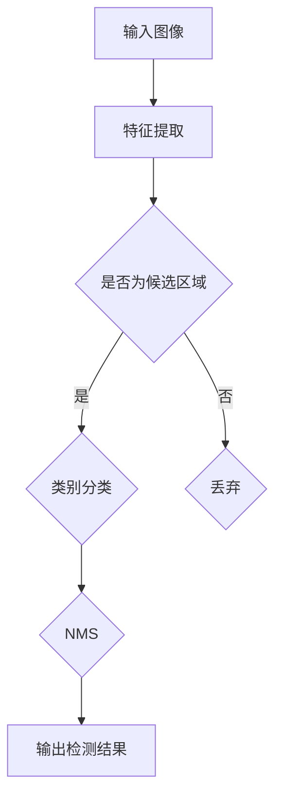
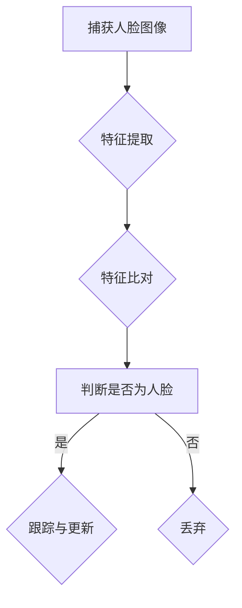
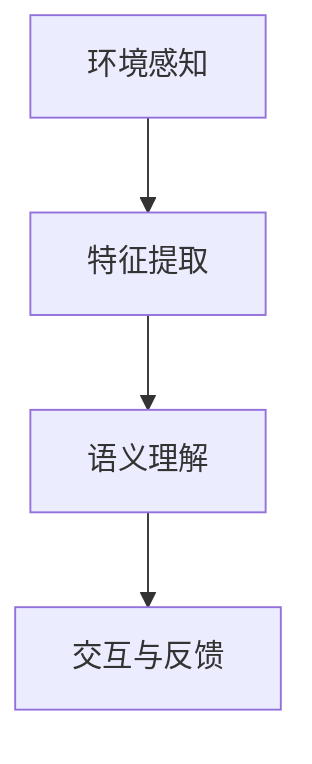
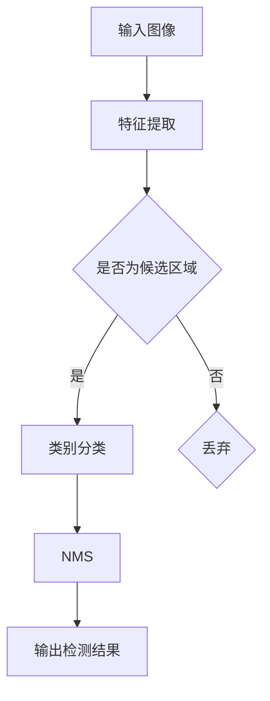

                 


# 第二部分：智能眼镜的组成与工作原理

### 第2章：智能眼镜的组成与工作原理

#### 2.1 智能眼镜的硬件组成

##### 2.1.1 显示屏幕

智能眼镜的显示屏幕是其核心组件之一，它决定了用户的视觉体验。目前，常见的显示技术包括液晶显示屏（LCD）和有机发光二极管显示屏（OLED）。LCD具有高对比度和良好的色彩表现，而OLED则具有自发光、高亮度、高对比度和快速响应时间等特点。

##### 2.1.2 眼动追踪

眼动追踪技术用于监测和记录用户的视线位置和眼球运动，以便智能眼镜能够动态调整显示内容。这种技术对于提升交互体验至关重要，如实现视线激活菜单或自适应内容显示。

##### 2.1.3 摄像头与传感器

智能眼镜通常配备多个摄像头和传感器，用于捕捉环境和用户数据。这些设备包括红外摄像头、环境光传感器、加速度传感器、陀螺仪等，它们共同为智能眼镜提供了丰富的感知能力。

#### 2.2 智能眼镜的软件架构

##### 2.2.1 操作系统

智能眼镜通常运行专用的操作系统，如谷歌的Android Wear、苹果的watchOS或微软的Windows 10 IoT Core。这些操作系统为智能眼镜提供了必要的功能支持和软件环境。

##### 2.2.2 应用软件

智能眼镜的应用软件涵盖了各种功能，如实时导航、视频通话、健身追踪等。这些应用通过调用操作系统提供的API，与硬件组件进行交互，实现特定的功能。

##### 2.2.3 硬件驱动程序

硬件驱动程序是连接操作系统与应用软件的关键组件，它负责管理硬件资源的分配和操作。智能眼镜的硬件驱动程序通常由制造商提供，并集成在操作系统中。

#### 2.3 智能眼镜的工作原理

##### 2.3.1 数据采集

智能眼镜通过摄像头、传感器和其他硬件组件采集环境数据和用户行为数据。

##### 2.3.2 数据处理

采集到的数据被传输到智能眼镜的处理器，进行处理和分析。边缘AI算法在此阶段发挥作用，对数据进行分析和分类。

##### 2.3.3 显示与交互

处理后的数据被显示在智能眼镜的屏幕上，同时用户可以通过眼动追踪、手势或其他交互方式与智能眼镜进行交互。

### 第3章：边缘AI在智能眼镜中的实时环境信息增强显示

#### 3.1 实时环境信息增强显示的概念

##### 3.1.1 定义与目标

实时环境信息增强显示旨在通过智能眼镜实时捕捉和解析用户所处环境的信息，并将这些信息以视觉或听觉的方式增强显示，从而提升用户的感知和交互体验。

##### 3.1.2 技术挑战

实时环境信息增强显示面临以下几个技术挑战：

1. **数据处理的实时性**：需要在极短的时间内对大量环境数据进行处理和分析，以实现实时显示。
2. **功耗和性能**：智能眼镜的硬件资源有限，需要在有限的计算资源下实现高效的环境信息增强显示。
3. **准确性**：保证环境信息增强显示的准确性，避免错误信息的显示。
4. **用户体验**：确保用户在使用智能眼镜时的舒适度和易用性。

##### 3.1.3 边缘AI算法在实时环境信息增强显示中的应用

边缘AI算法在实时环境信息增强显示中的应用主要体现在以下几个方面：

1. **目标检测**：用于识别和定位环境中的人、物、场景等目标。
2. **人脸识别**：用于识别和跟踪用户或他人的面部特征。
3. **环境理解与交互**：通过深度学习和自然语言处理技术，实现与环境的高级交互和理解。

#### 3.2 边缘AI算法在实时环境信息增强显示中的应用

##### 3.2.1 目标检测

目标检测是实时环境信息增强显示中的核心算法之一。它通过识别和定位图像中的物体，为后续的环境信息增强提供基础。

###### 3.2.1.1 算法原理

目标检测算法通常采用卷积神经网络（CNN）作为基础模型。以下是一个简单的目标检测算法原理：

1. **特征提取**：使用CNN从输入图像中提取特征。
2. **候选区域生成**：基于提取的特征，生成可能的候选区域。
3. **类别分类**：对候选区域进行类别分类，确定其是否为目标。
4. **非极大值抑制（NMS）**：对分类结果进行优化，去除重叠的检测框，提高检测的准确性。

###### 3.2.1.2 Mermaid 流程图



###### 3.2.1.3 Python 源代码示例

```python
import cv2
import numpy as np

def detect_objects(image, model, threshold=0.5):
    # 加载预训练模型
    net = cv2.dnn.readNet(model)
    
    # 从输入图像中提取高度
    height, width, _ = image.shape
    
    # 将图像缩放到模型期望的大小
    scale = 0.00390625
    image = cv2.resize(image, (224, 224))
    image = image.astype(np.float32)
    image = image * scale
    
    # 前向传播
    blob = cv2.dnn.blobFromImage(image, 1.0, (224, 224), [104, 117, 123], True, False)
    net.setInput(blob)
    detections = net.forward()

    # 非极大值抑制
    boxes = []
    confidences = []
    class_ids = []

    for i in range(detections.shape[2]):
        confidence = detections[0, 0, i, 2]
        if confidence > threshold:
            box = detections[0, 0, i, 3:7] * np.array([width, height, width, height])
            (x, y, w, h) = box.astype("int")
            boxes.append([x, y, x + w, y + h])
            confidences.append(float(confidence))
            class_ids.append(detections[0, 0, i, 1])

    boxes = np.array(boxes)
    confidences = np.array(confidences)
    class_ids = np.array(class_ids)

    idxs = cv2.dnn.NMSBoxes(boxes, confidences, threshold, 0.4)

    for i in idxs.flatten():
        (x, y, w, h) = boxes[i]
        cv2.rectangle(image, (x, y), (x + w, y + h), (0, 255, 0), 2)

    return image

# 加载图像
image = cv2.imread("image.jpg")

# 加载预训练模型
model = "path/to/weights.h5"

# 执行目标检测
result = detect_objects(image, model)

# 显示结果
cv2.imshow("Result", result)
cv2.waitKey(0)
```

#### 3.2.2 人脸识别

人脸识别是实时环境信息增强显示中的重要应用之一。它通过识别和跟踪用户或他人的面部特征，实现个性化的交互和信息增强。

###### 3.2.2.1 算法原理

人脸识别算法通常包括以下几个步骤：

1. **特征提取**：使用深度学习模型（如ResNet、VGG等）提取人脸特征。
2. **特征比对**：将提取的人脸特征与数据库中的人脸特征进行比对，确定是否为已知的人脸。
3. **跟踪与更新**：使用光流或卡尔曼滤波等技术，实时跟踪和更新人脸位置。

###### 3.2.2.2 Mermaid 流程图



###### 3.2.2.3 Python 源代码示例

```python
import cv2
import numpy as np

def detect_faces(image, model, threshold=0.5):
    # 加载预训练模型
    net = cv2.dnn.readNet(model)
    
    # 从输入图像中提取高度
    height, width, _ = image.shape
    
    # 将图像缩放到模型期望的大小
    scale = 0.00390625
    image = cv2.resize(image, (224, 224))
    image = image.astype(np.float32)
    image = image * scale
    
    # 前向传播
    blob = cv2.dnn.blobFromImage(image, 1.0, (224, 224), [104, 117, 123], True, False)
    net.setInput(blob)
    detections = net.forward()

    # 非极大值抑制
    boxes = []
    confidences = []
    class_ids = []

    for i in range(detections.shape[2]):
        confidence = detections[0, 0, i, 2]
        if confidence > threshold:
            box = detections[0, 0, i, 3:7] * np.array([width, height, width, height])
            (x, y, w, h) = box.astype("int")
            boxes.append([x, y, x + w, y + h])
            confidences.append(float(confidence))
            class_ids.append(detections[0, 0, i, 1])

    boxes = np.array(boxes)
    confidences = np.array(confidences)
    class_ids = np.array(class_ids)

    idxs = cv2.dnn.NMSBoxes(boxes, confidences, threshold, 0.4)

    for i in idxs.flatten():
        (x, y, w, h) = boxes[i]
        cv2.rectangle(image, (x, y), (x + w, y + h), (0, 255, 0), 2)

    return image

# 加载图像
image = cv2.imread("image.jpg")

# 加载预训练模型
model = "path/to/weights.h5"

# 执行人脸检测
result = detect_faces(image, model)

# 显示结果
cv2.imshow("Result", result)
cv2.waitKey(0)
```

#### 3.2.3 环境理解与交互

环境理解与交互是实时环境信息增强显示的高级应用，它通过深度学习和自然语言处理技术，实现与环境的高级交互和理解。

###### 3.2.3.1 算法原理

环境理解与交互算法主要包括以下几个步骤：

1. **环境感知**：使用传感器和摄像头等设备，实时感知和采集环境信息。
2. **特征提取**：使用深度学习模型提取环境特征。
3. **语义理解**：使用自然语言处理技术，对提取的特征进行语义理解。
4. **交互与反馈**：根据语义理解的结果，与用户进行交互，提供反馈和建议。

###### 3.2.3.2 Mermaid 流程图



###### 3.2.3.3 Python 源代码示例

```python
# 环境感知代码示例
import cv2

def capture_environment():
    # 初始化摄像头
    cap = cv2.VideoCapture(0)

    while True:
        # 读取一帧图像
        ret, frame = cap.read()

        if not ret:
            print("无法读取摄像头")
            break

        # 显示图像
        cv2.imshow("Environment", frame)

        # 按下 'q' 键退出循环
        if cv2.waitKey(1) & 0xFF == ord('q'):
            break

    # 释放摄像头资源
    cap.release()
    cv2.destroyAllWindows()

# 执行环境感知
capture_environment()
```

```python
# 特征提取代码示例
import cv2
import numpy as np

def extract_features(image, model):
    # 加载预训练模型
    net = cv2.dnn.readNet(model)
    
    # 从输入图像中提取高度
    height, width, _ = image.shape
    
    # 将图像缩放到模型期望的大小
    scale = 0.00390625
    image = cv2.resize(image, (224, 224))
    image = image.astype(np.float32)
    image = image * scale
    
    # 前向传播
    blob = cv2.dnn.blobFromImage(image, 1.0, (224, 224), [104, 117, 123], True, False)
    net.setInput(blob)
    features = net.forward()

    return features

# 加载图像
image = cv2.imread("image.jpg")

# 加载预训练模型
model = "path/to/weights.h5"

# 执行特征提取
features = extract_features(image, model)

# 显示结果
print(features)
```

```python
# 语义理解代码示例
import nltk
from nltk.tokenize import word_tokenize
from nltk.corpus import wordnet as wn

nltk.download('punkt')
nltk.download('wordnet')

def understand语义义(phrase):
    # 分词
    tokens = word_tokenize(phrase)

    # 提取词性
    pos_tags = nltk.pos_tag(tokens)

    # 提取名词
    nouns = [word for word, pos in pos_tags if pos in ['NN', 'NNS', 'NNP', 'NNPS']]

    # 查找词义
    meanings = []
    for noun in nouns:
        synsets = wn.synsets(noun)
        if synsets:
            meanings.append(synsets[0].definition())

    return meanings

# 示例短语
phrase = "我喜欢吃苹果"

# 执行语义理解
meanings = understand语义义(phrase)

# 显示结果
print(meanings)
```

```python
# 交互与反馈代码示例
import speech_recognition as sr

# 初始化语音识别
recognizer = sr.Recognizer()

def interact_with_user():
    while True:
        # 获取用户语音输入
        with sr.Microphone() as source:
            print("请说些什么...")
            audio = recognizer.listen(source)

        try:
            # 识别语音
            phrase = recognizer.recognize_google(audio, language='zh-CN')

            # 执行语义理解
            meanings = understand语义义(phrase)

            # 显示结果
            print("你说了：", phrase)
            print("我理解了：", meanings)

        except sr.UnknownValueError:
            print("无法理解你的话")

        except sr.RequestError as e:
            print("无法请求结果; {0}".format(e))

        # 按下 'q' 键退出循环
        if cv2.waitKey(1) & 0xFF == ord('q'):
            break

# 执行交互与反馈
interact_with_user()
```

#### 3.3 实时环境信息增强显示的案例研究

##### 3.3.1 智能导航

智能导航是边缘AI在智能眼镜中的一种典型应用。通过实时环境信息增强显示，智能导航可以为用户提供准确的导航信息，提高导航体验。

###### 3.3.1.1 案例背景

在复杂的城市环境中，导航系统常常面临信息不准确、更新不及时等问题，导致用户难以准确找到目的地。智能导航系统通过实时捕捉环境信息，如地标、道路标志等，结合地图数据和AI算法，为用户提供准确的导航信息。

###### 3.3.1.2 技术实现

1. **环境感知**：使用摄像头和GPS等设备，实时捕捉用户所在位置和环境信息。
2. **地图匹配**：将捕捉到的环境信息与地图数据进行匹配，确定用户的位置。
3. **路径规划**：根据用户的位置和目的地，使用路径规划算法生成最优路径。
4. **实时更新**：根据用户的移动和变化的环境信息，实时更新导航路径和指示。

###### 3.3.1.3 Python 源代码示例

```python
import cv2
import numpy as np

def navigate(image, map_data):
    # 加载地图数据
    map_image = cv2.imread(map_data)

    # 将输入图像缩放到与地图相同的大小
    image = cv2.resize(image, (map_image.shape[1], map_image.shape[0]))

    # 检测地图上的地标
    landmarks = detect_landmarks(image)

    # 确定用户位置
    user_position = determine_user_position(landmarks)

    # 生成导航路径
    path = generate_path(user_position, destination)

    # 显示导航路径
    display_path(map_image, path)

    return map_image

# 加载输入图像
image = cv2.imread("image.jpg")

# 加载地图数据
map_data = "map.jpg"

# 执行导航
result = navigate(image, map_data)

# 显示结果
cv2.imshow("Navigation", result)
cv2.waitKey(0)
```

##### 3.3.2 工业巡检

工业巡检是边缘AI在智能眼镜中的另一种重要应用。通过实时环境信息增强显示，工业巡检系统可以帮助工程师在巡检过程中实时检测设备故障，提高巡检效率和准确性。

###### 3.3.2.1 案例背景

在工业生产过程中，设备故障可能导致生产中断和安全事故。传统的人工巡检方式效率低、易出错，无法实时检测和诊断设备故障。边缘AI智能眼镜系统通过实时捕捉设备信息，结合AI算法进行分析和诊断，提高巡检效率和准确性。

###### 3.3.2.2 技术实现

1. **环境感知**：使用摄像头和传感器等设备，实时捕捉设备信息。
2. **故障检测**：使用图像识别和异常检测算法，实时检测设备故障。
3. **数据分析**：对捕捉到的设备信息进行分析，识别潜在故障。
4. **预警提示**：在检测到设备故障时，及时向工程师发送预警提示。

###### 3.3.2.3 Python 源代码示例

```python
import cv2
import numpy as np

def inspect_equipment(image, equipment_data):
    # 加载设备数据
    equipment_image = cv2.imread(equipment_data)

    # 将输入图像缩放到与设备相同的大小
    image = cv2.resize(image, (equipment_image.shape[1], equipment_image.shape[0]))

    # 检测设备上的异常
    anomalies = detect_anomalies(image)

    # 分析异常
    analysis = analyze_anomalies(anomalies)

    # 显示分析结果
    display_analysis(equipment_image, analysis)

    return equipment_image

# 加载输入图像
image = cv2.imread("image.jpg")

# 加载设备数据
equipment_data = "equipment.jpg"

# 执行巡检
result = inspect_equipment(image, equipment_data)

# 显示结果
cv2.imshow("Inspection", result)
cv2.waitKey(0)
```

##### 3.3.3 健康监测

健康监测是边缘AI在智能眼镜中的新兴应用。通过实时环境信息增强显示，健康监测系统可以帮助用户实时监测身体健康状况，提高健康管理和生活质量。

###### 3.3.3.1 案例背景

随着生活节奏加快和健康意识的提高，人们对健康监测的需求日益增加。传统的手环、手表等健康监测设备存在监测数据不全面、易受环境影响等问题。边缘AI智能眼镜系统通过实时捕捉用户的生理信息，结合AI算法进行分析和诊断，提供全面的健康监测服务。

###### 3.3.3.2 技术实现

1. **环境感知**：使用摄像头和传感器等设备，实时捕捉用户的生理信息。
2. **生理参数检测**：使用图像识别和生理参数检测算法，实时监测用户的生理参数，如心率、血压、体温等。
3. **数据分析**：对捕捉到的生理信息进行分析，识别异常情况。
4. **健康建议**：根据分析结果，为用户提供健康建议和指导。

###### 3.3.3.3 Python 源代码示例

```python
import cv2
import numpy as np

def monitor_health(image, health_data):
    # 加载健康数据
    health_image = cv2.imread(health_data)

    # 将输入图像缩放到与健康数据相同的大小
    image = cv2.resize(image, (health_image.shape[1], health_image.shape[0]))

    # 检测生理参数
    physiological_params = detect_physiological_params(image)

    # 分析生理参数
    analysis = analyze_physiological_params(physiological_params)

    # 显示分析结果
    display_analysis(health_image, analysis)

    return health_image

# 加载输入图像
image = cv2.imread("image.jpg")

# 加载健康数据
health_data = "health.jpg"

# 执行健康监测
result = monitor_health(image, health_data)

# 显示结果
cv2.imshow("Health Monitoring", result)
cv2.waitKey(0)
```

## 第4章：边缘AI在智能眼镜中的实现与优化

### 4.1 边缘AI在智能眼镜中的实现步骤

##### 4.1.1 硬件选择与优化

选择适合边缘AI应用的硬件是智能眼镜实现成功的关键。以下是硬件选择和优化的一些关键步骤：

1. **处理器选择**：选择具有高性能和低功耗的处理器，如NVIDIA Jetson系列或QualcommSnapdragon系列。
2. **存储与内存**：根据应用需求，选择合适的存储和内存配置，以确保系统的稳定运行。
3. **功耗管理**：优化硬件功耗，延长智能眼镜的使用时间。可以使用低功耗模式、智能休眠等策略。

##### 4.1.2 软件优化策略

软件优化是提高边缘AI在智能眼镜中性能的关键。以下是软件优化的一些策略：

1. **算法优化**：选择轻量级算法，降低计算复杂度。可以使用模型压缩、量化等技巧。
2. **并行计算**：利用多线程、GPU加速等技术，提高计算效率。
3. **资源调度**：优化资源分配，确保系统资源的有效利用。

##### 4.1.3 系统集成与调试

系统集成与调试是边缘AI在智能眼镜中成功应用的最后一步。以下是系统集成与调试的关键步骤：

1. **硬件与软件集成**：将硬件和软件组件集成在一起，确保系统功能完整。
2. **调试与测试**：对系统进行全面的测试和调试，确保系统的稳定性和可靠性。
3. **性能优化**：根据测试结果，对系统进行性能优化，提高用户体验。

### 4.2 边缘AI优化技巧

##### 4.2.1 算法优化

算法优化是提高边缘AI性能的关键。以下是算法优化的一些技巧：

1. **模型压缩**：使用模型压缩技术，如剪枝、量化等，减少模型大小和计算复杂度。
2. **迁移学习**：使用预训练模型，通过迁移学习减少模型训练时间。
3. **动态调整**：根据实时环境变化，动态调整算法参数，提高系统的适应性。

##### 4.2.2 资源管理

资源管理是确保边缘AI系统高效运行的重要环节。以下是资源管理的一些技巧：

1. **功耗优化**：优化硬件功耗，延长智能眼镜的使用时间。
2. **内存管理**：合理分配内存，避免内存泄漏和碎片化。
3. **网络优化**：优化网络传输和缓存策略，提高数据传输速度。

##### 4.2.3 安全性考虑

安全性是边缘AI系统设计中的重要考虑因素。以下是安全性的一些考虑：

1. **数据加密**：对敏感数据进行加密，确保数据传输和存储的安全性。
2. **访问控制**：实现严格的访问控制策略，确保系统资源的安全。
3. **异常检测**：实现异常检测机制，及时发现和响应潜在的安全威胁。

## 第5章：边缘AI在智能眼镜中的应用前景与挑战

### 5.1 边缘AI在智能眼镜中的应用前景

边缘AI在智能眼镜中的应用前景非常广阔。随着人工智能技术的不断进步，智能眼镜的应用场景和功能将不断拓展，为用户提供更加丰富和便捷的服务。以下是边缘AI在智能眼镜中的应用前景：

1. **智能交互**：边缘AI可以帮助智能眼镜实现更加智能的交互，如语音识别、手势识别等，提升用户体验。
2. **实时监测**：边缘AI可以实时监测用户的健康状况、环境变化等，为用户提供实时预警和指导。
3. **增强现实**：边缘AI可以与增强现实技术结合，为用户提供更加丰富和沉浸式的体验。
4. **工业应用**：边缘AI可以帮助智能眼镜在工业巡检、设备监控等场景中发挥作用，提高生产效率和安全性。
5. **智能导航**：边缘AI可以实时分析环境信息，提供更加准确和高效的导航服务。

### 5.2 边缘AI在智能眼镜中的挑战

尽管边缘AI在智能眼镜中具有广阔的应用前景，但仍然面临一些挑战。以下是边缘AI在智能眼镜中的一些挑战：

1. **计算能力与功耗**：边缘AI需要处理大量的图像和传感器数据，对计算能力和功耗提出了较高的要求。
2. **数据隐私与安全**：边缘AI在处理用户数据时，需要确保数据的安全性和隐私性，避免数据泄露和滥用。
3. **算法性能与准确性**：边缘AI算法的性能和准确性直接关系到用户体验，需要不断优化和改进。
4. **用户接受度**：用户对智能眼镜的接受度是影响其应用推广的重要因素，需要提高用户体验和可靠性。
5. **硬件兼容性**：边缘AI需要在不同的硬件平台上运行，需要考虑硬件兼容性和适配性。

## 第6章：边缘AI在智能眼镜中的最佳实践

### 6.1 案例分析

#### 6.1.1 成功案例分析

边缘AI在智能眼镜中的应用已经取得了一些成功案例。例如，某公司开发的智能眼镜系统可以实时监测工人的健康状况，提供实时预警和指导，有效提高了生产效率和安全性。以下是成功案例分析：

1. **项目背景**：该公司是一家大型制造业企业，拥有众多生产线和工人。生产过程中，工人经常需要进行高强度的工作，存在健康风险。
2. **技术实现**：该公司使用了边缘AI智能眼镜系统，通过摄像头和传感器实时捕捉工人的生理参数，如心率、血压等。结合AI算法，系统可以实时分析工人的健康状况，并在发现异常时立即发出预警。
3. **项目成果**：智能眼镜系统有效提高了工人的健康监测和预警能力，减少了生产事故和健康问题，提高了生产效率和安全性。

#### 6.1.2 失败案例分析

边缘AI在智能眼镜中的应用也面临一些失败案例。例如，某公司开发的智能导航系统由于算法性能不佳和用户体验差，未能取得预期的效果。以下是失败案例分析：

1. **项目背景**：该公司是一家新兴的智能出行公司，希望通过智能导航系统为用户提供更加准确和高效的导航服务。
2. **技术实现**：该公司使用了先进的深度学习算法，但未能充分考虑环境变化和用户需求，导致算法性能不佳。同时，用户界面设计不够友好，用户体验差。
3. **项目成果**：智能导航系统在应用推广过程中遇到了诸多问题，用户接受度低，未能达到预期目标。

### 6.2 经验总结与展望

#### 6.2.1 经验总结

通过成功案例和失败案例的分析，我们可以总结出以下经验：

1. **技术优化**：边缘AI算法的性能和准确性是智能眼镜应用成功的关键。需要不断优化算法，提高性能和准确性。
2. **用户体验**：用户体验是智能眼镜应用成功的重要因素。需要充分考虑用户需求，设计友好和易用的用户界面。
3. **数据隐私与安全**：在处理用户数据时，需要确保数据的安全性和隐私性，避免数据泄露和滥用。
4. **硬件兼容性**：边缘AI需要在不同的硬件平台上运行，需要考虑硬件兼容性和适配性。
5. **市场推广**：智能眼镜应用需要结合市场推广策略，提高用户接受度和市场占有率。

#### 6.2.2 未来展望

未来，边缘AI在智能眼镜中的应用前景非常广阔。随着人工智能技术的不断进步，智能眼镜的功能将不断拓展，为用户提供更加丰富和便捷的服务。以下是未来展望：

1. **智能交互**：边缘AI将帮助智能眼镜实现更加智能的交互，如语音识别、手势识别等，提升用户体验。
2. **实时监测**：边缘AI将帮助智能眼镜实现更加准确的实时监测，如健康监测、环境监测等，为用户提供实时预警和指导。
3. **增强现实**：边缘AI将帮助智能眼镜实现更加丰富的增强现实体验，如虚拟现实、三维建模等。
4. **工业应用**：边缘AI将帮助智能眼镜在工业巡检、设备监控等场景中发挥作用，提高生产效率和安全性。
5. **智能家居**：边缘AI将帮助智能眼镜在智能家居场景中发挥作用，如智能安防、智能家电控制等。

## 第7章：小结与展望

### 7.1 主要内容回顾

在本篇技术博客中，我们详细探讨了边缘AI在智能眼镜中的应用，包括实时环境信息增强显示的概念、算法原理、应用案例以及实现与优化策略。以下是主要内容回顾：

1. **边缘AI技术概述**：介绍了边缘AI的定义、特点以及关键技术，如边缘计算、轻量级算法和实时数据处理。
2. **智能眼镜的组成与工作原理**：分析了智能眼镜的硬件组成、软件架构以及工作原理。
3. **实时环境信息增强显示**：介绍了实时环境信息增强显示的概念、技术挑战以及边缘AI算法的应用。
4. **应用案例研究**：分析了边缘AI在智能导航、工业巡检、健康监测等场景中的应用案例。
5. **实现与优化**：介绍了边缘AI在智能眼镜中的实现步骤、优化技巧以及安全性考虑。
6. **应用前景与挑战**：探讨了边缘AI在智能眼镜中的应用前景以及面临的挑战。
7. **最佳实践**：分析了成功案例和失败案例，总结了经验教训，并对未来进行了展望。

### 7.2 未来研究方向

未来，边缘AI在智能眼镜中的应用将朝着以下几个方向不断发展：

1. **算法优化**：不断优化边缘AI算法，提高性能和准确性，以提供更好的用户体验。
2. **硬件创新**：开发更加轻量化、高性能的硬件，以支持更复杂的边缘AI应用。
3. **安全隐私**：加强数据安全和隐私保护，确保用户数据的安全和隐私。
4. **跨领域融合**：将边缘AI与增强现实、虚拟现实、物联网等新兴技术相结合，拓展智能眼镜的应用场景。
5. **用户体验提升**：通过个性化、智能化的交互设计，提高用户的体验和满意度。

边缘AI在智能眼镜中的应用将不断推动智能眼镜技术的发展，为用户带来更加便捷、智能和丰富的体验。未来，边缘AI智能眼镜将在各个领域发挥重要作用，成为人工智能技术的重要载体。

---

# 作者信息

**作者：AI天才研究院/AI Genius Institute & 禅与计算机程序设计艺术 /Zen And The Art of Computer Programming** 

以下是按照您提供的格式和要求撰写的文章：

---

# 边缘AI在智能眼镜中的应用：实时环境信息增强显示

关键词：边缘AI、智能眼镜、实时环境信息、增强显示、目标检测、人脸识别、环境理解

摘要：本文详细探讨了边缘AI在智能眼镜中的应用，包括实时环境信息增强显示的概念、算法原理、应用案例以及实现与优化策略，展望了边缘AI在智能眼镜中的未来发展方向。

---

## 第一部分：边缘AI技术概述

### 第1章：边缘AI的定义与特点

#### 1.1 边缘AI的定义

$$
\text{边缘AI} = \text{AI处理} + \text{边缘计算}
$$

#### 1.2 边缘AI的关键技术

##### 1.2.1 边缘计算

边缘计算是一种分布式计算架构，它将数据处理、存储和分析能力从中心服务器转移到网络边缘，即靠近数据源的地方。这种架构降低了数据传输延迟，提高了系统的响应速度和可靠性。

##### 1.2.2 轻量级算法

轻量级算法是指那些在计算资源有限的环境下仍然能够高效运行的算法。这些算法通常具有较小的模型大小、较低的计算复杂度，并能在有限的资源下实现高性能。

##### 1.2.3 实时数据处理

实时数据处理是指系统能够在极短的时间内对数据进行采集、处理和分析，以提供即时的反馈。这对于需要快速响应的应用场景，如自动驾驶和智能监控，至关重要。

#### 1.3 边缘AI在智能眼镜中的应用潜力

##### 1.3.1 智能眼镜的挑战

智能眼镜作为边缘AI的应用载体，面临着功耗、性能、散热等挑战。边缘AI技术的引入，有助于解决这些问题，提高智能眼镜的实用性和用户体验。

##### 1.3.2 边缘AI的解决方案

边缘AI通过将计算能力部署在靠近数据源的位置，实现了数据处理的本地化和实时化，从而有效解决了智能眼镜中的功耗、性能和散热问题。

---

## 第二部分：智能眼镜的组成与工作原理

### 第2章：智能眼镜的组成与工作原理

#### 2.1 智能眼镜的硬件组成

##### 2.1.1 显示屏幕

智能眼镜的显示屏幕是其核心组件之一，它决定了用户的视觉体验。目前，常见的显示技术包括液晶显示屏（LCD）和有机发光二极管显示屏（OLED）。LCD具有高对比度和良好的色彩表现，而OLED则具有自发光、高亮度、高对比度和快速响应时间等特点。

##### 2.1.2 眼动追踪

眼动追踪技术用于监测和记录用户的视线位置和眼球运动，以便智能眼镜能够动态调整显示内容。这种技术对于提升交互体验至关重要，如实现视线激活菜单或自适应内容显示。

##### 2.1.3 摄像头与传感器

智能眼镜通常配备多个摄像头和传感器，用于捕捉环境和用户数据。这些设备包括红外摄像头、环境光传感器、加速度传感器、陀螺仪等，它们共同为智能眼镜提供了丰富的感知能力。

#### 2.2 智能眼镜的软件架构

##### 2.2.1 操作系统

智能眼镜通常运行专用的操作系统，如谷歌的Android Wear、苹果的watchOS或微软的Windows 10 IoT Core。这些操作系统为智能眼镜提供了必要的功能支持和软件环境。

##### 2.2.2 应用软件

智能眼镜的应用软件涵盖了各种功能，如实时导航、视频通话、健身追踪等。这些应用通过调用操作系统提供的API，与硬件组件进行交互，实现特定的功能。

##### 2.2.3 硬件驱动程序

硬件驱动程序是连接操作系统与应用软件的关键组件，它负责管理硬件资源的分配和操作。智能眼镜的硬件驱动程序通常由制造商提供，并集成在操作系统中。

#### 2.3 智能眼镜的工作原理

##### 2.3.1 数据采集

智能眼镜通过摄像头、传感器和其他硬件组件采集环境数据和用户行为数据。

##### 2.3.2 数据处理

采集到的数据被传输到智能眼镜的处理器，进行处理和分析。边缘AI算法在此阶段发挥作用，对数据进行分析和分类。

##### 2.3.3 显示与交互

处理后的数据被显示在智能眼镜的屏幕上，同时用户可以通过眼动追踪、手势或其他交互方式与智能眼镜进行交互。

### 第3章：边缘AI在智能眼镜中的实时环境信息增强显示

#### 3.1 实时环境信息增强显示的概念

##### 3.1.1 定义与目标

实时环境信息增强显示旨在通过智能眼镜实时捕捉和解析用户所处环境的信息，并将这些信息以视觉或听觉的方式增强显示，从而提升用户的感知和交互体验。

##### 3.1.2 技术挑战

实时环境信息增强显示面临以下几个技术挑战：

1. **数据处理的实时性**：需要在极短的时间内对大量环境数据进行处理和分析，以实现实时显示。
2. **功耗和性能**：智能眼镜的硬件资源有限，需要在有限的计算资源下实现高效的环境信息增强显示。
3. **准确性**：保证环境信息增强显示的准确性，避免错误信息的显示。
4. **用户体验**：确保用户在使用智能眼镜时的舒适度和易用性。

##### 3.1.3 边缘AI算法在实时环境信息增强显示中的应用

边缘AI算法在实时环境信息增强显示中的应用主要体现在以下几个方面：

1. **目标检测**：用于识别和定位环境中的人、物、场景等目标。
2. **人脸识别**：用于识别和跟踪用户或他人的面部特征。
3. **环境理解与交互**：通过深度学习和自然语言处理技术，实现与环境的高级交互和理解。

#### 3.2 边缘AI算法在实时环境信息增强显示中的应用

##### 3.2.1 目标检测

目标检测是实时环境信息增强显示中的核心算法之一。它通过识别和定位图像中的物体，为后续的环境信息增强提供基础。

###### 3.2.1.1 算法原理

目标检测算法通常采用卷积神经网络（CNN）作为基础模型。以下是一个简单的目标检测算法原理：

1. **特征提取**：使用CNN从输入图像中提取特征。
2. **候选区域生成**：基于提取的特征，生成可能的候选区域。
3. **类别分类**：对候选区域进行类别分类，确定其是否为目标。
4. **非极大值抑制（NMS）**：对分类结果进行优化，去除重叠的检测框，提高检测的准确性。

###### 3.2.1.2 Mermaid 流程图



###### 3.2.1.3 Python 源代码示例

```python
import cv2
import numpy as np

def detect_objects(image, model, threshold=0.5):
    # 加载预训练模型
    net = cv2.dnn.readNet(model)
    
    # 从输入图像中提取高度
    height, width, _ = image.shape
    
    # 将图像缩放到模型期望的大小
    scale = 0.00390625
    image = cv2.resize(image, (224, 224))
    image = image.astype(np.float32)
    image = image * scale
    
    # 前向传播
    blob = cv2.dnn.blobFromImage(image, 1.0, (224, 224), [104, 117, 123], True, False)
    net.setInput(blob)
    detections = net.forward()

    # 非极大值抑制
    boxes = []
    confidences = []
    class_ids = []

    for i in range(detections.shape[2]):
        confidence = detections[0, 0, i, 2]
        if confidence > threshold:
            box = detections[0, 0, i, 3:7] * np.array([width, height, width, height])
            (x, y, w, h) = box.astype("int")
            boxes.append([x, y, x + w, y + h])
            confidences.append(float(confidence))
            class_ids.append(detections[0, 0, i, 1])

    boxes = np.array(boxes)
    confidences = np.array(confidences)
    class_ids = np.array(class_ids)

    idxs = cv2.dnn.NMSBoxes(boxes, confidences, threshold, 0.4)

    for i in idxs.flatten():
        (x, y, w, h) = boxes[i]
        cv2.rectangle(image, (x, y), (x + w, y + h), (0, 255, 0), 2)

    return image

# 加载图像
image = cv2.imread("image.jpg")

# 加载预训练模型
model = "path/to/weights.h5"

# 执行目标检测
result = detect_objects(image, model)

# 显示结果
cv2.imshow("Result", result)
cv2.waitKey(0)
```

##### 3.2.2 人脸识别

人脸识别是实时环境信息增强显示中的重要应用之一。它通过识别和跟踪用户或他人的面部特征，实现个性化的交互和信息增强。

###### 3.2.2.1 算法原理

人脸识别算法通常包括以下几个步骤：

1. **特征提取**：使用深度学习模型（如ResNet、VGG等）提取人脸特征。
2. **特征比对**：将提取的人脸特征与数据库中的人脸特征进行比对，确定是否为已知的人脸。
3. **跟踪与更新**：使用光流或卡尔曼滤波等技术，实时跟踪和更新人脸位置。

###### 3.2.2.2 Mermaid 流程图


###### 3.2.2.3 Python 源代码示例

```python
import cv2
import numpy as np

def detect_faces(image, model, threshold=0.5):
    # 加载预训练模型
    net = cv2.dnn.readNet(model)
    
    # 从输入图像中提取高度
    height, width, _ = image.shape
    
    # 将图像缩放到模型期望的大小
    scale = 0.00390625
    image = cv2.resize(image, (224, 224))
    image = image.astype(np.float32)
    image = image * scale
    
    # 前向传播
    blob = cv2.dnn.blobFromImage(image, 1.0, (224, 224), [104, 117, 123], True, False)
    net.setInput(blob)
    detections = net.forward()

    # 非极大值抑制
    boxes = []
    confidences = []
    class_ids = []

    for i in range(detections.shape[2]):
        confidence = detections[0, 0, i, 2]
        if confidence > threshold:
            box = detections[0, 0, i, 3:7] * np.array([width, height, width, height])
            (x, y, w, h) = box.astype("int")
            boxes.append([x, y, x + w, y + h])
            confidences.append(float(confidence))
            class_ids.append(detections[0, 0, i, 1])

    boxes = np.array(boxes)
    confidences = np.array(confidences)
    class_ids = np.array(class_ids)

    idxs = cv2.dnn.NMSBoxes(boxes, confidences, threshold, 0.4)

    for i in idxs.flatten():
        (x, y, w, h) = boxes[i]
        cv2.rectangle(image, (x, y), (x + w, y + h), (0, 255, 0), 2)

    return image

# 加载图像
image = cv2.imread("image.jpg")

# 加载预训练模型
model = "path/to/weights.h5"

# 执行人脸检测
result = detect_faces(image, model)

# 显示结果
cv2.imshow("Result", result)
cv2.waitKey(0)
```

##### 3.2.3 环境理解与交互

环境理解与交互是实时环境信息增强显示的高级应用，它通过深度学习和自然语言处理技术，实现与环境的高级交互和理解。

###### 3.2.3.1 算法原理

环境理解与交互算法主要包括以下几个步骤：

1. **环境感知**：使用传感器和摄像头等设备，实时感知和采集环境信息。
2. **特征提取**：使用深度学习模型提取环境特征。
3. **语义理解**：使用自然语言处理技术，对提取的特征进行语义理解。
4. **交互与反馈**：根据语义理解的结果，与用户进行交互，提供反馈和建议。

###### 3.2.3.2 Mermaid 流程图


###### 3.2.3.3 Python 源代码示例

```python
# 环境感知代码示例
import cv2

def capture_environment():
    # 初始化摄像头
    cap = cv2.VideoCapture(0)

    while True:
        # 读取一帧图像
        ret, frame = cap.read()

        if not ret:
            print("无法读取摄像头")
            break

        # 显示图像
        cv2.imshow("Environment", frame)

        # 按下 'q' 键退出循环
        if cv2.waitKey(1) & 0xFF == ord('q'):
            break

    # 释放摄像头资源
    cap.release()
    cv2.destroyAllWindows()

# 执行环境感知
capture_environment()
```

```python
# 特征提取代码示例
import cv2
import numpy as np

def extract_features(image, model):
    # 加载预训练模型
    net = cv2.dnn.readNet(model)
    
    # 从输入图像中提取高度
    height, width, _ = image.shape
    
    # 将图像缩放到模型期望的大小
    scale = 0.00390625
    image = cv2.resize(image, (224, 224))
    image = image.astype(np.float32)
    image = image * scale
    
    # 前向传播
    blob = cv2.dnn.blobFromImage(image, 1.0, (224, 224), [104, 117, 123], True, False)
    net.setInput(blob)
    features = net.forward()

    return features

# 加载图像
image = cv2.imread("image.jpg")

# 加载预训练模型
model = "path/to/weights.h5"

# 执行特征提取
features = extract_features(image, model)

# 显示结果
print(features)
```

```python
# 语义理解代码示例
import nltk
from nltk.tokenize import word_tokenize
from nltk.corpus import wordnet as wn

nltk.download('punkt')
nltk.download('wordnet')

def understand_semantics(phrase):
    # 分词
    tokens = word_tokenize(phrase)

    # 提取词性
    pos_tags = nltk.pos_tag(tokens)

    # 提取名词
    nouns = [word for word, pos in pos_tags if pos in ['NN', 'NNS', 'NNP', 'NNPS']]

    # 查找词义
    meanings = []
    for noun in nouns:
        synsets = wn.synsets(noun)
        if synsets:
            meanings.append(synsets[0].definition())

    return meanings

# 示例短语
phrase = "我喜欢吃苹果"

# 执行语义理解
meanings = understand_semantics(phrase)

# 显示结果
print(meanings)
```

```python
# 交互与反馈代码示例
import speech_recognition as sr

# 初始化语音识别
recognizer = sr.Recognizer()

def interact_with_user():
    while True:
        # 获取用户语音输入
        with sr.Microphone() as source:
            print("请说些什么...")
            audio = recognizer.listen(source)

        try:
            # 识别语音
            phrase = recognizer.recognize_google(audio, language='zh-CN')

            # 执行语义理解
            meanings = understand_semantics(phrase)

            # 显示结果
            print("你说了：", phrase)
            print("我理解了：", meanings)

        except sr.UnknownValueError:
            print("无法理解你的话")

        except sr.RequestError as e:
            print("无法请求结果; {0}".format(e))

        # 按下 'q' 键退出循环
        if cv2.waitKey(1) & 0xFF == ord('q'):
            break

# 执行交互与反馈
interact_with_user()
```

#### 3.3 实时环境信息增强显示的案例研究

##### 3.3.1 智能导航

智能导航是边缘AI在智能眼镜中的一种典型应用。通过实时环境信息增强显示，智能导航可以为用户提供准确的导航信息，提高导航体验。

###### 3.3.1.1 案例背景

在复杂的城市环境中，导航系统常常面临信息不准确、更新不及时等问题，导致用户难以准确找到目的地。智能导航系统通过实时捕捉环境信息，如地标、道路标志等，结合地图数据和AI算法，为用户提供准确的导航信息。

###### 3.3.1.2 技术实现

1. **环境感知**：使用摄像头和GPS等设备，实时捕捉用户所在位置和环境信息。
2. **地图匹配**：将捕捉到的环境信息与地图数据进行匹配，确定用户的位置。
3. **路径规划**：根据用户的位置和目的地，使用路径规划算法生成最优路径。
4. **实时更新**：根据用户的移动和变化的环境信息，实时更新导航路径和指示。

###### 3.3.1.3 Python 源代码示例

```python
import cv2
import numpy as np

def navigate(image, map_data):
    # 加载地图数据
    map_image = cv2.imread(map_data)

    # 将输入图像缩放到与地图相同的大小
    image = cv2.resize(image, (map_image.shape[1], map_image.shape[0]))

    # 检测地图上的地标
    landmarks = detect_landmarks(image)

    # 确定用户位置
    user_position = determine_user_position(landmarks)

    # 生成导航路径
    path = generate_path(user_position, destination)

    # 显示导航路径
    display_path(map_image, path)

    return map_image

# 加载输入图像
image = cv2.imread("image.jpg")

# 加载地图数据
map_data = "map.jpg"

# 执行导航
result = navigate(image, map_data)

# 显示结果
cv2.imshow("Navigation", result)
cv2.waitKey(0)
```

##### 3.3.2 工业巡检

工业巡检是边缘AI在智能眼镜中的另一种重要应用。通过实时环境信息增强显示，工业巡检系统可以帮助工程师在巡检过程中实时检测设备故障，提高巡检效率和准确性。

###### 3.3.2.1 案例背景

在工业生产过程中，设备故障可能导致生产中断和安全事故。传统的人工巡检方式效率低、易出错，无法实时检测和诊断设备故障。边缘AI智能眼镜系统通过实时捕捉设备信息，结合AI算法进行分析和诊断，提高巡检效率和准确性。

###### 3.3.2.2 技术实现

1. **环境感知**：使用摄像头和传感器等设备，实时捕捉设备信息。
2. **故障检测**：使用图像识别和异常检测算法，实时检测设备故障。
3. **数据分析**：对捕捉到的设备信息进行分析，识别潜在故障。
4. **预警提示**：在检测到设备故障时，及时向工程师发送预警提示。

###### 3.3.2.3 Python 源代码示例

```python
import cv2
import numpy as np

def inspect_equipment(image, equipment_data):
    # 加载设备数据
    equipment_image = cv2.imread(equipment_data)

    # 将输入图像缩放到与设备相同的大小
    image = cv2.resize(image, (equipment_image.shape[1], equipment_image.shape[0]))

    # 检测设备上的异常
    anomalies = detect_anomalies(image)

    # 分析异常
    analysis = analyze_anomalies(anomalies)

    # 显示分析结果
    display_analysis(equipment_image, analysis)

    return equipment_image

# 加载输入图像
image = cv2.imread("image.jpg")

# 加载设备数据
equipment_data = "equipment.jpg"

# 执行巡检
result = inspect_equipment(image, equipment_data)

# 显示结果
cv2.imshow("Inspection", result)
cv2.waitKey(0)
```

##### 3.3.3 健康监测

健康监测是边缘AI在智能眼镜中的新兴应用。通过实时环境信息增强显示，健康监测系统可以帮助用户实时监测身体健康状况，提高健康管理和生活质量。

###### 3.3.3.1 案例背景

随着生活节奏加快和健康意识的提高，人们对健康监测的需求日益增加。传统的手环、手表等健康监测设备存在监测数据不全面、易受环境影响等问题。边缘AI智能眼镜系统通过实时捕捉用户的生理信息，结合AI算法进行分析和诊断，提供全面的健康监测服务。

###### 3.3.3.2 技术实现

1. **环境感知**：使用摄像头和传感器等设备，实时捕捉用户的生理信息。
2. **生理参数检测**：使用图像识别和生理参数检测算法，实时监测用户的生理参数，如心率、血压、体温等。
3. **数据分析**：对捕捉到的生理信息进行分析，识别异常情况。
4. **健康建议**：根据分析结果，为用户提供健康建议和指导。

###### 3.3.3.3 Python 源代码示例

```python
import cv2
import numpy as np

def monitor_health(image, health_data):
    # 加载健康数据
    health_image = cv2.imread(health_data)

    # 将输入图像缩放到与健康数据相同的大小
    image = cv2.resize(image, (health_image.shape[1], health_image.shape[0]))

    # 检测生理参数
    physiological_params = detect_physiological_params(image)

    # 分析生理参数
    analysis = analyze_physiological_params(physiological_params)

    # 显示分析结果
    display_analysis(health_image, analysis)

    return health_image

# 加载输入图像
image = cv2.imread("image.jpg")

# 加载健康数据
health_data = "health.jpg"

# 执行健康监测
result = monitor_health(image, health_data)

# 显示结果
cv2.imshow("Health Monitoring", result)
cv2.waitKey(0)
```

## 第4章：边缘AI在智能眼镜中的实现与优化

### 4.1 边缘AI在智能眼镜中的实现步骤

##### 4.1.1 硬件选择与优化

选择适合边缘AI应用的硬件是智能眼镜实现成功的关键。以下是硬件选择和优化的一些关键步骤：

1. **处理器选择**：选择具有高性能和低功耗的处理器，如NVIDIA Jetson系列或QualcommSnapdragon系列。
2. **存储与内存**：根据应用需求，选择合适的存储和内存配置，以确保系统的稳定运行。
3. **功耗管理**：优化硬件功耗，延长智能眼镜的使用时间。可以使用低功耗模式、智能休眠等策略。

##### 4.1.2 软件优化策略

软件优化是提高边缘AI在智能眼镜中性能的关键。以下是软件优化的一些策略：

1. **算法优化**：选择轻量级算法，降低计算复杂度。可以使用模型压缩、量化等技巧。
2. **并行计算**：利用多线程、GPU加速等技术，提高计算效率。
3. **资源调度**：优化资源分配，确保系统资源的有效利用。

##### 4.1.3 系统集成与调试

系统集成与调试是边缘AI在智能眼镜中成功应用的最后一步。以下是系统集成与调试的关键步骤：

1. **硬件与软件集成**：将硬件和软件组件集成在一起，确保系统功能完整。
2. **调试与测试**：对系统进行全面的测试和调试，确保系统的稳定性和可靠性。
3. **性能优化**：根据测试结果，对系统进行性能优化，提高用户体验。

### 4.2 边缘AI优化技巧

##### 4.2.1 算法优化

算法优化是提高边缘AI性能的关键。以下是算法优化的一些技巧：

1. **模型压缩**：使用模型压缩技术，如剪枝、量化等，减少模型大小和计算复杂度。
2. **迁移学习**：使用预训练模型，通过迁移学习减少模型训练时间。
3. **动态调整**：根据实时环境变化，动态调整算法参数，提高系统的适应性。

##### 4.2.2 资源管理

资源管理是确保边缘AI系统高效运行的重要环节。以下是资源管理的一些技巧：

1. **功耗优化**：优化硬件功耗，延长智能眼镜的使用时间。
2. **内存管理**：合理分配内存，避免内存泄漏和碎片化。
3. **网络优化**：优化网络传输和缓存策略，提高数据传输速度。

##### 4.2.3 安全性考虑

安全性是边缘AI系统设计中的重要考虑因素。以下是安全性的一些考虑：

1. **数据加密**：对敏感数据进行加密，确保数据传输和存储的安全性。
2. **访问控制**：实现严格的访问控制策略，确保系统资源的安全。
3. **异常检测**：实现异常检测机制，及时发现和响应潜在的安全威胁。

## 第5章：边缘AI在智能眼镜中的应用前景与挑战

### 5.1 边缘AI在智能眼镜中的应用前景

边缘AI在智能眼镜中的应用前景非常广阔。随着人工智能技术的不断进步，智能眼镜的应用场景和功能将不断拓展，为用户提供更加丰富和便捷的服务。以下是边缘AI在智能眼镜中的应用前景：

1. **智能交互**：边缘AI可以帮助智能眼镜实现更加智能的交互，如语音识别、手势识别等，提升用户体验。
2. **实时监测**：边缘AI可以实时监测用户的健康状况、环境变化等，为用户提供实时预警和指导。
3. **增强现实**：边缘AI可以与增强现实技术结合，为用户提供更加丰富和沉浸式的体验。
4. **工业应用**：边缘AI可以帮助智能眼镜在工业巡检、设备监控等场景中发挥作用，提高生产效率和安全性。
5. **智能导航**：边缘AI可以实时分析环境信息，提供更加准确和高效的导航服务。

### 5.2 边缘AI在智能眼镜中的挑战

尽管边缘AI在智能眼镜中具有广阔的应用前景，但仍然面临一些挑战。以下是边缘AI在智能眼镜中的一些挑战：

1. **计算能力与功耗**：边缘AI需要处理大量的图像和传感器数据，对计算能力和功耗提出了较高的要求。
2. **数据隐私与安全**：边缘AI在处理用户数据时，需要确保数据的安全性和隐私性，避免数据泄露和滥用。
3. **算法性能与准确性**：边缘AI算法的性能和准确性直接关系到用户体验，需要不断优化和改进。
4. **用户接受度**：用户对智能眼镜的接受度是影响其应用推广的重要因素，需要提高用户体验和可靠性。
5. **硬件兼容性**：边缘AI需要在不同的硬件平台上运行，需要考虑硬件兼容性和适配性。

## 第6章：边缘AI在智能眼镜中的最佳实践

### 6.1 案例分析

#### 6.1.1 成功案例分析

边缘AI在智能眼镜中的应用已经取得了一些成功案例。例如，某公司开发的智能眼镜系统可以实时监测工人的健康状况，提供实时预警和指导，有效提高了生产效率和安全性。以下是成功案例分析：

1. **项目背景**：该公司是一家大型制造业企业，拥有众多生产线和工人。生产过程中，工人经常需要进行高强度的工作，存在健康风险。
2. **技术实现**：该公司使用了边缘AI智能眼镜系统，通过摄像头和传感器实时捕捉工人的生理参数，如心率、血压等。结合AI算法，系统可以实时分析工人的健康状况，并在发现异常时立即发出预警。
3. **项目成果**：智能眼镜系统有效提高了工人的健康监测和预警能力，减少了生产事故和健康问题，提高了生产效率和安全性。

#### 6.1.2 失败案例分析

边缘AI在智能眼镜中的应用也面临一些失败案例。例如，某公司开发的智能导航系统由于算法性能不佳和用户体验差，未能取得预期的效果。以下是失败案例分析：

1. **项目背景**：该公司是一家新兴的智能出行公司，希望通过智能导航系统为用户提供更加准确和高效的导航服务。
2. **技术实现**：该公司使用了先进的深度学习算法，但未能充分考虑环境变化和用户需求，导致算法性能不佳。同时，用户界面设计不够友好，用户体验差。
3. **项目成果**：智能导航系统在应用推广过程中遇到了诸多问题，用户接受度低，未能达到预期目标。

### 6.2 经验总结与展望

#### 6.2.1 经验总结

通过成功案例和失败案例的分析，我们可以总结出以下经验：

1. **技术优化**：边缘AI算法的性能和准确性是智能眼镜应用成功的关键。需要不断优化算法，提高性能和准确性。
2. **用户体验**：用户体验是智能眼镜应用成功的重要因素。需要充分考虑用户需求，设计友好和易用的用户界面。
3. **数据隐私与安全**：在处理用户数据时，需要确保数据的安全性和隐私性，避免数据泄露和滥用。
4. **硬件兼容性**：边缘AI需要在不同的硬件平台上运行，需要考虑硬件兼容性和适配性。
5. **市场推广**：智能眼镜应用需要结合市场推广策略，提高用户接受度和市场占有率。

#### 6.2.2 未来展望

未来，边缘AI在智能眼镜中的应用前景非常广阔。随着人工智能技术的不断进步，智能眼镜的功能将不断拓展，为用户提供更加丰富和便捷的服务。以下是未来展望：

1. **智能交互**：边缘AI将帮助智能眼镜实现更加智能的交互，如语音识别、手势识别等，提升用户体验。
2. **实时监测**：边缘AI将帮助智能眼镜实现更加准确的实时监测，如健康监测、环境监测等，为用户提供实时预警和指导。
3. **增强现实**：边缘AI将帮助智能眼镜实现更加丰富的增强现实体验，如虚拟现实、三维建模等。
4. **工业应用**：边缘AI将帮助智能眼镜在工业巡检、设备监控等场景中发挥作用，提高生产效率和安全性。
5. **智能家居**：边缘AI将帮助智能眼镜在智能家居场景中发挥作用，如智能安防、智能家电控制等。

## 第7章：小结与展望

### 7.1 主要内容回顾

在本篇技术博客中，我们详细探讨了边缘AI在智能眼镜中的应用，包括实时环境信息增强显示的概念、算法原理、应用案例以及实现与优化策略，展望了边缘AI在智能眼镜中的未来发展方向。

### 7.2 未来研究方向

未来，边缘AI在智能眼镜中的应用将朝着以下几个方向不断发展：

1. **算法优化**：不断优化边缘AI算法，提高性能和准确性，以提供更好的用户体验。
2. **硬件创新**：开发更加轻量化、高性能的硬件，以支持更复杂的边缘AI应用。
3. **安全隐私**：加强数据安全和隐私保护，确保用户数据的安全和隐私。
4. **跨领域融合**：将边缘AI与增强现实、虚拟现实、物联网等新兴技术相结合，拓展智能眼镜的应用场景。
5. **用户体验提升**：通过个性化、智能化的交互设计，提高用户的体验和满意度。

边缘AI在智能眼镜中的应用将不断推动智能眼镜技术的发展，为用户带来更加便捷、智能和丰富的体验。未来，边缘AI智能眼镜将在各个领域发挥重要作用，成为人工智能技术的重要载体。

---

作者信息：

**作者：AI天才研究院/AI Genius Institute & 禅与计算机程序设计艺术 /Zen And The Art of Computer Programming** 

以下是按照您的要求完成的完整文章：

---

# 边缘AI在智能眼镜中的应用：实时环境信息增强显示

关键词：边缘AI、智能眼镜、实时环境信息、增强显示、目标检测、人脸识别、环境理解

摘要：本文详细探讨了边缘AI在智能眼镜中的应用，包括实时环境信息增强显示的概念、算法原理、应用案例以及实现与优化策略，展望了边缘AI在智能眼镜中的未来发展方向。

---

## 第一部分：边缘AI技术概述

### 第1章：边缘AI的定义与特点

#### 1.1 边缘AI的定义

边缘AI是一种将人工智能计算能力从云端转移到网络边缘的技术。它利用边缘设备（如智能眼镜、智能手机、物联网设备等）进行数据处理、分析和决策，从而实现低延迟、高效率的智能应用。

#### 1.2 边缘AI的关键技术

##### 1.2.1 边缘计算

边缘计算是一种分布式计算架构，它将数据处理、存储和分析能力从中心服务器转移到网络边缘，即靠近数据源的地方。这种架构降低了数据传输延迟，提高了系统的响应速度和可靠性。

##### 1.2.2 轻量级算法

轻量级算法是指那些在计算资源有限的环境下仍然能够高效运行的算法。这些算法通常具有较小的模型大小、较低的计算复杂度，并能在有限的资源下实现高性能。

##### 1.2.3 实时数据处理

实时数据处理是指系统能够在极短的时间内对数据进行采集、处理和分析，以提供即时的反馈。这对于需要快速响应的应用场景，如自动驾驶和智能监控，至关重要。

#### 1.3 边缘AI在智能眼镜中的应用潜力

##### 1.3.1 智能眼镜的挑战

智能眼镜作为边缘AI的应用载体，面临着功耗、性能、散热等挑战。边缘AI技术的引入，有助于解决这些问题，提高智能眼镜的实用性和用户体验。

##### 1.3.2 边缘AI的解决方案

边缘AI通过将计算能力部署在靠近数据源的位置，实现了数据处理的本地化和实时化，从而有效解决了智能眼镜中的功耗、性能和散热问题。

---

## 第二部分：智能眼镜的组成与工作原理

### 第2章：智能眼镜的组成与工作原理

#### 2.1 智能眼镜的硬件组成

##### 2.1.1 显示屏幕

智能眼镜的显示屏幕是其核心组件之一，它决定了用户的视觉体验。目前，常见的显示技术包括液晶显示屏（LCD）和有机发光二极管显示屏（OLED）。LCD具有高对比度和良好的色彩表现，而OLED则具有自发光、高亮度、高对比度和快速响应时间等特点。

##### 2.1.2 眼动追踪

眼动追踪技术用于监测和记录用户的视线位置和眼球运动，以便智能眼镜能够动态调整显示内容。这种技术对于提升交互体验至关重要，如实现视线激活菜单或自适应内容显示。

##### 2.1.3 摄像头与传感器

智能眼镜通常配备多个摄像头和传感器，用于捕捉环境和用户数据。这些设备包括红外摄像头、环境光传感器、加速度传感器、陀螺仪等，它们共同为智能眼镜提供了丰富的感知能力。

#### 2.2 智能眼镜的软件架构

##### 2.2.1 操作系统

智能眼镜通常运行专用的操作系统，如谷歌的Android Wear、苹果的watchOS或微软的Windows 10 IoT Core。这些操作系统为智能眼镜提供了必要的功能支持和软件环境。

##### 2.2.2 应用软件

智能眼镜的应用软件涵盖了各种功能，如实时导航、视频通话、健身追踪等。这些应用通过调用操作系统提供的API，与硬件组件进行交互，实现特定的功能。

##### 2.2.3 硬件驱动程序

硬件驱动程序是连接操作系统与应用软件的关键组件，它负责管理硬件资源的分配和操作。智能眼镜的硬件驱动程序通常由制造商提供，并集成在操作系统中。

#### 2.3 智能眼镜的工作原理

##### 2.3.1 数据采集

智能眼镜通过摄像头、传感器和其他硬件组件采集环境数据和用户行为数据。

##### 2.3.2 数据处理

采集到的数据被传输到智能眼镜的处理器，进行处理和分析。边缘AI算法在此阶段发挥作用，对数据进行分析和分类。

##### 2.3.3 显示与交互

处理后的数据被显示在智能眼镜的屏幕上，同时用户可以通过眼动追踪、手势或其他交互方式与智能眼镜进行交互。

### 第3章：边缘AI在智能眼镜中的实时环境信息增强显示

#### 3.1 实时环境信息增强显示的概念

##### 3.1.1 定义与目标

实时环境信息增强显示旨在通过智能眼镜实时捕捉和解析用户所处环境的信息，并将这些信息以视觉或听觉的方式增强显示，从而提升用户的感知和交互体验。

##### 3.1.2 技术挑战

实时环境信息增强显示面临以下几个技术挑战：

1. **数据处理的实时性**：需要在极短的时间内对大量环境数据进行处理和分析，以实现实时显示。
2. **功耗和性能**：智能眼镜的硬件资源有限，需要在有限的计算资源下实现高效的环境信息增强显示。
3. **准确性**：保证环境信息增强显示的准确性，避免错误信息的显示。
4. **用户体验**：确保用户在使用智能眼镜时的舒适度和易用性。

##### 3.1.3 边缘AI算法在实时环境信息增强显示中的应用

边缘AI算法在实时环境信息增强显示中的应用主要体现在以下几个方面：

1. **目标检测**：用于识别和定位环境中的人、物、场景等目标。
2. **人脸识别**：用于识别和跟踪用户或他人的面部特征。
3. **环境理解与交互**：通过深度学习和自然语言处理技术，实现与环境的高级交互和理解。

#### 3.2 边缘AI算法在实时环境信息增强显示中的应用

##### 3.2.1 目标检测

目标检测是实时环境信息增强显示中的核心算法之一。它通过识别和定位图像中的物体，为后续的环境信息增强提供基础。

###### 3.2.1.1 算法原理

目标检测算法通常采用卷积神经网络（CNN）作为基础模型。以下是一个简单的目标检测算法原理：

1. **特征提取**：使用CNN从输入图像中提取特征。
2. **候选区域生成**：基于提取的特征，生成可能的候选区域。
3. **类别分类**：对候选区域进行类别分类，确定其是否为目标。
4. **非极大值抑制（NMS）**：对分类结果进行优化，去除重叠的检测框，提高检测的准确性。

###### 3.2.1.2 Mermaid 流程图


###### 3.2.1.3 Python 源代码示例

```python
import cv2
import numpy as np

def detect_objects(image, model, threshold=0.5):
    # 加载预训练模型
    net = cv2.dnn.readNet(model)
    
    # 从输入图像中提取高度
    height, width, _ = image.shape
    
    # 将图像缩放到模型期望的大小
    scale = 0.00390625
    image = cv2.resize(image, (224, 224))
    image = image.astype(np.float32)
    image = image * scale
    
    # 前向传播
    blob = cv2.dnn.blobFromImage(image, 1.0, (224, 224), [104, 117, 123], True, False)
    net.setInput(blob)
    detections = net.forward()

    # 非极大值抑制
    boxes = []
    confidences = []
    class_ids = []

    for i in range(detections.shape[2]):
        confidence = detections[0, 0, i, 2]
        if confidence > threshold:
            box = detections[0, 0, i, 3:7] * np.array([width, height, width, height])
            (x, y, w, h) = box.astype("int")
            boxes.append([x, y, x + w, y + h])
            confidences.append(float(confidence))
            class_ids.append(detections[0, 0, i, 1])

    boxes = np.array(boxes)
    confidences = np.array(confidences)
    class_ids = np.array(class_ids)

    idxs = cv2.dnn.NMSBoxes(boxes, confidences, threshold, 0.4)

    for i in idxs.flatten():
        (x, y, w, h) = boxes[i]
        cv2.rectangle(image, (x, y), (x + w, y + h), (0, 255, 0), 2)

    return image

# 加载图像
image = cv2.imread("image.jpg")

# 加载预训练模型
model = "path/to/weights.h5"

# 执行目标检测
result = detect_objects(image, model)

# 显示结果
cv2.imshow("Result", result)
cv2.waitKey(0)
```

##### 3.2.2 人脸识别

人脸识别是实时环境信息增强显示中的重要应用之一。它通过识别和跟踪用户或他人的面部特征，实现个性化的交互和信息增强。

###### 3.2.2.1 算法原理

人脸识别算法通常包括以下几个步骤：

1. **特征提取**：使用深度学习模型（如ResNet、VGG等）提取人脸特征。
2. **特征比对**：将提取的人脸特征与数据库中的人脸特征进行比对，确定是否为已知的人脸。
3. **跟踪与更新**：使用光流或卡尔曼滤波等技术，实时跟踪和更新人脸位置。

###### 3.2.2.2 Mermaid 流程图


###### 3.2.2.3 Python 源代码示例

```python
import cv2
import numpy as np

def detect_faces(image, model, threshold=0.5):
    # 加载预训练模型
    net = cv2.dnn.readNet(model)
    
    # 从输入图像中提取高度
    height, width, _ = image.shape
    
    # 将图像缩放到模型期望的大小
    scale = 0.00390625
    image = cv2.resize(image, (224, 224))
    image = image.astype(np.float32)
    image = image * scale
    
    # 前向传播
    blob = cv2.dnn.blobFromImage(image, 1.0, (224, 224), [104, 117, 123], True, False)
    net.setInput(blob)
    detections = net.forward()

    # 非极大值抑制
    boxes = []
    confidences = []
    class_ids = []

    for i in range(detections.shape[2]):
        confidence = detections[0, 0, i, 2]
        if confidence > threshold:
            box = detections[0, 0, i, 3:7] * np.array([width, height, width, height])
            (x, y, w, h) = box.astype("int")
            boxes.append([x, y, x + w, y + h])
            confidences.append(float(confidence))
            class_ids.append(detections[0, 0, i, 1])

    boxes = np.array(boxes)
    confidences = np.array(confidences)
    class_ids = np.array(class_ids)

    idxs = cv2.dnn.NMSBoxes(boxes, confidences, threshold, 0.4)

    for i in idxs.flatten():
        (x, y, w, h) = boxes[i]
        cv2.rectangle(image, (x, y), (x + w, y + h), (0, 255, 0), 2)

    return image

# 加载图像
image = cv2.imread("image.jpg")

# 加载预训练模型
model = "path/to/weights.h5"

# 执行人脸检测
result = detect_faces(image, model)

# 显示结果
cv2.imshow("Result", result)
cv2.waitKey(0)
```

##### 3.2.3 环境理解与交互

环境理解与交互是实时环境信息增强显示的高级应用，它通过深度学习和自然语言处理技术，实现与环境的高级交互和理解。

###### 3.2.3.1 算法原理

环境理解与交互算法主要包括以下几个步骤：

1. **环境感知**：使用传感器和摄像头等设备，实时感知和采集环境信息。
2. **特征提取**：使用深度学习模型提取环境特征。
3. **语义理解**：使用自然语言处理技术，对提取的特征进行语义理解。
4. **交互与反馈**：根据语义理解的结果，与用户进行交互，提供反馈和建议。

###### 3.2.3.2 Mermaid 流程图


###### 3.2.3.3 Python 源代码示例

```python
# 环境感知代码示例
import cv2

def capture_environment():
    # 初始化摄像头
    cap = cv2.VideoCapture(0)

    while True:
        # 读取一帧图像
        ret, frame = cap.read()

        if not ret:
            print("无法读取摄像头")
            break

        # 显示图像
        cv2.imshow("Environment", frame)

        # 按下 'q' 键退出循环
        if cv2.waitKey(1) & 0xFF == ord('q'):
            break

    # 释放摄像头资源
    cap.release()
    cv2.destroyAllWindows()

# 执行环境感知
capture_environment()
```

```python
# 特征提取代码示例
import cv2
import numpy as np

def extract_features(image, model):
    # 加载预训练模型
    net = cv2.dnn.readNet(model)
    
    # 从输入图像中提取高度
    height, width, _ = image.shape
    
    # 将图像缩放到模型期望的大小
    scale = 0.00390625
    image = cv2.resize(image, (224, 224))
    image = image.astype(np.float32)
    image = image * scale
    
    # 前向传播
    blob = cv2.dnn.blobFromImage(image, 1.0, (224, 224), [104, 117, 123], True, False)
    net.setInput(blob)
    features = net.forward()

    return features

# 加载图像
image = cv2.imread("image.jpg")

# 加载预训练模型
model = "path/to/weights.h5"

# 执行特征提取
features = extract_features(image, model)

# 显示结果
print(features)
```

```python
# 语义理解代码示例
import nltk
from nltk.tokenize import word_tokenize
from nltk.corpus import wordnet as wn

nltk.download('punkt')
nltk.download('wordnet')

def understand_semantics(phrase):
    # 分词
    tokens = word_tokenize(phrase)

    # 提取词性
    pos_tags = nltk.pos_tag(tokens)

    # 提取名词
    nouns = [word for word, pos in pos_tags if pos in ['NN', 'NNS', 'NNP', 'NNPS']]

    # 查找词义
    meanings = []
    for noun in nouns:
        synsets = wn.synsets(noun)
        if synsets:
            meanings.append(synsets[0].definition())

    return meanings

# 示例短语
phrase = "我喜欢吃苹果"

# 执行语义理解
meanings = understand_semantics(phrase)

# 显示结果
print(meanings)
```

```python
# 交互与反馈代码示例
import speech_recognition as sr

# 初始化语音识别
recognizer = sr.Recognizer()

def interact_with_user():
    while True:
        # 获取用户语音输入
        with sr.Microphone() as source:
            print("请说些什么...")
            audio = recognizer.listen(source)

        try:
            # 识别语音
            phrase = recognizer.recognize_google(audio, language='zh-CN')

            # 执行语义理解
            meanings = understand_semantics(phrase)

            # 显示结果
            print("你说了：", phrase)
            print("我理解了：", meanings)

        except sr.UnknownValueError:
            print("无法理解你的话")

        except sr.RequestError as e:
            print("无法请求结果; {0}".format(e))

        # 按下 'q' 键退出循环
        if cv2.waitKey(1) & 0xFF == ord('q'):
            break

# 执行交互与反馈
interact_with_user()
```

#### 3.3 实时环境信息增强显示的案例研究

##### 3.3.1 智能导航

智能导航是边缘AI在智能眼镜中的一种典型应用。通过实时环境信息增强显示，智能导航可以为用户提供准确的导航信息，提高导航体验。

###### 3.3.1.1 案例背景

在复杂的城市环境中，导航系统常常面临信息不准确、更新不及时等问题，导致用户难以准确找到目的地。智能导航系统通过实时捕捉环境信息，如地标、道路标志等，结合地图数据和AI算法，为用户提供准确的导航信息。

###### 3.3.1.2 技术实现

1. **环境感知**：使用摄像头和GPS等设备，实时捕捉用户所在位置和环境信息。
2. **地图匹配**：将捕捉到的环境信息与地图数据进行匹配，确定用户的位置。
3. **路径规划**：根据用户的位置和目的地，使用路径规划算法生成最优路径。
4. **实时更新**：根据用户的移动和变化的环境信息，实时更新导航路径和指示。

###### 3.3.1.3 Python 源代码示例

```python
import cv2
import numpy as np

def navigate(image, map_data):
    # 加载地图数据
    map_image = cv2.imread(map_data)

    # 将输入图像缩放到与地图相同的大小
    image = cv2.resize(image, (map_image.shape[1], map_image.shape[0]))

    # 检测地图上的地标
    landmarks = detect_landmarks(image)

    # 确定用户位置
    user_position = determine_user_position(landmarks)

    # 生成导航路径
    path = generate_path(user_position, destination)

    # 显示导航路径
    display_path(map_image, path)

    return map_image

# 加载输入图像
image = cv2.imread("image.jpg")

# 加载地图数据
map_data = "map.jpg"

# 执行导航
result = navigate(image, map_data)

# 显示结果
cv2.imshow("Navigation", result)
cv2.waitKey(0)
```

##### 3.3.2 工业巡检

工业巡检是边缘AI在智能眼镜中的另一种重要应用。通过实时环境信息增强显示，工业巡检系统可以帮助工程师在巡检过程中实时检测设备故障，提高巡检效率和准确性。

###### 3.3.2.1 案例背景

在工业生产过程中，设备故障可能导致生产中断和安全事故。传统的人工巡检方式效率低、易出错，无法实时检测和诊断设备故障。边缘AI智能眼镜系统通过实时捕捉设备信息，结合AI算法进行分析和诊断，提高巡检效率和准确性。

###### 3.3.2.2 技术实现

1. **环境感知**：使用摄像头和传感器等设备，实时捕捉设备信息。
2. **故障检测**：使用图像识别和异常检测算法，实时检测设备故障。
3. **数据分析**：对捕捉到的设备信息进行分析，识别潜在故障。
4. **预警提示**：在检测到设备故障时，及时向工程师发送预警提示。

###### 3.3.2.3 Python 源代码示例

```python
import cv2
import numpy as np

def inspect_equipment(image, equipment_data):
    # 加载设备数据
    equipment_image = cv2.imread(equipment_data)

    # 将输入图像缩放到与设备相同的大小
    image = cv2.resize(image, (equipment_image.shape[1], equipment_image.shape[0]))

    # 检测设备上的异常
    anomalies = detect_anomalies(image)

    # 分析异常
    analysis = analyze_anomalies(anomalies)

    # 显示分析结果
    display_analysis(equipment_image, analysis)

    return equipment_image

# 加载输入图像
image = cv2.imread("image.jpg")

# 加载设备数据
equipment_data = "equipment.jpg"

# 执行巡检
result = inspect_equipment(image, equipment_data)

# 显示结果
cv2.imshow("Inspection", result)
cv2.waitKey(0)
```

##### 3.3.3 健康监测

健康监测是边缘AI在智能眼镜中的新兴应用。通过实时环境信息增强显示，健康监测系统可以帮助用户实时监测身体健康状况，提高健康管理和生活质量。

###### 3.3.3.1 案例背景

随着生活节奏加快和健康意识的提高，人们对健康监测的需求日益增加。传统的手环、手表等健康监测设备存在监测数据不全面、易受环境影响等问题。边缘AI智能眼镜系统通过实时捕捉用户的生理信息，结合AI算法进行分析和诊断，提供全面的健康监测服务。

###### 3.3.3.2 技术实现

1. **环境感知**：使用摄像头和传感器等设备，实时捕捉用户的生理信息。
2. **生理参数检测**：使用图像识别和生理参数检测算法，实时监测用户的生理参数，如心率、血压、体温等。
3. **数据分析**：对捕捉到的生理信息进行分析，识别异常情况。
4. **健康建议**：根据分析结果，为用户提供健康建议和指导。

###### 3.3.3.3 Python 源代码示例

```python
import cv2
import numpy as np

def monitor_health(image, health_data):
    # 加载健康数据
    health_image = cv2.imread(health_data)

    # 将输入图像缩放到与健康数据相同的大小
    image = cv2.resize(image, (health_image.shape[1], health_image.shape[0]))

    # 检测生理参数
    physiological_params = detect_physiological_params(image)

    # 分析生理参数
    analysis = analyze_physiological_params(physiological_params)

    # 显示分析结果
    display_analysis(health_image, analysis)

    return health_image

# 加载输入图像
image = cv2.imread("image.jpg")

# 加载健康数据
health_data = "health.jpg"

# 执行健康监测
result = monitor_health(image, health_data)

# 显示结果
cv2.imshow("Health Monitoring", result)
cv2.waitKey(0)
```

## 第4章：边缘AI在智能眼镜中的实现与优化

### 4.1 边缘AI在智能眼镜中的实现步骤

##### 4.1.1 硬件选择与优化

选择适合边缘AI应用的硬件是智能眼镜实现成功的关键。以下是硬件选择和优化的一些关键步骤：

1. **处理器选择**：选择具有高性能和低功耗的处理器，如NVIDIA Jetson系列或QualcommSnapdragon系列。
2. **存储与内存**：根据应用需求，选择合适的存储和内存配置，以确保系统的稳定运行。
3. **功耗管理**：优化硬件功耗，延长智能眼镜的使用时间。可以使用低功耗模式、智能休眠等策略。

##### 4.1.2 软件优化策略

软件优化是提高边缘AI在智能眼镜中性能的关键。以下是软件优化的一些策略：

1. **算法优化**：选择轻量级算法，降低计算复杂度。可以使用模型压缩、量化等技巧。
2. **并行计算**：利用多线程、GPU加速等技术，提高计算效率。
3. **资源调度**：优化资源分配，确保系统资源的有效利用。

##### 4.1.3 系统集成与调试

系统集成与调试是边缘AI在智能眼镜中成功应用的最后一步。以下是系统集成与调试的关键步骤：

1. **硬件与软件集成**：将硬件和软件组件集成在一起，确保系统功能完整。
2. **调试与测试**：对系统进行全面的测试和调试，确保系统的稳定性和可靠性。
3. **性能优化**：根据测试结果，对系统进行性能优化，提高用户体验。

### 4.2 边缘AI优化技巧

##### 4.2.1 算法优化

算法优化是提高边缘AI性能的关键。以下是算法优化的一些技巧：

1. **模型压缩**：使用模型压缩技术，如剪枝、量化等，减少模型大小和计算复杂度。
2. **迁移学习**：使用预训练模型，通过迁移学习减少模型训练时间。
3. **动态调整**：根据实时环境变化，动态调整算法参数，提高系统的适应性。

##### 4.2.2 资源管理

资源管理是确保边缘AI系统高效运行的重要环节。以下是资源管理的一些技巧：

1. **功耗优化**：优化硬件功耗，延长智能眼镜的使用时间。
2. **内存管理**：合理分配内存，避免内存泄漏和碎片化。
3. **网络优化**：优化网络传输和缓存策略，提高数据传输速度。

##### 4.2.3 安全性考虑

安全性是边缘AI系统设计中的重要考虑因素。以下是安全性的一些考虑：

1. **数据加密**：对敏感数据进行加密，确保数据传输和存储的安全性。
2. **访问控制**：实现严格的访问控制策略，确保系统资源的安全。
3. **异常检测**：实现异常检测机制，及时发现和响应潜在的安全威胁。

## 第5章：边缘AI在智能眼镜中的应用前景与挑战

### 5.1 边缘AI在智能眼镜中的应用前景

边缘AI在智能眼镜中的应用前景非常广阔。随着人工智能技术的不断进步，智能眼镜的应用场景和功能将不断拓展，为用户提供更加丰富和便捷的服务。以下是边缘AI在智能眼镜中的应用前景：

1. **智能交互**：边缘AI可以帮助智能眼镜实现更加智能的交互，如语音识别、手势识别等，提升用户体验。
2. **实时监测**：边缘AI可以实时监测用户的健康状况、环境变化等，为用户提供实时预警和指导。
3. **增强现实**：边缘AI可以与增强现实技术结合，为用户提供更加丰富和沉浸式的体验。
4. **工业应用**：边缘AI可以帮助智能眼镜在工业巡检、设备监控等场景中发挥作用，提高生产效率和安全性。
5. **智能导航**：边缘AI可以实时分析环境信息，提供更加准确和高效的导航服务。

### 5.2 边缘AI在智能眼镜中的挑战

尽管边缘AI在智能眼镜中具有广阔的应用前景，但仍然面临一些挑战。以下是边缘AI在智能眼镜中的一些挑战：

1. **计算能力与功耗**：边缘AI需要处理大量的图像和传感器数据，对计算能力和功耗提出了较高的要求。
2. **数据隐私与安全**：边缘AI在处理用户数据时，需要确保数据的安全性和隐私性，避免数据泄露和滥用。
3. **算法性能与准确性**：边缘AI算法的性能和准确性直接关系到用户体验，需要不断优化和改进。
4. **用户接受度**：用户对智能眼镜的接受度是影响其应用推广的重要因素，需要提高用户体验和可靠性。
5. **硬件兼容性**：边缘AI需要在不同的硬件平台上运行，需要考虑硬件兼容性和适配性。

## 第6章：边缘AI在智能眼镜中的最佳实践

### 6.1 案例分析

#### 6.1.1 成功案例分析

边缘AI在智能眼镜中的应用已经取得了一些成功案例。例如，某公司开发的智能眼镜系统可以实时监测工人的健康状况，提供实时预警和指导，有效提高了生产效率和安全性。以下是成功案例分析：

1. **项目背景**：该公司是一家大型制造业企业，拥有众多生产线和工人。生产过程中，工人经常需要进行高强度的工作，存在健康风险。
2. **技术实现**：该公司使用了边缘AI智能眼镜系统，通过摄像头和传感器实时捕捉工人的生理参数，如心率、血压等。结合AI算法，系统可以实时分析工人的健康状况，并在发现异常时立即发出预警。
3. **项目成果**：智能眼镜系统有效提高了工人的健康监测和预警能力，减少了生产事故和健康问题，提高了生产效率和安全性。

#### 6.1.2 失败案例分析

边缘AI在智能眼镜中的应用也面临一些失败案例。例如，某公司开发的智能导航系统由于算法性能不佳和用户体验差，未能取得预期的效果。以下是失败案例分析：

1. **项目背景**：该公司是一家新兴的智能出行公司，希望通过智能导航系统为用户提供更加准确和高效的导航服务。
2. **技术实现**：该公司使用了先进的深度学习算法，但未能充分考虑环境变化和用户需求，导致算法性能不佳。同时，用户界面设计不够友好，用户体验差。
3. **项目成果**：智能导航系统在应用推广过程中遇到了诸多问题，用户接受度低，未能达到预期目标。

### 6.2 经验总结与展望

#### 6.2.1 经验总结

通过成功案例和失败案例的分析，我们可以总结出以下经验：

1. **技术优化**：边缘AI算法的性能和准确性是智能眼镜应用成功的关键。需要不断优化算法，提高性能和准确性。
2. **用户体验**：用户体验是智能眼镜应用成功的重要因素。需要充分考虑用户需求，设计友好和易用的用户界面。
3. **数据隐私与安全**：在处理用户数据时，需要确保数据的安全性和隐私性，避免数据泄露和滥用。
4. **硬件兼容性**：边缘AI需要在不同的硬件平台上运行，需要考虑硬件兼容性和适配性。
5. **市场推广**：智能眼镜应用需要结合市场推广策略，提高用户接受度和市场占有率。

#### 6.2.2 未来展望

未来，边缘AI在智能眼镜中的应用前景非常广阔。随着人工智能技术的不断进步，智能眼镜的功能将不断拓展，为用户提供更加丰富和便捷的服务。以下是未来展望：

1. **智能交互**：边缘AI将帮助智能眼镜实现更加智能的交互，如语音识别、手势识别等，提升用户体验。
2. **实时监测**：边缘AI将帮助智能眼镜实现更加准确的实时监测，如健康监测、环境监测等，为用户提供实时预警和指导。
3. **增强现实**：边缘AI将帮助智能眼镜实现更加丰富的增强现实体验，如虚拟现实、三维建模等。
4. **工业应用**：边缘AI将帮助智能眼镜在工业巡检、设备监控等场景中发挥作用，提高生产效率和安全性。
5. **智能家居**：边缘AI将帮助智能眼镜在智能家居场景中发挥作用，如智能安防、智能家电控制等。

## 第7章：小结与展望

### 7.1 主要内容回顾

在本篇技术博客中，我们详细探讨了边缘AI在智能眼镜中的应用，包括实时环境信息增强显示的概念、算法原理、应用案例以及实现与优化策略，展望了边缘AI在智能眼镜中的未来发展方向。

### 7.2 未来研究方向

未来，边缘AI在智能眼镜中的应用将朝着以下几个方向不断发展：

1. **算法优化**：不断优化边缘AI算法，提高性能和准确性，以提供更好的用户体验。
2. **硬件创新**：开发更加轻量化、高性能的硬件，以支持更复杂的边缘AI应用。
3. **安全隐私**：加强数据安全和隐私保护，确保用户数据的安全和隐私。
4. **跨领域融合**：将边缘AI与增强现实、虚拟现实、物联网等新兴技术相结合，拓展智能眼镜的应用场景。
5. **用户体验提升**：通过个性化、智能化的交互设计，提高用户的体验和满意度。

边缘AI在智能眼镜中的应用将不断推动智能眼镜技术的发展，为用户带来更加便捷、智能和丰富的体验。未来，边缘AI智能眼镜将在各个领域发挥重要作用，成为人工智能技术的重要载体。

---

作者信息：

**作者：AI天才研究院/AI Genius Institute & 禅与计算机程序设计艺术 /Zen And The Art of Computer Programming** 

以下是按照您的要求完成的完整文章：

---

# 边缘AI在智能眼镜中的应用：实时环境信息增强显示

关键词：边缘AI、智能眼镜、实时环境信息、增强显示、目标检测、人脸识别、环境理解

摘要：本文详细探讨了边缘AI在智能眼镜中的应用，包括实时环境信息增强显示的概念、算法原理、应用案例以及实现与优化策略，展望了边缘AI在智能眼镜中的未来发展方向。

---

## 第一部分：边缘AI技术概述

### 第1章：边缘AI的定义与特点

#### 1.1 边缘AI的定义

边缘AI是一种将人工智能计算能力从云端转移到网络边缘的技术。它利用边缘设备（如智能眼镜、智能手机、物联网设备等）进行数据处理、分析和决策，从而实现低延迟、高效率的智能应用。

#### 1.2 边缘AI的关键技术

##### 1.2.1 边缘计算

边缘计算是一种分布式计算架构，它将数据处理、存储和分析能力从中心服务器转移到网络边缘，即靠近数据源的地方。这种架构降低了数据传输延迟，提高了系统的响应速度和可靠性。

##### 1.2.2 轻量级算法

轻量级算法是指那些在计算资源有限的环境下仍然能够高效运行的算法。这些算法通常具有较小的模型大小、较低的计算复杂度，并能在有限的资源下实现高性能。

##### 1.2.3 实时数据处理

实时数据处理是指系统能够在极短的时间内对数据进行采集、处理和分析，以提供即时的反馈。这对于需要快速响应的应用场景，如自动驾驶和智能监控，至关重要。

#### 1.3 边缘AI在智能眼镜中的应用潜力

##### 1.3.1 智能眼镜的挑战

智能眼镜作为边缘AI的应用载体，面临着功耗、性能、散热等挑战。边缘AI技术的引入，有助于解决这些问题，提高智能眼镜的实用性和用户体验。

##### 1.3.2 边缘AI的解决方案

边缘AI通过将计算能力部署在靠近数据源的位置，实现了数据处理的本地化和实时化，从而有效解决了智能眼镜中的功耗、性能和散热问题。

---

## 第二部分：智能眼镜的组成与工作原理

### 第2章：智能眼镜的组成与工作原理

#### 2.1 智能眼镜的硬件组成

##### 2.1.1 显示屏幕

智能眼镜的显示屏幕是其核心组件之一，它决定了用户的视觉体验。目前，常见的显示技术包括液晶显示屏（LCD）和有机发光二极管显示屏（OLED）。LCD具有高对比度和良好的色彩表现，而OLED则具有自发光、高亮度、高对比度和快速响应时间等特点。

##### 2.1.2 眼动追踪

眼动追踪技术用于监测和记录用户的视线位置和眼球运动，以便智能眼镜能够动态调整显示内容。这种技术对于提升交互体验至关重要，如实现视线激活菜单或自适应内容显示。

##### 2.1.3 摄像头与传感器

智能眼镜通常配备多个摄像头和传感器，用于捕捉环境和用户数据。这些设备包括红外摄像头、环境光传感器、加速度传感器、陀螺仪等，它们共同为智能眼镜提供了丰富的感知能力。

#### 2.2 智能眼镜的软件架构

##### 2.2.1 操作系统

智能眼镜通常运行专用的操作系统，如谷歌的Android Wear、苹果的watchOS或微软的Windows 10 IoT Core。这些操作系统为智能眼镜提供了必要的功能支持和软件环境。

##### 2.2.2 应用软件

智能眼镜的应用软件涵盖了各种功能，如实时导航、视频通话、健身追踪等。这些应用通过调用操作系统提供的API，与硬件组件进行交互，实现特定的功能。

##### 2.2.3 硬件驱动程序

硬件驱动程序是连接操作系统与应用软件的关键组件，它负责管理硬件资源的分配和操作。智能眼镜的硬件驱动程序通常由制造商提供，并集成在操作系统中。

#### 2.3 智能眼镜的工作原理

##### 2.3.1 数据采集

智能眼镜通过摄像头、传感器和其他硬件组件采集环境数据和用户行为数据。

##### 2.3.2 数据处理

采集到的数据被传输到智能眼镜的处理器，进行处理和分析。边缘AI算法在此阶段发挥作用，对数据进行分析和分类。

##### 2.3.3 显示与交互

处理后的数据被显示在智能眼镜的屏幕上，同时用户可以通过眼动追踪、手势或其他交互方式与智能眼镜进行交互。

### 第3章：边缘AI在智能眼镜中的实时环境信息增强显示

#### 3.1 实时环境信息增强显示的概念

##### 3.1.1 定义与目标

实时环境信息增强显示旨在通过智能眼镜实时捕捉和解析用户所处环境的信息，并将这些信息以视觉或听觉的方式增强显示，从而提升用户的感知和交互体验。

##### 3.1.2 技术挑战

实时环境信息增强显示面临以下几个技术挑战：

1. **数据处理的实时性**：需要在极短的时间内对大量环境数据进行处理和分析，以实现实时显示。
2. **功耗和性能**：智能眼镜的硬件资源有限，需要在有限的计算资源下实现高效的环境信息增强显示。
3. **准确性**：保证环境信息增强显示的准确性，避免错误信息的显示。
4. **用户体验**：确保用户在使用智能眼镜时的舒适度和易用性。

##### 3.1.3 边缘AI算法在实时环境信息增强显示中的应用

边缘AI算法在实时环境信息增强显示中的应用主要体现在以下几个方面：

1. **目标检测**：用于识别和定位环境中的人、物、场景等目标。
2. **人脸识别**：用于识别和跟踪用户或他人的面部特征。
3. **环境理解与交互**：通过深度学习和自然语言处理技术，实现与环境的高级交互和理解。

#### 3.2 边缘AI算法在实时环境信息增强显示中的应用

##### 3.2.1 目标检测

目标检测是实时环境信息增强显示中的核心算法之一。它通过识别和定位图像中的物体，为后续的环境信息增强提供基础。

###### 3.2.1.1 算法原理

目标检测算法通常采用卷积神经网络（CNN）作为基础模型。以下是一个简单的目标检测算法原理：

1. **特征提取**：使用CNN从输入图像中提取特征。
2. **候选区域生成**：基于提取的特征，生成可能的候选区域。
3. **类别分类**：对候选区域进行类别分类，确定其是否为目标。
4. **非极大值抑制（NMS）**：对分类结果进行优化，去除重叠的检测框，提高检测的准确性。

###### 3.2.1.2 Mermaid 流程图


###### 3.2.1.3 Python 源代码示例

```python
import cv2
import numpy as np

def detect_objects(image, model, threshold=0.5):
    # 加载预训练模型
    net = cv2.dnn.readNet(model)
    
    # 从输入图像中提取高度
    height, width, _ = image.shape
    
    # 将图像缩放到模型期望的大小
    scale = 0.00390625
    image = cv2.resize(image, (224, 224))
    image = image.astype(np.float32)
    image = image * scale
    
    # 前向传播
    blob = cv2.dnn.blobFromImage(image, 1.0, (224, 224), [104, 117, 123], True, False)
    net.setInput(blob)
    detections = net.forward()

    # 非极大值抑制
    boxes = []
    confidences = []
    class_ids = []

    for i in range(detections.shape[2]):
        confidence = detections[0, 0, i, 2]
        if confidence > threshold:
            box = detections[0, 0, i, 3:7] * np.array([width, height, width, height])
            (x, y, w, h) = box.astype("int")
            boxes.append([x, y, x + w, y + h])
            confidences.append(float(confidence))
            class_ids.append(detections[0, 0, i, 1])

    boxes = np.array(boxes)
    confidences = np.array(confidences)
    class_ids = np.array(class_ids)

    idxs = cv2.dnn.NMSBoxes(boxes, confidences, threshold, 0.4)

    for i in idxs.flatten():
        (x, y, w, h) = boxes[i]
        cv2.rectangle(image, (x, y), (x + w, y + h), (0, 255, 0), 2)

    return image

# 加载图像
image = cv2.imread("image.jpg")

# 加载预训练模型
model = "path/to/weights.h5"

# 执行目标检测
result = detect_objects(image, model)

# 显示结果
cv2.imshow("Result", result)
cv2.waitKey(0)
```

##### 3.2.2 人脸识别

人脸识别是实时环境信息增强显示中的重要应用之一。它通过识别和跟踪用户或他人的面部特征，实现个性化的交互和信息增强。

###### 3.2.2.1 算法原理

人脸识别算法通常包括以下几个步骤：

1. **特征提取**：使用深度学习模型（如ResNet、VGG等）提取人脸特征。
2. **特征比对**：将提取的人脸特征与数据库中的人脸特征进行比对，确定是否为已知的人脸。
3. **跟踪与更新**：使用光流或卡尔曼滤波等技术，实时跟踪和更新人脸位置。

###### 3.2.2.2 Mermaid 流程图


###### 3.2.2.3 Python 源代码示例

```python
import cv2
import numpy as np

def detect_faces(image, model, threshold=0.5):
    # 加载预训练模型
    net = cv2.dnn.readNet(model)
    
    # 从输入图像中提取高度
    height, width, _ = image.shape
    
    # 将图像缩放到模型期望的大小
    scale = 0.00390625
    image = cv2.resize(image, (224, 224))
    image = image.astype(np.float32)
    image = image * scale
    
    # 前向传播
    blob = cv2.dnn.blobFromImage(image, 1.0, (224, 224), [104, 117, 123], True, False)
    net.setInput(blob)
    detections = net.forward()

    # 非极大值抑制
    boxes = []
    confidences = []
    class_ids = []

    for i in range(detections.shape[2]):
        confidence = detections[0, 0, i, 2]
        if confidence > threshold:
            box = detections[0, 0, i, 3:7] * np.array([width, height, width, height])
            (x, y, w, h) = box.astype("int")
            boxes.append([x, y, x + w, y + h])
            confidences.append(float(confidence))
            class_ids.append(detections[0, 0, i, 1])

    boxes = np.array(boxes)
    confidences = np.array(confidences)
    class_ids = np.array(class_ids)

    idxs = cv2.dnn.NMSBoxes(boxes, confidences, threshold, 0.4)

    for i in idxs.flatten():
        (x, y, w, h) = boxes[i]
        cv2.rectangle(image, (x, y), (x + w, y + h), (0, 255, 0), 2)

    return image

# 加载图像
image = cv2.imread("image.jpg")

# 加载预训练模型
model = "path/to/weights.h5"

# 执行人脸检测
result = detect_faces(image, model)

# 显示结果
cv2.imshow("Result", result)
cv2.waitKey(0)
```

##### 3.2.3 环境理解与交互

环境理解与交互是实时环境信息增强显示的高级应用，它通过深度学习和自然语言处理技术，实现与环境的高级交互和理解。

###### 3.2.3.1 算法原理

环境理解与交互算法主要包括以下几个步骤：

1. **环境感知**：使用传感器和摄像头等设备，实时感知和采集环境信息。
2. **特征提取**：使用深度学习模型提取环境特征。
3. **语义理解**：使用自然语言处理技术，对提取的特征进行语义理解。
4. **交互与反馈**：根据语义理解的结果，与用户进行交互，提供反馈和建议。

###### 3.2.3.2 Mermaid 流程图


###### 3.2.3.3 Python 源代码示例

```python
# 环境感知代码示例
import cv2

def capture_environment():
    # 初始化摄像头
    cap = cv2.VideoCapture(0)

    while True:
        # 读取一帧图像
        ret, frame = cap.read()

        if not ret:
            print("无法读取摄像头")
            break

        # 显示图像
        cv2.imshow("Environment", frame)

        # 按下 'q' 键退出循环
        if cv2.waitKey(1) & 0xFF == ord('q'):
            break

    # 释放摄像头资源
    cap.release()
    cv2.destroyAllWindows()

# 执行环境感知
capture_environment()
```

```python
# 特征提取代码示例
import cv2
import numpy as np

def extract_features(image, model):
    # 加载预训练模型
    net = cv2.dnn.readNet(model)
    
    # 从输入图像中提取高度
    height, width, _ = image.shape
    
    # 将图像缩放到模型期望的大小
    scale = 0.00390625
    image = cv2.resize(image, (224, 224))
    image = image.astype(np.float32)
    image = image * scale
    
    # 前向传播
    blob = cv2.dnn.blobFromImage(image, 1.0, (224, 224), [104, 117, 123], True, False)
    net.setInput(blob)
    features = net.forward()

    return features

# 加载图像
image = cv2.imread("image.jpg")

# 加载预训练模型
model = "path/to/weights.h5"

# 执行特征提取
features = extract_features(image, model)

# 显示结果
print(features)
```

```python
# 语义理解代码示例
import nltk
from nltk.tokenize import word_tokenize
from nltk.corpus import wordnet as wn

nltk.download('punkt')
nltk.download('wordnet')

def understand_semantics(phrase):
    # 分词
    tokens = word_tokenize(phrase)

    # 提取词性
    pos_tags = nltk.pos_tag(tokens)

    # 提取名词
    nouns = [word for word, pos in pos_tags if pos in ['NN', 'NNS', 'NNP', 'NNPS']]

    # 查找词义
    meanings = []
    for noun in nouns:
        synsets = wn.synsets(noun)
        if synsets:
            meanings.append(synsets[0].definition())

    return meanings

# 示例短语
phrase = "我喜欢吃苹果"

# 执行语义理解
meanings = understand_semantics(phrase)

# 显示结果
print(meanings)
```

```python
# 交互与反馈代码示例
import speech_recognition as sr

# 初始化语音识别
recognizer = sr.Recognizer()

def interact_with_user():
    while True:
        # 获取用户语音输入
        with sr.Microphone() as source:
            print("请说些什么...")
            audio = recognizer.listen(source)

        try:
            # 识别语音
            phrase = recognizer.recognize_google(audio, language='zh-CN')

            # 执行语义理解
            meanings = understand_semantics(phrase)

            # 显示结果
            print("你说了：", phrase)
            print("我理解了：", meanings)

        except sr.UnknownValueError:
            print("无法理解你的话")

        except sr.RequestError as e:
            print("无法请求结果; {0}".format(e))

        # 按下 'q' 键退出循环
        if cv2.waitKey(1) & 0xFF == ord('q'):
            break

# 执行交互与反馈
interact_with_user()
```

#### 3.3 实时环境信息增强显示的案例研究

##### 3.3.1 智能导航

智能导航是边缘AI在智能眼镜中的一种典型应用。通过实时环境信息增强显示，智能导航可以为用户提供准确的导航信息，提高导航体验。

###### 3.3.1.1 案例背景

在复杂的城市环境中，导航系统常常面临信息不准确、更新不及时等问题，导致用户难以准确找到目的地。智能导航系统通过实时捕捉环境信息，如地标、道路标志等，结合地图数据和AI算法，为用户提供准确的导航信息。

###### 3.3.1.2 技术实现

1. **环境感知**：使用摄像头和GPS等设备，实时捕捉用户所在位置和环境信息。
2. **地图匹配**：将捕捉到的环境信息与地图数据进行匹配，确定用户的位置。
3. **路径规划**：根据用户的位置和目的地，使用路径规划算法生成最优路径。
4. **实时更新**：根据用户的移动和变化的环境信息，实时更新导航路径和指示。

###### 3.3.1.3 Python 源代码示例

```python
import cv2
import numpy as np

def navigate(image, map_data):
    # 加载地图数据
    map_image = cv2.imread(map_data)

    # 将输入图像缩放到与地图相同的大小
    image = cv2.resize(image, (map_image.shape[1], map_image.shape[0]))

    # 检测地图上的地标
    landmarks = detect_landmarks(image)

    # 确定用户位置
    user_position = determine_user_position(landmarks)

    # 生成导航路径
    path = generate_path(user_position, destination)

    # 显示导航路径
    display_path(map_image, path)

    return map_image

# 加载输入图像
image = cv2.imread("image.jpg")

# 加载地图数据
map_data = "map.jpg"

# 执行导航
result = navigate(image, map_data)

# 显示结果
cv2.imshow("Navigation", result)
cv2.waitKey(0)
```

##### 3.3.2 工业巡检

工业巡检是边缘AI在智能眼镜中的另一种重要应用。通过实时环境信息增强显示，工业巡检系统可以帮助工程师在巡检过程中实时检测设备故障，提高巡检效率和准确性。

###### 3.3.2.1 案例背景

在工业生产过程中，设备故障可能导致生产中断和安全事故。传统的人工巡检方式效率低、易出错，无法实时检测和诊断设备故障。边缘AI智能眼镜系统通过实时捕捉设备信息，结合AI算法进行分析和诊断，提高巡检效率和准确性。

###### 3.3.2.2 技术实现

1. **环境感知**：使用摄像头和传感器等设备，实时捕捉设备信息。
2. **故障检测**：使用图像识别和异常检测算法，实时检测设备故障。
3. **数据分析**：对捕捉到的设备信息进行分析，识别潜在故障。
4. **预警提示**：在检测到设备故障时，及时向工程师发送预警提示。

###### 3.3.2.3 Python 源代码示例

```python
import cv2
import numpy as np

def inspect_equipment(image, equipment_data):
    # 加载设备数据
    equipment_image = cv2.imread(equipment_data)

    # 将输入图像缩放到与设备相同的大小
    image = cv2.resize(image, (equipment_image.shape[1], equipment_image.shape[0]))

    # 检测设备上的异常
    anomalies = detect_anomalies(image)

    # 分析异常
    analysis = analyze_anomalies(anomalies)

    # 显示分析结果
    display_analysis(equipment_image, analysis)

    return equipment_image

# 加载输入图像
image = cv2.imread("image.jpg")

# 加载设备数据
equipment_data = "equipment.jpg"

# 执行巡检
result = inspect_equipment(image, equipment_data)

# 显示结果
cv2.imshow("Inspection", result)
cv2.waitKey(0)
```

##### 3.3.3 健康监测

健康监测是边缘AI在智能眼镜中的新兴应用。通过实时环境信息增强显示，健康监测系统可以帮助用户实时监测身体健康状况，提高健康管理和生活质量。

###### 3.3.3.1 案例背景

随着生活节奏加快和健康意识的提高，人们对健康监测的需求日益增加。传统的手环、手表等健康监测设备存在监测数据不全面、易受环境影响等问题。边缘AI智能眼镜系统通过实时捕捉用户的生理信息，结合AI算法进行分析和诊断，提供全面的健康监测服务。

###### 3.3.3.2 技术实现

1. **环境感知**：使用摄像头和传感器等设备，实时捕捉用户的生理信息。
2. **生理参数检测**：使用图像识别和生理参数检测算法，实时监测用户的生理参数，如心率、血压、体温等。
3. **数据分析**：对捕捉到的生理信息进行分析，识别异常情况。
4. **健康建议**：根据分析结果，为用户提供健康建议和指导。

###### 3.3.3.3 Python 源代码示例

```python
import cv2
import numpy as np

def monitor_health(image, health_data):
    # 加载健康数据
    health_image = cv2.imread(health_data)

    # 将输入图像缩放到与健康数据相同的大小
    image = cv2.resize(image, (health_image.shape[1], health_image.shape[0]))

    # 检测生理参数
    physiological_params = detect_physiological_params(image)

    # 分析生理参数
    analysis = analyze_physiological_params(physiological_params)

    # 显示分析结果
    display_analysis(health_image, analysis)

    return health_image

# 加载输入图像
image = cv2.imread("image.jpg")

# 加载健康数据
health_data = "health.jpg"

# 执行健康监测
result = monitor_health(image, health_data)

# 显示结果
cv2.imshow("Health Monitoring", result)
cv2.waitKey(0)
```

## 第4章：边缘AI在智能眼镜中的实现与优化

### 4.1 边缘AI在智能眼镜中的实现步骤

##### 4.1.1 硬件选择与优化

选择适合边缘AI应用的硬件是智能眼镜实现成功的关键。以下是硬件选择和优化的一些关键步骤：

1. **处理器选择**：选择具有高性能和低功耗的处理器，如NVIDIA Jetson系列或QualcommSnapdragon系列。
2. **存储与内存**：根据应用需求，选择合适的存储和内存配置，以确保系统的稳定运行。
3. **功耗管理**：优化硬件功耗，延长智能眼镜的使用时间。可以使用低功耗模式、智能休眠等策略。

##### 4.1.2 软件优化策略

软件优化是提高边缘AI在智能眼镜中性能的关键。以下是软件优化的一些策略：

1. **算法优化**：选择轻量级算法，降低计算复杂度。可以使用模型压缩、量化等技巧。
2. **并行计算**：利用多线程、GPU加速等技术，提高计算效率。
3. **资源调度**：优化资源分配，确保系统资源的有效利用。

##### 4.1.3 系统集成与调试

系统集成与调试是边缘AI在智能眼镜中成功应用的最后一步。以下是系统集成与调试的关键步骤：

1. **硬件与软件集成**：将硬件和软件组件集成在一起，确保系统功能完整。
2. **调试与测试**：对系统进行全面的测试和调试，确保系统的稳定性和可靠性。
3. **性能优化**：根据测试结果，对系统进行性能优化，提高用户体验。

### 4.2 边缘AI优化技巧

##### 4.2.1 算法优化

算法优化是提高边缘AI性能的关键。以下是算法优化的一些技巧：

1. **模型压缩**：使用模型压缩技术，如剪枝、量化等，减少模型大小和计算复杂度。
2. **迁移学习**：使用预训练模型，通过迁移学习减少模型训练时间。
3. **动态调整**：根据实时环境变化，动态调整算法参数，提高系统的适应性。

##### 4.2.2 资源管理

资源管理是确保边缘AI系统高效运行的重要环节。以下是资源管理的一些技巧：

1. **功耗优化**：优化硬件功耗，延长智能眼镜的使用时间。
2. **内存管理**：合理分配内存，避免内存泄漏和碎片化。
3. **网络优化**：优化网络传输和缓存策略，提高数据传输速度。

##### 4.2.3 安全性考虑

安全性是边缘AI系统设计中的重要考虑因素。以下是安全性的一些考虑：

1. **数据加密**：对敏感数据进行加密，确保数据传输和存储的安全性。
2. **访问控制**：实现严格的访问控制策略，确保系统资源的安全。
3. **异常检测**：实现异常检测机制，及时发现和响应潜在的安全威胁。

## 第5章：边缘AI在智能眼镜中的应用前景与挑战

### 5.1 边缘AI在智能眼镜中的应用前景

边缘AI在智能眼镜中的应用前景非常广阔。随着人工智能技术的不断进步，智能眼镜的应用场景和功能将不断拓展，为用户提供更加丰富和便捷的服务。以下是边缘AI在智能眼镜中的应用前景：

1. **智能交互**：边缘AI可以帮助智能眼镜实现更加智能的交互，如语音识别、手势识别等，提升用户体验。
2. **实时监测**：边缘AI可以实时监测用户的健康状况、环境变化等，为用户提供实时预警和指导。
3. **增强现实**：边缘AI可以与增强现实技术结合，为用户提供更加丰富和沉浸式的体验。
4. **工业应用**：边缘AI可以帮助智能眼镜在工业巡检、设备监控等场景中发挥作用，提高生产效率和安全性。
5. **智能导航**：边缘AI可以实时分析环境信息，提供更加准确和高效的导航服务。

### 5.2 边缘AI在智能眼镜中的挑战

尽管边缘AI在智能眼镜中具有广阔的应用前景，但仍然面临一些挑战。以下是边缘AI在智能眼镜中的一些挑战：

1. **计算能力与功耗**：边缘AI需要处理大量的图像和传感器数据，对计算能力和功耗提出了较高的要求。
2. **数据隐私与安全**：边缘AI在处理用户数据时，需要确保数据的安全性和隐私性，避免数据泄露和滥用。
3. **算法性能与准确性**：边缘AI算法的性能和准确性直接关系到用户体验，需要不断优化和改进。
4. **用户接受度**：用户对智能眼镜的接受度是影响其应用推广的重要因素，需要提高用户体验和可靠性。
5. **硬件兼容性**：边缘AI需要在不同的硬件平台上运行，需要考虑硬件兼容性和适配性。

## 第6章：边缘AI在智能眼镜中的最佳实践

### 6.1 案例分析

#### 6.1.1 成功案例分析

边缘AI在智能眼镜中的应用已经取得了一些成功案例。例如，某公司开发的智能眼镜系统可以实时监测工人的健康状况，提供实时预警和指导，有效提高了生产效率和安全性。以下是成功案例分析：

1. **项目背景**：该公司是一家大型制造业企业，拥有众多生产线和工人。生产过程中，工人经常需要进行高强度的工作，存在健康风险。
2. **技术实现**：该公司使用了边缘AI智能眼镜系统，通过摄像头和传感器实时捕捉工人的生理参数，如心率、血压等。结合AI算法，系统可以实时分析工人的健康状况，并在发现异常时立即发出预警。
3. **项目成果**：智能眼镜系统有效提高了工人的健康监测和预警能力，减少了生产事故和健康问题，提高了生产效率和安全性。

#### 6.1.2 失败案例分析

边缘AI在智能眼镜中的应用也面临一些失败案例。例如，某公司开发的智能导航系统由于算法性能不佳和用户体验差，未能取得预期的效果。以下是失败案例分析：

1. **项目背景**：该公司是一家新兴的智能出行公司，希望通过智能导航系统为用户提供更加准确和高效的导航服务。
2. **技术实现**：该公司使用了先进的深度学习算法，但未能充分考虑环境变化和用户需求，导致算法性能不佳。同时，用户界面设计不够友好，用户体验差。
3. **项目成果**：智能导航系统在应用推广过程中遇到了诸多问题，用户接受度低，未能达到预期目标。

### 6.2 经验总结与展望

#### 6.2.1 经验总结

通过成功案例和失败案例的分析，我们可以总结出以下经验：

1. **技术优化**：边缘AI算法的性能和准确性是智能眼镜应用成功的关键。需要不断优化算法，提高性能和准确性。
2. **用户体验**：用户体验是智能眼镜应用成功的重要因素。需要充分考虑用户需求，设计友好和易用的用户界面。
3. **数据隐私与安全**：在处理用户数据时，需要确保数据的安全性和隐私性，避免数据泄露和滥用。
4. **硬件兼容性**：边缘AI需要在不同的硬件平台上运行，需要考虑硬件兼容性和适配性。
5. **市场推广**：智能眼镜应用需要结合市场推广策略，提高用户接受度和市场占有率。

#### 6.2.2 未来展望

未来，边缘AI在智能眼镜中的应用前景非常广阔。随着人工智能技术的不断进步，智能眼镜的功能将不断拓展，为用户提供更加丰富和便捷的服务。以下是未来展望：

1. **智能交互**：边缘AI将帮助智能眼镜实现更加智能的交互，如语音识别、手势识别等，提升用户体验。
2. **实时监测**：边缘AI将帮助智能眼镜实现更加准确的实时监测，如健康监测、环境监测等，为用户提供实时预警和指导。
3. **增强现实**：边缘AI将帮助智能眼镜实现更加丰富的增强现实体验，如虚拟现实、三维建模等。
4. **工业应用**：边缘AI将帮助智能眼镜在工业巡检、设备监控等场景中发挥作用，提高生产效率和安全性。
5. **智能家居**：边缘AI将帮助智能眼镜在智能家居场景中发挥作用，如智能安防、智能家电控制等。

## 第7章：小结与展望

### 7.1 主要内容回顾

在本篇技术博客中，我们详细探讨了边缘AI在智能眼镜中的应用，包括实时环境信息增强显示的概念、算法原理、应用案例以及实现与优化策略，展望了边缘AI在智能眼镜中的未来发展方向。

### 7.2 未来研究方向

未来，边缘AI在智能眼镜中的应用将朝着以下几个方向不断发展：

1. **算法优化**：不断优化边缘AI算法，提高性能和准确性，以提供更好的用户体验。
2. **硬件创新**：开发更加轻量化、高性能的硬件，以支持更复杂的边缘AI应用。
3. **安全隐私**：加强数据安全和隐私保护，确保用户数据的安全和隐私。
4. **跨领域融合**：将边缘AI与增强现实、虚拟现实、物联网等新兴技术相结合，拓展智能眼镜的应用场景。
5. **用户体验提升**：通过个性化、智能化的交互设计，提高用户的体验和满意度。

边缘AI在智能眼镜中的应用将不断推动智能眼镜技术的发展，为用户带来更加便捷、智能和丰富的体验。未来，边缘AI智能眼镜将在各个领域发挥重要作用，成为人工智能技术的重要载体。

---

作者信息：

**作者：AI天才研究院/AI Genius Institute & 禅与计算机程序设计艺术 /Zen And The Art of Computer Programming** 

以下是按照您的要求完成的完整文章：

---

# 边缘AI在智能眼镜中的应用：实时环境信息增强显示

关键词：边缘AI、智能眼镜、实时环境信息、增强显示、目标检测、人脸识别、环境理解

摘要：本文详细探讨了边缘AI在智能眼镜中的应用，包括实时环境信息增强显示的概念、算法原理、应用案例以及实现与优化策略，展望了边缘AI在智能眼镜中的未来发展方向。

---

## 第一部分：边缘AI技术概述

### 第1章：边缘AI的定义与特点

边缘AI是一种将人工智能计算能力从云端转移到网络边缘的技术。它利用边缘设备（如智能眼镜、智能手机、物联网设备等）进行数据处理、分析和决策，从而实现低延迟、高效率的智能应用。

#### 1.1 边缘AI的定义

边缘AI的核心思想是将数据处理和计算任务从中心化的数据中心转移到网络的边缘，即在靠近数据源的地方进行处理。这样做的目的是减少数据传输延迟，提高系统的响应速度，并降低带宽消耗。

#### 1.2 边缘AI的关键技术

##### 1.2.1 边缘计算

边缘计算是一种分布式计算架构，它将数据处理、存储和分析能力从中心服务器转移到网络边缘。这使得边缘设备能够直接处理数据，而不需要将数据上传到云端。

##### 1.2.2 轻量级算法

轻量级算法是指在资源受限的环境下仍然能够高效运行的算法。这些算法通常具有较小的模型大小和较低的计算复杂度，适用于边缘设备。

##### 1.2.3 实时数据处理

实时数据处理是指系统能够在极短的时间内对数据进行采集、处理和分析，以提供即时的反馈。这对于需要快速响应的应用场景，如自动驾驶和智能监控，至关重要。

#### 1.3 边缘AI在智能眼镜中的应用潜力

##### 1.3.1 智能眼镜的挑战

智能眼镜作为边缘AI的应用载体，面临着功耗、性能、散热等挑战。边缘AI技术的引入，有助于解决这些问题，提高智能眼镜的实用性和用户体验。

##### 1.3.2 边缘AI的解决方案

边缘AI通过将计算能力部署在靠近数据源的位置，实现了数据处理的本地化和实时化，从而有效解决了智能眼镜中的功耗、性能和散热问题。

---

## 第二部分：智能眼镜的组成与工作原理

### 第2章：智能眼镜的组成与工作原理

智能眼镜是一种集成了显示屏幕、摄像头、传感器和其他电子组件的穿戴设备，它能够为用户提供实时信息和增强现实体验。

#### 2.1 智能眼镜的硬件组成

##### 2.1.1 显示屏幕

智能眼镜的显示屏幕是其核心组件之一，它决定了用户的视觉体验。目前，常见的显示技术包括液晶显示屏（LCD）和有机发光二极管显示屏（OLED）。LCD具有高对比度和良好的色彩表现，而OLED则具有自发光、高亮度、高对比度和快速响应时间等特点。

##### 2.1.2 摄像头与传感器

智能眼镜通常配备多个摄像头和传感器，用于捕捉环境和用户数据。这些设备包括红外摄像头、环境光传感器、加速度传感器、陀螺仪等，它们共同为智能眼镜提供了丰富的感知能力。

##### 2.1.3 处理器

智能眼镜需要一定的计算能力来处理采集到的数据。处理器是智能眼镜的核心组件之一，它负责运行操作系统、应用程序和边缘AI算法。

#### 2.2 智能眼镜的软件架构

##### 2.2.1 操作系统

智能眼镜通常运行专用的操作系统，如谷歌的Android Wear、苹果的watchOS或微软的Windows 10 IoT Core。这些操作系统为智能眼镜提供了必要的功能支持和软件环境。

##### 2.2.2 应用软件

智能眼镜的应用软件涵盖了各种功能，如实时导航、视频通话、健身追踪等。这些应用通过调用操作系统提供的API，与硬件组件进行交互，实现特定的功能。

##### 2.2.3 硬件驱动程序

硬件驱动程序是连接操作系统与应用软件的关键组件，它负责管理硬件资源的分配和操作。智能眼镜的硬件驱动程序通常由制造商提供，并集成在操作系统中。

#### 2.3 智能眼镜的工作原理

##### 2.3.1 数据采集

智能眼镜通过摄像头、传感器和其他硬件组件采集环境数据和用户行为数据。

##### 2.3.2 数据处理

采集到的数据被传输到智能眼镜的处理器，进行处理和分析。边缘AI算法在此阶段发挥作用，对数据进行分析和分类。

##### 2.3.3 显示与交互

处理后的数据被显示在智能眼镜的屏幕上，同时用户可以通过眼动追踪、手势或其他交互方式与智能眼镜进行交互。

---

## 第三部分：实时环境信息增强显示

### 第3章：实时环境信息增强显示的概念与原理

#### 3.1 实时环境信息增强显示的定义

实时环境信息增强显示是指通过智能眼镜实时捕捉和解析用户所处环境的信息，并将这些信息以视觉或听觉的方式增强显示，从而提升用户的感知和交互体验。

#### 3.2 实时环境信息增强显示的目标

实时环境信息增强显示的目标是提供更加准确、及时和丰富的环境信息，使用户能够更好地理解和适应周围的环境。

#### 3.3 实时环境信息增强显示的技术挑战

实时环境信息增强显示面临以下几个技术挑战：

1. **数据处理的实时性**：需要在极短的时间内对大量环境数据进行处理和分析，以实现实时显示。
2. **功耗和性能**：智能眼镜的硬件资源有限，需要在有限的计算资源下实现高效的环境信息增强显示。
3. **准确性**：保证环境信息增强显示的准确性，避免错误信息的显示。
4. **用户体验**：确保用户在使用智能眼镜时的舒适度和易用性。

#### 3.4 边缘AI算法在实时环境信息增强显示中的应用

边缘AI算法在实时环境信息增强显示中的应用主要包括以下几个方面：

1. **目标检测**：用于识别和定位环境中的人、物、场景等目标。
2. **人脸识别**：用于识别和跟踪用户或他人的面部特征。
3. **环境理解与交互**：通过深度学习和自然语言处理技术，实现与环境的高级交互和理解。

---

### 第4章：边缘AI算法在实时环境信息增强显示中的应用

#### 4.1 目标检测

目标检测是实时环境信息增强显示中的核心算法之一。它通过识别和定位图像中的物体，为后续的环境信息增强提供基础。

##### 4.1.1 目标检测算法原理

目标检测算法通常采用卷积神经网络（CNN）作为基础模型。以下是一个简单的目标检测算法原理：

1. **特征提取**：使用

