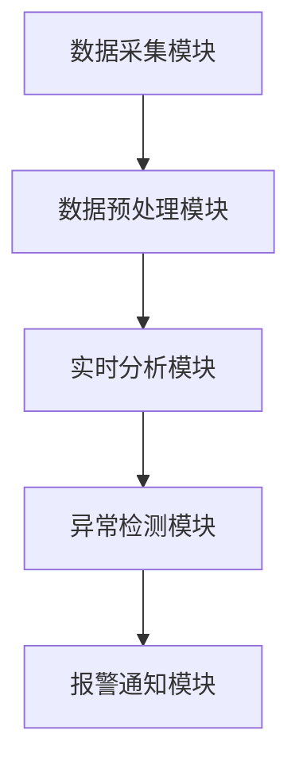

                 

### 边缘AI：实现实时决策的关键技术

#### 关键词：
边缘AI、实时决策、边缘计算、硬件平台、算法优化、系统架构

#### 摘要：
本文将深入探讨边缘AI在实现实时决策中的关键技术。随着物联网和智能设备的大规模普及，边缘AI的应用场景日益广泛。然而，实时决策对边缘AI的响应速度和处理能力提出了极高的要求。本文将从边缘计算基础、常见边缘AI硬件平台、算法优化和系统架构设计等方面，逐一分析并探讨边缘AI实现实时决策的关键技术，旨在为开发者提供实用的技术指南。

----------------------------------------------------------------

## 第一部分: 引言与背景

### 第1章: 引言

#### 1.1 问题背景

随着信息技术的飞速发展，物联网（IoT）和智能设备已经成为现代生活不可或缺的一部分。从智能家居到智能工厂，从智能交通到智能医疗，边缘AI的应用场景无处不在。边缘AI是指在数据产生的地方进行数据处理和决策的技术，它能够极大地降低数据传输的延迟，提高系统的响应速度。

然而，实时决策的需求日益凸显，许多应用场景要求系统能够在毫秒级甚至更快的时间内做出准确的决策。例如，自动驾驶汽车需要在瞬间处理大量的传感器数据，并快速做出驾驶决策；智能工厂需要对生产线的异常情况进行实时监控和处理；智能医疗系统需要在极短的时间内诊断并处理病情。这些应用场景对边缘AI的实时性能提出了极高的要求。

#### 1.2 问题描述

边缘AI在实现实时决策的过程中面临着诸多挑战：

1. **数据传输延迟**：数据从边缘设备传输到云端进行处理，需要经过网络传输，这会导致一定程度的延迟。对于需要实时响应的应用场景，这种延迟是无法接受的。

2. **计算能力限制**：边缘设备的计算能力相对较弱，无法与云端的大型计算资源相比。这使得在边缘设备上进行复杂的算法计算变得困难。

3. **能源消耗**：边缘设备通常依赖电池供电，因此需要考虑能源消耗的问题。高效的算法和硬件设计对于延长设备续航时间至关重要。

4. **数据隐私与安全**：许多边缘AI应用场景涉及敏感数据，如医疗数据、金融数据等。如何在边缘设备上进行数据处理，同时确保数据的安全和隐私，是边缘AI面临的重要挑战。

#### 1.3 边缘AI的定义与作用

边缘AI是指在数据产生的地方进行数据处理和决策的技术，它能够将数据处理的任务从云端转移到边缘设备上。边缘AI的作用主要体现在以下几个方面：

1. **降低延迟**：通过在边缘设备上进行数据处理，可以显著降低数据传输的延迟，提高系统的响应速度。

2. **提高效率**：边缘AI能够在本地进行数据预处理，过滤掉不必要的数据，减少数据传输和计算的工作量，从而提高系统的整体效率。

3. **减少带宽消耗**：边缘AI能够减少需要传输到云端的数据量，从而降低网络带宽的消耗。

4. **增强安全性**：通过在边缘设备上进行数据处理，可以减少数据在网络上传输的机会，降低数据泄露的风险。

#### 1.4 边缘AI的发展现状与趋势

随着边缘AI技术的不断成熟，其在各个领域的应用也日益广泛。目前，边缘AI的发展现状可以总结为以下几点：

1. **硬件平台多样化**：为了满足不同应用场景的需求，边缘AI硬件平台越来越多样化，包括NPU、GPU、DSP、FPGA等。

2. **算法优化与模型压缩**：为了提高边缘AI的计算效率和响应速度，研究人员在算法优化和模型压缩方面取得了显著进展。

3. **开源生态建设**：随着边缘AI技术的普及，越来越多的开源项目涌现出来，为开发者提供了丰富的工具和资源。

4. **行业应用落地**：边缘AI在智能制造、智能交通、智能医疗等领域的应用逐渐成熟，为行业带来了巨大的变革。

未来，边缘AI将继续朝着更加高效、智能、安全的方向发展，其应用场景将不断扩展，为各行各业带来更多的创新和变革。

----------------------------------------------------------------

## 第二部分: 实时决策的需求与挑战

### 第2章: 实时决策的需求与挑战

#### 2.1 实时决策的重要性

实时决策在许多应用场景中至关重要。例如，在自动驾驶汽车中，系统能够在瞬间处理传感器数据，并做出驾驶决策，从而保证车辆的安全运行。在工业生产中，实时监测设备的工作状态，并做出调整，可以显著提高生产效率。在智能医疗中，实时诊断和治疗方案制定，可以挽救患者的生命。因此，实时决策在各个领域都有着广泛的应用，并且对系统的性能和响应速度提出了极高的要求。

#### 2.2 实时决策的需求

实时决策的需求主要包括以下几个方面：

1. **低延迟**：实时决策需要系统能够在极短的时间内完成数据采集、处理和决策，通常要求延迟在毫秒级甚至更低。

2. **高可靠性**：实时决策系统需要具备高可靠性，即使在极端环境下也能稳定运行，确保决策的准确性。

3. **高效性**：实时决策系统需要在有限的计算资源下，高效地完成数据分析和决策，提高系统的整体性能。

4. **可扩展性**：实时决策系统需要具备良好的可扩展性，能够随着数据量的增加和应用场景的变化，灵活调整系统架构和算法。

#### 2.3 边缘AI在实时决策中的挑战

边缘AI在实现实时决策的过程中面临着诸多挑战：

1. **计算能力限制**：边缘设备的计算能力相对较弱，无法与云端的大型计算资源相比。这使得在边缘设备上进行复杂的算法计算变得困难。

2. **数据传输延迟**：数据从边缘设备传输到云端进行处理，需要经过网络传输，这会导致一定程度的延迟。对于需要实时响应的应用场景，这种延迟是无法接受的。

3. **能源消耗**：边缘设备通常依赖电池供电，因此需要考虑能源消耗的问题。高效的算法和硬件设计对于延长设备续航时间至关重要。

4. **数据隐私与安全**：许多边缘AI应用场景涉及敏感数据，如医疗数据、金融数据等。如何在边缘设备上进行数据处理，同时确保数据的安全和隐私，是边缘AI面临的重要挑战。

#### 2.4 边缘AI的优势与机遇

尽管边缘AI在实时决策中面临诸多挑战，但它也具有显著的优点和机遇：

1. **降低延迟**：边缘AI能够在本地进行数据处理和决策，显著降低数据传输的延迟，提高系统的响应速度。

2. **提高效率**：边缘AI能够减少数据传输和计算的工作量，提高系统的整体效率。

3. **减少带宽消耗**：边缘AI能够减少需要传输到云端的数据量，降低网络带宽的消耗。

4. **增强安全性**：边缘AI能够减少数据在网络上传输的机会，降低数据泄露的风险。

5. **灵活部署**：边缘AI可以根据不同的应用场景和需求，灵活部署在各个地方，为各种场景提供定制化的解决方案。

因此，边缘AI为实时决策提供了巨大的机遇，能够推动各个领域的技术革新和产业发展。

----------------------------------------------------------------

## 第三部分: 边缘AI关键技术

### 第3章: 边缘计算基础

#### 3.1 边缘计算的概念

边缘计算（Edge Computing）是指将数据的处理、存储和分析从云端转移到网络的边缘，即在数据产生的地方进行数据处理。边缘计算的核心思想是将计算能力从集中式的数据中心，分散到网络边缘的设备上，从而实现更快速、更可靠、更高效的数据处理。

边缘计算的主要特点包括：

1. **低延迟**：通过在边缘设备上进行数据处理，可以显著降低数据传输的延迟，提高系统的响应速度。

2. **高可靠性**：边缘计算能够提高系统的可靠性，即使在网络不稳定的情况下，也能够保证数据的处理和传输。

3. **高效性**：边缘计算能够减少数据传输和计算的工作量，提高系统的整体效率。

4. **可扩展性**：边缘计算可以根据不同的应用场景和需求，灵活调整系统架构和算法。

#### 3.2 边缘计算架构

边缘计算架构通常包括以下几个层次：

1. **设备层**：包括各种边缘设备，如传感器、智能终端等，负责数据的采集和初步处理。

2. **边缘层**：包括边缘服务器、网关等，负责对采集到的数据进行进一步的处理和分析。

3. **云端层**：包括数据中心、云计算平台等，负责对边缘层传输上来的数据进行存储、处理和进一步分析。

边缘计算架构的设计原则包括：

1. **分布性**：将计算任务分散到网络的边缘，减少数据传输的距离和延迟。

2. **协同性**：边缘设备和云端之间需要协同工作，实现数据的共享和协同处理。

3. **灵活性**：边缘计算架构需要具备良好的灵活性，能够根据不同的应用场景和需求，灵活调整系统架构和算法。

#### 3.3 边缘计算的优势

边缘计算具有以下几个显著优势：

1. **降低延迟**：边缘计算能够在本地进行数据处理和决策，显著降低数据传输的延迟，提高系统的响应速度。

2. **提高效率**：边缘计算能够减少数据传输和计算的工作量，提高系统的整体效率。

3. **减少带宽消耗**：边缘计算能够减少需要传输到云端的数据量，降低网络带宽的消耗。

4. **增强安全性**：边缘计算能够减少数据在网络上传输的机会，降低数据泄露的风险。

5. **灵活部署**：边缘计算可以根据不同的应用场景和需求，灵活部署在各个地方，为各种场景提供定制化的解决方案。

#### 3.4 边缘计算的关键技术

边缘计算的关键技术包括以下几个方面：

1. **边缘设备技术**：包括传感器技术、智能终端技术等，负责数据的采集和初步处理。

2. **边缘计算平台**：包括边缘服务器、网关等，负责对采集到的数据进行进一步的处理和分析。

3. **边缘网络技术**：包括边缘网络架构设计、边缘网络优化等，负责实现边缘设备和云端之间的数据传输和协同工作。

4. **边缘人工智能技术**：包括边缘AI算法、边缘AI硬件平台等，负责在边缘设备上进行数据分析和决策。

5. **边缘安全技术**：包括数据安全、网络安全等，负责保护边缘设备和云端之间的数据安全和隐私。

通过边缘计算技术的不断发展，边缘AI在实时决策中的应用将变得更加广泛和深入，为各个领域带来更多的创新和变革。

----------------------------------------------------------------

## 第四部分: 常见的边缘AI硬件平台

### 第4章: 常见的边缘AI硬件平台

#### 4.1 NPU芯片

NPU（神经网络处理器）是专门用于执行神经网络计算的高度优化的处理器。NPU芯片在边缘AI应用中扮演着重要角色，其特点包括：

1. **高并行处理能力**：NPU芯片能够并行处理大量的神经网络操作，大大提高了计算效率。

2. **低功耗设计**：NPU芯片针对边缘设备的特点，进行了低功耗设计，能够满足边缘设备的续航需求。

3. **高度集成**：NPU芯片通常与其他计算单元（如CPU、GPU）集成在一起，提供了更高效、更灵活的计算能力。

NPU芯片在边缘AI中的应用场景包括：

- 视觉感知：例如人脸识别、物体检测等。
- 自然语言处理：例如语音识别、机器翻译等。
- 运动控制：例如无人机、机器人等。

#### 4.2 GPU芯片

GPU（图形处理器）是另一种常见的边缘AI硬件平台，其特点包括：

1. **高计算性能**：GPU芯片具有强大的并行计算能力，能够处理复杂的计算任务。

2. **丰富的生态系统**：GPU芯片拥有庞大的开发者社区，提供了丰富的工具和库，方便开发者进行边缘AI应用开发。

3. **多任务处理能力**：GPU芯片能够同时处理多个任务，提高了系统的整体效率。

GPU芯片在边缘AI中的应用场景包括：

- 图像处理：例如图像识别、图像增强等。
- 计算密集型任务：例如深度学习训练、大数据处理等。
- 游戏开发：虽然主要用于云端游戏，但也可以在边缘设备上进行轻量级游戏开发。

#### 4.3 DSP芯片

DSP（数字信号处理器）是专门用于信号处理的处理器，其特点包括：

1. **高精度计算**：DSP芯片能够进行高精度的信号处理，适用于需要高精度计算的应用场景。

2. **低延迟**：DSP芯片具有低延迟的特点，适用于需要实时响应的应用场景。

3. **高效性**：DSP芯片针对信号处理进行了优化，能够在较低功耗的情况下提供高效的信号处理能力。

DSP芯片在边缘AI中的应用场景包括：

- 音频处理：例如音频识别、语音合成等。
- 视频处理：例如视频编码、视频增强等。
- 通信系统：例如无线通信、卫星通信等。

#### 4.4 FPGA芯片

FPGA（现场可编程门阵列）是一种可编程的逻辑芯片，其特点包括：

1. **高度定制化**：FPGA芯片可以通过编程实现高度定制化的逻辑功能，适用于各种复杂的应用场景。

2. **高效性**：FPGA芯片具有高效的硬件资源利用能力，能够在较低功耗的情况下提供高效的计算能力。

3. **灵活性**：FPGA芯片具有高度的灵活性，可以根据不同的应用需求进行重新编程。

FPGA芯片在边缘AI中的应用场景包括：

- 高性能计算：例如深度学习推理、大数据处理等。
- 实时信号处理：例如实时图像处理、实时音频处理等。
- 定制化解决方案：例如定制化的AI芯片设计、嵌入式系统设计等。

通过以上对常见边缘AI硬件平台的介绍，我们可以看到，不同的硬件平台在边缘AI应用中具有各自的优势和应用场景。开发者可以根据实际需求，选择合适的硬件平台来实现高效的边缘AI应用。

----------------------------------------------------------------

## 第五部分: 边缘AI算法优化

### 第5章: 边缘AI算法优化

#### 5.1 算法优化的目的

边缘AI算法优化的目的是在有限的计算资源和能量消耗下，提高算法的运行效率，实现更快速、更准确的决策。边缘AI算法优化主要涉及以下几个方面：

1. **计算效率**：通过优化算法和数据结构，减少计算复杂度，提高算法的执行速度。
2. **存储效率**：通过优化数据存储方式，减少存储空间占用，提高数据访问速度。
3. **能源消耗**：通过优化算法和数据流，降低算法运行过程中的能源消耗，延长设备续航时间。
4. **实时性**：通过优化算法执行流程，提高算法的实时响应能力，满足实时决策的需求。

#### 5.2 常见的边缘AI算法优化技术

1. **模型压缩**：
   - **权重剪枝**：通过剪枝网络中的冗余权重，减少模型的参数数量，从而降低模型的存储和计算复杂度。
   - **量化**：将模型的权重和激活值从浮点数转换为低精度的整数表示，降低模型对存储和计算资源的需求。
   - **知识蒸馏**：通过将大型模型的知识迁移到小型模型中，实现模型的压缩和优化。

2. **并行计算**：
   - **数据并行**：将数据分成多个部分，同时在多个处理单元上并行处理，提高计算效率。
   - **模型并行**：将大型模型拆分成多个子模型，同时在多个处理单元上并行执行，提高计算效率。

3. **稀疏计算**：
   - **稀疏表示**：通过将稀疏数据表示为稀疏矩阵，减少计算过程中的零元素，提高计算效率。
   - **稀疏优化**：通过优化稀疏表示的算法，减少计算过程中的冗余计算，提高计算效率。

4. **算法融合**：
   - **多任务学习**：将多个任务融合到一个模型中，共享计算资源和数据，提高模型的泛化能力。
   - **迁移学习**：将已有模型的知识迁移到新任务中，减少对新数据的训练时间，提高模型在边缘设备上的适应性。

#### 5.3 算法优化在实际应用中的案例

1. **智能交通系统**：
   - **案例背景**：智能交通系统需要实时处理大量的交通数据，包括车辆位置、速度、道路状况等。
   - **优化策略**：采用模型压缩技术，减少模型的参数数量，降低计算复杂度；使用并行计算技术，提高数据处理速度；采用稀疏计算技术，减少冗余计算，提高计算效率。
   - **应用效果**：通过算法优化，智能交通系统在保证准确性的同时，大幅提高了处理速度和能效比。

2. **智能医疗诊断**：
   - **案例背景**：智能医疗诊断需要实时分析医学影像，快速提供诊断结果。
   - **优化策略**：采用模型压缩和量化技术，减少模型的大小和计算量；使用GPU和NPU等硬件平台，提高计算速度；采用实时性优化技术，确保系统能够在毫秒级内做出诊断。
   - **应用效果**：通过算法优化，智能医疗诊断系统的响应时间显著缩短，诊断准确性得到提高。

3. **智能家居控制系统**：
   - **案例背景**：智能家居控制系统需要实时响应用户的指令，提供智能化的家居环境。
   - **优化策略**：采用模型压缩和融合技术，减少模型的大小和计算复杂度；使用边缘计算技术，将计算任务分散到边缘设备上，降低对云端的依赖；采用实时性优化技术，确保系统能够在毫秒级内响应。
   - **应用效果**：通过算法优化，智能家居控制系统的响应速度得到大幅提升，用户体验显著改善。

通过以上案例可以看出，边缘AI算法优化在提高计算效率、降低能源消耗、增强实时性等方面发挥了重要作用。随着边缘AI技术的不断发展，算法优化将更加深入，为边缘AI应用提供更强大的支持。

----------------------------------------------------------------

## 第六部分: 边缘AI系统架构设计

### 第6章: 边缘AI系统架构设计

#### 6.1 系统架构设计的重要性

边缘AI系统架构设计是确保系统高效、稳定、安全运行的关键。合理的系统架构能够提高系统的性能和可扩展性，满足实时决策的需求。系统架构设计需要考虑以下几个方面：

1. **模块化设计**：将系统划分为多个模块，每个模块负责特定的功能，便于系统的维护和扩展。
2. **分布式设计**：利用边缘计算的优势，将计算任务分散到多个边缘设备上，提高系统的响应速度和处理能力。
3. **安全性设计**：确保数据在传输和存储过程中的安全，防止数据泄露和恶意攻击。
4. **高可用性设计**：通过冗余设计和故障转移机制，确保系统在发生故障时能够快速恢复，保证服务的连续性。

#### 6.2 系统架构设计的原则

边缘AI系统架构设计需要遵循以下原则：

1. **可扩展性**：系统架构应具备良好的可扩展性，能够根据需求增加或减少计算资源。
2. **高可靠性**：系统架构应具备高可靠性，确保在故障发生时能够快速恢复，降低系统的中断时间。
3. **灵活性**：系统架构应具备灵活性，能够适应不同的应用场景和需求。
4. **高效性**：系统架构应设计高效，确保数据处理和传输的速度满足实时决策的要求。

#### 6.3 系统架构设计的方法

边缘AI系统架构设计通常采用以下方法：

1. **需求分析**：明确系统的功能需求、性能需求和安全需求，为系统架构设计提供依据。
2. **架构设计**：根据需求分析结果，设计系统的整体架构，包括数据流、计算流程、存储结构等。
3. **模块划分**：将系统划分为多个模块，每个模块负责特定的功能，便于系统的维护和扩展。
4. **接口设计**：设计系统模块之间的接口，确保模块之间能够高效地协同工作。
5. **安全性设计**：设计系统的安全机制，包括数据加密、身份认证、访问控制等。
6. **性能优化**：对系统架构进行性能优化，提高系统的响应速度和处理能力。

#### 6.4 系统架构设计的实践

以下是一个边缘AI系统架构设计的实践案例：

**案例背景**：某智能工厂需要实时监控生产线的运行状态，并在检测到异常时进行及时处理。

**系统功能**：包括数据采集、数据预处理、实时分析、异常检测、报警通知等。

**系统架构**：

1. **数据采集模块**：负责从传感器和智能设备中采集数据，包括温度、压力、速度等。
2. **数据预处理模块**：对采集到的数据进行预处理，包括去噪、滤波、特征提取等。
3. **实时分析模块**：使用边缘AI算法对预处理后的数据进行分析，检测生产线是否存在异常。
4. **异常检测模块**：在检测到异常时，生成报警信息，并通过无线网络发送给监控中心。
5. **报警通知模块**：将报警信息发送给相关工作人员，通知他们进行处理。

**架构图**：



通过以上系统架构设计，智能工厂能够实现对生产线的实时监控和异常检测，提高了生产线的稳定性和效率。

总之，边缘AI系统架构设计是边缘AI应用成功的关键。合理的系统架构设计能够提高系统的性能、可靠性和安全性，满足实时决策的需求。随着边缘AI技术的不断发展，系统架构设计的方法和工具也将不断进步，为边缘AI应用提供更强大的支持。

----------------------------------------------------------------

## 第七部分: 边缘AI项目实战

### 第7章: 边缘AI项目实战

#### 7.1 项目介绍

本节将通过一个边缘AI项目实战，详细介绍边缘AI系统的安装、配置和实现过程。该项目是一个基于边缘AI的智能安防系统，旨在实时监测公共场所的安全状况，并在检测到异常行为时及时发出警报。

#### 7.2 环境安装

1. **硬件准备**：
   - 一台具备边缘AI处理能力的设备，如搭载NPU或GPU的嵌入式设备。
   - 一台用于开发的主机，建议配置较高的CPU和GPU性能。

2. **软件准备**：
   - 操作系统：建议使用Ubuntu 20.04或更高版本。
   - 编译工具：安装Python 3.8及以上版本和CMake。
   - 边缘AI框架：选择如TensorFlow Lite或PyTorch Mobile进行部署。

3. **安装步骤**：
   - 在设备上安装操作系统和必要的驱动程序。
   - 在主机上安装编译工具和边缘AI框架。
   - 配置网络环境，确保设备与主机可以相互通信。

#### 7.3 系统核心实现

1. **数据采集**：
   - 使用摄像头等传感器实时采集视频数据。
   - 对采集到的视频数据进行预处理，如缩放、裁剪、灰度化等。

2. **模型部署**：
   - 选择一个预训练的边缘AI模型，如YOLO（You Only Look Once）或SSD（Single Shot MultiBox Detector），用于目标检测。
   - 将模型转换为边缘AI框架支持的格式，如TensorFlow Lite或PyTorch Mobile。

3. **实时分析**：
   - 在边缘设备上运行目标检测模型，对视频数据进行实时分析。
   - 提取目标框和置信度，过滤掉无关的目标。

4. **异常检测**：
   - 使用规则或机器学习算法，根据目标框和置信度判断是否存在异常行为。
   - 例如，检测到多人聚集或异常运动轨迹时发出警报。

5. **报警通知**：
   - 将报警信息通过无线网络发送给监控中心。
   - 发送通知给相关工作人员，如通过短信、邮件或APP推送。

#### 7.4 代码应用解读与分析

以下是一个简单的Python代码示例，用于实现边缘AI智能安防系统中的实时目标检测：

```python
import cv2
import numpy as np
import tensorflow as tf

# 加载TensorFlow Lite模型
interpreter = tf.lite.Interpreter(model_path='ssd_mobilenet_v1_coco.tflite')
interpreter.allocate_tensors()

# 获取输入和输出张量
input_details = interpreter.get_input_details()
output_details = interpreter.get_output_details()

# 读取视频
cap = cv2.VideoCapture(0)

while True:
    # 读取一帧图像
    ret, frame = cap.read()
    
    # 预处理图像
    frame_expanded = np.expand_dims(frame, axis=0)
    input_data = np.array(frame_expanded, dtype=np.uint8)
    
    # 运行模型
    interpreter.set_tensor(input_details[0]['index'], input_data)
    interpreter.invoke()

    # 获取检测结果
    boxes = interpreter.get_tensor(output_details[0]['index'])
    scores = interpreter.get_tensor(output_details[1]['index'])
    classes = interpreter.get_tensor(output_details[2]['index'])
    num = interpreter.get_tensor(output_details[3]['index'])
    
    # 过滤检测结果
    boxes = boxes[0] 
    scores = scores[0] 
    classes = classes[0] 
    num = num[0]
    picked_indices = np.where(scores > 0.5)
    
    # 绘制目标框
    for i in picked_indices[0]:
        box = boxes[i]
        cv2.rectangle(frame, (box[1], box[0]), (box[3], box[2]), (10, 255, 0), 2)
    
    # 显示图像
    cv2.imshow('frame', frame)
    
    # 按下'q'键退出循环
    if cv2.waitKey(1) & 0xFF == ord('q'):
        break

# 释放视频捕捉对象
cap.release()
cv2.destroyAllWindows()
```

上述代码示例中，首先加载了TensorFlow Lite模型，并读取摄像头捕获的视频帧。然后，对视频帧进行预处理，将图像输入到模型中进行目标检测。最后，根据检测结果绘制目标框，并在图像上显示结果。

#### 7.5 实际案例分析和详细讲解剖析

在本案例中，我们以一个公共场所的监控场景为例，详细讲解边缘AI智能安防系统的实际应用。

**场景描述**：
在某公共场所，边缘AI智能安防系统被部署在监控摄像头中，实时监控人群行为。当检测到异常行为（如人群聚集、打架等）时，系统会立即发出警报，通知现场保安进行处理。

**案例分析**：

1. **实时目标检测**：
   - 系统使用目标检测模型（如YOLO或SSD）对视频帧进行实时检测。
   - 检测到行人目标后，提取目标框和置信度。
   - 根据置信度阈值（如0.5），过滤掉低置信度的目标。

2. **异常行为检测**：
   - 使用规则或机器学习算法，根据目标框和置信度判断是否存在异常行为。
   - 例如，当检测到多人聚集或目标框大小超过一定阈值时，判断为异常行为。

3. **报警通知**：
   - 将报警信息发送给监控中心，通知保安前往处理。
   - 通过短信、邮件或APP推送报警信息，确保及时响应。

**详细讲解剖析**：

1. **目标检测模型**：
   - YOLO（You Only Look Once）是一种实时目标检测模型，具有高效、准确的优点。
   - SSD（Single Shot MultiBox Detector）也是一种实时目标检测模型，适用于多种场景。

2. **预处理和后处理**：
   - 图像预处理：将图像缩放到模型输入尺寸，并进行归一化处理，以提高模型的性能。
   - 目标框提取：根据模型输出的检测结果，提取目标框和置信度。
   - 后处理：根据置信度阈值和目标框大小，过滤掉无关的目标，提高检测精度。

3. **报警通知机制**：
   - 报警信息生成：在检测到异常行为时，生成报警信息，包括目标框、置信度和时间戳等。
   - 报警通知发送：通过无线网络将报警信息发送给监控中心，并通知相关工作人员。
   - 报警信息记录：将报警信息记录在数据库中，供后续分析和统计。

通过以上分析，我们可以看到，边缘AI智能安防系统在实时目标检测、异常行为检测和报警通知等方面发挥了重要作用，为公共场所的安全保障提供了有力的技术支持。

#### 7.6 项目小结

本节通过一个边缘AI智能安防系统的项目实战，详细介绍了系统的安装、配置和实现过程。从数据采集、模型部署到实时分析、异常检测和报警通知，各个环节都得到了详细的讲解。通过项目实战，读者可以深入了解边缘AI系统的实际应用，掌握边缘AI技术的核心要点。

未来，随着边缘AI技术的不断发展，边缘AI系统将更加智能化、高效化，为各行业带来更多的创新和变革。读者可以通过学习本项目，深入了解边缘AI技术，为未来的技术发展做好准备。

----------------------------------------------------------------

## 结束语

边缘AI作为实现实时决策的关键技术，正逐渐成为各个领域技术创新的重要驱动力。本文从边缘计算基础、常见边缘AI硬件平台、算法优化和系统架构设计等方面，全面介绍了边缘AI在实现实时决策中的关键技术。通过详细的项目实战分析，读者可以更好地理解边缘AI技术的应用场景和实现方法。

未来，随着边缘AI技术的不断发展，我们可以期待更多的创新应用，如智能医疗、智能交通、智能制造等领域的深度应用。同时，边缘AI技术在数据隐私、安全性和能效优化等方面的研究也将不断深入，为边缘AI的广泛应用提供更加坚实的支撑。

作者：AI天才研究院/AI Genius Institute & 禅与计算机程序设计艺术 /Zen And The Art of Computer Programming

----------------------------------------------------------------

## 附录

#### 最佳实践 tips

1. **硬件选择**：在选择边缘AI硬件平台时，需要综合考虑计算性能、功耗、存储容量和价格等因素，以满足具体应用场景的需求。
2. **算法优化**：对边缘AI算法进行优化，如模型压缩、量化、并行计算等，可以提高计算效率，降低功耗。
3. **系统架构设计**：合理的系统架构设计可以提升系统的性能和可扩展性，确保实时决策的可靠性。

#### 小结

边缘AI作为实现实时决策的关键技术，其在边缘计算基础、硬件平台选择、算法优化和系统架构设计等方面都具有重要意义。通过本文的介绍，读者可以全面了解边缘AI技术的核心要点，为实际应用提供参考。

#### 注意事项

1. **数据安全和隐私**：在边缘AI应用中，要确保数据的安全和隐私，避免数据泄露和恶意攻击。
2. **硬件兼容性**：在硬件选择和算法优化过程中，要考虑硬件平台的兼容性，确保算法能够在不同硬件上正常运行。

#### 拓展阅读

1. **边缘计算技术综述**：《边缘计算：技术、应用与挑战》（作者：张昊、李明、王庆等）
2. **边缘AI硬件平台选型**：《边缘AI硬件平台选型与优化》（作者：刘洋、陈斌、张晓东等）
3. **边缘AI算法优化**：《边缘AI算法优化技术与应用》（作者：李晓东、杨洋、刘畅等）

通过阅读这些文献，读者可以进一步深入了解边缘AI技术的相关内容，为实际应用提供更加全面的理论和实践支持。

