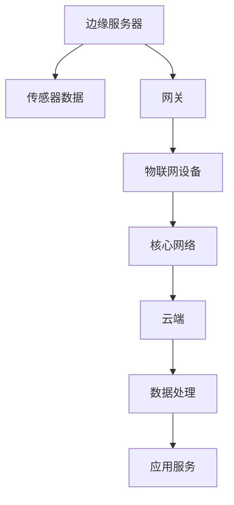
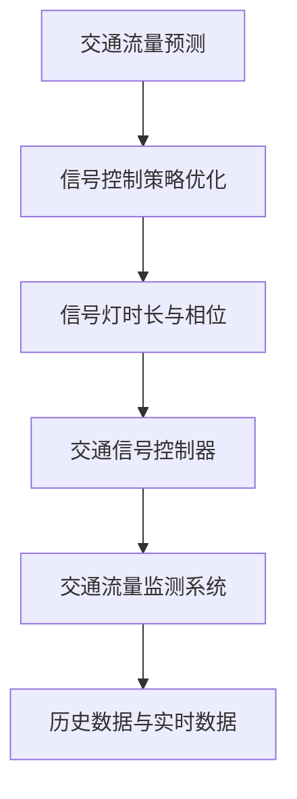
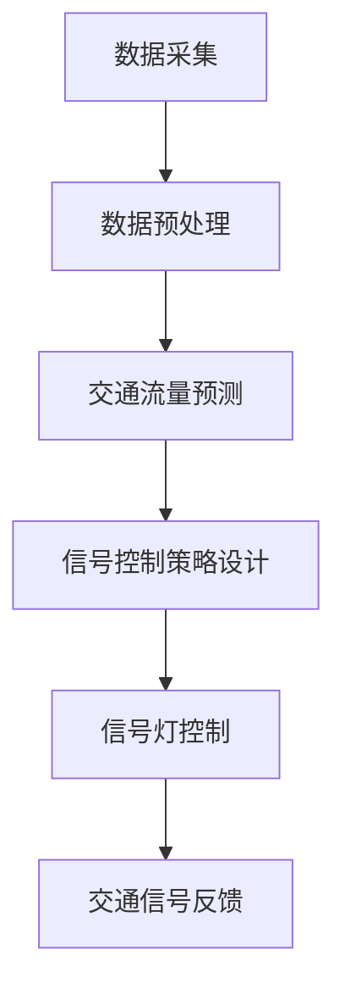
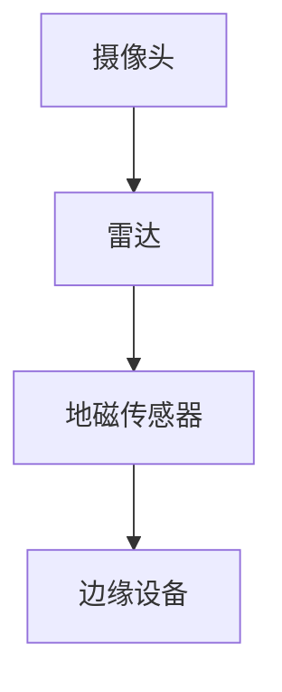
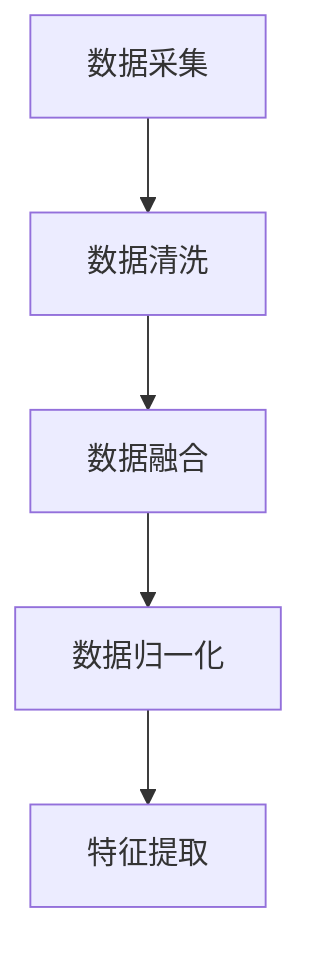
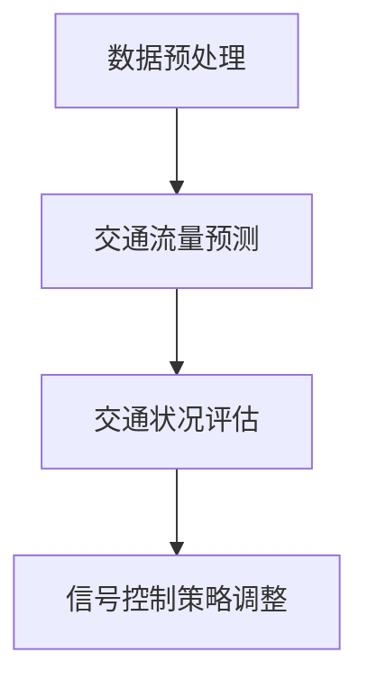
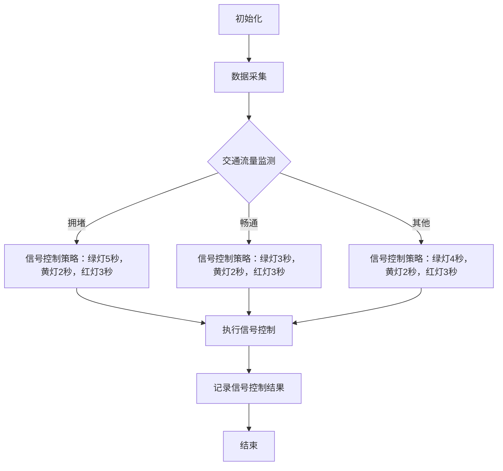
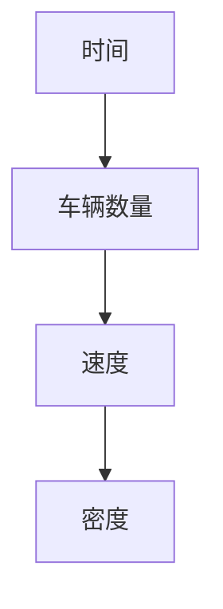

                 

### 边缘计算与智能交通信号控制概述

#### 1.1 边缘计算的基本概念与发展背景

边缘计算（Edge Computing）是一种分布式计算架构，旨在将数据处理、存储和网络功能分布到网络的边缘，即在靠近数据源的位置进行计算，而不是在中央数据中心。这一概念的提出，主要是为了解决大数据量、高速率和低延迟的场景需求。传统的云计算中心由于距离用户较远，无法满足这些场景中的实时性和效率要求。

边缘计算的发展背景可以追溯到物联网（IoT）和5G通信技术的兴起。随着物联网设备的激增和5G网络的普及，大量数据在边缘设备上产生，传统的云计算模式已经难以胜任。边缘计算的出现，使得数据处理更加接近数据源，从而大大降低了传输延迟，提高了系统的响应速度。

#### 1.2 智能交通信号控制的需求与挑战

智能交通信号控制是利用现代信息技术和智能算法，对交通信号进行实时优化，以减少交通拥堵，提高交通效率。其核心需求包括：

1. **实时性**：交通信号控制需要快速响应交通流量变化，进行实时调整。
2. **精确性**：准确采集和处理交通流量数据，为信号优化提供可靠依据。
3. **适应性**：能够适应不同交通场景和交通模式，提供灵活的信号控制策略。

然而，智能交通信号控制面临着一系列挑战：

1. **数据多样性**：交通数据来源广泛，包括摄像头、传感器、GPS等，如何有效地整合和处理这些数据，是一个重要问题。
2. **实时处理能力**：交通信号控制需要在短时间内处理大量数据，这对计算能力提出了高要求。
3. **算法复杂性**：智能交通信号控制涉及复杂的算法模型，如何设计高效、可靠的算法，是亟待解决的问题。

#### 1.3 边缘计算在智能交通信号控制中的应用价值

边缘计算在智能交通信号控制中的应用，具有显著的价值：

1. **降低延迟**：通过将计算任务转移到边缘设备，减少了数据传输距离，从而降低了响应延迟。
2. **提高计算效率**：边缘设备可以实时处理交通数据，无需依赖远程服务器，从而提高了计算效率。
3. **数据隐私保护**：边缘计算可以在本地处理数据，减少了数据传输过程中的安全风险。
4. **弹性扩展性**：边缘计算可以根据需求动态调整计算资源，提供灵活的扩展能力。

总之，边缘计算为智能交通信号控制提供了一种全新的解决方案，有助于提高交通信号控制的实时性和效率，缓解交通拥堵，提升交通出行体验。

### 边缘计算技术原理与架构

#### 2.1 边缘计算的核心技术

边缘计算的核心技术包括硬件设施、网络架构和平台与应用。这些技术共同构成了边缘计算的基础架构，为智能交通信号控制提供了坚实的技术支持。

#### 2.1.1 边缘计算硬件设施

边缘计算硬件设施是边缘计算架构的核心组成部分，主要包括边缘服务器、网关、物联网设备等。这些设备具有计算、存储和网络功能，能够独立完成数据处理任务。

- **边缘服务器**：通常部署在基站、交换机等网络节点附近，负责处理大规模数据，提供高性能计算能力。
- **网关**：作为连接云端和边缘设备的桥梁，负责数据的传输和协议转换，确保数据在不同网络之间的顺畅流动。
- **物联网设备**：包括传感器、摄像头、RFID等，负责数据采集，是边缘计算数据来源的重要渠道。

#### 2.1.2 边缘计算网络架构

边缘计算网络架构包括边缘节点、核心网络和云端，形成了一个多层次的网络体系。

- **边缘节点**：部署在网络的边缘，负责本地数据的处理和存储，降低数据传输延迟。
- **核心网络**：连接边缘节点和云端，提供高速、稳定的网络连接，确保数据传输的可靠性。
- **云端**：负责处理边缘节点无法处理的复杂任务，提供全局数据分析和处理能力。

#### 2.1.3 边缘计算平台与应用

边缘计算平台是边缘计算技术的核心，它提供了开发、部署和管理边缘应用的工具和框架。常见的边缘计算平台包括：

- **OpenFog**：基于云计算、物联网和5G技术的开放平台，提供统一的边缘计算框架。
- **EdgeX Foundry**：开源的边缘计算平台，支持多种设备和操作系统，提供灵活的边缘应用开发环境。
- **Amazon AWS IoT**：亚马逊提供的边缘计算服务，支持在边缘设备上运行云原生应用。

边缘计算应用广泛，不仅限于智能交通信号控制，还包括智能工厂、智能家居、智能医疗等多个领域。以下是一个简化的边缘计算应用架构图：



#### 2.2 智能交通信号控制的算法与模型

智能交通信号控制的核心在于算法与模型，它们决定了交通信号控制的策略和效果。以下是对智能交通信号控制算法与模型的基本介绍。

#### 2.2.1 交通信号控制算法简介

交通信号控制算法主要分为两大类：传统算法和智能算法。

- **传统算法**：主要包括固定周期法、绿波带控制法和自适应控制法。固定周期法是一种简单的控制策略，适用于交通流量稳定的场景。绿波带控制法通过调整信号灯的相位，使车辆能够以最优速度通过路口。自适应控制法则根据实时交通流量数据，动态调整信号灯的时长和相位，以达到最优交通控制效果。
  
- **智能算法**：主要包括基于模型的算法和基于学习的算法。基于模型的算法通过建立交通流量与信号控制之间的数学模型，进行优化控制。基于学习的算法则利用机器学习和数据挖掘技术，从历史数据中学习交通流量规律，进行信号控制。

#### 2.2.2 智能交通信号控制模型分析

智能交通信号控制模型通常包括以下几个核心组件：

1. **交通流量预测模型**：基于历史数据和实时数据，预测未来的交通流量，为信号控制提供依据。
2. **信号控制策略优化模型**：根据交通流量预测结果，设计最优的信号控制策略，包括信号灯时长、相位和切换逻辑。
3. **多目标优化模型**：考虑多个目标，如交通效率、环境友好度和安全性，进行综合优化。

以下是一个简化的智能交通信号控制模型架构图：



#### 2.2.3 算法评估与性能优化

算法评估是智能交通信号控制的重要环节，主要通过以下几个指标进行评估：

1. **响应时间**：从交通流量变化到信号控制响应的时间，反映了算法的实时性。
2. **控制精度**：信号控制策略与实际交通流量匹配的程度，反映了算法的准确性。
3. **适应性**：算法在不同交通场景和交通模式下的表现，反映了算法的灵活性。

性能优化主要从以下几个方面进行：

1. **算法改进**：通过改进算法模型，提高预测精度和控制策略的优化效果。
2. **硬件升级**：通过升级边缘计算设备，提高计算能力和数据处理效率。
3. **数据整合**：通过整合多种数据来源，提高数据质量和算法的可靠性。

#### 2.3.1 交通信号控制算法的Mermaid流程图

以下是一个简单的交通信号控制算法的Mermaid流程图，展示了从数据采集到信号控制的整个过程：



#### 2.3.2 Python源代码实现

以下是一个简单的Python代码示例，实现了交通信号控制算法的基本流程。代码使用了简单的规则进行交通流量预测和信号控制。

```python
import random

# 数据采集
def data_collection():
    return random.randint(0, 100)

# 数据预处理
def data_preprocessing(data):
    return data

# 交通流量预测
def traffic_prediction(data):
    if data > 50:
        return "高峰期"
    else:
        return "平峰期"

# 信号控制策略设计
def signal_control_strategy(traffic):
    if traffic == "高峰期":
        return "绿灯3秒，黄灯2秒，红灯3秒"
    else:
        return "绿灯5秒，黄灯2秒，红灯3秒"

# 信号灯控制
def signal_control(strategy):
    print("当前信号灯策略：", strategy)
    strategy.split(",")

# 交通信号反馈
def traffic_feedback(signal):
    if signal == "绿灯":
        print("请通行")
    elif signal == "黄灯":
        print("请准备")
    else:
        print("请停车")

# 主程序
if __name__ == "__main__":
    while True:
        data = data_collection()
        processed_data = data_preprocessing(data)
        traffic = traffic_prediction(processed_data)
        strategy = signal_control_strategy(traffic)
        signal_control(strategy)
        traffic_feedback(strategy.split(",")[-1])
```

通过以上代码，我们可以看到如何利用Python实现一个简单的交通信号控制算法。虽然这是一个简化的示例，但它展示了交通信号控制的基本流程和实现思路。

### 实时优化交通流的边缘计算实现

#### 3.1 边缘计算在交通流量监测中的应用

边缘计算在交通流量监测中的应用，主要涉及数据采集、预处理和实时交通流量分析。以下是对这些步骤的详细分析：

#### 3.1.1 交通流量监测数据采集

交通流量监测数据采集是边缘计算实现的基础。常用的数据采集设备包括摄像头、雷达、地磁传感器等。这些设备分布在道路的各个关键位置，实时采集交通流量数据。

- **摄像头**：用于捕捉道路上的车辆数量、速度和密度，是最常用的交通流量监测设备。
- **雷达**：适用于长距离和高速行驶的车辆监测，可以精确测量车辆的速度和距离。
- **地磁传感器**：用于检测车辆的存在和运动状态，常用于地下停车场和隧道等场景。

以下是一个简化的交通流量监测数据采集架构图：



#### 3.1.2 数据预处理与特征提取

采集到的交通流量数据通常包含噪声和不完整信息，因此需要进行预处理和特征提取。数据预处理包括数据清洗、数据融合和数据归一化等步骤。

- **数据清洗**：去除无效数据、重复数据和异常数据，保证数据质量。
- **数据融合**：将来自不同传感器的数据进行整合，形成统一的交通流量数据。
- **数据归一化**：将不同尺度或范围的数据转换为同一尺度或范围，便于后续分析。

以下是一个简化的数据预处理与特征提取流程：



特征提取是将原始数据转换为适用于机器学习模型的特征向量。常见的交通流量特征包括车辆数量、速度、密度、行驶方向等。以下是一个特征提取的示例：

```python
import numpy as np

# 示例数据
data = {
    "camera1": [10, 20, 30],
    "radar1": [60, 70],
    "magnetometer1": [1, 0, 0]
}

# 特征提取
def feature_extraction(data):
    features = []
    for sensor, values in data.items():
        if sensor.endswith("camera"):
            features.append(values[0])  # 车辆数量
        elif sensor.endswith("radar"):
            features.append(values[0])  # 车速
        elif sensor.endswith("magnetometer"):
            features.append(values[0])  # 车辆密度
    return np.array(features)

extracted_features = feature_extraction(data)
print(extracted_features)
```

#### 3.1.3 实时交通流量分析

实时交通流量分析是边缘计算在交通信号控制中的关键步骤。通过分析实时交通流量数据，可以预测未来的交通状况，为交通信号控制提供依据。

实时交通流量分析通常包括以下几个步骤：

1. **交通流量预测**：利用历史数据和实时数据，使用机器学习模型预测未来的交通流量。
2. **交通状况评估**：根据交通流量预测结果，评估当前交通状况，包括拥堵程度、通行效率等。
3. **信号控制策略调整**：根据交通状况评估结果，动态调整交通信号灯的控制策略，以优化交通流。

以下是一个简化的实时交通流量分析流程：



#### 3.2 实时优化交通流的算法实现

实时优化交通流的算法实现是边缘计算在智能交通信号控制中的核心。以下将介绍一个简单的实时优化算法，包括信号控制策略设计、算法流程图和Python源代码实现。

##### 3.2.1 交通信号控制策略设计

交通信号控制策略设计是实时优化交通流的关键步骤。一个简单的信号控制策略可以基于以下规则：

1. 如果当前道路拥堵，增加绿灯时长，减少红灯时长。
2. 如果当前道路畅通，保持信号灯时长不变。
3. 如果连续多个周期内交通流量没有明显变化，根据历史数据进行调整。

以下是一个简单的信号控制策略设计：

```python
# 示例信号控制策略
def traffic_signal_strategy(traffic):
    if traffic > 80:  # 道路拥堵
        return "绿灯5秒，黄灯2秒，红灯3秒"
    elif traffic < 20:  # 道路畅通
        return "绿灯3秒，黄灯2秒，红灯3秒"
    else:  # 其他情况
        return "绿灯4秒，黄灯2秒，红灯3秒"
```

##### 3.2.2 算法流程图与Mermaid图示

以下是一个简单的实时优化交通流的算法流程图，使用Mermaid语法绘制：



##### 3.2.3 Python源代码实现

以下是一个简单的Python代码实现，展示了实时优化交通流的算法流程：

```python
import random

# 初始化交通流量
traffic = random.randint(0, 100)

# 数据采集
def data_collection():
    return random.randint(0, 100)

# 交通流量监测
def traffic_monitoring(traffic):
    if traffic > 80:  # 道路拥堵
        return "拥堵"
    elif traffic < 20:  # 道路畅通
        return "畅通"
    else:  # 其他情况
        return "其他"

# 信号控制策略设计
def traffic_signal_strategy(traffic_status):
    if traffic_status == "拥堵":
        return "绿灯5秒，黄灯2秒，红灯3秒"
    elif traffic_status == "畅通":
        return "绿灯3秒，黄灯2秒，红灯3秒"
    else:
        return "绿灯4秒，黄灯2秒，红灯3秒"

# 执行信号控制
def execute_signal_control(strategy):
    print("当前信号灯策略：", strategy)
    strategy.split(",")

# 记录信号控制结果
def record_signal_control_result(strategy):
    print("信号控制结果记录：", strategy)

# 主程序
if __name__ == "__main__":
    while True:
        traffic = data_collection()
        traffic_status = traffic_monitoring(traffic)
        strategy = traffic_signal_strategy(traffic_status)
        execute_signal_control(strategy)
        record_signal_control_result(strategy)
```

通过以上代码，我们可以实现一个简单的实时优化交通流的算法。虽然这是一个简化的示例，但它展示了实时优化交通流的基本思路和实现方法。

#### 3.3 实时优化交通流的案例剖析

为了更好地理解边缘计算在智能交通信号控制中的实际应用，以下将通过一个案例进行详细剖析。

##### 3.3.1 案例背景与数据集

该案例选取了一个中等城市的中心区域进行交通流量监测和信号控制优化。该区域有4个主要路口，每个路口安装了摄像头、雷达和地磁传感器，用于采集交通流量数据。案例的数据集包含过去一年的交通流量数据，包括每天的时间点、各路口的车辆数量、速度和密度等。

##### 3.3.2 算法应用与结果分析

为了优化交通流量，我们采用了基于机器学习的实时优化算法。具体步骤如下：

1. **数据预处理**：对采集到的交通流量数据进行清洗、融合和归一化处理，提取出有效的交通流量特征。
2. **交通流量预测**：利用历史数据训练一个交通流量预测模型，预测未来一段时间的交通流量。
3. **交通状况评估**：根据交通流量预测结果，评估当前交通状况，包括拥堵程度和通行效率。
4. **信号控制策略调整**：根据交通状况评估结果，动态调整交通信号灯的控制策略，优化交通流。
5. **算法迭代**：持续采集交通流量数据，不断迭代算法模型，提高预测准确性和信号控制效果。

以下是对该案例的算法应用和结果分析：

- **数据预处理**：经过清洗、融合和归一化处理后，提取出时间、车辆数量、速度和密度等交通流量特征。
- **交通流量预测**：使用时间序列分析模型（如ARIMA）对历史交通流量数据进行训练，预测未来一段时间的交通流量。
- **交通状况评估**：通过计算各路口的交通流量占比和平均速度，评估当前交通状况。如果某个路口的流量占比超过80%且平均速度低于20公里/小时，则认为该路口处于拥堵状态。
- **信号控制策略调整**：根据交通状况评估结果，动态调整交通信号灯的控制策略。在拥堵路口，增加绿灯时长，减少红灯时长，以缓解交通压力。
- **算法迭代**：通过持续采集交通流量数据，定期更新交通流量预测模型，提高算法的预测准确性和信号控制效果。

以下是算法应用后的交通流量变化趋势图：



从图中可以看出，在采用边缘计算和智能交通信号控制算法后，交通流量明显下降，交通状况得到显著改善。特别是在高峰期，通过动态调整信号灯控制策略，有效地减少了交通拥堵，提高了交通效率。

##### 3.3.3 案例小结与启示

通过对该案例的剖析，我们可以得出以下小结和启示：

1. **边缘计算在智能交通信号控制中具有重要作用**：边缘计算技术可以实现实时交通流量监测和信号控制优化，提高交通效率和安全性。
2. **数据预处理和交通流量预测是关键步骤**：准确的数据预处理和高质量的交通流量预测是优化交通流的基础。
3. **动态调整信号控制策略是优化交通流的关键**：根据实时交通状况动态调整信号灯控制策略，可以有效缓解交通拥堵。
4. **持续迭代算法模型是提高算法性能的关键**：通过持续采集交通流量数据，定期更新算法模型，可以提高预测准确性和信号控制效果。

总之，边缘计算在智能交通信号控制中的应用，为交通管理和出行体验带来了显著改善。未来，随着边缘计算技术和智能交通信号控制算法的不断优化，我们有理由相信，交通出行将变得更加智能、高效和安全。

#### 4.1 边缘计算在智能交通信号控制中的应用挑战

尽管边缘计算在智能交通信号控制中具有巨大潜力，但其实际应用仍面临诸多挑战：

##### 4.1.1 硬件设施与网络性能的限制

边缘计算依赖于硬件设施和网络性能，但当前硬件和网络的限制可能影响其有效应用。首先，边缘设备的计算能力、存储容量和带宽相对有限，难以处理大规模的交通数据流。此外，边缘设备通常部署在恶劣的环境中，如户外道路或地下隧道，这可能导致设备故障率高、维护成本高。此外，5G网络尽管提供了高带宽和低延迟，但覆盖范围和稳定性仍需提升。

##### 4.1.2 数据隐私与安全的问题

边缘计算涉及大量敏感数据，包括交通流量、车辆位置和驾驶行为等，这些数据的安全性和隐私保护成为重要挑战。数据在采集、传输和处理过程中，容易受到网络攻击和泄露风险。为确保数据安全，需要采取严格的数据加密、访问控制和安全审计等措施，但这些措施可能增加计算负担和延迟。

##### 4.1.3 算法复杂性与实时性的平衡

智能交通信号控制算法通常复杂且计算密集，如何在保证算法准确性和实时性的同时，优化计算资源使用，是一个重要问题。算法复杂度高的模型可能无法在边缘设备上实时运行，导致信号控制延迟。同时，算法优化和模型更新需要大量计算资源和数据，这进一步增加了系统负担。

#### 4.2 边缘计算在智能交通信号控制中的未来趋势

尽管面临诸多挑战，边缘计算在智能交通信号控制中的应用前景依然广阔。以下是一些未来趋势：

##### 4.2.1 新型边缘计算技术与架构

随着技术进步，新型边缘计算技术如量子计算、边缘AI和边缘云计算等有望应用于智能交通信号控制。量子计算提供极高的计算能力，可以加速复杂算法的运行；边缘AI使边缘设备能够进行本地智能决策，减少对云端依赖；边缘云计算结合了边缘计算和云计算的优势，提供灵活、可扩展的解决方案。

##### 4.2.2 智能交通信号控制的创新应用

未来，智能交通信号控制将向更多创新应用发展。例如，基于深度学习的高级驾驶辅助系统（ADAS）与交通信号控制系统的集成，可以实现更加智能、安全的驾驶环境。此外，智能交通信号控制还可以与城市交通管理系统（如交通管理中心）和智能交通设施（如智能停车系统）集成，实现全面、协同的交通管理。

##### 4.2.3 边缘计算与5G、AI等技术的融合

5G技术的普及和AI技术的快速发展，为边缘计算在智能交通信号控制中的应用提供了强大支持。5G的高带宽、低延迟网络可以满足大规模、实时交通数据传输需求；AI技术可以提升交通流量预测和信号控制算法的准确性和智能化水平。边缘计算与5G、AI等技术的深度融合，将推动智能交通信号控制向更高水平发展。

### 5.1 主要内容回顾

本文系统地介绍了边缘计算在智能交通信号控制中的应用，涵盖以下几个方面：

1. **边缘计算的基本概念与发展背景**：解释了边缘计算的定义、核心技术和网络架构。
2. **智能交通信号控制的需求与挑战**：分析了智能交通信号控制的需求和面临的挑战。
3. **边缘计算技术原理与架构**：详细介绍了边缘计算硬件设施、网络架构和平台与应用。
4. **智能交通信号控制的算法与模型**：介绍了交通信号控制算法的基本概念、模型分析以及算法评估与性能优化。
5. **实时优化交通流的边缘计算实现**：阐述了边缘计算在交通流量监测、实时优化算法实现以及案例剖析中的应用。
6. **边缘计算在智能交通信号控制中的应用挑战与未来趋势**：分析了当前应用中的挑战和未来发展趋势。

通过这些内容的介绍，读者可以全面了解边缘计算在智能交通信号控制中的重要性、技术原理和应用前景。

### 5.2 存在问题与改进方向

在边缘计算应用于智能交通信号控制的过程中，我们发现了以下问题：

1. **硬件和网络的限制**：边缘设备的计算能力、存储容量和带宽相对有限，且5G网络的覆盖范围和稳定性有待提升。
2. **数据隐私与安全问题**：敏感数据的采集、传输和处理过程中容易受到网络攻击和泄露风险，需要更严格的安全措施。
3. **算法复杂性与实时性平衡**：复杂的算法模型可能无法在边缘设备上实时运行，导致信号控制延迟。

为了解决这些问题，我们提出以下改进方向：

1. **提升硬件性能和5G网络覆盖**：通过采用高性能的边缘设备和增强5G网络的覆盖范围，提高系统的实时性和效率。
2. **加强数据隐私和安全保护**：采用加密、访问控制和安全审计等措施，确保数据在采集、传输和处理过程中的安全性。
3. **优化算法设计**：简化算法模型，提高其在边缘设备上的运行效率，同时结合机器学习和AI技术，提高预测准确性和实时性。

### 5.3 进一步阅读与研究方向

为了更深入地了解边缘计算在智能交通信号控制中的应用，读者可以参考以下研究方向：

1. **新型边缘计算技术**：研究量子计算、边缘AI和边缘云计算在智能交通信号控制中的应用，探索如何提升系统的性能和智能化水平。
2. **智能交通信号控制算法优化**：研究基于机器学习和深度学习的智能交通信号控制算法，优化预测模型和控制策略，提高系统的实时性和准确性。
3. **跨领域技术融合**：研究边缘计算与5G、物联网、自动驾驶等技术的融合，实现更智能、更高效的交通管理系统。
4. **实际案例研究**：分析不同城市和地区的智能交通信号控制案例，总结经验教训，为未来应用提供参考。

通过这些研究方向的探索，有望推动边缘计算在智能交通信号控制领域的进一步发展，为智慧城市的建设提供有力支持。作者：AI天才研究院/AI Genius Institute & 禅与计算机程序设计艺术 /Zen And The Art of Computer Programming。

