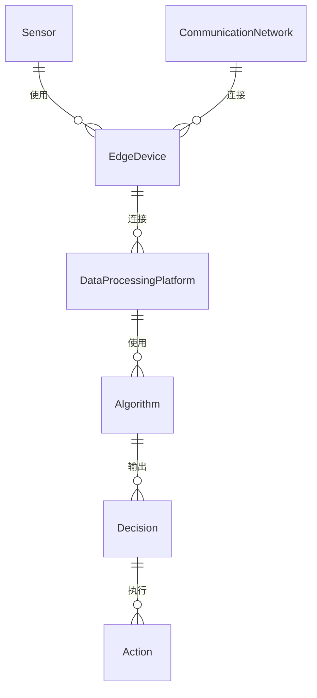

                 

## 边缘计算在智能交通系统中的应用

### 关键词
- 边缘计算
- 智能交通系统
- 数据处理
- 实时响应
- 网络延迟

### 摘要
本文深入探讨了边缘计算在智能交通系统中的应用。首先介绍了边缘计算的基本概念和智能交通系统的定义及其发展背景。随后，本文详细分析了边缘计算如何通过数据采集、处理和分析，提高智能交通系统的效率与安全性。接着，通过具体案例分析展示了边缘计算在智能交通系统中的实际应用，并讨论了其中面临的技术挑战及解决方案。最后，本文展望了边缘计算在智能交通系统中的未来发展，总结了关键研究成果，指出了潜在的挑战与机遇，并提出了未来研究方向与趋势。

---

## 引言

### 边缘计算的基本概念与发展背景

边缘计算（Edge Computing）是一种分布式计算架构，其核心思想是将数据处理和存储功能从中央数据中心转移到网络的边缘，即在靠近数据源的地方进行数据计算和处理。这一概念最早由计算机科学家John O'Donnell在1990年代中期提出，目的是为了解决传统云计算中心在处理大量数据时面临的延迟和网络拥塞问题。随着物联网（IoT）、5G网络和人工智能（AI）技术的发展，边缘计算的重要性日益凸显。

边缘计算的发展背景可以追溯到云计算和物联网的兴起。云计算提供了强大的计算和存储资源，但数据传输的延迟问题仍然存在。物联网设备的激增使得数据生成量剧增，这些数据需要在产生时迅速进行处理和分析。为了满足实时性和低延迟的需求，边缘计算成为了一种理想的选择。

边缘计算的优势主要体现在以下几个方面：

1. **低延迟**：数据处理靠近数据源，减少了数据在网络中传输的时间，提高了系统的响应速度。
2. **高效率**：在边缘设备上直接处理数据，减轻了中心服务器的负担，提高了整体系统的效率。
3. **高安全性**：数据在边缘设备上进行处理，减少了数据传输过程中的风险。
4. **网络带宽节省**：由于数据处理的本地化，减少了数据传输量，从而节省了网络带宽。

### 智能交通系统的定义与发展历程

智能交通系统（Intelligent Transportation System，ITS）是一种利用先进的信息通信技术和数据处理技术，对交通进行全面监控、管理和优化，以提高交通效率、减少交通事故和降低环境污染的系统。智能交通系统的概念最早由美国提出，并在20世纪80年代开始在全球范围内得到推广和应用。

智能交通系统的发展历程可以分为以下几个阶段：

1. **第一阶段（20世纪80年代至90年代）**：主要是以交通信息的采集和发布为核心，如交通信号控制系统、电子收费系统等。
2. **第二阶段（21世纪初至2010年）**：随着物联网和传感器技术的进步，智能交通系统开始向集成化和智能化方向发展，如车辆检测系统、车辆导航系统等。
3. **第三阶段（2010年至今）**：随着大数据、云计算和人工智能等技术的发展，智能交通系统进入了全面智能化阶段，如车联网、智能交通信号控制、自动驾驶等。

智能交通系统的关键技术包括：

1. **传感器技术**：用于采集车辆、道路和环境的各种数据。
2. **通信技术**：实现车辆、道路和数据中心之间的信息传输。
3. **数据处理与分析技术**：用于对采集到的数据进行分析和处理，为交通管理和决策提供支持。
4. **人工智能技术**：用于实现自动驾驶、智能交通信号控制等高级功能。

### 问题背景与问题描述

随着城市化进程的加速和车辆保有量的增加，交通拥堵、交通事故和环境污染等问题日益严重。传统的集中式交通管理系统已经难以满足日益增长的交通需求，迫切需要一种能够实时监控、管理和优化交通的新方法。智能交通系统作为一种集成了先进技术和算法的综合系统，有望解决这些问题。

然而，智能交通系统在实际应用中面临着一些挑战。首先，大量的交通数据需要在短时间内进行处理和分析，这要求系统具备高效率和实时性。其次，数据的传输和处理需要在网络带宽和计算资源有限的情况下进行，这对系统的性能和稳定性提出了更高的要求。最后，数据的隐私和安全性问题也是智能交通系统面临的重要挑战。

边缘计算技术的引入为解决这些问题提供了一种新的思路。通过在网络的边缘进行数据预处理和分析，边缘计算可以显著降低系统的延迟，提高数据处理效率，同时减少数据传输量，降低网络带宽消耗。此外，边缘计算还可以增强系统的安全性和隐私保护能力，确保数据在本地化处理的过程中得到更好的保护。

### 问题解决与边界与外延

边缘计算在智能交通系统中的应用，可以看作是一个多层次、多维度的系统性工程。首先，它涉及到数据的采集和传输，包括各种传感器和通信设备的部署和使用；其次，它涉及到数据的处理和分析，包括边缘设备上的计算任务和数据存储；最后，它涉及到数据的决策和执行，包括基于分析结果进行交通管理和优化。

#### 边缘计算在智能交通系统中的具体应用

1. **数据采集**：在智能交通系统中，各种传感器（如摄像头、雷达、GPS等）用于采集车辆、道路和环境的实时数据。这些数据包括交通流量、速度、车辆位置、路况信息等。

2. **数据处理**：采集到的数据需要在边缘设备上进行预处理和分析。例如，通过边缘计算设备对交通流量数据进行实时分析，识别交通拥堵、事故等异常情况，并生成相应的预警信息。

3. **数据传输**：预处理后的数据可以传输到中心服务器进行进一步处理和分析，也可以在边缘设备上进行完全的处理，从而减少数据传输的延迟。

4. **数据决策与执行**：基于对数据的分析，智能交通系统可以做出相应的决策，如调整交通信号灯的时间设置、建议最佳行驶路线、启动应急响应等。

#### 边缘计算在智能交通系统中的核心要素组成

1. **边缘设备**：包括各种传感器、计算设备和网络设备，如智能摄像头、边缘服务器、5G基站等。

2. **数据处理平台**：用于处理和存储边缘设备采集到的数据，可以是专门设计的边缘计算平台，也可以是云计算平台的边缘节点。

3. **算法和模型**：用于对数据进行处理和分析，包括交通流量预测模型、事故检测模型、路径规划模型等。

4. **通信网络**：包括无线网络和有线网络，用于实现边缘设备与数据处理平台之间的通信。

#### 概念结构与核心要素的联系

边缘计算与智能交通系统的联系可以通过以下ER实体关系图来描述：

通过这个ER图，我们可以清晰地看到边缘计算在智能交通系统中的各个核心要素及其之间的联系。

### 核心概念原理

#### 边缘计算

边缘计算是一种分布式计算模型，通过在网络的边缘部署计算资源，实现数据的本地化处理。其核心概念包括：

1. **分布式计算**：在网络的边缘部署多个计算节点，这些节点可以独立运行应用程序，处理和存储数据。
2. **数据处理靠近数据源**：数据在产生的地方（边缘设备）进行处理，减少了数据传输的延迟。
3. **分布式存储**：数据可以在多个边缘设备上存储，提高了数据的安全性和可靠性。

#### 智能交通系统

智能交通系统是一种利用信息技术对交通进行全面监控、管理和优化的系统。其核心概念包括：

1. **交通信息采集**：通过传感器和其他设备采集交通数据，如交通流量、速度、事故等。
2. **数据处理与分析**：对采集到的数据进行处理和分析，为交通管理和决策提供支持。
3. **交通管理决策**：基于分析结果，做出交通管理的决策，如调整信号灯时间、推荐行驶路线等。
4. **交通执行与反馈**：执行决策，并根据反馈进行调整和优化。

#### 概念属性特征对比表格

| 特征 | 边缘计算 | 智能交通系统 |
| --- | --- | --- |
| 目标 | 减少延迟、提高效率、降低成本 | 提高交通效率、减少拥堵、降低事故、减少污染 |
| 核心技术 | 分布式计算、边缘设备、数据处理算法 | 传感器技术、通信技术、数据处理与分析、人工智能技术 |
| 数据处理方式 | 本地化处理、分布式处理 | 本地化处理、集中式处理、边缘与中心协同处理 |
| 应用场景 | 智能家居、工业物联网、智能交通系统 | 交通信号控制、车辆导航、自动驾驶、交通监控 |
| 关键挑战 | 网络延迟、带宽限制、数据隐私、系统可靠性 | 数据准确性、实时性、决策效率、系统扩展性 |

### 边缘计算在智能交通系统中的应用

#### 数据采集

在智能交通系统中，数据采集是关键的第一步。通过各种传感器（如摄像头、雷达、GPS等）可以实时采集到交通流量、速度、车辆位置、路况信息等数据。这些数据是智能交通系统进行分析和决策的基础。

边缘计算在数据采集中的应用主要体现在以下几个方面：

1. **实时性**：边缘设备可以实时采集数据，减少了数据传输的延迟，提高了系统的响应速度。
2. **高效性**：在边缘设备上对数据进行初步处理，减少了需要传输到中心服务器的大数据量，提高了系统效率。
3. **可靠性**：在边缘设备上存储和处理数据，提高了系统的可靠性，避免了数据在传输过程中的丢失或损坏。

#### 数据处理

采集到的交通数据需要在边缘设备上进行预处理和分析，以便为交通管理和决策提供支持。边缘计算在数据处理中的应用主要体现在以下几个方面：

1. **实时数据处理**：边缘设备可以对采集到的数据实时进行处理，快速识别交通异常情况，如拥堵、事故等，并生成相应的预警信息。
2. **分布式数据处理**：多个边缘设备可以协同工作，共同处理大量的交通数据，提高了系统的处理能力。
3. **高效数据分析**：边缘设备上运行的算法和模型可以对交通数据进行高效的分析，为交通管理和决策提供支持。

#### 数据分析

通过对采集和处理后的交通数据进行分析，智能交通系统可以做出相应的决策，如调整交通信号灯时间、推荐最佳行驶路线、启动应急响应等。边缘计算在数据分析中的应用主要体现在以下几个方面：

1. **实时分析**：边缘设备可以实时对交通数据进行分析，快速响应交通变化，提高系统的实时性。
2. **局部优化**：边缘设备可以对局部交通区域的数据进行分析，实现局部优化，提高交通效率。
3. **智能决策**：基于边缘设备上运行的算法和模型，智能交通系统可以做出智能化的决策，提高交通管理的效率。

#### 应用案例

为了更好地理解边缘计算在智能交通系统中的应用，我们可以通过一些具体的应用案例来进行分析。

**案例一：智能交通信号控制系统**

智能交通信号控制系统是一种基于边缘计算的智能交通管理技术。通过在路口部署边缘计算设备，实时采集交通流量数据，并根据数据进行分析和决策，动态调整交通信号灯的时间设置，从而提高交通效率和减少拥堵。

**案例二：车联网边缘计算平台**

车联网边缘计算平台是一种基于边缘计算的车联网系统。通过在车辆上部署边缘计算设备，实现车辆之间的实时通信和数据共享，从而提高行车安全性和交通效率。

**案例三：智能停车系统**

智能停车系统是一种基于边缘计算的停车管理技术。通过在停车场部署边缘计算设备，实时采集车位信息，并根据数据进行分析和决策，优化停车场的车位分配和管理，从而提高停车场的使用效率和用户体验。

### 技术挑战与解决方案

尽管边缘计算在智能交通系统中的应用具有巨大的潜力，但在实际应用中仍然面临着一些技术挑战。以下是其中的一些主要挑战及相应的解决方案：

#### 网络延迟与带宽限制

**挑战**：边缘计算依赖于边缘设备和中心服务器之间的实时通信。然而，由于网络延迟和带宽限制，数据传输可能会受到显著影响，导致系统响应速度下降。

**解决方案**：采用先进的通信技术，如5G网络和低延迟无线通信协议，提高数据传输速度和稳定性。同时，通过在边缘设备上实现部分数据处理任务，减少数据传输量，降低网络带宽消耗。

#### 数据安全与隐私保护

**挑战**：边缘计算涉及到大量的敏感交通数据，如车辆位置、行驶轨迹等。这些数据的安全和隐私保护是一个重大挑战。

**解决方案**：采用数据加密、身份验证和访问控制等安全技术，确保数据在传输和存储过程中的安全。同时，建立隐私保护机制，如数据匿名化和差分隐私，保护用户隐私。

#### 资源限制与功耗管理

**挑战**：边缘设备通常具有有限的计算资源、存储资源和能量供应。因此，如何有效地管理和利用这些资源是一个重要挑战。

**解决方案**：采用节能技术和资源调度算法，优化边缘设备的资源利用效率。例如，采用能耗优化的计算和通信策略，延长边缘设备的运行时间。

#### 数据一致性与可靠性

**挑战**：在分布式环境中，数据的一致性和可靠性是一个关键问题。由于边缘设备和中心服务器之间的通信可能受到网络故障、设备故障等因素的影响，数据的一致性和可靠性难以保证。

**解决方案**：采用分布式存储和备份技术，确保数据的多副本存储和备份。同时，采用容错和故障恢复机制，提高系统的可靠性和数据完整性。

### 未来展望

边缘计算在智能交通系统中的应用前景广阔。随着5G、物联网和人工智能等技术的不断发展，边缘计算将更加普及和高效。未来，边缘计算有望在以下几个方面实现重大突破：

1. **实时交通管理**：通过边缘计算，实现实时交通流量监测、拥堵预测和信号控制优化，提高交通管理的实时性和效率。

2. **自动驾驶**：边缘计算可以为自动驾驶车辆提供实时交通信息、道路状况和环境感知，提高自动驾驶的安全性和可靠性。

3. **智能交通基础设施**：通过边缘计算，实现智能路侧单元（RSU）、智能路灯和智能交通标志等基础设施的智能化管理，提高交通基础设施的效率和安全性。

4. **绿色交通**：通过边缘计算，实现交通流量优化、车辆调度和节能减排，降低交通能耗和环境污染。

总之，边缘计算在智能交通系统中的应用将推动交通行业的数字化、智能化和绿色化发展，为人们的出行带来更多便利和安全。

### 总结

本文全面探讨了边缘计算在智能交通系统中的应用，从基本概念、发展背景到具体应用，再到面临的技术挑战及解决方案，最后展望了未来的发展趋势。边缘计算通过数据采集、处理和分析，显著提高了智能交通系统的效率和安全性，为解决交通拥堵、交通事故和环境污染等问题提供了新的思路。随着技术的不断发展，边缘计算在智能交通系统中的应用将更加广泛和深入，为人们的出行带来更多便利和安全。

### 附录

#### 相关术语解释

- **边缘计算**：在网络的边缘部署计算资源，实现数据的本地化处理。
- **智能交通系统**：利用信息技术对交通进行全面监控、管理和优化。
- **5G网络**：第五代移动通信网络，具有高速率、低延迟和大连接等特点。
- **物联网**：通过互联网将各种物理设备连接起来，实现数据的采集和共享。
- **车联网**：通过物联网技术实现车辆之间的通信和数据共享。

#### 常见问题解答

1. **什么是边缘计算？**
   边缘计算是在网络的边缘部署计算资源，实现数据的本地化处理。

2. **智能交通系统包括哪些关键技术？**
   智能交通系统包括传感器技术、通信技术、数据处理与分析技术和人工智能技术。

3. **边缘计算在智能交通系统中有哪些应用？**
   边缘计算在智能交通系统中可用于交通数据采集、数据处理、交通信息分析、交通信号控制等。

4. **边缘计算在智能交通系统中面临哪些技术挑战？**
   边缘计算在智能交通系统中面临的主要技术挑战包括网络延迟、带宽限制、数据安全与隐私保护、资源限制与功耗管理。

#### 拓展阅读

- **边缘计算概述**：[边缘计算：下一代分布式计算架构](https://www.edgecomputing.org/)
- **智能交通系统**：[智能交通系统：概念与应用](https://www.its.ie/)
- **5G网络**：[5G技术详解：未来网络的关键](https://www.5g-technology.org/)
- **物联网**：[物联网：连接万物的新时代](https://www.iot.org/)

### 作者介绍

作者：AI天才研究院/AI Genius Institute & 禅与计算机程序设计艺术 /Zen And The Art of Computer Programming

AI天才研究院（AI Genius Institute）致力于推动人工智能技术的发展和应用，培养新一代人工智能领域的专家。作者是该研究院的高级研究员，同时是《禅与计算机程序设计艺术》一书的作者，对边缘计算和智能交通系统等领域有着深入的研究和丰富的实践经验。

