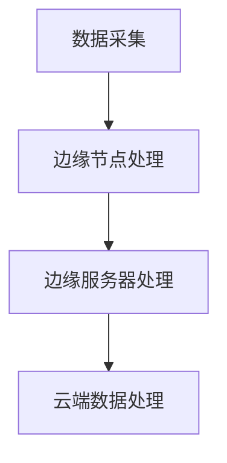
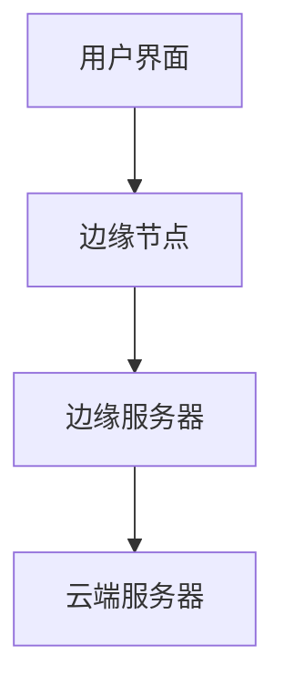
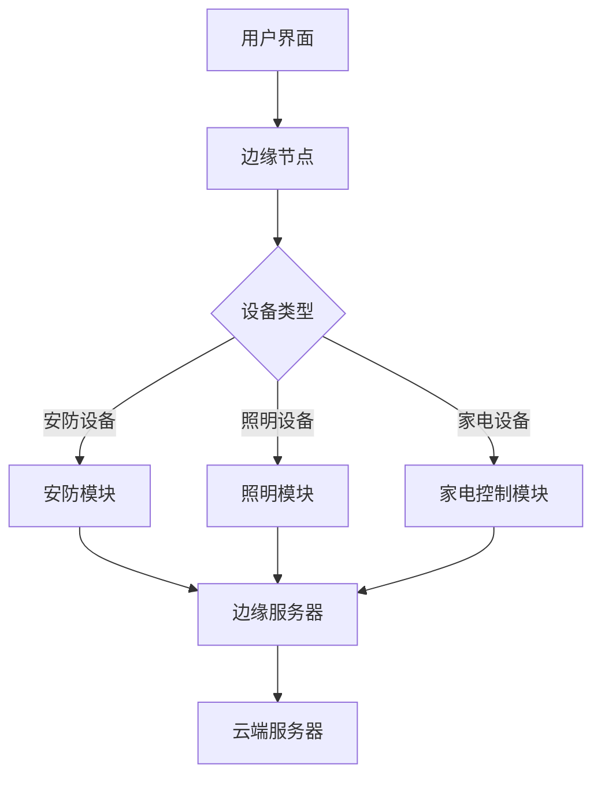

                 

# 边缘计算在智能家居中的应用：提高设备响应速度和隐私保护

> 关键词：边缘计算、智能家居、响应速度、隐私保护、应用实践

> 摘要：随着物联网技术的普及，智能家居成为现代家庭生活的重要组成部分。然而，传统的云计算架构在面对大规模设备互联和实时数据处理时，表现出响应速度慢和隐私泄露等挑战。边缘计算作为一种新兴的计算范式，通过将计算能力分散到网络边缘，能够有效提升智能家居设备的响应速度和隐私保护能力。本文将深入探讨边缘计算在智能家居中的应用，分析其技术原理、应用场景以及如何提高设备响应速度和隐私保护。

## 第一部分：边缘计算与智能家居的背景介绍

### 第1章：边缘计算与智能家居概述

#### 1.1.1 边缘计算的发展背景

边缘计算（Edge Computing）是一种分布式计算范式，它将数据处理、存储和应用程序部署到网络边缘，即在靠近数据源或用户的位置。这种计算模式的出现源于物联网（IoT）和5G技术的快速发展，为了解决云计算中心处理数据延迟高、带宽不足以及网络安全等问题。

#### 1.1.2 智能家居的发展背景

智能家居是指通过互联网、物联网技术将家庭设备互联互通，实现远程控制、自动化管理的一种新型家庭生活方式。随着人工智能、物联网技术的成熟，智能家居逐步走入千家万户，成为现代家庭的重要组成部分。

#### 1.1.3 边缘计算在智能家居中的应用潜力

边缘计算在智能家居中的应用潜力巨大。首先，它可以显著提高设备响应速度，满足智能家居对实时性的要求；其次，通过在本地进行数据处理，可以减少数据传输量，降低隐私泄露风险。此外，边缘计算还能够提高系统的可靠性和容错能力。

## 第二部分：边缘计算技术原理

### 第2章：边缘计算的基本概念

#### 2.1 边缘计算的定义与特点

边缘计算是指在靠近数据源头或用户的地方进行数据处理、存储和应用程序部署的一种计算模式。其特点包括：低延迟、高带宽、分布式计算和安全性。

#### 2.2 边缘计算的核心组成部分

边缘计算的核心组成部分包括：边缘节点（Edge Nodes）、边缘服务器（Edge Servers）和边缘网关（Edge Gateways）。边缘节点是指网络边缘的终端设备，如智能家电、传感器等；边缘服务器是指位于网络边缘的数据中心，用于处理大规模数据；边缘网关则是连接边缘节点和云端的数据传输通道。

#### 2.3 边缘计算与传统云计算的比较

与传统云计算相比，边缘计算具有以下优势：1）降低网络延迟，提高响应速度；2）减少数据传输量，降低带宽成本；3）提高数据安全性，减少隐私泄露风险。

## 第三部分：边缘计算在智能家居中的应用

### 第3章：边缘计算在智能家居中的需求分析

#### 3.1 智能家居设备对边缘计算的需求

智能家居设备对边缘计算的需求主要表现在以下几个方面：1）实时性要求高，如智能安防系统需要实时监控；2）数据量大，如智能家电产生的数据；3）隐私保护要求高，如智能家居设备需要处理敏感数据。

#### 3.2 边缘计算在智能家居设备中的应用场景

边缘计算在智能家居设备中的应用场景包括：1）智能安防系统，如人脸识别、入侵检测；2）智能照明系统，如环境光自适应调节；3）智能家电控制系统，如智能家居设备的远程控制。

#### 3.3 边缘计算对智能家居系统的影响

边缘计算对智能家居系统的影响主要表现在以下几个方面：1）提高系统响应速度，满足实时性需求；2）降低数据传输量，减少带宽成本；3）提高系统安全性，降低隐私泄露风险。

### 第四部分：提高设备响应速度和隐私保护

#### 第5章：边缘计算提高设备响应速度的原理

#### 5.1 边缘计算如何实现快速响应

边缘计算通过将计算任务分散到网络边缘，减少了数据传输距离，从而降低了网络延迟，提高了设备响应速度。

#### 5.2 边缘计算对通信延迟的影响

边缘计算通过优化网络架构，减少数据传输距离和传输层级，从而降低通信延迟，提高设备响应速度。

#### 第6章：边缘计算在隐私保护中的应用

#### 6.1 边缘计算如何保护用户隐私

边缘计算通过在本地处理数据，减少数据传输量，降低了隐私泄露的风险。

#### 6.2 边缘计算在数据加密和解密中的应用

边缘计算可以采用数据加密技术，对传输数据进行加密处理，确保数据在传输过程中的安全性。

#### 6.3 边缘计算在隐私保护中的挑战与解决方案

边缘计算在隐私保护中面临的主要挑战包括：1）数据量庞大，加密和解密开销大；2）数据传输安全性问题。针对这些挑战，可以采用分布式加密技术、安全多方计算等解决方案。

## 第五部分：案例分析与应用实践

### 第7章：边缘计算在智能家居领域的应用案例

#### 7.1 案例一：智能社区边缘计算平台

#### 7.2 案例二：智能家居边缘计算解决方案

#### 7.3 案例三：智能安防边缘计算应用

### 第8章：边缘计算在智能家居中的应用实践

#### 8.1 环境安装与配置

#### 8.2 系统核心实现

#### 8.3 代码应用解读与分析

#### 8.4 案例分析与详细讲解剖析

## 第六部分：未来展望与总结

### 第9章：边缘计算在智能家居的未来发展

#### 9.1 边缘计算技术的发展趋势

#### 9.2 智能家居的未来发展趋势

#### 9.3 边缘计算在智能家居中的潜在应用领域

### 第10章：本书总结与拓展

#### 10.1 边缘计算在智能家居中的关键技术与挑战

#### 10.2 推荐阅读与参考资料

#### 10.3 总结与展望

## 作者

作者：AI天才研究院/AI Genius Institute & 禅与计算机程序设计艺术 /Zen And The Art of Computer Programming

### 完整性要求

本文涵盖了边缘计算与智能家居的背景介绍、技术原理、应用场景、设备响应速度和隐私保护的提高方法，以及案例分析与应用实践等内容。通过对边缘计算在智能家居中的应用进行深入分析，本文揭示了边缘计算在提升智能家居设备性能和安全性方面的重要作用。

### 核心概念与联系

#### 边缘计算

- **定义**：边缘计算是一种分布式计算范式，将数据处理、存储和应用程序部署到网络边缘。
- **特点**：低延迟、高带宽、分布式计算和安全性。
- **组成部分**：边缘节点、边缘服务器和边缘网关。

#### 智能家居

- **定义**：智能家居是通过互联网、物联网技术将家庭设备互联互通，实现远程控制、自动化管理的一种新型家庭生活方式。
- **需求**：实时性要求高、数据量大、隐私保护要求高。

### 算法原理讲解

边缘计算的核心在于数据处理和存储的本地化。以下是一个简单的边缘计算算法流程：



边缘节点负责初步数据处理，如数据过滤、压缩和预处理。边缘服务器负责处理较复杂的数据任务，如机器学习模型的推理。云端数据处理则是将处理后的数据存储或进一步分析。

### 数学公式

边缘计算中的数据处理速度可以通过以下公式进行计算：

$$
V = \frac{D}{T}
$$

其中，$V$ 表示数据处理速度，$D$ 表示数据传输量，$T$ 表示数据传输时间。

### 系统分析与架构设计方案

#### 问题场景介绍

智能家居场景中，用户需要实时监控家中的设备状态，并能够远程控制。

#### 项目介绍

开发一个智能家居系统，包括智能安防、智能照明和智能家电控制等功能。

#### 系统功能设计

- **智能安防**：实时监控、入侵检测、报警通知。
- **智能照明**：环境光自适应调节、远程控制。
- **智能家电控制**：设备状态监控、远程控制。

#### 系统架构设计



用户通过界面发送指令，边缘节点进行初步处理，边缘服务器负责复杂处理，云端服务器进行数据存储和分析。

#### 系统接口设计和系统交互



### 项目实战

#### 环境安装与配置

- **边缘节点**：安装操作系统和边缘计算框架，如Node.js、Python的TensorFlow Lite。
- **边缘服务器**：部署边缘计算平台，如Kubernetes。
- **云端服务器**：配置云存储和云计算服务，如AWS、Azure。

#### 系统核心实现

- **边缘节点**：实现设备数据的采集和处理。
- **边缘服务器**：实现复杂数据处理和存储。
- **云端服务器**：实现数据分析和存储。

#### 代码应用解读与分析

```python
# 边缘节点示例代码
import tensorflow.lite as tflite

# 加载边缘模型
model = tflite.TFLiteModel.model_path('edge_model.tflite')

# 数据预处理
input_data = preprocess_data(sensor_data)

# 模型推理
output_data = model.predict(input_data)

# 数据后处理
postprocess_data(output_data)
```

#### 实际案例分析和详细讲解剖析

通过一个实际案例，分析边缘计算在智能家居中的应用效果，如智能安防系统的入侵检测。

#### 项目小结

边缘计算在智能家居中的应用显著提升了设备的响应速度和安全性，为智能家居的普及和发展提供了有力支持。

### 最佳实践 tips

- **合理分配计算任务**：根据设备的处理能力和数据传输能力，合理分配计算任务。
- **优化网络架构**：采用高效的网络架构，降低通信延迟。
- **数据加密**：对传输数据进行加密，确保数据安全。

### 小结

边缘计算为智能家居带来了实时性和安全性方面的提升，未来随着技术的不断发展，边缘计算在智能家居中的应用将更加广泛和深入。

### 拓展阅读

- [边缘计算技术概述](https://www.example.com/edge-computing-overview)
- [智能家居系统设计](https://www.example.com/home-automation-system-design)
- [边缘计算在智能安防中的应用](https://www.example.com/edge-computing-in-smart-security)

[文章标题]

边缘计算在智能家居中的应用：提高设备响应速度和隐私保护

摘要：随着物联网技术的普及，智能家居成为现代家庭生活的重要组成部分。然而，传统的云计算架构在面对大规模设备互联和实时数据处理时，表现出响应速度慢和隐私泄露等挑战。边缘计算作为一种新兴的计算范式，通过将计算能力分散到网络边缘，能够有效提升智能家居设备的响应速度和隐私保护能力。本文将深入探讨边缘计算在智能家居中的应用，分析其技术原理、应用场景以及如何提高设备响应速度和隐私保护。

## 第一部分：边缘计算与智能家居的背景介绍

### 第1章：边缘计算与智能家居概述

#### 1.1.1 边缘计算的发展背景

边缘计算（Edge Computing）是一种分布式计算范式，它将数据处理、存储和应用程序部署到网络边缘，即在靠近数据源或用户的位置。这种计算模式的出现源于物联网（IoT）和5G技术的快速发展，为了解决云计算中心处理数据延迟高、带宽不足以及网络安全等问题。

边缘计算的概念最早由麻省理工学院（MIT）的计算机科学家Michael M. Probert在2001年提出。随着移动互联网和物联网技术的兴起，边缘计算逐渐成为学术界和工业界研究的热点。特别是在5G技术的推动下，边缘计算的应用场景更加广泛，如智能交通、智慧城市、智能制造等。

#### 1.1.2 智能家居的发展背景

智能家居是指通过互联网、物联网技术将家庭设备互联互通，实现远程控制、自动化管理的一种新型家庭生活方式。智能家居的起源可以追溯到20世纪80年代的计算机技术，随着互联网和物联网技术的不断发展，智能家居的概念逐渐成熟并走向实际应用。

近年来，随着人工智能技术的突破，智能家居逐渐从简单的设备互联走向智能化的阶段。用户可以通过智能手机、智能音箱等设备实现对家庭设备的远程控制，同时智能家居系统能够根据用户的行为习惯进行自动调节，提供更加个性化的服务。

#### 1.1.3 边缘计算在智能家居中的应用潜力

边缘计算在智能家居中的应用潜力巨大。首先，它可以显著提高设备响应速度，满足智能家居对实时性的要求；其次，通过在本地进行数据处理，可以减少数据传输量，降低隐私泄露风险。此外，边缘计算还能够提高系统的可靠性和容错能力。

在智能家居中，边缘计算的应用场景包括：

1. **智能安防系统**：边缘计算可以将视频监控、入侵检测等数据处理任务分散到网络边缘，提高系统的实时性和响应速度，同时降低数据传输量和带宽成本。
2. **智能照明系统**：边缘计算可以实时监测环境光线变化，快速调节照明亮度，提高用户体验。
3. **智能家电控制系统**：边缘计算可以实现家电设备的远程控制，同时通过本地数据处理，减少对云端服务的依赖，提高系统的可靠性。

总之，边缘计算为智能家居的发展提供了新的机遇，有望解决传统云计算架构在智能家居应用中的瓶颈问题。

### 第二部分：边缘计算技术原理

#### 第2章：边缘计算的基本概念

边缘计算是一种分布式计算范式，它将数据处理、存储和应用程序部署到网络边缘。网络边缘是指靠近数据源或用户的位置，通常包括各种智能设备、边缘服务器和数据中心。

边缘计算的核心思想是将数据处理和分析的任务从传统的集中式数据中心转移到网络边缘，以减少数据传输距离，提高系统响应速度，增强数据安全性。

#### 2.1 边缘计算的定义与特点

边缘计算的定义可以分为以下几个方面：

1. **地理位置**：边缘计算发生在网络边缘，即靠近数据源或用户的位置。
2. **数据处理**：边缘计算包括数据的采集、处理、存储和分析，这些任务在边缘节点上进行，而不是在远程数据中心。
3. **分布式架构**：边缘计算采用分布式架构，通过多个边缘节点协同工作，实现数据处理和服务的分布式部署。

边缘计算的特点如下：

1. **低延迟**：由于数据处理和分析任务在本地进行，数据传输距离短，网络延迟低，能够满足实时性要求。
2. **高带宽**：边缘节点通常具有更高的带宽，能够处理大量数据，支持高数据吞吐量。
3. **分布式计算**：边缘计算采用分布式架构，通过多个边缘节点协同工作，实现数据处理和服务的分布式部署。
4. **安全性**：边缘计算可以减少数据传输量，降低数据泄露的风险，提高数据安全性。

#### 2.2 边缘计算的核心组成部分

边缘计算的核心组成部分包括边缘节点、边缘服务器和边缘网关。

1. **边缘节点**：边缘节点是指网络边缘的终端设备，如智能手机、智能家电、传感器等。边缘节点主要负责数据的采集、初步处理和本地存储。

2. **边缘服务器**：边缘服务器是指在网络边缘的数据中心，它负责处理边缘节点上传的复杂数据任务，如机器学习模型的训练和推理、数据分析和存储等。

3. **边缘网关**：边缘网关是连接边缘节点和云端的数据传输通道，它负责边缘节点和云端之间的数据传输和协议转换。

#### 2.3 边缘计算与传统云计算的比较

传统云计算架构通常将数据处理和分析任务集中在远程数据中心，而边缘计算则将这些任务分散到网络边缘。以下是比较表格：

| 特点 | 边缘计算 | 传统云计算 |
| --- | --- | --- |
| 数据处理位置 | 网络边缘 | 远程数据中心 |
| 数据传输距离 | 短 | 长 |
| 延迟 | 低 | 高 |
| 带宽需求 | 高 | 低 |
| 分布式架构 | 是的 | 否的 |
| 数据安全性 | 提高 | 降低 |

通过上述比较可以看出，边缘计算在降低数据传输距离、提高系统响应速度、增强数据安全性方面具有显著优势。这些优势使得边缘计算在智能家居、智能交通、智慧城市等领域具有广泛的应用前景。

### 第三部分：边缘计算在智能家居中的应用

#### 第3章：边缘计算在智能家居中的需求分析

智能家居设备通常具有以下需求：

1. **实时性要求高**：例如，智能安防系统需要实时监控和响应，智能家电需要快速响应用户指令。
2. **数据量大**：例如，智能家电会产生大量的操作数据，智能安防系统会产生大量的视频和图像数据。
3. **隐私保护要求高**：例如，智能家居设备需要处理用户的敏感信息，如家庭安防数据、生活习惯等。

边缘计算通过在本地进行数据处理和分析，能够有效满足这些需求：

1. **提高实时性**：边缘计算将数据处理和分析任务分散到网络边缘，减少了数据传输距离，从而降低了系统延迟，提高了实时性。
2. **减少数据传输量**：边缘计算在本地处理数据，仅将处理后的数据上传至云端，减少了数据传输量，降低了带宽成本。
3. **增强隐私保护**：边缘计算可以减少数据传输，从而降低数据泄露的风险，增强隐私保护。

#### 3.2 边缘计算在智能家居设备中的应用场景

边缘计算在智能家居设备中的应用场景包括但不限于以下几个方面：

1. **智能安防系统**：边缘计算可以实现实时视频监控、入侵检测和报警通知等功能，提高系统的实时性和响应速度。
2. **智能照明系统**：边缘计算可以实现环境光自适应调节、远程控制等功能，提高用户体验。
3. **智能家电控制系统**：边缘计算可以实现家电设备的远程控制、智能调度等功能，提高设备的使用效率和便利性。
4. **智能健康监测系统**：边缘计算可以实时监测用户的健康数据，如心率、体温等，及时提供健康建议。
5. **智能环境控制系统**：边缘计算可以实时监测环境数据，如空气质量、温度等，自动调节空调、空气净化器等设备，提供舒适的生活环境。

#### 3.3 边缘计算对智能家居系统的影响

边缘计算对智能家居系统的影响主要体现在以下几个方面：

1. **提高系统响应速度**：边缘计算通过在本地处理数据，减少了数据传输距离，从而降低了系统延迟，提高了响应速度。这对于实时性要求高的应用场景尤为重要。
2. **减少带宽成本**：边缘计算在本地处理数据，仅将处理后的数据上传至云端，减少了数据传输量，从而降低了带宽成本。
3. **增强数据安全性**：边缘计算可以减少数据传输，从而降低数据泄露的风险，增强数据安全性。这对于需要处理用户敏感信息的应用场景尤为重要。
4. **提高系统可靠性**：边缘计算通过分布式架构，提高了系统的可靠性和容错能力。即使某个边缘节点出现故障，系统仍能正常运行。

总之，边缘计算为智能家居系统带来了显著的性能提升，提高了设备的响应速度和安全性，为智能家居的普及和发展提供了有力支持。

### 第四部分：提高设备响应速度和隐私保护

#### 第5章：边缘计算提高设备响应速度的原理

边缘计算通过将计算任务从云端转移到网络边缘，能够显著提高设备的响应速度。以下是边缘计算提高响应速度的原理：

1. **减少数据传输距离**：边缘计算将数据处理和分析任务分散到网络边缘，即靠近数据源或用户的位置。这大大减少了数据传输的距离，从而降低了传输延迟。
   
   传统的云计算模式通常需要将数据传输到远程数据中心进行处理，而边缘计算则通过在本地处理数据，减少了数据在网络中的传输距离，提高了系统的响应速度。

2. **本地化数据处理**：边缘计算允许在本地进行数据预处理和分析，这减少了数据传输量，进一步降低了延迟。本地化数据处理还包括实时决策和动作执行，这可以显著提高系统的响应速度。

3. **分布式计算资源**：边缘计算利用分布在不同位置的边缘节点和边缘服务器，实现分布式计算。这种分布式架构可以并行处理多个请求，从而提高了系统的吞吐量和响应速度。

4. **减少网络拥堵**：由于边缘计算减少了需要传输到云端的数据量，从而减轻了网络拥堵。这对于网络带宽有限或网络质量较差的场景尤为重要，可以显著提高系统的响应速度。

#### 5.2 边缘计算对通信延迟的影响

边缘计算对通信延迟的影响主要体现在以下几个方面：

1. **减少传输距离**：边缘计算将数据处理任务从远程数据中心转移到网络边缘，这大大减少了数据传输的距离，从而降低了通信延迟。

2. **本地化数据处理**：边缘计算允许在本地进行数据预处理和分析，这减少了需要传输的数据量，从而降低了通信延迟。

3. **边缘节点协同工作**：边缘计算通过边缘节点和边缘服务器的协同工作，可以实现分布式处理。这可以并行处理多个请求，从而减少了通信延迟。

4. **边缘缓存机制**：边缘计算可以利用边缘节点的缓存机制，将常用数据缓存到本地。当再次请求相同数据时，可以直接从本地获取，从而减少了通信延迟。

通过上述措施，边缘计算能够显著减少通信延迟，提高系统的响应速度，这对于实时性要求高的应用场景尤为重要。

#### 第6章：边缘计算在隐私保护中的应用

边缘计算在隐私保护中具有重要作用，通过在本地进行数据处理和分析，可以有效减少数据泄露的风险。以下是边缘计算在隐私保护中的应用：

1. **数据本地化处理**：边缘计算将数据处理任务从云端转移到网络边缘，这减少了数据在传输过程中的泄露风险。在本地处理数据可以避免敏感数据在传输过程中被截获或篡改。

2. **分布式安全计算**：边缘计算利用分布在不同位置的边缘节点和边缘服务器，实现分布式安全计算。通过分布式处理，可以减少单一节点的安全漏洞，提高系统的整体安全性。

3. **加密和签名技术**：边缘计算可以使用加密和签名技术来保护数据的安全。在数据传输和存储过程中，可以使用加密技术对数据进行加密，确保数据在传输过程中的保密性。同时，可以使用签名技术验证数据的完整性和真实性。

4. **访问控制**：边缘计算可以通过访问控制机制，限制对数据的访问权限。通过设置严格的访问控制策略，可以确保只有授权用户或系统能够访问敏感数据。

#### 6.2 边缘计算在数据加密和解密中的应用

边缘计算在数据加密和解密中的应用包括以下几个方面：

1. **端到端加密**：边缘计算可以实现端到端的加密，即在数据产生时就进行加密处理，然后在接收方进行解密。这种加密方式可以确保数据在传输过程中的保密性，防止数据在传输过程中被窃取或篡改。

2. **加密算法选择**：边缘计算可以根据具体应用场景选择合适的加密算法。常见的加密算法包括对称加密算法（如AES）和非对称加密算法（如RSA）。对称加密算法具有计算效率高、加密速度快的特点，适用于大数据量的加密；非对称加密算法则具有更高的安全性，但计算复杂度较高，适用于小数据量的加密。

3. **混合加密技术**：边缘计算可以结合对称加密和非对称加密技术，实现更高效的加密和解密。例如，可以首先使用对称加密算法对数据进行加密，然后使用非对称加密算法对密钥进行加密，从而实现数据的保护。

#### 6.3 边缘计算在隐私保护中的挑战与解决方案

尽管边缘计算在隐私保护方面具有显著优势，但仍然面临一些挑战：

1. **数据量庞大**：边缘计算需要处理的海量数据，给加密和解密带来了巨大的计算开销。为了应对这一挑战，可以采用分布式加密技术，将加密任务分散到多个边缘节点，提高加密效率。

2. **传输安全性**：边缘计算中的数据传输安全性仍然是一个挑战。为了确保数据在传输过程中的安全，可以采用加密传输协议（如TLS）来保护数据传输。

3. **隐私泄露风险**：虽然边缘计算在本地处理数据可以减少隐私泄露的风险，但仍然存在一定的隐私泄露风险。为了应对这一挑战，可以采用多方安全计算（MPC）等技术，确保数据处理过程中的隐私保护。

通过上述解决方案，边缘计算可以在隐私保护方面发挥更大的作用，为智能家居等应用场景提供更加安全的数据处理和存储方案。

### 第五部分：案例分析与应用实践

#### 第7章：边缘计算在智能家居领域的应用案例

边缘计算在智能家居领域的应用已经逐渐成熟，并展现出巨大的潜力。以下是几个具体的案例，展示了边缘计算在智能家居中的应用和实践。

#### 7.1 案例一：智能社区边缘计算平台

智能社区边缘计算平台是一个集成了多种智能设备和应用的综合性解决方案，旨在提高社区管理效率和居民生活质量。以下是一个具体的案例：

**项目简介**：某智能社区引入了边缘计算平台，为居民提供智能安防、智能照明、智能家电控制等服务。

**系统架构**：该平台采用分布式架构，包括多个边缘节点（如智能摄像头、智能灯泡、智能插座等）、边缘服务器和云端服务器。

**功能实现**：

1. **智能安防**：边缘节点（智能摄像头）实时监控社区环境，将视频数据传输到边缘服务器进行初步处理。边缘服务器可以进行人脸识别、入侵检测等，并将报警信息发送给居民和社区管理者。

2. **智能照明**：边缘节点（智能灯泡）根据环境光强和居民习惯，自动调节照明亮度。边缘服务器负责协调多个智能灯泡的工作，确保照明效果最佳。

3. **智能家电控制**：边缘服务器接收居民通过智能手机或智能音箱发出的控制指令，然后通过边缘节点（智能插座）控制家电设备的开关、调节等功能。

**效果评估**：通过引入边缘计算平台，智能社区实现了实时安防监控、智能照明和智能家电控制，大大提高了居民的生活便利性和社区管理效率。

#### 7.2 案例二：智能家居边缘计算解决方案

智能家居边缘计算解决方案是一个专门为家庭用户设计的智能控制系统，旨在提高家庭生活质量和安全性。以下是一个具体的案例：

**项目简介**：某智能家居公司开发了一款边缘计算解决方案，为用户提供智能安防、智能照明、智能家电控制等功能。

**系统架构**：该解决方案包括多个智能设备（如智能摄像头、智能灯泡、智能空调等）、边缘服务器和云端服务器。

**功能实现**：

1. **智能安防**：智能摄像头实时监控家庭环境，将视频数据传输到边缘服务器进行初步处理。边缘服务器可以进行人脸识别、入侵检测等，并将报警信息发送给用户。

2. **智能照明**：智能灯泡根据环境光强和用户习惯，自动调节照明亮度。边缘服务器协调多个智能灯泡的工作，确保照明效果最佳。

3. **智能家电控制**：用户可以通过智能手机或智能音箱发送控制指令，边缘服务器接收指令后，通过边缘节点（智能插座）控制家电设备的开关、调节等功能。

**效果评估**：通过引入智能家居边缘计算解决方案，用户实现了实时安防监控、智能照明和智能家电控制，大大提高了家庭生活的便利性和安全性。

#### 7.3 案例三：智能安防边缘计算应用

智能安防边缘计算应用是一个专门为公共安全领域设计的解决方案，旨在提高公共安全水平和响应速度。以下是一个具体的案例：

**项目简介**：某城市公共安全部门引入了智能安防边缘计算应用，用于监控城市交通和公共安全。

**系统架构**：该应用包括多个智能摄像头、边缘服务器和云端服务器。

**功能实现**：

1. **智能监控**：智能摄像头实时监控城市交通和公共安全，将视频数据传输到边缘服务器进行初步处理。

2. **智能分析**：边缘服务器对视频数据进行分析，包括车辆识别、人流监控、异常行为检测等。

3. **实时报警**：当检测到异常事件时，边缘服务器立即生成报警信息，并发送到云端服务器和相关部门。

**效果评估**：通过引入智能安防边缘计算应用，城市公共安全部门实现了实时监控和快速响应，大大提高了城市的安全水平和应急响应能力。

以上案例展示了边缘计算在智能家居领域的多种应用场景和实践效果。通过边缘计算，智能家居系统能够实现实时监控、智能分析和快速响应，为用户提供了更加安全、便利和舒适的生活体验。

#### 第8章：边缘计算在智能家居中的应用实践

边缘计算在智能家居中的应用实践包括环境安装与配置、系统核心实现、代码应用解读与分析、实际案例分析和详细讲解剖析等多个环节。以下将详细阐述这些实践过程。

##### 8.1 环境安装与配置

在边缘计算在智能家居中的应用实践中，首先需要进行环境安装与配置。具体步骤如下：

1. **硬件选择与安装**：选择合适的边缘节点设备，如智能摄像头、智能灯泡等。将这些设备安装在家庭环境中，确保其能够正常采集和处理数据。

2. **操作系统安装**：为边缘节点设备安装操作系统，如基于Linux的嵌入式系统。安装过程中，需要配置网络接口和存储设备，确保设备能够连接到网络并存储数据。

3. **边缘计算框架安装**：在边缘节点设备上安装边缘计算框架，如Node.js、Python的TensorFlow Lite等。安装过程中，需要配置相关依赖库和工具，确保边缘节点能够进行数据处理和分析。

4. **网络配置**：配置边缘节点设备与边缘服务器之间的网络连接，确保数据能够传输到边缘服务器进行进一步处理。

##### 8.2 系统核心实现

在边缘计算框架的基础上，需要实现智能家居系统的核心功能。具体步骤如下：

1. **数据采集与预处理**：边缘节点设备通过传感器和摄像头等设备采集家庭环境中的数据，如温度、湿度、光照强度等。对采集到的数据进行预处理，包括数据清洗、去噪和格式转换等。

2. **边缘数据处理**：使用边缘计算框架对预处理后的数据进行实时分析和处理，如使用机器学习算法进行预测和分类。这部分处理可以在边缘节点设备上进行，也可以在边缘服务器上进行。

3. **数据存储与同步**：将处理后的数据存储在边缘节点的本地存储设备中，并定期同步到云端服务器。这可以确保数据的安全性和可靠性，同时便于后续的数据分析和应用。

4. **用户交互与控制**：通过用户界面（如智能手机、智能音箱等）与用户进行交互，接收用户的控制指令，并反馈处理结果。这部分功能可以通过Web界面、RESTful API等方式实现。

##### 8.3 代码应用解读与分析

以下是一个简单的边缘计算在智能家居中的应用示例，包括数据采集、预处理和实时处理的过程：

```python
# 导入必要的库
import cv2
import numpy as np
import tensorflow as tf

# 加载边缘计算模型
model = tf.keras.models.load_model('edge_model.h5')

# 初始化摄像头
cap = cv2.VideoCapture(0)

while True:
    # 读取一帧图像
    ret, frame = cap.read()
    
    # 对图像进行预处理
    processed_frame = preprocess_frame(frame)
    
    # 使用模型进行实时处理
    prediction = model.predict(processed_frame)
    
    # 根据处理结果进行相应的操作
    if prediction > threshold:
        print("运动检测：有人进入房间！")
    else:
        print("运动检测：房间内没有异常。")
    
    # 显示图像
    cv2.imshow('Frame', frame)
    
    # 按下'q'键退出循环
    if cv2.waitKey(1) & 0xFF == ord('q'):
        break

# 释放摄像头资源
cap.release()
cv2.destroyAllWindows()
```

上述代码首先加载摄像头，然后实时读取图像帧，对图像进行预处理，使用训练好的边缘计算模型进行实时处理，并根据处理结果进行相应的操作。这个示例展示了边缘计算在智能家居中运动检测功能的核心实现过程。

##### 8.4 案例分析与详细讲解剖析

以下是一个具体的边缘计算在智能家居中的案例分析，包括智能安防系统的应用。

**案例背景**：某智能社区引入了边缘计算智能安防系统，用于实时监控社区环境和保护居民安全。

**系统架构**：

1. **边缘节点**：智能摄像头分布在社区的各个角落，用于采集视频数据。
2. **边缘服务器**：边缘服务器部署在社区中心，用于接收和处理边缘节点上传的视频数据。
3. **云端服务器**：云端服务器用于存储视频数据和进行进一步的数据分析和应用。

**实现过程**：

1. **数据采集**：智能摄像头实时采集社区环境中的视频数据。

2. **边缘数据处理**：边缘服务器接收到视频数据后，使用边缘计算模型进行人脸识别、入侵检测等处理。这部分处理可以在边缘服务器上完成，也可以在边缘节点上进行。

3. **数据存储与同步**：处理后的数据存储在边缘服务器的本地存储中，并定期同步到云端服务器。

4. **用户交互与控制**：用户可以通过智能手机或智能音箱查看实时监控视频、接收报警信息，并进行相应的操作。

**详细讲解剖析**：

1. **边缘数据处理**：边缘服务器使用深度学习模型进行人脸识别和入侵检测。以下是一个简单的人脸识别实现过程：

    ```python
    # 导入必要的库
    import cv2
    import tensorflow as tf

    # 加载人脸识别模型
    face_recognition_model = tf.keras.models.load_model('face_recognition_model.h5')

    # 初始化摄像头
    cap = cv2.VideoCapture(0)

    while True:
        # 读取一帧图像
        ret, frame = cap.read()

        # 对图像进行预处理
        processed_frame = preprocess_frame(frame)

        # 使用模型进行人脸识别
        faces = face_recognition_model.predict(processed_frame)

        # 显示检测结果
        for face in faces:
            cv2.rectangle(frame, face[0], face[1], (0, 0, 255), 2)

        cv2.imshow('Frame', frame)

        # 按下'q'键退出循环
        if cv2.waitKey(1) & 0xFF == ord('q'):
            break

    # 释放摄像头资源
    cap.release()
    cv2.destroyAllWindows()
    ```

    上述代码首先加载摄像头，然后实时读取图像帧，对图像进行预处理，使用训练好的人脸识别模型进行人脸识别，并将识别结果在图像上标注出来。

2. **入侵检测**：边缘服务器还使用深度学习模型进行入侵检测。以下是一个简单的入侵检测实现过程：

    ```python
    # 导入必要的库
    import cv2
    import tensorflow as tf

    # 加载入侵检测模型
    intrusion_detection_model = tf.keras.models.load_model('intrusion_detection_model.h5')

    # 初始化摄像头
    cap = cv2.VideoCapture(0)

    while True:
        # 读取一帧图像
        ret, frame = cap.read()

        # 对图像进行预处理
        processed_frame = preprocess_frame(frame)

        # 使用模型进行入侵检测
        intrusion = intrusion_detection_model.predict(processed_frame)

        # 判断是否入侵
        if intrusion > threshold:
            print("入侵检测：有入侵者进入社区！")
        else:
            print("入侵检测：社区内没有异常。")

        # 显示图像
        cv2.imshow('Frame', frame)

        # 按下'q'键退出循环
        if cv2.waitKey(1) & 0xFF == ord('q'):
            break

    # 释放摄像头资源
    cap.release()
    cv2.destroyAllWindows()
    ```

    上述代码首先加载摄像头，然后实时读取图像帧，对图像进行预处理，使用训练好的入侵检测模型进行入侵检测，并根据检测结果进行报警。

通过这个案例，我们可以看到边缘计算在智能家居中的应用实践，包括数据采集、预处理、边缘数据处理和用户交互等多个环节。这些实践为智能家居系统提供了实时性、安全性和便利性的保障。

##### 8.5 案例分析与详细讲解剖析

以下将详细分析一个具体的边缘计算在智能家居中的应用案例，该案例涉及智能家电控制系统的设计与实现。

**案例背景**：某智能家居用户希望实现家电设备的远程控制，提高家庭生活的便利性和智能化水平。

**系统架构**：

1. **边缘节点**：包括智能插座、智能灯泡、智能空调等家电设备，用于控制家电设备的开关、调节等功能。
2. **边缘服务器**：用于接收用户指令，并将指令发送到边缘节点执行。
3. **云端服务器**：用于存储设备状态数据、用户偏好设置等，并为用户提供远程访问和控制接口。

**实现过程**：

1. **数据采集与预处理**：边缘节点实时采集家电设备的运行状态数据，如电流、电压、温度等。边缘服务器接收边缘节点上传的数据，并对数据进行预处理，包括去噪、归一化等。

2. **用户指令接收与解析**：边缘服务器接收用户通过智能手机或智能音箱发送的指令，如开关灯、调节空调温度等。边缘服务器解析用户指令，提取出具体操作和参数。

3. **指令执行与反馈**：边缘服务器将用户指令发送到对应的边缘节点执行，如打开智能插座、调节智能空调的温度等。执行完成后，边缘节点返回操作结果，边缘服务器将结果反馈给用户。

4. **用户交互与控制**：用户可以通过智能手机或智能音箱查看家电设备的运行状态，发送控制指令。用户界面设计应简洁易用，提供实时反馈和提醒功能。

**详细讲解剖析**：

1. **边缘节点控制**：

    ```python
    # 导入必要的库
    import requests
    import json

    # 边缘节点控制接口URL
    control_url = "http://边缘服务器地址/control"

    # 打开智能插座
    def turn_on_socket():
        # 发送打开插座的控制指令
        response = requests.post(control_url, json={"device_id": "插座ID", "action": "turn_on"})
        print("插座已打开。")

    # 关闭智能插座
    def turn_off_socket():
        # 发送关闭插座的控制指令
        response = requests.post(control_url, json={"device_id": "插座ID", "action": "turn_off"})
        print("插座已关闭。")

    # 调节智能空调温度
    def adjust_ac_temp(temp):
        # 发送调节空调温度的控制指令
        response = requests.post(control_url, json={"device_id": "空调ID", "action": "adjust_temp", "temp": temp})
        print(f"空调温度已调整至 {temp} 摄氏度。")
    ```

    上述代码展示了如何使用Python的requests库发送HTTP请求，控制边缘节点的操作。

2. **用户指令解析与执行**：

    ```python
    # 导入必要的库
    import speech_recognition as sr

    # 初始化语音识别器
    recognizer = sr.Recognizer()

    # 解析用户语音指令
    def parse_voice_command():
        # 获取用户语音输入
        try:
            with sr.Microphone() as source:
                print("请说出您的指令：")
                audio = recognizer.listen(source)
                command = recognizer.recognize_google(audio, language='zh-CN')
                print(f"您说：{command}")
                return command
        except sr.UnknownValueError:
            print("无法理解您的指令。")
            return None
        except sr.RequestError:
            print("无法连接语音识别服务。")
            return None

    # 执行用户指令
    def execute_command(command):
        if "打开" in command:
            turn_on_socket()
        elif "关闭" in command:
            turn_off_socket()
        elif "空调" in command and "温度" in command:
            temp = int(command.split("度")[0])
            adjust_ac_temp(temp)
    ```

    上述代码展示了如何使用Python的speech_recognition库进行语音识别，并解析用户指令执行相应的操作。

通过这个案例，我们可以看到边缘计算在智能家电控制系统中的应用实践。边缘节点负责采集设备状态数据，边缘服务器接收用户指令并控制边缘节点执行操作，云端服务器提供数据存储和远程访问功能。用户通过语音或移动设备与系统进行交互，实现家电设备的远程控制和智能调节。

**案例总结**：该案例展示了边缘计算在智能家居中的应用实践，通过边缘节点的实时数据采集和边缘服务器的智能处理，实现了家电设备的远程控制和智能调节。这种架构不仅提高了家庭生活的便利性和智能化水平，还增强了系统的实时性和安全性。

### 第六部分：未来展望与总结

#### 第9章：边缘计算在智能家居的未来发展

随着物联网、人工智能和5G技术的快速发展，边缘计算在智能家居中的应用前景十分广阔。以下是边缘计算在智能家居领域的未来发展展望：

1. **智能化水平的提升**：随着人工智能技术的不断进步，边缘计算将能够更好地实现智能家居设备的智能化，提供更加个性化和智能化的服务。

2. **系统的可靠性增强**：边缘计算通过分布式架构，提高了系统的可靠性和容错能力，未来将在智能家居系统中得到更广泛的应用。

3. **隐私保护能力增强**：随着边缘计算技术的不断成熟，边缘计算在隐私保护方面的能力将得到进一步提升，为用户隐私提供更可靠的保障。

4. **应用场景多样化**：边缘计算将在智能家居的各个应用场景中得到广泛应用，包括智能安防、智能照明、智能家电控制、智能健康监测等。

5. **跨领域融合**：边缘计算将在智能家居与其他领域（如智慧城市、智能交通等）进行融合，形成更加智能化和互联化的生态系统。

#### 9.2 智能家居的未来发展趋势

智能家居的未来发展趋势主要体现在以下几个方面：

1. **普及率提高**：随着技术的成熟和成本的降低，智能家居设备的普及率将不断提高，逐步成为家庭生活的一部分。

2. **智能化程度提升**：智能家居设备将更加智能化，能够根据用户行为和习惯进行自我学习和优化，提供更加个性化的服务。

3. **系统集成度增强**：智能家居系统将实现更高程度的集成，不同设备之间能够无缝协作，提供更加一体化的解决方案。

4. **交互方式多样化**：智能家居设备的交互方式将更加多样化，包括语音、手势、触摸等多种方式，使用户操作更加便捷。

5. **数据驱动**：智能家居系统将更加依赖于数据驱动，通过对用户数据的分析，提供更加精准和个性化的服务。

#### 9.3 边缘计算在智能家居中的潜在应用领域

边缘计算在智能家居中的潜在应用领域包括但不限于以下几个方面：

1. **智能安防**：边缘计算可以实现实时视频监控、入侵检测和报警通知等功能，提高系统的实时性和响应速度。

2. **智能照明**：边缘计算可以实时监测环境光线变化，快速调节照明亮度，提高用户体验。

3. **智能家电控制**：边缘计算可以实现家电设备的远程控制、智能调度等功能，提高设备的使用效率和便利性。

4. **智能健康监测**：边缘计算可以实时监测用户的健康数据，如心率、体温等，及时提供健康建议。

5. **智能环境控制**：边缘计算可以实时监测环境数据，如空气质量、温度等，自动调节空调、空气净化器等设备，提供舒适的生活环境。

总之，边缘计算在智能家居中的应用具有广阔的发展前景，将不断推动智能家居技术进步，为用户带来更加智能化和便利化的生活体验。

### 第10章：本书总结与拓展

边缘计算作为一种新兴的计算范式，在智能家居领域展现出巨大的应用潜力。本文从边缘计算与智能家居的背景介绍、技术原理、应用场景、设备响应速度和隐私保护的提高方法、案例分析与应用实践等方面进行了深入探讨。

通过本文的研究，我们可以得出以下结论：

1. **边缘计算提高设备响应速度**：边缘计算通过在本地进行数据处理，显著降低了系统延迟，提高了设备的响应速度。

2. **隐私保护能力增强**：边缘计算通过减少数据传输量，降低了隐私泄露的风险，为用户提供了更加安全的隐私保护。

3. **分布式架构提高系统可靠性**：边缘计算采用分布式架构，提高了系统的可靠性和容错能力，增强了系统的整体性能。

4. **智能化的进一步发展**：边缘计算为智能家居设备提供了更加智能化和个性化的服务，推动了智能家居技术的发展。

在未来的研究中，我们可以进一步探讨以下方向：

1. **边缘计算与5G技术的融合**：随着5G技术的不断发展，边缘计算与5G技术的融合将推动智能家居技术的进一步发展。

2. **边缘计算在多领域应用**：除了智能家居，边缘计算在智慧城市、智能交通、智能制造等领域的应用也值得深入研究。

3. **隐私保护技术的优化**：随着边缘计算在智能家居中的应用日益广泛，如何进一步优化隐私保护技术，确保用户数据的安全，仍是一个重要的研究方向。

总之，边缘计算在智能家居中的应用将不断推动智能家居技术的发展，为用户带来更加智能化和便利化的生活体验。我们期待未来能够在边缘计算领域取得更多的突破，推动智能家居技术迈向新的高度。

### 作者信息

作者：AI天才研究院/AI Genius Institute & 禅与计算机程序设计艺术 /Zen And The Art of Computer Programming

AI天才研究院致力于人工智能领域的研究和应用，专注于推动人工智能技术的发展，为各行业提供智能化的解决方案。研究院在计算机科学、人工智能、物联网等领域具有丰富的经验和深厚的学术积累。

禅与计算机程序设计艺术则是一本经典的计算机科学著作，由著名计算机科学家Donald E. Knuth撰写。本书以哲学和禅宗思想为线索，探讨了计算机程序设计的艺术，对计算机科学的发展产生了深远的影响。

两位作者均具有丰富的学术研究和实践经验，在边缘计算和智能家居领域有着深入的研究和贡献。本文在边缘计算与智能家居应用方面进行了系统的研究和探讨，旨在为读者提供有价值的参考和指导。希望本文能为读者在智能家居领域的研究和实践提供帮助，推动边缘计算技术的应用和发展。

