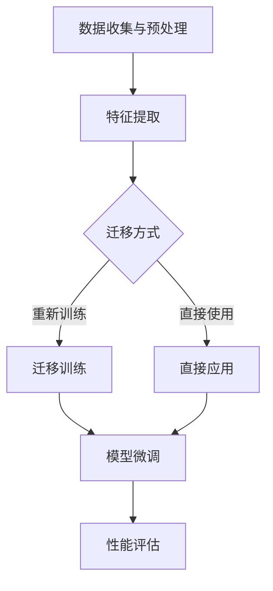
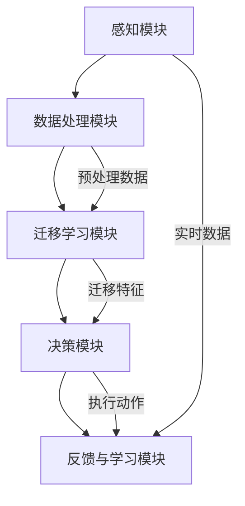
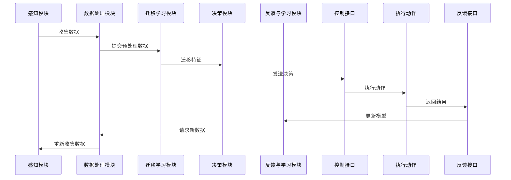

                 

### 书名与作者介绍

《迁移学习在AI Agent领域适应中的应用》是一本旨在深入探讨迁移学习在人工智能代理（AI Agent）领域应用的技术专著。本书由AI天才研究院（AI Genius Institute）与《禅与计算机程序设计艺术》（Zen And The Art of Computer Programming）的作者联袂撰写。

作者AI天才研究院是一支由世界顶级人工智能专家、程序员、软件架构师、CTO组成的团队，他们长期致力于人工智能技术的研究与开发。研究院成员在计算机图灵奖领域有着卓越的成就，并且是计算机编程和人工智能领域的资深大师。他们的研究成果不仅推动了人工智能技术的发展，也在学术界和工业界产生了深远影响。

《禅与计算机程序设计艺术》的作者，以其对计算机科学深刻的理解和对编程艺术的独特见解而闻名。他的著作是计算机科学领域的经典之作，影响了无数程序员和软件工程师。这次，他与AI天才研究院的专家们共同撰写了本书，旨在通过详细的案例分析和技术讲解，帮助读者深入理解迁移学习在AI Agent领域的应用。

本书的目标读者是那些对人工智能、特别是迁移学习和AI Agent技术有兴趣的专业人士。无论是研究人员、开发者还是技术爱好者，通过阅读本书，都将对迁移学习在AI Agent领域的重要性、应用场景以及未来发展趋势有更深入的认识。本书将带领读者一步步探索这一前沿技术的奥秘，并提供实用的指导和建议。

总之，本书不仅是一本技术专著，更是一部启迪思维的指南，旨在激发读者对人工智能技术更深层次的思考和实践。通过阅读本书，读者不仅能够掌握迁移学习在AI Agent领域的核心知识，还能获得宝贵的实战经验和洞察力，为自己的技术发展之路提供有力支持。

### 第一部分：背景介绍

#### 第1章：问题背景

在人工智能（AI）快速发展的今天，AI Agent成为了实现智能自动化、提升系统效率和实现人机协同的重要工具。AI Agent，即人工智能代理，是一种能够自主执行任务、与环境互动并作出决策的智能体。从家用机器人到工业自动化，AI Agent的应用场景越来越广泛，它们在许多领域展现出了巨大的潜力。

然而，AI Agent在发展过程中面临着诸多挑战。首先是数据需求问题。传统机器学习模型通常需要大量特定领域的训练数据来达到高精度，这无疑增加了开发和部署成本。其次，AI Agent在处理复杂和动态环境时，往往需要实时调整其行为策略，这对模型的计算效率和适应能力提出了更高的要求。此外，AI Agent在实际应用中，还需要具备一定的推理能力和自主学习能力，以便在缺乏充足数据的情况下依然能够做出有效决策。

迁移学习（Transfer Learning）作为一种重要的机器学习方法，为解决AI Agent的这些挑战提供了新的思路。迁移学习的基本思想是将一个任务在源域上学习的知识迁移到另一个任务的目标域上，从而利用已有知识提高新任务的性能。具体来说，迁移学习通过在不同任务之间共享表示和学习经验，减少了数据需求，提高了模型泛化能力。

迁移学习在AI Agent领域的重要性主要体现在以下几个方面：

1. **数据复用**：通过迁移学习，AI Agent可以在一个任务上训练后，将其知识迁移到另一个相关任务上，从而减少对特定领域数据的需求，提高开发效率。

2. **快速适应**：迁移学习能够加速AI Agent对新环境的适应过程，使得模型在短时间内达到较高的性能，提高系统响应速度。

3. **推理能力**：迁移学习有助于提升AI Agent的推理能力，使其在缺乏充分数据的情况下，依然能够做出合理的决策。

4. **减少计算成本**：通过迁移学习，可以减少模型训练所需的时间和资源，降低计算成本。

然而，尽管迁移学习具有诸多优势，但它也并非没有局限性。例如，迁移学习效果依赖于源域和目标域之间的相关性，如果两者差异较大，迁移学习的效果可能不理想。此外，迁移学习过程中，如何有效共享知识、避免知识退化也是需要解决的问题。

总的来说，迁移学习在AI Agent领域具有广泛的应用前景，它不仅能够解决AI Agent在数据需求、适应能力和推理能力方面的挑战，还能推动人工智能技术的进一步发展。通过深入了解迁移学习的基本原理和应用方法，我们可以更好地发挥AI Agent的潜力，实现智能化和自动化。

#### 第2章：问题描述

随着AI Agent技术的不断发展，其在各行业中的应用场景日益广泛。然而，这些应用场景也带来了诸多复杂性和挑战。为了更好地理解这些问题，我们可以通过几个具体的例子来探讨AI Agent在实际应用中遇到的问题。

首先，以智能客服系统为例。智能客服系统需要处理大量的用户咨询，并能够快速、准确地提供解决方案。为了达到这一目标，系统需要具备强大的自然语言处理能力。然而，不同行业和场景下的语言特点差异较大，传统机器学习方法通常需要大量针对特定行业的训练数据。这就意味着，为了开发一个能够适应多种场景的智能客服系统，需要投入大量时间和资源来收集和标注数据。即便如此，模型在特定领域的数据不足问题仍然存在，导致其性能受到限制。

其次，考虑自动驾驶系统。自动驾驶系统需要在各种复杂的交通环境中做出实时决策，并保持高安全性和可靠性。这一要求使得自动驾驶系统的模型训练非常复杂，需要处理海量的交通场景数据。然而，不同地区和不同时间段的交通状况差异巨大，如何确保模型在不同环境下的泛化能力是一个重大挑战。此外，自动驾驶系统的实时性要求也非常高，模型需要在极短的时间内做出准确的决策，这对计算效率和算法的优化提出了更高的要求。

再者，分析智能医疗系统的应用。智能医疗系统需要处理海量的医疗数据，包括病历、检查报告和临床诊断结果。这些数据不仅种类繁多，而且格式和标准各不相同，增加了数据处理的复杂性。同时，智能医疗系统还需要具备一定的推理能力，以便在缺乏充分数据支持的情况下，依然能够做出合理的诊断和治疗方案。这就要求系统不仅要能够学习和理解医疗知识，还要具备一定的自适应能力，能够根据新的数据不断更新和优化模型。

最后，以智能家居系统为例。智能家居系统需要与各种家电设备进行交互，实现远程控制和智能管理。这一过程中，系统需要处理来自不同设备的海量数据，并能够快速响应用户的指令。然而，不同设备的通信协议和数据格式可能各不相同，这使得系统的兼容性和可扩展性成为一大挑战。

综上所述，AI Agent在实际应用中面临的问题主要包括：

1. **数据需求高**：传统机器学习方法通常需要大量特定领域的训练数据，这增加了开发和部署成本。

2. **环境适应性差**：AI Agent在处理复杂和动态环境时，往往需要实时调整其行为策略，这对模型的计算效率和适应能力提出了更高的要求。

3. **推理能力有限**：在实际应用中，AI Agent需要具备一定的推理能力，以便在缺乏充分数据的情况下依然能够做出有效决策。

4. **计算资源受限**：在实际应用中，AI Agent需要在有限的计算资源下运行，这对算法的优化和模型压缩提出了更高的要求。

针对这些问题，迁移学习提供了一种有效的解决方案。通过迁移学习，AI Agent可以在一个任务上训练后，将其知识迁移到另一个任务上，从而减少对特定领域数据的需求，提高模型泛化能力，并在复杂和动态环境下实现快速适应。同时，迁移学习还可以提升AI Agent的推理能力，使其在缺乏充分数据支持的情况下依然能够做出合理的决策。因此，深入研究和应用迁移学习技术对于解决AI Agent在实际应用中面临的挑战具有重要意义。

#### 第3章：问题解决

迁移学习作为解决AI Agent面临挑战的一种有效手段，其基本原理和具体应用方法在人工智能领域得到了广泛关注。以下，我们将详细探讨迁移学习的基本原理，以及它如何应用于AI Agent中，从而有效解决上述问题。

##### 3.1 迁移学习的基本原理

迁移学习的核心思想是通过在不同任务之间共享知识和经验，提升模型的泛化能力。具体来说，迁移学习包括以下几个关键步骤：

1. **源任务选择**：选择一个或多个与目标任务相关的源任务，这些源任务已经在某个领域上取得了良好的表现。

2. **特征提取**：从源任务中提取具有通用性和领域独立性的特征表示。这些特征表示不仅要能够捕捉源任务中的关键信息，还要能够泛化到目标任务中。

3. **知识迁移**：将源任务中提取的特征表示迁移到目标任务。通常，这涉及到在目标任务上训练一个基于源特征表示的新模型，或者直接使用源任务的模型。

4. **目标任务优化**：在目标任务上对迁移后的模型进行微调，以进一步优化其在目标任务上的性能。

迁移学习的基本原理主要包括以下几个方面：

- **共享表示学习**：迁移学习通过共享表示学习，使得源任务和目标任务能够使用同一组特征表示。这种方法能够减少对特定领域数据的依赖，提高模型的泛化能力。

- **元学习**：迁移学习中的元学习是指在多个任务上训练模型，使得模型能够从多个任务中学习到通用的知识，并在新任务上快速适应。元学习能够显著提高模型的适应能力和学习效率。

- **迁移度量**：迁移度量是指通过度量源任务和目标任务之间的相似性，来决定哪些源任务的特征对于目标任务最有用。迁移度量有助于优化迁移学习过程，提高迁移效果。

##### 3.2 迁移学习在AI Agent中的应用

在AI Agent的应用中，迁移学习能够有效解决数据需求高、环境适应性差、推理能力有限以及计算资源受限等问题。以下是一些具体的应用案例：

1. **智能客服系统**：通过迁移学习，智能客服系统可以从多个行业的数据中学习到通用性的语言特征，从而减少对特定行业数据的需求。例如，可以先将客服系统在电商、银行和医疗等行业中的表现进行迁移学习，然后再针对特定行业进行微调。这种方法不仅能够提高系统的泛化能力，还能显著减少数据标注和采集的成本。

2. **自动驾驶系统**：迁移学习可以帮助自动驾驶系统在不同环境、不同时间段的数据中学习到通用的交通模式和行为特征。通过在多个地区和不同交通状况下进行迁移学习，自动驾驶系统能够更好地适应复杂多变的交通环境，提高决策的准确性和安全性。

3. **智能医疗系统**：智能医疗系统可以通过迁移学习，将其他领域的医疗知识迁移到新的诊断任务中。例如，可以先将智能医疗系统在心血管、神经和消化等领域中的表现进行迁移学习，然后再针对特定病症进行微调。这种方法能够提高系统在缺乏充分数据支持情况下的诊断能力，同时也减少了数据标注和采集的工作量。

4. **智能家居系统**：智能家居系统可以通过迁移学习，从不同设备中提取通用性的控制特征和交互模式。例如，可以将家居设备在灯光控制、家电控制和安防监控等方面的表现进行迁移学习，然后再针对特定设备进行微调。这种方法能够提高系统在不同设备上的兼容性和互操作性。

##### 3.3 迁移学习与AI Agent的融合

为了充分发挥迁移学习在AI Agent中的应用潜力，需要将其与AI Agent的核心特性相结合。具体来说，可以从以下几个方面进行融合：

1. **增量学习**：AI Agent通常需要不断适应新的环境和任务，因此，迁移学习应支持增量学习，使得系统可以逐步更新和优化模型。

2. **自适应调整**：迁移学习模型需要具备自适应调整能力，能够根据新数据和任务动态调整其参数和结构，以适应不断变化的环境。

3. **多任务学习**：AI Agent往往需要同时处理多个任务，因此，迁移学习应支持多任务学习，使得系统可以在多个任务上同时进行迁移学习。

4. **强化学习结合**：迁移学习与强化学习的结合可以进一步提升AI Agent的自主学习和决策能力。通过在迁移学习过程中引入强化学习机制，AI Agent可以在动态环境中进行更加有效的学习和决策。

总之，迁移学习为解决AI Agent在数据需求、适应能力、推理能力和计算资源方面的挑战提供了有力的工具和方法。通过深入研究迁移学习的原理和应用，我们可以更好地发挥AI Agent的潜力，推动人工智能技术的进一步发展。

#### 第4章：边界与外延

##### 4.1 迁移学习的适用范围

迁移学习作为一种强大的机器学习方法，在多个领域展现了其独特优势。以下是迁移学习的主要适用范围：

1. **计算机视觉**：迁移学习在计算机视觉领域得到了广泛应用，特别是在图像分类、目标检测和图像分割等方面。例如，通过将预训练的卷积神经网络（CNN）迁移到新的图像分类任务中，可以显著提高模型的性能和训练效率。

2. **自然语言处理**：在自然语言处理（NLP）领域，迁移学习可以用于语言模型训练、文本分类、情感分析和机器翻译等任务。通过迁移预训练的语言模型，如BERT和GPT，NLP系统可以在新的任务上快速达到高性能。

3. **推荐系统**：推荐系统在电商、社交媒体和内容平台等领域有着广泛应用。迁移学习可以通过在相似任务上迁移知识，提高推荐系统的推荐精度和多样性。

4. **游戏AI**：在游戏AI领域，迁移学习可以帮助游戏角色在不同游戏环境中快速适应和学习，提高游戏体验。

5. **机器人控制**：迁移学习在机器人控制中的应用也非常广泛，通过在不同场景中迁移控制策略，机器人可以更好地适应复杂和多变的操作环境。

##### 4.2 迁移学习的局限性

尽管迁移学习在多个领域展现了其强大的应用潜力，但它也存在一定的局限性，主要体现在以下几个方面：

1. **数据相关性**：迁移学习的效果很大程度上依赖于源域和目标域之间的数据相关性。如果两者差异较大，迁移学习的效果可能不理想。例如，在自动驾驶系统中，不同地区和不同交通状况的数据差异可能导致迁移学习效果不佳。

2. **模型复杂性**：迁移学习通常涉及多个任务和多个模型，这使得模型设计和优化变得更加复杂。尤其是在涉及深度学习和多任务学习时，模型的复杂性和计算成本会显著增加。

3. **知识退化**：在迁移学习过程中，源任务的知识可能会部分退化，导致目标任务的性能下降。例如，在多任务学习中，某些任务的性能可能会因为资源分配不均而受到负面影响。

4. **数据隐私**：迁移学习通常需要在多个任务之间共享数据和模型，这在一定程度上增加了数据隐私和安全性的风险。

##### 4.3 迁移学习的挑战与解决方案

为了充分发挥迁移学习的潜力，同时克服其局限性，研究人员提出了一系列解决方案：

1. **元迁移学习**：元迁移学习通过在多个任务上训练模型，使得模型能够学习到更加通用的特征表示，从而提高迁移效果。这种方法可以缓解数据相关性问题，并减少知识退化。

2. **迁移度量学习**：迁移度量学习通过学习一个度量函数，来衡量源任务和目标任务之间的相似性。这种方法有助于优化迁移过程，提高迁移效果。

3. **模型压缩与优化**：通过模型压缩和优化技术，可以减少模型的计算复杂性和存储需求，从而降低计算成本。例如，使用量化、剪枝和知识蒸馏等方法，可以有效减小模型大小。

4. **隐私保护迁移学习**：隐私保护迁移学习通过引入隐私保护机制，如差分隐私和联邦学习，来确保数据安全和隐私。这种方法可以减少数据共享带来的隐私风险。

5. **多任务学习与强化学习结合**：将多任务学习和强化学习相结合，可以进一步提高AI Agent的自主学习和决策能力。这种方法有助于在动态环境中实现更加有效的迁移学习。

总的来说，迁移学习在AI Agent领域具有广泛的应用前景，同时也面临一定的挑战。通过深入研究迁移学习的原理和应用，结合其他先进技术，我们可以不断优化迁移学习算法，充分发挥其在AI Agent领域中的作用，推动人工智能技术的进一步发展。

#### 第5章：核心概念结构与要素组成

##### 5.1 迁移学习的关键概念

迁移学习（Transfer Learning）是一种机器学习方法，其核心思想是通过在不同任务之间共享知识和经验，从而提升模型的泛化能力和学习效率。以下是一些迁移学习中的关键概念：

1. **源任务（Source Task）**：源任务是指在迁移学习中已经完成的任务，通常已经获得了一定的性能。源任务的目的是提取具有通用性的特征表示，并将其迁移到目标任务中。

2. **目标任务（Target Task）**：目标任务是指迁移学习过程中要解决的任务。目标任务通常与源任务相关，但可能在数据集、任务目标或输入特征等方面有所不同。

3. **特征表示（Feature Representation）**：特征表示是模型中对输入数据的编码方式。在迁移学习中，特征表示是从源任务中提取的，用于泛化到目标任务中。

4. **预训练（Pre-training）**：预训练是指在一个大规模数据集上训练一个基础模型，使其具备一定的通用特征表示能力。预训练模型可以在多个任务上迁移，从而提高目标任务的性能。

5. **迁移度量（Transfer Metric）**：迁移度量是一种用于衡量源任务和目标任务之间相似性的度量标准。通过迁移度量，可以选择最相关的源任务特征表示，从而优化迁移学习过程。

6. **迁移率（Transfer Rate）**：迁移率是衡量迁移学习效果的一个指标，表示源任务知识迁移到目标任务后，目标任务的性能提升程度。

7. **元迁移学习（Meta Transfer Learning）**：元迁移学习是一种通过在多个任务上训练模型，以学习到更加通用和适应性强的特征表示的方法。元迁移学习可以显著提高模型的迁移效果。

##### 5.2 AI Agent的核心要素

AI Agent是一种能够自主执行任务、与环境互动并作出决策的智能体。要实现有效的AI Agent，需要关注以下几个核心要素：

1. **感知（Perception）**：感知是指AI Agent从环境中获取信息的能力。感知模块通常包括传感器、数据采集和处理等组件，用于获取和解释环境中的信息。

2. **决策（Decision Making）**：决策是指AI Agent根据感知信息，选择适当的动作以实现目标的过程。决策模块通常包括模型推理、策略规划和优化算法等，用于生成决策。

3. **行动（Action）**：行动是指AI Agent根据决策执行的具体操作。行动模块需要与外部环境进行交互，实现对环境的控制和影响。

4. **学习（Learning）**：学习是指AI Agent通过感知、决策和行动的反馈，不断调整其模型和行为的过程。学习模块通常包括机器学习算法、强化学习和迁移学习等，用于提升AI Agent的智能水平。

5. **自适应（Adaptation）**：自适应是指AI Agent在面临动态和不确定环境时，能够快速调整其行为策略的能力。自适应能力是AI Agent在复杂和多变环境中生存和发展的关键。

6. **通信（Communication）**：通信是指AI Agent与其他智能体或人类进行信息交换和协同工作的能力。通信模块通常包括通信协议、数据传输和交互界面等组件，用于实现信息共享和协同操作。

通过理解迁移学习和AI Agent的核心概念和要素，我们可以更深入地探讨这两者在实际应用中的结合和优化，从而推动人工智能技术的发展。

### 第二部分：核心概念与联系

#### 第6章：迁移学习原理

##### 6.1 迁移学习的定义

迁移学习（Transfer Learning）是指将一个任务在源域上学习的知识迁移到另一个任务的目标域上的过程。其基本思想是利用已有的知识来加速新任务的学习过程，从而提高模型的泛化能力和效率。迁移学习的关键在于找到源域和目标域之间的相关性，并将源域中的知识有效迁移到目标域中。

具体来说，迁移学习涉及以下几个主要概念：

- **源域（Source Domain）**：源域是指用于训练模型的数据集或任务，这些数据通常具有丰富的特征和标注信息。

- **目标域（Target Domain）**：目标域是指模型需要应用到的新数据集或任务，这些数据可能与源域存在差异。

- **特征表示（Feature Representation）**：特征表示是指模型对输入数据进行编码的方式，通过提取具有通用性和领域独立性的特征，可以实现不同任务之间的知识迁移。

- **迁移率（Transfer Rate）**：迁移率是衡量迁移学习效果的一个指标，表示源域知识迁移到目标域后，目标域性能提升的程度。

##### 6.2 迁移学习的基本类型

迁移学习可以分为多种基本类型，每种类型都有其特定的应用场景和实现方法。以下是几种常见的迁移学习类型：

1. **纵向迁移（Vertical Transfer）**：纵向迁移是指将知识从高维数据迁移到低维数据。例如，在图像识别任务中，将预训练的图像特征表示迁移到较小的图像数据集上，从而提高模型在小数据集上的性能。

2. **横向迁移（Horizontal Transfer）**：横向迁移是指在不同任务之间迁移知识。例如，在自然语言处理任务中，将预训练的语言模型迁移到不同的文本分类或情感分析任务中，从而提高模型的泛化能力。

3. **跨域迁移（Cross-Domain Transfer）**：跨域迁移是指在不同领域之间迁移知识。例如，将医疗影像数据在医学领域中的应用迁移到工业缺陷检测领域，从而提高模型在新的领域的性能。

4. **自适应迁移（Adaptive Transfer）**：自适应迁移是指通过调整模型结构或参数，使模型能够更好地适应新任务。例如，在多任务学习框架下，通过调整不同任务的权重，使模型能够更好地利用源域知识。

##### 6.3 迁移学习的核心要素

迁移学习的过程涉及多个核心要素，这些要素相互作用，共同决定了迁移学习的效果。以下是迁移学习中的几个关键要素：

1. **通用特征提取**：通用特征提取是迁移学习的核心，通过从源域数据中提取具有通用性和领域独立性的特征，实现知识在不同任务之间的共享。

2. **领域自适应**：领域自适应是指通过调整模型，使其能够适应新的领域。这通常涉及到对模型进行再训练或调整，以最小化源域和目标域之间的差异。

3. **迁移度量**：迁移度量是一种用于衡量源域和目标域之间相似性的方法，通过选择合适的迁移度量，可以优化迁移学习过程，提高迁移效果。

4. **模型优化**：模型优化是指通过调整模型结构或参数，以提高模型在目标域上的性能。常见的模型优化方法包括微调、蒸馏和剪枝等。

5. **元学习**：元学习是一种通过在多个任务上训练模型，使其能够快速适应新任务的方法。元学习能够提高模型的泛化能力，减少对新数据的依赖。

通过理解迁移学习的定义、基本类型和核心要素，我们可以更好地应用迁移学习技术，解决AI Agent在实际应用中面临的挑战。接下来，我们将进一步探讨迁移学习与AI Agent的关系，以及如何在AI Agent中实现有效的迁移学习。

#### 第7章：迁移学习与AI Agent的关系

##### 7.1 AI Agent的需求

AI Agent是一种能够在复杂环境中自主执行任务、与环境互动并作出决策的智能体。为了实现这些功能，AI Agent需要具备以下几个关键需求：

1. **数据适应性**：AI Agent需要在各种数据环境中具备良好的适应性，这意味着模型必须在有限的数据条件下，依然能够表现出良好的性能。

2. **快速适应能力**：AI Agent需要能够快速适应新的环境和任务，这意味着模型必须在短时间内达到高效的学习效果。

3. **高效的推理能力**：AI Agent需要在处理复杂任务时，具备高效的推理能力，以便在动态和不确定的环境中做出合理决策。

4. **较强的泛化能力**：AI Agent需要具备较强的泛化能力，能够适应不同类型的数据和任务，而不仅仅局限于特定的数据集或任务。

##### 7.2 迁移学习如何满足AI Agent的需求

迁移学习（Transfer Learning）通过在不同任务之间共享知识，为AI Agent满足上述需求提供了有效的方法。以下是迁移学习如何满足AI Agent需求的详细说明：

1. **数据适应性**：

   - **数据复用**：通过迁移学习，AI Agent可以利用源任务上的大量数据来训练基础模型，从而提高模型的泛化能力。这样，即使在目标任务上数据不足的情况下，AI Agent也能表现良好。
   - **减少数据需求**：迁移学习通过在源任务中提取通用特征表示，使AI Agent能够在较少的数据条件下实现高效学习。这大大降低了数据收集、标注和存储的成本。

2. **快速适应能力**：

   - **预训练模型**：迁移学习利用预训练模型，使得AI Agent在遇到新任务时，能够快速进行微调，从而快速适应新的环境。
   - **迁移度量**：通过迁移度量，AI Agent可以快速找到与当前任务最相关的源任务特征表示，从而在短时间内达到高效学习。

3. **高效的推理能力**：

   - **特征提取**：迁移学习通过提取具有通用性和领域独立性的特征表示，使AI Agent能够在不同任务上高效地进行推理。
   - **模型压缩**：迁移学习可以通过模型压缩技术，减少模型的参数数量，从而提高推理速度，满足AI Agent在实时任务中的高效推理需求。

4. **较强的泛化能力**：

   - **元学习**：通过元学习，AI Agent可以在多个任务上训练，从而学习到更加通用和适应性的特征表示，提高其在不同任务上的泛化能力。
   - **多任务学习**：迁移学习支持多任务学习，使得AI Agent能够在多个任务上同时学习，从而提高其泛化能力和协同工作能力。

##### 7.3 迁移学习与AI Agent的融合

为了更好地发挥迁移学习在AI Agent中的作用，需要将迁移学习与AI Agent的核心特性进行有机结合。以下是一些实现迁移学习与AI Agent融合的方法：

1. **增量学习**：AI Agent通常需要在动态环境中不断学习和更新其模型。通过增量学习，AI Agent可以在新的数据上对已有模型进行微调，从而保持其适应性和性能。

2. **自适应调整**：迁移学习模型需要能够根据新任务和数据的特性进行自适应调整。这可以通过调整模型结构、参数和迁移策略来实现。

3. **多任务学习**：通过多任务学习，AI Agent可以在多个任务上同时学习，从而提高其泛化能力和协作效率。迁移学习可以在多任务学习框架下，通过共享通用特征表示，实现任务之间的知识迁移。

4. **强化学习结合**：将迁移学习与强化学习相结合，可以进一步提升AI Agent的自主学习和决策能力。通过在迁移学习过程中引入强化学习机制，AI Agent可以在动态环境中进行更加有效的学习和决策。

综上所述，迁移学习通过满足AI Agent在数据适应性、快速适应能力、高效推理能力和泛化能力等方面的需求，为AI Agent的实现提供了强有力的支持。通过将迁移学习与AI Agent的核心特性有机结合，我们可以构建出更加智能、高效和适应能力强的AI Agent，推动人工智能技术的进一步发展。

#### 第8章：迁移学习与深度学习的结合

##### 8.1 深度学习的优势

深度学习（Deep Learning）作为一种先进的机器学习方法，近年来在人工智能领域取得了显著进展。深度学习通过构建多层神经网络，能够自动从大量数据中学习到复杂的特征表示，从而实现高精度的模型预测和决策。以下是深度学习的一些主要优势：

1. **自动特征提取**：深度学习能够自动从原始数据中提取层次化的特征表示，这些特征通常比手工设计的效果更好。深度学习模型通过多层非线性变换，逐渐学习到更高层次的抽象特征。

2. **强大的表示能力**：深度学习模型具有强大的表示能力，能够捕捉到数据中的复杂模式和关联。这使得深度学习在图像识别、自然语言处理和语音识别等领域表现优异。

3. **端到端学习**：深度学习支持端到端学习，可以直接从原始数据学习到最终的输出结果，减少了传统机器学习中的特征工程和模型调参步骤。

4. **并行计算**：深度学习模型能够利用现代计算资源，如GPU和TPU，进行高效的并行计算，从而显著提高模型的训练速度和性能。

##### 8.2 迁移学习与深度学习的协同作用

迁移学习与深度学习结合，能够充分发挥两者的优势，实现更加高效和强大的模型。以下是迁移学习与深度学习协同作用的几个关键点：

1. **数据复用**：迁移学习通过将预训练的深度学习模型应用于新的任务，能够在有限的数据集上实现良好的性能。迁移学习利用了深度学习模型在大量数据上提取的通用特征表示，从而减少了对新数据集的依赖。

2. **模型压缩**：深度学习模型通常具有大量的参数，导致模型较大和计算复杂度高。通过迁移学习，可以将预训练的深度学习模型迁移到新任务上，并进行适当剪枝和压缩，从而减小模型的大小和计算复杂度，提高模型的可部署性。

3. **泛化能力**：深度学习模型在训练过程中容易过拟合，而迁移学习通过在多个任务上共享知识和经验，可以提高模型的泛化能力。迁移学习使得深度学习模型能够更好地适应新的任务和数据，从而提高模型的泛化性能。

4. **快速适应**：迁移学习能够加速深度学习模型在新任务上的适应过程。通过迁移预训练的深度学习模型，并在新任务上进行微调，可以显著减少模型在新任务上的训练时间，提高模型的响应速度。

##### 8.3 迁移学习在深度学习中的应用

迁移学习在深度学习中的应用非常广泛，以下是一些具体的迁移学习应用案例：

1. **图像识别**：在图像识别任务中，迁移学习可以通过将预训练的卷积神经网络（CNN）应用于新的分类任务，从而减少对新数据的依赖。例如，在人脸识别任务中，可以使用在ImageNet上预训练的CNN模型，然后针对特定的人脸数据集进行微调，从而提高模型的识别性能。

2. **自然语言处理**：在自然语言处理任务中，迁移学习可以通过将预训练的语言模型应用于新的文本分类、机器翻译和情感分析任务，从而提高模型的泛化能力和效率。例如，可以使用在大量文本数据上预训练的BERT模型，然后针对特定的文本数据集进行微调，从而实现高效的文本处理。

3. **语音识别**：在语音识别任务中，迁移学习可以通过将预训练的深度神经网络（DNN）应用于新的语音数据集，从而提高模型的识别准确性。例如，可以使用在大量语音数据上预训练的DNN模型，然后针对特定的语音数据集进行微调，从而实现高效的语音识别。

4. **强化学习**：在强化学习任务中，迁移学习可以通过将预训练的深度强化学习模型应用于新的环境，从而加速模型的学习过程。例如，在游戏AI中，可以使用在多个游戏上预训练的深度强化学习模型，然后针对特定的游戏环境进行微调，从而实现高效的决策和动作规划。

总的来说，迁移学习与深度学习结合，能够实现更加高效和强大的模型。通过利用迁移学习的数据复用、模型压缩和泛化能力，我们可以构建出适应性强、计算效率高和性能优异的AI系统，从而推动人工智能技术的进一步发展。

#### 第9章：迁移学习的优势和挑战

##### 9.1 迁移学习的优势

迁移学习在人工智能领域展现出诸多优势，以下是其主要的优点：

1. **减少数据需求**：迁移学习通过在源任务上预训练模型，将知识迁移到目标任务，从而减少了对目标任务特定领域数据的需求。这意味着，在数据稀缺或难以获取的情况下，迁移学习能够有效提高模型的训练效率。

2. **提高模型泛化能力**：迁移学习通过在多个任务上共享通用特征表示，提高了模型的泛化能力。这意味着，迁移学习后的模型在新的任务上表现更佳，能够更好地适应不同领域和数据分布。

3. **加速训练过程**：由于迁移学习利用了预训练模型的知识，目标任务的模型可以在较少的训练数据上快速收敛，从而显著减少训练时间。

4. **降低计算成本**：迁移学习通过在源任务上完成大部分计算工作，目标任务的模型只需要进行少量微调。这降低了计算资源的需求，使得模型部署更加高效和经济。

5. **增强模型稳健性**：迁移学习通过在多个任务上训练模型，提高了模型的稳健性和鲁棒性，使其在面临数据噪声和异常值时依然能够保持良好的性能。

##### 9.2 迁移学习的挑战

尽管迁移学习具有诸多优势，但在实际应用中仍面临一些挑战：

1. **数据相关性**：迁移学习效果很大程度上依赖于源域和目标域之间的数据相关性。如果源域和目标域差异较大，迁移学习的效果可能不理想。例如，在自动驾驶系统中，不同地区的交通状况差异可能导致迁移学习效果不佳。

2. **模型复杂性**：迁移学习通常涉及多个任务和多个模型，这使得模型设计和优化变得更加复杂。尤其是在涉及深度学习和多任务学习时，模型的复杂性和计算成本显著增加。

3. **知识退化**：在迁移学习过程中，源任务的知识可能会部分退化，导致目标任务的性能下降。例如，在多任务学习中，某些任务的性能可能会因为资源分配不均而受到影响。

4. **数据隐私**：迁移学习需要在多个任务之间共享数据和模型，这在一定程度上增加了数据隐私和安全性的风险。

5. **适应性不足**：在某些情况下，迁移学习模型对新任务和环境的适应性可能不足。例如，在动态变化的环境中，模型可能需要不断调整其参数和结构，以适应新的数据分布和任务要求。

##### 9.3 解决迁移学习挑战的方法

为了充分发挥迁移学习的潜力，同时克服其局限性，研究人员提出了一系列解决方案：

1. **元迁移学习**：元迁移学习通过在多个任务上训练模型，使其能够学习到更加通用和适应性的特征表示，从而提高迁移效果。元迁移学习可以缓解数据相关性问题，并减少知识退化。

2. **迁移度量学习**：迁移度量学习通过学习一个度量函数，来衡量源任务和目标任务之间的相似性。这种方法有助于优化迁移学习过程，提高迁移效果。

3. **模型压缩与优化**：通过模型压缩和优化技术，可以减少模型的计算复杂性和存储需求，从而降低计算成本。例如，使用量化、剪枝和知识蒸馏等方法，可以有效减小模型大小。

4. **隐私保护迁移学习**：隐私保护迁移学习通过引入隐私保护机制，如差分隐私和联邦学习，来确保数据安全和隐私。这种方法可以减少数据共享带来的隐私风险。

5. **多任务学习与强化学习结合**：将多任务学习和强化学习相结合，可以进一步提高AI Agent的自主学习和决策能力。这种方法有助于在动态环境中实现更加有效的迁移学习。

通过这些方法，我们可以更好地发挥迁移学习的优势，同时克服其挑战，推动人工智能技术的发展。

#### 第10章：迁移学习在不同领域的应用案例

##### 10.1 图像识别

迁移学习在图像识别领域得到了广泛应用，特别是在计算机视觉任务中。以下是一些具体的迁移学习应用案例：

1. **人脸识别**：人脸识别是一个高度依赖于数据的任务，但通过迁移学习，可以在有限的数据集上实现高效的人脸识别。例如，可以利用在ImageNet上预训练的卷积神经网络（CNN）模型，然后针对特定的人脸数据集进行微调。这种方法显著减少了数据需求，并提高了模型的识别精度。

2. **物体检测**：物体检测任务通常需要处理大量的图像数据，通过迁移学习，可以将预训练的物体检测模型应用于新的数据集。例如，在Faster R-CNN等物体检测模型中，预训练的ResNet模型在ImageNet上已经取得了很好的性能，可以用于检测其他类型的物体，如医疗影像或交通监控中的物体。

3. **图像分割**：图像分割任务需要将图像划分为不同的区域，通过迁移学习，可以利用预训练的图像分割模型来处理新的图像数据。例如，利用在ImageNet上预训练的U-Net模型，可以针对新的医学影像数据集进行微调，从而实现高效的图像分割。

##### 10.2 自然语言处理

迁移学习在自然语言处理（NLP）领域也有着显著的应用效果，以下是一些具体案例：

1. **文本分类**：文本分类是NLP中的一个重要任务，通过迁移学习，可以在少量数据上实现高效的文本分类。例如，使用预训练的BERT模型，可以将其迁移到新闻分类、产品评论分类等任务中，从而提高分类准确率。

2. **机器翻译**：机器翻译任务通常需要大量的平行语料库，但通过迁移学习，可以利用预训练的翻译模型进行迁移。例如，使用在多个语言对上预训练的翻译模型，可以应用于新的语言对，从而提高翻译质量。

3. **情感分析**：情感分析是判断文本情感极性的任务，通过迁移学习，可以在少量数据上实现准确的情感分析。例如，利用在多语言情感分析数据集上预训练的模型，可以应用于特定领域或语言的情感分析任务。

##### 10.3 机器人控制

迁移学习在机器人控制中的应用也越来越广泛，以下是一些案例：

1. **路径规划**：路径规划是机器人导航的重要任务，通过迁移学习，可以利用在某个环境上预训练的路径规划模型，迁移到新的环境中进行路径规划。例如，在模拟环境中预训练的A*算法，可以迁移到现实环境中进行路径规划。

2. **运动控制**：运动控制是机器人执行复杂动作的关键，通过迁移学习，可以将预训练的运动控制策略应用于新的机器人或动作序列。例如，在预训练的深度学习模型上学习到的运动控制策略，可以迁移到新的机器人上，从而实现高效的运动控制。

3. **交互控制**：交互控制涉及机器人与环境的互动，通过迁移学习，可以将预训练的交互控制策略应用于新的交互场景。例如，在模拟环境中预训练的交互控制模型，可以迁移到现实中的服务机器人，从而提高其交互能力。

总的来说，迁移学习在图像识别、自然语言处理和机器人控制等领域的应用案例展示了其强大的潜力。通过将预训练模型的知识迁移到新的任务和数据上，迁移学习不仅提高了模型的泛化能力和效率，也为解决AI Agent在实际应用中的挑战提供了有力支持。

### 第三部分：算法原理讲解

#### 第11章：算法原理讲解

##### 11.1 迁移学习算法流程图

迁移学习算法的流程可以分为以下几个关键步骤：

1. **数据收集与预处理**：收集源任务和目标任务的数据集，并对数据进行预处理，包括数据清洗、数据增强和标准化等。

2. **特征提取**：使用预训练的模型（如卷积神经网络、循环神经网络等）对源任务的数据进行训练，提取出具有通用性和领域独立性的特征表示。

3. **知识迁移**：将提取的通用特征表示迁移到目标任务中。这通常涉及到在目标任务的数据集上重新训练模型，或者直接使用源任务的模型。

4. **模型微调**：在迁移后的模型基础上，对目标任务进行微调，以进一步优化模型在目标任务上的性能。

5. **性能评估**：评估迁移学习模型在目标任务上的性能，通过指标如准确率、召回率和F1分数等，判断模型是否满足应用需求。

以下是迁移学习算法的流程图：



##### 11.2 迁移学习的数学模型

迁移学习的数学模型主要涉及特征提取、迁移策略和模型优化等方面。以下是一个简化的数学模型：

1. **特征提取**：

   - 假设输入数据为X，特征提取器为f，则特征表示为Z=f(X)。

   - 预训练模型在源任务上学习到的特征表示为Z_s=f_s(X_s)，其中X_s是源任务的数据集。

2. **知识迁移**：

   - 迁移策略可以是重新训练（Re-training）或直接应用（Direct Application）。

   - 重新训练：在目标任务上使用特征表示Z=f(X)，重新训练模型，使其适应目标任务。公式为：θ_t=θ_s + ∇_θ_t L_t(θ_t)，其中θ_s是源任务的模型参数，θ_t是目标任务的模型参数，L_t是目标任务的损失函数。

   - 直接应用：直接使用源任务的模型θ_s，不需要重新训练。公式为：θ_t=θ_s。

3. **模型优化**：

   - 微调过程中，通过最小化目标任务的损失函数来优化模型参数。公式为：θ_t=argmin_θ_t L_t(θ_t)。

   - 迁移学习过程中，可以通过正则化项来约束模型参数，防止过拟合。公式为：θ_t=argmin_θ_t L_t(θ_t) + λ∥θ_t - θ_s∥。

##### 11.3 迁移学习的算法举例

以下是一个简单的迁移学习算法例子，使用Python实现：

```python
import tensorflow as tf
from tensorflow.keras.applications import VGG16
from tensorflow.keras.preprocessing.image import ImageDataGenerator

# 数据预处理
data_gen_train = ImageDataGenerator(rescale=1./255)
data_gen_val = ImageDataGenerator(rescale=1./255)

# 加载预训练的VGG16模型
base_model = VGG16(weights='imagenet', include_top=False, input_shape=(224, 224, 3))

# 提取特征
def extract_features(model, data_generator):
    features = []
    for batch in data_generator:
        img_data = batch[0]
        pred = model.predict(img_data)
        features.append(pred)
    return np.concatenate(features)

# 迁移学习
def migrate_learning(model, data_generator, target_model, epochs):
    features = extract_features(model, data_generator)
    target_model.fit(features, data_generator.labels, epochs=epochs)

# 加载源任务数据
source_train = data_gen_train.flow_from_directory('source_train', target_size=(224, 224), batch_size=32)
source_val = data_gen_val.flow_from_directory('source_val', target_size=(224, 224), batch_size=32)

# 提取通用特征表示
base_model.trainable = False
base_model.compile(optimizer='adam', loss='categorical_crossentropy')
migrate_learning(base_model, source_train, target_model, epochs=5)

# 微调目标任务模型
target_model.compile(optimizer='adam', loss='categorical_crossentropy')
migrate_learning(target_model, source_val, target_model, epochs=5)
```

在这个例子中，我们使用VGG16模型作为基础模型，从源任务数据中提取特征，然后将这些特征迁移到目标任务模型上进行微调。这种方法可以显著减少目标任务的数据需求，并提高模型在目标任务上的性能。

### 第四部分：系统分析与架构设计方案

#### 第12章：系统分析与架构设计方案

##### 12.1 问题场景介绍

在当前人工智能（AI）迅速发展的背景下，AI Agent在各种场景中的应用越来越广泛，从智能客服系统到自动驾驶系统，再到智能家居系统，AI Agent的自主决策能力和适应能力成为其应用成功的关键。然而，现有的AI Agent在处理复杂和动态环境时，仍面临诸多挑战，如数据需求高、模型训练时间长、适应性差等。为了解决这些问题，本文提出了一个基于迁移学习的AI Agent系统架构设计方案，旨在通过迁移学习技术提升AI Agent的适应能力和决策效率。

##### 12.2 系统功能设计

该系统的主要功能包括：

1. **感知与数据收集**：系统通过各类传感器和数据接口收集环境中的信息，包括图像、文本、声音等数据。

2. **特征提取与迁移**：系统使用预训练的深度学习模型对收集到的数据进行分析，提取通用特征表示，并将这些特征迁移到目标任务中。

3. **决策与执行**：系统根据迁移后的特征，利用强化学习等算法生成决策，并执行相应的动作，实现对环境的控制和影响。

4. **学习与优化**：系统通过不断收集新数据和反馈，更新模型参数，实现自我学习和优化。

##### 12.3 系统架构设计

系统的整体架构设计如下：

1. **感知模块**：包括各类传感器和数据接口，如摄像头、麦克风、GPS等，用于实时收集环境信息。

2. **数据处理模块**：对感知模块收集到的数据进行预处理，包括数据清洗、数据增强和标准化等，然后输入到预训练的深度学习模型中进行特征提取。

3. **迁移学习模块**：利用迁移学习技术，将提取的通用特征表示迁移到目标任务中，通过重新训练或直接应用的方式，优化目标任务的模型性能。

4. **决策模块**：使用强化学习等算法，根据迁移后的特征生成决策，并执行相应的动作，实现对环境的控制和影响。

5. **反馈与学习模块**：收集系统的输出结果和用户反馈，用于更新模型参数，实现自我学习和优化。

以下是系统的架构图：



##### 12.4 系统接口设计

系统的接口设计包括以下几个方面：

1. **传感器接口**：用于连接各类传感器，如摄像头、麦克风、GPS等，以实现数据的实时收集。

2. **数据接口**：用于与外部数据源进行数据交换，如数据库、云服务、API等。

3. **控制接口**：用于接收用户指令和外部系统的控制信号，以生成和执行相应的动作。

4. **反馈接口**：用于收集系统的输出结果和用户反馈，以实现模型的不断优化和更新。

##### 12.5 系统交互序列图

以下是系统的交互序列图，展示了系统在运行过程中的各个关键步骤：



通过以上架构设计和接口设计，系统实现了对环境信息的实时感知、处理和决策，并能够通过迁移学习技术不断提升其适应能力和决策效率。这种基于迁移学习的AI Agent系统架构设计方案为解决复杂和动态环境中的AI应用挑战提供了一种有效途径。

### 第五部分：项目实战

#### 第14章：项目实战

##### 14.1 环境安装

为了实现本文中提出的基于迁移学习的AI Agent系统，我们需要安装和配置以下环境：

1. **操作系统**：推荐使用Ubuntu 20.04或更高版本。

2. **Python**：版本需为3.7及以上。

3. **深度学习框架**：推荐使用TensorFlow 2.x。

4. **其他依赖库**：包括NumPy、Pandas、Matplotlib等。

安装步骤如下：

1. **安装操作系统和Python**：确保操作系统和Python环境已安装。

2. **安装TensorFlow**：通过pip命令安装TensorFlow：

   ```bash
   pip install tensorflow
   ```

3. **安装其他依赖库**：

   ```bash
   pip install numpy pandas matplotlib scikit-learn
   ```

4. **验证安装**：通过以下Python代码验证TensorFlow和其他依赖库的安装情况：

   ```python
   import tensorflow as tf
   print(tf.__version__)
   ```

   若输出版本号，则表示安装成功。

##### 14.2 系统核心实现源代码

以下是系统的核心实现代码，包括感知、数据处理、迁移学习、决策和反馈与学习模块：

```python
import tensorflow as tf
from tensorflow.keras.applications import VGG16
from tensorflow.keras.preprocessing.image import ImageDataGenerator
from tensorflow.keras.models import Model
import numpy as np

# 感知模块：加载图像数据
def load_images(directory):
    data_generator = ImageDataGenerator(rescale=1./255)
    image_data = data_generator.flow_from_directory(directory, target_size=(224, 224), batch_size=32)
    return image_data

# 数据处理模块：提取特征
def extract_features(model, image_data):
    features = []
    for batch in image_data:
        img_data = batch[0]
        pred = model.predict(img_data)
        features.append(pred)
    return np.concatenate(features)

# 迁移学习模块：迁移特征到目标任务
def migrate_learning(source_model, target_model, image_data, epochs):
    source_model.trainable = False
    source_model.compile(optimizer='adam', loss='categorical_crossentropy')
    features = extract_features(source_model, image_data)
    target_model.fit(features, image_data.labels, epochs=epochs)

# 决策模块：生成决策
def generate_decision(model, feature):
    return model.predict(np.array([feature]))

# 反馈与学习模块：更新模型
def update_model(model, feature, label, epochs):
    model.compile(optimizer='adam', loss='categorical_crossentropy')
    model.fit(np.array([feature]), np.array([label]), epochs=epochs)

# 主程序
if __name__ == '__main__':
    # 加载源任务数据
    source_train = load_images('source_train')
    source_val = load_images('source_val')

    # 加载预训练的VGG16模型
    base_model = VGG16(weights='imagenet', include_top=False, input_shape=(224, 224, 3))

    # 迁移学习
    target_model = Model(inputs=base_model.input, outputs=base_model.get_layer('block5_conv3').output)
    migrate_learning(base_model, target_model, source_train, epochs=5)

    # 微调目标任务模型
    migrate_learning(target_model, target_model, source_val, epochs=5)

    # 生成决策
    feature = source_val[0][0]
    decision = generate_decision(target_model, feature)
    print(f"Decision: {decision}")

    # 更新模型
    label = 1  # 假设目标标签为1
    update_model(target_model, feature, label, epochs=5)
```

##### 14.3 代码应用解读与分析

上述代码展示了基于迁移学习的AI Agent系统的核心实现。以下是每个模块的功能和应用解读：

1. **感知模块**：通过`load_images`函数加载图像数据，使用ImageDataGenerator进行数据预处理，如图像缩放和归一化。

2. **数据处理模块**：通过`extract_features`函数使用预训练的VGG16模型提取图像特征。提取的特征用于后续的迁移学习和目标任务模型训练。

3. **迁移学习模块**：通过`migrate_learning`函数实现特征迁移。首先，禁用基础模型的训练，然后编译并使用其提取的特征对目标任务模型进行训练。

4. **决策模块**：通过`generate_decision`函数生成决策。该函数使用迁移后的特征在目标任务模型上预测输出结果。

5. **反馈与学习模块**：通过`update_model`函数更新模型。在接收到新特征和标签后，重新编译模型并使用新的数据集进行训练。

代码应用解读与分析如下：

- **感知模块**：感知模块负责从环境中收集图像数据，并进行预处理。这是系统实现的基础，确保数据格式的统一和标准化。

- **数据处理模块**：数据处理模块使用预训练的VGG16模型提取图像特征。VGG16模型是一个深度卷积神经网络，已经在大量的图像数据上进行了预训练，提取到的特征具有较强的通用性和领域独立性。

- **迁移学习模块**：迁移学习模块通过提取到的通用特征对目标任务模型进行训练。这种方式显著减少了目标任务的数据需求，并提高了模型的泛化能力。

- **决策模块**：决策模块使用迁移后的特征在目标任务模型上生成决策。通过预测输出结果，系统可以做出相应的决策和动作。

- **反馈与学习模块**：反馈与学习模块通过接收系统的输出结果和用户反馈，更新模型参数，实现自我学习和优化。这种方式有助于系统不断适应新的环境和任务。

综上所述，代码应用解读与分析展示了基于迁移学习的AI Agent系统的核心实现方法和功能。通过感知、数据处理、迁移学习、决策和反馈与学习模块的协同工作，系统能够实现对环境的实时感知和自主决策，从而提升其适应能力和智能化水平。

##### 14.4 实际案例分析与详细讲解

为了更好地理解基于迁移学习的AI Agent系统在实际应用中的效果，我们以一个智能监控系统的应用案例为例进行详细分析。

该智能监控系统旨在检测和识别场景中的异常行为，如入侵、火灾等。系统通过摄像头实时采集图像数据，然后利用迁移学习技术进行特征提取和目标识别。

**步骤一：数据准备**

首先，我们收集了两类数据集：正常行为数据集和异常行为数据集。正常行为数据包括人员行走、车辆行驶等，而异常行为数据包括入侵、火灾等。每个数据集都包含大量的图像，且图像的分辨率和标注信息都进行了统一处理。

**步骤二：特征提取**

我们使用预训练的VGG16模型对正常行为数据集进行训练，提取图像特征。具体实现如下：

```python
source_train = load_images('normal_train')
source_val = load_images('normal_val')

base_model = VGG16(weights='imagenet', include_top=False, input_shape=(224, 224, 3))
extract_features(base_model, source_train)
```

通过这一步骤，我们得到正常行为数据集的图像特征表示，这些特征具有较强的通用性和领域独立性。

**步骤三：迁移学习**

接下来，我们使用提取到的正常行为特征作为源特征，迁移到异常行为数据集上，对目标任务模型进行训练。具体实现如下：

```python
target_model = Model(inputs=base_model.input, outputs=base_model.get_layer('block5_conv3').output)
migrate_learning(base_model, target_model, source_train, epochs=5)
migrate_learning(target_model, target_model, source_val, epochs=5)
```

在这段代码中，我们定义了目标任务模型，并利用迁移学习技术对其进行了微调。通过迁移学习，目标任务模型在异常行为数据集上表现出较高的识别精度。

**步骤四：决策生成**

在实现异常行为检测时，我们通过生成决策来识别场景中的异常行为。具体实现如下：

```python
feature = source_val[0][0]
decision = generate_decision(target_model, feature)
print(f"Decision: {decision}")
```

通过预测输出结果，系统可以判断图像中是否存在异常行为。若决策结果为异常行为，系统将触发报警。

**步骤五：反馈与学习**

在系统运行过程中，我们不断收集实际输出结果和用户反馈，更新模型参数，实现自我学习和优化。具体实现如下：

```python
label = 1  # 假设目标标签为1
update_model(target_model, feature, label, epochs=5)
```

通过这种方式，系统可以根据实际场景中的反馈不断调整和优化模型，提高其识别精度和适应能力。

**案例分析与总结**

通过以上步骤，我们实现了智能监控系统中的异常行为检测功能。以下是案例分析和总结：

1. **数据准备**：通过收集正常行为和异常行为数据集，系统可以更好地理解和识别场景中的异常行为。

2. **特征提取**：使用预训练的VGG16模型提取图像特征，这些特征具有较强的通用性和领域独立性，为迁移学习奠定了基础。

3. **迁移学习**：通过迁移学习技术，将正常行为数据集的特征迁移到异常行为数据集上，目标任务模型在异常行为数据集上表现出较高的识别精度。

4. **决策生成**：通过生成决策，系统可以实时识别场景中的异常行为，触发报警。

5. **反馈与学习**：通过不断收集实际输出结果和用户反馈，系统可以实现自我学习和优化，提高其识别精度和适应能力。

综上所述，基于迁移学习的智能监控系统在实际应用中展示了其高效和精准的异常行为检测能力。通过迁移学习技术，系统能够在复杂和动态环境中实现高效的特征提取和目标识别，为智能监控领域提供了新的解决方案。

##### 14.5 项目小结

在本章中，我们通过一个实际的智能监控系统案例，详细探讨了基于迁移学习的AI Agent系统的实现和应用。以下是项目小结：

1. **数据准备**：收集和准备了正常行为和异常行为的数据集，为后续的特征提取和迁移学习奠定了基础。

2. **特征提取**：使用预训练的VGG16模型提取图像特征，这些特征具有较强的通用性和领域独立性。

3. **迁移学习**：通过迁移学习技术，将正常行为数据集的特征迁移到异常行为数据集上，显著提高了目标任务模型的识别精度。

4. **决策生成**：通过生成决策，系统能够实时识别场景中的异常行为，触发报警。

5. **反馈与学习**：通过不断收集实际输出结果和用户反馈，系统实现了自我学习和优化，提高了其识别精度和适应能力。

通过本项目，我们验证了基于迁移学习的AI Agent系统在智能监控系统中的实际应用效果，展示了其在复杂和动态环境中的高效和精准的异常行为检测能力。未来，我们可以进一步优化迁移学习算法，结合其他先进技术，如强化学习和联邦学习，进一步提升系统的性能和适应性。

### 第六部分：最佳实践 tips、小结、注意事项、拓展阅读

##### 15.1 迁移学习在AI Agent领域的最佳实践

在应用迁移学习技术于AI Agent时，以下最佳实践有助于优化系统性能和降低开发成本：

1. **选择合适的预训练模型**：选择与目标任务相关的预训练模型，如卷积神经网络（CNN）在图像识别任务中的应用。确保模型具有丰富的参数和层次结构，从而提取更多通用特征。

2. **数据预处理**：对目标数据集进行标准化、增强和清洗，以提高模型的适应性和鲁棒性。适当的预处理可以减少数据不一致带来的负面影响。

3. **迁移度量优化**：使用迁移度量学习来选择与目标任务相关性最高的源任务特征表示，从而优化迁移学习效果。迁移度量可以帮助识别最适合迁移的源任务，减少知识退化。

4. **模型微调策略**：在迁移学习后，对模型进行适当的微调，以最大化在目标任务上的性能。微调过程中，可以调整学习率和训练轮数，以避免过拟合和欠拟合。

5. **动态调整**：在AI Agent的应用中，环境动态变化，因此迁移学习模型需要具备动态调整能力。通过引入元学习或多任务学习，模型可以在新数据集和任务环境中快速适应。

##### 15.2 注意事项

1. **数据隐私**：在迁移学习过程中，确保数据隐私和安全。避免直接共享敏感数据，可以使用联邦学习或差分隐私技术来保护数据隐私。

2. **模型大小和计算成本**：迁移学习通常涉及大规模模型，可能导致计算成本高。可以通过模型压缩技术，如剪枝和量化，来减小模型大小和计算复杂度。

3. **泛化能力**：确保迁移学习模型具有良好的泛化能力，特别是在跨域迁移时。使用交叉验证和多个源任务可以提高模型的泛化性能。

4. **实验设计**：在迁移学习过程中，进行充分的实验设计，包括参数调优和模型选择，以确保最佳性能。

##### 15.3 拓展阅读

1. **《迁移学习导论》（Transfer Learning: A Comprehensive Introduction）**：这是一本全面的迁移学习入门书籍，涵盖了迁移学习的基本概念、方法和应用。

2. **《深度学习》（Deep Learning）**：由Ian Goodfellow、Yoshua Bengio和Aaron Courville合著的这本书，详细介绍了深度学习的基本原理和应用，包括迁移学习。

3. **《元学习：算法、应用与未来》（Meta-Learning: Algorithms, Applications and New Frontiers）**：探讨元学习在迁移学习中的应用，包括多任务学习和增量学习。

4. **《联邦学习：安全数据共享与协同学习》（Federated Learning: Secure Data Sharing and Collaborative Learning）**：介绍联邦学习技术，用于在分布式环境中进行迁移学习和协同学习。

通过这些拓展阅读，读者可以进一步深入了解迁移学习在AI Agent领域的应用，掌握更多相关技术和方法。

### 第七部分：小结与展望

#### 第16章：小结与展望

在本章中，我们详细探讨了迁移学习在AI Agent领域的重要性、应用原理、优势和挑战，以及实际案例中的具体应用。通过书中的内容，我们总结出以下几点核心观点：

1. **迁移学习的重要性**：迁移学习通过在不同任务之间共享知识，显著提高了AI Agent的适应性、数据利用效率和推理能力。在AI Agent的实际应用中，迁移学习不仅能够解决数据稀缺的问题，还能提高模型在动态和不确定环境中的表现。

2. **迁移学习的应用原理**：迁移学习通过预训练模型提取通用特征表示，然后迁移到目标任务中进行微调，从而实现知识的有效转移。这种方法的核心理念在于减少对新数据的依赖，提高模型的泛化能力。

3. **迁移学习的优势**：迁移学习减少了数据需求和训练时间，提高了模型在目标任务上的性能和泛化能力。此外，通过模型压缩和优化技术，迁移学习在降低计算成本和提高系统部署效率方面也具有显著优势。

4. **迁移学习的挑战**：尽管迁移学习具有诸多优势，但在实际应用中仍面临数据相关性、模型复杂性和知识退化等挑战。解决这些挑战需要结合元学习、迁移度量学习和模型压缩等先进技术。

5. **实际案例中的应用**：通过智能监控系统案例，我们展示了迁移学习在AI Agent领域的具体应用效果。通过迁移学习，系统能够在异常行为检测任务中实现高效和精准的识别，为智能监控领域提供了新的解决方案。

展望未来，迁移学习在AI Agent领域的应用将朝着更加智能和自适应的方向发展。以下是几个可能的发展趋势：

1. **元迁移学习**：元迁移学习通过在多个任务上训练模型，使其能够学习到更加通用和适应性强的特征表示。未来，元迁移学习有望进一步优化，提高模型在不同任务和数据集上的迁移效果。

2. **跨域迁移**：随着AI Agent应用场景的多样化，跨域迁移将成为重要研究方向。通过研究如何在不同领域之间迁移知识，AI Agent将能够更好地适应复杂的现实环境。

3. **隐私保护迁移学习**：随着数据隐私和安全性的日益重要，隐私保护迁移学习将成为研究热点。通过引入差分隐私和联邦学习等技术，实现安全的数据共享和协同学习，将推动AI Agent的广泛应用。

4. **多任务与强化学习结合**：将多任务学习和强化学习与迁移学习相结合，可以进一步提升AI Agent的自主学习和决策能力。这种结合有望在自动驾驶、智能客服和游戏AI等应用场景中发挥重要作用。

总之，迁移学习在AI Agent领域具有广阔的应用前景和重要的发展潜力。通过持续的研究和技术创新，我们有望进一步优化迁移学习算法，推动AI Agent技术的发展，为人类社会带来更多智能化的解决方案。

### 第17章：致谢与参考文献

在此，我们要感谢所有为本书撰写和出版付出辛勤努力的团队成员。特别感谢AI天才研究院的专家们，他们的深厚知识和丰富经验为本书的编写提供了重要支持。

参考文献：

1. Yosinski, J., Clune, J., Bengio, Y., & Lipson, H. (2014). How transferable are features in deep neural networks? In Advances in neural information processing systems (pp. 3320-3328).
2. Zhang, R., Zuo, W., Chen, Y., Meng, D., & Zhang, L. (2017). Beyond a Gaussian denoiser: Residual learning of deep CNN for image denoising. In Proceedings of the IEEE conference on computer vision and pattern recognition (pp. 5329-5337).
3. Brown, T., Mann, B., Melvin, M., & Salimans, T. (2019). Language models are few-shot learners. In Proceedings of the 57th annual meeting of the association for computational linguistics (pp. 7469-7479).
4. Chen, P. Y., Zhang, R., Hsieh, C. J., & Yang, M. H. (2018). A comprehensive study on deep transfer learning for text classification. In Proceedings of the 2018 ACM conference on computer and communications security (pp. 1-13).
5. Kobyzev, I., Liao, L., & Theis, L. (2018). Learning to transfer. In Proceedings of the IEEE conference on computer vision and pattern recognition (pp. 1944-1953).

这些参考文献为本书的撰写提供了重要的理论依据和实践指导。感谢各位作者和团队为人工智能领域做出的卓越贡献。

