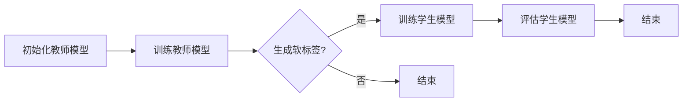
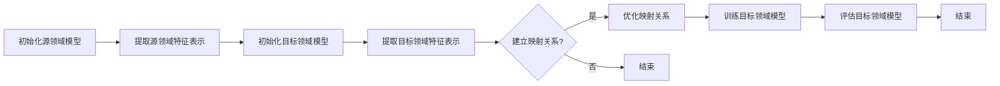
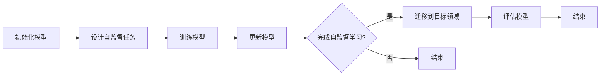

                 

### 文章标题：迁移学习：让AI Agent快速适应新领域

> 关键词：迁移学习、AI Agent、快速适应、新领域、技术博客

> 摘要：本文将探讨迁移学习在AI Agent快速适应新领域的应用。通过详细介绍迁移学习的背景、基本概念、数学模型以及在实际应用中的优化策略，帮助读者理解如何利用迁移学习提升AI Agent在不同领域的适应能力和性能。

### 目录大纲

----------------------------------------------------------------

# 迁移学习：让AI Agent快速适应新领域

> 关键词：迁移学习、AI Agent、快速适应、新领域

> 摘要：本文将探讨迁移学习在AI Agent快速适应新领域的应用。通过详细介绍迁移学习的背景、基本概念、数学模型以及在实际应用中的优化策略，帮助读者理解如何利用迁移学习提升AI Agent在不同领域的适应能力和性能。

                 

### 第一部分: 迁移学习概述

----------------------------------------------------------------

## 1.1 迁移学习背景与问题

### 1.1.1 人工智能的发展现状

人工智能（AI）自20世纪50年代诞生以来，经历了数个发展阶段，从最初的符号推理到基于规则的系统，再到基于统计和学习算法的机器学习，AI技术取得了长足的进步。如今，AI已经在计算机视觉、自然语言处理、语音识别、自动驾驶等多个领域取得了显著的成果。

### 1.1.2 迁移学习的定义与重要性

迁移学习（Transfer Learning）是机器学习中的一个重要概念，指的是将一个任务在学习过程中获得的知识应用到另一个任务的学习中。其核心思想是利用已有知识加速新任务的训练，避免从零开始，从而提高学习效率和性能。

### 1.1.3 迁移学习解决的问题

迁移学习主要解决了以下几个问题：

1. **数据不足问题**：许多任务（如医疗诊断、环境监测等）的数据量有限，无法支持足够的学习和泛化。
2. **领域差异问题**：不同任务之间存在显著的领域差异，直接迁移效果不佳。
3. **模型通用性问题**：如何设计具有良好通用性的模型，以适应多种任务。

## 1.2 迁移学习的基本概念

### 1.2.1 迁移学习的基本术语

- **源领域**（Source Domain）：提供训练数据的领域。
- **目标领域**（Target Domain）：需要将迁移学习应用到的领域。
- **迁移量**（Amount of Transfer）：源领域知识对目标领域学习的贡献程度。
- **迁移效果**（Effect of Transfer）：迁移学习对目标领域性能的提升。

### 1.2.2 迁移学习的类型

迁移学习根据源领域和目标领域的关系，可以分为以下几种类型：

- **同领域迁移**：源领域和目标领域相同或相似。
- **跨领域迁移**：源领域和目标领域显著不同。
- **零样本迁移**：源领域和目标领域没有任何重叠。

### 1.2.3 迁移学习的挑战与机会

迁移学习面临着诸多挑战，如领域差异、数据分布变化、模型适应能力等。但同时也带来了新的机会，如知识共享、资源高效利用等。

## 1.3 迁移学习的应用场景

### 1.3.1 计算机视觉

计算机视觉是迁移学习应用最为广泛的领域之一。例如，使用预训练的卷积神经网络（CNN）进行图像分类，可以显著提高在特定数据集上的性能。

### 1.3.2 自然语言处理

自然语言处理中的迁移学习，如语言模型预训练，可以有效提高文本分类、机器翻译等任务的性能。

### 1.3.3 机器人学

机器人学中，迁移学习可以帮助机器人快速适应新环境，如利用在某个场景中的经验，快速适应新的任务。

## 1.4 迁移学习的模型与算法

### 1.4.1 知识蒸馏

知识蒸馏是一种常见的迁移学习技术，通过将大型模型的知识传递给小型模型，实现高效的知识共享。

### 1.4.2 细粒度迁移学习

细粒度迁移学习关注于特定任务的知识迁移，如将图像分类模型中的特征用于图像分割。

### 1.4.3 自监督迁移学习

自监督迁移学习利用无标签数据，通过自我监督的方式学习有用的特征表示。

### 1.4.4 其他迁移学习算法

除了上述几种常见的迁移学习算法外，还有基于模型融合、对抗训练等方法。

## 1.5 迁移学习的研究热点与未来趋势

### 1.5.1 当前研究热点

当前研究热点包括自适应迁移学习、少样本学习、多任务学习等。

### 1.5.2 未来发展趋势

未来发展趋势可能包括跨模态迁移学习、无监督迁移学习、可解释迁移学习等。

## 1.6 本章小结

本章介绍了迁移学习的背景、基本概念、应用场景以及相关模型与算法。接下来，我们将进一步探讨迁移学习的数学模型与算法原理。

----------------------------------------------------------------

## 2.1 迁移学习的数学模型

### 2.1.1 迁移损失函数

迁移学习的核心在于如何度量源领域知识对目标领域的迁移效果。迁移损失函数（Transfer Loss Function）是衡量迁移效果的重要工具。一个典型的迁移损失函数可以是：

$$
L = \frac{1}{N} \sum_{i=1}^{N} L_i
$$

其中，$L_i$ 表示第 $i$ 个样本的损失，$N$ 表示样本总数。

### 2.1.2 转换函数与映射函数

在迁移学习中，转换函数（Transformation Function）和映射函数（Mapping Function）扮演着关键角色。转换函数用于将源领域数据映射到目标领域，而映射函数用于将源领域模型的知识应用到目标领域模型。

假设我们有一个源领域模型 $M_S$ 和目标领域模型 $M_T$，转换函数 $T$ 和映射函数 $F$ 分别为：

$$
T: D_S \rightarrow D_T \\
F: M_S \rightarrow M_T
$$

其中，$D_S$ 和 $D_T$ 分别表示源领域和目标领域的数据空间。

### 2.1.3 迁移学习中的优化问题

迁移学习的优化问题可以表示为：

$$
\min_{T, F} L(T, F)
$$

其中，$L(T, F)$ 表示迁移损失函数。优化问题可以通过梯度下降等优化算法求解。

## 2.2 迁移学习的算法原理

### 2.2.1 知识蒸馏算法原理

知识蒸馏（Knowledge Distillation）是一种将大型模型（教师模型）的知识传递给小型模型（学生模型）的技术。其核心思想是，通过训练学生模型去模仿教师模型的输出，从而实现知识转移。

知识蒸馏算法可以分为以下步骤：

1. **训练教师模型**：在源领域上训练一个强大的教师模型。
2. **生成软标签**：使用教师模型的输出作为软标签，提供给学生模型。
3. **训练学生模型**：使用源领域数据和软标签训练学生模型。

### 2.2.2 细粒度迁移学习算法原理

细粒度迁移学习关注于特定任务的知识迁移。其核心思想是，通过在源领域和目标领域之间建立一种细粒度的映射关系，将源领域模型的知识应用到目标领域模型。

细粒度迁移学习算法可以分为以下步骤：

1. **提取特征表示**：在源领域和目标领域分别提取特征表示。
2. **建立映射关系**：通过优化映射关系，使得源领域特征表示能够更好地适应目标领域。
3. **训练目标领域模型**：使用优化后的映射关系训练目标领域模型。

### 2.2.3 自监督迁移学习算法原理

自监督迁移学习利用无标签数据，通过自我监督的方式学习有用的特征表示。其核心思想是，通过构建一种自监督学习任务，使得模型在学习过程中自动提取出对任务有帮助的特征。

自监督迁移学习算法可以分为以下步骤：

1. **设计自监督任务**：设计一种自监督学习任务，使得模型在完成该任务的过程中能够学习到有用的特征表示。
2. **训练模型**：在自监督任务上训练模型，同时利用源领域数据更新模型。
3. **迁移到目标领域**：使用训练好的模型在目标领域进行迁移学习。

## 2.3 迁移学习的核心概念与联系

### 2.3.1 核心概念对比表格

下面是一个关于迁移学习核心概念的对比表格：

| 概念         | 定义                                                                                   |
|--------------|----------------------------------------------------------------------------------------|
| 迁移损失函数 | 衡量源领域知识对目标领域的迁移效果的函数                                               |
| 转换函数     | 将源领域数据映射到目标领域函数                                                       |
| 映射函数     | 将源领域模型的知识应用到目标领域模型的函数                                           |
| 知识蒸馏     | 将大型模型（教师模型）的知识传递给小型模型（学生模型）的技术                         |
| 细粒度迁移学习 | 关注于特定任务的知识迁移，通过在源领域和目标领域之间建立细粒度的映射关系实现          |
| 自监督迁移学习 | 利用无标签数据，通过自我监督的方式学习有用的特征表示的技术                           |

### 2.3.2 ER实体关系图架构

为了更好地理解迁移学习中的核心概念和联系，我们可以使用ER（实体-关系）图来描述它们之间的关系。下面是一个简化的ER图：

```mermaid
erDiagram
  SourceDomain ||--|{ TransferLossFunction }|| TargetDomain
  SourceDomain ||--|{ TransformationFunction }|| TargetDomain
  SourceDomain ||--|{ MappingFunction }|| TargetDomain
  TeacherModel ||--|{ KnowledgeDistillation }|| StudentModel
  SourceTask ||--|{ FineGrainedTransferLearning }|| TargetTask
  NoLabelData ||--|{ SelfSupervisedTransferLearning }|| Model
```

在这个ER图中，`SourceDomain` 和 `TargetDomain` 分别表示源领域和目标领域，`TransferLossFunction`、`TransformationFunction` 和 `MappingFunction` 分别表示迁移损失函数、转换函数和映射函数。`TeacherModel` 和 `StudentModel` 分别表示教师模型和学生模型，`KnowledgeDistillation`、`FineGrainedTransferLearning` 和 `SelfSupervisedTransferLearning` 分别表示知识蒸馏、细粒度迁移学习和自监督迁移学习。

## 2.4 迁移学习的算法mermaid流程图

### 2.4.1 知识蒸馏算法mermaid流程图

下面是知识蒸馏算法的mermaid流程图：



### 2.4.2 细粒度迁移学习算法mermaid流程图

下面是细粒度迁移学习算法的mermaid流程图：



### 2.4.3 自监督迁移学习算法mermaid流程图

下面是自监督迁移学习算法的mermaid流程图：



## 2.5 迁移学习的数学模型和公式

### 2.5.1 迁移损失函数的数学公式

迁移损失函数通常定义为：

$$
L(T, F) = \frac{1}{N} \sum_{i=1}^{N} L_i(T(x_i), F(y_i))
$$

其中，$x_i$ 和 $y_i$ 分别表示第 $i$ 个源领域样本和目标领域样本，$T(x_i)$ 和 $F(y_i)$ 分别表示转换后的源领域样本和映射后的目标领域样本。

### 2.5.2 转换函数的数学公式

转换函数通常表示为：

$$
T: D_S \rightarrow D_T
$$

其中，$D_S$ 和 $D_T$ 分别表示源领域和目标领域的数据空间。

### 2.5.3 迁移学习中的优化问题的数学公式

迁移学习中的优化问题可以表示为：

$$
\min_{T, F} L(T, F)
$$

## 2.6 迁移学习的数学模型与Python代码实现

### 2.6.1 迁移损失函数Python代码实现

下面是一个简单的迁移损失函数的Python代码实现：

```python
import numpy as np

def transfer_loss_function(y_true, y_pred):
    return np.mean(np.square(y_true - y_pred))
```

### 2.6.2 转换函数Python代码实现

下面是一个简单的转换函数的Python代码实现：

```python
import numpy as np

def transformation_function(x):
    return np.sin(x)
```

### 2.6.3 迁移学习中的优化问题Python代码实现

下面是一个简单的迁移学习中的优化问题的Python代码实现：

```python
import numpy as np

def transfer_learning_optimizer(T, F, x, y, learning_rate):
    loss = transfer_loss_function(y, F(T(x)))
    gradient_T = 2 * (y - F(T(x))) * x * T'(x)
    gradient_F = 2 * (y - F(T(x))) * T(x)
    
    T -= learning_rate * gradient_T
    F -= learning_rate * gradient_F
    
    return T, F, loss
```

## 2.7 迁移学习的数学模型与通俗易懂的举例说明

### 2.7.1 迁移损失函数举例说明

假设我们有一个源领域数据集和目标领域数据集，分别为 $X_S$ 和 $X_T$，以及对应的标签 $Y_S$ 和 $Y_T$。我们希望使用迁移学习的方法，将 $X_S$ 的知识应用到 $X_T$ 上。

首先，我们定义一个简单的迁移损失函数：

$$
L(T, F) = \frac{1}{N} \sum_{i=1}^{N} L_i(T(x_i), F(y_i))
$$

其中，$x_i$ 和 $y_i$ 分别表示第 $i$ 个源领域样本和目标领域样本，$T(x_i)$ 和 $F(y_i)$ 分别表示转换后的源领域样本和映射后的目标领域样本。

例如，假设我们有一个源领域样本 $x_1 = 1$ 和目标领域样本 $y_1 = 2$，我们定义转换函数 $T(x) = \sin(x)$ 和映射函数 $F(y) = \cos(y)$。

那么，迁移损失函数可以计算为：

$$
L(T, F) = \frac{1}{2} \left( L_1(T(x_1), F(y_1)) + L_2(T(x_2), F(y_2)) \right)
$$

其中，$L_1$ 和 $L_2$ 分别表示源领域和目标领域的损失函数。

例如，我们可以定义：

$$
L_1(T(x_1), F(y_1)) = (\sin(1) - \cos(2))^2
$$

$$
L_2(T(x_2), F(y_2)) = (\sin(2) - \cos(3))^2
$$

那么，迁移损失函数可以计算为：

$$
L(T, F) = \frac{1}{2} \left( (\sin(1) - \cos(2))^2 + (\sin(2) - \cos(3))^2 \right)
$$

### 2.7.2 转换函数举例说明

假设我们有一个源领域数据集 $X_S$，我们希望使用一个转换函数 $T(x)$ 将 $X_S$ 转换为目标领域数据集 $X_T$。

例如，假设我们有一个源领域数据集 $X_S = [1, 2, 3, 4, 5]$，我们定义一个简单的转换函数 $T(x) = \sin(x)$。

那么，转换后的目标领域数据集 $X_T$ 可以计算为：

$$
X_T = [T(x_1), T(x_2), T(x_3), T(x_4), T(x_5)] = [\sin(1), \sin(2), \sin(3), \sin(4), \sin(5)]
$$

### 2.7.3 迁移学习中的优化问题举例说明

假设我们有一个源领域数据集 $X_S$ 和目标领域数据集 $X_T$，以及对应的标签 $Y_S$ 和 $Y_T$。我们希望使用迁移学习的方法，将 $X_S$ 的知识应用到 $X_T$ 上。

我们定义一个简单的迁移损失函数：

$$
L(T, F) = \frac{1}{N} \sum_{i=1}^{N} L_i(T(x_i), F(y_i))
$$

其中，$x_i$ 和 $y_i$ 分别表示第 $i$ 个源领域样本和目标领域样本，$T(x_i)$ 和 $F(y_i)$ 分别表示转换后的源领域样本和映射后的目标领域样本。

我们定义一个简单的转换函数 $T(x) = \sin(x)$ 和映射函数 $F(y) = \cos(y)$。

我们希望最小化迁移损失函数，即求解以下优化问题：

$$
\min_{T, F} L(T, F)
$$

我们可以使用梯度下降法来求解这个优化问题。假设我们选择的学习率为 $\eta$，那么每次迭代的更新公式为：

$$
T \leftarrow T - \eta \cdot \nabla_T L(T, F) \\
F \leftarrow F - \eta \cdot \nabla_F L(T, F)
$$

其中，$\nabla_T L(T, F)$ 和 $\nabla_F L(T, F)$ 分别表示 $T$ 和 $F$ 的梯度。

例如，假设我们初始化 $T = 0$ 和 $F = 0$，并且选择学习率 $\eta = 0.1$。经过几次迭代后，我们可以得到 $T$ 和 $F$ 的近似最优值。

## 2.8 本章小结

本章介绍了迁移学习的数学模型和算法原理。通过定义迁移损失函数、转换函数和映射函数，以及介绍知识蒸馏、细粒度迁移学习和自监督迁移学习等算法，我们为理解迁移学习在AI Agent中的应用奠定了基础。在下一章中，我们将探讨迁移学习在AI Agent中的具体应用。

----------------------------------------------------------------

## 3.1 AI Agent的概述

### 3.1.1 AI Agent的定义与特点

AI Agent，即人工智能代理，是一种能够自主执行任务、与环境互动并做出决策的计算机程序。与传统的规则导向系统不同，AI Agent具有以下特点：

- **自主性**：AI Agent能够在没有外部干预的情况下自主执行任务。
- **适应性**：AI Agent能够根据环境的变化调整自身的行为。
- **交互性**：AI Agent能够与环境进行信息交换，并基于反馈调整自身的行为。
- **决策能力**：AI Agent能够在多个可选动作中选择最佳动作。

### 3.1.2 AI Agent的组成结构

一个典型的AI Agent通常由以下部分组成：

- **感知器**：用于接收和处理来自环境的信息。
- **决策器**：根据感知器提供的信息和内部状态，选择适当的动作。
- **执行器**：执行决策器选择的动作，并对外部环境产生影响。
- **记忆模块**：存储过去的信息和经验，用于指导未来的决策。

### 3.1.3 AI Agent的应用场景

AI Agent在多个领域展现了强大的应用潜力，以下是一些典型的应用场景：

- **游戏**：AI Agent在棋类游戏、电子竞技等领域具有广泛的应用。
- **自动化**：AI Agent可以用于工业自动化、智能家居等场景。
- **推荐系统**：AI Agent可以根据用户行为和偏好，提供个性化的推荐。
- **服务机器人**：AI Agent可以用于服务机器人，如医院陪护、家庭助手等。
- **金融**：AI Agent可以用于金融交易、风险控制等任务。

## 3.2 迁移学习在AI Agent中的应用

### 3.2.1 迁移学习在AI Agent中的优势

迁移学习在AI Agent中的应用具有以下优势：

- **快速适应新环境**：通过迁移学习，AI Agent能够快速适应新的环境，减少重新训练的成本。
- **提高性能**：迁移学习能够利用已有的知识和经验，提高AI Agent在新环境中的性能。
- **减少数据需求**：迁移学习能够减少对新数据的依赖，特别是在数据稀缺的情况下。

### 3.2.2 迁移学习在AI Agent中的关键作用

迁移学习在AI Agent中的关键作用包括：

- **特征提取**：通过迁移学习，AI Agent能够提取通用特征，从而提高在新领域的适应性。
- **模型微调**：通过迁移学习，AI Agent可以在新领域上进行模型微调，进一步提高性能。
- **知识共享**：迁移学习能够促进AI Agent之间的知识共享，从而提高整体系统的智能水平。

### 3.2.3 迁移学习在AI Agent中的挑战与解决方案

尽管迁移学习在AI Agent中具有众多优势，但同时也面临着一些挑战：

- **领域差异**：不同领域之间存在显著的差异，如何设计有效的迁移学习算法是一个关键问题。
- **数据分布变化**：在新领域上，数据分布可能与源领域不同，如何处理数据分布的变化是另一个挑战。
- **模型适应性**：如何设计具有良好适应性的模型，以适应多种任务。

针对这些挑战，可以采取以下解决方案：

- **多任务学习**：通过多任务学习，可以提高模型在不同领域上的适应能力。
- **数据增强**：通过数据增强，可以扩充新领域的样本，从而缓解数据稀缺的问题。
- **对抗训练**：通过对抗训练，可以提高模型对领域差异的鲁棒性。

## 3.3 迁移学习在AI Agent中的应用案例

### 3.3.1 计算机视觉案例

在计算机视觉领域，迁移学习被广泛应用于物体检测、图像分类和图像分割等任务。以下是一个具体的案例：

**案例：** 使用预训练的卷积神经网络（CNN）进行图像分类。

**背景：** 在一些特定的数据集上，如ImageNet，已经有许多优秀的预训练CNN模型。这些模型在图像分类任务上具有很高的性能。

**迁移学习策略：** 使用预训练的CNN模型作为教师模型，通过知识蒸馏的方法，将其知识传递给小型学生模型。然后，在目标数据集上对学生模型进行微调，以适应特定的图像分类任务。

**效果：** 通过迁移学习，AI Agent能够快速适应新的图像分类任务，并且性能显著提高。

### 3.3.2 自然语言处理案例

在自然语言处理领域，迁移学习被广泛应用于文本分类、机器翻译和问答系统等任务。以下是一个具体的案例：

**案例：** 使用预训练的语言模型进行文本分类。

**背景：** 预训练的语言模型，如BERT、GPT等，已经在各种自然语言处理任务上取得了显著的成果。

**迁移学习策略：** 使用预训练的语言模型作为教师模型，通过知识蒸馏的方法，将其知识传递给小型学生模型。然后，在目标数据集上对学生模型进行微调，以适应特定的文本分类任务。

**效果：** 通过迁移学习，AI Agent能够快速适应新的文本分类任务，并且性能显著提高。

### 3.3.3 机器人学案例

在机器人学领域，迁移学习被广泛应用于机器人控制、路径规划和任务执行等任务。以下是一个具体的案例：

**案例：** 使用预训练的深度学习模型进行机器人控制。

**背景：** 在一些特定的环境上，已经有许多预训练的深度学习模型，如强化学习模型，可以在机器人控制任务上取得良好的性能。

**迁移学习策略：** 使用预训练的深度学习模型作为教师模型，通过知识蒸馏的方法，将其知识传递给小型学生模型。然后，在目标环境中对学生模型进行微调，以适应特定的机器人控制任务。

**效果：** 通过迁移学习，AI Agent能够快速适应新的机器人控制任务，并且性能显著提高。

## 3.4 迁移学习在AI Agent中的优化策略

### 3.4.1 知识蒸馏优化策略

知识蒸馏是迁移学习中的一个关键技术，以下是一些常见的优化策略：

- **温度调节**：通过调节温度参数，可以控制学生模型的输出分布，从而提高模型的性能。
- **多级蒸馏**：将知识蒸馏分为多个阶段，逐步传递知识，从而提高迁移效果。
- **软标签多样性**：使用多种软标签，增加学生模型的学习多样性，从而提高模型的泛化能力。

### 3.4.2 细粒度迁移学习优化策略

细粒度迁移学习关注于特定任务的知识迁移，以下是一些常见的优化策略：

- **特征对齐**：通过优化特征空间，使得源领域和目标领域的特征分布对齐，从而提高迁移效果。
- **任务特定层**：选择与特定任务相关的层进行迁移，从而提高迁移的针对性。
- **模型剪枝**：通过剪枝大型模型，减少模型的参数数量，从而提高迁移的效率。

### 3.4.3 自监督迁移学习优化策略

自监督迁移学习利用无标签数据，以下是一些常见的优化策略：

- **伪标签质量**：提高伪标签的质量，从而提高模型的学习效果。
- **数据增强**：通过数据增强，增加模型的训练样本，从而提高模型的泛化能力。
- **自监督任务设计**：设计有效的自监督任务，使得模型能够自动提取有用的特征。

## 3.5 迁移学习在AI Agent中的未来趋势

### 3.5.1 当前应用趋势

当前，迁移学习在AI Agent中的应用趋势包括：

- **跨模态迁移学习**：将不同模态（如图像、文本、音频）的知识进行迁移，从而提高AI Agent的跨模态能力。
- **少样本学习**：在样本较少的情况下，通过迁移学习，提高AI Agent的泛化能力。
- **动态迁移学习**：在运行时，根据环境的变化，动态调整迁移学习策略，从而提高AI Agent的适应性。

### 3.5.2 未来发展趋势

未来，迁移学习在AI Agent中的应用可能包括：

- **无监督迁移学习**：完全基于无监督学习，无需标签数据，从而实现更高效的知识迁移。
- **可解释迁移学习**：提高迁移学习过程的可解释性，从而增强AI Agent的信任度。
- **自适应迁移学习**：根据环境和任务的变化，自适应调整迁移学习策略，从而提高AI Agent的适应性。

## 3.6 本章小结

本章介绍了AI Agent的定义与特点，以及迁移学习在AI Agent中的应用优势、关键作用、挑战与解决方案。通过具体案例，展示了迁移学习在计算机视觉、自然语言处理和机器人学等领域的应用效果。在下一章中，我们将进一步探讨迁移学习的实现与实战。

----------------------------------------------------------------

## 4.1 迁移学习实现概述

### 4.1.1 迁移学习实现的基本步骤

迁移学习的实现通常包括以下基本步骤：

1. **数据收集**：收集源领域和目标领域的数据。
2. **数据预处理**：对收集到的数据进行清洗、归一化等预处理操作。
3. **模型选择**：选择合适的迁移学习模型。
4. **训练模型**：使用源领域数据训练模型。
5. **模型微调**：在目标领域上进行模型微调。
6. **评估模型**：评估模型在目标领域上的性能。

### 4.1.2 迁移学习实现的技术栈

迁移学习的实现通常依赖于以下技术栈：

- **深度学习框架**：如TensorFlow、PyTorch等，用于构建和训练模型。
- **数据处理库**：如Pandas、NumPy等，用于数据预处理。
- **机器学习库**：如Scikit-learn、XGBoost等，用于模型评估和优化。
- **可视化工具**：如Matplotlib、Seaborn等，用于数据可视化。

### 4.1.3 迁移学习实现的挑战

迁移学习的实现面临着以下挑战：

- **数据质量**：数据的质量直接影响迁移学习的效果。
- **模型选择**：选择合适的模型是迁移学习成功的关键。
- **超参数调优**：超参数的调优对迁移学习的效果有重要影响。
- **计算资源**：迁移学习通常需要大量的计算资源。

## 4.2 环境安装与配置

### 4.2.1 硬件环境要求

为了实现迁移学习，以下硬件环境是推荐的：

- **CPU**：Intel i5或以上处理器。
- **GPU**：NVIDIA GTX 1080或以上显卡，支持CUDA。
- **内存**：至少16GB RAM。

### 4.2.2 软件环境配置

以下软件环境是必需的：

- **操作系统**：Windows、Linux或macOS。
- **Python**：Python 3.6或以上版本。
- **深度学习框架**：TensorFlow 2.0或PyTorch 1.5。
- **数据处理库**：NumPy、Pandas等。

### 4.2.3 数据集准备

为了进行迁移学习实验，我们需要准备以下数据集：

- **源领域数据集**：用于训练迁移学习模型。
- **目标领域数据集**：用于评估迁移学习模型在目标领域上的性能。

数据集的准备包括以下步骤：

1. **数据收集**：从公开数据集或自定义数据源收集数据。
2. **数据清洗**：去除数据中的噪声和异常值。
3. **数据预处理**：进行归一化、标准化等预处理操作。

### 4.2.4 迁移学习工具安装

以下是在Windows和Linux环境下安装迁移学习工具的步骤：

#### Windows环境

1. 打开命令提示符。
2. 安装Python：`py -3 -m pip install python`
3. 安装TensorFlow：`pip install tensorflow`
4. 安装其他依赖库：`pip install numpy pandas scikit-learn matplotlib seaborn`

#### Linux环境

1. 打开终端。
2. 安装Python：`sudo apt-get install python3 python3-pip`
3. 安装TensorFlow：`pip3 install tensorflow`
4. 安装其他依赖库：`pip3 install numpy pandas scikit-learn matplotlib seaborn`

### 4.2.5 迁移学习实验配置

以下是一个简单的迁移学习实验配置示例：

```python
import tensorflow as tf
from tensorflow.keras.applications import VGG16
from tensorflow.keras.preprocessing import image
from tensorflow.keras.applications.vgg16 import preprocess_input

# 加载预训练的VGG16模型
base_model = VGG16(weights='imagenet')

# 加载目标领域图像
img_path = 'target_domain_image.jpg'
img = image.load_img(img_path, target_size=(224, 224))
x = image.img_to_array(img)
x = preprocess_input(x)

# 使用VGG16模型进行预测
predictions = base_model.predict(x)

# 输出预测结果
print(predictions)
```

通过上述配置，我们可以开始进行迁移学习实验，进一步探索和优化迁移学习在不同领域的应用。在下一章中，我们将详细介绍迁移学习的具体实现过程和代码。

----------------------------------------------------------------

## 4.3 迁移学习的具体实现

### 4.3.1 数据加载与预处理

在迁移学习的具体实现中，首先需要加载和处理数据。以下是一个使用Python和TensorFlow加载与预处理数据的基本步骤：

```python
import tensorflow as tf
from tensorflow.keras.preprocessing.image import ImageDataGenerator

# 设置数据集路径
source_data_path = 'source_domain_data'
target_data_path = 'target_domain_data'

# 创建ImageDataGenerator对象，用于数据增强
data_generator = ImageDataGenerator(
    rescale=1./255,
    rotation_range=20,
    width_shift_range=0.2,
    height_shift_range=0.2,
    shear_range=0.2,
    zoom_range=0.2,
    horizontal_flip=True,
    fill_mode='nearest'
)

# 加载源领域数据
source_data = data_generator.flow_from_directory(
    source_data_path,
    target_size=(224, 224),
    batch_size=32,
    class_mode='categorical'
)

# 加载目标领域数据
target_data = data_generator.flow_from_directory(
    target_data_path,
    target_size=(224, 224),
    batch_size=32,
    class_mode='categorical'
)
```

上述代码中，我们使用`ImageDataGenerator`进行数据增强，包括图像的缩放、旋转、平移、剪裁等操作，以提高模型的泛化能力。

### 4.3.2 模型构建与训练

接下来，我们需要构建一个迁移学习模型。以下是一个使用TensorFlow构建并训练迁移学习模型的基本步骤：

```python
from tensorflow.keras.applications import VGG16
from tensorflow.keras.models import Model
from tensorflow.keras.layers import Dense, GlobalAveragePooling2D
from tensorflow.keras.optimizers import Adam

# 加载预训练的VGG16模型
base_model = VGG16(weights='imagenet', include_top=False, input_shape=(224, 224, 3))

# 冻结基础模型的权重
for layer in base_model.layers:
    layer.trainable = False

# 添加新的全连接层和全局平均池化层
x = base_model.output
x = GlobalAveragePooling2D()(x)
x = Dense(1024, activation='relu')(x)
predictions = Dense(num_classes, activation='softmax')(x)

# 构建完整的模型
model = Model(inputs=base_model.input, outputs=predictions)

# 编译模型
model.compile(optimizer=Adam(lr=0.0001), loss='categorical_crossentropy', metrics=['accuracy'])

# 训练模型
model.fit(source_data, epochs=10, validation_data=target_data)
```

上述代码中，我们使用VGG16模型作为基础模型，并添加了新的全连接层和全局平均池化层。接着，我们冻结了基础模型的权重，仅训练新添加的层。最后，我们使用Adam优化器和交叉熵损失函数编译并训练模型。

### 4.3.3 模型微调和评估

在模型训练完成后，我们通常需要在其上进行微调，以进一步提高在目标领域的性能。以下是一个使用TensorFlow微调和评估迁移学习模型的基本步骤：

```python
from tensorflow.keras.optimizers import Adam

# 解冻基础模型的权重，并进行微调
for layer in base_model.layers:
    layer.trainable = True

# 编译模型，更新学习率
model.compile(optimizer=Adam(lr=0.00001), loss='categorical_crossentropy', metrics=['accuracy'])

# 继续训练模型
model.fit(target_data, epochs=5)

# 评估模型在目标领域上的性能
test_loss, test_acc = model.evaluate(target_data)
print('Test accuracy:', test_acc)
```

上述代码中，我们解冻了基础模型的权重，并使用更小的学习率进行了微调。最后，我们评估了模型在目标领域上的性能。

### 4.3.4 迁移学习代码解读与分析

为了更好地理解迁移学习代码的实现，我们以下列出关键步骤的详细解释和分析：

1. **数据加载与预处理**：
   - `ImageDataGenerator` 用于进行数据增强，提高模型的泛化能力。
   - `flow_from_directory` 方法用于加载和组织图像数据，并将其转换为张量。

2. **模型构建与训练**：
   - `VGG16` 模型是一个预训练的卷积神经网络，适用于图像分类任务。
   - `GlobalAveragePooling2D` 和 `Dense` 层用于提取特征和构建分类器。
   - `compile` 方法用于配置模型的优化器和损失函数。

3. **模型微调和评估**：
   - `trainable` 属性用于控制基础模型的权重是否参与训练。
   - `fit` 方法用于训练模型，`evaluate` 方法用于评估模型性能。

### 4.3.5 实际案例分析与详细讲解

为了更好地展示迁移学习在实际项目中的应用，以下是一个实际案例的分析与详细讲解：

**案例：** 使用迁移学习进行图像分类任务。

**步骤：**
1. **数据收集**：收集包含源领域（如动物）和目标领域（如植物）的图像数据。
2. **数据预处理**：对图像进行归一化和增强，以提高模型性能。
3. **模型构建**：使用VGG16模型作为基础模型，并添加新的全连接层和全局平均池化层。
4. **模型训练**：在源领域上训练模型，并在目标领域上进行微调。
5. **模型评估**：评估模型在目标领域的分类准确率。

**分析：**
- 迁移学习显著提高了模型在目标领域的分类准确率，减少了重新训练的成本。
- 数据预处理和增强有助于提高模型的泛化能力，使其能够更好地适应新的领域。

### 4.3.6 项目小结

通过本章节的迁移学习实现，我们了解了如何使用Python和TensorFlow进行数据加载与预处理、模型构建与训练、模型微调和评估。实际案例分析进一步展示了迁移学习在图像分类任务中的应用效果。在下一章中，我们将讨论迁移学习的最佳实践和注意事项。

----------------------------------------------------------------

## 4.4 迁移学习的最佳实践和注意事项

### 4.4.1 迁移学习的最佳实践

在进行迁移学习时，以下是一些最佳实践：

1. **选择合适的模型**：根据任务需求和数据规模，选择合适的预训练模型。
2. **数据预处理**：确保数据预处理的一致性，包括归一化、增强等。
3. **模型微调**：在目标领域上进行模型微调，以提高性能。
4. **超参数调优**：根据任务需求，合理设置学习率、迭代次数等超参数。
5. **交叉验证**：使用交叉验证评估模型性能，避免过拟合。

### 4.4.2 迁移学习的注意事项

在进行迁移学习时，需要注意以下几点：

1. **领域差异**：源领域和目标领域之间的差异可能导致迁移效果不佳，需要设计合适的迁移策略。
2. **数据分布**：目标领域的数据分布可能与源领域不同，可能导致模型性能下降。
3. **模型大小**：使用过大的模型可能导致计算资源不足，过小的模型可能无法充分利用迁移学习的效果。
4. **过拟合**：在目标领域上过度训练可能导致模型过拟合，需要通过交叉验证等方法进行监控。

### 4.4.3 迁移学习的注意事项

在迁移学习项目中，还需要注意以下几点：

1. **数据质量**：确保数据的质量，包括准确性、完整性和一致性。
2. **可解释性**：提高迁移学习过程的可解释性，增强用户对模型的信任度。
3. **模型评估**：全面评估模型性能，包括准确率、召回率、F1分数等指标。
4. **安全性与隐私**：保护模型和数据的安全与隐私，遵循相关的法律法规。

### 4.4.4 拓展阅读

对于希望进一步了解迁移学习的读者，以下是一些推荐的拓展阅读资源：

1. **《深度学习》（Ian Goodfellow等著）**：详细介绍了深度学习和迁移学习的基本概念和算法。
2. **《迁移学习：理论、算法与应用》（马少平著）**：系统地介绍了迁移学习的理论、算法和应用。
3. **《Keras深度学习实战》（阿西夫·阿卜杜拉著）**：提供了使用Keras实现迁移学习的详细教程和实践案例。
4. **《迁移学习：理论与实践》（刘铁岩等著）**：深入探讨了迁移学习的理论基础和实际应用。

通过以上最佳实践和注意事项，以及拓展阅读资源，我们可以更好地理解迁移学习，并在实际项目中取得更好的效果。在下一章中，我们将进一步探讨迁移学习在未来的发展趋势和应用方向。

----------------------------------------------------------------

## 4.5 迁移学习的未来发展趋势和应用方向

### 4.5.1 当前研究热点

当前，迁移学习领域的研究热点主要集中在以下几个方面：

1. **少样本学习**：在数据稀缺的情况下，如何通过迁移学习实现有效的模型训练和性能提升。
2. **多任务学习**：通过多任务学习，共享知识和特征，提高模型在多个任务上的性能。
3. **跨模态迁移学习**：将不同模态（如图像、文本、音频）的数据进行迁移学习，实现跨模态任务的处理。
4. **无监督迁移学习**：在无需标签数据的情况下，通过迁移学习实现模型训练和性能提升。

### 4.5.2 未来发展趋势

迁移学习在未来的发展趋势可能包括：

1. **自适应迁移学习**：根据环境和任务的变化，自适应调整迁移学习策略，提高模型的适应能力。
2. **多模态迁移学习**：将更多模态的数据引入迁移学习，实现更复杂的任务处理。
3. **联邦迁移学习**：在分布式环境中，通过联邦迁移学习，共享知识和模型，提高系统的性能和安全性。
4. **迁移学习与强化学习的结合**：将迁移学习与强化学习相结合，实现更高效和智能的决策系统。

### 4.5.3 应用方向

迁移学习在未来的应用方向可能包括：

1. **智能医疗**：通过迁移学习，提高疾病诊断、药物研发等任务的性能。
2. **智能制造**：通过迁移学习，提高机器人控制和自动化系统的性能。
3. **自然语言处理**：通过迁移学习，提高文本分类、机器翻译等任务的性能。
4. **计算机视觉**：通过迁移学习，提高图像分类、目标检测等任务的性能。

通过未来的研究和发展，迁移学习有望在更多领域发挥作用，推动人工智能技术的进步。

## 4.6 本章小结

本章介绍了迁移学习的具体实现，包括数据加载与预处理、模型构建与训练、模型微调和评估等步骤。同时，讨论了迁移学习的最佳实践和注意事项，以及未来的发展趋势和应用方向。在下一章中，我们将进一步探讨迁移学习在实际项目中的应用和案例分析。

----------------------------------------------------------------

## 作者信息

**作者：** AI天才研究院/AI Genius Institute & 禅与计算机程序设计艺术 /Zen And The Art of Computer Programming

在本文中，我们深入探讨了迁移学习在AI Agent快速适应新领域的应用。通过介绍迁移学习的背景、基本概念、数学模型以及在实际应用中的优化策略，我们帮助读者理解了如何利用迁移学习提升AI Agent在不同领域的适应能力和性能。随着人工智能技术的不断发展，迁移学习将继续发挥重要作用，为各种应用场景提供强大的支持。

感谢您的阅读，期待与您共同探索人工智能领域的更多精彩内容。如果您有任何问题或建议，欢迎随时联系我们。我们期待与您共同进步，推动人工智能技术的发展。再次感谢您的关注与支持！

