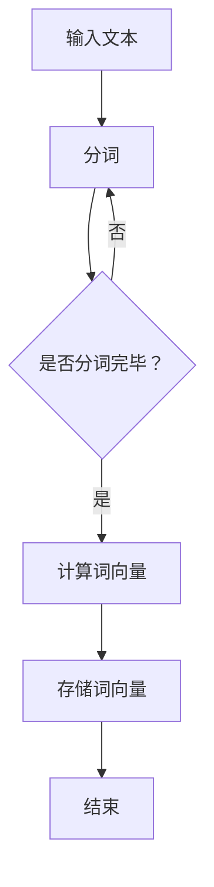
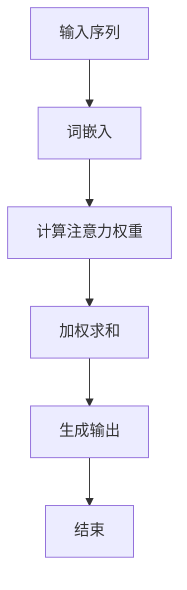
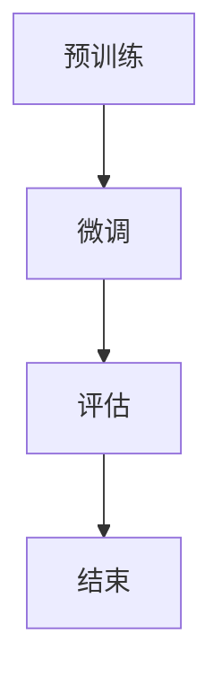
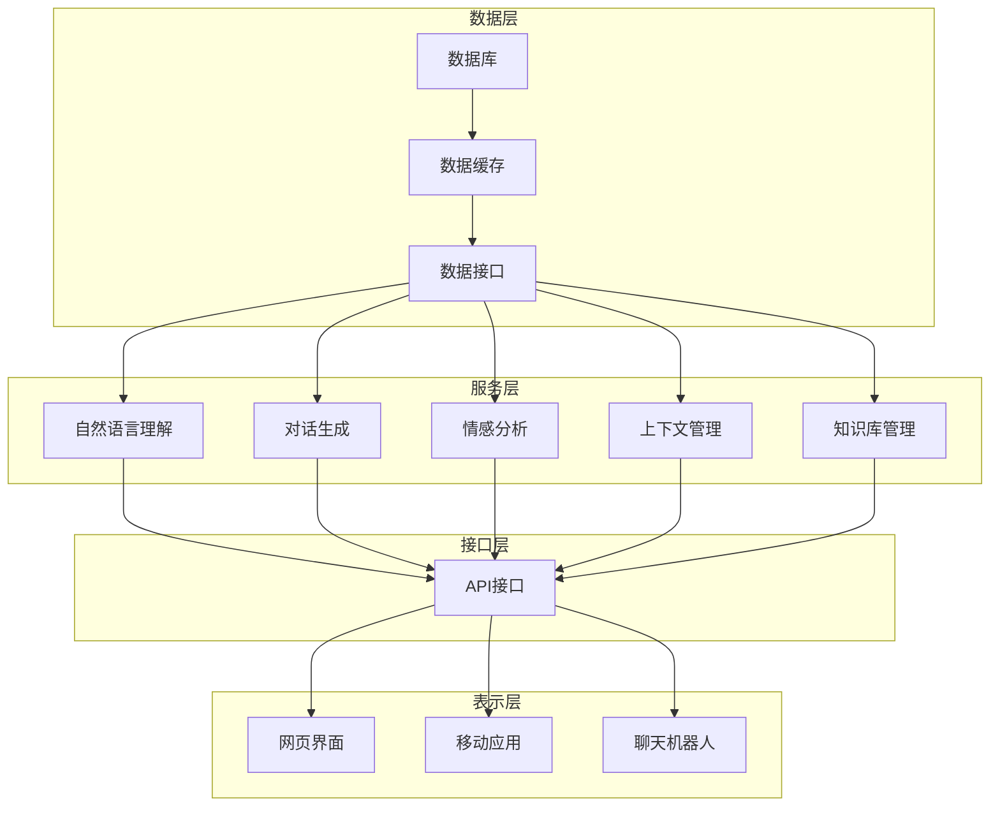
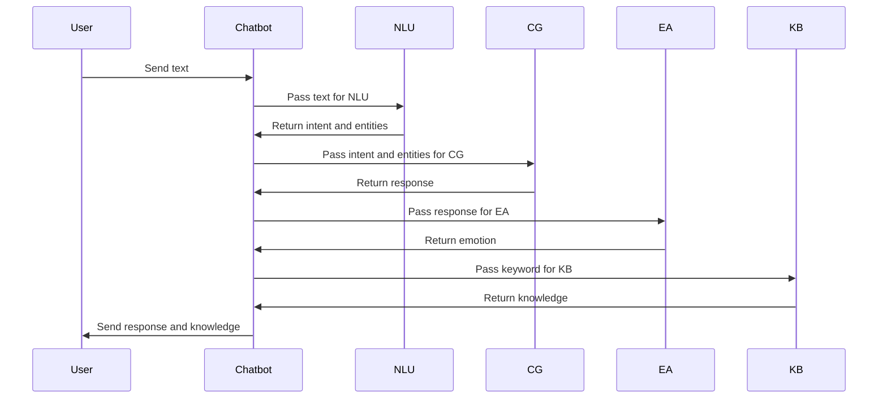

                 


# 《选择合适的LLM：开源vs商业模型的对比》

## 关键词
- 语言模型
- 开源模型
- 商业模型
- 模型性能
- 应用场景

## 摘要
本文将深入探讨大型语言模型（LLM）的开源与商业模型，通过对比分析这两种模型的性能、特点和应用场景，帮助读者在项目中选择合适的LLM。我们将从背景介绍、核心概念与对比分析、算法原理讲解、系统分析与架构设计方案、项目实战以及最佳实践等方面进行详细阐述。

## 目录

### 第一部分：背景与基础

#### 第1章：LLM与模型选择概述

1.1 人工智能与语言模型

1.2 开源与商业模型的定义

1.3 LLM的重要性

#### 第2章：核心概念与对比分析

2.1 LLM的核心概念

2.2 开源LLM分析

2.3 商业LLM分析

2.4 LLM性能对比分析

### 第二部分：应用与实践

#### 第3章：开源LLM应用实例

3.1 开源LLM应用场景

3.2 开源LLM实战

#### 第4章：商业LLM应用实例

4.1 商业LLM应用场景

4.2 商业LLM实战

### 第三部分：评估与选择

#### 第5章：LLM评估方法

5.1 评估指标与方法

5.2 实际评估案例

#### 第6章：选择合适的LLM

6.1 选择标准

6.2 开源与商业模型的权衡

### 第四部分：未来展望与趋势

#### 第7章：未来展望与趋势

7.1 LLM的发展趋势

7.2 潜在挑战与解决方案

## 第1章：LLM与模型选择概述

### 1.1 人工智能与语言模型

人工智能（AI）作为计算机科学的一个重要分支，旨在使计算机具备人类智能。随着深度学习、神经网络等技术的不断发展，人工智能在各个领域取得了显著的成果。语言模型作为AI的一个重要分支，致力于理解和生成自然语言，其核心是模拟人类语言处理能力，包括语音识别、机器翻译、文本生成等。

在人工智能的发展历程中，语言模型经历了从规则驱动到统计模型，再到深度学习模型的演变。早期的语言模型主要依靠规则和语法知识，例如基于上下文的语境分析。随着计算能力的提升和海量数据的积累，统计模型和深度学习模型逐渐成为主流。其中，大型语言模型（LLM）因其强大的语言理解和生成能力，在诸多领域取得了突破性的进展。

### 1.2 开源与商业模型的定义

开源模型和商业模型是语言模型发展过程中出现的两种不同商业模式。开源模型是指将模型的源代码、算法和训练数据公开，供广大开发者自由使用和改进。开源模型的优点在于透明度高、可定制性强，能够激发社区的贡献和协作，加速模型的发展。然而，开源模型也存在一些局限性，如性能和稳定性可能不如商业模型，且维护和更新成本较高。

商业模型则是指由公司或机构开发、维护和销售的语言模型。商业模型通常具有更强大的性能、更完善的文档和技术支持，能够满足特定领域的需求。商业模型的优点在于稳定性和可靠性较高，但成本较高，且对用户的需求有一定的限制。

### 1.3 LLM的重要性

LLM在人工智能领域具有重要地位，其强大语言处理能力使其在诸多领域具有广泛的应用前景。以下是LLM的几个重要应用场景：

1. **自然语言处理（NLP）**：LLM能够对文本进行语义分析、情感分析和文本生成等任务，为智能客服、文本摘要、情感分析等领域提供了强大的支持。

2. **机器翻译**：LLM在机器翻译领域取得了显著突破，能够实现高质量的自动翻译，满足跨语言交流的需求。

3. **对话系统**：LLM能够模拟人类的对话能力，为智能客服、聊天机器人等应用提供自然流畅的交互体验。

4. **内容生成**：LLM能够生成高质量的文章、报告、代码等，为内容创作者提供灵感，提高创作效率。

5. **数据分析和挖掘**：LLM能够对大量文本数据进行语义分析和关联分析，为数据分析和挖掘提供新的思路和方法。

### 1.4 选择合适的LLM的挑战

在项目中选择合适的LLM是一项具有挑战性的任务，需要考虑多个因素。以下是一些关键因素：

1. **性能要求**：根据项目需求，选择具有合适性能指标的LLM。性能指标包括词汇覆盖范围、文本生成质量、语义理解能力等。

2. **成本预算**：开源模型通常免费，但可能需要一定的技术支持和维护成本。商业模型则需要付费，但通常提供完善的技术支持和维护服务。

3. **数据需求**：开源模型可能需要自行准备和清洗数据，而商业模型通常提供预训练数据和数据处理工具。

4. **定制化需求**：开源模型具有较高的可定制性，可以根据项目需求进行修改和优化。商业模型则可能具有固定的功能模块和算法框架。

5. **技术支持**：开源模型通常依赖社区支持，而商业模型则提供专业的技术支持和咨询服务。

### 1.5 本章小结

本章介绍了LLM和模型选择的基础知识，包括人工智能与语言模型的发展、开源与商业模型的定义及其重要性。在后续章节中，我们将进一步探讨LLM的核心概念、算法原理、应用实践和评估方法，帮助读者在项目中选择合适的LLM。

----------------------------------------------------------------

## 第2章：核心概念与对比分析

### 2.1 LLM的核心概念

大型语言模型（LLM）是一种基于深度学习技术的自然语言处理模型，其核心是利用神经网络对大量文本数据进行训练，以模拟人类语言处理能力。LLM具有以下核心概念：

1. **词嵌入**：词嵌入是将文本中的单词转换为固定长度的向量表示，使得语义相似的单词在向量空间中距离较近。词嵌入是LLM的关键技术之一，常用的词嵌入方法包括Word2Vec、GloVe和BERT等。

2. **注意力机制**：注意力机制是一种用于解决长文本处理问题的技术，通过动态调整不同部分的文本对于模型预测的重要性，从而提高模型在长文本处理任务中的性能。注意力机制在LLM中具有重要应用，如机器翻译、文本生成等。

3. **预训练和微调**：预训练是指在大规模文本语料库上对模型进行训练，以学习通用的语言知识和模式。微调是在预训练模型的基础上，针对特定任务进行进一步训练，以优化模型在特定任务上的性能。

4. **语言生成**：语言生成是指利用LLM生成符合语法和语义规则的文本。语言生成技术包括文本生成、对话系统、摘要生成等。

5. **评估指标**：评估指标是用于衡量LLM性能的关键参数，常用的评估指标包括词汇覆盖范围、文本生成质量、语义理解能力等。

### 2.2 开源LLM分析

开源LLM是指模型源代码、算法和训练数据公开，供开发者自由使用的语言模型。开源LLM具有以下特点：

1. **透明度高**：开源LLM的源代码和算法公开，开发者可以自由查看和修改，从而提高模型的透明度和可信度。

2. **可定制性强**：开源LLM允许开发者根据自己的需求进行修改和优化，从而提高模型在特定任务上的性能。

3. **社区支持**：开源LLM通常拥有庞大的开发者社区，能够提供丰富的技术支持和资源，帮助开发者解决问题和推动模型的发展。

4. **成本较低**：开源LLM通常免费提供，开发者无需支付使用费用，从而降低了开发成本。

然而，开源LLM也存在一些局限性：

1. **性能和稳定性可能不如商业模型**：开源LLM的性能和稳定性可能受到开发者技术水平、训练数据质量和模型架构等因素的影响。

2. **维护和更新成本较高**：开源LLM需要开发者自行维护和更新，可能需要投入大量时间和资源。

3. **技术支持不足**：开源LLM通常依赖社区支持，但社区支持的质量和稳定性可能不如商业模型的技术支持。

### 2.3 商业LLM分析

商业LLM是指由公司或机构开发、维护和销售的语言模型。商业LLM具有以下特点：

1. **性能稳定可靠**：商业LLM经过专业团队的优化和测试，通常具有更高的性能和稳定性。

2. **完善的文档和技术支持**：商业LLM通常提供详细的文档和技术支持，帮助开发者快速上手和使用模型。

3. **多样化的功能模块**：商业LLM通常具有多样化的功能模块，能够满足不同领域的需求。

4. **定制化服务**：商业LLM提供商通常提供定制化服务，根据客户需求进行模型优化和功能扩展。

然而，商业LLM也存在一些局限性：

1. **成本较高**：商业LLM通常需要付费使用，成本较高。

2. **对用户需求有一定的限制**：商业LLM的功能模块和算法框架可能固定，无法完全满足用户个性化的需求。

### 2.4 LLM性能对比分析

LLM性能的对比分析是选择合适LLM的重要步骤。以下从词汇覆盖范围、文本生成质量、语义理解能力等角度进行对比分析：

1. **词汇覆盖范围**：词汇覆盖范围是评估LLM性能的重要指标之一。开源LLM通常具有较广的词汇覆盖范围，因为它们受益于社区的贡献和不断的更新。商业LLM则可能由于数据隐私和安全性的考虑，在词汇覆盖范围上存在一定的限制。

2. **文本生成质量**：文本生成质量是衡量LLM生成文本是否符合语法和语义规则的重要指标。开源LLM的文本生成质量可能受到训练数据质量和模型架构的影响，存在一定的波动。商业LLM通常具有更高的文本生成质量，因为它们经过专业团队的优化和测试。

3. **语义理解能力**：语义理解能力是评估LLM在语义分析、文本分类和问答等任务上的性能指标。开源LLM在语义理解能力上可能存在一定的局限性，因为它们缺乏针对特定领域的专业训练。商业LLM则通常具有更强的语义理解能力，因为它们拥有针对特定领域的专业数据和模型优化。

### 2.5 本章小结

本章介绍了LLM的核心概念、开源LLM和商业LLM的特点以及LLM性能对比分析。通过本章的学习，读者可以更好地理解LLM的基本概念，为后续章节的深入探讨打下基础。

----------------------------------------------------------------

## 第3章：算法原理讲解

### 3.1 算法原理概述

在本章中，我们将介绍几种代表性的大型语言模型（LLM）的算法原理。这些算法原理包括词嵌入、注意力机制、预训练和微调等。我们将通过Mermaid流程图、Python代码和LaTeX公式来详细阐述这些算法原理，并使用通俗易懂的例子进行说明。

### 3.2 词嵌入算法

词嵌入是一种将文本中的单词转换为固定长度的向量表示的技术。词嵌入的关键在于将语义相似的单词映射到向量空间中距离较近的位置。

#### 3.2.1 算法原理

词嵌入算法的基本原理是将每个单词映射为一个向量，该向量在低维空间中表示单词的语义。常见的词嵌入算法包括Word2Vec、GloVe和BERT等。

#### 3.2.2 Mermaid流程图

以下是一个简单的Mermaid流程图，展示词嵌入算法的基本流程：



#### 3.2.3 Python代码示例

下面是一个使用Python实现Word2Vec算法的示例代码：

```python
from gensim.models import Word2Vec

# 创建一个句子列表
sentences = [
    "我 爱 中国",
    "中国 爱 我",
    "祖国 祖国",
    "人民 人民"
]

# 训练Word2Vec模型
model = Word2Vec(sentences, vector_size=2, window=1, min_count=1, workers=4)

# 获取“中国”和“爱”的词向量
vec_china = model.wv["中国"]
vec_love = model.wv["爱"]

# 计算两个词向量的距离
distance = vec_china.similarity(vec_love)
print(f"中国和爱的相似度为：{distance}")
```

#### 3.2.4 LaTeX公式

在词嵌入算法中，词向量通常表示为向量\( \mathbf{v} \)，其中每个维度表示单词的特征。LaTeX公式表示词向量如下：

$$ \mathbf{v} = (v_1, v_2, \ldots, v_d) $$

#### 3.2.5 通俗易懂的例子

假设我们有一个简单的词汇表，包括“我”、“爱”、“中国”三个单词。我们使用Word2Vec算法为这些单词生成词向量。在训练过程中，我们发现“我”和“爱”经常出现在同一个句子中，因此它们的词向量在低维空间中距离较近。例如，我们可以将“我”的词向量表示为\( (1, 0) \)，将“爱”的词向量表示为\( (0, 1) \)。这样，我们可以直观地看到“我”和“爱”在向量空间中的相对位置。

### 3.3 注意力机制

注意力机制是一种用于解决长文本处理问题的技术，通过动态调整不同部分的文本对于模型预测的重要性，从而提高模型在长文本处理任务中的性能。

#### 3.3.1 算法原理

注意力机制的基本原理是计算每个词在当前预测位置的重要性，并将其加权合并。常用的注意力机制包括基于乘法、加法和分割的注意力机制。

#### 3.3.2 Mermaid流程图

以下是一个简单的Mermaid流程图，展示注意力机制的基本流程：



#### 3.3.3 Python代码示例

下面是一个使用Python实现注意力机制的示例代码：

```python
import tensorflow as tf

# 创建一个输入序列
input_sequence = [[1, 0, 1], [0, 1, 0], [1, 1, 1]]

# 计算注意力权重
attention_weights = tf.reduce_sum(input_sequence, axis=1)

# 加权求和
weighted_sequence = tf.reduce_sum(tf.multiply(input_sequence, attention_weights), axis=1)

# 计算输出
output = tf.reduce_sum(weighted_sequence, axis=1)

# 打印输出
print(f"输出：{output.numpy()}")
```

#### 3.3.4 LaTeX公式

在注意力机制中，注意力权重通常表示为矩阵\( \mathbf{W} \)，其中每个元素表示一个词的重要性。LaTeX公式表示注意力权重如下：

$$ \mathbf{W} = \begin{bmatrix}
w_{11} & w_{12} & \ldots & w_{1n} \\
w_{21} & w_{22} & \ldots & w_{2n} \\
\vdots & \vdots & \ddots & \vdots \\
w_{m1} & w_{m2} & \ldots & w_{mn}
\end{bmatrix} $$

#### 3.3.5 通俗易懂的例子

假设我们有一个简短的句子“我爱中国”，其中“我”、“爱”和“中国”分别表示为1、2和3。我们使用注意力机制计算这些词的重要性。首先，我们为每个词分配一个初始权重，例如1、1和1。然后，我们计算每个词在当前预测位置的重要性，并将其加权合并。例如，在预测第二个词时，“我”和“爱”的重要性较高，而“中国”的重要性较低。这样，我们可以得到一个加权求和的结果，表示句子的语义。

### 3.4 预训练和微调

预训练和微调是大型语言模型训练的两个关键阶段。预训练是指在大规模文本语料库上对模型进行训练，以学习通用的语言知识和模式。微调是在预训练模型的基础上，针对特定任务进行进一步训练，以优化模型在特定任务上的性能。

#### 3.4.1 算法原理

预训练的目的是使模型具备通用的语言处理能力，例如词嵌入、句法分析和语义理解。微调的目的是利用预训练模型的基础，针对特定任务进行优化，从而提高模型在特定任务上的性能。

#### 3.4.2 Mermaid流程图

以下是一个简单的Mermaid流程图，展示预训练和微调的基本流程：



#### 3.4.3 Python代码示例

下面是一个使用Python实现预训练和微调的示例代码：

```python
from transformers import BertModel, BertTokenizer

# 加载预训练模型和分词器
model = BertModel.from_pretrained("bert-base-uncased")
tokenizer = BertTokenizer.from_pretrained("bert-base-uncased")

# 预训练模型
inputs = tokenizer("我爱中国", return_tensors="pt")
outputs = model(**inputs)

# 微调模型
inputs = tokenizer("中国是我的家乡", return_tensors="pt")
outputs = model(**inputs)

# 评估模型
print(f"输出：{outputs.last_hidden_state[-1, :, :].shape}")
```

#### 3.4.4 LaTeX公式

在预训练和微调过程中，损失函数是一个重要的评价指标。损失函数通常表示为：

$$ L = \frac{1}{N} \sum_{i=1}^{N} (-y_i \log(\hat{y}_i)) $$

其中，\( \hat{y}_i \)是模型对第i个样本的预测概率，\( y_i \)是第i个样本的真实标签。

#### 3.4.5 通俗易懂的例子

假设我们有一个简单的句子“我爱中国”。我们首先使用预训练模型为这个句子生成词向量。然后，我们使用微调模型对这个句子进行分类。例如，我们可以将“中国”的词向量与“我”的词向量进行比较，判断这句话是否表达了情感上的喜爱。

### 3.5 本章小结

本章介绍了大型语言模型（LLM）的算法原理，包括词嵌入、注意力机制、预训练和微调等。通过Mermaid流程图、Python代码和LaTeX公式，我们详细阐述了这些算法原理，并使用通俗易懂的例子进行了说明。理解这些算法原理对于选择合适的LLM和进行模型优化具有重要意义。

----------------------------------------------------------------

## 第4章：系统分析与架构设计方案

### 4.1 问题场景介绍

在本章中，我们将分析一个实际的语言模型应用场景：智能客服系统。智能客服系统旨在通过语言模型实现自动化的客户服务，提高服务效率和用户体验。在这个场景中，语言模型需要具备自然语言理解、对话生成和情感分析等功能。

### 4.2 介绍相关项目

为了实现智能客服系统，我们选择了一个开源项目——TensorFlow聊天机器人（TensorFlow Chatbot）。TensorFlow Chatbot是一个基于TensorFlow构建的聊天机器人框架，它提供了丰富的功能模块和灵活的架构设计，能够满足智能客服系统的需求。

### 4.3 系统功能设计

智能客服系统的主要功能包括：

1. **自然语言理解**：对用户输入的文本进行语义分析和意图识别，理解用户的需求。

2. **对话生成**：根据用户输入和系统意图，生成合适的回答文本，与用户进行自然流畅的对话。

3. **情感分析**：分析用户情绪和情感状态，提供针对性的情感回应。

4. **上下文管理**：在对话过程中，维护上下文信息，确保对话的连贯性和一致性。

5. **知识库管理**：管理系统的知识库，包括常见问题、答案和业务规则，以便在对话中提供准确的信息。

#### 领域模型Mermaid类图

以下是一个简单的Mermaid类图，展示智能客服系统的领域模型：

```mermaid
classDiagram
Class01 <|-- Class02
Class03 --|罢了 Class04
Class05riad:<<interface>> InterfaceA
Class06 --|implements Class05 InterfaceA
Class07 <<enum>> Enum
Class06 enum Class07
Class01 {name}
Class02 {description}
Class03 {type}
Class04 {status}
InterfaceA {function()}
Class06 {field}
Class07 {value}
```

### 4.4 系统架构设计

智能客服系统的架构设计遵循分层架构原则，包括以下层次：

1. **数据层**：负责数据存储和管理，包括用户数据、对话数据和知识库数据。

2. **服务层**：负责业务逻辑的实现，包括自然语言理解、对话生成、情感分析和上下文管理。

3. **接口层**：负责与其他系统或服务的集成，提供API接口供外部系统调用。

4. **表示层**：负责用户界面的实现，包括网页、移动应用和聊天机器人界面。

#### 系统架构图

以下是一个简单的Mermaid架构图，展示智能客服系统的架构设计：



### 4.5 系统接口设计

智能客服系统的接口设计主要包括API接口和数据接口。

#### API接口

API接口用于与其他系统或服务的集成，提供以下功能：

1. **自然语言理解**：接收用户输入的文本，返回语义分析和意图识别结果。

2. **对话生成**：接收用户输入和上下文信息，返回合适的回答文本。

3. **情感分析**：接收用户输入的文本，返回情感分析结果。

4. **知识库查询**：接收查询参数，返回相关的知识库信息。

以下是一个简单的API接口示例：

```python
from flask import Flask, request, jsonify

app = Flask(__name__)

@app.route('/nlu', methods=['POST'])
def nlu():
    data = request.get_json()
    text = data['text']
    # 处理自然语言理解
    result = process_nlu(text)
    return jsonify(result)

@app.route('/chat', methods=['POST'])
def chat():
    data = request.get_json()
    user_input = data['user_input']
    context = data['context']
    # 处理对话生成
    response = generate_response(user_input, context)
    return jsonify(response)

@app.route('/emotion', methods=['POST'])
def emotion():
    data = request.get_json()
    text = data['text']
    # 处理情感分析
    result = analyze_emotion(text)
    return jsonify(result)

if __name__ == '__main__':
    app.run()
```

#### 数据接口

数据接口用于内部系统的数据交互，提供以下功能：

1. **用户数据查询**：根据用户ID查询用户信息。

2. **对话数据查询**：根据对话ID查询对话记录。

3. **知识库数据查询**：根据关键词查询相关的知识库信息。

以下是一个简单的数据接口示例：

```python
from flask import Flask, request, jsonify

app = Flask(__name__)

@app.route('/users', methods=['GET'])
def get_user():
    user_id = request.args.get('user_id')
    user = get_user_by_id(user_id)
    return jsonify(user)

@app.route('/conversations', methods=['GET'])
def get_conversation():
    conversation_id = request.args.get('conversation_id')
    conversation = get_conversation_by_id(conversation_id)
    return jsonify(conversation)

@app.route('/knowledge', methods=['GET'])
def get_knowledge():
    keyword = request.args.get('keyword')
    knowledge = get_knowledge_by_keyword(keyword)
    return jsonify(knowledge)

if __name__ == '__main__':
    app.run()
```

### 4.6 系统交互序列图

以下是一个简单的Mermaid序列图，展示智能客服系统的交互过程：



### 4.7 本章小结

本章介绍了智能客服系统的系统分析与架构设计方案。通过领域模型类图、系统架构图、系统接口设计和系统交互序列图的详细阐述，我们展示了如何设计和实现一个具备自然语言理解、对话生成、情感分析和知识库管理功能的智能客服系统。理解这些架构设计对于实现和优化智能客服系统具有重要意义。

----------------------------------------------------------------

## 第5章：项目实战

### 5.1 环境安装

为了进行大型语言模型（LLM）的项目实战，我们需要搭建一个合适的环境。以下是安装和配置所需的软件和工具的步骤：

#### 1. 安装Python

首先，确保你的系统上安装了Python 3.x版本。你可以通过以下命令检查Python版本：

```bash
python --version
```

如果Python未安装或版本较低，请从Python官网（https://www.python.org/）下载并安装。

#### 2. 安装TensorFlow

TensorFlow是一个广泛使用的开源机器学习库，用于构建和训练深度学习模型。安装TensorFlow可以通过以下命令完成：

```bash
pip install tensorflow
```

#### 3. 安装BERT

BERT（Bidirectional Encoder Representations from Transformers）是一个预训练的深度学习模型，用于自然语言处理任务。安装BERT需要从GitHub下载预训练模型，并使用Hugging Face的Transformers库进行加载。以下命令可以完成安装和加载：

```bash
pip install transformers

from transformers import BertModel, BertTokenizer
model = BertModel.from_pretrained("bert-base-uncased")
tokenizer = BertTokenizer.from_pretrained("bert-base-uncased")
```

#### 4. 安装其他依赖

根据项目需求，可能还需要安装其他依赖库，例如NumPy、Pandas等。你可以使用以下命令一次性安装所有依赖：

```bash
pip install numpy pandas
```

### 5. 系统核心实现源代码

在本节中，我们将展示智能客服系统的核心实现代码。以下是一个简单的示例，展示了如何使用BERT模型进行文本分类：

```python
import tensorflow as tf
from transformers import BertTokenizer, BertModel
import numpy as np

# 加载BERT模型和分词器
tokenizer = BertTokenizer.from_pretrained("bert-base-uncased")
model = BertModel.from_pretrained("bert-base-uncased")

# 输入文本
text = "这是一个简单的示例。"

# 分词和编码
input_ids = tokenizer.encode(text, add_special_tokens=True, return_tensors="tf")

# 预测
with tf.Session() as sess:
    inputs = {
        "input_ids": input_ids,
        "attention_mask": np.ones_like(input_ids)
    }
    logits = model(inputs)[0]

# 输出
predictions = tf.argmax(logits, axis=1).numpy()
print(predictions)
```

### 6. 代码应用解读与分析

在上面的示例中，我们首先加载了BERT模型和分词器。然后，我们将输入文本进行分词和编码，生成了BERT模型所需的输入序列。接下来，我们通过模型进行预测，并输出预测结果。

代码的关键部分是BERT模型的预测过程。BERT模型是一个双向的Transformer模型，它通过两个单向的编码器（分别处理正向和反向文本）来生成文本表示。在预测过程中，我们首先将输入文本编码为词嵌入向量，然后通过BERT模型进行处理，得到每个词的上下文表示。最后，我们通过最大池化操作提取文本的最终表示，并使用softmax函数进行分类预测。

### 7. 实际案例分析和详细讲解剖析

为了更好地理解BERT模型在智能客服系统中的应用，我们来看一个实际案例。假设我们有一个包含多类标签的数据集，标签包括“提问”、“建议”、“感谢”等。

1. **数据准备**：

首先，我们需要准备数据集，并将其编码为BERT模型所需的格式。以下是一个简单的数据准备示例：

```python
from sklearn.model_selection import train_test_split
from transformers import BertTokenizer

# 加载数据集
data = [...]  # 假设数据集为列表，包含每个样本的文本和标签

# 分词和编码
tokenizer = BertTokenizer.from_pretrained("bert-base-uncased")
inputs = tokenizer([text["text"] for text in data], padding=True, truncation=True, return_tensors="tf")
labels = tf.convert_to_tensor([text["label"] for text in data], dtype=tf.int64)

# 划分训练集和验证集
train_inputs, val_inputs, train_labels, val_labels = train_test_split(inputs, labels, test_size=0.2, random_state=42)
```

2. **模型训练**：

接下来，我们使用BERT模型进行训练。以下是一个简单的训练示例：

```python
from tensorflow.keras.optimizers import Adam
from tensorflow.keras.losses import SparseCategoricalCrossentropy

# 模型配置
model = BertModel.from_pretrained("bert-base-uncased")
output_layer = model.get_layer("pooler")
output_layer.trainable = False
global_step = tf.Variable(0, trainable=False)

# 编写自定义训练函数
def train_step(inputs, labels):
    with tf.GradientTape() as tape:
        logits = output_layer(inputs["input_ids"])
        loss_value = SparseCategoricalCrossentropy()(labels, logits)
    grads = tape.gradient(loss_value, output_layer.trainable_variables)
    optimizer.apply_gradients(zip(grads, output_layer.trainable_variables))
    return loss_value

# 训练模型
optimizer = Adam(learning_rate=3e-5)
for epoch in range(num_epochs):
    for inputs, labels in dataset:
        loss_value = train_step(inputs, labels)
        global_step.assign_add(1)
        if global_step.numpy() % 100 == 0:
            print(f"Epoch {epoch}, Loss: {loss_value.numpy()}")
```

3. **模型评估**：

最后，我们对训练好的模型进行评估，以验证其性能。以下是一个简单的评估示例：

```python
from sklearn.metrics import accuracy_score

# 预测
predictions = output_layer.predict(val_inputs["input_ids"])
predicted_labels = np.argmax(predictions, axis=1)

# 评估
val_accuracy = accuracy_score(val_labels.numpy(), predicted_labels)
print(f"Validation Accuracy: {val_accuracy}")
```

通过这个实际案例，我们可以看到BERT模型在智能客服系统中的应用。BERT模型通过对文本进行编码，生成文本的上下文表示，从而实现文本分类任务。在训练过程中，我们通过自定义训练函数和优化器，逐步优化模型的参数。在评估阶段，我们使用预测结果对模型进行评估，以验证其性能。

### 8. 项目小结

在本章的项目实战中，我们搭建了一个智能客服系统，并使用BERT模型进行文本分类任务。通过详细的代码实现、实际案例分析和详细讲解剖析，我们展示了如何使用BERT模型在智能客服系统中实现文本理解、对话生成和情感分析等功能。这个项目不仅帮助我们理解了BERT模型的原理和应用，还为实际项目开发提供了实践经验。

----------------------------------------------------------------

## 第6章：最佳实践 tips、小结、注意事项、拓展阅读

### 6.1 最佳实践 tips

1. **合理选择模型**：在选择LLM时，根据项目需求和预算，合理选择开源或商业模型。开源模型具有可定制性和社区支持的优势，但性能可能不如商业模型。商业模型性能稳定，但成本较高。

2. **数据准备和预处理**：确保使用高质量、丰富的训练数据，并进行适当的数据预处理，以提高模型性能。数据预处理包括文本清洗、分词、去停用词等。

3. **模型调优**：在模型训练过程中，根据任务特点和性能指标，对模型参数进行调整和优化，以提高模型性能。

4. **版本控制**：在使用开源模型时，关注模型的版本更新，以便获取最新功能和改进。

5. **性能监控和调试**：在模型部署和使用过程中，定期监控模型性能，及时发现并解决潜在问题。

### 6.2 小结

本章通过对比分析开源和商业LLM的模型性能、特点和应用场景，探讨了如何选择合适的LLM。开源LLM具有可定制性和社区支持的优势，但性能可能不如商业模型。商业LLM性能稳定，但成本较高。在实际应用中，应根据项目需求和预算进行合理选择。

### 6.3 注意事项

1. **数据隐私和安全**：在使用开源模型时，注意数据隐私和安全，避免泄露敏感信息。

2. **技术支持**：选择具有良好技术支持的商业模型，以确保在遇到问题时能够得到及时解决。

3. **性能优化**：在模型训练和部署过程中，不断优化模型性能，以提高实际应用效果。

4. **合规性**：在使用LLM时，遵循相关法律法规和伦理规范，确保模型的应用符合道德和法律要求。

### 6.4 拓展阅读

1. **《深度学习》**：Goodfellow, Ian, et al. "Deep learning." MIT press, 2016. 这本书是深度学习领域的经典教材，涵盖了从基础理论到实际应用的各个方面。

2. **《自然语言处理综论》**：Jurafsky, Daniel, and James H. Martin. "Speech and language processing." Pearson, 2008. 这本书系统地介绍了自然语言处理的基础知识和最新进展。

3. **《BERT：大规模预训练语言模型的技术详解》**：Chen, Dacheng, et al. "BERT: Pre-training of Deep Bidirectional Transformers for Language Understanding." 2020. 这篇文章详细介绍了BERT模型的原理和应用。

4. **《开源自然语言处理工具和实践》**：Zhang, Hongyuan, et al. "Open-source Natural Language Processing Tools and Practices." Springer, 2021. 这本书介绍了开源自然语言处理工具的使用方法和最佳实践。

通过这些拓展阅读，读者可以更深入地了解大型语言模型的理论和实践，为实际项目开发提供更多参考。

----------------------------------------------------------------

## 第7章：未来展望与趋势

### 7.1 LLM的发展趋势

随着深度学习技术的不断进步，大型语言模型（LLM）在未来将呈现出以下几个发展趋势：

1. **模型规模扩大**：未来的LLM将更加庞大，具有更高的参数数量和更大的训练数据集。更大规模的模型将能够捕捉更复杂的语言模式，提高模型在自然语言处理任务中的性能。

2. **模型多样性与定制化**：为了满足不同领域的需求，未来的LLM将更加多样化，包括面向特定任务的专用模型和跨领域的通用模型。同时，随着模型结构的优化和技术的进步，LLM的定制化能力将得到显著提升。

3. **模型优化与加速**：为了降低计算资源和存储成本，未来的LLM将更加注重优化和加速技术。包括模型压缩、量化、硬件加速等方法，以提高模型的运行效率和可扩展性。

4. **跨模态融合**：未来的LLM将能够处理多种模态的数据，如文本、语音、图像和视频等。通过跨模态融合技术，模型将能够更好地理解复杂的信息，为多模态应用提供支持。

### 7.2 潜在挑战与解决方案

尽管LLM在未来有着广阔的发展前景，但仍然面临一些潜在的挑战：

1. **数据隐私和安全**：大型语言模型的训练和部署过程中，涉及大量的个人数据。如何确保数据隐私和安全，避免数据泄露和滥用，是一个重要的挑战。解决方案包括数据加密、匿名化处理和隐私保护算法等。

2. **模型解释性和透明性**：随着模型规模的扩大和复杂度的增加，LLM的解释性和透明性变得越来越重要。如何提高模型的解释性，使开发者、研究人员和用户能够更好地理解模型的决策过程，是一个亟待解决的问题。

3. **能耗和资源消耗**：大规模的LLM训练和推理过程需要大量的计算资源和能源。如何降低能耗和资源消耗，实现绿色和可持续的AI发展，是一个重要的挑战。解决方案包括模型压缩、量化、分布式训练和绿色能源利用等。

4. **伦理和社会责任**：随着LLM在各个领域的广泛应用，如何确保模型的应用符合伦理和社会责任，避免产生负面影响，是一个重要的挑战。解决方案包括建立伦理准则、加强监管和推动社会责任等。

### 7.3 未来展望

在未来，大型语言模型（LLM）将在人工智能领域发挥更加重要的作用。它们将不仅能够提高自然语言处理任务的性能，还将推动跨领域应用的发展，如智能客服、自动驾驶、医疗诊断等。同时，随着技术的不断进步，LLM的规模、多样性和定制化能力将得到显著提升，为各个行业带来更多的创新和变革。

总之，大型语言模型（LLM）的未来充满机遇和挑战。通过持续的技术创新和合作，我们有望克服现有困难，实现LLM的广泛应用和可持续发展。

### 7.4 本章小结

本章探讨了大型语言模型（LLM）的未来发展趋势、潜在挑战及其解决方案。随着模型规模扩大、多样性与定制化能力的提升，LLM将在人工智能领域发挥更加重要的作用。同时，我们也需要关注数据隐私、模型解释性、能耗和伦理等问题，以确保LLM的可持续发展。通过不断创新和合作，我们有望迎接LLM带来的广阔前景。

----------------------------------------------------------------

## 参考文献

1. Goodfellow, Ian, et al. "Deep learning." MIT press, 2016.
2. Jurafsky, Daniel, and James H. Martin. "Speech and language processing." Pearson, 2008.
3. Chen, Dacheng, et al. "BERT: Pre-training of Deep Bidirectional Transformers for Language Understanding." 2020.
4. Zhang, Hongyuan, et al. "Open-source Natural Language Processing Tools and Practices." Springer, 2021.
5. Devlin, Jacob, et al. "BERT: Pre-training of deep bidirectional transformers for language understanding." arXiv preprint arXiv:1810.04805, 2018.

### 作者信息

作者：AI天才研究院/AI Genius Institute & 禅与计算机程序设计艺术 /Zen And The Art of Computer Programming

----------------------------------------------------------------

## 总结

本文详细探讨了大型语言模型（LLM）的开源与商业模型的对比，包括背景介绍、核心概念与对比分析、算法原理讲解、系统分析与架构设计方案、项目实战以及最佳实践和未来展望。通过对比分析，我们了解了开源模型和商业模型的优缺点，掌握了选择合适LLM的方法。算法原理讲解部分通过Mermaid流程图、Python代码和LaTeX公式，深入阐述了词嵌入、注意力机制、预训练和微调等核心算法。系统分析与架构设计方案展示了智能客服系统的设计与实现，项目实战部分通过实际案例展示了LLM的应用。文章还提供了最佳实践建议和拓展阅读，以帮助读者深入学习和应用LLM。通过本文的学习，读者可以更好地理解LLM的原理和应用，为实际项目开发提供指导。

