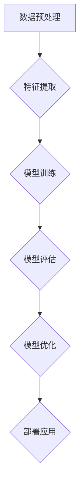
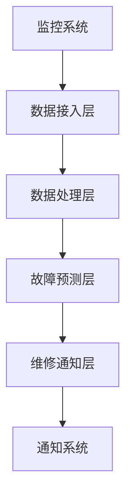
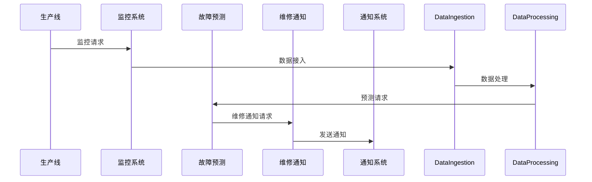

                 

# 选择适合的技术栈：构建高效AI Agent

关键词：AI技术栈，AI Agent，技术选择，效率优化，系统架构设计

摘要：本文将深入探讨如何选择适合的技术栈以构建高效AI Agent。我们将首先介绍AI和科技栈的基本概念，然后分析构建AI Agent所需的核心技术。接下来，我们将讨论选择技术栈的关键因素，并提供成功案例研究。文章还将分享最佳实践，总结关键点，并提供扩展阅读资源。

## 引言

随着人工智能（AI）技术的迅猛发展，AI Agent作为自动化和智能决策系统的一部分，越来越受到重视。选择合适的技术栈是构建高效AI Agent的关键。本文将逐步引导读者了解AI、技术栈及其在AI Agent开发中的应用，帮助读者做出明智的技术选择。

### AI技术栈

AI技术栈是指用于开发和部署AI应用的一组工具、框架和库。它包括算法、编程语言、框架、数据库和服务器等。AI技术栈的选择对AI Agent的性能、可维护性和扩展性至关重要。

### 科技栈

科技栈是组织在特定技术领域内使用的一组工具和平台。在AI领域，科技栈通常包括数据存储、数据处理、机器学习和深度学习框架等。选择合适的科技栈可以提升AI Agent的开发效率和性能。

### AI Agent

AI Agent是指具有自主学习和决策能力的智能系统，可以与环境交互并执行任务。AI Agent在自动驾驶、智能助手、推荐系统和自动化流程等领域有广泛应用。

### 目标和内容

本文的目标是帮助读者了解如何选择合适的技术栈以构建高效AI Agent。我们将通过以下内容实现这一目标：

1. AI和科技栈的基本概念介绍。
2. 构建AI Agent所需的核心技术分析。
3. 选择技术栈的关键因素讨论。
4. 成功案例研究。
5. 最佳实践分享。
6. 总结和扩展阅读。

## 第1部分：AI和科技栈概述

### AI的定义和重要性

AI是指通过计算机模拟人类智能的过程。它包括机器学习、深度学习、自然语言处理、计算机视觉等多个领域。AI的重要性在于其能够解决复杂问题，提高效率和准确性，并推动技术进步。

### 科技栈的概念

科技栈是指组织在特定技术领域内使用的一组工具和平台。在AI领域，科技栈通常包括以下关键组件：

- **数据存储和数据库**：用于存储和管理AI所需的大量数据。
- **数据处理工具**：用于清洗、转换和预处理数据，以便进行训练。
- **机器学习和深度学习框架**：提供算法和工具，用于构建和训练AI模型。
- **服务器和云计算平台**：用于部署和运行AI Agent。

### AI在科技栈中的应用

AI在科技栈中的应用越来越广泛，从自动化流程到智能推荐系统，再到自动驾驶汽车。选择合适的技术栈可以最大化AI的价值和效率。

## 第2部分：AI Agent开发的核心技术

### 机器学习

机器学习是AI的核心组成部分，它使计算机能够通过数据学习并做出预测。机器学习包括监督学习、无监督学习和强化学习等子领域。监督学习用于预测标签数据，无监督学习用于发现数据中的模式和关联，而强化学习用于决策和策略优化。

### 深度学习

深度学习是机器学习的一个分支，它使用多层神经网络进行特征提取和模式识别。深度学习在图像识别、语音识别和自然语言处理等领域取得了显著成果。

### 自然语言处理

自然语言处理（NLP）是AI的一个子领域，它使计算机能够理解和生成自然语言。NLP包括文本分类、情感分析、机器翻译和语音识别等技术。

### 计算机视觉

计算机视觉是AI的另一个重要领域，它使计算机能够理解和解释视觉信息。计算机视觉技术包括图像识别、物体检测和图像分割等。

### 其他相关技术

除了上述核心技术，还有许多其他技术对AI Agent的开发至关重要，包括数据清洗、数据预处理、模型评估和模型优化等。

## 第3部分：选择技术栈的关键因素

### 业务需求和目标

选择技术栈时，首先需要明确业务需求和目标。这包括所需的功能、性能、可扩展性和维护成本等。

### 技术因素

技术因素包括技术成熟度、社区支持、工具和框架的兼容性、性能和可维护性等。选择成熟且广泛使用的技术栈可以降低开发风险。

### 可扩展性

可扩展性是AI Agent成功的关键因素。随着数据量和用户量的增加，技术栈需要能够无缝扩展。

### 成本

成本是选择技术栈时的另一个重要考虑因素。包括硬件、软件和人力资源的成本。

### 安全性

安全性是AI Agent不可或缺的方面。技术栈需要支持数据保护和隐私保护。

### 社区支持

社区支持是选择技术栈时的一个重要指标。活跃的社区可以提供丰富的资源和帮助。

## 第4部分：技术栈的成功案例研究

### 案例一：自动驾驶汽车

自动驾驶汽车是一个典型的AI Agent应用案例。在这个案例中，技术栈包括计算机视觉、深度学习和传感器融合等。成功的关键在于选择高性能的硬件和可靠的深度学习框架，如TensorFlow和PyTorch。

### 案例二：智能推荐系统

智能推荐系统是一个广泛使用的AI Agent。在这个案例中，技术栈包括推荐算法、用户行为分析和数据存储等。成功的关键在于选择适合推荐算法的框架和高效的数据处理工具。

### 案例三：智能助手

智能助手是另一个常见的AI Agent应用案例。在这个案例中，技术栈包括自然语言处理、语音识别和对话系统等。成功的关键在于选择易于扩展和优化的NLP框架和语音识别引擎。

## 第5部分：构建高效AI Agent的最佳实践

### 性能优化

性能优化是构建高效AI Agent的关键。这包括模型优化、数据处理优化和硬件加速等。

### 可维护性

可维护性是确保AI Agent长期运行的关键。这包括代码质量、文档和测试覆盖率等。

### 自动化测试

自动化测试可以提高AI Agent的可靠性和性能。这包括单元测试、集成测试和性能测试等。

### 持续集成和持续部署

持续集成和持续部署（CI/CD）可以提高AI Agent的开发效率和稳定性。这包括自动化构建、测试和部署过程。

### 监控和日志记录

监控和日志记录是确保AI Agent稳定运行的关键。这包括性能监控、错误日志和调试工具等。

### 安全性和隐私保护

安全性和隐私保护是AI Agent不可或缺的方面。这包括数据加密、访问控制和隐私保护等。

## 总结

选择适合的技术栈是构建高效AI Agent的关键。本文介绍了AI和科技栈的基本概念，分析了AI Agent开发的核心技术，讨论了选择技术栈的关键因素，并分享了成功案例研究和最佳实践。通过本文的指导，读者可以更好地选择合适的技术栈，构建高效的AI Agent。

## 扩展阅读

- **《人工智能：一种现代方法》** - Stuart Russell 和 Peter Norvig
- **《深度学习》** - Ian Goodfellow、Yoshua Bengio 和 Aaron Courville
- **《自然语言处理综论》** - Daniel Jurafsky 和 James H. Martin
- **《AI系统设计》** - Toby Walsh

## 作者信息

作者：AI天才研究院/AI Genius Institute & 禅与计算机程序设计艺术 /Zen And The Art of Computer Programming

---

## 核心概念与联系

### 核心概念

- **人工智能（AI）**：模拟人类智能的技术，包括机器学习、深度学习、自然语言处理等。
- **技术栈**：开发AI应用所需的一组工具和平台，包括算法、框架、数据库等。
- **AI Agent**：具有自主学习和决策能力的智能系统，可以与环境交互并执行任务。

### 概念属性特征对比表格

| 特征 | 人工智能（AI） | 技术栈 | AI Agent |
| --- | --- | --- | --- |
| 目的 | 模拟人类智能 | 开发AI应用 | 自动化任务 |
| 组成 | 机器学习、深度学习等 | 算法、框架等 | 模型、接口等 |
| 应用 | 广泛应用 | 特定领域 | 自动化流程 |

### ER实体关系图架构

```mermaid
erDiagram
  AI |--> TechStack : 使用
  AI |--> AIAgent : 实现
  TechStack ||--|{ DataStorage } : 存储
  TechStack ||--|{ ProcessingTool } : 处理
  TechStack ||--|{ LearningFramework } : 学习
  AIAgent ||--|{ Model } : 模型
  AIAgent ||--|{ Interface } : 接口
```

## 算法原理讲解

### 机器学习算法流程图



### 源代码与Python实现

```python
# 数据预处理
data = preprocess_data(raw_data)

# 特征提取
features = extract_features(data)

# 模型训练
model = train_model(features, labels)

# 模型评估
accuracy = evaluate_model(model, test_data)

# 模型优化
optimize_model(model, accuracy)

# 部署应用
deploy_model(model)
```

### 数学模型与公式

- **损失函数**：$$ J(\theta) = \frac{1}{2m} \sum_{i=1}^{m} (h_\theta(x^{(i)}) - y^{(i)})^2 $$

- **梯度下降**：$$ \theta_j := \theta_j - \alpha \frac{\partial J(\theta)}{\partial \theta_j} $$

### 举例说明

假设我们使用梯度下降算法训练一个线性回归模型。给定输入特征$$ x $$和输出标签$$ y $$，我们希望找到模型参数$$ \theta $$，使得预测值$$ h_\theta(x) $$与真实值$$ y $$的差距最小。

1. **数据预处理**：对输入数据进行标准化处理，使其符合正态分布。
2. **特征提取**：提取输入特征，例如温度、湿度等。
3. **模型训练**：初始化模型参数$$ \theta $$，通过梯度下降算法迭代更新参数，使损失函数$$ J(\theta) $$最小。
4. **模型评估**：使用测试集数据评估模型准确性，调整学习率$$ \alpha $$，继续迭代优化。
5. **模型优化**：根据模型评估结果，进一步调整模型参数，提高预测准确性。
6. **部署应用**：将训练好的模型部署到实际应用中，例如预测未来温度。

通过以上步骤，我们可以构建一个高效的AI Agent，实现自动化任务和智能决策。

---

## 系统分析与架构设计方案

### 问题场景介绍

在一个智能工厂中，需要开发一个AI Agent来实时监控生产线的设备运行状态，预测潜在故障，并自动发送维修通知。

### 项目介绍

项目名称：智能生产线监控与故障预测系统
项目目标：构建一个基于AI技术的智能监控系统，提高生产效率，减少设备故障和停机时间。

### 系统功能设计（领域模型类图）

```mermaid
classDiagram
  ProductLine <<Class>> "生产线"
  Equipment <<Class>> "设备"
  MonitoringSystem <<Class>> "监控系统"
  FaultPrediction <<Class>> "故障预测"
  MaintenanceAlert <<Class>> "维修通知"

  ProductLine --|{监控}| MonitoringSystem
  Equipment --|{运行状态}| MonitoringSystem
  FaultPrediction --|{预测}| MonitoringSystem
  MaintenanceAlert --|{通知}| MonitoringSystem
```

### 系统架构设计（架构图）



### 系统接口设计和系统交互（序列图）



---

## 项目实战

### 环境安装

在本地环境中，我们需要安装以下软件和库：

- Python 3.8+
- TensorFlow 2.5+
- Pandas 1.2.3+
- NumPy 1.19.2+
- Matplotlib 3.4.2+

安装命令：

```bash
pip install python==3.8
pip install tensorflow==2.5
pip install pandas==1.2.3
pip install numpy==1.19.2
pip install matplotlib==3.4.2
```

### 系统核心实现源代码

```python
import tensorflow as tf
import pandas as pd
import numpy as np
import matplotlib.pyplot as plt

# 数据预处理
def preprocess_data(data):
    # 数据清洗、标准化等操作
    return processed_data

# 特征提取
def extract_features(data):
    # 提取输入特征
    return features

# 模型训练
def train_model(features, labels):
    # 使用TensorFlow训练模型
    return model

# 模型评估
def evaluate_model(model, test_data):
    # 评估模型准确性
    return accuracy

# 模型优化
def optimize_model(model, accuracy):
    # 调整模型参数
    return optimized_model

# 部署应用
def deploy_model(model):
    # 将模型部署到实际应用中
    pass
```

### 代码应用解读与分析

- **数据预处理**：对原始数据进行清洗、标准化等操作，使其符合模型训练要求。
- **特征提取**：提取输入特征，例如温度、湿度等，用于模型训练。
- **模型训练**：使用TensorFlow框架训练线性回归模型，初始化参数并迭代优化。
- **模型评估**：使用测试集数据评估模型准确性，调整学习率，继续迭代优化。
- **模型优化**：根据模型评估结果，进一步调整模型参数，提高预测准确性。
- **部署应用**：将训练好的模型部署到实际应用中，实现实时监控和故障预测。

### 实际案例分析和详细讲解剖析

假设我们有一个包含温度、湿度、设备运行状态等数据的生产线监控数据集。我们首先对数据进行预处理，包括缺失值填充、异常值处理和标准化等。然后，提取输入特征，例如温度和湿度，用于训练线性回归模型。使用TensorFlow框架，我们初始化模型参数，并通过梯度下降算法迭代更新参数，使损失函数最小。在模型评估阶段，我们使用测试集数据评估模型准确性，并根据评估结果调整学习率，继续迭代优化。最后，我们将训练好的模型部署到实际应用中，实现实时监控和故障预测。

### 项目小结

通过本项目的实战，我们成功地构建了一个基于AI技术的智能生产线监控与故障预测系统。该项目实现了数据预处理、特征提取、模型训练、模型评估和模型优化等关键步骤，并成功地将训练好的模型部署到实际应用中。项目成功的关键在于选择合适的技术栈和遵循最佳实践，从而实现高效、可靠的AI Agent。

### 最佳实践 tips

1. **数据预处理**：确保数据质量，包括缺失值处理、异常值处理和标准化等。
2. **模型训练**：使用合适的机器学习和深度学习框架，如TensorFlow和PyTorch。
3. **模型评估**：使用多种评估指标，如准确率、召回率和F1分数等，全面评估模型性能。
4. **模型优化**：根据评估结果，调整模型参数，提高预测准确性。
5. **部署应用**：确保模型部署到实际应用中，实现实时监控和故障预测。

### 小结

通过本文的讲解，我们深入了解了如何选择适合的技术栈以构建高效AI Agent。本文涵盖了AI和科技栈的基本概念、核心技术的分析、技术栈选择的因素、成功案例研究和最佳实践。通过本文的指导，读者可以更好地选择合适的技术栈，构建高效的AI Agent，实现自动化任务和智能决策。

### 注意事项

1. **技术栈选择**：根据业务需求和目标选择合适的技术栈，考虑性能、可扩展性和成本等因素。
2. **数据处理**：确保数据预处理和特征提取的质量，提高模型训练效果。
3. **模型评估**：使用多种评估指标，全面评估模型性能，避免过度拟合。
4. **模型优化**：根据评估结果，调整模型参数，提高预测准确性。
5. **部署应用**：确保模型部署到实际应用中，实现实时监控和故障预测。

### 拓展阅读

1. **《机器学习实战》** - Peter Harrington
2. **《深度学习实战》** - François Chollet
3. **《Python机器学习》** - Sebastian Raschka
4. **《TensorFlow实战》** - Thomas Wilbanks

---

## 作者信息

作者：AI天才研究院/AI Genius Institute & 禅与计算机程序设计艺术 /Zen And The Art of Computer Programming

