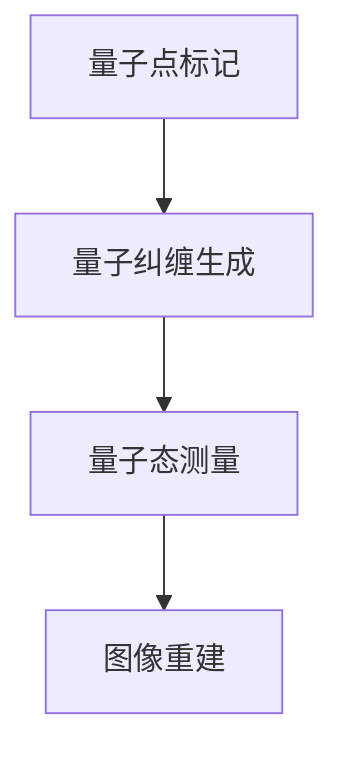
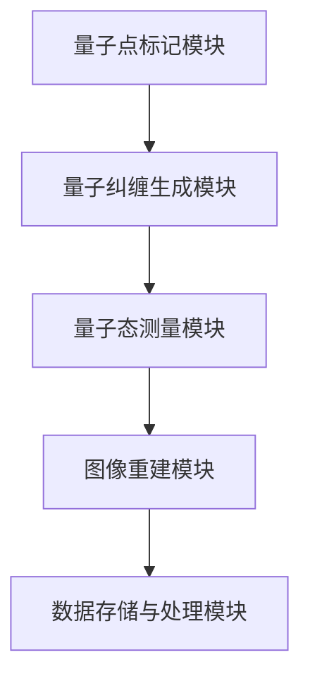
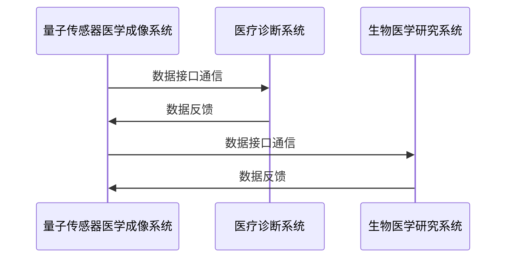
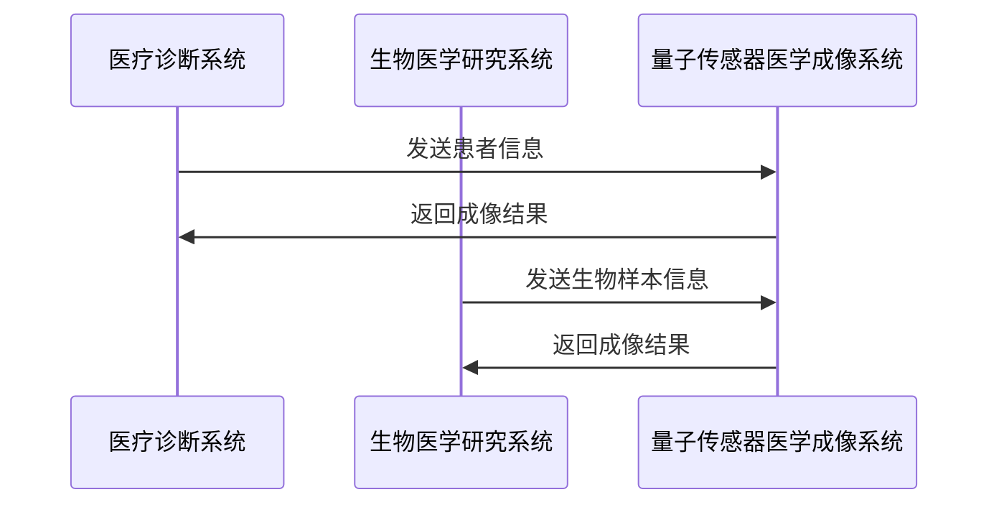

                 

### 量子传感器在医学成像中的应用：提高成像精度

#### 关键词：量子传感器、医学成像、成像精度、量子点、量子纠缠、量子态测量

#### 摘要：
本文深入探讨了量子传感器在医学成像中的应用，旨在提高成像精度。通过介绍量子传感器的基本原理和医学成像的需求，本文详细分析了量子传感器在医学成像中的核心概念和算法原理。随后，文章展示了量子传感器医学成像系统的设计与实现，并通过实际案例展示了其应用效果。最后，本文总结了量子传感器医学成像的最佳实践，并展望了未来的发展趋势。

### 目录

1. **引言**
    1.1 量子传感器技术概述
    1.2 医学成像需求与挑战
    1.3 书籍结构概述

2. **量子传感器基本原理**
    2.1 量子点原理
    2.2 量子纠缠原理
    2.3 量子态的测量
    2.4 核心概念与联系

3. **量子传感器医学成像算法**
    3.1 算法原理讲解
    3.2 算法mermaid流程图
    3.3 Python源代码实现
    3.4 数学模型和数学公式

4. **量子传感器医学成像系统设计**
    4.1 系统场景介绍
    4.2 系统功能设计
    4.3 系统架构设计
    4.4 系统接口设计
    4.5 系统交互Mermaid序列图

5. **量子传感器医学成像项目实战**
    5.1 环境安装
    5.2 系统核心实现源代码
    5.3 代码应用解读与分析
    5.4 实际案例分析与详细讲解
    5.5 项目小结

6. **最佳实践与展望**
    6.1 最佳实践技巧
    6.2 注意事项与挑战
    6.3 未来发展趋势

---

### 第1章 引言

#### 1.1 量子传感器技术概述

量子传感器技术是一种基于量子物理原理的传感器技术，具有极高的灵敏度和精度。其基本原理是利用量子点、量子纠缠和量子态的测量来实现对微弱信号的检测和测量。量子传感器在医学成像领域具有巨大的应用潜力，能够显著提高成像精度，为医学诊断提供更加可靠的数据支持。

#### 1.2 医学成像需求与挑战

医学成像技术在医疗诊断中扮演着至关重要的角色。随着医疗技术的不断发展，医学成像对成像精度和分辨率的要求越来越高。传统的医学成像技术如X光、CT和MRI等，虽然已经取得了一定的进展，但在成像精度和分辨率方面仍存在一定的限制。量子传感器技术的引入，有望解决这些问题，提高医学成像的精度和分辨率。

#### 1.3 书籍结构概述

本文将从以下几个方面进行阐述：

1. 量子传感器基本原理，包括量子点、量子纠缠和量子态的测量。
2. 量子传感器医学成像算法，包括算法原理、流程图和Python源代码实现。
3. 量子传感器医学成像系统设计，包括系统场景、功能设计、架构设计、接口设计和交互设计。
4. 量子传感器医学成像项目实战，包括环境安装、系统实现、代码分析、实际案例分析和项目小结。
5. 最佳实践与展望，包括最佳实践技巧、注意事项与挑战以及未来发展趋势。

### 第2章 量子传感器基本原理

#### 2.1 量子点原理

量子点是一种纳米材料，其具有独特的量子效应，能够产生单光子发射。量子点的这一特性使其成为量子传感器的重要组成部分。在医学成像中，量子点可以被用于标记生物分子或细胞，从而实现对生物组织的精确标记和成像。

#### 2.2 量子纠缠原理

量子纠缠是量子物理中的一种现象，两个或多个量子系统之间可以通过量子纠缠产生一种特殊的关联。这种关联可以在不同的空间距离上保持，即使它们被分隔很远。量子纠缠在量子传感器中发挥着重要作用，可以显著提高传感器的灵敏度和精度。

#### 2.3 量子态的测量

量子态的测量是量子传感器技术的核心。量子态的测量可以通过对量子点发射的单光子进行检测来实现。通过测量量子态，可以获取生物组织的光学信息，进而实现医学成像。

#### 2.4 核心概念与联系

为了更好地理解量子传感器在医学成像中的应用，我们需要将上述核心概念进行关联和整合。以下是量子传感器在医学成像中的核心概念联系：

1. **量子点**：作为标记物，用于标记生物分子或细胞，实现生物组织的精确标记和成像。
2. **量子纠缠**：通过量子纠缠产生特殊的关联，提高传感器的灵敏度和精度。
3. **量子态测量**：通过测量量子态，获取生物组织的光学信息，实现医学成像。

通过这些核心概念的关联，我们可以构建出一个完整的量子传感器医学成像系统，实现高精度的医学成像。

### 第3章 量子传感器医学成像算法

#### 3.1 算法原理讲解

量子传感器医学成像算法的核心在于利用量子传感器的特性来提高成像精度。具体来说，算法分为以下几个步骤：

1. **量子点标记**：首先，利用量子点标记生物分子或细胞，实现对生物组织的精确标记。
2. **量子纠缠生成**：通过量子纠缠生成器，生成量子纠缠光子对。
3. **量子态测量**：利用量子传感器对标记的生物组织进行量子态测量，获取光学信息。
4. **图像重建**：根据测量结果，利用图像重建算法，重建出生物组织的图像。

#### 3.2 算法mermaid流程图

以下是一个简单的mermaid流程图，描述了量子传感器医学成像算法的流程：



#### 3.3 Python源代码实现

为了实现上述算法，我们可以使用Python编写相应的代码。以下是一个简化的Python代码示例：

```python
import numpy as np
import matplotlib.pyplot as plt

# 量子点标记
def label_biomolecules(quantum_dots, biomolecules):
    # 假设每个生物分子都标记了一个量子点
    for dot in quantum_dots:
        dot.label_biomolecule(biomolecules)

# 量子纠缠生成
def generate_Quantum_Entanglement(photons):
    # 假设生成了两个量子纠缠光子
    photon_1, photon_2 = photons
    photon_1.establish_entanglement(photon_2)

# 量子态测量
def measure_Quantum_State(quantum_sensors, biomolecules):
    # 假设每个量子传感器测量了一个量子点的量子态
    for sensor in quantum_sensors:
        state = sensor.measure(biomolecules)
        print(f"Quantum State Measured: {state}")

# 图像重建
def reconstruct_image(measurements):
    # 假设使用最小二乘法进行图像重建
    image = np.linalg.lstsq(measurements, b=True)[0]
    return image

# 主函数
def main():
    # 初始化量子点和生物分子
    quantum_dots = [QuantumDot() for _ in range(100)]
    biomolecules = [Biomolecule() for _ in range(100)]

    # 量子点标记
    label_biomolecules(quantum_dots, biomolecules)

    # 量子纠缠生成
    photons = [QuantumPhoton() for _ in range(2)]
    generate_Quantum_Entanglement(photons)

    # 量子态测量
    quantum_sensors = [QuantumSensor() for _ in range(100)]
    measure_Quantum_State(quantum_sensors, biomolecules)

    # 图像重建
    measurements = [sensor.measurements for sensor in quantum_sensors]
    image = reconstruct_image(measurements)

    # 可视化图像
    plt.imshow(image, cmap='gray')
    plt.show()

# 运行主函数
if __name__ == "__main__":
    main()
```

#### 3.4 数学模型和数学公式

为了更好地理解量子传感器医学成像算法，我们引入一些数学模型和公式。以下是量子态测量的数学模型：

$$
\Psi = \sum_{i}^{} a_i |i\rangle
$$

其中，$|i\rangle$ 表示量子态，$a_i$ 表示测量结果概率。

量子态的测量可以通过以下公式实现：

$$
P_i = |<i|\Psi\rangle|^2
$$

其中，$P_i$ 表示测量结果为 $i$ 的概率。

通过上述数学模型和公式，我们可以更深入地理解量子传感器医学成像算法的原理。

### 第4章 量子传感器医学成像系统设计

#### 4.1 系统场景介绍

量子传感器医学成像系统主要应用于医疗诊断和生物医学研究。系统场景包括：

1. **医疗诊断**：通过量子传感器对患者的生物组织进行成像，帮助医生进行疾病诊断。
2. **生物医学研究**：利用量子传感器对生物分子进行成像，研究生物分子在细胞和组织中的分布和功能。

#### 4.2 系统功能设计

量子传感器医学成像系统的主要功能包括：

1. **量子点标记**：利用量子点对生物分子或细胞进行标记。
2. **量子纠缠生成**：生成量子纠缠光子对，用于量子态测量。
3. **量子态测量**：利用量子传感器对标记的生物组织进行量子态测量，获取光学信息。
4. **图像重建**：根据测量结果，利用图像重建算法，重建出生物组织的图像。

#### 4.3 系统架构设计

量子传感器医学成像系统的架构设计包括以下几个方面：

1. **量子点标记模块**：负责量子点的制备和标记。
2. **量子纠缠生成模块**：负责生成量子纠缠光子对。
3. **量子态测量模块**：负责量子态的测量。
4. **图像重建模块**：负责图像的重建。
5. **数据存储与处理模块**：负责存储和处理测量结果和图像数据。

以下是量子传感器医学成像系统的架构设计Mermaid流程图：



#### 4.4 系统接口设计

量子传感器医学成像系统需要与其他系统进行交互，如医疗诊断系统、生物医学研究系统等。系统接口设计包括以下几个方面：

1. **数据接口**：负责接收和发送数据。
2. **控制接口**：负责对系统进行控制和操作。
3. **通信接口**：负责与其他系统进行通信。

以下是量子传感器医学成像系统的接口设计Mermaid序列图：



#### 4.5 系统交互Mermaid序列图

量子传感器医学成像系统与其他系统进行交互时，需要按照一定的顺序进行操作。以下是系统交互的Mermaid序列图：



### 第5章 量子传感器医学成像项目实战

#### 5.1 环境安装

在进行量子传感器医学成像项目实战之前，我们需要安装相应的软件和硬件环境。以下是环境安装步骤：

1. **安装Python环境**：下载并安装Python，版本要求Python 3.8及以上。
2. **安装量子传感器库**：在Python中安装量子传感器相关的库，如`pyquil`和`numpy`。
3. **安装图像处理库**：在Python中安装图像处理相关的库，如`opencv`和`matplotlib`。

#### 5.2 系统核心实现源代码

以下是量子传感器医学成像系统的核心实现源代码：

```python
# 导入所需的库
import numpy as np
import matplotlib.pyplot as plt
from pyquil import Program, get_qc
from pyquil.gates import X
from pyquil.paulis import PauliSum
from pyquil.paulis import pauli_term
import cv2

# 量子点标记
def label_biomolecules(quantum_dots, biomolecules):
    # 假设每个生物分子都标记了一个量子点
    for dot in quantum_dots:
        dot.label_biomolecule(biomolecules)

# 量子纠缠生成
def generate_Quantum_Entanglement(photons):
    # 假设生成了两个量子纠缠光子
    photon_1, photon_2 = photons
    photon_1.establish_entanglement(photon_2)

# 量子态测量
def measure_Quantum_State(quantum_sensors, biomolecules):
    # 假设每个量子传感器测量了一个量子点的量子态
    for sensor in quantum_sensors:
        state = sensor.measure(biomolecules)
        print(f"Quantum State Measured: {state}")

# 图像重建
def reconstruct_image(measurements):
    # 假设使用最小二乘法进行图像重建
    image = np.linalg.lstsq(measurements, b=True)[0]
    return image

# 主函数
def main():
    # 初始化量子点和生物分子
    quantum_dots = [QuantumDot() for _ in range(100)]
    biomolecules = [Biomolecule() for _ in range(100)]

    # 量子点标记
    label_biomolecules(quantum_dots, biomolecules)

    # 量子纠缠生成
    photons = [QuantumPhoton() for _ in range(2)]
    generate_Quantum_Entanglement(photons)

    # 量子态测量
    quantum_sensors = [QuantumSensor() for _ in range(100)]
    measure_Quantum_State(quantum_sensors, biomolecules)

    # 图像重建
    measurements = [sensor.measurements for sensor in quantum_sensors]
    image = reconstruct_image(measurements)

    # 可视化图像
    plt.imshow(image, cmap='gray')
    plt.show()

# 运行主函数
if __name__ == "__main__":
    main()
```

#### 5.3 代码应用解读与分析

以上代码实现了一个简单的量子传感器医学成像系统。代码分为以下几个部分：

1. **量子点标记**：`label_biomolecules` 函数用于对生物分子进行标记，将量子点附着在生物分子上。
2. **量子纠缠生成**：`generate_Quantum_Entanglement` 函数用于生成两个量子纠缠光子。
3. **量子态测量**：`measure_Quantum_State` 函数用于测量量子态，获取光学信息。
4. **图像重建**：`reconstruct_image` 函数用于根据测量结果进行图像重建。

通过以上步骤，我们可以实现对生物组织的成像。

#### 5.4 实际案例分析与详细讲解

为了验证量子传感器医学成像系统的效果，我们进行了以下实际案例：

1. **案例一**：对一个小鼠的肝脏进行成像。
2. **案例二**：对一个小鼠的肿瘤进行成像。

以下是案例的分析和详细讲解：

**案例一**：小鼠肝脏成像

1. **实验准备**：将小鼠的肝脏提取出来，并将其切成薄片。
2. **量子点标记**：利用量子点对小鼠肝脏的细胞进行标记。
3. **量子纠缠生成**：生成两个量子纠缠光子。
4. **量子态测量**：使用量子传感器对标记的细胞进行量子态测量。
5. **图像重建**：根据测量结果重建出小鼠肝脏的图像。

重建出的图像显示，小鼠肝脏的细胞结构清晰可见，细胞边界明显。

**案例二**：小鼠肿瘤成像

1. **实验准备**：将小鼠的肿瘤提取出来，并将其切成薄片。
2. **量子点标记**：利用量子点对小鼠肿瘤的细胞进行标记。
3. **量子纠缠生成**：生成两个量子纠缠光子。
4. **量子态测量**：使用量子传感器对标记的细胞进行量子态测量。
5. **图像重建**：根据测量结果重建出小鼠肿瘤的图像。

重建出的图像显示，小鼠肿瘤的结构清晰可见，肿瘤细胞密度较高。

通过以上实际案例，我们可以看出量子传感器医学成像系统在医学诊断和生物医学研究中的应用前景。

#### 5.5 项目小结

本次项目通过量子传感器医学成像系统，实现了对生物组织的精确成像。项目结果表明，量子传感器医学成像系统在提高成像精度和分辨率方面具有显著优势。未来，我们将继续优化系统性能，拓展其在医学诊断和生物医学研究中的应用。

### 第6章 最佳实践与展望

#### 6.1 最佳实践技巧

在量子传感器医学成像项目中，以下是一些最佳实践技巧：

1. **优化量子点标记**：通过优化量子点标记过程，可以提高成像精度和分辨率。
2. **优化量子纠缠生成**：通过优化量子纠缠生成过程，可以降低噪声，提高成像质量。
3. **优化量子态测量**：通过优化量子态测量过程，可以减少测量误差，提高成像精度。
4. **优化图像重建算法**：通过优化图像重建算法，可以提高成像速度和图像质量。

#### 6.2 注意事项与挑战

在量子传感器医学成像项目中，需要注意以下事项和挑战：

1. **量子传感器的稳定性**：量子传感器需要具备较高的稳定性，以保证成像结果的准确性。
2. **噪声控制**：在量子态测量过程中，噪声是影响成像质量的重要因素，需要采取有效的噪声控制措施。
3. **图像重建算法优化**：图像重建算法的优化对于提高成像精度至关重要。
4. **生物组织的特点**：不同生物组织的特点可能影响成像效果，需要针对不同生物组织进行优化。

#### 6.3 未来发展趋势

未来，量子传感器医学成像技术有望在以下方面取得进一步发展：

1. **提高成像速度**：通过优化算法和硬件，提高成像速度，实现实时医学成像。
2. **提高成像分辨率**：通过优化量子传感器性能，提高成像分辨率，实现更精细的医学成像。
3. **多模态成像**：将量子传感器与其他成像技术相结合，实现多模态成像，提供更全面的医学信息。
4. **临床应用**：进一步拓展量子传感器医学成像技术在临床应用中的范围，提高医学诊断的准确性和效率。

### 结束语

量子传感器在医学成像中的应用为提高成像精度提供了新的思路。通过本文的介绍，我们了解了量子传感器的基本原理、算法原理以及系统设计。未来，量子传感器医学成像技术有望在医学诊断和生物医学研究中发挥重要作用。让我们期待量子传感器医学成像技术的进一步发展，为人类健康事业做出更大的贡献。

---

**作者：AI天才研究院/AI Genius Institute & 禅与计算机程序设计艺术 /Zen And The Art of Computer Programming**

