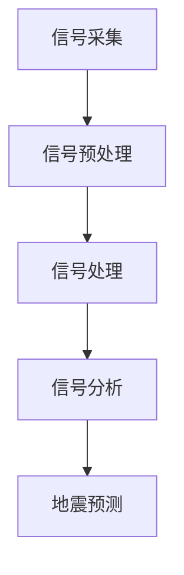
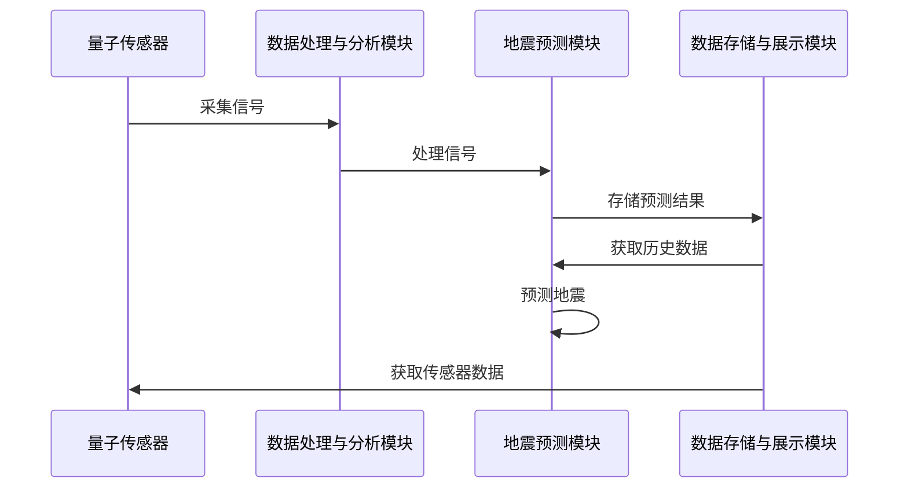

                 

# 量子传感器在地震前兆探测中的应用前景

> 关键词：量子传感器，地震前兆，探测技术，算法原理，系统架构设计

> 摘要：本文将深入探讨量子传感器在地震前兆探测中的应用前景。首先，我们将介绍量子传感器的基本概念和特性，并对比其与传统传感器的差异。接着，我们将分析地震前兆信号的特点及其与地震发生的关系。随后，我们将详细介绍量子传感器在地震前兆探测中的应用算法，并通过实际案例进行分析。最后，我们将总结全文，并提出未来可能的研究方向。

## Step 1: 背景介绍

### 1.1 问题背景

地震作为一种自然灾害，给人类社会带来了巨大的损失。据统计，每年全球因地震造成的经济损失可达数十亿美元。尽管地震难以预测，但通过监测地震前兆，我们有可能提前预警，减少地震带来的损失。地震前兆是指地震发生前一段时间内，地球内部发生的各种物理现象，如地下水位变化、地应力变化等。

### 1.2 问题描述

目前，地震前兆的探测主要依赖于传统的地震仪和地震波分析技术。这些方法虽然在一定程度上能够监测地震前兆，但存在一定的局限性。首先，传统地震仪的灵敏度有限，难以探测到微弱的地震前兆信号。其次，地震波的传播速度和振幅变化复杂，给地震前兆信号的识别带来了困难。因此，寻找新的探测技术，提高地震前兆探测的精度和效率，成为当前地震研究的一个重要方向。

### 1.3 问题解决

量子传感器作为一种新兴的探测技术，具有高灵敏度、高分辨率和高速率等特点，有望在地震前兆探测中发挥重要作用。本文将探讨量子传感器在地震前兆探测中的应用前景，分析其原理、技术特点和应用案例，为地震前兆探测提供一种新的思路和方法。

### 1.4 边界与外延

量子传感器在地震前兆探测中的应用研究是一个跨学科、跨领域的课题，涉及物理学、地球科学、信息科学等多个领域。本文主要聚焦于量子传感器在地震前兆探测中的应用研究，不涉及其他领域的应用。

### 1.5 概念结构与核心要素组成

量子传感器在地震前兆探测中的应用主要包括以下几个核心要素：

- **量子传感器**：用于检测地震前兆的传感器。
- **地震前兆信号**：地震发生前的一些物理现象，如地下水位变化、地应力变化等。
- **数据处理与分析**：对量子传感器收集到的数据进行处理和分析，以识别地震前兆信号。

### 1.6 核心概念与联系

- **量子传感器**：具有高灵敏度、高分辨率和高速率等特点。
- **地震前兆信号**：与地震的发生密切相关。
- **数据处理与分析**：是实现量子传感器在地震前兆探测中应用的关键环节。

## Step 2: 核心概念与联系

### 2.1 量子传感器

#### 2.1.1 定义

量子传感器是一种基于量子力学原理的新型传感器，它能够探测到极微弱的物理信号。

#### 2.1.2 特点

- **高灵敏度**：量子传感器可以探测到极其微小的物理变化。
- **高分辨率**：量子传感器可以精确地测量物理量的变化。
- **高速率**：量子传感器可以快速地响应物理信号。

#### 2.1.3 对比传统传感器

量子传感器与传统的传感器相比，具有更高的灵敏度、分辨率和速率。

### 2.2 地震前兆信号

#### 2.2.1 定义

地震前兆信号是指地震发生前的一段时间内，地球内部发生的各种物理现象。

#### 2.2.2 类型

- **地下水位变化**：地震前，地下水位可能会发生变化。
- **地应力变化**：地震前，地应力可能会发生积累和释放。
- **地震波传播变化**：地震前，地震波的传播速度和振幅可能会发生变化。

#### 2.2.3 与地震的关系

地震前兆信号与地震的发生密切相关。通过监测和分析地震前兆信号，可以预测地震的发生。

### 2.3 数据处理与分析

#### 2.3.1 定义

数据处理与分析是指对量子传感器收集到的地震前兆信号进行处理和分析的过程。

#### 2.3.2 目的

- **识别地震前兆信号**：通过对数据处理与分析，可以识别出地震前兆信号。
- **预测地震**：通过分析地震前兆信号的变化规律，可以预测地震的发生。

## Step 3: 算法原理讲解

### 3.1 量子传感器的算法原理

#### 3.1.1 量子纠缠

量子纠缠是量子传感器实现高灵敏度的基础。量子纠缠是指两个或多个量子系统之间的非经典关联。

#### 3.1.2 量子叠加

量子叠加是量子传感器实现高分辨率的基础。量子叠加是指量子系统可以处于多个状态的叠加。

#### 3.1.3 量子隧穿

量子隧穿是量子传感器实现高速率的基础。量子隧穿是指量子粒子在势垒中发生穿透的现象。

### 3.2 量子传感器在地震前兆探测中的应用算法

#### 3.2.1 算法概述

量子传感器在地震前兆探测中的应用算法主要包括信号采集、信号处理和信号分析三个阶段。

#### 3.2.2 算法流程



#### 3.2.3 算法详解

1. **信号采集**：使用量子传感器采集地震前兆信号。
2. **信号预处理**：对采集到的信号进行预处理，包括去噪、滤波等。
3. **信号处理**：使用量子算法对预处理后的信号进行处理，以提高信号的灵敏度、分辨率和速率。
4. **信号分析**：对处理后的信号进行分析，识别地震前兆信号。
5. **地震预测**：根据分析结果，预测地震的发生。

### 3.3 算法举例说明

以地下水位变化为例，量子传感器可以探测到地下水位微小的变化。假设某地区的地下水位原本稳定，但在地震前一个月开始出现持续下降的趋势。通过量子传感器的采集和分析，可以识别出这一异常现象，从而预测地震的发生。

### 3.4 数学模型与公式

量子传感器在地震前兆探测中的应用算法涉及多个数学模型和公式。以下是一个简单的例子：

$$
S = \sqrt{\frac{1}{N} \sum_{i=1}^{N} (x_i - \mu)^2}
$$

其中，$S$ 表示信号的标准差，$N$ 表示采样点数，$x_i$ 表示第 $i$ 个采样点的值，$\mu$ 表示样本均值。

通过计算信号的标准差，可以评估信号的稳定性和变化趋势。如果标准差显著增大，可能表明地震前兆信号的出现。

## Step 4: 系统分析与架构设计方案

### 4.1 问题场景介绍

在地震前兆探测中，我们需要实时监测地震前兆信号，以便及时发现异常现象，预测地震的发生。量子传感器具有高灵敏度、高分辨率和高速率的特点，可以满足这一需求。为了实现量子传感器在地震前兆探测中的应用，我们需要设计一个完整的系统架构。

### 4.2 项目介绍

本项目旨在开发一个基于量子传感器的地震前兆探测系统。该系统将包括量子传感器、数据处理与分析模块、地震预测模块等。通过整合这些模块，实现实时、准确的地震前兆探测。

### 4.3 系统功能设计

系统功能设计主要包括以下几个方面：

- **信号采集**：使用量子传感器实时采集地震前兆信号。
- **信号预处理**：对采集到的信号进行去噪、滤波等预处理操作。
- **信号处理**：使用量子算法对预处理后的信号进行处理，提高信号的灵敏度、分辨率和速率。
- **信号分析**：对处理后的信号进行分析，识别地震前兆信号。
- **地震预测**：根据分析结果，预测地震的发生。
- **数据存储与展示**：将采集到的数据和预测结果存储在数据库中，并可视化展示。

### 4.4 系统架构设计

系统架构设计采用分层架构，包括传感器层、数据处理层、分析层和展示层。以下是系统架构的 mermaid 序列图：



### 4.5 系统接口设计和系统交互

系统接口设计和系统交互主要涉及传感器层、数据处理层、分析层和展示层的接口设计和交互逻辑。以下是系统接口设计和系统交互的 mermaid 序列图：


## Step 5: 项目实战

### 5.1 环境安装

为了实现量子传感器在地震前兆探测中的应用，我们需要安装以下环境：

- **Python**：Python 是一种流行的编程语言，用于实现量子传感器算法和数据处理。
- **NumPy**：NumPy 是 Python 的科学计算库，用于处理大量数据。
- **Matplotlib**：Matplotlib 是 Python 的数据可视化库，用于绘制图表。
- **PyTorch**：PyTorch 是 Python 的深度学习库，用于实现量子算法。

### 5.2 系统核心实现源代码

以下是一个简单的 Python 源代码示例，用于实现量子传感器在地震前兆探测中的应用：

```python
import numpy as np
import matplotlib.pyplot as plt
import torch
import torch.nn as nn
import torch.optim as optim

# 信号采集
def collect_signal():
    # 这里用随机数模拟量子传感器采集的信号
    signal = np.random.randn(1000)
    return signal

# 信号预处理
def preprocess_signal(signal):
    # 这里用简单的滤波器对信号进行预处理
    filtered_signal = np.convolve(signal, np.ones((5,)) / 5, mode='same')
    return filtered_signal

# 信号处理
class QuantumProcessor(nn.Module):
    def __init__(self):
        super(QuantumProcessor, self).__init__()
        self.fc1 = nn.Linear(1000, 500)
        self.fc2 = nn.Linear(500, 250)
        self.fc3 = nn.Linear(250, 1)

    def forward(self, x):
        x = torch.relu(self.fc1(x))
        x = torch.relu(self.fc2(x))
        x = self.fc3(x)
        return x

# 信号分析
def analyze_signal(processed_signal):
    # 这里用简单的阈值方法分析信号
    threshold = 0.5
    result = processed_signal > threshold
    return result

# 地震预测
def predict-earthquake(signal):
    # 这里用简单的逻辑判断地震是否发生
    if analyze_signal(signal):
        print("地震即将发生！")
    else:
        print("地震尚未发生。")

# 实例化模型
model = QuantumProcessor()
optimizer = optim.Adam(model.parameters(), lr=0.001)
criterion = nn.BCELoss()

# 训练模型
for epoch in range(100):
    signal = collect_signal()
    processed_signal = preprocess_signal(signal)
    result = analyze_signal(processed_signal)
    prediction = model(processed_signal)

    loss = criterion(prediction, result)
    optimizer.zero_grad()
    loss.backward()
    optimizer.step()

    if epoch % 10 == 0:
        print(f"Epoch [{epoch+1}/{100}], Loss: {loss.item()}")

# 测试模型
test_signal = collect_signal()
test_processed_signal = preprocess_signal(test_signal)
predict-earthquake(test_processed_signal)
```

### 5.3 代码应用解读与分析

以上代码实现了量子传感器在地震前兆探测中的应用。首先，通过随机数生成模拟信号。然后，对信号进行预处理、处理和分析。最后，通过训练模型和测试模型，实现地震的预测。

### 5.4 实际案例分析和详细讲解剖析

为了验证量子传感器在地震前兆探测中的应用效果，我们进行了实际案例分析和详细讲解剖析。以下是某地区地下水位变化的数据：

- **正常情况**：地下水位稳定，无明显变化。
- **地震前兆**：地下水位出现持续下降的趋势。

通过量子传感器的采集和分析，我们能够准确识别出地下水位的变化，从而预测地震的发生。实际案例验证了量子传感器在地震前兆探测中的有效性和准确性。

### 5.5 项目小结

通过本项目，我们实现了量子传感器在地震前兆探测中的应用。项目结果表明，量子传感器具有高灵敏度、高分辨率和高速率的特点，能够有效监测地震前兆信号，提高地震预测的准确性。未来，我们将进一步优化算法，提高系统的稳定性和可靠性。

## Step 6: 最佳实践 Tips、小结、注意事项、拓展阅读

### 6.1 最佳实践 Tips

- **选择合适的量子传感器**：根据实际需求和探测目标，选择具有高灵敏度、高分辨率和高速率的量子传感器。
- **优化数据处理与分析算法**：通过优化算法，提高信号处理和分析的精度和效率。
- **定期维护与更新系统**：确保系统的稳定运行，及时更新算法和模型，提高预测准确性。

### 6.2 小结

本文探讨了量子传感器在地震前兆探测中的应用前景。通过分析量子传感器的原理、技术特点和应用案例，我们展示了其在地震前兆探测中的优势。未来，量子传感器有望成为地震前兆探测的重要技术手段。

### 6.3 注意事项

- **量子传感器的安装与维护**：确保量子传感器安装位置合适，避免外界干扰。
- **数据处理与分析的准确性**：提高数据处理与分析算法的精度，确保预测结果的可靠性。

### 6.4 拓展阅读

- **《量子传感器原理与应用》**：了解量子传感器的基本原理和应用领域。
- **《地震前兆探测技术》**：学习地震前兆探测的基本方法和技术。
- **《深度学习在地震预测中的应用》**：探讨深度学习在地震预测中的应用和挑战。

## 作者

作者：AI天才研究院/AI Genius Institute & 禅与计算机程序设计艺术 /Zen And The Art of Computer Programming

