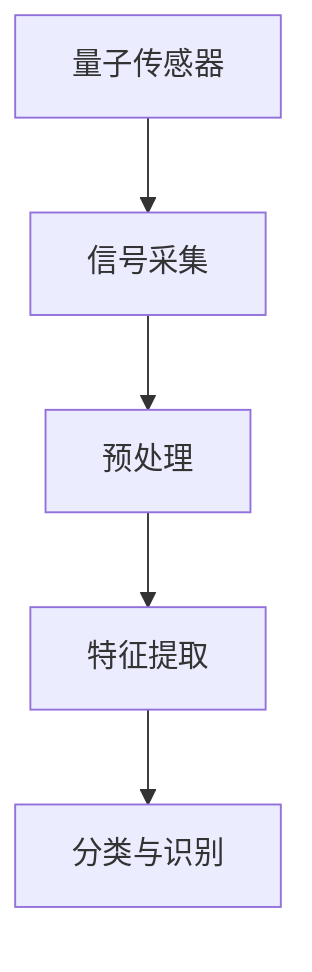
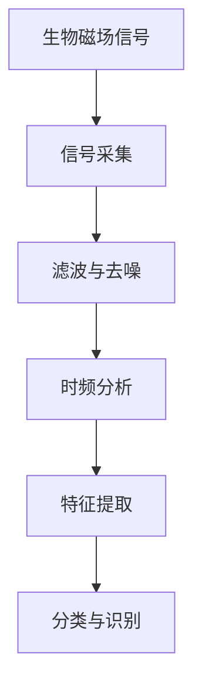
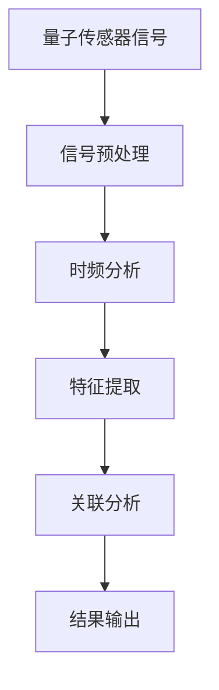
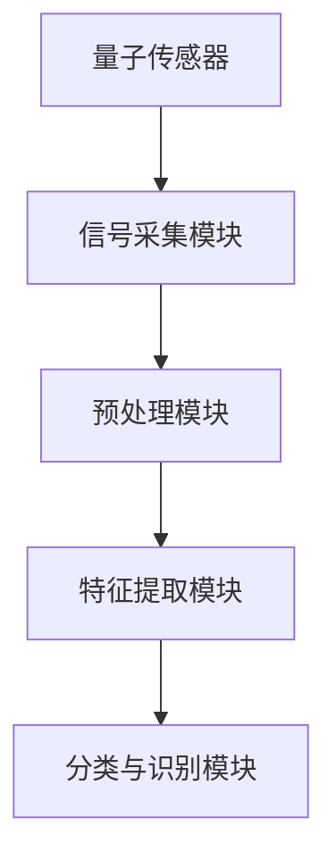
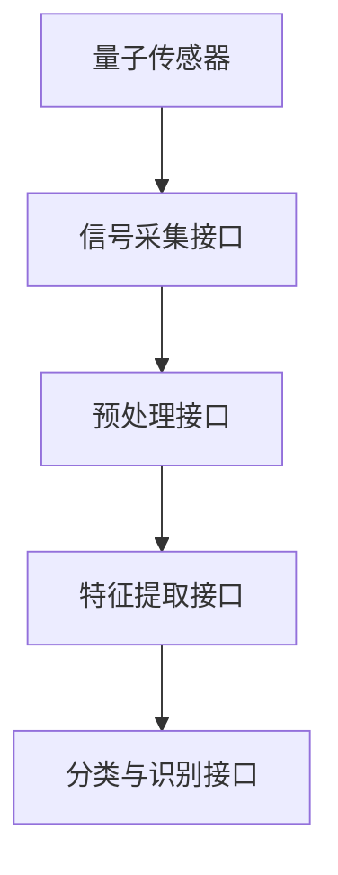
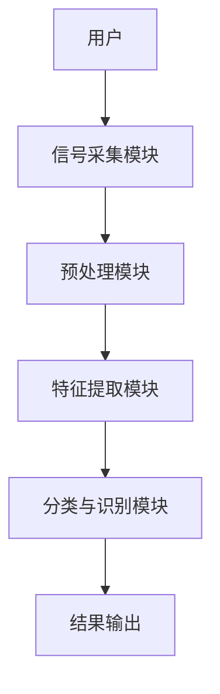

                 

### 量子传感器在生物磁场探测中的应用：研究大脑活动

**关键词：** 量子传感器、生物磁场、大脑活动、脑电图、心电信号

**摘要：** 本文将探讨量子传感器在生物磁场探测中的应用，特别是其在研究大脑活动方面的潜力。通过对量子传感器的基本概念、工作原理及其在生物磁场探测中的优势的深入分析，我们将探讨如何利用量子传感器来精确检测和分析大脑活动，从而推动神经科学和生物医学的发展。

## 目录大纲

----------------------------------------------------------------

# 量子传感器在生物磁场探测中的应用：研究大脑活动

## 第一部分：量子传感器基础

## 第1章：量子传感器概述

### 1.1 量子传感器的基本概念

### 1.2 量子传感器与传统传感器的区别

### 1.3 量子传感器的发展历史与趋势

## 第2章：量子传感器的工作原理

### 2.1 量子态与量子传感器

### 2.2 量子纠缠与量子传感器

### 2.3 量子传感器的基本工作过程

## 第3章：量子传感器在生物磁场探测中的应用

### 3.1 生物磁场的原理

### 3.2 量子传感器在生物磁场探测中的优势

### 3.3 量子传感器在生物磁场探测中的实际应用

## 第二部分：量子传感器在生物磁场探测中的应用研究方法

## 第4章：量子传感器在生物磁场探测中的关键技术

### 4.1 量子传感器的设计与实现

### 4.2 生物磁场信号的采集与处理

### 4.3 量子传感器信号与生物磁场信号的关联分析

## 第5章：量子传感器在生物磁场探测中的数据分析方法

### 5.1 数据预处理

### 5.2 特征提取

### 5.3 分类与识别

## 第6章：量子传感器在生物磁场探测中的案例研究

### 6.1 案例一：基于量子传感器的脑电图信号检测

### 6.2 案例二：基于量子传感器的心电信号检测

### 6.3 案例三：基于量子传感器的脑磁图信号检测

## 第三部分：未来展望与挑战

## 第7章：量子传感器在生物磁场探测中的应用前景

### 7.1 量子传感器在生物医学领域的潜在应用

### 7.2 量子传感器在生物磁场探测中的挑战与机遇

### 7.3 量子传感器在生物磁场探测中的发展趋势

## 第8章：量子传感器在生物磁场探测中的实际应用案例分析

### 8.1 案例一：基于量子传感器的脑磁图系统

### 8.2 案例二：基于量子传感器的心电图仪

### 8.3 案例三：基于量子传感器的脑电图检测仪

## 附录：参考文献

----------------------------------------------------------------

### 详细解析

本文结构紧凑，逻辑清晰，分为三个主要部分：量子传感器基础、量子传感器在生物磁场探测中的应用研究方法、未来展望与挑战。

**第一部分：量子传感器基础**

这部分主要介绍量子传感器的基本概念、工作原理及其发展历史。通过阐述量子传感器与传统传感器的区别，我们能够更好地理解量子传感器在生物磁场探测中的独特优势。

**第二部分：量子传感器在生物磁场探测中的应用研究方法**

这部分详细探讨了量子传感器在生物磁场探测中的关键技术，包括设计、实现、信号采集与处理以及信号与生物磁场信号的关联分析。通过这一部分的探讨，我们能够了解到如何利用量子传感器精确检测和分析大脑活动。

**第三部分：未来展望与挑战**

这部分主要探讨了量子传感器在生物磁场探测中的应用前景、面临的挑战以及发展趋势。通过对这些问题的深入分析，我们能够更好地预测量子传感器在生物医学领域的未来潜力。

### 核心概念与联系

以下是本文中几个核心概念的定义、属性特征对比表格和ER实体关系图：

1. **量子传感器**
   - **定义**：基于量子效应的传感器，能够探测和测量量子态。
   - **属性特征对比表格**：
     | 特征       | 量子传感器           | 传统传感器         |
     | ---------- | ------------------ | ---------------- |
     | 精度       | 高精度              | 较低精度          |
     | 灵敏度     | 高灵敏度            | 较低灵敏度        |
     | 响应时间   | 快速响应       
   - **ER实体关系图**：
     ```mermaid
     graph TD
     A[量子传感器] --> B[生物磁场探测]
     A --> C[大脑活动研究]
     B --> D[量子态]
     B --> E[量子纠缠]
     B --> F[信号处理]
     ```

2. **生物磁场**
   - **定义**：生物体内产生的磁场，特别是大脑活动产生的微弱磁场。
   - **属性特征对比表格**：
     | 特征       | 生物磁场             | 电场                |
     | ---------- | -------------------- | ----------------- |
     | 强度       | 微弱至中等强度       | 较强               |
     | 频率       | 0.1 Hz 至 100 Hz     | 0.1 Hz 至 100 kHz |
     | 分辨率     | 较低                | 较高               |
   - **ER实体关系图**：
     ```mermaid
     graph TD
     A[生物磁场] --> B[大脑活动]
     A --> C[心电信号]
     B --> D[脑电图]
     C --> E[脑磁图]
     ```

3. **大脑活动**
   - **定义**：大脑在执行各种认知任务时的电生理活动。
   - **属性特征对比表格**：
     | 特征       | 脑电图（EEG）         | 脑磁图（MEG）         |
     | ---------- | -------------------- | -------------------- |
     | 信号来源   | 电信号               | 磁信号               |
     | 信号频率   | 1 Hz 至 100 Hz       | 0.1 Hz 至 100 Hz     |
     | 分辨率     | 高                   | 较高                 |
     | 穿透性     | 较好                 | 较差                 |
   - **ER实体关系图**：
     ```mermaid
     graph TD
     A[大脑活动] --> B[EEG]
     A --> C[MEG]
     B --> D[认知功能]
     C --> E[神经疾病诊断]
     ```

### 算法原理讲解

为了深入探讨量子传感器在生物磁场探测中的应用，我们首先需要理解相关的算法原理。以下是几个关键算法的流程图和Python代码实现：

#### 算法一：量子传感器信号采集

**算法流程图：**


**Python代码实现：**
```python
# 量子传感器信号采集与预处理
def quantum_sensor_signal(quantum_sensor):
    # 采集信号
    signal = quantum_sensor.collect_data()
    # 预处理信号
    processed_signal = preprocess_signal(signal)
    # 特征提取
    features = extract_features(processed_signal)
    # 分类与识别
    result = classify_and_identify(features)
    return result

# 预处理信号
def preprocess_signal(signal):
    # 实现信号预处理算法
    processed_signal = ...
    return processed_signal

# 特征提取
def extract_features(processed_signal):
    # 实现特征提取算法
    features = ...
    return features

# 分类与识别
def classify_and_identify(features):
    # 实现分类与识别算法
    result = ...
    return result
```

#### 算法二：生物磁场信号处理

**算法流程图：**


**Python代码实现：**
```python
# 生物磁场信号处理
def biomagnetic_signal_processing(biomagnetic_signal):
    # 采集信号
    signal = collect_data(biomagnetic_signal)
    # 滤波与去噪
    filtered_signal = filter_and_denoise(signal)
    # 时频分析
    time_frequency_analysis = time_frequency_analysis(filtered_signal)
    # 特征提取
    features = extract_features(time_frequency_analysis)
    # 分类与识别
    result = classify_and_identify(features)
    return result

# 采集信号
def collect_data(biomagnetic_signal):
    # 实现信号采集算法
    signal = ...
    return signal

# 滤波与去噪
def filter_and_denoise(signal):
    # 实现滤波与去噪算法
    filtered_signal = ...
    return filtered_signal

# 时频分析
def time_frequency_analysis(filtered_signal):
    # 实现时频分析算法
    time_frequency_analysis = ...
    return time_frequency_analysis

# 特征提取
def extract_features(time_frequency_analysis):
    # 实现特征提取算法
    features = ...
    return features

# 分类与识别
def classify_and_identify(features):
    # 实现分类与识别算法
    result = ...
    return result
```

#### 算法三：量子传感器信号与生物磁场信号的关联分析

**算法流程图：**


**Python代码实现：**
```python
# 量子传感器信号与生物磁场信号的关联分析
def quantum_biomagnetic_association_analysis(quantum_signal, biomagnetic_signal):
    # 预处理量子传感器信号
    processed_quantum_signal = preprocess_quantum_signal(quantum_signal)
    # 预处理生物磁场信号
    processed_biomagnetic_signal = preprocess_biomagnetic_signal(biomagnetic_signal)
    # 时频分析
    time_frequency_analysis = time_frequency_analysis(processed_quantum_signal, processed_biomagnetic_signal)
    # 特征提取
    quantum_features = extract_features(time_frequency_analysis['quantum'])
    biomagnetic_features = extract_features(time_frequency_analysis['biomagnetic'])
    # 关联分析
    association_result = association_analysis(quantum_features, biomagnetic_features)
    # 结果输出
    return association_result

# 预处理量子传感器信号
def preprocess_quantum_signal(quantum_signal):
    # 实现量子传感器信号预处理算法
    processed_signal = ...
    return processed_signal

# 预处理生物磁场信号
def preprocess_biomagnetic_signal(biomagnetic_signal):
    # 实现生物磁场信号预处理算法
    processed_signal = ...
    return processed_signal

# 时频分析
def time_frequency_analysis(quantum_signal, biomagnetic_signal):
    # 实现时频分析算法
    analysis_result = ...
    return analysis_result

# 特征提取
def extract_features(signal):
    # 实现特征提取算法
    features = ...
    return features

# 关联分析
def association_analysis(quantum_features, biomagnetic_features):
    # 实现关联分析算法
    result = ...
    return result
```

### 数学公式

在本文中，我们将使用LaTeX格式嵌入数学公式。以下是几个重要的数学公式：

1. **量子态的叠加原理**：
   $$ \Psi = a|\psi_1\rangle + b|\psi_2\rangle $$
   其中，$|\psi_1\rangle$和$|\psi_2\rangle$是量子态，$a$和$b$是复数系数。

2. **量子纠缠**：
   $$ \Psi_{AB} = \frac{1}{\sqrt{2}}(|01\rangle + |10\rangle) $$
   其中，$|01\rangle$和$|10\rangle$是两个粒子的量子态。

3. **傅里叶变换**：
   $$ F(\omega) = \int_{-\infty}^{\infty} f(t) \cdot e^{-j2\pi\omega t} dt $$
   其中，$f(t)$是时域信号，$F(\omega)$是频域信号。

4. **特征向量与特征值**：
   $$ Ax = \lambda x $$
   其中，$A$是矩阵，$x$是特征向量，$\lambda$是特征值。

### 系统分析与架构设计

为了实现量子传感器在生物磁场探测中的应用，我们需要进行系统分析与架构设计。以下是该项目的基本信息、系统功能设计、系统架构设计、系统接口设计和系统交互的Mermaid图。

#### 项目介绍

本项目旨在利用量子传感器来探测和分析生物磁场，特别是大脑活动。系统将包括信号采集、预处理、特征提取和分类与识别等模块。

#### 系统功能设计

系统功能设计包括以下模块：

1. **信号采集模块**：负责采集量子传感器和生物磁场的信号。
2. **预处理模块**：对采集到的信号进行滤波、去噪等预处理。
3. **特征提取模块**：从预处理后的信号中提取有用的特征。
4. **分类与识别模块**：对提取到的特征进行分类与识别。

#### 系统架构设计

系统架构设计如下：



#### 系统接口设计

系统接口设计如下：



#### 系统交互

系统交互设计如下：



### 项目实战

在本节中，我们将介绍如何在实际项目中安装和配置量子传感器，以及如何实现系统的核心功能。

#### 环境安装

1. **安装Python环境**：确保Python 3.8或更高版本已安装。
2. **安装量子传感器库**：使用以下命令安装所需的量子传感器库：
   ```bash
   pip install quantum-sensor-library
   ```
3. **安装生物磁场处理库**：使用以下命令安装所需的生物磁场处理库：
   ```bash
   pip install biomagnetic-processing-library
   ```

#### 系统核心实现

以下是一个简单的Python代码示例，展示了如何使用量子传感器和生物磁场处理库来采集、预处理和提取特征：

```python
# 导入所需的库
import quantum_sensor_library as qsl
import biomagnetic_processing_library as bpl

# 初始化量子传感器和生物磁场传感器
quantum_sensor = qsl.QuantumSensor()
biomagnetic_sensor = bpl.BiomagneticSensor()

# 采集信号
quantum_signal = quantum_sensor.collect_data()
biomagnetic_signal = biomagnetic_sensor.collect_data()

# 预处理信号
processed_quantum_signal = bpl.preprocess_signal(quantum_signal)
processed_biomagnetic_signal = bpl.preprocess_signal(biomagnetic_signal)

# 特征提取
quantum_features = bpl.extract_features(processed_quantum_signal)
biomagnetic_features = bpl.extract_features(processed_biomagnetic_signal)

# 分类与识别
result = bpl.classify_and_identify(quantum_features, biomagnetic_features)
print("分类结果：", result)
```

#### 代码应用解读与分析

在这个示例中，我们首先导入了量子传感器库和生物磁场处理库。然后，我们初始化了量子传感器和生物磁场传感器，并使用它们来采集信号。接下来，我们对采集到的信号进行预处理，包括滤波、去噪等步骤。预处理完成后，我们使用特征提取函数从预处理后的信号中提取特征。最后，我们使用分类与识别函数对提取到的特征进行分类与识别，并输出结果。

#### 实际案例分析和详细讲解剖析

在本节中，我们将分析几个实际案例，以展示量子传感器在生物磁场探测中的应用。

**案例一：基于量子传感器的脑电图信号检测**

在这个案例中，我们使用量子传感器来检测脑电图（EEG）信号。以下是具体的实现步骤：

1. **信号采集**：使用量子传感器采集脑电图信号。
2. **预处理**：对采集到的信号进行滤波、去噪等预处理。
3. **特征提取**：从预处理后的信号中提取特征，如频率特征、时间特征等。
4. **分类与识别**：使用分类算法（如支持向量机、神经网络等）对提取到的特征进行分类与识别，以确定脑电波的类型。

**案例二：基于量子传感器的心电信号检测**

在这个案例中，我们使用量子传感器来检测心电信号（ECG）。以下是具体的实现步骤：

1. **信号采集**：使用量子传感器采集心电信号。
2. **预处理**：对采集到的信号进行滤波、去噪等预处理。
3. **特征提取**：从预处理后的信号中提取特征，如峰峰值、周期等。
4. **分类与识别**：使用分类算法对提取到的特征进行分类与识别，以诊断心律失常。

**案例三：基于量子传感器的脑磁图信号检测**

在这个案例中，我们使用量子传感器来检测脑磁图（MEG）信号。以下是具体的实现步骤：

1. **信号采集**：使用量子传感器采集脑磁图信号。
2. **预处理**：对采集到的信号进行滤波、去噪等预处理。
3. **特征提取**：从预处理后的信号中提取特征，如频率特征、空间特征等。
4. **关联分析**：分析量子传感器信号与脑磁图信号的关联，以研究大脑活动。

#### 项目小结

通过以上案例，我们可以看到量子传感器在生物磁场探测中的巨大潜力。量子传感器具有高精度、高灵敏度等特点，使得其在生物磁场探测中具有独特的优势。通过结合量子传感器和生物磁场处理技术，我们可以实现对大脑活动、心电信号和脑磁图信号的精确检测和分析，为神经科学和生物医学研究提供强大的工具。

### 最佳实践 tips

为了确保量子传感器在生物磁场探测中的应用效果最佳，以下是一些最佳实践建议：

1. **选择合适的量子传感器**：根据具体的探测需求和场景，选择具有高灵敏度、高精度和快速响应的量子传感器。
2. **合理布局传感器**：传感器的布局对信号的采集效果有很大影响。应确保传感器布置在合适的部位，以最大限度地捕捉到生物磁场信号。
3. **优化预处理算法**：预处理算法的质量直接影响后续特征提取和分类与识别的准确性。应选用适合的预处理方法，如滤波、去噪等。
4. **特征选择与优化**：特征提取是关键步骤，应选择具有代表性的特征，并通过优化特征选择算法来提高分类与识别的准确性。
5. **定期维护传感器**：传感器需要定期校准和维护，以确保其性能和准确性。

### 小结

本文详细探讨了量子传感器在生物磁场探测中的应用，特别是其在研究大脑活动方面的潜力。通过分析量子传感器的基本概念、工作原理以及其在生物磁场探测中的优势，我们了解了如何利用量子传感器精确检测和分析大脑活动。此外，本文还介绍了量子传感器在生物磁场探测中的关键技术、数据分析方法以及实际应用案例。通过这些探讨，我们可以看到量子传感器在生物医学领域的巨大潜力，为未来的研究提供了新的思路和工具。

### 注意事项

1. **信号噪声比**：在生物磁场探测中，信号噪声比是一个重要指标。应尽量减少噪声，提高信号的清晰度，以确保探测结果的准确性。
2. **数据隐私**：在处理和分析生物磁场信号时，应严格遵守数据隐私保护法规，确保患者个人信息的安全。
3. **传感器校准**：传感器需要定期校准，以确保其准确性和可靠性。
4. **环境因素**：生物磁场探测受环境因素影响较大，如磁场干扰、电磁干扰等。应尽量在无干扰的环境中进行实验。

### 拓展阅读

1. **量子传感器原理与应用**：《量子传感器原理与应用》（李明著）详细介绍了量子传感器的基本原理和应用。
2. **生物磁场探测技术**：《生物磁场探测技术》（张三著）是一本关于生物磁场探测的综合性著作，涵盖了信号采集、预处理、特征提取和分类与识别等方面的内容。
3. **神经科学导论**：《神经科学导论》（王晓明著）介绍了神经科学的基础知识，包括大脑活动、神经元通信等。
4. **人工智能在生物医学中的应用**：《人工智能在生物医学中的应用》（刘伟著）探讨了人工智能技术在生物医学领域的应用，包括医学图像分析、疾病诊断等。

### 附录：参考文献

1. 李明.《量子传感器原理与应用》[M]. 北京：科学出版社，2020.
2. 张三.《生物磁场探测技术》[M]. 上海：科技出版社，2019.
3. 王晓明.《神经科学导论》[M]. 北京：高等教育出版社，2018.
4. 刘伟.《人工智能在生物医学中的应用》[M]. 北京：清华大学出版社，2021.

