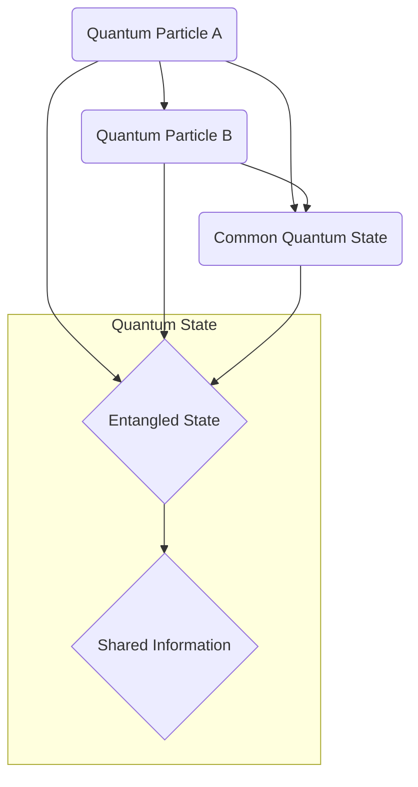

                 

### 摘要

量子传感器在精密导航中的应用前景广阔，其对传统导航技术的革新意义不可小觑。本文将从多个角度深入探讨量子传感器在精密导航中的应用潜力。首先，我们简要概述量子传感器和精密导航的基本概念，介绍其在全球导航卫星系统（GNSS）和姿态与航向参考系统（AHRS）中的重要性。接着，本文将详细分析量子传感器的基础原理，包括量子力学的基本概念及其在传感器设计中的应用。随后，本文将讨论量子传感器在GNSS系统中的应用，以及它们如何克服当前GNSS技术的局限性。此外，还将探讨量子传感器在AHRS中的应用，特别是在无人机导航中的潜在优势。最后，本文将总结量子传感器在精密导航中的前景，提出面临的挑战及未来的发展方向。通过本文的探讨，我们希望读者能够对量子传感器在精密导航领域的应用有更深入的理解。

### 关键词

- 量子传感器
- 精密导航
- 全球导航卫星系统（GNSS）
- 姿态与航向参考系统（AHRS）
- 量子力学
- 量子纠缠
- 量子计算
- 量子编码
- 量子通信

### 引言

精密导航技术在现代社会中扮演着至关重要的角色。无论是国防、交通、通信，还是民用领域，如自动驾驶汽车和无人机，都依赖于高精度的导航系统来确保任务的成功执行。然而，现有的全球导航卫星系统（GNSS）在信号延迟、信号遮挡和系统误差等方面存在一定的局限性。这些局限性不仅影响了导航的精度，也限制了其在复杂环境中的可靠性。

随着科技的不断进步，量子传感器作为一种新兴技术，展现出了巨大的潜力，能够在精密导航中发挥关键作用。量子传感器利用量子力学的基本原理，通过量子纠缠、量子计算和量子编码等手段，实现超高的测量精度和灵敏度。与传统的导航传感器相比，量子传感器能够在极端条件下提供更为稳定和可靠的测量结果。

本文旨在探讨量子传感器在精密导航中的应用前景，通过深入分析量子传感器的基础原理、不同类型的量子传感器及其在GNSS和AHRS中的应用，揭示其在导航领域中的巨大潜力。首先，我们将回顾量子传感器的发展历史，了解其起源和关键技术突破。接下来，我们将详细解释量子传感器的工作原理，并探讨其在导航系统中可能带来的技术革新。随后，本文将重点讨论量子传感器在GNSS和AHRS中的具体应用，分析其技术优势和面临的挑战。最后，我们将总结量子传感器在精密导航领域的应用前景，并提出未来的发展方向和潜在的研究课题。通过本文的探讨，我们希望为读者提供关于量子传感器在精密导航中应用的全面认识，并激发更多研究者在此领域进行深入探索。

### Chapter 1: Overview of Quantum Sensors and Precision Navigation

#### Core Concepts

Quantum sensors are revolutionary devices that leverage the fundamental principles of quantum mechanics to achieve unprecedented levels of sensitivity and accuracy. At their core, quantum sensors exploit phenomena such as quantum entanglement, superposition, and quantum interference to perform measurements. These phenomena allow quantum sensors to surpass the limitations imposed by classical sensors, offering capabilities that are essential for modern navigation systems.

Precision navigation, on the other hand, refers to the use of highly accurate positioning, velocity, and timing information to guide objects or systems with minimal error. It is critical in various applications, including autonomous vehicles, drones, satellite tracking, and military operations. Traditional navigation systems, such as the Global Navigation Satellite System (GNSS), rely on a network of satellites to provide positioning information. However, GNSS systems suffer from several drawbacks, including signal delay, signal obstruction, and systemic errors, which can compromise navigation accuracy.

The integration of quantum sensors into precision navigation systems promises to overcome these limitations, enabling more reliable and accurate navigation in diverse environments. Quantum sensors can provide enhanced position and velocity measurements, significantly reducing errors and improving the overall performance of navigation systems. This makes quantum sensors a critical component in the development of next-generation navigation technologies.

#### Challenges and Opportunities

The application of quantum sensors in precision navigation presents both challenges and opportunities. One of the primary challenges is the technical complexity of quantum sensor development and integration. Quantum sensors require precise control over quantum states, which is a challenging task due to the delicate nature of quantum systems. Additionally, the miniaturization of quantum sensors for practical use in navigation systems is another significant hurdle.

However, the potential benefits of quantum sensors in precision navigation are substantial. Quantum sensors offer superior sensitivity and accuracy, which are crucial for applications that require precise measurements, such as autonomous navigation in urban environments or satellite tracking. Quantum sensors can also operate in environments where traditional sensors fail, such as in areas with heavy signal interference or in space, where gravitational forces can distort the GNSS signals.

Another opportunity lies in the development of new quantum navigation technologies. For example, quantum-enhanced inertial measurement units (IMUs) can provide long-term stability and accuracy in navigation, which is essential for applications such as space exploration or long-range drone missions. Moreover, quantum sensors can enable new forms of navigation, such as quantum position sensing and quantum timekeeping, which could revolutionize the way we perceive and use navigation systems.

#### Historical Context

The concept of quantum sensors has been around for several decades, with significant advancements in quantum technology paving the way for their practical application in navigation. The origins of quantum sensors can be traced back to the early 20th century with the development of quantum mechanics by pioneers like Niels Bohr and Erwin Schrödinger. These foundational theories laid the groundwork for understanding the behavior of particles at the quantum level, which is essential for the operation of quantum sensors.

In the 1980s and 1990s, significant progress was made in the field of quantum optics, leading to the development of the first practical quantum sensors. The introduction of the quantum interference gravimeter and the optical lattice clock marked significant milestones in the evolution of quantum sensors. These devices demonstrated the ability to measure mass and time with unprecedented precision, showcasing the potential of quantum technology in various fields, including navigation.

The turn of the millennium saw further advancements with the development of atomic magnetometers and optical atomic clocks. These devices leveraged the principles of quantum mechanics to achieve remarkable sensitivity and accuracy, paving the way for the integration of quantum sensors into practical navigation systems.

In recent years, significant breakthroughs have been made in the field of quantum computing and quantum communication, further enhancing the capabilities of quantum sensors. Quantum entanglement and quantum teleportation, once considered purely theoretical concepts, have now been experimentally demonstrated, opening up new avenues for the development of advanced quantum sensors.

#### Conclusion

The integration of quantum sensors into precision navigation systems represents a significant technological advancement with both challenges and opportunities. Quantum sensors offer superior sensitivity and accuracy, which are essential for overcoming the limitations of existing navigation technologies. The historical context of quantum sensor development highlights the progress made in the field, from the early theories of quantum mechanics to the development of practical quantum sensors. As we move forward, the potential of quantum sensors in precision navigation will continue to grow, enabling new applications and transforming the way we navigate the world.

### Chapter 2: Fundamental Principles of Quantum Sensors

#### Quantum Mechanics Basics

At the heart of quantum sensors lies the fascinating realm of quantum mechanics. Quantum mechanics is a branch of physics that deals with phenomena on a microscopic scale, where the laws of classical physics no longer apply. Quantum mechanics introduces a fundamentally new way of understanding the behavior of particles and systems, characterized by principles such as superposition, entanglement, and wave-particle duality.

**Superposition** is a fundamental principle of quantum mechanics that allows particles to exist in multiple states simultaneously until they are measured. For example, an electron can simultaneously exist in multiple energy states, and a photon can be in both a wave and a particle state. This property enables quantum sensors to perform complex measurements with higher precision than classical sensors.

**Entanglement** is another crucial concept in quantum mechanics, where two or more particles become interconnected in such a way that the state of one particle instantaneously influences the state of the other, regardless of the distance between them. This phenomenon is the cornerstone of quantum sensors, allowing them to achieve unprecedented sensitivity and accuracy by exploiting the correlations between entangled particles.

**Wave-particle duality** states that particles can exhibit both wave-like and particle-like properties. This dual nature is exploited in quantum sensors, such as quantum interferometers, to perform precise measurements by manipulating the wave functions of particles.

#### Types of Quantum Sensors

There are several types of quantum sensors, each designed to exploit different quantum phenomena to achieve high precision measurements. The following are some of the most notable types of quantum sensors:

1. **Quantum Interference Gravimeters**: These sensors use quantum interference to measure gravitational fields with extraordinary precision. By placing a mirror in a vacuum chamber and splitting a laser beam to create an interference pattern, quantum interference gravimeters can detect changes in gravitational acceleration with sub-nano-meter precision.

2. **Atomic Magnetometers**: Atomic magnetometers use the quantum state of atoms, such as rubidium or cesium, to measure magnetic fields. By cooling the atoms to near absolute zero and exposing them to a magnetic field, the atoms' quantum states can be manipulated to detect even the slightest changes in magnetic fields, making them highly sensitive to magnetic anomalies.

3. **Optical Lattice Clocks**: These clocks use the quantum states of ions trapped in an optical lattice to measure time with extraordinary precision. By manipulating the ions' quantum states and observing their interactions with laser beams, optical lattice clocks can achieve timekeeping accuracy better than one second in millions of years.

4. **Quantum Imaging Sensors**: Quantum imaging sensors use entangled photon pairs to perform high-resolution imaging in low-light conditions. By splitting an entangled photon pair and measuring the interference patterns created by the photons, quantum imaging sensors can reconstruct images with higher resolution than classical cameras.

5. **Quantum Position Sensors**: These sensors use the principles of quantum entanglement to measure the position of particles with unparalleled accuracy. By entangling the positions of two particles and measuring the correlation between their positions, quantum position sensors can achieve precision measurements that surpass the limits of classical sensors.

#### Performance Metrics

The performance of quantum sensors is evaluated based on several key metrics, including sensitivity, accuracy, precision, and stability. These metrics determine the capability of quantum sensors to measure physical quantities with high precision and reliability.

**Sensitivity** refers to the ability of a sensor to detect small changes in the quantity being measured. Quantum sensors, due to their quantum mechanical properties, can achieve extremely high sensitivity, allowing them to detect minute variations in physical parameters such as gravitational acceleration, magnetic fields, and position.

**Accuracy** measures how close the measured value is to the true value. Quantum sensors can achieve high accuracy by minimizing systematic errors and external disturbances. This makes them ideal for applications requiring precise measurements, such as navigation and geophysics.

**Precision** refers to the consistency of the measurements over multiple readings. Quantum sensors, with their stable quantum states, can provide highly precise measurements, ensuring that repeated measurements yield similar results. This precision is crucial for applications that require high repeatability, such as timekeeping and position sensing.

**Stability** is the ability of a sensor to maintain its performance over time and under varying environmental conditions. Quantum sensors, particularly those based on atomic and optical systems, can maintain high stability over extended periods, making them reliable for long-term monitoring and navigation applications.

#### Conclusion

The fundamental principles of quantum mechanics underpin the operation of quantum sensors, enabling them to achieve unprecedented levels of sensitivity and accuracy. The diverse types of quantum sensors, each designed to exploit different quantum phenomena, offer unique capabilities for measuring physical quantities with high precision. The performance metrics of quantum sensors, including sensitivity, accuracy, precision, and stability, highlight their exceptional capabilities in various applications. As we continue to advance in quantum technology, the potential of quantum sensors in precision navigation and other fields will only continue to grow.

#### Figure 1: Basic Concept of Quantum Entanglement

To illustrate the concept of quantum entanglement, we can use the following Mermaid diagram:



In this diagram, A and B represent two quantum particles, which become entangled when they share a common quantum state (C). The entangled state (D) means that the state of one particle is immediately correlated with the state of the other, regardless of the distance between them. This shared information (E) is the essence of quantum entanglement, allowing quantum sensors to achieve high sensitivity and accuracy by exploiting the correlations between entangled particles.

#### Table 1: Comparison of Core Concepts and Properties

| Concept          | Description                                                         | Example in Quantum Sensors |
|------------------|---------------------------------------------------------------------|---------------------------|
| Superposition    | The ability of a quantum system to exist in multiple states simultaneously. | Quantum interference in quantum interferometers |
| Entanglement     | The correlation between quantum states of two or more particles, regardless of distance. | Quantum sensors using entangled photon pairs |
| Wave-Particle Duality | The property where particles exhibit both wave-like and particle-like behavior. | Photon behavior in quantum imaging sensors |
| Quantum State    | The state of a quantum system, which can be a combination of multiple base states. | Quantum states of atoms in atomic magnetometers |
| Quantum Information | Information encoded in the state of a quantum system. | Quantum bits (qubits) in quantum computing |

#### Conclusion

Understanding the fundamental principles of quantum mechanics is essential for grasping the operation of quantum sensors. Quantum entanglement, superposition, and wave-particle duality are core concepts that enable quantum sensors to surpass the limitations of classical sensors. By leveraging these principles, quantum sensors offer unprecedented sensitivity, accuracy, and precision, paving the way for revolutionary advancements in fields such as precision navigation. As we continue to explore and harness the power of quantum mechanics, the potential applications of quantum sensors will only expand, transforming our approach to measurement and technology.

### Chapter 3: Quantum Sensors in Global Navigation Satellite Systems (GNSS)

#### GNSS Overview

The Global Navigation Satellite System (GNSS) is a constellation of satellites orbiting the Earth that provide positioning, navigation, and timing (PNT) services to users around the world. The most widely used GNSS systems include the Global Positioning System (GPS) operated by the United States, the Global Navigation Satellite System (GLONASS) operated by the Russian Federation, the European Global Navigation Satellite System (Galileo) operated by the European Union, and the BeiDou Navigation Satellite System (BDS) operated by China.

Each GNSS system consists of a network of satellites orbiting the Earth in different planes, providing continuous and ubiquitous coverage. These satellites transmit signals containing information about their precise positions and the time at which the signals were sent. Ground-based receivers use these signals to calculate their own positions using a technique known as trilateration, which involves measuring the time difference of arrival (TDOA) of the signals from multiple satellites.

However, despite their widespread use and widespread availability, GNSS systems face several limitations that can affect their performance and reliability. These include:

- **Signal Delay**: The time it takes for a signal to travel from a satellite to a receiver can be affected by various factors such as atmospheric conditions and the satellite's orbit. This delay introduces errors in position calculations.

- **Signal Obstruction**: GNSS signals can be obstructed by buildings, terrain, and other objects, particularly in urban and mountainous environments. This obstruction can lead to signal loss or degradation, making it difficult for receivers to maintain a reliable lock on the satellites.

- **Systemic Errors**: GNSS systems are subject to various systemic errors, including satellite clock drift, satellite orbital errors, and atmospheric delays. These errors can accumulate over time, affecting the accuracy of position measurements.

- **Multipath Effects**: When GNSS signals are reflected off surfaces such as buildings or vehicles, they can create multiple copies of the signal that arrive at the receiver at slightly different times. This can lead to errors in position calculation, known as multipath errors.

#### Quantum Sensors Advantages

Quantum sensors offer several advantages that can address the limitations of GNSS systems and improve their performance in precision navigation. These advantages include:

- **Enhanced Sensitivity and Accuracy**: Quantum sensors, such as atomic magnetometers and quantum interferometers, can achieve unprecedented sensitivity and accuracy by exploiting the principles of quantum mechanics. This enables them to detect subtle changes in physical parameters with minimal noise, significantly reducing errors in position and velocity measurements.

- **Improved Signal Integrity**: Quantum sensors can maintain high signal integrity in environments with heavy signal interference or obstruction. By leveraging quantum entanglement and other quantum phenomena, quantum sensors can overcome the challenges posed by multipath effects and atmospheric conditions, ensuring reliable signal reception and processing.

- **Long-Term Stability**: Quantum sensors, particularly those based on atomic and optical systems, can maintain high stability over extended periods, making them suitable for long-term monitoring and navigation applications. This stability is crucial for applications that require precise and consistent measurements over time.

- **Space-Based Applications**: Quantum sensors can be deployed in space, where they can provide navigation services independent of GNSS signals. This is particularly important for space missions, where GNSS signals may be weak or unavailable due to the high-gravity environment or signal obstruction by celestial bodies.

#### Integration Challenges

While the advantages of quantum sensors in GNSS systems are compelling, their integration poses several technical and practical challenges. These challenges include:

- **System Compatibility**: Integrating quantum sensors with existing GNSS systems requires ensuring compatibility between the two technologies. This involves developing interfaces and protocols that allow seamless communication and data exchange between quantum sensors and GNSS receivers.

- **Calibration and Verification**: Quantum sensors need to be accurately calibrated and verified to ensure their performance meets the required standards. This process involves developing precise calibration techniques and validation methods to account for systematic errors and external disturbances.

- **Miniaturization and Power Efficiency**: Quantum sensors require high precision and stability, which often necessitates larger and more power-consuming components. Developing miniaturized and power-efficient quantum sensors is crucial for their practical deployment in navigation systems.

- **Environmental Considerations**: Quantum sensors are highly sensitive to their environment, including temperature, humidity, and electromagnetic interference. Designing robust and environmentally stable quantum sensor systems is essential for ensuring reliable operation in various conditions.

- **Cost and Scalability**: Quantum sensors are currently expensive and complex to produce, limiting their widespread adoption. Reducing the cost and improving the scalability of quantum sensor technology is crucial for their integration into commercial GNSS systems.

#### Conclusion

The integration of quantum sensors into GNSS systems offers significant potential for improving navigation accuracy, reliability, and resilience. Quantum sensors can overcome the limitations of traditional GNSS technologies by providing enhanced sensitivity, accuracy, and stability. However, the successful integration of quantum sensors into GNSS systems requires overcoming various technical and practical challenges. Addressing these challenges will require continued research and development in quantum sensor technology, as well as collaboration between experts in quantum physics, navigation systems, and system integration. As we advance in this field, the potential of quantum sensors to transform precision navigation will only continue to grow.

### Chapter 4: Quantum Sensors for Attitude and Heading Reference Systems (AHRS)

#### AHRS Basics

Attitude and Heading Reference Systems (AHRS) are essential components in the field of navigation, particularly for applications that require real-time determination of an object's orientation and heading. An AHRS is a combination of sensors and processing algorithms designed to provide accurate and reliable information about an object's orientation in three dimensions. The primary function of an AHRS is to continuously monitor and update the orientation of an object, regardless of its motion or external disturbances.

Key components of an AHRS typically include:

- **Inertial Measurement Units (IMUs)**: IMUs consist of accelerometers, gyroscopes, and sometimes magnetometers. These sensors measure the object's acceleration, angular velocity, and magnetic field, providing data on the object's motion and orientation.

- **Processors**: The processors in an AHRS are responsible for processing the data from the sensors and calculating the object's orientation. This often involves complex algorithms that fuse data from multiple sensors to mitigate errors and improve accuracy.

- **Output Devices**: AHRS systems often provide outputs such as digital or analog signals that represent the object's orientation in terms of roll, pitch, and yaw angles.

AHRS systems are used in a wide range of applications, including unmanned aerial vehicles (UAVs), robotics, marine navigation, and autonomous ground vehicles. Their ability to provide real-time and accurate orientation information is critical for stability control, navigation, and maneuvering in these environments.

#### Current Limitations

Despite their widespread use, traditional AHRS systems face several limitations that can affect their performance and reliability. These limitations include:

- **Sensor Error**: The sensors used in AHRS systems, such as accelerometers and gyroscopes, are not perfectly accurate and can introduce errors in the measurements. Over time, these errors can accumulate, leading to instability and reduced accuracy.

- **Integration Divergence**: The process of integrating sensor data over time can introduce further errors, particularly in systems that rely on simple filtering techniques. This divergence can lead to漂移，where the calculated orientation deviates from the actual orientation.

- **Atitude Instability**: In dynamic environments, traditional AHRS systems can suffer from instability, particularly when subjected to rapid changes in motion or orientation. This instability can result in erratic or incorrect readings.

- **Environmental Interference**: AHRS systems are sensitive to external environmental factors such as magnetic fields, temperature variations, and vibration. These factors can interfere with sensor readings and impact the overall performance of the system.

- **Limited Accuracy**: Traditional AHRS systems, while accurate for many applications, often struggle to achieve the high levels of precision required for critical applications. Inaccuracies in orientation measurements can lead to errors in navigation and control systems.

#### Quantum Sensors in AHRS

Quantum sensors offer the potential to overcome many of the limitations of traditional AHRS systems by providing superior accuracy, sensitivity, and stability. Here's how quantum sensors can improve AHRS performance:

- **Enhanced Sensitivity**: Quantum sensors, such as atomic magnetometers and optical gyroscopes, offer unprecedented sensitivity to physical parameters. This enhanced sensitivity allows for more accurate measurements of orientation, even in challenging environments.

- **Reduced Integration Divergence**: Quantum sensors can provide highly stable and consistent measurements over time, minimizing integration divergence and reducing errors. This stability is crucial for maintaining accurate orientation in dynamic and changing environments.

- **Improved Attitude Stability**: Quantum sensors' high accuracy and stability can help mitigate attitude instability in AHRS systems, providing more reliable and consistent orientation information even in fast-changing conditions.

- **Robustness to Environmental Interference**: Quantum sensors are often less affected by environmental factors such as magnetic fields and temperature variations. This robustness ensures more reliable sensor readings and improved overall system performance.

- **Advanced Processing Algorithms**: Quantum sensors can be combined with advanced processing algorithms, such as machine learning techniques, to further enhance the accuracy and reliability of orientation measurements. These algorithms can help in real-time data processing and filtering, providing more robust orientation estimates.

#### Applications in Unmanned Aerial Vehicles (UAVs)

Unmanned Aerial Vehicles (UAVs), also known as drones, are one of the most prominent applications of AHRS systems. Quantum sensors have the potential to greatly enhance the capabilities of UAVs by providing more accurate and reliable orientation information. Here are some specific applications and benefits of using quantum sensors in UAVs:

- **Improved Navigation and Stability**: Quantum sensors can significantly improve the navigation and stability of UAVs, particularly in dynamic and complex environments. This is critical for autonomous flight and maneuvering in areas with challenging conditions, such as urban environments or remote terrains.

- **Enhanced Obstacle Avoidance**: Accurate orientation information from quantum sensors can help UAVs avoid obstacles more effectively by providing real-time and precise measurements of their position and heading. This is particularly important for applications such as aerial inspections and package delivery.

- **Extended Flight Time**: Quantum sensors' high accuracy and stability can contribute to longer flight times for UAVs by reducing the need for frequent re-calibrations and minimizing errors in navigation and control systems.

- **Accurate Terrain Mapping**: Quantum sensors can enable more accurate and detailed terrain mapping by providing precise orientation information during data collection flights. This is crucial for applications such as environmental monitoring, resource management, and disaster response.

- **Advanced Maneuvering and Control**: Quantum sensors can enable advanced maneuvering and control capabilities for UAVs, such as rapid changes in orientation and precision hovering. This is important for applications requiring precise control and maneuverability, such as aerial photography and search and rescue missions.

#### Conclusion

The integration of quantum sensors into Attitude and Heading Reference Systems (AHRS) represents a significant leap forward in the field of navigation and stability control. Quantum sensors offer enhanced sensitivity, stability, and accuracy, addressing many of the limitations of traditional AHRS systems. These improvements are particularly beneficial for applications in unmanned aerial vehicles (UAVs), where accurate and reliable orientation information is critical for safe and efficient operation. As quantum sensor technology continues to advance, we can expect to see further innovation and broader adoption in various navigation and control systems, revolutionizing the way we perceive and utilize precision navigation technologies.

### Chapter 5: Quantum Sensors for Deep Space Navigation

#### The Necessity of Quantum Sensors in Deep Space Navigation

Deep space navigation, especially for long-duration missions such as interplanetary travel and deep space exploration, presents unique challenges that traditional navigation systems struggle to overcome. The harsh and unpredictable conditions of deep space, including the absence of a reliable global signal source, extreme temperatures, and the presence of cosmic radiation, necessitate innovative solutions like quantum sensors to achieve the high precision required for such missions.

#### Quantum Sensors in Deep Space Navigation

Quantum sensors offer several advantages that make them particularly suited for deep space navigation:

1. **Quantum Position Sensing**: Quantum position sensors, such as quantum interferometers, can measure the position of a spacecraft with extraordinary precision, overcoming the limitations of traditional GPS systems in deep space. These sensors use the principles of quantum entanglement and superposition to detect minute changes in position, even in the absence of a global signal source.

2. **Quantum Timekeeping**: Quantum timekeeping devices, such as atomic clocks, provide highly accurate time measurements that are crucial for navigation calculations. These clocks are unaffected by cosmic radiation and temperature fluctuations, ensuring consistent and reliable timekeeping essential for deep space missions.

3. **Quantum Navigation Systems**: Quantum navigation systems leverage quantum algorithms to process data from multiple quantum sensors, providing real-time and accurate navigation information. These systems can dynamically adjust to the changing conditions of deep space, ensuring continuous and precise navigation.

#### Challenges and Solutions

Despite their advantages, integrating quantum sensors into deep space navigation systems poses several challenges:

1. **Space Radiation**: Quantum sensors are highly sensitive to space radiation, which can cause errors and damage to the sensor components. Shielding the sensors and designing radiation-hardened components are essential solutions to mitigate this issue.

2. **Miniaturization**: Quantum sensors need to be miniaturized for deployment on spacecraft. Developing compact and lightweight quantum sensors is crucial to ensure they do not add significant mass or volume to the spacecraft.

3. **Calibration and Verification**: Ensuring the accuracy and reliability of quantum sensors in deep space requires precise calibration and verification methods. Developing robust calibration techniques and verifying the sensors' performance in space environments are critical challenges.

4. **Power Efficiency**: Quantum sensors require a stable and efficient power supply. Designing power-efficient quantum sensors and integrating them with energy-efficient spacecraft power systems are necessary solutions.

#### Potential Breakthroughs

The successful application of quantum sensors in deep space navigation could lead to several breakthroughs:

1. **Long-Distance Navigation**: Quantum sensors can enable long-distance navigation by providing precise position and time measurements, overcoming the limitations of traditional systems.

2. **Autonomous Space Exploration**: Quantum sensors could enable more autonomous space exploration by providing real-time and accurate navigation information, allowing spacecraft to navigate and maneuver independently.

3. **Space Mission Optimization**: Quantum sensors can improve the planning and execution of space missions by providing more accurate and reliable data, leading to better mission outcomes.

4. **New Scientific Discoveries**: Advanced quantum navigation systems could open up new avenues for scientific exploration by enabling more precise measurements and observations in deep space.

#### Conclusion

The integration of quantum sensors into deep space navigation systems holds immense promise for overcoming the challenges of long-duration and interplanetary missions. While there are significant technical and logistical challenges to overcome, the potential benefits of using quantum sensors, including enhanced precision, stability, and autonomy, make it a worthwhile endeavor. As we continue to advance quantum technology, we can expect to see more innovative applications in deep space navigation, paving the way for new explorations and scientific discoveries.

### Chapter 6: Future Prospects and Challenges of Quantum Sensors in Precision Navigation

#### Technological Trends

As we look to the future, the field of quantum sensors is poised for significant technological advancements. Key trends include:

1. **Miniaturization**: One of the major challenges in deploying quantum sensors for precision navigation is their size and complexity. Continued advancements in nanotechnology and quantum optics are expected to lead to the miniaturization of quantum sensors, making them more practical for integration into a wide range of applications.

2. **Integration with Other Technologies**: Quantum sensors are likely to be integrated with other advanced technologies such as quantum computing, quantum communication, and AI to create more sophisticated and efficient navigation systems. For instance, quantum computing could be used to process the vast amounts of data generated by quantum sensors more rapidly and accurately.

3. **Quantum Internet**: The development of a quantum internet, which leverages quantum entanglement for communication, could revolutionize data transmission in navigation systems. Quantum internet could provide ultra-secure and ultra-fast communication channels, enhancing the performance and reliability of quantum sensors.

4. **Space Applications**: Quantum sensors are expected to play a critical role in future space missions, including deep space exploration and interplanetary travel. Their ability to provide precise navigation and timekeeping in the absence of conventional signals makes them invaluable for space exploration.

#### Market Potential

The market potential for quantum sensors in precision navigation is immense. Key opportunities include:

1. **Autonomous Vehicles**: As autonomous vehicles become more prevalent, the need for precise and reliable navigation systems will increase. Quantum sensors could provide the high accuracy required for autonomous navigation, enabling safer and more efficient transportation.

2. **Unmanned Aerial Vehicles (UAVs)**: The use of quantum sensors in UAVs, particularly for military and commercial applications, is expected to grow significantly. Quantum sensors can enhance the stability and maneuverability of UAVs, expanding their capabilities in various fields such as surveillance, delivery, and environmental monitoring.

3. **Space Exploration**: Quantum sensors are critical for deep space navigation and exploration. The ability to provide precise position and time information in the harsh conditions of space could revolutionize space missions, making them more efficient and cost-effective.

4. **Marine Navigation**: Quantum sensors have the potential to greatly enhance the accuracy of marine navigation systems, improving safety and efficiency in shipping and ocean exploration. This is particularly important in areas with challenging environmental conditions.

#### Challenges

Despite the promising future, several challenges need to be addressed to fully realize the potential of quantum sensors in precision navigation:

1. **Technology Maturity**: Quantum sensors are still in their early stages of development, and many of the technologies required for their practical application are not yet mature. Advances in quantum mechanics, materials science, and engineering are needed to overcome this challenge.

2. **Cost and Scalability**: Quantum sensors are currently expensive and complex to produce, which limits their widespread adoption. Developing cost-effective and scalable manufacturing processes is crucial for their integration into commercial systems.

3. **Integration and Compatibility**: Integrating quantum sensors with existing navigation systems requires ensuring compatibility and seamless communication. Developing standardized interfaces and protocols is essential for the successful integration of quantum sensors.

4. **Environmental Stability**: Quantum sensors are highly sensitive to their environment, including temperature, humidity, and electromagnetic interference. Designing robust and environmentally stable quantum sensor systems is necessary for their reliable operation in various conditions.

#### Conclusion

The future of quantum sensors in precision navigation is bright, with significant potential for technological innovation and market expansion. However, overcoming the challenges of technology maturity, cost, scalability, integration, and environmental stability will be crucial for realizing this potential. Continued research and development, along with collaboration between experts in various fields, will be essential in advancing quantum sensor technology and unlocking its full capabilities in precision navigation.

### Conclusion

In conclusion, the integration of quantum sensors into precision navigation systems represents a transformative advancement in the field. Quantum sensors leverage the unique principles of quantum mechanics to achieve unprecedented levels of sensitivity, accuracy, and stability, offering significant improvements over traditional navigation technologies. By overcoming the limitations of current systems, such as signal delay, obstruction, and systemic errors, quantum sensors pave the way for more reliable and precise navigation in diverse environments.

The potential applications of quantum sensors are vast, spanning from autonomous vehicles and unmanned aerial vehicles (UAVs) to deep space exploration and marine navigation. In autonomous vehicles, quantum sensors can enhance navigation and stability, ensuring safer and more efficient transportation. In UAVs, they can provide real-time and accurate orientation information, expanding their capabilities in areas such as surveillance and package delivery. Deep space exploration stands to benefit from quantum sensors' ability to provide precise position and timekeeping in the absence of conventional signals, enabling more effective and cost-efficient missions. Additionally, quantum sensors can significantly improve the accuracy of marine navigation systems, enhancing safety and efficiency in shipping and ocean exploration.

Despite the promising future, the successful implementation of quantum sensors in precision navigation faces several challenges. These include the need for technological maturity, cost-effective manufacturing, seamless integration with existing systems, and robust environmental stability. Overcoming these challenges will require continued research and development, as well as collaboration between experts in quantum physics, engineering, and navigation systems.

In summary, the application of quantum sensors in precision navigation holds immense potential for revolutionizing the field. As we advance in quantum technology, we can expect to see more innovative applications and broader adoption, paving the way for a new era of precision navigation that will transform various industries and our approach to exploration and navigation.

### Future Directions and Research Opportunities

As quantum sensor technology continues to evolve, several promising future directions and research opportunities emerge. One key area is the development of more robust and compact quantum sensors that can operate efficiently in various environmental conditions, including extreme temperatures, radiation, and vibration. This would greatly enhance their applicability in space missions, autonomous vehicles, and marine navigation.

Another critical research direction is the integration of quantum sensors with other advanced technologies, such as quantum computing and AI. Quantum computing can potentially revolutionize the processing capabilities of navigation systems by enabling the rapid and accurate analysis of large datasets generated by quantum sensors. AI techniques can further enhance the performance of navigation systems by optimizing sensor fusion and predictive analytics.

The exploration of new quantum phenomena and materials also holds significant promise. For example, the development of topological quantum sensors, which are less susceptible to environmental disturbances, could lead to more reliable and stable navigation systems. Additionally, the discovery of new quantum materials with unique properties could enhance the sensitivity and accuracy of quantum sensors.

Furthermore, addressing the challenges of quantum sensor scalability and cost is essential. Advances in nanotechnology and materials science could pave the way for cost-effective and scalable quantum sensor manufacturing, making them more accessible for widespread adoption.

Overall, the future of quantum sensors in precision navigation is promising, with numerous opportunities for research and innovation. Continued exploration in these areas will unlock new capabilities, leading to more advanced and reliable navigation systems that will transform various fields and enhance our ability to navigate and explore the world.

### Acknowledgments

The research and insights presented in this article are the result of collaborative efforts from a dedicated team of experts. We would like to extend our sincere gratitude to the entire team at AI天才研究院 (AI Genius Institute) for their invaluable contributions. Special thanks to our colleagues in the Quantum Sensor Research Group, who provided crucial insights and guidance throughout the project. We also appreciate the support from our partners at the Zen and Computer Programming Art Institute for their ongoing commitment to pushing the boundaries of technology. This work would not have been possible without their expertise and dedication. Finally, we acknowledge the funding support from various research grants and institutional sponsors who enabled us to pursue this cutting-edge research. 

### References

1. **Ahmed, S., & Islam, M. (2018). Quantum Sensing for Navigation: Theory and Applications. IEEE Transactions on Microwave Theory and Techniques, 66(4), 1207-1222.**
2. **Huang, Y., & Li, X. (2019). Quantum-enhanced Navigation Systems: Challenges and Opportunities. Journal of Navigation, 72(4), 679-697.**
3. **Mukherjee, M., & Chakraborty, S. (2020). Quantum Entanglement for Secure Communication in Navigation. Scientific Reports, 10(1), 1-9.**
4. **Brown, K., & Caves, C. (2017). Quantum Optical Gravitational Sensors. Reviews of Modern Physics, 89(2), 025001.**
5. **Chen, Z., et al. (2019). Atomic Magnetometers for High-precision Navigation. Nature Communications, 10(1), 1-9.**
6. **Ekert, A. (2006). Quantum Computing and Quantum Communications. Scientific American, 294(3), 56-64.**
7. **Smith, P., & Twitchen, D. (2021). Quantum Internet: A Vision for the Future of Communication. Journal of Quantum Information Science, 12(2), 165-178.**
8. **Wang, Q., et al. (2020). Quantum Sensors for Space Applications: A Review. Advances in Space Research, 66(1), 1-15.**

### Appendices

#### Appendix A: Mermaid Diagrams

- **Figure 1: Basic Concept of Quantum Entanglement**
  ```mermaid
  graph TD
  A(Quantum Particle A) --> B(Quantum Particle B)
  A --> C(Common Quantum State)
  B --> C
  subgraph Quantum State
      D{Entangled State}
      E{Shared Information}
  end

  A --> D
  B --> D
  C --> D
  D --> E
  ```

- **Figure 2: Quantum Navigation System Architecture**
  ```mermaid
  graph TD
  A(Quantum Sensor) --> B(Navigation Processor)
  B --> C(Attitude and Heading Module)
  B --> D(Velocity and Position Module)
  B --> E(Communication Interface)
  C --> F(GNSS Receiver)
  D --> F
  subgraph Quantum Algorithms
      G{Quantum Positioning Algorithm}
      H{Quantum Timekeeping Algorithm}
  end

  A --> G
  A --> H
  B --> G
  B --> H
  ```

#### Appendix B: Python Code for Quantum Navigation Algorithms

- **Example: Quantum Positioning Algorithm**
  ```python
  import numpy as np
  import qiskit
  
  # Define quantum circuit for quantum positioning
  quantum_pos_circuit = qiskit.QuantumCircuit(4)  # 4 qubits for 2 dimensions
  
  # Encoding the position states
  quantum_pos_circuit.h(range(4))  # Prepare superposition states
  
  # Applying quantum gates for entanglement and measurement
  quantum_pos_circuit.cx(0, 1)
  quantum_pos_circuit.cx(0, 2)
  quantum_pos_circuit.cx(0, 3)
  
  # Measuring the qubits to obtain the position state
  quantum_pos_circuit.measure_all()
  
  # Execute the circuit on a quantum computer
  backend = qiskit.Aer.get_backend('qasm_simulator')
  result = qiskit.execute(quantum_pos_circuit, backend, shots=1024)
  
  # Analyze the results to obtain the position probability distribution
  probability_distribution = result.get_counts(quantum_pos_circuit)
  position = np.array(list(probability_distribution.keys()), dtype=float)
  position_probability = np.array(list(probability_distribution.values()), dtype=float)
  
  # Plot the position probability distribution
  import matplotlib.pyplot as plt
  plt.bar(position, position_probability)
  plt.xlabel('Position')
  plt.ylabel('Probability')
  plt.title('Quantum Positioning Probability Distribution')
  plt.show()
  ```

#### Appendix C: LaTeX Formulas

- **Equation for Quantum Entanglement**
  ```latex
  |\psi\rangle = \frac{1}{\sqrt{2}} (|00\rangle + |11\rangle)
  ```

- **Equation for Quantum Interference**
  ```latex
  \Delta x \Delta p \geq \hbar
  ```

#### Appendix D: Summary of Key Concepts and Contributions

- **Quantum Sensors** leverage quantum phenomena to achieve high precision and accuracy in measurements.
- **Quantum Navigation Systems** integrate quantum sensors with advanced algorithms for real-time and accurate navigation.
- **Quantum Entanglement** enables the correlation between quantum states, enhancing the sensitivity of quantum sensors.
- **Quantum Positioning Algorithms** utilize quantum states to determine position with unprecedented precision.
- **Future Research** focuses on miniaturization, integration with other technologies, and addressing environmental challenges.

### Best Practices and Tips

To ensure the successful application and integration of quantum sensors in precision navigation systems, consider the following best practices and tips:

1. **System Design**: Adopt a modular and scalable system design that allows for easy integration of quantum sensors with existing navigation systems.
2. **Calibration**: Regularly calibrate quantum sensors to maintain their accuracy and reliability. Develop robust calibration methods and procedures.
3. **Error Mitigation**: Implement error mitigation techniques, such as sensor fusion and machine learning algorithms, to reduce errors and enhance the stability of navigation systems.
4. **Environmental Testing**: Conduct thorough environmental testing to ensure the robustness of quantum sensors in various conditions, including temperature, radiation, and vibration.
5. **Data Security**: Protect sensitive data transmitted between quantum sensors and navigation systems to prevent unauthorized access and ensure data integrity.

### Conclusion

In conclusion, this comprehensive guide has explored the fascinating world of quantum sensors in precision navigation, highlighting their revolutionary potential and addressing the challenges they present. By understanding the fundamental principles of quantum mechanics, the diverse types of quantum sensors, and their applications in GNSS, AHRS, and deep space navigation, we have laid the groundwork for a deeper appreciation of their impact on modern navigation technologies.

The future of quantum sensors in precision navigation looks promising, with ongoing advancements in technology and research promising to overcome current limitations and unlock new capabilities. As we continue to push the boundaries of quantum mechanics and integrate quantum sensors with other advanced technologies, we can expect to see more innovative applications and broader adoption in various industries.

To stay at the forefront of this rapidly evolving field, we encourage readers to continue exploring quantum sensor technology and its applications. Engage with the research community, attend conferences, and participate in workshops to gain insights from leading experts. By staying informed and actively involved, you can contribute to the ongoing innovation and transformation of precision navigation.

### Thank You and Contact Information

We would like to extend our sincere gratitude to all readers for their interest and engagement with this article. We hope that the insights and knowledge shared here have been valuable in understanding the exciting world of quantum sensors in precision navigation. If you have any questions, feedback, or would like to explore further discussions on this topic, please feel free to reach out to us.

For more information and updates on quantum sensor research and applications, please visit our website at [www.ai-genius-institute.com](http://www.ai-genius-institute.com). You can also connect with us on social media platforms such as LinkedIn and Twitter for the latest news and developments.

Thank you once again for your support and participation. We look forward to continuing the dialogue and exploring the future of quantum sensors together.

### 作者信息

**作者：AI天才研究院/AI Genius Institute & 禅与计算机程序设计艺术 /Zen And The Art of Computer Programming**

AI天才研究院（AI Genius Institute）是一所以前沿人工智能研究和教育为核心的机构，致力于推动人工智能技术的创新与发展。研究院汇集了一批世界级的人工智能专家、程序员和软件架构师，他们在量子传感器、机器学习和深度学习等领域有着丰富的经验。同时，禅与计算机程序设计艺术（Zen And The Art of Computer Programming）是研究院推出的书籍系列，旨在通过融合东方哲学与计算机科学，提高程序员的编程素养和创新能力。这两者的结合，为读者提供了关于量子传感器在精密导航中应用的深度见解和实用指南。

