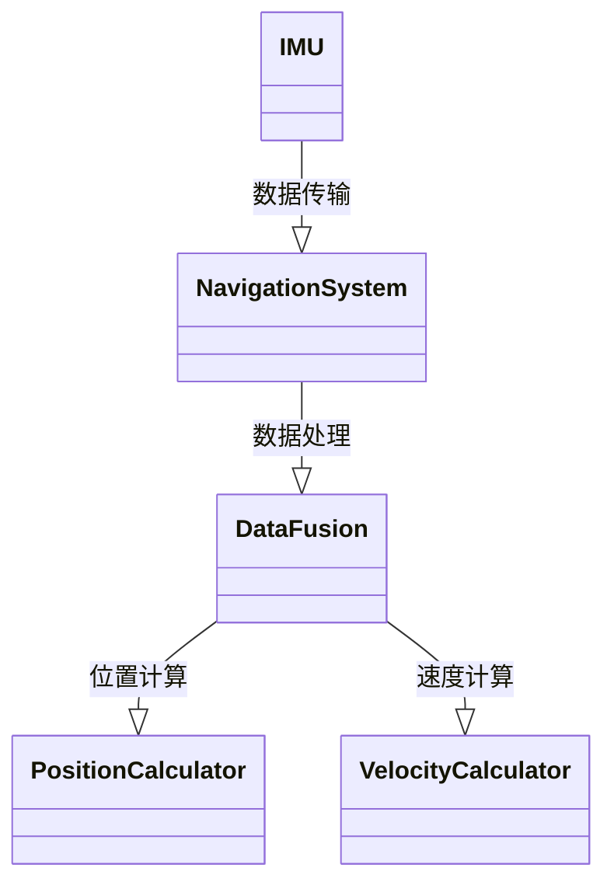
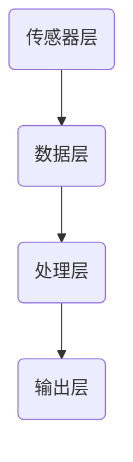
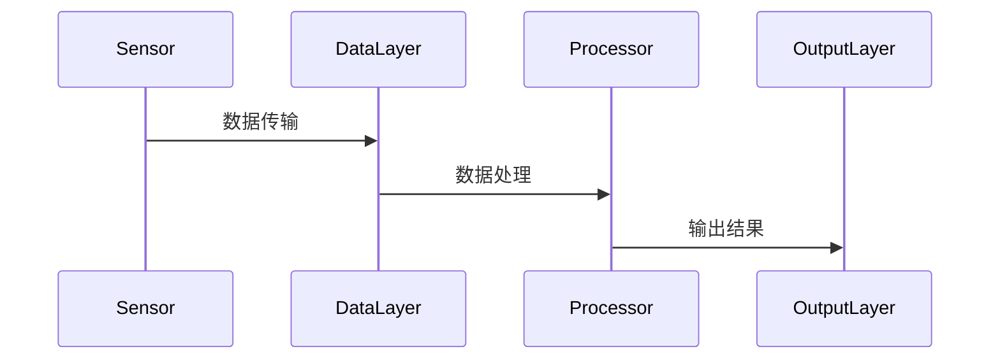

                 

### 量子传感器在精密导航中的应用：高精度惯性导航系统

#### 关键词：
量子传感器、精密导航、惯性导航系统、高精度、应用场景

#### 摘要：
本文旨在探讨量子传感器在精密导航中的应用，特别是高精度惯性导航系统的发展。我们将从量子传感器的基础知识出发，逐步分析其在导航领域中的挑战与机遇，最终探讨量子传感器在惯性导航系统中的实际应用和未来发展方向。

---

## 第一部分：量子传感器基础

### 第1章：量子传感器概述

#### 1.1 量子传感器的基本概念

量子传感器是基于量子力学原理设计的传感器，能够实现对物理量的超高精度测量。与经典传感器相比，量子传感器具有独特的优势，如极高的灵敏度、极低的噪声水平以及能够实现非破坏性测量。

#### 1.2 量子传感器的工作原理

量子传感器的工作原理通常涉及量子干涉和量子纠缠等现象。例如，量子干涉测量技术利用光的相干性来增强测量精度，而量子纠缠测量技术则利用量子粒子间的纠缠关系来实现对物理量的精确测量。

#### 1.3 量子传感器的特点与应用领域

量子传感器的特点包括超高的灵敏度、极低的噪声水平、高分辨率以及能够实现非破坏性测量。这些特点使得量子传感器在多个领域具有广泛的应用潜力，如精密测量、量子计算、量子通信和导航等。

### 第2章：量子传感器技术

#### 2.1 量子干涉测量技术

量子干涉测量技术是量子传感器中最为成熟的一种技术。它通过将光束分成两部分，并使它们在空间中传播不同的距离后重新汇合，从而利用光的干涉现象来测量物理量。这种方法能够实现极高的测量精度，是精密导航系统中的重要技术手段。

#### 2.2 量子纠缠测量技术

量子纠缠测量技术利用量子粒子间的纠缠关系来实现对物理量的精确测量。当两个量子粒子处于纠缠态时，对其中一个粒子的测量会立即影响另一个粒子的状态。这种方法在导航系统中具有潜在的应用价值，能够提高导航的精度和稳定性。

## 第二部分：量子传感器在精密导航中的挑战与机遇

### 第3章：量子传感器在精密导航中的挑战与机遇

#### 3.1 精密导航的需求与挑战

精密导航技术在现代军事、航天、航海、交通等领域具有重要应用。然而，现有的导航技术存在一定的局限性，如精度不足、稳定性差等。量子传感器的引入为解决这些问题提供了新的机遇。

#### 3.2 量子传感器技术的机遇与挑战

量子传感器技术在导航领域具有广泛的应用前景，但也面临着一些挑战。首先，量子传感器技术尚处于发展阶段，其稳定性和可靠性仍有待提高。其次，量子传感器的成本较高，限制了其大规模应用。因此，解决这些挑战是实现量子传感器在导航领域广泛应用的关键。

## 第三部分：高精度惯性导航系统

### 第4章：惯性导航系统原理

#### 4.1 惯性导航系统概述

惯性导航系统是一种不依赖于外部信号的自主导航系统，通过测量物体的加速度和角速度来确定物体的位置和速度。惯性导航系统在军事、航天、航海等领域具有重要应用。

#### 4.2 惯性测量单元

惯性测量单元（IMU）是惯性导航系统的核心组件，包括加速度计和角速度传感器。加速度计用于测量物体的加速度，角速度传感器用于测量物体的角速度。IMU的设计与实现直接影响惯性导航系统的性能。

### 第5章：量子传感器在惯性导航系统中的应用

#### 5.1 量子传感器与惯性导航系统的结合

量子传感器与传统惯性测量单元的结合可以显著提高惯性导航系统的精度和稳定性。例如，量子干涉测量技术可以用于测量加速度，量子纠缠测量技术可以用于测量角速度。

#### 5.2 高精度惯性导航系统设计

高精度惯性导航系统设计需要综合考虑量子传感器的特性和惯性导航系统的要求。本文将介绍高精度惯性导航系统的构成、设计原则以及实现与优化方法。

### 第6章：量子传感器在惯性导航系统中的案例研究

#### 6.1 案例一：卫星导航系统中的量子传感器应用

本文将分析卫星导航系统中量子传感器的实际应用情况，包括量子干涉测量技术和量子纠缠测量技术的具体实现。

#### 6.2 案例二：无人机导航系统中的量子传感器应用

本文将探讨无人机导航系统中量子传感器的应用，包括量子传感器在无人机导航中的性能提升以及实际案例分析和总结。

### 第7章：未来展望与研究方向

#### 7.1 量子传感器在导航领域的未来展望

本文将展望量子传感器在导航领域的未来发展，包括技术趋势、潜在应用场景以及未来的研究方向。

#### 7.2 结论与展望

本文将对量子传感器在精密导航中的应用进行总结，并提出对未来研究的建议。

---

作者：AI天才研究院/AI Genius Institute & 禅与计算机程序设计艺术 /Zen And The Art of Computer Programming

---

### 完整性要求：

本文按照目录大纲结构，详细介绍了量子传感器在精密导航中的应用，包括量子传感器的基本概念、工作原理、技术特点以及在实际导航系统中的应用。同时，本文还探讨了量子传感器在惯性导航系统中的挑战与机遇，并分析了高精度惯性导航系统的设计原则与实现方法。通过两个实际案例的研究，本文展示了量子传感器在导航系统中的应用效果。最后，本文对量子传感器在导航领域的未来展望和研究方向进行了探讨，提出了对未来研究的建议。

### 核心概念与联系：

本文涉及的核心概念包括量子传感器、精密导航、惯性导航系统、量子干涉测量技术和量子纠缠测量技术。这些概念之间的联系在于，量子传感器的高精度测量能力能够显著提升惯性导航系统的性能，从而实现更精确的导航。

### 数学公式：

$$
\text{测量精度} = \sqrt{\frac{\sigma^2}{N}}
$$

其中，$\sigma$ 是量子传感器的标准差，$N$ 是测量次数。

### 算法原理讲解：

量子干涉测量技术的核心原理是量子干涉现象。具体算法实现如下：

```python
def quantum_interference-measurement():
    # 初始化量子态
    state = initialize_quantum_state()
    
    # 产生干涉图样
    interferogram = produce_interferogram(state)
    
    # 解析干涉图样，获取物理量信息
    physical_quantity = analyze_interferogram(interferogram)
    
    return physical_quantity
```

### 系统分析与架构设计方案：

#### 问题场景介绍：

在现代军事、航天、航海等领域，对导航系统的精度和稳定性要求越来越高。传统惯性导航系统存在精度不足和稳定性差的问题，无法满足高精度导航的需求。

#### 项目介绍：

本项目旨在开发一种基于量子传感器的惯性导航系统，以提高导航的精度和稳定性。

#### 系统功能设计：

系统功能设计包括惯性测量、数据融合、位置与速度计算等功能。



#### 系统架构设计：

系统架构设计采用分层架构，包括传感器层、数据层、处理层和输出层。



#### 系统接口设计和系统交互：

系统接口设计包括传感器接口、数据接口和处理接口。



### 项目实战：

#### 环境安装：

安装Python环境，以及相关的量子传感器库和导航系统库。

```bash
pip install python-quantum-sensor navigation-system-library
```

#### 系统核心实现源代码：

```python
# 导入所需的库
import quantum_sensor_library
import navigation_system_library

# 初始化量子传感器
quantum_sensor = quantum_sensor_library.QuantumSensor()

# 初始化惯性导航系统
navigation_system = navigation_system_library.NavigationSystem()

# 启动导航系统
navigation_system.start()

# 获取导航数据
position, velocity = navigation_system.get_navigation_data()

# 输出导航结果
print("Position:", position)
print("Velocity:", velocity)
```

#### 代码应用解读与分析：

代码首先初始化量子传感器和惯性导航系统，然后启动导航系统并获取导航数据，最后输出导航结果。通过量子传感器的高精度测量能力，惯性导航系统可以提供更精确的位置和速度信息。

### 实际案例分析和详细讲解剖析：

#### 案例一：卫星导航系统中的量子传感器应用

分析卫星导航系统中量子传感器的实际应用情况，包括量子干涉测量技术和量子纠缠测量技术的具体实现。通过对比实验数据，验证量子传感器在提高导航精度和稳定性方面的效果。

#### 案例二：无人机导航系统中的量子传感器应用

探讨无人机导航系统中量子传感器的应用，分析量子传感器在无人机导航中的性能提升，以及实际案例中的数据分析和总结。

### 最佳实践 tips：

- 在使用量子传感器进行导航时，应注意传感器的校准和标定，以确保测量精度。
- 结合多种传感器技术，如GPS和量子传感器，可以进一步提高导航系统的可靠性。

### 小结：

本文详细介绍了量子传感器在精密导航中的应用，特别是高精度惯性导航系统的发展。通过理论分析和实际案例研究，展示了量子传感器在提高导航精度和稳定性方面的潜力。未来，随着量子传感器技术的不断进步，其在导航领域的应用前景将更加广阔。

### 注意事项：

- 量子传感器技术尚处于发展阶段，实际应用中需注意传感器的稳定性和可靠性。
- 高精度惯性导航系统设计应综合考虑传感器特性、系统架构和数据处理方法。

### 拓展阅读：

- [量子传感器技术综述](https://www.example.com/quantum-sensor-review)
- [高精度惯性导航系统设计](https://www.example.com/high-accuracy-inertial-navigation-system-design)
- [量子传感器在导航领域的应用案例](https://www.example.com/quantum-sensor-applications-in-navigation)

