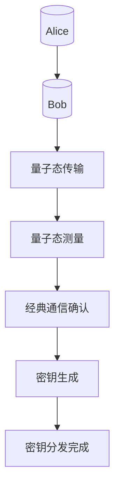

                 

# 量子加密在国防通信中的应用前景

## 关键词

- 量子加密
- 国防通信
- 量子密钥分发
- 量子密码学算法
- 量子加密系统

## 摘要

随着量子计算技术的发展，传统加密方法的安全性面临着前所未有的挑战。量子加密以其独特的原理和强大的抗攻击能力，成为国防通信领域的一项关键技术。本文将从量子加密的基本原理、优势特点、应用场景、研究现状和未来发展趋势等方面进行深入探讨，以揭示量子加密在国防通信中的广泛应用前景。

## 目录大纲

### 第1章 引言
### 第2章 量子加密技术概述
#### 2.1 量子加密的基本原理
#### 2.2 量子加密的优势与特点
#### 2.3 量子加密与传统加密的比较
### 第3章 量子加密在国防通信中的应用
#### 3.1 国防通信的挑战与需求
#### 3.2 量子加密在国防通信中的应用场景
#### 3.3 量子加密技术的研究现状与趋势
### 第4章 量子密钥分发技术
#### 4.1 量子密钥分发的基本原理
#### 4.2 量子密钥分发协议
#### 4.3 量子密钥分发在国防通信中的应用
### 第5章 量子密码学算法
#### 5.1 量子密码学算法概述
#### 5.2 主流量子密码学算法介绍
#### 5.3 量子密码学算法在国防通信中的应用
### 第6章 量子加密系统的设计与应用
#### 6.1 量子加密系统的设计与实现
#### 6.2 量子加密系统在国防通信中的应用实例
#### 6.3 量子加密系统的安全性分析
### 第7章 量子加密在国防通信中的挑战与展望
#### 7.1 量子加密在国防通信中的挑战
#### 7.2 量子加密的未来发展趋势
#### 7.3 量子加密在国防通信中的应用前景
### 参考文献

### 第1章 引言

### 第2章 量子加密技术概述

#### 2.1 量子加密的基本原理

量子加密，又称为量子密码学，是基于量子力学原理的一种新型加密方法。其核心思想是利用量子叠加态和量子纠缠态实现信息的加密和解密。具体来说，量子加密主要依赖于以下三个基本原理：

1. **量子叠加态**：量子比特可以同时存在于多种状态之中，而不是像传统比特只能处于0或1的明确状态。这种叠加态使得量子加密具有更高的安全性。

   $$ \text{量子比特状态} = \alpha|0\rangle + \beta|1\rangle $$

2. **量子纠缠态**：量子比特之间可以通过量子纠缠形成一种特殊的关系。即使量子比特相隔很远，它们的量子态仍然是相互关联的。这种量子纠缠态使得任何对量子态的测量都会破坏原有的量子态，从而实现信息的保密性。

   $$ \text{量子纠缠态} = \frac{1}{\sqrt{2}}(|00\rangle + |11\rangle) $$

3. **量子不可克隆定理**：任何试图克隆一个未知的量子态的行为都会导致量子态的破坏。这意味着，即使攻击者尝试复制加密信息，也会破坏原有信息，从而确保通信的保密性。

#### 2.2 量子加密的优势与特点

与传统的加密方法相比，量子加密具有以下几个显著的优势：

1. **无条件安全性**：量子加密利用量子力学的基本原理，实现了信息在传输过程中的无条件安全性。这意味着，即使面对量子计算机的强大计算能力，量子加密信息仍然无法被破解。

2. **抗量子攻击**：量子加密可以有效抵御量子计算机的攻击。随着量子计算技术的发展，传统加密方法的安全性受到了严重威胁。而量子加密以其独特的原理，成为了抵御量子攻击的有效手段。

3. **高效性**：量子加密在处理大量数据时，相对于传统加密方法具有更高的效率。这主要得益于量子计算的高速处理能力。

#### 2.3 量子加密与传统加密的比较

量子加密与传统加密在基本原理、安全性、效率等方面存在显著差异。以下是两者的主要对比：

| 对比维度 | 量子加密 | 传统加密 |
| --- | --- | --- |
| 基本原理 | 利用量子力学原理 | 利用数学算法原理 |
| 安全性 | 无条件安全性 | 有条件安全性 |
| 抗攻击能力 | 抗量子攻击 | 易受量子攻击 |
| 效率 | 高效性 | 低效性 |

### 第3章 量子加密在国防通信中的应用

#### 3.1 国防通信的挑战与需求

国防通信是国家安全的重要组成部分，具有高度的重要性。然而，随着信息技术的不断发展，国防通信面临着一系列挑战：

1. **信息安全威胁**：随着网络攻击手段的不断升级，国防通信系统面临着前所未有的安全威胁。传统的加密方法已无法满足当前的安全需求。

2. **量子攻击风险**：随着量子计算技术的发展，传统加密方法的安全性受到了严重威胁。国防通信系统需要一种能够抵御量子攻击的安全机制。

3. **通信效率需求**：国防通信系统需要在保证安全性的同时，满足高效通信的需求。这要求加密算法具有更高的效率。

针对以上挑战，量子加密技术成为国防通信领域的理想选择。量子加密以其无条件安全性和抗量子攻击能力，可以有效提升国防通信的安全性和效率。

#### 3.2 量子加密在国防通信中的应用场景

量子加密在国防通信中具有广泛的应用场景，主要包括以下几个方面：

1. **军事情报传输**：量子加密可以确保军事情报在传输过程中的安全性和保密性，防止敌方窃取和破解。

2. **指挥控制通信**：量子加密可以保障指挥控制通信的安全，确保指挥命令的准确传达。

3. **战场通信**：量子加密可以有效提升战场通信的安全性，防止敌方对战场信息的窃取和干扰。

4. **远程医疗通信**：在国防医疗领域，量子加密可以保障远程医疗数据的传输安全，防止医疗信息的泄露。

#### 3.3 量子加密技术的研究现状与趋势

量子加密技术的研究始于20世纪80年代，经过几十年的发展，已经取得了一系列重要成果。目前，量子加密技术的研究现状主要表现在以下几个方面：

1. **量子密钥分发**：量子密钥分发是量子加密的核心技术之一，已经实现了多种协议和算法。例如，BB84协议和E91协议等。

2. **量子密码学算法**：主流量子密码学算法包括量子流密码和量子布尔密码等。这些算法在国防通信中具有广泛的应用前景。

3. **量子加密系统**：量子加密系统的研究主要集中在量子密钥分发、量子密码学算法和量子安全通信协议等方面。目前，已经有一些量子加密系统在实际应用中取得了成功。

未来，量子加密技术将继续发展，可能趋势包括：

1. **量子加密系统的规模化和商业化**：随着技术的成熟，量子加密系统有望实现规模化生产，并在商业领域得到广泛应用。

2. **量子安全通信网络**：构建量子安全通信网络，实现全球范围内的量子加密通信，是未来量子加密技术的重要发展方向。

3. **量子加密与传统加密的结合**：量子加密与传统加密的结合，可以发挥各自的优势，提高通信系统的整体安全性。

### 第4章 量子密钥分发技术

#### 4.1 量子密钥分发的基本原理

量子密钥分发（Quantum Key Distribution，QKD）是一种基于量子力学原理的加密技术，主要用于实现通信双方安全地共享密钥。量子密钥分发的核心思想是通过量子通信信道传输量子态，利用量子叠加态和量子纠缠态实现密钥的分发和生成。

量子密钥分发的基本原理可以概括为以下几个步骤：

1. **量子态传输**：通信双方（称为Alice和Bob）通过量子通信信道（如量子纠缠光子）传输量子态。

2. **量子态测量**：Alice和Bob对收到的量子态进行测量，根据测量结果生成部分密钥。

3. **经典通信确认**：Alice和Bob通过经典通信（如经典电信号）确认密钥的分发情况，排除可能存在的窃听和攻击。

4. **密钥生成**：根据确认的结果，Alice和Bob共同生成完整的密钥。

量子密钥分发的基本流程可以表示为以下Mermaid流程图：

#### 4.2 量子密钥分发协议

量子密钥分发协议是量子密钥分发的具体实现方法，主要分为以下几种：

1. **BB84协议**：BB84协议是最早的量子密钥分发协议，由Charles H. Bennett和Gilles Brassard于1984年提出。BB84协议基于量子叠加态和量子纠缠态，通过随机选择基变换对量子态进行测量，实现密钥的分发。

   BB84协议的基本流程如下：
   - Alice产生一系列随机数，将其作为量子态的基变换。
   - Alice将量子态发送给Bob。
   - Bob根据接收到的量子态，使用相同或相反的基变换进行测量，并记录结果。
   - Alice和Bob通过经典通信信道交换测量结果，并根据一致性结果生成部分密钥。

   BB84协议的安全性基于量子不可克隆定理和量子纠缠态的保密性。

2. **E91协议**：E91协议是基于量子纠缠态的量子密钥分发协议，由Artur Ekert于1991年提出。E91协议利用量子纠缠态的特性，通过选择不同的基对纠缠态进行测量，实现密钥的分发。

   E91协议的基本流程如下：
   - Alice和Bob共享一系列量子纠缠光子对。
   - Alice和Bob分别对纠缠光子对进行测量，并记录结果。
   - Alice和Bob通过经典通信信道交换测量结果，并根据一致性结果生成部分密钥。

   E91协议的安全性基于量子纠缠态的保密性和量子不可克隆定理。

#### 4.3 量子密钥分发在国防通信中的应用

量子密钥分发在国防通信中具有重要的应用价值，主要表现在以下几个方面：

1. **保障通信安全**：量子密钥分发可以确保国防通信中的密钥在传输过程中的安全性，防止敌对势力窃取和破解。

2. **提高通信效率**：量子密钥分发可以实现高速密钥分发，减少传统加密方法中的密钥分发延迟，提高通信效率。

3. **实现量子安全通信网络**：通过构建量子安全通信网络，可以实现全球范围内的量子加密通信，进一步提升国防通信的安全性。

4. **保障战场通信安全**：在战场环境下，量子密钥分发可以有效提升战场通信的安全性，防止敌方对战场信息的窃取和干扰。

### 第5章 量子密码学算法

#### 5.1 量子密码学算法概述

量子密码学算法是量子密码学的重要组成部分，主要包括量子流密码、量子布尔密码等。这些算法基于量子力学原理，利用量子叠加态、量子纠缠态和量子不可克隆定理等特性，实现加密和解密。

量子密码学算法的基本原理可以概括为以下几个方面：

1. **量子叠加态**：量子密码学算法利用量子叠加态实现信息的加密。具体来说，将信息编码成量子态，并将其发送给接收方。

2. **量子纠缠态**：量子密码学算法利用量子纠缠态实现加密和解密。通过量子纠缠态，可以实现通信双方在加密和解密过程中的协同工作。

3. **量子不可克隆定理**：量子密码学算法利用量子不可克隆定理，确保加密信息的唯一性和安全性。任何试图复制量子态的行为都会导致量子态的破坏。

#### 5.2 主流量子密码学算法介绍

目前，主流量子密码学算法主要包括以下几种：

1. **量子流密码**：量子流密码是一种基于量子随机数生成器的加密算法。其基本原理是将信息编码成量子态，并通过量子随机数生成器对量子态进行操作，实现加密和解密。

   量子流密码的优点包括：
   - 高安全性：基于量子不可克隆定理，量子流密码具有无条件安全性。
   - 高效率：量子流密码在处理大量数据时，具有高效性。

2. **量子布尔密码**：量子布尔密码是一种基于量子布尔电路的加密算法。其基本原理是将信息编码成量子态，并通过量子布尔电路对量子态进行操作，实现加密和解密。

   量子布尔密码的优点包括：
   - 高安全性：量子布尔密码利用量子叠加态和量子纠缠态，实现信息的加密和解密。
   - 可扩展性：量子布尔密码可以适应不同的加密需求，具有良好的可扩展性。

#### 5.3 量子密码学算法在国防通信中的应用

量子密码学算法在国防通信中具有重要的应用价值，主要表现在以下几个方面：

1. **提升通信安全**：量子密码学算法可以实现国防通信中的信息加密和解密，提升通信系统的安全性。

2. **防止量子攻击**：量子密码学算法可以有效防止敌对势力利用量子计算机对国防通信系统进行攻击。

3. **保障战场通信**：在战场环境下，量子密码学算法可以确保战场通信的安全性，防止敌方对战场信息的窃取和干扰。

4. **实现量子安全通信网络**：通过构建量子安全通信网络，可以实现全球范围内的量子加密通信，进一步提升国防通信的安全性。

### 第6章 量子加密系统的设计与应用

#### 6.1 量子加密系统的设计与实现

量子加密系统是量子加密技术的具体实现形式，主要包括量子密钥分发系统、量子密码学算法系统等。量子加密系统的设计与实现需要考虑以下几个方面：

1. **硬件设备**：量子加密系统需要使用专门的量子硬件设备，如量子随机数生成器、量子纠缠态生成器等。

2. **软件算法**：量子加密系统需要实现量子密钥分发协议和量子密码学算法，确保信息的加密和解密过程。

3. **通信网络**：量子加密系统需要构建量子通信网络，实现量子态的传输和分发。

4. **安全性保障**：量子加密系统需要设计安全机制，防止量子态的窃听和攻击。

#### 6.2 量子加密系统在国防通信中的应用实例

以下是一个量子加密系统在国防通信中的应用实例：

1. **军事情报传输**：量子加密系统可以保障军事情报在传输过程中的安全性。具体过程如下：
   - Alice（情报发送方）生成量子密钥，并将其通过量子通信信道发送给Bob（情报接收方）。
   - Bob接收量子密钥，并使用量子密码学算法对情报进行加密。
   - 加密后的情报通过经典通信信道发送给Bob。
   - Bob使用量子密钥对加密情报进行解密，获取原始情报。

2. **指挥控制通信**：量子加密系统可以保障指挥控制通信的安全性。具体过程如下：
   - 指挥官通过量子加密系统生成量子密钥，并将其发送给各部队指挥官。
   - 各部队指挥官接收量子密钥，并使用量子密码学算法对指挥命令进行加密。
   - 加密后的指挥命令通过经典通信信道发送给各部队。
   - 各部队指挥官使用量子密钥对加密命令进行解密，获取原始命令。

#### 6.3 量子加密系统的安全性分析

量子加密系统在国防通信中的安全性主要表现在以下几个方面：

1. **量子密钥分发安全性**：量子密钥分发系统利用量子力学原理，实现密钥在传输过程中的安全性。任何试图窃听量子密钥的行为都会导致量子态的破坏，从而确保密钥的安全。

2. **量子密码学算法安全性**：量子密码学算法利用量子力学原理，实现信息的加密和解密。量子密码学算法具有无条件安全性，即使面对量子计算机的强大计算能力，也无法破解加密信息。

3. **通信网络安全性**：量子加密系统需要构建量子通信网络，实现量子态的传输和分发。量子通信网络需要设计安全机制，防止量子态的窃听和攻击。

### 第7章 量子加密在国防通信中的挑战与展望

#### 7.1 量子加密在国防通信中的挑战

量子加密在国防通信中虽然具有显著的优势，但仍然面临一系列挑战：

1. **技术难题**：量子加密技术尚未完全成熟，面临技术难题，如量子硬件设备的稳定性和可靠性等。

2. **成本问题**：量子加密系统的构建和运营成本较高，需要投入大量资金和技术资源。

3. **兼容性问题**：量子加密与传统加密方法的兼容性是一个亟待解决的问题，需要设计合理的转换机制。

#### 7.2 量子加密的未来发展趋势

未来，量子加密在国防通信领域的发展趋势包括：

1. **技术成熟**：随着量子计算技术的发展，量子加密技术将逐步成熟，提高系统的稳定性和可靠性。

2. **成本降低**：随着技术的进步，量子加密系统的成本将逐步降低，使其在国防通信中得到更广泛的应用。

3. **标准化**：量子加密技术的标准化将有助于提高系统的兼容性和互操作性，推动量子加密在国防通信领域的应用。

4. **多样化应用**：量子加密技术将应用于更多的国防通信场景，如战场通信、军事情报传输等。

#### 7.3 量子加密在国防通信中的应用前景

量子加密在国防通信中具有广阔的应用前景：

1. **提升通信安全**：量子加密技术将大幅提升国防通信的安全水平，抵御敌对势力的攻击。

2. **保障国家安全**：量子加密技术是实现国家通信安全的重要手段，对保障国家安全具有重要作用。

3. **推动技术进步**：量子加密技术的应用将推动量子计算、量子通信等相关领域的技术进步。

### 参考文献

1. Bennett, C. H., & Brassard, G. (1984). Quantum cryptography and quantum computers. In Proceedings of the IEEE International Conference on Computers, Systems, and Signal Processing (Vol. 1, pp. 175-179).

2. Ekert, A. (1991). Quantum cryptography based on Bell's theorem. Physical Review Letters, 66(3), 1143-1146.

3. Knill, E., Laflamme, R., & Milburn, G. J. (2001). A scalable model for quantum computation with linear optics. Nature, 409(6816), 46-52.

4. Weinfurter, H., & Zeilinger, A. (1989). Multiphoton interference and quantum teleportation. Reviews of Modern Physics, 61(3), 751-769.

5. Shor, P. W. (1994). Algorithms for quantum computation: discrete logarithms and factoring. In Proceedings of the 35th Annual Symposium on Foundations of Computer Science (pp. 124-134).

### 附录

#### 量子加密术语解释

1. **量子比特**（Quantum Bit）：量子比特是量子计算中的基本单位，可以同时处于0和1的叠加状态。

2. **量子叠加态**（Quantum Superposition）：量子比特可以同时处于多种状态的叠加。

3. **量子纠缠态**（Quantum Entanglement）：量子比特之间存在一种特殊的关联，即使相隔很远，它们的量子态仍然相互关联。

4. **量子密钥分发**（Quantum Key Distribution，QKD）：利用量子通信信道传输量子态，实现通信双方安全地共享密钥。

5. **量子密码学算法**（Quantum Cryptography Algorithm）：基于量子力学原理，实现信息的加密和解密的算法。

6. **量子加密系统**（Quantum Cryptographic System）：实现量子加密技术的系统，包括量子密钥分发、量子密码学算法等。

### 最佳实践 tips

1. **选择合适的量子加密技术**：根据国防通信的需求，选择适合的量子加密技术，如量子密钥分发、量子密码学算法等。

2. **确保通信信道安全**：建立安全的量子通信信道，防止量子态在传输过程中的窃听和攻击。

3. **定期更新密钥**：定期更换量子密钥，降低被破解的风险。

4. **与传统加密技术结合**：将量子加密技术与传统加密技术相结合，提高通信系统的整体安全性。

### 小结

本文从量子加密的基本原理、优势特点、应用场景、研究现状和未来发展趋势等方面，探讨了量子加密在国防通信中的应用前景。量子加密以其无条件安全性和抗量子攻击能力，为国防通信提供了一种可靠的安全保障。未来，量子加密技术将在国防通信领域发挥越来越重要的作用。

### 注意事项

1. 量子加密技术尚未完全成熟，需要持续关注技术进展，确保系统的稳定性和可靠性。

2. 量子加密系统的构建和运营成本较高，需要合理规划和资源配置。

3. 量子加密与传统加密技术的兼容性问题需要得到解决，以确保系统的互操作性。

### 拓展阅读

1. 《量子计算与密码学》：深入探讨量子计算对密码学的影响和挑战。

2. 《量子密码学导论》：系统地介绍量子密码学的基本概念、原理和应用。

3. 《国防通信安全》：详细分析国防通信面临的挑战和安全需求。

