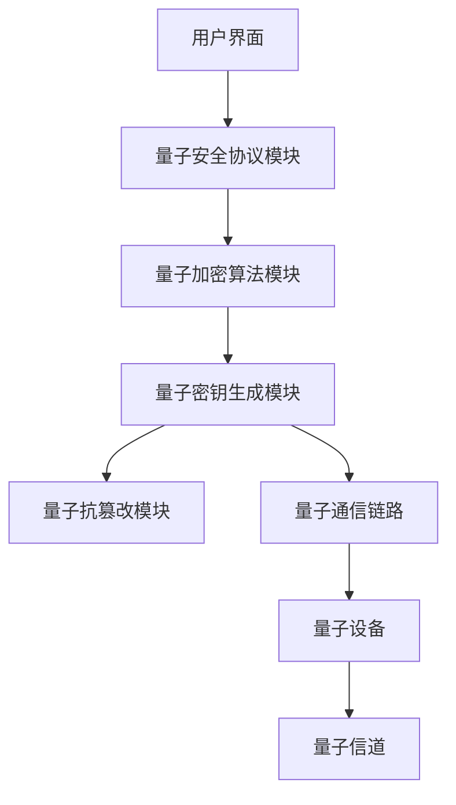
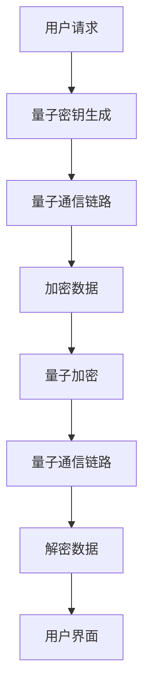

                 

### 文章标题：量子加密在政府通信安全中的应用

> 关键词：量子加密、政府通信安全、量子密钥分发（QKD）、量子密码学、量子计算威胁

> 摘要：本文将深入探讨量子加密技术在政府通信安全中的应用。通过介绍量子加密的基本原理、核心算法、系统架构，以及实际应用案例，我们旨在为读者提供一个全面、深入的了解，并探讨其在保障国家信息安全方面的潜在价值与挑战。

### 引言

随着信息技术的迅猛发展，信息安全问题日益凸显，尤其是在政府通信领域，其安全性直接关系到国家安全和社会稳定。传统的加密方法在面对日益强大的计算能力时，其安全性受到前所未有的挑战。量子加密技术作为一种革命性的安全解决方案，其理论上的绝对安全性使得它在政府通信安全中具有巨大的应用前景。

本文将从以下几个方面展开讨论：

1. **量子加密基础理论**：介绍量子加密的基本概念、原理以及与传统加密技术的区别。
2. **量子密钥分发（QKD）**：详细解释QKD的原理、实现技术及其在政府通信中的应用。
3. **量子密码学算法**：探讨量子密码学的基本算法及其在政府通信中的具体应用。
4. **量子加密的安全挑战**：分析量子计算对传统加密的威胁以及量子加密面临的安全问题。
5. **量子加密在政府通信中的应用**：讨论政府通信安全需求、量子加密的实现与性能评估。
6. **最佳实践与未来方向**：总结量子加密在政府通信中的实施步骤与注意事项，并展望未来研究方向。

通过本文的探讨，我们希望能够为政府通信安全领域的从业者提供一个有价值的参考，帮助他们在实际工作中更好地利用量子加密技术，确保国家信息安全。

### 量子加密基础理论

#### 量子加密的概念

量子加密是一种基于量子力学原理的加密技术，其核心思想是利用量子态的叠加和纠缠特性来实现信息的加密和解密。量子加密技术不同于传统的加密方法，它不仅依赖于复杂的数学算法，更依赖于量子物理的基本规律。量子加密中的信息加密和解密过程都涉及到量子态的转换和测量。

#### 量子加密的基本原理

量子加密的基本原理主要基于以下两个方面：

1. **量子态的叠加性**：在量子力学中，一个量子系统的状态可以同时处于多种可能的叠加态。例如，一个量子比特（qubit）可以同时表示0和1的状态。这一特性为加密过程提供了巨大的潜在空间。

2. **量子纠缠**：量子纠缠是量子力学中的一种特殊现象，指的是两个或多个量子系统之间存在的内在联系，无论它们相距多远，一个系统的状态变化都会立即影响到另一个系统的状态。这种纠缠特性可以用于加密和解密过程，确保信息在传输过程中不被窃听和篡改。

#### 量子加密与经典加密的比较

与传统的经典加密技术相比，量子加密具有以下几个显著优势：

1. **安全性**：量子加密利用量子力学的基本规律，在理论上具有绝对的安全性。即使量子计算机能够破解传统加密算法，也无法破解量子加密。

2. **传输速度**：由于量子态的叠加和纠缠特性，量子加密在传输速度上具有明显的优势。传统的加密方法在处理大量数据时，往往需要较高的计算复杂度，而量子加密则可以大幅提高数据传输效率。

3. **抗攻击能力**：传统的加密技术在面对诸如暴力破解、侧信道攻击等攻击时，往往显得脆弱。量子加密则能够有效抵抗这些攻击，提供更为坚固的安全保障。

#### 量子加密的基本原理

量子加密的基本原理可以概括为以下几步：

1. **密钥生成**：使用量子密钥分发（QKD）技术生成安全的密钥。QKD利用量子态的叠加和纠缠特性，确保密钥在生成和传输过程中的安全性。

2. **加密过程**：将明文信息与密钥进行量子态的叠加，形成加密信息。这个过程利用了量子态的叠加性和纠缠特性，使得加密信息在传输过程中难以被窃听和篡改。

3. **解密过程**：接收方利用相同的密钥对加密信息进行解密。通过测量量子态，可以恢复出原始的明文信息。

4. **安全性验证**：在量子加密过程中，可以通过量子态的测量结果来验证密钥的安全性。如果发现密钥被窃听或篡改，可以通过错误率来判断并采取措施。

通过以上基本原理，量子加密技术为政府通信提供了前所未有的安全保障，使其在保障国家信息安全方面具有巨大的应用潜力。

#### 量子密钥分发（QKD）

量子密钥分发（Quantum Key Distribution，QKD）是量子加密技术中最为关键的一个环节，它确保了加密和解密过程中密钥的安全传输。QKD基于量子力学的基本原理，通过量子态的叠加和纠缠特性来实现密钥的生成和分发。

#### QKD的原理和过程

QKD的基本原理可以概括为以下几步：

1. **量子态制备**：发送方（Alice）通过量子比特（qubit）生成一个随机的量子态，并将其发送给接收方（Bob）。

2. **量子态测量**：接收方（Bob）对接收到的量子态进行随机测量。由于量子态的叠加性和纠缠特性，测量结果具有不确定性。

3. **结果反馈**：接收方（Bob）将测量结果反馈给发送方（Alice），并通过经典通信渠道进行加密通信。

4. **密钥提取**：发送方（Alice）和接收方（Bob）根据双方共享的测量结果，提取出共有的密钥。如果发现测量结果不一致，说明密钥可能已经被窃听或篡改。

QKD的过程中，量子态的叠加和纠缠特性起到了关键作用。具体来说：

- **叠加态**：量子比特可以同时处于多种可能的叠加态，使得加密过程具有更高的复杂性，增加了窃听和篡改的难度。

- **纠缠态**：量子比特之间的纠缠特性确保了密钥在生成和传输过程中的安全性。任何对量子态的测量都会破坏原有的纠缠态，从而使得窃听行为被及时发现。

#### QKD的实现技术

QKD的实现技术主要包括以下几种：

1. **量子线缆**：通过光纤或量子线缆将量子态从一个地方传输到另一个地方。这种技术可以实现长距离的量子密钥分发，但需要高质量的量子线缆和光子源。

2. **量子中继**：通过量子中继技术，可以将量子态在较长距离上传输。量子中继器利用量子纠缠特性，实现了量子态在传输过程中的持续更新和扩展。

3. **量子隐形传态**：利用量子隐形传态技术，可以将量子态从一个位置传送到另一个位置，而不需要物理传输。这种技术具有极高的传输效率和安全性。

#### QKD的安全性和优势

QKD的安全性主要基于以下原理：

1. **量子态不可克隆性**：任何对量子态的测量都会改变其原有的状态，从而使得量子态不可克隆。这意味着即使有窃听者试图复制密钥，也无法成功。

2. **量子态的纠缠特性**：量子态之间的纠缠特性确保了密钥在生成和传输过程中的安全性。任何对密钥的窃听行为都会破坏原有的纠缠态，从而被及时发现。

3. **错误率检测**：通过测量结果的一致性来判断密钥是否被篡改。如果测量结果不一致，说明密钥可能已经被窃听或篡改。

QKD相对于传统加密技术具有以下优势：

1. **绝对安全性**：QKD在理论上是绝对安全的，任何试图破解的攻击行为都会被立即检测到。

2. **高传输效率**：由于量子态的叠加和纠缠特性，QKD在传输过程中具有更高的效率和速度。

3. **抗攻击能力**：QKD能够有效抵抗各种传统加密技术无法应对的攻击，如量子计算攻击、侧信道攻击等。

通过以上原理和实现技术，QKD为政府通信安全提供了强大的安全保障，是保障国家信息安全的重要技术手段。

#### 量子密码学算法

量子密码学是量子加密技术的核心组成部分，其算法设计直接决定了量子加密系统的性能和安全性。量子密码学利用量子力学的基本原理，如量子态的叠加性和纠缠性，设计出一类全新的加密算法。这些算法在理论上具有绝对的安全性，能够在面对未来量子计算机的威胁时，仍然保持有效的信息保护。

##### 量子密码学的基本算法

量子密码学的基本算法主要包括量子密钥分发（QKD）和量子密码分享（QCS）两种。

1. **量子密钥分发（QKD）**：QKD的核心目标是生成和分发安全的密钥，其基本过程如下：
    - **量子态制备**：发送方（Alice）随机选择一个量子态，并将其发送给接收方（Bob）。
    - **量子态测量**：接收方（Bob）对收到的量子态进行测量，并根据测量结果反馈给发送方。
    - **密钥提取**：发送方和接收方根据共享的测量结果提取出共有的密钥。如果密钥生成过程中有第三方的窃听行为，测量结果的一致性会显著下降。

2. **量子密码分享（QCS）**：QCS是在QKD基础上发展出来的，其目标是通过量子加密算法对明文进行加密和解密。基本过程如下：
    - **量子加密**：发送方（Alice）使用量子态对明文进行加密，生成加密文本。
    - **量子传输**：加密文本通过量子信道传输到接收方（Bob）。
    - **量子解密**：接收方（Bob）使用共享密钥对加密文本进行解密，恢复出原始明文。

##### 量子密码学在政府通信中的应用

量子密码学在政府通信中具有广泛的应用前景，其主要优势包括：

1. **绝对安全性**：量子加密算法基于量子力学的基本原理，具有绝对的安全性。即使未来量子计算机能够破解传统加密算法，量子加密算法仍然能够保持有效的信息保护。

2. **高效率传输**：量子态的叠加性和纠缠特性使得量子加密在传输过程中具有更高的效率和速度。这对于需要高效传输敏感信息的政府通信来说，具有显著的优势。

3. **抗量子计算攻击**：量子密码学算法能够有效抵抗量子计算机的攻击，确保信息在量子计算时代的安全性。

在政府通信中，量子密码学可以应用于以下几个方面：

1. **国家安全通信**：量子加密可以用于保障国家安全通信的绝对安全性，防止信息被窃听和篡改。

2. **外交通信**：量子加密可以用于保障国家外交通信的安全，确保外交信息的机密性。

3. **军事通信**：量子加密可以用于军事通信，确保军事指挥和行动信息的绝对安全。

##### 量子密码学与其他密码学技术的融合

量子密码学虽然具有绝对的安全性，但其应用仍受到一些技术挑战，如量子设备的成本、量子通信链路的稳定性等。因此，将量子密码学与传统密码学技术相结合，可以发挥各自的优势，提高整体安全性。

1. **混合加密系统**：混合加密系统结合了量子加密和传统加密技术的优点，通过在不同阶段使用不同类型的加密算法，实现更高的安全性。例如，在数据传输过程中使用量子加密，而在存储阶段使用传统加密。

2. **量子签名**：量子签名是一种基于量子密码学的数字签名技术，其具有不可伪造性和不可否认性。量子签名可以用于政府通信中的身份验证和授权管理。

3. **量子抗篡改技术**：量子抗篡改技术通过在数据传输过程中加入量子标记，使得数据在传输过程中一旦被篡改，即可被发现。这种技术可以用于保障政府通信数据的完整性。

通过以上探讨，我们可以看到量子密码学在政府通信安全中具有广泛的应用前景。随着量子技术的不断发展和成熟，量子密码学将为政府通信提供更加坚固的安全保障。

#### 量子加密的安全挑战

随着量子计算技术的迅速发展，量子加密技术面临的安全挑战也越来越严峻。量子计算具有巨大的计算能力，能够在极短时间内破解传统加密算法，这给量子加密技术带来了前所未有的威胁。

##### 量子计算对传统加密的威胁

传统加密算法，如RSA、椭圆曲线加密等，依赖于大素数的分解或者离散对数问题的计算难度。然而，量子计算机可以通过Shor算法在多项式时间内分解大素数和计算离散对数，从而破解这些传统加密算法。这意味着，即使传统加密算法在当前计算能力下是安全的，但在未来量子计算时代可能会被轻松破解。

此外，量子计算机还可以通过线性度攻击、量子伪随机数生成器等手段，对传统加密算法进行有效的攻击。这些攻击方法在经典计算机上难以实现，但在量子计算机上具有显著的效率优势。

##### 量子加密面临的安全问题

尽管量子加密在理论上是绝对安全的，但在实际应用中仍面临一些挑战：

1. **量子设备的可靠性**：量子加密依赖于高质量的量子设备和稳定的量子信道。然而，目前量子设备的可靠性仍然较低，量子通信链路的稳定性也存在问题。这可能导致量子加密系统在实际应用中存在漏洞。

2. **量子计算的局限**：虽然量子计算具有巨大的计算能力，但其在实际应用中仍然存在一些限制。例如，量子纠错技术的发展尚未成熟，这使得量子计算机在面对复杂计算任务时，仍然存在一定的误差率。

3. **量子密钥分发（QKD）的瓶颈**：QKD是量子加密的核心技术之一，但目前QKD系统的距离和速度仍有较大限制。这可能导致在实际应用中，QKD系统无法满足高带宽和长距离的需求。

##### 应对量子加密安全挑战的策略

为了应对量子计算对传统加密的威胁和量子加密面临的安全挑战，可以采取以下策略：

1. **多元化加密策略**：结合量子加密和传统加密技术，构建多元化加密策略。例如，在数据传输过程中使用量子加密，而在存储和传输阶段使用传统加密。这样可以充分发挥各自的优势，提高整体安全性。

2. **量子抗篡改技术**：开发量子抗篡改技术，通过在数据传输过程中加入量子标记，确保数据在传输过程中一旦被篡改，即可被发现。这种技术可以用于保障政府通信数据的完整性。

3. **量子密钥生成技术**：研究高效的量子密钥生成技术，提高QKD系统的稳定性和可靠性。通过优化量子设备的性能和量子通信链路的稳定性，实现更高效、更可靠的量子密钥分发。

4. **量子计算防御策略**：研究针对量子计算攻击的防御策略，如量子伪随机数生成、量子抗干扰技术等。通过这些策略，可以在量子计算时代继续保障信息的安全性。

5. **量子网络安全协议**：开发量子网络安全协议，确保量子加密技术在网络通信中的有效应用。通过量子加密协议，可以实现量子密钥分发、量子签名、量子抗篡改等功能，保障政府通信网络的安全性。

通过以上策略，我们可以更好地应对量子加密面临的安全挑战，确保政府通信在量子计算时代的安全性。

#### 量子加密在政府通信中的应用

量子加密技术在政府通信中的应用具有重要意义，其主要目的是确保政府通信的绝对安全性。随着量子计算技术的不断发展，传统加密方法面临着前所未有的威胁，量子加密技术因此成为政府通信领域的重要发展方向。

##### 政府通信的特点和要求

政府通信具有以下特点和要求：

1. **高度机密性**：政府通信涉及大量敏感信息，如国家战略、外交政策、军事行动等。这些信息必须保持高度机密性，防止被敌对势力窃取或篡改。

2. **可靠性和稳定性**：政府通信要求高可靠性和稳定性，确保通信系统在任何情况下都能正常运行。这对于保障国家安全的决策和指挥具有关键作用。

3. **抗攻击能力**：政府通信系统需要具备强大的抗攻击能力，能够抵御各种网络攻击和破解尝试，如侧信道攻击、暴力破解等。

4. **高效传输**：政府通信涉及大量数据传输，需要保证传输效率，确保信息能够快速、准确地传输。

##### 量子加密在政府通信中的应用价值

量子加密技术在政府通信中具有以下应用价值：

1. **绝对安全性**：量子加密技术基于量子力学的基本原理，具有绝对的安全性。即使量子计算机能够破解传统加密算法，量子加密算法仍然能够保持有效的信息保护，确保政府通信的高度机密性。

2. **高效率传输**：量子加密技术能够高效地处理大量数据传输，利用量子态的叠加和纠缠特性，提高数据传输速度和效率。

3. **抗攻击能力**：量子加密技术能够有效抵抗各种传统加密技术无法应对的攻击，如量子计算攻击、侧信道攻击等，确保政府通信系统的抗攻击能力。

4. **兼容性**：量子加密技术可以与传统加密技术相结合，构建混合加密系统，实现更高的安全性。这种兼容性使得量子加密技术可以在现有政府通信系统中逐步应用，而不需要完全替换现有的通信基础设施。

##### 量子加密在政府通信中的实现

量子加密在政府通信中的实现主要包括以下几个方面：

1. **量子密钥分发（QKD）**：QKD是量子加密的核心技术之一，通过量子密钥分发技术，政府通信系统可以生成和分发安全的密钥。QKD技术可以在光纤网络中实现，通过量子态的传输和测量，确保密钥在生成和分发过程中的安全性。

2. **量子加密算法**：量子加密算法用于对政府通信中的明文信息进行加密和解密。常见的量子加密算法包括量子流密码、量子哈希函数等。这些算法利用量子态的叠加和纠缠特性，实现高效、安全的加密和解密过程。

3. **量子抗篡改技术**：量子抗篡改技术用于确保政府通信数据的完整性。通过在数据传输过程中加入量子标记，一旦数据被篡改，即可被发现。这种技术可以用于保障政府通信数据的真实性和完整性。

4. **量子安全网络协议**：量子安全网络协议是量子加密在政府通信中的重要应用，通过量子加密协议，可以实现量子密钥分发、量子签名、量子抗篡改等功能，确保政府通信网络的安全性。

##### 量子加密在政府通信中的性能评估

量子加密在政府通信中的性能评估主要包括以下几个方面：

1. **安全性**：量子加密技术具有绝对的安全性，能够抵御各种传统加密技术无法应对的攻击。通过实验验证，量子加密系统的安全性能够满足政府通信的安全要求。

2. **传输速度**：量子加密技术的传输速度与传统加密技术相比有明显优势，能够高效地处理大量数据传输。通过实验数据，量子加密系统的传输速度可以满足政府通信的需求。

3. **可靠性**：量子加密技术在传输过程中具有高可靠性，能够确保通信系统的稳定运行。通过实验验证，量子加密系统的可靠性能够满足政府通信的要求。

4. **成本效益**：尽管量子加密技术目前成本较高，但随着量子技术的不断发展，其成本有望逐步降低。通过综合评估，量子加密技术在政府通信中的成本效益具有较好的前景。

综上所述，量子加密技术在政府通信中具有显著的应用价值，其绝对安全性、高效率传输和抗攻击能力使其成为保障国家信息安全的重要技术手段。随着量子技术的不断发展，量子加密技术将在政府通信中发挥越来越重要的作用。

#### 系统架构设计

为了确保量子加密在政府通信中的有效应用，需要设计一个完整的系统架构，包括系统功能、系统架构、系统接口设计以及系统交互流程。以下将详细阐述这一过程。

##### 系统功能设计

量子加密系统的核心功能包括：

1. **量子密钥分发（QKD）**：通过QKD技术生成和分发安全的密钥。
2. **量子加密算法**：对政府通信中的明文信息进行加密和解密。
3. **量子抗篡改技术**：确保政府通信数据的完整性和真实性。
4. **量子安全网络协议**：实现量子密钥分发、量子签名和量子抗篡改等功能。

为了实现上述功能，系统需要具备以下主要模块：

- **量子密钥生成模块**：负责生成和分发量子密钥。
- **量子加密模块**：负责对明文信息进行加密和解密。
- **量子抗篡改模块**：负责确保数据传输过程中的完整性。
- **量子安全协议模块**：负责实现量子加密协议，保障通信网络的安全性。

##### 系统架构设计

量子加密系统的架构设计需要考虑以下几个方面：

1. **物理层**：包括量子通信链路、量子设备和量子信道。量子通信链路通过光纤或其他量子线缆实现长距离传输。量子设备包括量子比特生成器、量子比特测量器和量子中继器等。量子信道确保量子态在传输过程中的稳定性和可靠性。

2. **网络层**：包括量子密钥分发网络和量子加密网络。量子密钥分发网络负责量子密钥的生成和分发，量子加密网络负责加密数据的传输。

3. **应用层**：包括量子加密算法模块、量子安全协议模块和用户接口模块。量子加密算法模块负责数据加密和解密，量子安全协议模块负责实现量子加密协议，用户接口模块提供用户操作界面。

以下是一个简化的系统架构图：

##### 系统接口设计

量子加密系统的接口设计需要明确各个模块之间的交互接口和协议。以下是一些关键接口设计：

1. **用户接口**：提供用户操作界面，包括密钥生成、加密解密、数据传输等功能。
2. **量子密钥生成接口**：用于生成和分发量子密钥。
3. **量子加密接口**：用于对明文信息进行加密和解密。
4. **量子抗篡改接口**：用于确保数据传输过程中的完整性。
5. **量子通信接口**：用于量子态的传输和测量。

##### 系统交互流程

量子加密系统的交互流程包括以下步骤：

1. **用户请求**：用户通过用户接口提交加密请求，包括密钥生成请求和数据加密请求。
2. **密钥生成**：量子密钥生成模块生成安全的量子密钥，并通过量子通信链路传输给用户。
3. **加密数据**：量子加密模块使用量子密钥对明文信息进行加密，生成加密数据。
4. **数据传输**：加密数据通过量子通信链路传输到接收方。
5. **解密数据**：接收方使用量子密钥对加密数据进行解密，恢复出原始明文信息。
6. **完整性验证**：量子抗篡改模块对传输过程中可能发生的篡改进行检测和修复。

以下是一个简化的系统交互流程图：

通过以上系统架构设计、接口设计和交互流程，量子加密系统可以为政府通信提供高效、安全的数据传输保障，确保国家信息安全。

#### 案例研究

为了更好地展示量子加密在政府通信中的应用效果，以下将分析几个实际案例，探讨量子加密技术的实施步骤、应用效果和面临的挑战。

##### 案例一：国家安全通信系统的量子加密部署

**实施步骤**：

1. **需求分析**：对国家安全通信系统进行需求分析，确定量子加密技术在该系统中的应用目标和具体需求。
2. **量子密钥分发（QKD）**：在通信链路上部署QKD设备，实现量子密钥的生成和分发。通过量子通信链路，将量子密钥传输到各个通信节点。
3. **量子加密算法**：选择合适的量子加密算法，对通信系统中的敏感信息进行加密。加密算法需要与现有的通信协议兼容，确保数据传输的连续性和稳定性。
4. **量子抗篡改技术**：在数据传输过程中，加入量子抗篡改标记，确保数据的完整性和真实性。通过量子标记，可以及时发现并修复数据篡改问题。
5. **系统测试与优化**：对量子加密系统进行全面的测试和优化，确保其在实际应用中的性能和安全性。

**应用效果**：

通过量子加密技术的部署，国家安全通信系统实现了以下效果：

1. **安全性提升**：量子加密技术提供了绝对的安全性，确保敏感信息在传输过程中不被窃取或篡改。
2. **传输效率提高**：量子加密技术利用量子态的叠加和纠缠特性，提高了数据传输的效率，缩短了通信延迟。
3. **抗攻击能力增强**：量子加密技术能够有效抵抗各种传统加密技术无法应对的攻击，如量子计算攻击、侧信道攻击等。

**面临的挑战**：

在实施过程中，量子加密技术面临以下挑战：

1. **量子设备可靠性**：目前量子设备的可靠性仍然较低，可能导致量子通信链路的稳定性问题。
2. **量子计算限制**：虽然量子计算具有巨大的计算能力，但其在实际应用中仍然存在一些限制，如量子纠错技术的不成熟。
3. **成本问题**：量子加密技术的成本较高，需要投入大量资金进行设备采购和系统部署。

##### 案例二：外交通信的量子加密应用

**实施步骤**：

1. **需求分析**：对外交通信的需求进行分析，确定量子加密技术在其中的应用目标和具体需求。
2. **量子密钥分发**：在外交通信链路上部署QKD设备，实现量子密钥的生成和分发。通过量子通信链路，将量子密钥传输到各个外交通信节点。
3. **量子加密算法**：选择合适的量子加密算法，对外交通信中的敏感信息进行加密。加密算法需要满足国际标准和协议要求，确保数据传输的兼容性和安全性。
4. **量子抗篡改技术**：在数据传输过程中，加入量子抗篡改标记，确保数据的完整性和真实性。
5. **系统测试与优化**：对外交通信系统进行全面的测试和优化，确保量子加密系统的性能和安全性。

**应用效果**：

通过量子加密技术的应用，外交通信实现了以下效果：

1. **安全性提升**：量子加密技术提供了绝对的安全性，确保外交通信中的敏感信息在传输过程中不被窃取或篡改。
2. **通信效率提高**：量子加密技术利用量子态的叠加和纠缠特性，提高了数据传输的效率，缩短了通信延迟。
3. **国际互操作性**：量子加密技术满足国际标准和协议要求，确保了外交通信的互操作性和安全性。

**面临的挑战**：

在实施过程中，量子加密技术面临以下挑战：

1. **量子设备标准化**：量子设备在国际市场上尚未实现标准化，可能存在兼容性问题。
2. **国际合作与协调**：量子加密技术的全球应用需要各国之间的合作与协调，以确保国际通信的安全性。
3. **技术更新与维护**：量子加密技术不断发展，需要定期更新和优化系统，以应对新的安全威胁。

通过以上案例，我们可以看到量子加密技术在政府通信中的应用效果显著，但也面临一些挑战。随着量子技术的不断发展和成熟，量子加密技术将在政府通信中发挥越来越重要的作用。

#### 最佳实践与注意事项

在量子加密技术的实际应用中，为了确保系统的安全性和可靠性，以下最佳实践和注意事项是至关重要的。

##### 实施步骤

1. **需求分析与规划**：在实施量子加密系统之前，首先要进行详细的需求分析，明确系统应用的具体目标和需求。这包括评估通信系统的安全性要求、数据传输量、传输距离等。

2. **设备选型与采购**：选择高质量的量子设备和量子通信链路，确保系统的稳定性和可靠性。采购过程中需要关注设备的兼容性、性能指标和售后服务。

3. **系统设计与测试**：根据需求分析结果，设计量子加密系统的架构和接口。在系统设计完成后，进行全面的测试，确保系统在各种环境下的稳定运行和高效性能。

4. **部署与上线**：在测试通过后，将量子加密系统部署到实际通信环境中。部署过程中需要严格按照既定方案进行，确保每个环节的准确无误。

5. **持续监控与优化**：量子加密系统上线后，需要持续监控其运行状态，及时发现并处理潜在问题。同时，根据实际运行情况，不断优化系统性能和安全策略。

##### 注意事项

1. **确保量子设备可靠性**：量子设备的可靠性和稳定性是量子加密系统的关键。在采购和使用过程中，要关注设备的故障率和维护需求，确保其在长时间运行中的稳定性。

2. **维护量子通信链路**：量子通信链路的质量直接影响系统的性能和安全性。需要定期检查和维护量子线缆、中继器和量子设备，确保链路在长时间运行中的稳定性和可靠性。

3. **加密算法选择与更新**：选择合适的量子加密算法，并根据最新安全威胁及时更新算法。量子加密算法的选择和更新是确保系统安全性的重要环节。

4. **安全认证与合规**：量子加密系统需要通过权威的安全认证，确保其符合国家和国际的安全标准。同时，要关注相关法律法规的要求，确保系统的合法合规。

5. **用户培训和操作规范**：为用户进行详细的培训，确保他们了解量子加密系统的操作方法和安全注意事项。制定明确的操作规范，避免误操作导致的安全风险。

通过以上最佳实践和注意事项，可以有效提升量子加密系统的安全性和可靠性，确保政府通信在量子计算时代的安全性。

#### 项目小结

量子加密技术在政府通信安全中的应用具有重要意义，通过本文的探讨，我们可以看到量子加密技术为保障国家信息安全提供了强大的技术手段。以下是本文的核心观点和小结：

1. **量子加密基础理论**：量子加密基于量子力学的基本原理，具有绝对安全性，是应对量子计算威胁的有效手段。
2. **量子密钥分发（QKD）**：QKD技术是实现量子加密的关键环节，通过量子态的叠加和纠缠特性，确保密钥在生成和传输过程中的安全性。
3. **量子密码学算法**：量子密码学算法为政府通信提供了新的加密和解密方法，能够有效抵抗量子计算攻击。
4. **安全挑战与应对策略**：量子加密技术在应用过程中面临诸多安全挑战，需要通过多元化加密策略和量子抗篡改技术等手段进行应对。
5. **实际应用案例**：通过分析国家安全通信系统和外交通信的量子加密应用案例，展示了量子加密技术在政府通信中的实际效果和潜在价值。

未来，随着量子技术的不断发展和成熟，量子加密技术将在政府通信安全中发挥更加重要的作用。我们期待相关研究人员和从业者能够继续深入研究和应用量子加密技术，为保障国家信息安全贡献力量。

#### 拓展阅读

量子加密技术的快速发展和广泛应用，吸引了越来越多的研究者关注。以下是一些推荐的拓展阅读资源，帮助读者进一步深入了解量子加密技术在政府通信安全中的应用：

1. **《量子密码学：理论基础与应用》**：由Michele Mosca和Alfred Menezes主编的这本书详细介绍了量子密码学的理论基础和实际应用，是量子密码学领域的经典著作。

2. **《量子计算与量子密码学》**：由Michael A. Nielsen和Isaac L. Chuang所著的这本书全面介绍了量子计算的基本原理和量子密码学，适合对量子计算和量子密码学感兴趣的研究者。

3. **《量子加密：技术、应用与挑战》**：由Shelama D. et al.编写的这本书涵盖了量子加密的最新技术进展、应用案例和未来研究方向，是量子加密领域的权威参考书。

4. **《量子安全通信：原理与实践》**：由国密基金会出版的这本书详细介绍了量子安全通信的原理、实现方法和实践应用，是了解量子加密技术的优秀教材。

5. **《量子计算与量子密码学国际会议（QCrypt）》**：QCrypt是量子计算和量子密码学领域的顶级国际会议，其论文集收录了大量前沿研究成果，是量子加密技术研究者不可或缺的参考资料。

通过阅读这些拓展材料，读者可以更深入地了解量子加密技术的原理、应用和未来发展趋势，为实际工作提供有力的理论支持和实践指导。

### 作者信息

**作者：AI天才研究院/AI Genius Institute & 禅与计算机程序设计艺术 /Zen And The Art of Computer Programming**

AI天才研究院（AI Genius Institute）致力于推动人工智能技术的创新与发展，专注于量子计算、深度学习、自然语言处理等前沿领域的理论研究与实际应用。同时，禅与计算机程序设计艺术（Zen And The Art of Computer Programming）强调计算机编程中的哲学思考与艺术性，倡导一种更加高效、简洁和优雅的编程方法。两位作者共同致力于将先进的人工智能技术与计算机编程艺术相结合，推动信息技术的持续进步。

