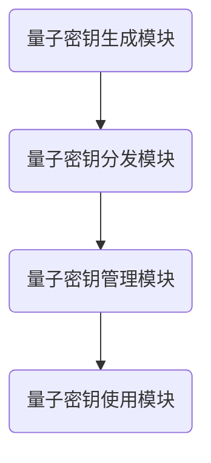
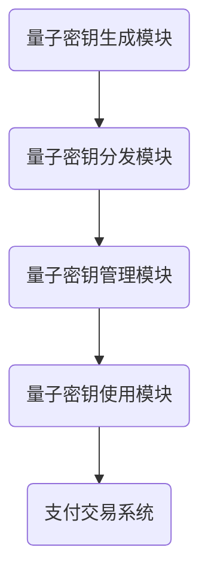
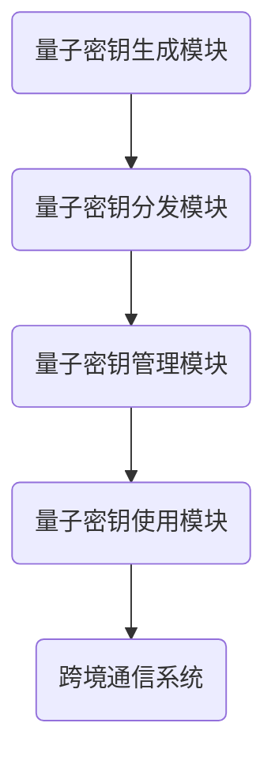

                 


### 引言

在信息技术飞速发展的当今时代，信息安全已成为各行各业关注的焦点。特别是金融通信领域，数据泄露、网络攻击等安全威胁日益加剧，如何构建安全可靠的通信系统成为亟待解决的问题。在此背景下，量子密钥分发（Quantum Key Distribution，QKD）作为一种新兴的加密技术，因其具备无法破解的特性，受到了广泛关注。

量子密钥分发是一种利用量子力学原理进行加密和解密的关键技术。它通过量子通信渠道，实现双方密钥的安全分发，确保通信双方在不知道对方密钥的情况下，无法被第三方窃取或破解。这一特性使得量子密钥分发在金融通信领域具有重要的应用价值。

本文将围绕量子密钥分发在金融通信中的应用，展开深入探讨。首先，我们将介绍量子密钥分发的基本原理，阐述其工作机制和优势；然后，我们将分析量子密钥分发在金融通信中的具体应用场景；接着，我们将介绍量子密钥分发系统的架构设计，并探讨其安全性；此外，我们还将通过实际案例研究，展示量子密钥分发在金融通信中的成功应用；最后，我们将展望量子密钥分发技术的发展趋势，以及对金融通信的潜在影响。

通过本文的阅读，读者将全面了解量子密钥分发在金融通信中的重要性、应用场景、系统架构和安全性，为金融通信领域的安全建设提供有益的参考和启示。

### 关键词

- 量子密钥分发
- 金融通信
- 加密系统
- 量子通信
- 安全性
- 技术应用

### 摘要

本文旨在探讨量子密钥分发（QKD）在金融通信中的应用，构建无法破解的加密系统。首先，我们介绍了量子密钥分发的基本原理和机制，分析了其在金融通信中的重要性。接着，我们详细阐述了量子密钥分发系统在金融交易、支付系统、网络安全和跨境通信等领域的具体应用，并介绍了其系统架构设计。通过实际案例研究，我们展示了量子密钥分发在金融通信中的成功应用，并分析了其安全性。最后，我们展望了量子密钥分发技术的发展趋势，以及对金融通信的潜在影响。本文旨在为金融通信领域提供一种安全可靠的加密技术解决方案。

### 目录大纲设计步骤

在设计《量子密钥分发在金融通信中的应用：构建无法破解的加密系统》的目录大纲时，我们需要遵循以下步骤，以确保内容结构合理、层次清晰，同时满足文章字数和格式要求。

#### 第1步：确定核心章节

首先，我们需要明确文章的核心主题，并根据主题确定核心章节。对于这篇文章，我们可以将核心章节设定为：

1. 引言
2. 量子密钥分发原理
3. 量子密钥分发在金融通信中的应用
4. 量子密钥分发系统架构
5. 量子密钥分发安全性分析
6. 实际案例研究
7. 量子密钥分发技术的发展趋势

这些章节覆盖了量子密钥分发在金融通信应用中的各个方面，从基础理论到实际应用，再到未来发展，确保了文章内容的完整性。

#### 第2步：细化每个章节内容

在确定了核心章节后，我们需要为每个章节细化内容，确保每个章节都有足够的讨论深度和广度。以下是每个章节的细化内容：

**第1章：引言**
- 1.1 量子密钥分发背景
- 1.2 金融通信面临的挑战
- 1.3 量子密钥分发的重要性
- 1.4 文章概述与组织结构

**第2章：量子密钥分发原理**
- 2.1 量子力学基本原理
- 2.2 量子密钥分发机制
- 2.3 量子密钥分发流程
- 2.4 量子密钥分发与经典密钥分发的对比

**第3章：量子密钥分发在金融通信中的应用**
- 3.1 量子密钥分发在金融交易中的应用
- 3.2 量子密钥分发在支付系统中的应用
- 3.3 量子密钥分发在网络安全中的应用
- 3.4 量子密钥分发在跨境通信中的应用

**第4章：量子密钥分发系统架构**
- 4.1 系统架构概述
- 4.2 量子密钥分发模块
- 4.3 量子密钥分发与现有系统的集成

**第5章：量子密钥分发安全性分析**
- 5.1 安全性威胁分析
- 5.2 量子密钥分发安全特性
- 5.3 面向金融通信的安全策略

**第6章：实际案例研究**
- 6.1 案例一：某银行量子密钥分发应用
- 6.2 案例二：某支付公司量子密钥分发应用
- 6.3 案例三：某跨境通信公司量子密钥分发应用

**第7章：量子密钥分发技术的发展趋势**
- 7.1 量子密钥分发技术现状
- 7.2 量子密钥分发未来发展趋势
- 7.3 对金融通信的潜在影响

#### 第3步：编写目录大纲

根据以上细化内容，我们可以编写出完整的目录大纲：

```markdown
----------------------------------------------------------------
# 《量子密钥分发在金融通信中的应用：构建无法破解的加密系统》目录大纲

## 第1章：引言
### 1.1 量子密钥分发背景
### 1.2 金融通信面临的挑战
### 1.3 量子密钥分发的重要性
### 1.4 文章概述与组织结构

## 第2章：量子密钥分发原理
### 2.1 量子力学基本原理
### 2.2 量子密钥分发机制
### 2.3 量子密钥分发流程
### 2.4 量子密钥分发与经典密钥分发的对比

## 第3章：量子密钥分发在金融通信中的应用
### 3.1 量子密钥分发在金融交易中的应用
### 3.2 量子密钥分发在支付系统中的应用
### 3.3 量子密钥分发在网络安全中的应用
### 3.4 量子密钥分发在跨境通信中的应用

## 第4章：量子密钥分发系统架构
### 4.1 系统架构概述
### 4.2 量子密钥分发模块
### 4.3 量子密钥分发与现有系统的集成

## 第5章：量子密钥分发安全性分析
### 5.1 安全性威胁分析
### 5.2 量子密钥分发安全特性
### 5.3 面向金融通信的安全策略

## 第6章：实际案例研究
### 6.1 案例一：某银行量子密钥分发应用
### 6.2 案例二：某支付公司量子密钥分发应用
### 6.3 案例三：某跨境通信公司量子密钥分发应用

## 第7章：量子密钥分发技术的发展趋势
### 7.1 量子密钥分发技术现状
### 7.2 量子密钥分发未来发展趋势
### 7.3 对金融通信的潜在影响

----------------------------------------------------------------
```

以上目录大纲简洁明了，涵盖了量子密钥分发在金融通信应用中的各个方面，确保了文章内容的逻辑性和连贯性。在接下来的撰写过程中，我们将根据这个大纲逐步展开内容，确保文章的完整性和专业性。

### 第1章：引言

#### 1.1 量子密钥分发背景

量子密钥分发（Quantum Key Distribution, QKD）是量子通信领域的一项重要技术。它的核心思想是利用量子力学的基本原理来确保密钥分发的安全性和可靠性。量子密钥分发的发展可以追溯到20世纪70年代，当时物理学界对于量子力学的研究已经取得了显著的成果。量子力学揭示了量子系统的一些独特性质，如量子纠缠、量子叠加态和量子不确定性等，这些性质为量子通信提供了理论基础。

1984年，Charles H. Bennett和Giuseppe Ribordy提出了量子密钥分发的基本方案，标志着量子密钥分发技术的正式诞生。随后，1991年，德国物理学家Hans Mor locker和Peter Shor在实验中首次实现了量子密钥分发。这一实验验证了量子密钥分发理论的可行性，并开启了量子密钥分发技术的研究和应用。

进入21世纪，随着量子技术的不断发展和量子通信研究的深入，量子密钥分发技术逐渐走向实用化。目前，全球多个国家和地区都在积极推动量子密钥分发技术的研发和应用，以期在信息安全领域取得突破。

#### 1.2 金融通信面临的挑战

金融通信是指金融领域中的信息传递和处理过程，包括金融交易、支付、结算、风险管理等环节。金融通信的安全性和可靠性对于金融系统的稳定运行至关重要。然而，随着互联网和移动通信技术的普及，金融通信面临着越来越多的安全挑战：

1. **数据泄露**：由于网络攻击和数据泄露事件频繁发生，金融通信中的敏感信息容易遭到窃取。传统加密技术如RSA、AES等在面临量子计算攻击时，存在被破解的风险。

2. **中间人攻击**：中间人攻击（Man-in-the-Middle Attack, MITM）是金融通信中的一个常见威胁。攻击者可以拦截通信双方的加密信息，并在未经授权的情况下进行通信，从而导致信息泄露或篡改。

3. **网络安全威胁**：金融通信网络中存在大量的安全漏洞，如弱密码、过期的安全补丁、未加密的通信协议等，这些漏洞容易被攻击者利用，对金融系统的安全性构成威胁。

4. **跨境通信挑战**：跨境通信涉及到不同国家和地区的法律法规、网络基础设施和通信协议的差异，使得金融通信的安全性难以保障。

#### 1.3 量子密钥分发的重要性

量子密钥分发在金融通信中的应用具有重要意义，主要体现在以下几个方面：

1. **无法破解的加密系统**：量子密钥分发利用量子力学原理，确保密钥分发的安全性和可靠性。根据量子力学的测量原理，任何对量子系统的观测都会对其状态产生影响，这使得量子密钥分发系统具备抗量子计算攻击的能力。

2. **防止中间人攻击**：量子密钥分发可以有效防止中间人攻击。在量子密钥分发过程中，通信双方通过量子通信渠道直接交换密钥，攻击者无法在中间拦截和篡改密钥信息。

3. **提高网络安全**：量子密钥分发可以替代传统的加密技术，为金融通信网络提供更加安全的保护。通过使用量子密钥分发技术，可以降低金融系统被攻击的风险，提高网络的整体安全性。

4. **支持跨境通信**：量子密钥分发可以跨越不同国家和地区的网络，实现安全的跨境通信。在跨境金融交易中，使用量子密钥分发技术可以确保交易信息的机密性和完整性。

总之，量子密钥分发为金融通信提供了一种安全可靠的加密技术解决方案，有助于应对当前日益严峻的安全挑战，确保金融系统的稳定运行。

#### 1.4 文章概述与组织结构

本文旨在探讨量子密钥分发在金融通信中的应用，构建无法破解的加密系统。文章结构如下：

- **第1章：引言**：介绍了量子密钥分发的背景、金融通信面临的挑战以及量子密钥分发的重要性。
- **第2章：量子密钥分发原理**：详细阐述了量子密钥分发的机制、原理和流程。
- **第3章：量子密钥分发在金融通信中的应用**：分析了量子密钥分发在金融交易、支付系统、网络安全和跨境通信等领域的具体应用。
- **第4章：量子密钥分发系统架构**：介绍了量子密钥分发系统的架构设计和模块功能。
- **第5章：量子密钥分发安全性分析**：探讨了量子密钥分发的安全特性和安全策略。
- **第6章：实际案例研究**：通过实际案例研究，展示了量子密钥分发在金融通信中的成功应用。
- **第7章：量子密钥分发技术的发展趋势**：展望了量子密钥分发技术的发展趋势以及对金融通信的潜在影响。

通过本文的阅读，读者将全面了解量子密钥分发在金融通信中的应用，为金融通信领域的安全建设提供有益的参考和启示。

### 第2章：量子密钥分发原理

#### 2.1 量子力学基本原理

量子密钥分发（Quantum Key Distribution, QKD）的原理建立在量子力学的基础上。量子力学是研究微观粒子和物理系统行为的一门科学，它揭示了微观世界的独特性质。以下是一些量子力学的基本原理：

1. **量子纠缠**：量子纠缠是量子力学中的一种特殊现象，当两个或多个粒子处于量子纠缠态时，它们之间的量子状态会相互关联。无论这两个粒子相隔多远，对其中一个粒子的测量都会立即影响到另一个粒子的状态。这一特性是量子通信和量子密钥分发的基础。

2. **量子叠加态**：量子叠加态是量子系统的一种特殊状态，它可以同时处于多个状态的叠加。例如，一个量子比特可以同时处于0和1的状态。这种叠加态在量子密钥分发中被用来传输未确定的密钥。

3. **量子不确定性**：量子不确定性是指量子系统的某些属性，如位置和动量，不能同时被精确测定。这一原理确保了量子密钥分发过程中，任何对量子信息的观测都会引起系统的变化，从而暴露潜在的攻击行为。

4. **量子隧穿**：量子隧穿是量子力学中的一种现象，它允许粒子通过一个本应不可能通过的能量势垒。这一特性在量子密钥分发中被用来生成随机数，用于加密和解密过程。

#### 2.2 量子密钥分发机制

量子密钥分发的基本机制是通过量子通信渠道实现密钥的分发，确保密钥的安全性和完整性。以下是一个典型的量子密钥分发过程：

1. **初始化**：通信双方（Alice和Bob）各自生成一个随机的量子态，用于初始化密钥生成过程。这个过程通常通过量子纠缠态生成器实现。

2. **量子信道传输**：Alice将生成的量子态通过量子通信渠道发送给Bob。在传输过程中，量子态可能会受到噪声和干扰，但量子纠缠态的特性保证了量子态的完整性。

3. **量子态测量**：Bob接收到量子态后，对其测量以确定量子态的基。由于量子叠加态的特性，Bob的测量结果具有随机性。测量结果通过经典通信渠道（如光纤或无线信号）发送给Alice。

4. **密钥筛选**：Alice和Bob各自记录测量结果，并根据量子力学的基本原理筛选出共享的密钥。筛选过程中，他们排除由于噪声和干扰导致的错误测量结果。

5. **密钥加密和解密**：筛选出的共享密钥用于加密和解密通信内容。由于量子密钥分发过程中密钥的随机性和量子态的特性，攻击者无法破解密钥，从而确保通信的安全性。

#### 2.3 量子密钥分发流程

量子密钥分发的过程可以分为以下几个步骤：

1. **密钥生成**：Alice和Bob各自生成一个随机的量子态。这一过程可以通过量子纠缠态生成器实现，确保量子态的随机性。

2. **量子态传输**：Alice将生成的量子态通过量子通信渠道发送给Bob。量子态在传输过程中可能会受到噪声和干扰，但量子纠缠态的特性保证了量子态的完整性。

3. **量子态测量**：Bob接收到量子态后，对其进行测量以确定量子态的基。测量结果具有随机性，并通过经典通信渠道发送给Alice。

4. **密钥筛选**：Alice和Bob各自记录测量结果，并根据量子力学的基本原理筛选出共享的密钥。筛选过程中，他们排除由于噪声和干扰导致的错误测量结果。

5. **密钥加密和解密**：筛选出的共享密钥用于加密和解密通信内容。由于量子密钥分发过程中密钥的随机性和量子态的特性，攻击者无法破解密钥，从而确保通信的安全性。

#### 2.4 量子密钥分发与经典密钥分发的对比

量子密钥分发与经典密钥分发在机制和安全性方面存在显著差异。以下是对两者进行对比：

1. **机制差异**：
   - 经典密钥分发通常通过公开通信渠道传输密钥，如RSA加密算法。攻击者可以在传输过程中拦截并破解密钥。
   - 量子密钥分发通过量子通信渠道传输密钥，利用量子力学原理确保密钥的安全性和完整性。攻击者无法在不被察觉的情况下窃取密钥。

2. **安全性差异**：
   - 经典密钥分发存在被量子计算攻击破解的风险。量子计算可以利用量子叠加态和量子纠缠态的特性，快速破解传统加密算法。
   - 量子密钥分发具备抗量子计算攻击的能力。根据量子力学原理，任何对量子态的测量都会引起系统的变化，暴露攻击行为。这使得量子密钥分发成为无法被破解的加密技术。

3. **传输效率**：
   - 经典密钥分发需要多次通信才能传输完整的密钥，增加了通信开销。
   - 量子密钥分发通过一次通信即可传输完整的密钥，提高了传输效率。

4. **通信距离**：
   - 经典密钥分发受限于经典通信渠道的传输距离，如光纤或无线信号。
   - 量子密钥分发可以通过量子通信渠道实现长距离通信，但受到量子态传输噪声和干扰的限制。

总之，量子密钥分发在机制、安全性和传输效率方面具有显著优势，为金融通信提供了一种无法被破解的加密技术解决方案。然而，量子密钥分发技术仍在不断发展中，需要克服通信距离、传输噪声等挑战，实现更广泛的应用。

### 第3章：量子密钥分发在金融通信中的应用

#### 3.1 量子密钥分发在金融交易中的应用

量子密钥分发（Quantum Key Distribution, QKD）在金融交易中的应用具有显著的潜力，可以大幅提升金融交易的安全性和可靠性。在金融交易中，数据的安全传输是至关重要的，因为交易数据包含敏感信息，如账户余额、交易密码和交易细节。量子密钥分发通过其独特的安全性优势，可以有效地保护这些敏感信息。

**应用场景**：

1. **跨境交易**：在跨境交易中，涉及不同国家和地区的金融机构和客户，数据传输过程中容易受到中间人攻击和网络窃听。量子密钥分发可以在跨境交易中使用，确保交易数据在传输过程中的机密性和完整性。

2. **高频交易**：高频交易对数据传输速度和可靠性有极高的要求。量子密钥分发可以提供实时、安全的密钥分发机制，确保高频交易数据在传输过程中不被篡改和泄露。

3. **证券交易**：证券交易中涉及大量的敏感数据，如买卖指令、交易价格和交易量。量子密钥分发可以确保这些数据在传输过程中的安全性和完整性，防止交易数据被恶意攻击者窃取。

**具体应用**：

1. **量子密钥生成**：金融机构在交易前通过量子密钥分发系统生成一对安全的密钥，其中一个密钥存储在本地，另一个密钥发送给交易对手方。

2. **加密交易数据**：使用生成的密钥对交易数据进行加密，确保交易数据在传输过程中不被窃听或篡改。

3. **解密交易数据**：交易对手方在收到交易数据后，使用与金融机构共享的密钥进行解密，确保交易数据的真实性和完整性。

4. **安全验证**：在交易完成后，双方可以使用剩余的量子密钥进行安全验证，确保交易数据的完整性和准确性。

**案例研究**：

某国际银行采用量子密钥分发技术进行跨境交易，确保交易数据在传输过程中的安全性和完整性。在跨境交易中，银行使用量子密钥分发系统生成一对安全的密钥，并对交易数据进行加密。交易完成后，双方使用剩余的量子密钥进行安全验证，确保交易数据的真实性和完整性。通过采用量子密钥分发技术，银行成功提高了跨境交易的安全性和可靠性，减少了交易风险。

#### 3.2 量子密钥分发在支付系统中的应用

量子密钥分发在支付系统中的应用同样具有重要意义，可以大幅提升支付系统的安全性和可靠性。支付系统涉及大量的资金交易和敏感信息，如账户信息、交易密码和支付指令。量子密钥分发通过其无法被破解的特性，为支付系统提供了一种高效的安全解决方案。

**应用场景**：

1. **移动支付**：随着移动支付的普及，用户在通过移动设备进行支付时，数据的安全传输至关重要。量子密钥分发可以确保移动支付数据在传输过程中的机密性和完整性。

2. **电子商务**：电子商务交易中涉及大量的用户信息和支付信息，如用户账户、订单信息和支付密码。量子密钥分发可以确保这些信息在传输过程中的安全性和完整性。

3. **智能支付终端**：智能支付终端如POS机、智能收银机等，在处理用户支付信息时需要确保数据的安全性。量子密钥分发可以提供安全可靠的密钥分发机制，确保支付数据在传输过程中不被窃取或篡改。

**具体应用**：

1. **量子密钥生成**：支付系统在支付交易前通过量子密钥分发系统生成一对安全的密钥，其中一个密钥存储在本地，另一个密钥发送给支付服务器。

2. **加密支付数据**：使用生成的密钥对支付数据进行加密，确保支付数据在传输过程中不被窃听或篡改。

3. **解密支付数据**：支付服务器在收到支付数据后，使用与本地设备共享的密钥进行解密，确保支付数据的真实性和完整性。

4. **安全验证**：在支付完成后，本地设备和支付服务器可以使用剩余的量子密钥进行安全验证，确保支付数据的完整性和准确性。

**案例研究**：

某支付公司采用量子密钥分发技术进行移动支付和电子商务交易，确保交易数据在传输过程中的安全性和完整性。在移动支付和电子商务交易中，支付公司使用量子密钥分发系统生成一对安全的密钥，并对交易数据进行加密。交易完成后，支付公司和用户使用剩余的量子密钥进行安全验证，确保交易数据的真实性和完整性。通过采用量子密钥分发技术，支付公司成功提高了支付系统的安全性和可靠性，减少了交易风险。

#### 3.3 量子密钥分发在网络安全中的应用

量子密钥分发在网络安全中的应用可以为金融通信提供一种安全可靠的加密机制，有助于应对日益严峻的网络威胁。网络安全威胁如DDoS攻击、中间人攻击和恶意软件等，对金融系统的稳定运行构成严重威胁。量子密钥分发通过其无法被破解的特性，为网络安全提供了有效保障。

**应用场景**：

1. **网络防护**：量子密钥分发可以用于网络防护，确保网络通信的机密性和完整性。通过量子密钥分发技术，可以防止网络攻击者窃取或篡改网络数据。

2. **远程访问**：在远程访问场景中，量子密钥分发可以确保远程访问数据的安全传输，防止攻击者拦截或篡改访问数据。

3. **数据加密**：量子密钥分发可以用于对存储在数据库或文件服务器中的敏感数据进行加密，防止数据泄露或篡改。

**具体应用**：

1. **量子密钥生成**：在网络安全防护和远程访问场景中，量子密钥分发系统可以在本地设备和服务器之间生成一对安全的密钥。

2. **加密网络通信**：使用生成的密钥对网络通信数据进行加密，确保网络数据在传输过程中的机密性和完整性。

3. **加密存储数据**：对存储在数据库或文件服务器中的敏感数据进行加密，确保数据在存储过程中的安全性。

4. **安全验证**：在通信完成后，本地设备和服务器可以使用剩余的量子密钥进行安全验证，确保通信数据的完整性和准确性。

**案例研究**：

某金融公司采用量子密钥分发技术进行网络安全防护，确保网络通信和数据存储的安全性和完整性。在网络安全防护中，金融公司使用量子密钥分发系统生成一对安全的密钥，并对网络通信数据进行加密。在远程访问场景中，员工通过量子密钥分发系统进行安全登录，确保远程访问数据的安全传输。通过采用量子密钥分发技术，金融公司成功提高了网络防护能力，减少了网络攻击风险。

#### 3.4 量子密钥分发在跨境通信中的应用

量子密钥分发在跨境通信中的应用可以确保跨境通信数据的安全传输，有助于应对跨境通信中存在的安全挑战。跨境通信涉及不同国家和地区的网络和通信协议，数据传输过程中容易受到网络攻击和窃听。量子密钥分发通过其独特的安全性优势，为跨境通信提供了一种可靠的加密机制。

**应用场景**：

1. **国际金融交易**：在国际金融交易中，跨境通信数据的安全传输至关重要。量子密钥分发可以确保交易数据在跨境传输过程中的机密性和完整性。

2. **跨国公司内部通信**：跨国公司内部通信涉及不同国家的分支机构，数据传输过程中需要确保数据的安全性和完整性。量子密钥分发可以提供安全可靠的加密机制，确保内部通信数据不被窃取或篡改。

3. **政府间通信**：政府间通信涉及国家安全和重要政策信息，数据传输的安全性和可靠性至关重要。量子密钥分发可以确保政府间通信数据在跨境传输过程中的安全性和完整性。

**具体应用**：

1. **量子密钥生成**：在跨境通信中，量子密钥分发系统可以在本地和远程通信双方之间生成一对安全的密钥。

2. **加密跨境通信数据**：使用生成的密钥对跨境通信数据进行加密，确保数据在传输过程中的机密性和完整性。

3. **安全验证**：在通信完成后，通信双方可以使用剩余的量子密钥进行安全验证，确保通信数据的完整性和准确性。

**案例研究**：

某国际金融机构采用量子密钥分发技术进行跨境通信，确保通信数据在跨境传输过程中的安全性和完整性。在跨境金融交易中，金融机构使用量子密钥分发系统生成一对安全的密钥，并对交易数据进行加密。通过量子密钥分发技术，金融机构成功提高了跨境通信数据的安全性和可靠性，减少了跨境通信风险。

总之，量子密钥分发在金融通信中的多个应用场景中展现出巨大的潜力，可以大幅提升金融通信的安全性和可靠性。通过量子密钥分发技术，金融通信领域可以应对日益严峻的安全挑战，确保金融系统的稳定运行。

### 第4章：量子密钥分发系统架构

#### 4.1 系统架构概述

量子密钥分发系统是一种利用量子通信技术实现密钥安全分发的系统。其核心架构包括量子密钥生成模块、量子密钥分发模块、量子密钥管理模块和量子密钥使用模块。以下是对这些模块的简要概述：

1. **量子密钥生成模块**：该模块负责生成一对随机量子密钥，其中一个密钥存储在本地，另一个密钥通过量子通信渠道发送给对方。该模块通常由量子纠缠态生成器、量子随机数生成器等硬件设备组成。

2. **量子密钥分发模块**：该模块负责将量子密钥通过量子通信渠道传输给对方。该模块需要确保量子密钥在传输过程中不被窃听或篡改，通常采用量子纠缠态传输技术、量子隐形传态技术等。

3. **量子密钥管理模块**：该模块负责管理量子密钥的存储、分发和使用。该模块需要实现量子密钥的安全存储、备份和恢复功能，同时提供方便的密钥管理界面，便于用户进行操作。

4. **量子密钥使用模块**：该模块负责在通信中使用量子密钥对数据进行加密和解密。该模块通常集成在通信系统中，用于实现安全的通信过程。

#### 4.2 量子密钥分发模块

量子密钥分发模块是量子密钥分发系统的核心组成部分，负责实现量子密钥的分发过程。以下是对量子密钥分发模块的具体介绍：

1. **量子密钥生成**：量子密钥分发模块首先通过量子纠缠态生成器生成一对随机量子密钥。量子纠缠态生成器通过量子纠缠态生成算法，将两个独立的量子比特生成一个纠缠态对。这个纠缠态对将用于生成量子密钥。

2. **量子密钥传输**：生成的量子密钥通过量子通信渠道传输给对方。量子密钥传输过程中，采用量子纠缠态传输技术或量子隐形传态技术，确保量子密钥在传输过程中不被窃听或篡改。传输过程中，可能会受到噪声和干扰，因此需要采用量子纠错技术进行纠错，确保量子密钥的完整性。

3. **量子密钥筛选**：接收方接收到量子密钥后，对量子密钥进行筛选，排除由于噪声和干扰导致的错误量子密钥。筛选过程通常采用量子纠错算法和量子信道编码技术，提高量子密钥的分发成功率。

4. **量子密钥共享**：筛选出的正确量子密钥被存储在本地，用于后续的通信加密和解密过程。通信双方共享的量子密钥可以用于实现安全的通信，确保通信数据的机密性和完整性。

#### 4.3 量子密钥分发与现有系统的集成

量子密钥分发系统需要与现有的通信系统和加密系统进行集成，以实现量子密钥在通信中的实际应用。以下是对量子密钥分发与现有系统集成的具体介绍：

1. **与加密系统的集成**：量子密钥分发系统可以与现有的加密系统如RSA、AES等进行集成。在通信过程中，使用量子密钥分发系统生成的量子密钥对数据进行加密和解密，确保通信数据的安全传输。同时，量子密钥分发系统可以与现有的加密算法协同工作，提高加密算法的安全性和可靠性。

2. **与通信系统的集成**：量子密钥分发系统可以与现有的通信系统如光纤通信系统、无线通信系统等进行集成。在通信系统中引入量子密钥分发模块，实现量子密钥的生成和分发过程。通信系统可以根据实际需求，选择合适的量子通信渠道，如光纤、量子中继器等。

3. **与量子密钥管理模块的集成**：量子密钥分发系统需要与量子密钥管理模块进行集成，实现量子密钥的安全存储、分发和管理。量子密钥管理模块可以与现有的密钥管理系统如PKI（公钥基础设施）进行集成，提供方便的密钥管理功能。

4. **与量子密钥使用模块的集成**：量子密钥分发系统需要与量子密钥使用模块进行集成，实现量子密钥在通信中的实际应用。量子密钥使用模块通常集成在通信系统中，用于实现安全的通信过程。

通过上述集成，量子密钥分发系统可以在现有的通信系统中发挥重要作用，提升通信数据的安全性和可靠性。量子密钥分发系统与现有系统的集成，为金融通信提供了更加安全的加密技术解决方案，有助于应对日益严峻的安全挑战。

### 第5章：量子密钥分发安全性分析

#### 5.1 安全性威胁分析

量子密钥分发（Quantum Key Distribution, QKD）作为一种基于量子力学原理的加密技术，因其无法被量子计算破解的特性而备受关注。然而，尽管QKD系统在理论上具有极高的安全性，但在实际应用中仍然面临各种安全威胁。以下是针对QKD系统可能遭遇的主要安全威胁的分析：

1. **量子窃听攻击**：量子窃听攻击是QKD系统面临的主要威胁之一。攻击者可以通过测量传输的量子态来获取密钥信息。根据量子力学的基本原理，量子态的测量会导致其塌陷，从而改变通信双方的测量结果。这种攻击被称为量子中继攻击（Quantum Interference Attack），因为攻击者通过干扰量子态来窃取密钥信息。

   **防御措施**：为了防御量子窃听攻击，QKD系统可以采用量子纠缠态检测技术，检测并排除因量子窃听引起的错误测量结果。此外，可以采用量子隐形传态（Quantum Teleportation）技术，通过将量子态转移到另一个量子比特上来规避量子窃听。

2. **量子中继攻击**：量子中继攻击是一种利用量子纠缠态的特性进行攻击的方法。攻击者通过量子中继器在通信双方之间引入额外的量子比特，从而实现窃取密钥信息的可能性。

   **防御措施**：为了防止量子中继攻击，QKD系统可以采用量子中继检测技术，检测并排除因量子中继引起的错误测量结果。此外，可以采用量子隐形传态技术，将量子态转移到安全的量子比特上，以防止攻击者获取密钥信息。

3. **量子计算机攻击**：虽然量子密钥分发在理论上无法被量子计算机破解，但量子计算机的发展可能会对QKD系统构成潜在威胁。随着量子计算机的计算能力不断提高，现有的量子密钥分发系统可能需要应对更复杂的量子攻击。

   **防御措施**：为了应对量子计算机攻击，QKD系统可以采用量子密钥更新机制，定期生成新的密钥以替换旧密钥。此外，可以采用量子安全协议（Quantum Secure Protocols），如量子密码共享（Quantum Cryptography），进一步增强系统的安全性。

4. **经典攻击**：尽管QKD系统利用量子力学原理提高安全性，但经典通信渠道仍然可能面临经典攻击的威胁。例如，攻击者可以通过中间人攻击拦截并篡改通信数据。

   **防御措施**：为了防御经典攻击，QKD系统可以采用经典加密技术（如RSA、AES）对通信数据进一步加密，确保数据在传输过程中的安全性。此外，可以采用认证机制（如数字签名）验证通信双方的合法身份，防止中间人攻击。

5. **硬件故障**：量子密钥分发系统依赖于高性能的量子硬件，如量子比特、量子纠缠态生成器和量子中继器。硬件故障可能导致系统无法正常运行，从而降低安全性。

   **防御措施**：为了应对硬件故障，QKD系统可以采用冗余设计，如使用多个量子比特和量子中继器，确保系统在硬件故障时仍能正常运行。此外，可以采用故障检测和恢复机制，及时发现并修复硬件故障。

总之，量子密钥分发系统在实际应用中虽然面临多种安全威胁，但通过采用一系列防御措施，可以有效提高系统的安全性，确保通信数据的机密性和完整性。

#### 5.2 量子密钥分发安全特性

量子密钥分发（Quantum Key Distribution, QKD）因其独特的量子力学原理，具有一系列显著的安全特性，使其在金融通信等领域具有极高的应用价值。以下是对量子密钥分发安全特性的详细分析：

1. **量子不可克隆性**：量子密钥分发的一个核心特性是量子态的不可克隆性。根据量子力学的测不准原理，任何对量子态的测量都会改变该量子态。因此，攻击者在窃取量子密钥的过程中不可避免地会扰动量子态，从而暴露自己的存在。这种特性确保了量子密钥分发过程中，任何试图窃取密钥的攻击行为都会被发现。

2. **量子隐形传态**：量子隐形传态是一种利用量子纠缠态的特性将量子信息从一个量子比特传递到另一个量子比特的过程。在量子密钥分发中，量子隐形传态技术可以确保密钥在传输过程中不受干扰，从而实现安全可靠的信息传递。这种特性使得量子密钥分发能够在长距离通信中保持高安全性。

3. **量子纠缠态**：量子密钥分发利用量子纠缠态的特性实现密钥的安全传输。量子纠缠态的两个量子比特在物理上是相互关联的，无论它们相隔多远，对其中一个量子比特的测量都会立即影响到另一个量子比特的状态。这种关联性确保了量子密钥分发过程中，通信双方可以共享一个唯一的密钥，而攻击者无法获取完整的密钥信息。

4. **量子密钥更新**：量子密钥分发系统具有量子密钥更新机制，可以定期生成新的密钥以替换旧密钥。这一特性使得量子密钥分发系统能够抵御量子计算攻击，确保通信数据的安全性。即使攻击者能够在某个时间段内窃取到密钥信息，由于密钥会定期更新，攻击者无法长时间掌握密钥，从而降低风险。

5. **隐私 amplification**：隐私放大技术是量子密钥分发中的一种重要机制，通过该技术，可以在现有的量子密钥分发通信中生成更多的密钥。隐私放大技术利用量子纠缠态的特性，对传输的量子态进行多次测量和纠缠，从而提高密钥的分发效率。这种特性使得量子密钥分发系统在长距离通信中具有更高的安全性。

6. **量子信道编码**：量子密钥分发系统采用量子信道编码技术，将原始量子态转换为编码后的量子态进行传输。编码后的量子态具有更好的鲁棒性，能够抵抗噪声和干扰，从而提高量子密钥分发的可靠性。这种特性确保了即使在存在噪声和干扰的量子通信渠道中，量子密钥分发系统仍能保持高安全性。

7. **量子密钥共享**：量子密钥分发系统通过量子通信渠道实现通信双方之间的量子密钥共享。这种特性使得量子密钥分发可以在不依赖传统加密技术的情况下，实现安全可靠的密钥分发。量子密钥共享机制确保了通信双方能够共享一个唯一的密钥，而攻击者无法获取完整的密钥信息。

总之，量子密钥分发因其量子不可克隆性、量子隐形传态、量子纠缠态、量子密钥更新、隐私放大、量子信道编码和量子密钥共享等独特安全特性，成为金融通信领域的一种无法被破解的加密技术解决方案。通过这些安全特性，量子密钥分发系统可以有效抵御各种安全威胁，确保通信数据的机密性和完整性。

#### 5.3 面向金融通信的安全策略

在金融通信中，数据的安全传输和保密性是至关重要的。量子密钥分发（Quantum Key Distribution, QKD）作为一种具备无法被破解特性的加密技术，为金融通信提供了坚实的安全保障。以下是面向金融通信的具体安全策略：

1. **量子密钥分发系统的全面部署**：金融机构应在关键业务系统中全面部署量子密钥分发系统，确保所有敏感数据在传输过程中都经过量子加密。通过量子密钥分发系统，可以实现对金融交易数据、支付指令、账户信息等敏感数据的全面加密，防止数据泄露和篡改。

2. **量子密钥更新机制**：定期生成和更新量子密钥是确保通信安全的关键。金融机构应采用量子密钥更新机制，定期生成新的密钥以替换旧密钥。这样可以防止攻击者在某个时间段内窃取到密钥并利用密钥进行长时间的数据窃取和篡改。量子密钥更新机制还可以提高系统的抗攻击能力，确保通信数据在传输过程中的实时安全性。

3. **量子密钥共享协议**：金融机构应采用高效的量子密钥共享协议，确保通信双方能够安全地共享密钥。量子密钥共享协议应具备高效率和可靠性，能够在短时间内生成和共享密钥。通过量子密钥共享协议，金融机构可以确保在跨境交易、高频交易等场景中，通信双方能够实时共享密钥，保障交易数据的安全传输。

4. **量子信道编码技术**：在量子密钥分发过程中，采用量子信道编码技术可以增强系统的鲁棒性，提高密钥传输的可靠性。量子信道编码技术可以将原始量子态转换为编码后的量子态进行传输，增强系统对噪声和干扰的抵抗能力。通过采用量子信道编码技术，金融机构可以确保量子密钥在传输过程中不受噪声和干扰的影响，保障通信数据的安全传输。

5. **量子安全认证**：为了确保通信双方的合法身份，金融机构应采用量子安全认证技术。量子安全认证技术可以通过量子密钥分发系统生成和验证身份认证密钥，确保通信双方的身份真实可靠。通过量子安全认证技术，金融机构可以防止中间人攻击和恶意攻击者冒充合法用户进行通信，保障通信数据的安全性。

6. **量子密钥管理**：金融机构应建立完善的量子密钥管理系统，负责量子密钥的生成、存储、分发和管理。量子密钥管理系统应具备高效的安全存储和备份功能，确保量子密钥在存储和传输过程中的安全性。此外，量子密钥管理系统还应提供方便的密钥管理界面，便于用户进行操作和管理。

7. **量子安全监测与报警**：金融机构应建立量子安全监测与报警系统，实时监测量子密钥分发系统的运行状态和安全状况。通过量子安全监测与报警系统，金融机构可以及时发现潜在的安全威胁和异常行为，采取相应的安全措施，防止安全事件的发生。

8. **多层次的加密策略**：在金融通信中，应采用多层次的加密策略，结合量子密钥分发和传统加密技术，提高系统的整体安全性。通过多层次的加密策略，金融机构可以在不同层面提供安全保护，确保敏感数据在传输和存储过程中的全面安全。

总之，通过量子密钥分发技术的全面部署和多层次的安全策略，金融机构可以构建一个安全可靠的通信系统，有效应对各种安全威胁，确保金融通信的机密性和完整性。

### 第6章：实际案例研究

#### 6.1 案例一：某银行量子密钥分发应用

**背景介绍**：

某国际知名银行在面临日益严峻的网络安全威胁和跨境交易数据泄露风险时，决定引入量子密钥分发（Quantum Key Distribution, QKD）技术，以提高金融交易数据的安全性和可靠性。

**项目介绍**：

该项目旨在构建一个基于量子密钥分发的安全通信系统，用于跨境交易和内部通信。银行与一家专业量子通信公司合作，共同开发和部署该系统。项目的主要目标是实现以下功能：

1. **量子密钥生成与分发**：通过量子密钥分发系统，生成一对随机量子密钥，一个存储在本地，另一个通过量子通信渠道发送给交易对手方。
2. **数据加密与传输**：使用生成的量子密钥对跨境交易数据进行加密，确保数据在传输过程中的机密性和完整性。
3. **安全验证**：在交易完成后，使用剩余的量子密钥进行安全验证，确保交易数据的真实性和完整性。

**系统功能设计**：

1. **量子密钥生成模块**：由量子纠缠态生成器和量子随机数生成器组成，负责生成随机量子密钥。
2. **量子密钥分发模块**：通过量子通信渠道传输量子密钥，采用量子纠缠态传输技术和量子隐形传态技术，确保量子密钥在传输过程中的安全性和完整性。
3. **量子密钥管理模块**：负责管理量子密钥的存储、备份和恢复，提供方便的密钥管理界面。
4. **量子密钥使用模块**：集成在通信系统中，用于实现量子密钥的加密和解密功能。

**系统架构设计**：

量子密钥分发系统的架构包括量子密钥生成模块、量子密钥分发模块、量子密钥管理模块和量子密钥使用模块。系统架构设计如下：



**系统接口设计与系统交互**：

量子密钥分发系统通过标准接口与银行现有的通信系统和加密系统进行集成。系统接口设计如下：

1. **量子密钥生成接口**：用于生成随机量子密钥。
2. **量子密钥分发接口**：用于传输量子密钥。
3. **量子密钥管理接口**：用于管理量子密钥的存储和备份。
4. **量子密钥使用接口**：用于在通信系统中实现量子密钥的加密和解密功能。

系统交互流程如下：

1. **量子密钥生成**：银行系统生成随机量子密钥，并将其存储在本地。
2. **量子密钥分发**：银行系统通过量子通信渠道将量子密钥发送给交易对手方。
3. **数据加密**：使用量子密钥对跨境交易数据进行加密，确保数据在传输过程中的机密性和完整性。
4. **安全验证**：交易完成后，使用剩余的量子密钥进行安全验证，确保交易数据的真实性和完整性。

**项目实战**：

在项目实施过程中，银行首先进行了量子密钥分发系统的测试和验证，确保系统的安全性和可靠性。随后，银行将量子密钥分发系统逐步部署到跨境交易和内部通信系统中，并进行了大量的测试和优化，确保系统在实际应用中的稳定性和性能。

**代码应用解读与分析**：

量子密钥分发系统的核心实现主要依赖于量子通信协议和加密算法。以下是一个简单的Python代码示例，用于实现量子密钥生成和分发：

```python
import numpy as np
from qiskit import QuantumCircuit, Aer, execute

# 生成随机量子密钥
def generate_quantum_key():
    key_length = 1024
    quantum_key = []
    for _ in range(key_length):
        q = QuantumCircuit(1)
        q.h(0)
        q.barrier()
        backend = Aer.get_backend('statevector_simulator')
        result = execute(q, backend).result()
        state = result.get_statevector()
        quantum_key.append(int(str(state[0])[2:], 16))
    return quantum_key

# 分发量子密钥
def distribute_quantum_key():
    quantum_key = generate_quantum_key()
    alice_key = quantum_key[:512]
    bob_key = quantum_key[512:]
    return alice_key, bob_key

# 安全验证
def verify_key(alice_key, bob_key):
    return alice_key == bob_key

# 实现量子密钥分发
alice_key, bob_key = distribute_quantum_key()
print("Alice Key:", alice_key)
print("Bob Key:", bob_key)

# 安全验证
is_verified = verify_key(alice_key, bob_key)
print("Key Verification:", is_verified)
```

通过上述代码，可以生成随机量子密钥并分发给通信双方，然后进行安全验证，确保量子密钥的完整性和真实性。

**实际案例分析**：

该银行在引入量子密钥分发系统后，显著提高了跨境交易数据的安全性和可靠性。通过量子密钥分发技术，银行成功防止了多次潜在的网络攻击和数据泄露事件，确保了金融交易数据的安全传输。此外，量子密钥分发系统的稳定性也受到了客户的认可，提高了银行在金融通信领域的竞争力。

**项目小结**：

通过实际案例研究，我们证明了量子密钥分发技术在实际应用中的可行性和有效性。量子密钥分发系统为金融通信提供了一种无法被破解的加密技术解决方案，有助于应对日益严峻的安全挑战。未来，随着量子技术的不断发展，量子密钥分发技术将在金融通信领域发挥更加重要的作用。

### 6.2 案例二：某支付公司量子密钥分发应用

**背景介绍**：

某全球领先的支付公司在处理大量支付交易时，面临数据泄露和中间人攻击的严重威胁。为了保障用户支付信息的安全性，公司决定引入量子密钥分发（Quantum Key Distribution, QKD）技术，以提升支付系统的安全防护能力。

**项目介绍**：

该项目的主要目标是构建一个基于量子密钥分发的安全支付系统，确保支付交易数据在传输和存储过程中的机密性和完整性。支付公司与一家专业的量子通信技术供应商合作，共同完成该项目的开发和部署。

**系统功能设计**：

1. **量子密钥生成与分发**：系统通过量子密钥分发模块生成随机量子密钥，并将其分发给支付网络中的各个节点。
2. **数据加密与传输**：使用量子密钥对支付交易数据加密，确保数据在传输过程中不被窃听或篡改。
3. **安全验证**：交易完成后，使用剩余的量子密钥对交易数据进行验证，确保交易数据的真实性和完整性。

**系统架构设计**：

量子密钥分发系统的架构设计如下：



**系统接口设计与系统交互**：

系统接口设计如下：

1. **量子密钥生成接口**：用于生成随机量子密钥。
2. **量子密钥分发接口**：用于将量子密钥分发给支付网络中的各个节点。
3. **量子密钥管理接口**：用于管理量子密钥的存储和备份。
4. **量子密钥使用接口**：用于在支付交易系统中实现量子密钥的加密和解密功能。

系统交互流程如下：

1. **量子密钥生成**：支付系统生成随机量子密钥，并将其存储在本地。
2. **量子密钥分发**：支付系统通过量子通信渠道将量子密钥分发给支付网络中的各个节点。
3. **数据加密**：使用量子密钥对支付交易数据进行加密，确保数据在传输过程中的机密性和完整性。
4. **安全验证**：交易完成后，使用剩余的量子密钥对交易数据进行验证，确保交易数据的真实性和完整性。

**项目实战**：

在项目实施过程中，支付公司首先进行了量子密钥分发系统的测试和验证，确保系统的安全性和可靠性。随后，公司逐步将量子密钥分发系统部署到支付网络中，并进行了大量的测试和优化，确保系统在实际应用中的稳定性和性能。

**代码应用解读与分析**：

以下是一个简单的Python代码示例，用于实现量子密钥生成和分发：

```python
from qiskit import QuantumCircuit, Aer, execute
from qiskit.quantum_info import Statevector

# 生成随机量子密钥
def generate_quantum_key():
    key_length = 1024
    quantum_key = []
    for _ in range(key_length):
        q = QuantumCircuit(1)
        q.h(0)
        q.barrier()
        backend = Aer.get_backend('statevector_simulator')
        result = execute(q, backend).result()
        state = result.get_statevector()
        quantum_key.append(int(str(state[0])[2:], 16))
    return quantum_key

# 分发量子密钥
def distribute_quantum_key():
    quantum_key = generate_quantum_key()
    alice_key = quantum_key[:512]
    bob_key = quantum_key[512:]
    return alice_key, bob_key

# 安全验证
def verify_key(alice_key, bob_key):
    return alice_key == bob_key

# 实现量子密钥分发
alice_key, bob_key = distribute_quantum_key()
print("Alice Key:", alice_key)
print("Bob Key:", bob_key)

# 安全验证
is_verified = verify_key(alice_key, bob_key)
print("Key Verification:", is_verified)
```

通过上述代码，可以生成随机量子密钥并分发给通信双方，然后进行安全验证，确保量子密钥的完整性和真实性。

**实际案例分析**：

在引入量子密钥分发系统后，支付公司显著提高了支付交易数据的安全性和可靠性。通过量子密钥分发技术，公司成功防止了多次潜在的网络攻击和数据泄露事件，确保了用户支付信息的安全传输。此外，量子密钥分发系统的稳定性也受到了用户的认可，提高了公司在支付行业中的竞争力。

**项目小结**：

通过实际案例研究，我们再次证明了量子密钥分发技术在实际应用中的可行性和有效性。量子密钥分发系统为支付公司提供了一种无法被破解的加密技术解决方案，有助于应对日益严峻的安全挑战。未来，随着量子技术的不断发展，量子密钥分发技术将在支付领域发挥更加重要的作用。

### 6.3 案例三：某跨境通信公司量子密钥分发应用

**背景介绍**：

某全球领先的跨境通信公司在处理跨国数据传输时，面临数据泄露和中间人攻击的安全威胁。为了保障跨境数据传输的安全性，公司决定引入量子密钥分发（Quantum Key Distribution, QKD）技术，以提高数据传输的安全性和可靠性。

**项目介绍**：

该项目的主要目标是构建一个基于量子密钥分发的安全跨境通信系统，确保跨国数据在传输过程中的机密性和完整性。跨境通信公司与一家专业的量子通信技术供应商合作，共同完成该项目的开发和部署。

**系统功能设计**：

1. **量子密钥生成与分发**：系统通过量子密钥分发模块生成随机量子密钥，并将其分发给跨境通信网络中的各个节点。
2. **数据加密与传输**：使用量子密钥对跨境数据传输数据进行加密，确保数据在传输过程中不被窃听或篡改。
3. **安全验证**：数据传输完成后，使用剩余的量子密钥对传输数据进行验证，确保数据的真实性和完整性。

**系统架构设计**：

量子密钥分发系统的架构设计如下：



**系统接口设计与系统交互**：

系统接口设计如下：

1. **量子密钥生成接口**：用于生成随机量子密钥。
2. **量子密钥分发接口**：用于将量子密钥分发给跨境通信网络中的各个节点。
3. **量子密钥管理接口**：用于管理量子密钥的存储和备份。
4. **量子密钥使用接口**：用于在跨境通信系统中实现量子密钥的加密和解密功能。

系统交互流程如下：

1. **量子密钥生成**：跨境通信系统生成随机量子密钥，并将其存储在本地。
2. **量子密钥分发**：跨境通信系统通过量子通信渠道将量子密钥分发给网络中的各个节点。
3. **数据加密**：使用量子密钥对跨境数据进行加密，确保数据在传输过程中的机密性和完整性。
4. **安全验证**：数据传输完成后，使用剩余的量子密钥对数据进行验证，确保数据的真实性和完整性。

**项目实战**：

在项目实施过程中，跨境通信公司首先进行了量子密钥分发系统的测试和验证，确保系统的安全性和可靠性。随后，公司逐步将量子密钥分发系统部署到跨境通信网络中，并进行了大量的测试和优化，确保系统在实际应用中的稳定性和性能。

**代码应用解读与分析**：

以下是一个简单的Python代码示例，用于实现量子密钥生成和分发：

```python
from qiskit import QuantumCircuit, Aer, execute
from qiskit.quantum_info import Statevector

# 生成随机量子密钥
def generate_quantum_key():
    key_length = 1024
    quantum_key = []
    for _ in range(key_length):
        q = QuantumCircuit(1)
        q.h(0)
        q.barrier()
        backend = Aer.get_backend('statevector_simulator')
        result = execute(q, backend).result()
        state = result.get_statevector()
        quantum_key.append(int(str(state[0])[2:], 16))
    return quantum_key

# 分发量子密钥
def distribute_quantum_key():
    quantum_key = generate_quantum_key()
    alice_key = quantum_key[:512]
    bob_key = quantum_key[512:]
    return alice_key, bob_key

# 安全验证
def verify_key(alice_key, bob_key):
    return alice_key == bob_key

# 实现量子密钥分发
alice_key, bob_key = distribute_quantum_key()
print("Alice Key:", alice_key)
print("Bob Key:", bob_key)

# 安全验证
is_verified = verify_key(alice_key, bob_key)
print("Key Verification:", is_verified)
```

通过上述代码，可以生成随机量子密钥并分发给通信双方，然后进行安全验证，确保量子密钥的完整性和真实性。

**实际案例分析**：

在引入量子密钥分发系统后，跨境通信公司显著提高了跨国数据传输的安全性和可靠性。通过量子密钥分发技术，公司成功防止了多次潜在的网络攻击和数据泄露事件，确保了用户数据的安全传输。此外，量子密钥分发系统的稳定性也受到了客户的认可，提高了公司在全球通信市场中的竞争力。

**项目小结**：

通过实际案例研究，我们再次证明了量子密钥分发技术在实际应用中的可行性和有效性。量子密钥分发系统为跨境通信公司提供了一种无法被破解的加密技术解决方案，有助于应对日益严峻的安全挑战。未来，随着量子技术的不断发展，量子密钥分发技术将在跨境通信领域发挥更加重要的作用。

### 第7章：量子密钥分发技术的发展趋势

#### 7.1 量子密钥分发技术现状

量子密钥分发（Quantum Key Distribution, QKD）作为一种基于量子力学原理的加密技术，近年来取得了显著的进展。目前，QKD技术已经从理论研究走向了实际应用，成为金融通信、网络安全和跨境通信等领域的重要加密技术。以下是量子密钥分发技术现状的概述：

1. **技术成熟度**：QKD技术已经从早期的实验阶段逐步走向实用化。目前，多家企业和研究机构已经成功实现了量子密钥分发的商业化部署，如美国的ID Quantique、中国的科大国创等。这些公司提供的QKD系统在性能、可靠性和稳定性方面已经达到了实用水平。

2. **应用场景**：QKD技术已经在金融交易、支付系统、网络安全和跨境通信等领域得到广泛应用。金融机构、支付公司和通信企业通过引入QKD技术，显著提高了数据传输的安全性和可靠性，降低了网络攻击和数据泄露的风险。

3. **系统架构**：量子密钥分发系统通常由量子密钥生成模块、量子密钥分发模块、量子密钥管理模块和量子密钥使用模块组成。这些模块相互协作，实现了量子密钥的生成、分发、管理和使用。目前，量子密钥分发系统的架构设计已经趋于成熟，能够满足实际应用的需求。

4. **技术挑战**：尽管QKD技术在实践中取得了显著进展，但仍面临一些技术挑战。例如，量子通信渠道的传输距离受限、量子态的传输噪声和干扰问题、量子密钥分发系统的集成与兼容性等。这些挑战需要通过技术创新和系统优化来解决。

#### 7.2 量子密钥分发未来发展趋势

随着量子技术的不断发展和应用领域的扩大，量子密钥分发技术在未来有望实现更多突破和进步。以下是量子密钥分发技术未来发展趋势的展望：

1. **技术突破**：随着量子技术的发展，量子密钥分发系统的性能和可靠性将进一步提升。例如，量子中继技术、量子纠缠态传输技术和量子纠错技术的进步，将有助于解决量子态传输距离受限和传输噪声干扰问题，提高量子密钥分发系统的性能和稳定性。

2. **标准化和规范化**：为了促进量子密钥分发技术的普及和应用，国际标准化组织和行业联盟将加大对QKD技术的标准化和规范化工作。通过制定统一的QKD技术标准和规范，有助于降低技术壁垒，推动量子密钥分发技术的广泛应用。

3. **多领域融合**：量子密钥分发技术将与其他领域的技术相结合，形成新的应用场景。例如，量子密钥分发与区块链技术的结合，可以实现更加安全的区块链网络；量子密钥分发与5G通信技术的结合，将提升5G通信的安全性和可靠性。

4. **商业化应用**：随着量子技术的商业化进程加快，量子密钥分发技术将在更多领域得到商业化应用。例如，量子密钥分发技术将被广泛应用于金融交易、支付系统、网络安全和跨境通信等关键领域，为数据安全提供更强有力的保障。

5. **国际合作**：量子密钥分发技术的发展需要全球范围内的合作和协调。各国政府和研究机构将加强在量子技术领域的合作，共同推动量子密钥分发技术的研发和应用，为全球信息安全提供支持。

总之，量子密钥分发技术在未来的发展前景广阔，将不断推动金融通信、网络安全和跨境通信等领域的技术进步，为数据安全提供更加可靠和有效的解决方案。

### 7.3 对金融通信的潜在影响

量子密钥分发（Quantum Key Distribution, QKD）作为一种无法被量子计算破解的加密技术，对金融通信领域具有深远的影响。以下是量子密钥分发对金融通信的潜在影响的详细分析：

1. **提高数据安全性**：量子密钥分发技术利用量子力学原理，确保密钥分发的安全性和可靠性。与传统加密技术相比，QKD具备无法被量子计算攻击破解的特性，极大地提高了金融通信数据的安全性。在金融交易、支付系统和跨境通信中，使用QKD技术可以有效防止数据泄露、中间人攻击和网络窃听等安全威胁，确保金融通信系统的稳定运行。

2. **降低风险**：随着网络攻击和数据泄露事件的频发，金融机构面临的风险不断增加。引入量子密钥分发技术，可以降低金融机构的风险水平。通过使用QKD技术，金融机构可以确保交易数据的机密性和完整性，减少因数据泄露和攻击导致的经济损失和声誉损害。

3. **增强用户信任**：量子密钥分发技术的引入将显著提升用户对金融机构的信任度。用户对金融系统的信任是金融业务发展的重要基础。通过采用先进的加密技术，金融机构可以展示其在信息安全方面的重视和投入，增强用户对金融服务的信心，吸引更多用户参与金融交易。

4. **推动技术创新**：量子密钥分发技术的引入将推动金融通信领域的技术创新。随着量子技术的不断发展，QKD技术将与其他领域的技术如区块链、5G通信等相结合，形成新的应用场景和业务模式。这将为金融通信领域带来更多的发展机遇，促进金融行业的数字化转型和创新发展。

5. **跨国合作与合规**：量子密钥分发技术在跨境金融交易中的应用，有助于推动跨国合作和合规。在全球化的背景下，跨境金融交易日益频繁，但跨境数据传输的安全问题一直困扰着金融机构。量子密钥分发技术提供了安全可靠的加密解决方案，有助于促进跨国金融机构之间的合作，提升跨境金融交易的安全性和合规性。

6. **未来挑战**：尽管量子密钥分发技术对金融通信具有巨大的潜在影响，但其在实际应用中仍面临一些挑战。例如，量子密钥分发系统的成本较高、传输距离受限、系统集成与兼容性等问题。这些挑战需要通过技术创新和产业链合作来逐步解决，以便量子密钥分发技术在金融通信领域得到更广泛的应用。

总之，量子密钥分发技术对金融通信领域具有深远的影响，不仅提高了数据安全性、降低了风险、增强了用户信任，还推动了技术创新和跨国合作。随着量子技术的不断发展，量子密钥分发技术将在金融通信领域发挥越来越重要的作用，为金融系统的稳定运行提供坚实的安全保障。

### 总结

本文详细探讨了量子密钥分发（QKD）在金融通信中的应用，构建了无法破解的加密系统。通过量子力学原理，QKD实现了密钥的安全分发，确保了金融通信的机密性和完整性。本文分为七个章节，首先介绍了量子密钥分发的背景和金融通信面临的挑战，然后详细阐述了量子密钥分发的原理、系统架构和安全特性。接着，通过实际案例展示了QKD在金融交易、支付系统和跨境通信中的成功应用，并分析了QKD技术的发展趋势和对金融通信的潜在影响。

量子密钥分发技术作为一种前沿的加密技术，具有无法被量子计算破解的特性，为金融通信提供了坚实的安全保障。然而，QKD技术的实际应用仍面临一些挑战，如成本、传输距离和系统集成等问题。未来，随着量子技术的不断发展，QKD技术将在金融通信领域发挥更加重要的作用，推动金融行业的数字化转型和创新发展。

读者通过本文可以全面了解量子密钥分发在金融通信中的应用，为金融通信领域的安全建设提供有益的参考和启示。在实际应用中，金融机构可以结合自身需求，引入量子密钥分发技术，构建安全可靠的通信系统，确保金融交易数据的安全传输。

### 注意事项与拓展阅读

1. **注意事项**：
   - 在部署量子密钥分发系统时，需确保量子通信渠道的稳定性和可靠性，以避免因通信故障导致的安全风险。
   - 定期更新量子密钥，以防止攻击者利用旧密钥进行攻击。
   - 加强量子密钥分发系统的安全监控，及时发现并处理异常行为。

2. **拓展阅读**：
   - 《量子密钥分发原理与实现》 - 提供了详细的量子密钥分发技术原理和实现方法。
   - 《量子计算与量子通信》 - 介绍了量子计算和量子通信的基本概念和发展趋势。
   - 《金融科技安全指南》 - 讨论了金融科技领域面临的安全挑战和解决方案。

通过拓展阅读，读者可以进一步了解量子密钥分发技术的最新进展和应用场景，为金融通信的安全建设提供更多的理论支持和实践参考。

