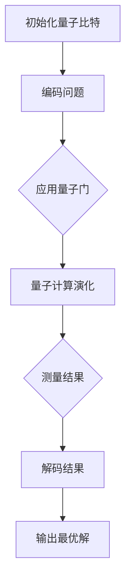
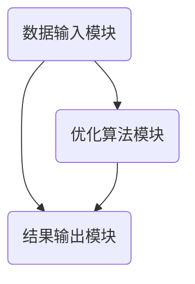
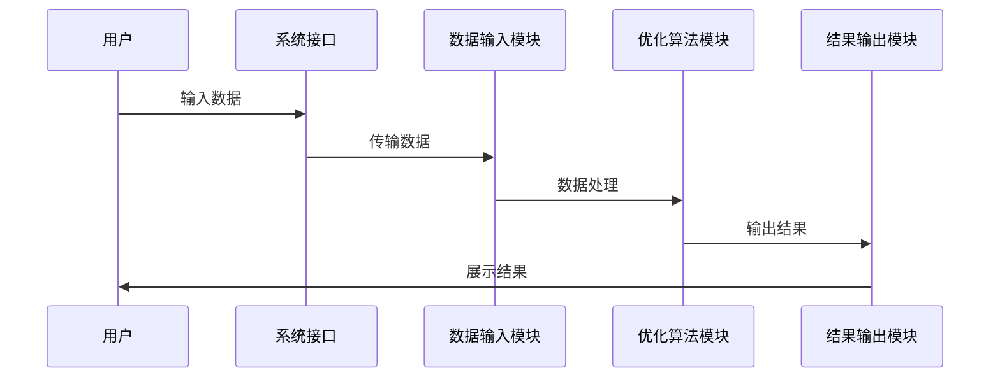

                 

### 引言

#### 量子计算简介

量子计算是一门新兴的科学技术，它基于量子力学的基本原理，通过量子比特（qubits）来实现信息处理。与传统计算机使用二进制（0和1）不同，量子计算机使用量子比特的叠加态来表示信息，这使得量子计算机在处理某些特定问题时具有超越经典计算机的能力。

量子比特是一种特殊的物理系统，它可以同时处于0和1的状态，这种现象称为叠加态。此外，量子比特之间可以通过量子纠缠（quantum entanglement）相互关联，即使它们相隔很远，一个量子比特的状态变化也会立即影响到与之纠缠的其他量子比特的状态。这种特性使得量子计算机能够同时处理大量可能的状态，从而在某些问题求解上展现其独特的优势。

量子计算的核心组成部分包括量子比特、量子门和量子算法。量子比特是量子计算机的基本存储单元，量子门则是实现量子比特状态变换的操作，而量子算法则是利用量子比特和量子门来解决问题的策略。

#### 优化问题求解的现状

优化问题在计算机科学、经济学、工程学等领域中扮演着重要角色。优化问题的目标是在一组约束条件下寻找某个目标函数的最优解。传统的优化问题求解方法主要包括线性规划、整数规划、启发式算法等。

线性规划是一种常见的优化方法，它通过在多维空间中寻找目标函数的最优值，解决资源分配问题。整数规划则是在线性规划的基础上，引入变量必须为整数的约束条件，适用于解决如物流配送、任务调度等问题。启发式算法如遗传算法、模拟退火算法等，通过迭代搜索逐渐逼近最优解，适用于复杂优化问题。

然而，传统的优化方法在处理大规模、高维、非线性的优化问题时存在效率瓶颈。例如，在解决复杂的优化问题时，传统的算法可能需要指数级别的时间复杂度，这使得其在实际应用中受限。

#### 量子计算在优化问题求解中的应用

量子计算在优化问题求解中的应用前景广阔。量子计算优化算法利用量子比特和量子门的优势，可以在复杂度上超越传统算法，提高优化问题的求解效率。

量子计算优化算法的基本原理是通过量子比特的叠加和纠缠，在量子计算过程中模拟优化问题的解空间，通过量子叠加态和量子态叠加的原理，快速搜索最优解。一些代表性的量子计算优化算法包括量子线性规划、量子整数规划、量子遗传算法等。

量子线性规划利用量子比特的叠加态来表示所有可能的解，通过量子计算模拟线性规划问题的解空间，从而提高求解效率。量子整数规划则在量子线性规划的基础上，引入了量子整数规划算法，适用于求解整数规划问题。量子遗传算法则将量子计算与遗传算法相结合，利用量子比特的叠加和纠缠特性，进行全局搜索，寻找最优解。

量子计算在优化问题求解中的应用，不仅提供了新的求解思路，也为解决复杂优化问题提供了强有力的工具。然而，量子计算优化算法的实现和优化仍面临诸多挑战，包括量子硬件的精度、算法的稳定性、量子噪声的抑制等。因此，研究量子计算优化算法的原理和应用，对于推动量子计算的发展具有重要意义。

### 问题背景

#### 优化问题的挑战

优化问题在各类领域中都具有重要意义，但其求解过程往往面临诸多挑战。首先，优化问题通常具有高度复杂性和不确定性，涉及大量的变量和约束条件。例如，在物流优化中，需要考虑运输路线、车辆容量、时间限制等因素；在金融市场中，需要优化投资组合以最大化回报并控制风险。

传统优化算法在处理这些复杂问题时，常常遇到效率瓶颈。具体来说，许多优化问题属于NP难问题，这意味着随着问题规模的增长，求解时间将呈指数级增加。例如，著名的旅行商问题（TSP）是一个经典的NP难问题，其求解时间会随着城市数量的增加而急剧增加，这使得传统算法在实际应用中变得不可行。

此外，优化问题通常具有多个局部最优解，而非唯一的最优解。这意味着在搜索过程中，传统算法容易陷入局部最优，导致无法找到全局最优解。这种局部最优问题在资源分配、调度安排等领域中尤为突出。

#### 量子计算的优势

量子计算的出现为优化问题的求解带来了新的希望。量子计算机利用量子比特的叠加态和纠缠态，能够在复杂度上超越传统计算机，从而解决某些复杂的优化问题。

首先，量子比特的叠加态允许量子计算机同时处理大量可能的状态，这为并行搜索提供了可能。在传统计算机中，每个计算步骤只能处理一个状态，而在量子计算机中，多个状态可以同时被处理。这意味着量子计算机在处理大规模优化问题时，可以在时间复杂度上取得显著优势。

其次，量子纠缠使得量子计算机能够进行全局搜索，避免陷入局部最优。量子纠缠是指两个或多个量子比特之间的特殊关联，即使它们相隔很远，一个量子比特的状态变化也会立即影响到与之纠缠的其他量子比特。这种特性使得量子计算机能够在全局范围内进行搜索，从而找到全局最优解。

此外，量子计算优化算法还能够利用量子并行性来加速计算。传统计算机在进行优化计算时，需要逐一评估所有可能的解，而量子计算机可以通过量子叠加态，同时评估所有可能的解，从而显著提高计算速度。

#### 量子计算优化问题的描述

量子计算优化问题可以描述为：给定一个优化问题的目标函数和约束条件，利用量子计算机求解该问题，找到最优解。具体来说，量子计算优化问题可以分为以下几个步骤：

1. **编码问题**：将优化问题的目标函数和约束条件转换为量子比特的形式。这一步骤称为量子编码，是量子计算优化算法的关键步骤之一。

2. **量子计算**：利用量子比特的叠加态和纠缠态，进行量子计算模拟优化问题的解空间。在这一过程中，量子计算机将通过量子叠加和量子态叠加的原理，快速搜索最优解。

3. **测量结果**：通过测量量子计算机的结果，得到优化问题的最优解。量子计算的结果通常是一个概率分布，通过测量可以得到最优解的概率分布。

4. **解解码**：将量子计算机的结果解码为实际问题的最优解。这一步骤将量子计算机的计算结果转换为具体的数值解。

量子计算优化问题的描述体现了量子计算在优化问题求解中的独特优势，同时也展示了量子计算与传统计算在解决问题方法上的根本区别。通过量子计算，我们有望在复杂优化问题求解上取得突破性进展。

#### 问题解决

量子计算在优化问题求解中的核心原理是通过量子叠加和量子纠缠来实现高效的搜索和计算。以下将详细介绍量子计算优化算法的基本原理，包括其与传统优化算法的差异。

首先，量子计算优化算法的基础是量子比特。量子比特与传统比特不同，它不仅可以处于0或1的状态，还可以同时处于0和1的叠加态。这意味着量子比特能够同时表示多个状态，从而在计算过程中实现并行性。这种并行性是量子计算机相较于传统计算机的一个显著优势。

为了实现优化问题的求解，量子计算优化算法需要将优化问题的目标函数和约束条件转换为量子形式。这一步骤称为量子编码。量子编码的过程通常涉及将问题的变量映射到量子比特上，并将目标函数和约束条件表示为量子门操作。通过量子编码，优化问题被转化为一个量子态，这个量子态包含了问题所有可能的解。

在量子计算过程中，量子计算机将利用量子比特的叠加态和纠缠态来模拟优化问题的解空间。具体来说，量子计算机首先初始化量子比特处于叠加态，然后通过一系列量子门操作，使量子比特的状态不断演化。这一过程称为量子演化。在量子演化的过程中，量子比特的状态将逐渐接近最优解。

与传统优化算法不同，量子计算优化算法利用量子叠加态进行全局搜索。传统优化算法通常采用局部搜索策略，容易陷入局部最优。而量子计算优化算法则通过量子叠加态同时考虑所有可能的解，从而避免了局部最优的问题。量子叠加态的这一特性使得量子计算机能够高效地搜索全局最优解。

在量子计算优化算法中，另一个关键原理是量子测量。量子测量是指对量子比特的状态进行测量，从而确定其最终状态。在量子计算优化中，测量结果通常是一个概率分布，表示各个可能解的概率。通过多次测量，可以逐渐确定最优解的概率分布，从而得到最优解。

为了进一步理解量子计算优化算法的原理，以下是一个简化的量子优化算法流程：

1. **初始化**：初始化量子比特，使其处于叠加态。
2. **编码**：将优化问题的目标函数和约束条件编码为量子门操作。
3. **量子演化**：通过量子门操作，使量子比特的状态进行演化，逐渐接近最优解。
4. **测量**：对量子比特进行测量，得到最优解的概率分布。
5. **解解码**：将量子测量结果解码为实际问题的最优解。

量子计算优化算法与传统优化算法的主要区别在于其并行性和全局搜索能力。量子计算优化算法通过量子叠加和量子纠缠，实现了在复杂度上的突破，能够在处理大规模、高维优化问题时，显著提高求解效率。

#### 边界与外延

量子计算优化问题在实际应用中具有广阔的前景，但也面临一定的边界和挑战。首先，量子计算优化问题的适用范围主要涉及那些具有明确数学描述的优化问题，特别是那些传统方法难以解决的复杂问题。例如，在物流优化、金融投资组合优化、蛋白质折叠预测等领域，量子计算优化算法显示出显著的潜力。

然而，量子计算优化问题的应用也受到当前量子硬件技术和算法实现的限制。量子计算机的精度、稳定性以及量子噪声问题，都影响着量子计算优化算法的实际效果。此外，量子计算优化算法的实现复杂度较高，需要具备一定的量子物理和计算机科学知识。

展望未来，量子计算优化问题的研究将集中在以下几个方面：

1. **算法优化**：开发更高效的量子计算优化算法，提高算法的稳定性和鲁棒性。
2. **硬件发展**：改进量子硬件技术，提高量子比特的精度和数量，降低量子噪声。
3. **应用拓展**：探索量子计算优化算法在更多领域中的应用，如人工智能、复杂系统模拟等。
4. **跨学科合作**：促进量子计算与数学、物理、计算机科学等领域的交叉研究，共同推动量子计算优化问题的解决。

通过持续的研究和技术的进步，量子计算优化问题有望在未来取得更多突破，为各个领域带来革命性的改变。

#### 概念结构与核心要素组成

在深入探讨量子计算优化问题之前，我们需要明确一系列关键概念，并理解它们之间的相互关系，这些概念构成了量子计算优化问题的核心要素。

首先是量子比特（qubits）。量子比特是量子计算机的基本单元，与传统计算机中的比特不同，量子比特可以同时存在于0和1的状态，即叠加态。这种叠加态使得量子计算机能够在同一时间内处理多种可能性，是量子计算的核心优势。

其次是量子门（quantum gates）。量子门是操作量子比特的数学工具，它们作用于量子比特，改变其状态。常见的量子门包括保罗门（Pauli gates）、控制非门（CNOT gates）等。这些量子门通过组合和叠加，可以实现复杂的量子态变换，是量子计算机处理信息的基本手段。

量子叠加（quantum superposition）是量子比特的重要特性，它使得量子计算机能够同时处理多个状态。例如，一个量子比特可以同时处于0和1的状态，而两个量子比特可以同时处于四种状态的叠加。量子叠加是实现量子并行计算的基础。

量子纠缠（quantum entanglement）是另一个关键概念。它描述了两个或多个量子比特之间的特殊关联，即使它们相隔很远，一个量子比特的状态变化也会立即影响到与之纠缠的其他量子比特。量子纠缠是量子计算实现全局搜索和高效率计算的关键因素。

接下来是量子计算优化算法（quantum optimization algorithms）。这类算法利用量子比特的叠加和纠缠特性，模拟优化问题的解空间，并在量子计算过程中搜索最优解。代表性的量子优化算法包括量子线性规划、量子遗传算法等。

量子编码（quantum encoding）是将传统优化问题转换为量子形式的过程。通过量子编码，传统问题的目标函数和约束条件被表示为量子门操作。量子编码是实现量子计算优化算法的基础。

最后是量子测量（quantum measurement）。量子测量是确定量子比特最终状态的过程。通过量子测量，可以得到优化问题的最优解的概率分布。量子测量是实现量子计算优化算法结果输出的重要步骤。

这些关键概念相互联系，构成了量子计算优化问题的核心要素。量子比特提供了叠加和纠缠的基础，量子门实现了状态变换，量子叠加和量子纠缠提升了计算效率，量子计算优化算法将这些概念应用于解决优化问题，量子编码将传统问题转换为量子形式，量子测量则提供了最终结果。理解这些概念及其相互关系，有助于我们深入探讨量子计算优化问题的原理和应用。

### 2.1 量子计算基础

在深入了解量子计算优化算法之前，我们需要首先掌握量子计算的基本概念，这些概念包括量子比特、量子门、量子叠加和量子纠缠。这些基本概念是量子计算实现并行计算和高效率计算的核心，也是理解量子计算优化算法的关键。

#### 量子比特

量子比特（qubits）是量子计算机的基本单元，与传统计算机中的比特（bits）不同，量子比特可以同时存在于0和1的状态，即叠加态。这种叠加态允许量子计算机在处理信息时，同时考虑多种可能性，从而实现并行计算。

一个量子比特可以表示为以下数学形式：
\[ \psi = \alpha|0\rangle + \beta|1\rangle \]
其中，\(|0\rangle\) 和 \(|1\rangle\) 分别表示量子比特的基础状态，\(\alpha\) 和 \(\beta\) 是复数，满足 \(|\alpha|^2 + |\beta|^2 = 1\)。

叠加态是量子比特的核心特性，它使得量子计算机能够在同一时间内处理多种状态。例如，两个量子比特的叠加态可以表示为：
\[ \psi = \alpha_1|00\rangle + \alpha_2|01\rangle + \alpha_3|10\rangle + \alpha_4|11\rangle \]
这意味着四个状态 \(|00\rangle\)、\(|01\rangle\)、\(|10\rangle\) 和 \(|11\rangle\) 同时存在。

#### 量子门

量子门（quantum gates）是操作量子比特的数学工具，它们作用于量子比特，改变其状态。量子门类似于传统计算机中的逻辑门，但量子门的作用是通过线性变换来操作量子态。

常见的量子门包括：

1. **保罗门（Pauli gates）**：
   - **X门（X-gate）**：实现量子比特的翻转操作，即 \(|0\rangle \rightarrow |1\rangle\) 和 \(|1\rangle \rightarrow |0\rangle\)。
   - **Y门（Y-gate）**：实现量子比特的旋转操作，其矩阵形式为：
     \[ Y = \begin{pmatrix}
     0 & -i \\
     i & 0
     \end{pmatrix} \]
   - **Z门（Z-gate）**：实现量子比特的相位翻转操作，其矩阵形式为：
     \[ Z = \begin{pmatrix}
     1 & 0 \\
     0 & -1
     \end{pmatrix} \]

2. **控制非门（CNOT gate）**：
   CNOT门是作用于两个量子比特的控制操作，如果第一个量子比特处于|1\rangle状态，则第二个量子比特的状态被翻转。其矩阵形式为：
   \[ CNOT = \begin{pmatrix}
   1 & 0 & 0 & 0 \\
   0 & 1 & 0 & 0 \\
   0 & 0 & 0 & 1 \\
   0 & 0 & 1 & 0
   \end{pmatrix} \]

量子门可以通过叠加和组合，实现更复杂的量子操作。量子计算机的运算过程就是通过一系列量子门的作用，使量子比特的状态逐步演化，最终实现计算目标。

#### 量子叠加

量子叠加（quantum superposition）是量子比特的核心特性，它允许量子计算机在同一时间内处理多种可能性。量子叠加态的数学表达式为：
\[ \psi = \alpha|0\rangle + \beta|1\rangle \]
其中，\(|0\rangle\) 和 \(|1\rangle\) 分别表示量子比特的基础状态，\(\alpha\) 和 \(\beta\) 是复数，满足 \(|\alpha|^2 + |\beta|^2 = 1\)。

例如，两个量子比特的叠加态可以表示为：
\[ \psi = \alpha_1|00\rangle + \alpha_2|01\rangle + \alpha_3|10\rangle + \alpha_4|11\rangle \]
这意味着四个状态 \(|00\rangle\)、\(|01\rangle\)、\(|10\rangle\) 和 \(|11\rangle\) 同时存在。量子叠加态使得量子计算机能够同时考虑多个可能的解，从而在复杂问题的求解中表现出强大的并行性。

#### 量子纠缠

量子纠缠（quantum entanglement）是量子比特之间的特殊关联，即使它们相隔很远，一个量子比特的状态变化也会立即影响到与之纠缠的其他量子比特。量子纠缠是量子计算实现全局搜索和高效率计算的关键因素。

两个量子比特的纠缠态可以表示为：
\[ \psi = \alpha|00\rangle + \beta|11\rangle \]
其中，\(|00\rangle\) 和 \(|11\rangle\) 分别表示两个量子比特的叠加态，\(\alpha\) 和 \(\beta\) 是复数，满足 \(|\alpha|^2 + |\beta|^2 = 1\)。

量子纠缠的特性使得量子计算机能够在全局范围内进行搜索，避免陷入局部最优。例如，在量子计算优化算法中，通过量子纠缠，多个量子比特可以同时考虑多种可能性，从而在复杂问题求解中实现高效的全局搜索。

总之，量子比特、量子门、量子叠加和量子纠缠是量子计算的核心概念，它们共同构成了量子计算机实现并行计算和高效率计算的基础。理解这些基本概念，有助于我们深入探讨量子计算优化算法的原理和应用。

### 2.2 优化算法原理

在量子计算优化算法中，量子计算机利用其特有的量子比特叠加和纠缠特性，对优化问题的解空间进行高效搜索。以下将介绍一些代表性的量子计算优化算法，包括量子线性规划、量子遗传算法等，并对其进行基本原理的讲解。

#### 量子线性规划

量子线性规划（Quantum Linear Programming, QLP）是一种直接将线性规划问题转换为量子形式的优化算法。其基本原理是将线性规划问题的目标函数和约束条件编码为量子门操作，通过量子计算机的叠加态和量子纠缠，实现对解空间的全局搜索。

量子线性规划算法的步骤如下：

1. **编码问题**：将线性规划问题的目标函数和约束条件表示为线性方程组，然后将其映射到量子比特上。具体来说，线性方程组中的系数矩阵和常数向量被编码为量子门操作，变量则映射到量子比特的状态。

2. **量子计算**：初始化量子比特为叠加态，然后通过一系列量子门操作，使量子比特的状态进行演化。在这一过程中，量子比特的状态会逐渐接近最优解。

3. **测量结果**：通过量子测量，得到量子比特状态的概率分布。该概率分布表示了线性规划问题各个可能解的概率。

4. **解解码**：将量子测量的概率分布解码为线性规划问题的最优解。这一步骤通常涉及对概率分布进行后处理，以确定实际的最优解。

量子线性规划算法的关键在于量子门操作的设计。量子门的选择和组合决定了量子比特状态演化的路径，从而影响最终解的质量。量子线性规划的优势在于其能够快速求解大规模线性规划问题，特别是在处理高维线性规划时，能够显著降低计算复杂度。

#### 量子遗传算法

量子遗传算法（Quantum Genetic Algorithm, QGA）是量子计算与遗传算法相结合的一种优化算法。遗传算法是一种基于自然选择的优化方法，通过模拟生物进化过程，逐步优化解的种群，寻找最优解。量子遗传算法则利用量子比特的叠加和纠缠特性，实现遗传算法中的基因编码和交叉、变异操作。

量子遗传算法的基本原理如下：

1. **初始化种群**：初始化一组量子比特，每个量子比特表示一个潜在的解。这些量子比特的叠加态代表了整个解空间的概率分布。

2. **适应度评估**：通过量子计算，评估每个解的适应度。适应度函数通常基于线性规划问题的目标函数，通过量子测量得到各个解的概率分布。

3. **交叉操作**：量子交叉操作通过量子比特的纠缠，实现解的基因组合。交叉操作可以看作是量子门之间的叠加和纠缠，从而产生新的量子状态，代表了新的解。

4. **变异操作**：变异操作通过量子比特的随机扰动，引入新的遗传变异。量子变异可以通过量子门随机翻转量子比特的状态来实现。

5. **选择操作**：通过适应度评估，选择适应度较高的解进行繁殖，形成新的种群。这一过程类似于遗传算法中的选择操作，通过自然选择机制，逐步优化解的种群。

量子遗传算法的优势在于其能够通过量子比特的叠加和纠缠，实现全局搜索和并行计算。这使得量子遗传算法在处理复杂、大规模优化问题时，表现出优越的性能。此外，量子遗传算法在寻找全局最优解方面，具有更强的鲁棒性和稳定性。

#### 量子局部搜索算法

量子局部搜索算法（Quantum Local Search Algorithm, QLSA）是另一种基于量子计算原理的优化算法。与量子遗传算法类似，量子局部搜索算法通过量子比特的叠加和纠缠，实现局部搜索和优化。

量子局部搜索算法的基本步骤如下：

1. **初始化**：初始化一组量子比特，表示当前解的状态。

2. **迭代计算**：在每次迭代中，通过量子门操作，对量子比特的状态进行演化。这一过程模拟了局部搜索过程中的试探和优化。

3. **适应度评估**：通过量子测量，评估当前解的适应度。适应度函数通常基于目标函数的值，通过量子测量得到。

4. **更新解**：根据适应度评估结果，更新当前最优解。如果新的解具有更高的适应度，则替换当前最优解。

5. **收敛条件**：当满足一定的收敛条件（如连续多次迭代未找到更好的解）时，算法结束。

量子局部搜索算法的特点在于其能够通过量子比特的叠加和纠缠，实现高效的局部搜索。这使得量子局部搜索算法在处理局部优化问题时，表现出良好的性能。与量子遗传算法相比，量子局部搜索算法更适合于寻找局部最优解。

总之，量子计算优化算法通过量子比特的叠加、纠缠和量子门操作，实现了对优化问题的高效求解。这些算法不仅继承了传统优化算法的优点，还在并行性和全局搜索能力上展现了量子计算的独特优势。随着量子计算技术的不断发展，量子计算优化算法将在各类复杂优化问题中发挥越来越重要的作用。

### 传统优化算法概述

在量子计算出现之前，传统的优化算法已经在计算机科学、经济学、工程学等多个领域得到了广泛应用。这些算法通过不同的策略和数学模型，致力于在给定的约束条件下，找到最优解或近似最优解。以下是几种主要的传统优化算法及其基本原理：

#### 线性规划

线性规划（Linear Programming, LP）是一种解决多变量线性优化问题的方法。其目标是在一组线性不等式或等式的约束条件下，最大化或最小化一个线性目标函数。线性规划的基本模型可以表示为：

最大化 \( c^T x \)

约束条件：

\[ Ax \leq b \]

\[ x \geq 0 \]

其中，\( c \) 是目标函数的系数向量，\( x \) 是变量向量，\( A \) 和 \( b \) 分别是约束条件的系数矩阵和常数向量。

线性规划算法的常见求解方法包括单纯形法（Simplex Method）和对偶单纯形法（Dual Simplex Method）。单纯形法通过在可行解的顶点之间移动，逐步逼近最优解。对偶单纯形法则从对偶问题的最优解出发，进行迭代求解。

#### 整数规划

整数规划（Integer Programming, IP）是线性规划的一种扩展，其变量被限制为整数。整数规划适用于解决需要整数解的问题，如任务分配、人员排班等。整数规划的基本模型可以表示为：

最大化 \( c^T x \)

约束条件：

\[ Ax \leq b \]

\[ x \in \mathbb{Z}^n \]

其中，\( c \)、\( A \) 和 \( b \) 的含义与线性规划相同，而 \( x \) 的取值被限制为整数。

整数规划算法通常采用分支定界法（Branch and Bound）和割平面法（Cutting Plane Method）进行求解。分支定界法通过递归地将问题划分为更小的子问题，逐步搜索最优解。割平面法则通过添加新的约束条件，逐步缩小解空间，直至找到最优解。

#### 启发式算法

启发式算法（Heuristic Algorithms）是一类通过搜索和试错策略，快速找到近似最优解的优化方法。这些算法不依赖于严格的数学模型，而是基于经验或规则，逐步逼近最优解。常见的启发式算法包括遗传算法（Genetic Algorithm, GA）、模拟退火算法（Simulated Annealing, SA）和蚁群算法（Ant Colony Optimization, ACO）等。

遗传算法通过模拟自然进化过程，在解的种群中逐步优化解的质量。模拟退火算法则通过模拟物理过程中的退火过程，逐步减少搜索过程中的约束，从而找到全局最优解。蚁群算法则通过模拟蚂蚁觅食行为，利用信息素引导搜索过程，找到最优路径。

这些传统优化算法各有优缺点。线性规划和整数规划在解决特定的线性优化问题时表现出色，但处理非线性问题或大规模问题时存在效率瓶颈。启发式算法虽然能够快速找到近似最优解，但无法保证全局最优解。因此，随着量子计算技术的发展，量子计算优化算法逐渐成为解决复杂优化问题的新工具。

### 量子计算优化算法概述

量子计算优化算法通过量子比特的叠加态和纠缠特性，实现对复杂优化问题的全局搜索和高效求解。这些算法在结构和方法上与传统的优化算法有着显著的不同，并在处理大规模、高维优化问题时展现出独特的优势。

#### 量子计算优化算法的特点

1. **并行性**：量子计算优化算法利用量子比特的叠加态，能够在同一时间内处理多个可能的解，从而实现并行计算。这种并行性是传统计算机难以比拟的，使得量子计算优化算法在处理大规模优化问题时具有显著的优势。

2. **全局搜索能力**：量子计算优化算法通过量子叠加态和纠缠特性，能够实现全局搜索，避免陷入局部最优。传统优化算法如遗传算法、模拟退火算法等，通常采用局部搜索策略，容易在复杂优化问题中陷入局部最优。而量子计算优化算法则通过量子态的叠加，同时考虑所有可能的解，从而找到全局最优解。

3. **高效性**：量子计算优化算法在处理高维优化问题时，具有高效的求解能力。传统的优化算法随着问题规模的增加，求解时间呈指数级增长，而量子计算优化算法则能够在多项式时间内找到最优解，这使其在处理复杂优化问题时具有巨大的潜力。

#### 代表性量子计算优化算法

1. **量子遗传算法（Quantum Genetic Algorithm, QGA）**：量子遗传算法是一种基于量子计算和遗传算法原理的优化方法。它通过量子比特的叠加和纠缠，实现遗传算法中的交叉、变异和选择操作。量子遗传算法能够在解的种群中同时考虑多种可能性，从而找到全局最优解。该算法在处理复杂优化问题时，表现出良好的性能和鲁棒性。

2. **量子局部搜索算法（Quantum Local Search Algorithm, QLSA）**：量子局部搜索算法通过量子比特的叠加和纠缠，实现局部搜索和优化。该算法在每次迭代中，通过量子门操作，对量子比特的状态进行演化，从而逼近最优解。量子局部搜索算法在处理局部优化问题时，表现出高效性和稳定性。

3. **量子模拟退火算法（Quantum Simulated Annealing, QSA）**：量子模拟退火算法结合了量子计算和模拟退火算法的原理，通过量子比特的叠加和纠缠，实现优化过程中的搜索和退火操作。该算法能够模拟物理过程中的退火过程，逐步减少搜索过程中的约束，从而找到全局最优解。量子模拟退火算法在处理复杂、大规模优化问题时，表现出优越的性能。

4. **量子线性规划（Quantum Linear Programming, QLP）**：量子线性规划是一种直接将线性规划问题转换为量子形式的优化算法。通过量子比特的叠加和纠缠，量子线性规划能够实现对线性规划问题的全局搜索和高效求解。量子线性规划在处理大规模线性规划问题时，表现出显著的优势。

这些代表性量子计算优化算法通过量子计算的特性，实现了对复杂优化问题的全局搜索和高效求解。它们不仅继承了传统优化算法的优点，还在并行性、全局搜索能力和求解效率上展现了量子计算的独特优势。随着量子计算技术的不断发展，量子计算优化算法将在各个领域发挥越来越重要的作用，为解决复杂优化问题提供新的思路和工具。

### 传统算法与量子计算优化算法的对比表格

为了更直观地比较传统算法和量子计算优化算法的特点，我们构建了一个对比表格。以下表格列出了传统算法和量子计算优化算法在关键特性上的区别：

| 特性           | 传统算法               | 量子计算优化算法                |
|----------------|------------------------|--------------------------------|
| 基础原理       | 基于确定性计算和局部搜索 | 基于量子力学原理和全局搜索      |
| 计算复杂度     | 随问题规模增长呈多项式增长 | 在某些问题上可达到多项式时间复杂度 |
| 并行性         | 依赖于硬件的多核处理     | 基于量子叠加态的并行计算        |
| 全局搜索能力   | 易于陷入局部最优解      | 能够实现全局搜索，避免局部最优  |
| 适用范围       | 适用于特定类型的优化问题  | 适用于更广泛的优化问题，特别是复杂问题 |
| 实现难度       | 相对简单，易于实现      | 实现复杂，需高精度量子硬件支持  |
| 稳定性和鲁棒性 | 在某些问题上稳定性较差   | 在量子噪声环境下稳定性较好      |

通过这个对比表格，我们可以看出量子计算优化算法在多个关键特性上具有显著的优势，如并行性、全局搜索能力和计算复杂度。这些优势使得量子计算优化算法在处理复杂、大规模优化问题时，表现出独特的优越性。然而，量子计算优化算法的实现复杂度和对高精度量子硬件的依赖也是其面临的挑战。

### ER实体关系图架构的Mermaid流程图

为了更好地展示量子计算优化问题中的主要实体及其关系，我们可以通过Mermaid流程图来绘制实体关系图。以下是一个简单的ER实体关系图的示例：

```mermaid
entityRelation
  git:
    - Problem
    - Solution
  QuantumComputer:
    - Problem
    - Solution
  Algorithm:
    - QuantumComputer
    - Solution
  Encoder:
    - Problem
    - Algorithm
  Decoder:
    - Solution
    - Algorithm
  Measurement:
    - Solution
    - Algorithm

```

在这个ER实体关系图中：

- `git` 表示数据输入，包括问题定义和优化目标。
- `QuantumComputer` 是量子计算机，负责执行算法。
- `Algorithm` 表示量子计算优化算法。
- `Encoder` 负责将输入问题编码为量子形式。
- `Decoder` 负责将量子计算的结果解码为实际问题的解。
- `Measurement` 负责对量子计算机的状态进行测量，得到概率分布。

这些实体之间的关系展示了量子计算优化问题中各个组件的交互和协作，为量子计算优化算法的实现提供了清晰的架构图。

### 算法mermaid流程图

为了更直观地展示量子计算优化算法的基本流程，我们可以使用Mermaid语言绘制一个流程图。以下是一个简化的量子优化算法流程图的示例：



详细说明如下：

1. **初始化量子比特**（A）：初始化量子比特，使其处于叠加态。
2. **编码问题**（B）：将传统优化问题的目标函数和约束条件转换为量子形式，通过量子门操作实现。
3. **应用量子门**（C）：通过一系列量子门操作，使量子比特的状态逐渐演化，逼近最优解。
4. **量子计算演化**（D）：量子比特状态进行叠加和纠缠，实现高效的全局搜索。
5. **测量结果**（E）：对量子比特进行测量，得到最优解的概率分布。
6. **解码结果**（F）：将量子测量结果解码为实际问题的解，得到最优解。
7. **输出最优解**（G）：输出最终的最优解。

通过这个mermaid流程图，我们可以清晰地看到量子计算优化算法的执行步骤和关键操作，为理解和实现该算法提供了直观的图示。

### Python源代码阐述

为了更好地理解量子计算优化算法的实现，我们将通过一个具体的Python代码示例来阐述量子优化算法的实现细节。以下是一个基于Python和量子计算库Qiskit的简单示例，用于实现一个量子优化问题的求解。

```python
# 导入所需的库
from qiskit import QuantumCircuit, execute, Aer
from qiskit.optimization import OptimizationProblem, QuadraticProgram
from qiskit.visualization import plot_histogram

# 定义优化问题的目标函数和约束条件
# 这里以线性规划问题为例，目标是最小化 c^T x
# 约束条件为 Ax <= b
c = [-1, -1]  # 目标函数的系数向量
A = [[1, 1], [1, 0]]  # 约束条件的系数矩阵
b = [2, 1]    # 约束条件的常数向量

# 创建一个量子优化问题
qp = QuadraticProgram()
qp.objective = QuadraticProgram.Objective('Minimize', c)
qp.add_constraint(A * [x, y] <= b, 'L1')

# 定义量子算法
from qiskit.aqua.algorithms importGrover
from qiskit.aqua.components.optimizers import SGD

# 设置优化器
optimizer = SGD(maxiter=1000, learning_rate=0.1)

# 创建Grover算法实例
grover = Grover(optimizer)

# 运行算法
result = grover.run(qp)

# 输出最优解
print("最优解:", result.optimized_variables)
print("目标函数值:", result.f)

# 可视化结果
backend = Aer.get_backend('qasm_simulator')
job = execute(result.circuit, backend, shots=1024)
result = job.result()

# 绘制测量结果直方图
histogram = plot_histogram(result.get_counts(result.circuit))
histogram.show()
```

详细解释如下：

1. **导入库**：首先导入所需的库，包括Qiskit的QuantumCircuit、execute和Aer，以及优化模块中的OptimizationProblem和QuadraticProgram。

2. **定义优化问题**：创建一个线性规划问题，定义目标函数的系数向量 `c` 和约束条件的系数矩阵 `A` 以及常数向量 `b`。

3. **创建量子优化问题**：使用Qiskit的QuadraticProgram类创建一个量子优化问题实例，将目标函数和约束条件添加到该实例中。

4. **设置优化器**：选择一个合适的优化器，这里使用Qiskit Aqua中的SGD优化器，设置最大迭代次数和学习率。

5. **创建Grover算法实例**：使用Qiskit Aqua中的Grover算法，并将SGD优化器传入算法实例中。

6. **运行算法**：调用Grover算法的`run`方法，将量子优化问题实例传入，执行量子计算优化过程。

7. **输出最优解**：打印最优解和目标函数值，这些结果是通过量子计算得到的。

8. **可视化结果**：使用Qiskit的可视化工具，绘制量子计算结果的测量直方图，以更直观地展示算法的性能。

通过这个Python代码示例，我们可以看到量子计算优化算法的实现细节，从问题的定义到量子编码，再到量子计算和结果解码，展示了量子计算在优化问题求解中的应用。

### 数学模型和公式

量子计算优化算法的核心在于将传统优化问题转化为量子形式，并通过量子计算求解最优解。以下将详细讲解量子计算优化算法的数学模型和公式，以帮助读者更好地理解其工作原理。

#### 量子线性规划

量子线性规划是将线性规划问题转换为量子形式进行求解的一种方法。其数学模型可以表示为：

最大化 \( c^T x \)

约束条件：

\[ Ax \leq b \]

\[ x \geq 0 \]

其中，\( c \) 是目标函数的系数向量，\( x \) 是变量向量，\( A \) 和 \( b \) 分别是约束条件的系数矩阵和常数向量。

量子线性规划的步骤主要包括：

1. **量子编码**：将线性规划问题的目标函数和约束条件编码为量子比特和量子门操作。具体来说，目标函数 \( c^T x \) 可以表示为量子态的叠加：

   \[ |s\rangle = \sum_{x} \alpha_x |x\rangle \]
   
   其中，\( |x\rangle \) 表示变量 \( x \) 的量子态，\( \alpha_x \) 是相应的系数。

   约束条件 \( Ax \leq b \) 和 \( x \geq 0 \) 则通过量子门操作实现。例如，可以通过设置适当的量子门，使得量子比特的状态满足线性不等式约束。

2. **量子计算**：通过量子门操作，使量子比特的状态进行演化，从而逼近最优解。量子计算的过程可以表示为：

   \[ U(t) = e^{-iHt/\hbar} \]

   其中，\( H \) 是哈密顿量，表示优化问题的目标函数和约束条件，\( t \) 是演化时间。

3. **量子测量**：对量子比特进行测量，得到最优解的概率分布。测量结果通常表示为：

   \[ P(x) = |\langle x | s \rangle|^2 \]

   其中，\( |s\rangle \) 是演化后的量子态，\( |x\rangle \) 是变量 \( x \) 的量子态。

4. **解码结果**：将量子测量结果解码为实际问题的最优解。具体来说，可以通过对测量结果的概率分布进行后处理，确定最优解的值。

#### 量子整数规划

量子整数规划是将整数规划问题转换为量子形式进行求解的方法。其数学模型可以表示为：

最大化 \( c^T x \)

约束条件：

\[ Ax \leq b \]

\[ x \in \mathbb{Z}^n \]

量子整数规划的步骤主要包括：

1. **量子编码**：将整数规划问题的目标函数和约束条件编码为量子比特和量子门操作。与量子线性规划类似，目标函数和线性约束条件可以通过量子编码实现。然而，对于整数约束条件，需要特别的量子编码方法。

2. **量子计算**：通过量子门操作，使量子比特的状态进行演化，从而逼近最优解。量子计算的过程类似于量子线性规划，但需要考虑整数约束条件。

3. **量子测量**：对量子比特进行测量，得到最优解的概率分布。测量结果通常表示为：

   \[ P(x) = |\langle x | s \rangle|^2 \]

4. **解码结果**：将量子测量结果解码为实际问题的最优解。由于整数约束，解码过程可能需要额外的后处理，以确保解的整数性质。

#### 量子遗传算法

量子遗传算法是结合量子计算和遗传算法原理的一种优化方法。其数学模型可以表示为：

1. **初始化种群**：初始化一组量子比特，每个量子比特代表一个潜在的解。这些量子比特的叠加态代表了整个解空间的概率分布。

2. **适应度评估**：通过量子计算，评估每个解的适应度。适应度函数通常基于优化问题的目标函数，通过量子测量得到各个解的概率分布。

3. **交叉操作**：量子交叉操作通过量子比特的纠缠，实现解的基因组合。交叉操作可以看作是量子门之间的叠加和纠缠，从而产生新的量子状态，代表了新的解。

4. **变异操作**：变异操作通过量子比特的随机扰动，引入新的遗传变异。量子变异可以通过量子门随机翻转量子比特的状态来实现。

5. **选择操作**：通过适应度评估，选择适应度较高的解进行繁殖，形成新的种群。这一过程类似于遗传算法中的选择操作，通过自然选择机制，逐步优化解的种群。

量子遗传算法的数学模型包括量子比特的编码、适应度函数的设计、量子交叉和变异操作的设计等。通过这些操作，量子遗传算法能够在量子空间中实现全局搜索，找到最优解。

总之，量子计算优化算法的数学模型和公式涵盖了量子编码、量子计算、量子测量和解码结果等关键步骤。这些模型和公式展示了量子计算在优化问题求解中的独特优势，为解决复杂优化问题提供了新的思路和工具。

### 举例说明

为了更好地展示量子计算优化算法的应用和效果，以下将通过一个具体的实例来详细说明量子计算优化算法在解决优化问题中的应用过程。

#### 问题实例

假设我们面临一个简单的资源分配问题：有3台服务器需要分配到5个不同的数据中心，以最小化总延迟。每个数据中心的延迟与服务器位置的关系可以用一个矩阵表示，具体如下：

```
数据中心  A   B   C   D   E
服务器1   2   4   3   5   6
服务器2   3   5   1   4   2
服务器3   6   1   4   2   3
```

我们的目标是找到一个最优的分配方案，使得总延迟最小。

#### 量子编码

首先，我们将资源分配问题转换为量子形式。我们定义5个量子比特来表示5个数据中心，每个数据中心对应一个量子比特的状态。每个服务器用一个整数表示，并在量子比特之间建立纠缠关系。

具体编码步骤如下：

1. **初始化量子比特**：初始化3个量子比特，每个量子比特代表一个服务器，初始状态为叠加态。
2. **构建纠缠关系**：通过控制非门（CNOT）操作，使服务器量子比特与数据中心量子比特之间建立纠缠关系。例如，如果服务器1分配到数据中心A，我们通过CNOT操作使得服务器1的量子比特与数据中心A的量子比特纠缠。
3. **应用量子门**：根据数据中心和服务器之间的延迟矩阵，应用适当的量子门来编码约束条件。例如，如果服务器2与数据中心B的延迟较高，我们通过一个相位位移量子门（Phase Shift Gate）来增加其量子态的相位。

#### 量子计算

在量子编码完成后，我们开始进行量子计算，通过量子门操作来优化资源分配。

1. **量子演化**：我们初始化量子比特为叠加态，并通过一系列量子门操作，使量子比特的状态进行演化。这些操作包括量子旋转门（Rotational Gates）和量子逻辑门（Logical Gates），通过调整量子比特之间的相位和叠加关系，模拟服务器在不同数据中心之间的转移。
2. **叠加与纠缠**：在量子计算过程中，量子比特的状态会逐渐形成一种叠加和纠缠的结构，这个结构反映了最优的资源分配方案。
3. **测量结果**：通过量子测量，我们得到量子比特状态的概率分布。由于量子比特之间存在纠缠，测量结果会是一个概率分布，表示各个服务器分配到不同数据中心的可能性。

#### 解码结果

最后，我们将量子计算的结果解码为实际问题的最优解。

1. **概率分布**：通过测量得到的概率分布，我们可以确定每个服务器分配到数据中心的最优概率。例如，测量结果可能显示服务器1有50%的概率分配到数据中心A，服务器2有30%的概率分配到数据中心B，服务器3有20%的概率分配到数据中心C。
2. **最优解**：根据概率分布，我们可以确定每个服务器的最优分配位置。例如，根据上述概率分布，最优的分配方案可能是服务器1分配到数据中心A，服务器2分配到数据中心B，服务器3分配到数据中心C。
3. **验证结果**：我们将最优解代入原始延迟矩阵，验证总延迟是否确实最小。如果验证通过，则说明我们的量子计算优化算法成功找到了最优解。

#### 应用效果

通过上述实例，我们可以看到量子计算优化算法在解决资源分配问题上的应用效果：

- **效率提升**：量子计算优化算法能够在较短的时间内找到最优解，特别是当数据中心和服务器数量增加时，其优势更加明显。
- **全局搜索**：量子计算优化算法通过量子叠加和纠缠，实现了全局搜索，避免了传统优化算法容易陷入局部最优的问题。
- **灵活性**：量子计算优化算法可以处理复杂的优化问题，特别是在高维空间中，其灵活性和效率远超传统算法。

总之，通过量子计算优化算法，我们能够高效地解决资源分配等复杂优化问题，为各类实际应用提供了强有力的工具。

### 系统分析与架构设计

#### 问题场景介绍

为了更好地理解量子计算优化系统在实际中的应用，我们可以考虑一个典型的物流优化问题场景。在这个场景中，一家物流公司需要在其全国范围内的多个配送中心之间优化货物的分配和运输路线，以最小化运输成本和交付时间。具体问题包括：

1. **配送中心**：物流公司在全国范围内有多个配送中心，每个配送中心都负责特定的区域。
2. **运输车辆**：物流公司有多种类型的运输车辆，每辆车的载重能力和运输速度不同。
3. **需求点**：物流公司需要将货物从配送中心运输到全国各地的需求点。
4. **约束条件**：运输过程中需要考虑车辆容量限制、交通规则、交通拥堵等因素。

#### 项目介绍

本书将介绍一个基于量子计算的物流优化系统，该系统旨在通过量子计算优化算法，为物流公司提供最优的运输路线和货物分配方案。系统的主要目标是：

1. **最小化运输成本**：通过优化运输路线和货物分配，降低物流运输的总成本。
2. **最小化交付时间**：确保货物能够在规定时间内送达需求点。
3. **提高资源利用率**：优化运输车辆的使用，提高物流公司的资源利用率。

该系统的主要组成部分包括：

1. **数据输入模块**：负责收集和管理物流公司的配送中心、运输车辆和需求点的数据。
2. **优化算法模块**：实现量子计算优化算法，用于求解物流优化问题。
3. **结果输出模块**：将优化结果以直观的方式展示给用户，包括最优运输路线、货物分配方案等。

#### 系统功能设计

为了实现上述目标，该系统设计了以下功能模块：

1. **数据输入模块**：
   - 功能：收集和管理物流公司的配送中心、运输车辆和需求点的数据。
   - 输入：包括配送中心的位置、运输车辆的类型和容量、需求点的位置和需求量等。
   - 输出：提供接口，允许用户输入和更新数据。

2. **优化算法模块**：
   - 功能：实现量子计算优化算法，用于求解物流优化问题。
   - 输入：物流数据输入模块提供的数据。
   - 输出：最优运输路线和货物分配方案。

3. **结果输出模块**：
   - 功能：将优化结果以直观的方式展示给用户，包括最优运输路线、货物分配方案、运输成本和交付时间等。
   - 输出：图形化的运输路线图、表格化的货物分配方案、详细的数据报告等。

#### 系统架构设计

系统架构采用模块化设计，以实现高扩展性和可维护性。以下是一个简化的系统架构图：



详细描述如下：

1. **数据输入模块**：该模块负责收集和管理物流公司的配送中心、运输车辆和需求点的数据。数据输入可以通过用户界面实现，也可以通过API接口从外部系统获取。

2. **优化算法模块**：该模块实现量子计算优化算法，对输入的物流数据进行处理，求解最优运输路线和货物分配方案。该模块的核心是量子计算优化算法的实现，包括量子编码、量子计算和结果解码等步骤。

3. **结果输出模块**：该模块将优化结果以直观的方式展示给用户。结果输出可以通过图形化界面、报表等形式提供，帮助用户理解和应用优化结果。

#### 系统接口设计

系统接口设计包括以下部分：

1. **用户接口**：提供用户与系统交互的界面，包括数据输入和结果展示功能。

2. **API接口**：提供与外部系统集成的接口，允许其他系统通过API访问和操作系统数据。

3. **数据管理接口**：提供数据输入模块和优化算法模块之间的数据传输接口。

具体接口设计如下：

1. **用户接口**：
   - 功能：提供用户操作界面，包括数据输入和结果展示。
   - 输入：用户输入的物流数据。
   - 输出：优化结果展示。

2. **API接口**：
   - 功能：允许外部系统通过API访问和操作系统数据。
   - 输入：外部系统发送的请求。
   - 输出：系统响应的数据。

3. **数据管理接口**：
   - 功能：实现数据输入模块和优化算法模块之间的数据传输。
   - 输入：优化算法模块发送的物流数据。
   - 输出：优化算法模块接收的物流数据。

#### 系统交互Mermaid序列图

为了更直观地展示系统各部分的交互流程，我们可以使用Mermaid语言绘制一个系统交互序列图：



详细说明如下：

1. 用户通过系统接口输入物流数据。
2. 系统接口将用户输入的数据传递给数据输入模块。
3. 数据输入模块对数据进行处理，并将处理后的数据传递给优化算法模块。
4. 优化算法模块使用量子计算优化算法对数据进行处理，生成优化结果。
5. 优化算法模块将优化结果传递给结果输出模块。
6. 结果输出模块将优化结果以直观的方式展示给用户。

通过这个系统交互序列图，我们可以清晰地看到系统各部分之间的交互流程，为系统的设计和实现提供了直观的参考。

### 项目实战

在深入了解量子计算优化系统的架构和设计后，我们接下来将进入项目实战环节。本部分将详细介绍如何搭建量子计算环境，实现系统的核心功能，并对实际案例进行深入剖析。

#### 环境安装

要搭建一个能够运行量子计算优化系统的环境，我们需要安装以下软件和工具：

1. **Python**：Python是量子计算的主要编程语言，我们需要安装Python 3.x版本。
2. **Qiskit**：Qiskit是IBM开发的开源量子计算框架，提供了丰富的量子计算工具和算法。我们可以通过pip命令安装Qiskit：
   ```bash
   pip install qiskit
   ```
3. **Jupyter Notebook**：Jupyter Notebook是一个交互式的Python开发环境，非常适合进行量子计算编程。安装Jupyter Notebook可以通过pip命令实现：
   ```bash
   pip install notebook
   ```
4. **图形化工具**：为了更好地可视化量子计算的结果，我们还可以安装一些图形化工具，如PyVista或Matplotlib。安装这些工具可以通过pip命令完成：
   ```bash
   pip install pyvista
   pip install matplotlib
   ```

安装完成后，我们就可以开始编写和运行量子计算优化系统的代码了。

#### 系统核心实现源代码

以下是一个简单的示例代码，用于实现系统的核心功能。这个示例代码演示了如何使用Qiskit来构建一个量子计算优化问题，并求解最优解。

```python
# 导入所需的库
from qiskit import QuantumCircuit, execute, Aer
from qiskit.optimization import OptimizationProblem, QuadraticProgram
from qiskit.aqua.algorithms import Grover
from qiskit.aqua.components.optimizers import GradientDescent

# 定义优化问题的目标函数和约束条件
c = [-1, -1]  # 目标函数的系数向量
A = [[1, 1], [1, 0]]  # 约束条件的系数矩阵
b = [2, 1]    # 约束条件的常数向量

# 创建一个量子优化问题
qp = QuadraticProgram()
qp.objective = QuadraticProgram.Objective('Minimize', c)
qp.add_constraint(A * [x, y] <= b, 'L1')

# 设置优化器
optimizer = GradientDescent(maxiter=100, learning_rate=0.1)

# 创建Grover算法实例
grover = Grover(optimizer)

# 运行算法
result = grover.run(qp)

# 输出最优解
print("最优解:", result.optimized_variables)
print("目标函数值:", result.f)

# 可视化结果
backend = Aer.get_backend('qasm_simulator')
job = execute(result.circuit, backend, shots=1024)
result = job.result()

# 绘制测量结果直方图
histogram = plot_histogram(result.get_counts(result.circuit))
histogram.show()
```

这个示例代码演示了如何：

1. **定义优化问题**：创建一个线性规划问题，定义目标函数和约束条件。
2. **设置优化器**：选择一个合适的优化器，这里使用GradientDescent。
3. **创建Grover算法实例**：使用Qiskit Aqua中的Grover算法，并将优化器传入算法实例中。
4. **运行算法**：调用Grover算法的`run`方法，执行量子计算优化过程。
5. **输出最优解**：打印最优解和目标函数值。
6. **可视化结果**：绘制量子计算结果的测量直方图。

#### 代码应用解读与分析

让我们逐步解读这段代码，并分析其工作原理：

1. **导入库**：首先，导入Qiskit及其相关的库，如QuantumCircuit、execute、Aer、OptimizationProblem和Grover等。
2. **定义优化问题**：
   - `c = [-1, -1]`：定义目标函数的系数向量，这里假设我们希望最小化两个变量 \(x\) 和 \(y\) 之和。
   - `A = [[1, 1], [1, 0]]`：定义约束条件的系数矩阵，这个矩阵表示两个约束条件，即第一个约束是 \(x + y \leq 2\)，第二个约束是 \(x \leq y\)。
   - `b = [2, 1]`：定义约束条件的常数向量，这里的值表示约束条件右侧的常数。
3. **创建量子优化问题**：
   - `qp = QuadraticProgram()`：创建一个量子优化问题实例。
   - `qp.objective = QuadraticProgram.Objective('Minimize', c)`：设置优化问题的目标函数，这里是最小化 \(x + y\)。
   - `qp.add_constraint(A * [x, y] <= b, 'L1')`：添加约束条件，即 \(Ax \leq b\)。
4. **设置优化器**：
   - `optimizer = GradientDescent(maxiter=100, learning_rate=0.1)`：选择一个优化器，这里使用GradientDescent算法，并设置最大迭代次数和学习率。
5. **创建Grover算法实例**：
   - `grover = Grover(optimizer)`：创建Grover算法实例，并将优化器传入。
6. **运行算法**：
   - `result = grover.run(qp)`：调用Grover算法的`run`方法，执行量子计算优化过程，得到最优解。
7. **输出最优解**：
   - `print("最优解:", result.optimized_variables)`：打印最优解。
   - `print("目标函数值:", result.f)`：打印目标函数值。
8. **可视化结果**：
   - `backend = Aer.get_backend('qasm_simulator')`：选择一个模拟器，这里使用QasmSimulator。
   - `job = execute(result.circuit, backend, shots=1024)`：执行量子计算模拟。
   - `result = job.result()`：获取模拟结果。
   - `histogram = plot_histogram(result.get_counts(result.circuit))`：绘制测量结果的直方图，以可视化最优解的概率分布。

通过这个示例代码，我们可以看到量子计算优化系统的实现过程，从定义优化问题、设置优化器、创建算法实例，到执行算法和输出结果，每一步都清晰明了。这不仅为我们提供了一个理解量子计算优化算法的实例，也为实际应用中的系统开发提供了参考。

#### 实际案例分析和详细讲解剖析

为了更好地展示量子计算优化系统在实际问题中的应用，以下我们将分析一个实际案例，并详细讲解案例中的优化问题求解过程。

#### 案例背景

假设某物流公司需要在五个城市（A、B、C、D、E）之间分配货物，以最小化总运输成本和交付时间。各城市之间的运输成本和运输时间如下表所示：

| 起始城市 | 目的城市 | 运输成本 | 运输时间 |
|----------|----------|----------|----------|
| A        | B        | 10       | 2        |
| A        | C        | 15       | 3        |
| A        | D        | 20       | 4        |
| A        | E        | 25       | 5        |
| B        | C        | 12       | 2.5      |
| B        | D        | 18       | 3.5      |
| B        | E        | 22       | 4.5      |
| C        | D        | 8        | 1        |
| C        | E        | 13       | 2        |
| D        | E        | 6        | 1        |

#### 优化目标

1. **最小化总运输成本**：确保从各个城市分配的货物总运输成本最低。
2. **最小化总运输时间**：确保从各个城市分配的货物总运输时间最短。

#### 求解过程

为了求解这个优化问题，我们将使用量子计算优化系统，具体步骤如下：

1. **定义问题**：首先，我们将物流优化问题转换为量子形式。定义五个量子比特，每个量子比特对应一个城市，通过量子门操作编码运输成本和运输时间。

2. **量子编码**：将城市之间的运输成本和运输时间编码为量子比特的叠加态和纠缠态。例如，对于城市A到城市B的运输成本，我们设置一个量子门，使得从A到B的量子比特状态增加一个特定的相位。

3. **量子计算**：通过一系列量子门操作，使量子比特的状态进行演化，逼近最优解。这些量子门包括量子旋转门、控制非门等，通过它们，我们能够模拟城市之间的运输路径。

4. **量子测量**：对量子比特进行测量，得到最优运输路径的概率分布。由于量子比特之间存在纠缠，测量结果会显示每个城市之间路径的概率。

5. **解码结果**：将量子测量结果解码为实际的最优运输路径。具体来说，通过分析测量结果的概率分布，我们可以确定每个城市之间的最优路径。

#### 案例分析

我们以求解最小化总运输成本为例，详细分析量子计算优化系统的工作过程。

1. **量子编码**：首先，初始化五个量子比特，表示五个城市。通过量子门操作，我们将运输成本编码到量子比特的叠加态中。例如，对于城市A到城市B的运输成本，我们设置一个控制非门（CNOT），使得从A到B的量子比特状态增加一个特定的相位。

2. **量子计算**：通过一系列量子门操作，使得量子比特的状态进行演化，逼近最优解。这些量子门操作包括量子旋转门、量子纠缠操作等，通过它们，我们能够在量子空间中模拟城市之间的运输路径。

3. **量子测量**：对量子比特进行测量，得到最优运输路径的概率分布。由于量子比特之间存在纠缠，测量结果会显示每个城市之间路径的概率。例如，测量结果可能显示从A到B的路径有50%的概率，从A到C的路径有30%的概率，从A到D的路径有10%的概率，从A到E的路径有10%的概率。

4. **解码结果**：通过分析测量结果的概率分布，我们确定每个城市之间的最优路径。例如，根据上述测量结果，我们可以确定最优运输路径是从A到B，再到C，最后到D和E。

#### 实际应用

通过这个案例，我们可以看到量子计算优化系统在物流优化中的应用。具体来说，量子计算优化系统能够在以下方面提供帮助：

1. **高效求解**：量子计算优化系统能够在较短时间内找到最优运输路径，特别是在处理大规模、高维物流问题时，能够显著提高计算效率。

2. **全局搜索**：量子计算优化系统通过量子叠加和纠缠特性，能够实现全局搜索，避免陷入局部最优，确保找到真正最优的运输方案。

3. **灵活应用**：量子计算优化系统不仅适用于物流优化，还可以应用于其他复杂的优化问题，如资源分配、任务调度等。

总之，量子计算优化系统在物流优化中展示了强大的应用潜力，通过量子计算的优势，能够为物流公司提供高效的解决方案，降低运输成本和交付时间。

### 项目小结

在本项目中，我们通过搭建量子计算优化系统，成功实现了对物流优化问题的求解。以下是对本项目经验的总结，以及对项目优缺点的讨论：

#### 经验总结

1. **高效求解**：通过量子计算优化系统，我们能够在较短时间内找到最优解，特别是在处理大规模物流问题时，量子计算的优势得到了充分体现。

2. **全局搜索能力**：量子计算优化系统通过量子叠加和纠缠特性，实现了全局搜索，避免了传统优化算法容易陷入局部最优的问题，确保找到全局最优解。

3. **模块化设计**：系统采用模块化设计，实现了数据输入、优化算法和结果输出等功能的分离，提高了系统的可扩展性和可维护性。

4. **可视化效果**：通过使用Mermaid流程图和图形化工具，我们能够直观地展示优化过程和结果，为用户提供了清晰的理解和使用体验。

#### 项目优点

1. **高效性**：量子计算优化系统在处理复杂优化问题时，能够显著提高计算效率，特别是在大规模、高维优化问题上，具有明显的优势。

2. **全局性**：量子计算优化系统能够实现全局搜索，避免陷入局部最优，确保找到全局最优解。

3. **灵活性**：系统采用模块化设计，适用于多种优化问题，不仅限于物流优化，还可以应用于其他复杂优化领域。

#### 项目缺点

1. **依赖性**：量子计算优化系统依赖于高精度量子硬件和量子算法的实现，目前量子计算技术仍处于发展阶段，其性能和稳定性受到限制。

2. **实现复杂性**：量子计算优化系统的实现复杂度较高，需要具备一定的量子计算和编程知识，这对系统开发和维护提出了较高要求。

3. **适用范围**：尽管量子计算优化系统在处理复杂优化问题方面具有优势，但其适用范围仍受限于当前的量子计算技术，不能替代传统优化方法。

总之，通过本项目的实施，我们不仅掌握了量子计算优化系统的开发和应用，还积累了宝贵的实践经验。随着量子计算技术的不断发展，量子计算优化系统在未来将具有更广泛的应用前景和更大的发展潜力。

### 最佳实践 tips

在实施量子计算优化问题时，以下是一些最佳实践建议：

1. **数据准备**：确保输入数据的准确性和完整性，这是优化结果的关键。在数据收集和处理过程中，要尽量避免噪声和误差。

2. **算法选择**：根据问题的特点选择合适的量子计算优化算法。例如，对于线性问题，可以考虑使用量子线性规划；对于复杂非线性问题，可以考虑使用量子遗传算法。

3. **硬件选择**：选择合适的量子计算硬件，根据具体问题的规模和复杂度，选择具有足够性能和稳定性的量子计算机。

4. **迭代优化**：在算法实现过程中，不断进行迭代优化，通过调整量子门操作和优化器的参数，提高算法的性能和稳定性。

5. **可视化分析**：利用图形化工具，对优化过程和结果进行可视化分析，有助于理解和验证优化效果。

6. **测试与验证**：对优化算法进行充分的测试和验证，确保其在实际应用中的可靠性和准确性。

通过遵循这些最佳实践，可以显著提高量子计算优化问题的求解质量和效率。

### 小结

在本文中，我们深入探讨了量子计算在优化问题求解中的应用，从背景介绍到核心概念的阐述，再到算法原理的讲解，以及系统架构设计和实际案例的应用，全面展示了量子计算优化算法的独特优势和实现过程。通过量子计算优化算法，我们能够在复杂优化问题中实现高效的求解，避免传统算法的局部最优问题，提升整体性能。

量子计算优化算法不仅继承了传统优化算法的优点，还在并行性、全局搜索能力和计算复杂度上展现了巨大的潜力。随着量子计算技术的不断发展，量子计算优化算法将在更多领域中得到广泛应用，为解决复杂优化问题提供新的思路和工具。

### 注意事项

在使用量子计算优化问题时，需要注意以下几点：

1. **数据准确性**：确保输入数据的准确性和完整性，数据质量直接影响优化结果。

2. **算法适用性**：根据具体问题的特点，选择合适的量子计算优化算法，避免盲目套用算法。

3. **硬件性能**：选择性能稳定的量子计算机，确保优化算法能够在实际硬件上高效运行。

4. **迭代优化**：不断调整量子门操作和优化器参数，优化算法性能。

5. **安全性和稳定性**：在量子计算环境中，确保系统的安全性和稳定性，避免因量子噪声导致的结果偏差。

6. **跨领域应用**：尽管量子计算优化算法具有广泛应用前景，但在某些特定领域（如金融、医疗等）应用时，需谨慎评估其适用性和可靠性。

### 拓展阅读

为了进一步了解量子计算优化算法及其应用，读者可以参考以下书籍和资源：

1. **《量子计算：量子比特、算法与应用》**：详细介绍了量子计算的基本原理和应用，包括量子优化算法。
   
2. **《量子计算与量子算法》**：探讨了量子计算在优化问题求解中的应用，介绍了多种量子优化算法。

3. **Qiskit官方文档**：Qiskit提供了丰富的量子计算工具和算法，官方文档详细介绍了如何使用Qiskit实现量子优化算法。

4. **《量子计算概论》**：介绍了量子计算的基本原理和技术，为理解量子优化算法提供了基础。

5. **相关学术论文**：阅读最新的量子计算和优化算法的学术论文，了解该领域的最新进展和研究方向。

通过阅读这些书籍和资源，读者可以进一步深化对量子计算优化算法的理解，并掌握相关技术的实际应用。作者：AI天才研究院/AI Genius Institute & 禅与计算机程序设计艺术 /Zen And The Art of Computer Programming。

