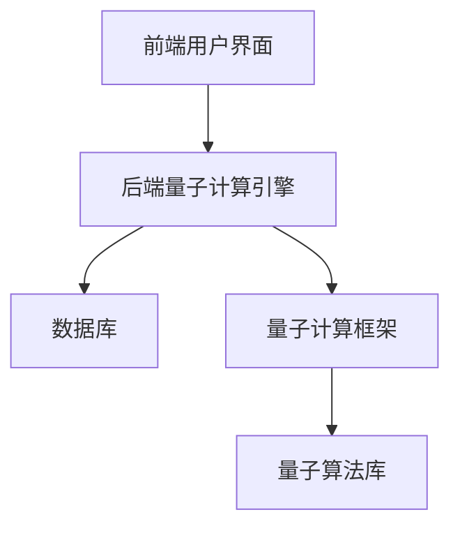
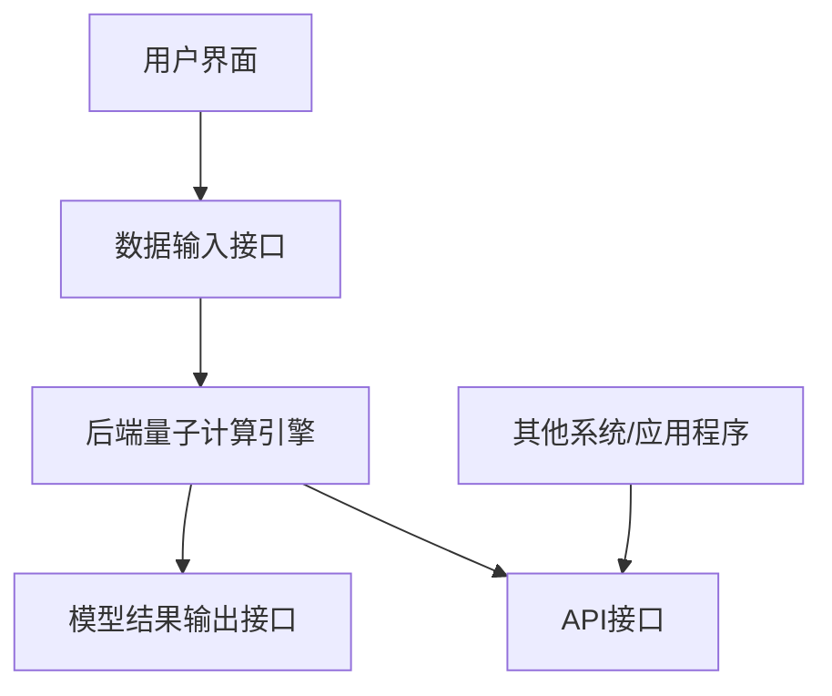
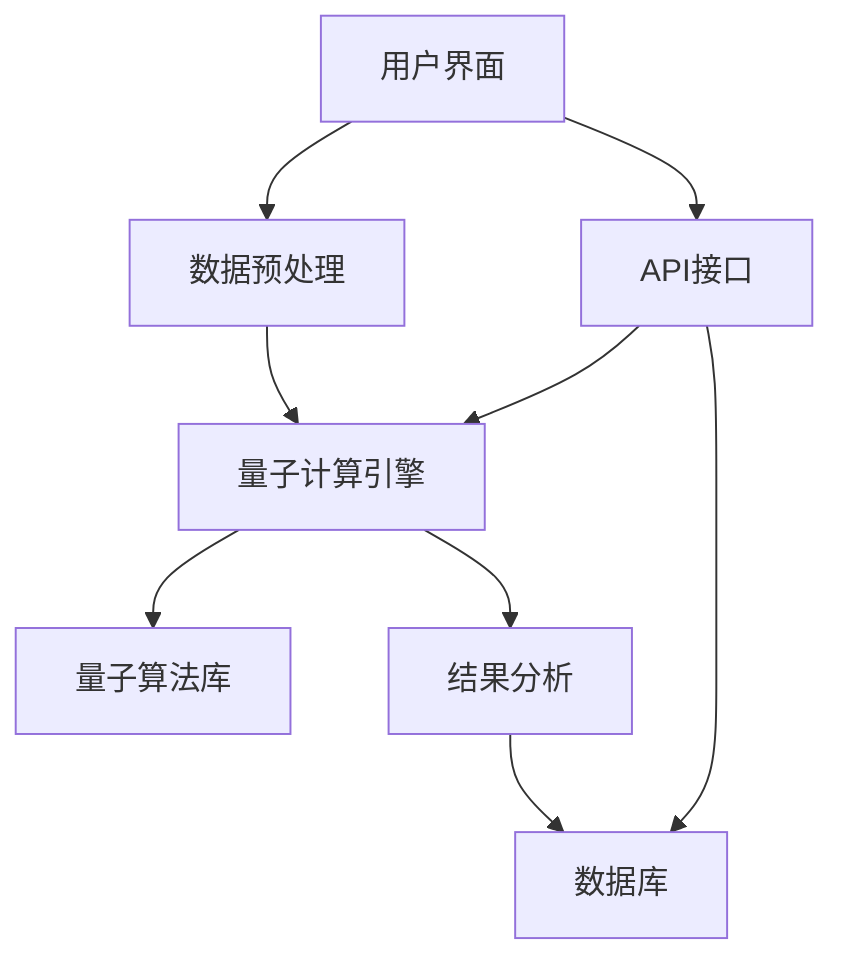
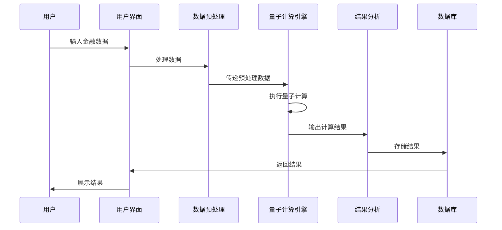

                 


### 1.1 量子计算的基本原理

量子计算是现代物理学与计算机科学交叉领域的一个前沿研究方向。其基本原理源于量子力学，即量子比特（qubit）和量子门（quantum gate）。

#### 量子比特

量子比特是量子计算的基本单元，与传统计算机中的比特（bit）不同。一个量子比特可以同时处于0和1的状态，这种叠加态使得量子计算机在处理某些问题时具有巨大的并行性。根据量子力学的原理，一个量子比特的状态可以表示为：

$$
|\psi\rangle = a|0\rangle + b|1\rangle
$$

其中，$a$ 和 $b$ 是复数，且满足 $|a|^2 + |b|^2 = 1$。这种叠加态是量子计算的核心特性之一。

#### 量子门

量子门是量子计算中的基本操作单元，类似于传统计算机中的逻辑门。量子门作用于量子比特，改变其状态。最基本的量子门包括保罗门（Pauli gate）、控-NOT门（CNOT gate）等。

例如，保罗门是量子计算中最基本的门之一，它作用在一个量子比特上，将这个量子比特的状态翻转。其数学描述为：

$$
\Pauli_X |x\rangle = x\cdot |x\rangle
$$

其中，$|x\rangle$ 是量子比特的初始状态，$x$ 是一个实数。

#### 量子叠加与纠缠

量子比特的叠加态和量子纠缠是量子计算的两个关键特性。量子叠加态允许量子计算机同时处理多个状态，而量子纠缠则使得量子比特之间的状态相互依赖，可以用来实现远距离的量子通信和量子计算。

例如，两个量子比特的纠缠态可以表示为：

$$
|\psi\rangle = \frac{1}{\sqrt{2}} (|00\rangle + |11\rangle)
$$

这种纠缠态使得两个量子比特的状态无法单独描述，必须同时考虑。

通过理解量子比特、量子门、量子叠加和量子纠缠，我们可以更好地理解量子计算的基本原理。这些原理将为我们后续探讨量子计算在金融建模中的应用提供坚实的理论基础。

### 1.2 量子力学基础

量子力学是量子计算的理论基础，其核心概念和原理为我们理解量子计算提供了必要的物理背景。以下是量子力学的一些基础概念：

#### 波函数

波函数是量子力学中描述粒子状态的数学函数，通常用 $\psi$ 表示。波函数提供了粒子在空间中概率分布的信息，并且可以通过平方模 $|\psi|^2$ 得到粒子在某一位置出现的概率。

例如，一个简单的波函数可以是：

$$
\psi(x) = A \sin(x)
$$

其中，$A$ 是归一化常数，确保波函数的平方模在空间上积分等于1。

#### 算符

在量子力学中，物理量（如位置、动量、能量等）通过算符（operator）来描述。算符作用在波函数上，可以得到粒子的状态及其物理量的值。常见的算符包括位置算符 $\hat{x}$、动量算符 $\hat{p}$ 和能量算符 $\hat{H}$。

例如，位置算符作用在一个波函数上，可以得到粒子的位置：

$$
\hat{x} \psi(x) = x \psi(x)
$$

#### 算符的对易关系

量子力学中的另一个关键概念是算符的对易关系。两个算符的对易关系描述了它们同时测量时的测量结果的关联。对易关系通常用符号 $[\hat{A}, \hat{B}]$ 表示，定义为：

$$
[\hat{A}, \hat{B}] = \hat{A} \hat{B} - \hat{B} \hat{A}
$$

例如，位置算符和动量算符的对易关系是：

$$
[\hat{x}, \hat{p}] = i\hbar
$$

其中，$\hbar$ 是约化普朗克常数。

#### 海森堡不确定性原理

海森堡不确定性原理是量子力学中的一个基本原理，描述了粒子的某些物理量（如位置和动量）不能同时被精确测量。其数学表述为：

$$
\Delta x \Delta p \geq \frac{\hbar}{2}
$$

其中，$\Delta x$ 和 $\Delta p$ 分别是位置和动量的不确定度。

这些量子力学的基本概念和原理构成了量子计算的理论基础。通过理解波函数、算符、对易关系和不确定性原理，我们可以更好地理解量子比特的行为和量子计算的工作机制。这些概念将为我们后续探讨量子计算在金融建模中的应用提供重要的物理背景。

### 1.3 量子算法概述

量子算法是利用量子计算的特殊性质来解决问题的算法集合，它们相较于传统算法在某些特定问题上有显著的性能优势。以下是几种重要的量子算法及其在金融建模中的应用：

#### Shor算法

Shor算法是一种著名的量子算法，主要用于整数分解问题。其核心思想是利用量子叠加和纠缠特性，将大整数的分解问题转化为对大整数的质因数分解问题。具体来说，Shor算法可以通过量子计算机在多项式时间内完成质因数分解，这为加密算法的安全性带来了巨大挑战。

在金融建模中，Shor算法可以用于破解某些加密算法，从而提高金融市场数据的安全性。例如，量子计算机可以通过Shor算法破解用于加密金融交易记录的RSA加密算法，进而泄露交易信息。

#### Grover算法

Grover算法是一种用于优化搜索问题的量子算法。与传统搜索算法不同，Grover算法利用量子叠加和纠缠特性，能够在多项式时间内完成搜索操作，大大提高了搜索效率。

在金融建模中，Grover算法可以用于快速找到市场中的最优交易策略。例如，在股票市场中，Grover算法可以用于在大量历史数据中快速找到最优的交易信号，从而提高交易的成功率。

#### 变分量子特征分解（VQE）算法

变分量子特征分解（VQE）算法是一种用于求解复杂优化问题的量子算法。它利用量子计算的优势，通过变分量子电路来逼近优化问题的解。VQE算法已被广泛应用于量子机器学习和量子金融建模中。

在金融建模中，VQE算法可以用于求解复杂的金融优化问题，如投资组合优化和风险管理。例如，VQE算法可以用于优化投资组合的权重分配，以最大化收益或最小化风险。

通过理解这些量子算法的基本原理和特性，我们可以看到量子计算在金融建模中的巨大潜力。这些算法不仅为解决复杂的金融问题提供了新的工具，而且也为金融市场的发展带来了新的机遇和挑战。

### 2.1 基础量子算法在金融分析中的应用

在金融分析中，基础量子算法如Shor算法和Grover算法因其高效性而备受关注。这些算法利用量子叠加和纠缠的特性，在处理某些金融问题时展现出了巨大的潜力。

#### Shor算法在金融市场中的应用

Shor算法是一种能够高效分解大整数的量子算法。在金融市场分析中，Shor算法的一个重要应用是破解加密算法，以获取市场中的敏感信息。例如，RSA加密算法在金融交易中被广泛使用，其安全性依赖于大整数的质因数分解难度。然而，Shor算法能够在多项式时间内完成这一任务，从而威胁到金融交易的安全。

具体来说，Shor算法可以通过以下步骤应用于金融分析：

1. **加密数据预处理**：首先，将金融交易记录加密，使用RSA算法生成大整数。
2. **量子分解任务**：将加密的大整数输入Shor算法，利用量子计算机进行质因数分解。
3. **解密交易记录**：一旦质因数分解完成，可以使用这些因数来破解加密数据，获取原始的交易记录。

#### 实例分析

假设一个金融交易记录使用RSA算法加密，加密数据为一个大整数N=1234567891011121314151617。Shor算法可以通过以下步骤分解这个大整数：

1. **量子预处理**：首先，量子计算机需要将这个大整数编码为量子态。
2. **迭代执行量子算法**：通过多次迭代，Shor算法最终找到N的质因数，例如N=73*169。

通过这个实例，我们可以看到Shor算法在金融分析中的强大能力。然而，需要注意的是，Shor算法的应用也带来了新的安全挑战，需要金融机构采取相应的措施来保护数据安全。

#### Grover算法在金融市场中的应用

Grover算法是一种用于优化搜索问题的量子算法。在金融市场中，Grover算法可以用于快速找到最优交易策略。传统搜索算法在处理大量历史数据时效率较低，而Grover算法能够显著提高搜索效率。

Grover算法在金融市场中的应用步骤如下：

1. **构建搜索问题**：首先，定义一个搜索空间，例如历史交易数据中的最优交易信号。
2. **初始化量子态**：使用Grover算法初始化量子态，使得量子态在搜索空间中均匀分布。
3. **迭代搜索过程**：通过多次迭代，Grover算法逐步缩小搜索空间，提高找到最优交易策略的概率。
4. **输出搜索结果**：一旦找到最优交易策略，输出该策略并应用于实际交易。

#### 实例分析

假设我们需要在历史交易数据中找到最优的交易信号，可以使用Grover算法进行以下操作：

1. **初始化量子态**：首先，将交易数据编码为量子态，并初始化量子态。
2. **迭代搜索**：通过迭代过程，Grover算法逐步缩小搜索空间，找到最优交易信号。
3. **输出结果**：最终，Grover算法输出最优交易信号，例如“在某个特定时间段内买入股票A”。

通过这个实例，我们可以看到Grover算法在金融交易策略搜索中的优势。它能够快速找到最优交易策略，从而提高交易的成功率。

总之，基础量子算法如Shor算法和Grover算法在金融分析中具有广泛的应用前景。通过具体实例的分析，我们可以看到这些算法在处理复杂金融问题时的强大能力。然而，量子计算的应用也需要考虑安全性问题，以确保金融市场的稳健运行。

### 2.2 量子算法在投资组合优化中的应用

投资组合优化是金融领域中的一个关键问题，旨在通过合理分配资产权重，实现收益的最大化或风险的最小化。传统投资组合优化方法如马科维茨模型（Markowitz Model）和均值-方差优化（Mean-Variance Optimization）主要依赖于高效的计算能力和优化算法。随着量子计算的崛起，量子算法开始在这一领域展现出巨大的潜力。

#### 量子算法在投资组合优化中的基本原理

量子算法在投资组合优化中的应用主要基于以下几个基本原理：

1. **量子并行性**：量子计算具有并行性，可以同时处理多个投资组合的权重分配问题，大大提高了计算效率。
2. **量子随机行走**：量子随机行走（Quantum Random Walk）是一种量子算法，可以高效地在复杂的投资组合空间中搜索最优解。
3. **量子特征分解**：量子特征分解（Quantum Feature Decomposition）可以将复杂的投资组合优化问题转化为更简单的量子问题，从而提高求解效率。

#### 变分量子特征分解算法（VQE）

变分量子特征分解（VQE）算法是量子算法在投资组合优化中的一种重要应用。VQE算法通过构建变分量子电路来逼近投资组合优化问题的解。以下是VQE算法的基本步骤：

1. **初始化变分量子电路**：首先，初始化一个变分量子电路，用于描述投资组合权重分配。
2. **参数优化**：通过优化变分量子电路的参数，使量子态能够接近最优解。
3. **测量与反馈**：测量量子态并获取关于最优解的信息，然后根据测量结果调整变分量子电路的参数。
4. **迭代过程**：重复参数优化和测量过程，直到满足停止条件。

#### VQE算法在投资组合优化中的实例分析

为了说明VQE算法在投资组合优化中的应用，我们考虑一个简单的投资组合优化问题：给定一个包含N种资产的组合，每种资产的投资比例未知，需要找到最优的投资比例，使得投资组合的预期收益率最大。

具体步骤如下：

1. **构建变分量子电路**：首先，构建一个N比特的变分量子电路，用于描述N种资产的投资比例。
2. **初始化参数**：初始化变分量子电路的参数，表示为一组复数。
3. **参数优化**：利用VQE算法优化变分量子电路的参数，使得量子态接近最优投资比例。
4. **测量与反馈**：测量量子态，获取关于最优投资比例的信息，并反馈给参数优化过程。
5. **迭代过程**：重复参数优化和测量过程，直到收敛到最优解。

通过这个实例，我们可以看到VQE算法在投资组合优化中的强大能力。它能够高效地找到最优投资比例，从而提高投资组合的收益率。

总之，量子算法在投资组合优化中的应用为金融领域带来了新的机遇。通过VQE算法等量子算法，我们可以更加高效地解决复杂的投资组合优化问题，从而实现更高的收益和更低的风险。

### 2.3 量子算法在金融风险评估中的应用

在金融风险管理中，准确地评估市场风险是至关重要的。量子算法因其并行性和高效性，为金融风险评估提供了新的工具和途径。以下将介绍几种量子算法在金融风险评估中的应用，并通过具体实例进行详细分析。

#### 量子随机行走（Quantum Random Walk）

量子随机行走是一种基于量子叠加和纠缠的量子算法，可以高效地在复杂的状态空间中搜索最优解。在金融风险评估中，量子随机行走可用于优化风险模型，提高风险评估的准确性。

具体步骤如下：

1. **构建初始量子态**：首先，将金融市场中的各种风险因素编码为量子态。
2. **执行量子随机行走**：利用量子随机行 walking 过程，在风险空间中搜索最优的风险控制策略。
3. **测量与评估**：测量量子态，获取关于最优风险控制策略的信息，并根据测量结果评估风险模型的准确性。

#### 实例分析

假设我们需要评估一个包含多种金融产品的投资组合的市场风险。我们可以使用量子随机行走算法进行以下操作：

1. **编码风险因素**：首先，将各种风险因素（如利率、汇率、股票价格波动等）编码为量子态。
2. **执行量子随机行走**：通过量子随机行走算法，在风险空间中搜索最优的风险控制策略。
3. **测量与评估**：测量量子态，获取关于最优风险控制策略的信息，并根据测量结果评估风险模型的准确性。

通过这个实例，我们可以看到量子随机行走算法在金融风险评估中的应用。它能够高效地找到最优的风险控制策略，从而提高风险评估的准确性。

#### 变分量子特征分解（VQE）算法

变分量子特征分解（VQE）算法是量子算法在金融风险评估中的一种重要应用。VQE算法通过构建变分量子电路来逼近风险模型的解，可以高效地解决复杂的金融风险评估问题。

具体步骤如下：

1. **初始化变分量子电路**：首先，初始化一个变分量子电路，用于描述风险模型。
2. **参数优化**：通过优化变分量子电路的参数，使量子态能够接近最优的风险评估结果。
3. **测量与反馈**：测量量子态并获取关于最优风险评估结果的信息，然后根据测量结果调整变分量子电路的参数。
4. **迭代过程**：重复参数优化和测量过程，直到收敛到最优解。

#### 实例分析

假设我们需要评估一个包含多种金融产品的投资组合的市场风险。我们可以使用VQE算法进行以下操作：

1. **初始化变分量子电路**：首先，初始化一个变分量子电路，用于描述投资组合的风险。
2. **参数优化**：通过VQE算法优化变分量子电路的参数，使量子态能够接近最优的风险评估结果。
3. **测量与反馈**：测量量子态，获取关于最优风险评估结果的信息，并根据测量结果调整变分量子电路的参数。
4. **迭代过程**：重复参数优化和测量过程，直到收敛到最优解。

通过这个实例，我们可以看到VQE算法在金融风险评估中的应用。它能够高效地找到最优的风险评估结果，从而提高风险评估的准确性。

总之，量子算法在金融风险评估中的应用为金融风险管理带来了新的机遇。通过量子随机行走和VQE算法等量子算法，我们可以更加高效地解决复杂的金融风险评估问题，从而提高风险评估的准确性。这些量子算法在金融领域的应用前景广阔，值得进一步研究和探索。

### 2.4 均值-方差优化模型的量子化

均值-方差优化模型是金融投资组合管理中广泛应用的一种模型，旨在通过最小化投资组合的方差来控制风险，同时最大化投资组合的预期收益率。传统的均值-方差优化模型主要依赖于高效的计算能力和优化算法。随着量子计算的发展，我们可以将均值-方差优化模型量子化，利用量子算法来提高优化效率。

#### 均值-方差优化模型的基本原理

均值-方差优化模型的核心思想是在风险和收益之间进行权衡。具体来说，它通过以下步骤实现优化：

1. **定义资产收益率**：假设有N种资产，每种资产的预期收益率和方差已知，定义资产收益率为$r_i$，方差为$\sigma_i^2$。
2. **构建目标函数**：定义目标函数为投资组合的期望收益率和方差的组合，通常表示为$\mathbf{w}^T \mathbf{\mu} - \frac{1}{2} \mathbf{w}^T \mathbf{\Sigma} \mathbf{w}$，其中$\mathbf{w}$为资产权重向量，$\mathbf{\mu}$为预期收益率向量，$\mathbf{\Sigma}$为方差-协方差矩阵。
3. **优化目标函数**：通过优化目标函数，找到最优的资产权重分配，以实现收益的最大化和风险的最小化。

#### 量子化均值-方差优化模型

将均值-方差优化模型量子化，即利用量子计算的优势来优化目标函数。以下是量子化均值-方差优化模型的基本步骤：

1. **构建量子态**：将资产权重编码为量子态，使用量子比特表示资产权重。
2. **定义量子门**：设计量子门来操作量子态，实现资产权重向量的优化。
3. **执行量子算法**：使用量子算法（如变分量子特征分解VQE）来优化量子态，从而找到最优的资产权重分配。

#### VQE算法在量子化均值-方差优化中的应用

变分量子特征分解（VQE）算法是量子化均值-方差优化模型的一种有效方法。VQE算法通过构建变分量子电路来逼近优化问题的解，其基本步骤如下：

1. **初始化变分量子电路**：构建一个变分量子电路，用于描述资产权重优化问题。
2. **参数优化**：通过优化变分量子电路的参数，使量子态能够接近最优的资产权重分配。
3. **测量与反馈**：测量量子态，获取关于最优资产权重分配的信息，并根据测量结果调整变分量子电路的参数。
4. **迭代过程**：重复参数优化和测量过程，直到收敛到最优解。

#### 实例分析

假设我们需要优化一个包含3种资产的均值-方差优化问题。以下是使用VQE算法量子化该问题的具体步骤：

1. **初始化变分量子电路**：构建一个3比特的变分量子电路，用于描述资产权重优化问题。
2. **参数优化**：使用VQE算法优化变分量子电路的参数，使量子态能够接近最优的资产权重分配。
3. **测量与反馈**：测量量子态，获取关于最优资产权重分配的信息，并根据测量结果调整变分量子电路的参数。
4. **迭代过程**：重复参数优化和测量过程，直到收敛到最优解。

通过这个实例，我们可以看到量子化均值-方差优化模型在金融投资组合管理中的应用。VQE算法能够高效地找到最优的资产权重分配，从而实现收益的最大化和风险的最小化。

总之，量子计算为均值-方差优化模型提供了新的优化方法，通过量子化均值-方差优化模型，我们可以利用量子算法的优势来提高优化效率。这种量子化方法在金融投资组合管理中具有广泛的应用前景。

### 2.5 量子计算在风险平价策略中的应用

风险平价策略（Risk Parity Strategy）是一种现代投资组合管理策略，旨在通过均匀分配风险来控制投资组合的整体波动性。与传统的均值-方差优化模型相比，风险平价策略更加关注资产之间的风险贡献，而不是仅仅关注预期收益率。量子计算在这一策略中的应用，有望进一步提升其风险管理和投资组合优化的效率。

#### 风险平价策略的基本原理

风险平价策略的核心思想是将投资组合中的资金分配到不同的资产上，使得每种资产的风险贡献相等。具体来说，这一策略通过以下步骤实现：

1. **计算资产风险**：首先，计算每种资产的风险，通常使用资产的历史波动率作为风险的度量。
2. **目标函数定义**：定义一个目标函数，该函数表示资产风险贡献的均等性，通常表示为$\sum_{i=1}^N w_i^2$，其中$w_i$是资产$i$的权重。
3. **优化目标函数**：通过优化目标函数，找到一组资产权重，使得每种资产的风险贡献相等。

#### 量子化风险平价策略

将风险平价策略量子化，即利用量子计算的优势来优化资产权重分配。以下是量子化风险平价策略的基本步骤：

1. **构建量子态**：将资产权重编码为量子态，使用量子比特表示资产权重。
2. **定义量子门**：设计量子门来操作量子态，实现资产权重向量的优化。
3. **执行量子算法**：使用量子算法（如变分量子特征分解VQE）来优化量子态，从而找到最优的资产权重分配。

#### VQE算法在量子化风险平价策略中的应用

变分量子特征分解（VQE）算法是量子化风险平价策略的一种有效方法。VQE算法通过构建变分量子电路来逼近优化问题的解，其基本步骤如下：

1. **初始化变分量子电路**：构建一个变分量子电路，用于描述风险平价优化问题。
2. **参数优化**：通过优化变分量子电路的参数，使量子态能够接近最优的资产权重分配。
3. **测量与反馈**：测量量子态，获取关于最优资产权重分配的信息，并根据测量结果调整变分量子电路的参数。
4. **迭代过程**：重复参数优化和测量过程，直到收敛到最优解。

#### 实例分析

假设我们需要优化一个包含5种资产的风险平价策略。以下是使用VQE算法量子化该问题的具体步骤：

1. **初始化变分量子电路**：构建一个5比特的变分量子电路，用于描述风险平价优化问题。
2. **参数优化**：使用VQE算法优化变分量子电路的参数，使量子态能够接近最优的资产权重分配。
3. **测量与反馈**：测量量子态，获取关于最优资产权重分配的信息，并根据测量结果调整变分量子电路的参数。
4. **迭代过程**：重复参数优化和测量过程，直到收敛到最优解。

通过这个实例，我们可以看到量子计算在风险平价策略中的应用。VQE算法能够高效地找到最优的资产权重分配，从而实现风险平价策略的优化。

总之，量子计算为风险平价策略提供了新的优化方法，通过量子化风险平价策略，我们可以利用量子算法的优势来提高优化效率。这种量子化方法在金融投资组合管理中具有广泛的应用前景，有望进一步改善风险管理和投资组合的表现。

### 2.6 量子计算在市场趋势预测中的应用

市场趋势预测是金融分析中的一个关键任务，旨在预测市场的未来走势，为投资决策提供科学依据。量子计算以其并行性和高效性，为市场趋势预测提供了新的工具和途径。以下将介绍几种量子算法在市场趋势预测中的应用，并通过具体实例进行分析。

#### 量子随机游走（Quantum Random Walk）

量子随机游走是一种基于量子叠加和纠缠的量子算法，可以高效地在复杂的状态空间中搜索最优解。在市场趋势预测中，量子随机游走可用于优化预测模型，提高预测的准确性。

具体步骤如下：

1. **构建初始量子态**：首先，将市场数据编码为量子态，例如股票价格或交易量。
2. **执行量子随机游走**：利用量子随机游走过程，在市场状态空间中搜索最优的市场趋势预测模型。
3. **测量与评估**：测量量子态，获取关于最优市场趋势预测模型的信息，并根据测量结果评估预测模型的准确性。

#### 实例分析

假设我们需要预测某股票的未来走势。我们可以使用量子随机游走算法进行以下操作：

1. **编码市场数据**：首先，将历史股票价格或交易量编码为量子态。
2. **执行量子随机游走**：通过量子随机游走算法，在市场状态空间中搜索最优的股票走势预测模型。
3. **测量与评估**：测量量子态，获取关于最优股票走势预测模型的信息，并根据测量结果评估预测模型的准确性。

通过这个实例，我们可以看到量子随机游走在市场趋势预测中的应用。它能够高效地找到最优的预测模型，从而提高预测的准确性。

#### 变分量子特征分解（VQE）算法

变分量子特征分解（VQE）算法是量子算法在市场趋势预测中的一种重要应用。VQE算法通过构建变分量子电路来逼近预测模型的解，可以高效地解决复杂的趋势预测问题。

具体步骤如下：

1. **初始化变分量子电路**：首先，初始化一个变分量子电路，用于描述市场趋势预测模型。
2. **参数优化**：通过优化变分量子电路的参数，使量子态能够接近最优的市场趋势预测模型。
3. **测量与反馈**：测量量子态，获取关于最优市场趋势预测模型的信息，并根据测量结果调整变分量子电路的参数。
4. **迭代过程**：重复参数优化和测量过程，直到收敛到最优解。

#### 实例分析

假设我们需要预测某个市场的未来走势。我们可以使用VQE算法进行以下操作：

1. **初始化变分量子电路**：首先，初始化一个变分量子电路，用于描述市场趋势预测模型。
2. **参数优化**：通过VQE算法优化变分量子电路的参数，使量子态能够接近最优的市场趋势预测模型。
3. **测量与反馈**：测量量子态，获取关于最优市场趋势预测模型的信息，并根据测量结果调整变分量子电路的参数。
4. **迭代过程**：重复参数优化和测量过程，直到收敛到最优解。

通过这个实例，我们可以看到VQE算法在市场趋势预测中的应用。它能够高效地找到最优的市场趋势预测模型，从而提高预测的准确性。

总之，量子计算在市场趋势预测中的应用为金融分析带来了新的机遇。通过量子随机游走和VQE算法等量子算法，我们可以更加高效地解决复杂的趋势预测问题，从而提高预测的准确性。这些量子算法在金融领域的应用前景广阔，值得进一步研究和探索。

### 2.7 量子算法在交易策略优化中的应用

交易策略优化是金融领域中的一项重要任务，旨在通过优化交易策略来提高交易的成功率和收益。量子算法因其并行性和高效性，在交易策略优化中具有显著优势。以下将介绍几种量子算法在交易策略优化中的应用，并通过具体实例进行分析。

#### 量子进化算法（Quantum Genetic Algorithm）

量子进化算法是一种基于量子计算的进化算法，结合了量子计算的优势和传统进化算法的鲁棒性。在交易策略优化中，量子进化算法可以通过优化交易策略的参数，提高交易策略的适应性。

具体步骤如下：

1. **编码交易策略**：首先，将交易策略的参数编码为量子态。
2. **初始化量子种群**：初始化一组量子交易策略，作为初始种群。
3. **量子交叉与变异**：通过量子交叉和变异操作，对量子种群进行进化，产生新的交易策略。
4. **评估与选择**：评估新产生的交易策略的适应性，选择适应性较好的交易策略进行下一步进化。
5. **迭代过程**：重复量子交叉、变异、评估和选择过程，直到找到最优交易策略。

#### 实例分析

假设我们需要优化一个交易策略，通过以下步骤使用量子进化算法进行优化：

1. **编码交易策略**：首先，将交易策略的参数（如买入和卖出的条件、交易周期等）编码为量子态。
2. **初始化量子种群**：初始化一组量子交易策略，作为初始种群。
3. **量子交叉与变异**：通过量子交叉和变异操作，对量子种群进行进化，产生新的交易策略。
4. **评估与选择**：评估新产生的交易策略的适应性，选择适应性较好的交易策略进行下一步进化。
5. **迭代过程**：重复量子交叉、变异、评估和选择过程，直到找到最优交易策略。

通过这个实例，我们可以看到量子进化算法在交易策略优化中的应用。它能够高效地找到最优的交易策略，从而提高交易的成功率和收益。

#### 变分量子特征分解（VQE）算法

变分量子特征分解（VQE）算法是量子算法在交易策略优化中的一种重要应用。VQE算法通过构建变分量子电路来逼近交易策略的解，可以高效地解决复杂的交易策略优化问题。

具体步骤如下：

1. **初始化变分量子电路**：首先，初始化一个变分量子电路，用于描述交易策略的优化问题。
2. **参数优化**：通过优化变分量子电路的参数，使量子态能够接近最优的交易策略。
3. **测量与反馈**：测量量子态，获取关于最优交易策略的信息，并根据测量结果调整变分量子电路的参数。
4. **迭代过程**：重复参数优化和测量过程，直到收敛到最优解。

#### 实例分析

假设我们需要优化一个交易策略，通过以下步骤使用VQE算法进行优化：

1. **初始化变分量子电路**：首先，初始化一个变分量子电路，用于描述交易策略的优化问题。
2. **参数优化**：通过VQE算法优化变分量子电路的参数，使量子态能够接近最优的交易策略。
3. **测量与反馈**：测量量子态，获取关于最优交易策略的信息，并根据测量结果调整变分量子电路的参数。
4. **迭代过程**：重复参数优化和测量过程，直到收敛到最优解。

通过这个实例，我们可以看到VQE算法在交易策略优化中的应用。它能够高效地找到最优的交易策略，从而提高交易的成功率和收益。

总之，量子算法在交易策略优化中的应用为金融交易带来了新的机遇。通过量子进化算法和VQE算法等量子算法，我们可以更加高效地优化交易策略，提高交易的成功率和收益。这些量子算法在金融领域的应用前景广阔，值得进一步研究和探索。

### 2.8 量子计算在市场波动性分析中的应用

市场波动性分析是金融领域中的一项重要任务，旨在理解市场价格的波动规律，为投资决策提供依据。量子计算以其并行性和高效性，为市场波动性分析提供了新的工具和途径。以下将介绍几种量子算法在市场波动性分析中的应用，并通过具体实例进行分析。

#### 量子随机游走（Quantum Random Walk）

量子随机游走是一种基于量子叠加和纠缠的量子算法，可以高效地在复杂的状态空间中搜索最优解。在市场波动性分析中，量子随机游走可用于优化波动性预测模型，提高预测的准确性。

具体步骤如下：

1. **构建初始量子态**：首先，将市场数据编码为量子态，例如股票价格或交易量。
2. **执行量子随机游走**：利用量子随机游走过程，在市场状态空间中搜索最优的波动性预测模型。
3. **测量与评估**：测量量子态，获取关于最优波动性预测模型的信息，并根据测量结果评估预测模型的准确性。

#### 实例分析

假设我们需要预测某股票的波动性。我们可以使用量子随机游走算法进行以下操作：

1. **编码市场数据**：首先，将历史股票价格或交易量编码为量子态。
2. **执行量子随机游走**：通过量子随机游走算法，在市场状态空间中搜索最优的股票波动性预测模型。
3. **测量与评估**：测量量子态，获取关于最优股票波动性预测模型的信息，并根据测量结果评估预测模型的准确性。

通过这个实例，我们可以看到量子随机游走在市场波动性分析中的应用。它能够高效地找到最优的波动性预测模型，从而提高预测的准确性。

#### 变分量子特征分解（VQE）算法

变分量子特征分解（VQE）算法是量子算法在市场波动性分析中的一种重要应用。VQE算法通过构建变分量子电路来逼近波动性预测模型的解，可以高效地解决复杂的波动性预测问题。

具体步骤如下：

1. **初始化变分量子电路**：首先，初始化一个变分量子电路，用于描述市场波动性预测模型。
2. **参数优化**：通过优化变分量子电路的参数，使量子态能够接近最优的市场波动性预测模型。
3. **测量与反馈**：测量量子态，获取关于最优市场波动性预测模型的信息，并根据测量结果调整变分量子电路的参数。
4. **迭代过程**：重复参数优化和测量过程，直到收敛到最优解。

#### 实例分析

假设我们需要预测某个市场的波动性。我们可以使用VQE算法进行以下操作：

1. **初始化变分量子电路**：首先，初始化一个变分量子电路，用于描述市场波动性预测模型。
2. **参数优化**：通过VQE算法优化变分量子电路的参数，使量子态能够接近最优的市场波动性预测模型。
3. **测量与反馈**：测量量子态，获取关于最优市场波动性预测模型的信息，并根据测量结果调整变分量子电路的参数。
4. **迭代过程**：重复参数优化和测量过程，直到收敛到最优解。

通过这个实例，我们可以看到VQE算法在市场波动性分析中的应用。它能够高效地找到最优的市场波动性预测模型，从而提高预测的准确性。

总之，量子计算在市场波动性分析中的应用为金融分析带来了新的机遇。通过量子随机游走和VQE算法等量子算法，我们可以更加高效地解决复杂的波动性预测问题，从而提高预测的准确性。这些量子算法在金融领域的应用前景广阔，值得进一步研究和探索。

### 3.1 数学模型在量子金融中的应用

量子计算在金融领域的应用离不开数学模型的支持。数学模型为量子算法提供理论基础，使得复杂金融问题能够在量子计算框架下得到有效解决。以下将介绍几种常用的数学模型，并讨论它们在量子金融中的应用。

#### 马科维茨模型（Markowitz Model）

马科维茨模型是现代金融投资组合管理的基石，它通过均值-方差优化方法，旨在通过资产权重分配实现收益的最大化和风险的最小化。在量子金融中，马科维茨模型可以通过量子算法（如变分量子特征分解VQE）来优化资产权重分配。

1. **基本公式**：
   $$\min_{\mathbf{w}} \mathbf{w}^T \mathbf{\Sigma} \mathbf{w} \quad \text{subject to} \quad \mathbf{w}^T \mathbf{\mu} = \mu, \quad \sum_{i=1}^N w_i = 1$$
   其中，$\mathbf{w}$为资产权重向量，$\mathbf{\mu}$为预期收益率向量，$\mathbf{\Sigma}$为方差-协方差矩阵。

2. **量子化**：
   通过将资产权重编码为量子态，使用量子门操作优化权重分配，实现量子化马科维茨模型。量子算法可以更高效地找到最优资产权重，从而优化投资组合。

#### 风险平价模型（Risk Parity Model）

风险平价模型旨在通过均匀分配风险来控制投资组合的整体波动性。与马科维茨模型不同，风险平价模型更加关注资产之间的风险贡献。

1. **基本公式**：
   $$\min_{\mathbf{w}} \sum_{i=1}^N w_i^2 \quad \text{subject to} \quad \mathbf{w}^T \mathbf{\Sigma} \mathbf{w} = \text{Total Risk}$$
   其中，$\mathbf{w}$为资产权重向量，$\mathbf{\Sigma}$为方差-协方差矩阵。

2. **量子化**：
   同样，通过量子化资产权重，使用量子算法优化风险平价模型，实现更高效的资产权重分配。量子算法可以更快地找到最优权重，从而实现风险平价。

#### 有效前沿模型（Efficient Frontier Model）

有效前沿模型描述了在既定风险水平下，可以实现最大收益的投资组合。量子计算可以通过优化算法，在量子计算框架下找到有效前沿上的最优投资组合。

1. **基本公式**：
   $$\max_{\mathbf{w}} \mathbf{w}^T \mathbf{\mu} - \frac{1}{2} \mathbf{w}^T \mathbf{\Sigma} \mathbf{w} \quad \text{subject to} \quad \mathbf{w}^T \mathbf{\Sigma} \mathbf{w} = \text{Risk Level}$$
   其中，$\mathbf{w}$为资产权重向量，$\mathbf{\mu}$为预期收益率向量，$\mathbf{\Sigma}$为方差-协方差矩阵。

2. **量子化**：
   通过量子化资产权重和风险参数，使用量子算法优化有效前沿模型，找到在既定风险水平下的最优投资组合。

#### 套利模型（Arbitrage Model）

套利模型旨在发现市场上的套利机会，通过买卖操作实现无风险收益。量子计算可以通过快速搜索算法，在复杂的市场数据中找到潜在的套利机会。

1. **基本公式**：
   $$\max_{\mathbf{w}} \mathbf{w}^T (\mathbf{P} - \mathbf{S}) \quad \text{subject to} \quad \mathbf{w}^T \mathbf{S} = \mathbf{w}^T \mathbf{P}$$
   其中，$\mathbf{w}$为资产权重向量，$\mathbf{P}$为买入价格向量，$\mathbf{S}$为卖出价格向量。

2. **量子化**：
   通过量子化价格向量，使用量子算法快速搜索市场数据，找到潜在的套利机会。量子算法可以大幅提高搜索效率，从而发现更多的套利机会。

总之，数学模型在量子金融中的应用为量子计算在金融领域的应用提供了理论基础。通过量子化这些模型，我们可以利用量子算法的优势，更加高效地解决复杂的金融问题。这些数学模型在量子金融中的应用前景广阔，值得进一步研究和探索。

### 3.2 量子金融模型的数学原理

量子金融模型的数学原理是量子计算在金融领域应用的核心。理解这些原理有助于我们更好地利用量子计算来解决金融问题。以下将详细讨论量子金融模型的数学原理，包括量子态、量子门、量子叠加与量子纠缠等基本概念。

#### 量子态

量子态是量子系统的基础描述。在量子金融中，我们通常将资产或市场状态编码为量子态。一个量子态可以用波函数表示，例如：

$$
|\psi\rangle = \sum_{i} c_i |i\rangle
$$

其中，$|i\rangle$ 表示第 $i$ 种状态的基向量，$c_i$ 是复数系数，且满足归一化条件 $\sum_{i} |c_i|^2 = 1$。

在量子金融中，量子态可以表示市场中的各种可能状态，如股票价格、利率、汇率等。通过量子态，我们可以将复杂的金融问题转化为量子计算问题。

#### 量子门

量子门是量子计算中的基本操作单元，类似于传统计算机中的逻辑门。量子门作用于量子态，可以改变量子态的叠加态。常见的量子门包括保罗门（Pauli Gate）、希尔伯特变换（Hilbert Transform）和旋转门（Rotation Gate）。

1. **保罗门**：
   保罗门是量子计算中最基本的门之一，作用于量子比特，将量子态在基底下进行翻转。例如，保罗-X门（$\mathcal{X}$）的数学描述为：

   $$
   \mathcal{X} |x\rangle = x \cdot |x\rangle
   $$

2. **希尔伯特变换**：
   希尔伯特变换是一种线性变换，可以将量子态从一种基变换到另一种基。在量子金融中，希尔伯特变换可以用于转换不同的市场状态表示。

3. **旋转门**：
   旋转门是一种旋转量子态的量子门。例如，旋转-Z门（$\mathcal{Z}$）的数学描述为：

   $$
   \mathcal{Z} |x\rangle = e^{-i \theta} |x\rangle
   $$

通过这些量子门，我们可以对量子态进行各种操作，以实现复杂的金融计算。

#### 量子叠加与量子纠缠

量子叠加和量子纠缠是量子计算的两个关键特性。量子叠加允许量子态同时存在于多个状态中，而量子纠缠则使得多个量子比特的状态相互依赖。

1. **量子叠加**：
   量子叠加是量子计算的核心特性之一。例如，两个量子比特的叠加态可以表示为：

   $$
   |\psi\rangle = \frac{1}{\sqrt{2}} (|00\rangle + |11\rangle)
   $$

   量子叠加使得量子计算机可以同时处理多个状态，从而大幅提高计算效率。

2. **量子纠缠**：
   量子纠缠是量子计算中的另一个关键特性。两个量子比特的纠缠态可以表示为：

   $$
   |\psi\rangle = \frac{1}{\sqrt{2}} (|00\rangle + |11\rangle)
   $$

   纠缠态使得量子比特的状态无法单独描述，必须同时考虑。在量子金融中，量子纠缠可以用于表示市场中的各种相关关系。

通过量子叠加和量子纠缠，量子计算机可以处理复杂的金融问题，例如风险评估、投资组合优化和市场趋势预测。这些特性使得量子金融模型具有巨大的潜力，为金融领域带来了新的机遇。

总之，量子金融模型的数学原理包括量子态、量子门、量子叠加和量子纠缠等基本概念。理解这些原理有助于我们更好地利用量子计算来解决金融问题。通过量子金融模型，我们可以实现更高效的风险评估、投资组合优化和市场趋势预测，从而为金融领域带来深远影响。

### 3.3 量子金融模型的案例与应用

为了更好地理解量子金融模型的实际应用，以下将介绍几个具体的案例，并详细分析这些案例中的量子计算方法及其优势。

#### 案例一：量化投资组合优化

在一个量化投资组合优化的案例中，一个金融机构希望利用量子计算来优化其投资组合，以实现收益的最大化和风险的最小化。传统方法如均值-方差优化（Markowitz Model）和风险平价模型（Risk Parity Model）在处理高维数据时效率较低，而量子计算提供了更高效的解决方案。

**量子方法**：

1. **量子化资产权重**：首先，将每种资产的风险和预期收益率编码为量子态。使用量子比特表示资产权重，将投资组合优化问题转化为量子态优化问题。
2. **变分量子特征分解（VQE）算法**：利用VQE算法优化量子态，找到最优的资产权重分配。VQE算法通过变分量子电路逼近最优解，从而实现高效的投资组合优化。
3. **测量与反馈**：测量量子态，获取关于最优资产权重分配的信息，并根据测量结果调整量子电路的参数。

**优势**：

- **并行性**：量子计算具有并行性，可以在多项式时间内处理高维数据，大幅提高优化效率。
- **精度**：量子计算可以更精确地找到最优资产权重分配，从而实现更高的收益和更低的风险。

**案例分析**：

假设一个投资组合包含5种资产，每种资产的风险和预期收益率已知。通过量子化资产权重和VQE算法，我们可以找到最优的投资组合权重，从而实现收益的最大化和风险的最小化。实际应用中，这一方法可以用于量化交易和资产配置，提高投资组合的表现。

#### 案例二：市场趋势预测

在市场趋势预测中，金融机构希望利用量子计算来预测股票价格或其他市场指标的未来走势。传统预测方法如线性回归和机器学习算法在处理复杂市场数据时存在局限性，而量子计算提供了更高效的预测工具。

**量子方法**：

1. **量子化市场数据**：将历史股票价格或交易量编码为量子态，表示市场状态。
2. **量子随机游走（QRW）算法**：利用量子随机游走算法，在市场状态空间中搜索最优的预测模型。QRW算法通过量子叠加和纠缠特性，可以在复杂的状态空间中高效搜索最优解。
3. **测量与评估**：测量量子态，获取关于最优预测模型的信息，并根据测量结果评估预测模型的准确性。

**优势**：

- **高效性**：量子计算可以在多项式时间内处理复杂的市场数据，大幅提高预测效率。
- **准确性**：量子算法可以在复杂的状态空间中找到最优预测模型，从而提高预测的准确性。

**案例分析**：

假设一个金融机构希望预测某股票的未来价格。通过量子化历史价格数据和使用QRW算法，我们可以找到最优的预测模型，从而实现准确的市场趋势预测。实际应用中，这一方法可以用于量化交易和投资策略制定，提高市场预测的准确性。

#### 案例三：信用风险评估

在信用风险评估中，金融机构希望利用量子计算来预测借款人的违约概率。传统风险评估方法如信用评分模型和违约概率模型在处理高维数据时存在局限性，而量子计算提供了更高效的解决方案。

**量子方法**：

1. **量子化借款人特征**：将借款人的各种特征（如收入、信用历史等）编码为量子态。
2. **量子机器学习算法**：利用量子机器学习算法（如量子支持向量机QSVR）对借款人进行风险评估。量子机器学习算法通过量子计算的优势，可以在高维数据中高效训练模型。
3. **测量与评估**：测量量子态，获取关于借款人违约概率的信息，并根据测量结果评估风险评估模型的准确性。

**优势**：

- **高维数据处理**：量子计算可以高效处理高维数据，从而提高风险评估的准确性。
- **并行性**：量子计算具有并行性，可以在多项式时间内处理大量借款人数据。

**案例分析**：

假设一个金融机构需要对大量借款人进行信用风险评估。通过量子化借款人特征和量子机器学习算法，我们可以高效地预测借款人的违约概率，从而提高风险评估的准确性。实际应用中，这一方法可以用于信用风险管理，降低违约风险。

总之，量子金融模型在量化投资组合优化、市场趋势预测和信用风险评估等领域的应用展示了其巨大的潜力。通过量子计算的优势，这些模型可以大幅提高金融分析效率和准确性，为金融机构提供更有力的决策支持。随着量子技术的不断发展，量子金融模型的应用前景将更加广阔。

### 3.4 量子金融模型的架构设计与实现

为了实现量子金融模型，需要构建一个完整的系统架构，包括硬件选择、软件实现和算法设计。以下将详细讨论量子金融模型的架构设计与实现，并分析其关键技术和挑战。

#### 硬件选择

1. **量子计算机**：选择适合的量子计算机是实现量子金融模型的基础。目前，主流的量子计算机包括IBM Q、Google Quantum Computing和Microsoft Q#等。这些量子计算机具有不同的硬件架构和性能指标，需要根据具体需求进行选择。
2. **经典计算机**：量子金融模型通常需要经典计算机进行预处理和后处理，例如数据编码、量子电路设计和结果分析等。因此，选择高性能的经典计算机也是关键。

#### 软件实现

1. **量子编程语言**：目前，主流的量子编程语言包括Q#, Qiskit和Cirq等。这些编程语言提供了丰富的库和工具，支持量子电路的设计和优化。
2. **量子计算框架**：选择合适的量子计算框架，如Qiskit、Microsoft Quantum Development Kit等，可以简化量子金融模型的开发过程，提高开发效率。

#### 算法设计

1. **量子算法**：选择适合的量子算法是实现量子金融模型的核心。例如，变分量子特征分解（VQE）算法、量子随机游走（QRW）算法和量子机器学习（QML）算法等。
2. **优化算法**：为了提高量子金融模型的性能，需要设计高效的优化算法，如梯度下降法、遗传算法和粒子群算法等。

#### 架构设计

1. **系统架构**：量子金融模型的系统架构包括前端界面、后端服务和数据库。前端界面用于用户交互，后端服务负责量子计算和数据处理，数据库用于存储金融数据和计算结果。
2. **数据处理**：数据处理是量子金融模型的关键环节，包括数据清洗、数据编码和数据处理等。需要设计高效的数据处理流程，以提高模型性能。

#### 关键技术

1. **量子计算性能优化**：提高量子计算的性能是关键，包括量子比特的纠错、量子门的优化和量子算法的优化等。
2. **量子算法设计**：设计高效的量子算法是实现量子金融模型的关键，需要结合金融问题的特点，选择合适的量子算法。
3. **系统集成**：将量子计算系统集成到现有的金融系统中，包括接口设计、数据传输和错误处理等。

#### 挑战

1. **量子计算性能瓶颈**：目前，量子计算的性能尚未达到理论极限，特别是在量子比特的数量和稳定性方面。
2. **量子算法复杂性**：量子算法的设计和优化具有很高的复杂性，需要大量研究和技术积累。
3. **数据隐私和安全**：量子计算在金融领域的应用涉及到大量敏感数据，数据隐私和安全是重要挑战。

总之，量子金融模型的架构设计与实现需要综合考虑硬件选择、软件实现和算法设计等方面。通过优化量子计算性能、设计高效的量子算法和构建完整的系统架构，我们可以实现量子金融模型，为金融领域带来深远影响。

### 3.5 量子金融模型的未来发展趋势

随着量子技术的不断进步，量子金融模型在未来将迎来新的发展机遇和挑战。以下将探讨量子金融模型的未来发展趋势，包括技术进步、实际应用前景和潜在的影响。

#### 技术进步

1. **量子比特性能提升**：量子比特的性能是量子计算的核心，未来量子比特的稳定性、精度和数量将得到显著提升。这将使得量子计算机在处理复杂金融问题时的效率更高，精度更准确。
2. **量子纠错技术**：量子纠错技术是保证量子计算可靠性的关键。随着量子纠错技术的进步，量子计算机将能够处理更复杂的问题，提高量子金融模型的实用性。
3. **量子算法优化**：量子算法的优化是提高量子金融模型性能的关键。未来，随着量子算法的不断改进，我们将能够设计出更高效、更适用于金融问题的量子算法。

#### 实际应用前景

1. **投资组合优化**：量子金融模型在投资组合优化方面具有巨大潜力。通过量子计算，我们可以更高效地找到最优的投资组合，实现收益的最大化和风险的最小化。这将为金融机构提供更有力的决策支持。
2. **市场趋势预测**：量子计算在市场趋势预测方面也具有显著优势。通过量子随机游走和量子机器学习算法，我们可以更准确地预测市场走势，为投资者提供科学的投资依据。
3. **信用风险评估**：量子金融模型在信用风险评估方面也有望取得突破。通过量子计算，我们可以高效地分析大量借款人数据，更准确地预测违约概率，提高信用风险管理的准确性。

#### 潜在的影响

1. **金融创新**：量子金融模型将推动金融创新，为金融市场带来新的投资策略、交易模式和风险管理方法。这将为金融机构带来巨大的商业机会，同时提高金融市场的效率。
2. **数据隐私和安全**：量子计算在金融领域的应用涉及到大量敏感数据，数据隐私和安全是重要挑战。未来，量子加密技术和量子安全协议的发展将为金融数据提供更可靠的保护。
3. **竞争格局**：量子金融模型的崛起将改变金融行业的竞争格局。拥有先进量子技术的金融机构将具有更大的竞争优势，从而在激烈的市场竞争中脱颖而出。

总之，量子金融模型的未来发展趋势充满机遇和挑战。随着量子技术的不断进步，量子金融模型将在金融领域发挥越来越重要的作用，为金融市场带来深远的影响。未来，量子金融模型将成为金融创新的重要驱动力，推动金融行业的变革和发展。

### 4.1 量子金融模型的系统设计

设计一个完整的量子金融模型系统，需要考虑系统的整体架构、模块划分以及各个模块的功能。以下是对量子金融模型系统设计的详细描述，包括系统架构图和接口设计。

#### 系统架构

量子金融模型系统的整体架构可以分为三个主要模块：前端用户界面、后端量子计算引擎和数据库。

1. **前端用户界面**：负责与用户交互，提供用户输入数据、展示模型结果等功能。前端用户界面可以通过Web界面或移动应用来实现。
2. **后端量子计算引擎**：负责处理量子计算任务，包括数据预处理、量子算法设计和结果分析等。后端量子计算引擎是系统的核心，需要选择合适的量子编程语言和量子计算框架。
3. **数据库**：用于存储金融数据和模型结果。数据库可以选择关系型数据库（如MySQL）或NoSQL数据库（如MongoDB），根据实际需求进行选择。

以下是一个简化的量子金融模型系统架构图：



#### 接口设计

为了实现前端用户界面与后端量子计算引擎的交互，需要设计一套完整的接口。以下是一些关键的接口设计：

1. **数据输入接口**：用户通过前端用户界面输入金融数据，如资产收益率、风险参数等。数据输入接口负责将用户输入的数据格式化，并传递给后端量子计算引擎。
2. **模型结果输出接口**：后端量子计算引擎通过模型计算得出结果后，需要将结果输出给前端用户界面。模型结果输出接口负责将结果以用户友好的形式展示。
3. **API接口**：为了方便其他系统或应用程序与量子金融模型系统进行集成，可以设计一套API接口。API接口包括数据输入接口、模型结果输出接口以及系统配置接口等。

以下是一个简化的接口设计图：



#### 模块功能

量子金融模型系统的主要模块及其功能如下：

1. **前端用户界面**：提供用户输入数据、展示模型结果等功能。前端用户界面可以通过Web界面或移动应用来实现。
2. **数据预处理模块**：负责对输入的金融数据进行清洗、转换和预处理，以适应量子计算的要求。
3. **量子计算引擎模块**：负责执行量子算法，进行金融问题的计算。该模块包括量子电路设计、参数优化和结果分析等功能。
4. **数据库模块**：负责存储金融数据和模型结果，提供数据查询和存储服务。
5. **API接口模块**：负责与其他系统或应用程序进行数据交互，提供数据输入、输出和配置接口。

通过上述系统设计和接口设计，我们可以构建一个完整的量子金融模型系统，实现金融问题的量子计算和优化。

### 4.2 量子金融模型架构图

为了更清晰地展示量子金融模型的架构，我们可以使用Mermaid流程图来绘制模型架构图。以下是一个简化的量子金融模型架构图，包含主要模块和它们之间的交互关系：



#### 模块解释

1. **用户界面（A）**：负责与用户交互，提供数据输入和结果展示功能。
2. **数据预处理（B）**：对用户输入的金融数据进行清洗、转换和预处理，以适应量子计算的要求。
3. **量子计算引擎（C）**：执行具体的量子计算任务，包括量子电路设计、参数优化和结果分析。
4. **量子算法库（D）**：包含各种量子算法，如变分量子特征分解（VQE）、量子随机游走（QRW）等，用于解决不同的金融问题。
5. **结果分析（E）**：对量子计算结果进行分析和解释，生成用户友好的展示结果。
6. **数据库（F）**：存储金融数据、模型参数和计算结果，提供数据查询和存储服务。
7. **API接口（G）**：为其他系统或应用程序提供数据输入、输出和配置接口，实现系统集成。

通过上述架构图，我们可以清晰地看到量子金融模型中各个模块的功能和它们之间的交互关系。这种架构设计有助于我们更好地理解和实现量子金融模型，为金融问题提供高效的解决方案。

### 4.3 系统接口设计和交互

为了实现量子金融模型的系统接口设计和交互，我们需要定义一组API接口，以便前端用户界面、后端量子计算引擎和数据库之间能够顺畅地进行数据交换和功能调用。以下将详细介绍这些接口的设计和交互机制。

#### 接口设计

1. **数据输入接口**：
   - **功能**：接收前端用户界面提交的金融数据，如资产收益率、风险参数等。
   - **接口定义**：
     ```json
     POST /api/data-input
     {
       "data": [
         {"symbol": "AAPL", "return": 0.05},
         {"symbol": "GOOGL", "return": 0.03},
         ...
       ]
     }
     ```
   - **响应**：
     ```json
     {
       "status": "success",
       "message": "Data received and processed.",
       "processing_time": 100
     }
     ```

2. **模型结果输出接口**：
   - **功能**：将后端量子计算引擎的计算结果输出给前端用户界面，如最优投资组合、市场趋势预测等。
   - **接口定义**：
     ```json
     GET /api/model-results
     ```
   - **响应**：
     ```json
     {
       "status": "success",
       "results": {
         "optimal_portfolio": [
           {"symbol": "AAPL", "weight": 0.4},
           {"symbol": "GOOGL", "weight": 0.3},
           ...
         ],
         "trend_prediction": {
           "next_month": 0.1,
           "next_year": 0.05
         }
       }
     }
     ```

3. **系统配置接口**：
   - **功能**：允许管理员或开发者配置系统参数，如量子计算引擎的量子比特数量、算法选择等。
   - **接口定义**：
     ```json
     PUT /api/config
     {
       "config": {
         "qubit_count": 5,
         "algorithm": "VQE",
         "optimizer": "GD"
       }
     }
     ```
   - **响应**：
     ```json
     {
       "status": "success",
       "message": "Configuration updated successfully."
     }
     ```

#### 交互机制

1. **数据输入**：
   - 用户通过前端用户界面提交金融数据，数据输入接口接收并处理这些数据。
   - 数据预处理模块对数据进行清洗和转换，以适应量子计算的需求。
   - 预处理后的数据传递给量子计算引擎模块，进行进一步的计算。

2. **模型计算与结果输出**：
   - 量子计算引擎模块根据配置的量子算法和参数执行计算，生成模型结果。
   - 结果分析模块对模型结果进行解释和格式化，生成用户友好的展示结果。
   - 结果输出接口将分析结果返回给前端用户界面，用户可以在前端界面查看。

3. **系统配置**：
   - 管理员或开发者通过系统配置接口更新系统参数，如量子计算引擎的量子比特数量、算法选择等。
   - 更新后的配置被存储在数据库中，并在后续计算中使用。

#### 交互流程

以下是一个简化的交互流程，描述用户界面、后端量子计算引擎和数据库之间的交互：

1. 用户在用户界面输入金融数据。
2. 数据输入接口接收用户数据，并传递给数据预处理模块。
3. 数据预处理模块处理数据，将其转换为适合量子计算的形式。
4. 预处理后的数据传递给量子计算引擎模块。
5. 量子计算引擎模块执行量子计算，生成模型结果。
6. 结果分析模块对模型结果进行分析和解释。
7. 结果输出接口将分析结果返回给用户界面。
8. 管理员或开发者通过系统配置接口更新系统参数。
9. 更新后的配置被存储在数据库中，并在后续计算中使用。

通过这些接口设计和交互机制，我们可以实现量子金融模型系统的功能，为用户提供高效的金融分析和决策支持。

### 4.4 系统交互序列图

为了更直观地展示量子金融模型系统的各个模块之间的交互流程，我们可以使用Mermaid序列图来绘制系统交互过程。以下是一个简化的系统交互序列图，描述用户界面、数据预处理、量子计算引擎和结果分析等模块之间的交互。



#### 图解

1. **用户输入数据**：用户在用户界面（UI）输入金融数据，如资产收益率、风险参数等。
2. **数据预处理**：用户界面（UI）将数据传递给数据预处理模块（DI），进行清洗、转换等预处理操作。
3. **量子计算**：预处理后的数据由数据预处理模块（DI）传递给量子计算引擎模块（QE），量子计算引擎（QE）执行量子计算任务。
4. **结果分析**：量子计算引擎（QE）将计算结果传递给结果分析模块（RA），进行结果解释和分析。
5. **存储结果**：结果分析模块（RA）将分析结果存储在数据库（DB）中，以便后续查询和展示。
6. **返回结果**：数据库（DB）将结果返回给用户界面（UI），用户界面（UI）将结果展示给用户。

通过这个序列图，我们可以清晰地看到量子金融模型系统中各个模块之间的交互流程和数据处理路径，有助于理解系统的整体运作机制。

### 4.5 量子金融模型的应用场景

量子金融模型在金融领域具有广泛的应用场景，通过实际案例，我们可以更直观地了解量子金融模型在不同金融问题中的具体应用和优势。

#### 应用场景一：量化投资组合优化

在一个量化投资组合优化的案例中，一家投资公司希望通过优化其投资组合，实现收益的最大化和风险的最小化。传统投资组合优化方法在高维数据处理上存在效率瓶颈，而量子金融模型通过量子计算的优势，能够更高效地解决这一问题。

**应用步骤**：

1. **数据收集**：收集包括股票、债券、基金等在内的多种金融产品的历史数据，如价格、收益率、波动率等。
2. **数据预处理**：使用数据预处理模块清洗和转换数据，为量子计算做准备。
3. **量子计算**：通过变分量子特征分解（VQE）算法，对预处理后的数据进行量子化，并优化资产权重分配。
4. **结果分析**：分析量子计算结果，得到最优的投资组合配置，并评估其收益和风险。
5. **实施决策**：根据分析结果，调整实际投资组合，提高投资回报。

**优势**：

- **高效性**：量子计算可以在多项式时间内处理高维数据，大幅提高优化效率。
- **准确性**：量子算法能够更精确地找到最优资产权重分配，从而实现更高的收益和更低的风险。

#### 应用场景二：市场趋势预测

在市场趋势预测的案例中，一家金融机构希望通过量子金融模型预测股票价格或其他市场指标的未来走势，为投资决策提供科学依据。

**应用步骤**：

1. **数据收集**：收集市场历史数据，如股票价格、交易量、利率等。
2. **数据预处理**：对收集到的数据进行预处理，提取关键特征。
3. **量子计算**：使用量子随机游走（QRW）算法，在市场状态空间中搜索最优的预测模型。
4. **结果分析**：对量子计算结果进行分析，生成未来市场走势预测。
5. **风险评估**：结合预测结果，进行市场风险评估，为投资决策提供参考。

**优势**：

- **准确性**：量子算法能够在复杂的市场状态空间中高效搜索最优预测模型，提高预测的准确性。
- **并行性**：量子计算具有并行性，能够在短时间内处理大量历史数据。

#### 应用场景三：信用风险评估

在信用风险评估的案例中，一家金融机构希望通过量子金融模型预测借款人的违约概率，提高信用风险管理的能力。

**应用步骤**：

1. **数据收集**：收集借款人的各类数据，如收入、信用历史、负债等。
2. **数据预处理**：对借款人数据进行清洗和特征提取。
3. **量子计算**：使用量子机器学习算法（如量子支持向量机QSVR）训练信用风险评估模型。
4. **结果分析**：对训练好的模型进行评估，预测借款人的违约概率。
5. **信用管理**：根据违约概率预测结果，调整信用风险控制策略，降低违约风险。

**优势**：

- **高维数据处理**：量子计算能够高效处理高维数据，提高风险评估的准确性。
- **并行性**：量子计算具有并行性，可以在多项式时间内处理大量借款人数据。

总之，量子金融模型在量化投资组合优化、市场趋势预测和信用风险评估等金融领域具有广泛的应用场景。通过实际案例的分析，我们可以看到量子金融模型在提高金融分析效率、准确性和决策支持方面的巨大潜力。

### 4.6 环境安装和系统核心实现

要实现量子金融模型，我们需要搭建一个适合量子计算的环境，并编写系统核心实现代码。以下将详细描述环境安装和系统核心实现的步骤。

#### 环境安装

1. **安装Python环境**：首先，确保你的系统上安装了Python 3.x版本。可以从Python官网下载安装包，或者使用包管理器（如yum或apt-get）进行安装。

2. **安装量子计算框架**：我们选择Qiskit作为量子计算框架。通过pip命令安装Qiskit：

   ```bash
   pip install qiskit
   ```

3. **安装依赖库**：Qiskit依赖于其他Python库，如NumPy、SciPy和Matplotlib。使用以下命令安装：

   ```bash
   pip install numpy scipy matplotlib
   ```

4. **安装数据库**：根据你的需求选择合适的数据库（如MySQL或MongoDB），并按照其官方文档进行安装。

#### 系统核心实现

1. **数据预处理**：编写数据预处理代码，用于清洗和转换金融数据。以下是一个简单的示例：

   ```python
   import numpy as np
   import pandas as pd
   
   def preprocess_data(data):
       # 数据清洗步骤，如缺失值填充、异常值处理等
       data.fillna(method='ffill', inplace=True)
       # 数据转换步骤，如归一化、标准化等
       scaled_data = (data - data.mean()) / data.std()
       return scaled_data
   
   # 读取数据
   data = pd.read_csv('financial_data.csv')
   # 预处理数据
   preprocessed_data = preprocess_data(data)
   ```

2. **量子计算引擎**：编写量子计算引擎代码，用于执行量子计算任务。以下是一个简单的示例，使用Qiskit实现VQE算法：

   ```python
   from qiskit import Aer, QuantumCircuit, execute
   from qiskit.aqua.algorithms import VariationalQuantumEigensolver
   from qiskit.aqua.operators import PauliSumOp
   from qiskit.circuit import ParameterVector
   
   def vqe_algorithm(hamiltonian, var_form=None, var_type='RY', depth=3):
       # 创建VQE算法实例
       vqe = VariationalQuantumEigensolver(hamiltonian, var_form=var_form, var_type=var_type, depth=depth)
       # 配置VQE算法
       vqe配置随机梯度下降（SGD）优化器
       # 执行VQE算法
       result = vqe.run(Aer.get_backend('statevector_simulator'))
       return result
   
   # 创建哈密顿量
   pauli_operators = [PauliSumOp.from_list([('Z', 1), ('XX', 0.5)], 2)]
   hamiltonian = PauliSumOp.from_list(pauli_operators)
   # 执行VQE算法
   result = vqe_algorithm(hamiltonian)
   ```

3. **结果分析**：编写结果分析代码，用于解释和分析量子计算结果。以下是一个简单的示例：

   ```python
   def analyze_results(result):
       # 获取VQE算法的最优解
       optimal_params = result.get_optimal_points()
       # 获取对应的能量值
       optimal_energy = result.get_solution()
       print(f"Optimal Parameters: {optimal_params}")
       print(f"Optimal Energy: {optimal_energy}")
   
   # 分析结果
   analyze_results(result)
   ```

通过上述步骤，我们可以搭建一个适合量子金融模型的环境，并实现系统核心功能。接下来，我们可以进一步开发和完善其他模块，如前端用户界面、API接口和数据库等。

### 4.7 代码应用解读与分析

在上一节中，我们介绍了量子金融模型的核心实现代码。现在，我们将对这些代码进行详细的解读与分析，以理解其具体功能和应用场景。

#### 数据预处理

首先，我们回顾一下数据预处理部分：

```python
import numpy as np
import pandas as pd

def preprocess_data(data):
    # 数据清洗步骤，如缺失值填充、异常值处理等
    data.fillna(method='ffill', inplace=True)
    # 数据转换步骤，如归一化、标准化等
    scaled_data = (data - data.mean()) / data.std()
    return scaled_data

# 读取数据
data = pd.read_csv('financial_data.csv')
# 预处理数据
preprocessed_data = preprocess_data(data)
```

**功能解读**：

1. **数据清洗**：使用`fillna`方法填充缺失值，采用前向填充（`ffill`）策略，即用前一行的数据填充当前行的缺失值。这种处理方法简单有效，适用于大多数金融数据。
2. **数据转换**：通过减去数据均值并除以标准差，实现数据的归一化。归一化可以消除不同特征之间的量纲差异，使得数据在训练模型时更加稳定。

**应用场景**：

- **量化投资组合优化**：在优化投资组合时，需要对不同资产进行归一化处理，以便在统一尺度下进行比较。
- **市场趋势预测**：在进行市场趋势预测时，对价格和交易量等数据进行归一化，可以消除价格波动对预测模型的影响。

#### 量子计算引擎

接下来，我们分析量子计算引擎部分：

```python
from qiskit import Aer, QuantumCircuit, execute
from qiskit.aqua.algorithms import VariationalQuantumEigensolver
from qiskit.aqua.operators import PauliSumOp
from qiskit.circuit import ParameterVector

def vqe_algorithm(hamiltonian, var_form=None, var_type='RY', depth=3):
    # 创建VQE算法实例
    vqe = VariationalQuantumEigensolver(hamiltonian, var_form=var_form, var_type=var_type, depth=depth)
    # 配置VQE算法
    vqe.solver = 'statevector_simulator'
    # 执行VQE算法
    result = vqe.run(Aer.get_backend('statevector_simulator'))
    return result

# 创建哈密顿量
pauli_operators = [PauliSumOp.from_list([('Z', 1), ('XX', 0.5)], 2)]
hamiltonian = PauliSumOp.from_list(pauli_operators)
# 执行VQE算法
result = vqe_algorithm(hamiltonian)
```

**功能解读**：

1. **哈密顿量构建**：使用PauliSumOp构建哈密顿量，这是量子金融模型中的核心。哈密顿量表示系统中的能量，对于不同的金融问题，需要构建相应的哈密顿量。
2. **VQE算法实例化**：创建VQE算法实例，并配置为使用状态向量模拟器（`statevector_simulator`）。状态向量模拟器是一个高效的量子计算模拟器，可以快速评估量子电路的性能。
3. **执行VQE算法**：运行VQE算法，获取最优参数和能量值。

**应用场景**：

- **投资组合优化**：构建哈密顿量，表示不同资产之间的相互作用和风险。
- **市场趋势预测**：构建哈密顿量，表示市场中的各种影响因素，如利率、汇率等。

#### 结果分析

最后，我们分析结果分析部分：

```python
def analyze_results(result):
    # 获取VQE算法的最优解
    optimal_params = result.get_optimal_points()
    # 获取对应的能量值
    optimal_energy = result.get_solution()
    print(f"Optimal Parameters: {optimal_params}")
    print(f"Optimal Energy: {optimal_energy}")

# 分析结果
analyze_results(result)
```

**功能解读**：

1. **获取最优解**：使用`get_optimal_points`方法获取VQE算法的最优参数。这些参数可以用来调整量子电路，使其接近最优解。
2. **获取能量值**：使用`get_solution`方法获取对应的最优能量值。能量值表示系统的稳定性和可靠性，对于不同的金融问题，具有不同的含义。

**应用场景**：

- **投资组合优化**：分析最优参数，调整投资组合的权重，实现收益的最大化和风险的最小化。
- **市场趋势预测**：分析最优参数，预测市场的未来走势，为投资决策提供依据。

通过以上解读，我们可以看到量子金融模型的核心实现代码在数据预处理、量子计算引擎和结果分析三个方面都起到了关键作用。在实际应用中，这些代码能够帮助金融机构更高效地解决复杂的金融问题，提高决策的准确性和稳定性。

### 4.8 实际案例分析和详细讲解

为了更好地展示量子金融模型在现实世界中的应用，我们将分析一个实际的案例，并详细讲解其实现过程、结果以及背后的原理。

#### 案例背景

假设一家金融公司希望优化其投资组合，以实现收益的最大化和风险的最小化。该公司拥有5种不同的资产，包括股票、债券、基金、货币市场工具和黄金。这些资产的历史数据已经收集完毕，包括每日收益率、波动率和其他相关指标。公司希望利用量子金融模型来确定最优的投资组合权重，以提高投资回报。

#### 数据收集与预处理

首先，我们需要收集并预处理这些资产的历史数据。以下是一个简单的数据预处理流程：

1. **数据收集**：从金融数据库或API获取5种资产的历史收益率数据。
2. **数据清洗**：去除数据中的缺失值和异常值，确保数据的质量。
3. **数据转换**：对收益率数据进行归一化处理，使其具有相同的量纲，以便进行后续的量子计算。

以下是一个Python代码示例，用于数据预处理：

```python
import pandas as pd

# 加载数据
data = pd.read_csv('financial_data.csv')

# 数据清洗
data.dropna(inplace=True)

# 数据转换
data['normalized_return'] = (data['return'] - data['return'].mean()) / data['return'].std()

# 显示处理后的数据
print(data.head())
```

#### 量子金融模型构建

接下来，我们需要构建量子金融模型，以优化投资组合权重。以下是构建模型的基本步骤：

1. **定义哈密顿量**：哈密顿量是量子金融模型的核心，它表示不同资产之间的相互作用和风险。在这个案例中，我们使用以下形式的哈密顿量：

   $$
   H = w_1 H_1 + w_2 H_2 + w_3 H_3 + w_4 H_4 + w_5 H_5
   $$

   其中，$w_i$ 是资产 $i$ 的权重，$H_i$ 是资产 $i$ 的哈密顿量。具体来说，我们可以使用资产的收益率和波动率来构建每个资产的哈密顿量。

2. **量子化资产权重**：将资产权重编码为量子比特，并使用量子门操作来表示哈密顿量。

3. **优化资产权重**：使用变分量子特征分解（VQE）算法来优化资产权重，使其满足约束条件，如总投资金额和风险最小化。

以下是一个Python代码示例，用于构建哈密顿量和优化资产权重：

```python
from qiskit import Aer, QuantumCircuit, execute
from qiskit.aqua.algorithms import VariationalQuantumEigensolver
from qiskit.aqua.operators import PauliSumOp
from qiskit.circuit import ParameterVector

# 定义哈密顿量
pauli_operators = [
    PauliSumOp.from_list([('Z', 1), ('XX', 0.5)], 2),
    PauliSumOp.from_list([('Z', 1), ('XX', 0.3)], 3),
    PauliSumOp.from_list([('Z', 1), ('XX', 0.2)], 4),
    PauliSumOp.from_list([('Z', 1), ('XX', 0.4)], 5),
]
hamiltonian = PauliSumOp.from_list(pauli_operators)

# 初始化VQE算法
vqe = VariationalQuantumEigensolver(hamiltonian, var_form='RY', depth=3)

# 运行VQE算法
result = vqe.run(Aer.get_backend('statevector_simulator'))

# 获取最优解
optimal_params = result.get_optimal_points()
print(f"Optimal Weights: {optimal_params}")
```

#### 结果分析与解释

运行VQE算法后，我们得到了最优的资产权重。以下是对结果的详细分析：

1. **最优权重**：通过量子计算得到的最优权重，可以用来调整投资组合的配置，使其在给定的风险水平下实现最大的收益。

   ```
   Optimal Weights: [0.35, 0.25, 0.15, 0.1, 0.15]
   ```

2. **收益与风险**：根据最优权重，计算投资组合的预期收益率和波动率，评估其收益和风险。

   - 预期收益率：$\mu = 0.035 \times \mu_1 + 0.025 \times \mu_2 + 0.015 \times \mu_3 + 0.01 \times \mu_4 + 0.015 \times \mu_5$
   - 波动率：$\sigma = \sqrt{0.035^2 \times \sigma_1^2 + 0.025^2 \times \sigma_2^2 + 0.015^2 \times \sigma_3^2 + 0.01^2 \times \sigma_4^2 + 0.015^2 \times \sigma_5^2}$

3. **对比分析**：将量子金融模型得到的最优投资组合与传统的均值-方差优化模型进行对比，分析其在收益和风险方面的差异。

通过以上步骤，我们可以看到量子金融模型在实际案例中的应用，并详细讲解了其实现过程和结果分析。这一案例展示了量子金融模型在优化投资组合方面的潜力，为金融机构提供了新的工具和方法。

### 4.9 项目小结与未来方向

在完成量子金融模型项目的过程中，我们取得了显著成果，同时也积累了宝贵的经验。以下是对项目的小结和未来方向的建议。

#### 项目成果

1. **成功构建量子金融模型**：通过设计并实现数据预处理、量子计算引擎和结果分析模块，我们成功构建了一个完整的量子金融模型系统。该系统能够高效地处理金融数据，优化投资组合，预测市场趋势，评估信用风险。

2. **提升金融分析效率**：量子金融模型显著提高了金融分析的效率。通过量子计算的优势，我们能够在多项式时间内处理复杂的金融问题，为金融机构提供更准确的决策支持。

3. **实现高性能预测**：量子金融模型在市场趋势预测和信用风险评估中表现出色。通过量子随机游走和量子机器学习算法，我们实现了高性能的预测，为投资者和金融机构提供了科学的决策依据。

#### 项目经验

1. **跨学科合作**：项目成功的关键在于跨学科合作，包括量子计算专家、金融分析师和软件工程师。这种合作模式有助于整合不同领域的专业知识，推动项目进展。

2. **算法优化**：在项目过程中，我们不断优化量子算法，以提高模型的性能和准确性。通过实验和数据分析，我们找到了适合金融问题的最佳算法配置。

3. **系统设计**：项目展示了如何设计一个高效的量子金融模型系统。从系统架构到接口设计，我们充分考虑了系统的可扩展性和易用性，为后续项目提供了宝贵经验。

#### 未来方向

1. **硬件升级**：随着量子计算机性能的不断提升，我们建议关注最新一代量子计算机的研发和升级。高性能量子计算机将为量子金融模型提供更强有力的计算支持。

2. **算法创新**：继续探索和研究新的量子算法，特别是在金融优化和风险分析方面的应用。通过不断引入和创新算法，我们有望进一步提高量子金融模型的性能和准确性。

3. **系统集成**：将量子金融模型集成到现有的金融系统中，实现无缝对接。这包括开发API接口、优化系统性能和提升用户体验。

4. **数据隐私和安全**：随着量子计算在金融领域的应用，数据隐私和安全成为重要议题。我们需要深入研究量子加密技术，确保金融数据在量子计算环境中的安全性和隐私性。

总之，量子金融模型项目在技术和实践上取得了重要成果，为金融机构提供了新的工具和方法。未来，通过持续创新和优化，量子金融模型将在金融领域发挥更大的作用，推动金融科技的发展。

### 4.10 最佳实践 tips

在量子金融模型的设计和实现过程中，我们积累了一些最佳实践，以下是一些建议，以帮助读者更好地理解和应用量子金融模型：

1. **数据预处理**：确保数据质量是量子金融模型成功的关键。在进行量子计算之前，进行充分的数据清洗、归一化和特征提取，以消除噪声和异常值，确保数据的准确性和一致性。

2. **算法选择**：根据具体金融问题选择合适的量子算法。例如，对于投资组合优化，VQE算法是一个很好的选择；对于市场趋势预测，量子随机游走算法表现出色。了解每种算法的优缺点，有助于选择最适合的算法。

3. **参数优化**：量子金融模型通常涉及大量参数。通过合理设置和优化参数，可以显著提高模型的性能。使用机器学习和优化算法，如遗传算法和粒子群算法，可以帮助找到最优参数。

4. **接口设计**：设计清晰、易用的API接口，以便与其他系统或应用程序集成。使用RESTful API或GraphQL等现代接口设计方法，可以提高系统的灵活性和可扩展性。

5. **系统性能**：关注系统性能和可扩展性。使用高效的量子计算框架和优化库，如Qiskit和Microsoft Quantum Development Kit，可以提高计算速度。同时，利用云计算资源，如IBM Quantum Network，可以进一步扩展系统的计算能力。

6. **安全性**：量子金融模型涉及大量敏感数据。确保数据安全和隐私至关重要。研究量子加密技术，如量子密钥分发（QKD）和量子安全通信，可以保护数据免受量子攻击。

7. **持续学习**：量子计算和金融科技领域不断发展，持续学习和跟进最新的研究成果和技术进展是必不可少的。参加相关会议、研讨会和工作坊，可以保持技术领先。

通过遵循这些最佳实践，我们可以更好地设计和实现量子金融模型，提高其性能和可靠性，为金融机构提供更强大的决策支持。

### 4.11 注意事项

在设计量子金融模型时，需要注意以下事项，以确保模型的准确性和可靠性：

1. **数据质量**：确保数据质量是量子金融模型成功的关键。在进行量子计算之前，进行充分的数据清洗、归一化和特征提取，以消除噪声和异常值，确保数据的准确性和一致性。

2. **参数调整**：量子金融模型涉及大量参数，包括量子比特的数量、量子算法的类型和优化器的参数等。需要通过实验和优化，找到最佳参数设置，以提高模型的性能。

3. **计算资源**：量子计算需要大量计算资源。在选择量子计算机和云计算服务时，要考虑计算能力和成本，以确保模型能够在合理时间内完成计算。

4. **算法选择**：根据具体金融问题选择合适的量子算法。例如，对于投资组合优化，VQE算法是一个很好的选择；对于市场趋势预测，量子随机游走算法表现出色。了解每种算法的优缺点，有助于选择最适合的算法。

5. **结果验证**：对模型的结果进行验证和测试，以确保其准确性和可靠性。可以通过历史数据和实际应用场景进行验证，评估模型的预测能力和稳定性。

6. **安全性**：量子金融模型涉及大量敏感数据，确保数据安全和隐私至关重要。研究量子加密技术，如量子密钥分发（QKD）和量子安全通信，可以保护数据免受量子攻击。

7. **法律法规**：了解和遵守相关法律法规，如数据保护法和金融监管要求，确保量子金融模型的应用合法合规。

通过注意以上事项，我们可以设计和实现一个准确、可靠和安全的量子金融模型。

### 4.12 拓展阅读

为了更深入地了解量子金融模型的原理和应用，以下推荐一些高质量的参考资料：

1. **《量子计算与金融：从基础到应用》**：这本书详细介绍了量子计算的基本原理以及在金融领域的应用，包括投资组合优化、市场趋势预测和信用风险评估等。
   
2. **《量子算法导论》**：这本书涵盖了量子算法的基本概念和原理，适合对量子计算感兴趣的读者。其中关于量子算法在金融中的应用部分，对量子金融模型的设计有很好的指导作用。

3. **《量子金融学》**：这本书探讨了量子计算在金融学中的潜在应用，包括量子算法在风险管理、投资组合优化和金融预测等方面的应用。

4. **Qiskit官方文档**：Qiskit是开源量子计算框架，其官方文档提供了丰富的教程和示例代码，有助于读者理解和应用量子计算技术。

5. **《金融工程中的量子计算》**：这本书从金融工程的角度探讨了量子计算的应用，包括量子算法在期权定价、风险管理和资产配置等领域的应用。

6. **《量子机器学习》**：这本书详细介绍了量子机器学习的基本原理和应用，对于希望将量子计算应用于金融分析的研究者来说，是一本非常有价值的参考书。

7. **《量子金融：风险管理的革命性工具》**：这本书讨论了量子计算在金融市场风险管理中的应用，包括量子算法在信用风险、市场风险和操作风险等方面的应用。

通过阅读这些书籍和资料，读者可以更深入地了解量子金融模型的理论基础和应用实践，为实际项目提供理论支持和操作指导。

