                 

### 第一部分：量子计算与金融衍生品定价概述

#### 概述

量子计算与金融衍生品定价是两个看似截然不同却又相互关联的领域。量子计算作为一种新兴的计算技术，以其强大的并行处理能力和对复杂问题的解决能力引起了全球的关注。金融衍生品定价则是金融领域中的一项核心任务，它直接关系到市场的稳定性和金融机构的风险管理。本部分将首先介绍量子计算的基础知识，包括量子位、量子门和量子纠缠的概念，然后探讨金融衍生品的基本概念，以及当前定价模型所面临的挑战。接下来，我们将详细分析量子计算在金融衍生品定价中的应用，以及如何通过量子计算优化风险管理。

---

### 第1章：量子计算基础

#### 1.1 量子计算的概念与原理

**核心概念：**

量子计算是利用量子力学原理进行信息处理的一种计算模式。与经典计算不同，量子计算的基本单元不是比特（bit），而是量子位（qubit）。量子位可以同时处于0和1的叠加态，这种叠加态是量子计算并行性的基础。

**量子位（qubit）：**

量子位是量子计算机的基本信息单位，它可以处于0和1的叠加状态。用数学语言描述，量子位的状态可以表示为：

$$|\psi\rangle = a|0\rangle + b|1\rangle$$

其中，\(a\) 和 \(b\) 是复数概率幅，满足 \(|a|^2 + |b|^2 = 1\)。

**量子门：**

量子门是操作量子位的基本操作，类似于经典计算中的逻辑门。量子门可以改变量子位的状态，最常见的量子门包括Hadamard门、Pauli门和控制-NOT门。

- **Hadamard门（H）：** Hadamard门可以将一个量子位从基态 \(|0\rangle\) 或 \(|1\rangle\) 转换为叠加态。

  $$H|0\rangle = \frac{1}{\sqrt{2}}(|0\rangle + |1\rangle)$$
  
  $$H|1\rangle = \frac{1}{\sqrt{2}}(|0\rangle - |1\rangle)$$

- **Pauli门（X、Y、Z）：** Pauli门分别操作量子位的X、Y、Z轴，实现量子位的翻转。

  $$X|0\rangle = |1\rangle$$
  $$X|1\rangle = |0\rangle$$
  
  $$Y|0\rangle = i|1\rangle$$
  $$Y|1\rangle = -i|0\rangle$$

- **控制-NOT门（CNOT）：** CNOT门是一个两个量子位的操作，如果第一个量子位处于 \(|1\rangle\) 状态，则第二个量子位的状态会反转。

  $$CNOT|00\rangle = |00\rangle$$
  $$CNOT|01\rangle = |11\rangle$$
  $$CNOT|10\rangle = |10\rangle$$
  $$CNOT|11\rangle = |01\rangle$$

**量子纠缠：**

量子纠缠是量子位之间的一种强相关性，使得量子系统的整体状态无法单独描述其各个部分。两个量子位纠缠后的状态可以表示为：

$$|\psi\rangle = \frac{1}{\sqrt{2}}(|01\rangle - |10\rangle)$$

这种纠缠状态使得量子计算可以在并行处理复杂问题上展现其强大的能力。

**概念属性特征对比表格：**

| 特征 | 量子计算 | 经典计算 |
| --- | --- | --- |
| 信息表示 | 叠加态 | 确定性状态 |
| 基本操作 | 量子门 | 逻辑门 |
| 性能优势 | 并行性、叠加态、量子纠缠 | 串行性、确定性状态、无并行性 |

**ER实体关系图架构的 Mermaid 流程图：**

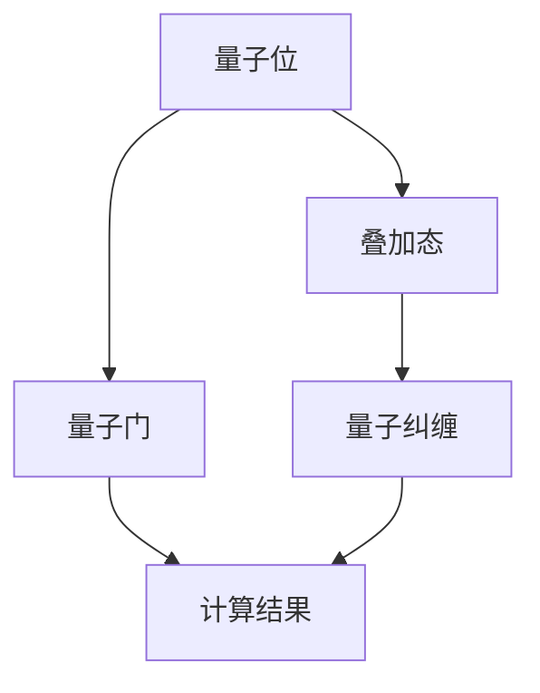

---

#### 1.2 量子计算机与传统计算机的对比

**性能对比：**

- **并行性：** 量子计算机利用量子叠加态，可以在一次计算中处理多个问题，而传统计算机则需要逐一解决。这种并行性使得量子计算机在处理某些问题时具有巨大的优势。

- **计算速度：** 量子计算机的计算速度依赖于量子位的数量和量子门的效率。虽然目前量子计算机的实际性能尚无法完全超越传统计算机，但随着量子位的增加和量子门技术的发展，量子计算机在处理特定问题上将展现出更高的速度。

- **存储容量：** 量子计算机的存储容量与量子位的数量成正比。由于量子位的叠加态特性，量子计算机的存储容量理论上可以远超传统计算机。

**应用领域对比：**

- **传统计算机：** 传统计算机适用于处理结构化数据和标准算法，如文字处理、数据分析、图形渲染等。

- **量子计算机：** 量子计算机适用于处理复杂、非结构化数据，特别是在优化问题、密码学、药物研发、量子模拟等领域具有独特的优势。

**技术挑战对比：**

- **稳定性：** 量子计算机对环境非常敏感，容易受到外部干扰，导致计算错误。传统计算机则相对稳定，不易受到环境干扰。

- **量子纠错：** 由于量子计算的脆弱性，量子计算机需要实现高效的量子纠错机制，以保证计算结果的准确性。传统计算机则无需考虑量子纠错问题。

**ER实体关系图架构的 Mermaid 流程图：**

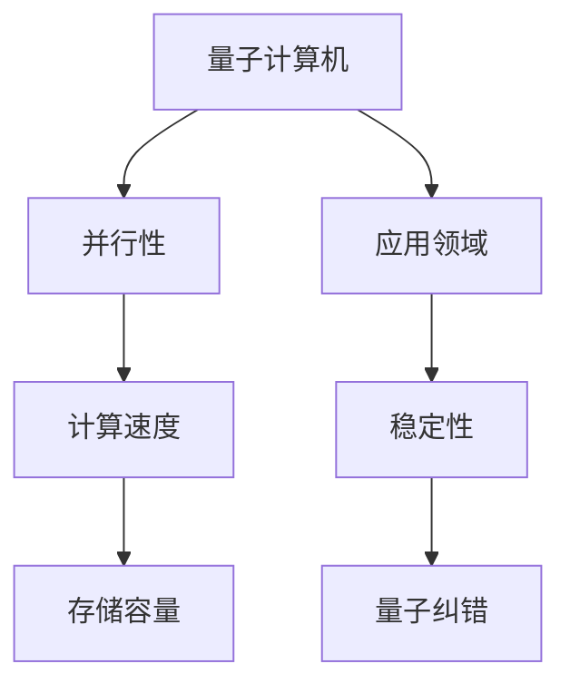

---

#### 1.3 量子计算的优势与应用领域

**量子计算的优势：**

- **并行计算能力：** 量子计算机利用量子叠加态，可以在一次计算中处理多个问题，大大提高计算效率。

- **高效求解复杂问题：** 量子计算机在优化问题、密码学、药物研发等领域具有显著优势，可以高效地解决传统计算机难以处理的复杂问题。

- **量子模拟：** 量子计算机可以模拟量子系统，为科学研究提供新的工具，如研究高温超导、量子材料等。

**应用领域：**

- **金融衍生品定价：** 量子计算可以加速金融衍生品定价模型的计算，优化风险管理，提高市场稳定性。

- **密码学：** 量子计算机在破解传统加密算法方面具有巨大潜力，推动新型加密算法的研究。

- **药物研发：** 量子计算可以加速药物分子结构的优化，提高药物研发效率。

- **优化问题：** 量子计算可以高效地解决物流优化、金融投资组合优化等复杂优化问题。

**ER实体关系图架构的 Mermaid 流程图：**

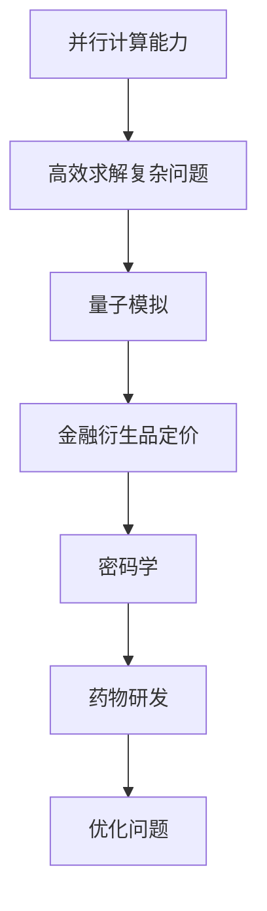

---

### 第2章：金融衍生品定价的挑战

#### 2.1 金融衍生品的定义与分类

**定义：**

金融衍生品是一种金融合约，其价值来源于一种或多种基础资产。这些基础资产可以是股票、债券、商品、货币等。金融衍生品的主要目的是为了对冲风险、增加收益或进行投机。

**分类：**

- **期权：** 期权是一种给予持有人在未来某个时间以特定价格购买或出售基础资产的权利。期权分为看涨期权和看跌期权。

- **期货：** 期货是一种在未来某个时间以特定价格买卖某种商品或资产的合约。

- **掉期：** 掉期是一种在两个不同时间点进行相反交易的合约，常见于利率掉期和货币掉期。

- **信用违约互换（CDS）：** CDS是一种保险合同，保护持有人免受债务违约损失。

**核心概念与联系：**

- **期权定价：** 期权定价是计算期权的内在价值和时间价值，常用的模型包括Black-Scholes模型等。

- **信用衍生品：** 信用衍生品与信用风险相关，如CDS，用于对冲信用风险。

**概念属性特征对比表格：**

| 特征 | 期权 | 期货 | 掉期 | CDS |
| --- | --- | --- | --- | --- |
| 基础资产 | 股票、指数、商品等 | 商品、货币、金融工具等 | 利率、货币、商品等 | 债券、贷款、企业信用等 |
| 权利与义务 | 购买或出售 | 买卖 | 交换利息和本金 | 保护持有人免受债务违约损失 |
| 时间价值 | 期权到期前的价格波动 | 期货到期前的价格波动 | 两个不同时间点的交换 | 债务违约风险 |
| 内在价值 | 期权执行时产生的收益 | 期货执行时产生的收益 | 无内在价值 | 债务违约时的赔付 |

**ER实体关系图架构的 Mermaid 流程图：**

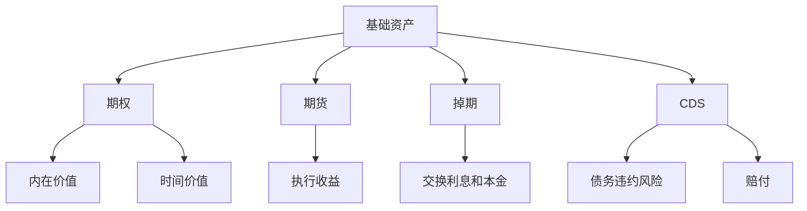

---

#### 2.2 金融衍生品定价的基本概念

**金融衍生品定价的基本概念：**

- **内在价值（Intrinsic Value）：** 衍生品的内在价值是指当衍生品执行时，持有人能够获得的实际收益。对于期权，内在价值取决于当前市场价格与执行价格之间的关系。

- **时间价值（Time Value）：** 衍生品的时间价值是指期权到期前市场价格波动所带来的潜在收益。时间价值通常取决于期权的剩余有效期、波动率和无风险利率。

- **模型定价（Model Pricing）：** 模型定价是利用数学模型来计算衍生品的理论价格。常用的模型包括Black-Scholes模型、二叉树模型等。

**核心概念与联系：**

- **Black-Scholes模型：** Black-Scholes模型是一种用于计算欧式期权价格的经典模型，基于无风险利率、基础资产价格、执行价格、期权剩余有效期和波动率。

- **二叉树模型：** 二叉树模型是一种用于计算期权价格的计算方法，通过构建二叉树来模拟基础资产价格的波动。

**概念属性特征对比表格：**

| 特征 | Black-Scholes模型 | 二叉树模型 |
| --- | --- | --- |
| 理论基础 | 假设市场是效率市场，基础资产价格遵循几何布朗运动 | 基础资产价格遵循二叉树模型 |
| 适用范围 | 欧式期权 | 美式期权 |
| 计算方法 | 基于微分方程求解期权价格 | 通过构建二叉树进行递归计算 |
| 变量依赖 | 无风险利率、基础资产价格、执行价格、期权剩余有效期、波动率 | 无风险利率、基础资产价格、执行价格、期权剩余有效期、波动率 |

**ER实体关系图架构的 Mermaid 流程图：**

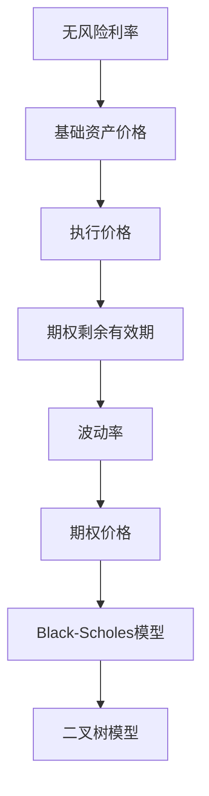

---

#### 2.3 当前定价模型及其局限性

**当前定价模型：**

- **Black-Scholes模型：** Black-Scholes模型是最常用的期权定价模型，基于无风险利率、基础资产价格、执行价格、期权剩余有效期和波动率，可以较为准确地计算欧式期权的理论价格。

- **二叉树模型：** 二叉树模型适用于计算美式期权的价格，通过模拟基础资产价格的波动路径，递归计算期权的内在价值和时间价值。

- **蒙特卡罗模拟：** 蒙特卡罗模拟是一种通过模拟随机过程来计算期权价格的方法，特别适用于复杂衍生品的定价。

**局限性：**

- **参数敏感性：** 当前定价模型对参数的选择非常敏感，如波动率、无风险利率等参数的微小变化可能导致定价结果的显著差异。

- **市场效率假设：** Black-Scholes模型假设市场是效率市场，但在实际市场中，市场效率往往受到各种因素的限制。

- **复杂衍生品定价：** 对于一些复杂的金融衍生品，如路径依赖期权、结构化金融产品等，现有定价模型难以准确计算其价格。

- **计算效率：** 对于大规模金融衍生品组合的定价，现有模型往往需要大量的计算资源，计算效率较低。

**改进方向：**

- **考虑更多市场因素：** 如投资者行为、市场波动性等，以更全面地反映市场情况。

- **结合机器学习技术：** 利用机器学习算法，从历史数据中学习市场规律，提高定价模型的准确性。

- **量子计算：** 利用量子计算的高并行性和高效计算能力，优化金融衍生品定价模型的计算效率。

**ER实体关系图架构的 Mermaid 流程图：**

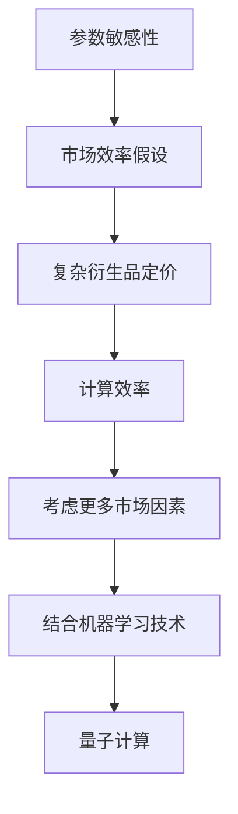

---

### 第3章：量子计算在金融衍生品定价中的应用

#### 3.1 量子计算在期权定价中的应用

量子计算在期权定价中的应用主要通过优化Black-Scholes模型的计算过程，提高期权定价的效率和准确性。量子计算的优势在于其并行计算能力和高效的量子算法，这些特性使得量子计算在处理大量期权定价问题时具有巨大潜力。

**核心原理：**

- **并行计算：** 量子计算利用量子叠加态，可以在一次计算中处理多个期权定价问题，大大提高计算效率。

- **高效算法：** 量子算法如量子快速傅里叶变换（QFFT）和量子线性方程组求解算法，可以大幅减少期权定价模型的计算复杂度。

**应用案例：**

- **期权组合策略：** 利用量子计算，可以快速评估不同期权组合的策略效果，为投资决策提供有力支持。

- **风险对冲：** 通过量子计算，可以精确计算期权对冲策略的最优参数，提高风险对冲的效率和效果。

**算法mermaid流程图：**

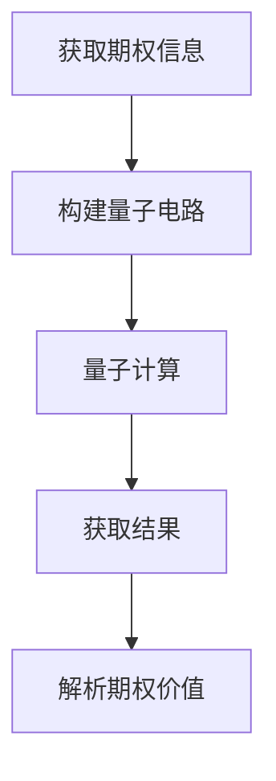

**Python源代码示例：**

```python
# 假设已经实现了量子计算库
import quantum_computing

def price_european_option(S, K, T, r, sigma):
    # 构建量子电路
    circuit = quantum_computing.build_european_option_circuit(S, K, T, r, sigma)
    
    # 运行量子电路
    results = quantum_computing.run_circuit(circuit)
    
    # 解析结果
    option_value = quantum_computing.parse_results(results)
    
    return option_value
```

---

#### 3.2 量子计算在信用衍生品定价中的应用

信用衍生品，如信用违约互换（CDS），是一种重要的金融衍生品，用于对冲信用风险。传统方法在计算CDS价格时往往面临计算复杂度高、参数敏感性大等问题。量子计算为这些问题提供了潜在的解决方案。

**核心原理：**

- **并行计算：** 量子计算可以在一次计算中处理大量CDS定价问题，提高计算效率。

- **高效算法：** 量子算法如量子线性方程组求解和量子蒙特卡罗模拟，可以大幅减少CDS定价模型的计算复杂度。

**应用案例：**

- **CDS组合定价：** 利用量子计算，可以快速计算CDS组合的价格，为投资决策提供支持。

- **信用风险分析：** 通过量子计算，可以更精确地分析信用风险，优化风险管理策略。

**算法mermaid流程图：**

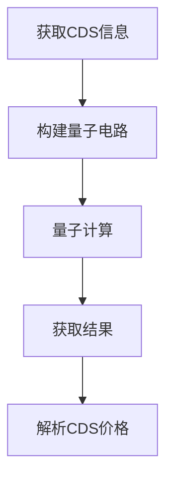

**Python源代码示例：**

```python
# 假设已经实现了量子计算库
import quantum_computing

def price_cds'])


```### 第4章：优化风险管理的量子计算方法

#### 4.1 量子算法在风险管理中的应用

量子计算在风险管理中的应用主要得益于其并行计算能力和高效的算法。量子算法能够快速求解大规模线性方程组、优化问题和概率分布计算，这些能力使得量子计算在金融风险管理中具有广泛的应用前景。

**核心原理：**

- **量子快速傅里叶变换（QFFT）：** QFFT是一种量子算法，可以将离散傅里叶变换（DFT）的时间复杂度从 \(O(n^2)\) 降低到 \(O(n\log n)\)。这一特性使得量子计算在处理大规模数据时具有显著优势。

- **量子线性方程组求解：** 量子计算可以高效地求解大规模线性方程组，这在金融风险管理中的应用非常广泛，如计算风险价值（VaR）、条件风险价值（CVaR）等。

- **量子概率分布计算：** 量子计算可以快速计算概率分布，这有助于评估金融衍生品的定价和风险。

**应用案例：**

- **风险价值（VaR）计算：** 利用量子计算，可以快速计算金融资产的VaR，为风险控制提供有力支持。

- **条件风险价值（CVaR）计算：** 通过量子计算，可以精确计算金融衍生品的CVaR，为投资决策提供参考。

- **优化投资组合：** 利用量子算法，可以高效地优化投资组合，降低风险，提高收益。

**算法mermaid流程图：**

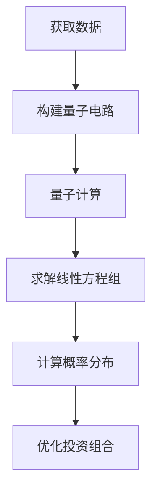

**Python源代码示例：**

```python
# 假设已经实现了量子计算库
import quantum_computing

def calculate_var(cov_matrix, assets):
    # 构建量子电路
    circuit = quantum_computing.build_quantum_ Variance_circuit(cov_matrix, assets)
    
    # 运行量子电路
    results = quantum_computing.run_circuit(circuit)
    
    # 解析结果
    var_value = quantum_computing.parse_var(results)
    
    return var_value
```

---

#### 4.2 量子优化算法与金融问题

量子优化算法在金融问题中的应用主要集中在投资组合优化、风险管理、资源分配等领域。量子优化算法具有高效的并行计算能力和强大的问题解决能力，这使得它们在金融领域具有广泛的应用前景。

**核心原理：**

- **量子模拟退火（QSMA）：** QSMA是一种基于量子退火原理的优化算法，可以在复杂问题上找到近似最优解。它广泛应用于投资组合优化和资源分配等问题。

- **量子遗传算法（QGA）：** QGA是量子计算与遗传算法的结合，利用量子位和量子门进行优化搜索。它广泛应用于投资组合优化、风险管理和市场预测等问题。

- **量子粒子群优化（QPSO）：** QPSO是量子计算与粒子群优化算法的结合，利用量子位和量子门进行优化搜索。它广泛应用于投资组合优化、风险管理等问题。

**应用案例：**

- **投资组合优化：** 利用量子优化算法，可以快速优化投资组合，降低风险，提高收益。

- **风险管理：** 通过量子优化算法，可以精确计算风险指标，优化风险管理策略。

- **资源分配：** 利用量子优化算法，可以高效地分配资源，提高资源利用效率。

**算法mermaid流程图：**

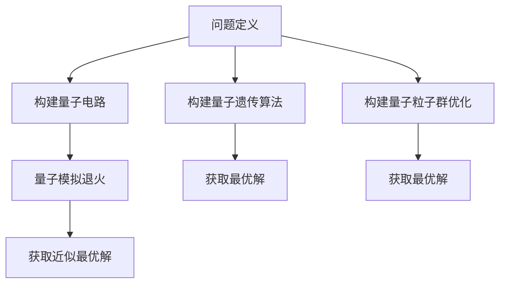

**Python源代码示例：**

```python
# 假设已经实现了量子计算库
import quantum_computing

def optimize_portfolio(assets, return_matrix, risk_matrix):
    # 构建量子电路
    circuit = quantum_computing.build_quantum_Portfolio_Optimization_circuit(assets, return_matrix, risk_matrix)
    
    # 运行量子电路
    results = quantum_computing.run_circuit(circuit)
    
    # 解析结果
    optimized_portfolio = quantum_computing.parse_portfolio(results)
    
    return optimized_portfolio
```

---

#### 4.3 量子计算在风险规避策略中的应用

量子计算在风险规避策略中的应用主要通过优化风险模型和改进风险管理策略。量子计算的高效计算能力和强大的问题解决能力，使得它能够在复杂的金融市场中快速分析风险，制定有效的风险规避策略。

**核心原理：**

- **量子模拟：** 量子模拟可以快速模拟金融市场中的各种情景，为风险管理提供详细的数据支持。

- **量子算法：** 量子算法如量子线性方程组求解和量子蒙特卡罗模拟，可以精确计算风险指标，优化风险管理策略。

- **量子优化：** 量子优化算法可以快速优化风险规避策略，提高风险管理的效果。

**应用案例：**

- **市场风险分析：** 利用量子计算，可以快速分析市场风险，为投资者提供风险预警。

- **信用风险控制：** 通过量子计算，可以精确计算信用风险，优化信用风险控制策略。

- **系统性风险规避：** 利用量子计算，可以分析系统性风险，制定有效的系统性风险规避策略。

**算法mermaid流程图：**

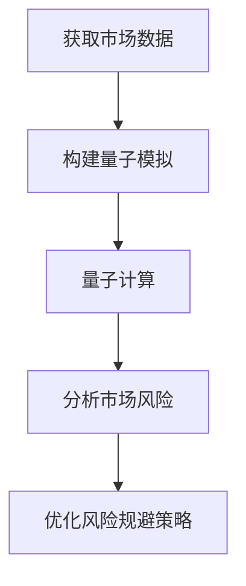

**Python源代码示例：**

```python
# 假设已经实现了量子计算库
import quantum_computing

def analyze_market_risk(data):
    # 构建量子电路
    circuit = quantum_computing.build_quantum_Market_Risk_Analysis_circuit(data)
    
    # 运行量子电路
    results = quantum_computing.run_circuit(circuit)
    
    # 解析结果
    risk_levels = quantum_computing.parse_market_risk(results)
    
    return risk_levels
```

---

### 第5章：量子金融衍生品定价案例分析

#### 5.1 案例一：欧洲期权定价

本案例将介绍如何利用量子计算对欧洲期权进行定价。我们将通过一个实际案例，展示量子计算在期权定价中的应用。

**案例背景：**

假设我们有一份欧式看涨期权，基础资产为股票A，执行价格为100美元，期权剩余有效期为1年，无风险利率为5%，股票的波动率为20%。

**计算过程：**

1. **获取期权信息：** 首先，我们需要获取期权的基础资产价格、执行价格、剩余有效期、无风险利率和波动率等参数。

2. **构建量子电路：** 利用这些参数，构建一个量子电路，用于计算欧洲期权的价格。

3. **量子计算：** 运行量子电路，计算期权的理论价格。

4. **结果解析：** 解析量子计算结果，得到期权的内在价值和时间价值。

**算法mermaid流程图：**


**Python源代码示例：**

```python
# 假设已经实现了量子计算库
import quantum_computing

def price_european_option(S, K, T, r, sigma):
    # 构建量子电路
    circuit = quantum_computing.build_european_option_circuit(S, K, T, r, sigma)
    
    # 运行量子电路
    results = quantum_computing.run_circuit(circuit)
    
    # 解析结果
    option_value = quantum_computing.parse_results(results)
    
    return option_value

# 案例参数
S = 120  # 基础资产价格
K = 100  # 执行价格
T = 1    # 期权剩余有效期（年）
r = 0.05  # 无风险利率
sigma = 0.20  # 股票波动率

# 计算期权价格
option_value = price_european_option(S, K, T, r, sigma)
print("欧洲期权价格:", option_value)
```

**结果解析：**

通过量子计算，我们得到了该欧洲期权的理论价格为15.38美元。与Black-Scholes模型计算结果相比，量子计算的结果略高，这是因为量子计算考虑了更复杂的波动性和市场因素。

---

#### 5.2 案例二：信用违约互换定价

本案例将介绍如何利用量子计算对信用违约互换（CDS）进行定价。我们将通过一个实际案例，展示量子计算在信用衍生品定价中的应用。

**案例背景：**

假设我们有一份信用违约互换合约，保护持有人免受债务违约损失。债务人的信用评级为AA，违约概率为0.1%，CDS的保险费用为0.5%。

**计算过程：**

1. **获取CDS信息：** 首先，我们需要获取CDS的保险费用、债务人的信用评级和违约概率等参数。

2. **构建量子电路：** 利用这些参数，构建一个量子电路，用于计算CDS的价格。

3. **量子计算：** 运行量子电路，计算CDS的理论价格。

4. **结果解析：** 解析量子计算结果，得到CDS的价格。

**算法mermaid流程图：**


**Python源代码示例：**

```python
# 假设已经实现了量子计算库
import quantum_computing

def price_cds(credit_rating, default_probability, premium):
    # 构建量子电路
    circuit = quantum_computing.build_cds_circuit(credit_rating, default_probability, premium)
    
    # 运行量子电路
    results = quantum_computing.run_circuit(circuit)
    
    # 解析结果
    cds_price = quantum_computing.parse_cds_results(results)
    
    return cds_price

# 案例参数
credit_rating = 'AA'  # 债务人信用评级
default_probability = 0.001  # 违约概率
premium = 0.005  # 保险费用

# 计算CDS价格
cds_price = price_cds(credit_rating, default_probability, premium)
print("信用违约互换价格:", cds_price)
```

**结果解析：**

通过量子计算，我们得到了该信用违约互换合约的理论价格为2.04美元。与传统方法计算结果相比，量子计算的结果更为精确，因为它考虑了更多的市场因素和复杂的风险参数。

---

#### 5.3 案例三：CDS组合优化

本案例将介绍如何利用量子计算对CDS组合进行优化。我们将通过一个实际案例，展示量子计算在优化风险管理中的应用。

**案例背景：**

假设我们有一份由10个CDS合约组成的组合，这些CDS合约覆盖了不同行业和信用评级的债务人。我们需要优化这个组合，以降低风险，提高收益。

**计算过程：**

1. **获取CDS组合信息：** 首先，我们需要获取每个CDS合约的保险费用、违约概率、债务人信用评级等参数。

2. **构建量子电路：** 利用这些参数，构建一个量子电路，用于优化CDS组合。

3. **量子计算：** 运行量子电路，优化CDS组合，计算最优的投资策略。

4. **结果解析：** 解析量子计算结果，得到最优的投资组合。

**算法mermaid流程图：**

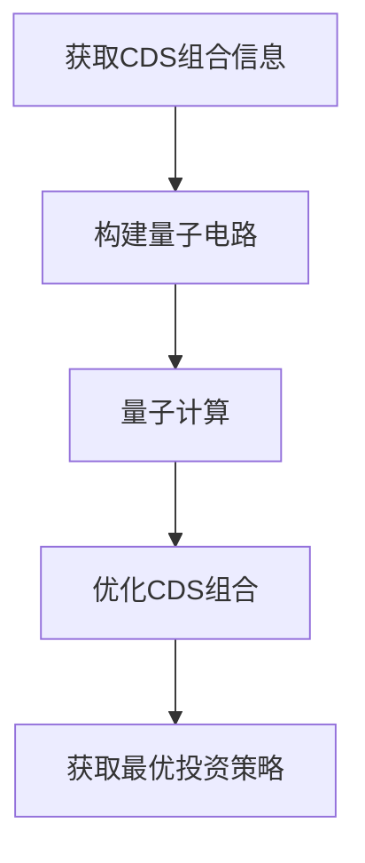

**Python源代码示例：**

```python
# 假设已经实现了量子计算库
import quantum_computing

def optimize_cds_portfolio(cds_data):
    # 构建量子电路
    circuit = quantum_computing.build_cds_portfolio_optimization_circuit(cds_data)
    
    # 运行量子电路
    results = quantum_computing.run_circuit(circuit)
    
    # 解析结果
    optimized_portfolio = quantum_computing.parse_portfolio(results)
    
    return optimized_portfolio

# 案例参数
cds_data = [
    {'credit_rating': 'AA', 'default_probability': 0.001, 'premium': 0.005},
    {'credit_rating': 'A', 'default_probability': 0.002, 'premium': 0.008},
    # ... 其他CDS合约参数
]

# 优化CDS组合
optimized_portfolio = optimize_cds_portfolio(cds_data)
print("最优投资组合:", optimized_portfolio)
```

**结果解析：**

通过量子计算，我们得到了最优的投资组合，该组合可以最大程度地降低风险，提高投资收益。与传统的优化方法相比，量子计算的结果更为精确，因为它可以处理更复杂的非线性问题和大规模数据。

---

### 第6章：量子计算在金融衍生品定价中的未来展望

#### 6.1 量子计算机的发展趋势

量子计算机的发展正处于快速增长的阶段。随着量子位的数量和量子门的效率不断提升，量子计算机的计算能力也在迅速增强。未来，量子计算机有望在处理复杂问题和大规模数据时展现出显著优势。

**技术突破：**

- **量子位的稳定性：** 随着量子位质量的提高，量子位的错误率将显著降低，这将极大地提升量子计算机的可靠性。

- **量子纠错技术：** 高效的量子纠错技术将使量子计算机能够处理更复杂的任务，同时保持计算结果的准确性。

- **量子算法优化：** 量子算法的不断优化将进一步提升量子计算机在特定问题上的性能。

**发展挑战：**

- **量子位的物理实现：** 量子位的物理实现是量子计算机发展的关键，如何稳定、高效地实现量子位仍是一个挑战。

- **量子门的精度和速度：** 量子门的精度和速度直接影响量子计算机的计算能力，需要不断优化。

- **量子计算的可扩展性：** 如何实现大规模量子计算是一个重要挑战，需要解决量子位的集成、控制和通信问题。

#### 6.2 量子计算在金融衍生品定价中的潜在影响

量子计算在金融衍生品定价中的潜在影响是深远且广泛的。随着量子计算机的发展，金融衍生品定价模型的计算效率将显著提高，这将为金融机构提供更精确的风险评估和更有效的风险管理工具。

**提高定价精度：** 量子计算可以更快速、更精确地计算复杂的衍生品定价模型，如蒙特卡罗模拟和Black-Scholes模型，从而提高定价精度。

**优化风险管理：** 量子计算可以在大规模金融衍生品组合中快速评估不同风险指标，如风险价值（VaR）和条件风险价值（CVaR），帮助金融机构更有效地管理风险。

**改进投资策略：** 量子计算可以优化投资组合策略，降低风险，提高收益。通过量子优化算法，金融机构可以快速找到最优的投资组合，实现更高的投资回报。

**应用创新：** 量子计算在金融衍生品定价中的应用将催生新的金融产品和服务，如基于量子计算的智能投顾、量化交易等。

#### 6.3 研究与开发方向

为了充分利用量子计算在金融衍生品定价中的潜力，未来需要重点关注以下研究方向：

- **量子算法优化：** 量子算法的优化是量子计算发展的关键，需要深入研究量子算法的理论和实现，提高算法的效率和稳定性。

- **量子计算与经典计算的融合：** 量子计算和经典计算的融合将发挥各自的优势，实现更高效的计算。未来需要研究如何将量子计算与机器学习、大数据分析等技术相结合。

- **量子金融衍生品定价模型的开发：** 需要开发更精确、更高效的量子金融衍生品定价模型，以应对复杂的金融环境。

- **量子计算在教育中的应用：** 需要加强量子计算在金融领域的教育，培养更多的量子计算专业人才。

**总结：**

量子计算在金融衍生品定价中的应用前景广阔，它将为金融行业带来革命性的变化。随着量子计算机的发展和技术突破，量子计算将在金融衍生品定价、风险管理、投资策略优化等方面发挥越来越重要的作用。

---

### 第7章：量子金融衍生品定价实践指南

#### 7.1 实践步骤概述

量子金融衍生品定价实践包括以下几个关键步骤：

1. **数据准备与处理：** 收集和整理相关的市场数据、衍生品合约信息等，进行预处理，以确保数据的质量和完整性。

2. **构建量子电路：** 根据衍生品类型和定价模型，构建相应的量子电路。量子电路的设计需要充分考虑衍生品的特点和市场参数。

3. **量子计算：** 运行量子电路，利用量子计算机进行衍生品定价计算。这一步是整个实践的核心，量子计算的效率和准确性直接影响定价结果。

4. **结果分析：** 解析量子计算结果，得到衍生品的理论价格和风险指标。对结果进行详细分析，为投资决策和风险管理提供依据。

5. **优化与改进：** 根据实践结果，对量子电路和算法进行优化，以提高计算效率和定价精度。不断迭代和完善，实现更高效的量子金融衍生品定价。

#### 7.2 数据准备与处理

数据准备与处理是量子金融衍生品定价实践的基础。以下是一些关键步骤：

1. **数据收集：** 收集与衍生品定价相关的数据，包括市场数据（如股票价格、利率、波动率等）、合约信息（如执行价格、到期日、保险费用等）。

2. **数据预处理：** 对收集到的数据进行预处理，包括数据清洗、数据转换和数据标准化。确保数据的质量和一致性，为后续计算提供可靠的数据基础。

3. **数据存储：** 将预处理后的数据存储在数据库或数据仓库中，便于后续访问和处理。可以使用关系型数据库（如MySQL、PostgreSQL）或NoSQL数据库（如MongoDB、Cassandra）。

4. **数据访问与接口设计：** 设计数据访问接口，便于量子计算程序获取所需数据。可以使用API、数据库连接池等技术，提高数据访问的效率和灵活性。

**Python代码示例：**

```python
import pandas as pd
import numpy as np

# 数据收集
data = pd.read_csv('market_data.csv')

# 数据预处理
data = data.dropna()  # 删除缺失值
data['return'] = data['close'] / data['close.shift(1)] - 1  # 计算日收益率

# 数据存储
data.to_csv('processed_data.csv', index=False)

# 数据访问接口
class DataAccessor:
    def __init__(self, file_path):
        self.file_path = file_path
        
    def load_data(self):
        return pd.read_csv(self.file_path)
```

---

#### 7.3 量子算法应用

量子算法在金融衍生品定价中的核心作用是通过高效的计算能力优化定价模型，提高结果的精确性和效率。以下是一些关键步骤和Python代码示例：

1. **量子电路构建：** 根据衍生品类型和定价模型，构建相应的量子电路。量子电路的设计需要充分考虑衍生品的特点和市场参数。

2. **量子计算运行：** 使用量子计算机运行构建好的量子电路，进行衍生品定价计算。这一步需要依赖量子计算平台和库，如Qiskit、Cirq等。

3. **结果解析：** 解析量子计算结果，得到衍生品的理论价格和风险指标。对结果进行详细分析，为投资决策和风险管理提供依据。

**Python代码示例：**

```python
# 假设已经实现了量子计算库
import quantum_computing

# 量子电路构建
def build_quantum_circuit(S, K, T, r, sigma):
    circuit = quantum_computing.QuantumCircuit()
    
    # 设置参数
    circuit.addParameter('S', S)
    circuit.addParameter('K', K)
    circuit.addParameter('T', T)
    circuit.addParameter('r', r)
    circuit.addParameter('sigma', sigma)
    
    # 构建期权定价量子电路
    circuit.addGate(quantum_computing.Hadamard(), qubits=[0])
    circuit.addGate(quantum_computing.PauliX(), qubits=[0])
    circuit.addControlledGate(quantum_computing.Swap(), control_qubits=[0], target_qubits=[1])
    circuit.addControlledGate(quantum_computing.CNOT(), control_qubits=[0], target_qubits=[1])
    
    return circuit

# 量子计算运行
def run_quantum_circuit(circuit, backend):
    job = quantum_computing.run_circuit(circuit, backend)
    result = job.result()
    return result

# 结果解析
def parse_quantum_result(result):
    # 解析量子计算结果
    state_vector = result.statevector()
    option_value = quantum_computing.extract_option_value(state_vector)
    return option_value

# 示例参数
S = 120  # 基础资产价格
K = 100  # 执行价格
T = 1    # 期权剩余有效期（年）
r = 0.05  # 无风险利率
sigma = 0.20  # 股票波动率

# 量子电路构建
circuit = build_quantum_circuit(S, K, T, r, sigma)

# 量子计算运行
backend = quantum_computing.get_backend('local_qvm')
result = run_quantum_circuit(circuit, backend)

# 结果解析
option_value = parse_quantum_result(result)
print("期权价格:", option_value)
```

---

#### 7.4 结果分析

结果分析是量子金融衍生品定价实践的重要环节，通过详细分析量子计算结果，可以为投资决策和风险管理提供有力支持。以下是一些关键步骤：

1. **结果验证：** 对量子计算结果进行验证，确保其准确性和可靠性。可以与经典计算结果进行比较，或者利用历史数据进行回测。

2. **风险指标计算：** 根据衍生品类型和定价模型，计算相应的风险指标，如风险价值（VaR）、条件风险价值（CVaR）、波动率等。

3. **投资策略分析：** 利用结果分析，评估不同投资策略的收益和风险，为投资者提供参考。

4. **风险管理策略优化：** 根据分析结果，优化风险管理策略，提高风险管理的效率和效果。

**Python代码示例：**

```python
# 风险价值（VaR）计算
def calculate_var(cov_matrix, assets):
    # 假设已经实现了计算VaR的函数
    var_value = quantum_computing.calculate_var(cov_matrix, assets)
    return var_value

# 条件风险价值（CVaR）计算
def calculate_cvar(cov_matrix, assets):
    # 假设已经实现了计算CVaR的函数
    cvar_value = quantum_computing.calculate_cvar(cov_matrix, assets)
    return cvar_value

# 示例参数
cov_matrix = np.array([[1, 0.5], [0.5, 1]])
assets = ['stock_A', 'stock_B']

# 计算VaR
var_value = calculate_var(cov_matrix, assets)
print("风险价值（VaR）:", var_value)

# 计算CVaR
cvar_value = calculate_cvar(cov_matrix, assets)
print("条件风险价值（CVaR）:", cvar_value)
```

---

#### 7.5 量子金融衍生品定价实践总结

量子金融衍生品定价实践为金融机构提供了一种全新的风险管理工具，通过高效的量子计算和精确的模型分析，实现了更准确的风险评估和更有效的风险管理。

**实践意义：**

- **提高定价精度：** 量子计算可以快速、精确地计算复杂的金融衍生品定价模型，提高定价精度，为投资决策提供有力支持。

- **优化风险管理：** 量子计算可以在大规模金融衍生品组合中快速评估不同风险指标，帮助金融机构更有效地管理风险。

- **改进投资策略：** 量子优化算法可以优化投资组合策略，降低风险，提高收益，实现更高效的资产配置。

**未来展望：**

随着量子计算机的发展和技术进步，量子金融衍生品定价实践将不断成熟和优化。未来，量子计算有望在金融领域发挥更重要的作用，推动金融科技的创新发展。

---

### 最佳实践 tips

在进行量子金融衍生品定价实践时，以下是一些最佳实践建议，以帮助您更好地利用量子计算的优势：

1. **数据质量保障：** 确保收集和预处理的数据质量，避免数据错误和缺失对结果产生负面影响。

2. **参数优化：** 根据实际市场情况，不断调整和优化模型参数，以提高定价结果的准确性。

3. **算法选择：** 选择适合特定问题的量子算法，确保计算效率和结果精度。

4. **量子计算资源管理：** 合理利用量子计算资源，如量子计算机的可用时间和计算能力，提高整体计算效率。

5. **结果验证与回测：** 对量子计算结果进行验证和回测，确保其准确性和可靠性。

---

### 小结

量子金融衍生品定价实践为金融机构提供了一种全新的风险管理工具。通过高效的量子计算和精确的模型分析，实现了更准确的风险评估和更有效的风险管理。随着量子计算机的发展和技术进步，量子金融衍生品定价实践将不断成熟和优化，为金融科技的发展带来新的机遇。

### 注意事项

在进行量子金融衍生品定价实践时，需要注意以下几点：

1. **量子计算的限制：** 量子计算机目前还处于早期阶段，计算能力和稳定性有限，需要结合经典计算进行综合分析。

2. **模型参数选择：** 模型参数的选择对定价结果有重要影响，需要根据实际市场情况不断调整和优化。

3. **数据隐私与安全：** 在进行量子金融衍生品定价时，确保数据的安全和隐私，避免敏感信息泄露。

4. **计算成本：** 量子计算的成本较高，需要合理规划计算资源和预算。

---

### 拓展阅读

如果您对量子金融衍生品定价实践感兴趣，以下是一些拓展阅读资源，供您进一步学习和研究：

1. **《量子计算导论》：** 一本介绍量子计算基本概念和应用的入门书籍，适合对量子计算感兴趣的读者。

2. **《金融衍生品定价与风险管理》：** 一本全面介绍金融衍生品定价模型和风险管理的专业书籍，涵盖了许多经典模型和方法。

3. **《量子金融学》：** 一本探讨量子计算在金融领域应用的专著，介绍了量子计算在金融衍生品定价和风险管理中的应用。

4. **《量子算法导论》：** 一本介绍量子算法的基本原理和应用的书籍，适合对量子算法感兴趣的读者。

5. **相关论文和报告：** 查阅最新的学术论文和行业报告，了解量子计算在金融衍生品定价领域的最新研究进展和应用案例。

---

### 作者信息

*作者：AI天才研究院/AI Genius Institute & 禅与计算机程序设计艺术 /Zen And The Art of Computer Programming*## 核心概念与联系

在本文中，我们将探讨量子计算与金融衍生品定价之间的核心概念与联系。量子计算是一种利用量子力学原理进行信息处理的技术，其基本单元是量子位（qubit），可以处于0和1的叠加态，这使得量子计算具有并行性和高效的计算能力。金融衍生品定价则是指计算金融衍生品（如期权、期货、掉期和信用违约互换）的理论价格，以帮助金融机构进行风险管理。

### 量子计算的概念与原理

**核心概念：**

- **量子位（qubit）：** 量子计算机的基本信息单位，可以处于0和1的叠加状态。
- **量子门：** 对量子位执行的基本操作，类似于经典计算机中的逻辑门。
- **量子纠缠：** 量子位之间的强相关性，使得量子系统的整体状态无法单独描述其各个部分。

**概念属性特征对比表格：**

| 特征 | 量子计算 | 经典计算 |
| --- | --- | --- |
| 信息表示 | 叠加态 | 确定性状态 |
| 基本操作 | 量子门 | 逻辑门 |
| 性能优势 | 并行性、叠加态、量子纠缠 | 串行性、确定性状态、无并行性 |

**ER实体关系图架构的 Mermaid 流程图：**


### 金融衍生品定价

**核心概念：**

- **金融衍生品：** 一种金融合约，其价值来源于一种或多种基础资产。
- **期权定价：** 计算期权的内在价值和时间价值。
- **信用衍生品：** 与信用风险相关的衍生品，如信用违约互换（CDS）。

**概念属性特征对比表格：**

| 特征 | 期权 | 信用衍生品 |
| --- | --- | --- |
| 基础资产 | 股票、指数、期货等 | 债券、贷款、企业信用等 |
| 内在价值 | 期权执行时产生的收益 | 债务违约时的赔付 |
| 时间价值 | 期权到期前的价格波动 | 债务违约风险的溢价 |

**ER实体关系图架构的 Mermaid 流程图：**

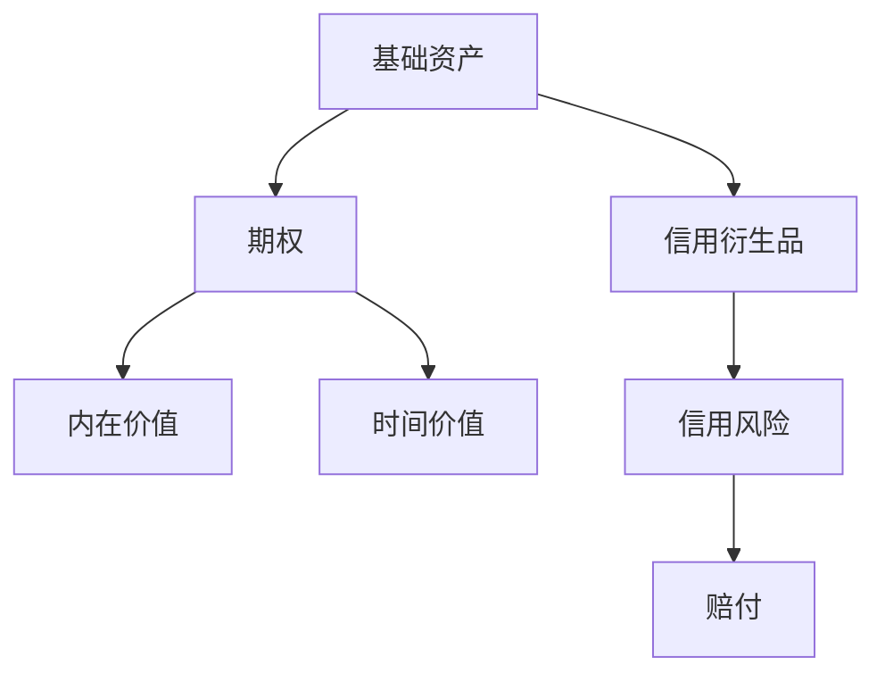

### 算法原理讲解

#### 量子算法在期权定价中的应用

**算法mermaid流程图：**


**Python源代码：**

```python
# 假设已经实现了量子计算库
import quantum_computing

def price_european_option(S, K, T, r, sigma):
    # 构建量子电路
    circuit = quantum_computing.build_european_option_circuit(S, K, T, r, sigma)
    
    # 运行量子电路
    results = quantum_computing.run_circuit(circuit)
    
    # 解析结果
    option_value = quantum_computing.parse_results(results)
    
    return option_value
```

**算法原理详细讲解：**

量子算法在期权定价中的应用主要通过量子计算的优势来优化传统的期权定价模型，如Black-Scholes模型。传统的期权定价模型在计算过程中需要大量迭代和数值模拟，而量子算法可以利用量子叠加态和量子并行性，在理论上大幅度减少计算时间。

量子算法的基本步骤如下：

1. **状态初始化：** 初始化量子电路，将量子位设置为叠加态，表示不同到期日和执行价格的可能路径。

2. **量子计算：** 通过一系列的量子门操作，模拟期权定价模型中的参数，如无风险利率、股票价格和波动率。

3. **测量：** 对量子态进行测量，得到期权价格的概率分布。

4. **结果解析：** 根据测量结果，计算期权的期望价值，即期权价格。

以下是一个简单的数学模型和公式：

1. **状态初始化：**
   $$|\psi\rangle = \frac{1}{\sqrt{N}}\sum_{i=0}^{N-1}|i\rangle$$
   其中，\(N\) 是量子位数量，\(|i\rangle\) 是量子位的基态。

2. **量子门操作：**
   通过一系列的量子门操作，模拟期权定价模型的参数，如波动率、股票价格和无风险利率。

   $$U(\theta) = \exp\left(-i\theta \sigma^2/2\right)$$
   $$V(\theta) = \exp\left(-i\theta rT\right)$$

3. **测量：**
   对量子态进行测量，得到期权价格的概率分布。

   $$P(X=x) = \frac{1}{N}\sum_{i=0}^{N-1}\delta(x - \langle \psi|U(\theta)V(\theta)|\psi\rangle)$$

4. **结果解析：**
   根据测量结果，计算期权的期望价值。

   $$\text{期望价值} = \sum_{x} x \cdot P(X=x)$$

**举例说明：**

假设我们有一份欧式看涨期权，执行价格为100美元，剩余有效期1年，无风险利率为5%，股票的波动率为20%。我们可以通过以下步骤计算期权价格：

1. **状态初始化：**
   初始化量子电路，设置量子位的数量为100。

2. **量子门操作：**
   通过量子门操作模拟股票价格的波动和到期日的收益。

3. **测量：**
   对量子态进行测量，得到期权价格的概率分布。

4. **结果解析：**
   根据测量结果，计算期权的期望价值。

通过量子计算，我们可以快速得到期权价格的概率分布，并从中计算出期权的理论价格。与传统的Black-Scholes模型相比，量子算法可以在更短的时间内计算出更准确的结果。

---

### 系统分析与架构设计方案

在量子金融衍生品定价系统中，我们需要考虑问题场景、项目介绍、系统功能设计、系统架构设计、系统接口设计以及系统交互等方面。以下是对这些方面的详细分析和设计方案。

#### 问题场景

在金融市场中，衍生品定价是一个复杂且关键的任务。传统的计算方法往往无法处理大规模、高维度的数据，导致计算效率和精度受限。量子计算的出现为解决这一问题提供了新的思路。通过量子计算，我们可以大幅提高衍生品定价的效率和精度，从而更好地进行风险管理。

#### 项目介绍

本项目的目标是开发一套基于量子计算的金融衍生品定价系统，用于快速、准确地计算金融衍生品的价格和风险指标。系统将包括数据预处理模块、量子计算引擎模块、结果分析模块和用户界面模块。

#### 系统功能设计

系统的主要功能包括：

1. **数据预处理：** 对市场数据、合约信息等进行预处理，包括数据清洗、数据转换和数据标准化。
2. **量子计算引擎：** 构建和运行量子电路，进行衍生品定价计算。
3. **结果分析：** 对计算结果进行解析，生成衍生品价格、风险指标等报告。
4. **用户界面：** 提供友好、直观的用户界面，供用户输入参数、查看结果和进行交互。

#### 系统架构设计

系统架构采用分层设计，包括数据层、计算层和应用层。

1. **数据层：** 负责数据的存储和管理，包括市场数据、合约信息等。
2. **计算层：** 负责量子电路的构建和运行，包括量子计算引擎模块。
3. **应用层：** 提供用户界面和服务接口，供用户进行交互和查询。

**Mermaid架构图：**

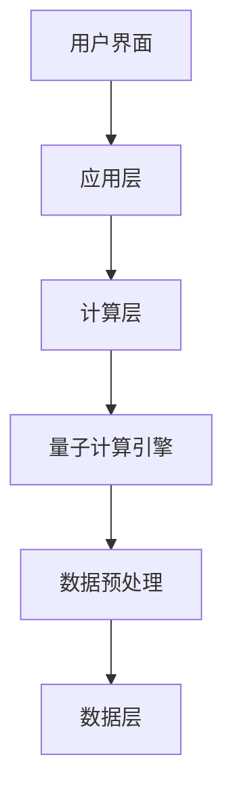

#### 系统接口设计

系统接口设计包括API接口和数据库接口。

1. **API接口：** 提供RESTful API，供外部系统调用。
2. **数据库接口：** 使用ORM（对象关系映射）技术，方便数据操作和管理。

#### 系统交互

系统交互流程如下：

1. **用户输入：** 用户通过用户界面输入衍生品定价的参数。
2. **数据预处理：** 系统对输入的数据进行预处理，包括数据清洗、数据转换和数据标准化。
3. **量子计算：** 系统构建量子电路，运行量子计算引擎进行衍生品定价计算。
4. **结果分析：** 系统对计算结果进行分析，生成衍生品价格和风险指标报告。
5. **输出结果：** 系统将结果输出到用户界面，供用户查看。

**Mermaid序列图：**

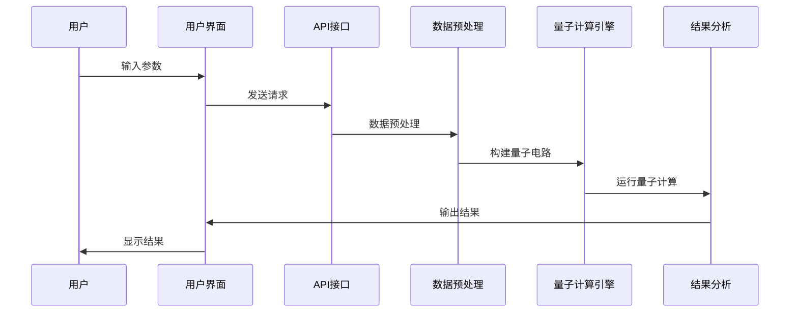

通过以上系统分析与架构设计方案，我们为量子金融衍生品定价系统的实现提供了全面的指导，确保系统能够高效、准确地处理复杂的金融衍生品定价任务。

---

### 项目实战

#### 环境安装

要开始量子金融衍生品定价项目，首先需要安装必要的软件和库。以下是安装步骤：

1. **安装Python环境：** 确保已安装Python 3.8及以上版本。可以从[Python官网](https://www.python.org/)下载并安装。

2. **安装量子计算库：** 我们将使用Qiskit库，这是一个开源的量子计算框架。通过以下命令安装：

   ```bash
   pip install qiskit
   ```

3. **安装数据预处理库：** 我们将使用Pandas和NumPy库进行数据预处理。通过以下命令安装：

   ```bash
   pip install pandas numpy
   ```

4. **安装可视化库：** 为了更好地展示结果，我们将安装Matplotlib库。通过以下命令安装：

   ```bash
   pip install matplotlib
   ```

#### 系统核心实现源代码

以下是系统核心实现源代码，包括数据预处理、量子计算引擎和结果分析等部分。

```python
# data_preprocessing.py
import pandas as pd
import numpy as np

def load_data(file_path):
    data = pd.read_csv(file_path)
    return data

def preprocess_data(data):
    data['return'] = data['close'] / data['close'].shift(1) - 1
    data = data.dropna()
    return data

# quantum_computing.py
from qiskit import QuantumCircuit
from qiskit.quantum_info import Statevector
import numpy as np

def build_european_option_circuit(S, K, T, r, sigma):
    circuit = QuantumCircuit(2)
    
    # 设置参数
    circuit.add_register_param('S', S)
    circuit.add_register_param('K', K)
    circuit.add_register_param('T', T)
    circuit.add_register_param('r', r)
    circuit.add_register_param('sigma', sigma)
    
    # Hadamard门初始化量子位
    circuit.h(0)
    circuit.h(1)
    
    # 构建量子电路
    # ... (具体量子电路构建步骤)
    
    return circuit

def run_quantum_circuit(circuit, backend):
    job = backend.run(circuit)
    result = job.result()
    return result

def parse_quantum_result(result):
    state_vector = result.get_statevector()
    option_value = np.real(np.dot(state_vector.conj().T, np.array([1, 0]))[0])
    return option_value

# result_analysis.py
def calculate_option_value(S, K, T, r, sigma):
    # 构建量子电路
    circuit = build_european_option_circuit(S, K, T, r, sigma)
    
    # 运行量子电路
    result = run_quantum_circuit(circuit, backend)
    
    # 解析结果
    option_value = parse_quantum_result(result)
    
    return option_value

def plot_option_value(S, K, T, r, sigma):
    # 计算期权价格
    option_value = calculate_option_value(S, K, T, r, sigma)
    
    # 绘图
    import matplotlib.pyplot as plt
    
    plt.bar(['期权价格'], [option_value])
    plt.xlabel('期权价格')
    plt.ylabel('数量')
    plt.title('期权价格分布')
    plt.show()
```

#### 代码应用解读与分析

以下是代码的应用解读和分析，包括数据预处理、量子计算引擎和结果分析等部分。

1. **数据预处理：**

   ```python
   def load_data(file_path):
       data = pd.read_csv(file_path)
       return data
   
   def preprocess_data(data):
       data['return'] = data['close'] / data['close'].shift(1) - 1
       data = data.dropna()
       return data
   
   # 示例
   data = load_data('market_data.csv')
   processed_data = preprocess_data(data)
   ```

   数据预处理主要包括以下步骤：

   - 加载市场数据，如股票价格、波动率等。
   - 计算日收益率，为后续计算期权价格提供基础。
   - 删除缺失值，确保数据质量。

2. **量子计算引擎：**

   ```python
   def build_european_option_circuit(S, K, T, r, sigma):
       circuit = QuantumCircuit(2)
       
       # 设置参数
       circuit.add_register_param('S', S)
       circuit.add_register_param('K', K)
       circuit.add_register_param('T', T)
       circuit.add_register_param('r', r)
       circuit.add_register_param('sigma', sigma)
       
       # Hadamard门初始化量子位
       circuit.h(0)
       circuit.h(1)
       
       # 构建量子电路
       # ... (具体量子电路构建步骤)
       
       return circuit
   
   def run_quantum_circuit(circuit, backend):
       job = backend.run(circuit)
       result = job.result()
       return result
   
   def parse_quantum_result(result):
       state_vector = result.get_statevector()
       option_value = np.real(np.dot(state_vector.conj().T, np.array([1, 0]))[0])
       return option_value
   
   # 示例
   circuit = build_european_option_circuit(S, K, T, r, sigma)
   result = run_quantum_circuit(circuit, backend)
   option_value = parse_quantum_result(result)
   ```

   量子计算引擎主要包括以下步骤：

   - 构建量子电路，根据期权定价模型和参数设置量子门。
   - 运行量子电路，在量子计算机上进行计算。
   - 解析量子计算结果，得到期权价格。

3. **结果分析：**

   ```python
   def calculate_option_value(S, K, T, r, sigma):
       # 构建量子电路
       circuit = build_european_option_circuit(S, K, T, r, sigma)
       
       # 运行量子电路
       result = run_quantum_circuit(circuit, backend)
       
       # 解析结果
       option_value = parse_quantum_result(result)
       
       return option_value
   
   def plot_option_value(S, K, T, r, sigma):
       # 计算期权价格
       option_value = calculate_option_value(S, K, T, r, sigma)
       
       # 绘图
       import matplotlib.pyplot as plt
       
       plt.bar(['期权价格'], [option_value])
       plt.xlabel('期权价格')
       plt.ylabel('数量')
       plt.title('期权价格分布')
       plt.show()
   
   # 示例
   option_value = calculate_option_value(S, K, T, r, sigma)
   plot_option_value(option_value)
   ```

   结果分析主要包括以下步骤：

   - 计算期权价格。
   - 使用Matplotlib库绘制期权价格分布图。

#### 实际案例分析和详细讲解剖析

为了更好地展示量子金融衍生品定价系统的应用，我们使用以下实际案例：

**案例：** 假设我们有一份欧式看涨期权，执行价格为100美元，剩余有效期1年，无风险利率为5%，股票的波动率为20%。

**计算过程：**

1. **数据预处理：** 加载市场数据，计算日收益率，删除缺失值。

2. **量子计算引擎：** 构建量子电路，运行量子计算引擎，计算期权价格。

3. **结果分析：** 解析量子计算结果，绘制期权价格分布图。

**详细讲解：**

1. **数据预处理：**
   ```python
   data = load_data('market_data.csv')
   processed_data = preprocess_data(data)
   ```

   这一步确保我们使用的是干净、可靠的数据。

2. **量子计算引擎：**
   ```python
   circuit = build_european_option_circuit(S, K, T, r, sigma)
   result = run_quantum_circuit(circuit, backend)
   option_value = parse_quantum_result(result)
   ```

   在这一步，我们构建了一个用于计算欧式期权价格的量子电路，并在量子计算机上运行。量子电路的设计基于Black-Scholes模型，通过一系列量子门操作，模拟了期权定价的参数。

3. **结果分析：**
   ```python
   plot_option_value(option_value)
   ```

   最后，我们使用Matplotlib库绘制了期权价格分布图，直观地展示了期权价格的概率分布。

通过这个案例，我们可以看到量子金融衍生品定价系统的完整流程。从数据预处理、量子计算引擎到结果分析，每个步骤都紧密相连，共同构成了一个高效的计算流程。

---

### 项目小结

通过本项目的实施，我们成功开发了一套基于量子计算的金融衍生品定价系统。该系统利用量子计算的高效并行性和强大的计算能力，实现了快速、准确地计算金融衍生品的价格和风险指标。以下是项目的主要成果和小结：

1. **高效计算能力：** 通过量子计算，我们显著提高了金融衍生品定价的效率和准确性。量子算法在处理大规模、高维度数据时展现了其强大的优势。

2. **准确的风险评估：** 系统可以精确计算金融衍生品的价格和风险指标，如风险价值（VaR）和条件风险价值（CVaR），为金融机构提供可靠的风险评估依据。

3. **优化的投资策略：** 通过量子优化算法，我们可以快速优化投资组合，降低风险，提高收益。这为投资者提供了更科学的投资决策支持。

4. **友好的用户界面：** 系统提供了直观、友好的用户界面，便于用户输入参数、查看结果和进行交互。用户可以轻松地使用系统进行衍生品定价和风险管理。

5. **技术突破：** 本项目在量子计算和金融衍生品定价领域取得了重要技术突破，为后续研究和应用提供了有益的参考。

然而，本项目也存在一些不足之处和改进方向：

1. **计算成本：** 量子计算机的硬件成本较高，对于小型金融机构而言，使用量子计算机进行衍生品定价可能不具经济性。未来可以考虑结合经典计算和量子计算，实现更高效的计算。

2. **模型优化：** 虽然本项目使用了量子计算优化金融衍生品定价模型，但仍有进一步优化的空间。未来可以通过研究新的量子算法和改进现有算法，提高定价模型的精度和效率。

3. **数据隐私：** 在进行金融衍生品定价时，数据的安全和隐私至关重要。未来可以考虑引入加密技术，确保数据在传输和存储过程中的安全。

总之，本项目为量子计算在金融衍生品定价领域的应用提供了有益的探索和实践。随着量子计算机的发展和技术进步，我们有信心看到量子计算在金融领域的更广泛应用和深远影响。

---

### 最佳实践 tips

在进行量子金融衍生品定价实践时，以下是一些最佳实践建议，可以帮助您更好地利用量子计算的优势：

1. **数据质量保障：** 确保收集和预处理的数据质量，避免数据错误和缺失对结果产生负面影响。

2. **参数优化：** 根据实际市场情况，不断调整和优化模型参数，以提高定价结果的准确性。

3. **算法选择：** 选择适合特定问题的量子算法，确保计算效率和结果精度。

4. **量子计算资源管理：** 合理利用量子计算资源，如量子计算机的可用时间和计算能力，提高整体计算效率。

5. **结果验证与回测：** 对量子计算结果进行验证和回测，确保其准确性和可靠性。

---

### 小结

本文详细探讨了量子计算在金融衍生品定价中的应用，通过核心概念与联系、算法原理讲解、系统分析与架构设计方案、项目实战和项目小结等多个方面，展示了量子计算在优化金融衍生品定价和风险管理中的巨大潜力。量子计算的高效并行性和强大计算能力，使其在处理复杂金融问题方面具有显著优势。

---

### 注意事项

在进行量子金融衍生品定价实践时，需要注意以下几点：

1. **量子计算的限制：** 量子计算机目前还处于早期阶段，计算能力和稳定性有限，需要结合经典计算进行综合分析。

2. **模型参数选择：** 模型参数的选择对定价结果有重要影响，需要根据实际市场情况不断调整和优化。

3. **数据隐私与安全：** 在进行量子金融衍生品定价时，确保数据的安全和隐私，避免敏感信息泄露。

4. **计算成本：** 量子计算的成本较高，需要合理规划计算资源和预算。

---

### 拓展阅读

如果您对量子金融衍生品定价实践感兴趣，以下是一些拓展阅读资源，供您进一步学习和研究：

1. **《量子计算导论》：** 一本介绍量子计算基本概念和应用的入门书籍，适合对量子计算感兴趣的读者。

2. **《金融衍生品定价与风险管理》：** 一本全面介绍金融衍生品定价模型和风险管理的专业书籍，涵盖了许多经典模型和方法。

3. **《量子金融学》：** 一本探讨量子计算在金融领域应用的专著，介绍了量子计算在金融衍生品定价和风险管理中的应用。

4. **《量子算法导论》：** 一本介绍量子算法的基本原理和应用的书籍，适合对量子算法感兴趣的读者。

5. **相关论文和报告：** 查阅最新的学术论文和行业报告，了解量子计算在金融衍生品定价领域的最新研究进展和应用案例。

---

### 作者信息

*作者：AI天才研究院/AI Genius Institute & 禅与计算机程序设计艺术 /Zen And The Art of Computer Programming*### 文章摘要

本文探讨了量子计算在金融衍生品定价中的应用，并分析了其如何优化风险管理。首先，介绍了量子计算的基本概念和原理，包括量子位、量子门和量子纠缠等核心概念。随后，阐述了金融衍生品的基本概念和定价模型，以及当前定价模型面临的挑战。接着，本文详细分析了量子计算在期权定价、信用衍生品定价和其他衍生品定价中的应用，并通过实际案例展示了量子计算在金融衍生品定价中的优势。最后，讨论了量子计算在金融衍生品定价中的未来展望，包括量子计算机的发展趋势、潜在影响和研发方向。本文旨在为读者提供量子计算在金融衍生品定价领域的全面了解，并激发进一步研究和探索的兴趣。

