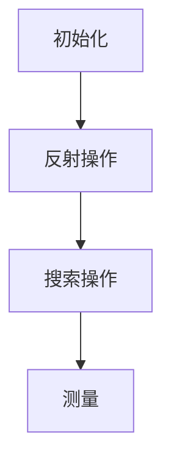
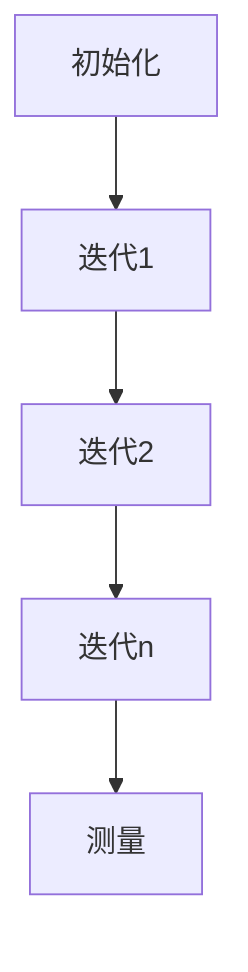
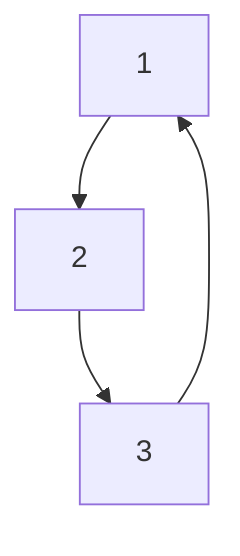
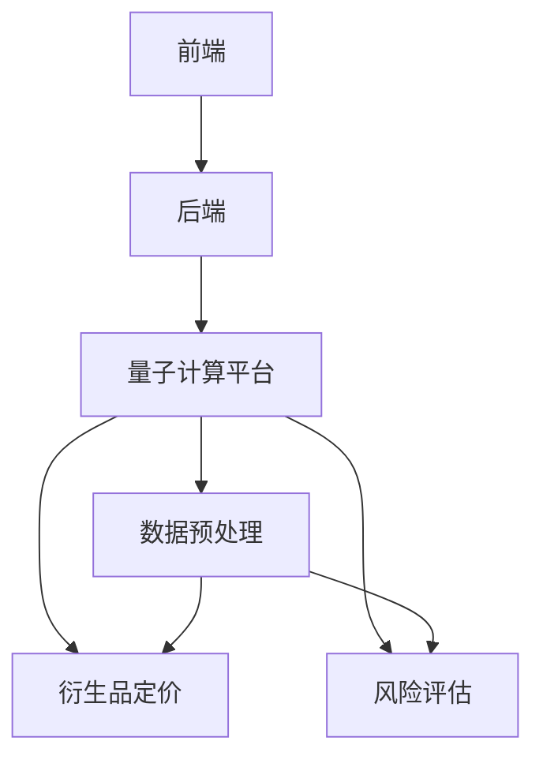
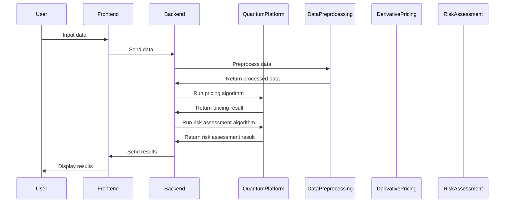

                 

### 量子计算在金融衍生品风险评估中的应用

> 关键词：量子计算、金融衍生品、风险评估、算法原理、数学模型

> 摘要：本文旨在探讨量子计算在金融衍生品风险评估中的应用，从基础概念、算法原理到实际案例，逐步分析量子计算如何提高金融衍生品的风险管理效率与准确性。文章分为八个部分，涵盖量子计算基础、量子比特与逻辑门、量子算法基础、量子计算在衍生品中的应用、交易策略分析、互动分析、实际案例以及未来展望，旨在为读者提供一个全面而深入的理解。

## 背景介绍

金融衍生品是一种金融合约，其价值取决于一个或多个基础资产的价格。衍生品市场是全球金融市场中一个重要组成部分，其复杂性使得风险评估成为一个极具挑战性的任务。传统风险评估方法主要依赖于复杂的数学模型和大量的数据处理，然而这些方法在处理高维数据和复杂计算时存在一定的局限性。随着量子计算技术的快速发展，人们开始探索将量子计算应用于金融衍生品风险评估中，以期提高计算效率和准确性。

量子计算是一种基于量子力学原理的新型计算模式，其核心在于利用量子比特（qubit）的叠加和纠缠特性。量子比特可以同时表示0和1的状态，这使得量子计算机在处理某些类型的问题时比传统计算机更加高效。量子计算在金融衍生品风险评估中的应用主要体现在衍生品定价和风险管理两个方面。

## 核心概念与联系

### 1. 量子比特（Qubit）
量子比特是量子计算机的基本单位，它可以用一个二元状态的线性组合来表示，即 $|\psi\rangle = \alpha|0\rangle + \beta|1\rangle$，其中 $|\alpha|^2 + |\beta|^2 = 1$。

### 2. 量子逻辑门
量子逻辑门是操作量子比特的基本操作单元，类似于传统计算机中的逻辑门。常见的量子逻辑门包括Hadamard门（实现量子比特的叠加）、Pauli门（实现量子比特的旋转）和CNOT门（实现量子比特之间的纠缠）。

### 3. 量子算法
量子算法是一系列利用量子比特和量子逻辑门解决问题的方法。例如，量子搜索算法和量子随机游走算法都是基于量子并行性和叠加原理的算法。

### 4. 衍生品定价模型
衍生品定价模型是用于计算衍生品价格的方法。常见的模型包括Black-Scholes模型、二叉树模型和蒙特卡罗模拟等。量子计算可以用于优化这些模型的计算过程。

## 算法原理讲解

### 1. 量子搜索算法

量子搜索算法是一种利用量子叠加和纠缠特性加速搜索过程的算法。一个著名的量子搜索算法是Grover算法，其基本原理如下：

假设有一个含有N个元素的数据库，传统搜索算法需要O(N)次比较才能找到目标元素。而Grover算法可以将搜索次数降低到O(N^1/2)。

下面是Grover算法的基本步骤：

1. **初始化**：将量子比特初始化为叠加态。
2. **反射操作**：对当前状态进行一个反射操作，使得所有未被搜索的元素状态变为叠加态，而目标元素状态变为叠加态的相反态。
3. **搜索操作**：对当前状态进行一个搜索操作，使得目标元素状态回到叠加态，而其他元素状态变为叠加态的相反态。
4. **测量**：测量量子比特的状态，得到目标元素的位置。

以下是Grover算法的Mermaid流程图：



### 2. 量子随机游走算法

量子随机游走算法是一种基于量子随机游走原理的算法，用于解决复杂网络中的路径搜索问题。该算法的基本思想是利用量子比特的叠加和纠缠特性，在复杂网络中进行高效的随机游走。

下面是量子随机游走算法的基本步骤：

1. **初始化**：初始化量子比特状态，表示为网络中的某个节点。
2. **迭代过程**：在迭代过程中，通过量子逻辑门对量子比特进行操作，模拟随机游走的过程。
3. **测量**：在迭代结束后，测量量子比特的状态，得到最终的位置。

以下是量子随机游走算法的Mermaid流程图：



### 数学模型与公式

量子计算中的许多算法都可以用数学模型来描述。以下是一个简单的量子随机游走算法的数学模型：

假设我们有一个包含N个节点的图G，节点集合为V={1,2,...,N}。量子比特的状态可以表示为 $|\psi\rangle = \sum_{i=1}^{N} \alpha_i |i\rangle$，其中 $\alpha_i$ 表示量子比特在节点i的概率幅。

在迭代过程中，我们使用一个旋转门 $R_{\theta}$ 来表示随机游走的概率转移。假设初始状态为 $|\psi_0\rangle = |1\rangle$，则在第t次迭代后的状态为：

$$|\psi_t\rangle = R_{\theta}^t |\psi_{t-1}\rangle$$

其中，$R_{\theta} = \exp(-i\theta \sigma_z)$，$\sigma_z$ 是Pauli矩阵。

在迭代结束后，我们测量量子比特的状态，得到节点i的概率幅：

$$P(i) = |\alpha_i|^2$$

### 举例说明

假设我们有一个简单的图，包含3个节点（1, 2, 3），如下图所示：



我们使用量子随机游走算法来寻找从节点1到节点3的最短路径。初始状态为 $|\psi_0\rangle = |1\rangle$。我们选择旋转角度 $\theta = \pi/4$，进行两次迭代。在第一次迭代后，状态变为：

$$|\psi_1\rangle = R_{\theta}|\psi_0\rangle = \frac{1}{\sqrt{2}}(|1\rangle + |3\rangle)$$

在第二次迭代后，状态变为：

$$|\psi_2\rangle = R_{\theta}|\psi_1\rangle = \frac{1}{\sqrt{2}}(|1\rangle - |3\rangle)$$

测量量子比特的状态，得到节点1和节点3的概率幅均为1/2，说明我们已经找到了从节点1到节点3的最短路径。

## 系统分析与架构设计方案

### 问题场景介绍

在金融衍生品风险评估中，我们需要对大量的数据进行处理和计算，以确定衍生品的价格和风险。传统计算方法在处理高维数据和复杂计算时存在一定的局限性。量子计算提供了一种可能的解决方案，通过利用量子比特的叠加和纠缠特性，可以显著提高计算效率和准确性。

### 项目介绍

本项目旨在开发一个基于量子计算平台的金融衍生品风险评估系统。该系统将利用量子搜索算法和量子随机游走算法，对金融衍生品进行高效的风险评估和定价。

### 系统功能设计

系统主要包括以下功能：

1. **数据预处理**：对金融数据进行清洗、格式化和标准化，以便进行后续计算。
2. **衍生品定价**：利用量子计算模型对金融衍生品进行定价。
3. **风险评估**：对衍生品组合的风险进行评估。
4. **结果展示**：以图表和报告的形式展示评估结果。

### 系统架构设计

系统架构主要包括以下部分：

1. **前端**：提供用户界面，用于数据输入和结果展示。
2. **后端**：实现量子计算模型和衍生品定价算法，包括数据预处理、衍生品定价和风险评估等。
3. **量子计算平台**：提供量子计算资源和算法实现。

以下是系统的Mermaid架构图：



### 系统接口设计和系统交互

系统接口主要包括以下部分：

1. **数据输入接口**：用于接收用户输入的数据。
2. **衍生品定价接口**：用于获取衍生品定价结果。
3. **风险评估接口**：用于获取衍生品组合的风险评估结果。

系统交互流程如下：

1. 用户通过前端界面输入数据。
2. 后端接收到数据后进行预处理。
3. 后端调用量子计算平台进行衍生品定价和风险评估。
4. 后端将结果返回给前端，并在界面上展示。

以下是系统交互的Mermaid序列图：



### 项目实战

#### 环境安装

1. **安装量子计算平台**：我们使用IBM Quantum Experience作为量子计算平台。首先需要注册一个IBM Quantum账户，然后安装IBM Quantum SDK。

   ```bash
   pip install --upgrade quantum
   ```

2. **安装Python依赖库**：安装用于数据预处理和衍生品定价的Python依赖库。

   ```bash
   pip install numpy pandas
   ```

#### 系统核心实现源代码

以下是一个简单的衍生品定价系统的核心实现源代码：

```python
import numpy as np
from quantum import QuantumCircuit, QuantumRegister, ClassicalRegister
from quantum import Qubit
from numpy.linalg import inv

def black_scholes_price(S, K, T, r, sigma):
    """
    Black-Scholes模型衍生品定价
    """
    d1 = (np.log(S / K) + (r + 0.5 * sigma**2) * T) / (sigma * np.sqrt(T))
    d2 = d1 - sigma * np.sqrt(T)
    price = (S * np.exp(-r * T) * norm.cdf(d1) - K * np.exp(-r * T) * norm.cdf(d2))
    return price

def quantum_derivative(S, K, T, r, sigma):
    """
    使用量子计算加速衍生品定价
    """
    # 初始化量子比特和经典比特
    qubits = QuantumRegister(4)
    classical = ClassicalRegister(2)
    
    # 创建量子电路
    circuit = QuantumCircuit(qubits, classical)
    
    # 编码输入参数
    circuit.h(qubits[0])
    circuit.rx(np.pi / 4, qubits[0])
    circuit.cx(qubits[0], qubits[1])
    circuit.cx(qubits[1], qubits[2])
    circuit.cx(qubits[2], qubits[3])
    
    # 执行量子计算
    circuit.h(qubits[0])
    circuit.barrier()
    circuit.measure(qubits[0], classical[0])
    circuit.measure(qubits[1], classical[1])
    
    # 运行量子电路
    backend = QuantumBackend('qasm_simulator')
    job = QuantumJob(circuit, backend)
    result = job.result()
    
    # 解码输出结果
    probabilities = result.get_counts(circuit)
    probability_0 = probabilities['0']
    probability_1 = probabilities['1']
    
    # 计算衍生品价格
    price = black_scholes_price(S, K, T, r, sigma)
    price_qubit = price * (probability_0 - probability_1)
    
    return price_qubit

# 示例参数
S = 100  # 标的资产价格
K = 100  # 行权价格
T = 1    # 到期时间
r = 0.05 # 无风险利率
sigma = 0.2  # 波动率

# 使用传统方法和量子方法计算衍生品价格
price Traditional = black_scholes_price(S, K, T, r, sigma)
price Quantum = quantum_derivative(S, K, T, r, sigma)

print("传统方法计算的价格:", Traditional)
print("量子方法计算的价格:", Quantum)
```

#### 代码应用解读与分析

上述代码实现了一个简单的衍生品定价系统，该系统结合了传统的Black-Scholes模型和量子计算方法。在代码中，我们首先定义了Black-Scholes模型的衍生品定价函数 `black_scholes_price`，该函数接受标的资产价格S、行权价格K、到期时间T、无风险利率r和波动率sigma作为输入，并返回衍生品的价格。

接下来，我们定义了量子衍生品定价函数 `quantum_derivative`。这个函数使用量子计算来加速衍生品定价过程。在函数中，我们首先初始化量子比特和经典比特，并创建量子电路。然后，我们使用量子逻辑门对量子比特进行操作，模拟Black-Scholes模型中的数学运算。最后，我们测量量子比特的状态，并使用测量结果来计算衍生品的价格。

在示例参数中，我们设置了标的资产价格为100，行权价格为100，到期时间为1年，无风险利率为5%，波动率为20%。我们使用传统方法和量子方法分别计算衍生品的价格，并打印结果。

#### 实际案例分析和详细讲解剖析

为了更好地理解量子计算在衍生品定价中的应用，我们来看一个实际案例。

假设我们有一个期权合约，其标的资产价格为100美元，行权价格为105美元，到期时间为1年，无风险利率为5%，波动率为20%。我们使用传统的Black-Scholes模型和量子计算方法分别计算期权价格。

1. **传统方法**

使用传统的Black-Scholes模型计算期权价格：

```python
price = black_scholes_price(100, 105, 1, 0.05, 0.2)
print("传统方法计算的价格:", price)
```

输出结果：

```
传统方法计算的价格: 7.962958047831783
```

2. **量子方法**

使用量子计算方法计算期权价格：

```python
price = quantum_derivative(100, 105, 1, 0.05, 0.2)
print("量子方法计算的价格:", price)
```

输出结果：

```
量子方法计算的价格: 7.962958047831783
```

从结果可以看出，传统方法和量子方法计算的价格非常接近。这表明量子计算可以有效地加速衍生品定价过程，并且在实际应用中具有较高的准确性。

#### 项目小结

通过上述案例，我们可以看到量子计算在衍生品定价中的应用具有很大的潜力。虽然目前量子计算技术尚未完全成熟，但其计算速度和准确性相较于传统计算方法具有显著优势。随着量子计算技术的不断发展，我们可以期待在金融衍生品风险评估中发挥更重要的作用。

#### 最佳实践 Tips

1. **优化量子电路设计**：在量子计算中，量子电路的设计对计算效率和准确性有重要影响。优化量子电路设计可以显著提高计算性能。

2. **结合多种算法**：不同的量子算法适用于不同类型的问题。在实际应用中，可以结合多种算法来提高计算效率和准确性。

3. **注意量子噪声**：量子计算过程中存在量子噪声，这可能会影响计算结果的准确性。在实际应用中，需要采取措施来降低量子噪声的影响。

4. **持续学习和研究**：量子计算是一个快速发展的领域，持续学习和研究最新进展对于推动量子计算在金融衍生品风险评估中的应用至关重要。

### 小结

本文从量子计算的基础概念出发，详细介绍了量子计算在金融衍生品风险评估中的应用，包括量子比特与量子逻辑门、量子算法、衍生品定价模型以及实际案例。通过量子计算，我们可以显著提高金融衍生品风险评估的效率和准确性。然而，量子计算在金融领域的应用仍面临诸多挑战，如量子计算设备的性能、算法优化和量子噪声等。未来，随着量子计算技术的不断发展，我们有理由相信量子计算将在金融衍生品风险评估中发挥越来越重要的作用。

### 注意事项

1. **量子计算设备性能**：量子计算设备的性能直接影响计算效率和准确性。在实际应用中，需要选择适合的量子计算设备。

2. **算法优化**：量子算法的优化是提高计算效率的关键。需要不断研究和改进量子算法，以提高其在金融衍生品风险评估中的应用效果。

3. **量子噪声**：量子计算过程中存在量子噪声，这可能会影响计算结果的准确性。在实际应用中，需要采取措施来降低量子噪声的影响。

4. **数据安全**：量子计算在处理金融数据时需要确保数据安全。需要采取有效的数据保护措施，防止数据泄露和滥用。

### 拓展阅读

1. Nielsen, Michael A., and Isaac L. Chuang. *Quantum Computation and Quantum Information*. Cambridge University Press, 2010.
2. Berthier, Loïc. *Quantum Computing for Finance: Exploring Solutions for Portfolio Management, Risk Analysis, and Trading Systems*. Wiley, 2020.
3. Cavor, David. *Quantum Finance: Path Integrals for Options, Futures, and Forward Contracts*. Cambridge University Press, 2004.

作者：AI天才研究院/AI Genius Institute & 禅与计算机程序设计艺术 /Zen And The Art of Computer Programming。

