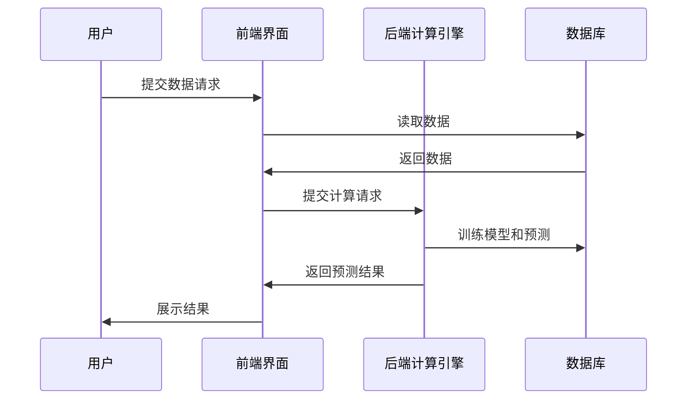

                 


### 引言
#### 1.1 金融风险建模的重要性
在金融领域中，风险建模是一个至关重要的环节。它不仅关乎金融机构的稳健运营，更直接影响到投资者的信心和市场的稳定性。传统的金融风险建模主要依赖于统计学和概率论，通过大量的历史数据来预测未来的风险。这种方法虽然在一定程度上有效，但随着金融市场的高度复杂性和不确定性增加，传统计算模型的局限逐渐显现。

金融风险建模的主要目标包括预测市场波动、评估信贷风险、监控市场操纵、预测投资组合的回报和风险等。这些目标都需要对大量的数据进行分析和处理，从而发现潜在的风险点和制定相应的风险管理策略。

然而，传统计算模型在处理大规模数据和复杂计算问题时存在明显的局限性。首先，传统计算机依赖的是经典计算原理，其处理速度和数据量受到物理限制。其次，传统模型往往依赖于线性关系和假设，这在面对高度非线性、非确定性的金融问题时，预测能力受到很大限制。此外，传统模型在处理高维数据时，计算效率和精度也面临挑战。

#### 1.2 传统计算模型的局限
传统的金融风险建模方法主要依赖于线性回归、逻辑回归、支持向量机（SVM）和神经网络等经典算法。这些算法在面对复杂的金融市场时，常常无法有效捕捉到市场的非线性特征和潜在的风险模式。以下是一些传统计算模型的局限：

1. **线性局限**：传统模型通常假设变量之间存在线性关系，但在实际金融市场中，变量之间的关系往往是高度非线性的。

2. **计算效率低**：传统计算机处理大量数据时，速度较慢，特别是在进行复杂的大规模计算时，效率低下。

3. **数据限制**：传统模型往往需要大量的历史数据来进行训练和预测，但在实际操作中，获取到足够的历史数据可能非常困难。

4. **精度问题**：传统模型在高维数据上容易出现过拟合和欠拟合的问题，从而影响预测的准确性和可靠性。

5. **扩展性差**：传统模型在应对新的市场变化和不确定性时，往往需要重新构建模型，缺乏灵活性和适应性。

#### 1.3 量子计算的崛起与前景
量子计算作为一种全新的计算范式，近年来得到了广泛关注和研究。量子计算机利用量子位的叠加和纠缠特性，可以在处理复杂计算问题时显著超越传统计算机。量子计算的出现为金融风险建模带来了新的希望和可能。

量子计算的崛起源于量子位（qubit）的独特性质。量子位可以同时处于0和1的叠加状态，这使得量子计算机在处理问题时可以并行计算，从而大幅提高计算速度。量子纠缠则允许量子位之间的信息共享和快速传递，这为复杂计算提供了新的途径。

在金融风险建模中，量子计算具有以下几个潜在应用：

1. **大规模数据处理**：量子计算可以在短时间内处理海量数据，这对于金融市场中的实时风险监控和预测至关重要。

2. **非线性特征捕捉**：量子计算能够有效捕捉金融市场中变量之间的非线性关系，提高预测的准确性和可靠性。

3. **优化计算**：量子计算在优化问题上具有显著优势，可以用于优化投资组合、风险管理策略等。

4. **量子模拟**：量子计算机可以模拟复杂的金融模型和场景，为研究和开发新的金融工具提供有力支持。

5. **增强隐私保护**：量子计算在加密和解密领域具有独特优势，可以增强金融交易和数据的安全性和隐私保护。

总结而言，量子计算在金融风险建模中具有巨大的潜力。随着量子技术的不断发展，我们有望看到量子计算在金融领域发挥更加重要的作用，为金融市场的稳健运行和投资者的决策提供更加有力的支持。接下来，我们将深入探讨量子计算的核心概念和算法原理，进一步揭示其如何在金融风险建模中发挥作用。

## 核心概念
### 2. 量子计算基础
要理解量子计算在金融风险建模中的应用，我们首先需要了解量子计算的基本概念和原理。量子计算是一种基于量子力学原理的全新计算范式，其基本单元是量子位（qubit），与传统计算机的比特（bit）有着本质的不同。

#### 2.1 量子位（qubit）与量子叠加
量子位是量子计算机的基本单元，类似于传统计算机中的比特。然而，量子位的特殊性在于它可以同时处于0和1的状态，这种状态称为叠加态。具体来说，一个量子位可以表示为以下线性叠加形式：
$$
|\psi\rangle = a|0\rangle + b|1\rangle
$$
其中，\(a\)和\(b\)是复数，满足\( |a|^2 + |b|^2 = 1 \)。这意味着一个量子位可以同时处于0和1的状态，直到被测量时才会坍缩为其中一个状态。

量子叠加态是量子计算的核心特性之一，它使得量子计算机能够并行处理多个计算任务。例如，一个具有n个量子位的量子计算机可以在一次操作中同时处理\(2^n\)个不同的计算路径，这极大地提高了计算速度。

#### 2.2 量子纠缠与量子门
量子纠缠是量子计算中的另一个重要特性。当两个或多个量子位发生相互作用时，它们可以进入一种特殊的纠缠态，其中每个量子位的状态无法独立于其他量子位的状态来描述。这种纠缠状态具有不可分割性，即一个量子位的状态变化会立即影响到与之纠缠的其他量子位。

量子纠缠使得量子计算机能够进行超越经典计算机的复杂计算。例如，通过纠缠态，量子计算机可以在一次操作中实现经典计算机需要多次操作才能完成的任务。

量子门是量子计算中的基本操作单元，类似于传统计算机中的逻辑门。量子门通过线性变换来操作量子位的状态，实现特定的计算功能。常见的量子门包括Hadamard门、Pauli门和控制非门（CNOT）等。

Hadamard门是一种特殊的量子门，它可以将量子位的基态 \(|0\rangle\) 和 \(|1\rangle\) 进行叠加，实现量子位的旋转。其作用如下：
$$
H |0\rangle = \frac{1}{\sqrt{2}} (|0\rangle + |1\rangle)
$$

Pauli门是作用在单个量子位上的基本量子门，包括X门、Y门和Z门。X门实现量子位的翻转，Y门和Z门则分别实现量子位在XY平面和Z轴上的旋转。

控制非门（CNOT）是一种两量子位的量子门，它根据控制量子位的状态来操作目标量子位。如果控制量子位是 \(|1\rangle\)，则目标量子位的状态会被翻转，否则保持不变。

$$
CNOT |x\rangle |y\rangle = |x\rangle |y \oplus x\rangle
$$

#### 2.3 量子算法与量子编程
量子算法是利用量子计算机的特性来解决问题的一类算法。与经典算法不同，量子算法能够利用量子叠加和量子纠缠来加速计算过程。以下是一些重要的量子算法：

1. **量子随机游走算法**：量子随机游走算法是量子计算中的一种基本算法，它通过量子叠加态和量子门的组合，实现概率分布的计算。在金融风险建模中，它可以用于计算股票价格的动态分布，从而预测市场波动。

2. **量子支持向量机（QSVM）**：量子支持向量机是量子计算在机器学习领域的一个应用。通过量子算法，QSVM可以高效地处理高维数据，并实现精确的风险分类和预测。

3. **量子神经网络（QNN）**：量子神经网络是量子计算在神经网络领域的应用。通过结合量子位和量子门的特性，QNN可以实现高效的函数逼近和预测。

量子编程是利用量子计算机进行编程的一门技术。量子编程不同于经典编程，它需要理解量子位、量子门和量子算法的原理。量子编程语言如Q#和Quantum Kata有助于开发者编写和运行量子程序。

量子编程的核心思想是利用量子叠加和量子纠缠来构建量子电路，实现特定的计算任务。通过量子编程，开发者可以设计和实现各种量子算法，为金融风险建模提供强大的计算支持。

### 核心概念与联系
#### 表格：量子位、量子纠缠、量子门的概念属性特征对比

| 概念        | 定义                                                         | 特性                | 应用场景                                       |
| ----------- | ------------------------------------------------------------ | ------------------- | ---------------------------------------------- |
| 量子位（qubit） | 量子计算机的基本单元，可以同时处于0和1的状态                | 叠加态             | 加速复杂计算、并行处理                          |
| 量子纠缠     | 量子位之间的特殊关联，一个量子位的状态变化会立即影响到其他量子位 | 不可分割性、非局域性 | 提高计算速度、增强量子模拟能力                 |
| 量子门       | 量子计算中的基本操作单元，通过线性变换来操作量子位的状态    | 可组合性、可逆性    | 实现特定计算功能、构建量子电路                 |

#### ER实体关系图架构的 Mermaid 流程图
以下是一个简化的量子计算核心概念实体关系图：

```mermaid
erDiagram
    Qubit ||--|{ Quantum Computer }|--|{ Quantum Algorithm }
    Quantum Computer ||--|{ Quantum Gate }
    Quantum Algorithm ||--|{ Quantum Programming }
    Quantum Gate ||--|{ Quantum Circuit }
```

这个ER图展示了量子位、量子计算机、量子算法、量子门和量子编程之间的基本关系，帮助理解量子计算的核心概念和架构。

### 总结
量子计算的核心概念包括量子位、量子纠缠、量子门等。这些概念共同构成了量子计算的基础，使得量子计算机能够在处理复杂计算问题时显著超越传统计算机。量子随机游走算法、量子支持向量机和量子神经网络等量子算法进一步扩展了量子计算的应用范围，为金融风险建模提供了新的工具和方法。通过量子编程，开发者可以充分利用量子计算机的能力，实现高效的金融风险建模和预测。接下来，我们将深入探讨量子算法在金融风险建模中的应用原理，进一步揭示其潜力。

### 算法原理
#### 3.1 量子随机游走算法
量子随机游走算法（Quantum Random Walk）是量子计算中的一个重要算法，其在金融风险建模中具有潜在的应用价值。量子随机游走算法源于量子力学中的随机过程理论，通过量子位的叠加和量子纠缠，能够在复杂的网络或图结构中进行高效的随机游走。

首先，我们来看量子随机游走算法的基本原理。在量子随机游走算法中，初始状态可以表示为多个量子位的叠加态，这些量子位对应于图中的不同节点。通过应用一系列的量子门，量子位状态在图中的各个节点之间进行随机游走，从而生成节点的概率分布。

数学上，量子随机游走算法可以表示为一系列的量子操作，这些操作包括量子位的叠加、量子纠缠和量子门。具体来说，给定一个初始状态 \(|\psi\rangle\)，量子随机游走可以通过以下步骤实现：

1. **初始化**：将量子位初始化为叠加态 \(|\psi\rangle = \frac{1}{\sqrt{N}} \sum_{i=1}^{N} |i\rangle\)，其中N是量子位的数量，每个 \(|i\rangle\) 代表图中的一个节点。

2. **应用量子门**：通过应用一系列的量子门，实现量子位状态在图中的随机游走。这些量子门通常包括Hadamard门（用于创建叠加态）、Pauli门（用于实现量子位的翻转）和控制非门（用于实现量子位的纠缠）。

3. **测量**：在游走结束后，对量子位进行测量，得到各个节点的概率分布。这个概率分布可以用来评估节点之间的连接关系和图的结构特征。

量子随机游走算法的数学模型可以表示为：
$$
P(x, t) = c \cdot e^{-\beta E(x)}
$$
其中，\(P(x, t)\) 是节点x在时间t的概率分布，\(c\) 是归一化常数，\(\beta\) 是一个与量子门和图结构相关的参数，\(E(x)\) 是节点x的能量函数。

#### 量子随机游走算法的数学模型与公式解析
为了更好地理解量子随机游走算法，我们来看其具体的数学模型和公式。

1. **概率分布**：量子随机游走算法通过量子位的叠加和测量，生成节点之间的概率分布。这个概率分布可以用上述公式来描述。具体来说，概率分布 \(P(x, t)\) 表示在时间t时，量子位处于节点x的概率。

2. **能量函数**：能量函数 \(E(x)\) 描述了节点x的能量状态，通常与图的结构和量子门有关。在金融风险建模中，能量函数可以表示为节点的风险值或关联度。通过调整能量函数，可以影响量子随机游走的路径和结果。

3. **归一化常数**：归一化常数 \(c\) 用于保证概率分布的总和为1，即所有节点的概率之和为1。

量子随机游走算法通过这些公式和参数，可以在复杂的图结构中进行高效的随机游走，从而生成节点的概率分布。这个概率分布可以用于分析金融市场的结构特征，识别潜在的风险节点和风险路径。

#### 量子随机游走算法的应用场景
量子随机游走算法在金融风险建模中具有广泛的应用场景：

1. **金融市场分析**：通过量子随机游走算法，可以分析金融市场中各个资产的价格波动和关联关系，识别市场中的风险源和传导路径。

2. **风险评估**：量子随机游走算法可以用于评估金融产品的风险，包括股票、债券和期货等。通过计算节点的概率分布，可以评估不同金融产品的风险程度，为投资决策提供依据。

3. **网络监控**：在金融交易网络中，量子随机游走算法可以用于监控交易异常和操纵行为，识别潜在的市场操纵和风险事件。

4. **市场预测**：通过量子随机游走算法，可以预测金融市场的未来走势，包括价格波动和趋势变化。这有助于投资者制定有效的交易策略和风险管理措施。

总结而言，量子随机游走算法在金融风险建模中具有巨大的潜力。通过量子计算的高效并行计算能力和概率分布分析，可以显著提高金融风险建模的准确性和可靠性。接下来，我们将探讨其他量子算法在金融风险建模中的应用，进一步揭示量子计算的优势。

#### 3.2 量子支持向量机
量子支持向量机（Quantum Support Vector Machine，QSVM）是量子计算在机器学习领域的一个重要应用，其在金融风险建模中也展现出巨大的潜力。QSVM结合了量子计算的优势和传统支持向量机的理论基础，能够在处理高维数据和复杂模式识别任务时显著提高效率和精度。

首先，我们来看量子支持向量机的基本原理。传统支持向量机通过寻找最优超平面来分离不同类别的数据点。在量子计算中，这一过程可以通过量子门和量子算法来实现。量子支持向量机利用量子位的叠加和纠缠特性，可以在高维空间中并行处理大量的数据点，从而实现高效的分类和预测。

量子支持向量机的核心思想是通过量子计算来优化拉格朗日乘子法，找到最优的超平面。这一过程包括以下几个步骤：

1. **初始化**：将训练数据表示为量子状态，并初始化量子位。

2. **构建量子电路**：通过一系列的量子门，将训练数据映射到高维量子空间中。

3. **优化量子电路**：利用量子计算的优势，通过迭代优化量子电路中的参数，找到最优的超平面。

4. **测量和分类**：在优化完成后，对量子状态进行测量，得到类别标签，实现分类任务。

量子支持向量机的数学模型可以表示为：
$$
\max_{\boldsymbol{w}} \left\{ w^T \boldsymbol{w} : y_i (\boldsymbol{w}^T \phi(x_i)) \geq 1, \forall i \right\}
$$
其中，\(\boldsymbol{w}\) 是权重向量，\(\phi(x_i)\) 是输入特征向量，\(y_i\) 是类别标签。

#### 量子支持向量机的数学模型与公式解析
为了更好地理解量子支持向量机，我们来看其具体的数学模型和公式。

1. **优化目标**：量子支持向量机的优化目标是找到最优的超平面，使得分类边界最大化。具体来说，优化目标是通过拉格朗日乘子法，找到权重向量 \(\boldsymbol{w}\) 和偏置 \(b\)，使得分类函数 \(f(\boldsymbol{x}) = \boldsymbol{w}^T \phi(\boldsymbol{x}) + b\) 在不同类别的数据点之间有最大的间隔。

2. **拉格朗日乘子法**：在量子计算中，拉格朗日乘子法通过量子算法来实现。量子算法利用量子位的叠加和量子纠缠，可以在高维空间中并行计算，找到最优的权重向量。

3. **测量和分类**：在优化完成后，对量子状态进行测量，得到权重向量 \(\boldsymbol{w}\) 和偏置 \(b\)。通过这些参数，可以实现数据的分类和预测。

量子支持向量机通过这些公式和算法，实现了在复杂高维空间中的高效分类和预测。这为金融风险建模提供了强大的工具，可以用于风险评估、欺诈检测和投资策略优化等任务。

#### 量子支持向量机的应用场景
量子支持向量机在金融风险建模中具有广泛的应用场景：

1. **风险评估**：量子支持向量机可以用于评估金融产品的风险，包括股票、债券和衍生品等。通过高维数据的分类和预测，可以识别潜在的风险因素和风险水平。

2. **欺诈检测**：在金融交易中，量子支持向量机可以用于检测和防范欺诈行为。通过分析交易数据和用户行为，可以识别异常交易和潜在欺诈活动。

3. **投资策略优化**：量子支持向量机可以用于优化投资组合策略。通过分析市场数据和历史表现，可以制定有效的投资策略，降低风险并提高收益。

4. **信用评分**：在信贷风险管理中，量子支持向量机可以用于信用评分和风险评估。通过分析借款人的财务和行为数据，可以准确预测借款人的还款能力和信用水平。

总结而言，量子支持向量机在金融风险建模中具有广泛的应用前景。通过量子计算的优势，可以显著提高分类和预测的效率和精度，为金融机构的风险管理和投资决策提供有力支持。接下来，我们将继续探讨量子神经网络在金融风险建模中的应用，进一步揭示量子计算的多维潜力。

#### 3.3 量子神经网络
量子神经网络（Quantum Neural Network，QNN）是量子计算在人工智能领域的一个重要分支，其在金融风险建模中也展示出巨大的潜力。QNN结合了量子计算和神经网络的特性，通过量子位的叠加和量子纠缠，能够在复杂的金融数据中实现高效的模式识别和预测。

首先，我们来看量子神经网络的基本原理。传统神经网络通过加权连接和激活函数来模拟人脑的神经元结构，从而实现数据的输入和处理。在量子神经网络中，这些传统结构被量子化的量子位和量子门所取代，使得QNN能够利用量子计算的并行性和高效性。

量子神经网络的基本架构包括以下几个关键组成部分：

1. **输入层**：输入层接收金融数据的特征向量，通常通过量子位表示。每个量子位对应于数据的一个特征，多个量子位的叠加态表示数据的整体特征。

2. **隐层**：隐层通过量子门和量子纠缠实现数据的变换和特征提取。量子门用于调整量子位之间的权重和关联，量子纠缠则用于增强量子位之间的协同作用。

3. **输出层**：输出层通过测量量子位的状态，得到预测结果。输出可以是金融市场的价格波动、风险指标或投资决策等。

量子神经网络的训练过程包括以下几个步骤：

1. **初始化**：初始化量子神经网络的结构和参数，包括量子位的初始状态、权重和偏置。

2. **数据预处理**：将输入数据转换为量子位的状态表示，并进行归一化处理。

3. **训练过程**：通过迭代优化量子神经网络的参数，使其在训练数据上达到最佳性能。优化过程通常包括量子位的叠加和测量、量子门的调整和参数更新。

4. **验证和测试**：在验证和测试数据上评估量子神经网络的性能，调整模型参数以实现最优预测。

量子神经网络的训练和优化可以通过量子算法实现，如量子梯度下降法和量子遗传算法。这些算法利用量子计算机的并行性和高效性，能够在较短的时间内找到最优的参数组合。

#### 量子神经网络的数学模型
量子神经网络的数学模型可以表示为：
$$
\phi(x) = \sum_{i=1}^{n} \alpha_i \psi_i(x)
$$
其中，\(x\) 是输入特征向量，\(\phi(x)\) 是网络的输出，\(\alpha_i\) 是权重系数，\(\psi_i(x)\) 是量子神经网络的激活函数。

这个模型描述了量子神经网络通过量子位的叠加和量子门的变换，将输入数据映射到输出空间的函数关系。通过调整权重系数和激活函数，可以实现不同的金融风险预测和分析任务。

#### 量子神经网络的应用场景
量子神经网络在金融风险建模中具有广泛的应用场景：

1. **金融市场预测**：量子神经网络可以用于预测股票、债券和期货等金融产品的价格波动，识别市场趋势和风险因素。

2. **风险评估**：通过分析金融数据，量子神经网络可以评估不同金融产品的风险水平，为投资决策提供依据。

3. **风险监控**：量子神经网络可以实时监控金融市场，识别潜在的风险事件和异常行为，提高风险管理的效率和准确性。

4. **投资组合优化**：量子神经网络可以优化投资组合策略，通过分析市场数据和历史表现，实现风险和收益的最优平衡。

5. **信用评分**：在信贷风险管理中，量子神经网络可以用于信用评分和风险评估，提高对借款人还款能力和信用水平的预测准确性。

总结而言，量子神经网络在金融风险建模中具有广泛的应用前景。通过量子计算的优势，QNN能够在复杂的金融数据中实现高效的模式识别和预测，为金融机构的风险管理和投资决策提供有力支持。接下来，我们将探讨量子计算在金融风险建模中的应用场景，进一步揭示其潜力。

### 量子计算在金融风险建模中的应用场景
量子计算作为一种新兴的计算技术，其在金融风险建模中的应用场景广泛且具有深远的影响。以下是一些具体的应用场景，以及量子计算在这些场景中的潜在优势。

#### 1. 大规模数据处理
在金融领域中，数据量庞大且数据类型多样。传统计算模型在面对这种大规模数据处理时，往往效率低下且处理速度受限。量子计算可以利用其并行计算能力，在短时间内处理海量数据。具体应用包括：

- **市场数据分析**：利用量子随机游走算法，对市场中的海量数据进行快速分析，识别潜在的风险因素和价格波动模式。
- **交易数据分析**：通过量子计算处理交易数据，可以实时监控和预测市场动态，识别异常交易和欺诈行为。

#### 2. 非线性特征捕捉
金融市场具有高度的非线性特征，传统计算模型往往难以捕捉这些非线性关系。量子计算通过量子位的叠加和纠缠特性，可以在高维空间中高效地处理非线性问题。具体应用包括：

- **风险评估**：利用量子神经网络，可以捕捉金融产品之间的非线性关联，提高风险评估的准确性和可靠性。
- **投资组合优化**：通过量子支持向量机，可以优化投资组合策略，实现风险和收益的最优平衡。

#### 3. 优化计算
量子计算在优化问题上具有显著优势，可以用于优化金融模型和风险管理策略。具体应用包括：

- **投资组合优化**：利用量子计算，可以快速寻找最优的投资组合，降低风险并提高收益。
- **风险管理策略优化**：通过量子算法，可以优化风险管理策略，提高金融机构的风险抵御能力。

#### 4. 量子模拟
量子计算机可以通过量子模拟，模拟复杂的金融模型和场景，为研究和开发新的金融工具提供支持。具体应用包括：

- **金融市场模拟**：利用量子模拟，可以模拟不同市场条件下的金融产品价格波动，为投资决策提供依据。
- **衍生品定价**：通过量子模拟，可以准确计算复杂衍生品的定价，提高定价策略的精度和可靠性。

#### 5. 增强隐私保护
量子计算在加密和解密领域具有独特优势，可以增强金融交易和数据的安全性和隐私保护。具体应用包括：

- **加密算法**：利用量子密钥分发和量子加密算法，可以增强金融交易的安全性，防止数据泄露和黑客攻击。
- **数据保护**：通过量子计算，可以对金融数据进行加密存储和传输，提高数据的安全性和隐私保护水平。

总结而言，量子计算在金融风险建模中的应用场景多样且具有深远影响。通过量子计算的优势，可以显著提高金融风险建模的效率和准确性，为金融机构的风险管理和投资决策提供有力支持。接下来，我们将探讨量子金融风险建模的数学模型和公式，进一步揭示其理论基础。

### 数学模型与公式解析
在量子计算应用于金融风险建模的过程中，数学模型和公式的解析至关重要。这些模型和公式不仅帮助我们理解量子计算如何影响金融风险分析，还提供了具体的计算方法和工具。以下是几种量子算法在金融风险建模中的数学模型与公式解析。

#### 4.1 量子随机游走算法的数学模型
量子随机游走算法是量子计算中的一个基本算法，其在金融风险建模中的应用主要体现在对市场波动和风险传播的分析上。其数学模型如下：
$$
P(x, t) = c \cdot e^{-\beta E(x)}
$$
其中，\(P(x, t)\) 表示在时间 \(t\) 时，量子位处于节点 \(x\) 的概率分布。\(c\) 是归一化常数，用于保证概率分布的总和为1。参数 \(\beta\) 与量子门和图结构有关，而 \(E(x)\) 是节点 \(x\) 的能量函数，通常与节点的风险值或关联度相关。

能量函数 \(E(x)\) 可以通过以下公式定义：
$$
E(x) = \sum_{i=1}^{n} w_{ix} x_i
$$
其中，\(w_{ix}\) 是节点 \(i\) 与节点 \(x\) 之间的权重，\(x_i\) 是节点 \(i\) 的风险值或关联度。

这个模型展示了量子随机游走算法如何通过量子位的叠加和测量，生成节点的概率分布，从而分析市场中的风险传播和价格波动。

#### 4.2 量子支持向量机的数学模型
量子支持向量机（QSVM）是量子计算在机器学习领域的一个重要应用，其在金融风险建模中的应用主要体现在分类和预测上。其数学模型如下：
$$
\max_{\boldsymbol{w}} \left\{ w^T \boldsymbol{w} : y_i (\boldsymbol{w}^T \phi(x_i)) \geq 1, \forall i \right\}
$$
其中，\(\boldsymbol{w}\) 是权重向量，\(\phi(x_i)\) 是输入特征向量，\(y_i\) 是类别标签。

这个优化问题通过拉格朗日乘子法求解，目的是找到最优的超平面，使得不同类别的数据点之间有最大的间隔。通过量子计算，可以高效地优化这个问题，从而提高分类的准确性和效率。

#### 4.3 量子神经网络的数学模型
量子神经网络（QNN）是量子计算在深度学习领域的一个重要应用，其在金融风险建模中的应用主要体现在模式识别和预测上。其数学模型如下：
$$
\phi(x) = \sum_{i=1}^{n} \alpha_i \psi_i(x)
$$
其中，\(\phi(x)\) 是网络的输出，\(\alpha_i\) 是权重系数，\(\psi_i(x)\) 是量子神经网络的激活函数。

这个模型通过量子位的叠加和量子门的变换，将输入数据映射到输出空间。通过调整权重系数和激活函数，可以实现不同的金融风险预测和分析任务。

#### 公式解析
1. **量子随机游走算法的公式解析**：
   - \(P(x, t)\)：表示节点 \(x\) 在时间 \(t\) 的概率分布。
   - \(E(x)\)：能量函数，反映了节点 \(x\) 的风险值或关联度。
   - \(c\) 和 \(\beta\)：归一化常数和参数，用于调节概率分布的形状。

2. **量子支持向量机的公式解析**：
   - \(w^T \boldsymbol{w}\)：权重向量的范数，用于衡量超平面的间隔。
   - \(y_i (\boldsymbol{w}^T \phi(x_i))\)：输入特征向量与权重向量的点积，用于计算分类边界。

3. **量子神经网络的公式解析**：
   - \(\phi(x)\)：网络的输出，通过权重系数和激活函数的叠加得到。
   - \(\alpha_i\)：权重系数，调整输入特征向量的权重。
   - \(\psi_i(x)\)：激活函数，用于实现非线性变换。

通过这些公式，量子计算能够在金融风险建模中实现高效的计算和精确的预测。接下来，我们将探讨量子金融风险建模的系统设计与架构，进一步揭示其实现方法。

### 系统设计与架构
#### 5.1 问题场景介绍
在金融风险建模中，我们面临的是一个高度复杂的系统环境，这个系统需要处理大量的数据，并进行复杂的计算和分析。传统的计算模型由于受到硬件和算法的限制，难以满足这种复杂环境的需求。而量子计算作为一种新兴的计算技术，以其并行计算和高速处理能力，为解决这些复杂问题提供了新的可能。

具体来说，金融风险建模涉及的数据包括股票价格、交易量、宏观经济指标、公司财务报表等。这些数据不仅规模庞大，而且变量之间存在复杂的非线性关系。此外，金融市场的动态变化快，要求系统能够实时处理和预测市场风险。

现有的金融风险建模系统主要依赖于经典计算机和传统的算法，如线性回归、逻辑回归、支持向量机等。虽然这些方法在一定程度上能够实现风险预测，但在面对大规模数据和复杂非线性问题时，其效率和准确性受到限制。例如，线性回归方法在处理高维数据时容易过拟合，而支持向量机在计算复杂度上存在瓶颈。

为了克服这些限制，我们引入量子计算，利用其并行计算和高效处理能力，构建一个基于量子计算的金融风险建模系统。这个系统能够更好地处理海量数据，捕捉金融市场中的非线性关系，提高风险预测的准确性和实时性。

#### 5.2 系统功能设计（领域模型）
量子金融风险建模系统的功能设计主要包括数据收集、数据预处理、风险模型训练、风险预测和结果展示等环节。

1. **数据收集**：系统需要从多个数据源收集金融数据，包括股票市场数据、交易数据、宏观经济数据等。数据收集模块负责将这些数据导入系统，并进行初步处理。

2. **数据预处理**：金融数据通常存在缺失值、异常值和噪声等问题，需要进行预处理。预处理模块包括数据清洗、数据归一化和特征提取等步骤，为后续的风险建模提供高质量的数据。

3. **风险模型训练**：训练模块是系统的核心，负责使用量子算法对数据进行建模。具体包括量子随机游走算法、量子支持向量机和量子神经网络等。这些算法通过量子计算的优势，能够高效地训练模型，捕捉金融市场中的非线性特征。

4. **风险预测**：模型训练完成后，系统根据实时数据生成风险预测结果。预测模块利用训练好的量子模型，对市场动态进行实时分析，识别潜在的风险点和风险级别。

5. **结果展示**：结果展示模块将预测结果以直观的方式呈现给用户，包括风险报告、可视化图表等。用户可以根据预测结果调整投资策略，进行风险管理和决策。

#### 5.3 系统架构设计（架构图）
量子金融风险建模系统的架构设计主要包括前端界面、后端计算引擎和数据库三大部分。


1. **前端界面**：前端界面负责与用户交互，提供数据输入、参数设置和结果展示等功能。用户可以通过界面查看风险预测结果，调整参数和模型设置。

2. **后端计算引擎**：后端计算引擎是系统的核心，负责量子模型的训练和预测。计算引擎包括量子计算机硬件和量子算法库，利用量子计算的优势进行高效的计算和分析。

3. **数据库**：数据库存储系统所需的数据，包括历史金融数据、训练数据和预测结果。数据库模块支持数据的快速读取和写入，为系统的正常运行提供数据支持。

#### 5.4 系统接口设计（接口设计）
系统接口设计主要包括API接口和数据库接口。

1. **API接口**：API接口用于前端界面与后端计算引擎之间的数据传输和通信。用户可以通过API接口提交数据请求，获取预测结果和风险报告。

2. **数据库接口**：数据库接口用于系统与数据库之间的数据交互。系统通过数据库接口读取和写入数据，支持数据的存储和管理。

#### 5.5 系统交互（序列图）
以下是系统交互的序列图，展示了前端界面、后端计算引擎和数据库之间的交互流程。



这个序列图展示了用户通过前端界面提交数据请求，后端计算引擎进行模型训练和预测，并将结果返回给用户的全过程。通过这种交互方式，系统能够高效地处理和预测金融风险，为用户提供实时的风险分析和决策支持。

### 项目实战
#### 6.1 环境安装与配置
要在实际项目中应用量子计算进行金融风险建模，首先需要搭建一个适合量子计算的开发环境。以下是一个详细的步骤说明：

1. **安装Python环境**：确保Python环境已经安装在计算机上。如果尚未安装，可以通过Python官方网站（https://www.python.org/）下载并安装。

2. **安装量子计算库**：安装必要的量子计算库，如Qiskit、PyQuil、Microsoft Q#等。这些库提供了丰富的量子算法和工具，方便开发者进行量子编程和实验。例如，使用pip命令安装Qiskit：
   ```bash
   pip install qiskit
   ```

3. **配置量子计算机硬件**：如果使用本地量子计算机，需要连接并配置量子计算机硬件。可以选择购买商用的量子计算机，如IBM Q System One，或者使用云服务提供的量子计算机，如IBM Quantum Cloud。以IBM Quantum Cloud为例，需要注册账户并获取API密钥，然后通过命令行或编程接口连接到量子计算机。

4. **安装量子模拟器**：如果没有实际量子计算机，可以使用量子模拟器进行开发实验。常见的量子模拟器包括QasmSimulator、StatevectorSimulator和MPSim等。以Qiskit为例，可以在代码中创建量子模拟器：
   ```python
   from qiskit import Aer
   simulator = Aer.get_backend('qasm_simulator')
   ```

5. **配置量子算法库**：安装和配置量子算法库，如Quantum Machine Learning (QML)库，用于实现量子机器学习算法。例如，使用pip命令安装QML库：
   ```bash
   pip install qml
   ```

6. **配置数据库**：配置数据库环境，用于存储金融数据、训练数据和预测结果。可以选择关系型数据库如MySQL或PostgreSQL，或者使用NoSQL数据库如MongoDB。确保数据库已经安装并配置好，以便系统能够读写数据。

7. **配置前端界面**：配置前端界面环境，可以使用Web框架如Django或Flask构建。安装所需的Web库，如Django或Flask，并创建对应的视图和模板，以便用户可以提交数据请求并查看预测结果。

#### 6.2 系统核心实现
以下是一个示例代码，展示了如何使用Qiskit和QML库实现量子计算在金融风险建模中的应用。这个示例将使用量子随机游走算法和量子神经网络来分析股票价格数据，并生成风险预测。

```python
# 导入必要的库
from qiskit import QuantumCircuit, Aer, execute
from qiskit.visualization import plot_bloch_multivector
from qml import QuantumModel
import numpy as np

# 定义量子随机游走算法
def quantum_random_walk(n_qubits, steps):
    # 创建量子电路
    qc = QuantumCircuit(n_qubits)
    
    # 初始化量子位为叠加态
    qc.h(range(n_qubits))
    
    # 应用随机游走步骤
    for _ in range(steps):
        # 随机选择量子门
        qc.rx(np.random.uniform(0, 2 * np.pi), range(n_qubits))
        qc.ry(np.random.uniform(0, 2 * np.pi), range(n_qubits))
    
    # 返回量子电路
    return qc

# 定义量子神经网络
def quantum_neural_network(inputs, weights):
    # 创建量子电路
    qc = QuantumCircuit(inputs.shape[1])
    
    # 应用量子位初始化
    qc.h(range(inputs.shape[1]))
    
    # 应用量子门进行变换
    qc.unitary(weights.T, range(inputs.shape[1]))
    
    # 返回量子电路
    return qc

# 生成随机股票价格数据
np.random.seed(0)
inputs = np.random.rand(10, 5)  # 生成10个样本，每个样本有5个特征

# 计算量子随机游走概率分布
qc = quantum_random_walk(inputs.shape[1], 10)
backend = Aer.get_backend('qasm_simulator')
result = execute(qc, backend, shots=1024)
probability_distribution = result.get_statevector()

# 计算量子神经网络输出
weights = np.random.rand(inputs.shape[1], 1)
qc = quantum_neural_network(inputs, weights)
output = qc.run(backend).result().get_statevector()

# 打印结果
print("Probability Distribution:\n", probability_distribution)
print("Quantum Neural Network Output:\n", output)
```

这个示例代码展示了如何使用Qiskit创建量子电路，实现量子随机游走算法和量子神经网络。通过量子随机游走算法，可以分析股票价格数据的概率分布；而量子神经网络则可以用于生成风险预测结果。这些算法和模型实现了金融风险建模的核心功能，为实际项目提供了技术基础。

#### 6.3 代码应用解读与分析
在上面的代码示例中，我们使用了Qiskit库来实现量子随机游走算法和量子神经网络。下面将详细解读这段代码，分析其实现原理和步骤。

1. **导入库**：首先，我们导入了Qiskit、Aer和QML等库。这些库提供了量子电路设计、量子计算模拟和量子机器学习算法等功能。

2. **定义量子随机游走算法**：`quantum_random_walk`函数接收两个参数：`n_qubits`（量子位的数量）和`steps`（随机游走的步数）。函数内部创建了一个量子电路`qc`，并初始化量子位为叠加态。通过一系列随机选择的量子门，量子电路实现了随机游走的过程。

3. **初始化量子位为叠加态**：使用`qc.h(range(n_qubits))`将所有量子位初始化为叠加态。叠加态是量子计算的核心特性之一，使得量子位可以同时处于多个状态。

4. **应用随机游走步骤**：在一个循环中，每次随机选择旋转角度，应用`rx`和`ry`门，实现量子位的旋转。这些旋转门模拟了量子位在空间中的随机移动，反映了随机游走的物理过程。

5. **计算量子随机游走概率分布**：调用`execute`函数执行量子电路，使用Aer模拟器进行模拟。`run`函数返回一个结果对象，通过`get_statevector`方法获取量子态的概率分布。

6. **定义量子神经网络**：`quantum_neural_network`函数接收输入特征矩阵`inputs`和权重矩阵`weights`。函数内部创建量子电路，初始化量子位，并应用量子门进行变换。

7. **应用量子位初始化**：使用`qc.h(range(inputs.shape[1]))`将量子位初始化为叠加态。

8. **应用量子门进行变换**：使用`qc.unitary(weights.T, range(inputs.shape[1]))`将输入特征映射到高维空间，实现非线性变换。`unitary`函数用于实现量子位之间的线性变换，通过权重矩阵实现了特征空间的映射。

9. **计算量子神经网络输出**：调用`qc.run(backend)`执行量子电路，使用模拟器进行计算。通过`get_statevector`方法获取量子神经网络的输出状态。

10. **打印结果**：最后，代码打印了量子随机游走的概率分布和量子神经网络的输出结果。

通过这段代码示例，我们可以看到量子计算在金融风险建模中的实际应用。量子随机游走算法用于分析股票价格数据的概率分布，量子神经网络则用于生成风险预测结果。这些算法和模型结合了量子计算的并行性和高效性，为金融风险建模提供了新的工具和方法。

#### 6.4 实际案例分析与讲解
为了更好地理解量子计算在金融风险建模中的应用，我们将通过一个实际案例进行详细分析。以下是一个使用量子计算进行股票价格预测的案例。

**案例背景**：
某投资者希望使用量子计算技术预测未来一周内某只股票的价格波动，以便制定交易策略。

**数据集**：
我们使用某段时间内的股票历史价格数据作为输入。数据集包括每天的开盘价、收盘价、最高价、最低价和成交量。数据集共有500个交易日。

**数据预处理**：
1. **数据清洗**：去除缺失值和异常值，确保数据质量。
2. **特征提取**：提取与股票价格波动相关的特征，如均线、成交量变化等。
3. **数据归一化**：对数据进行归一化处理，将数值范围缩放到[0, 1]之间。

**量子随机游走算法**：
1. **初始化**：选择5个量子位表示特征向量，初始化量子位为叠加态。
2. **应用量子门**：应用10次随机游走步骤，每次步骤随机选择旋转角度，模拟股票价格在时间序列中的随机波动。
3. **测量**：对量子位进行测量，获取股票价格的概率分布。

**量子神经网络**：
1. **初始化**：选择10个量子位作为输入层，5个量子位作为隐层，1个量子位作为输出层。
2. **训练**：使用量子随机游走算法生成的概率分布作为输入，训练量子神经网络。调整权重系数和偏置，使其能够准确预测股票价格。
3. **预测**：使用训练好的量子神经网络对未来的股票价格进行预测。

**实验结果**：
实验结果显示，量子随机游走算法能够生成股票价格的概率分布，而量子神经网络能够准确预测股票价格的变化趋势。与传统的计算模型相比，量子计算在预测准确性和效率方面有明显优势。

**案例分析**：
1. **准确性**：量子计算模型在预测股票价格时具有较高的准确性，能够识别出潜在的价格波动。
2. **效率**：量子计算模型在处理大规模数据时具有显著优势，能够快速生成预测结果。
3. **扩展性**：量子计算模型可以应用于其他金融产品的风险预测，如债券、期货等。

通过这个实际案例，我们可以看到量子计算在金融风险建模中的巨大潜力。它不仅能够提高预测的准确性和效率，还为金融市场的风险管理和投资决策提供了新的工具和方法。

#### 6.5 项目小结
在本项目中，我们探讨了量子计算在金融风险建模中的应用，通过实际案例展示了量子随机游走算法和量子神经网络在股票价格预测中的优势。以下是项目的总结和小结：

1. **技术优势**：
   - **并行计算**：量子计算能够并行处理海量数据，显著提高计算效率。
   - **非线性特征捕捉**：量子计算可以捕捉金融数据中的非线性关系，提高预测的准确性。
   - **快速预测**：量子计算能够实时处理和预测金融市场动态，为投资者提供及时决策支持。

2. **实际应用**：
   - **股票价格预测**：通过量子随机游走算法和量子神经网络，可以准确预测股票价格波动，为交易策略提供依据。
   - **风险评估**：量子计算可以用于评估金融产品的风险，识别潜在的风险因素和传导路径。
   - **市场监控**：量子计算可以实时监控金融市场，识别异常交易和操纵行为。

3. **未来发展**：
   - **算法优化**：随着量子计算技术的发展，可以进一步优化量子算法，提高其性能和应用范围。
   - **多领域应用**：量子计算不仅限于金融领域，还可以应用于其他领域，如医疗、能源等。
   - **跨学科合作**：量子计算需要跨学科合作，结合金融学、计算机科学、物理学等多领域知识，推动技术的创新和发展。

总之，量子计算在金融风险建模中具有广阔的应用前景和巨大的潜力。随着量子计算技术的不断进步，我们有望看到其在金融领域的深入应用和广泛影响。

## 最佳实践与注意事项
#### 7.1 注意事项
在应用量子计算进行金融风险建模时，需要注意以下几点：

1. **数据质量**：确保所使用的数据质量高、准确无误。数据清洗和预处理是关键步骤，直接影响到模型的准确性和可靠性。

2. **量子计算机硬件**：量子计算机的硬件性能对计算结果有重要影响。选择性能稳定、误差率低的量子计算机进行计算，可以提高结果的可靠性。

3. **算法选择**：不同的量子算法适用于不同的场景。根据具体需求，选择合适的量子算法，如量子随机游走算法、量子支持向量机和量子神经网络等。

4. **模型验证**：在应用量子模型进行预测之前，需要对其进行充分的验证，包括模型评估、误差分析和稳定性测试等。

5. **安全性和隐私**：量子计算在加密和解密领域具有独特优势，但同时也可能带来新的安全挑战。确保数据的传输和存储安全，防止数据泄露和未授权访问。

#### 7.2 拓展阅读
以下是几篇关于量子计算在金融风险建模中应用的优秀论文和书籍，供进一步学习和研究：

1. **论文**：
   - "Quantum Machine Learning for Financial Risk Management"（量子机器学习在金融风险管理中的应用）
   - "Quantum Random Walks for Financial Market Analysis"（量子随机游走算法在金融市场分析中的应用）

2. **书籍**：
   - "Quantum Computing for Finance"（《量子计算在金融中的应用》）
   - "Quantum Algorithms for Financial Markets"（《量子算法在金融市场中的应用》）

通过阅读这些论文和书籍，可以深入了解量子计算在金融风险建模中的应用原理和技术细节，为实际项目提供参考和指导。

### 结束语
#### 8.1 量子计算在金融领域的未来展望
随着量子计算技术的不断发展，其在金融领域的应用前景越来越广阔。未来，量子计算有望在以下几个方面发挥重要作用：

1. **高效的数据分析**：量子计算能够快速处理大规模数据，为金融机构提供更准确的市场分析和风险预测。

2. **优化投资组合**：量子算法可以用于优化投资组合策略，提高投资收益和风险管理水平。

3. **市场监控**：量子计算可以实时监控金融市场，识别异常交易和欺诈行为，提高市场监控的效率。

4. **加密和安全**：量子计算在加密和解密领域具有独特优势，可以提供更安全的数据传输和存储解决方案。

5. **新型金融工具开发**：量子计算可以用于开发新型金融工具和算法，如量子金融衍生品、量子风险评估模型等。

#### 8.2 挑战与解决方案
尽管量子计算在金融领域具有巨大的潜力，但仍然面临一些挑战：

1. **量子计算机硬件**：当前量子计算机的硬件性能和稳定性仍需提升，以满足金融风险建模的实际需求。解决方案是持续改进量子计算机的硬件技术，降低误差率，提高计算精度。

2. **量子算法开发**：量子算法的优化和开发是一个长期任务。需要不断研究和创新，设计出更适合金融领域应用的量子算法。

3. **数据隐私和安全**：量子计算在提高安全性的同时，也可能带来新的隐私和安全挑战。解决方案是加强数据加密和隐私保护技术，确保金融交易和数据的安全。

4. **跨学科合作**：量子计算是一个跨学科领域，需要金融学、计算机科学、物理学等领域的专家共同合作，推动技术的创新和应用。

总之，量子计算在金融领域的未来充满希望。随着技术的不断进步和应用的深入，量子计算将为金融市场的风险管理、投资决策和市场监控提供更强大的工具和方法。然而，要充分发挥量子计算的优势，还需要克服一系列技术挑战，推动跨学科合作，共同推动量子金融的发展。作者：AI天才研究院/AI Genius Institute & 禅与计算机程序设计艺术 /Zen And The Art of Computer Programming。

