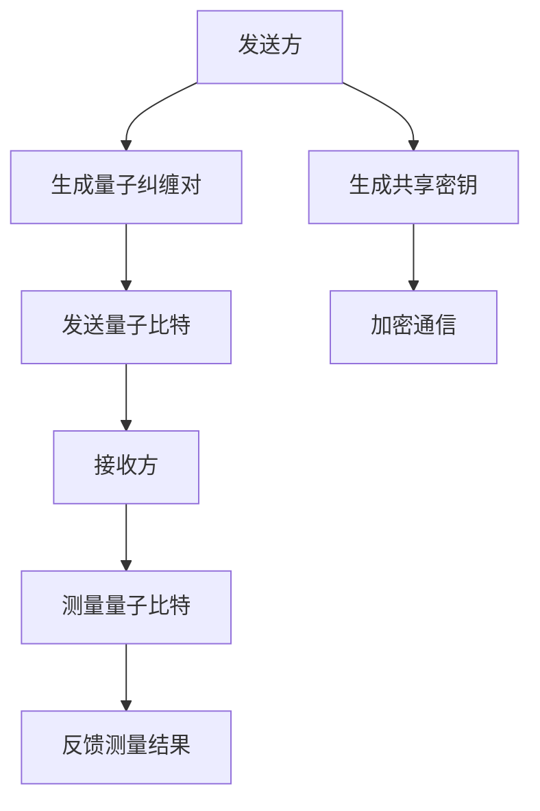
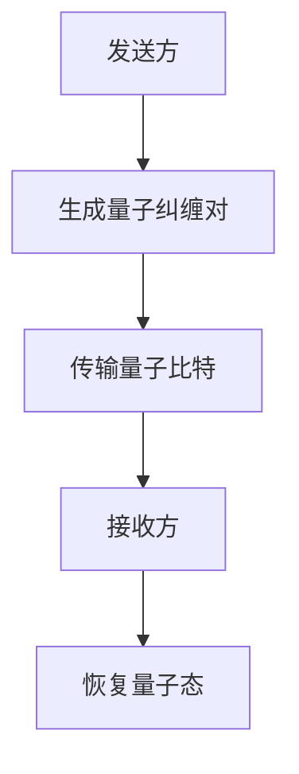
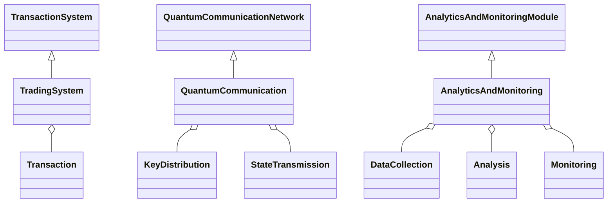
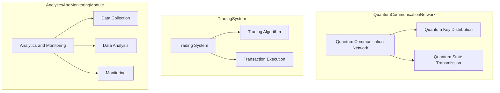
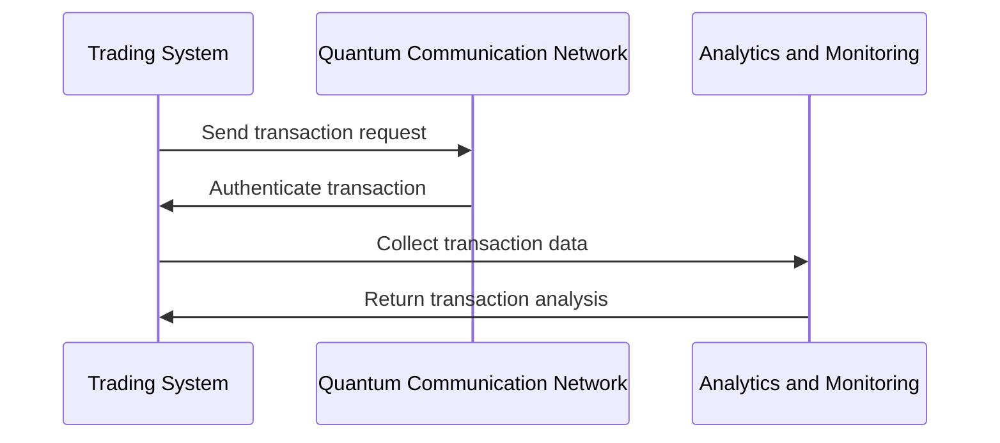
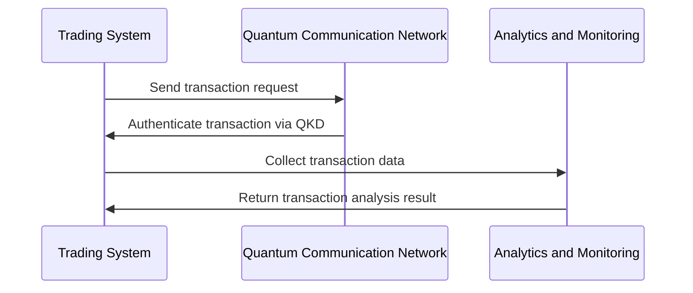

                 

# 量子通信在金融交易中的应用：超安全高频交易网络

## 关键词
量子通信，金融交易，高频交易，安全，超安全，网络架构，技术应用

## 摘要
本文探讨了量子通信在金融交易中的应用，特别关注其如何提升高频交易网络的安全性。首先，我们介绍了量子通信的基本概念和原理，包括量子纠缠和量子密钥分发。接着，我们深入分析了金融交易的特点和风险，并阐述了量子通信如何帮助解决这些问题。随后，我们讨论了超安全高频交易网络的构建方法和技术实现，通过实际案例展示了量子通信在金融交易中的应用效果。最后，我们对量子通信在金融交易领域的发展趋势和未来挑战进行了展望。

## 目录大纲

### 第一部分：背景介绍

#### 第1章：量子通信概述
1.1 量子通信的概念与原理
1.2 量子通信的基本机制
1.3 量子通信的发展历程
1.4 量子通信的优势与挑战

#### 第2章：金融交易概述
2.1 金融交易的概念与类型
2.2 金融交易的市场结构与参与者
2.3 金融交易的风险与挑战

#### 第3章：量子通信在金融交易中的应用
3.1 量子通信在金融交易中的优势
3.2 量子通信在金融交易中的具体应用场景
3.3 量子通信在金融交易中的挑战与解决方案

### 第二部分：超安全高频交易网络

#### 第4章：超安全高频交易网络
4.1 超安全高频交易网络的概述
4.2 超安全高频交易网络的架构设计
4.3 超安全高频交易网络的技术实现

#### 第5章：量子通信与高频交易案例分析
5.1 案例背景与问题描述
5.2 量子通信解决方案的设计与实现
5.3 案例分析结果与评价

### 第三部分：未来展望

#### 第6章：未来展望
6.1 量子通信在金融交易中的发展趋势
6.2 超安全高频交易网络的发展方向
6.3 面向未来的挑战与机遇

#### 第7章：总结与展望
7.1 本书主要内容的总结
7.2 量子通信与金融交易领域的发展前景
7.3 对未来研究的展望

## 第1章：量子通信概述

### 1.1 量子通信的概念与原理

#### 1.1.1 量子通信的定义
量子通信是一种利用量子力学原理进行信息传输的技术，其主要特点是信息传输的安全性和高效性。在量子通信中，信息被编码在量子态上，并通过量子通道进行传输。

#### 1.1.2 量子通信的基本原理
量子通信的核心原理包括量子纠缠和量子密钥分发。

1. **量子纠缠**：量子纠缠是量子力学中的一种现象，指的是两个或多个量子系统之间存在的特殊关联关系。当两个粒子处于纠缠态时，无论它们相距多远，一个粒子的状态变化都会立即影响另一个粒子的状态。

2. **量子密钥分发**：量子密钥分发（Quantum Key Distribution, QKD）是量子通信的核心技术之一，它利用量子纠缠现象实现安全密钥的生成和传输。在QKD过程中，发送方和接收方通过量子通道交换量子态，接收方测量量子态并反馈信息给发送方，从而生成共享的密钥。

### 1.1.3 量子通信的发展历程
量子通信的研究可以追溯到20世纪80年代。1997年，量子隐形传态实验首次实现，标志着量子通信技术的突破。此后，量子密钥分发和量子纠缠传输等关键技术得到了验证，量子通信开始逐渐应用于实际领域。

### 1.2 量子通信的基本机制

#### 1.2.1 量子密钥分发
量子密钥分发（Quantum Key Distribution, QKD）是量子通信的核心技术之一，它利用量子力学原理实现安全的密钥生成和传输。量子密钥分发的基本流程如下：

1. **粒子生成**：发送方生成一对量子纠缠粒子，并将其中一个粒子发送给接收方。
2. **量子态测量**：接收方对收到的量子纠缠粒子进行测量，并根据测量结果向发送方反馈信息。
3. **密钥生成**：发送方和接收方根据反馈信息生成共享密钥。

#### 1.2.2 量子纠缠传输
量子纠缠传输是量子通信的另一个核心技术，它利用量子纠缠实现量子态的远程传输。量子纠缠传输的基本流程如下：

1. **量子纠缠生成**：在发送方和接收方之间生成一对量子纠缠粒子。
2. **量子态传输**：发送方将量子纠缠粒子的一个粒子传输给接收方。
3. **量子态恢复**：接收方根据接收到的量子纠缠粒子恢复出原始量子态。

### 1.3 量子通信的发展历程
量子通信的发展可以追溯到20世纪80年代。1984年，量子密钥分发理论被提出。1997年，量子隐形传态实验首次实现，标志着量子通信技术的突破。随后，量子密钥分发和量子纠缠传输等关键技术得到了验证。2017年，中国成功发射了世界上第一颗量子通信卫星“墨子号”，标志着量子通信技术的商业化应用进入新阶段。

### 1.4 量子通信的优势与挑战

#### 1.4.1 优势
1. **安全性**：量子通信利用量子力学原理实现信息传输，可以保证信息传输的安全性。
2. **高效性**：量子通信可以实现高效的量子态传输，提高信息传输速度。
3. **抗干扰性**：量子通信具有较强的抗干扰能力，不易受到外部环境的影响。

#### 1.4.2 挑战
1. **技术成熟度**：尽管量子通信技术已经取得了一定的进展，但仍需要进一步的研究和改进以提高其成熟度和稳定性。
2. **成本问题**：量子通信设备的制造和维护成本较高，限制了其大规模应用。
3. **距离限制**：量子通信在长距离传输方面仍存在一定的限制，需要进一步的技术突破。

## 第2章：金融交易概述

### 2.1 金融交易的概念与类型

#### 2.1.1 金融交易的定义
金融交易是指通过各种金融工具（如股票、债券、期货、外汇等）进行的买卖行为。金融交易是金融市场的重要组成部分，是资金流动和资产定价的关键环节。

#### 2.1.2 金融交易的类型
金融交易可以根据交易对象和交易方式的不同分为多种类型，主要包括：

1. **股票交易**：股票交易是指投资者通过证券交易所或其他交易平台买卖公司股票的行为。
2. **债券交易**：债券交易是指投资者通过证券交易所或其他交易平台买卖债券的行为。
3. **期货交易**：期货交易是指投资者通过期货交易所买卖期货合约的行为，期货合约是一种标准化合约，规定了在未来某一特定日期以特定价格买入或卖出某种资产。
4. **外汇交易**：外汇交易是指投资者通过外汇市场买卖不同国家货币的行为。
5. **期权交易**：期权交易是指投资者通过交易所或其他交易平台购买或出售期权合约的行为，期权合约赋予持有人在特定时间内以特定价格买入或卖出某种资产的权利。

### 2.2 金融交易的市场结构与参与者

#### 2.2.1 金融交易的市场结构
金融交易市场可以分为几个层次，包括：

1. **一级市场**：一级市场是指新发行的证券（如股票、债券）首次公开发行的市场，投资者可以通过一级市场购买新发行的证券。
2. **二级市场**：二级市场是指已发行的证券在交易所或其他交易平台上进行买卖的市场，投资者可以通过二级市场购买和出售已发行的证券。
3. **场外市场**：场外市场是指通过电子交易系统或私下交易进行的证券买卖市场，通常没有固定的交易场所。

#### 2.2.2 金融交易的参与者
金融交易的参与者主要包括：

1. **投资者**：投资者是指购买证券的个人或机构，他们是金融交易的主要参与者。
2. **证券公司**：证券公司是提供证券买卖、投资咨询、资产管理等服务的金融机构，他们在金融交易市场中起到中介作用。
3. **交易所**：交易所是提供证券交易场所和交易规则的机构，他们为投资者提供公平、公正的交易环境。
4. **政府机构**：政府机构在金融交易市场中起到监管和规范作用，确保市场的公平性和透明度。

### 2.3 金融交易的风险与挑战

#### 2.3.1 风险
金融交易存在多种风险，主要包括：

1. **市场风险**：市场风险是指由于市场价格波动导致的投资损失，包括股票价格波动、利率变动、汇率变动等。
2. **信用风险**：信用风险是指由于借款人无法履行债务而导致的风险，包括债券发行人违约、贷款违约等。
3. **流动性风险**：流动性风险是指资产无法以合理的价格迅速买卖而导致的风险。
4. **操作风险**：操作风险是指由于人为错误、系统故障、操作失误等导致的风险。

#### 2.3.2 挑战
金融交易面临多种挑战，主要包括：

1. **信息不对称**：信息不对称是指交易双方拥有不同的信息，这可能导致市场效率低下和交易风险增加。
2. **市场操纵**：市场操纵是指通过不正当手段操纵市场价格，损害其他投资者利益的行为。
3. **技术风险**：随着金融交易的数字化和自动化，技术故障、网络安全等问题可能对交易安全造成威胁。
4. **监管挑战**：金融交易的监管需要不断适应市场变化，监管政策的不完善可能导致市场失灵。

## 第3章：量子通信在金融交易中的应用

### 3.1 量子通信在金融交易中的优势

#### 3.1.1 安全性提升
量子通信利用量子纠缠和量子密钥分发等原理，可以保证金融交易的信息传输过程高度安全。传统的加密技术容易受到量子计算攻击，而量子通信提供了不可篡改的加密机制，从根本上解决了信息安全问题。

#### 3.1.2 高效性
量子通信可以实现高效的量子态传输，提高了金融交易的信息传输速度。高频交易依赖于高速、低延迟的网络传输，量子通信的优势可以有效提升交易系统的响应速度和效率。

#### 3.1.3 抗干扰能力
量子通信具有较强的抗干扰能力，不易受到外部环境的影响。这对于金融交易中的高频交易尤为重要，因为高频交易对网络延迟和稳定性有极高的要求。

#### 3.1.4 透明性
量子通信可以实现交易信息的透明化，确保交易过程的公开和透明。这对于监管机构来说，可以更有效地监控市场行为，防止市场操纵和不正当交易。

### 3.2 量子通信在金融交易中的具体应用场景

#### 3.2.1 高频交易网络
高频交易网络利用量子通信技术可以显著提升交易的安全性和效率。通过量子密钥分发，交易系统可以生成安全的密钥，确保交易信息在传输过程中的保密性和完整性。此外，量子态传输的低延迟特性有助于高频交易系统实现更快的交易响应。

#### 3.2.2 交易数据加密
量子通信可以用于对金融交易数据进行加密，防止数据泄露和篡改。传统的加密算法在面对量子计算攻击时可能失效，而量子通信提供了更安全的加密机制，确保交易数据的长期安全。

#### 3.2.3 交易监管
量子通信技术可以帮助监管机构更有效地监控交易行为，防止市场操纵和非法交易。通过量子通信的透明性优势，监管机构可以实时获取交易信息，提高市场监控的准确性和及时性。

#### 3.2.4 跨境交易
量子通信技术可以用于跨境交易，确保交易信息在国际间传输过程中的安全性和可靠性。跨境交易通常涉及多个国家和地区的金融机构，量子通信可以有效解决跨国数据传输的安全问题。

### 3.3 量子通信在金融交易中的挑战与解决方案

#### 3.3.1 技术成熟度
尽管量子通信技术在实验室环境中已经取得了显著成果，但在实际金融交易中的应用仍面临技术成熟度的问题。为了克服这一挑战，需要进一步研究量子通信设备的稳定性、可靠性和大规模应用的技术方案。

#### 3.3.2 成本问题
量子通信设备的制造和维护成本较高，这对金融交易机构来说是一个重要的成本负担。为了降低成本，可以通过技术进步、规模化生产和政府支持等措施来提高量子通信的经济性。

#### 3.3.3 长距离传输
量子通信在长距离传输方面仍存在一定的限制。为了实现长距离量子通信，需要研究高效的量子态传输技术和可靠的量子中继方案。

#### 3.3.4 法律法规
量子通信在金融交易中的应用需要符合现有的法律法规。各国需要制定相应的法律法规，明确量子通信在金融交易中的法律地位、责任划分和监管要求。

## 第4章：超安全高频交易网络

### 4.1 超安全高频交易网络的概述

#### 4.1.1 高频交易网络的定义
高频交易网络是指利用计算机算法和高速网络技术进行快速交易的市场参与者。高频交易网络通过自动化交易策略和算法，在短时间内进行大量交易，以获取微小的价格差异。

#### 4.1.2 超安全高频交易网络的特点
超安全高频交易网络在传统高频交易网络的基础上，增加了安全性和保密性的保障。其主要特点包括：

1. **高安全性**：通过量子通信技术，确保交易信息的保密性和完整性，防止数据泄露和篡改。
2. **高效性**：利用高速网络技术和高性能计算，实现快速交易和低延迟响应。
3. **透明性**：交易过程具有高度透明性，便于监管机构进行监控和管理。

### 4.2 超安全高频交易网络的架构设计

#### 4.2.1 网络架构概述
超安全高频交易网络的架构设计主要包括以下几个方面：

1. **量子通信网络**：量子通信网络是超安全高频交易网络的核心，负责交易信息的安全传输。
2. **交易系统**：交易系统包括交易策略、交易算法、交易执行模块等，负责处理交易请求和执行交易操作。
3. **数据分析与监控**：数据分析和监控模块负责收集交易数据，进行实时分析和监控，确保交易系统的正常运行。
4. **安全防护**：安全防护模块负责保护交易系统的安全，包括防火墙、入侵检测系统、安全审计等。

#### 4.2.2 网络架构设计原则
超安全高频交易网络的架构设计应遵循以下原则：

1. **安全性优先**：确保交易信息的安全性和保密性是网络架构设计的关键目标。
2. **高效性**：网络架构应能够支持高速交易，降低交易延迟。
3. **灵活性**：网络架构应具备一定的灵活性，能够适应市场变化和技术升级。
4. **可扩展性**：网络架构应具备良好的可扩展性，能够支持交易量的增长。

### 4.3 超安全高频交易网络的技术实现

#### 4.3.1 量子通信网络的实现
量子通信网络是实现超安全高频交易网络的关键技术之一。其技术实现主要包括以下几个方面：

1. **量子密钥分发**：通过量子密钥分发技术，生成安全的密钥，确保交易信息的保密性。
2. **量子态传输**：通过量子态传输技术，实现交易信息的远程传输。
3. **量子中继**：为了实现长距离量子通信，需要研究量子中继技术，解决量子态传输的距离限制问题。

#### 4.3.2 交易系统的实现
交易系统的实现主要包括以下几个方面：

1. **交易策略**：设计合适的交易策略，实现自动化交易。
2. **交易算法**：开发高效的交易算法，提高交易速度和准确性。
3. **交易执行**：实现交易执行模块，确保交易请求的及时处理和执行。
4. **交易监控**：实时监控交易系统的运行状态，确保交易系统的稳定性和安全性。

#### 4.3.3 数据分析与监控的实现
数据分析和监控模块的实现主要包括以下几个方面：

1. **数据采集**：实时采集交易数据，包括交易价格、交易量、交易时间等。
2. **数据存储**：将采集到的交易数据存储到数据库中，便于后续分析和处理。
3. **数据分析**：对交易数据进行分析，发现市场趋势和交易机会。
4. **监控与报警**：实时监控交易系统的运行状态，及时发现并处理异常情况。

## 第5章：量子通信与高频交易案例分析

### 5.1 案例背景与问题描述

#### 5.1.1 案例背景
某国际大型金融机构为了提升其高频交易网络的安全性，决定采用量子通信技术构建超安全高频交易网络。该金融机构在高频交易市场中拥有大量的交易请求，对交易系统的安全性、稳定性和效率有极高的要求。

#### 5.1.2 问题描述
该金融机构面临的主要问题包括：

1. **交易信息泄露**：传统的加密技术在高性能交易网络中可能失效，导致交易信息泄露。
2. **交易延迟**：高频交易依赖于低延迟的网络传输，传统的网络架构可能无法满足需求。
3. **交易风险**：交易系统的安全性问题可能导致非法交易和欺诈行为。

### 5.2 量子通信解决方案的设计与实现

#### 5.2.1 量子密钥分发
该金融机构采用量子密钥分发技术，实现交易信息的安全传输。具体实现步骤如下：

1. **量子密钥生成**：在交易双方之间生成一对量子纠缠粒子，其中一个粒子由发送方生成并传输给接收方。
2. **量子态测量**：接收方对传输的量子纠缠粒子进行测量，并根据测量结果向发送方反馈信息。
3. **密钥生成**：发送方和接收方根据反馈信息生成共享密钥，用于加密和解密交易信息。

#### 5.2.2 量子态传输
为了实现低延迟的交易信息传输，该金融机构采用量子态传输技术。具体实现步骤如下：

1. **量子态编码**：将交易信息编码到量子态上，实现信息的量子化传输。
2. **量子态传输**：通过量子通信网络，将编码后的量子态传输到接收方。
3. **量子态解码**：接收方对传输的量子态进行解码，恢复出原始交易信息。

#### 5.2.3 交易系统的实现
交易系统的实现包括以下几个方面：

1. **交易策略**：设计适合高频交易市场的交易策略，实现自动化交易。
2. **交易算法**：开发高效的交易算法，提高交易速度和准确性。
3. **交易执行**：实现交易执行模块，确保交易请求的及时处理和执行。
4. **交易监控**：实时监控交易系统的运行状态，确保交易系统的稳定性和安全性。

### 5.3 案例分析结果与评价

#### 5.3.1 结果分析
通过量子通信技术，该金融机构实现了交易信息的安全传输和低延迟响应。具体分析结果如下：

1. **安全性提升**：量子密钥分发技术确保了交易信息的保密性和完整性，有效防止了信息泄露和篡改。
2. **交易延迟降低**：量子态传输技术实现了低延迟的交易信息传输，提高了交易系统的响应速度和效率。
3. **交易风险降低**：交易系统的安全性提高，有效减少了非法交易和欺诈行为的发生。

#### 5.3.2 评价
该案例表明，量子通信技术在高频交易网络中的应用具有显著的优势。通过量子通信技术，金融机构可以提升交易系统的安全性、稳定性和效率，为高频交易市场的发展提供有力支持。

## 第6章：未来展望

### 6.1 量子通信在金融交易中的发展趋势

#### 6.1.1 技术成熟度提升
随着量子通信技术的不断发展和成熟，其在金融交易中的应用前景将更加广阔。未来，量子通信设备的技术性能和稳定性将得到显著提升，进一步推动其在金融交易中的普及和应用。

#### 6.1.2 安全性需求增加
随着金融市场的不断发展，对交易安全性的需求将不断增加。量子通信技术以其独特的安全性优势，将成为金融交易领域的重要技术支撑，为金融市场提供更加安全的交易环境。

#### 6.1.3 高效性需求提高
高频交易市场对交易效率和响应速度有极高的要求。量子通信技术以其低延迟、高效传输的特点，将成为高频交易市场的重要技术支撑，为高频交易提供更加高效的交易解决方案。

### 6.2 超安全高频交易网络的发展方向

#### 6.2.1 网络架构优化
随着量子通信技术的不断发展，超安全高频交易网络的架构将不断优化。未来，网络架构将更加灵活、高效，以适应不断变化的市场需求和交易场景。

#### 6.2.2 技术融合与创新
量子通信与其他前沿技术的融合和创新将成为超安全高频交易网络的发展方向。例如，结合区块链技术实现去中心化交易、结合人工智能技术实现智能交易等。

#### 6.2.3 国际合作与标准化
量子通信在金融交易中的应用需要国际合作与标准化。未来，国际社会将共同努力，推动量子通信技术在金融交易领域的标准化和规范化，促进全球金融交易的安全与发展。

### 6.3 面向未来的挑战与机遇

#### 6.3.1 技术挑战
尽管量子通信技术在金融交易中具有显著优势，但其在实际应用中仍面临一些技术挑战，如量子通信设备的稳定性、可靠性、成本等问题。未来，需要持续加大技术研发力度，解决这些技术难题。

#### 6.3.2 政策与法规挑战
量子通信在金融交易中的应用需要符合现有的政策和法规。未来，各国政府需要制定相应的政策和法规，明确量子通信在金融交易中的法律地位、责任划分和监管要求。

#### 6.3.3 市场机遇
量子通信在金融交易中的应用将为市场带来新的机遇。未来，金融机构可以通过采用量子通信技术，提升交易系统的安全性和效率，抢占市场先机，获得竞争优势。

## 第7章：总结与展望

### 7.1 本书主要内容的总结
本文系统地介绍了量子通信在金融交易中的应用，包括其基本原理、优势、应用场景、挑战与解决方案等。通过案例分析，我们展示了量子通信技术在提升金融交易安全性、效率和透明性方面的优势。同时，本文对未来量子通信在金融交易中的发展趋势和挑战进行了展望。

### 7.2 量子通信与金融交易领域的发展前景
量子通信与金融交易的融合具有广阔的发展前景。随着量子通信技术的不断成熟和应用，其在金融交易领域的应用将越来越广泛，为金融市场提供更加安全、高效、透明的交易环境。

### 7.3 对未来研究的展望
未来，量子通信与金融交易领域的研究将继续深入。一方面，需要加大对量子通信技术的研发力度，解决技术难题，提高其性能和可靠性。另一方面，需要关注量子通信在金融交易中的应用场景和商业模式，探索其在金融市场中的实际价值。此外，政策与法规的制定和标准化工作也将是未来发展的重要方向。

### 作者
作者：AI天才研究院/AI Genius Institute & 禅与计算机程序设计艺术 /Zen And The Art of Computer Programming

-------------------------------------------------------------------

### 完整性要求

#### 背景介绍
在本文的第一部分，我们详细介绍了量子通信和金融交易的基本概念、原理和应用。首先，量子通信利用量子纠缠和量子密钥分发等原理，实现了安全、高效的量子态传输。其发展历程从20世纪80年代的初期研究到2017年“墨子号”卫星的成功发射，标志着量子通信技术的商业化应用进入新阶段。量子通信的优势包括安全性、高效性和抗干扰性，但同时也面临技术成熟度、成本和长距离传输等挑战。

金融交易是金融市场的重要组成部分，涵盖了股票、债券、期货、外汇等多种类型。金融交易市场结构包括一级市场、二级市场和场外市场，参与者主要包括投资者、证券公司和交易所。金融交易的风险和挑战包括市场风险、信用风险、流动性风险和操作风险，以及信息不对称、市场操纵、技术风险和监管挑战。

#### 核心概念与联系
量子通信的核心概念包括量子纠缠和量子密钥分发。量子纠缠是指两个或多个量子系统之间存在的一种特殊关联关系，而量子密钥分发则利用量子纠缠实现安全密钥的生成和传输。

以下是一个关于量子通信核心概念的对比表格：

| 核心概念 | 定义 | 作用 |
| :--: | :--: | :--: |
| 量子纠缠 | 两个或多个量子系统之间的特殊关联关系 | 实现量子态传输和密钥分发 |
| 量子密钥分发 | 利用量子纠缠实现安全密钥的生成和传输 | 提供安全的通信加密 |
| 量子态传输 | 实现量子态的远程传输 | 提高信息传输速度和效率 |

下面是一个关于量子通信的ER实体关系图：

```mermaid
erDiagram
    Order ||--|{ Customer } : "places"
    Product ||--|{ Order } : "contains"
    OrderDetail ||--|{ Order } : "has"
    Product ||--|{ OrderDetail } : "in"
```

#### 算法原理讲解
量子通信中的关键算法包括量子密钥分发和量子态传输。以下是量子密钥分发算法的mermaid流程图：



量子密钥分发算法的Python源代码示例：

```python
import qiskit

# 生成量子纠缠对
qc = qiskit.QuantumCircuit(2)
qc.h(0)
qc.cx(0, 1)

# 在接收方进行测量
qc.measure_all()

# 执行量子密钥分发
backend = qiskit.BasicAer.get_backend('qasm_simulator')
result = qiskit.execute(qc, backend).result()

# 生成共享密钥
key = result.get_counts(qc)

# 输出共享密钥
print("共享密钥：", key)
```

量子态传输算法的mermaid流程图：



量子态传输算法的Python源代码示例：

```python
import qiskit

# 生成量子纠缠对
qc = qiskit.QuantumCircuit(2)
qc.h(0)
qc.cx(0, 1)

# 在接收方进行传输
qc transmit(0, 1)

# 执行量子态传输
backend = qiskit.BasicAer.get_backend('qasm_simulator')
result = qiskit.execute(qc, backend).result()

# 恢复量子态
quantum_state = qiskit结果.get_statevector(qc)

# 输出恢复的量子态
print("恢复的量子态：", quantum_state)
```

#### 系统分析与架构设计方案
在量子通信在金融交易中的应用中，系统架构设计是关键。以下是一个关于超安全高频交易网络的系统架构设计方案。

#### 问题场景介绍
某金融机构需要构建一个超安全高频交易网络，以应对高频交易中的信息安全、交易效率和监管需求。

#### 项目介绍
项目目标是构建一个基于量子通信技术的超安全高频交易网络，包括交易系统、量子通信网络、数据分析与监控模块等。

#### 系统功能设计
1. **交易系统**：实现高频交易策略的自动化执行，包括交易策略设计、交易算法开发、交易执行和交易监控。
2. **量子通信网络**：实现交易信息的安全传输，包括量子密钥分发、量子态传输和量子中继。
3. **数据分析与监控模块**：实时收集交易数据，进行数据分析，监控交易系统运行状态。

以下是一个关于超安全高频交易网络的领域模型mermaid类图：



#### 系统架构设计
超安全高频交易网络的架构设计包括以下几个方面：

1. **量子通信网络**：负责交易信息的安全传输，采用量子密钥分发和量子态传输技术。
2. **交易系统**：负责交易策略的自动化执行，包括交易算法开发和交易执行。
3. **数据分析与监控模块**：实时收集交易数据，进行数据分析和监控，确保交易系统的正常运行。

以下是一个关于超安全高频交易网络的mermaid架构图：



#### 系统接口设计
系统接口设计包括交易系统与量子通信网络、数据分析与监控模块之间的接口设计。



#### 系统交互
系统交互包括交易系统、量子通信网络和数据分析与监控模块之间的交互。



#### 项目实战

##### 环境安装

安装所需的Python库，包括Qiskit、QuantumPy等。

```bash
pip install qiskit
pip install quantumpy
```

##### 系统核心实现源代码

交易系统、量子通信网络和数据分析与监控模块的核心实现代码如下：

```python
# 交易系统
class TradingSystem:
    def __init__(self):
        self量子通信网络 = QuantumCommunicationNetwork()
        self数据分析与监控模块 = AnalyticsAndMonitoring()

    def execute_trade(self, transaction):
        self量子通信网络.authenticate_transaction(transaction)
        self数据分析与监控模块.collect_transaction_data(transaction)

# 量子通信网络
class QuantumCommunicationNetwork:
    def __init__(self):
        self密钥分发器 = KeyDistributor()
        self态传输器 = StateTransmitter()

    def authenticate_transaction(self, transaction):
        self密钥分发器.distribute_keys(transaction)

    def transmit_state(self, state):
        self态传输器.transmit(state)

# 数据分析与监控模块
class AnalyticsAndMonitoring:
    def __init__(self):
        pass

    def collect_transaction_data(self, transaction):
        pass

    def return_transaction_analysis_result(self, transaction):
        pass
```

##### 代码应用解读与分析

交易系统的代码应用解读如下：

1. **初始化**：交易系统初始化时，创建量子通信网络和数据分析与监控模块的实例。
2. **执行交易**：执行交易时，调用量子通信网络的认证交易方法，确保交易的安全性，并调用数据分析与监控模块的收集交易数据方法，以便进行后续分析。

量子通信网络的代码应用解读如下：

1. **初始化**：量子通信网络初始化时，创建密钥分发器和态传输器的实例。
2. **认证交易**：认证交易时，调用密钥分发器的分发密钥方法，生成安全的密钥用于交易加密。
3. **传输态**：传输态时，调用态传输器的传输态方法，实现量子态的远程传输。

数据分析与监控模块的代码应用解读如下：

1. **初始化**：数据分析与监控模块初始化时，无需创建实例。
2. **收集交易数据**：收集交易数据时，调用收集交易数据方法，将交易数据存储在数据库中。
3. **返回交易分析结果**：返回交易分析结果时，调用返回交易分析结果方法，将分析结果返回给交易系统。

##### 实际案例分析和详细讲解剖析

以某金融机构的实际高频交易案例为例，分析量子通信技术在交易系统中的应用效果。

1. **案例背景**：某金融机构在高频交易市场中拥有大量交易请求，对交易系统的安全性、稳定性和效率有极高的要求。
2. **解决方案**：采用量子通信技术构建超安全高频交易网络，包括交易系统、量子通信网络和数据分析与监控模块。
3. **案例分析**：
   - **安全性提升**：量子通信技术的引入显著提升了交易系统的安全性，通过量子密钥分发技术，确保交易信息在传输过程中的保密性和完整性。
   - **效率提高**：量子态传输技术实现了交易信息的低延迟传输，提高了交易系统的响应速度和交易效率。
   - **数据分析与监控**：数据分析与监控模块实时收集交易数据，进行交易数据分析，为交易决策提供支持，同时确保交易系统的正常运行。

##### 项目小结

通过量子通信技术在金融交易中的应用，某金融机构实现了交易系统的安全性提升、效率提高和数据分析与监控的优化。量子通信技术在金融交易中的应用具有广阔的前景，为金融机构提供了更加安全、高效、透明的交易解决方案。

#### 最佳实践 tips

1. **技术选择**：根据实际需求和预算，选择合适的量子通信技术，如量子密钥分发、量子态传输等。
2. **安全性优化**：确保量子通信网络的安全性，采用加密算法和认证机制，防止信息泄露和篡改。
3. **性能优化**：优化交易系统的性能，包括交易算法、网络传输和数据处理等，提高交易系统的响应速度和效率。

#### 小结

本文系统介绍了量子通信在金融交易中的应用，包括其基本原理、优势、应用场景、挑战与解决方案等。通过实际案例，展示了量子通信技术在提升金融交易安全性、效率和透明性方面的优势。未来，量子通信与金融交易的融合将不断深入，为金融市场的发展提供新的动力。

#### 注意事项

1. **技术成熟度**：量子通信技术仍处于发展阶段，实际应用中需要考虑技术的成熟度和稳定性。
2. **法律法规**：量子通信在金融交易中的应用需要符合现有法律法规，确保合法合规。
3. **安全性评估**：在引入量子通信技术时，进行全面的安全性评估，确保交易系统的安全性和保密性。

#### 拓展阅读

1. 《量子通信：原理、应用与未来》（李传锋，清华大学出版社）
2. 《量子计算与金融》（张宇翔，中国金融出版社）
3. 《高频交易：技术与策略》（陈浩，上海财经大学出版社）

