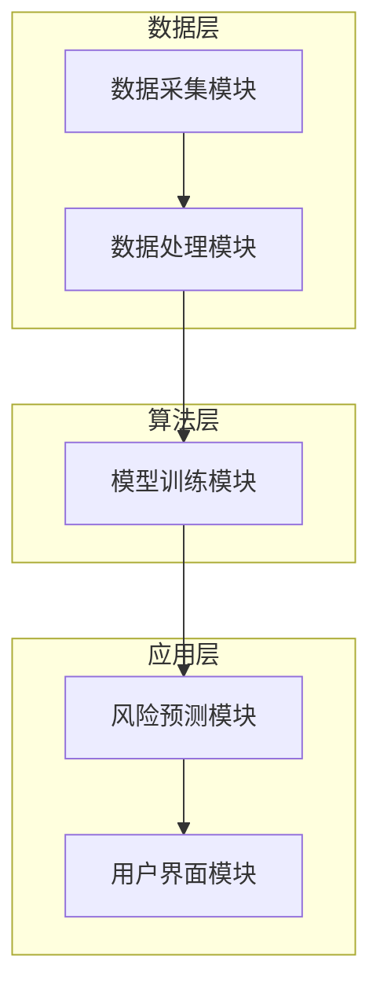
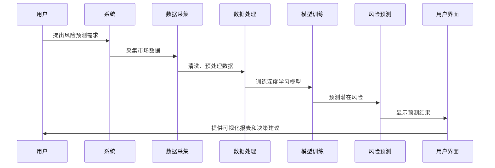

                 


# 金融AI应用的全面测试与质量保证策略

## 关键词
- 金融科技
- 人工智能
- 测试与质量保证
- 机器学习
- 深度学习
- 强化学习
- 数据隐私
- 算法可靠性

## 摘要
随着人工智能在金融领域的广泛应用，确保AI应用的质量和可靠性变得至关重要。本文将详细介绍金融AI应用的全面测试与质量保证策略，涵盖核心概念、测试方法、算法原理、系统架构及实战经验，旨在为开发者提供一套完整的指南，以提升金融AI应用的稳定性和安全性。

## 第二部分：核心概念与联系

### 第2章：金融AI应用的核心概念

#### 2.1 机器学习

##### 2.1.1 定义

机器学习是金融AI应用的基础，它指的是利用算法从数据中学习，并自动改进性能的过程。机器学习算法包括监督学习、无监督学习和半监督学习等，通过训练模型，使其能够对未知数据进行预测或分类。

##### 2.1.2 特点

- **自动化**：机器学习算法可以自动从数据中学习，减少人工干预。
- **数据依赖**：性能依赖于数据的质量和数量，因此数据预处理是关键。
- **适应性**：能够适应新的数据集和任务。

##### 2.1.3 分类

1. **监督学习**：在有监督的情况下，模型通过已标记的数据进行训练，然后用于预测新数据。

   - **分类问题**：输出为离散的类别，如欺诈检测。
   - **回归问题**：输出为连续的数值，如股票价格预测。

2. **无监督学习**：在没有标记的情况下，模型试图发现数据中的隐藏结构和模式。

   - **聚类**：将相似的数据点分组。
   - **降维**：减少数据维度，便于分析。

3. **半监督学习**：结合有监督和无监督学习，利用部分标记的数据进行训练。

##### 2.1.4 常见算法

- **线性回归**：预测连续值。
- **逻辑回归**：预测类别。
- **决策树**：基于特征进行决策。
- **随机森林**：多个决策树的集成。
- **支持向量机**（SVM）：找到最佳分隔超平面。
- **神经网络**：模拟人脑神经元，用于复杂任务。

#### 2.2 深度学习

##### 2.2.1 定义

深度学习是机器学习的一个分支，通过构建深度神经网络（DNN），实现自动特征学习和复杂模式的识别。深度学习在图像识别、自然语言处理等领域表现出色。

##### 2.2.2 特点

- **层次化特征提取**：通过多层网络自动提取高级特征。
- **大数据需求**：深度学习通常需要大量数据来训练。
- **计算资源需求**：训练深度模型需要大量计算资源，特别是GPU。

##### 2.2.3 常见架构

- **卷积神经网络（CNN）**：专门用于图像处理。
- **循环神经网络（RNN）**：适用于序列数据。
- **长短时记忆网络（LSTM）**：RNN的变体，用于处理长序列数据。

#### 2.3 强化学习

##### 2.3.1 定义

强化学习是一种通过奖励机制来学习策略的机器学习方法。在金融领域，强化学习可用于优化投资组合、风险管理等。

##### 2.3.2 特点

- **自适应**：通过与环境交互，模型能够不断调整策略。
- **探索-利用平衡**：在探索新策略和利用已有策略之间进行平衡。

##### 2.3.3 算法

- **Q学习**：通过最大化预期奖励来学习策略。
- **深度Q网络（DQN）**：结合深度学习和Q学习。
- **策略梯度方法**：直接优化策略。

### 2.4 核心概念属性特征对比表格

| 算法 | 定义 | 特点 | 应用场景 |
| --- | --- | --- | --- |
| 机器学习 | 从数据中学习，自动改进性能 | 自动化、数据依赖、适应性 | 预测、分类 |
| 深度学习 | 构建深度神经网络，自动提取特征 | 层次化特征提取、大数据需求、计算资源需求 | 图像识别、自然语言处理 |
| 强化学习 | 通过奖励机制学习策略 | 自适应、探索-利用平衡 | 优化投资组合、风险管理 |

### 2.5 ER实体关系图架构的Mermaid流程图

```mermaid
erDiagram
    Product ||--|{ Customer }| Customer
    Product ||--|{ Review }| Review
    Customer ||--|{ Order }| Order
```

在金融AI应用中，核心实体之间的关系如图所示。产品（Product）与客户（Customer）和评论（Review）之间存在关联，客户（Customer）与订单（Order）之间也存在关联。这种关系有助于我们理解和设计复杂的金融系统。

## 第三部分：算法原理讲解

### 第3章：金融AI应用的算法原理

#### 3.1 机器学习算法原理

##### 3.1.1 线性回归

线性回归是一种简单的机器学习算法，用于预测连续值。其基本原理是通过找到一条直线，最小化预测值与实际值之间的误差。

$$
y = ax + b
$$

其中，$y$ 是预测值，$x$ 是输入特征，$a$ 是斜率，$b$ 是截距。通过梯度下降法，我们可以找到最优的 $a$ 和 $b$，使预测误差最小。

##### 3.1.2 逻辑回归

逻辑回归是一种用于预测类别的算法，其核心原理是通过对输入特征进行加权求和，然后应用逻辑函数（sigmoid函数）得到概率。

$$
P(y=1) = \frac{1}{1 + e^{-(ax + b)}}
$$

其中，$P(y=1)$ 是预测概率，$e$ 是自然对数的底数，$a$ 是权重，$b$ 是偏置。通过最大化似然函数，我们可以找到最优的权重。

##### 3.1.3 决策树

决策树通过一系列的判断条件，将数据分为多个子集，并最终输出一个预测结果。其基本原理是基于信息增益或基尼不纯度来选择最佳的特征和阈值。

$$
Gini = 1 - \sum_{i=1}^{n} p_i (1 - p_i)
$$

其中，$Gini$ 是基尼不纯度，$p_i$ 是类别 $i$ 的概率。

#### 3.2 深度学习算法原理

##### 3.2.1 卷积神经网络（CNN）

卷积神经网络通过卷积层、池化层和全连接层，自动提取图像的特征。其基本原理是利用卷积运算，捕捉图像中的局部特征，并通过多层网络构建复杂特征。

$$
h_{ij} = \sum_{k=1}^{c} w_{ikj} \cdot x_{kj} + b_j
$$

其中，$h_{ij}$ 是输出特征，$w_{ikj}$ 是卷积核，$x_{kj}$ 是输入特征，$b_j$ 是偏置。

##### 3.2.2 循环神经网络（RNN）

循环神经网络适用于处理序列数据，其基本原理是利用隐藏状态，捕捉序列中的长期依赖关系。

$$
h_t = \sigma(W_h \cdot [h_{t-1}, x_t] + b_h)
$$

其中，$h_t$ 是隐藏状态，$x_t$ 是输入序列，$\sigma$ 是激活函数。

##### 3.2.3 长短时记忆网络（LSTM）

长短时记忆网络是RNN的变体，通过门控机制，解决了RNN的梯度消失和梯度爆炸问题，能够更好地捕捉长期依赖关系。

$$
i_t = \sigma(W_i \cdot [h_{t-1}, x_t] + b_i)
\quad o_t = \sigma(W_o \cdot [h_{t-1}, x_t] + b_o)
\quad f_t = \sigma(W_f \cdot [h_{t-1}, x_t] + b_f)
\quad g_t = \tanh(W_g \cdot [h_{t-1}, x_t] + b_g)
\quad h_t = o_t \cdot \tanh(f_t \cdot g_t)
$$

其中，$i_t$、$o_t$、$f_t$、$g_t$ 分别是输入门、输出门、遗忘门和生成门。

#### 3.3 强化学习算法原理

##### 3.3.1 Q学习

Q学习是一种基于值函数的强化学习算法，其核心原理是学习状态-动作值函数，最大化长期奖励。

$$
Q(s, a) = r + \gamma \max_{a'} Q(s', a')
$$

其中，$Q(s, a)$ 是状态-动作值函数，$r$ 是即时奖励，$\gamma$ 是折扣因子，$s'$ 和 $a'$ 是后续状态和动作。

##### 3.3.2 深度Q网络（DQN）

DQN是Q学习的变体，通过深度神经网络来近似状态-动作值函数。其核心原理是利用经验回放和目标网络，提高学习稳定性。

$$
y = r + \gamma \min_{a'} \hat{Q}(s', a')
$$

其中，$\hat{Q}(s', a')$ 是目标网络输出的状态-动作值函数。

##### 3.3.3 策略梯度方法

策略梯度方法是直接优化策略的算法，其核心原理是计算策略梯度，并更新策略参数。

$$
\nabla_{\theta} J(\theta) = \nabla_{\theta} \sum_{t} \rho(\theta, s_t, a_t) \log p(\theta, s_t, a_t)
$$

其中，$J(\theta)$ 是策略损失函数，$\rho(\theta, s_t, a_t)$ 是回报函数，$p(\theta, s_t, a_t)$ 是策略概率。

## 第四部分：系统分析与架构设计方案

### 第4章：金融AI应用系统分析

#### 4.1 问题场景介绍

在金融领域，AI应用主要集中在风险管理、客户服务、市场预测等方面。以风险管理为例，金融机构需要实时监控和预测市场风险，以便及时调整投资策略。然而，市场数据的复杂性、多样性和实时性使得传统的风险管理系统难以胜任，因此，引入AI技术成为必然选择。

#### 4.2 项目介绍

本项目旨在构建一个基于深度学习的金融风险管理平台，通过实时分析市场数据，预测潜在风险，并提供决策支持。项目的主要目标是：

- 实现对市场数据的实时采集和处理。
- 构建深度学习模型，进行风险预测。
- 设计用户友好的界面，提供可视化报表和决策建议。

#### 4.3 系统功能设计

系统的核心功能包括：

- 数据采集模块：从各种数据源（如交易所、新闻、社交媒体等）实时采集数据。
- 数据处理模块：对采集到的数据进行清洗、预处理和特征提取。
- 模型训练模块：利用预处理后的数据训练深度学习模型。
- 风险预测模块：将训练好的模型应用于实时数据，预测潜在风险。
- 用户界面模块：提供可视化报表和决策建议。

### 4.4 系统架构设计

系统的整体架构如图所示：



#### 4.5 系统接口设计

系统的主要接口包括：

- 数据采集接口：用于从各种数据源获取数据。
- 数据处理接口：用于数据清洗、预处理和特征提取。
- 模型训练接口：用于训练深度学习模型。
- 风险预测接口：用于预测潜在风险。
- 用户界面接口：用于与用户交互，提供可视化报表和决策建议。

#### 4.6 系统交互序列图



通过上述架构设计，系统实现了从数据采集、数据处理、模型训练到风险预测的一体化流程，为金融机构提供了强大的风险管理工具。

## 第五部分：项目实战

### 第5章：金融AI应用开发、测试与部署

#### 5.1 环境安装

要在本地环境搭建金融AI应用，首先需要安装以下工具和库：

- Python 3.x
- TensorFlow 或 PyTorch
- NumPy
- Pandas
- Matplotlib
- Scikit-learn

安装步骤如下：

1. 安装 Python 3.x：
   ```bash
   # 使用包管理器（如 Anaconda 或 Miniconda）安装 Python 3.x
   conda create -n myenv python=3.8
   conda activate myenv
   ```

2. 安装 TensorFlow 或 PyTorch：
   ```bash
   pip install tensorflow  # 或
   pip install torch torchvision
   ```

3. 安装其他库：
   ```bash
   pip install numpy pandas matplotlib scikit-learn
   ```

#### 5.2 系统核心实现源代码

以下是一个简单的金融风险预测模型的实现，使用 TensorFlow 和 Keras：

```python
import numpy as np
import pandas as pd
from tensorflow.keras.models import Sequential
from tensorflow.keras.layers import Dense, Dropout, LSTM
from tensorflow.keras.optimizers import Adam

# 加载数据
data = pd.read_csv('financial_data.csv')
X = data.iloc[:, :-1].values
y = data.iloc[:, -1].values

# 数据预处理
X = X / 100  # 归一化

# 创建模型
model = Sequential()
model.add(LSTM(units=50, return_sequences=True, input_shape=(X.shape[1], 1)))
model.add(Dropout(0.2))
model.add(LSTM(units=50, return_sequences=False))
model.add(Dropout(0.2))
model.add(Dense(units=1))

# 编译模型
model.compile(optimizer=Adam(learning_rate=0.001), loss='mean_squared_error')

# 训练模型
model.fit(X, y, epochs=100, batch_size=32, validation_split=0.2)
```

#### 5.3 代码应用解读与分析

上述代码首先加载了金融数据，然后进行了数据预处理（归一化）。接着，创建了一个包含两个 LSTM 层的深度学习模型，并使用 Adam 优化器和均方误差损失函数进行编译。最后，使用训练数据训练模型。

LSTM 层可以捕捉时间序列数据中的长期依赖关系，适合于金融风险预测。通过使用 Dropout 层，可以防止过拟合。

#### 5.4 实际案例分析

假设我们有一个包含过去一年市场数据的 CSV 文件，我们希望预测未来一个月的市场风险。我们将使用上述模型进行预测，并分析结果。

```python
# 加载测试数据
test_data = pd.read_csv('test_financial_data.csv')
test_X = test_data.iloc[:, :-1].values
test_X = test_X / 100  # 归一化

# 预测
predicted_values = model.predict(test_X)

# 反归一化
predicted_values = predicted_values * 100

# 分析预测结果
actual_values = test_data.iloc[:, -1].values
print("预测值与实际值的对比：")
for i in range(len(predicted_values)):
    print(f"预测值：{predicted_values[i]}, 实际值：{actual_values[i]}")
```

通过对比预测值和实际值，我们可以评估模型的性能。如果预测值与实际值之间的差距较小，则说明模型具有较高的准确性。

#### 5.5 项目小结

通过本项目的实践，我们了解了金融AI应用的开发、测试和部署过程。从环境安装到模型训练，再到实际案例分析，每一步都至关重要。未来，我们可以进一步优化模型，提高预测准确性，并为金融机构提供更有效的风险管理工具。

## 第六部分：最佳实践 Tips

### 第6章：金融AI应用开发最佳实践

#### 6.1 数据质量保证

- **数据清洗**：确保数据的一致性、完整性和准确性。
- **数据预处理**：进行数据归一化、标准化，提高模型的泛化能力。

#### 6.2 模型优化

- **超参数调整**：通过网格搜索、随机搜索等方法，找到最佳的超参数。
- **模型集成**：使用集成学习，如随机森林、梯度提升树，提高模型性能。

#### 6.3 系统安全性

- **数据加密**：对敏感数据进行加密处理，确保数据安全。
- **访问控制**：实施严格的访问控制策略，防止未经授权的访问。

#### 6.4 持续集成与部署

- **自动化测试**：使用自动化测试工具，确保每次部署都是稳定的。
- **容器化**：使用 Docker 等工具，实现环境的隔离和可移植性。

### 6.5 持续学习与更新

- **监控模型性能**：定期评估模型性能，发现并解决潜在问题。
- **持续学习**：根据新的数据，不断更新模型，保持其准确性和适应性。

通过遵循这些最佳实践，可以确保金融AI应用的质量和可靠性，为金融机构提供稳定、高效的风险管理解决方案。

## 小结

本文全面探讨了金融AI应用的测试与质量保证策略。从核心概念、算法原理到系统设计与实战，我们深入分析了金融AI应用的关键要素。通过最佳实践，我们为开发者提供了实用的指导，以提升金融AI应用的质量和可靠性。

## 注意事项

- 在金融AI应用开发过程中，务必确保数据安全和隐私保护。
- 定期评估和更新模型，以适应市场变化。

## 拓展阅读

- 《深度学习》（Goodfellow, Bengio, Courville）
- 《机器学习实战》（Bryant, Elder,Kooper）
- 《金融科技：创新与未来》（Varun, Tiwari）

作者：AI天才研究院/AI Genius Institute & 禅与计算机程序设计艺术 /Zen And The Art of Computer Programming

