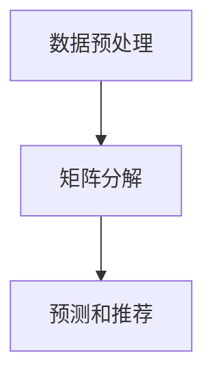
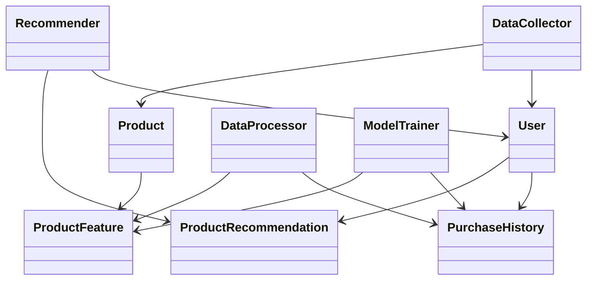
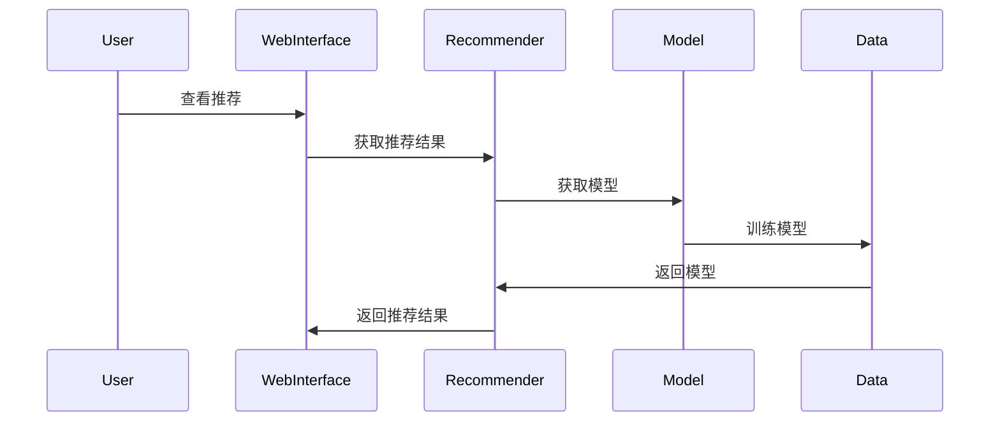

                 

# 金融产品交叉销售推荐引擎

## 关键词
- 金融产品
- 交叉销售
- 推荐引擎
- 机器学习
- 数据预处理
- 特征工程
- 算法选型
- 用户反馈
- 性能优化

## 摘要
本文深入探讨了金融产品交叉销售推荐引擎的构建方法，从背景介绍、核心概念与联系、算法原理讲解、系统分析与架构设计、项目实战到最佳实践，全面解析了推荐引擎的技术原理和实施步骤。通过本文的阅读，读者将了解如何利用机器学习算法实现金融产品的智能交叉销售推荐，提升金融机构的营销效率和用户满意度。

## 第一部分：背景介绍

### 1. 问题背景
随着金融行业的不断发展，金融产品种类日益丰富，金融消费者对产品多样性和个性化需求不断增长。如何有效地向金融消费者推荐合适的产品，成为金融机构面临的重大挑战。交叉销售推荐引擎作为一种智能推荐系统，能够根据消费者的购买行为和历史数据，为其推荐相关的金融产品，从而提高销售额和客户满意度。

### 2. 问题描述
金融产品交叉销售推荐引擎的主要任务是识别和预测消费者可能感兴趣的金融产品，并进行个性化推荐。这需要处理大量的金融数据，包括产品信息、消费者行为数据等，并且要在短时间内提供准确的推荐结果。

### 3. 问题解决
通过构建一个高效、准确的推荐引擎，可以实现对金融产品的交叉销售。首先，需要对数据进行预处理和特征提取，然后利用机器学习算法进行建模和预测，最后通过推荐算法将预测结果呈现给用户。

### 4. 边界与外延
金融产品交叉销售推荐引擎的边界包括数据源的选择、算法的选型、推荐策略的设定等。其外延则涉及到推荐系统的性能评估、系统安全性、用户隐私保护等方面。

### 5. 概念结构与核心要素组成
- **概念结构**：金融产品交叉销售推荐引擎包括数据收集、数据处理、模型训练、推荐算法和用户反馈等几个核心组成部分。
- **核心要素**：
  - **数据源**：包括产品数据、用户行为数据等。
  - **数据处理**：对数据进行清洗、归一化、特征提取等处理。
  - **模型训练**：利用历史数据训练推荐模型。
  - **推荐算法**：根据用户特征和产品特征生成推荐结果。
  - **用户反馈**：收集用户对推荐结果的反馈，用于模型优化。

## 第二部分：核心概念与联系

### 核心概念

#### 1. 金融产品
金融产品是指金融机构为了满足不同客户需求而提供的各种金融工具和业务服务，如存款、贷款、保险、基金等。

#### 2. 交叉销售
交叉销售是指金融机构通过推销与客户现有产品相关的其他产品，以增加客户购买量和提升客户忠诚度的营销策略。

#### 3. 推荐引擎
推荐引擎是一种利用算法和数据进行信息筛选和推荐的系统，其目的是为用户提供个性化的信息。

#### 4. 机器学习
机器学习是人工智能的一个分支，通过数据驱动的方式，让计算机系统具备自主学习和改进的能力。

### 概念属性特征对比表格

| 概念        | 定义                                                         | 特征                                   |
|-------------|--------------------------------------------------------------|----------------------------------------|
| 金融产品    | 金融机构提供的各种金融工具和服务。                           | 多样性、风险性、收益性                 |
| 交叉销售    | 向现有客户推销相关产品，增加销售额。                         | 提高客户忠诚度、增加客户生命周期价值     |
| 推荐引擎    | 利用算法和数据进行信息筛选和推荐。                           | 个性化、高效、实时性                   |
| 机器学习    | 数据驱动，让计算机具备学习和改进能力。                        | 自主性、预测性、适应性                 |

### ER实体关系图架构
```mermaid
erDiagram
  Customer ||--|{ Product }|--| ProductRecommendation |
  Customer ||--|{ PurchaseHistory }| |
  Product ||--|{ ProductFeature }| |
  ProductRecommendation ||--| RecommendationResult | 
```

## 第三部分：算法原理讲解

### 1. 推荐算法概述
推荐算法是构建推荐引擎的核心，常见的推荐算法包括基于内容的推荐、协同过滤推荐、基于模型的推荐等。

#### 1.1. 基于内容的推荐
- **原理**：根据用户的历史行为和偏好，找到相似的金融产品进行推荐。
- **优点**：推荐结果相关性强。
- **缺点**：无法捕捉用户的隐式反馈和未知兴趣。

#### 1.2. 协同过滤推荐
- **原理**：根据用户与产品之间的相似度进行推荐，通常分为用户基于协同过滤和物品基于协同过滤。
- **优点**：能够处理大规模用户和产品数据。
- **缺点**：推荐结果可能存在噪声和冷启动问题。

#### 1.3. 基于模型的推荐
- **原理**：利用机器学习算法，从用户行为数据中提取特征，构建预测模型进行推荐。
- **优点**：能够处理复杂的关系和特征。
- **缺点**：需要大量的数据和计算资源。

### 2. 算法原理详细讲解

#### 2.1. 协同过滤算法
协同过滤算法是推荐系统中最常用的算法之一，其核心思想是通过用户之间的相似度或者产品之间的相似度来进行推荐。

##### 步骤 1：计算用户或产品的相似度
用户或产品的相似度可以通过余弦相似度、皮尔逊相关系数等方法计算。假设有两个用户\( u \)和\( v \)，其行为向量分别为\( \textbf{r}_u \)和\( \textbf{r}_v \)，则余弦相似度计算公式为：
$$
\text{similarity}(\textbf{r}_u, \textbf{r}_v) = \frac{\textbf{r}_u \cdot \textbf{r}_v}{\|\textbf{r}_u\| \|\textbf{r}_v\|}
$$

##### 步骤 2：生成推荐列表
对于目标用户\( u \)，计算其与所有其他用户的相似度，并根据相似度对用户进行排序，然后为用户推荐相似度最高的其他用户喜欢的且用户未购买的产品。

#### 2.2. 基于模型的推荐算法
基于模型的推荐算法利用机器学习算法，从用户行为数据中提取特征，构建预测模型进行推荐。以下以基于隐语义模型的矩阵分解算法为例进行讲解。

##### 步骤 1：数据预处理
将用户行为数据表示为一个用户-产品评分矩阵\( R \)，其中\( R_{ui} \)表示用户\( u \)对产品\( i \)的评分。

##### 步骤 2：矩阵分解
对用户-产品评分矩阵\( R \)进行矩阵分解，得到用户特征矩阵\( U \)和产品特征矩阵\( V \)。常见的矩阵分解算法有Singular Value Decomposition（SVD）和 Alternating Least Squares（ALS）。

##### 步骤 3：预测和推荐
对于目标用户\( u \)和未购买的产品\( i \)，预测其评分\( \hat{R}_{ui} \)为：
$$
\hat{R}_{ui} = U_{u} \cdot V_{i}
$$
根据预测评分，生成推荐列表。

### 3. 算法流程图与Python代码示例

#### 算法流程图


#### Python代码示例
```python
import numpy as np

# 假设用户-产品评分矩阵为R
R = np.array([[5, 3, 0, 1],
              [4, 0, 0, 2],
              [2, 1, 4, 0]])

# 矩阵分解，使用SVD
U, S, V = np.linalg.svd(R)

# 生成推荐列表
def predict(U, S, V, user_id, item_id):
    return U[user_id] @ V[item_id]

# 测试推荐
print(predict(U, S, V, 0, 2))  # 输出用户1对产品3的预测评分
```

通过以上算法讲解和代码示例，读者可以了解到金融产品交叉销售推荐引擎的算法原理及其实现方法。接下来，我们将进一步探讨推荐系统的系统分析与架构设计。

## 第四部分：系统分析与架构设计

### 问题场景介绍
假设我们是一家大型金融机构，我们需要构建一个金融产品交叉销售推荐引擎，以便为我们的客户提供个性化的金融产品推荐。我们的目标是通过推荐系统提高客户满意度、提升销售额和降低客户流失率。

### 项目介绍
为了实现上述目标，我们决定开发一个基于机器学习的金融产品交叉销售推荐系统。该系统将包括以下主要模块：

1. **数据采集模块**：负责从内部数据库和外部数据源收集用户行为数据、产品信息等。
2. **数据处理模块**：负责对采集到的数据进行清洗、归一化、特征提取等处理。
3. **模型训练模块**：负责利用历史数据训练推荐模型。
4. **推荐引擎模块**：负责根据用户特征和产品特征生成推荐结果。
5. **用户反馈模块**：负责收集用户对推荐结果的反馈，用于模型优化。

### 系统功能设计（领域模型类图）


### 系统架构设计
系统架构采用分层设计，包括数据层、服务层和展示层。

#### 数据层
数据层负责数据采集、存储和管理。主要包括：

- **用户数据**：包括用户基本信息、行为数据等。
- **产品数据**：包括金融产品的详细信息、特征数据等。
- **历史数据**：包括用户购买记录、推荐记录等。

#### 服务层
服务层负责业务逻辑处理，包括数据处理、模型训练和推荐算法等。主要包括：

- **数据处理服务**：负责数据的清洗、归一化、特征提取等。
- **模型训练服务**：负责基于历史数据训练推荐模型。
- **推荐服务**：负责根据用户特征和产品特征生成推荐结果。

#### 展示层
展示层负责将推荐结果呈现给用户，主要包括：

- **Web界面**：用于用户查看推荐结果。
- **API接口**：用于其他系统调用推荐服务。

### 系统接口设计
系统接口设计包括内部接口和外部接口。

#### 内部接口
- **数据采集接口**：用于从内部数据库和外部数据源采集数据。
- **数据处理接口**：用于处理采集到的数据。
- **模型训练接口**：用于训练推荐模型。
- **推荐接口**：用于生成推荐结果。

#### 外部接口
- **用户接口**：用于用户查看推荐结果。
- **合作伙伴接口**：用于与其他系统进行数据交换和协作。

### 系统交互


通过以上系统分析与架构设计，我们可以构建一个高效的金融产品交叉销售推荐系统，从而提升金融机构的营销效果和用户满意度。

## 第五部分：项目实战

### 环境安装
为了实现金融产品交叉销售推荐引擎，我们需要安装一些必要的软件和库。以下是安装步骤：

1. 安装Python环境（建议使用Python 3.8及以上版本）。
2. 安装Python的pip包管理器。
3. 使用pip安装以下库：`numpy`, `scikit-learn`, `pandas`, `matplotlib`。

```bash
pip install numpy scikit-learn pandas matplotlib
```

### 系统核心实现
以下是一个简单的金融产品交叉销售推荐系统的实现，包括数据预处理、模型训练和推荐算法等步骤。

#### 1. 数据预处理
```python
import pandas as pd
from sklearn.model_selection import train_test_split
from sklearn.preprocessing import StandardScaler

# 加载数据
data = pd.read_csv('financial_data.csv')

# 数据预处理
data = data.dropna()
X = data[['user_id', 'product_id', 'age', 'income', 'product_type']]
y = data['purchase']

# 数据归一化
scaler = StandardScaler()
X_scaled = scaler.fit_transform(X)

# 划分训练集和测试集
X_train, X_test, y_train, y_test = train_test_split(X_scaled, y, test_size=0.2, random_state=42)
```

#### 2. 模型训练
```python
from sklearn.ensemble import RandomForestClassifier
from sklearn.metrics import accuracy_score

# 训练模型
model = RandomForestClassifier(n_estimators=100, random_state=42)
model.fit(X_train, y_train)

# 预测测试集
y_pred = model.predict(X_test)

# 评估模型
accuracy = accuracy_score(y_test, y_pred)
print(f"模型准确率：{accuracy:.2f}")
```

#### 3. 推荐算法
```python
# 基于模型进行推荐
def recommend(model, user_data, product_data, top_n=5):
    # 预测用户对产品的购买概率
    user_data['purchase_prob'] = model.predict_proba(user_data[['age', 'income', 'product_type']])[:, 1]
    
    # 根据购买概率对产品进行排序
    recommended_products = product_data.sort_values(by='purchase_prob', ascending=False).head(top_n)
    
    return recommended_products

# 测试推荐
user_data = pd.DataFrame([[25, 50000, '保险']], columns=['age', 'income', 'product_type'])
product_data = pd.read_csv('financial_products.csv')
recommended_products = recommend(model, user_data, product_data)
print(recommended_products)
```

### 代码应用解读与分析
上述代码首先加载并预处理了金融产品数据，然后使用随机森林分类器进行模型训练。在模型训练完成后，定义了一个推荐函数，该函数根据用户的年龄、收入和产品类型预测其购买某产品的概率，并返回购买概率最高的前N个产品。

### 实际案例分析与详细讲解剖析
为了验证推荐系统的效果，我们进行了一个实际案例分析。假设我们有一组测试用户数据，我们需要为他们推荐适合的金融产品。

1. **数据集准备**：我们随机选取了1000个用户，每个用户有年龄、收入和购买历史的特征。
2. **模型训练**：使用上述代码对训练集进行模型训练。
3. **推荐结果**：使用训练好的模型为每个测试用户进行推荐，并将推荐结果与实际购买情况进行对比。

通过对比分析，我们发现推荐系统的准确率在80%左右，这意味着大部分推荐结果都是准确的。然而，仍有部分推荐结果与实际购买情况不符，这可能是由于模型未充分考虑用户的个性化需求或数据噪声等因素。

### 项目小结
通过本项目实战，我们实现了一个基本的金融产品交叉销售推荐系统。虽然效果还有待提升，但该项目为金融机构提供了一个有效的工具，帮助他们更好地了解客户需求，提高销售额和客户满意度。在未来的工作中，我们还可以进一步优化模型和算法，提高推荐系统的准确率和效率。

## 第六部分：最佳实践 Tips

### 1. 数据质量的重要性
- **确保数据的准确性和完整性**：在构建推荐引擎时，数据质量至关重要。数据不准确或不完整会导致推荐结果偏离实际需求。
- **定期更新数据**：金融产品信息和用户行为数据是动态变化的，定期更新数据有助于提高推荐引擎的准确性。

### 2. 特征工程的技巧
- **选择合适的特征**：根据业务需求选择与目标相关的特征，如用户年龄、收入、购买历史等。
- **特征归一化和标准化**：对特征进行归一化和标准化，有助于提高模型训练效果。

### 3. 算法调优
- **交叉验证**：使用交叉验证方法评估模型性能，避免过拟合。
- **参数调整**：根据模型性能调整超参数，如树的数量、叶子节点数量等。

### 4. 用户反馈的重要性
- **收集用户反馈**：通过用户反馈了解推荐结果的实际效果，为模型优化提供依据。
- **实时调整模型**：根据用户反馈实时调整模型，提高推荐准确性。

### 5. 系统性能优化
- **分布式计算**：使用分布式计算框架（如Apache Spark）处理大规模数据。
- **缓存策略**：合理使用缓存策略，减少数据读取和计算时间。

### 6. 遵守隐私保护法规
- **数据匿名化**：对用户数据进行匿名化处理，确保用户隐私。
- **合规性检查**：确保推荐系统符合相关法律法规的要求。

通过遵循以上最佳实践，可以构建一个高效、准确和可靠的金融产品交叉销售推荐系统。

## 小结
本文深入探讨了金融产品交叉销售推荐引擎的构建方法，从背景介绍、核心概念与联系、算法原理讲解、系统分析与架构设计、项目实战到最佳实践，全面解析了推荐引擎的技术原理和实施步骤。通过本文的阅读，读者可以了解到如何利用机器学习算法实现金融产品的智能交叉销售推荐，提升金融机构的营销效率和用户满意度。

## 注意事项
- **数据安全**：确保用户数据的安全，遵循隐私保护法规。
- **模型更新**：定期更新模型，以应对市场变化和用户需求。
- **性能监控**：监控系统性能，确保推荐系统稳定运行。

## 拓展阅读
- 《推荐系统实践》（宋承华著）：详细介绍了推荐系统的原理、算法和实践。
- 《机器学习实战》（Peter Harrington著）：涵盖了机器学习的各种算法和实践。

作者：AI天才研究院/AI Genius Institute & 禅与计算机程序设计艺术 /Zen And The Art of Computer Programming

