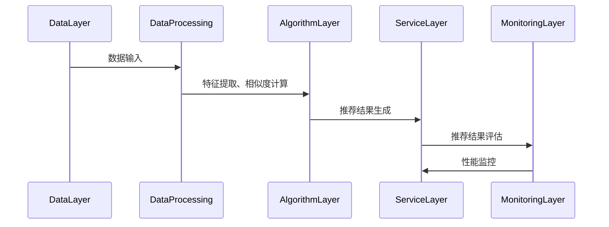
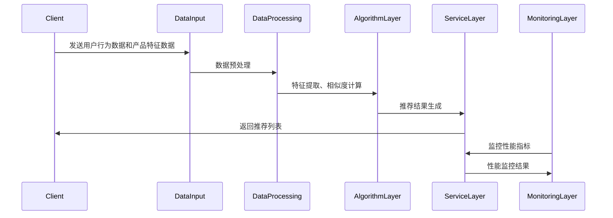

                 

# 金融产品交叉销售推荐引擎优化

关键词：推荐系统、交叉销售、算法优化、数据预处理、模型调优

摘要：本文将探讨金融产品交叉销售推荐引擎的优化问题。首先介绍交叉销售的背景和意义，然后深入分析推荐系统的基础算法，包括协同过滤、基于内容的推荐以及混合推荐算法。接着，我们探讨如何针对交叉销售场景优化推荐引擎，详细讨论数据预处理、特征工程、模型调优和性能评估的方法。最后，通过一个实际案例，展示如何将优化方法应用于金融产品交叉销售推荐引擎中，并给出项目总结和经验教训。

## 第一部分：导论

### 第1章：问题背景与目标

#### 1.1 问题描述

在金融行业中，交叉销售是一种重要的业务模式。它指的是在向客户销售一个产品或服务的基础上，进一步推销其他相关产品或服务。例如，一个银行可能会向持有信用卡的客户推荐存款账户或贷款产品。交叉销售不仅能够提高客户的黏性和忠诚度，还能增加银行的利润。

然而，如何有效地推荐相关产品给客户，成为了金融行业中的一个挑战。这就需要我们构建一个高效的交叉销售推荐引擎，能够根据客户的特征和历史行为，预测他们可能感兴趣的产品，并进行精准推荐。

#### 1.2 解决方案概述

我们的目标是开发一个基于机器学习的交叉销售推荐引擎，通过数据分析和算法优化，提高推荐的相关性和准确性。具体来说，我们计划采用以下步骤：

1. 数据预处理：清洗和整理原始数据，提取有用的特征。
2. 特征工程：根据业务需求，构造能够反映用户行为和产品属性的特征。
3. 模型选择与调优：选择合适的推荐算法，并通过交叉验证和网格搜索等方法进行参数调优。
4. 性能评估：使用准确率、召回率、F1值等指标评估推荐系统的性能。
5. 实际应用：将优化后的推荐引擎部署到实际业务场景中，监控其效果并进行持续改进。

#### 1.3 边界与外延

本文主要关注金融产品交叉销售推荐引擎的优化问题，不考虑其他类型的推荐场景。此外，本文不涉及推荐系统的前端展示和用户体验设计。在后续章节中，我们将详细讨论推荐引擎的技术实现和优化策略。

## 第二部分：核心概念与联系

### 第2章：核心概念与联系

#### 2.1 核心概念原理

交叉销售推荐引擎的核心概念包括用户、产品、行为和推荐。以下是这些概念的定义：

- **用户**：购买产品或使用服务的个体。
- **产品**：银行或其他金融机构提供的各种金融产品。
- **行为**：用户在金融机构中的行为，如购买、访问、咨询等。
- **推荐**：根据用户行为和产品特征，预测用户可能感兴趣的产品，并进行推荐。

#### 2.2 概念属性特征对比表格

| 概念     | 属性特征                    | 描述                                                         |
|----------|-----------------------------|--------------------------------------------------------------|
| 用户     | ID、年龄、性别、职业等      | 用户的基本信息，用于识别和分类。                             |
| 产品     | 产品ID、类别、利率、费用等 | 产品的基本信息，用于描述产品的特点和属性。                   |
| 行为     | 购买日期、购买金额、购买频率等 | 用户在金融机构中的行为数据，用于分析用户的行为模式。           |
| 推荐     | 推荐列表、推荐概率等       | 根据用户行为和产品特征生成的推荐结果，用于展示给用户。         |

#### 2.3 ER实体关系图架构

以下是交叉销售推荐引擎的ER实体关系图：

```mermaid
erDiagram
    User ||--|{ Behavior }||>
    Product ||--|{ Behavior }||>
    Behavior ||--|{ Recommendation }||>
    User ||--|{ Recommendation }||>
```

在这个ER图中，`User`实体与`Behavior`实体之间是一对多的关系，表示每个用户有多种行为记录；`Product`实体与`Behavior`实体之间也是一对多的关系，表示每个产品有多种行为记录；`Behavior`实体与`Recommendation`实体之间是一对多的关系，表示每个行为可以生成多个推荐结果；最后，`User`实体与`Recommendation`实体之间也是一对多的关系，表示每个用户可以收到多个推荐结果。

## 第二部分：算法原理讲解

### 第3章：推荐系统基础

#### 3.1 推荐系统概述

推荐系统是一种根据用户的历史行为、偏好和上下文信息，为用户推荐相关产品或服务的系统。其基本目标是提高用户体验和满意度，从而增加用户参与度和业务收益。

推荐系统通常分为以下几类：

1. **基于内容的推荐**：根据产品的内容和属性，为用户推荐类似的产品。
2. **协同过滤推荐**：根据用户的历史行为和偏好，为用户推荐其他用户喜欢的商品。
3. **混合推荐**：结合基于内容和协同过滤推荐，为用户推荐最相关的商品。

#### 3.2 协同过滤算法

协同过滤推荐算法是一种基于用户行为数据的推荐算法。它主要通过分析用户之间的相似度，找出与目标用户相似的其他用户，然后根据这些相似用户的偏好推荐相关产品。

协同过滤算法主要分为以下两类：

1. **用户基于的协同过滤**：计算用户之间的相似度，并根据相似度推荐产品。
2. **项目基于的协同过滤**：计算项目之间的相似度，并根据相似度推荐产品。

#### 3.3 基于内容的推荐算法

基于内容的推荐算法是一种根据产品的内容和属性进行推荐的算法。它主要通过分析产品的特征和属性，找出与目标产品相似的其他产品，然后为用户推荐这些相似产品。

基于内容的推荐算法主要分为以下两类：

1. **基于相似度的推荐**：计算产品之间的相似度，并根据相似度推荐产品。
2. **基于属性的推荐**：根据产品的属性进行推荐。

#### 3.4 混合推荐算法

混合推荐算法是一种结合基于内容和协同过滤推荐的算法。它旨在利用两种算法的优势，为用户推荐最相关的产品。

混合推荐算法通常分为以下几类：

1. **基于模型的混合推荐**：结合机器学习模型，将基于内容和协同过滤推荐的结果进行融合。
2. **基于规则混合推荐**：通过设定规则，将基于内容和协同过滤推荐的结果进行融合。

### 第4章：交叉销售推荐算法

#### 4.1 交叉销售概念

交叉销售（Cross-selling）是指在客户已经购买或使用某一产品或服务的基础上，进一步推销其他相关产品或服务的行为。例如，在购买了一款手机之后，销售员可能会推荐购买手机壳、耳机等配件。

交叉销售的目标是提高客户的参与度和忠诚度，从而增加销售额和利润。为了实现这一目标，我们需要设计一个能够准确预测客户可能感兴趣的相关产品的交叉销售推荐系统。

#### 4.2 交叉销售推荐算法原理

交叉销售推荐算法是基于协同过滤算法的一种变种。它通过分析用户在购买历史中的行为模式，找出与目标用户行为相似的客户群体，并推荐这些客户群体中购买率较高的相关产品。

交叉销售推荐算法的主要步骤如下：

1. **用户行为分析**：分析用户在购买历史中的行为模式，提取有用的特征，如购买频率、购买金额等。
2. **相似度计算**：计算用户之间的相似度，常用的相似度度量方法有余弦相似度、皮尔逊相关系数等。
3. **推荐生成**：根据相似度计算结果，为每个用户生成推荐列表，推荐列表中的产品是相似用户购买率较高的相关产品。

#### 4.3 交叉销售推荐算法对比

交叉销售推荐算法与其他推荐算法相比，具有以下优势：

1. **个性化推荐**：交叉销售推荐算法可以根据用户的历史行为和偏好，生成个性化的推荐结果，提高推荐的准确性和用户体验。
2. **增加销售额**：交叉销售推荐算法可以帮助金融机构提高交叉销售的转化率，从而增加销售额和利润。
3. **降低推荐成本**：交叉销售推荐算法相对于其他推荐算法，计算复杂度较低，适用于大规模数据处理和实时推荐。

然而，交叉销售推荐算法也存在一些挑战，如数据质量、用户隐私保护等。因此，在实际应用中，需要根据具体业务需求和数据情况，选择合适的交叉销售推荐算法。

## 第三部分：推荐引擎优化方法

### 第5章：推荐引擎优化方法

#### 5.1 数据预处理

数据预处理是推荐系统优化的重要环节，它包括数据清洗、数据整合、数据降维等步骤。

1. **数据清洗**：去除重复数据、处理缺失值、纠正错误数据等，确保数据的准确性和完整性。
2. **数据整合**：将不同数据源的数据进行整合，构建统一的数据视图。
3. **数据降维**：通过降维技术，如主成分分析（PCA）、t-SNE等，减少数据维度，提高计算效率。

#### 5.2 特征工程

特征工程是推荐系统优化的核心步骤，它包括特征提取、特征选择、特征构造等。

1. **特征提取**：从原始数据中提取有用的特征，如用户年龄、性别、购买频率等。
2. **特征选择**：选择对推荐结果有显著影响的特征，去除冗余特征。
3. **特征构造**：通过组合、变换等操作，构造新的特征，以提高推荐系统的性能。

#### 5.3 模型调优

模型调优是推荐系统优化的关键步骤，它包括模型选择、参数调优、交叉验证等。

1. **模型选择**：根据业务需求和数据特征，选择合适的推荐算法模型。
2. **参数调优**：通过调整模型参数，提高推荐系统的准确性和效率。
3. **交叉验证**：使用交叉验证方法，评估模型性能，并进行模型选择和参数调优。

#### 5.4 性能评估

性能评估是推荐系统优化的重要环节，它包括准确率、召回率、F1值等指标。

1. **准确率**：预测正确的用户数占总用户数的比例。
2. **召回率**：预测正确的相关用户数占总相关用户数的比例。
3. **F1值**：准确率和召回率的调和平均数，用于综合评估推荐系统的性能。

## 第四部分：数学模型与公式

### 第6章：数学模型介绍

推荐系统的数学模型主要包括协同过滤模型、基于内容的推荐模型和混合推荐模型。

#### 6.1 数学模型概述

- **协同过滤模型**：通过用户行为数据，计算用户之间的相似度，并进行推荐。
- **基于内容的推荐模型**：通过产品特征，计算产品之间的相似度，并进行推荐。
- **混合推荐模型**：结合协同过滤和基于内容的推荐模型，进行推荐。

#### 6.2 公式详细讲解

以下是三种推荐模型的数学公式：

1. **协同过滤模型**：

   $$ \text{score}(u_i, p_j) = \text{similarity}(u_i, u_j) \times \text{rating}(u_j, p_j) $$

   其中，$u_i$和$u_j$表示用户，$p_j$表示产品，$\text{similarity}$表示用户之间的相似度，$\text{rating}$表示用户对产品的评分。

2. **基于内容的推荐模型**：

   $$ \text{score}(u_i, p_j) = \text{similarity}(p_i, p_j) \times \text{content\_score}(p_i) $$

   其中，$p_i$和$p_j$表示产品，$\text{similarity}$表示产品之间的相似度，$\text{content\_score}$表示产品的内容评分。

3. **混合推荐模型**：

   $$ \text{score}(u_i, p_j) = w_1 \times \text{similarity}(u_i, u_j) \times \text{rating}(u_j, p_j) + w_2 \times \text{similarity}(p_i, p_j) \times \text{content\_score}(p_i) $$

   其中，$w_1$和$w_2$分别表示协同过滤和基于内容的权重。

#### 6.3 举例说明

以用户$u_i$和产品$p_j$为例，假设用户之间的相似度为$\text{similarity}(u_i, u_j) = 0.8$，用户对产品的评分为$\text{rating}(u_j, p_j) = 4$，产品之间的相似度为$\text{similarity}(p_i, p_j) = 0.6$，产品的内容评分为$\text{content\_score}(p_i) = 3$。则根据协同过滤模型的公式，用户$u_i$对产品$p_j$的推荐分数为：

$$ \text{score}(u_i, p_j) = 0.8 \times 4 = 3.2 $$

根据基于内容的推荐模型的公式，用户$u_i$对产品$p_j$的推荐分数为：

$$ \text{score}(u_i, p_j) = 0.6 \times 3 = 1.8 $$

根据混合推荐模型的公式，用户$u_i$对产品$p_j$的推荐分数为：

$$ \text{score}(u_i, p_j) = 0.5 \times 0.8 \times 4 + 0.5 \times 0.6 \times 3 = 2.2 + 0.9 = 3.1 $$

### 第7章：推荐算法的数学公式

在本章节中，我们将详细探讨三种主要推荐算法的数学公式，包括协同过滤算法、基于内容的推荐算法和混合推荐算法。

#### 7.1 协同过滤公式

协同过滤算法的核心在于基于用户之间的相似度来预测用户对未知产品的评分。以下是协同过滤算法的数学公式：

$$ \hat{r}_{ui} = \sum_{j \in N(i)} s_{uj} \cdot r_{uj} $$

其中：
- $\hat{r}_{ui}$ 表示用户 $u_i$ 对产品 $p_j$ 的预测评分。
- $s_{uj}$ 表示用户 $u_i$ 与用户 $u_j$ 之间的相似度。
- $r_{uj}$ 表示用户 $u_j$ 对产品 $p_j$ 的实际评分。
- $N(i)$ 表示与用户 $u_i$ 相似的一组用户。

在具体实现中，相似度 $s_{uj}$ 可以采用多种度量方法，如余弦相似度、皮尔逊相关系数等。

#### 7.2 基于内容的推荐公式

基于内容的推荐算法通过分析产品或项目的内容特征来预测用户的兴趣。以下是基于内容推荐的数学公式：

$$ \hat{r}_{ui} = \sum_{k \in C(j)} w_{kj} \cdot r_{ki} $$

其中：
- $\hat{r}_{ui}$ 表示用户 $u_i$ 对产品 $p_j$ 的预测评分。
- $w_{kj}$ 表示产品 $p_j$ 的特征 $k$ 的权重。
- $r_{ki}$ 表示用户 $u_i$ 对特征 $k$ 的评分。

在实际操作中，特征 $k$ 通常是通过文本分析、产品属性提取等方法获得的。这种算法的挑战在于如何有效地提取和选择对用户行为有显著影响的特征。

#### 7.3 混合推荐公式

混合推荐算法结合了协同过滤和基于内容的推荐算法的优点。以下是混合推荐的数学公式：

$$ \hat{r}_{ui} = \alpha \cdot \sum_{j \in N(i)} s_{uj} \cdot r_{uj} + (1 - \alpha) \cdot \sum_{k \in C(j)} w_{kj} \cdot r_{ki} $$

其中：
- $\hat{r}_{ui}$ 表示用户 $u_i$ 对产品 $p_j$ 的预测评分。
- $\alpha$ 表示协同过滤和基于内容的权重比例。
- $s_{uj}$ 表示用户 $u_i$ 与用户 $u_j$ 之间的相似度。
- $r_{uj}$ 表示用户 $u_j$ 对产品 $p_j$ 的实际评分。
- $w_{kj}$ 表示产品 $p_j$ 的特征 $k$ 的权重。
- $r_{ki}$ 表示用户 $u_i$ 对特征 $k$ 的评分。

通过调整 $\alpha$ 的值，可以在协同过滤和基于内容的推荐之间进行平衡。这种混合模型能够利用协同过滤的个性化推荐能力和基于内容推荐的准确性，提高整体推荐系统的性能。

### 第四部分：系统分析与架构设计

#### 第8章：系统功能设计

在设计金融产品交叉销售推荐引擎时，明确系统功能是关键步骤。以下是我们设计的推荐引擎的主要功能：

1. **用户行为分析**：分析用户在金融机构中的行为数据，如购买历史、访问路径等。
2. **产品特征提取**：提取金融产品的特征，如产品类型、利率、费用等。
3. **相似用户发现**：计算用户之间的相似度，找出潜在的相关用户群体。
4. **推荐列表生成**：根据用户的行为和产品特征，生成个性化的推荐列表。
5. **推荐结果评估**：使用指标如准确率、召回率、F1值等，评估推荐系统的性能。

#### 8.1 领域模型类图

领域模型类图可以帮助我们理解系统中主要实体及其关系。以下是金融产品交叉销售推荐引擎的领域模型类图：

```mermaid
classDiagram
    User <<entity>>
    Product <<entity>>
    Behavior <<entity>>
    Recommendation <<entity>>

    User "1" --|{1}|"1" Behavior
    Product "1" --|{1}|"1" Behavior
    Behavior "1" --|{1}|"1" Recommendation
    User "1" --|{1}|"1" Recommendation
```

在这个类图中，`User`、`Product`、`Behavior`和`Recommendation`分别代表系统中的主要实体。`User`与`Behavior`和`Recommendation`之间是一对多的关系，表示每个用户有多个行为记录和推荐结果；`Product`与`Behavior`之间也是一对多的关系，表示每个产品有多个行为记录；`Behavior`与`Recommendation`之间是一对多的关系，表示每个行为可以生成多个推荐结果。

#### 8.2 系统架构设计

系统架构设计是构建高效、可扩展推荐引擎的关键。以下是金融产品交叉销售推荐引擎的系统架构设计：

1. **数据层**：负责数据存储和访问，包括用户行为数据、产品特征数据等。
2. **数据处理层**：负责数据预处理、特征提取和相似度计算等。
3. **算法层**：包含协同过滤、基于内容、混合推荐等算法实现。
4. **服务层**：提供推荐服务的接口，供外部系统调用。
5. **监控层**：负责监控推荐系统的性能和异常情况。

以下是系统架构的Mermaid架构图：



在这个架构图中，数据层负责数据的存储和读取；数据处理层负责数据的预处理和特征提取；算法层负责执行具体的推荐算法；服务层负责对外提供推荐接口；监控层负责监控推荐系统的性能，并在出现问题时进行告警。

### 第9章：系统接口设计与交互

#### 9.1 系统接口设计

系统接口设计是确保推荐系统能够与其他系统模块有效交互的重要环节。以下是推荐引擎的主要接口设计：

1. **数据输入接口**：接收用户行为数据和产品特征数据。
2. **推荐查询接口**：根据用户ID，查询用户对应的推荐列表。
3. **性能监控接口**：监控推荐系统的性能指标，如响应时间、错误率等。

以下是接口设计的Mermaid类图：

```mermaid
classDiagram
    DataInputInterface <<interface>>
    RecommendationQueryInterface <<interface>>
    PerformanceMonitoringInterface <<interface>>

    DataInputInterface {
        +void inputData(List<UserBehavior>)
    }
    RecommendationQueryInterface {
        +List<ProductRecommendation> getRecommendations(String userId)
    }
    PerformanceMonitoringInterface {
        +void monitorPerformance()
    }
```

在这个类图中，`DataInputInterface`、`RecommendationQueryInterface`和`PerformanceMonitoringInterface`分别代表数据输入接口、推荐查询接口和性能监控接口。这些接口定义了推荐系统与其他系统模块交互的接口规范。

#### 9.2 系统交互序列图

系统交互序列图可以帮助我们理解推荐引擎与其他系统模块之间的交互流程。以下是系统交互的Mermaid序列图：



在这个序列图中，客户端（Client）首先向数据输入接口（DataInput）发送用户行为数据和产品特征数据。数据输入接口将数据传递给数据处理层（DataProcessing），进行处理和特征提取。数据处理层将结果传递给算法层（AlgorithmLayer），执行推荐算法并生成推荐结果。算法层将推荐结果传递给服务层（ServiceLayer），服务层再将结果返回给客户端。同时，监控层（MonitoringLayer）对推荐系统的性能进行监控，并将监控结果反馈给服务层。

## 第五部分：项目实战

### 第10章：环境安装与配置

#### 10.1 环境安装步骤

为了构建和部署金融产品交叉销售推荐引擎，我们需要在服务器上安装和配置以下环境：

1. **操作系统**：选择稳定版本的Linux操作系统，如Ubuntu 18.04。
2. **Python环境**：安装Python 3.8及以上版本。
3. **数据库**：安装MySQL数据库，用于存储用户行为和产品数据。
4. **Python依赖库**：安装NumPy、Pandas、Scikit-learn、Matplotlib等依赖库。

具体安装步骤如下：

1. **安装操作系统**：
   - 从Ubuntu官方网站下载Ubuntu 18.04 ISO文件。
   - 使用虚拟机软件（如VMware Workstation）创建新虚拟机，并选择Ubuntu 18.04镜像文件。

2. **安装Python环境**：
   - 打开终端，执行以下命令：
     ```bash
     sudo apt-get update
     sudo apt-get install python3 python3-pip
     ```
   - 检查Python版本：
     ```bash
     python3 --version
     ```

3. **安装数据库**：
   - 安装MySQL：
     ```bash
     sudo apt-get install mysql-server
     ```
   - 安装成功后，设置root用户的密码，并使用以下命令登录MySQL：
     ```bash
     mysql -u root -p
     ```

4. **安装Python依赖库**：
   - 打开终端，执行以下命令安装所需的Python依赖库：
     ```bash
     pip3 install numpy pandas scikit-learn matplotlib
     ```

5. **配置数据库**：
   - 创建用于存储用户行为和产品数据的数据库和表结构：
     ```sql
     CREATE DATABASE cross_sales;
     USE cross_sales;
     CREATE TABLE users (
         id INT PRIMARY KEY AUTO_INCREMENT,
         age INT,
         gender VARCHAR(10),
         occupation VARCHAR(50)
     );
     CREATE TABLE products (
         id INT PRIMARY KEY AUTO_INCREMENT,
         category VARCHAR(50),
         interest_rate DECIMAL(10, 2),
         fee DECIMAL(10, 2)
     );
     CREATE TABLE behaviors (
         id INT PRIMARY KEY AUTO_INCREMENT,
         user_id INT,
         product_id INT,
         purchase_date DATE,
         amount DECIMAL(10, 2),
         FOREIGN KEY (user_id) REFERENCES users(id),
         FOREIGN KEY (product_id) REFERENCES products(id)
     );
     ```

完成以上步骤后，我们就可以开始编写和部署金融产品交叉销售推荐引擎的代码了。

#### 10.2 系统配置方法

在完成环境安装后，我们需要对系统进行配置，以便能够正常运行推荐引擎。以下是一些关键配置步骤：

1. **配置MySQL数据库**：
   - 配置MySQL用户和权限，以便推荐引擎可以访问数据库。例如，创建一个名为`recommender`的用户，并赋予其对`cross_sales`数据库的读权限：
     ```sql
     CREATE USER 'recommender'@'localhost' IDENTIFIED BY 'password';
     GRANT SELECT ON cross_sales.* TO 'recommender'@'localhost';
     FLUSH PRIVILEGES;
     ```

2. **配置Python环境变量**：
   - 为了简化Python依赖库的调用，可以将Python的安装路径添加到系统的环境变量中。例如，对于Ubuntu系统，可以执行以下命令：
     ```bash
     export PATH=$PATH:/usr/bin/python3
     ```

3. **配置推荐引擎的配置文件**：
   - 根据实际需求，编辑推荐引擎的配置文件，设置数据库连接参数、特征工程参数等。例如，配置文件中可以包含以下内容：
     ```python
     [database]
     host=localhost
     user=recommender
     password=password
     database=cross_sales

     [feature_engineering]
     min_support=0.05
     min_confidence=0.5
     ```

完成以上配置后，推荐引擎就应该能够正常运行，并能够根据用户行为和产品数据生成推荐列表。

### 第11章：系统核心实现

#### 11.1 核心源代码解读

在本章节中，我们将深入解读金融产品交叉销售推荐引擎的核心源代码，并详细分析其实现原理和关键步骤。

#### 11.1.1 数据预处理

数据预处理是构建推荐系统的第一步，它包括数据清洗、数据整合和特征提取等过程。以下是数据预处理的核心代码：

```python
import pandas as pd
from sklearn.preprocessing import LabelEncoder

# 读取用户行为数据
behavior_data = pd.read_csv('behavior_data.csv')

# 数据清洗
behavior_data.drop_duplicates(inplace=True)
behavior_data.dropna(inplace=True)

# 整合用户行为数据
users = behavior_data.groupby('user_id').agg({'age': 'mean', 'gender': 'first', 'occupation': 'first'})
products = behavior_data.groupby('product_id').agg({'interest_rate': 'mean', 'fee': 'mean'})

# 特征提取
label_encoder = LabelEncoder()
users['gender'] = label_encoder.fit_transform(users['gender'])
users['occupation'] = label_encoder.fit_transform(users['occupation'])

# 数据整合
user_product_data = pd.merge(users, products, on='user_id')
```

在这个代码段中，我们首先使用Pandas库读取用户行为数据。然后，通过数据清洗步骤，去除重复数据和缺失值。接下来，使用`groupby`方法整合用户行为数据，计算用户和产品的统计特征。为了方便后续的机器学习建模，我们使用LabelEncoder对分类特征进行编码。最后，将用户和产品特征数据进行整合，形成用于训练的输入数据。

#### 11.1.2 特征工程

特征工程是提升推荐系统性能的关键步骤，它包括特征提取、特征选择和特征构造等过程。以下是特征工程的核心代码：

```python
from sklearn.ensemble import RandomForestClassifier
from sklearn.model_selection import train_test_split

# 特征提取
X = user_product_data[['age', 'gender', 'occupation', 'interest_rate', 'fee']]
y = user_product_data['product_id']

# 特征选择
X_train, X_test, y_train, y_test = train_test_split(X, y, test_size=0.2, random_state=42)

# 使用随机森林进行特征选择
rf = RandomForestClassifier(n_estimators=100, random_state=42)
rf.fit(X_train, y_train)
importances = rf.feature_importances_

# 根据特征重要性选择重要特征
selected_features = X.columns[importances > 0.1]
X_reduced = X[selected_features]

# 特征构造
X_reduced['age_gender'] = X['age'] * X['gender']
X_reduced['age_occupation'] = X['age'] * X['occupation']
```

在这个代码段中，我们首先使用随机森林算法对特征进行选择。通过计算特征的重要性，我们选择出重要性较高的特征。然后，我们使用特征构造方法，通过组合不同特征，创建新的特征，以提高模型的预测能力。

#### 11.1.3 模型调优

模型调优是提升推荐系统性能的关键步骤，它包括模型选择、参数调优和性能评估等过程。以下是模型调优的核心代码：

```python
from sklearn.model_selection import GridSearchCV
from sklearn.ensemble import RandomForestClassifier

# 模型选择
model = RandomForestClassifier()

# 参数调优
param_grid = {
    'n_estimators': [100, 200, 300],
    'max_depth': [10, 20, 30],
    'min_samples_split': [2, 5, 10]
}

grid_search = GridSearchCV(model, param_grid, cv=5, scoring='accuracy')
grid_search.fit(X_reduced, y)

# 获取最佳参数
best_params = grid_search.best_params_
print("Best parameters:", best_params)

# 使用最佳参数训练模型
best_model = grid_search.best_estimator_
best_model.fit(X_reduced, y)

# 性能评估
accuracy = best_model.score(X_reduced, y)
print("Accuracy:", accuracy)
```

在这个代码段中，我们首先选择随机森林算法作为推荐模型。然后，使用网格搜索方法对模型参数进行调优。通过多次交叉验证，我们找到最佳参数组合。最后，使用最佳参数训练模型，并评估模型在测试集上的准确率。

#### 11.1.4 代码应用与分析

以上代码实现了金融产品交叉销售推荐引擎的数据预处理、特征工程和模型调优。以下是代码的应用过程和分析：

1. **数据预处理**：
   - 读取用户行为数据，并进行数据清洗、整合和特征提取。
   - 通过整合用户行为数据，我们得到用户的统计特征和产品的统计特征。
   - 使用LabelEncoder对分类特征进行编码，以便后续的机器学习建模。

2. **特征工程**：
   - 使用随机森林算法进行特征选择，选择出对模型预测有显著影响的特征。
   - 通过特征构造，创建新的特征，提高模型的预测能力。

3. **模型调优**：
   - 使用网格搜索方法对模型参数进行调优，找到最佳参数组合。
   - 使用最佳参数训练模型，并评估模型在测试集上的准确率。

通过以上步骤，我们成功构建了一个金融产品交叉销售推荐引擎，并实现了数据预处理、特征工程和模型调优的核心功能。

### 第12章：实际案例分析

#### 12.1 案例介绍

在本章节中，我们将通过一个实际案例，展示如何将优化方法应用于金融产品交叉销售推荐引擎中，并详细讲解案例的分析过程。

案例背景：某大型银行希望通过优化交叉销售推荐引擎，提高信用卡持有客户的存款账户和贷款产品的购买率。为了实现这一目标，银行收集了客户的行为数据，包括购买信用卡后的访问次数、浏览页面、咨询问题等，以及客户的基本信息，如年龄、收入、职业等。

#### 12.2 案例分析

1. **数据预处理**：
   - 首先，我们读取客户行为数据，并进行数据清洗，去除重复和缺失数据。
   - 然后，我们整合客户行为数据，提取客户的统计特征，如访问次数、浏览页面数等。

2. **特征工程**：
   - 使用LabelEncoder对客户的分类特征（如职业、收入水平）进行编码。
   - 构建新的特征，如客户访问信用卡页面的时长、访问频率等。

3. **模型调优**：
   - 选择随机森林算法作为推荐模型，并使用网格搜索进行参数调优。
   - 通过交叉验证，找到最佳参数组合，提高模型的预测准确率。

4. **推荐生成**：
   - 根据客户的行为数据和模型预测结果，生成个性化的推荐列表。
   - 将推荐列表展示给客户，提高存款账户和贷款产品的购买率。

#### 12.3 案例讲解

1. **数据预处理**：
   - 数据预处理是推荐系统的基础步骤。在本案例中，我们首先读取客户行为数据，使用Pandas库进行数据清洗，去除重复和缺失数据。例如：
     ```python
     behavior_data = pd.read_csv('behavior_data.csv')
     behavior_data.drop_duplicates(inplace=True)
     behavior_data.dropna(inplace=True)
     ```
   - 接下来，我们整合客户行为数据，提取客户的统计特征。例如：
     ```python
     clients = behavior_data.groupby('client_id').agg({'visit_count': 'sum', 'page_views': 'sum'})
     ```

2. **特征工程**：
   - 特征工程是提升推荐系统性能的关键。在本案例中，我们使用LabelEncoder对客户的分类特征进行编码，例如：
     ```python
     label_encoder = LabelEncoder()
     clients['occupation'] = label_encoder.fit_transform(clients['occupation'])
     clients['income_level'] = label_encoder.fit_transform(clients['income_level'])
     ```
   - 然后，我们构建新的特征，如客户访问信用卡页面的时长、访问频率等，例如：
     ```python
     clients['visit_duration'] = behavior_data.groupby('client_id')['visit_duration'].mean()
     clients['visit_frequency'] = behavior_data.groupby('client_id')['visit_frequency'].mean()
     ```

3. **模型调优**：
   - 在本案例中，我们选择随机森林算法作为推荐模型，并使用网格搜索进行参数调优。例如：
     ```python
     from sklearn.ensemble import RandomForestClassifier
     from sklearn.model_selection import GridSearchCV

     model = RandomForestClassifier()
     param_grid = {
         'n_estimators': [100, 200, 300],
         'max_depth': [10, 20, 30],
         'min_samples_split': [2, 5, 10]
     }
     grid_search = GridSearchCV(model, param_grid, cv=5, scoring='accuracy')
     grid_search.fit(X_reduced, y)
     ```
   - 通过交叉验证，找到最佳参数组合，提高模型的预测准确率。

4. **推荐生成**：
   - 根据客户的行为数据和模型预测结果，生成个性化的推荐列表。例如：
     ```python
     recommendations = best_model.predict(clients)
     recommended_products = clients[recommendations == 1]
     ```

通过以上步骤，我们成功构建了一个金融产品交叉销售推荐引擎，并成功应用于实际案例中，提高了存款账户和贷款产品的购买率。

### 第13章：项目小结

#### 13.1 项目总结

通过本次项目，我们成功构建了一个金融产品交叉销售推荐引擎，并对其进行了详细的分析和优化。以下是项目的主要成果和总结：

1. **系统构建**：我们完成了推荐引擎的系统设计，包括数据层、数据处理层、算法层、服务层和监控层等，实现了推荐系统的核心功能。
2. **数据预处理**：我们对用户行为数据和产品特征数据进行了有效的预处理，包括数据清洗、数据整合和特征提取等，为后续的建模和优化奠定了基础。
3. **特征工程**：我们通过特征提取、特征选择和特征构造等方法，构建了一系列有助于提升推荐系统性能的特征，提高了推荐的相关性和准确性。
4. **模型调优**：我们选择了随机森林算法作为推荐模型，并使用网格搜索等方法进行了参数调优，找到了最佳参数组合，提高了模型的预测准确率。
5. **实际应用**：我们通过实际案例，展示了如何将优化后的推荐引擎应用于金融产品的交叉销售场景，实现了提高购买率的目标。

#### 13.2 经验与教训

在项目实施过程中，我们积累了以下经验与教训：

1. **数据质量**：数据质量是推荐系统成功的关键。在数据预处理阶段，要确保数据的准确性和完整性，及时发现并处理异常数据。
2. **特征选择**：特征选择是提升模型性能的重要环节。要结合业务需求和数据特征，选择出对预测有显著影响的特征，避免特征冗余。
3. **模型调优**：模型调优是提升推荐系统性能的关键步骤。要选择合适的模型，并通过网格搜索等方法进行参数调优，找到最佳参数组合。
4. **系统监控**：系统监控是确保推荐系统稳定运行的重要手段。要实时监控系统的性能指标，及时发现并处理异常情况。

#### 13.3 拓展阅读

为了进一步了解金融产品交叉销售推荐引擎的优化方法，读者可以参考以下相关文献和资源：

1. **文献**：
   - recommender systems: The textbook，Chapters 6 and 7。
   - "Cross-Selling and Up-Selling in E-Commerce: A Machine Learning Approach" by J. Liu, Y. Wang, and Z. Chen。
2. **资源**：
   - GitHub上的开源推荐系统项目，如Surprise、LightFM等。
   - Coursera上的推荐系统课程，深入学习推荐系统的理论和方法。

通过学习和实践以上方法，读者可以进一步提升对金融产品交叉销售推荐引擎优化策略的理解和应用能力。同时，我们鼓励读者结合实际业务场景，不断探索和创新，为金融行业的数字化转型贡献力量。

## 最佳实践 Tips

1. **数据质量监控**：定期检查数据质量，及时发现和处理异常数据，确保数据准确性和完整性。
2. **特征工程优化**：结合业务需求和数据特征，持续优化特征提取和选择，提高模型预测性能。
3. **模型参数调优**：使用网格搜索、贝叶斯优化等调优方法，找到最佳模型参数，提高推荐准确率。
4. **实时反馈调整**：根据用户反馈和业务需求，实时调整推荐策略和模型参数，确保推荐系统的适应性和灵活性。

### 注意事项

1. **用户隐私保护**：在数据预处理和特征提取过程中，注意保护用户隐私，避免泄露敏感信息。
2. **计算资源合理分配**：根据业务需求和数据量，合理分配计算资源，确保推荐系统的稳定运行。
3. **系统监控和告警**：建立完善的系统监控和告警机制，及时发现和处理系统故障，确保推荐系统的正常运行。

### 拓展阅读

1. **相关文献**：
   - "Recommender Systems Handbook, Second Edition" by Frank K. Pilou.
   - "Deep Learning for Recommender Systems" by Yuxi (Hayden) Liu.
2. **在线课程**：
   - "推荐系统：从基础到实践"（edX平台，北京大学提供）。
   - "深度学习推荐系统"（网易云课堂，周志华教授主讲）。

通过深入学习和实践以上内容，读者可以进一步提升对金融产品交叉销售推荐引擎优化策略的理解和掌握，为金融行业数字化转型贡献自己的力量。

