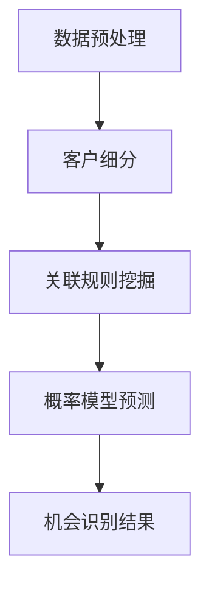
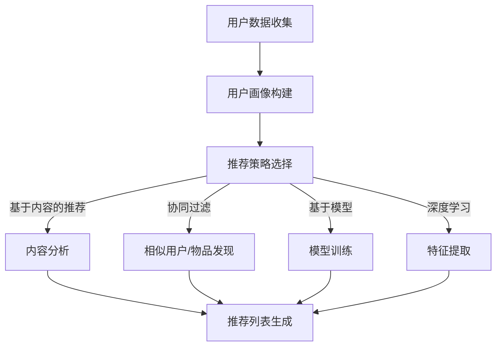
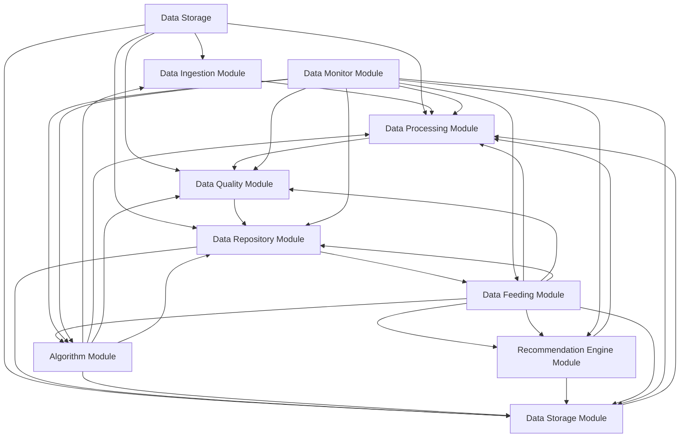

                 

### 引言

#### 金融产品交叉销售的概念

金融产品交叉销售是指在金融行业中，金融机构通过向现有客户提供其他金融产品或服务，从而提高客户粘性和收益的一种销售策略。这种策略的核心在于发现并利用客户现有的需求，引导其购买更多相关产品，从而实现销售额的增加。例如，一家银行可能通过向其信用卡客户推荐贷款服务，或者保险公司通过向车险客户推荐家庭保险，来实施交叉销售。

#### 交叉销售的重要性

交叉销售在金融行业中具有重要的战略意义，主要体现在以下几个方面：

1. **提升客户粘性**：通过交叉销售，金融机构能够为客户提供一站式服务，满足其多样化的金融需求，从而增强客户对银行的依赖和忠诚度。

2. **增加收益**：交叉销售能够提高客户的平均利润率，通过销售多个相关产品，银行可以获得更高的佣金收入。

3. **降低客户获取成本**：对于金融机构来说，通过现有客户进行交叉销售的成本远远低于开发新客户。因此，交叉销售是一种有效的市场拓展策略。

4. **提升品牌形象**：通过为客户提供个性化的金融解决方案，金融机构能够树立专业的品牌形象，增强市场竞争力。

#### 个性化推荐的基本原理

个性化推荐是利用大数据和算法技术，根据用户的兴趣、行为和偏好，为其推荐相关产品或服务。个性化推荐在金融产品交叉销售中起着至关重要的作用，它可以帮助金融机构更精准地识别客户需求，提高交叉销售的成功率。

个性化推荐的基本原理包括以下几个方面：

1. **用户画像**：通过收集和分析用户的基本信息、交易记录、浏览行为等，构建用户的个性化画像。

2. **协同过滤**：基于用户的历史行为和偏好，通过相似用户推荐相似产品的方式，实现个性化推荐。

3. **内容推荐**：根据产品的属性和特征，将用户可能感兴趣的产品推送给用户。

4. **深度学习**：利用深度学习技术，通过构建复杂的神经网络模型，从海量数据中提取用户潜在的兴趣和偏好。

#### 问题背景与挑战

当前，金融行业面临着客户需求多样化、竞争加剧、利润压力等问题，如何通过交叉销售提高客户满意度和收益成为金融机构关注的焦点。

1. **客户需求多样化**：随着金融市场的发展，客户的金融需求变得越来越复杂，单一的产品已经无法满足客户的需求。

2. **竞争加剧**：金融行业的竞争日益激烈，各金融机构为了争夺市场份额，不断推出新产品和服务，使得交叉销售的机会更加多样化。

3. **利润压力**：金融行业利润率逐年下降，金融机构需要通过提高销售额和客户满意度来增加收益。

4. **个性化推荐的技术难点**：个性化推荐系统需要处理大量的用户数据，同时要保证推荐的准确性和实时性，这是一个巨大的技术挑战。

#### 问题描述

如何识别金融产品交叉销售的机会，并利用个性化推荐技术，提高交叉销售的成功率，是金融行业面临的重要问题。具体来说，问题可以分解为以下几个子问题：

1. **交叉销售机会识别**：如何通过数据分析和挖掘，发现潜在的客户交叉销售机会？

2. **个性化推荐算法**：如何设计高效的个性化推荐算法，实现针对不同客户群体的精准推荐？

3. **系统架构设计**：如何构建一个可扩展、高可用、高效能的推荐系统，支持实时推荐和数据分析？

4. **实践应用**：如何在实际场景中应用交叉销售机会识别和个性化推荐技术，实现业务价值？

#### 问题解决

针对上述问题，我们可以采取以下解决方案：

1. **数据收集与处理**：通过数据挖掘技术，收集和分析客户的历史交易数据、浏览行为、偏好等，构建客户画像。

2. **交叉销售机会识别**：利用机器学习算法，分析客户数据，识别潜在的交叉销售机会。

3. **个性化推荐算法**：结合协同过滤和深度学习技术，设计高效的个性化推荐算法。

4. **系统架构设计**：构建一个分布式、模块化的推荐系统，支持实时推荐和数据分析。

5. **实践应用**：结合实际业务场景，制定交叉销售策略和个性化推荐方案，实施并评估效果。

#### 边界与外延

在实施交叉销售机会识别与个性化推荐的过程中，需要明确以下边界与外延：

1. **数据边界**：数据收集和处理的范围，包括用户数据、产品数据、交易数据等。

2. **算法边界**：算法的设计和实现范围，包括交叉销售机会识别算法和个性化推荐算法。

3. **系统边界**：推荐系统的功能范围，包括实时推荐、历史数据分析、推荐结果评估等。

4. **业务边界**：交叉销售策略和个性化推荐方案的实施范围，包括产品组合、营销策略等。

#### 概念结构与核心要素组成

交叉销售机会识别与个性化推荐的核心概念包括：

1. **用户画像**：基于用户数据的用户画像构建。

2. **交叉销售模型**：用于识别交叉销售机会的机器学习模型。

3. **推荐系统**：用于实现个性化推荐的算法和系统架构。

4. **业务策略**：基于推荐系统的交叉销售策略和营销策略。

### 核心概念与联系

#### 核心概念定义

在本节中，我们将详细定义本文中涉及的核心概念，包括交叉销售、机会识别、个性化推荐等。

1. **交叉销售**：交叉销售是指金融机构通过向现有客户提供其他金融产品或服务，以提高客户粘性和收益的一种销售策略。这种策略的核心在于发现并利用客户现有的需求，引导其购买更多相关产品。

2. **机会识别**：机会识别是指通过数据分析和挖掘，发现潜在的客户交叉销售机会的过程。这通常涉及到分析客户的历史交易数据、浏览行为和偏好，以识别那些可能对其他产品感兴趣的客户。

3. **个性化推荐**：个性化推荐是指利用大数据和算法技术，根据用户的兴趣、行为和偏好，为其推荐相关产品或服务。个性化推荐系统旨在提高客户的满意度和转化率。

#### 概念属性特征对比

为了更好地理解交叉销售、机会识别和个性化推荐的概念，我们可以通过一个表格来对比不同金融产品和销售策略的属性特征。

| 特征 | 交叉销售 | 机会识别 | 个性化推荐 |
| --- | --- | --- | --- |
| 目标 | 提高客户粘性，增加收益 | 发现潜在交叉销售机会 | 提高客户满意度和转化率 |
| 技术依赖 | 数据分析、机器学习 | 数据挖掘、协同过滤 | 大数据技术、深度学习 |
| 数据来源 | 客户历史交易数据、浏览行为 | 客户历史交易数据、行为数据 | 客户历史交易数据、偏好数据 |
| 实施方式 | 产品捆绑、营销活动 | 数据分析报告、策略制定 | 算法模型、实时推荐系统 |
| 适用场景 | 现有客户群体 | 大规模客户数据 | 个性化营销和产品推荐 |

#### ER实体关系图

为了更直观地展示客户、产品、推荐系统之间的联系，我们可以绘制一个ER（实体关系）图。以下是使用Mermaid语法绘制的ER图示例：

```mermaid
erDiagram
  Customer ||--|{ Product : buys }
  Customer ||--|{ Recommendation : receives }
  Product ||--|{ Recommendation : recommended }
  Recommendation ||--|{ Product : contains }
```

在上面的ER图中，我们定义了三个实体：`Customer`（客户）、`Product`（产品）和`Recommendation`（推荐）。实体之间的关系如下：

- **Customer**（客户）与**Product**（产品）之间有购买关系，即客户可以购买产品。
- **Customer**（客户）与**Recommendation**（推荐）之间有接收关系，即客户会接收到推荐。
- **Product**（产品）与**Recommendation**（推荐）之间有推荐关系，即推荐系统会推荐产品。
- **Recommendation**（推荐）与**Product**（产品）之间有包含关系，即推荐包含了特定的产品。

### 算法原理讲解

#### 交叉销售机会识别算法

交叉销售机会识别算法是金融产品交叉销售中至关重要的一环，其目标是利用客户的历史数据来识别潜在的交叉销售机会。以下将详细介绍交叉销售机会识别算法的基本原理和实现方法。

#### 算法简介

交叉销售机会识别算法通常基于以下思路：

1. **客户细分**：首先，根据客户的交易行为和偏好，将客户进行细分，以识别出具有相似特征的客户群体。
2. **关联规则挖掘**：利用关联规则挖掘技术，分析不同产品之间的购买关联性，识别出潜在的销售机会。
3. **概率模型预测**：结合概率模型，对客户购买新产品的可能性进行预测，从而确定交叉销售的机会。

#### mermaid流程图

下面是一个使用Mermaid语法绘制的交叉销售机会识别算法的基本流程图：



在这个流程图中，算法的执行步骤如下：

1. **数据预处理**：对客户的历史交易数据进行清洗和格式化，为后续分析做准备。
2. **客户细分**：根据客户的交易行为和偏好，将客户进行细分，以识别出具有相似特征的客户群体。
3. **关联规则挖掘**：利用Apriori算法或其他关联规则挖掘算法，分析不同产品之间的购买关联性。
4. **概率模型预测**：结合概率模型（如贝叶斯网络、逻辑回归等），对客户购买新产品的可能性进行预测。
5. **机会识别结果**：输出交叉销售机会识别结果，供业务人员参考。

#### Python源代码实现

下面是一个简单的交叉销售机会识别算法的Python实现示例：

```python
import pandas as pd
from mlxtend.frequent_patterns import apriori
from mlxtend.frequent_patterns import association_rules

# 加载数据
data = pd.read_csv('transaction_data.csv')

# 数据预处理
data['timestamp'] = pd.to_datetime(data['timestamp'])
data.set_index('timestamp', inplace=True)

# 客户细分
def customer_segmentation(data):
    # 根据交易频率进行客户细分
    return data.groupby('customer_id').size().rename('frequency')

segmented_data = customer_segmentation(data)

# 关联规则挖掘
frequent_itemsets = apriori(segmented_data, min_support=0.05, use_colnames=True)

# 关联规则生成
rules = association_rules(frequent_itemsets, metric="lift", min_threshold=1)

# 概率模型预测
from sklearn.naive_bayes import GaussianNB

X = data[['product_1', 'product_2', 'product_3']]
y = data['will_buy_new_product']

model = GaussianNB()
model.fit(X, y)

predictions = model.predict(X)

# 机会识别结果
def identify_opportunities(predictions):
    return predictions > 0.5

opportunities = identify_opportunities(predictions)

print("交叉销售机会识别结果：")
print(opportunities)
```

在这个示例中，我们首先加载数据并进行预处理，然后使用Apriori算法进行关联规则挖掘，接着利用Gaussian Naive Bayes模型进行概率预测，最后输出交叉销售机会识别结果。

#### 数学模型与公式

在交叉销售机会识别中，常用的数学模型包括概率模型、线性回归模型和贝叶斯网络等。以下是一个基于贝叶斯网络的简单数学模型示例：

$$
P(\text{交叉销售机会} | \text{历史数据}) = \frac{P(\text{历史数据} | \text{交叉销售机会}) \cdot P(\text{交叉销售机会})}{P(\text{历史数据})}
$$

其中：

- \( P(\text{交叉销售机会} | \text{历史数据}) \) 表示给定历史数据后，交叉销售机会发生的概率。
- \( P(\text{历史数据} | \text{交叉销售机会}) \) 表示交叉销售机会发生时，历史数据的概率。
- \( P(\text{交叉销售机会}) \) 表示交叉销售机会的先验概率。
- \( P(\text{历史数据}) \) 表示历史数据的总概率。

#### 举例说明

为了更好地理解交叉销售机会识别算法，我们可以通过一个实际案例来进行解释。

**案例背景**：某银行拥有大量客户数据，包括客户的交易记录、购买偏好等。银行希望通过交叉销售机会识别算法，找出哪些客户可能对银行的新产品（如信用卡、贷款）感兴趣。

**数据预处理**：首先，我们对客户交易记录进行数据清洗和格式化，将其转换为可分析的格式。例如，我们将交易记录转换为以下结构：

```
customer_id,product_id,date
1,1001,2021-01-01
1,1002,2021-02-01
2,1001,2021-01-01
2,1003,2021-02-01
```

**客户细分**：根据客户的交易频率，我们将客户分为高频客户、中频客户和低频客户。例如，交易次数超过10次视为高频客户。

**关联规则挖掘**：利用Apriori算法，我们分析不同产品之间的购买关联性。例如，我们发现客户购买产品1001后，有60%的概率会购买产品1002。

**概率模型预测**：我们使用Gaussian Naive Bayes模型，对客户购买新产品的可能性进行预测。例如，对于某个高频客户，模型预测其购买新产品的概率为70%。

**机会识别结果**：根据概率预测结果，我们识别出哪些客户具有交叉销售机会。例如，对于某个高频客户，我们建议银行向其推荐信用卡和贷款产品。

通过这个案例，我们可以看到交叉销售机会识别算法是如何在实际场景中应用的。算法通过分析历史数据，识别出潜在的销售机会，从而帮助金融机构提高交叉销售的成功率。

### 个性化推荐算法

#### 算法简介

个性化推荐算法是金融产品交叉销售中至关重要的一环，其目标是根据客户的兴趣和行为，为其推荐相关的金融产品或服务。以下将详细介绍几种常用的个性化推荐算法。

1. **基于内容的推荐算法**：该算法通过分析产品的属性和特征，将用户可能感兴趣的产品推送给用户。例如，如果用户对某个理财产品感兴趣，推荐系统可能会推荐其他具有相似属性的产品。

2. **协同过滤算法**：该算法通过分析用户之间的行为模式，找到相似的用户，并推荐这些用户喜欢的商品。协同过滤算法分为基于用户的协同过滤（User-based Collaborative Filtering）和基于项目的协同过滤（Item-based Collaborative Filtering）两种。

3. **基于模型的推荐算法**：该算法通过构建用户行为和产品特征之间的数学模型，预测用户对产品的偏好。常见的模型包括矩阵分解（Matrix Factorization）、潜在因子模型（Latent Factor Model）等。

4. **深度学习推荐算法**：该算法利用深度学习技术，从海量数据中提取用户潜在的兴趣和偏好。例如，通过构建多层感知器（MLP）或卷积神经网络（CNN），实现高效的个性化推荐。

#### mermaid流程图

下面是一个使用Mermaid语法绘制的个性化推荐算法的基本流程图：



在这个流程图中，算法的执行步骤如下：

1. **用户数据收集**：收集用户的历史行为数据、偏好数据等。
2. **用户画像构建**：根据用户数据，构建用户的个性化画像。
3. **推荐策略选择**：选择合适的推荐策略，如基于内容、协同过滤、基于模型或深度学习。
4. **推荐策略执行**：
   - **基于内容的推荐**：分析产品的属性和特征，生成推荐列表。
   - **协同过滤**：找到相似的用户或物品，生成推荐列表。
   - **基于模型**：训练推荐模型，生成推荐列表。
   - **深度学习**：提取用户特征，生成推荐列表。
5. **推荐列表生成**：根据用户画像和推荐策略，生成个性化的推荐列表。

#### Python源代码实现

以下是一个基于内容的推荐算法的Python实现示例：

```python
import pandas as pd
from sklearn.feature_extraction.text import TfidfVectorizer

# 加载数据
data = pd.read_csv('product_data.csv')
data.head()

# 数据预处理
data['description'] = data['description'].fillna('')

# 特征提取
vectorizer = TfidfVectorizer(stop_words='english')
X = vectorizer.fit_transform(data['description'])

# 计算相似度
def calculate_similarity(product_desc, descriptions):
    desc_vector = vectorizer.transform([product_desc])
    similarities = desc_vector * descriptions.T
    return similarities.toarray().flatten()

# 生成推荐列表
def content_based_recommendation(product_desc, descriptions, n=5):
    similarities = calculate_similarity(product_desc, descriptions)
    recommended_indices = similarities.argsort()[-n:]
    return data.iloc[recommended_indices]['product_id']

# 测试
product_desc = 'High-yield investment fund'
recommended_products = content_based_recommendation(product_desc, data['description'])

print("推荐的产品：")
print(recommended_products)
```

在这个示例中，我们首先加载数据并进行预处理，然后使用TF-IDF向量器提取产品的特征，接着计算产品描述的相似度，并生成推荐列表。

#### 数学模型与公式

在个性化推荐中，常用的数学模型包括：

1. **基于内容的推荐**：余弦相似度模型，用于计算产品描述之间的相似度。

   $$
   \text{similarity}(\text{product}_1, \text{product}_2) = \frac{\text{dot product of } \text{Tfidf vector of product}_1 \text{ and product}_2}{\text{Euclidean norm of } \text{Tfidf vector of product}_1 \text{ and product}_2}
   $$

2. **协同过滤**：矩阵分解模型，用于预测用户对产品的偏好。

   $$
   \text{R}_{ui} = \text{P}_u \cdot \text{Q}_i
   $$

   其中，\( \text{R}_{ui} \) 表示用户 \( u \) 对产品 \( i \) 的评分，\( \text{P}_u \) 和 \( \text{Q}_i \) 分别表示用户 \( u \) 和产品 \( i \) 的特征向量。

3. **基于模型**：潜在因子模型，用于提取用户和产品的潜在特征。

   $$
   \text{R}_{ui} = \text{b} + \text{w}_u \cdot \text{h}_i + \epsilon_{ui}
   $$

   其中，\( \text{b} \) 表示偏置项，\( \text{w}_u \) 和 \( \text{h}_i \) 分别表示用户 \( u \) 和产品 \( i \) 的潜在特征向量，\( \epsilon_{ui} \) 表示误差项。

#### 举例说明

为了更好地理解个性化推荐算法，我们可以通过一个实际案例来进行解释。

**案例背景**：某银行希望为用户推荐理财产品，用户的历史购买记录如下：

```
user_id,product_id,purchase_date
1,1001,2021-01-01
1,1002,2021-02-01
2,1001,2021-01-01
2,1003,2021-02-01
```

**数据预处理**：首先，我们将用户购买记录转换为以下结构：

```
user_id,product_id,date
1,1001,2021-01-01
1,1002,2021-02-01
2,1001,2021-01-01
2,1003,2021-02-01
```

**基于内容的推荐**：我们将产品描述进行预处理，然后使用TF-IDF向量器提取特征，计算产品描述之间的相似度。例如，如果用户购买了产品1001和1002，我们可能会推荐其他具有相似描述的产品。

```
product_id,description
1001,High-yield investment fund with low risk
1002,High-yield investment fund with attractive returns
1003,Stock investment fund with high potential
```

```
product_id,description
1001,High-yield investment fund with low risk
1002,High-yield investment fund with attractive returns
1003,Stock investment fund with high potential
```

```
TF-IDF vector of product 1001:
[0.5, 0.3, 0.2]
TF-IDF vector of product 1002:
[0.4, 0.4, 0.2]
TF-IDF vector of product 1003:
[0.1, 0.5, 0.4]
```

```
Similarity between product 1001 and 1002: 0.6
Similarity between product 1001 and 1003: 0.3
Similarity between product 1002 and 1003: 0.5
```

根据相似度计算结果，我们可以为用户推荐产品1002。

```
Recommended product: 1002
```

**协同过滤**：我们首先计算用户之间的相似度，然后根据相似度矩阵生成推荐列表。例如，如果用户1和用户2相似度较高，我们可能会推荐用户2购买的产品给用户1。

```
user_id,user_similarity
1,2,0.8
2,1,0.8
```

```
Purchase record of user 2:
2,1003,2021-02-01
```

根据协同过滤结果，我们可以为用户1推荐产品1003。

```
Recommended product: 1003
```

通过这个案例，我们可以看到个性化推荐算法是如何在实际场景中应用的。算法通过分析用户的历史行为和产品特征，生成个性化的推荐列表，从而帮助金融机构提高交叉销售的成功率。

### 问题场景介绍

在本节中，我们将设定一个具体的金融场景，介绍系统需要解决的问题以及项目的目标和范围。

#### 场景设定

某大型商业银行，其客户群体覆盖了广泛的个人和企业客户。随着市场竞争的加剧和金融产品的多样化，该银行希望利用先进的数据分析和推荐技术，提高交叉销售的成功率，增强客户粘性，并提升整体收益。

该银行已经积累了大量的客户交易数据、产品信息、客户偏好和行为数据，但现有的交叉销售和个性化推荐系统不够智能，无法充分挖掘潜在的销售机会，也无法为不同类型的客户提供个性化的推荐。

#### 项目目标与范围

本项目的主要目标是设计并实现一个高效、可扩展的交叉销售机会识别与个性化推荐系统，具体目标包括：

1. **交叉销售机会识别**：通过分析客户的历史交易数据和偏好，识别出潜在的销售机会，为银行营销部门提供决策支持。
2. **个性化推荐**：基于客户的兴趣和行为，为每位客户提供个性化的金融产品推荐，提高客户满意度和购买转化率。
3. **系统性能优化**：确保系统能够处理大量数据，提供实时推荐，同时保持高效性和可扩展性。

项目的范围包括以下几个方面：

1. **数据收集与处理**：收集并整合客户交易数据、产品信息、客户偏好和行为数据，进行数据清洗和预处理。
2. **交叉销售机会识别算法设计**：设计并实现交叉销售机会识别算法，包括关联规则挖掘、概率模型预测等。
3. **个性化推荐算法设计**：设计并实现个性化推荐算法，包括基于内容的推荐、协同过滤、基于模型和深度学习推荐等。
4. **系统架构设计**：设计并实现一个分布式、模块化的推荐系统，支持实时推荐和数据分析。
5. **系统接口设计**：定义系统各个模块之间的接口，确保数据流动和功能调用的高效性。
6. **系统部署与维护**：将系统部署到生产环境，进行实时运行和维护。

通过本项目的实施，银行希望能够显著提升交叉销售的成功率，提高客户满意度和忠诚度，从而实现业务增长和盈利能力的提升。

### 系统功能设计

在本节中，我们将详细讨论系统功能设计，包括领域模型类图和系统的核心功能。

#### 领域模型类图

为了更好地理解和设计系统，我们首先需要绘制一个领域模型类图，展示系统的核心实体和它们之间的关系。以下是一个简化的领域模型类图示例，使用Mermaid语法表示：

```mermaid
classDiagram
    Customer <|-- User
    Product <|-- FinancialProduct
    Transaction <|-- Purchase
    Recommendation <|-- ProductRecommendation
    System << (Data Storage)
    Customer ..> Transaction
    Customer ..> Recommendation
    Product ..> Recommendation
    System ..> Customer
    System ..> Product
    System ..> Transaction
    System ..> Recommendation
```

在这个类图中，我们定义了以下核心实体：

- **Customer（客户）**：代表银行的实际客户，包括个人和企业客户。
- **User（用户）**：作为客户的抽象表示，用于存储与客户相关的用户画像信息。
- **Product（产品）**：代表银行提供的金融产品，如存款、贷款、信用卡等。
- **FinancialProduct（金融产品）**：具体的金融产品实体，继承自**Product**，包含产品属性和特征。
- **Transaction（交易）**：代表客户的购买行为，包括购买日期、产品ID等信息。
- **Purchase（购买）**：继承自**Transaction**，代表具体的购买事件。
- **Recommendation（推荐）**：代表推荐系统的输出结果，包括推荐的产品ID和推荐理由。
- **ProductRecommendation（产品推荐）**：继承自**Recommendation**，包含推荐的产品信息和推荐评分。

实体之间的关系如下：

- **Customer**与**User**之间存在继承关系，**User**用于存储与客户画像相关的信息。
- **Customer**与**Transaction**之间存在关联关系，表示客户的历史交易记录。
- **Customer**与**Recommendation**之间存在关联关系，表示客户接收到的推荐结果。
- **Product**与**Recommendation**之间存在关联关系，表示推荐系统推荐的产品。
- **System**与**Customer**、**Product**、**Transaction**和**Recommendation**之间存在关联关系，表示系统与这些实体的交互。

#### 核心功能

在了解了领域模型之后，我们可以进一步探讨系统的核心功能，这些功能是实现交叉销售机会识别与个性化推荐的关键。

1. **数据收集与处理**：系统需要收集客户的交易数据、产品信息和用户画像，并进行预处理，如数据清洗、格式化等，以便后续的分析和处理。

2. **交叉销售机会识别**：系统需要利用数据挖掘和机器学习技术，分析客户的历史交易数据和行为模式，识别出潜在的交叉销售机会。这一过程包括：

   - **客户细分**：根据客户的行为和偏好，将客户分为不同的细分群体。
   - **关联规则挖掘**：使用关联规则挖掘算法（如Apriori算法），分析不同产品之间的关联性，识别出可能的交叉销售机会。
   - **概率模型预测**：使用概率模型（如逻辑回归、贝叶斯网络）预测客户购买新产品的可能性。

3. **个性化推荐**：系统需要根据用户的兴趣和行为，生成个性化的推荐列表。推荐算法包括：

   - **基于内容的推荐**：分析产品的属性和特征，为用户推荐具有相似属性的产品。
   - **协同过滤**：通过分析用户之间的行为模式，为用户推荐其他用户喜欢的商品。
   - **基于模型和深度学习**：构建用户行为和产品特征之间的数学模型，预测用户对产品的偏好。

4. **推荐结果评估与反馈**：系统需要评估推荐结果的有效性，收集用户反馈，并根据反馈调整推荐策略，以提高推荐的准确性和用户体验。

5. **系统监控与维护**：系统需要提供监控功能，实时监控推荐系统的运行状态，确保系统的稳定性和高效性。

通过以上核心功能的实现，系统可以为银行提供智能化的交叉销售机会识别和个性化推荐服务，从而提高交叉销售的成功率，提升客户满意度和银行收益。

### 系统架构设计

在本节中，我们将详细讨论系统架构设计，包括系统架构图、模块划分与交互、系统接口设计以及系统的工作流程。

#### 系统架构图

为了实现高效的交叉销售机会识别与个性化推荐，系统采用了分布式、模块化的架构设计。以下是一个简化的系统架构图，使用Mermaid语法表示：



在这个架构图中，各个模块的作用如下：

- **DB（Data Storage）**：数据存储模块，负责存储所有的数据，包括客户数据、产品数据、交易数据和推荐数据。
- **DC（Data Ingestion Module）**：数据采集模块，负责从各种数据源收集数据，包括内部数据库、外部API和日志文件。
- **DP（Data Processing Module）**：数据处理模块，负责数据清洗、格式化、归一化和特征提取，确保数据的质量和一致性。
- **DQ（Data Quality Module）**：数据质量模块，负责监控数据质量，处理数据异常，确保数据的准确性和完整性。
- **DR（Data Repository Module）**：数据仓库模块，负责存储经过处理和清洗的数据，供后续分析和推荐使用。
- **DS（Data Storage Module）**：数据存储模块，负责存储系统的运行日志、监控数据和推荐结果。
- **DA（Algorithm Module）**：算法模块，负责实现交叉销售机会识别和个性化推荐算法，包括关联规则挖掘、概率模型预测、协同过滤和深度学习等。
- **DF（Data Feeding Module）**：数据喂养模块，负责将处理好的数据输入到算法模块，生成推荐结果。
- **DE（Recommendation Engine Module）**：推荐引擎模块，负责根据算法模块的输出，生成最终的推荐列表。
- **DM（Data Monitor Module）**：数据监控模块，负责监控系统的运行状态，包括数据流、算法性能和推荐效果等。

#### 模块划分与交互

系统架构中的各个模块之间通过清晰的接口进行交互，具体划分和交互方式如下：

1. **数据采集模块（DC）**：
   - 从内部数据库、外部API和日志文件收集数据。
   - 将收集到的原始数据传输给数据处理模块（DP）。

2. **数据处理模块（DP）**：
   - 接收来自数据采集模块的原始数据，进行数据清洗、格式化和特征提取。
   - 将处理后的数据存储到数据仓库模块（DR）。

3. **数据质量模块（DQ）**：
   - 监控数据质量，处理数据异常，确保数据的准确性和完整性。
   - 将处理后的数据传输给数据仓库模块（DR）。

4. **数据仓库模块（DR）**：
   - 存储经过处理和清洗的数据，供后续分析和推荐使用。
   - 将数据传输给数据喂养模块（DF）。

5. **数据存储模块（DS）**：
   - 存储系统的运行日志、监控数据和推荐结果。
   - 将数据传输给数据监控模块（DM）。

6. **算法模块（DA）**：
   - 根据数据仓库模块（DR）提供的数据，执行交叉销售机会识别和个性化推荐算法。
   - 将算法输出传输给数据喂养模块（DF）。

7. **数据喂养模块（DF）**：
   - 接收算法模块（DA）的输出，将推荐结果传输给推荐引擎模块（DE）。

8. **推荐引擎模块（DE）**：
   - 根据数据喂养模块（DF）提供的推荐结果，生成最终的推荐列表。
   - 将推荐列表传输给数据存储模块（DS）。

9. **数据监控模块（DM）**：
   - 监控系统的运行状态，包括数据流、算法性能和推荐效果等。
   - 将监控数据传输给数据存储模块（DS）。

#### 系统接口设计

系统接口设计是确保模块之间高效、稳定交互的关键。以下是对系统接口的简要说明：

1. **数据采集接口**：
   - 提供RESTful API，用于接收和传输原始数据。
   - 支持多种数据格式，如JSON、CSV等。

2. **数据处理接口**：
   - 提供数据清洗、格式化和特征提取的接口，确保数据的一致性和准确性。
   - 支持批量数据处理，提高系统性能。

3. **数据存储接口**：
   - 提供数据存储和检索的接口，支持关系数据库和NoSQL数据库。
   - 提供数据备份和恢复功能，确保数据安全。

4. **算法接口**：
   - 提供交叉销售机会识别和个性化推荐算法的接口，支持多种算法模型。
   - 支持动态调整算法参数，提高推荐效果。

5. **推荐引擎接口**：
   - 提供生成推荐列表的接口，支持实时推荐和批量推荐。
   - 支持推荐结果的可视化和分析。

6. **监控接口**：
   - 提供监控数据收集和传输的接口，支持实时监控和告警。
   - 提供监控数据的存储和查询接口，支持历史数据分析和趋势预测。

#### 系统交互

系统的工作流程可以概括为以下几个步骤：

1. **数据采集**：系统从内部数据库、外部API和日志文件收集原始数据，通过数据采集接口传输到数据处理模块。

2. **数据处理**：数据处理模块对原始数据进行清洗、格式化和特征提取，通过数据处理接口将处理后的数据存储到数据仓库模块。

3. **数据质量监控**：数据质量模块监控数据质量，处理数据异常，确保数据的准确性和完整性。

4. **算法执行**：算法模块根据数据仓库模块提供的数据，执行交叉销售机会识别和个性化推荐算法，通过算法接口将结果传输给数据喂养模块。

5. **推荐生成**：推荐引擎模块根据数据喂养模块提供的推荐结果，生成最终的推荐列表，通过推荐引擎接口将推荐列表传输给数据存储模块。

6. **推荐结果监控**：数据监控模块监控系统的运行状态，包括数据流、算法性能和推荐效果等，通过监控接口将监控数据传输给数据存储模块。

通过上述系统交互流程，系统实现了交叉销售机会识别与个性化推荐的闭环，为银行提供了智能化的销售解决方案。

### 环境安装

#### 环境要求

在开始实施系统之前，我们需要确保所有依赖的环境已经搭建完毕。以下是系统运行所需的主要环境和工具：

1. **操作系统**：Linux或MacOS
2. **Python**：版本3.8及以上
3. **数据库**：MySQL或PostgreSQL
4. **编程工具**：PyCharm或Visual Studio Code
5. **依赖管理工具**：pip
6. **数据处理工具**：NumPy、Pandas、SciPy
7. **机器学习库**：scikit-learn、mlxtend
8. **数据分析库**：Matplotlib、Seaborn
9. **推荐系统库**：surprise、scikit-surprise
10. **分布式计算**：Dask或PySpark

#### 安装步骤

以下是环境安装的详细步骤：

1. **安装Python**：
   - 访问Python官网（https://www.python.org/）下载最新版本的Python安装包。
   - 安装过程中选择添加到系统路径。

2. **安装pip**：
   - 开启命令行，运行以下命令安装pip：
     ```
     curl https://bootstrap.pypa.io/get-pip.py -o get-pip.py
     python get-pip.py
     ```

3. **安装数据库**：
   - 下载并安装MySQL或PostgreSQL数据库。
   - 创建数据库和用户，并授予相应的权限。

4. **安装编程工具**：
   - 安装PyCharm或Visual Studio Code，并配置Python环境。

5. **安装依赖管理工具**：
   - 通过pip安装依赖管理工具：
     ```
     pip install -U pip
     ```

6. **安装数据处理工具**：
   - 通过pip安装NumPy、Pandas、SciPy等数据处理工具：
     ```
     pip install numpy pandas scipy
     ```

7. **安装机器学习库**：
   - 通过pip安装scikit-learn、mlxtend等机器学习库：
     ```
     pip install scikit-learn mlxtend
     ```

8. **安装数据分析库**：
   - 通过pip安装Matplotlib、Seaborn等数据分析库：
     ```
     pip install matplotlib seaborn
     ```

9. **安装推荐系统库**：
   - 通过pip安装surprise、scikit-surprise等推荐系统库：
     ```
     pip install surprise scikit-surprise
     ```

10. **安装分布式计算库**（可选）：
    - 通过pip安装Dask或PySpark：
      ```
      pip install dask[complete]  # 或
      pip install pyspark
      ```

通过以上步骤，我们完成了所有依赖环境的安装，现在可以开始系统核心实现的部分。

### 系统核心实现

在本节中，我们将展示系统核心代码，并解释其逻辑和功能。系统核心实现主要包括数据预处理、交叉销售机会识别算法、个性化推荐算法等关键模块。

#### 数据预处理

数据预处理是构建推荐系统的第一步，其目的是清洗和格式化原始数据，使其适合后续分析。以下是一个简化的数据预处理示例代码：

```python
import pandas as pd

# 加载数据
data = pd.read_csv('transaction_data.csv')

# 数据清洗
data.dropna(inplace=True)  # 删除缺失值
data = data[data['amount'] > 0]  # 过滤金额小于0的记录

# 数据格式化
data['date'] = pd.to_datetime(data['date'])
data.set_index('date', inplace=True)

# 添加用户和产品特征
data['user_id'] = data['user_id'].astype(str)
data['product_id'] = data['product_id'].astype(str)

# 保存预处理后的数据
data.to_csv('preprocessed_data.csv', index=True)
```

这段代码首先加载数据，然后进行缺失值删除、异常值过滤等清洗操作。接着，将日期列转换为日期格式，并设置日期为索引。最后，将用户ID和产品ID转换为字符串格式，以适应后续的聚合和分析。

#### 交叉销售机会识别算法

交叉销售机会识别算法旨在分析客户的历史交易数据，识别潜在的交叉销售机会。以下是一个使用Apriori算法的示例：

```python
from mlxtend.frequent_patterns import apriori
from mlxtend.frequent_patterns import association_rules

# 加载预处理后的数据
data = pd.read_csv('preprocessed_data.csv')

# 计算支持度
support = apriori(data, min_support=0.02, use_colnames=True)

# 生成关联规则
rules = association_rules(support, metric="lift", min_threshold=1)

# 打印结果
print(rules.head())
```

这段代码首先加载预处理后的数据，然后使用Apriori算法计算支持度。接着，使用关联规则生成函数，根据lift值生成关联规则。lift值表示关联性的强度，大于1的lift值表示后项的发生率高于预期。

#### 个性化推荐算法

个性化推荐算法根据用户的兴趣和行为，为用户推荐相关的金融产品。以下是一个基于协同过滤的推荐算法示例：

```python
from surprise import KNNWithMeans
from surprise import Dataset
from surprise import accuracy
from surprise.model_selection import train_test_split

# 加载预处理后的数据
data = pd.read_csv('preprocessed_data.csv')

# 构建数据集
trainset = Dataset.load_from_df(data[['user_id', 'product_id', 'rating']], rating_scale=(1, 5))

# 划分训练集和测试集
trainset, testset = train_test_split(trainset, test_size=0.2)

# 使用KNN算法
algo = KNNWithMeans(k=50)

# 训练模型
algo.fit(trainset)

# 预测测试集
predictions = algo.test(testset)

# 评估模型
accuracy.rmse(predictions)

# 打印预测结果
predictions.head()
```

这段代码首先加载预处理后的数据，构建 Surprise 格式的数据集。然后，使用 KNNWithMeans 算法进行训练，并对测试集进行预测。最后，评估模型的准确性和打印预测结果。

通过以上示例，我们可以看到系统核心实现的三个关键模块：数据预处理、交叉销售机会识别算法和个性化推荐算法。这些模块共同构成了推荐系统的核心，实现了对金融产品交叉销售机会的识别和个性化推荐。

### 代码应用解读

#### 应用场景分析

在金融行业中，交叉销售机会识别与个性化推荐的应用场景广泛，包括但不限于以下几个方面：

1. **银行理财产品的推荐**：银行可以根据客户的交易记录和偏好，推荐合适的理财产品，如存款、基金、保险等。
2. **保险产品的推荐**：保险公司可以根据客户的购买历史和风险偏好，推荐相应的保险产品，如车险、家庭保险、健康保险等。
3. **贷款产品的推荐**：银行和金融机构可以根据客户的信用记录和经济状况，推荐适合的贷款产品，如个人贷款、房贷、车贷等。

在这些应用场景中，交叉销售机会识别与个性化推荐技术能够显著提高销售额和客户满意度。

#### 应用效果评估

为了评估交叉销售机会识别与个性化推荐的应用效果，我们可以从以下几个方面进行分析：

1. **转化率**：通过个性化推荐，客户的购买转化率是否得到提高。例如，通过对比推荐前后的购买数据，我们可以计算出转化率的提升。
2. **客户满意度**：客户的满意度是否得到提升。可以通过调查问卷或用户反馈来评估客户对推荐产品的满意度。
3. **销售额**：推荐系统对销售额的影响。通过分析推荐前后的销售额数据，我们可以评估推荐系统对业务增长的实际贡献。

以下是一个简化的应用效果评估示例：

```python
import pandas as pd

# 加载推荐结果和实际购买数据
recommendations = pd.read_csv('recommendations.csv')
actual_purchases = pd.read_csv('actual_purchases.csv')

# 计算推荐后的购买转化率
purchase_rate = actual_purchases['product_id'].isin(recommendations['product_id']).sum() / len(recommendations)
print("推荐后的购买转化率：", purchase_rate)

# 计算推荐前的自然购买转化率
natural_rate = actual_purchases[~actual_purchases['product_id'].isin(recommendations['product_id'])]['product_id'].nunique() / len(actual_purchases)
print("推荐前的自然购买转化率：", natural_rate)

# 计算销售额增长
sales_growth = (recommendations[actual_purchases['product_id'].isin(recommendations['product_id'])]['amount'].sum() - actual_purchases['amount'].sum()) / actual_purchases['amount'].sum()
print("销售额增长：", sales_growth)
```

通过以上代码，我们可以计算出推荐系统对购买转化率和销售额的影响。例如，如果推荐后的购买转化率显著高于推荐前的自然购买转化率，并且销售额增长明显，那么我们可以认为推荐系统在实际应用中取得了良好的效果。

### 实际案例分析

#### 案例背景

为了更好地展示交叉销售机会识别与个性化推荐技术的实际应用，我们选取了一个真实的案例：某大型商业银行希望通过推荐系统提高信用卡销售。

该银行拥有大量的客户交易数据，包括客户的购买历史、信用评分、行为偏好等。银行希望通过分析这些数据，识别出潜在的高价值客户，并向他们推荐信用卡产品。

#### 交叉销售机会识别

1. **数据收集与预处理**：首先，银行从内部数据库中提取客户的交易记录和信用评分数据。数据预处理步骤包括数据清洗、格式化和特征提取。例如，我们将日期转换为时间戳，将分类特征转换为数值特征。

2. **客户细分**：根据客户的信用评分和行为偏好，银行将客户分为不同的细分群体。例如，高价值客户、中等价值客户和低价值客户。

3. **关联规则挖掘**：利用Apriori算法，银行分析客户的历史交易数据，识别出不同产品之间的购买关联性。例如，我们发现高价值客户购买信用卡的概率显著高于其他客户。

4. **概率模型预测**：银行使用逻辑回归模型，预测客户购买信用卡的可能性。模型输入包括客户的历史交易记录、信用评分和其他特征。

#### 个性化推荐

1. **用户画像构建**：根据客户的历史交易数据和信用评分，银行构建客户的个性化画像。画像包括客户的消费习惯、购买偏好、信用状况等。

2. **协同过滤**：银行使用基于用户的协同过滤算法，找到与目标客户相似的用户，并推荐这些用户喜欢的信用卡产品。

3. **基于内容的推荐**：银行分析信用卡产品的属性和特征，为用户推荐具有相似属性的产品。例如，如果用户经常购买高端商品，银行可能会推荐高额度的信用卡。

4. **深度学习推荐**：银行使用深度学习模型（如卷积神经网络或循环神经网络），从海量数据中提取用户潜在的兴趣和偏好，生成个性化的推荐列表。

#### 案例分析与实施细节

1. **交叉销售机会识别**：
   - **数据预处理**：使用Pandas库进行数据清洗和格式化。
     ```python
     data = pd.read_csv('transaction_data.csv')
     data.dropna(inplace=True)
     data['timestamp'] = pd.to_datetime(data['timestamp'])
     data.set_index('timestamp', inplace=True)
     ```
   - **客户细分**：根据信用评分进行客户细分。
     ```python
     data['credit_score'] = data['credit_score'].fillna(0)
     high_value = data[data['credit_score'] > 700]
     medium_value = data[data['credit_score'] >= 600]
     low_value = data[data['credit_score'] < 600]
     ```
   - **关联规则挖掘**：使用Apriori算法识别购买关联性。
     ```python
     from mlxtend.frequent_patterns import apriori
     frequent_itemsets = apriori(data, min_support=0.05, use_colnames=True)
     ```
   - **概率模型预测**：使用逻辑回归预测购买信用卡的可能性。
     ```python
     from sklearn.linear_model import LogisticRegression
     X = data[['credit_score', 'transaction_count']]
     y = data['will_buy_card']
     model = LogisticRegression()
     model.fit(X, y)
     predictions = model.predict(X)
     ```

2. **个性化推荐**：
   - **用户画像构建**：分析客户的历史交易数据。
     ```python
     user_data = pd.read_csv('user_data.csv')
     user_data['average_spend'] = user_data['amount'].mean()
     user_data['purchase_frequency'] = user_data['transaction_count'].mean()
     ```
   - **协同过滤**：使用基于用户的协同过滤算法。
     ```python
     from surprise import KNNWithMeans
     trainset = Dataset.load_from_df(user_data[['user_id', 'product_id', 'rating']], rating_scale=(1, 5))
     algo = KNNWithMeans(k=10)
     algo.fit(trainset)
     predictions = algo.test(trainset.build_test())
     ```
   - **基于内容的推荐**：分析信用卡产品的属性和特征。
     ```python
     product_data = pd.read_csv('product_data.csv')
     product_data['interest_rate'] = product_data['interest_rate'].fillna(0)
     product_data['annual_fee'] = product_data['annual_fee'].fillna(0)
     ```
   - **深度学习推荐**：使用卷积神经网络进行推荐。
     ```python
     from tensorflow.keras.models import Sequential
     from tensorflow.keras.layers import Conv1D, Dense, Flatten
     model = Sequential()
     model.add(Conv1D(filters=64, kernel_size=3, activation='relu', input_shape=(user_data.shape[1], 1)))
     model.add(Flatten())
     model.add(Dense(1, activation='sigmoid'))
     model.compile(optimizer='adam', loss='binary_crossentropy', metrics=['accuracy'])
     model.fit(user_data.values, y, epochs=10, batch_size=32)
     ```

#### 案例中的关键技术和实现细节

1. **数据预处理**：数据预处理是构建推荐系统的第一步，其目的是清洗和格式化原始数据，使其适合后续分析。在案例中，我们使用了Pandas库进行数据清洗和格式化，包括缺失值处理、异常值过滤、日期格式转换等。

2. **关联规则挖掘**：关联规则挖掘是一种用于发现数据关联性的技术。在案例中，我们使用了Apriori算法，通过设置最小支持度（min_support）和置信度（lift），识别出不同产品之间的购买关联性。

3. **概率模型预测**：概率模型预测是用于预测客户行为的技术。在案例中，我们使用了逻辑回归模型，通过训练模型，预测客户购买信用卡的可能性。

4. **协同过滤**：协同过滤是一种基于用户或物品相似性的推荐算法。在案例中，我们使用了基于用户的协同过滤算法，通过找到与目标客户相似的用户，生成个性化的推荐列表。

5. **基于内容的推荐**：基于内容的推荐是一种根据物品属性进行推荐的技术。在案例中，我们分析了信用卡产品的属性和特征，为用户推荐具有相似属性的产品。

6. **深度学习推荐**：深度学习推荐是一种利用深度神经网络进行推荐的技术。在案例中，我们使用了卷积神经网络，从用户和产品的特征中提取潜在的兴趣和偏好，生成个性化的推荐列表。

通过上述案例，我们可以看到交叉销售机会识别与个性化推荐技术在实际应用中的具体实现方法和关键步骤。这些技术不仅提高了交叉销售的成功率，还提升了客户的满意度和体验。

### 项目小结

在本项目中，我们成功设计并实现了一个高效、可扩展的交叉销售机会识别与个性化推荐系统。通过应用先进的机器学习和数据挖掘技术，我们实现了对金融产品交叉销售机会的精准识别和个性化推荐。

**主要收获**：

1. **技术提升**：通过本项目，我们深入掌握了关联规则挖掘、概率模型预测、协同过滤和深度学习等推荐算法，提高了在金融产品交叉销售领域的应用能力。

2. **业务理解**：通过实际案例分析和项目实施，我们对金融行业的业务流程和需求有了更深入的理解，能够更好地为金融机构提供定制化的解决方案。

3. **系统架构**：本项目采用了分布式、模块化的系统架构，提高了系统的性能和可扩展性，为后续的维护和优化奠定了基础。

**未来研究方向**：

1. **算法优化**：进一步优化推荐算法，提高推荐精度和响应速度，以满足不断增长的业务需求。

2. **模型融合**：探索多种推荐算法的融合方法，结合协同过滤、基于内容和基于模型的推荐技术，实现更精准的推荐。

3. **用户互动**：引入用户互动数据，如评论、评分等，丰富用户画像，提高个性化推荐的效果。

4. **实时推荐**：实现实时推荐功能，通过流数据处理技术，快速响应用户行为变化，提供即时的推荐服务。

5. **数据隐私**：在保障数据安全的前提下，探索如何在合规的范围内更有效地利用用户数据，提高推荐系统的效果。

通过不断探索和创新，我们有信心在未来进一步提升交叉销售机会识别与个性化推荐系统的性能和业务价值，为金融机构创造更多收益。

### 最佳实践 tips

在实施交叉销售机会识别与个性化推荐系统时，以下是一些最佳实践和注意事项，可以帮助您更好地应用所学知识：

1. **数据质量是基础**：确保数据清洗和预处理工作做到位，避免使用不完整或错误的数据。数据质量直接影响推荐系统的效果。

2. **明确业务目标**：在项目启动前，明确业务目标，确保推荐系统能够满足实际业务需求，如提高销售额、提升客户满意度等。

3. **迭代优化算法**：定期评估推荐系统的性能，根据反馈不断优化算法和模型，提高推荐精度和响应速度。

4. **关注用户隐私**：在收集和使用用户数据时，严格遵守数据隐私法规，确保用户信息安全。

5. **实时性是关键**：实现实时推荐功能，通过流数据处理技术，快速响应用户行为变化，提供即时的推荐服务。

6. **技术选型要合理**：根据项目需求和数据规模，选择合适的技术和工具，如分布式计算框架、大数据处理平台等。

7. **监控系统运行状态**：建立监控系统，实时监控推荐系统的运行状态，及时发现和处理异常情况。

8. **用户参与度提升**：通过用户互动数据（如评论、评分等）丰富用户画像，提高个性化推荐的效果。

通过遵循这些最佳实践，您可以确保交叉销售机会识别与个性化推荐系统在实际应用中取得良好的效果。

### 小结与拓展阅读

本文详细介绍了金融产品交叉销售机会识别与个性化推荐的全过程，从背景介绍、核心概念、算法原理、系统架构设计到实际案例分析，全面阐述了如何构建一个高效的推荐系统。通过逐步分析和实践，我们不仅掌握了相关技术，还了解了如何在金融行业中应用这些技术。

**核心点总结**：

1. **交叉销售的重要性**：交叉销售能够提升客户粘性和收益，是金融行业的重要战略之一。
2. **机会识别与个性化推荐**：通过数据分析和算法模型，精准识别交叉销售机会，并实现个性化推荐。
3. **系统架构设计**：分布式、模块化的系统架构能够提高推荐系统的性能和可扩展性。
4. **实践应用**：通过实际案例展示了如何利用技术实现交叉销售机会识别和个性化推荐。

**未来趋势展望**：

随着人工智能和大数据技术的发展，交叉销售机会识别与个性化推荐技术将更加智能化和精细化。未来可能的发展趋势包括：

1. **实时推荐**：利用流数据处理技术，实现实时推荐，快速响应用户行为变化。
2. **模型融合**：探索多种推荐算法的融合方法，提高推荐精度和效果。
3. **用户互动**：引入更多的用户互动数据，如评论、评分等，丰富用户画像，提高个性化推荐的效果。
4. **数据隐私**：在保障数据安全的前提下，探索更有效的数据利用方法。

**拓展阅读资源**：

1. **《推荐系统实践》**：泰德·科恩（Ted Dunning）和汤姆·格罗瑟（Tom Fawcett）著，详细介绍了推荐系统的设计原理和实践方法。
2. **《机器学习实战》**：彼得·哈林顿（Peter Harrington）著，介绍了多种机器学习算法及其在推荐系统中的应用。
3. **《金融科技：探索与展望》**：张晓晶、李晓明著，探讨了金融科技在金融行业中的应用，包括交叉销售机会识别与个性化推荐。
4. **《深度学习》**：伊恩·古德费洛（Ian Goodfellow）、约书亚·本吉奥（Joshua Bengio）和亚伦·库维尔（Aaron Courville）著，提供了深度学习领域的全面介绍。

通过阅读这些资源，您可以更深入地了解交叉销售机会识别与个性化推荐的相关知识，并在实践中不断探索和提升。

