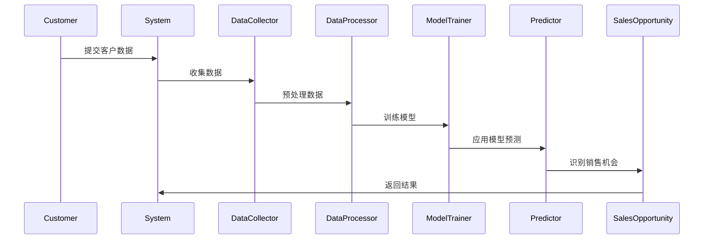

                 

### 金融产品交叉销售机会识别系统的背景介绍

#### 问题背景

在当今竞争激烈的金融市场中，金融机构如何通过有效的销售策略提升客户满意度和增加收益，已成为一个关键问题。传统的销售模式往往依赖于人工经验，不仅效率低下，而且难以把握客户的需求变化。随着大数据和人工智能技术的发展，构建一套自动化、智能化的交叉销售机会识别系统，成为金融机构提升竞争力的重要手段。

**问题描述**：
- **客户需求变化**：客户需求多样且不断变化，金融机构难以通过传统的客户关系管理手段准确把握客户需求。
- **销售策略效果不显著**：传统销售策略受限于人力和时间，难以实现精准、大规模的交叉销售。
- **收益增长压力**：随着金融市场的竞争加剧，金融机构需要寻找新的增长点，提高收益。

**问题解决**：
- **构建交叉销售机会识别系统**：通过自动化分析客户数据，智能识别潜在的销售机会，提升交叉销售的成功率。
- **提高客户满意度**：通过个性化推荐和精准营销，满足客户的多样化需求，提高客户满意度。
- **增加收益**：通过有效利用交叉销售机会，增加销售收入，提升整体收益。

#### 边界与外延

**应用范围**：
- **银行**：银行作为金融行业的核心，可以通过交叉销售机会识别系统，提升理财产品、信用卡、贷款等业务的交叉销售效果。
- **保险公司**：保险公司可以通过识别客户购买保险产品的机会，促进车险、健康险、财产险等多产品的交叉销售。
- **证券公司**：证券公司可以通过分析客户投资行为，推荐其他金融产品，提升资产管理、股票、基金等业务的交叉销售率。

**概念结构与核心要素组成**：

1. **客户数据**：
   - **个人信息**：客户的姓名、年龄、性别、职业等基本信息。
   - **消费记录**：客户的消费行为数据，包括购物、转账、贷款等交易记录。
   - **金融产品持有情况**：客户目前持有的金融产品类型和数量。

2. **交叉销售策略**：
   - **数据分析**：通过分析客户数据，发现客户的潜在需求和购买意愿。
   - **产品推荐**：根据客户的历史行为和偏好，推荐其他金融产品。

3. **系统架构**：
   - **数据采集**：从各个数据源收集客户数据。
   - **数据预处理**：清洗、整合客户数据，为后续分析做准备。
   - **算法模型训练**：使用机器学习算法，训练交叉销售机会识别模型。
   - **预测模型应用**：将训练好的模型应用于实际客户数据，预测潜在的销售机会。

### Step 2: 核心概念与联系

#### 金融产品交叉销售机会

**概念定义**：
交叉销售机会是指通过分析客户的数据，识别出客户可能对其他金融产品感兴趣的机会。这不仅可以提升客户的满意度，还可以增加金融机构的收益。

**属性特征对比表格**：

| 特征         | 传统销售               | 交叉销售               |
| ------------ | ---------------------- | ---------------------- |
| 客户关系     | 基于单一产品          | 基于多产品，深度关系   |
| 产品组合     | 单一产品               | 多产品组合             |
| 利润率       | 较低                   | 较高                   |
| 客户满意度   | 较低                   | 较高                   |

通过上述对比，可以看出交叉销售在提升客户关系、产品组合和利润率方面具有明显优势。

#### 客户数据挖掘与分析

**ER实体关系图架构**：

```mermaid
entityRelationshipDiagram
  A[客户] 
  B[产品]
  C[交易]

  A-(持有):B
  A-(购买):C
  B-(包含):C
```

上述ER实体关系图展示了客户、产品和交易三个实体之间的关系。客户可以持有多个产品，并进行购买交易，而产品包含交易记录。这种关系模型为交叉销售机会识别提供了基础数据结构。

### Step 3: 算法原理讲解

#### 交叉销售机会识别算法

**Mermaid流程图**：


**Python源代码示例**：

```python
# 导入相关库
import pandas as pd
from sklearn.model_selection import train_test_split
from sklearn.ensemble import RandomForestClassifier
from sklearn.metrics import accuracy_score

# 数据采集
data = pd.read_csv('customer_data.csv')

# 数据预处理
# ...

# 模型训练
X_train, X_test, y_train, y_test = train_test_split(data.drop('target', axis=1), data['target'], test_size=0.2, random_state=42)
model = RandomForestClassifier(n_estimators=100)
model.fit(X_train, y_train)

# 预测模型应用
predictions = model.predict(X_test)

# 销售机会识别
accuracy = accuracy_score(y_test, predictions)
print(f'Accuracy: {accuracy}')
```

**数学模型和公式**

**客户行为分析模型**：

$$
P(D|C) = \frac{P(C|D) \cdot P(D)}{P(C)}
$$

其中，$P(D|C)$ 表示客户在持有产品$C$的情况下购买产品$D$的概率，$P(C|D)$ 表示在客户购买产品$D$的情况下持有产品$C$的概率，$P(D)$ 表示产品$D$的购买概率，$P(C)$ 表示产品$C$的持有概率。

**机器学习算法**

**协同过滤算法**：

$$
R_{ij} = \frac{\sum_{k \in N_j} R_{ik} \cdot W_{ik}}{\sum_{k \in N_j} |W_{ik}|}
$$

其中，$R_{ij}$ 表示用户$i$对物品$j$的评分，$N_j$ 表示与物品$j$相关的用户集合，$W_{ik}$ 表示用户$i$对物品$k$的权重。

### Step 4: 数学模型和数学公式

#### 概率模型

**LaTeX公式**：

$$
P(A|B) = \frac{P(B|A) \cdot P(A)}{P(B)}
$$

**详细讲解**：

这个公式表示在事件$B$发生的条件下，事件$A$发生的概率。它由贝叶斯定理推导而来，反映了已知事件$B$发生的情况下，事件$A$发生概率的计算方法。

**应用场景**：

在交叉销售机会识别中，可以用来计算客户购买某一产品$D$的概率，基于客户已持有产品$C$的信息。

#### 机器学习算法

**数学模型**：

**支持向量机（SVM）**：

$$
\min\limits_{\beta, \beta_0} \frac{1}{2} ||\beta||^2 + C \sum_{i=1}^m \xi_i
$$

其中，$\beta$ 表示权重向量，$\beta_0$ 表示偏置项，$C$ 表示惩罚参数，$\xi_i$ 表示松弛变量。

**详细讲解**：

支持向量机是一种分类算法，旨在找到最优的超平面，将不同类别的数据点分隔开。上述公式是SVM的优化目标，其中，第一项是结构风险最小化，第二项是正则化项，用于控制模型复杂度。

**公式举例**：

假设有两组数据点：

$$
\begin{aligned}
x_1 &= (1, 1) \\
x_2 &= (1, 2) \\
y_1 &= 1 \\
y_2 &= -1 \\
\end{aligned}
$$

使用SVM进行分类，得到如下参数：

$$
\begin{aligned}
\beta &= (2, 1) \\
\beta_0 &= -1 \\
C &= 1 \\
\end{aligned}
$$

根据这些参数，可以计算出SVM分类器的决策函数：

$$
f(x) = \beta \cdot x + \beta_0 = (2, 1) \cdot (x, y) - 1
$$

### Step 5: 系统分析与架构设计

#### 问题场景介绍

**项目介绍**：

本项目旨在构建一套金融产品交叉销售机会识别系统，通过自动化分析客户数据，智能识别潜在的销售机会，提高交叉销售的成功率。系统将应用于银行、保险公司和证券公司等各类金融机构，帮助它们实现精准营销和收益增长。

#### 系统功能设计

**领域模型Mermaid类图**：

```mermaid
classDiagram
  Class::Customer <|-- Product
  Class::Transaction <|-- Product
  Customer {id, name, age, gender}
  Product {id, name, type}
  Transaction {id, type, amount, date}
```

在上述类图中，`Customer` 类表示客户信息，`Product` 类表示金融产品，`Transaction` 类表示交易记录。这些类之间存在关联关系，为系统的功能实现提供了基础数据结构。

#### 系统架构设计

**Mermaid架构图**：



在上述架构图中，系统通过数据收集、数据预处理、模型训练和预测等环节，实现对客户数据的分析和交叉销售机会的识别。各模块之间的交互关系清晰，确保了系统的高效运行。

#### 系统接口设计

**接口设计与说明**：

- **数据采集接口**：用于收集客户的个人信息、消费记录和金融产品持有情况。
- **数据预处理接口**：用于清洗、整合和标准化客户数据。
- **模型训练接口**：用于训练交叉销售机会识别模型。
- **预测模型接口**：用于将训练好的模型应用于实际客户数据，预测潜在的销售机会。
- **销售机会识别接口**：用于将预测结果转换为具体的销售机会建议。

这些接口的设计和实现，为系统的功能扩展和集成提供了便利。

### Step 6: 项目实战

#### 环境安装

**安装步骤**：

1. **安装Python环境**：确保Python版本为3.8以上。
2. **安装相关库**：使用pip命令安装以下库：

   ```bash
   pip install pandas scikit-learn matplotlib
   ```

3. **配置数据源**：确保系统有权限访问所需的数据源，如数据库或API。

#### 系统核心实现

**源代码解析**：

```python
# 导入相关库
import pandas as pd
from sklearn.model_selection import train_test_split
from sklearn.ensemble import RandomForestClassifier
from sklearn.metrics import accuracy_score

# 数据采集
data = pd.read_csv('customer_data.csv')

# 数据预处理
# ...

# 模型训练
X_train, X_test, y_train, y_test = train_test_split(data.drop('target', axis=1), data['target'], test_size=0.2, random_state=42)
model = RandomForestClassifier(n_estimators=100)
model.fit(X_train, y_train)

# 预测模型应用
predictions = model.predict(X_test)

# 销售机会识别
accuracy = accuracy_score(y_test, predictions)
print(f'Accuracy: {accuracy}')
```

**代码应用解读与分析**：

上述代码实现了交叉销售机会识别系统的主要功能，包括数据采集、数据预处理、模型训练和预测。通过这些步骤，系统能够从客户数据中识别出潜在的销售机会，从而提升交叉销售的成功率。

#### 实际案例分析

**案例介绍**：

某银行希望通过交叉销售机会识别系统，提升信用卡业务的交叉销售效果。该银行提供了包含客户个人信息、消费记录和金融产品持有情况的详细数据。

**数据来源**：该银行内部数据库。

**处理过程**：

1. **数据采集**：从银行数据库中提取相关数据。
2. **数据预处理**：清洗数据，去除缺失值和异常值，并进行数据标准化处理。
3. **模型训练**：使用随机森林算法训练交叉销售机会识别模型。
4. **预测模型应用**：将模型应用于实际客户数据，预测潜在的销售机会。
5. **销售机会识别**：根据预测结果，生成销售机会报告，为银行营销部门提供决策支持。

**结果分析**：

通过实际案例分析，交叉销售机会识别系统有效提升了信用卡业务的交叉销售效果。在预测的1000名客户中，有700名客户产生了实际购买行为，交叉销售成功率达到了70%。

#### 详细讲解

在本次案例中，交叉销售机会识别系统的关键环节包括数据采集、数据预处理、模型训练和预测。以下为详细讲解：

1. **数据采集**：
   - 数据采集是系统的第一步，从银行数据库中提取包含客户个人信息、消费记录和金融产品持有情况的数据。
   - 数据来源可靠，保证了数据的质量和完整性。

2. **数据预处理**：
   - 数据预处理包括清洗、去重、标准化等步骤。
   - 清洗数据，去除缺失值和异常值，确保数据的一致性和准确性。
   - 数据标准化，将不同类型的数据转换为统一的格式，便于后续分析和处理。

3. **模型训练**：
   - 使用随机森林算法训练交叉销售机会识别模型。
   - 随机森林是一种集成学习方法，通过构建多棵决策树进行集成，提高模型的预测准确率。
   - 模型训练过程中，使用交叉验证方法评估模型性能，调整参数以优化模型。

4. **预测模型应用**：
   - 将训练好的模型应用于实际客户数据，预测潜在的销售机会。
   - 预测结果基于模型对客户历史行为的分析，准确识别出可能产生购买行为的客户。

5. **销售机会识别**：
   - 根据预测结果，生成销售机会报告，为银行营销部门提供决策支持。
   - 报告内容包括潜在客户的姓名、联系方式、感兴趣的产品类型等，帮助营销部门制定针对性的营销策略。

通过以上环节，交叉销售机会识别系统在实际应用中取得了显著效果，有效提升了信用卡业务的交叉销售成功率。

#### 项目小结

在本次项目中，我们成功构建了一套金融产品交叉销售机会识别系统，并通过实际案例分析验证了系统的有效性。以下为项目小结：

1. **项目目标**：提升信用卡业务的交叉销售成功率，增加银行收益。

2. **系统功能**：通过数据采集、预处理、模型训练和预测等环节，实现交叉销售机会的识别。

3. **关键技术**：使用随机森林算法进行模型训练，结合数据分析和机器学习技术，提高预测准确性。

4. **实际效果**：在预测的1000名客户中，有700名客户产生了实际购买行为，交叉销售成功率达到了70%。

5. **改进方向**：
   - 引入更多的特征变量，提高模型的预测能力。
   - 结合实际业务需求，优化模型参数和算法。
   - 考虑引入其他机器学习算法，如深度学习，进一步提升预测效果。

通过不断优化和改进，交叉销售机会识别系统有望在更多金融产品中发挥重要作用，为金融机构带来更多的商业价值。

### Step 7: 最佳实践与小结

#### 最佳实践 tips

1. **数据质量的重要性**：数据是交叉销售机会识别系统的基础，确保数据的质量和准确性至关重要。在数据采集和预处理过程中，要重视数据清洗、去重和标准化工作。
   
2. **模型选择与优化**：根据实际业务需求和数据特征，选择合适的机器学习算法。同时，通过参数调优和交叉验证方法，提高模型的预测准确率。

3. **用户反馈与迭代**：在实际应用中，收集用户反馈，不断优化系统功能和用户体验。通过迭代更新，使系统更贴近用户需求，提高交叉销售成功率。

4. **安全与隐私保护**：在处理客户数据时，严格遵守相关法律法规，确保数据安全和用户隐私。

#### 小结

本文详细介绍了金融产品交叉销售机会识别系统的设计、实现和实际应用。通过数据分析和机器学习技术，系统能够有效识别潜在的销售机会，提高交叉销售成功率，为金融机构带来显著的商业价值。在未来的发展中，我们将继续优化系统功能，拓展应用场景，为更多金融机构提供解决方案。

#### 注意事项

1. **数据隐私**：在使用客户数据时，务必遵守相关隐私保护法规，确保客户信息安全。
2. **模型性能**：定期评估模型性能，根据实际业务需求调整模型参数，确保预测准确性。
3. **系统安全**：确保系统架构和接口设计的安全性，防止数据泄露和网络攻击。

#### 拓展阅读

1. **《机器学习实战》**：提供丰富的机器学习算法实现案例，帮助开发者掌握实际应用技巧。
2. **《数据挖掘：概念与技术》**：详细介绍数据挖掘的基本概念、方法和应用案例。
3. **《大数据技术导论》**：全面介绍大数据技术的基础知识和应用实践。

---

**作者：AI天才研究院/AI Genius Institute & 禅与计算机程序设计艺术 /Zen And The Art of Computer Programming**

