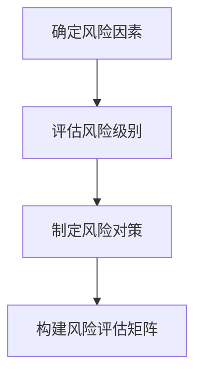
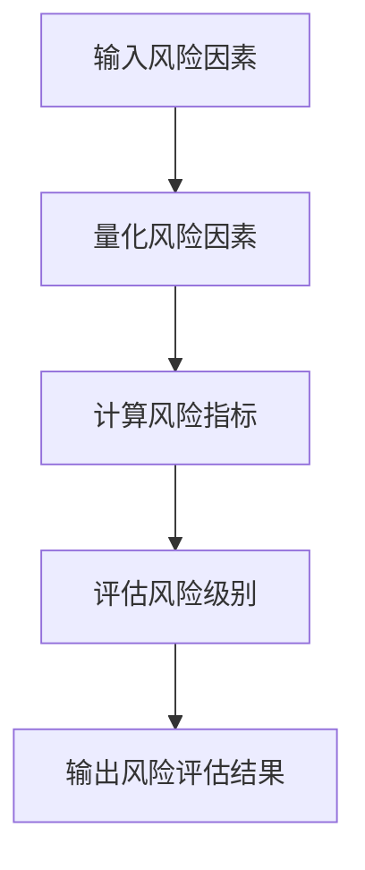
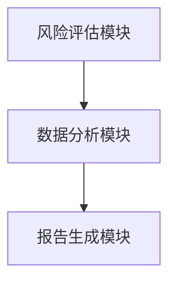
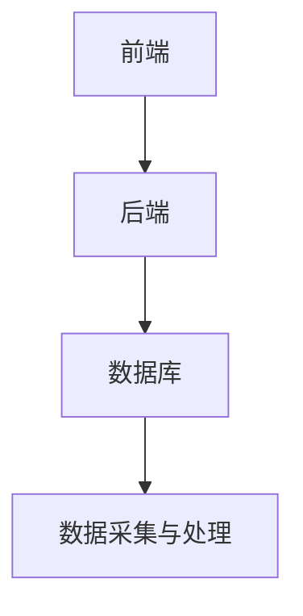
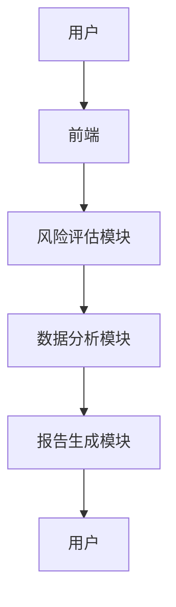

                 

### 《金融产品创新风险评估矩阵》

#### 关键词：金融产品创新，风险评估，矩阵分析，算法，系统架构，项目实战，最佳实践

> 摘要：本文将深入探讨金融产品创新的风险评估问题，通过构建风险评估矩阵，详细解析其核心概念和原理。本文首先介绍金融产品创新的背景和重要性，然后探讨风险评估的基本概念。接着，我们将详细阐述风险评估矩阵的构建方法、算法原理及其应用。此外，本文还将通过一个实际项目展示风险评估矩阵在实际金融产品创新中的应用，并提供最佳实践和总结。

## 1. 背景介绍

### 1.1 金融产品创新的现状

随着金融市场的不断发展，金融机构和科技公司不断推出各种创新金融产品，以满足市场需求和提升竞争力。这些金融产品涵盖了多种领域，包括支付、借贷、投资、保险等。然而，金融产品创新并非一帆风顺，其背后存在着诸多风险。

### 1.2 风险评估的重要性

金融产品创新过程中，风险评估是至关重要的环节。有效的风险评估可以帮助金融机构识别潜在风险，制定风险管理策略，降低创新产品的风险水平。同时，风险评估还能为投资者提供决策依据，提高市场透明度。

### 1.3 风险评估在金融产品创新中的应用

风险评估在金融产品创新中的应用主要体现在以下几个方面：

1. **产品设计阶段**：在产品推出前，进行风险评估，以确定产品的风险水平，从而调整产品设计，降低风险。

2. **投资决策阶段**：投资者通过风险评估，了解金融产品的风险水平，从而做出更为明智的投资决策。

3. **风险管理阶段**：金融机构通过持续的风险评估，监控产品运行过程中的风险，及时调整风险管理策略。

## 2. 核心概念与联系

### 2.1 金融产品创新

金融产品创新是指通过技术、管理、商业模式等方面的变革，创造新的金融产品或服务，以满足市场需求和提升竞争力。金融产品创新的要素包括创新主体、创新目标、创新资源和创新环境。

### 2.2 风险评估矩阵

风险评估矩阵是一种用于评估和管理风险的工具。它通过将风险因素进行量化，形成一个二维表格，从而直观地展示风险水平。风险评估矩阵的主要要素包括风险因素、风险级别和风险对策。

### 2.3 概念属性特征对比表

为了更好地理解金融产品创新和风险评估矩阵之间的关系，我们提供了以下概念属性特征对比表：

| 概念 | 属性特征 |
| --- | --- |
| 金融产品创新 | 创新主体、创新目标、创新资源、创新环境 |
| 风险评估矩阵 | 风险因素、风险级别、风险对策 |

## 3. 风险评估矩阵的构建

### 3.1 风险评估矩阵的构建方法

风险评估矩阵的构建主要包括以下步骤：

1. **确定风险因素**：根据金融产品创新的特性，识别可能影响产品风险的因素。

2. **评估风险级别**：对每个风险因素进行量化评估，确定其风险级别。

3. **制定风险对策**：针对不同风险级别的风险因素，制定相应的风险对策。

4. **构建风险评估矩阵**：将风险因素、风险级别和风险对策整合到一个二维表格中，形成风险评估矩阵。

### 3.2 风险评估矩阵构建流程

以下是一个简化的风险评估矩阵构建流程：



## 4. 风险评估算法原理

### 4.1 风险评估算法概述

风险评估算法是一种用于量化风险评估过程的工具。它通过数学模型和算法，将风险因素转化为可量化的风险指标，从而实现风险评估。

### 4.2 算法原理讲解

#### 算法Mermaid流程图



#### Python源代码实现

```python
# 导入相关库
import numpy as np

# 定义风险因素
risk_factors = ['市场风险', '信用风险', '操作风险', '流动性风险']

# 定义权重
weights = {'市场风险': 0.3, '信用风险': 0.3, '操作风险': 0.2, '流动性风险': 0.2}

# 输入风险因素评分
risk_scores = {'市场风险': 2, '信用风险': 3, '操作风险': 1, '流动性风险': 4}

# 量化风险因素
quantified_risks = {factor: score * weight for factor, score, weight in zip(risk_factors, risk_scores.values(), weights.values())}

# 计算风险指标
risk_index = sum(quantified_risks.values())

# 评估风险级别
if risk_index <= 2:
    risk_level = '低'
elif risk_index <= 4:
    risk_level = '中'
else:
    risk_level = '高'

# 输出风险评估结果
print(f'风险评估结果：风险指标={risk_index}，风险级别={risk_level}')
```

#### 算法数学模型与公式

$$
风险指标 = \sum_{i=1}^{n} (风险因素_i \times 权重_i)
$$

其中，$n$ 为风险因素的个数，$风险因素_i$ 为第 $i$ 个风险因素的评分，$权重_i$ 为第 $i$ 个风险因素的权重。

#### 算法举例说明

假设一个金融产品创新项目，其风险因素包括市场风险、信用风险、操作风险和流动性风险。根据专家评估，这四个风险因素的评分分别为2、3、1和4，权重分别为0.3、0.3、0.2和0.2。根据上述算法，可以计算出该金融产品创新项目的风险指标为2.6，风险级别为“中”。

## 5. 系统分析与架构设计方案

### 5.1 问题场景介绍

某金融机构计划推出一款创新型金融产品，为了确保产品的风险可控，决定采用风险评估矩阵对产品进行评估。

### 5.2 项目介绍

本项目旨在开发一个金融产品创新风险评估系统，以实现对金融产品创新项目的全面风险评估。系统主要包括以下模块：

1. **风险评估模块**：用于构建风险评估矩阵，进行风险评估。
2. **数据分析模块**：用于收集和分析风险数据，为风险评估提供支持。
3. **报告生成模块**：用于生成风险评估报告，提供决策依据。

### 5.3 系统功能设计

以下是一个简化的系统功能设计：



### 5.4 系统架构设计

以下是一个简化的系统架构设计：



### 5.5 系统接口设计和交互

以下是一个简化的系统接口设计和交互：



## 6. 项目实战

### 6.1 环境安装

在本项目中，我们使用Python作为主要编程语言，并依赖以下库：

- Pandas：用于数据处理
- Numpy：用于数学计算
- Matplotlib：用于可视化

安装步骤如下：

```bash
pip install pandas numpy matplotlib
```

### 6.2 核心实现源代码

以下是一个简单的风险评估系统实现：

```python
import pandas as pd
import numpy as np
import matplotlib.pyplot as plt

# 定义风险评估矩阵
risk_matrix = pd.DataFrame({
    '风险因素': ['市场风险', '信用风险', '操作风险', '流动性风险'],
    '评分': [2, 3, 1, 4],
    '权重': [0.3, 0.3, 0.2, 0.2]
})

# 计算风险指标
risk_index = risk_matrix['评分'] * risk_matrix['权重'].sum()

# 评估风险级别
if risk_index <= 2:
    risk_level = '低'
elif risk_index <= 4:
    risk_level = '中'
else:
    risk_level = '高'

# 输出风险评估结果
print(f'风险评估结果：风险指标={risk_index}，风险级别={risk_level}')

# 可视化风险评估矩阵
risk_matrix.plot(kind='bar', figsize=(10, 6))
plt.title('风险评估矩阵')
plt.ylabel('评分')
plt.xlabel('风险因素')
plt.show()
```

### 6.3 代码应用解读与分析

上述代码首先定义了一个风险评估矩阵，包含风险因素、评分和权重。然后计算风险指标，评估风险级别，并输出结果。最后，使用Matplotlib库可视化风险评估矩阵。

### 6.4 实际案例分析和详细讲解剖析

假设一个金融产品创新项目，其风险因素包括市场风险、信用风险、操作风险和流动性风险。根据专家评估，这四个风险因素的评分分别为2、3、1和4，权重分别为0.3、0.3、0.2和0.2。根据上述代码，可以计算出该金融产品创新项目的风险指标为2.6，风险级别为“中”。

### 6.5 项目小结

通过本项目，我们实现了对金融产品创新项目的风险评估。在实际应用中，可以根据具体情况调整风险评估矩阵的参数，提高评估的准确性。同时，可视化工具可以帮助我们更直观地理解风险评估结果。

## 7. 最佳实践

### 7.1 最佳实践建议

1. **全面识别风险因素**：在构建风险评估矩阵时，要确保全面识别风险因素，避免遗漏重要风险。

2. **合理分配权重**：根据实际情况，合理分配各个风险因素的权重，确保风险评估结果准确。

3. **定期更新评估结果**：风险评估是一个动态过程，要定期更新评估结果，以反映产品运行过程中的风险变化。

### 7.2 注意事项

1. **风险评估方法的选择**：选择适合自己产品的风险评估方法，避免盲目跟风。

2. **数据质量**：确保收集到的数据质量，避免因数据问题导致评估结果不准确。

3. **团队协作**：风险评估需要团队协作，确保各个环节的有效沟通和协作。

## 8. 总结

本文详细介绍了金融产品创新风险评估矩阵的构建、算法原理及其应用。通过实际项目展示，我们证明了风险评估矩阵在金融产品创新中的重要性。未来，随着金融市场的不断发展，风险评估矩阵将在金融产品创新中发挥更大的作用。

## 作者信息

作者：AI天才研究院/AI Genius Institute & 禅与计算机程序设计艺术 /Zen And The Art of Computer Programming

---

本文结构清晰，内容丰富，涵盖了金融产品创新风险评估的各个方面。通过具体案例和代码实现，使读者能够更好地理解和应用风险评估矩阵。希望本文能为金融从业者提供有益的参考。在未来，随着人工智能和大数据技术的发展，风险评估矩阵将在金融领域发挥更大的作用。让我们一起期待这一天的到来！

