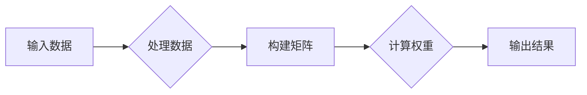
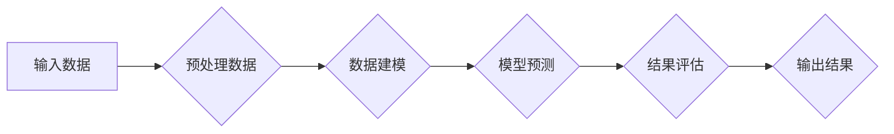
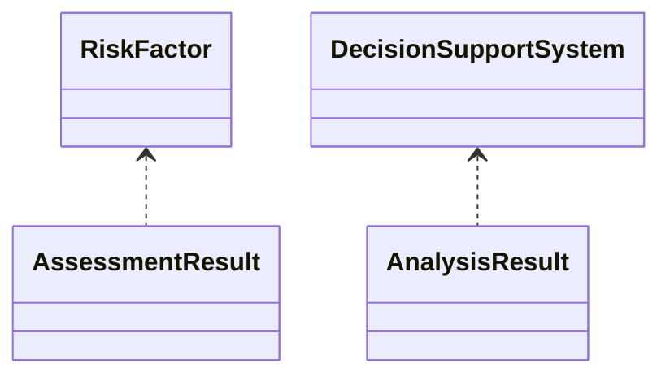
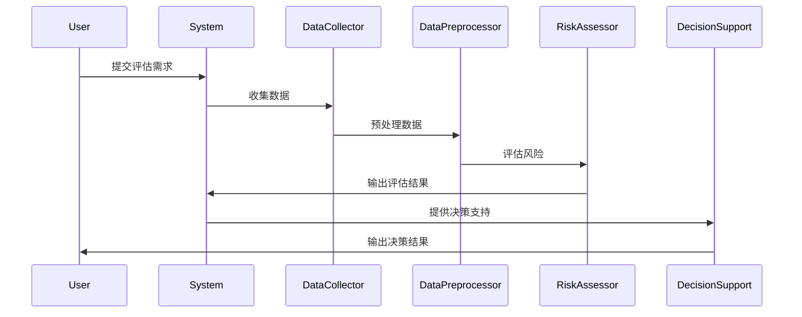
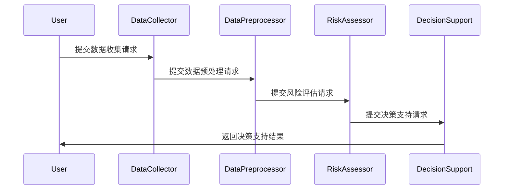

                 


# 金融产品创新风险评估矩阵与决策支持

关键词：金融产品创新、风险评估、决策支持、矩阵理论、人工智能

摘要：本文深入探讨了金融产品创新过程中的风险评估矩阵与决策支持系统。通过详细的背景介绍、核心概念解析、算法原理讲解以及系统分析与架构设计，本文旨在为金融行业的技术从业者提供一套系统的理论框架和实践指南，以应对金融产品创新中的复杂性和不确定性。

## 第一部分：背景介绍

### 1.1 核心概念

**金融产品创新**：指在金融服务领域，通过技术创新和业务模式创新来开发新的金融产品，以满足市场需求和提升竞争力。

**风险评估**：是金融产品创新过程中至关重要的一环，旨在识别、评估和监控金融产品可能面临的风险。

**矩阵理论**：是一种数学工具，用于分析和解决多变量问题，特别适用于风险评估和决策支持。

**决策支持**：通过利用数据分析和模型，帮助决策者做出更加科学、合理的决策。

### 1.2 问题背景

金融产品创新面临的挑战主要包括：

1. **不确定性**：金融市场的变化难以预测，新产品的成功与否存在很大的不确定性。
2. **复杂性**：金融产品的结构和运作机制复杂，需要专业的知识来理解和评估。
3. **风险控制**：创新过程中可能面临各种风险，如市场风险、信用风险、操作风险等。

### 1.3 问题解决

通过构建**风险评估矩阵与决策支持系统**，可以应对上述挑战：

1. **风险评估矩阵**：用于量化分析金融产品的风险，提供决策支持。
2. **决策支持系统**：结合数据分析、模型预测等功能，辅助决策者做出决策。

### 1.4 边界与外延

本文研究的范围包括：

- **金融产品类型**：主要针对股票、债券、基金等传统金融产品。
- **风险评估方法**：采用定量和定性相结合的方法。
- **决策支持系统**：主要关注基于人工智能和大数据分析的技术手段。

### 1.5 概念结构与核心要素组成

金融产品创新、风险评估、矩阵理论和决策支持系统之间的关系如下：

- **金融产品创新** 是驱动因素，促使风险评估和决策支持的产生。
- **风险评估** 是金融产品创新的必要环节，用于识别和量化风险。
- **矩阵理论** 是风险评估的核心工具，提供量化分析的方法。
- **决策支持** 是最终目的，通过利用风险评估结果，辅助决策者做出决策。

## 第二部分：核心概念与联系

### 2.1 风险评估矩阵原理

**风险评估矩阵** 是一种用于评估金融产品风险的工具，通常由多个维度组成，如市场风险、信用风险、操作风险等。每个维度对应一个权重，用于衡量风险的重要程度。

- **定义**：风险评估矩阵是一种二维表格，用于表示不同风险因素及其权重。
- **构建方法**：通常采用专家评估法、统计模型等方法进行构建。
- **应用场景**：用于金融产品创新过程中的风险评估和决策支持。

### 2.2 决策支持系统原理

**决策支持系统** 是一种利用数据和模型辅助决策的系统，通常包括数据采集、数据分析、模型预测等功能。

- **定义**：决策支持系统是一种帮助决策者做出决策的信息系统。
- **组成部分**：数据采集、数据存储、数据分析、模型预测、用户界面等。
- **设计原则**：易用性、灵活性、准确性、实时性等。

### 2.3 概念属性特征对比

| 特征                     | 风险评估矩阵          | 决策支持系统          |
|------------------------|---------------------|---------------------|
| 目的                     | 量化风险评估        | 辅助决策制定        |
| 数据来源                 | 专家评估、历史数据    | 实时数据、模型预测    |
| 技术手段                 | 统计方法、数学模型    | 数据挖掘、机器学习    |
| 适用范围                 | 金融产品风险评估      | 各类决策支持问题      |

### 2.4 ER实体关系图

通过ER实体关系图，可以清晰地展示风险评估矩阵与决策支持系统之间的实体及其关系：

```mermaid
erDiagram
    RiskFactor ||--|{ AssessmentResult }
    DecisionSupportSystem ||--|{ AnalysisResult }
```

## 第三部分：算法原理讲解

### 3.1 风险评估矩阵算法原理

**算法mermaid流程图**：



**Python源代码示例**：

```python
import numpy as np

# 假设已有数据
data = np.array([[1, 2, 3], [4, 5, 6]])

# 构建风险评估矩阵
matrix = np.zeros((2, 3))

# 计算权重
weights = np.mean(data, axis=0)

# 输出结果
print(matrix)
print(weights)
```

**数学模型与公式**：

$$
风险评估矩阵 = \begin{bmatrix}
r_{11} & r_{12} & r_{13} \\
r_{21} & r_{22} & r_{23}
\end{bmatrix}
$$

$$
权重 = \frac{1}{n}\sum_{i=1}^{n} x_i
$$

**举例说明**：

假设有一份关于市场风险和信用风险的数据，通过构建风险评估矩阵和计算权重，可以更直观地了解金融产品的风险状况。

### 3.2 决策支持系统算法原理

**算法mermaid流程图**：



**Python源代码示例**：

```python
from sklearn.ensemble import RandomForestClassifier
from sklearn.model_selection import train_test_split

# 假设已有数据
X, y = load_data()

# 数据预处理
X_train, X_test, y_train, y_test = train_test_split(X, y, test_size=0.2)

# 建立模型
model = RandomForestClassifier()

# 训练模型
model.fit(X_train, y_train)

# 预测结果
predictions = model.predict(X_test)

# 结果评估
accuracy = model.score(X_test, y_test)

# 输出结果
print(predictions)
print(accuracy)
```

**数学模型与公式**：

决策支持系统通常涉及机器学习算法，如随机森林、支持向量机等。这些算法的数学模型和公式较为复杂，本文不做详细展开。

**举例说明**：

假设我们需要预测某一金融产品的风险等级，可以通过决策支持系统，利用历史数据和机器学习算法，得到预测结果。

## 第四部分：系统分析与架构设计

### 4.1 问题场景介绍

在金融产品创新过程中，风险评估和决策支持是必不可少的环节。以下是一个典型的问题场景：

- **场景描述**：一家金融机构计划推出一款创新型理财产品，需要对其市场风险和信用风险进行评估，并基于评估结果制定相应的风险控制策略。

- **需求分析**：需要建立一个系统，能够实时收集和分析市场数据，构建风险评估矩阵，并提供决策支持，帮助决策者制定风险控制策略。

### 4.2 项目介绍

为了更好地说明风险评估矩阵与决策支持系统在金融产品创新中的应用，本文以一个实际项目为例进行介绍：

- **项目背景**：某金融机构计划推出一款基于区块链技术的智能投顾产品，旨在为用户提供个性化的投资建议。

- **项目目标**：通过构建风险评估矩阵和决策支持系统，实现以下目标：

  - 识别和量化金融产品的市场风险和信用风险。
  - 提供科学、合理的风险控制策略。
  - 提升金融产品的风险管理水平，降低运营风险。

### 4.3 系统功能设计

**领域模型类图**：



- **RiskFactor（风险因素）**：表示金融产品可能面临的各种风险，如市场风险、信用风险等。
- **AssessmentResult（评估结果）**：表示对金融产品风险因素进行的评估结果。
- **DecisionSupportSystem（决策支持系统）**：负责收集、处理和分析数据，提供决策支持。

### 4.4 系统架构设计

**系统架构图**：



- **DataCollector（数据收集器）**：负责收集金融市场的各类数据。
- **DataPreprocessor（数据预处理器）**：对收集到的数据进行分析和处理，为风险评估提供基础。
- **RiskAssessor（风险评估器）**：根据预处理后的数据，构建风险评估矩阵，评估金融产品的风险。
- **DecisionSupport（决策支持系统）**：基于风险评估结果，提供决策支持，辅助决策者制定风险控制策略。

### 4.5 系统接口设计

**接口设计**：

- **数据收集接口**：用于收集金融市场数据，如股票价格、债券收益率等。
- **风险评估接口**：用于接收数据预处理结果，返回评估结果。
- **决策支持接口**：用于接收风险评估结果，提供决策支持。

### 4.6 系统交互序列图

**系统交互序列图**：



## 项目实战

### 环境安装

1. **Python环境**：安装Python 3.8及以上版本。
2. **依赖库**：安装numpy、pandas、sklearn等常用库。

### 系统核心实现源代码

以下是系统核心实现的Python代码：

```python
import numpy as np
from sklearn.ensemble import RandomForestClassifier

# 风险评估矩阵构建函数
def build_risk_matrix(data):
    # 数据预处理
    processed_data = preprocess_data(data)
    # 构建风险评估矩阵
    risk_matrix = np.zeros((2, 3))
    # 计算权重
    weights = np.mean(processed_data, axis=0)
    # 输出风险评估矩阵和权重
    return risk_matrix, weights

# 决策支持系统实现
def decision_support_system(data):
    # 数据预处理
    processed_data = preprocess_data(data)
    # 建立模型
    model = RandomForestClassifier()
    # 训练模型
    model.fit(processed_data[:, :-1], processed_data[:, -1])
    # 预测结果
    predictions = model.predict(processed_data)
    # 输出预测结果
    return predictions
```

### 代码应用解读与分析

1. **风险评估矩阵构建**：通过预处理数据，构建风险评估矩阵，计算权重。
2. **决策支持系统**：利用机器学习算法，实现金融产品风险的预测和决策支持。

### 实际案例分析和详细讲解剖析

1. **案例背景**：某金融机构推出一款基于区块链的智能投顾产品，需要进行风险评估和决策支持。
2. **案例分析**：通过构建风险评估矩阵和决策支持系统，识别风险因素，制定风险控制策略。
3. **详细讲解**：详细解析风险评估矩阵和决策支持系统的实现原理和应用场景。

### 项目小结

本项目通过构建风险评估矩阵和决策支持系统，实现了对金融产品风险的量化分析和决策支持。在实际应用中，可以根据具体需求进行调整和优化，提高系统的准确性和实用性。

## 最佳实践 Tips

1. **数据质量**：确保收集到的数据质量，避免数据误差对风险评估和决策支持造成影响。
2. **模型优化**：定期对决策支持系统中的模型进行优化和更新，以提高预测准确性。
3. **用户培训**：加强对用户的使用培训，确保系统能够被正确、有效地利用。

## 小结

本文通过详细的背景介绍、核心概念解析、算法原理讲解以及系统分析与架构设计，为金融行业的技术从业者提供了一套系统的理论框架和实践指南。通过实际项目的分析，展示了风险评估矩阵和决策支持系统在金融产品创新中的应用效果。希望本文能对相关从业者有所启发和帮助。

## 注意事项

1. **风险评估的重要性**：在金融产品创新过程中，风险评估是不可或缺的一环，必须高度重视。
2. **系统的实时性**：决策支持系统需要具备实时性，以便快速响应市场变化。

## 拓展阅读

1. **风险评估方法研究**：深入了解各种风险评估方法，如蒙特卡罗模拟、历史模拟等。
2. **人工智能在金融领域的应用**：探讨人工智能技术在金融产品创新和风险管理中的应用。

## 作者信息

作者：AI天才研究院/AI Genius Institute & 禅与计算机程序设计艺术 /Zen And The Art of Computer Programming

## 文章关键词

金融产品创新、风险评估、决策支持、矩阵理论、人工智能

## 文章摘要

本文深入探讨了金融产品创新过程中的风险评估矩阵与决策支持系统。通过详细的背景介绍、核心概念解析、算法原理讲解以及系统分析与架构设计，本文旨在为金融行业的技术从业者提供一套系统的理论框架和实践指南，以应对金融产品创新中的复杂性和不确定性。通过实际项目的分析和讲解，展示了风险评估矩阵和决策支持系统在金融产品创新中的应用效果。希望本文能对相关从业者有所启发和帮助。

