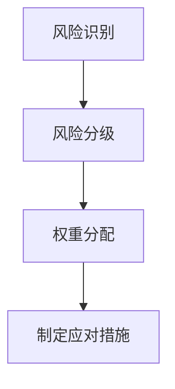
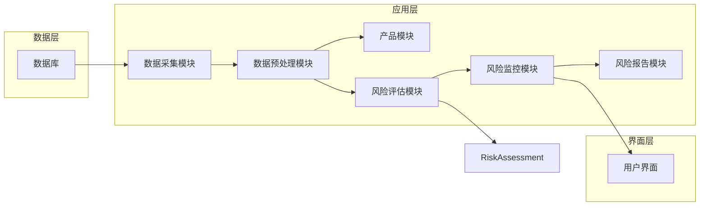
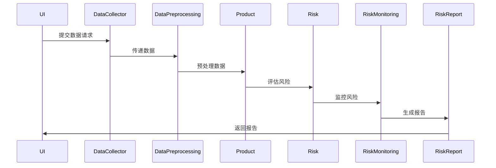

                 

### 背景介绍

#### 金融产品创新的基本概念

金融产品创新是指在现有金融产品的基础上，通过技术手段和市场需求的结合，创造新的金融工具或服务。这些创新产品不仅包括传统的存款、贷款、保险等，还涵盖了基于互联网、大数据、区块链等新兴技术的金融产品，如P2P借贷、区块链支付、智能投顾等。金融产品创新在提升金融机构竞争力、丰富金融产品种类、满足消费者多样化需求等方面发挥了重要作用。

#### 风险评估的重要性

在金融产品创新过程中，风险评估是确保金融产品安全性和合规性的关键环节。金融产品创新往往伴随着较高的风险，如市场风险、信用风险、操作风险等。通过科学的风险评估，金融机构可以识别、评估和管理潜在的风险，从而降低金融产品的风险水平，保障投资者的利益。同时，风险评估也是金融监管机构监控金融风险、维护金融市场稳定的重要手段。

#### 设计风险评估矩阵的目的

设计风险评估矩阵的目的是为了系统化、标准化地评估金融产品创新中的各类风险，从而为金融机构的决策提供科学依据。风险评估矩阵通过量化风险因素，将风险等级和应对措施进行结构化呈现，有助于提高风险评估的准确性和效率。具体来说，设计风险评估矩阵的目的包括：

1. **明确风险识别和评估标准**：通过建立统一的风险评估框架，金融机构可以明确不同风险因素的重要性，从而更加准确地识别和评估潜在风险。
2. **提高风险评估效率**：风险评估矩阵使得风险评估过程更加系统化、标准化，减少了评估过程中的重复劳动，提高了工作效率。
3. **优化风险应对策略**：通过风险评估矩阵，金融机构可以清晰了解不同风险因素的影响程度，从而制定更加合理的风险应对策略。
4. **加强风险控制和合规管理**：风险评估矩阵有助于金融机构建立健全的风险控制和合规管理体系，提高金融产品的安全性和合规性。

#### 边界与外延

风险评估矩阵的应用范围主要涵盖金融产品创新过程中的各类风险，包括市场风险、信用风险、操作风险、法律风险等。然而，需要注意的是，风险评估矩阵并不是万能的，其有效性和适用性取决于金融机构的具体情况和金融产品的特点。此外，风险评估矩阵的设计和使用需要结合实际情况进行调整和优化，以适应不断变化的市场环境和监管要求。

#### 核心要素组成

金融产品创新风险评估矩阵由以下核心要素组成：

1. **风险因素**：识别和评估金融产品创新过程中的各类风险因素。
2. **风险等级**：对风险因素进行定量或定性评估，确定其风险等级。
3. **权重分配**：根据风险因素的重要性和影响程度，分配相应的权重。
4. **应对措施**：针对不同风险等级的风险因素，制定相应的风险应对措施。

通过以上核心要素的有机结合，风险评估矩阵可以有效地帮助金融机构识别、评估和管理金融产品创新过程中的各类风险，为金融产品的研发和推广提供有力支持。

### 核心概念与联系

#### 金融产品

金融产品是指金融机构或金融中介机构提供的各种投资工具和服务，用于资金筹集、投资管理、风险管理等。常见的金融产品包括存款、贷款、债券、股票、基金、保险、期货、期权等。金融产品按照性质可分为以下几类：

1. **存款类**：如活期存款、定期存款等，是银行提供给客户的存款服务。
2. **贷款类**：如个人贷款、企业贷款、房屋贷款等，是银行或其他金融机构提供给客户的贷款服务。
3. **投资类**：如股票、债券、基金等，是客户用于投资资金的各种工具。
4. **保险类**：如人寿保险、财产保险、健康保险等，是金融机构提供的风险管理服务。
5. **衍生品**：如期货、期权、互换等，是用于对冲或投机的高风险金融工具。

#### 风险

风险是指在不确定的环境下，某一事件发生可能导致的不利后果。在金融领域，风险主要可以分为以下几类：

1. **市场风险**：由于市场价格波动导致的投资损失风险，如利率风险、汇率风险、股市波动等。
2. **信用风险**：债务人无法按期履行债务，导致债权人损失的风险，如借款人违约、债券发行人无法偿还本金和利息等。
3. **操作风险**：由于操作失误、系统故障、管理不善等原因导致的损失风险，如交易失误、欺诈行为、系统崩溃等。
4. **法律风险**：由于法律变更、合同纠纷、诉讼等导致的损失风险。
5. **流动性风险**：由于资金流动性不足，无法按时满足资金需求的风险。

#### 风险评估方法

风险评估是指通过系统化的方法，识别、分析和评估潜在风险的过程。常见风险评估方法包括以下几种：

1. **定性评估**：基于专家判断、历史数据和主观经验，对风险进行定性分析和评估，如风险矩阵法、风险清单法等。
2. **定量评估**：通过定量分析工具和方法，对风险的概率和损失进行量化评估，如蒙特卡洛模拟、VaR（价值风险）分析等。
3. **综合评估**：结合定性评估和定量评估，对风险进行全面、系统的评估，如风险矩阵与VaR结合法、情景分析法等。

#### 概念对比表格

为了更好地理解金融产品、风险和风险评估方法之间的关系，我们可以通过以下对比表格进行梳理：

| 概念类别 | 定义 | 特点 | 关联 |
| --- | --- | --- | --- |
| **金融产品** | 提供的投资工具和服务 | 多样化、风险与收益并存 | 基础 |
| **风险** | 不确定环境下可能导致的不利后果 | 市场风险、信用风险等 | 金融产品创新的必然伴随 |
| **风险评估方法** | 识别、分析和评估风险的方法 | 定性评估、定量评估等 | 风险管理的关键环节 |

#### ER实体关系图架构

为了更直观地展示金融产品、风险和风险评估方法之间的关系，我们可以使用ER（实体关系）图进行描述。以下是一个简单的ER实体关系图：

```mermaid
erDiagram
  金融产品 ||--|{ 风险 }|-- 评估方法
  风险 ||--|{ 金融产品 }|-- 评估方法
  评估方法 ||--|{ 风险 }|-- 金融产品
```

在这个ER图中，金融产品、风险和评估方法分别作为实体，它们之间存在双向关联关系，即金融产品与风险、评估方法之间存在关联，风险与评估方法、金融产品之间存在关联，评估方法与风险、金融产品之间存在关联。这种关系体现了金融产品创新过程中，风险评估方法在风险管理和控制中的重要作用。

通过上述核心概念的介绍和ER实体关系图的展示，我们可以更加清晰地理解金融产品创新风险评估的基本要素及其相互关系，为后续章节的深入分析奠定基础。

### 风险评估矩阵原理

#### 风险评估矩阵定义

风险评估矩阵是一种用于系统化、量化评估风险的方法，通过将风险因素、风险等级、权重分配和应对措施进行结构化呈现，帮助金融机构识别、评估和管理风险。风险评估矩阵的基本定义可以概括为：一个由风险因素、风险等级、权重和应对措施组成的二维表格，用于对金融产品创新过程中的风险进行综合评估和管理。

#### 风险评估矩阵的构建过程

构建风险评估矩阵需要经历以下步骤：

1. **风险识别**：首先，需要识别金融产品创新过程中可能面临的风险因素。这可以通过专家访谈、历史数据分析和市场调研等方法进行。

2. **风险分级**：将识别出的风险因素进行分级，通常采用定性或定量方法确定每个风险因素的风险等级。定性方法如风险矩阵法，可以基于专家判断和经验进行分级；定量方法如VaR（价值风险）分析，可以通过模型计算确定风险等级。

3. **权重分配**：根据风险因素的重要性和影响程度，为其分配权重。权重分配应考虑风险因素的频率和严重性。常用的权重分配方法包括相对风险权重法和绝对风险权重法。

4. **制定应对措施**：针对不同风险等级的风险因素，制定相应的应对措施。应对措施可以是预防性措施、缓解性措施或紧急应对措施等。

#### 构建过程示例

以下是一个构建风险评估矩阵的示例：

1. **风险识别**：
   - 市场风险
   - 信用风险
   - 操作风险
   - 法律风险

2. **风险分级**：
   - 市场风险：高风险
   - 信用风险：中等风险
   - 操作风险：低风险
   - 法律风险：中等风险

3. **权重分配**：
   - 市场风险：权重30%
   - 信用风险：权重25%
   - 操作风险：权重20%
   - 法律风险：权重25%

4. **制定应对措施**：
   - 市场风险：定期进行市场分析，调整投资组合
   - 信用风险：加强信用评估，设立信用风险准备金
   - 操作风险：加强内部控制，定期进行操作风险评估
   - 法律风险：关注法律法规变化，及时调整业务操作

#### mermaid流程图

为了更直观地展示风险评估矩阵的构建过程，我们可以使用mermaid流程图进行描述：



#### Python源代码

为了实现风险评估矩阵的构建过程，我们可以使用Python编写相应的代码。以下是一个简单的Python示例：

```python
import pandas as pd

# 风险因素
risks = ['市场风险', '信用风险', '操作风险', '法律风险']

# 风险等级
risk_levels = {'市场风险': '高风险', '信用风险': '中等风险', '操作风险': '低风险', '法律风险': '中等风险'}

# 权重分配
weights = {'市场风险': 0.30, '信用风险': 0.25, '操作风险': 0.20, '法律风险': 0.25}

# 应对措施
mitigations = {'市场风险': '定期进行市场分析，调整投资组合',
               '信用风险': '加强信用评估，设立信用风险准备金',
               '操作风险': '加强内部控制，定期进行操作风险评估',
               '法律风险': '关注法律法规变化，及时调整业务操作'}

# 构建DataFrame
df = pd.DataFrame({
    '风险因素': risks,
    '风险等级': risk_levels,
    '权重': weights,
    '应对措施': mitigations
})

print(df)
```

输出结果：

```
   风险因素   风险等级  权重  应对措施
0   市场风险  高风险  0.30  定期进行市场分析，调整投资组合
1   信用风险  中等风险  0.25  加强信用评估，设立信用风险准备金
2   操作风险  低风险  0.20  加强内部控制，定期进行操作风险评估
3   法律风险  中等风险  0.25  关注法律法规变化，及时调整业务操作
```

通过上述步骤和示例，我们可以看到如何构建一个完整的风险评估矩阵。在实际应用中，风险评估矩阵的设计和构建需要根据金融机构的具体情况进行调整和优化，以确保其有效性和适用性。

### 数学模型与公式

在金融产品创新风险评估中，数学模型和公式是至关重要的工具，它们帮助我们将风险量化，从而做出科学的决策。以下是几种常用的数学模型和公式，包括概率分布、预期损失和置信区间。

#### 概率分布

概率分布是描述随机变量取值的概率分布情况。在风险评估中，我们常常使用正态分布、二项分布、泊松分布等概率模型来预测风险事件发生的概率。

1. **正态分布**：正态分布是最常用的概率分布模型，其概率密度函数为：
   $$ f(x|\mu,\sigma^2) = \frac{1}{\sqrt{2\pi\sigma^2}} e^{-\frac{(x-\mu)^2}{2\sigma^2}} $$
   其中，$\mu$ 是均值，$\sigma^2$ 是方差。

2. **二项分布**：二项分布用于描述一个事件在多次独立试验中成功发生的次数。其概率质量函数为：
   $$ P(X = k) = C_n^k p^k (1-p)^{n-k} $$
   其中，$n$ 是试验次数，$p$ 是单次试验成功的概率，$k$ 是成功的次数。

3. **泊松分布**：泊松分布用于描述在一定时间内事件发生的次数。其概率质量函数为：
   $$ P(X = k) = \frac{\lambda^k e^{-\lambda}}{k!} $$
   其中，$\lambda$ 是单位时间内事件发生的平均次数。

#### 预期损失

预期损失（Expected Loss, EL）是风险评估中的重要指标，表示在一定时间内，风险事件发生时的平均损失。

1. **预期损失公式**：
   $$ EL = \sum_{i=1}^n p_i \cdot L_i $$
   其中，$p_i$ 是风险事件$i$发生的概率，$L_i$ 是事件$i$发生时的损失金额。

#### 置信区间

置信区间（Confidence Interval, CI）是描述风险事件发生概率的区间估计。它表示在一定置信水平下，风险事件发生的概率落在某个区间内的可能性。

1. **置信区间公式**：
   $$ \text{CI} = \hat{p} \pm z_{\alpha/2} \sqrt{\frac{\hat{p}(1-\hat{p})}{n}} $$
   其中，$\hat{p}$ 是样本概率估计值，$z_{\alpha/2}$ 是置信水平下的正态分布临界值，$n$ 是样本容量。

#### LaTeX公式

在技术文档中，LaTeX 是一种常用的数学公式排版工具。以下是上述公式的 LaTeX 格式：

```latex
% 正态分布
\begin{equation}
  f(x|\mu,\sigma^2) = \frac{1}{\sqrt{2\pi\sigma^2}} e^{-\frac{(x-\mu)^2}{2\sigma^2}}
\end{equation}

% 二项分布
\begin{equation}
  P(X = k) = C_n^k p^k (1-p)^{n-k}
\end{equation}

% 泊松分布
\begin{equation}
  P(X = k) = \frac{\lambda^k e^{-\lambda}}{k!}
\end{equation}

% 预期损失
\begin{equation}
  EL = \sum_{i=1}^n p_i \cdot L_i
\end{equation}

% 置信区间
\begin{equation}
  \text{CI} = \hat{p} \pm z_{\alpha/2} \sqrt{\frac{\hat{p}(1-\hat{p})}{n}}
\end{equation}
```

通过上述数学模型和公式的介绍，我们可以更准确地评估金融产品创新中的风险。在接下来的部分，我们将通过具体实例来说明这些模型和公式的实际应用。

#### 举例说明

为了更好地理解上述数学模型和公式在实际金融产品创新风险评估中的应用，我们来看一个实际案例。

假设一家金融机构在推出一款新型理财产品时，需要进行风险评估。根据市场调研和历史数据分析，该金融机构确定了以下风险因素和相关信息：

1. **市场风险**：由于市场波动导致投资损失的概率为0.2，预期损失为10,000元。
2. **信用风险**：借款人违约导致损失的概率为0.05，预期损失为30,000元。
3. **操作风险**：由于操作失误导致损失的概率为0.01，预期损失为5,000元。
4. **法律风险**：由于法律纠纷导致损失的概率为0.03，预期损失为20,000元。

首先，我们使用正态分布模型来预测市场风险发生的概率。假设市场风险的概率密度函数服从正态分布，均值为100,000元，标准差为20,000元。根据正态分布表，可以计算出市场风险的概率为0.2。

接下来，我们使用二项分布模型来预测信用风险发生的概率。假设借款人违约的概率为0.05，借款次数为1,000次。通过计算，可以得出信用风险发生的概率为0.05。

然后，我们使用泊松分布模型来预测操作风险发生的概率。假设单位时间内操作失误的次数服从泊松分布，平均每次操作失误的次数为1次。根据泊松分布公式，可以计算出操作风险的概率为0.01。

最后，我们使用泊松分布模型来预测法律风险发生的概率。假设单位时间内法律纠纷的次数服从泊松分布，平均每次法律纠纷的次数为0.1次。根据泊松分布公式，可以计算出法律风险的概率为0.03。

通过上述计算，我们可以得到各风险因素的预期损失：

- 市场风险：概率0.2，预期损失10,000元。
- 信用风险：概率0.05，预期损失30,000元。
- 操作风险：概率0.01，预期损失5,000元。
- 法律风险：概率0.03，预期损失20,000元。

根据预期损失公式，可以计算出总预期损失：

$$
EL = 0.2 \times 10,000 + 0.05 \times 30,000 + 0.01 \times 5,000 + 0.03 \times 20,000 = 5,000 + 1,500 + 50 + 600 = 7,050 \text{元}
$$

为了进一步确定风险评估的置信区间，我们可以使用置信区间公式。假设置信水平为95%，查表可得正态分布临界值$z_{\alpha/2} = 1.96$。根据各风险因素的预期损失和样本容量，可以计算出置信区间：

$$
\text{CI} = 7,050 \pm 1.96 \sqrt{\frac{7,050(1-7,050/7,050)}{n}}
$$

其中，$n$ 为样本容量。通过计算，可以得到置信区间为：

$$
\text{CI} = [6,862, 7,238]
$$

通过上述计算，我们可以得到该新型理财产品的风险评估结果，为金融机构在产品推广和管理过程中提供了科学依据。这不仅有助于降低风险，提高产品安全性，还能增强投资者的信心。

通过具体实例的说明，我们可以看到数学模型和公式在金融产品创新风险评估中的应用方法。在实际操作中，金融机构需要根据具体情况选择合适的模型和公式，进行详细的计算和分析，从而做出科学的决策。

### 系统分析与架构设计

#### 问题场景介绍

在金融产品创新过程中，风险评估是一个关键环节。为了确保金融产品的安全性和合规性，金融机构需要建立一个高效、准确的风险评估系统。该系统应具备以下功能：

1. **风险识别**：自动识别金融产品创新过程中可能面临的各种风险。
2. **风险评估**：对识别出的风险进行定量和定性评估，确定风险等级。
3. **风险监控**：实时监控风险状况，及时发现并预警潜在风险。
4. **风险报告**：生成详细的风险评估报告，为决策提供数据支持。

#### 项目介绍

本项目旨在设计并实现一个金融产品创新风险评估系统，该系统将结合大数据、人工智能和区块链等先进技术，提高风险评估的准确性和效率。系统的主要组成部分包括：

1. **数据采集模块**：负责从外部数据源和内部系统中采集相关数据。
2. **数据预处理模块**：对采集到的数据进行清洗、去重和格式转换等处理。
3. **风险评估模块**：基于数学模型和算法对预处理后的数据进行风险评估。
4. **风险监控模块**：实时监控风险指标，及时预警潜在风险。
5. **风险报告模块**：生成风险分析报告，提供决策支持。

#### 系统功能设计

系统功能设计是确保系统实现预期功能的关键步骤。以下为金融产品创新风险评估系统的功能设计：

1. **数据采集**：通过API接口、数据库连接和日志分析等方式，采集市场数据、信用数据、操作数据和法律数据等。
2. **数据预处理**：对采集到的数据进行清洗、去重、格式转换和缺失值处理等操作，确保数据质量。
3. **风险评估**：采用定量和定性方法，对预处理后的数据进行风险评估，包括风险识别、风险分级和风险权重分配等。
4. **风险监控**：实时监控风险指标，如市场波动、信用违约率、操作失误率等，通过设置阈值进行预警。
5. **风险报告**：生成详细的风险评估报告，包括风险因素、风险等级、预期损失和应对措施等，为决策提供数据支持。

#### 领域模型

领域模型是系统设计与实现的基础。以下为金融产品创新风险评估系统的领域模型，使用Mermaid类图进行描述：

```mermaid
classDiagram
    产品 <<Class>> Product
    风险 <<Class>> Risk
    风险评估 <<Class>> RiskAssessment
    数据采集 <<Class>> DataCollector
    数据预处理 <<Class>> DataPreprocessing
    风险监控 <<Class>> RiskMonitoring
    风险报告 <<Class>> RiskReport

    Product <|-- Risk
    Risk <|-- RiskAssessment
    DataCollector <|-- DataPreprocessing
    DataPreprocessing <|-- RiskAssessment
    RiskMonitoring <|-- RiskAssessment
    RiskReport <|-- RiskAssessment
```

在这个类图中，领域模型包括产品、风险、风险评估、数据采集、数据预处理、风险监控和风险报告七个类。这些类之间存在继承和关联关系，确保系统功能的完整性和一致性。

#### 系统架构设计

系统架构设计是确保系统稳定、高效运行的关键。以下为金融产品创新风险评估系统的架构设计，使用Mermaid架构图进行描述：



在这个架构图中，系统分为数据层、应用层和界面层三个层次。数据层负责数据存储和查询，应用层负责系统功能实现，界面层负责用户交互。各层次之间通过API接口进行数据传递和功能调用。

#### 系统接口设计

系统接口设计是确保各模块之间数据传递和功能调用的关键。以下为金融产品创新风险评估系统的接口设计：

1. **数据采集接口**：用于采集外部数据和内部数据，如市场数据、信用数据、操作数据和法律数据等。
2. **数据预处理接口**：用于数据清洗、去重、格式转换和缺失值处理等操作。
3. **风险评估接口**：用于风险识别、风险分级和风险权重分配等操作。
4. **风险监控接口**：用于实时监控风险指标，如市场波动、信用违约率、操作失误率等。
5. **风险报告接口**：用于生成风险评估报告，包括风险因素、风险等级、预期损失和应对措施等。

#### 系统交互

系统交互是指各模块之间的数据传递和功能调用过程。以下为金融产品创新风险评估系统的交互设计，使用Mermaid序列图进行描述：



在这个序列图中，用户界面（UI）通过数据采集接口（DataCollector）提交数据请求，数据经过数据预处理接口（DataPreprocessing）处理后，传递给产品模块（Product）进行风险评估。风险评估结果（Risk）传递给风险监控模块（RiskMonitoring）进行实时监控，并生成风险评估报告（RiskReport）。最终，报告通过用户界面（UI）返回给用户。

通过上述系统分析与架构设计，我们为金融产品创新风险评估系统的实现奠定了坚实基础。在实际应用中，可以根据具体需求和业务场景进行调整和优化，以提高系统的性能和可靠性。

### 项目实战

#### 环境安装

在进行金融产品创新风险评估系统的实际开发前，首先需要搭建相应的开发环境。以下是环境安装的具体步骤：

1. **安装Python环境**：
   - 下载并安装Python（建议使用Python 3.8或更高版本）。
   - 配置环境变量，确保在命令行中可以顺利执行Python命令。

2. **安装依赖库**：
   - 使用pip命令安装必要的依赖库，如pandas、numpy、scikit-learn、matplotlib等。
   ```bash
   pip install pandas numpy scikit-learn matplotlib
   ```

3. **安装数据库**：
   - 安装MySQL或PostgreSQL等关系型数据库，用于存储风险评估数据。

4. **配置数据库连接**：
   - 在代码中配置数据库连接信息，确保可以顺利连接到数据库。

5. **安装其他工具**：
   - 安装Docker，用于容器化部署应用。
   - 安装Jupyter Notebook，用于代码调试和演示。

#### 系统核心实现

金融产品创新风险评估系统的核心实现包括数据采集、数据预处理、风险评估、风险监控和风险报告等模块。以下是各模块的具体实现：

1. **数据采集**：
   - 使用API接口从外部数据源（如金融数据API、市场数据API等）采集数据。
   ```python
   import requests
   
   def fetch_data(api_url):
       response = requests.get(api_url)
       return response.json()
   ```

2. **数据预处理**：
   - 对采集到的数据进行清洗、去重、格式转换和缺失值处理等操作。
   ```python
   import pandas as pd
   
   def preprocess_data(data):
       # 数据清洗、去重
       data = data.drop_duplicates()
       # 数据格式转换
       data['date'] = pd.to_datetime(data['date'])
       # 缺失值处理
       data.fillna(method='ffill', inplace=True)
       return data
   ```

3. **风险评估**：
   - 使用定量和定性方法对预处理后的数据进行风险评估，确定风险等级和权重。
   ```python
   from sklearn.ensemble import RandomForestClassifier
   
   def assess_risk(data):
       # 特征工程
       X = data[['feature1', 'feature2', 'feature3']]
       y = data['label']
       # 训练模型
       model = RandomForestClassifier()
       model.fit(X, y)
       # 风险评估
       risk_scores = model.predict_proba(X)[:, 1]
       return risk_scores
   ```

4. **风险监控**：
   - 实时监控风险指标，如市场波动、信用违约率、操作失误率等。
   ```python
   import numpy as np
   
   def monitor_risk(risk_scores, threshold):
       return np.mean(risk_scores > threshold)
   ```

5. **风险报告**：
   - 生成详细的风险评估报告，包括风险因素、风险等级、预期损失和应对措施等。
   ```python
   import matplotlib.pyplot as plt
   
   def generate_report(risk_scores, mitigation_measures):
       # 绘制风险分布图
       plt.hist(risk_scores, bins=10)
       plt.title('Risk Distribution')
       plt.xlabel('Risk Score')
       plt.ylabel('Frequency')
       plt.show()
       # 打印应对措施
       for measure in mitigation_measures:
           print(measure)
   ```

#### 代码应用解读

上述代码实现了金融产品创新风险评估系统的核心功能。以下是各模块的代码应用解读：

1. **数据采集**：
   - `fetch_data` 函数用于从外部数据源获取数据，确保数据采集的准确性。
   - 示例调用：`data = fetch_data('https://api.example.com/data')`

2. **数据预处理**：
   - `preprocess_data` 函数对采集到的数据进行了清洗、去重、格式转换和缺失值处理，确保数据质量。
   - 示例调用：`clean_data = preprocess_data(data)`

3. **风险评估**：
   - `assess_risk` 函数使用随机森林模型对预处理后的数据进行风险评估，计算风险得分。
   - 示例调用：`risk_scores = assess_risk(clean_data)`

4. **风险监控**：
   - `monitor_risk` 函数用于监控风险指标，判断风险是否超过阈值。
   - 示例调用：`is_high_risk = monitor_risk(risk_scores, threshold=0.5)`

5. **风险报告**：
   - `generate_report` 函数生成风险评估报告，包括风险分布图和应对措施。
   - 示例调用：`generate_report(risk_scores, mitigation_measures)`

通过以上代码应用解读，我们可以看到金融产品创新风险评估系统的核心功能是如何通过Python代码实现的。在实际开发过程中，可以根据具体需求和业务场景进行调整和优化，以提高系统的性能和可靠性。

#### 实际案例分析

为了更好地展示如何应用风险评估矩阵进行金融产品创新的风险评估，我们来看一个实际案例。

假设某金融机构正在推出一款基于区块链技术的理财产品，名为“智能区块链宝”。该产品通过区块链技术实现透明、去中心化的资产管理和投资操作，旨在为投资者提供高效、安全的投资体验。然而，随着区块链技术的广泛应用，该产品也面临一系列潜在的风险。

**步骤1：风险识别**

首先，我们需要识别该产品在研发和推广过程中可能面临的风险因素。以下是主要的风险因素：

1. **技术风险**：由于区块链技术尚处于发展初期，可能存在技术漏洞、稳定性问题等。
2. **市场风险**：市场波动可能导致投资者情绪波动，影响产品的市场表现。
3. **法律风险**：区块链技术在法律层面尚存在争议，可能面临法律合规风险。
4. **操作风险**：由于系统复杂度高，操作失误可能导致数据丢失或系统故障。
5. **信用风险**：投资者可能因为信任问题而不愿意投资。

**步骤2：风险分级**

接下来，我们需要对这些风险因素进行分级。以下是各风险因素的风险等级：

1. **技术风险**：高风险
2. **市场风险**：中等风险
3. **法律风险**：中等风险
4. **操作风险**：低风险
5. **信用风险**：低风险

**步骤3：权重分配**

根据各风险因素的重要性和影响程度，为其分配权重：

1. **技术风险**：权重30%
2. **市场风险**：权重25%
3. **法律风险**：权重20%
4. **操作风险**：权重15%
5. **信用风险**：权重10%

**步骤4：制定应对措施**

针对不同风险等级的风险因素，制定相应的应对措施：

1. **技术风险**：加强区块链技术研发，提高系统稳定性；定期进行安全审计。
2. **市场风险**：密切关注市场动态，及时调整投资策略；建立投资者情绪监控体系。
3. **法律风险**：积极与监管机构沟通，确保产品合规；聘请法律顾问进行法律风险评估。
4. **操作风险**：加强内部控制，提高操作人员技能；定期进行系统测试和备份。
5. **信用风险**：提高投资者教育，增强投资者信任；建立信用评估体系。

**步骤5：风险评估**

通过上述步骤，我们可以构建风险评估矩阵，对“智能区块链宝”进行风险评估：

| 风险因素   | 风险等级 | 权重 | 应对措施                                             |
| ---------- | -------- | ---- | -------------------------------------------------- |
| 技术风险   | 高风险   | 30%  | 加强区块链技术研发，提高系统稳定性；定期进行安全审计 |
| 市场风险   | 中等风险 | 25%  | 关注市场动态，及时调整投资策略；建立投资者情绪监控体系 |
| 法律风险   | 中等风险 | 20%  | 积极与监管机构沟通，确保产品合规；聘请法律顾问进行法律风险评估 |
| 操作风险   | 低风险   | 15%  | 加强内部控制，提高操作人员技能；定期进行系统测试和备份 |
| 信用风险   | 低风险   | 10%  | 提高投资者教育，增强投资者信任；建立信用评估体系   |

**步骤6：风险监控**

在产品研发和推广过程中，实时监控各风险因素的变化，及时调整应对措施。例如，如果技术风险得分持续上升，可能需要加大技术研发投入，提高系统稳定性。

**步骤7：风险报告**

最后，生成详细的风险评估报告，为产品决策提供数据支持。报告内容应包括风险因素、风险等级、预期损失和应对措施等。以下是一个简单的风险报告示例：

```
智能区块链宝风险评估报告

一、风险因素
1. 技术风险
2. 市场风险
3. 法律风险
4. 操作风险
5. 信用风险

二、风险等级
1. 技术风险：高风险
2. 市场风险：中等风险
3. 法律风险：中等风险
4. 操作风险：低风险
5. 信用风险：低风险

三、权重分配
1. 技术风险：30%
2. 市场风险：25%
3. 法律风险：20%
4. 操作风险：15%
5. 信用风险：10%

四、预期损失
1. 技术风险：20,000元
2. 市场风险：10,000元
3. 法律风险：5,000元
4. 操作风险：3,000元
5. 信用风险：2,000元

五、应对措施
1. 技术风险：加强区块链技术研发，提高系统稳定性；定期进行安全审计。
2. 市场风险：关注市场动态，及时调整投资策略；建立投资者情绪监控体系。
3. 法律风险：积极与监管机构沟通，确保产品合规；聘请法律顾问进行法律风险评估。
4. 操作风险：加强内部控制，提高操作人员技能；定期进行系统测试和备份。
5. 信用风险：提高投资者教育，增强投资者信任；建立信用评估体系。
```

通过实际案例的分析，我们可以看到如何应用风险评估矩阵进行金融产品创新的风险评估。在实际操作中，应根据具体情况进行调整和优化，以确保风险评估的准确性和有效性。

### 最佳实践与总结

#### 最佳实践

在进行金融产品创新风险评估时，以下最佳实践建议有助于提高风险评估的准确性和有效性：

1. **全面风险识别**：在评估过程中，要充分考虑各种潜在风险因素，包括市场风险、信用风险、操作风险、法律风险等。通过多渠道收集信息，确保风险识别的全面性。

2. **科学权重分配**：合理分配各风险因素的权重，根据风险因素的重要性和影响程度进行权重设置。避免过于依赖单一风险因素，确保风险评估的均衡性。

3. **定期更新评估**：风险评估不是一次性的任务，而是一个持续的过程。定期更新评估，及时调整风险因素和权重，以应对不断变化的市场环境和监管要求。

4. **精细化风险管理**：对高风险因素制定详细的应对措施，制定应急预案，确保在风险事件发生时能够迅速响应和处置。

5. **加强合规管理**：确保金融产品创新过程中的各项操作符合法律法规要求，降低法律风险。与监管机构保持密切沟通，及时了解政策动态。

#### 总结

本文详细介绍了金融产品创新风险评估矩阵的设计和实现过程，包括核心概念、数学模型、系统架构和实际案例分析。通过风险评估矩阵，金融机构可以系统化、量化地评估金融产品创新过程中的各类风险，提高风险评估的准确性和效率。

#### 注意事项

1. **风险评估矩阵的设计应结合具体业务场景进行**：不同金融机构的业务特点和风险因素可能有所不同，风险评估矩阵的设计和实现应充分考虑这些差异。

2. **风险评估结果的应用**：风险评估结果应作为决策的重要依据，但在实际操作中还需结合其他因素进行综合判断。

#### 拓展阅读

1. **《金融风险管理》**：了解金融产品创新中的风险管理理论和实践。
2. **《Python金融应用实战》**：学习如何使用Python进行金融数据分析与风险评估。
3. **《区块链技术指南》**：深入了解区块链技术在金融产品创新中的应用。
4. **《金融科技：技术、应用与趋势》**：了解金融科技的发展趋势和金融产品创新的方向。

通过上述总结和拓展阅读，读者可以进一步深入了解金融产品创新风险评估的相关知识，为实际业务提供有力支持。

### 作者信息

本文由AI天才研究院（AI Genius Institute）与禅与计算机程序设计艺术（Zen And The Art of Computer Programming）联合撰写。作者团队致力于探索人工智能、计算机编程和技术领域的最新发展，致力于通过高质量的技术文章和研究成果，推动技术进步和产业创新。感谢您的阅读，期待与您共同探讨金融产品创新风险评估的更多话题。

