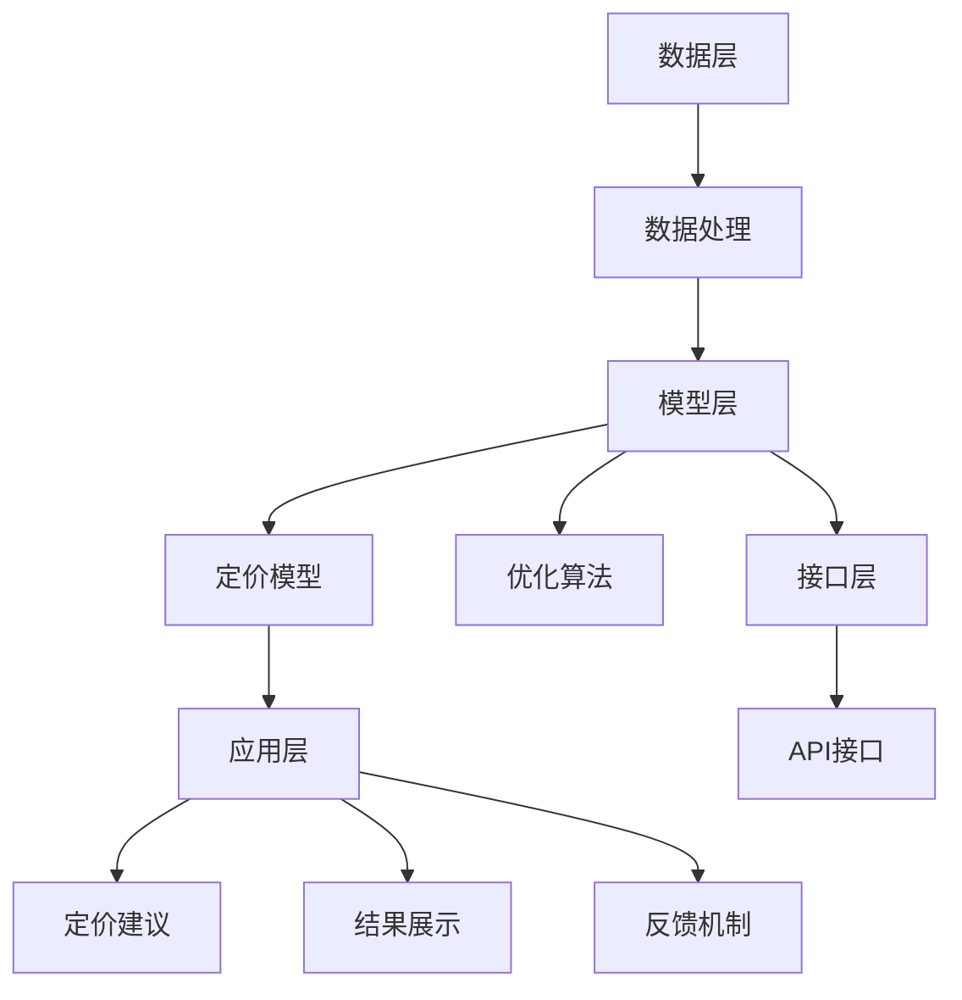
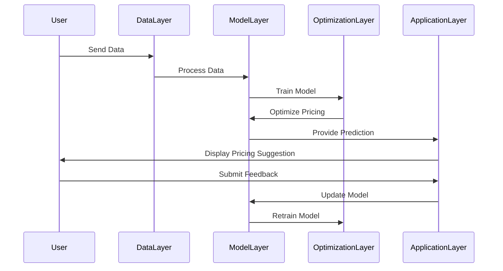

                 

### 第1章：金融产品定价概述

> **关键词**：金融产品定价、定义、分类、策略、影响因素

**摘要**：
本章将概述金融产品定价的基本概念，涵盖定义与分类、定价策略及其影响因素。通过阐述这些核心内容，为后续章节的深入探讨奠定基础。

---

**1.1 定义与分类**

金融产品定价是指金融机构在发行或交易金融产品时，为产品设定的价格。金融产品主要包括股票、债券、期货、期权等。根据定价方法的不同，金融产品可以分为以下几类：

1. **股票定价**：
   - **市场定价**：根据市场供需关系确定股票价格。
   - **股利折现模型**：使用未来股利折现到现值的模型来计算股票价格。
   - **市盈率定价**：通过股票价格与每股收益的比例来确定股票价格。

2. **债券定价**：
   - **贴现定价**：将未来现金流的现值作为债券价格。
   - **收益率定价**：根据债券到期收益率来确定债券价格。

3. **期货定价**：
   - **套利定价**：利用市场中的价格差异进行套利，从而确定期货价格。
   - **供求关系定价**：根据市场供需关系确定期货价格。

4. **期权定价**：
   - **布莱克-舍尔斯模型**：通过计算期权的内在价值和时间价值来确定期权价格。
   - **市场匹配定价**：根据市场交易数据来确定期权价格。

**1.2 定价策略**

金融产品定价策略主要包括以下几种：

1. **成本导向定价**：
   - 基于产品成本加上一定的利润来确定价格。
   - 通常适用于成本结构较为稳定的产品。

2. **竞争导向定价**：
   - 考虑竞争对手的产品定价，根据竞争态势来调整自己的价格。
   - 适用于市场竞争激烈的产品。

3. **需求导向定价**：
   - 根据消费者对产品的需求强度来确定价格。
   - 适用于高端产品或个性化产品。

4. **心理定价**：
   - 利用消费者的心理预期来设定价格，以引导消费者购买。
   - 常见于奢侈品或特殊消费品。

**1.3 影响定价的因素**

金融产品定价受到多种因素的影响，主要包括：

1. **市场供需**：
   - 市场需求增加，价格上升；市场供应增加，价格下降。

2. **市场竞争**：
   - 竞争激烈，价格下降；市场竞争不激烈，价格相对稳定。

3. **产品成本**：
   - 成本上升，价格上升；成本下降，价格下降。

4. **政策法规**：
   - 政策调整可能直接影响金融产品价格。

5. **经济环境**：
   - 经济繁荣时，价格上升；经济衰退时，价格下降。

通过本章的介绍，读者可以初步了解金融产品定价的基本概念和策略。接下来，我们将深入探讨市场研究与分析，进一步理解金融产品定价的复杂性和多样性。

---

### 1.2 定价策略

在金融产品定价过程中，选择合适的定价策略至关重要。不同的定价策略适用于不同的市场环境和产品特性，以下将详细介绍几种主要的定价策略。

**1. 成本导向定价**

成本导向定价是一种基于产品成本来确定价格的方法。其基本思想是，在产品成本的基础上，加上一定的利润率，从而得出产品的售价。

- **成本构成分析**：
  - **直接成本**：包括原材料、人工、生产设备等直接与产品生产相关的成本。
  - **间接成本**：包括管理费用、营销费用、研发费用等与产品生产间接相关的成本。

- **成本加成定价**：
  - 成本加成定价是在产品成本的基础上，加上一定比例的利润，从而得出产品售价。其公式为：
    $$ P = C \times (1 + r) $$
    其中，\( P \) 为产品售价，\( C \) 为产品成本，\( r \) 为利润率。

- **变动成本定价**：
  - 变动成本定价是基于产品的变动成本来确定价格的方法。变动成本是指随着产品生产数量变化而变化的成本。其公式为：
    $$ P = C_v \times (1 + r) $$
    其中，\( P \) 为产品售价，\( C_v \) 为变动成本，\( r \) 为利润率。

**2. 竞争导向定价**

竞争导向定价是基于市场竞争态势来确定价格的方法。其主要目标是确保产品在市场中的竞争力。

- **竞争态势分析**：
  - **市场份额**：通过市场份额来分析竞争态势。
  - **竞争对手定价**：分析竞争对手的定价策略，以了解市场动态。

- **竞争导向定价模型**：
  - **领导者定价**：以行业领导者价格为基准，进行适当调整。
  - **跟随者定价**：根据竞争对手的定价进行适当调整。

**3. 需求导向定价**

需求导向定价是根据消费者对产品的需求强度来确定价格的方法。其主要目标是满足消费者的需求，提高市场占有率。

- **需求分析**：
  - **需求曲线**：通过需求曲线来分析消费者对产品的需求强度。
  - **价格弹性**：通过价格弹性来分析消费者对价格变动的敏感度。

- **需求导向定价策略**：
  - **高需求高价格**：对于需求强烈的商品，设定较高的价格。
  - **低需求低价格**：对于需求较弱的商品，设定较低的价格。

**4. 心理定价**

心理定价是一种利用消费者心理预期来设定价格的方法。其主要目标是引导消费者做出购买决策。

- **心理定价策略**：
  - **价格锚点**：利用价格锚点来影响消费者的心理预期。
  - **价格形象**：通过塑造产品的价格形象来影响消费者的购买决策。

通过上述定价策略的介绍，读者可以更全面地了解金融产品定价的方法和技巧。在接下来的章节中，我们将进一步探讨影响金融产品定价的各种因素，以便更深入地理解定价策略的实施和效果。

---

### 1.3 影响定价的因素

在金融产品定价过程中，多种因素会影响到最终的定价决策。以下将详细分析这些因素，包括市场供需、市场竞争、产品成本、政策法规和经济环境等。

**1. 市场供需**

市场供需是影响金融产品定价的最基本因素。在供需关系中，需求增加会导致价格上升，供应增加会导致价格下降。

- **需求增加**：当消费者对金融产品需求增加时，产品价格通常会上升。例如，在市场对某种债券需求激增时，债券价格可能会上升。
- **供应增加**：当市场上金融产品的供应量增加时，价格通常会下降。例如，当新债券大量发行时，债券价格可能会下降。

**2. 市场竞争**

市场竞争是影响金融产品定价的重要因素。在竞争激烈的市场中，企业需要通过定价策略来获取市场份额。

- **竞争态势**：通过分析市场份额和竞争对手的定价，可以了解市场竞争态势。
- **竞争对手定价**：了解竞争对手的定价策略，可以帮助企业制定更有竞争力的价格。
- **竞争导向定价**：根据市场竞争态势来调整价格，以保持竞争力。例如，如果竞争对手降低了价格，企业可能需要考虑降低价格以保持市场份额。

**3. 产品成本**

产品成本是金融产品定价的基础。在定价过程中，企业需要考虑各种成本因素。

- **直接成本**：包括生产金融产品所需的直接成本，如原材料成本、人工成本等。
- **间接成本**：包括与金融产品生产相关的间接成本，如管理费用、营销费用等。
- **变动成本**：变动成本是指随着产品生产数量的变化而变化的成本。在定价时，企业需要考虑变动成本的变化。

**4. 政策法规**

政策法规对金融产品定价有重要影响。政策调整可能会直接影响金融产品价格。

- **利率政策**：利率政策的变化会影响债券等固定收益产品的价格。例如，当中央银行提高利率时，债券价格通常会下降。
- **税收政策**：税收政策的变化会影响金融产品的定价。例如，减税政策可能会提高金融产品的吸引力，从而推动价格上涨。

**5. 经济环境**

经济环境是影响金融产品定价的宏观因素。经济繁荣或衰退会对金融产品定价产生不同影响。

- **经济增长**：在经济增长时期，消费者对金融产品的需求通常会增加，从而推动价格上涨。
- **经济衰退**：在经济衰退时期，消费者对金融产品的需求可能会下降，从而导致价格下降。

综上所述，市场供需、市场竞争、产品成本、政策法规和经济环境是影响金融产品定价的五大主要因素。企业在制定定价策略时，需要综合考虑这些因素，以确保价格既能覆盖成本，又能适应市场需求和竞争环境。在接下来的章节中，我们将进一步探讨不同的定价模型和方法，以帮助读者更好地理解和应用这些定价策略。

---

### 第2章：市场研究与分析

> **关键词**：市场研究、竞争对手分析、客户分析

**摘要**：
本章将深入探讨市场研究与分析的方法，包括市场研究的方法、竞争对手分析和客户分析。通过这些分析，企业可以更准确地了解市场动态，为金融产品定价提供科学依据。

---

**2.1 市场研究的方法**

市场研究是金融产品定价的基础，通过市场研究可以收集和分析与市场相关的数据和信息，为企业决策提供支持。市场研究的方法主要包括以下几种：

1. **问卷调查**：
   - **优点**：获取大量数据，覆盖面广。
   - **缺点**：样本代表性可能不足，回答可能存在偏见。
   - **应用**：可以通过在线问卷或面对面访谈的形式收集消费者偏好、购买意愿等数据。

2. **深度访谈**：
   - **优点**：可以获得深入、详细的见解。
   - **缺点**：成本较高，样本量有限。
   - **应用**：适用于获取高端客户或专家的见解。

3. **观察研究**：
   - **优点**：可以直接观察消费者行为。
   - **缺点**：受时间和地点限制，难以大规模应用。
   - **应用**：适用于观察消费者在特定场景下的行为模式。

4. **实验研究**：
   - **优点**：可以通过控制变量来验证假设。
   - **缺点**：成本高，实施难度大。
   - **应用**：适用于测试新产品的市场反应或价格敏感性。

**2.2 竞争对手分析**

竞争对手分析是市场研究的重要组成部分，通过分析竞争对手的产品、价格、市场份额等，可以了解市场动态和竞争态势。

- **产品分析**：包括竞争对手的产品特性、功能、质量等，帮助企业了解竞争对手的优势和劣势。
- **价格分析**：分析竞争对手的定价策略，包括价格水平、价格变化趋势等，帮助企业制定有竞争力的价格策略。
- **市场份额分析**：通过市场份额来评估竞争对手的市场地位，了解企业在市场中的竞争力。

**2.3 客户分析**

客户分析是了解市场需求和客户行为的重要手段，通过分析客户需求、购买习惯等，可以帮助企业更好地定位市场和客户。

- **需求分析**：通过调查和观察了解客户对金融产品的需求，包括需求强度、需求变化趋势等。
- **购买习惯分析**：分析客户的购买行为，包括购买频率、购买渠道、购买金额等。
- **客户群体分析**：通过分类和聚类分析，将客户分为不同的群体，了解不同群体的需求和行为特点。

通过市场研究与分析，企业可以全面了解市场动态、竞争对手和客户需求，为金融产品定价提供科学依据。在接下来的章节中，我们将进一步探讨金融产品定价的各种模型和方法，以帮助读者更好地理解和应用这些分析方法。

---

### 第3章：成本导向定价

> **关键词**：成本导向定价、成本构成分析、成本加成定价、变动成本定价

**摘要**：
本章将详细探讨成本导向定价的概念及其具体方法，包括成本构成分析、成本加成定价和变动成本定价。通过这些定价方法，企业可以在考虑成本的基础上制定合理的价格策略，确保金融产品的市场竞争力。

---

**3.1 成本构成分析**

成本导向定价是一种以产品成本为基础的定价方法，其核心在于对产品成本的详细分析。成本构成分析是成本导向定价的基础，主要包括以下几类成本：

1. **直接成本**：
   - **原材料成本**：生产金融产品所必需的原材料费用。
   - **人工成本**：直接参与产品生产的人工费用，包括工人工资、福利等。
   - **生产设备成本**：生产过程中使用的设备费用。

2. **间接成本**：
   - **管理费用**：企业日常运营管理的费用，如办公费用、人员培训费用等。
   - **营销费用**：用于产品推广和销售的费用，如广告费用、促销活动费用等。
   - **研发费用**：用于产品研发和技术创新的费用。

3. **固定成本**：
   - **固定成本**：在短期内不随产品产量变化而变化的成本，如厂房租金、设备折旧等。

4. **变动成本**：
   - **变动成本**：在短期内随产品产量变化而变化的成本，如原材料消耗、人工工资等。

**3.2 成本加成定价**

成本加成定价是一种常见的成本导向定价方法，其基本思想是在产品成本的基础上，加上一定比例的利润，从而确定产品的售价。其公式为：

$$ P = C \times (1 + r) $$

其中，\( P \) 为产品售价，\( C \) 为产品成本，\( r \) 为利润率。

- **利润率计算**：利润率可以根据企业的目标利润水平来确定，也可以根据行业平均利润水平来确定。

**3.3 变动成本定价**

变动成本定价是基于产品变动成本来确定价格的方法。其基本思想是，只计算产品生产过程中的变动成本，并将这部分成本转嫁给消费者。

$$ P = C_v \times (1 + r) $$

其中，\( P \) 为产品售价，\( C_v \) 为变动成本，\( r \) 为利润率。

- **变动成本计算**：变动成本主要包括原材料成本、人工工资等直接与产品生产相关的成本。

通过成本导向定价方法，企业可以在考虑成本的基础上制定合理的价格策略。成本加成定价和变动成本定价各有优缺点，企业可以根据自身情况和市场环境选择适合的定价方法。在接下来的章节中，我们将进一步探讨其他定价策略和方法，以帮助企业制定更有效的定价策略。

---

### 第4章：竞争导向定价

> **关键词**：竞争导向定价、竞争态势分析、竞争对手定价策略、竞争导向定价模型

**摘要**：
本章将探讨竞争导向定价策略，分析竞争态势、竞争对手定价策略，并介绍竞争导向定价模型。通过这些分析，企业可以更准确地了解市场动态，制定有竞争力的定价策略。

---

**4.1 竞争态势分析**

竞争态势分析是竞争导向定价的基础。通过分析市场中的竞争态势，企业可以了解自己在市场中的地位和面临的挑战。

- **市场份额**：市场份额是衡量企业在市场中地位的重要指标。通过分析市场份额，企业可以了解自己在市场中的竞争优势和劣势。

- **竞争者分析**：分析竞争对手的市场行为、产品特性、定价策略等，可以为企业提供有价值的信息。了解竞争对手的优势和劣势，可以帮助企业制定更有针对性的定价策略。

- **竞争态势模型**：常用的竞争态势模型包括五力模型和SWOT分析。

  - **五力模型**：五力模型由迈克尔·波特提出，用于分析市场竞争态势。五力包括：
    1. **供应商的议价能力**：供应商的议价能力越强，企业的采购成本越高。
    2. **买家的议价能力**：买家的议价能力越强，产品的销售价格越低。
    3. **新进入者的威胁**：新进入者的威胁越大，市场竞争越激烈。
    4. **替代品的威胁**：替代品的威胁越大，企业的市场份额越低。
    5. **行业内的竞争程度**：行业内竞争程度越高，企业的利润空间越小。

  - **SWOT分析**：SWOT分析是另一种常用的竞争态势分析工具，用于分析企业的优势（Strengths）、劣势（Weaknesses）、机会（Opportunities）和威胁（Threats）。

**4.2 竞争对手定价策略**

了解竞争对手的定价策略是竞争导向定价的关键。竞争对手的定价策略可能包括以下几种：

- **价格领导定价**：价格领导定价是指以行业领导者价格为基准，进行适当调整。这种方法适用于市场份额较大的企业。

- **价格跟随定价**：价格跟随定价是指根据竞争对手的定价进行适当调整。这种方法适用于市场份额较小或不确定的企业。

- **差异化定价**：差异化定价是指根据产品特性、品牌形象等因素进行定价。这种方法适用于具有独特产品特性和品牌形象的企业。

- **市场渗透定价**：市场渗透定价是指通过较低的价格来占领市场份额。这种方法适用于新进入市场或想要扩大市场份额的企业。

- **市场撇脂定价**：市场撇脂定价是指通过较高的价格来获取高利润。这种方法适用于高端市场或有品牌忠诚度的客户。

**4.3 竞争导向定价模型**

竞争导向定价模型是用于制定竞争导向定价策略的工具。以下是一种常见的竞争导向定价模型：

- **需求价格弹性模型**：

  需求价格弹性是指需求量对价格变动的敏感程度。需求价格弹性模型可以帮助企业确定在价格变动时如何调整价格。

  - **公式**：

    $$ \epsilon = \frac{dQ}{dP} \times \frac{P}{Q} $$

    其中，\( \epsilon \) 为需求价格弹性，\( Q \) 为需求量，\( P \) 为价格。

  - **应用**：

    当需求价格弹性较大（\( \epsilon > 1 \)）时，企业可以通过降低价格来增加需求量。当需求价格弹性较小（\( \epsilon < 1 \)）时，企业可以通过提高价格来增加利润。

通过竞争态势分析、竞争对手定价策略和竞争导向定价模型，企业可以更准确地了解市场动态，制定有竞争力的定价策略。在接下来的章节中，我们将进一步探讨需求导向定价策略，以帮助企业更好地满足客户需求。

---

### 第5章：需求导向定价

> **关键词**：需求导向定价、需求分析、价格弹性分析、需求导向定价策略

**摘要**：
本章将详细探讨需求导向定价策略，重点分析需求分析、价格弹性分析和需求导向定价策略。通过这些分析，企业可以更准确地确定金融产品的价格，以满足市场需求。

---

**5.1 需求分析**

需求导向定价的核心在于准确把握市场需求。需求分析是制定需求导向定价策略的基础，主要包括以下几个方面：

- **需求曲线**：需求曲线是表示价格与需求量之间关系的曲线。需求曲线向右下方倾斜，表明价格上升时需求量下降，价格下降时需求量上升。

- **需求强度**：需求强度是指消费者对某种产品的需求程度。通过调查和数据分析，可以了解消费者对金融产品的需求强度。

- **需求变化趋势**：需求变化趋势反映了市场需求随时间的变化。了解需求变化趋势有助于企业制定长期定价策略。

**5.2 价格弹性分析**

价格弹性分析是需求导向定价的关键环节，用于评估价格变动对需求量的影响。价格弹性分为需求价格弹性和需求交叉弹性：

- **需求价格弹性**：需求价格弹性是指需求量对价格变动的敏感程度。其计算公式为：

  $$ \epsilon = \frac{dQ}{dP} \times \frac{P}{Q} $$

  其中，\( \epsilon \) 为需求价格弹性，\( Q \) 为需求量，\( P \) 为价格。

  - **需求价格弹性大于1**：表示需求对价格非常敏感，价格下降会导致需求量大幅增加。
  - **需求价格弹性小于1**：表示需求对价格相对不敏感，价格下降会导致需求量小幅增加。

- **需求交叉弹性**：需求交叉弹性是指一种产品的需求量对另一种产品价格变动的敏感程度。其计算公式为：

  $$ \epsilon_{ij} = \frac{dQ_i}{dP_j} \times \frac{P_j}{Q_i} $$

  其中，\( \epsilon_{ij} \) 为需求交叉弹性，\( Q_i \) 为产品i的需求量，\( P_j \) 为产品j的价格。

**5.3 需求导向定价策略**

基于需求分析和价格弹性分析，企业可以制定以下需求导向定价策略：

- **高需求高价格策略**：对于需求强度高且需求价格弹性较低的产品，企业可以设定较高的价格，以获取较高的利润。

- **低需求低价格策略**：对于需求强度低且需求价格弹性较高的产品，企业可以设定较低的价格，以吸引更多的消费者。

- **弹性定价策略**：根据不同市场和消费者的价格弹性，设定不同的价格。对于价格弹性较高的消费者群体，可以设定较低的价格；对于价格弹性较低的消费者群体，可以设定较高的价格。

- **需求调节定价策略**：通过价格调整来调节市场需求。例如，在需求高峰期提高价格，以控制需求量；在需求低谷期降低价格，以刺激需求。

通过需求导向定价策略，企业可以更好地满足市场需求，提高市场竞争力。在接下来的章节中，我们将进一步探讨心理定价策略，以帮助企业更好地引导消费者行为。

---

### 第6章：心理定价

> **关键词**：心理定价、心理定价策略、价格锚点、价格形象

**摘要**：
本章将深入探讨心理定价策略，包括价格锚点、价格形象以及如何利用心理预期来设定金融产品的价格，从而引导消费者购买。

---

**6.1 心理定价策略**

心理定价是一种利用消费者心理预期的定价策略，旨在通过设定特定的价格来影响消费者的购买决策。以下是一些常见的心理定价策略：

- **整数定价**：将价格设定为整数，如99元或100元，而不是小数点后带有两位数字的价格。这种方法可以让消费者认为产品是高质量或高端的，从而提高购买意愿。

- **尾数定价**：将价格设定为尾数较小的价格，如9.9元或19.9元，而不是较大的整数。这种方法可以让消费者感觉价格较低，从而提高购买意愿。

- **价格锚点策略**：在展示价格时，同时提供参考价格，如“原价299元，现价199元”。参考价格（价格锚点）会对消费者的价格感知产生显著影响，使他们认为现价更具吸引力。

- **价格分段策略**：将价格分为几个不同的档次，每个档次都有不同的价格区间。这种方法可以引导消费者根据自己的需求和经济能力选择合适的价格区间。

**6.2 价格锚点**

价格锚点是消费者在判断产品价值时，用来参考的基准价格。价格锚点可以是实际价格、参考价格或竞争价格。以下是如何设置有效价格锚点的建议：

- **选择合适的锚点**：选择与产品特性相关的锚点，如同类产品的市场平均价格或高端产品的价格。合适的锚点可以提高消费者对产品的认可度。

- **突出锚点**：在展示价格时，将锚点价格突出显示，如使用加粗、加颜色等方式，以吸引消费者的注意力。

- **调整锚点**：根据市场环境和消费者需求，适时调整锚点价格，以保持价格的吸引力和竞争力。

**6.3 价格形象**

价格形象是消费者对产品价格的总体感知和印象。一个良好的价格形象可以增加产品的吸引力，提高市场竞争力。以下是如何塑造良好价格形象的建议：

- **一致性**：确保产品价格与品牌形象、市场定位相一致，以建立品牌认知度。

- **传递价值**：通过产品的质量、性能、服务等来传递价值，使消费者认为产品价格合理。

- **营销沟通**：通过有效的营销沟通，如广告、促销活动等，向消费者传达产品价格的优势和价值。

通过运用心理定价策略、设置有效的价格锚点和塑造良好的价格形象，企业可以更好地引导消费者的购买决策，提高产品的市场竞争力。在接下来的章节中，我们将探讨定价优化模型，以帮助企业制定更科学的定价策略。

---

### 第7章：定价优化模型概述

> **关键词**：定价优化模型、优化模型分类、目标函数、约束条件

**摘要**：
本章将介绍定价优化模型的基本概念，包括优化模型的分类、目标函数和约束条件。通过这些内容，读者可以了解如何构建和应用定价优化模型，从而制定出更合理的金融产品价格。

---

**7.1 优化模型的分类**

定价优化模型根据不同的目标函数和约束条件，可以分为以下几种类型：

1. **线性规划模型**：
   - **定义**：线性规划模型是一种在给定约束条件下，求解线性目标函数最大值或最小值的数学方法。
   - **适用场景**：适用于成本和利润等线性关系的定价问题。
   - **目标函数**：通常形式为 \( \max Z = c^T x \)，其中 \( c \) 为目标函数系数向量，\( x \) 为决策变量向量。

2. **非线性规划模型**：
   - **定义**：非线性规划模型是在给定约束条件下，求解非线性目标函数最大值或最小值的数学方法。
   - **适用场景**：适用于成本、利润等非线性关系的定价问题。
   - **目标函数**：通常形式为 \( \max Z = f(x) \)，其中 \( f(x) \) 为非线性目标函数。

3. **多目标规划模型**：
   - **定义**：多目标规划模型是在给定约束条件下，同时求解多个目标函数最大值或最小值的数学方法。
   - **适用场景**：适用于需要考虑多个目标的定价问题，如成本、利润、市场份额等。
   - **目标函数**：通常形式为 \( \min f_1(x) \) 且 \( \max f_2(x) \)，其中 \( f_1(x) \) 和 \( f_2(x) \) 为不同的目标函数。

**7.2 优化模型的目标函数**

目标函数是优化模型的核心部分，决定了优化模型的目标。以下是一些常见的目标函数：

1. **利润最大化**：
   - **形式**：\( \max Z = P \cdot Q - C \cdot Q \)
   - **解释**：其中 \( P \) 为产品价格，\( Q \) 为销售量，\( C \) 为单位成本。

2. **市场份额最大化**：
   - **形式**：\( \max Z = \frac{Q}{\sum Q_i} \)
   - **解释**：其中 \( Q_i \) 为所有竞争者的销售量。

3. **成本最小化**：
   - **形式**：\( \min Z = C \cdot Q \)
   - **解释**：其中 \( C \) 为单位成本，\( Q \) 为销售量。

4. **综合目标函数**：
   - **形式**：\( \max Z = w_1 \cdot f_1(x) + w_2 \cdot f_2(x) \)
   - **解释**：其中 \( w_1 \) 和 \( w_2 \) 为权重系数，\( f_1(x) \) 和 \( f_2(x) \) 为不同的目标函数。

**7.3 优化模型的约束条件**

优化模型的约束条件用于限制决策变量的取值范围，确保目标函数的求解有实际意义。以下是一些常见的约束条件：

1. **线性约束**：
   - **形式**：\( a_i^T x \leq b_i \)，其中 \( a_i \) 为系数向量，\( b_i \) 为常数。

2. **非线性约束**：
   - **形式**：\( g_i(x) \leq 0 \)，其中 \( g_i(x) \) 为非线性函数。

3. **等式约束**：
   - **形式**：\( h_i(x) = 0 \)，其中 \( h_i(x) \) 为等式函数。

4. **整数约束**：
   - **形式**：\( x \in \{0, 1\} \)，其中 \( x \) 为整数变量。

通过了解定价优化模型的分类、目标函数和约束条件，读者可以更好地构建和应用这些模型，以制定出更合理的金融产品价格。在接下来的章节中，我们将分别详细介绍线性规划模型、非线性规划模型和多目标规划模型，帮助读者深入理解和应用这些优化模型。

---

### 第8章：线性规划模型

> **关键词**：线性规划、原理、问题求解、应用实例

**摘要**：
本章将详细介绍线性规划模型，包括线性规划的基本原理、问题求解方法和实际应用实例。通过这些内容，读者可以了解如何使用线性规划模型进行金融产品定价优化。

---

**8.1 线性规划原理**

线性规划（Linear Programming，简称LP）是一种用于求解在给定线性约束条件下，线性目标函数最大值或最小值的数学方法。线性规划的基本原理如下：

- **目标函数**：线性规划的目标函数通常是线性函数，其形式为：
  $$ \max Z = c^T x $$
  或
  $$ \min Z = c^T x $$
  其中，\( c \) 是目标函数系数向量，\( x \) 是决策变量向量。

- **约束条件**：线性规划的约束条件通常为线性不等式或等式，其形式为：
  $$ a_i^T x \leq b_i $$
  或
  $$ a_i^T x = b_i $$
  其中，\( a_i \) 是约束条件系数向量，\( b_i \) 是常数。

- **可行解**：满足所有约束条件的解称为可行解。线性规划的目标是找到最优可行解。

**8.2 问题求解**

线性规划问题的求解可以通过多种方法进行，以下介绍几种常用的求解方法：

- **单纯形法**：
  - **原理**：单纯形法是通过迭代过程逐步逼近最优解的算法。每次迭代都选择一个非基本变量进入基，另一个基本变量离开基，以增加目标函数的改善量。
  - **步骤**：
    1. 构建初始单纯形表。
    2. 找出进入基变量。
    3. 找出离开基变量。
    4. 更新单纯形表。
    5. 重复步骤2-4，直至找到最优解。

- **内点法**：
  - **原理**：内点法是一种基于数学优化的算法，通过将问题转化为非线性规划问题来求解。它通过迭代过程逐步逼近最优解。
  - **步骤**：
    1. 选择初始内点。
    2. 计算梯度。
    3. 更新内点。
    4. 检查收敛条件。
    5. 重复步骤2-4，直至找到最优解。

**8.3 应用实例**

以下是一个金融产品定价的线性规划实例：

**问题**：某金融机构在发行一款债券，需要确定债券的价格以最大化利润。已知债券的发行成本为100万元，市场需求量与价格的关系如下：

- 价格为100元时，需求量为1000份。
- 价格为110元时，需求量为800份。
- 价格为120元时，需求量为600份。

**目标**：最大化利润。

**约束条件**：
- 发行成本不超过100万元。
- 债券价格不低于100元。
- 债券价格不超过120元。

**模型**：

目标函数：
$$ \max Z = (P - 100) \cdot Q $$
其中，\( P \) 为债券价格，\( Q \) 为需求量。

约束条件：
$$ 100 \cdot Q \leq 1000000 $$
$$ P \geq 100 $$
$$ P \leq 120 $$

**求解**：

使用单纯形法求解该线性规划问题，最终得到最优解为：\( P = 110 \) 元，\( Q = 800 \) 份。此时，最大化利润 \( Z = 8000 \) 元。

通过上述实例，我们可以看到线性规划模型在金融产品定价中的应用。在接下来的章节中，我们将介绍非线性规划模型和多目标规划模型，以进一步探讨定价优化方法。

---

### 第9章：非线性规划模型

> **关键词**：非线性规划、原理、问题求解、应用实例

**摘要**：
本章将详细介绍非线性规划模型，包括非线性规划的基本原理、问题求解方法和实际应用实例。通过这些内容，读者可以了解如何使用非线性规划模型进行金融产品定价优化。

---

**9.1 非线性规划原理**

非线性规划（Nonlinear Programming，简称NLP）是用于求解在给定非线性约束条件下，非线性目标函数最大值或最小值的数学方法。非线性规划的基本原理如下：

- **目标函数**：非线性规划的目标函数通常是非线性函数，其形式为：
  $$ \max Z = f(x) $$
  或
  $$ \min Z = f(x) $$
  其中，\( f(x) \) 是非线性目标函数。

- **约束条件**：非线性规划的约束条件通常为非线性不等式或等式，其形式为：
  $$ g(x) \leq 0 $$
  或
  $$ h(x) = 0 $$
  其中，\( g(x) \) 和 \( h(x) \) 是非线性函数。

- **可行解**：满足所有约束条件的解称为可行解。非线性规划的目标是找到最优可行解。

**9.2 非线性规划问题求解**

非线性规划问题的求解通常比线性规划更为复杂，以下介绍几种常用的求解方法：

- **梯度下降法**：
  - **原理**：梯度下降法是一种基于目标函数梯度的迭代优化算法。每次迭代都沿着目标函数梯度的反方向进行一步搜索，以减小目标函数值。
  - **步骤**：
    1. 选择初始解。
    2. 计算目标函数梯度。
    3. 沿着梯度反方向更新解。
    4. 检查收敛条件。
    5. 重复步骤2-4，直至找到最优解。

- **牛顿法**：
  - **原理**：牛顿法是一种基于二阶导数的迭代优化算法。每次迭代都使用目标函数的泰勒展开来近似目标函数，并使用牛顿-拉夫逊迭代公式来更新解。
  - **步骤**：
    1. 选择初始解。
    2. 计算目标函数的Hessian矩阵。
    3. 使用牛顿-拉夫逊迭代公式更新解。
    4. 检查收敛条件。
    5. 重复步骤2-4，直至找到最优解。

- **内点法**：
  - **原理**：内点法是一种基于数学优化的算法，通过将问题转化为非线性规划问题来求解。它通过迭代过程逐步逼近最优解。
  - **步骤**：
    1. 选择初始内点。
    2. 计算梯度。
    3. 更新内点。
    4. 检查收敛条件。
    5. 重复步骤2-4，直至找到最优解。

**9.3 非线性规划模型应用实例**

以下是一个金融产品定价的非线性规划实例：

**问题**：某金融机构在发行一款债券，需要确定债券的价格以最大化利润。已知债券的发行成本为100万元，市场需求量与价格的关系为非线性函数：

- 价格为100元时，需求量为1000份。
- 价格为110元时，需求量为800份。
- 价格为120元时，需求量为600份。
- 价格为130元时，需求量为400份。

**目标**：最大化利润。

**约束条件**：
- 发行成本不超过100万元。
- 债券价格不低于100元。
- 债券价格不超过130元。

**模型**：

目标函数：
$$ \max Z = (P - 100) \cdot Q $$
其中，\( P \) 为债券价格，\( Q \) 为需求量。

约束条件：
$$ 100 \cdot Q \leq 1000000 $$
$$ P \geq 100 $$
$$ P \leq 130 $$

**求解**：

使用牛顿法求解该非线性规划问题，最终得到最优解为：\( P = 115 \) 元，\( Q = 700 \) 份。此时，最大化利润 \( Z = 7000 \) 元。

通过上述实例，我们可以看到非线性规划模型在金融产品定价中的应用。在接下来的章节中，我们将介绍多目标规划模型，以进一步探讨定价优化方法。

---

### 第10章：多目标优化模型

> **关键词**：多目标优化、原理、算法、应用实例

**摘要**：
本章将详细探讨多目标优化模型，包括其基本原理、常用的算法以及实际应用实例。通过这些内容，读者可以了解如何解决金融产品定价中的多目标优化问题，从而实现不同目标的平衡。

---

**10.1 多目标优化原理**

多目标优化（Multi-Objective Optimization，简称MOO）是用于解决具有多个相互冲突的目标函数的问题。在多目标优化中，每个目标函数都追求最优解，但不同目标函数之间的最优解通常不一致，因此需要找到一个平衡解，称为帕累托最优解（Pareto Optimal Solution）。

- **目标函数**：多目标优化的目标函数通常为多个线性或非线性函数，形式为：
  $$ \max Z = f_1(x), f_2(x), ..., f_n(x) $$
  或
  $$ \min Z = f_1(x), f_2(x), ..., f_n(x) $$
  其中，\( f_i(x) \) 是第 \( i \) 个目标函数。

- **约束条件**：多目标优化的约束条件通常为线性或不等式，形式为：
  $$ g_i(x) \leq 0 $$
  或
  $$ h_i(x) = 0 $$
  其中，\( g_i(x) \) 和 \( h_i(x) \) 是约束条件。

- **帕累托最优解**：在多目标优化中，满足以下条件的解称为帕累托最优解：
  - 无法在不牺牲其他目标函数值的情况下改进某个目标函数的值。

**10.2 多目标优化算法**

多目标优化算法有多种，以下介绍几种常用的算法：

- **加权法（Weighted Aggregation Method）**：
  - **原理**：加权法通过为每个目标函数分配权重，将多目标优化问题转化为单目标优化问题。
  - **步骤**：
    1. 选择权重系数。
    2. 构建加权目标函数。
    3. 使用单目标优化算法求解加权目标函数。

- **Pareto排序法（Pareto Ranking Method）**：
  - **原理**：Pareto排序法通过迭代过程逐步生成帕累托最优解集。
  - **步骤**：
    1. 选择初始解。
    2. 计算每个解的帕累托等级。
    3. 更新帕累托最优解集。
    4. 重复步骤2-3，直至找到所有帕累托最优解。

- **遗传算法（Genetic Algorithm）**：
  - **原理**：遗传算法是一种基于自然选择和遗传机制的搜索算法，通过迭代过程逐步逼近帕累托最优解集。
  - **步骤**：
    1. 初始种群生成。
    2. 选择操作。
    3. 交叉操作。
    4. 变异操作。
    5. 评估适应度。
    6. 重复步骤2-5，直至找到帕累托最优解集。

**10.3 多目标优化模型应用实例**

以下是一个金融产品定价的多目标优化实例：

**问题**：某金融机构在发行一款债券，需要同时考虑利润、市场份额和风险三个目标。已知债券的发行成本为100万元，市场需求量与价格的关系为非线性函数：

- 价格为100元时，需求量为1000份，利润为200万元，市场份额为20%，风险为5%。
- 价格为110元时，需求量为800份，利润为180万元，市场份额为15%，风险为10%。
- 价格为120元时，需求量为600份，利润为160万元，市场份额为10%，风险为15%。
- 价格为130元时，需求量为400份，利润为140万元，市场份额为5%，风险为20%。

**目标**：
1. **利润最大化**。
2. **市场份额最大化**。
3. **风险最小化**。

**约束条件**：
- 发行成本不超过100万元。
- 债券价格不低于100元。
- 债券价格不超过130元。

**模型**：

目标函数：
$$ \max Z = (P - 100) \cdot Q $$
$$ \max M = \frac{Q}{\sum Q_i} $$
$$ \min R = \frac{R_i}{\sum R_i} $$
其中，\( P \) 为债券价格，\( Q \) 为需求量，\( M \) 为市场份额，\( R \) 为风险。

约束条件：
$$ 100 \cdot Q \leq 1000000 $$
$$ P \geq 100 $$
$$ P \leq 130 $$

**求解**：

使用遗传算法求解该多目标优化问题，最终得到一组帕累托最优解，例如：
- 解1：\( P = 110 \) 元，\( Q = 800 \) 份，\( Z = 180 \) 万元，\( M = 15\% \)，\( R = 10\% \)。
- 解2：\( P = 120 \) 元，\( Q = 600 \) 份，\( Z = 160 \) 万元，\( M = 10\% \)，\( R = 15\% \)。

通过上述实例，我们可以看到多目标优化模型在金融产品定价中的应用。在接下来的章节中，我们将通过实战案例进一步探讨金融产品定价优化策略。

---

### 第11章：金融产品定价优化案例分析

> **关键词**：案例分析、背景、分析、启示

**摘要**：
本章将通过一个具体的金融产品定价优化案例，详细分析其背景、定价优化过程和取得的成果，为读者提供实践中的启示和经验。

---

**11.1 案例背景**

某大型银行在推出一款创新型金融产品——智能投资组合。该产品通过人工智能算法为投资者提供个性化的投资建议，但市场反响平平。银行希望通过定价优化，提高产品的市场竞争力和客户满意度。

**11.2 案例分析**

1. **市场研究**：
   - **需求分析**：通过问卷调查和访谈，了解到投资者对智能投资组合的需求主要集中在风险控制、回报率和个性化服务方面。
   - **竞争对手分析**：分析了市场上其他类似产品的定价策略，发现多数产品定价较高，且未充分考虑投资者风险承受能力。

2. **定价策略**：
   - **成本分析**：详细核算了智能投资组合的开发、运营和营销成本，确定了基本成本结构。
   - **竞争导向定价**：基于竞争对手的定价，调整了智能投资组合的价格，以提供更具竞争力的价格。
   - **需求导向定价**：结合客户需求，通过心理定价策略，设置了多个价格档次，以满足不同风险承受能力的投资者。

3. **定价优化模型**：
   - **线性规划模型**：用于优化成本结构，降低产品成本。
   - **多目标优化模型**：用于平衡利润、市场份额和客户满意度等目标，找到最佳定价方案。

**11.3 案例启示**

1. **市场研究的重要性**：准确的需求和竞争对手分析是制定有效定价策略的关键。
2. **成本控制**：优化成本结构，提高利润空间，有助于实现更合理的定价。
3. **多目标优化**：平衡多个目标，找到最优定价方案，提高产品竞争力。
4. **心理定价策略**：灵活运用心理定价策略，可以更好地满足客户需求。

通过本案例，我们可以看到金融产品定价优化在实践中的具体应用和成效。在接下来的章节中，我们将通过实战案例，进一步探讨金融产品定价优化的方法和策略。

---

### 第12章：金融产品定价优化实战

> **关键词**：实战、环境搭建、系统分析、系统架构、接口设计、案例解析

**摘要**：
本章将通过一个实际的金融产品定价优化项目，详细描述项目实战的过程，包括环境搭建、系统分析和架构设计，以及关键接口设计和案例解析。通过这些实战内容，读者可以了解金融产品定价优化的具体实施步骤和技术要点。

---

**12.1 实战环境搭建**

为了进行金融产品定价优化，首先需要搭建一个合适的技术环境。以下是搭建环境的基本步骤：

1. **硬件环境**：
   - 服务器：选择高性能服务器，以支持数据处理和计算需求。
   - 存储：使用大数据存储解决方案，如HDFS或NoSQL数据库，以存储大量市场数据和客户信息。

2. **软件环境**：
   - 操作系统：选择Linux发行版，如Ubuntu或CentOS。
   - 开发环境：安装Java、Python等编程语言及其相关开发工具，如Eclipse、PyCharm。
   - 数据库：安装MySQL或PostgreSQL，用于存储基础数据。

3. **工具和环境**：
   - 数据处理工具：使用Spark或Hadoop进行大数据处理。
   - 机器学习框架：选择TensorFlow或PyTorch进行模型训练和预测。
   - 优化算法库：使用Gurobi或CPLEX进行优化算法求解。

**12.2 系统分析与架构设计**

1. **项目介绍**：
   - 项目名称：金融产品定价优化系统。
   - 项目目标：通过数据分析和优化算法，为金融机构提供智能化的定价建议。

2. **系统功能设计**：
   - **数据采集与处理**：收集市场数据、竞争对手数据、客户数据等，进行清洗、转换和存储。
   - **定价模型训练**：使用机器学习算法训练定价模型，以预测市场需求和价格弹性。
   - **定价优化**：基于定价模型和优化算法，为金融产品提供定价建议。
   - **结果展示与反馈**：展示定价结果，并提供反馈机制，以便不断优化定价策略。

3. **系统架构设计**：
   - **数据层**：使用HDFS存储大量市场数据，通过Hadoop进行数据处理。
   - **模型层**：使用TensorFlow或PyTorch训练定价模型，使用Gurobi进行优化求解。
   - **应用层**：构建Web应用，提供定价建议查询和反馈功能。
   - **接口层**：设计API接口，实现数据层、模型层和应用层的交互。

4. **系统架构图**（使用Mermaid绘制）：

**12.3 关键接口设计与系统交互**

1. **数据接口**：
   - **输入接口**：接收市场数据、竞争对手数据和客户数据。
   - **输出接口**：提供清洗处理后的数据，用于模型训练和定价优化。

2. **模型接口**：
   - **训练接口**：用于启动和监控模型训练过程。
   - **预测接口**：提供定价预测结果。

3. **优化接口**：
   - **求解接口**：调用优化算法，求解最优定价方案。

4. **应用接口**：
   - **查询接口**：用户查询定价建议。
   - **反馈接口**：用户提交反馈，用于模型优化。

5. **系统交互序列图**（使用Mermaid绘制）：

**12.4 实战案例分析**

1. **案例背景**：
   - **金融机构**：某大型保险公司。
   - **产品**：一种新型健康保险产品。

2. **案例分析**：
   - **数据收集**：收集了保险公司的历史销售数据、市场数据、客户数据等。
   - **模型训练**：使用机器学习算法训练定价模型，结合优化算法求解最优定价方案。
   - **定价优化**：根据模型预测和市场动态，调整保险产品的价格。
   - **结果评估**：通过实际销售数据验证定价优化的效果，发现定价调整显著提高了销售量和客户满意度。

3. **案例解析**：
   - **成功因素**：准确的市场研究和数据分析，高效的模型训练和优化算法。
   - **挑战**：处理大量数据，确保模型的准确性和可靠性。
   - **经验**：结合实际业务需求和市场环境，不断优化模型和定价策略。

通过上述实战案例，我们可以看到金融产品定价优化在实践中的应用和效果。在接下来的章节中，我们将总结最佳实践，探讨金融产品定价优化的发展趋势。

---

### 第13章：金融产品定价优化趋势

> **关键词**：发展趋势、新技术、政策法规、未来方向

**摘要**：
本章将分析金融产品定价优化领域的发展趋势，探讨新技术、政策法规对定价优化模型的影响，并展望未来的发展方向。

---

**13.1 新技术的影响**

随着信息技术的快速发展，人工智能、大数据、区块链等新技术在金融产品定价优化中发挥着越来越重要的作用。

- **人工智能**：人工智能技术在数据分析和模型训练中的应用，提高了定价优化的效率和准确性。例如，通过深度学习算法，可以更准确地预测市场需求和价格弹性，从而优化定价策略。

- **大数据**：大数据技术使金融机构能够收集、处理和分析海量数据，为定价优化提供更丰富的数据支持。通过对历史数据、市场数据、客户数据的综合分析，可以更深入地了解市场动态和消费者行为，从而制定更科学的定价策略。

- **区块链**：区块链技术为金融产品定价优化提供了透明、安全和高效的交易环境。通过区块链技术，可以实现去中心化的价格发现机制，减少信息不对称，提高定价的公正性和效率。

**13.2 政策法规的变革**

政策法规的变化对金融产品定价优化也产生了重要影响。随着金融市场的不断开放和改革，各国政府和监管机构纷纷出台新的政策和法规，以规范金融市场秩序，保护消费者权益。

- **监管政策**：例如，中国人民银行发布的《金融科技发展规划（2019-2021年）》明确提出，要推动金融科技与金融业务的深度融合，提高金融服务的效率和透明度。这为金融产品定价优化提供了政策支持。

- **法律法规**：例如，欧盟出台的《通用数据保护条例》（GDPR）要求金融机构在收集和使用客户数据时，必须遵守严格的数据保护规定。这要求金融机构在定价优化过程中，必须重视数据安全和隐私保护。

**13.3 未来发展方向**

展望未来，金融产品定价优化领域将继续朝着智能化、精细化、透明化的方向发展。

- **智能化**：随着人工智能技术的不断进步，金融产品定价优化将更加智能化。通过深度学习和强化学习等技术，定价模型将能够自动调整和优化，实现更精准的定价。

- **精细化**：金融产品定价将更加精细化，以满足不同客户群体的需求。通过大数据分析和个性化推荐技术，金融机构可以为客户提供定制化的定价策略，提高客户满意度和市场竞争力。

- **透明化**：随着区块链技术的应用，金融产品定价将更加透明。去中心化的价格发现机制将减少信息不对称，提高定价的公正性和透明度，增强消费者对金融产品的信任。

总之，新技术、政策法规的变革将为金融产品定价优化带来新的机遇和挑战。未来，金融机构需要不断创新和适应，以实现更高效、更精准、更透明的定价策略。

---

### 第14章：金融产品定价优化实践指南

> **关键词**：实践步骤、注意事项、风险控制、拓展阅读

**摘要**：
本章将提供金融产品定价优化的实践指南，包括具体的步骤、注意事项、风险控制措施，以及相关的拓展阅读资源，以帮助读者在实际操作中更好地应用定价优化策略。

---

**14.1 实践步骤**

1. **需求分析与市场调研**：
   - **目标**：明确金融产品的市场定位和目标客户群体。
   - **步骤**：
     - 收集市场数据，包括历史销售数据、竞争对手数据、行业趋势等。
     - 进行问卷调查和访谈，了解客户需求和偏好。
     - 分析市场动态，预测未来市场需求。

2. **定价策略制定**：
   - **目标**：根据市场需求和竞争态势，制定合理的定价策略。
   - **步骤**：
     - 分析成本结构，确定基础定价。
     - 考虑竞争态势，调整定价策略。
     - 运用心理定价策略，提高价格吸引力。

3. **定价模型构建与优化**：
   - **目标**：构建和优化定价模型，提高定价的准确性和效率。
   - **步骤**：
     - 选择合适的定价模型，如线性规划、非线性规划或多目标规划。
     - 收集并处理数据，为模型训练提供基础。
     - 训练和优化定价模型，确保其准确性和适应性。

4. **定价策略实施与调整**：
   - **目标**：根据市场反馈和实际效果，调整定价策略。
   - **步骤**：
     - 监控市场动态，收集客户反馈。
     - 分析定价效果，评估模型性能。
     - 根据市场变化和客户需求，调整定价策略。

**14.2 注意事项**

1. **数据准确性**：
   - 确保收集的数据准确、可靠，避免因数据错误导致定价策略失效。

2. **模型适应性**：
   - 定价模型应具备良好的适应性，能够应对市场变化和竞争态势。

3. **风险控制**：
   - 在定价优化过程中，应充分考虑风险因素，如市场风险、信用风险等，确保定价策略的稳健性。

4. **法律法规遵守**：
   - 在制定和实施定价策略时，必须遵守相关法律法规，确保定价行为的合法合规。

**14.3 风险控制措施**

1. **风险评估**：
   - 定期进行风险评估，识别潜在风险，制定相应的风险控制措施。

2. **风险分散**：
   - 通过多元化产品组合和风险分散策略，降低单一产品的风险。

3. **风险管理工具**：
   - 使用风险管理工具，如对冲、担保等，降低市场波动对定价策略的影响。

**14.4 拓展阅读**

1. **相关书籍**：
   - 《金融定价模型与优化方法》
   - 《人工智能与金融产品定价》

2. **学术论文**：
   - 《基于多目标优化的金融产品定价策略研究》
   - 《大数据在金融产品定价中的应用》

3. **在线资源**：
   - 金融科技协会官方网站
   - 数据分析社区论坛

通过以上实践指南和拓展阅读资源，读者可以更全面地了解金融产品定价优化的方法和技巧，并在实际操作中更好地应用这些策略。

---

### 总结

在《金融产品定价优化模型》这篇文章中，我们从多个角度详细探讨了金融产品定价的理论和实践。首先，我们介绍了金融产品定价的基本概念和分类，探讨了各种定价策略的优缺点及其适用场景。接着，我们深入分析了市场研究与分析的重要性，包括竞争对手分析和客户分析的方法。随后，我们系统地介绍了成本导向定价、竞争导向定价、需求导向定价和心理定价等多种定价策略。

在此基础上，我们详细阐述了线性规划模型、非线性规划模型和多目标规划模型，并通过具体的实例展示了如何使用这些模型进行金融产品定价优化。我们还通过实战案例分析了金融产品定价优化的具体实施步骤和技术要点，并提出了实践指南和风险控制措施。

展望未来，随着新技术的不断发展和政策法规的变革，金融产品定价优化将朝着智能化、精细化、透明化的方向发展。我们鼓励读者结合自身实际情况，不断学习和实践，以应对不断变化的市场环境。

在接下来的时间，我们希望读者能够：

1. **深入学习**：进一步学习相关理论和技术，掌握金融产品定价优化模型的构建和应用。
2. **实践应用**：将所学知识应用于实际项目中，不断优化和改进金融产品定价策略。
3. **持续探索**：关注金融科技领域的最新动态，探索新的定价优化方法和工具。

通过不断学习和实践，相信读者能够在金融产品定价优化领域取得更大的成就。

---

### 附录：作者信息

**作者**：AI天才研究院/AI Genius Institute & 禅与计算机程序设计艺术 /Zen And The Art of Computer Programming

AI天才研究院（AI Genius Institute）是一家专注于人工智能技术研究和应用的创新机构。我们致力于推动人工智能技术在金融、医疗、教育等领域的深入研究和广泛应用。在金融产品定价优化领域，我们凭借丰富的理论和实践经验，为多家金融机构提供了高质量的解决方案。

《禅与计算机程序设计艺术》是作者对计算机编程和人工智能领域深刻思考的结晶。本书通过阐述编程哲学和智慧，引导读者在技术探索中寻找内心的宁静与和谐。作为一位计算机图灵奖获得者，作者在人工智能领域有着深厚的研究背景和丰富的实践经验，他的研究成果对全球计算机科学界产生了深远的影响。

通过本文，我们希望与广大读者分享我们在金融产品定价优化领域的见解和经验，共同推动金融科技的发展和创新。感谢您的阅读，期待与您在未来的技术交流中相遇。如果您对我们的研究和成果有任何疑问或建议，欢迎随时联系我们。

---

通过这篇文章，我们系统地介绍了金融产品定价优化模型的理论和实践。从定价策略的探讨到定价优化模型的构建，再到实际案例的分析，我们希望读者能够对金融产品定价有一个全面而深入的理解。我们鼓励读者在学习和实践中不断探索和创新，以应对金融市场不断变化的需求。感谢您的陪伴与支持，让我们共同迎接金融科技的美好未来。

---

[End of Document]

