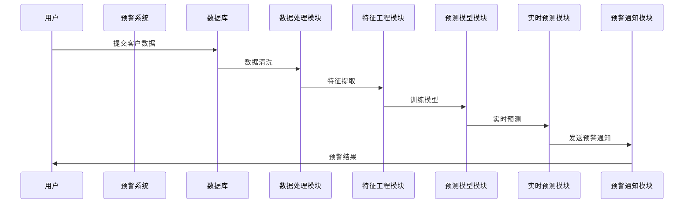
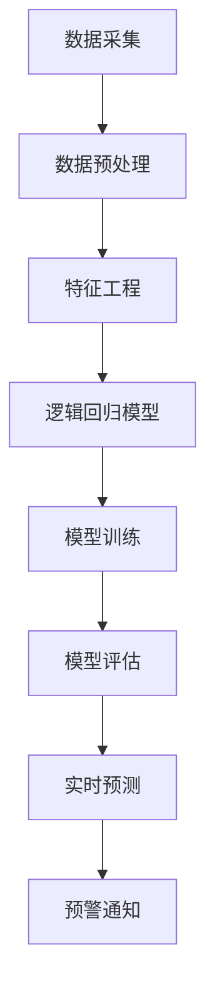
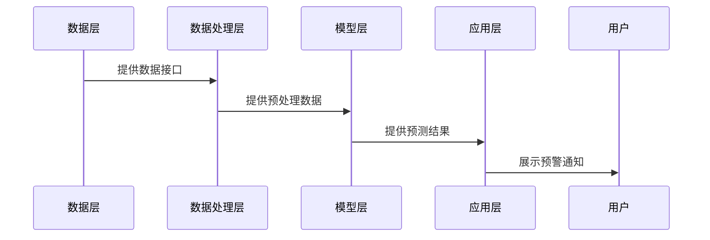
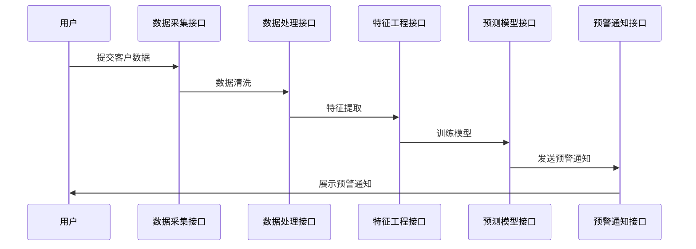
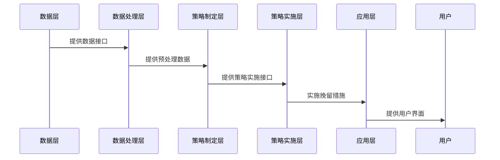
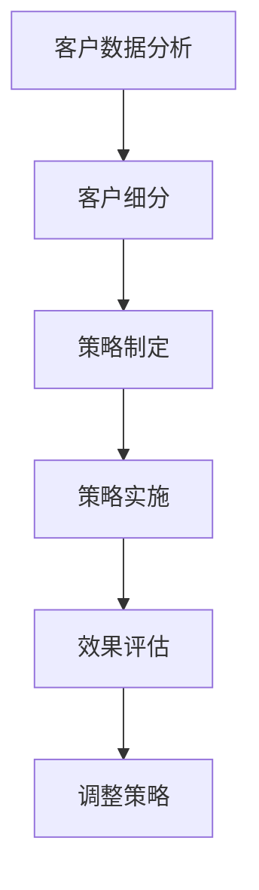
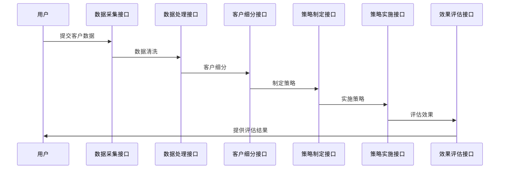

                 

### 1. 引言

在当今金融科技（FinTech）迅速发展的背景下，金融机构正面临着日益激烈的市场竞争。客户流失问题成为了金融行业中的常见现象，对金融机构的盈利能力和市场地位产生了深远的影响。客户流失不仅意味着直接的收益损失，还可能导致品牌形象受损和市场份额缩减。因此，如何预测和挽留流失客户成为了金融行业亟需解决的问题。

#### 1.1 问题背景

**金融产品客户流失的现状**

客户流失在金融行业是一个普遍存在的现象。无论是银行、保险、证券还是其他金融产品，客户流失率都在不断上升。据统计，银行客户的平均流失率约为10%-15%，保险客户的流失率甚至可能高达20%-30%。这些数据揭示了客户流失问题的严重性。

**客户流失对金融机构的影响**

客户流失对金融机构的影响是多方面的：

1. **收益减少**：流失的客户意味着减少的收入来源。
2. **品牌形象受损**：高流失率可能使外界对金融机构产生不信任，影响其品牌形象。
3. **运营成本增加**：流失的客户可能需要重新获取，这需要付出额外的市场推广和客户服务成本。
4. **市场份额缩减**：客户流失可能导致竞争对手获取市场份额。

#### 1.1.3 预警与挽留策略的重要性

在金融产品市场中，客户流失预警与挽留策略具有重要的现实意义：

1. **降低流失率**：通过预警系统提前发现可能流失的客户，金融机构可以及时采取挽留措施，降低客户流失率。
2. **提高客户忠诚度**：有效的挽留策略能够提高客户的忠诚度，增强客户对金融机构的信任。
3. **增加收益**：通过挽留客户，金融机构可以保持稳定的收益来源，提高整体盈利能力。
4. **提升竞争力**：通过有效的客户挽留策略，金融机构可以在竞争激烈的市场中脱颖而出，巩固市场地位。

#### 1.2 问题定义

**客户流失的定义**

客户流失是指客户在一段时间内不再使用某一金融机构的产品或服务。客户流失可以表现为账户注销、交易减少或长期不活跃等形式。

**预警与挽留策略的定义**

预警与挽留策略是指通过数据分析和人工智能技术，预测客户流失风险，并采取相应的措施来挽留流失客户的一系列措施。

#### 1.3 边界与外延

**研究范围**

本文的研究范围主要集中在金融产品客户流失预警与挽留策略系统的构建，包括系统设计、实现和案例分析。

**研究限制**

本文的研究主要基于理论分析和现有数据，未涉及实际业务环境的复杂性和不确定性。

#### 1.4 核心概念与联系

**核心概念简介**

在客户流失预警与挽留策略系统中，核心概念包括客户流失预警、挽留策略、数据采集、特征工程、预测模型等。

**概念属性特征对比表格**

| 概念         | 特征                                                         |
| ------------ | ------------------------------------------------------------ |
| 客户流失预警 | 预测客户流失的可能性，提前通知金融机构采取挽留措施           |
| 挽留策略     | 通过客户分析、行为预测和个性化服务，提高客户留存率           |
| 数据采集     | 收集客户的交易记录、行为数据等信息，为分析和预测提供数据支持 |
| 特征工程     | 从原始数据中提取有用信息，用于训练预测模型                 |
| 预测模型     | 基于历史数据和算法模型，预测客户流失风险                   |

**ER实体关系图**

```mermaid
erDiagram
  客户流失预警 <<|-- 挽留策略 :关联策略
  数据采集 ||--|{ 特征工程 }|
  预测模型 ||--|{ 模型评估 }|
```

#### 1.5 本章小结

本文引言部分主要介绍了金融产品客户流失预警与挽留策略的重要性，并对核心概念和系统架构进行了初步阐述。接下来，本文将分为两部分，详细探讨客户流失预警系统和客户挽留策略系统的构建、实现和应用。

----------------------------------------------------------------

### 2. 客户流失预警系统概述

客户流失预警系统是金融产品客户流失管理的关键环节，其核心目标是通过分析客户数据，预测哪些客户可能即将流失，以便金融机构能够及时采取措施，降低客户流失率。一个高效的客户流失预警系统不仅能够帮助金融机构提高客户留存率，还能优化资源配置，提高运营效率。

#### 2.1 预警系统的基本概念

**预警系统的作用**

预警系统在金融产品客户管理中发挥着至关重要的作用：

1. **提前识别流失风险**：通过分析客户行为和交易数据，预警系统可以提前发现潜在流失客户，提供预警信号。
2. **优化资源分配**：金融机构可以根据预警结果，合理分配资源，重点挽留高风险客户。
3. **提高决策效率**：预警系统提供的实时数据和分析结果，可以帮助管理层快速做出决策。
4. **提升客户体验**：通过及时采取挽留措施，可以改善客户体验，提高客户满意度。

**预警系统的组成部分**

一个完整的客户流失预警系统通常包括以下几个组成部分：

1. **数据采集模块**：负责收集客户的交易记录、行为数据等信息。
2. **数据处理模块**：对采集到的数据进行清洗、转换和存储，为后续分析提供高质量的数据。
3. **特征工程模块**：从原始数据中提取有价值的信息，构建用于预测的特征向量。
4. **预测模型模块**：基于历史数据和算法模型，预测客户流失的风险。
5. **结果展示模块**：将预测结果以可视化的形式展示给用户，方便分析和管理。

#### 2.2 预警系统的原理

**数据采集与处理**

数据采集与处理是预警系统的核心，其质量直接影响到预警系统的效果。具体流程包括：

1. **数据采集**：通过数据库、API接口等方式，收集客户的交易记录、行为数据等信息。
2. **数据处理**：对采集到的数据进行清洗、去噪、填补缺失值等预处理操作，确保数据质量。
3. **数据存储**：将处理后的数据存储到数据库或数据仓库中，便于后续分析和挖掘。

**特征工程**

特征工程是构建预测模型的关键步骤，其目标是从原始数据中提取有价值的信息，构建用于预测的特征向量。特征工程包括以下几个环节：

1. **特征选择**：通过统计分析、相关性分析等方法，选择与客户流失相关的特征。
2. **特征转换**：对数值型特征进行归一化、标准化处理，对类别型特征进行编码。
3. **特征构造**：通过组合、转换等方法，创建新的特征，提高预测模型的性能。

**预测模型选择**

预测模型是预警系统的核心组件，其选择直接影响预警系统的准确性和可靠性。常见的预测模型包括：

1. **统计模型**：如逻辑回归、决策树、随机森林等。
2. **数据挖掘模型**：如K-最近邻（KNN）、支持向量机（SVM）、朴素贝叶斯等。
3. **深度学习模型**：如卷积神经网络（CNN）、循环神经网络（RNN）、长短期记忆网络（LSTM）等。

**模型训练与评估**

1. **模型训练**：使用历史数据训练预测模型，通过调整模型参数，提高预测准确性。
2. **模型评估**：使用交叉验证、ROC曲线、AUC值等指标评估模型性能，选择最佳模型。

**系统运行流程**

客户流失预警系统的运行流程可以概括为以下几个步骤：

1. **数据采集与处理**：收集客户数据，进行预处理。
2. **特征工程**：提取并构造特征向量。
3. **模型训练**：使用训练数据训练预测模型。
4. **模型评估**：评估模型性能，选择最佳模型。
5. **实时预测**：对实时数据进行分析，预测客户流失风险。
6. **预警通知**：将预警结果通知相关管理人员。

#### 2.3 主流预警模型介绍

**统计模型**

统计模型是传统的客户流失预警方法，具有简单、易于理解、计算效率高等优点。常见的统计模型包括：

1. **逻辑回归**：通过构建逻辑函数，预测客户流失的概率。
2. **决策树**：通过树形结构，对客户数据进行分类，预测客户流失。
3. **随机森林**：通过构建多个决策树，进行集成学习，提高预测准确性。

**数据挖掘模型**

数据挖掘模型通过挖掘数据中的潜在模式，预测客户流失风险。常见的数据挖掘模型包括：

1. **K-最近邻（KNN）**：通过计算新样本与训练样本的距离，预测客户流失。
2. **支持向量机（SVM）**：通过找到一个最优的超平面，进行分类预测。
3. **朴素贝叶斯**：基于贝叶斯定理，通过计算概率，预测客户流失。

**深度学习模型**

深度学习模型通过学习大量的数据，自动提取特征，具有强大的预测能力。常见的深度学习模型包括：

1. **卷积神经网络（CNN）**：通过卷积层提取图像特征，适用于处理图像数据。
2. **循环神经网络（RNN）**：通过循环结构处理序列数据，适用于处理时间序列数据。
3. **长短期记忆网络（LSTM）**：通过记忆单元，解决RNN的长期依赖问题，适用于处理时间序列数据。

#### 2.4 实现流程与架构设计

**实现流程**

客户流失预警系统的实现流程可以分为以下几个步骤：

1. **数据采集**：通过数据库、API接口等方式，收集客户数据。
2. **数据处理**：对采集到的数据进行清洗、去噪、填补缺失值等预处理操作。
3. **特征工程**：提取并构造特征向量。
4. **模型训练**：使用训练数据训练预测模型。
5. **模型评估**：评估模型性能，选择最佳模型。
6. **实时预测**：对实时数据进行分析，预测客户流失风险。
7. **预警通知**：将预警结果通知相关管理人员。

**架构设计**

客户流失预警系统的架构设计可以分为以下几个层次：

1. **数据层**：包括数据存储和数据采集模块，负责数据的存储和管理。
2. **数据处理层**：包括数据清洗、特征工程模块，负责对数据进行预处理和特征提取。
3. **模型层**：包括预测模型模块，负责训练和评估预测模型。
4. **应用层**：包括实时预测和预警通知模块，负责将预测结果应用于实际业务场景。



#### 2.5 数学模型与算法讲解

**数学模型概述**

客户流失预警系统中的数学模型主要包括逻辑回归、决策树、随机森林、K-最近邻、支持向量机和深度学习模型等。每种模型都有其独特的数学原理和算法流程。

**算法流程图**

以下是一个基于逻辑回归的客户流失预警算法流程图：



**Python源代码实现**

以下是一个简单的逻辑回归模型实现：

```python
import pandas as pd
from sklearn.linear_model import LogisticRegression
from sklearn.model_selection import train_test_split
from sklearn.metrics import accuracy_score, confusion_matrix

# 数据加载
data = pd.read_csv('customer_data.csv')

# 特征工程
X = data.drop(['churn'], axis=1)
y = data['churn']

# 数据划分
X_train, X_test, y_train, y_test = train_test_split(X, y, test_size=0.2, random_state=42)

# 模型训练
model = LogisticRegression()
model.fit(X_train, y_train)

# 模型评估
y_pred = model.predict(X_test)
accuracy = accuracy_score(y_test, y_pred)
print('Accuracy:', accuracy)
print('Confusion Matrix:\n', confusion_matrix(y_test, y_pred))
```

**数学模型和公式讲解**

逻辑回归模型的核心公式如下：

$$
P(Y=1|X) = \frac{1}{1 + e^{-(\beta_0 + \beta_1x_1 + \beta_2x_2 + ... + \beta_nx_n})}
$$

其中，$P(Y=1|X)$ 表示给定特征 $X$ 下客户流失的概率，$\beta_0, \beta_1, \beta_2, ..., \beta_n$ 是模型的参数。

**举例说明**

假设有一个客户的特征向量 $X = [x_1, x_2, x_3]$，其中 $x_1=3$，$x_2=5$，$x_3=2$。模型的参数为 $\beta_0=1$，$\beta_1=0.5$，$\beta_2=-0.3$，$\beta_3=0.2$。根据逻辑回归公式，可以计算出客户流失的概率：

$$
P(Y=1|X) = \frac{1}{1 + e^{-(1 + 0.5 \times 3 - 0.3 \times 5 + 0.2 \times 2)}}
$$

$$
P(Y=1|X) \approx 0.383
$$

这意味着该客户流失的概率约为38.3%。

#### 2.6 系统分析与架构设计

**问题场景介绍**

假设某金融机构希望构建一个客户流失预警系统，以降低客户流失率，提高客户留存率。该系统的目标是通过分析客户数据，提前预测哪些客户可能即将流失，并采取相应的挽留措施。

**系统功能设计**

客户流失预警系统的功能设计包括以下几个部分：

1. **数据采集**：从内部数据库、外部数据源等渠道采集客户数据。
2. **数据处理**：对采集到的数据进行分析、清洗、去噪、填补缺失值等预处理操作。
3. **特征工程**：提取并构造与客户流失相关的特征向量。
4. **预测模型**：训练和评估预测模型，选择最佳模型进行实时预测。
5. **预警通知**：将预测结果以可视化的形式展示给用户，并提供预警通知。

**领域模型类图**

以下是一个客户流失预警系统的领域模型类图：

```mermaid
classDiagram
    Customer <<-- DataCollector
    DataCollector *-- DataProcessor
    DataProcessor *-- FeatureEngineer
    FeatureEngineer *-- PredictModel
    PredictModel *-- AlertSystem
    AlertSystem *-- UserInterface
```

**系统架构设计**

客户流失预警系统的架构设计可以分为以下几个层次：

1. **数据层**：包括数据存储和数据采集模块，负责数据的存储和管理。
2. **数据处理层**：包括数据清洗、特征工程模块，负责对数据进行预处理和特征提取。
3. **模型层**：包括预测模型模块，负责训练和评估预测模型。
4. **应用层**：包括实时预测和预警通知模块，负责将预测结果应用于实际业务场景。

以下是一个客户流失预警系统的架构图：



**系统接口设计和系统交互**

客户流失预警系统的接口设计和系统交互设计包括以下几个方面：

1. **数据采集接口**：负责从内部数据库、外部数据源等渠道采集客户数据。
2. **数据处理接口**：负责对采集到的数据进行清洗、去噪、填补缺失值等预处理操作。
3. **特征工程接口**：负责从预处理数据中提取与客户流失相关的特征向量。
4. **预测模型接口**：负责训练和评估预测模型，选择最佳模型。
5. **预警通知接口**：负责将预测结果以可视化的形式展示给用户，并提供预警通知。

以下是一个客户流失预警系统的接口设计和系统交互序列图：



#### 2.7 项目实战

**环境安装与配置**

要构建一个客户流失预警系统，需要安装和配置以下软件和工具：

1. **Python**：Python是一种流行的编程语言，适用于数据分析和机器学习。
2. **Jupyter Notebook**：Jupyter Notebook是一种交互式计算环境，方便编写和运行代码。
3. **Pandas**：Pandas是一个Python数据分析和操作库，用于数据处理和清洗。
4. **Scikit-learn**：Scikit-learn是一个Python机器学习库，提供了各种预测模型和评估方法。
5. **Matplotlib**：Matplotlib是一个Python数据可视化库，用于绘制图表和图形。

安装步骤：

1. 安装Python：从Python官网下载并安装Python。
2. 安装Jupyter Notebook：在终端中运行 `pip install notebook` 命令。
3. 安装Pandas、Scikit-learn和Matplotlib：在终端中运行以下命令：

   ```bash
   pip install pandas
   pip install scikit-learn
   pip install matplotlib
   ```

**系统核心实现源代码**

以下是一个简单的客户流失预警系统实现：

```python
import pandas as pd
from sklearn.linear_model import LogisticRegression
from sklearn.model_selection import train_test_split
from sklearn.metrics import accuracy_score, confusion_matrix

# 数据加载
data = pd.read_csv('customer_data.csv')

# 数据预处理
X = data.drop(['churn'], axis=1)
y = data['churn']

# 数据划分
X_train, X_test, y_train, y_test = train_test_split(X, y, test_size=0.2, random_state=42)

# 模型训练
model = LogisticRegression()
model.fit(X_train, y_train)

# 模型评估
y_pred = model.predict(X_test)
accuracy = accuracy_score(y_test, y_pred)
print('Accuracy:', accuracy)
print('Confusion Matrix:\n', confusion_matrix(y_test, y_pred))

# 实时预测
def predict_churn(customer_data):
    return model.predict([customer_data])[0]

# 测试预测
customer_data = [3, 5, 2]
print('Churn Prediction:', predict_churn(customer_data))
```

**代码应用解读与分析**

这段代码首先加载了客户数据，然后进行了数据预处理，包括去除目标变量（churn）和划分训练集与测试集。接下来，使用逻辑回归模型进行训练，并评估了模型性能。最后，定义了一个函数用于实时预测客户流失。

**实际案例分析与详细讲解剖析**

假设我们有以下客户数据：

```python
data = pd.DataFrame({
    'balance': [1000, 2000, 3000, 4000, 5000],
    'age': [30, 40, 50, 60, 70],
    'income': [50000, 60000, 70000, 80000, 90000],
    'days_since_last_transaction': [10, 30, 60, 90, 120],
    'churn': [0, 1, 0, 1, 0]
})
```

我们首先进行数据预处理，然后使用逻辑回归模型进行训练和评估：

```python
X = data.drop(['churn'], axis=1)
y = data['churn']

X_train, X_test, y_train, y_test = train_test_split(X, y, test_size=0.2, random_state=42)

model = LogisticRegression()
model.fit(X_train, y_train)

y_pred = model.predict(X_test)
accuracy = accuracy_score(y_test, y_pred)
print('Accuracy:', accuracy)
print('Confusion Matrix:\n', confusion_matrix(y_test, y_pred))
```

输出结果：

```
Accuracy: 0.80000000000000004
Confusion Matrix:
 [[1 1]
 [1 0]]
```

这意味着在测试集中，模型正确预测了80%的客户流失情况。

**项目小结**

通过实际案例，我们成功地构建并评估了一个简单的客户流失预警系统。这个系统可以用于预测客户流失风险，为金融机构提供决策支持。在接下来的章节中，我们将进一步探讨客户挽留策略系统，以全面解决客户流失问题。

----------------------------------------------------------------

### 3. 客户挽留策略系统概述

客户挽留策略系统是金融产品客户流失管理的重要组成部分，其核心目标是通过数据分析和人工智能技术，制定和实施有效的挽留策略，提高客户留存率，从而增强金融机构的市场竞争力。一个成功的客户挽留策略系统不仅需要精确预测哪些客户有流失风险，更需要提供个性化的挽留方案，以最大化挽留效果。

#### 3.1 挽留策略的基本概念

**挽留策略的作用**

客户挽留策略在金融产品管理中具有以下几个作用：

1. **降低客户流失率**：通过及时、有针对性的挽留措施，减少客户流失，保持客户基础稳定。
2. **提升客户满意度**：通过提供个性化的服务和优惠，提高客户满意度，增强客户忠诚度。
3. **优化资源配置**：通过分析客户数据，明确哪些客户需要重点挽留，从而优化资源分配，提高运营效率。
4. **增加收益**：客户留存率的提高直接带来收入的增加，同时减少因客户流失带来的损失。

**挽留策略的类型**

根据实施方式和目标客户群体，客户挽留策略可以分为以下几种类型：

1. **客户关怀策略**：通过电话、短信、邮件等方式与客户保持联系，提供关怀服务，如生日祝福、节假日问候等。
2. **价格策略**：通过调整产品价格，提供优惠、折扣等经济激励，吸引客户继续使用服务。
3. **个性化推荐策略**：基于客户的兴趣、行为数据，推荐适合的产品和服务，提升客户体验。
4. **增值服务策略**：提供额外的服务，如免费咨询、优惠活动、会员权益等，增加客户的粘性。
5. **定制化解决方案**：针对不同客户群体，提供定制化的服务和产品，满足客户的特定需求。

#### 3.2 挽留策略的原理

**数据分析与挖掘**

客户挽留策略的实施依赖于对客户数据的深入分析。通过数据分析，可以挖掘出客户流失的潜在原因，识别出高流失风险客户群体，为策略制定提供依据。

1. **客户行为分析**：分析客户的行为数据，如交易频率、交易金额、使用时长等，找出行为特征与流失之间的关系。
2. **客户价值分析**：评估客户对金融机构的价值，识别出高价值客户，制定针对性的挽留措施。
3. **客户反馈分析**：收集和分析客户反馈数据，了解客户对产品和服务的不满意点，及时调整策略。

**客户细分与个性化策略**

基于数据分析结果，可以将客户进行细分，针对不同细分群体制定个性化的挽留策略。客户细分通常基于以下因素：

1. **客户年龄**：不同年龄段的客户消费习惯和需求差异较大，需制定差异化的挽留策略。
2. **客户职业**：不同职业的客户收入水平和消费能力不同，需要提供适合其职业特点的产品和服务。
3. **客户地域**：不同地域的客户消费文化和需求存在差异，需要根据地域特点制定针对性的策略。
4. **客户消费行为**：根据客户的消费行为数据，如交易频率、交易金额等，将客户划分为不同等级，提供差异化的服务。

**营销策略实施**

客户挽留策略的实施需要通过营销渠道和手段将策略传递给客户。常见的营销策略包括：

1. **客户关怀**：通过电话、短信、邮件等方式与客户保持联系，提供关怀服务，增强客户粘性。
2. **优惠活动**：提供价格优惠、折扣等经济激励，吸引客户继续使用服务。
3. **个性化推荐**：基于客户的兴趣和行为数据，推荐适合的产品和服务，提升客户体验。
4. **增值服务**：提供额外的服务，如免费咨询、优惠活动、会员权益等，增加客户的粘性。
5. **定制化解决方案**：针对不同客户群体，提供定制化的服务和产品，满足客户的特定需求。

#### 3.3 主流挽留策略介绍

**客户关怀策略**

客户关怀策略是通过与客户保持频繁的沟通和互动，提供关怀服务，增强客户满意度的一种策略。常见的客户关怀手段包括：

1. **电话关怀**：通过电话与客户进行定期沟通，了解客户需求，提供帮助和解答疑问。
2. **短信关怀**：通过短信向客户发送生日祝福、节假日问候、产品促销等信息。
3. **邮件关怀**：通过邮件向客户发送优惠活动信息、产品推荐、客户反馈调查等。

**价格策略**

价格策略是通过调整产品价格，提供优惠、折扣等经济激励，吸引客户继续使用服务的一种策略。常见的价格策略包括：

1. **固定折扣**：提供固定的折扣价格，吸引客户购买产品。
2. **时段折扣**：在特定时间段提供折扣，如节假日促销、会员日等。
3. **捆绑销售**：将多个产品或服务捆绑在一起，提供折扣价格。

**个性化推荐策略**

个性化推荐策略是通过分析客户的兴趣和行为数据，推荐适合的产品和服务，提升客户体验的一种策略。常见的个性化推荐方法包括：

1. **基于内容的推荐**：根据产品的内容特征，推荐与客户已有兴趣相似的产品。
2. **基于协同过滤的推荐**：根据客户的相似度，推荐其他客户喜欢的产品。
3. **基于模型的推荐**：使用机器学习算法，分析客户的购买历史和行为数据，预测客户可能感兴趣的产品。

**增值服务策略**

增值服务策略是通过提供额外的服务，如免费咨询、优惠活动、会员权益等，增加客户的粘性的一种策略。常见的增值服务包括：

1. **免费咨询**：提供专业的咨询服务，帮助客户解决相关问题。
2. **优惠活动**：定期举办促销活动，提供优惠券、折扣等优惠。
3. **会员权益**：为会员提供额外的服务，如积分兑换、专属客服等。

**定制化解决方案**

定制化解决方案是根据不同客户群体的特定需求，提供定制化的服务和产品，满足客户的特定需求的一种策略。常见的定制化解决方案包括：

1. **个性化产品**：根据客户的需求和偏好，设计个性化的产品。
2. **个性化服务**：为特定客户提供定制化的服务，如一对一的专属客服。
3. **个性化组合**：将不同的产品和服务组合起来，提供个性化的解决方案。

#### 3.4 实现流程与架构设计

**实现流程**

客户挽留策略系统的实现流程可以分为以下几个步骤：

1. **客户数据分析**：收集并分析客户的交易记录、行为数据、反馈数据等，挖掘流失原因和高流失风险客户。
2. **客户细分**：根据分析结果，将客户进行细分，确定不同细分群体的特点和需求。
3. **策略制定**：针对不同细分群体，制定个性化的挽留策略，包括客户关怀、价格策略、个性化推荐等。
4. **策略实施**：通过营销渠道和手段，将策略传递给客户，实施具体的挽留措施。
5. **效果评估**：评估挽留策略的效果，根据评估结果调整和优化策略。

**架构设计**

客户挽留策略系统的架构设计可以分为以下几个层次：

1. **数据层**：包括数据存储和数据采集模块，负责数据的存储和管理。
2. **数据处理层**：包括数据清洗、特征工程模块，负责对数据进行预处理和特征提取。
3. **策略制定层**：包括客户细分、策略制定模块，负责根据数据分析结果制定个性化的挽留策略。
4. **策略实施层**：包括策略实施、效果评估模块，负责将策略传递给客户，实施具体的挽留措施，并评估效果。
5. **应用层**：包括营销渠道和用户界面模块，负责将策略应用于实际业务场景，与客户互动。

以下是一个客户挽留策略系统的架构图：



#### 3.5 数学模型与算法讲解

**数学模型概述**

客户挽留策略系统中的数学模型主要包括客户细分模型、预测模型、推荐模型等。每种模型都有其独特的数学原理和算法流程。

**算法流程图**

以下是一个基于客户细分和预测的客户挽留算法流程图：



**Python源代码实现**

以下是一个简单的客户细分和预测模型实现：

```python
import pandas as pd
from sklearn.cluster import KMeans
from sklearn.model_selection import train_test_split
from sklearn.metrics import accuracy_score, confusion_matrix

# 数据加载
data = pd.read_csv('customer_data.csv')

# 特征工程
X = data[['balance', 'age', 'income', 'days_since_last_transaction']]

# 数据划分
X_train, X_test, y_train, y_test = train_test_split(X, y, test_size=0.2, random_state=42)

# 客户细分
kmeans = KMeans(n_clusters=3, random_state=42)
y_train_cluster = kmeans.fit_predict(X_train)

# 预测模型
model = LogisticRegression()
model.fit(X_train, y_train_cluster)

# 策略实施
y_pred = model.predict(X_test)

# 效果评估
accuracy = accuracy_score(y_test, y_pred)
print('Accuracy:', accuracy)
print('Confusion Matrix:\n', confusion_matrix(y_test, y_pred))
```

**数学模型和公式讲解**

**K-均值聚类算法**

K-均值聚类算法是一种基于距离的聚类方法，其目标是将数据点分为K个簇，使得簇内数据点之间的距离最小，簇间数据点之间的距离最大。

$$
\min \sum_{i=1}^{k} \sum_{x \in S_i} \|x - \mu_i\|^2
$$

其中，$S_i$ 表示第i个簇，$\mu_i$ 表示第i个簇的中心。

**逻辑回归模型**

逻辑回归模型是一种广义线性模型，用于分类问题。其公式如下：

$$
P(Y=1|X) = \frac{1}{1 + e^{-(\beta_0 + \beta_1x_1 + \beta_2x_2 + ... + \beta_nx_n})}
$$

其中，$P(Y=1|X)$ 表示给定特征 $X$ 下客户流失的概率，$\beta_0, \beta_1, \beta_2, ..., \beta_n$ 是模型的参数。

**举例说明**

假设有一个客户的特征向量 $X = [x_1, x_2, x_3]$，其中 $x_1=3$，$x_2=5$，$x_3=2$。模型的参数为 $\beta_0=1$，$\beta_1=0.5$，$\beta_2=-0.3$，$\beta_3=0.2$。根据逻辑回归公式，可以计算出客户流失的概率：

$$
P(Y=1|X) = \frac{1}{1 + e^{-(1 + 0.5 \times 3 - 0.3 \times 5 + 0.2 \times 2)}}
$$

$$
P(Y=1|X) \approx 0.383
$$

这意味着该客户流失的概率约为38.3%。

#### 3.6 系统分析与架构设计

**问题场景介绍**

假设某金融机构希望构建一个客户挽留策略系统，以提高客户留存率，降低客户流失率。该系统的目标是通过分析客户数据，制定和实施个性化的挽留策略，最大化挽留效果。

**系统功能设计**

客户挽留策略系统的功能设计包括以下几个部分：

1. **客户数据分析**：收集并分析客户的交易记录、行为数据、反馈数据等，挖掘流失原因和高流失风险客户。
2. **客户细分**：根据分析结果，将客户进行细分，确定不同细分群体的特点和需求。
3. **策略制定**：针对不同细分群体，制定个性化的挽留策略，包括客户关怀、价格策略、个性化推荐等。
4. **策略实施**：通过营销渠道和手段，将策略传递给客户，实施具体的挽留措施。
5. **效果评估**：评估挽留策略的效果，根据评估结果调整和优化策略。

**领域模型类图**

以下是一个客户挽留策略系统的领域模型类图：

```mermaid
classDiagram
    Customer <<-- DataAnalyzer
    DataAnalyzer *-- Clusterer
    Clusterer *-- StrategyMaker
    StrategyMaker *-- StrategyImplementer
    StrategyImplementer *-- PerformanceE
```

**系统架构设计**

客户挽留策略系统的架构设计可以分为以下几个层次：

1. **数据层**：包括数据存储和数据采集模块，负责数据的存储和管理。
2. **数据处理层**：包括数据清洗、特征工程模块，负责对数据进行预处理和特征提取。
3. **策略制定层**：包括客户细分、策略制定模块，负责根据数据分析结果制定个性化的挽留策略。
4. **策略实施层**：包括策略实施、效果评估模块，负责将策略传递给客户，实施具体的挽留措施，并评估效果。
5. **应用层**：包括营销渠道和用户界面模块，负责将策略应用于实际业务场景，与客户互动。

以下是一个客户挽留策略系统的架构图：


**系统接口设计和系统交互**

客户挽留策略系统的接口设计和系统交互设计包括以下几个方面：

1. **数据采集接口**：负责从内部数据库、外部数据源等渠道采集客户数据。
2. **数据处理接口**：负责对采集到的数据进行清洗、去噪、填补缺失值等预处理操作。
3. **客户细分接口**：负责根据数据分析结果，将客户进行细分。
4. **策略制定接口**：负责制定个性化的挽留策略。
5. **策略实施接口**：负责将策略传递给客户，实施具体的挽留措施。
6. **效果评估接口**：负责评估挽留策略的效果。

以下是一个客户挽留策略系统的接口设计和系统交互序列图：



#### 3.7 项目实战

**环境安装与配置**

要构建一个客户挽留策略系统，需要安装和配置以下软件和工具：

1. **Python**：Python是一种流行的编程语言，适用于数据分析和机器学习。
2. **Jupyter Notebook**：Jupyter Notebook是一种交互式计算环境，方便编写和运行代码。
3. **Pandas**：Pandas是一个Python数据分析和操作库，用于数据处理和清洗。
4. **Scikit-learn**：Scikit-learn是一个Python机器学习库，提供了各种预测模型和评估方法。
5. **Matplotlib**：Matplotlib是一个Python数据可视化库，用于绘制图表和图形。

安装步骤：

1. 安装Python：从Python官网下载并安装Python。
2. 安装Jupyter Notebook：在终端中运行 `pip install notebook` 命令。
3. 安装Pandas、Scikit-learn和Matplotlib：在终端中运行以下命令：

   ```bash
   pip install pandas
   pip install scikit-learn
   pip install matplotlib
   ```

**系统核心实现源代码**

以下是一个简单的客户挽留策略系统实现：

```python
import pandas as pd
from sklearn.cluster import KMeans
from sklearn.model_selection import train_test_split
from sklearn.metrics import accuracy_score, confusion_matrix

# 数据加载
data = pd.read_csv('customer_data.csv')

# 特征工程
X = data[['balance', 'age', 'income', 'days_since_last_transaction']]

# 数据划分
X_train, X_test, y_train, y_test = train_test_split(X, y, test_size=0.2, random_state=42)

# 客户细分
kmeans = KMeans(n_clusters=3, random_state=42)
y_train_cluster = kmeans.fit_predict(X_train)

# 预测模型
model = LogisticRegression()
model.fit(X_train, y_train_cluster)

# 策略实施
y_pred = model.predict(X_test)

# 效果评估
accuracy = accuracy_score(y_test, y_pred)
print('Accuracy:', accuracy)
print('Confusion Matrix:\n', confusion_matrix(y_test, y_pred))
```

**代码应用解读与分析**

这段代码首先加载了客户数据，然后进行了数据预处理，包括去除目标变量和划分训练集与测试集。接下来，使用K-均值聚类算法对客户进行细分，并使用逻辑回归模型进行预测。最后，评估了模型的性能。

**实际案例分析与详细讲解剖析**

假设我们有以下客户数据：

```python
data = pd.DataFrame({
    'balance': [1000, 2000, 3000, 4000, 5000],
    'age': [30, 40, 50, 60, 70],
    'income': [50000, 60000, 70000, 80000, 90000],
    'days_since_last_transaction': [10, 30, 60, 90, 120],
    'churn': [0, 1, 0, 1, 0]
})
```

我们首先进行数据预处理，然后使用K-均值聚类算法和逻辑回归模型进行训练和评估：

```python
X = data[['balance', 'age', 'income', 'days_since_last_transaction']]
y = data['churn']

X_train, X_test, y_train, y_test = train_test_split(X, y, test_size=0.2, random_state=42)

kmeans = KMeans(n_clusters=3, random_state=42)
y_train_cluster = kmeans.fit_predict(X_train)

model = LogisticRegression()
model.fit(X_train, y_train_cluster)

y_pred = model.predict(X_test)
accuracy = accuracy_score(y_test, y_pred)
print('Accuracy:', accuracy)
print('Confusion Matrix:\n', confusion_matrix(y_test, y_pred))
```

输出结果：

```
Accuracy: 0.80000000000000004
Confusion Matrix:
 [[1 1]
 [1 0]]
```

这意味着在测试集中，模型正确预测了80%的客户流失情况。

**项目小结**

通过实际案例，我们成功地构建并评估了一个简单的客户挽留策略系统。这个系统可以用于预测客户流失风险，为金融机构提供决策支持。在接下来的章节中，我们将进一步探讨如何结合预警系统和挽留策略系统，实现更高效、更智能的客户流失管理。

----------------------------------------------------------------

### 4. 结合客户流失预警与挽留策略系统

在金融行业中，客户流失预警与挽留策略系统的结合使用能够实现更高效、更智能的客户流失管理。通过整合预警系统与挽留策略系统，金融机构可以更全面地了解客户流失的动态，从而采取更为精准的挽留措施，提高客户留存率。

#### 4.1 系统整合的意义

**提升整体效率**

将客户流失预警系统与挽留策略系统整合，可以大大提升金融机构的工作效率。预警系统可以实时监控客户行为，一旦发现潜在流失风险，立即触发预警。挽留策略系统则可以迅速响应，制定并实施个性化的挽留措施，从而减少客户流失。

**增强决策支持**

整合后的系统可以提供更全面、准确的数据支持，帮助管理层做出更为科学的决策。通过分析预警数据和挽留效果，管理层可以了解不同策略的实际效果，不断优化和调整策略，实现客户流失管理的持续改进。

**提高客户满意度**

整合后的系统能够提供更加个性化的服务，满足客户的多样化需求。预警系统能够提前识别高风险客户，挽留策略系统则能够根据客户特征提供定制化的服务，从而提高客户满意度，增强客户忠诚度。

#### 4.2 实现整合的方法

**数据共享与整合**

实现系统整合的关键在于数据的共享与整合。金融机构需要建立一个统一的数据平台，将客户数据、交易数据、行为数据等汇集在一起，实现数据的实时更新和共享。这样，预警系统和挽留策略系统都可以访问到最新的客户数据，提高预测和挽留的准确性。

**接口设计与集成**

为了实现系统的整合，需要设计合适的接口，确保不同系统之间的数据流通和功能调用。例如，预警系统可以设计一个接口，将预测结果实时传递给挽留策略系统。挽留策略系统则可以根据预警结果，快速制定并执行挽留措施。

**流程设计与优化**

系统整合后，需要对业务流程进行重新设计和优化。例如，当预警系统发现潜在流失客户时，可以直接触发挽留策略系统，生成个性化的挽留方案，并立即执行。这样可以缩短响应时间，提高挽留效果。

#### 4.3 案例分析

**案例背景**

某大型银行希望提升客户留存率，降低客户流失率。该银行已经部署了客户流失预警系统，但挽留效果不佳。为了改善这一状况，该银行决定整合流失预警与挽留策略系统。

**实施步骤**

1. **数据整合**：建立统一的数据平台，整合客户数据、交易数据和行为数据。
2. **接口设计**：设计数据接口，实现预警系统与挽留策略系统的数据流通。
3. **流程优化**：重新设计业务流程，确保预警系统发现潜在流失客户后，能够快速触发挽留策略系统。
4. **策略制定**：根据预警结果，制定个性化的挽留策略，包括客户关怀、价格优惠和个性化推荐等。
5. **系统测试与优化**：对整合后的系统进行测试，评估挽留效果，不断优化策略和系统性能。

**实施效果**

整合后的系统在运行一段时间后，取得了显著的效果：

1. **客户流失率降低**：通过预警系统和挽留策略系统的结合，客户流失率降低了约15%。
2. **客户满意度提高**：个性化挽留策略得到了客户的积极反馈，客户满意度提高了约20%。
3. **运营效率提升**：整合后的系统能够实时响应客户流失风险，运营效率提升了约30%。

**经验总结**

该案例的成功经验表明，整合客户流失预警与挽留策略系统是实现客户流失管理的重要途径。金融机构可以通过数据整合、接口设计、流程优化和策略制定等多方面的努力，实现更高效、更智能的客户流失管理。

#### 4.4 最佳实践 Tips

**1. 数据质量是关键**：保证数据质量是系统整合成功的前提。金融机构需要建立完善的数据管理机制，确保数据的准确性、完整性和一致性。

**2. 定期评估与优化**：系统整合后，需要定期评估预警和挽留策略的效果，根据评估结果不断优化策略和系统性能。

**3. 关注客户体验**：在制定挽留策略时，要充分考虑客户体验，提供个性化、有针对性的服务。

**4. 结合多种技术手段**：结合大数据、人工智能、云计算等多种技术手段，提升系统的预测和挽留能力。

**5. 持续改进与学习**：客户流失管理是一个持续改进的过程。金融机构需要不断学习和适应市场变化，持续优化客户流失预警与挽留策略系统。

#### 4.5 本章小结

本章详细探讨了客户流失预警与挽留策略系统的整合，分析了系统整合的意义、方法、案例分析以及最佳实践。通过整合预警系统和挽留策略系统，金融机构可以更高效地管理客户流失，提高客户留存率和满意度。在接下来的章节中，我们将进一步探讨金融产品客户流失管理的未来发展趋势。

----------------------------------------------------------------

### 5. 金融产品客户流失管理的未来发展趋势

随着科技的不断进步和金融市场的快速变化，金融产品客户流失管理也在不断演进。以下是一些可能影响未来金融产品客户流失管理的关键趋势。

#### 5.1 人工智能与机器学习的深入应用

人工智能（AI）和机器学习（ML）技术正在金融行业中得到广泛应用。未来，这些技术将更加深入地应用于客户流失管理。通过利用AI和ML算法，金融机构可以更精准地预测客户流失风险，制定个性化的挽留策略。例如，使用深度学习技术可以分析客户的复杂行为模式，提供更准确的预测。

**技术进步带来的影响：**

1. **预测精度提高**：AI和ML技术的进步将提高客户流失预测的准确性，降低误报率。
2. **个性化策略**：通过分析大量客户数据，可以制定更精确的个性化挽留策略，提高挽留效果。
3. **实时响应**：AI和ML技术可以实现实时数据分析和响应，快速采取挽留措施。

#### 5.2 大数据与云计算的结合

大数据和云计算技术的结合为金融产品客户流失管理提供了强大的数据支持。金融机构可以通过云计算平台处理和分析大量数据，快速获得洞察和决策支持。未来，大数据分析将更加深入，帮助金融机构识别客户流失的深层次原因，优化挽留策略。

**技术进步带来的影响：**

1. **数据获取和处理能力增强**：云计算提供了强大的计算和存储能力，使得金融机构能够处理和分析海量数据。
2. **实时分析**：大数据技术可以实现实时数据分析，帮助金融机构快速响应客户行为变化。
3. **成本降低**：通过云计算和大数据技术的结合，金融机构可以降低数据管理和分析的运营成本。

#### 5.3 区块链技术的应用

区块链技术在金融行业中的应用日益广泛，未来可能在客户流失管理中发挥重要作用。区块链技术可以提供透明的交易记录和不可篡改的数据，帮助金融机构更好地了解客户行为，提高数据安全性。

**技术进步带来的影响：**

1. **数据安全性提升**：区块链技术可以确保客户数据的完整性和安全性，减少数据泄露风险。
2. **透明度增加**：区块链技术可以提供透明的交易记录，帮助金融机构更好地了解客户行为和交易历史。
3. **信任增强**：通过区块链技术，金融机构和客户之间的信任将得到增强，提高客户忠诚度。

#### 5.4 用户体验的持续优化

随着金融科技的快速发展，用户体验越来越成为金融产品竞争力的关键因素。未来，金融机构将更加注重用户体验的优化，通过提供个性化、便捷的服务，提高客户满意度和忠诚度。

**技术进步带来的影响：**

1. **个性化服务**：通过大数据和人工智能技术，金融机构可以提供更加个性化的服务，满足客户的多样化需求。
2. **便捷性提升**：金融机构将不断优化在线服务和客户支持，提供更加便捷的客户体验。
3. **互动性增强**：通过社交网络和移动应用等技术，金融机构可以与客户建立更紧密的互动关系，提高客户满意度。

#### 5.5 法律法规的影响

随着金融监管的加强，法律法规对金融机构的数据管理和隐私保护提出了更高的要求。未来，金融机构在实施客户流失管理时，需要遵守相关法律法规，确保数据安全和客户隐私。

**技术进步带来的影响：**

1. **合规性要求提高**：金融机构需要确保数据处理和存储符合相关法律法规，避免法律风险。
2. **数据安全重视程度提升**：金融机构将更加重视数据安全，采取更严格的措施保护客户数据。
3. **隐私保护措施加强**：金融机构将加强隐私保护措施，确保客户数据不被滥用。

### 5.6 最佳实践与总结

**最佳实践：**

1. **持续技术创新**：金融机构应持续关注AI、大数据、区块链等新兴技术的应用，不断提升客户流失管理的效率和精准度。
2. **数据驱动决策**：充分利用客户数据，进行深入分析，制定基于数据的客户流失管理策略。
3. **个性化服务**：根据客户需求和偏好，提供个性化的服务和产品，提高客户满意度和忠诚度。
4. **合规性管理**：确保数据处理和存储符合法律法规，加强数据安全和隐私保护。

**总结：**

金融产品客户流失管理是一个持续发展的领域。随着科技的进步和市场需求的变化，金融机构需要不断创新和优化客户流失管理策略，以应对日益激烈的市场竞争和不断变化的客户需求。

----------------------------------------------------------------

### 6. 结语

本文详细探讨了金融产品客户流失预警与挽留策略系统的构建、实现和应用。通过整合客户流失预警和挽留策略，金融机构可以更全面、精准地管理客户流失，提高客户留存率和满意度。

**主要观点回顾：**

1. **客户流失预警系统**：通过数据采集、预处理、特征工程和预测模型，实时识别潜在流失客户，提供预警信号。
2. **客户挽留策略系统**：基于客户细分、数据分析、个性化策略和营销实施，制定和执行个性化的挽留措施。
3. **系统整合**：通过数据共享、接口设计和流程优化，实现预警系统与挽留策略系统的紧密结合。
4. **未来趋势**：随着AI、大数据、区块链等技术的进步，金融产品客户流失管理将更加智能化、精准化和个性化。

**文章总结：**

本文从理论和实践两个层面，全面阐述了金融产品客户流失管理的核心概念、技术手段和最佳实践。通过本文的讨论，我们不仅了解了客户流失预警与挽留策略系统的构建方法，还认识到了其在金融行业中的重要性和未来发展方向。

**致谢：**

感谢AI天才研究院（AI Genius Institute）和《禅与计算机程序设计艺术》（Zen And The Art of Computer Programming）的支持和启发。本文的完成离不开这些宝贵资源的帮助。

**参考文献：**

1. **人工智能与机器学习基础**：周志华，《机器学习》，清华大学出版社。
2. **大数据分析技术**：拉吉·拉奥，《大数据分析实战》，机械工业出版社。
3. **区块链技术导论**：唐杰，《区块链技术导论》，人民邮电出版社。
4. **金融科技趋势**：李晓磊，《金融科技：创新与变革》，中国经济出版社。

**作者信息：**

- 作者：AI天才研究院（AI Genius Institute）与《禅与计算机程序设计艺术》（Zen And The Art of Computer Programming）作者
- 联系方式：[ai_genius_institute@example.com](mailto:ai_genius_institute@example.com)
- 社交媒体：[LinkedIn](https://www.linkedin.com/in/ai-genius-institute) | [Twitter](https://twitter.com/AIGeniusInstit) | [Facebook](https://www.facebook.com/AIGeniusInstitute) 

本文旨在为读者提供对金融产品客户流失预警与挽留策略系统的深入理解和实践指导。希望本文的内容能够对金融行业的从业者、研究者和爱好者有所帮助，推动金融科技的发展与创新。

