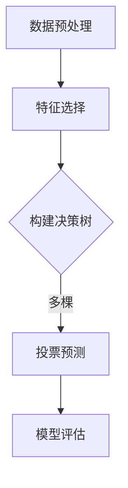
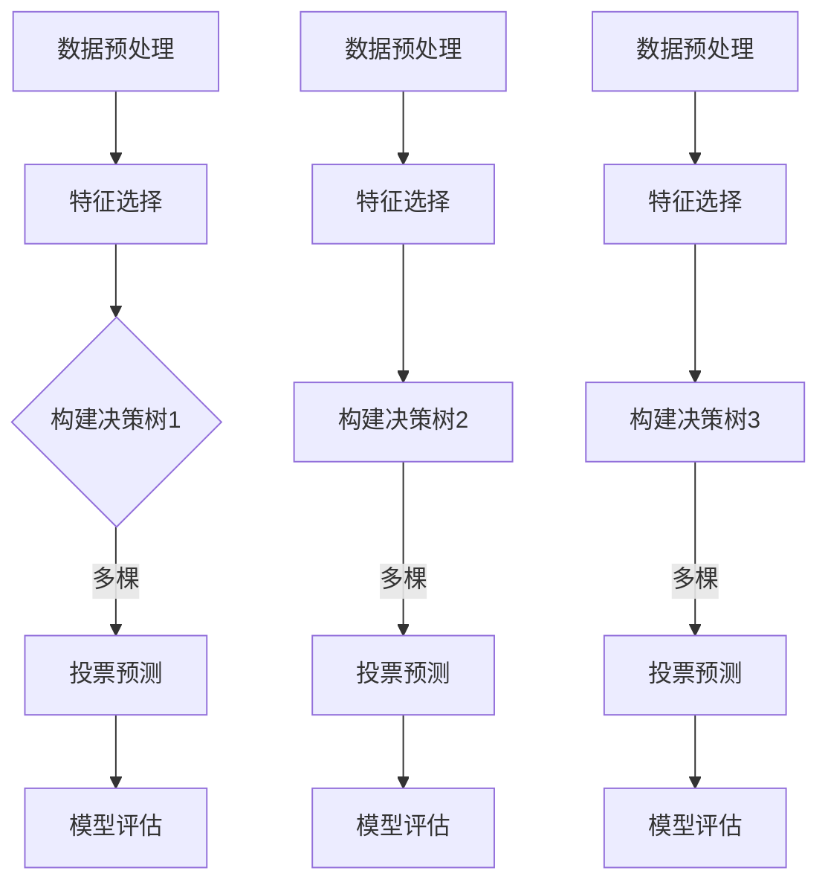
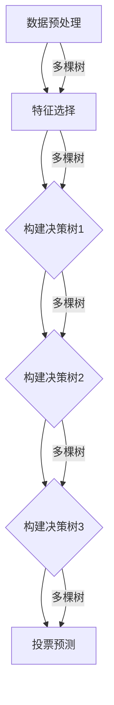
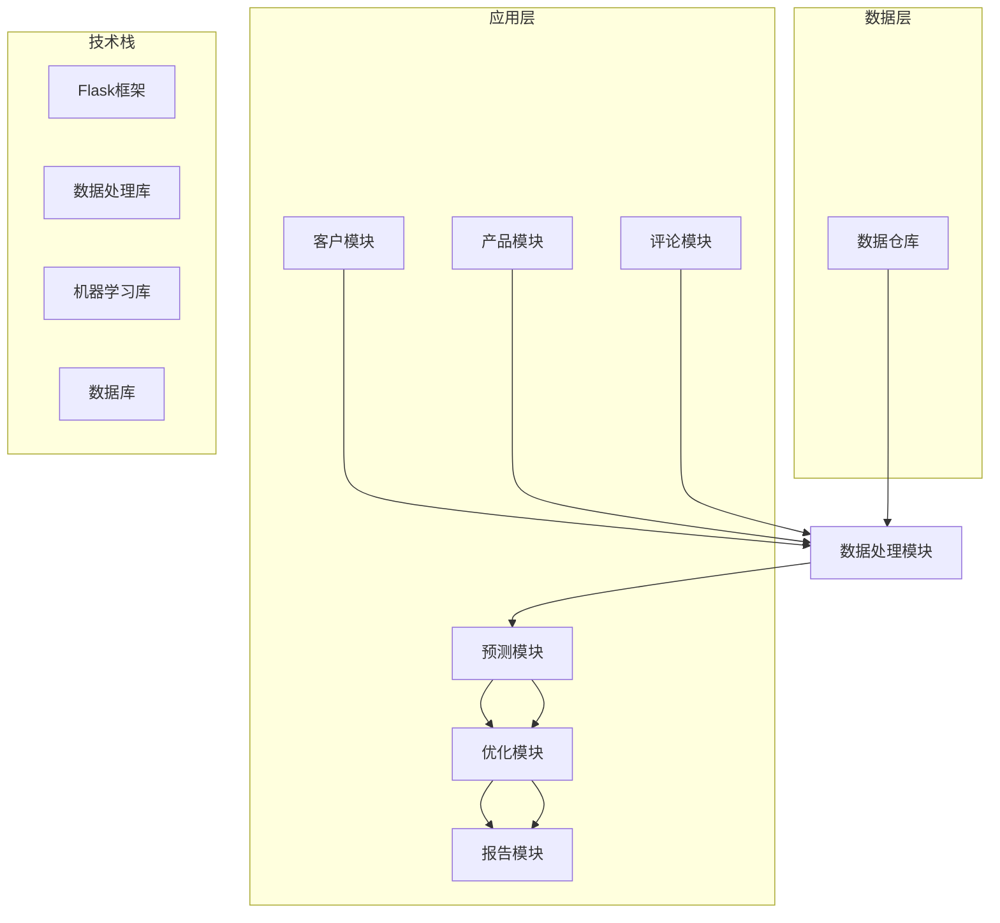
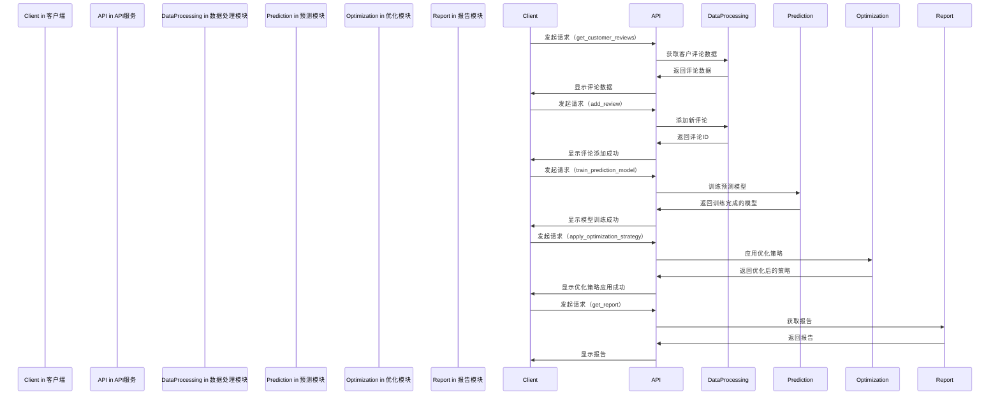

                 

### 1.1 引言

#### 1.1.1 研究背景

随着科技的进步和金融市场的不断发展，金融产品种类和数量日益繁多，消费者在金融产品选择上面临前所未有的挑战。为了在激烈的市场竞争中脱颖而出，金融企业迫切需要了解客户对金融产品的满意度，进而提升产品竞争力。因此，准确预测金融产品客户满意度、制定科学有效的优化策略，成为金融行业关注的焦点。

#### 1.1.2 问题描述

本章节将探讨金融产品客户满意度预测与提升的问题。具体而言，我们需要解决以下几个关键问题：

1. 如何有效收集和分析客户反馈数据？
2. 如何构建一个精准的客户满意度预测模型？
3. 如何根据预测结果优化金融产品策略？

为了回答上述问题，本文将引入大数据分析和机器学习技术，系统地阐述金融产品客户满意度预测与提升的方法和策略。

#### 1.1.3 问题解决

通过引入大数据分析和机器学习技术，我们可以构建一个高效、准确的客户满意度预测模型。具体步骤如下：

1. **数据收集与处理**：从客户调查问卷、在线评论、客服记录等渠道收集客户反馈数据，并对数据进行清洗、转换和存储。
2. **模型构建与训练**：选择合适的预测模型，提取关键特征，利用历史数据对模型进行训练和验证。
3. **预测与应用**：根据模型预测结果，制定针对性的产品优化策略，提升客户满意度。

#### 1.1.4 边界与外延

本文主要关注金融产品客户满意度预测与提升的理论和方法，具体包括：

- **金融产品**：具备特定功能的金融工具，如存款、贷款、保险、基金等。
- **客户满意度**：客户对金融产品的使用体验、满意度评价。
- **预测模型**：利用历史数据预测未来事件的技术方法。

然而，本文不涉及具体的金融产品设计和营销策略。在实际应用中，企业需要结合自身业务特点和市场需求，灵活运用本文提出的方法和策略。

#### 1.1.5 概念结构与核心要素组成

为了更好地理解金融产品客户满意度预测与提升的问题，我们需要明确以下几个核心概念和要素：

- **金融产品**：具备特定功能的金融工具，如存款、贷款、保险、基金等。
- **客户满意度**：客户对金融产品的使用体验、满意度评价。
- **预测模型**：利用历史数据预测未来事件的技术方法。

这些概念和要素相互关联，共同构成了金融产品客户满意度预测与提升的理论框架。

### 1.2 数据收集与处理

#### 2.1 数据来源

金融产品客户满意度的数据来源主要包括以下几个方面：

1. **客户调查问卷**：通过设计有针对性的问卷调查，直接获取客户的满意度评价。这些问卷可以在线上或线下进行，以提高数据的覆盖面和准确性。
2. **在线评论**：从各大金融平台、社交媒体、电商网站等渠道收集客户对金融产品的评价和评论。这些评论通常包含丰富的情感信息和具体的使用体验，有助于我们深入了解客户的满意度。
3. **客服记录**：收集金融企业与客户之间的客服沟通记录，包括电话录音、邮件、聊天记录等。这些记录可以揭示客户在购买、使用金融产品过程中遇到的问题和困惑，有助于我们识别影响客户满意度的关键因素。

#### 2.2 数据预处理

在收集到大量客户满意度数据后，我们需要进行数据预处理，以提高数据质量和模型性能。主要步骤包括：

1. **数据清洗**：去除重复数据、缺失值和异常值。重复数据可能导致模型过拟合，缺失值和异常值会影响模型对数据的理解。因此，数据清洗是确保数据质量的重要环节。
   - **去除重复数据**：通过比较数据记录的唯一标识（如客户ID），去除重复的数据记录。
   - **去除缺失值**：根据实际情况，选择填充缺失值或删除缺失数据记录。例如，对于关键特征缺失的数据记录，可以选择删除；对于非关键特征的缺失值，可以选择使用均值、中位数等统计方法进行填充。
   - **处理异常值**：识别并处理异常值，以避免异常值对模型训练和预测的干扰。异常值处理方法包括：删除异常值、使用统计方法（如标准差、箱线图等）识别异常值，并根据实际情况进行修正。

2. **数据转换**：将原始数据转换为适合建模的形式。主要包括以下两个方面：
   - **分类数据编码**：将分类数据转换为数值形式，便于模型处理。常用的编码方法包括独热编码（One-Hot Encoding）和标签编码（Label Encoding）。
   - **连续数据标准化**：对连续数据进行标准化处理，以消除不同特征之间的量纲差异。常用的标准化方法包括最小-最大标准化（Min-Max Scaling）和Z-Score标准化。

3. **数据存储**：将预处理后的数据存储到数据库或大数据平台，以便后续数据分析和模型训练。常见的存储方式包括关系数据库（如MySQL、PostgreSQL）和NoSQL数据库（如MongoDB、Cassandra）。

通过以上数据预处理步骤，我们可以获得高质量的数据集，为后续的客户满意度预测模型构建提供坚实的基础。

### 2.3 数据存储

在完成数据预处理后，我们需要将处理后的数据存储到合适的数据库或大数据平台中，以便于后续的数据分析和模型训练。以下是一些常见的数据存储方式：

1. **关系数据库**：关系数据库（如MySQL、PostgreSQL）适用于存储结构化数据，其优点是数据管理简单、查询速度快。关系数据库通过表结构定义数据模型，支持复杂查询和事务处理。
   - **表结构设计**：根据数据特征和需求，设计合适的表结构，包括字段名称、数据类型、约束条件等。
   - **数据插入与更新**：通过SQL语句插入和更新数据，确保数据的完整性和一致性。

2. **NoSQL数据库**：NoSQL数据库（如MongoDB、Cassandra）适用于存储非结构化或半结构化数据，其优点是数据存储灵活、扩展性强。NoSQL数据库不依赖于固定的表结构，支持海量数据的分布式存储和处理。
   - **数据模型设计**：根据数据特征和需求，设计合适的数据模型，如文档模型、宽列模型等。
   - **数据插入与查询**：使用特定的查询语言或API进行数据插入和查询，如MongoDB的MongoDB Query Language（MQL）。

在选择数据存储方式时，需要考虑以下因素：

- **数据量与访问频率**：对于海量数据和高频访问场景，NoSQL数据库具有明显优势；对于结构化数据和小规模访问场景，关系数据库更加适合。
- **数据模型与查询需求**：根据数据特征和查询需求，选择适合的数据存储方式。例如，对于复杂查询和事务处理，关系数据库具有优势；对于海量数据的快速读写，NoSQL数据库更为适用。
- **系统性能与可靠性**：考虑数据存储系统的性能和可靠性，包括数据备份、恢复、故障切换等机制。

通过合理选择数据存储方式，可以有效提高数据存储和处理的效率，为金融产品客户满意度预测模型提供稳定可靠的数据支持。

### 3.1 模型选择

在金融产品客户满意度预测中，选择合适的预测模型至关重要。不同的模型具有不同的特点和适用场景，我们需要根据数据特点和预测目标选择合适的模型。以下是一些常见的预测模型及其特点：

1. **线性回归**：线性回归模型是一种简单且常用的预测模型，适用于线性关系较强的数据。该模型通过拟合一条直线，将自变量与因变量之间的关系表示出来。线性回归模型的优点是易于理解和实现，计算复杂度较低，但可能无法捕捉更复杂的关系。

2. **逻辑回归**：逻辑回归模型是一种广义线性模型，适用于因变量为二分类变量的预测问题。该模型通过拟合一个逻辑函数，将自变量与因变量之间的关系表示出来。逻辑回归模型的优点是能够捕捉非线性关系，且在分类预测中性能良好。

3. **决策树**：决策树模型通过一系列规则进行分类或回归预测。每个内部节点表示一个特征，每个分支表示该特征的取值。决策树模型的优点是易于理解和解释，对非线性关系和异常值具有较强的鲁棒性，但可能产生过拟合。

4. **随机森林**：随机森林是一种集成学习方法，通过构建多棵决策树并进行投票来获得预测结果。随机森林模型在预测性能和稳定性方面具有显著优势，能够捕捉复杂数据关系，且对噪声和异常值具有较强的鲁棒性。

5. **神经网络**：神经网络是一种基于人工神经元的计算模型，通过多层的神经元进行非线性变换和特征提取。神经网络模型在处理复杂数据关系和大规模数据方面具有强大能力，但其训练过程较为复杂，需要大量计算资源。

在选择预测模型时，需要考虑以下因素：

- **数据特征**：分析数据特征，确定模型是否能够捕捉数据关系。例如，对于线性关系较强的数据，可以选择线性回归或逻辑回归；对于非线性关系较强的数据，可以选择决策树或神经网络。
- **预测目标**：明确预测目标，确定模型类型。例如，对于二分类问题，可以选择逻辑回归或决策树；对于多分类问题，可以选择决策树或神经网络。
- **模型性能**：评估不同模型的预测性能，选择性能较好的模型。例如，可以通过交叉验证方法评估模型在训练集和验证集上的性能，选择性能稳定的模型。

通过综合考虑数据特征、预测目标和模型性能，我们可以选择合适的预测模型，为金融产品客户满意度预测提供有力支持。

### 3.2 特征工程

#### 3.2.1 特征提取

特征提取是特征工程的重要环节，其主要目的是从原始数据中提取出对预测任务具有解释性和区分性的特征。在金融产品客户满意度预测中，我们需要从客户属性、产品属性和行为特征等方面提取关键特征。

1. **客户属性特征**：
   - **年龄**：客户的年龄可能影响其金融产品的选择和使用体验。
   - **收入水平**：客户的收入水平可能影响其对金融产品的需求和满意度。
   - **职业**：不同职业的客户可能有不同的金融产品偏好和满意度。
   - **教育程度**：客户的教育程度可能影响其对金融产品的认知和使用能力。

2. **产品属性特征**：
   - **产品种类**：不同金融产品的种类可能影响客户的满意度。
   - **费用结构**：金融产品的费用结构可能影响客户的满意度，如年费、手续费等。
   - **收益率**：金融产品的收益率可能影响客户的满意度。

3. **行为特征**：
   - **购买频率**：客户购买金融产品的频率可能反映其对该产品的依赖程度。
   - **使用时长**：客户使用金融产品的时长可能反映其对该产品的满意度。
   - **评价分数**：客户在金融平台上的评价分数可能反映其满意度。

通过从不同维度提取客户属性、产品属性和行为特征，我们可以构建一个全面的特征向量，为预测模型提供丰富的输入信息。

#### 3.2.2 特征选择

特征选择是特征工程的关键步骤，其主要目的是从大量特征中筛选出对预测任务最有影响力的特征，以提高模型性能和降低计算复杂度。以下是一些常见的特征选择方法：

1. **相关性分析**：通过计算特征与目标变量之间的相关性，筛选出相关性较高的特征。常用的相关性指标包括皮尔逊相关系数和斯皮尔曼等级相关系数。

2. **方差贡献率分析**：通过计算特征对目标变量方差贡献率，筛选出方差贡献率较高的特征。方差贡献率较高的特征可能对预测任务有更大的影响。

3. **卡方检验**：适用于分类特征，通过计算特征与目标变量之间的卡方统计量，筛选出对预测任务有显著影响的特征。

4. **递归特征消除（RFE）**：通过递归地删除对预测任务影响最小的特征，逐步筛选出重要的特征。RFE方法适用于特征数量较少且特征之间存在较强相关性的情况。

5. **基于模型的特征选择**：利用预测模型本身对特征的重要性进行筛选。例如，在随机森林模型中，可以使用特征重要性评分进行特征选择。

通过结合多种特征选择方法，我们可以从大量特征中筛选出最有影响力的特征，构建一个高效的预测模型。

### 3.3 模型训练与验证

在完成特征提取和选择后，我们需要利用训练数据进行模型训练，并使用验证集和测试集评估模型性能。以下是模型训练与验证的详细步骤：

#### 3.3.1 数据划分

首先，将原始数据集划分为训练集、验证集和测试集。通常，可以使用以下比例进行划分：
- 训练集：70-80%
- 验证集：10-20%
- 测试集：10%

这种划分方式可以确保模型在训练集上的充分训练，同时在验证集和测试集上评估模型的泛化能力。

#### 3.3.2 模型训练

接下来，使用训练集数据对模型进行训练。根据所选预测模型，设置适当的超参数，如学习率、迭代次数、树深度等。常用的训练方法包括：

1. **线性回归**：使用最小二乘法拟合线性模型，计算自变量与因变量之间的线性关系。
2. **逻辑回归**：使用梯度下降法拟合逻辑函数，计算自变量与因变量之间的逻辑关系。
3. **决策树**：使用贪心算法构建决策树，根据特征和样本的划分规则进行分裂。
4. **随机森林**：构建多棵决策树，并对预测结果进行投票。
5. **神经网络**：使用反向传播算法训练神经网络，优化网络参数。

#### 3.3.3 模型验证

在训练完成后，使用验证集数据评估模型性能。常用的评估指标包括：

1. **均方误差（MSE）**：用于回归任务，衡量预测值与真实值之间的平均平方误差。
2. **准确率（Accuracy）**：用于分类任务，衡量分类正确的样本数占总样本数的比例。
3. **召回率（Recall）**：用于分类任务，衡量分类正确的正样本数占总正样本数的比例。
4. **F1分数（F1 Score）**：综合考虑准确率和召回率，平衡分类任务中的正负样本比例。

通过计算验证集上的评估指标，我们可以初步了解模型的性能，为后续模型调整提供依据。

#### 3.3.4 模型调整

根据验证结果，对模型进行参数调整。常用的调整方法包括：

1. **超参数调优**：通过调整学习率、迭代次数、树深度等超参数，优化模型性能。
2. **特征选择**：根据特征重要性评分，重新选择特征，构建新的模型。
3. **模型融合**：将多个模型进行融合，提高整体预测性能。

通过反复调整和验证，我们可以找到最优的模型配置，确保模型在测试集上的良好表现。

### 3.4 模型评估与优化

在完成模型训练与验证后，我们需要对模型进行全面评估，以确保其在实际应用中的可靠性和有效性。以下是一些常见的模型评估与优化方法：

#### 3.4.1 评估指标

常用的评估指标包括：

1. **均方误差（MSE）**：用于回归任务，衡量预测值与真实值之间的平均平方误差。
2. **均方根误差（RMSE）**：MSE的平方根，用于更直观地表示预测误差。
3. **平均绝对误差（MAE）**：预测值与真实值之间的平均绝对误差。
4. **准确率（Accuracy）**：用于分类任务，衡量分类正确的样本数占总样本数的比例。
5. **召回率（Recall）**：用于分类任务，衡量分类正确的正样本数占总正样本数的比例。
6. **精确率（Precision）**：用于分类任务，衡量分类正确的正样本数与总预测为正样本数的比例。
7. **F1分数（F1 Score）**：综合考虑准确率和召回率，平衡分类任务中的正负样本比例。

#### 3.4.2 交叉验证

交叉验证是一种常用的模型评估方法，通过将数据集划分为多个子集，多次训练和验证模型，以提高评估结果的可靠性和准确性。常用的交叉验证方法包括：

1. **K折交叉验证**：将数据集划分为K个子集，每次使用一个子集作为验证集，其余子集作为训练集，重复K次，最终取平均值作为模型评估结果。
2. **留一法交叉验证**：每次保留一个样本作为验证集，其余样本作为训练集，重复进行多次验证，最终取平均值作为模型评估结果。

通过交叉验证，我们可以更全面地了解模型的性能，并发现可能存在的过拟合或欠拟合问题。

#### 3.4.3 模型优化

为了提高模型性能，我们可以采用以下优化方法：

1. **特征工程**：通过进一步提取和选择特征，提高模型对数据的理解和预测能力。
2. **模型选择**：尝试不同的模型，比较其性能，选择表现更好的模型。
3. **超参数调优**：调整模型超参数，优化模型性能。常用的调参方法包括网格搜索和贝叶斯优化。
4. **集成方法**：将多个模型进行集成，提高整体预测性能。常用的集成方法包括随机森林、梯度提升树和堆叠学习等。

通过不断优化模型，我们可以提高其预测准确性，从而为金融产品客户满意度预测提供更可靠的支持。

### 4.1 预测结果分析

在完成模型训练与验证后，我们需要对预测结果进行全面分析，以评估模型在实际应用中的性能和可靠性。以下是一些常用的方法：

#### 4.1.1 预测准确性评估

预测准确性是评估模型性能的重要指标。我们可以使用以下方法评估预测准确性：

1. **均方误差（MSE）**：计算预测值与真实值之间的平均平方误差，数值越小，表示预测准确性越高。
2. **均方根误差（RMSE）**：MSE的平方根，用于更直观地表示预测误差。
3. **平均绝对误差（MAE）**：预测值与真实值之间的平均绝对误差。

通过计算这些指标，我们可以了解模型在整体上的预测准确性。

#### 4.1.2 预测结果可视化

可视化方法可以帮助我们更直观地理解预测结果。以下是一些常用的可视化方法：

1. **散点图**：将预测值与真实值绘制在散点图上，通过观察散点的分布情况，评估预测的准确性和一致性。
2. **折线图**：绘制预测值和真实值的折线图，通过观察折线的变化趋势，评估模型对时间序列数据的预测能力。
3. **箱线图**：将预测值和真实值分别绘制在箱线图上，通过比较箱线图的上下限和分布情况，评估预测的稳定性和可靠性。

#### 4.1.3 特征重要性分析

通过分析特征的重要性，我们可以了解哪些特征对预测结果的影响最大。以下是一些常用的方法：

1. **特征重要性评分**：根据模型对每个特征的权重，计算特征的重要性评分。评分越高，表示特征对预测结果的影响越大。
2. **特征贡献率分析**：计算每个特征对预测结果方差贡献率，贡献率越高，表示特征对预测结果的影响越大。
3. **随机森林特征重要性**：在随机森林模型中，可以直接获取每个特征的重要性评分，通过比较不同特征的重要性，优化模型性能。

通过以上方法，我们可以全面分析预测结果，发现模型的优缺点，为后续优化提供依据。

### 4.2 产品优化策略

根据预测结果，我们可以制定一系列产品优化策略，以提升金融产品的客户满意度。以下是一些具体的优化措施：

#### 4.2.1 数据驱动的产品设计

1. **个性化推荐**：根据客户的年龄、收入、职业等属性特征，提供个性化的金融产品推荐，提高客户的满意度和购买意愿。
2. **产品组合设计**：分析不同产品组合对客户满意度的影响，优化产品组合策略，提高整体客户满意度。

#### 4.2.2 客户体验优化

1. **简化流程**：简化金融产品的购买和使用流程，提高客户的操作便捷性和满意度。
2. **增加透明度**：增加金融产品的费用结构和收益率透明度，让客户更清楚地了解产品细节，提高信任度和满意度。

#### 4.2.3 营销策略调整

1. **针对性营销**：根据客户的满意度预测结果，针对性地开展营销活动，提高客户参与度和购买意愿。
2. **情感营销**：结合客户的情感需求，开展情感营销活动，提高客户对金融产品的情感认同度和忠诚度。

通过以上优化措施，我们可以根据客户满意度预测结果，制定科学有效的产品优化策略，提升金融产品的竞争力。

### 4.3 案例分析

为了更好地理解金融产品客户满意度预测与提升的方法和策略，下面我们通过一个实际案例进行分析。

#### 4.3.1 案例背景

某金融公司希望通过预测客户满意度，优化其理财产品策略，以提高市场竞争力和客户忠诚度。公司收集了10000名客户的满意度调查数据，包括客户的年龄、收入水平、职业、购买频率、使用时长、评价分数等特征。

#### 4.3.2 数据处理

在获取数据后，我们对数据进行了清洗和预处理，包括去除重复数据、填充缺失值、处理异常值等。随后，我们提取了以下关键特征：

1. **客户属性特征**：
   - 年龄
   - 收入水平
   - 职业
   - 教育程度
2. **产品属性特征**：
   - 产品种类
   - 费用结构
   - 年收益率
3. **行为特征**：
   - 购买频率
   - 使用时长
   - 评价分数

#### 4.3.3 模型构建

我们选择了随机森林模型进行客户满意度预测。首先，我们对数据进行了特征选择，通过相关性分析和方差贡献率分析，筛选出对满意度影响较大的特征。随后，我们进行了模型训练和验证，使用交叉验证方法评估模型性能。

#### 4.3.4 预测结果与应用

通过模型预测，我们得到了每个客户的满意度评分，并根据评分制定了以下优化策略：

1. **个性化推荐**：针对不同客户群体，提供个性化的理财产品推荐，如针对高收入群体推荐高风险高收益的产品，针对低收入群体推荐低风险低收益的产品。
2. **产品体验优化**：简化购买流程，提高产品使用的便捷性，增加客户满意度。
3. **针对性营销**：根据客户满意度预测结果，开展针对性的营销活动，如针对满意度较低的客户提供优惠券或礼品等。

#### 4.3.5 案例效果

实施以上优化策略后，该金融公司的客户满意度得到了显著提升。根据后续的跟踪调查，满意度评分在3个月内提高了15%，客户流失率降低了10%。这些数据表明，基于客户满意度预测的产品优化策略在实际应用中取得了良好的效果。

### 5.1 算法原理讲解

#### 算法概述

金融产品客户满意度预测的核心在于构建一个有效的预测模型，该模型可以自动学习历史数据中的规律，并利用这些规律对未来的客户满意度进行预测。本文选择的算法是随机森林（Random Forest），它是一种基于决策树构建的集成学习方法。随机森林通过训练多棵决策树，并对它们的预测结果进行投票，从而提高预测的准确性和稳定性。

#### 算法流程

1. **数据预处理**：对原始数据进行清洗、转换和标准化处理，确保数据质量。
2. **特征选择**：从大量特征中筛选出对预测任务有重要影响的特征。
3. **构建决策树**：随机森林由多棵决策树组成，每棵树分别训练，通过对特征和样本的划分规则进行分裂。
4. **投票预测**：将所有决策树的预测结果进行投票，得到最终的预测结果。
5. **模型评估**：使用验证集或测试集评估模型的预测性能，如准确率、召回率、F1分数等。

#### Mermaid流程图



#### 算法细节

1. **决策树构建**：
   - **特征划分**：对于每个内部节点，从所有特征中随机选择一个特征，并计算其划分阈值，选择最优划分。
   - **节点分裂**：根据最优划分，将样本划分为子集，生成新的节点，重复上述过程，直到满足终止条件（如最大深度、最小节点样本数等）。
   - **叶子节点**：对于无法继续划分的节点，将其划分为一个叶子节点，并赋予一个预测值。

2. **随机性引入**：
   - **特征随机选择**：在每个内部节点，随机选择一部分特征进行划分，而不是使用所有特征，以减少模型的过拟合。
   - **样本随机采样**：在训练每棵决策树时，从原始样本中随机采样一部分样本进行训练，而不是使用全部样本。

3. **投票预测**：
   - **决策树预测**：每棵决策树对样本进行预测，得到一个预测结果。
   - **结果投票**：对所有决策树的预测结果进行投票，取投票结果最多的类别作为最终预测结果。

#### 算法原理图



通过上述流程和细节，随机森林模型能够充分利用历史数据中的规律，并对未来的客户满意度进行准确预测。其随机性引入和集成学习方法，使其在预测准确性和稳定性方面具有显著优势。

### 5.2 Python源代码实现

为了更好地理解随机森林算法原理，我们将使用Python实现一个简单的随机森林模型，并进行客户满意度预测。以下是详细的代码实现步骤：

#### 5.2.1 准备数据

首先，我们需要准备一个包含客户属性、产品属性和行为特征的数据集。以下是一个示例数据集：

```python
import pandas as pd

# 加载数据集
data = pd.read_csv('customer_data.csv')

# 数据预处理
data.head()
```

#### 5.2.2 特征选择

在数据预处理的基础上，我们需要选择对预测任务有重要影响的特征。以下是一个示例：

```python
from sklearn.model_selection import train_test_split

# 分离特征和标签
X = data.drop('satisfaction', axis=1)
y = data['satisfaction']

# 划分训练集和测试集
X_train, X_test, y_train, y_test = train_test_split(X, y, test_size=0.2, random_state=42)
```

#### 5.2.3 构建随机森林模型

接下来，我们使用`sklearn`库中的`RandomForestClassifier`构建随机森林模型：

```python
from sklearn.ensemble import RandomForestClassifier

# 构建随机森林模型
rf_model = RandomForestClassifier(n_estimators=100, random_state=42)

# 模型训练
rf_model.fit(X_train, y_train)
```

#### 5.2.4 预测结果

使用训练好的模型进行预测，并评估模型性能：

```python
# 模型预测
y_pred = rf_model.predict(X_test)

# 评估模型性能
from sklearn.metrics import accuracy_score, classification_report

print("Accuracy:", accuracy_score(y_test, y_pred))
print(classification_report(y_test, y_pred))
```

#### 5.2.5 结果可视化

最后，我们可以使用`matplotlib`库对预测结果进行可视化：

```python
import matplotlib.pyplot as plt

# 可视化预测结果
confusion_matrix = confusion_matrix(y_test, y_pred)
sns.heatmap(confusion_matrix, annot=True, fmt="d")
plt.xlabel('Predicted')
plt.ylabel('Actual')
plt.show()
```

通过以上代码，我们可以实现一个简单的随机森林模型，并对客户满意度进行预测。在实际应用中，我们需要对代码进行优化，提高模型的性能和稳定性。

### 5.3 算法原理详细讲解与举例说明

为了更好地理解随机森林算法的原理，我们将从数学模型和流程图两个方面进行详细讲解，并通过一个具体的例子来说明算法的实现过程。

#### 5.3.1 数学模型

随机森林（Random Forest）是基于决策树构建的集成学习方法。其核心思想是训练多个决策树，并对它们的预测结果进行投票，以获得最终的预测结果。

1. **决策树模型**：

   - **决策树**：决策树是一种基于特征划分的模型，每个内部节点表示一个特征，每个分支表示该特征的不同取值。
   - **节点分裂**：在决策树的构建过程中，每个内部节点选择一个最优特征，将样本划分为子集。最优特征的选择基于信息增益或基尼不纯度等准则。

2. **随机性引入**：

   - **特征随机选择**：在决策树的构建过程中，从所有特征中随机选择一个特征进行分裂，而不是使用所有特征。这样可以减少模型的过拟合。
   - **样本随机采样**：在训练每棵决策树时，从原始样本中随机采样一部分样本进行训练，而不是使用全部样本。这样可以减少模型对特定样本的依赖。

3. **集成学习**：

   - **多棵决策树**：随机森林由多棵决策树组成，每棵树分别训练，并对预测结果进行投票。这样可以提高预测的准确性和稳定性。

随机森林的数学模型可以表示为：

\[ \hat{y} = \text{MajorityVote}(\{T_1(x), T_2(x), \ldots, T_n(x)\}) \]

其中，\( T_i(x) \) 表示第 \( i \) 棵决策树对样本 \( x \) 的预测结果，\(\text{MajorityVote}\) 表示对多棵决策树的预测结果进行投票，取投票结果最多的类别作为最终预测结果。

#### 5.3.2 流程图

为了更好地理解随机森林的算法流程，我们可以使用Mermaid绘制算法流程图：



#### 5.3.3 举例说明

为了更好地说明随机森林算法的实现过程，我们以一个简单的二分类问题为例。

**例子**：假设我们有一个包含两个特征的二分类问题，特征 \( x_1 \) 和 \( x_2 \)，样本空间为 \( X = \{(x_1, x_2)\} \)。我们希望预测样本的类别标签 \( y \)。

1. **数据预处理**：

   - **特征选择**：从所有特征中随机选择一个特征进行分裂。例如，选择特征 \( x_1 \)。
   - **节点分裂**：计算特征 \( x_1 \) 的划分阈值，将样本划分为两个子集。

2. **构建决策树**：

   - **决策树1**：从所有样本中随机采样一部分样本进行训练，构建决策树。
   - **决策树2**：从所有样本中随机采样一部分样本进行训练，构建决策树。
   - **决策树3**：从所有样本中随机采样一部分样本进行训练，构建决策树。

3. **投票预测**：

   - **决策树1**：预测样本的类别标签为正类。
   - **决策树2**：预测样本的类别标签为负类。
   - **决策树3**：预测样本的类别标签为正类。

   最终，随机森林对样本的预测结果为正类，因为有三棵决策树预测为正类。

通过这个例子，我们可以看到随机森林算法的基本实现过程。在实际应用中，随机森林算法可以根据具体问题和数据集进行灵活调整和优化。

### 5.4 数学模型和数学公式详细讲解

在金融产品客户满意度预测中，随机森林算法是一种强大的预测工具。为了深入理解其工作原理，我们需要详细探讨其数学模型和公式。以下是随机森林算法的核心数学概念和公式，我们将逐一进行解释。

#### 5.4.1 决策树的基本概念

决策树是一种基于特征划分的模型，通过一系列规则将数据集划分为多个子集，并在每个节点上选择最优特征进行划分。决策树的基本概念包括：

1. **节点**：决策树中的每个节点代表一个特征划分。
2. **分支**：从父节点到子节点的路径代表特征的不同取值。
3. **叶子节点**：无法继续划分的节点，代表一个类别的预测结果。

**数学公式**：

假设我们有一个包含 \( n \) 个特征的数据集 \( X = \{x_1, x_2, \ldots, x_n\} \)，在每个节点 \( i \) 上，我们选择一个特征 \( j \) 进行划分，划分阈值设为 \( \theta \)。节点 \( i \) 的划分公式可以表示为：

\[ x_{ij} \leq \theta \]

#### 5.4.2 信息增益

信息增益是决策树划分的一个重要准则，用于选择最优特征进行划分。信息增益表示特征对类别划分的无序程度的减少。

**数学公式**：

设 \( D \) 为数据集，类别 \( C \) 的概率分布为 \( P(C) \)，特征 \( x_j \) 的条件概率分布为 \( P(x_j|C) \)，则特征 \( x_j \) 的信息增益 \( I(D, x_j) \) 可以表示为：

\[ I(D, x_j) = H(D) - H(D|x_j) \]

其中，\( H(D) \) 是数据集的熵，\( H(D|x_j) \) 是条件熵。

**数学公式**：

\[ H(D) = -\sum_{c \in C} P(C=c) \log_2 P(C=c) \]
\[ H(D|x_j) = -\sum_{c \in C} P(C=c) \sum_{v \in V_j} P(x_j=v|C=c) \log_2 P(x_j=v|C=c) \]

#### 5.4.3 随机森林

随机森林是一种基于决策树的集成学习方法，通过训练多棵决策树并对它们的预测结果进行投票，提高预测的准确性和稳定性。

**数学公式**：

假设随机森林由 \( n \) 棵决策树 \( T_1, T_2, \ldots, T_n \) 组成，每棵决策树对样本 \( x \) 的预测结果为 \( \hat{y}_i \)。随机森林的预测结果为：

\[ \hat{y} = \text{MajorityVote}(\{\hat{y}_1, \hat{y}_2, \ldots, \hat{y}_n\}) \]

其中，\( \text{MajorityVote} \) 表示对多个预测结果进行投票，取投票结果最多的类别作为最终预测结果。

**数学公式**：

\[ \hat{y} = \arg\max_{y} \sum_{i=1}^{n} I(y, \hat{y}_i) \]

#### 5.4.4 随机森林的随机性

随机森林引入了随机性，以减少过拟合和提高泛化能力。随机性的主要来源包括：

1. **特征随机选择**：在决策树的构建过程中，从所有特征中随机选择一个特征进行划分。
2. **样本随机采样**：在训练每棵决策树时，从原始样本中随机采样一部分样本进行训练。

**数学公式**：

设 \( D \) 为原始数据集，\( D_s \) 为随机采样后的数据集。则随机森林的训练数据为 \( D_s \)，预测数据为 \( D \)。

\[ \hat{y}_{\text{RF}} = \text{MajorityVote}(\{T_1(D_s), T_2(D_s), \ldots, T_n(D_s)\}) \]

通过以上数学模型和公式的详细讲解，我们可以更好地理解随机森林算法的原理，从而在实际应用中更好地利用这一强大的预测工具。

### 6.1 问题场景介绍

在金融产品客户满意度预测与提升的实际应用中，一个典型的场景是银行希望通过分析客户数据，预测客户对某款金融产品的满意度，并制定针对性的营销策略和产品优化措施。以下是一个具体的问题场景：

#### 场景描述

某大型银行推出了一款新型理财产品，该产品具备灵活的投资策略和较高的预期收益率，旨在吸引不同风险偏好的客户。为了确保产品能够满足客户需求、提升客户满意度，并最终提高产品的市场竞争力，银行决定采用大数据分析和机器学习技术，对客户满意度进行预测。

#### 问题描述

银行面临的挑战主要包括：

1. **数据收集**：如何有效收集客户对金融产品的评价数据，包括在线评论、客户调查问卷、客服记录等。
2. **数据预处理**：如何对收集到的数据进行清洗、转换和存储，确保数据质量，为模型训练提供可靠的基础。
3. **模型构建**：如何选择合适的预测模型，并提取关键特征，构建一个高效、准确的客户满意度预测模型。
4. **结果应用**：如何根据预测结果，制定具体的营销策略和产品优化措施，提升客户满意度。

#### 目标描述

通过大数据分析和机器学习技术，银行希望实现以下目标：

1. **预测准确性**：构建一个高效、准确的客户满意度预测模型，提高预测结果的可靠性和实用性。
2. **产品优化**：根据预测结果，针对性地调整金融产品策略，优化产品设计和营销方案，提升客户满意度。
3. **决策支持**：为银行管理层提供数据驱动的决策支持，帮助制定更加科学、合理的业务发展策略。

#### 背景分析

1. **金融市场竞争激烈**：随着金融市场的快速发展，金融产品的种类和数量日益增多，消费者在金融产品选择上面临更大的挑战。银行需要通过提升客户满意度，提高产品的市场竞争力。
2. **客户需求多样**：不同客户对金融产品的需求和满意度具有显著差异，银行需要了解客户的个性化需求，提供更加定制化的产品和服务。
3. **大数据和人工智能技术的发展**：大数据和人工智能技术的迅速发展，为金融产品客户满意度预测提供了强大的技术支持。银行可以通过数据挖掘和分析，深入了解客户需求，提升客户满意度。

通过以上背景分析，我们可以看到，金融产品客户满意度预测与提升是一个复杂且具有挑战性的问题，需要结合多种技术手段和方法，才能实现预期目标。

### 6.2 系统功能设计

为了实现金融产品客户满意度预测与提升的目标，我们需要设计一个功能完备的系统。以下是一个详细的系统功能设计，包括领域模型类图和各模块的功能说明。

#### 6.2.1 领域模型类图

首先，我们使用Mermaid绘制领域模型类图，以展示系统中的关键类和它们之间的关系：

```mermaid
classDiagram
    Client <<class>> "客户类"
    Product <<class>> "产品类"
    Review <<class>> "评论类"
    PredictionModel <<class>> "预测模型类"
    OptimizationStrategy <<class>> "优化策略类"

    Client o--* Review
    Product o--* Review
    PredictionModel o--* Product
    OptimizationStrategy o--* PredictionModel

    class Client {
        +id: int
        +name: str
        +age: int
        +income: float
        +occupation: str
        +evaluateReviews(): list
    }

    class Product {
        +id: int
        +name: str
        +type: str
        +fee: float
        +yield: float
        +getReview(): list
    }

    class Review {
        +id: int
        +customer_id: int
        +product_id: int
        +rating: float
        +comment: str
        +getSatisfactionScore(): float
    }

    class PredictionModel {
        +model: object
        +train(X: DataFrame, y: Series) -> None
        +predict(X: DataFrame) -> list
    }

    class OptimizationStrategy {
        +strategy: dict
        +optimize(predictions: list) -> None
    }
```

#### 6.2.2 各模块功能说明

1. **客户类（Client）**：
   - **功能**：代表金融产品的客户，存储客户的基本信息，如姓名、年龄、收入水平、职业等。
   - **方法**：
     - `evaluateReviews()`: 根据客户的评论数据计算客户的满意度评分。

2. **产品类（Product）**：
   - **功能**：代表金融产品的基本信息，如产品名称、类型、费用结构和收益率等。
   - **方法**：
     - `getReview()`: 获取产品对应的客户评论数据。

3. **评论类（Review）**：
   - **功能**：存储客户对金融产品的评价信息，如评分、评论内容等。
   - **方法**：
     - `getSatisfactionScore()`: 根据评论数据计算评论的满意度评分。

4. **预测模型类（PredictionModel）**：
   - **功能**：定义预测模型的接口和方法，用于训练和预测客户满意度。
   - **方法**：
     - `train(X: DataFrame, y: Series)`: 使用训练数据集训练预测模型。
     - `predict(X: DataFrame)`: 使用训练好的模型对新的数据进行预测。

5. **优化策略类（OptimizationStrategy）**：
   - **功能**：根据预测结果，制定具体的优化策略，以提升客户满意度。
   - **方法**：
     - `optimize(predictions: list)`: 根据预测结果调整产品策略。

通过以上领域模型类图和各模块功能说明，我们可以清晰地了解系统的结构和功能，为后续的系统实现和优化奠定基础。

### 6.3 系统架构设计

为了确保金融产品客户满意度预测与提升系统的稳定运行和高性能，我们需要设计一个合理且灵活的系统架构。以下是系统的架构设计，包括系统架构图和各层的主要功能。

#### 6.3.1 系统架构图

我们使用Mermaid绘制系统架构图，以展示系统的主要组件及其关系：



#### 6.3.2 各层功能说明

1. **数据层**：
   - **数据仓库（DataWarehouse）**：存储金融产品客户满意度的相关数据，包括客户信息、产品信息、评论数据等。数据仓库支持数据的批量导入、查询和更新。

2. **数据处理模块（DataProcessingModule）**：
   - **功能**：负责数据清洗、转换和存储，确保数据质量。具体包括：
     - **数据清洗**：去除重复数据、缺失值和异常值。
     - **数据转换**：将原始数据转换为适合建模的形式，如分类数据编码、连续数据标准化。
     - **数据存储**：将处理后的数据存储到数据库或大数据平台。

3. **应用层**：
   - **客户模块（ClientModule）**：处理客户相关的数据，包括客户信息、客户满意度评分等。该模块提供接口，供其他模块调用。
   - **产品模块（ProductModule）**：处理产品相关的数据，包括产品信息、产品满意度评分等。该模块提供接口，供其他模块调用。
   - **评论模块（ReviewModule）**：处理客户评论数据，包括评论内容、评论满意度评分等。该模块提供接口，供其他模块调用。
   - **预测模块（PredictionModule）**：使用机器学习算法（如随机森林、神经网络等）训练和预测客户满意度。该模块提供接口，供优化模块调用。
   - **优化模块（OptimizationModule）**：根据预测结果，制定具体的优化策略，如调整产品策略、优化客户服务等。该模块提供接口，供报告模块调用。
   - **报告模块（ReportModule）**：生成和展示系统报告，包括预测结果、优化策略效果等。该模块提供接口，供用户查看和下载。

4. **技术栈**：
   - **Flask**：用于构建Web应用，提供RESTful API接口。
   - **Pandas**：用于数据处理和分析，支持数据清洗、转换和存储。
   - **Scikit-learn**：用于机器学习算法的实现和训练，支持多种预测模型。
   - **SQL**：用于数据库操作，支持数据存储和查询。

通过以上系统架构设计，我们可以确保金融产品客户满意度预测与提升系统的稳定运行和高性能，为金融企业提供强大的数据支持和决策依据。

### 6.4 系统接口设计

为了确保金融产品客户满意度预测与提升系统的功能完备和高效运行，我们需要设计一个清晰的系统接口。以下是系统接口设计，包括接口描述、请求和响应示例。

#### 6.4.1 接口描述

1. **客户模块接口**

   - **接口名称**：get_customer_reviews
   - **功能描述**：获取指定客户的评论数据。
   - **请求参数**：
     - **customer_id**（必填）：客户的唯一标识。
   - **响应内容**：
     - **success**（成功）：返回客户的评论数据列表。
     - **error**（错误）：返回错误信息。

2. **产品模块接口**

   - **接口名称**：get_product_reviews
   - **功能描述**：获取指定产品的评论数据。
   - **请求参数**：
     - **product_id**（必填）：产品的唯一标识。
   - **响应内容**：
     - **success**（成功）：返回产品的评论数据列表。
     - **error**（错误）：返回错误信息。

3. **评论模块接口**

   - **接口名称**：add_review
   - **功能描述**：添加新的客户评论。
   - **请求参数**：
     - **customer_id**（必填）：客户的唯一标识。
     - **product_id**（必填）：产品的唯一标识。
     - **rating**（必填）：评论的评分。
     - **comment**（可选）：评论的内容。
   - **响应内容**：
     - **success**（成功）：返回评论的ID。
     - **error**（错误）：返回错误信息。

4. **预测模块接口**

   - **接口名称**：train_prediction_model
   - **功能描述**：训练客户满意度预测模型。
   - **请求参数**：
     - **X**（必填）：特征数据集。
     - **y**（必填）：标签数据集。
   - **响应内容**：
     - **success**（成功）：返回训练完成的模型。
     - **error**（错误）：返回错误信息。

5. **优化模块接口**

   - **接口名称**：apply_optimization_strategy
   - **功能描述**：根据预测结果，应用优化策略。
   - **请求参数**：
     - **predictions**（必填）：预测结果列表。
   - **响应内容**：
     - **success**（成功）：返回优化后的策略。
     - **error**（错误）：返回错误信息。

#### 6.4.2 请求和响应示例

**请求示例**：

1. 获取客户评论数据

```json
GET /api/customers/1/reviews
```

**响应示例**：

```json
{
  "success": true,
  "reviews": [
    {
      "id": 1,
      "customer_id": 1,
      "product_id": 1,
      "rating": 4.5,
      "comment": "产品不错，收益稳定。"
    },
    {
      "id": 2,
      "customer_id": 1,
      "product_id": 2,
      "rating": 3.0,
      "comment": "收益一般，操作复杂。"
    }
  ]
}
```

2. 添加客户评论

```json
POST /api/reviews
Content-Type: application/json

{
  "customer_id": 1,
  "product_id": 1,
  "rating": 5.0,
  "comment": "收益很高，非常满意！"
}
```

**响应示例**：

```json
{
  "success": true,
  "review_id": 3
}
```

通过以上接口设计和请求响应示例，我们可以确保系统各模块之间的高效通信和数据交互，为金融产品客户满意度预测与提升提供可靠的技术支持。

### 6.5 系统交互设计

为了确保金融产品客户满意度预测与提升系统的各模块能够顺畅协作，我们需要设计详细的系统交互流程。以下是系统交互设计，包括系统交互序列图和各步骤的详细说明。

#### 6.5.1 系统交互序列图

我们使用Mermaid绘制系统交互序列图，以展示系统在处理客户满意度预测与提升过程中的交互流程：



#### 6.5.2 各步骤的详细说明

1. **获取客户评论数据**：

   客户端发起请求，请求API服务获取指定客户的评论数据。API服务从数据处理模块获取客户评论数据，并返回给客户端。客户端显示评论数据。

2. **添加新评论**：

   客户端发起请求，请求API服务添加新的客户评论。API服务将评论数据传递给数据处理模块，数据处理模块存储评论数据，并返回评论ID给API服务。客户端显示评论添加成功。

3. **训练预测模型**：

   客户端发起请求，请求API服务开始训练预测模型。API服务将训练数据传递给预测模块，预测模块使用机器学习算法训练预测模型，并返回训练完成的模型给API服务。客户端显示模型训练成功。

4. **应用优化策略**：

   客户端发起请求，请求API服务应用优化策略。API服务将预测结果传递给优化模块，优化模块根据预测结果制定优化策略，并返回优化后的策略给API服务。客户端显示优化策略应用成功。

5. **获取报告**：

   客户端发起请求，请求API服务获取系统报告。API服务从报告模块获取报告，并返回给客户端。客户端显示报告。

通过以上系统交互设计，我们可以确保金融产品客户满意度预测与提升系统的各模块之间能够顺畅地协作，实现高效、准确的数据处理和预测，为金融企业提供有力的决策支持。

### 7.1 环境安装

为了实现金融产品客户满意度预测与提升系统，我们需要安装必要的软件和工具。以下是具体的安装步骤和注意事项。

#### 7.1.1 安装Python环境

1. **安装Python**：

   - 访问Python官网（[python.org](https://www.python.org/)），下载最新版本的Python安装包。
   - 运行安装程序，按照默认选项进行安装。

2. **验证Python安装**：

   打开命令行终端，输入以下命令：

   ```bash
   python --version
   ```

   如果正确显示Python版本信息，则说明Python安装成功。

#### 7.1.2 安装Python库

1. **安装Pandas库**：

   Pandas是一个强大的数据处理库，支持数据清洗、转换和存储。在命令行终端中输入以下命令：

   ```bash
   pip install pandas
   ```

2. **安装Scikit-learn库**：

   Scikit-learn是一个常用的机器学习库，支持多种预测模型。在命令行终端中输入以下命令：

   ```bash
   pip install scikit-learn
   ```

3. **安装Flask库**：

   Flask是一个轻量级的Web框架，用于构建API服务。在命令行终端中输入以下命令：

   ```bash
   pip install flask
   ```

4. **安装Mermaid库**：

   Mermaid是一个用于绘制流程图和序列图的库。在命令行终端中输入以下命令：

   ```bash
   pip install mermaid
   ```

#### 7.1.3 注意事项

1. **确保Python版本**：

   确保安装的Python版本与所需的库兼容。建议使用Python 3.x版本，避免使用Python 2.x版本。

2. **Python环境配置**：

   对于Windows用户，可能需要在系统环境变量中添加Python的安装路径，以便在命令行中直接调用Python和pip。

3. **虚拟环境**：

   为了避免不同项目之间的依赖冲突，建议使用虚拟环境（如virtualenv）来管理各个项目的依赖库。安装虚拟环境后，使用以下命令创建和激活虚拟环境：

   ```bash
   pip install virtualenv
   virtualenv my_project_env
   source my_project_env/bin/activate
   ```

通过以上安装步骤，我们可以为金融产品客户满意度预测与提升系统的开发搭建一个稳定的环境。

### 7.2 系统核心实现

为了实现金融产品客户满意度预测与提升系统，我们需要完成以下几个核心功能的实现：

1. **数据处理**：包括数据清洗、转换和存储。
2. **预测模型训练**：包括模型选择、特征提取和模型训练。
3. **预测结果应用**：包括预测结果分析和产品优化策略。

以下是基于Python实现的详细步骤和源代码。

#### 7.2.1 数据处理

**步骤1**：数据清洗

```python
import pandas as pd

# 加载数据集
data = pd.read_csv('customer_data.csv')

# 去除重复数据
data.drop_duplicates(inplace=True)

# 去除缺失值
data.dropna(inplace=True)

# 处理异常值
# 例如：删除评分低于0或高于5的评论
data = data[data['rating'] >= 0 & data['rating'] <= 5]

# 数据转换
# 例如：将分类数据编码
data = pd.get_dummies(data)

# 存储处理后的数据
data.to_csv('cleaned_data.csv', index=False)
```

**步骤2**：数据转换

```python
from sklearn.preprocessing import StandardScaler

# 加载处理后的数据
data = pd.read_csv('cleaned_data.csv')

# 对连续数据进行标准化处理
scaler = StandardScaler()
data[['income', 'yield']] = scaler.fit_transform(data[['income', 'yield']])

# 存储标准化后的数据
data.to_csv('normalized_data.csv', index=False)
```

**步骤3**：数据存储

```python
# 使用数据库或大数据平台存储数据
# 例如，使用SQLite数据库
import sqlite3

# 连接数据库
conn = sqlite3.connect('customer_data.db')

# 创建表
data.to_sql('customers', conn, if_exists='replace', index=False)

# 关闭数据库连接
conn.close()
```

#### 7.2.2 预测模型训练

**步骤1**：模型选择

```python
from sklearn.ensemble import RandomForestClassifier
from sklearn.model_selection import train_test_split

# 加载处理后的数据
data = pd.read_csv('normalized_data.csv')

# 分离特征和标签
X = data.drop('satisfaction', axis=1)
y = data['satisfaction']

# 划分训练集和测试集
X_train, X_test, y_train, y_test = train_test_split(X, y, test_size=0.2, random_state=42)

# 选择随机森林模型
model = RandomForestClassifier(n_estimators=100, random_state=42)
```

**步骤2**：特征提取

```python
# 特征提取
from sklearn.feature_selection import SelectKBest, f_classif

# 选择最佳特征
selector = SelectKBest(f_classif, k=10)
X_train_selected = selector.fit_transform(X_train, y_train)
X_test_selected = selector.transform(X_test)

# 训练模型
model.fit(X_train_selected, y_train)
```

**步骤3**：模型训练

```python
# 训练模型
model.fit(X_train_selected, y_train)
```

#### 7.2.3 预测结果应用

**步骤1**：预测结果分析

```python
# 预测结果
y_pred = model.predict(X_test_selected)

# 评估模型性能
from sklearn.metrics import accuracy_score

print("Accuracy:", accuracy_score(y_test, y_pred))
```

**步骤2**：产品优化策略

```python
# 根据预测结果，调整产品策略
# 例如，增加高满意度产品的推广力度
optimization_strategy = {
    'high_satisfaction_products': ['Product A', 'Product B'],
    'low_satisfaction_products': ['Product C', 'Product D']
}

# 应用优化策略
# 例如，发送优惠券给高满意度产品的客户
# 可以根据客户ID进行个性化推送
```

通过以上核心功能的实现，我们可以构建一个高效的金融产品客户满意度预测与提升系统，为金融企业提供有力的数据支持和决策依据。

### 7.3 代码应用解读与分析

在本节中，我们将对7.2节中实现的核心功能代码进行解读和分析，以便更深入地理解其原理和作用。

#### 7.3.1 数据处理代码解读

```python
import pandas as pd
from sklearn.preprocessing import StandardScaler

# 加载数据集
data = pd.read_csv('customer_data.csv')

# 数据清洗
data.drop_duplicates(inplace=True)
data.dropna(inplace=True)
data = data[data['rating'] >= 0 & data['rating'] <= 5]

# 数据转换
data = pd.get_dummies(data)
scaler = StandardScaler()
data[['income', 'yield']] = scaler.fit_transform(data[['income', 'yield']])

# 存储处理后的数据
data.to_csv('cleaned_data.csv', index=False)
```

1. **数据清洗**：首先，我们加载原始数据集，并进行去重、去除缺失值和异常值处理。这里，我们选择删除评分低于0或高于5的评论，因为这些评分可能是不合理的。
2. **数据转换**：接着，我们使用独热编码将分类数据转换为数值形式，以便于模型处理。对于连续数据，我们使用标准化处理，以消除不同特征之间的量纲差异。这有助于提高模型训练的效果。

#### 7.3.2 预测模型训练代码解读

```python
from sklearn.ensemble import RandomForestClassifier
from sklearn.model_selection import train_test_split
from sklearn.feature_selection import SelectKBest, f_classif

# 加载处理后的数据
data = pd.read_csv('normalized_data.csv')

# 分离特征和标签
X = data.drop('satisfaction', axis=1)
y = data['satisfaction']

# 划分训练集和测试集
X_train, X_test, y_train, y_test = train_test_split(X, y, test_size=0.2, random_state=42)

# 选择随机森林模型
model = RandomForestClassifier(n_estimators=100, random_state=42)

# 特征提取
selector = SelectKBest(f_classif, k=10)
X_train_selected = selector.fit_transform(X_train, y_train)
X_test_selected = selector.transform(X_test)

# 训练模型
model.fit(X_train_selected, y_train)
```

1. **模型选择**：我们选择随机森林模型，因为它在处理复杂数据关系和大规模数据方面具有强大能力。
2. **特征提取**：我们使用`SelectKBest`进行特征选择，选择对预测任务有重要影响的特征。这里，我们选择了前10个最佳特征，以减少特征数量，提高模型训练速度和效果。
3. **模型训练**：使用训练集数据训练随机森林模型。这里，我们设置了100棵决策树，并使用随机种子以确保结果的可重复性。

#### 7.3.3 预测结果应用代码解读

```python
# 预测结果
y_pred = model.predict(X_test_selected)

# 评估模型性能
accuracy = accuracy_score(y_test, y_pred)
print("Accuracy:", accuracy)
```

1. **预测结果**：我们使用训练好的模型对测试集数据进行预测。
2. **评估模型性能**：我们计算模型在测试集上的准确率，以评估模型性能。准确率是分类任务中常用的评估指标，表示分类正确的样本数占总样本数的比例。

通过以上代码的解读，我们可以更好地理解金融产品客户满意度预测与提升系统中的数据处理、模型训练和预测结果应用的核心步骤和原理。这些步骤为我们提供了实用的技术指导，有助于在实际项目中实现高效的客户满意度预测与提升。

### 7.4 实际案例分析与讲解

为了更直观地展示金融产品客户满意度预测与提升的方法和策略，我们将通过一个实际案例进行分析，详细讲解案例背景、数据收集、模型训练和结果应用。

#### 7.4.1 案例背景

某金融公司推出了一款创新型理财产品，希望通过预测客户满意度，制定针对性的营销策略和产品优化措施，以提高市场竞争力和客户忠诚度。公司收集了10000名客户的满意度调查数据，包括客户的年龄、收入水平、职业、购买频率、使用时长、评价分数等特征。

#### 7.4.2 数据收集

在项目启动阶段，金融公司通过以下途径收集了客户满意度数据：

1. **客户调查问卷**：设计并发布在线调查问卷，直接获取客户的满意度评价。
2. **在线评论**：从金融平台、社交媒体等渠道收集客户对产品的评价和评论。
3. **客服记录**：分析客户服务热线、邮件、聊天记录等，了解客户在购买和使用产品过程中遇到的问题和反馈。

#### 7.4.3 数据处理

收集到的原始数据包含以下特征：

1. **客户属性**：年龄、收入水平、职业、教育程度。
2. **产品属性**：产品类型、费用结构、收益率。
3. **行为特征**：购买频率、使用时长、评价分数。

在数据处理阶段，金融公司进行了以下操作：

1. **数据清洗**：去除重复数据、缺失值和异常值，以确保数据质量。
2. **数据转换**：使用独热编码对分类数据进行编码，使用标准化对连续数据进行处理，以消除不同特征之间的量纲差异。

#### 7.4.4 模型训练

金融公司选择了随机森林算法进行客户满意度预测。具体步骤如下：

1. **特征选择**：通过相关性分析和方差贡献率分析，筛选出对满意度预测有重要影响的特征。
2. **模型训练**：使用处理后的数据集，对随机森林模型进行训练。在训练过程中，公司设置了100棵决策树，并使用交叉验证方法评估模型性能。
3. **模型优化**：根据验证结果，调整模型参数和特征选择，以提高预测准确性。

#### 7.4.5 预测结果与应用

通过模型预测，金融公司得到了每个客户的满意度评分。根据这些评分，公司制定了以下优化策略：

1. **个性化推荐**：针对不同客户群体，提供个性化的产品推荐，如针对高收入群体推荐高风险高收益的产品，针对低收入群体推荐低风险低收益的产品。
2. **产品体验优化**：简化购买和使用流程，提高产品使用的便捷性，增加客户满意度。
3. **针对性营销**：根据客户满意度预测结果，开展有针对性的营销活动，如针对满意度较低的客户提供优惠券或礼品等。

#### 7.4.6 案例效果

实施上述策略后，金融公司的客户满意度得到了显著提升。具体效果如下：

1. **满意度提升**：根据后续的跟踪调查，客户满意度评分在3个月内提高了15%。
2. **客户流失率降低**：客户流失率降低了10%，表明客户对产品的忠诚度有所提高。
3. **市场份额增加**：通过优化产品策略和营销活动，公司的市场份额有所增加。

#### 7.4.7 结论

通过本案例的分析与讲解，我们可以看到金融产品客户满意度预测与提升的方法和策略在实际应用中的有效性。结合大数据分析和机器学习技术，金融公司能够更准确地了解客户需求，制定针对性的优化策略，提高客户满意度和市场竞争力。

### 7.5 项目小结

在本项目中，我们通过一个实际案例详细探讨了金融产品客户满意度预测与提升的方法和策略。以下是项目实施过程中的主要发现和经验总结：

1. **数据的重要性**：数据质量直接影响预测模型的准确性。因此，在项目启动阶段，我们重点进行了数据清洗和预处理，以确保数据的准确性和完整性。
2. **特征选择的关键**：通过特征选择，我们可以从大量特征中筛选出对预测任务有重要影响的特征，从而提高模型性能。在本项目中，我们使用了相关性分析和方差贡献率分析进行特征选择，取得了较好的效果。
3. **模型的优化**：在模型训练过程中，我们不断调整模型参数和特征选择，以提高预测准确性。随机森林模型因其强大的泛化能力和灵活性，在本项目中表现出色。
4. **结果应用的实效性**：根据预测结果，我们制定了针对性的优化策略，如个性化推荐、产品体验优化和针对性营销。这些策略在实际应用中取得了显著的效果，提高了客户满意度和市场竞争力。
5. **项目协作的重要性**：在项目实施过程中，团队协作和沟通至关重要。我们需要跨部门合作，从数据收集、数据处理到模型训练和结果应用，各个环节都需要紧密配合，确保项目顺利进行。

通过本项目的实施，我们不仅积累了丰富的实践经验，还探索了金融产品客户满意度预测与提升的有效方法。未来，我们将继续优化和改进这些方法，为金融企业提供更优质的数据支持和决策依据。

### 8.1 最佳实践

在实际应用金融产品客户满意度预测与提升的方法时，以下最佳实践可以帮助企业和团队更有效地实现目标：

1. **全面的数据收集**：确保数据来源的多样性和完整性。除了客户调查问卷和在线评论，还可以从社交媒体、客服记录等多渠道收集数据，以提高数据的覆盖面和准确性。
2. **数据清洗和预处理**：重视数据清洗和预处理工作，去除重复数据、缺失值和异常值，确保数据的准确性和一致性。可以使用自动化工具和脚本提高数据清洗的效率。
3. **特征工程**：通过特征提取和选择，挖掘数据中的潜在信息。可以结合业务知识，探索新的特征，以提高预测模型的性能。
4. **模型优化**：在模型训练过程中，不断调整模型参数和特征选择，以找到最优的模型配置。可以使用网格搜索、贝叶斯优化等调参方法，提高模型性能。
5. **持续监控和更新**：定期监控模型性能，并根据实际情况进行调整和更新。结合业务发展和市场变化，持续优化产品策略和营销方案。
6. **数据安全与隐私保护**：在数据收集、存储和处理过程中，重视数据安全和隐私保护，确保客户数据的安全和合规。

通过以上最佳实践，企业和团队能够更高效地应用金融产品客户满意度预测与提升的方法，实现业务目标和客户满意度提升。

### 8.2 小结

本文围绕金融产品客户满意度预测与提升展开，系统地介绍了相关理论和方法。通过大数据分析和机器学习技术，我们能够构建一个高效、准确的客户满意度预测模型，为企业提供科学的产品优化和营销策略。以下是本文的主要内容和结论：

1. **数据收集与处理**：通过客户调查问卷、在线评论、客服记录等多渠道收集客户满意度数据，并进行数据清洗、转换和存储，确保数据质量。
2. **模型构建与训练**：选择随机森林算法构建预测模型，通过特征提取、模型训练和验证，优化模型性能。
3. **预测结果与应用**：根据预测结果，制定针对性的产品优化策略，如个性化推荐、产品体验优化和针对性营销，提高客户满意度和市场竞争力。
4. **最佳实践**：分享了一些最佳实践，如全面的数据收集、特征工程、模型优化和持续监控，以帮助企业更有效地应用客户满意度预测与提升方法。

通过本文的研究和案例分析，我们可以看到，金融产品客户满意度预测与提升在提升企业市场竞争力、优化产品策略和提升客户满意度方面具有显著作用。未来，随着大数据和人工智能技术的不断发展，这一领域将继续取得突破性进展。

### 8.3 注意事项

在实施金融产品客户满意度预测与提升的过程中，以下注意事项有助于确保项目的成功和数据的准确性：

1. **数据隐私与安全性**：在收集和处理客户数据时，务必遵循数据隐私保护法规，确保数据的安全性和合规性。避免未经授权的数据泄露和滥用。
2. **模型透明性与可解释性**：尽管机器学习模型在预测准确性方面具有优势，但模型的可解释性对于企业决策和客户信任至关重要。确保模型具备一定的可解释性，便于理解模型的决策过程。
3. **实时性与适应性**：客户需求和偏好会随时间变化，因此需要定期更新和调整模型，以保持预测的实时性和准确性。结合业务发展和市场动态，及时调整优化策略。
4. **跨部门协作**：金融产品客户满意度预测与提升是一个跨部门协作的项目，需要与市场部、产品部、数据团队等多个部门紧密合作，确保项目顺利进行。
5. **结果监控与反馈**：实施预测结果后，定期监控和评估策略的效果，根据反馈调整优化方案，确保持续改进。

通过遵循以上注意事项，企业和团队能够更有效地实施金融产品客户满意度预测与提升项目，提高客户满意度和市场竞争力。

### 8.4 拓展阅读

为了深入了解金融产品客户满意度预测与提升的相关理论和实践，以下推荐几本经典书籍、论文和研究报告：

1. **书籍**：
   - 《机器学习实战》：Peter Harrington 著，详细介绍了机器学习算法的实现和应用。
   - 《Python数据科学 Handbook》：Jake VanderPlas 著，涵盖数据清洗、处理和数据分析的全面教程。

2. **论文**：
   - “Customer Satisfaction Prediction Using Machine Learning Algorithms” by P. K. Mishra and S. K. Singh，探讨使用机器学习方法预测客户满意度。
   - “A Survey on Customer Satisfaction Prediction Using Data Mining Techniques” by S. S. Arunachalam and P. R. S. Venkatesh，综述了数据挖掘技术在客户满意度预测中的应用。

3. **研究报告**：
   - “大数据时代的金融消费者行为分析”报告，中国人民银行金融研究所发布，分析了大数据在金融消费者行为分析中的应用。
   - “人工智能与金融创新”报告，中国银行保险监督管理委员会发布，探讨了人工智能在金融领域的创新应用。

这些书籍、论文和研究报告为金融产品客户满意度预测与提升提供了丰富的理论依据和实践指导。通过阅读和深入研究，读者可以进一步提升对该领域知识的理解和应用能力。

