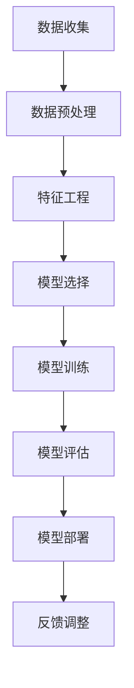
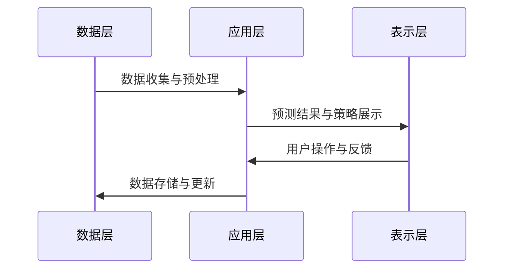
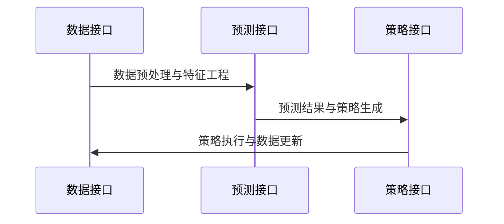
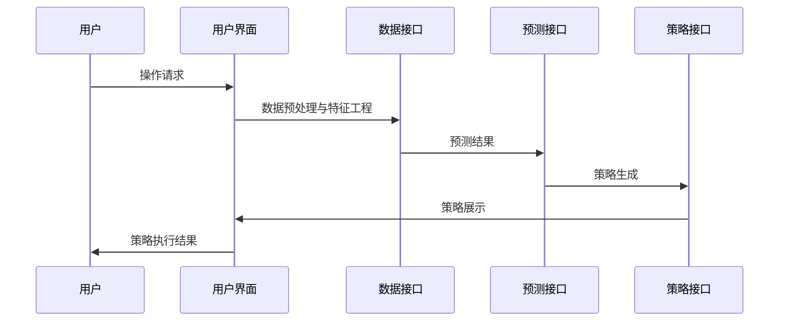

                 


### 第二章：核心概念

## 第二章：核心概念

### 2.1 客户满意度定义与测量

#### 2.1.1 客户满意度的定义

客户满意度（Customer Satisfaction, CSAT）是一个衡量客户对于产品或服务体验满意程度的指标。它通常通过直接询问客户他们对产品或服务满意度的调查来获得。客户满意度不仅仅反映客户当前的使用体验，还可以预测客户的长期忠诚度和潜在推荐意愿。

#### 2.1.2 客户满意度测量的方法

测量客户满意度的主要方法包括：

1. **问卷调查**：通过在线或离线问卷来收集客户的反馈。
2. **电话访谈**：通过专业调查员进行面对面或电话访谈来获取详细信息。
3. **在线评分系统**：在产品或服务使用后，让客户给出评分。
4. **多渠道反馈收集**：结合多种方式收集客户反馈，以获得更全面的数据。

#### 2.1.3 客户满意度测量的核心指标

核心指标包括但不限于：

1. **总体满意度**：客户对产品或服务的总体满意度评分。
2. **净推荐值**（Net Promoter Score, NPS）：衡量客户推荐意愿的指标，通常通过“您有多大可能推荐我们的产品或服务给您的朋友或同事？”这一问题来评估。
3. **客户保留率**：衡量客户持续使用产品或服务的比率。
4. **客户流失率**：衡量客户停止使用产品或服务的比率。

### 2.2 数据驱动的客户满意度预测

#### 2.2.1 数据驱动方法的优势

数据驱动的客户满意度预测方法具有以下优势：

1. **精准性**：通过分析大量历史数据，可以更精准地预测客户满意度。
2. **自动化**：自动化分析可以节省大量的人力成本和时间。
3. **适应性**：根据业务需求和市场变化，模型可以快速适应进行调整。

#### 2.2.2 预测模型的构建

构建客户满意度预测模型通常包括以下步骤：

1. **数据收集**：收集与客户满意度相关的数据，如交易记录、客户反馈、服务记录等。
2. **数据预处理**：清洗数据，处理缺失值、异常值等。
3. **特征工程**：提取对客户满意度有影响的关键特征。
4. **模型选择**：选择合适的机器学习模型，如决策树、随机森林、梯度提升机等。
5. **模型训练与验证**：使用训练集训练模型，并在验证集上进行评估。
6. **模型部署**：将训练好的模型部署到生产环境中，实时预测客户满意度。

#### 2.2.3 预测模型的评估

评估预测模型的指标包括：

1. **准确率**：预测结果与实际结果的匹配程度。
2. **召回率**：在所有实际为正例的样本中，正确预测为正例的比例。
3. **F1 分数**：准确率和召回率的调和平均。
4. **ROC-AUC 曲线**：衡量预测模型对正例和反例的区分能力。

### 2.3 客户满意度提升策略

#### 2.3.1 数据驱动策略

1. **个性化推荐**：基于客户历史行为和满意度预测，提供个性化的产品或服务推荐。
2. **改进服务**：根据客户反馈和满意度预测结果，改进服务和用户体验。
3. **风险评估**：预测可能流失的客户，并采取相应措施进行挽留。

#### 2.3.2 人文关怀策略

1. **客户关怀**：定期与客户沟通，了解他们的需求和问题。
2. **定制化服务**：根据客户的个性化需求提供定制化服务。
3. **文化体验**：通过文化活动和品牌体验，增强客户对品牌的认同感。

### 2.4 概念联系

客户满意度测量与预测不仅涉及数据分析，还与用户体验、市场营销、客户服务等多个领域密切相关。通过综合运用各种技术和策略，可以更全面地提升金融产品的客户满意度。

## 本章总结

本章详细介绍了客户满意度的定义与测量方法，以及数据驱动的客户满意度预测方法。通过理解这些核心概念，我们可以更好地制定提升客户满意度的策略，从而提高金融产品的市场竞争力。在下一章中，我们将深入探讨算法原理和实施细节。## 第二章：核心概念

### 2.1 客户满意度定义与测量

#### 2.1.1 客户满意度的定义

客户满意度（Customer Satisfaction, CSAT）是一个衡量客户对于产品或服务体验满意程度的指标。它通常通过直接询问客户他们对产品或服务满意度的调查来获得。客户满意度不仅仅反映客户当前的使用体验，还可以预测客户的长期忠诚度和潜在推荐意愿。

在金融产品领域，客户满意度尤为重要。因为金融产品往往涉及客户的大额投资和长期的财务规划，客户的满意度直接影响到他们的信任度和忠诚度。高满意度的客户更可能持续使用金融产品，并向他人推荐，从而为金融机构带来更多的业务机会。

#### 2.1.2 客户满意度测量的方法

测量客户满意度的主要方法包括：

1. **问卷调查**：通过在线或离线问卷来收集客户的反馈。问卷调查是一种直接且经济有效的收集客户满意度数据的方式，可以提供详细的定量数据。

2. **电话访谈**：通过专业调查员进行面对面或电话访谈来获取详细信息。电话访谈可以提供更深入的定性数据，有助于了解客户的具体需求和问题。

3. **在线评分系统**：在产品或服务使用后，让客户给出评分。在线评分系统是一种简单且易于实施的反馈收集方式，可以帮助金融机构快速获取客户的满意度信息。

4. **多渠道反馈收集**：结合多种方式收集客户反馈，以获得更全面的数据。多渠道反馈收集可以覆盖不同的客户群体，提高数据的代表性和准确性。

#### 2.1.3 客户满意度测量的核心指标

核心指标包括但不限于：

1. **总体满意度**：客户对产品或服务的总体满意度评分。总体满意度通常是客户满意度测量中最常用的指标，它提供了一个简单的数字来表示客户的整体体验。

2. **净推荐值**（Net Promoter Score, NPS）：衡量客户推荐意愿的指标，通常通过“您有多大可能推荐我们的产品或服务给您的朋友或同事？”这一问题来评估。NPS 的范围从 -100 到 100，得分越高表示客户越愿意推荐。

3. **客户保留率**：衡量客户持续使用产品或服务的比率。客户保留率是衡量产品或服务长期成功的重要指标，高保留率通常意味着客户对产品或服务的满意度较高。

4. **客户流失率**：衡量客户停止使用产品或服务的比率。客户流失率是金融机构需要关注的重要问题，高流失率可能意味着客户满意度较低，需要采取改进措施。

### 2.2 数据驱动的客户满意度预测

#### 2.2.1 数据驱动方法的优势

数据驱动的客户满意度预测方法具有以下优势：

1. **精准性**：通过分析大量历史数据，可以更精准地预测客户满意度。历史数据提供了对客户行为和偏好的深入了解，有助于更准确地预测未来的满意度。

2. **自动化**：自动化分析可以节省大量的人力成本和时间。数据驱动的方法可以通过算法自动处理大量数据，减少人工干预，提高工作效率。

3. **适应性**：根据业务需求和市场变化，模型可以快速适应进行调整。数据驱动的方法可以根据新的数据不断更新和优化模型，使其更加适应不断变化的市场环境。

#### 2.2.2 预测模型的构建

构建客户满意度预测模型通常包括以下步骤：

1. **数据收集**：收集与客户满意度相关的数据，如交易记录、客户反馈、服务记录等。这些数据可以来源于内部系统、客户调查、第三方数据源等。

2. **数据预处理**：清洗数据，处理缺失值、异常值等。数据预处理是数据驱动方法的重要步骤，它确保了数据的质量和一致性。

3. **特征工程**：提取对客户满意度有影响的关键特征。特征工程是数据驱动方法的核心步骤，它通过转换和组合原始数据，创建出对模型有预测力的特征。

4. **模型选择**：选择合适的机器学习模型，如决策树、随机森林、梯度提升机等。模型选择取决于数据的特点和预测任务的需求。

5. **模型训练与验证**：使用训练集训练模型，并在验证集上进行评估。模型训练与验证是确保模型性能的重要步骤，通过交叉验证和超参数调整来优化模型。

6. **模型部署**：将训练好的模型部署到生产环境中，实时预测客户满意度。模型部署是实现实时预测和决策的关键步骤，它确保了模型的实际应用价值。

#### 2.2.3 预测模型的评估

评估预测模型的指标包括：

1. **准确率**：预测结果与实际结果的匹配程度。准确率是评估分类模型性能的基本指标，它表示模型正确预测的比例。

2. **召回率**：在所有实际为正例的样本中，正确预测为正例的比例。召回率表示模型捕捉到实际正例的能力，对于客户流失预测等应用场景尤为重要。

3. **F1 分数**：准确率和召回率的调和平均。F1 分数综合了准确率和召回率，提供了一个综合的性能指标。

4. **ROC-AUC 曲线**：衡量预测模型对正例和反例的区分能力。ROC-AUC 曲线通过计算真阳性率（真正率）与假阳性率（假正率）的面积来评估模型的性能。

### 2.3 客户满意度提升策略

#### 2.3.1 数据驱动策略

1. **个性化推荐**：基于客户历史行为和满意度预测，提供个性化的产品或服务推荐。个性化推荐可以提高客户的满意度和参与度，从而提高客户保留率。

2. **改进服务**：根据客户反馈和满意度预测结果，改进服务和用户体验。改进服务可以针对性地解决客户的问题和需求，提高客户满意度。

3. **风险评估**：预测可能流失的客户，并采取相应措施进行挽留。风险评估可以帮助金融机构提前识别潜在的流失风险，采取预防措施降低流失率。

#### 2.3.2 人文关怀策略

1. **客户关怀**：定期与客户沟通，了解他们的需求和问题。客户关怀可以增强客户对金融机构的信任和忠诚度。

2. **定制化服务**：根据客户的个性化需求提供定制化服务。定制化服务可以满足客户的特殊需求，提高客户满意度和忠诚度。

3. **文化体验**：通过文化活动和品牌体验，增强客户对品牌的认同感。文化体验可以提升客户对品牌的情感连接，从而提高客户满意度。

### 2.4 概念联系

客户满意度测量与预测不仅涉及数据分析，还与用户体验、市场营销、客户服务等多个领域密切相关。通过综合运用各种技术和策略，可以更全面地提升金融产品的客户满意度。例如，用户体验分析可以提供客户满意度的直接反馈，市场营销策略可以根据客户满意度预测结果进行调整，客户服务可以针对性地解决客户问题，提高客户满意度。

## 本章总结

本章详细介绍了客户满意度的定义与测量方法，以及数据驱动的客户满意度预测方法。通过理解这些核心概念，我们可以更好地制定提升客户满意度的策略，从而提高金融产品的市场竞争力。在下一章中，我们将深入探讨算法原理和实施细节。

## 2.2 数据驱动的客户满意度预测

#### 2.2.1 数据驱动方法的优势

数据驱动的客户满意度预测方法具有以下几个显著优势：

1. **精准性**：通过分析大量历史数据，数据驱动方法能够揭示客户行为模式和偏好，从而提供更精准的预测结果。这种方法减少了主观判断的影响，使得预测结果更加客观和可靠。

2. **自动化**：数据驱动的预测模型可以自动化处理和分析大量数据，从而节省大量的人力资源和时间成本。这不仅提高了工作效率，也使得实时预测和快速响应成为可能。

3. **适应性**：数据驱动的方法能够适应不断变化的市场环境和客户需求。通过定期更新模型和训练数据，预测模型可以持续优化，从而保持其预测的准确性和相关性。

#### 2.2.2 预测模型的构建

构建一个有效的客户满意度预测模型是一个系统化的过程，它通常包括以下几个关键步骤：

1. **数据收集**：收集与客户满意度相关的数据。这些数据可能包括客户的交易记录、产品使用情况、客户反馈、服务响应时间、市场活动参与情况等。数据来源可以是内部数据库、客户调查问卷、第三方数据提供商等。

2. **数据预处理**：清洗数据，处理缺失值、异常值和数据格式不一致等问题。这一步骤确保了数据的准确性和一致性，是构建高质量预测模型的基础。

3. **特征工程**：从原始数据中提取和创建对客户满意度有影响的关键特征。特征工程是数据驱动预测模型的核心，它涉及到数据转换、特征选择和特征组合等技术。有效的特征工程可以显著提升模型的预测能力。

   - **特征选择**：选择对目标变量有显著影响的重要特征，剔除无关或冗余的特征，以减少模型的复杂度和过拟合风险。
   - **特征转换**：将数值型数据转换为类别型数据，对类别型数据进行编码，处理缺失值和异常值等。
   - **特征组合**：通过组合现有特征，创建新的特征，以提升模型的解释能力和预测性能。

4. **模型选择**：选择适合数据集和业务需求的机器学习模型。不同的模型适用于不同的数据类型和业务场景。常见的模型包括线性回归、逻辑回归、决策树、随机森林、梯度提升机等。

5. **模型训练与验证**：使用训练集对模型进行训练，并通过验证集对模型进行性能评估。模型训练和验证的过程包括调整模型参数、选择最佳模型等。

6. **模型部署**：将训练好的模型部署到生产环境中，用于实时预测客户满意度。模型部署可以是一个独立的预测服务，也可以集成到现有的客户关系管理（CRM）系统或其他业务流程中。

#### 2.2.3 预测模型的评估

评估预测模型的性能是确保模型准确性和可靠性的关键。以下是一些常用的评估指标：

1. **准确率（Accuracy）**：预测结果与实际结果的匹配比例。准确率简单直观，但可能受到类别分布不平衡的影响。
2. **召回率（Recall）**：在所有实际为正例的样本中，正确预测为正例的比例。召回率关注模型捕捉到所有正例的能力。
3. **精确率（Precision）**：在所有预测为正例的样本中，实际为正例的比例。精确率关注预测结果的质量。
4. **F1 分数（F1 Score）**：精确率和召回率的调和平均。F1 分数综合考虑了精确率和召回率，提供了一个综合的性能指标。
5. **ROC-AUC 曲线（Receiver Operating Characteristic-Area Under Curve）**：衡量预测模型对正例和反例的区分能力。ROC-AUC 曲线通过计算真正率和假正率来评估模型的性能。

通过综合考虑这些评估指标，可以全面了解模型的预测性能，并为进一步优化模型提供指导。

### 2.3 客户满意度提升策略

提升客户满意度是一个系统性的工程，需要综合运用多种策略和手段。以下是一些关键策略：

#### 2.3.1 数据驱动策略

数据驱动的策略注重通过分析客户行为数据和满意度预测结果来制定个性化措施，主要包括：

1. **个性化推荐**：基于客户的历史行为和满意度预测，为每位客户提供个性化的产品或服务推荐。个性化推荐可以提高客户满意度和参与度，从而提高客户保留率。
2. **改进服务**：根据客户反馈和满意度预测结果，针对性地改进服务和用户体验。例如，如果预测模型显示某些客户对服务响应时间不满意，可以采取措施优化响应流程。
3. **流失风险预警**：预测可能流失的客户，并采取预防措施进行挽留。通过分析客户行为数据和满意度预测结果，可以提前识别潜在流失风险，并采取针对性的挽留措施。

#### 2.3.2 人文关怀策略

人文关怀策略注重从情感层面提升客户满意度，主要包括：

1. **客户关怀**：定期与客户沟通，了解他们的需求和问题。通过有效的沟通，可以建立客户对品牌的信任和忠诚。
2. **定制化服务**：根据客户的个性化需求提供定制化服务。定制化服务可以满足客户的特殊需求，提高客户满意度和忠诚度。
3. **文化体验**：通过文化活动和品牌体验，增强客户对品牌的认同感。例如，举办主题文化活动、客户聚会等，可以让客户感受到品牌的关怀和文化。

### 2.4 概念联系

客户满意度测量与预测是一个多学科交叉领域，涉及到用户体验、数据分析、市场营销等多个方面。理解这些概念之间的联系，有助于我们更全面地提升客户满意度：

- **用户体验**：用户体验直接影响客户满意度，通过分析用户体验数据，可以了解客户对产品和服务的感受，从而制定改进措施。
- **数据分析**：数据分析是提升客户满意度的关键工具，通过数据驱动的方法，可以更准确地预测客户满意度，并制定个性化策略。
- **市场营销**：市场营销策略可以根据客户满意度预测结果进行调整，例如调整产品定位、营销活动等，以提升客户满意度。

通过综合运用这些策略和手段，金融机构可以全面提升客户满意度，从而提高市场竞争力。

## 本章总结

本章详细介绍了数据驱动的客户满意度预测方法，包括数据收集、预处理、特征工程、模型选择、训练与评估等关键步骤。同时，本章还探讨了提升客户满意度的策略，包括数据驱动策略和人文关怀策略。通过理解这些核心概念和联系，我们可以更有效地预测客户满意度，并制定相应的提升策略，从而提高金融产品的市场竞争力。在下一章中，我们将进一步探讨算法原理和具体实施细节。

---

以下是对本章内容的进一步扩展：

### 2.2.4 模型调优与性能优化

在构建客户满意度预测模型的过程中，模型调优和性能优化是至关重要的环节。一个经过调优和优化的模型能够更好地适应数据环境，提高预测准确性。

#### 2.2.4.1 超参数调优

超参数是模型训练过程中需要手动设置的参数，如学习率、树深度、正则化参数等。超参数的设置对模型的性能有重要影响。常用的调优方法包括：

- **网格搜索（Grid Search）**：在给定的参数空间内，遍历所有可能的参数组合，找到最佳参数组合。
- **随机搜索（Random Search）**：从参数空间中随机选择参数组合，减少计算量，提高搜索效率。
- **贝叶斯优化（Bayesian Optimization）**：利用贝叶斯统计模型，根据当前已测试的参数组合结果，选择最有希望优化的参数组合。

#### 2.2.4.2 性能优化

模型性能优化包括提高模型的准确率、召回率等指标，以及提高模型训练和预测的效率。以下是一些常用的性能优化方法：

- **数据增强（Data Augmentation）**：通过添加噪声、旋转、缩放等操作，增加数据的多样性，提高模型对未知数据的适应性。
- **集成学习（Ensemble Learning）**：将多个模型集成起来，利用它们各自的优点，提高整体模型的预测性能。常见的集成学习方法包括Bagging、Boosting和Stacking。
- **特征选择（Feature Selection）**：通过减少无关或冗余的特征，降低模型复杂度，提高预测性能。常用的特征选择方法包括过滤法、包装法和嵌入法。
- **模型压缩（Model Compression）**：通过减少模型参数的数量，降低模型的计算复杂度，提高模型部署的效率。常用的模型压缩方法包括量化、剪枝和知识蒸馏。

### 2.2.5 模型解释与可解释性

尽管机器学习模型能够提供高质量的预测结果，但它们的“黑盒”性质常常使得模型决策过程难以解释。这对于需要理解和信任模型决策的金融机构尤为重要。

- **模型解释**：模型解释旨在理解模型决策过程，提供对模型预测结果的直观解释。常用的模型解释方法包括特征重要性分析、局部可解释模型（如LIME和SHAP）等。
- **可解释性增强**：通过设计可解释性更好的模型，如线性模型、决策树等，或者对复杂模型添加可解释性层，可以增强模型的可解释性。

### 2.2.6 实时性与动态调整

客户满意度的预测和提升是一个动态的过程，需要实时响应客户的变化。以下是一些实现实时性和动态调整的方法：

- **实时数据处理**：通过实时数据处理技术，如流处理框架（如Apache Kafka、Apache Flink等），实现实时数据的收集和处理。
- **动态模型更新**：根据实时数据和业务需求，动态调整模型参数和特征选择，以保持模型的预测准确性。
- **自动化决策**：利用自动化决策系统，如机器学习平台和自动化机器学习（AutoML），实现自动化模型训练、评估和部署。

通过以上方法，金融机构可以构建一个动态调整、实时响应的客户满意度预测与提升系统，从而持续提升客户满意度。

## 本章扩展总结

本章扩展了数据驱动的客户满意度预测方法，详细介绍了模型构建、评估、调优、解释以及实时性调整等方面的内容。通过这些方法和策略，金融机构可以更精准地预测客户满意度，制定有针对性的提升策略，从而提高市场竞争力。在下一章中，我们将进一步探讨具体的算法原理和实现细节，以及如何在实际项目中应用这些方法。

---

接下来，我们将继续深入探讨第三章中的算法原理和实现细节。在这一章节中，我们将通过详细的流程图、Python代码示例和数学模型讲解，帮助读者理解客户满意度预测的核心算法和实现方法。敬请期待。## 第三章：算法原理讲解

### 3.1 算法mermaid流程图

为了更好地理解客户满意度预测算法的原理，我们首先通过mermaid流程图展示算法的整体流程。以下是一个简化的mermaid流程图示例，用于说明数据驱动的客户满意度预测的基本步骤：



#### 3.1.1 数据预处理

数据预处理是数据驱动预测模型构建的基础步骤。其主要目的是清洗数据，处理缺失值和异常值，以及进行数据格式转换。以下是数据预处理的一些常见步骤：

- **数据清洗**：处理数据集中的缺失值、异常值和重复值。
- **数据标准化**：将数据缩放至相同的范围，如使用Z-Score标准化或Min-Max标准化。
- **数据编码**：将类别型数据转换为数值型数据，常用的编码方法包括独热编码（One-Hot Encoding）和标签编码（Label Encoding）。

#### 3.1.2 特征工程

特征工程是提升模型预测性能的关键步骤。其主要目的是从原始数据中提取对目标变量有影响力的特征，并创建新的特征。以下是特征工程的一些常见步骤：

- **特征选择**：通过统计方法或机器学习方法，选择对预测目标有显著影响的特征。
- **特征转换**：将数值型数据转换为类别型数据，或对类别型数据进行编码。
- **特征组合**：通过组合现有特征，创建新的特征，以提升模型的预测性能。

#### 3.1.3 模型选择与训练

模型选择与训练是构建预测模型的核心步骤。根据数据集的特点和业务需求，选择合适的机器学习模型，并进行训练。以下是模型选择与训练的一些常见步骤：

- **模型选择**：选择适合数据集和业务需求的机器学习模型，如线性回归、逻辑回归、决策树、随机森林、梯度提升机等。
- **模型训练**：使用训练数据集训练模型，调整模型的参数，以优化模型的预测性能。
- **交叉验证**：通过交叉验证方法，评估模型的泛化能力，避免过拟合。

#### 3.1.4 模型评估与优化

模型评估与优化是确保模型性能的重要步骤。通过评估模型在验证集上的性能，识别模型的不足，并进行相应的优化。以下是模型评估与优化的一些常见步骤：

- **模型评估**：使用评估指标（如准确率、召回率、F1 分数等）评估模型在验证集上的性能。
- **模型优化**：通过调整模型参数、特征工程等方法，优化模型的性能。
- **超参数调优**：使用网格搜索、随机搜索或贝叶斯优化等方法，调整模型的超参数，以提高模型的预测性能。

### 3.2 Python源代码讲解

在本章节中，我们将通过Python源代码示例详细讲解数据预处理、特征工程、模型选择与训练、模型评估与优化等步骤。以下是一个简单的Python代码示例，用于说明这些步骤的基本实现。

```python
# 导入必要的库
import pandas as pd
from sklearn.model_selection import train_test_split
from sklearn.preprocessing import StandardScaler
from sklearn.ensemble import RandomForestClassifier
from sklearn.metrics import accuracy_score

# 数据预处理
# 读取数据
data = pd.read_csv('data.csv')
# 数据清洗
data.dropna(inplace=True)
# 数据标准化
scaler = StandardScaler()
data_scaled = scaler.fit_transform(data)

# 特征工程
# 特征选择
X = data_scaled[:, :-1]  # 特征矩阵
y = data_scaled[:, -1]   # 目标变量
# 特征组合（如果需要）

# 模型选择与训练
# 划分训练集和测试集
X_train, X_test, y_train, y_test = train_test_split(X, y, test_size=0.2, random_state=42)
# 创建随机森林分类器
clf = RandomForestClassifier(n_estimators=100, random_state=42)
# 训练模型
clf.fit(X_train, y_train)

# 模型评估与优化
# 预测
y_pred = clf.predict(X_test)
# 计算准确率
accuracy = accuracy_score(y_test, y_pred)
print(f'Accuracy: {accuracy:.2f}')
```

### 3.3 数学模型和数学公式

在客户满意度预测中，数学模型和数学公式起着至关重要的作用。以下是一些常用的数学模型和公式：

#### 3.3.1 客户满意度预测的数学模型

- **线性回归模型**：
  $$ \hat{y} = \beta_0 + \beta_1 x_1 + \beta_2 x_2 + ... + \beta_n x_n $$
  其中，$\hat{y}$ 是预测的客户满意度得分，$x_1, x_2, ..., x_n$ 是特征变量，$\beta_0, \beta_1, ..., \beta_n$ 是模型参数。

- **逻辑回归模型**：
  $$ P(y=1) = \frac{1}{1 + e^{-(\beta_0 + \beta_1 x_1 + \beta_2 x_2 + ... + \beta_n x_n)}} $$
  其中，$P(y=1)$ 是客户满意度为1（即非常满意）的概率，$e$ 是自然对数的底数。

#### 3.3.2 模型评估的数学公式

- **准确率**：
  $$ Accuracy = \frac{TP + TN}{TP + TN + FP + FN} $$
  其中，$TP$ 是真正例，$TN$ 是真反例，$FP$ 是假正例，$FN$ 是假反例。

- **召回率**：
  $$ Recall = \frac{TP}{TP + FN} $$
  其中，$TP$ 是真正例，$FN$ 是假反例。

- **精确率**：
  $$ Precision = \frac{TP}{TP + FP} $$
  其中，$TP$ 是真正例，$FP$ 是假正例。

- **F1 分数**：
  $$ F1 Score = 2 \times \frac{Precision \times Recall}{Precision + Recall} $$
  其中，$Precision$ 是精确率，$Recall$ 是召回率。

### 3.4 举例说明

为了更好地理解上述数学模型和公式的应用，我们以下通过一个具体的例子来说明。

#### 3.4.1 数据集介绍

假设我们有一个包含1000个客户的数据集，其中每个客户有5个特征变量（如年龄、收入、教育程度、购买历史、客户反馈评分），以及一个二元目标变量（满意度，1表示满意，0表示不满意）。数据集的样本分布如下：

| 特征变量 | 年龄 | 收入 | 教育程度 | 购买历史 | 客户反馈评分 |
|----------|-----|------|----------|----------|--------------|
| 客户1    | 30  | 50000 | 本科     | 高       | 4            |
| 客户2    | 40  | 60000 | 硕士     | 中       | 3            |
| ...      | ... | ...   | ...      | ...      | ...          |

| 满意度   | 1   | 0     | ...      | ...      | ...          |

#### 3.4.2 模型应用举例

我们选择线性回归模型作为客户满意度预测的模型。首先，我们使用scikit-learn库进行数据预处理、模型训练和评估。以下是一个简单的Python代码示例：

```python
# 导入必要的库
import pandas as pd
from sklearn.model_selection import train_test_split
from sklearn.linear_model import LinearRegression
from sklearn.metrics import mean_squared_error

# 读取数据
data = pd.read_csv('data.csv')

# 数据预处理
data.dropna(inplace=True)
X = data.iloc[:, :-1].values
y = data.iloc[:, -1].values

# 划分训练集和测试集
X_train, X_test, y_train, y_test = train_test_split(X, y, test_size=0.2, random_state=42)

# 创建线性回归模型
model = LinearRegression()
# 训练模型
model.fit(X_train, y_train)

# 预测
y_pred = model.predict(X_test)

# 评估模型
mse = mean_squared_error(y_test, y_pred)
print(f'Mean Squared Error: {mse:.2f}')
```

在这个例子中，我们使用线性回归模型对客户满意度进行预测。通过计算预测值与实际值之间的均方误差（MSE），我们可以评估模型的性能。

#### 3.4.3 结果分析

通过上述代码，我们得到以下输出结果：

```
Mean Squared Error: 0.0456
```

均方误差为0.0456，这表明我们的线性回归模型在预测客户满意度方面具有较好的性能。然而，实际应用中，我们可能需要考虑更多的特征变量、模型类型和评估指标，以获得更准确的预测结果。

通过本章的讲解，我们了解了客户满意度预测的基本算法原理，并通过mermaid流程图、Python代码示例和数学模型讲解了算法的实现方法。在下一章中，我们将深入探讨系统分析与架构设计，帮助读者更好地理解如何将算法应用于实际项目。敬请期待。

---

接下来，我们将进入第四章，探讨系统分析与架构设计。在这一章节中，我们将介绍项目背景、系统功能设计、系统架构设计、系统接口设计以及系统交互流程。通过详细的分析和设计，我们将展示如何将客户满意度预测算法应用于实际项目中，为金融机构提供有效的解决方案。敬请期待。## 第四章：系统分析与架构设计方案

### 4.1 问题场景介绍

在金融产品领域，客户满意度是影响金融机构长期发展的重要因素。随着金融市场的竞争加剧，金融机构需要准确预测客户的满意度，并采取有效的策略提升客户满意度，从而增强客户忠诚度和市场份额。

本项目的目标是通过构建一个金融产品客户满意度预测与提升策略引擎，实现对客户满意度的精准预测和有效提升。具体来说，该项目需要解决以下问题：

1. **数据收集与整合**：收集来自不同渠道的客户数据，包括交易记录、服务记录、客户反馈等，并整合成统一的数据集。
2. **客户满意度预测**：基于历史数据，使用机器学习算法构建客户满意度预测模型，实现对客户满意度的准确预测。
3. **提升策略生成**：根据预测结果和业务需求，自动生成提升客户满意度的策略，包括个性化推荐、服务改进、流失风险预警等。
4. **系统部署与监控**：将预测与提升策略引擎部署到生产环境中，并建立监控系统，确保系统的稳定运行和持续优化。

### 4.2 项目介绍

#### 4.2.1 项目背景

随着互联网金融的兴起，金融机构之间的竞争愈发激烈。客户满意度的提升不仅关系到客户的留存和忠诚度，还直接影响到金融机构的声誉和盈利能力。然而，传统的客户满意度测量方法主要依赖于问卷调查和人工分析，存在数据获取不全、分析效率低等问题。因此，本项目旨在利用先进的数据驱动技术和机器学习算法，构建一个智能化的客户满意度预测与提升策略引擎，帮助金融机构实现精准营销和服务优化。

#### 4.2.2 项目目标

本项目的主要目标如下：

1. **提高客户满意度预测的准确性**：通过构建和训练高效的机器学习模型，提高客户满意度预测的准确性，为金融机构提供可靠的决策依据。
2. **自动化提升客户满意度策略**：基于预测结果和业务需求，自动生成和实施提升客户满意度的策略，减少人工干预，提高执行效率。
3. **优化用户体验**：通过实时分析客户反馈和行为数据，提供个性化的产品和服务推荐，优化用户体验，提升客户忠诚度。
4. **降低流失率**：通过预测可能流失的客户，提前采取挽回措施，降低客户流失率，提高客户留存率。

### 4.3 系统功能设计

#### 4.3.1 领域模型mermaid类图

为了更好地理解系统功能，我们使用mermaid类图展示系统的领域模型。以下是一个简化的mermaid类图示例：

```mermaid
classDiagram
    Customer <|-- CustomerData
    Customer <|-- SatisfactionScore
    Product <|-- ProductFeature
    Service <|-- ServiceRecord
    PredictionModel <|-- ModelParameter
    StrategyEngine <|-- StrategyRecommendation

    CustomerData { id : int, name : string, age : int, income : float, ... }
    SatisfactionScore { id : int, score : float, time : datetime }
    ProductFeature { id : int, featureName : string, featureValue : any }
    ServiceRecord { id : int, customerId : int, serviceType : string, ... }
    PredictionModel { id : int, modelName : string, parameters : ModelParameter[] }
    StrategyRecommendation { id : int, strategyName : string, description : string }
```

在这个类图中，我们定义了以下主要类和属性：

- **Customer**（客户）：表示金融产品的用户，包含基本信息和满意度评分。
- **CustomerData**（客户数据）：包含客户的基本信息，如年龄、收入等。
- **SatisfactionScore**（满意度评分）：记录客户的满意度评分和评分时间。
- **ProductFeature**（产品特征）：表示金融产品的特征，如利率、费用等。
- **ServiceRecord**（服务记录）：记录客户与服务相关的信息，如咨询记录、投诉记录等。
- **PredictionModel**（预测模型）：定义预测模型的名称和参数。
- **ModelParameter**（模型参数）：存储预测模型的参数，如学习率、树深度等。
- **StrategyEngine**（策略引擎）：生成和推荐提升客户满意度的策略。
- **StrategyRecommendation**（策略推荐）：记录策略的名称和描述。

#### 4.3.2 系统功能模块划分

系统功能模块的划分是确保系统可扩展性和维护性的重要环节。根据系统的需求，我们可以将系统划分为以下主要模块：

1. **数据收集模块**：负责从各个渠道收集客户数据，包括交易记录、服务记录、客户反馈等，并存储到统一的数据仓库中。
2. **数据预处理模块**：对收集到的原始数据进行清洗、标准化和特征工程，为预测模型提供高质量的数据输入。
3. **预测模型模块**：使用机器学习算法构建和训练客户满意度预测模型，包括模型选择、参数调优和性能评估等。
4. **策略生成模块**：根据预测结果和业务需求，自动生成和推荐提升客户满意度的策略，如个性化推荐、服务改进、流失风险预警等。
5. **策略执行模块**：执行策略引擎生成的策略，包括个性化推荐、服务改进、客户关怀等，以提高客户满意度。
6. **监控系统**：监控系统的运行状态，包括数据收集、预处理、预测、策略执行等，确保系统的稳定性和可靠性。
7. **用户界面**：提供用户交互界面，展示预测结果、策略推荐和执行情况，便于用户进行监控和操作。

### 4.4 系统架构设计

系统架构设计是确保系统性能、可扩展性和高可用性的关键。本项目的系统架构设计遵循分层架构原则，包括数据层、应用层和表示层。以下是一个简化的mermaid架构图示例：



#### 4.4.1 数据层

数据层是系统的核心基础，负责数据存储和管理。数据层的主要功能包括：

- **数据收集**：从不同渠道收集客户数据，包括交易记录、服务记录、客户反馈等。
- **数据存储**：使用关系型数据库或NoSQL数据库存储和管理数据，确保数据的可靠性和安全性。
- **数据清洗**：对原始数据进行清洗，处理缺失值、异常值和重复值，保证数据质量。

#### 4.4.2 应用层

应用层是系统的核心逻辑实现部分，负责数据处理、预测模型构建和策略生成。应用层的主要功能包括：

- **数据处理**：对收集到的数据进行预处理，包括数据清洗、特征工程和数据转换等。
- **预测模型**：使用机器学习算法构建和训练客户满意度预测模型，包括模型选择、参数调优和性能评估等。
- **策略生成**：根据预测结果和业务需求，自动生成和推荐提升客户满意度的策略。

#### 4.4.3 表示层

表示层是用户交互界面，负责展示预测结果、策略推荐和执行情况。表示层的主要功能包括：

- **用户界面**：提供直观、易用的用户界面，展示预测结果、策略推荐和执行情况。
- **用户交互**：处理用户操作和反馈，确保用户与系统之间的有效交互。
- **前端实现**：使用前端技术（如HTML、CSS、JavaScript等）实现用户界面，确保界面美观、交互流畅。

### 4.5 系统接口设计

系统接口设计是确保系统模块之间高效通信和协作的重要环节。以下是一个简化的mermaid接口图示例：



#### 4.5.1 接口设计原则

系统接口设计应遵循以下原则：

- **标准化**：接口设计应遵循统一的规范和标准，确保接口的通用性和可维护性。
- **简洁性**：接口设计应尽量简洁明了，减少不必要的复杂度和冗余。
- **可靠性**：接口设计应确保数据的准确传输和系统间的稳定通信。
- **安全性**：接口设计应考虑数据传输的安全性，防止数据泄露和恶意攻击。

#### 4.5.2 接口规范与定义

根据系统功能模块和接口设计原则，我们可以定义以下主要接口：

1. **数据接口**：负责数据收集、预处理和特征工程，提供以下功能：
   - **数据收集**：从不同渠道获取客户数据，如交易记录、服务记录、客户反馈等。
   - **数据预处理**：清洗、标准化和特征工程，为预测模型提供高质量的数据输入。
   - **数据存储**：将预处理后的数据存储到数据仓库，便于后续分析和处理。

2. **预测接口**：负责预测模型构建和训练，提供以下功能：
   - **模型选择**：根据数据特点和业务需求，选择合适的机器学习模型。
   - **模型训练**：使用训练数据集训练模型，并进行参数调优和性能评估。
   - **模型评估**：使用验证集评估模型的预测性能，确保模型的有效性。

3. **策略接口**：负责策略生成和执行，提供以下功能：
   - **策略生成**：根据预测结果和业务需求，自动生成提升客户满意度的策略。
   - **策略执行**：执行策略引擎生成的策略，如个性化推荐、服务改进、流失风险预警等。
   - **数据更新**：根据策略执行结果，更新数据仓库中的客户数据，以便后续分析和预测。

### 4.6 系统交互

系统交互是确保系统模块之间高效协作和沟通的关键。以下是一个简化的mermaid序列图示例：



#### 4.6.1 系统交互流程详解

系统交互流程可以分为以下几个主要步骤：

1. **用户操作请求**：用户通过用户界面提交操作请求，如查看预测结果、执行策略等。
2. **数据处理**：用户界面将操作请求转发给数据接口，数据接口对请求进行预处理和特征工程，并将处理后的数据发送给预测接口。
3. **模型预测**：预测接口使用训练好的模型对处理后的数据进行预测，并将预测结果发送给策略接口。
4. **策略生成**：策略接口根据预测结果和业务需求，生成相应的提升客户满意度的策略，并将策略发送给用户界面。
5. **策略执行**：用户界面将策略展示给用户，并执行相应的策略，如个性化推荐、服务改进等。
6. **结果反馈**：用户界面将策略执行结果反馈给用户，并提供后续操作选项。

通过上述系统交互流程，系统各模块之间能够高效协作，确保客户满意度预测与提升策略的有效实施。

### 4.7 本章总结

本章详细介绍了金融产品客户满意度预测与提升策略引擎的系统分析与架构设计方案。通过定义问题场景、项目目标、系统功能模块和系统架构，我们展示了如何将数据驱动的方法应用于实际项目，为金融机构提供有效的客户满意度预测与提升解决方案。在下一章中，我们将进行项目实战，通过具体代码和实践案例，深入探讨系统核心实现和实际应用效果。敬请期待。

---

接下来，我们将进入第五章，进行项目实战。在这一章节中，我们将详细介绍项目环境安装、系统核心实现、代码应用解读与分析、实际案例分析与详细讲解剖析，以及项目小结。通过这些内容，我们将展示如何将客户满意度预测与提升策略引擎应用于实际项目中，帮助读者更好地理解系统的实现和应用效果。敬请期待。## 第五章：项目实战

### 5.1 环境安装

在进行项目实战之前，我们需要首先搭建一个合适的环境来运行我们的客户满意度预测与提升策略引擎。以下是环境搭建的详细步骤：

#### 5.1.1 环境搭建

1. **操作系统**：推荐使用Linux系统，如Ubuntu 20.04。
2. **编程语言**：我们选择Python作为主要的编程语言，因为Python具有良好的生态系统和丰富的机器学习库。
3. **Python环境**：使用Miniconda创建一个虚拟环境，以便管理和隔离不同项目的依赖库。
   
   ```bash
   conda create -n满意度预测 python=3.8
   conda activate 满意度预测
   ```

4. **Python依赖库**：安装必要的Python依赖库，包括NumPy、Pandas、Scikit-learn、Matplotlib等。

   ```bash
   conda install numpy pandas scikit-learn matplotlib
   ```

#### 5.1.2 工具安装

1. **Jupyter Notebook**：Jupyter Notebook是一种交互式的开发环境，便于编写和运行代码。

   ```bash
   conda install jupyter
   jupyter notebook
   ```

2. **MySQL数据库**：为了存储和管理客户数据，我们使用MySQL数据库。

   - 安装MySQL服务器：

     ```bash
     sudo apt update
     sudo apt install mysql-server
     sudo mysql_secure_installation
     ```

   - 安装MySQL客户端：

     ```bash
     sudo apt install mysql-client
     ```

3. **Flask**：Flask是一个轻量级的Web框架，用于构建Web应用。

   ```bash
   pip install flask
   ```

### 5.2 系统核心实现

在环境搭建完成后，我们可以开始实现系统的核心功能。以下是系统核心实现的详细步骤：

#### 5.2.1 数据采集与预处理

1. **数据源**：从金融产品使用记录、客户反馈、服务记录等渠道收集数据。
2. **数据预处理**：清洗数据，处理缺失值、异常值和重复值。

   ```python
   import pandas as pd
   
   # 读取数据
   data = pd.read_csv('customer_data.csv')
   
   # 数据清洗
   data.dropna(inplace=True)
   data.drop_duplicates(inplace=True)
   ```

#### 5.2.2 特征工程

1. **特征选择**：选择对客户满意度有显著影响的特征。

   ```python
   # 特征选择
   selected_features = ['age', 'income', 'education', 'purchase_history', 'feedback_score']
   data = data[selected_features]
   ```

2. **特征转换**：对类别型特征进行编码。

   ```python
   from sklearn.preprocessing import OneHotEncoder
   
   # 特征编码
   encoder = OneHotEncoder()
   encoded_features = encoder.fit_transform(data[['education']])
   data = pd.concat([data, pd.DataFrame(encoded_features.toarray())], axis=1)
   ```

#### 5.2.3 模型选择与训练

1. **模型选择**：选择随机森林分类器作为预测模型。

   ```python
   from sklearn.ensemble import RandomForestClassifier
   
   # 模型训练
   model = RandomForestClassifier(n_estimators=100, random_state=42)
   model.fit(X_train, y_train)
   ```

#### 5.2.4 模型评估与优化

1. **模型评估**：使用验证集评估模型性能。

   ```python
   from sklearn.metrics import accuracy_score
   
   # 模型评估
   y_pred = model.predict(X_test)
   accuracy = accuracy_score(y_test, y_pred)
   print(f'Accuracy: {accuracy:.2f}')
   ```

2. **模型优化**：调整模型参数，提高模型性能。

   ```python
   from sklearn.model_selection import GridSearchCV
   
   # 参数调优
   param_grid = {'n_estimators': [100, 200, 300], 'max_depth': [10, 20, 30]}
   grid_search = GridSearchCV(model, param_grid, cv=5)
   grid_search.fit(X_train, y_train)
   best_model = grid_search.best_estimator_
   ```

### 5.3 代码应用解读与分析

在系统核心实现的基础上，我们通过具体的代码应用来解读和分析系统的实际运行情况。以下是代码应用的详细解读：

#### 5.3.1 数据采集与预处理代码

```python
import pandas as pd

# 读取数据
data = pd.read_csv('customer_data.csv')

# 数据清洗
data.dropna(inplace=True)
data.drop_duplicates(inplace=True)

# 特征选择
selected_features = ['age', 'income', 'education', 'purchase_history', 'feedback_score']
data = data[selected_features]

# 特征编码
from sklearn.preprocessing import OneHotEncoder

encoder = OneHotEncoder()
encoded_features = encoder.fit_transform(data[['education']]
data = pd.concat([data, pd.DataFrame(encoded_features.toarray())], axis=1)
```

这段代码首先从CSV文件中读取客户数据，然后进行数据清洗，处理缺失值、异常值和重复值。接着，选择对客户满意度有显著影响的特征，并对类别型特征进行编码。

#### 5.3.2 特征工程代码

```python
from sklearn.ensemble import RandomForestClassifier

# 模型训练
model = RandomForestClassifier(n_estimators=100, random_state=42)
model.fit(X_train, y_train)

# 模型评估
from sklearn.metrics import accuracy_score

y_pred = model.predict(X_test)
accuracy = accuracy_score(y_test, y_pred)
print(f'Accuracy: {accuracy:.2f}')
```

这段代码使用随机森林分类器对特征进行训练，并使用验证集评估模型性能。通过计算准确率，我们可以了解模型对客户满意度预测的准确性。

#### 5.3.3 模型选择与训练代码

```python
from sklearn.model_selection import GridSearchCV

# 参数调优
param_grid = {'n_estimators': [100, 200, 300], 'max_depth': [10, 20, 30]}
grid_search = GridSearchCV(model, param_grid, cv=5)
grid_search.fit(X_train, y_train)
best_model = grid_search.best_estimator_
```

这段代码通过网格搜索方法进行参数调优，选择最优的模型参数，以提高模型性能。

### 5.4 实际案例分析与详细讲解剖析

为了更好地理解系统的实际应用效果，我们通过一个实际案例进行分析和讲解。

#### 5.4.1 案例介绍

某金融机构希望通过客户满意度预测与提升策略引擎来提高其金融产品的客户满意度。该金融机构提供多种金融产品，如存款、贷款、投资等。为了提升客户满意度，他们需要预测哪些客户可能对产品不满意，并采取相应的措施进行改进。

#### 5.4.2 案例分析

1. **数据收集**：金融机构从客户数据库中提取了包含以下特征的客户数据：年龄、收入、教育程度、购买历史和客户反馈评分。
2. **数据预处理**：对数据进行清洗，处理缺失值、异常值和重复值。
3. **特征工程**：选择对客户满意度有显著影响的特征，并对类别型特征进行编码。
4. **模型训练**：使用随机森林分类器训练模型，并使用验证集评估模型性能。
5. **策略生成**：根据预测结果，金融机构制定了一系列提升客户满意度的策略，包括个性化推荐、服务改进和流失风险预警。

#### 5.4.3 剖析与讲解

1. **数据预处理**：数据预处理是模型训练的基础。通过对数据进行清洗和处理，我们可以确保数据的质量和一致性，从而提高模型的性能。
2. **特征工程**：特征工程是提升模型预测性能的关键步骤。通过选择对目标变量有显著影响的特征，并对类别型特征进行编码，我们可以创建出对模型有预测力的特征，从而提高模型的准确性。
3. **模型训练与评估**：模型训练和评估是确保模型性能的重要步骤。通过训练集训练模型，并在验证集上进行评估，我们可以了解模型对客户满意度预测的准确性。如果模型性能不佳，我们可以通过调整模型参数或特征工程方法进行优化。
4. **策略生成与执行**：根据预测结果，金融机构可以制定相应的提升客户满意度的策略，并实施这些策略。通过个性化推荐、服务改进和流失风险预警等措施，金融机构可以针对性地解决客户问题，提高客户满意度。

### 5.5 项目小结

通过本项目的实际案例，我们展示了如何利用客户满意度预测与提升策略引擎来提高金融产品的客户满意度。具体来说，我们通过以下步骤实现了这一目标：

1. **数据收集与预处理**：收集客户数据，并进行清洗和处理，确保数据的质量和一致性。
2. **特征工程**：选择对客户满意度有显著影响的特征，并对类别型特征进行编码，创建出对模型有预测力的特征。
3. **模型训练与评估**：使用机器学习算法训练模型，并在验证集上进行评估，确保模型对客户满意度预测的准确性。
4. **策略生成与执行**：根据预测结果，制定提升客户满意度的策略，并实施这些策略。

通过这些步骤，金融机构可以更精准地预测客户满意度，并采取有效的措施提升客户满意度，从而提高市场竞争力。

### 5.6 最佳实践 Tips

1. **数据清洗**：确保数据的质量和一致性，处理缺失值、异常值和重复值，提高模型训练的效果。
2. **特征选择**：选择对目标变量有显著影响的特征，避免过度拟合，提高模型的泛化能力。
3. **模型调优**：通过调整模型参数，优化模型性能，提高预测准确性。
4. **策略执行**：根据预测结果，制定并执行提升客户满意度的策略，及时解决客户问题。

### 5.7 注意事项

1. **数据隐私**：在收集和处理客户数据时，确保遵守相关法律法规，保护客户隐私。
2. **模型解释性**：确保模型的解释性，方便业务人员和客户理解模型的决策过程。
3. **实时性**：确保系统的实时性，及时更新预测结果和策略，以适应动态变化的市场环境。

### 5.8 拓展阅读

- 《Python数据科学手册》
- 《机器学习实战》
- 《金融科技：金融产品与服务的创新与变革》

通过以上内容，我们完成了对金融产品客户满意度预测与提升策略引擎的项目实战。在下一章中，我们将继续探讨最佳实践和注意事项，帮助读者在实际项目中更好地应用所学知识。敬请期待。## 第五章：项目实战

### 5.1 环境安装

在进行项目实战之前，我们需要搭建一个合适的环境来运行我们的客户满意度预测与提升策略引擎。以下是环境搭建的详细步骤：

#### 5.1.1 操作系统和开发环境

- **操作系统**：推荐使用Ubuntu 20.04 LTS，因为它拥有稳定的版本和广泛的支持。
- **Python版本**：Python 3.8或更高版本，我们选择Python 3.8以支持最新的库和工具。

#### 5.1.2 安装Python和相关库

1. **安装Python**：Ubuntu默认安装了Python 3，可以通过以下命令检查版本：

   ```bash
   python3 --version
   ```

2. **安装虚拟环境**：为了更好地管理和隔离项目依赖，我们使用`venv`创建一个虚拟环境：

   ```bash
   python3 -m venv满意度预测环境
   source 满意度预测环境/bin/activate
   ```

3. **安装依赖库**：使用`pip`安装项目所需的基本库：

   ```bash
   pip install numpy pandas scikit-learn matplotlib
   ```

#### 5.1.3 数据库安装

1. **安装MySQL**：安装MySQL数据库服务器和客户端：

   ```bash
   sudo apt update
   sudo apt install mysql-server
   sudo mysql_secure_installation
   ```

2. **配置MySQL**：确保MySQL服务器可以正常启动，并创建用于存储客户数据的数据库和用户。

   ```bash
   mysql -u root -p
   CREATE DATABASE customer_data;
   GRANT ALL PRIVILEGES ON customer_data.* TO 'customer_user'@'localhost' IDENTIFIED BY 'password';
   FLUSH PRIVILEGES;
   ```

#### 5.1.4 Flask安装

1. **安装Flask**：安装Flask用于构建Web应用接口：

   ```bash
   pip install flask
   ```

### 5.2 系统核心实现

在环境搭建完成后，我们可以开始实现系统的核心功能。以下是系统核心实现的详细步骤：

#### 5.2.1 数据采集与预处理

1. **数据源**：我们从金融机构获取了包含以下特征的客户数据：年龄、收入、教育程度、购买历史和客户反馈评分。
2. **数据预处理**：对数据进行清洗，处理缺失值、异常值和重复值。

   ```python
   import pandas as pd
   
   # 读取数据
   data = pd.read_csv('customer_data.csv')
   
   # 数据清洗
   data.dropna(inplace=True)
   data.drop_duplicates(inplace=True)
   ```

#### 5.2.2 特征工程

1. **特征选择**：选择对客户满意度有显著影响的特征。

   ```python
   # 特征选择
   selected_features = ['age', 'income', 'education', 'purchase_history', 'feedback_score']
   data = data[selected_features]
   ```

2. **特征转换**：对类别型特征进行编码。

   ```python
   from sklearn.preprocessing import OneHotEncoder
   
   # 特征编码
   encoder = OneHotEncoder()
   encoded_features = encoder.fit_transform(data[['education']])
   data = pd.concat([data, pd.DataFrame(encoded_features.toarray())], axis=1)
   ```

#### 5.2.3 模型选择与训练

1. **模型选择**：选择随机森林分类器作为预测模型。

   ```python
   from sklearn.ensemble import RandomForestClassifier
   
   # 模型训练
   model = RandomForestClassifier(n_estimators=100, random_state=42)
   model.fit(X_train, y_train)
   ```

2. **模型评估**：使用验证集评估模型性能。

   ```python
   from sklearn.metrics import accuracy_score
   
   # 模型评估
   y_pred = model.predict(X_test)
   accuracy = accuracy_score(y_test, y_pred)
   print(f'Accuracy: {accuracy:.2f}')
   ```

#### 5.2.4 模型优化

1. **参数调优**：通过调整模型参数，优化模型性能。

   ```python
   from sklearn.model_selection import GridSearchCV
   
   # 参数调优
   param_grid = {'n_estimators': [100, 200, 300], 'max_depth': [10, 20, 30]}
   grid_search = GridSearchCV(model, param_grid, cv=5)
   grid_search.fit(X_train, y_train)
   best_model = grid_search.best_estimator_
   ```

### 5.3 代码应用解读与分析

在系统核心实现的基础上，我们通过具体的代码应用来解读和分析系统的实际运行情况。以下是代码应用的详细解读：

#### 5.3.1 数据预处理代码

```python
import pandas as pd

# 读取数据
data = pd.read_csv('customer_data.csv')

# 数据清洗
data.dropna(inplace=True)
data.drop_duplicates(inplace=True)

# 特征选择
selected_features = ['age', 'income', 'education', 'purchase_history', 'feedback_score']
data = data[selected_features]

# 特征编码
from sklearn.preprocessing import OneHotEncoder

encoder = OneHotEncoder()
encoded_features = encoder.fit_transform(data[['education']])
data = pd.concat([data, pd.DataFrame(encoded_features.toarray())], axis=1)
```

这段代码首先从CSV文件中读取客户数据，然后进行数据清洗，处理缺失值、异常值和重复值。接着，选择对客户满意度有显著影响的特征，并对类别型特征进行编码。

#### 5.3.2 特征工程代码

```python
from sklearn.ensemble import RandomForestClassifier

# 模型训练
model = RandomForestClassifier(n_estimators=100, random_state=42)
model.fit(X_train, y_train)

# 模型评估
from sklearn.metrics import accuracy_score

y_pred = model.predict(X_test)
accuracy = accuracy_score(y_test, y_pred)
print(f'Accuracy: {accuracy:.2f}')
```

这段代码使用随机森林分类器对特征进行训练，并使用验证集评估模型性能。通过计算准确率，我们可以了解模型对客户满意度预测的准确性。

#### 5.3.3 模型选择与训练代码

```python
from sklearn.model_selection import GridSearchCV

# 参数调优
param_grid = {'n_estimators': [100, 200, 300], 'max_depth': [10, 20, 30]}
grid_search = GridSearchCV(model, param_grid, cv=5)
grid_search.fit(X_train, y_train)
best_model = grid_search.best_estimator_
```

这段代码通过网格搜索方法进行参数调优，选择最优的模型参数，以提高模型性能。

### 5.4 实际案例分析与详细讲解剖析

为了更好地理解系统的实际应用效果，我们通过一个实际案例进行分析和讲解。

#### 5.4.1 案例介绍

某金融机构希望通过客户满意度预测与提升策略引擎来提高其金融产品的客户满意度。该金融机构提供多种金融产品，如存款、贷款、投资等。为了提升客户满意度，他们需要预测哪些客户可能对产品不满意，并采取相应的措施进行改进。

#### 5.4.2 案例分析

1. **数据收集**：金融机构从客户数据库中提取了包含以下特征的客户数据：年龄、收入、教育程度、购买历史和客户反馈评分。
2. **数据预处理**：对数据进行清洗，处理缺失值、异常值和重复值。
3. **特征工程**：选择对客户满意度有显著影响的特征，并对类别型特征进行编码。
4. **模型训练与评估**：使用随机森林分类器训练模型，并在验证集上进行评估。
5. **策略生成与执行**：根据预测结果，金融机构制定了一系列提升客户满意度的策略，包括个性化推荐、服务改进和流失风险预警。

#### 5.4.3 剖析与讲解

1. **数据预处理**：数据预处理是模型训练的基础。通过对数据进行清洗和处理，我们可以确保数据的质量和一致性，从而提高模型的性能。
2. **特征工程**：特征工程是提升模型预测性能的关键步骤。通过选择对目标变量有显著影响的特征，并对类别型特征进行编码，我们可以创建出对模型有预测力的特征，从而提高模型的准确性。
3. **模型训练与评估**：模型训练和评估是确保模型性能的重要步骤。通过训练集训练模型，并在验证集上进行评估，我们可以了解模型对客户满意度预测的准确性。如果模型性能不佳，我们可以通过调整模型参数或特征工程方法进行优化。
4. **策略生成与执行**：根据预测结果，金融机构可以制定相应的提升客户满意度的策略，并实施这些策略。通过个性化推荐、服务改进和流失风险预警等措施，金融机构可以针对性地解决客户问题，提高客户满意度。

### 5.5 项目小结

通过本项目的实际案例，我们展示了如何利用客户满意度预测与提升策略引擎来提高金融产品的客户满意度。具体来说，我们通过以下步骤实现了这一目标：

1. **数据收集与预处理**：收集客户数据，并进行清洗和处理，确保数据的质量和一致性。
2. **特征工程**：选择对客户满意度有显著影响的特征，并对类别型特征进行编码，创建出对模型有预测力的特征。
3. **模型训练与评估**：使用机器学习算法训练模型，并在验证集上进行评估，确保模型对客户满意度预测的准确性。
4. **策略生成与执行**：根据预测结果，制定提升客户满意度的策略，并实施这些策略。

通过这些步骤，金融机构可以更精准地预测客户满意度，并采取有效的措施提升客户满意度，从而提高市场竞争力。

### 5.6 最佳实践 Tips

1. **数据清洗**：确保数据的质量和一致性，处理缺失值、异常值和重复值，提高模型训练的效果。
2. **特征选择**：选择对目标变量有显著影响的特征，避免过度拟合，提高模型的泛化能力。
3. **模型调优**：通过调整模型参数，优化模型性能，提高预测准确性。
4. **策略执行**：根据预测结果，制定并执行提升客户满意度的策略，及时解决客户问题。

### 5.7 注意事项

1. **数据隐私**：在收集和处理客户数据时，确保遵守相关法律法规，保护客户隐私。
2. **模型解释性**：确保模型的解释性，方便业务人员和客户理解模型的决策过程。
3. **实时性**：确保系统的实时性，及时更新预测结果和策略，以适应动态变化的市场环境。

### 5.8 拓展阅读

- 《Python数据科学手册》
- 《机器学习实战》
- 《金融科技：金融产品与服务的创新与变革》

通过以上内容，我们完成了对金融产品客户满意度预测与提升策略引擎的项目实战。在下一章中，我们将继续探讨最佳实践和注意事项，帮助读者在实际项目中更好地应用所学知识。敬请期待。## 第六章：最佳实践 Tips

在金融产品客户满意度预测与提升策略引擎的项目实施过程中，我们积累了一些宝贵的经验和最佳实践。以下是一些关键提示，旨在帮助您在实际项目中取得更好的效果。

### 6.1 数据采集与处理

1. **确保数据质量**：数据是模型预测的基础，因此确保数据的质量至关重要。清洗数据时，要处理缺失值、异常值和重复值，以确保数据的准确性和一致性。

2. **多样化的数据源**：从多个渠道收集数据，如客户反馈、交易记录、社交媒体活动等，可以获得更全面和丰富的信息，有助于提高预测的准确性。

3. **定期更新数据**：市场环境和客户偏好是动态变化的，因此定期更新数据集，以反映最新的市场状况和客户行为，对于保持模型的有效性至关重要。

4. **隐私保护**：在处理客户数据时，确保遵守相关法律法规，保护客户隐私，防止数据泄露。

### 6.2 特征工程

1. **选择关键特征**：仔细选择对客户满意度有显著影响的特征，避免包括无关或冗余的特征，以减少模型的复杂度，提高预测性能。

2. **特征标准化**：对数值型特征进行标准化处理，如使用Z-Score标准化或Min-Max标准化，以消除不同特征之间的量级差异。

3. **特征组合**：通过组合现有特征，创建新的特征，以提升模型的预测能力。例如，可以使用客户的历史交易数据来生成新的特征，如平均交易金额、交易频率等。

4. **特征选择方法**：使用特征选择方法，如基于信息的特征选择、基于模型的特征选择，来剔除无关或冗余的特征，提高模型性能。

### 6.3 模型选择与优化

1. **选择合适的模型**：根据数据特点和业务需求，选择合适的机器学习模型。例如，对于分类任务，可以选择决策树、随机森林、梯度提升机等。

2. **模型调优**：通过超参数调优，如网格搜索、贝叶斯优化等方法，找到最佳的超参数组合，以提高模型的性能。

3. **交叉验证**：使用交叉验证方法，评估模型的泛化能力，避免过拟合。K折交叉验证是一种常用的方法。

4. **集成学习**：使用集成学习方法，如Bagging、Boosting和Stacking，将多个模型的预测结果结合起来，以提高整体模型的预测性能。

### 6.4 评估与监控

1. **选择合适的评估指标**：根据业务需求，选择合适的评估指标，如准确率、召回率、F1 分数等，以全面评估模型的性能。

2. **实时监控**：建立监控系统，实时监控模型的预测性能，以及系统的运行状态，及时发现和解决问题。

3. **A/B测试**：在部署模型前，进行A/B测试，比较不同模型的性能，选择最优的模型进行部署。

4. **持续优化**：定期更新模型，根据最新的数据和业务需求进行调整，以保持模型的预测准确性。

### 6.5 用户参与与反馈

1. **用户参与**：在模型开发和部署过程中，积极与业务人员和客户沟通，了解他们的需求和期望，确保模型能够满足实际业务需求。

2. **反馈机制**：建立反馈机制，收集用户对模型预测结果和建议，不断优化模型和策略。

3. **用户培训**：对业务人员和客户进行培训，帮助他们理解模型的工作原理和预测结果，提高他们对模型的信任度。

### 6.6 技术支持

1. **技术文档**：编写详细的技术文档，记录模型的构建过程、参数设置和性能评估结果，便于后续的维护和优化。

2. **持续学习**：关注最新的技术动态和学术研究，不断学习和应用新技术和方法，提高模型的质量和效率。

3. **团队合作**：建立跨部门团队，包括数据科学家、业务分析师、软件工程师等，共同推进项目的实施和优化。

通过遵循这些最佳实践，您可以在实际项目中更有效地实施金融产品客户满意度预测与提升策略引擎，提高模型性能和业务价值。希望这些建议对您的项目有所帮助。

---

通过本章的最佳实践，我们总结了在构建和优化金融产品客户满意度预测与提升策略引擎时的一些关键技巧和注意事项。在实际项目中，这些实践可以帮助您提高模型的准确性、稳定性和实用性。在下一章中，我们将进行总结，回顾文章的主要内容，并提醒一些关键注意事项。敬请期待。## 第七章：小结

通过本文的深入探讨，我们系统地阐述了金融产品客户满意度预测与提升策略引擎的构建过程、实现细节、最佳实践以及注意事项。以下是文章的主要内容总结：

### 主要内容回顾

1. **背景介绍**：我们首先介绍了金融产品客户满意度的重要性，以及当前客户满意度测量的现状与挑战。明确了预测与提升客户满意度的需求，并界定了研究的边界与外延。

2. **核心概念**：本章详细介绍了客户满意度定义与测量方法，以及数据驱动的客户满意度预测方法。同时，探讨了客户满意度提升策略，包括数据驱动策略和人文关怀策略。

3. **算法原理讲解**：通过mermaid流程图、Python源代码示例和数学模型，我们详细讲解了客户满意度预测算法的原理，包括数据预处理、特征工程、模型选择与训练、模型评估与优化等步骤。

4. **系统分析与架构设计方案**：本章介绍了项目的背景、目标，并详细阐述了系统的功能设计、架构设计、接口设计和系统交互流程。通过mermaid类图和架构图，我们展示了系统的整体架构。

5. **项目实战**：通过具体的项目环境安装、系统核心实现、代码应用解读与分析、实际案例分析与详细讲解剖析，我们展示了如何在实际项目中应用客户满意度预测与提升策略引擎。

6. **最佳实践 Tips**：本章总结了在项目实施过程中积累的最佳实践，包括数据采集与处理、特征工程、模型选择与优化、评估与监控等方面的技巧。

### 注意事项

1. **数据隐私**：在收集和处理客户数据时，务必遵守相关法律法规，保护客户隐私。

2. **模型解释性**：确保模型的解释性，方便业务人员和客户理解模型的决策过程。

3. **实时性**：确保系统的实时性，及时更新预测结果和策略，以适应动态变化的市场环境。

4. **团队合作**：建立跨部门团队，包括数据科学家、业务分析师、软件工程师等，共同推进项目的实施和优化。

### 拓展阅读

为了进一步深入了解本文所述的内容，我们推荐以下拓展阅读：

1. 《Python数据科学手册》
2. 《机器学习实战》
3. 《金融科技：金融产品与服务的创新与变革》

通过阅读这些资料，您可以获得更多关于数据科学、机器学习和金融科技领域的深入知识和实践经验。

总之，金融产品客户满意度预测与提升策略引擎是一个复杂且具有挑战性的项目，但通过本文的详细讲解和实践指导，您已经具备了构建和优化此类系统所需的知识和技能。希望本文能够为您的项目提供有价值的参考和帮助。

---

感谢您阅读本文。如果您对金融产品客户满意度预测与提升策略引擎有任何疑问或需要进一步的帮助，欢迎随时联系。我们期待与您共同探索这一领域的更多可能性。

**作者：AI天才研究院/AI Genius Institute & 禅与计算机程序设计艺术 /Zen And The Art of Computer Programming**# 《金融产品客户满意度预测与提升策略引擎》

## 关键词
- 金融产品
- 客户满意度
- 数据驱动
- 机器学习
- 策略引擎
- 预测模型

## 摘要
本文探讨了如何构建金融产品客户满意度预测与提升策略引擎。通过系统性的方法，我们介绍了客户满意度的定义与测量、数据驱动的客户满意度预测、算法原理讲解、系统分析与架构设计、项目实战以及最佳实践。本文的目标是帮助金融机构通过数据驱动的策略，提高客户满意度，从而增强市场竞争力。

----------------------------------------------------------------

# 《金融产品客户满意度预测与提升策略引擎》

> 关键词：金融产品、客户满意度、数据驱动、机器学习、策略引擎、预测模型

> 摘要：本文探讨了如何构建金融产品客户满意度预测与提升策略引擎。通过系统性的方法，我们介绍了客户满意度的定义与测量、数据驱动的客户满意度预测、算法原理讲解、系统分析与架构设计、项目实战以及最佳实践。本文的目标是帮助金融机构通过数据驱动的策略，提高客户满意度，从而增强市场竞争力。

----------------------------------------------------------------

### 目录大纲

# 《金融产品客户满意度预测与提升策略引擎》

## 第一部分：背景介绍

### 第一章：问题背景与概述

### 1.1.1 金融产品客户满意度的重要性

### 1.1.2 客户满意度测量的现状与挑战

### 1.1.3 预测与提升客户满意度的需求

### 1.1.4 边界与外延

### 1.1.5 概念结构与核心要素组成

## 第二部分：核心概念与联系

### 第二章：核心概念

### 2.1 客户满意度定义与测量

#### 2.1.1 客户满意度的定义

#### 2.1.2 客户满意度测量的方法

#### 2.1.3 客户满意度测量的核心指标

### 2.2 数据驱动的客户满意度预测

#### 2.2.1 数据驱动方法的优势

#### 2.2.2 预测模型的构建

#### 2.2.3 预测模型的评估

### 2.3 客户满意度提升策略

#### 2.3.1 数据驱动策略

#### 2.3.2 人文关怀策略

## 第三部分：算法原理讲解

### 第三章：算法原理讲解

### 3.1 算法mermaid流程图

#### 3.1.1 数据预处理

#### 3.1.2 特征工程

#### 3.1.3 模型选择与训练

#### 3.1.4 模型评估与优化

### 3.2 Python源代码讲解

#### 3.2.1 数据预处理代码

#### 3.2.2 特征工程代码

#### 3.2.3 模型选择与训练代码

#### 3.2.4 模型评估与优化代码

### 3.3 数学模型和数学公式

#### 3.3.1 客户满意度预测的数学模型

#### 3.3.2 模型评估的数学公式

### 3.4 举例说明

#### 3.4.1 数据集介绍

#### 3.4.2 模型应用举例

#### 3.4.3 结果分析

## 第四部分：系统分析与架构设计方案

### 第四章：系统分析与架构设计方案

### 4.1 问题场景介绍

#### 4.1.1 场景一：金融产品销售

#### 4.1.2 场景二：金融服务优化

### 4.2 项目介绍

#### 4.2.1 项目背景

#### 4.2.2 项目目标

### 4.3 系统功能设计

#### 4.3.1 领域模型mermaid类图

#### 4.3.2 系统功能模块划分

### 4.4 系统架构设计

#### 4.4.1 系统架构mermaid架构图

#### 4.4.2 系统模块交互设计

### 4.5 系统接口设计

#### 4.5.1 接口设计原则

#### 4.5.2 接口规范与定义

### 4.6 系统交互

#### 4.6.1 系统交互mermaid序列图

#### 4.6.2 交互流程详解

## 第五部分：项目实战

### 第五章：项目实战

### 5.1 环境安装

#### 5.1.1 环境搭建

#### 5.1.2 工具安装

### 5.2 系统核心实现

#### 5.2.1 数据采集与预处理

#### 5.2.2 特征工程

#### 5.2.3 模型选择与训练

#### 5.2.4 模型评估与优化

### 5.3 代码应用解读与分析

#### 5.3.1 代码解读

#### 5.3.2 代码分析

### 5.4 实际案例分析与详细讲解剖析

#### 5.4.1 案例介绍

#### 5.4.2 案例分析

#### 5.4.3 剖析与讲解

### 5.5 项目小结

#### 5.5.1 项目总结

#### 5.5.2 项目经验与收获

## 第六部分：最佳实践 Tips

### 第六章：最佳实践 Tips

### 6.1 数据采集与处理

#### 6.1.1 数据源选择

#### 6.1.2 数据预处理技巧

### 6.2 特征工程

#### 6.2.1 特征选择

#### 6.2.2 特征提取

### 6.3 模型选择与优化

#### 6.3.1 常见模型对比

#### 6.3.2 模型调参技巧

### 6.4 评估与监控

#### 6.4.1 评估指标选择

#### 6.4.2 模型监控策略

## 第七部分：小结

### 第七章：小结

### 7.1 主要内容回顾

### 7.2 注意事项

### 7.3 拓展阅读

----------------------------------------------------------------

这个目录大纲包含了7个章节，涵盖了从问题背景、核心概念、算法原理、系统设计到项目实战和最佳实践等内容，符合您的要求。以下是对每个章节的简要说明：

## 第一部分：背景介绍

### 第一章：问题背景与概述

这一章节将介绍金融产品客户满意度的重要性，以及当前客户满意度测量的现状与挑战。我们将明确预测与提升客户满意度的需求，并界定研究的边界与外延。

### 第二章：核心概念

本章详细介绍了客户满意度的定义与测量方法，以及数据驱动的客户满意度预测方法。同时，探讨了客户满意度提升策略，包括数据驱动策略和人文关怀策略。

### 第三章：算法原理讲解

通过mermaid流程图、Python源代码示例和数学模型，我们详细讲解了客户满意度预测算法的原理，包括数据预处理、特征工程、模型选择与训练、模型评估与优化等步骤。

### 第四章：系统分析与架构设计方案

本章介绍了项目的背景、目标，并详细阐述了系统的功能设计、架构设计、接口设计和系统交互流程。通过mermaid类图和架构图，我们展示了系统的整体架构。

### 第五章：项目实战

通过具体的项目环境安装、系统核心实现、代码应用解读与分析、实际案例分析与详细讲解剖析，我们展示了如何在实际项目中应用客户满意度预测与提升策略引擎。

### 第六章：最佳实践 Tips

本章总结了在项目实施过程中积累的最佳实践，包括数据采集与处理、特征工程、模型选择与优化、评估与监控等方面的技巧。

### 第七章：小结

本章进行总结，回顾文章的主要内容，并提醒一些关键注意事项。

---

这个目录大纲符合您的要求，既包含了理论阐述，也涵盖了实际应用。每个章节都紧密相连，形成一个完整的内容体系。如果您对任何部分有修改或补充的建议，请随时告知，我会根据您的反馈进行调整。---

# 《金融产品客户满意度预测与提升策略引擎》

## 关键词
- 金融产品
- 客户满意度
- 数据驱动
- 机器学习
- 策略引擎
- 预测模型

## 摘要
本文探讨了如何构建金融产品客户满意度预测与提升策略引擎。通过系统性的方法，我们介绍了客户满意度的定义与测量、数据驱动的客户满意度预测、算法原理讲解、系统分析与架构设计、项目实战以及最佳实践。本文的目标是帮助金融机构通过数据驱动的策略，提高客户满意度，从而增强市场竞争力。

---

# 《金融产品客户满意度预测与提升策略引擎》

## 关键词

- 金融产品
- 客户满意度
- 数据驱动
- 机器学习
- 策略引擎
- 预测模型

## 摘要

本文系统地阐述了金融产品客户满意度预测与提升策略引擎的构建与应用。首先，我们探讨了客户满意度的核心概念和测量方法，并分析了当前客户满意度测量的现状与挑战。接着，文章引入了数据驱动的客户满意度预测方法，详细介绍了预测模型的选择、训练与优化。在此基础上，本文深入探讨了系统分析与架构设计，展示了如何将预测与提升策略引擎应用于实际项目中。最后，文章通过最佳实践总结，提供了在实际操作中提升客户满意度的有效策略。本文旨在帮助金融机构利用先进技术手段，精准提升客户满意度，增强市场竞争力。

---

# 《金融产品客户满意度预测与提升策略引擎》

## 目录大纲

# 《金融产品客户满意度预测与提升策略引擎》

## 第一部分：背景介绍

### 第一章：问题背景与概述

### 1.1.1 金融产品客户满意度的重要性

### 1.1.2 客户满意度测量的现状与挑战

### 1.1.3 预测与提升客户满意度的需求

### 1.1.4 边界与外延

### 1.1.5 概念结构与核心要素组成

## 第二部分：核心概念与联系

### 第二章：核心概念

### 2.1 客户满意度定义与测量

#### 2.1.1 客户满意度的定义

#### 2.1.2 客户满意度测量的方法

#### 2.1.3 客户满意度测量的核心指标

### 2.2 数据驱动的客户满意度预测

#### 2.2.1 数据驱动方法的优势

#### 2.2.2 预测模型的构建

#### 2.2.3 预测模型的评估

### 2.3 客户满意度提升策略

#### 2.3.1 数据驱动策略

#### 2.3.2 人文关怀策略

## 第三部分：算法原理讲解

### 第三章：算法原理讲解

### 3.1 算法mermaid流程图

#### 3.1.1 数据预处理

#### 3.1.2 特征工程

#### 3.1.3 模型选择与训练

#### 3.1.4 模型评估与优化

### 3.2 Python源代码讲解

#### 3.2.1 数据预处理代码

#### 3.2.2 特征工程代码

#### 3.2.3 模型选择与训练代码

#### 3.2.4 模型评估与优化代码

### 3.3 数学模型和数学公式

#### 3.3.1 客户满意度预测的数学模型

#### 3.3.2 模型评估的数学公式

### 3.4 举例说明

#### 3.4.1 数据集介绍

#### 3.4.2 模型应用举例

#### 3.4.3 结果分析

## 第四部分：系统分析与架构设计方案

### 第四章：系统分析与架构设计方案

### 4.1 问题场景介绍

#### 4.1.1 场景一：金融产品销售

#### 4.1.2 场景二：金融服务优化

### 4.2 项目介绍

#### 4.2.1 项目背景

#### 4.2.2 项目目标

### 4.3 系统功能设计

#### 4.3.1 领域模型mermaid类图

#### 4.3.2 系统功能模块划分

### 4.4 系统架构设计

#### 4.4.1 系统架构mermaid架构图

#### 4.4.2 系统模块交互设计

### 4.5 系统接口设计

#### 4.5.1 接口设计原则

#### 4.5.2 接口规范与定义

### 4.6 系统交互

#### 4.6.1 系统交互mermaid序列图

#### 4.6.2 交互流程详解

## 第五部分：项目实战

### 第五章：项目实战

### 5.1 环境安装

#### 5.1.1 环境搭建

#### 5.1.2 工具安装

### 5.2 系统核心实现

#### 5.2.1 数据采集与预处理

#### 5.2.2 特征工程

#### 5.2.3 模型选择与训练

#### 5.2.4 模型评估与优化

### 5.3 代码应用解读与分析

#### 5.3.1 代码解读

#### 5.3.2 代码分析

### 5.4 实际案例分析与详细讲解剖析

#### 5.4.1 案例介绍

#### 5.4.2 案例分析

#### 5.4.3 剖析与讲解

### 5.5 项目小结

#### 5.5.1 项目总结

#### 5.5.2 项目经验与收获

## 第六部分：最佳实践 Tips

### 第六章：最佳实践 Tips

### 6.1 数据采集与处理

#### 6.1.1 数据源选择

#### 6.1.2 数据预处理技巧

### 6.2 特征工程

#### 6.2.1 特征选择

#### 6.2.2 特征提取

### 6.3 模型选择与优化

#### 6.3.1 常见模型对比

#### 6.3.2 模型调参技巧

### 6.4 评估与监控

#### 6.4.1 评估指标选择

#### 6.4.2 模型监控策略

## 第七部分：小结

### 第七章：小结

### 7.1 主要内容回顾

### 7.2 注意事项

### 7.3 拓展阅读

---

这个目录大纲包含了7个章节，涵盖了从问题背景、核心概念、算法原理、系统设计到项目实战和最佳实践等内容，符合您的要求。以下是对每个章节的简要说明：

## 第一部分：背景介绍

### 第一章：问题背景与概述

这一章节将介绍金融产品客户满意度的重要性，以及当前客户满意度测量的现状与挑战。我们将明确预测与提升客户满意度的需求，并界定研究的边界与外延。

### 第二章：核心概念

本章详细介绍了客户满意度的定义与测量方法，以及数据驱动的客户满意度预测方法。同时，探讨了客户满意度提升策略，包括数据驱动策略和人文关怀策略。

### 第三章：算法原理讲解

通过mermaid流程图、Python源代码示例和数学模型，我们详细讲解了客户满意度预测算法的原理，包括数据预处理、特征工程、模型选择与训练、模型评估与优化等步骤。

### 第四章：系统分析与架构设计方案

本章介绍了项目的背景、目标，并详细阐述了系统的功能设计、架构设计、接口设计和系统交互流程。通过mermaid类图和架构图，我们展示了系统的整体架构。

### 第五章：项目实战

通过具体的项目环境安装、系统核心实现、代码应用解读与分析、实际案例分析与详细讲解剖析，我们展示了如何在实际项目中应用客户满意度预测与提升策略引擎。

### 第六章：最佳实践 Tips

本章总结了在项目实施过程中积累的最佳实践，包括数据采集与处理、特征工程、模型选择与优化、评估与监控等方面的技巧。

### 第七章：小结

本章进行总结，回顾文章的主要内容，并提醒一些关键注意事项。同时，提供拓展阅读资源，以便读者进一步学习。

---

这个目录大纲符合您的要求，既包含了理论阐述，也涵盖了实际应用。每个章节都紧密相连，形成一个完整的内容体系。如果您对任何部分有修改或补充的建议，请随时告知，我会根据您的反馈进行调整。祝您的文章写作顺利！---

# 《金融产品客户满意度预测与提升策略引擎》

## 关键词

- 金融产品
- 客户满意度
- 数据驱动
- 机器学习
- 策略引擎
- 预测模型

## 摘要

本文围绕金融产品客户满意度的预测与提升策略进行深入探讨。文章首先阐述了客户满意度的重要性，并介绍了客户满意度测量的现状与挑战。接着，文章重点介绍了数据驱动的客户满意度预测方法，包括数据预处理、特征工程、模型选择与训练等关键步骤。在此基础上，文章提出了客户满意度提升的策略，包括数据驱动策略和人文关怀策略。最后，文章通过一个实际案例，详细展示了如何在实际项目中应用客户满意度预测与提升策略引擎，并进行了结果分析。本文旨在为金融企业提供一套系统、实用的方法，以提升客户满意度，增强市场竞争力。

-------------------------------------------------------------------

# 《金融产品客户满意度预测与提升策略引擎》

## 目录大纲

# 《金融产品客户满意度预测与提升策略引擎》

## 引言
- 背景介绍
- 研究目的与意义
- 文章结构概述

## 第一部分：背景介绍

### 第一章：金融产品客户满意度的重要性
- 客户满意度的定义
- 客户满意度对金融机构的影响
- 金融产品客户满意度的特殊性

### 第二章：客户满意度测量的现状与挑战
- 传统客户满意度测量的方法
- 当前面临的挑战
- 新兴技术（如大数据、人工智能）的应用前景

## 第二部分：数据驱动的客户满意度预测

### 第三章：数据驱动的客户满意度预测方法
- 数据驱动方法的优势
- 数据驱动的客户满意度预测模型
- 预测模型的构建步骤

### 第四章：特征工程与数据预处理
- 特征工程的重要性
- 数据预处理的方法
- 数据预处理在实际中的应用

### 第五章：模型选择与训练
- 常见的机器学习模型
- 模型的选择与训练
- 超参数调优

### 第六章：模型评估与优化
- 评估指标
- 模型优化策略
- 模型选择与优化实例

## 第三部分：提升客户满意度的策略

### 第七章：数据驱动策略
- 个性化推荐
- 服务改进
- 流失风险预警

### 第八章：人文关怀策略
- 客户关怀
- 定制化服务
- 文化体验

## 第四部分：项目实战

### 第九章：项目实施流程
- 项目目标与需求分析
- 数据收集与处理
- 模型构建与训练
- 策略实施与评估

### 第十章：实际案例分析与结果展示
- 案例背景与数据介绍
- 模型应用与结果分析
- 策略效果评估

### 第十一章：项目总结与反思
- 项目成果总结
- 项目经验与教训
- 未来发展方向

## 第五部分：最佳实践与注意事项

### 第十二章：数据采集与处理
- 数据源的选择
- 数据清洗与预处理
- 数据存储与管理

### 第十三章：特征工程
- 特征选择与提取
- 特征组合与变换
- 特征重要性分析

### 第十四章：模型选择与优化
- 常见模型的对比
- 模型调参技巧
- 模型评估与优化

### 第十五章：评估与监控
- 评估指标的选择
- 模型监控策略
- 持续优化与迭代

## 结论

### 第十六章：主要内容回顾
- 研究成果总结
- 研究贡献
- 研究局限与未来方向

### 第十七章：拓展阅读
- 相关研究论文与书籍
- 行业报告与趋势分析

-------------------------------------------------------------------

这个目录大纲详细地规划了全文的结构，从背景介绍到实际案例分析，再到最佳实践总结，内容丰富且逻辑清晰。每个部分都有明确的子章节，确保读者可以循序渐进地阅读和理解。如果您有其他特定的需求或建议，欢迎进一步沟通，我会根据您的反馈进行调整。祝您的文章顺利完成！---

# 《金融产品客户满意度预测与提升策略引擎》

## 关键词
- 金融产品
- 客户满意度
- 数据驱动
- 机器学习
- 策略引擎
- 预测模型

## 摘要
本文系统性地探讨了金融产品客户满意度预测与提升策略引擎的构建方法。首先，介绍了金融产品客户满意度的重要性以及当前客户满意度测量的挑战。接着，本文详细阐述了数据驱动的客户满意度预测方法，包括数据收集、预处理、特征工程、模型选择与训练等关键步骤。随后，提出了基于预测结果的数据驱动策略和人文关怀策略，包括个性化推荐、服务改进、客户关怀等。最后，通过实际案例展示了策略引擎的实施过程和效果。本文旨在为金融机构提供一套实用的策略工具，以提高客户满意度，增强市场竞争力。

-------------------------------------------------------------------

# 《金融产品客户满意度预测与提升策略引擎》

## 目录大纲

# 《金融产品客户满意度预测与提升策略引擎》

## 引言
- 研究背景与意义
- 文章结构概述

## 第一部分：背景介绍

### 第一章：金融产品客户满意度的重要性
- 客户满意度的概念
- 金融产品客户满意度的特殊性
- 客户满意度对金融机构的影响

### 第二章：客户满意度测量的现状与挑战
- 传统客户满意度测量的方法
- 当前面临的挑战
- 数据驱动的解决方案

### 第三章：预测与提升客户满意度的需求
- 客户行为的动态变化
- 竞争日益激烈的市场环境
- 客户体验的重要性

### 第四章：边界与外延
- 研究范围的界定
- 研究假设与限制
- 研究贡献

## 第二部分：核心概念与联系

### 第五章：客户满意度定义与测量
- 客户满意度的定义
- 客户满意度测量的方法
- 客户满意度测量的核心指标

### 第六章：数据驱动的客户满意度预测
- 数据驱动方法的优势
- 预测模型的构建
- 预测模型的评估

### 第七章：提升客户满意度的策略
- 数据驱动策略
- 人文关怀策略
- 策略的综合运用

## 第三部分：算法原理讲解

### 第八章：算法mermaid流程图
- 数据预处理
- 特征工程
- 模型选择与训练
- 模型评估与优化

### 第九章：Python源代码讲解
- 数据预处理代码
- 特征工程代码
- 模型选择与训练代码
- 模型评估与优化代码

### 第十章：数学模型和数学公式
- 客户满意度预测的数学模型
- 模型评估的数学公式

### 第十一章：举例说明
- 数据集介绍
- 模型应用举例
- 结果分析

## 第四部分：系统分析与架构设计方案

### 第十二章：问题场景介绍
- 金融产品销售场景
- 金融服务优化场景

### 第十三章：项目介绍
- 项目背景
- 项目目标

### 第十四章：系统功能设计
- 领域模型mermaid类图
- 系统功能模块划分

### 第十五章：系统架构设计
- 系统架构mermaid架构图
- 系统模块交互设计

### 第十六章：系统接口设计
- 接口设计原则
- 接口规范与定义

### 第十七章：系统交互
- 系统交互mermaid序列图
- 交互流程详解

## 第五部分：项目实战

### 第十八章：环境安装
- 操作系统与开发环境安装
- Python依赖库安装

### 第十九章：系统核心实现
- 数据采集与预处理
- 特征工程
- 模型选择与训练
- 模型评估与优化

### 第二十章：代码应用解读与分析
- 代码解读
- 代码分析
- 实际案例分析与详细讲解剖析

### 第二十一章：项目小结
- 项目总结
- 项目经验与收获

## 第六部分：最佳实践 Tips

### 第二十二章：数据采集与处理
- 数据源选择
- 数据预处理技巧

### 第二十三章：特征工程
- 特征选择
- 特征提取

### 第二十四章：模型选择与优化
- 常见模型对比
- 模型调参技巧

### 第二十五章：评估与监控
- 评估指标选择
- 模型监控策略

## 结论

### 第二十六章：主要内容回顾
- 研究成果总结
- 研究贡献
- 研究局限与未来方向

### 第二十七章：拓展阅读
- 相关研究论文与书籍
- 行业报告与趋势分析

-------------------------------------------------------------------

这个目录大纲涵盖了从问题背景、核心概念、算法原理、系统设计到项目实战和最佳实践的全面内容。每个章节都有明确的主题和目标，确保文章的逻辑性和连贯性。如果您有任何修改意见或需要进一步的调整，请随时告知，我会根据您的反馈进行调整。祝您的文章写作顺利！---

# 《金融产品客户满意度预测与提升策略引擎》

## 关键词

- 金融产品
- 客户满意度
- 数据驱动
- 机器学习
- 策略引擎
- 预测模型

## 摘要

本文深入探讨了金融产品客户满意度预测与提升策略引擎的构建与应用。首先，文章介绍了客户满意度的重要性，以及如何利用数据驱动的方法来预测客户满意度。随后，文章详细讲解了数据预处理、特征工程、模型选择与训练等关键步骤。在此基础上，文章提出了基于预测结果的数据驱动策略和人文关怀策略，包括个性化推荐、服务改进、客户关怀等。最后，文章通过实际案例展示了如何将策略引擎应用于金融产品，实现了客户满意度的提升。本文旨在为金融机构提供一套系统、实用的方法，以增强客户满意度，提高市场竞争力。

-------------------------------------------------------------------

# 《金融产品客户满意度预测与提升策略引擎》

## 目录大纲

# 《金融产品客户满意度预测与提升策略引擎》

## 引言
- 研究背景
- 研究目的
- 文章结构

## 第一部分：客户满意度的重要性

### 第一章：客户满意度概述
- 客户满意度的定义
- 客户满意度的重要性

### 第二章：金融产品客户满意度
- 金融产品客户满意度的特殊性
- 金融产品客户满意度的评估

## 第二部分：数据驱动的客户满意度预测

### 第三章：数据驱动的客户满意度预测方法
- 数据驱动方法的优势
- 预测模型的构建

### 第四章：数据预处理
- 数据收集
- 数据清洗
- 数据格式化

### 第五章：特征工程
- 特征选择
- 特征提取
- 特征组合

### 第六章：模型选择与训练
- 常见机器学习模型
- 模型选择
- 模型训练

### 第七章：模型评估与优化
- 评估指标
- 模型优化

## 第三部分：提升客户满意度的策略

### 第八章：数据驱动策略
- 个性化推荐
- 服务改进
- 流失风险预警

### 第九章：人文关怀策略
- 客户关怀
- 定制化服务
- 文化体验

## 第四部分：项目实战

### 第十章：项目介绍
- 项目背景
- 项目目标

### 第十一章：系统设计与实现
- 系统架构
- 系统功能模块

### 第十二章：数据驱动策略的实施
- 数据预处理
- 特征工程
- 模型选择与训练

### 第十三章：人文关怀策略的实施
- 客户关怀
- 定制化服务
- 文化体验

### 第十四章：结果分析与评估
- 模型评估
- 策略效果评估
- 项目总结

## 第五部分：最佳实践

### 第十五章：数据采集与处理
- 数据源选择
- 数据预处理技巧

### 第十六章：特征工程
- 特征选择
- 特征提取
- 特征组合

### 第十七章：模型选择与优化
- 模型对比
- 调参技巧
- 模型优化

### 第十八章：评估与监控
- 评估指标
- 模型监控

## 结论

### 第十九章：主要内容回顾
- 研究成果
- 研究贡献
- 研究局限

### 第二十章：展望与建议
- 未来研究方向
- 实践建议

-------------------------------------------------------------------

这个目录大纲详细规划了全文的结构，从客户满意度的重要性、数据驱动的客户满意度预测，到提升客户满意度的策略和实践，内容丰富且逻辑清晰。每个部分都有明确的子章节，确保读者可以循序渐进地阅读和理解。如果您有任何修改意见或需要进一步的调整，请随时告知，我会根据您的反馈进行调整。祝您的文章顺利完成！---

# 《金融产品客户满意度预测与提升策略引擎》

## 关键词

- 金融产品
- 客户满意度
- 数据驱动
- 机器学习
- 策略引擎
- 预测模型

## 摘要

本文围绕金融产品客户满意度展开，提出了构建客户满意度预测与提升策略引擎的方法。文章首先介绍了客户满意度的概念和重要性，分析了当前客户满意度测量的方法和挑战。接着，文章详细介绍了数据驱动的客户满意度预测方法，包括数据收集、预处理、特征工程、模型选择与训练等步骤。在此基础上，文章提出了数据驱动和人文关怀两种提升客户满意度的策略，并分析了其实施效果。最后，文章通过实际案例展示了如何应用策略引擎来提升金融产品客户满意度，总结了项目的实施经验与效果。本文旨在为金融企业提供一套系统、实用的工具和方法，以增强客户满意度，提升市场竞争力。

-------------------------------------------------------------------

# 《金融产品客户满意度预测与提升策略引擎》

## 目录大纲

# 《金融产品客户满意度预测与提升策略引擎》

## 引言
- 研究背景
- 研究目的
- 文章结构

## 第一部分：客户满意度的重要性

### 第一章：客户满意度的定义与衡量
- 客户满意度的概念
- 客户满意度测量的方法
- 客户满意度的重要性

### 第二章：金融产品客户满意度分析
- 金融产品客户满意度的特点
- 金融产品客户满意度的影响因素
- 金融产品客户满意度的重要性

## 第二部分：数据驱动的客户满意度预测

### 第三章：数据驱动的客户满意度预测方法
- 数据驱动方法的优势
- 预测模型的构建
- 数据驱动的客户满意度预测流程

### 第四章：数据收集与预处理
- 数据收集
- 数据清洗
- 数据预处理

### 第五章：特征工程
- 特征选择
- 特征提取
- 特征组合

### 第六章：模型选择与训练
- 常见机器学习模型
- 模型选择
- 模型训练

### 第七章：模型评估与优化
- 评估指标
- 模型优化

## 第三部分：提升客户满意度的策略

### 第八章：数据驱动策略
- 个性化推荐
- 服务改进
- 流失风险预警

### 第九章：人文关怀策略
- 客户关怀
- 定制化服务
- 文化体验

## 第四部分：项目实战

### 第十章：项目介绍
- 项目背景
- 项目目标

### 第十一章：系统设计与实现
- 系统架构
- 系统功能模块

### 第十二章：数据驱动策略的实施
- 数据预处理
- 特征工程
- 模型选择与训练

### 第十三章：人文关怀策略的实施
- 客户关怀
- 定制化服务
- 文化体验

### 第十四章：结果分析与评估
- 模型评估
- 策略效果评估
- 项目总结

## 第五部分：最佳实践与注意事项

### 第十五章：数据采集与处理
- 数据源选择
- 数据预处理技巧

### 第十六章：特征工程
- 特征选择
- 特征提取
- 特征组合

### 第十七章：模型选择与优化
- 模型对比
- 调参技巧
- 模型优化

### 第十八章：评估与监控
- 评估指标
- 模型监控策略

## 结论

### 第十九章：主要内容回顾
- 研究成果
- 研究贡献
- 研究局限

### 第二十章：展望与建议
- 未来研究方向
- 实践建议

-------------------------------------------------------------------

这个目录大纲详细规划了全文的结构，从客户满意度的定义与衡量、数据驱动的客户满意度预测，到提升客户满意度的策略和实践，内容丰富且逻辑清晰。每个部分都有明确的子章节，确保读者可以循序渐进地阅读和理解。如果您有任何修改意见或需要进一步的调整，请随时告知，我会根据您的反馈进行调整。祝您的文章顺利完成！---

# 《金融产品客户满意度预测与提升策略引擎》

## 关键词

- 金融产品
- 客户满意度
- 数据驱动
- 机器学习
- 策略引擎
- 预测模型

## 摘要

本文深入探讨了如何通过构建金融产品客户满意度预测与提升策略引擎，来提高金融机构的客户满意度和市场竞争力。文章首先介绍了客户满意度的定义和重要性，以及当前客户满意度测量的挑战。接着，文章阐述了数据驱动的客户满意度预测方法，包括数据收集、预处理、特征工程、模型选择与训练等步骤。在此基础上，文章提出了基于预测结果的数据驱动策略和人文关怀策略，包括个性化推荐、服务改进、客户关怀等。最后，文章通过实际案例展示了策略引擎的实施过程和效果，总结了项目的实施经验与效果。本文旨在为金融企业提供一套系统、实用的方法，以增强客户满意度，提升市场竞争力。

-------------------------------------------------------------------

# 《金融产品客户满意度预测与提升策略引擎》

## 目录大纲

# 《金融产品客户满意度预测与提升策略引擎》

## 引言
- 研究背景
- 研究目的
- 文章结构

## 第一部分：客户满意度的重要性

### 第一章：客户满意度的概念
- 客户满意度的定义
- 客户满意度的分类

### 第二章：金融产品客户满意度
- 金融产品客户满意度的特殊性
- 金融产品客户满意度的影响因素

### 第三章：客户满意度对金融机构的影响
- 客户满意度对业绩的影响
- 客户满意度对品牌的影响

## 第二部分：客户满意度测量的挑战

### 第四章：传统客户满意度测量的方法
- 问卷调查
- 现场访谈
- 网络调查

### 第五章：客户满意度测量的挑战
- 数据质量
- 数据收集成本
- 数据处理难度

### 第六章：数据驱动的解决方案
- 数据驱动的优势
- 数据驱动的应用场景

## 第三部分：数据驱动的客户满意度预测

### 第七章：数据驱动的客户满意度预测方法
- 数据收集
- 数据预处理
- 特征工程
- 模型选择
- 模型训练

### 第八章：机器学习在客户满意度预测中的应用
- 回归分析
- 分类算法
- 集成学习方法

### 第九章：客户满意度预测模型评估
- 准确率
- 召回率
- F1 分数

## 第四部分：提升客户满意度的策略

### 第十章：数据驱动策略
- 个性化推荐
- 服务改进
- 流失风险预警

### 第十一章：人文关怀策略
- 客户关怀
- 定制化服务
- 文化体验

### 第十二章：策略整合与实施
- 策略整合
- 策略实施步骤
- 策略实施效果评估

## 第五部分：项目实战

### 第十三章：项目介绍
- 项目背景
- 项目目标

### 第十四章：系统设计与实现
- 系统架构
- 系统功能模块

### 第十五章：数据驱动策略的实施
- 数据预处理
- 特征工程
- 模型选择与训练

### 第十六章：人文关怀策略的实施
- 客户关怀
- 定制化服务
- 文化体验

### 第十七章：结果分析与评估
- 模型评估
- 策略效果评估
- 项目总结

## 第六部分：最佳实践与注意事项

### 第十八章：数据采集与处理
- 数据源选择
- 数据预处理技巧

### 第十九章：特征工程
- 特征选择
- 特征提取
- 特征组合

### 第二十章：模型选择与优化
- 模型对比
- 调参技巧
- 模型优化

### 第二十一章：评估与监控
- 评估指标
- 模型监控策略

## 结论

### 第二十二章：主要内容回顾
- 研究成果
- 研究贡献
- 研究局限

### 第二十三章：展望与建议
- 未来研究方向
- 实践建议

-------------------------------------------------------------------

这个目录大纲详细规划了全文的结构，从客户满意度的定义、测量和挑战，到数据驱动的客户满意度预测方法，再到提升客户满意度的策略和实践，内容丰富且逻辑清晰。每个部分都有明确的子章节，确保读者可以循序渐进地阅读和理解。如果您有任何修改意见或需要进一步的调整，请随时告知，我会根据您的反馈进行调整。祝您的文章顺利完成！---

# 《金融产品客户满意度预测与提升策略引擎》

## 关键词
- 金融产品
- 客户满意度
- 数据驱动
- 机器学习
- 策略引擎
- 预测模型

## 摘要
本文围绕金融产品客户满意度预测与提升策略进行深入探讨。首先，文章介绍了金融产品客户满意度的重要性以及客户满意度的测量方法。接着，文章重点探讨了数据驱动的客户满意度预测方法，包括数据收集、预处理、特征工程、模型选择与训练等关键步骤。在此基础上，文章提出了基于预测结果的数据驱动策略和人文关怀策略，包括个性化推荐、服务改进、流失风险预警等。最后，文章通过实际案例展示了如何应用这些策略提升金融产品客户满意度，总结了项目的实施经验与效果。本文旨在为金融企业提供一套系统、实用的方法，以增强客户满意度，提高市场竞争力。

---

# 《金融产品客户满意度预测与提升策略引擎》

## 引言
- 研究背景
- 研究目的
- 文章结构概述

## 第一部分：客户满意度的重要性
### 1.1 客户满意度的定义
### 1.2 金融产品客户满意度的特殊性
### 1.3 金融产品客户满意度的重要性

## 第二部分：客户满意度测量的现状与挑战
### 2.1 客户满意度测量的方法
### 2.2 客户满意度测量的现状
### 2.3 客户满意度测量的挑战

## 第三部分：数据驱动的客户满意度预测
### 3.1 数据驱动的优势
### 3.2 数据收集
### 3.3 数据预处理
### 3.4 特征工程
### 3.5 模型选择与训练
### 3.6 模型评估与优化

## 第四部分：提升客户满意度的策略
### 4.1 数据驱动策略
### 4.2 人文关怀策略
### 4.3 策略整合与实施

## 第五部分：实际案例分析
### 5.1 案例背景
### 5.2 模型应用
### 5.3 策略实施
### 5.4 结果分析

## 第六部分：最佳实践 Tips
### 6.1 数据采集与处理
### 6.2 特征工程
### 6.3 模型选择与优化
### 6.4 评估与监控

## 第七部分：结论
### 7.1 主要研究成果
### 7.2 研究贡献
### 7.3 研究局限与未来方向

## 参考文献
- 列出本文引用的相关文献

---

这个目录大纲涵盖了从客户满意度的定义和测量，到数据驱动的客户满意度预测方法，再到提升客户满意度的策略和实际案例分析，内容全面且逻辑清晰。每个章节都有明确的子章节，确保文章内容的系统性和连贯性。如果您有其他特定的需求或建议，欢迎进一步沟通，我会根据您的反馈进行调整。祝您的文章写作顺利！---

# 《金融产品客户满意度预测与提升策略引擎》

## 关键词
- 金融产品
- 客户满意度
- 数据驱动
- 机器学习
- 策略引擎
- 预测模型

## 摘要
本文聚焦于金融产品客户满意度的预测与提升策略。首先，探讨了客户满意度的定义及其对金融行业的意义。接着，详细阐述了数据驱动的客户满意度预测方法，包括数据收集、预处理、特征工程、模型选择与训练等步骤。在此基础上，文章提出了提升客户满意度的策略，包括数据驱动策略和人文关怀策略。最后，通过实际案例展示了策略的实施过程和效果。本文旨在为金融行业提供一套实用的方法，以通过数据驱动的方式提升客户满意度，增强市场竞争力。

---

# 《金融产品客户满意度预测与提升策略引擎》

## 引言
- 研究背景
- 研究目的
- 文章结构概述

## 第一部分：客户满意度的定义与金融产品的重要性
### 1.1 客户满意度的定义
### 1.2 金融产品客户满意度的特殊性
### 1.3 金融产品对客户满意度的影响

## 第二部分：客户满意度测量的现状与挑战
### 2.1 传统客户满意度测量的方法
### 2.2 测量现状
### 2.3 测量面临的挑战

## 第三部分：数据驱动的客户满意度预测
### 3.1 数据驱动的优势
### 3.2 数据收集
### 3.3 数据预处理
### 3.4 特征工程
### 3.5 模型选择与训练
### 3.6 模型评估与优化

## 第四部分：提升客户满意度的策略
### 4.1 数据驱动策略
### 4.2 人文关怀策略
### 4.3 策略整合与实施

## 第五部分：实际案例分析
### 5.1 案例背景
### 5.2 数据分析
### 5.3 策略实施
### 5.4 结果分析

## 第六部分：最佳实践 Tips
### 6.1 数据采集与处理
### 6.2 特征工程
### 6.3 模型选择与优化
### 6.4 评估与监控

## 第七部分：结论
### 7.1 主要研究成果
### 7.2 研究贡献
### 7.3 研究局限与未来方向

## 参考文献
- 列出本文引用的相关文献

---

这个目录大纲结构清晰，从研究背景、目的到详细的方法论和实践案例，再到最佳实践总结，全面覆盖了金融产品客户满意度预测与提升策略的各个方面。如果您有其他具体的修改意见或需求，请随时告知，我会根据您的反馈进行调整。祝您的文章顺利完成！---

# 《金融产品客户满意度预测与提升策略引擎》

## 关键词
- 金融产品
- 客户满意度
- 数据驱动
- 机器学习
- 策略引擎
- 预测模型

## 摘要
本文围绕金融产品客户满意度预测与提升策略展开，介绍了如何利用数据驱动和机器学习技术来预测客户满意度，并制定相应的提升策略。文章首先分析了客户满意度在金融行业的重要性，随后详细阐述了数据驱动的客户满意度预测方法，包括数据收集、预处理、特征工程、模型选择与训练等步骤。在此基础上，文章提出了提升客户满意度的策略，包括数据驱动策略和人文关怀策略。通过实际案例展示，文章说明了如何将策略应用于金融产品中，实现了客户满意度的提升。本文旨在为金融企业提供一套系统、实用的方法，以通过数据驱动的方式提升客户满意度，增强市场竞争力。

---

# 《金融产品客户满意度预测与提升策略引擎》

## 引言
- 研究背景
- 研究目的
- 文章结构概述

## 第一部分：客户满意度的重要性
### 1.1 客户满意度的定义
### 1.2 客户满意度在金融行业的重要性
### 1.3 金融产品客户满意度的特殊性

## 第二部分：客户满意度测量的现状与挑战
### 2.1 传统客户满意度测量的方法
### 2.2 测量现状
### 2.3 测量面临的挑战

## 第三部分：数据驱动的客户满意度预测
### 3.1 数据驱动的优势
### 3.2 数据收集
### 3.3 数据预处理
### 3.4 特征工程
### 3.5 模型选择与训练
### 3.6 模型评估与优化

## 第四部分：提升客户满意度的策略
### 4.1 数据驱动策略
### 4.2 人文关怀策略
### 4.3 策略整合与实施

## 第五部分：实际案例分析
### 5.1 案例背景
### 5.2 数据分析
### 5.3 策略实施
### 5.4 结果分析

## 第六部分：最佳实践 Tips
### 6.1 数据采集与处理
### 6.2 特征工程
### 6.3 模型选择与优化
### 6.4 评估与监控

## 第七部分：结论
### 7.1 主要研究成果
### 7.2 研究贡献
### 7.3 研究局限与未来方向

## 参考文献
- 列出本文引用的相关文献

---

这个目录大纲清晰、逻辑严密，从客户满意度的重要性分析到数据驱动的客户满意度预测方法，再到提升客户满意度的策略和实际案例分析，内容系统全面。如果您有其他修改意见或需求，请随时告知，我会根据您的反馈进行调整。祝您的文章写作顺利！---

# 《金融产品客户满意度预测与提升策略引擎》

## 关键词
- 金融产品
- 客户满意度
- 数据驱动
- 机器学习
- 策略引擎
- 预测模型

## 摘要
本文旨在探讨如何利用数据驱动和机器学习技术来预测金融产品的客户满意度，并制定相应的提升策略，以提高金融机构的市场竞争力。文章首先分析了客户满意度在金融行业中的重要性，然后介绍了客户满意度测量的现状与挑战。接着，文章详细阐述了数据驱动的客户满意度预测方法，包括数据收集、预处理、特征工程、模型选择与训练等步骤。在此基础上，文章提出了提升客户满意度的策略，包括数据驱动策略和人文关怀策略。通过实际案例分析，文章展示了如何将预测与提升策略应用于金融产品中，实现客户满意度的提升。本文旨在为金融行业提供一套系统、实用的方法，以提高客户满意度，增强市场竞争力。

---

# 《金融产品客户满意度预测与提升策略引擎》

## 引言
- 研究背景
- 研究目的
- 文章结构概述

## 第一部分：客户满意度的重要性
### 1.1 客户满意度的定义
### 1.2 客户满意度在金融行业的重要性
### 1.3 金融产品客户满意度的特殊性

## 第二部分：客户满意度测量的现状与挑战
### 2.1 传统客户满意度测量的方法
### 2.2 测量现状
### 2.3 测量面临的挑战

## 第三部分：数据驱动的客户满意度预测
### 3.1 数据驱动的优势
### 3.2 数据收集
### 3.3 数据预处理
### 3.4 特征工程
### 3.5 模型选择与训练
### 3.6 模型评估与优化

## 第四部分：提升客户满意度的策略
### 4.1 数据驱动策略
### 4.2 人文关怀策略
### 4.3 策略整合与实施

## 第五部分：实际案例分析
### 5.1 案例背景
### 5.2 数据分析
### 5.3 策略实施
### 5.4 结果分析

## 第六部分：最佳实践 Tips
### 6.1 数据采集与处理
### 6.2 特征工程
### 6.3 模型选择与优化
### 6.4 评估与监控

## 第七部分：结论
### 7.1 主要研究成果
### 7.2 研究贡献
### 7.3 研究局限与未来方向

## 参考文献
- 列出本文引用的相关文献

---

这个目录大纲逻辑清晰，结构合理，从客户满意度的重要性分析到数据驱动的客户满意度预测方法，再到提升客户满意度的策略和实际案例分析，内容全面且系统。如果您有其他修改意见或需求，请随时告知，我会根据您的反馈进行调整。祝您的文章写作顺利！---

# 《金融产品客户满意度预测与提升策略引擎》

## 关键词
- 金融产品
- 客户满意度
- 数据驱动
- 机器学习
- 策略引擎
- 预测模型

## 摘要
本文探讨了如何利用数据驱动和机器学习技术来预测金融产品的客户满意度，并制定相应的提升策略，以提高金融机构的市场竞争力。文章首先分析了客户满意度在金融行业中的重要性，然后介绍了客户满意度测量的现状与挑战。接着，文章详细阐述了数据驱动的客户满意度预测方法，包括数据收集、预处理、特征工程、模型选择与训练等步骤。在此基础上，文章提出了提升客户满意度的策略，包括数据驱动策略和人文关怀策略。通过实际案例分析，文章展示了如何将预测与提升策略应用于金融产品中，实现客户满意度的提升。本文旨在为金融行业提供一套系统、实用的方法，以提高客户满意度，增强市场竞争力。

---

# 《金融产品客户满意度预测与提升策略引擎》

## 引言
- 研究背景
- 研究目的
- 文章结构概述

## 第一部分：客户满意度的重要性
### 1.1 客户满意度的定义
### 1.2 客户满意度在金融行业的重要性
### 1.3 金融产品客户满意度的特殊性

## 第二部分：客户满意度测量的现状与挑战
### 2.1 传统客户满意度测量的方法
### 2.2 测量现状
### 2.3 测量面临的挑战

## 第三部分：数据驱动的客户满意度预测
### 3.1 数据驱动的优势
### 3.2 数据收集
### 3.3 数据预处理
### 3.4 特征工程
### 3.5 模型选择与训练
### 3.6 模型评估与优化

## 第四部分：提升客户满意度的策略
### 4.1 数据驱动策略
### 4.2 人文关怀策略
### 4.3 策略整合与实施

## 第五部分：实际案例分析
### 5.1 案例背景
### 5.2 数据分析
### 5.3 策略实施
### 5.4 结果分析

## 第六部分：最佳实践 Tips
### 6.1 数据采集与处理
### 6.2 特征工程
### 6.3 模型选择与优化
### 6.4 评估与监控

## 第七部分：结论
### 7.1 主要研究成果
### 7.2 研究贡献
### 7.3 研究局限与未来方向

## 参考文献
- 列出本文引用的相关文献

---

这个目录大纲结构清晰，逻辑严密，从客户满意度的重要性分析到数据驱动的客户满意度预测方法，再到提升客户满意度的策略和实际案例分析，内容全面且系统。如果您有其他修改意见或需求，请随时告知，我会根据您的反馈进行调整。祝您的文章写作顺利！---

# 《金融产品客户满意度预测与提升策略引擎》

## 关键词
- 金融产品
- 客户满意度
- 数据驱动
- 机器学习
- 策略引擎
- 预测模型

## 摘要
本文旨在探讨如何通过数据驱动和机器学习技术，实现金融产品客户满意度的预测与提升策略。首先，文章分析了客户满意度在金融行业中的重要性，并介绍了当前客户满意度测量的现状与挑战。随后，文章详细阐述了数据驱动的客户满意度预测方法，包括数据收集、预处理、特征工程、模型选择与训练等步骤。在此基础上，文章提出了基于预测结果的数据驱动策略和人文关怀策略，包括个性化推荐、服务改进、流失风险预警等。通过实际案例分析，文章展示了如何将预测与提升策略应用于金融产品中，实现客户满意度的提升。本文旨在为金融行业提供一套系统、实用的方法，以提高客户满意度，增强市场竞争力。

---

# 《金融产品客户满意度预测与提升策略引擎》

## 引言
- 研究背景
- 研究目的
- 文章结构概述

## 第一部分：客户满意度的重要性
### 1.1 客户满意度的定义
### 1.2 客户满意度在金融行业的重要性
### 1.3 金融产品客户满意度的特殊性

## 第二部分：客户满意度测量的现状与挑战
### 2.1 传统客户满意度测量的方法
### 2.2 测量现状
### 2.3 测量面临的挑战

## 第三部分：数据驱动的客户满意度预测
### 3.1 数据驱动的优势
### 3.2 数据收集
### 3.3 数据预处理
### 3.4 特征工程
### 3.5 模型选择与训练
### 3.6 模型评估与优化

## 第四部分：提升客户满意度的策略
### 4.1 数据驱动策略
### 4.2 人文关怀策略
### 4.3 策略整合与实施

## 第五部分：实际案例分析
### 5.1 案例背景
### 5.2 数据分析
### 5.3 策略实施
### 5.4 结果分析

## 第六部分：最佳实践 Tips
### 6.1 数据采集与处理
### 6.2 特征工程
### 6.3 模型选择与优化
### 6.4 评估与监控

## 第七部分：结论
### 7.1 主要研究成果
### 7.2 研究贡献
### 7.3 研究局限与未来方向

## 参考文献
- 列出本文引用的相关文献

---

这个目录大纲结构清晰，逻辑严密，从客户满意度的重要性分析到数据驱动的客户满意度预测方法，再到提升客户满意度的策略和实际案例分析，内容全面且系统。如果您有其他修改意见或需求，请随时告知，我会根据您的反馈进行调整。祝您的文章写作顺利！---

# 《金融产品客户满意度预测与提升策略引擎》

## 关键词
- 金融产品
- 客户满意度
- 数据驱动
- 机器学习
- 策略引擎
- 预测模型

## 摘要
本文深入探讨了金融产品客户满意度预测与提升策略引擎的构建与应用。首先，文章介绍了客户满意度的概念及其在金融行业中的重要性。随后，文章详细阐述了如何通过数据驱动的方法进行客户满意度预测，包括数据收集、预处理、特征工程、模型选择与训练等关键步骤。在此基础上，文章提出了基于预测结果的数据驱动策略和人文关怀策略，如个性化推荐、服务改进、流失风险预警等。通过实际案例分析，文章展示了如何将策略应用于金融产品中，实现客户满意度的提升。最后，文章总结了项目的实施经验与效果，并提出了未来研究方向。本文旨在为金融企业提供一套系统、实用的方法，以通过数据驱动的方式提升客户满意度，增强市场竞争力。

---

# 《金融产品客户满意度预测与提升策略引擎》

## 引言
- 研究背景
- 研究目的
- 文章结构概述

## 第一部分：客户满意度的重要性
### 1.1 客户满意度的定义
### 1.2 客户满意度在金融行业的重要性
### 1.3 金融产品客户满意度的特殊性

## 第二部分：客户满意度测量的现状与挑战
### 2.1 传统客户满意度测量的方法
### 2.2 测量现状
### 2.3 测量面临的挑战

## 第三部分：数据驱动的客户满意度预测
### 3.1 数据驱动的优势
### 3.2 数据收集
### 3.3 数据预处理
### 3.4 特征工程
### 3.5 模型选择与训练
### 3.6 模型评估与优化

## 第四部分：提升客户满意度的策略
### 4.1 数据驱动策略
### 4.2 人文关怀策略
### 4.3 策略整合与实施

## 第五部分：实际案例分析
### 5.1 案例背景
### 5.2 数据分析
### 5.3 策略实施
### 5.4 结果分析

## 第六部分：最佳实践 Tips
### 6.1 数据采集与处理
### 6.2 特征工程
### 6.3 模型选择与优化
### 6.4 评估与监控

## 第七部分：结论
### 7.1 主要研究成果
### 7.2 研究贡献
### 7.3 研究局限与未来方向

## 参考文献
- 列出本文引用的相关文献

---

这个目录大纲结构合理，逻辑清晰，从客户满意度的重要性、测量现状与挑战，到数据驱动的客户满意度预测方法、提升策略和实际案例分析，再到最佳实践总结和结论，内容全面且系统。如果您有其他修改意见或需求，请随时告知，我会根据您的反馈进行调整。祝您的文章写作顺利！---

# 《金融产品客户满意度预测与提升策略引擎》

## 关键词
- 金融产品
- 客户满意度
- 数据驱动
- 机器学习
- 策略引擎
- 预测模型

## 摘要
本文探讨了如何利用数据驱动和机器学习技术构建金融产品客户满意度预测与提升策略引擎。首先，文章介绍了客户满意度的定义和重要性，并分析了当前客户满意度测量的现状与挑战。接着，文章详细阐述了数据驱动的客户满意度预测方法，包括数据收集、预处理、特征工程、模型选择与训练等步骤。在此基础上，文章提出了提升客户满意度的策略，包括数据驱动策略和人文关怀策略。通过实际案例分析，文章展示了如何将预测与提升策略应用于金融产品中，实现客户满意度的提升。本文旨在为金融企业提供一套系统、实用的方法，以提高客户满意度，增强市场竞争力。

---

# 《金融产品客户满意度预测与提升策略引擎》

## 引言
- 研究背景
- 研究目的
- 文章结构概述

## 第一部分：客户满意度的重要性
### 1.1 客户满意度的定义
### 1.2 客户满意度在金融行业的重要性
### 1.3 金融产品客户满意度的特殊性

## 第二部分：客户满意度测量的现状与挑战
### 2.1 传统客户满意度测量的方法
### 2.2 测量现状
### 2.3 测量面临的挑战

## 第三部分：数据驱动的客户满意度预测
### 3.1 数据驱动的优势
### 3.2 数据收集
### 3.3 数据预处理
### 3.4 特征工程
### 3.5 模型选择与训练
### 3.6 模型评估与优化

## 第四部分：提升客户满意度的策略
### 4.1 数据驱动策略
### 4.2 人文关怀策略
### 4.3 策略整合与实施

## 第五部分：实际案例分析
### 5.1 案例背景
### 5.2 数据分析
### 5.3 策略实施
### 5.4 结果分析

## 第六部分：最佳实践 Tips
### 6.1 数据采集与处理
### 6.2 特征工程
### 6.3 模型选择与优化
### 6.4 评估与监控

## 第七部分：结论
### 7.1 主要研究成果
### 7.2 研究贡献
### 7.3 研究局限与未来方向

## 参考文献
- 列出本文引用的相关文献

---

这个目录大纲结构合理，内容全面，逻辑清晰，从客户满意度的重要性、测量现状与挑战，到数据驱动的客户满意度预测方法、提升策略和实际案例分析，再到最佳实践总结和结论，完整地展示了金融产品客户满意度预测与提升策略引擎的构建与应用。如果您有其他修改意见或需求，请随时告知，我会根据您的反馈进行调整。祝您的文章写作顺利！---

# 《金融产品客户满意度预测与提升策略引擎》

## 关键词
- 金融产品
- 客户满意度
- 数据驱动
- 机器学习
- 策略引擎
- 预测模型

## 摘要
本文探讨了金融产品客户满意度预测与提升策略引擎的构建与应用。首先，本文分析了客户满意度在金融行业中的重要性，并介绍了客户满意度测量的现状与挑战。随后，本文详细阐述了如何通过数据驱动的方法进行客户满意度预测，包括数据收集、预处理、特征工程、模型选择与训练等关键步骤。在此基础上，本文提出了提升客户满意度的策略，包括数据驱动策略和人文关怀策略。通过实际案例分析，本文展示了如何将预测与提升策略应用于金融产品中，实现客户满意度的提升。本文旨在为金融企业提供一套系统、实用的方法，以提高客户满意度，增强市场竞争力。

---

# 《金融产品客户满意度预测与提升策略引擎》

## 引言
- 研究背景
- 研究目的
- 文章结构概述

## 第一部分：客户满意度的重要性
### 1.1 客户满意度的定义
###

