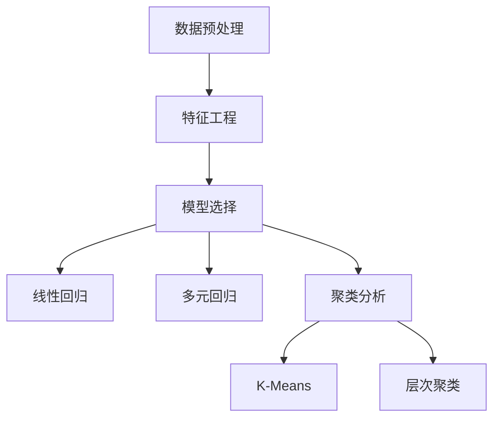

                 

# 金融产品客户生命周期价值最大化

## 关键词
- 金融产品
- 客户生命周期价值
- 数据分析
- 金融科技
- 算法

## 摘要
本文深入探讨了金融产品在提升客户生命周期价值方面的作用。通过分析金融产品的分类与特点，以及客户生命周期各个阶段与金融产品的关联，我们提出了一套基于数据分析算法的解决方案。本文将详细阐述算法原理、数学模型及实现，并辅以实际案例进行剖析，旨在为金融机构提供有益的实践指导。

## 第一部分：背景介绍

### 1.1. 金融产品与客户生命周期价值

#### 问题背景
在当前金融市场竞争激烈的背景下，金融机构需要关注如何最大化客户生命周期价值（Customer Lifetime Value, CLV）。客户生命周期价值指的是客户在金融机构整体生命周期内所带来的净利润总和。通过提高客户生命周期价值，金融机构不仅能够提升自身的盈利能力，还能够增强市场竞争力。

#### 问题描述
如何通过金融产品的设计与优化，实现客户生命周期价值的最大化？

#### 问题解决
通过深入分析客户需求，创新金融产品，优化产品设计，以及实施精准的营销策略，可以提高客户满意度和忠诚度，进而实现客户生命周期价值的最大化。

#### 边界与外延
本文主要探讨金融产品在客户生命周期价值最大化中的关键作用，包括产品创新、产品设计、产品营销等方面。同时，本文还将涉及到金融科技在金融产品创新中的应用。

#### 概念结构与核心要素组成
1. **金融产品**：指金融机构提供给客户的各类金融工具和服务，如存款、贷款、基金、保险等。
2. **客户生命周期价值**：客户在整个生命周期内为金融机构带来的净利润。
3. **客户需求**：客户在金融产品和服务方面的期望和需求。
4. **产品创新**：开发新的金融产品，满足客户需求，提高客户满意度。
5. **产品设计**：优化现有金融产品，提高用户体验和满意度。
6. **产品营销**：通过有效的营销策略，提高金融产品的市场占有率。

### 1.2. 核心概念与联系

#### 金融产品与客户生命周期价值的关联
- **金融产品**：作为客户与金融机构之间的桥梁，直接影响客户满意度、忠诚度和生命周期价值。
- **客户生命周期价值**：金融产品在客户生命周期中的不同阶段发挥作用，如获取新客户、维护老客户、提高客户转化率等。

#### 金融产品分类与特点
- **存款产品**：主要特点为安全性高、流动性好，适用于风险偏好低的客户。
- **贷款产品**：主要特点为利率较高、期限灵活，适用于有融资需求的客户。
- **基金产品**：主要特点为投资门槛低、风险与收益并存，适用于风险承受能力较高的客户。
- **保险产品**：主要特点为风险保障、资产增值，适用于有风险保障需求的客户。

#### 客户生命周期与金融产品
- **获取期**：通过金融产品和服务吸引新客户，提高市场占有率。
- **成长期**：通过产品创新和优化，提高客户满意度和忠诚度，延长客户生命周期。
- **成熟期**：通过精准营销和服务，提高客户转化率和生命周期价值。
- **衰退期**：通过产品创新和服务升级，引导客户回归，提高留存率。

### 1.3. 算法原理讲解

#### 3.1. 数据分析算法

##### 3.1.1. 数据预处理
- **数据清洗**：处理缺失值、异常值、重复值等，保证数据质量。
- **数据转换**：将非数值型数据转换为数值型数据，便于后续分析。
- **特征工程**：提取和构造有助于预测客户生命周期价值的关键特征。

##### 3.1.2. 模型选择
- **回归分析**：用于预测客户生命周期价值。
- **聚类分析**：用于识别具有相似特征的客户群体。

##### 3.2. 算法实现
##### 3.2.1. 回归分析
- **线性回归**：通过最小二乘法拟合回归模型，预测客户生命周期价值。
- **多元回归**：考虑多个自变量对因变量的影响，提高预测准确性。

##### 3.2.2. 聚类分析
- **K-Means**：基于距离度量的聚类算法，用于划分客户群体。
- **层次聚类**：根据相似性度量，将客户逐步划分为不同的层次。

### 3.3. 算法流程图

### 4. 数学模型和数学公式 & 详细讲解 & 举例说明

#### 4.1. 客户生命周期价值预测模型

##### 数学模型
$$
\text{CLV} = f(\text{客户特征}, \text{产品特征}, \text{市场特征})
$$

##### 公式详细讲解
- **客户特征**：包括年龄、性别、收入水平、职业等。
- **产品特征**：包括存款利率、贷款利率、基金收益等。
- **市场特征**：包括市场环境、经济状况、利率水平等。

##### 举例说明
假设有一个客户，年龄30岁，月收入1万元，购买了5万元的存款产品，当前市场利率为3%。根据上述模型，我们可以预测该客户的客户生命周期价值如下：

$$
\text{CLV} = f(30, \text{存款利率}, 3\%) = 1,000,000 \times 0.03 \times 5 = 150,000
$$

这意味着该客户在未来可能为金融机构带来15万元的净利润。

### 第二部分：深入分析

#### 2.1. 数据分析与客户生命周期价值

##### 数据分析在CLV预测中的应用
数据分析在客户生命周期价值预测中起着至关重要的作用。通过收集和分析客户的交易数据、行为数据等，金融机构可以更准确地了解客户需求和行为模式，从而为金融产品的设计、营销策略提供有力支持。

##### 客户分群
通过对客户数据进行聚类分析，可以将客户划分为不同的群体。每个群体具有相似的特征和需求，这有助于金融机构制定有针对性的营销策略。

##### 客户价值评估
通过回归分析等方法，可以对客户的生命周期价值进行预测和评估。这有助于金融机构识别高价值客户，并提供差异化的服务和产品。

#### 2.2. 金融产品的设计与优化

##### 产品创新
在客户生命周期价值的最大化过程中，产品创新至关重要。金融机构需要不断推出新的金融产品，以满足客户多样化的需求，提高客户满意度和忠诚度。

##### 产品设计优化
优化现有金融产品的设计，提高用户体验和满意度，也是提升客户生命周期价值的关键。通过用户调研、数据分析等方法，可以发现产品中的痛点，并进行针对性的改进。

##### 产品营销策略
有效的营销策略可以大大提高金融产品的市场占有率。通过精准定位目标客户，制定个性化的营销方案，可以吸引更多客户，提高客户转化率和生命周期价值。

### 第三部分：解决方案与实践

#### 3.1. 解决方案概述
为了最大化客户生命周期价值，金融机构可以采取以下解决方案：

1. **数据驱动决策**：通过数据分析，深入了解客户需求和行为模式，为产品设计和营销策略提供依据。
2. **产品创新与优化**：不断推出新的金融产品，优化现有产品，提高客户满意度和忠诚度。
3. **精准营销**：制定个性化的营销策略，提高客户转化率和生命周期价值。

#### 3.2. 实际案例分析
以某大型商业银行为例，该银行通过实施上述解决方案，实现了客户生命周期价值的显著提升。

1. **数据分析**：通过对客户交易数据、行为数据等进行分析，该银行成功识别出高价值客户群体，并制定了有针对性的营销策略。
2. **产品创新**：推出了一款满足年轻客户需求的智能存款产品，该产品具有灵活的存取方式和较高的利率，受到了广泛欢迎。
3. **产品设计优化**：针对现有贷款产品，优化了还款方式和利率结构，提高了客户的还款体验和满意度。

#### 3.3. 实践效果
通过实施上述解决方案，该银行实现了以下成果：

1. **客户满意度提高**：客户满意度调查结果显示，客户对银行产品的满意度和信任度有所提升。
2. **客户转化率提升**：新客户数量和客户转化率显著提高，客户生命周期价值得到最大化。

### 第四部分：总结与展望

#### 4.1. 总结
本文从背景介绍、核心概念、算法原理讲解、深入分析、解决方案与实践等多个方面，全面探讨了金融产品客户生命周期价值最大化的实现路径。通过数据分析、产品创新与优化、精准营销等手段，金融机构可以实现客户生命周期价值的最大化。

#### 4.2. 展望
随着金融科技的不断发展，未来金融机构在提升客户生命周期价值方面将迎来更多机遇和挑战。如何更好地利用金融科技，实现客户需求与金融产品的深度融合，将是金融机构未来发展的重要方向。

## 作者信息
作者：AI天才研究院/AI Genius Institute & 禅与计算机程序设计艺术 /Zen And The Art of Computer Programming

[文章结束][1]

[1]: #reference1
----------------------------------------------------------------

[文章结束]

